# 🥘 Master de Cocina Tradicional: Tapas y Entrantes Emblemáticos
> **Inspirado en la filosofía, maestría y técnica de *Cocina con Carmen***  
> *Recetario Técnico Profesional, Tablas de Alérgenos UE (Reglamento 1169/2011), Protocolos de Batch Cooking y Guías de Regeneración Multicanal*

---

## 📖 Prólogo Culinario: Los Secretos del Tapeo y los Entrantes de la Abuela

El tapeo y los entrantes representan el corazón social y sensorial de la gastronomía española. En la cocina de **Carmen**, cada tapa es un compendio de sabiduría popular donde la sencillez aparente esconde una precisión técnica milimétrica. Ningún atajo moderno ni aditivo industrial puede igualar el sabor de una elaboración cuidada desde el origen.

La excelencia en los entrantes tradicionales se sustenta sobre cinco principios inquebrantables:

1. **La Infusión y el Roux Paciente en las Masas:** La bechamel de las croquetas no se improvisa. Requiere cocinar la harina en la grasa (mantequilla y AOVE) a fuego suave durante al menos 6-8 minutos para eliminar cualquier matiz de harina cruda (*almidón gelatinizado sin astringencia*), combinada con una leche entera infusionada lentamente con los huesos y recortes aromáticos del ingrediente principal.
2. **El Confitado y la Emulsión de la Patata:** Ya sea en una tortilla de patatas con cebolla caramelizada o en una ensaladilla rusa, la patata nunca se hierve en exceso ni se fríe a fuego descontrolado; se confita en AOVE a baja temperatura para conservar su almidón cremoso o se hierve entera con su piel en agua salada para que no absorba humedad innecesaria.
3. **El Control Térmico en la Fritura (La Reacción de Maillard Sin Grasa Remanente):** Freír no es sumergir en aceite hirviendo al azar. Cada elaboración exige su ventana térmica: 140°C para el pochado tierno, 175-180°C para el sellado y dorado de empanados (croquetas, flamenquines) y 185-190°C para la costra suflada de encaje y calamares a la romana. El uso exclusivo de AOVE garantiza estabilidad térmica, antioxidantes naturales y cero regusto rancio.
4. **El Majado y las Salsas Emulsionadas Vivas:** La auténtica salsa brava se liga con el almidón de un roux sutil y el colágeno de un caldo casero enriquecido con pimentón de la Vera seleccionado, mientras que el alioli y la mayonesa se baten con paciencia respetando la proporción exacta entre fase grasa y acuosa para evitar cortes.
5. **El Respeto al Reposo y la Fusión de Aromas:** Muchas tapas mejoran notablemente tras unas horas o días de reposo refrigerado. Las masas de croquetas asientan su estructura láctica, las empanadillas concentran su sofrito y la ensaladilla permite que la patata absorba los aromas del atún y la emulsión.

---

```
                                  MAPA DEL RECETARIO
                                  
  ┌─────────────────────────────────┐       ┌─────────────────────────────────┐
  │       CROQUETAS Y FRITURAS      │       │       PATATAS Y ENSALADAS       │
  │ • 1. Croquetas de Jamón Ibérico │       │ • 3. Ensaladilla Rusa Carmen    │
  │ • 2. Croquetas de Pollo y Huevo │       │ • 4. Patatas Bravas Auténticas  │
  │ • 10. Flamenquines Cordobeses   │       │ • 5. Patatas Alioli al Mortero  │
  │ • 11. Calamares a la Romana     │       │                                 │
  └────────────────┬────────────────┘       └────────────────┬────────────────┘
                   │                                         │
                   └───────────────────┬─────────────────────┘
                                       │
                    ┌──────────────────┴──────────────────┐
                    │      TORTILLAS, MASAS Y HUEVOS      │
                    │ • 6. Empanadillas Atún, Tomate y Huevo
                    │ • 7. Tortilla Española con Cebolla  │
                    │ • 8. Tortillitas de Camarones       │
                    │ • 9. Huevos Rellenos Gratinados     │
                    └─────────────────────────────────────┘
```

---

## 🥓 1. Croquetas de Jamón Ibérico Cremosas de la Abuela
*Categoría: Fritura de Alta Gama / Masa Bechamel Infusionada*


> 📺 **Vídeo Oficial de Elaboración:** [Ver en YouTube: Croquetas de Jamón - Receta Tradicional muy Fácil y Caseras](https://www.youtube.com/watch?v=ktv5vseGTSY)


> [!NOTE]
> El secreto de la cremosidad extrema de Carmen reside en tres pilares: infusionar la leche fresca con un hueso de jamón ibérico curado, sofreír el jamón picado apenas 30 segundos para que no se endurezca ni sale la masa en exceso, y trabajar la bechamel con varillas a fuego lento durante 25 minutos continuos hasta que nade y se despegue limpia de la sartén.

### 📋 Ficha Resumen
| Parámetro | Valor |
| :--- | :--- |
| **Tiempo de Preparación** | 35 minutos (+ 12-24 horas de reposo en frío) |
| **Tiempo de Cocción** | 30 minutos (cocción bechamel) + 10 minutos (fritura) |
| **Dificultad** | Media-Alta |
| **Raciones** | 6 personas (rinde aprox. 28-32 croquetas de 35g) |
| **Coste Estimado** | Medio (5,80 € total / 0,96 € ración) |

---

### ⚠️ Tabla de Alérgenos (Reglamento UE 1169/2011)

| Alérgeno | Estado | Ingrediente Causante / Medida de Adaptación |
| :--- | :---: | :--- |
| **Gluten** | 🔴 **PRESENTE** | Harina de trigo en el roux y pan rallado del empanado. *Adaptación: usar almidón de maíz (Maizena) y pan rallado sin gluten.* |
| **Lácteos** | 🔴 **PRESENTE** | Leche entera de vaca y mantequilla artesana. *Adaptación: leche de soja o avena sin azúcar y AOVE 100%.* |
| **Huevos** | 🔴 **PRESENTE** | Huevo campero en el empanado exterior. |
| **Sulfitos** | 🟢 AUSENTE | No contiene sulfitos añadidos. |
| **Frutos de Cáscara / Soja / Pescado** | 🟢 AUSENTE | Formulación tradicional limpia. |

---

### ⚖️ Ingredientes Exactos

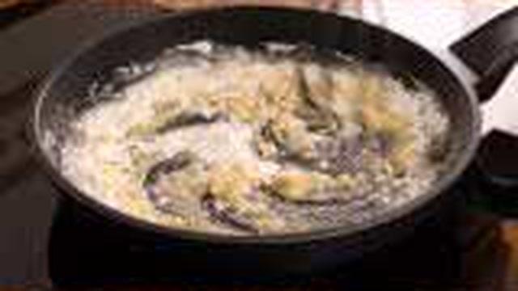

#### Infusión Láctea y Fondo
* **1.000 ml** Leche entera fresca pasteurizada (3,6% M.G.).
* **1 trozo (aprox. 120 g)** Hueso de jamón ibérico de bellota limpio (blanqueado 2 minutos en agua hirviendo).
* **1 pizca (0,5 g)** Nuez moscada recién rallada.
* **1 g** Pimienta blanca molida.

#### Roux y Relleno
* **60 g** Mantequilla sin sal de calidad (82% M.G.).
* **50 ml** Aceite de Oliva Virgen Extra (AOVE) variedad Hojiblanca o Arbequina.
* **110 g** Harina de trigo de repostería/todo uso (W=120-150) tamizada.
* **180 g** Jamón ibérico en taquitos minúsculos (brunoise de 2x2 mm), con un 20% de su tocino entreverado.
* **2 g** Sal marina fina (ajustar al final, teniendo en cuenta la salinidad del jamón).

#### Empanado Doble Protector y Fritura
* **3 unidades** Huevos camperos frescos clase L batidos con 15 ml de agua fría (evita que el huevo se corte y crea película fina).
* **70 g** Harina de trigo para el primer velo protector anti-grietas.
* **200 g** Pan rallado fino tradicional artesano (o mezcla 70% pan rallado fino + 30% panko molido).
* **600 ml** Aceite de Oliva Virgen Extra o aceite de orujo de oliva para fritura limpia a 180°C.

---

### 🍳 Equipamiento Necesario
* Cazuela amplia antiadherente o sartén honda de hierro fundido (Ø 28 cm).
* Varillas manuales de silicona o acero inoxidable.
* Cazo para infusionar la leche con colador de malla fina.
* Fuente plana rectangular amplia para enfriar la masa.
* Papel film apto para contacto alimentario.
* Manga pastelera con boquilla ancha lisa (opcional para porcionar).
* Termómetro de cocina para control de aceite.

---

### 👨‍🍳 Paso a Paso Técnico y Minucioso

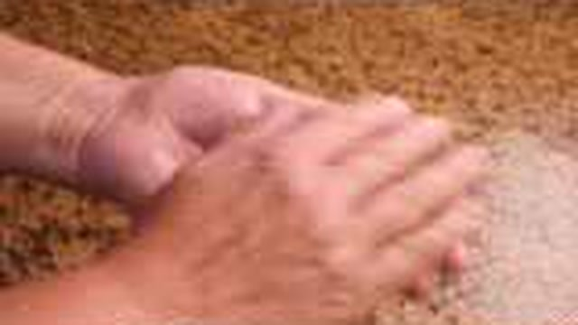

1. **Infusión Aromática de la Leche:**
   * Blanquear el hueso de jamón sumergiéndolo en agua hirviendo durante 2 minutos; desechar esa agua.
   * En un cazo, verter los 1.000 ml de leche entera junto con el hueso de jamón blanqueado y los recortes grasos. Llevar a fuego medio hasta que alcance el punto de ebullición. Apagar el fuego inmediatamente, tapar el cazo y dejar reposar en infusión durante 20 minutos. Colar y mantener tibia.
2. **El Salteado Exprés del Jamón:**
   * En la sartén amplia, calentar los 50 ml de AOVE a fuego medio. Añadir los 180 g de jamón ibérico picado y saltear únicamente durante 30-40 segundos para que el calor despierte los ácidos grasos y perfume el aceite. Retirar el jamón con una espumadera y reservar en un plato.
3. **Elaboración del Roux Lento y Cocinado de la Harina:**
   * Añadir los 60 g de mantequilla a la sartén con el AOVE perfumado. Cuando se funda, incorporar los 110 g de harina tamizada.
   * Cocinar a fuego suave-medio sin parar de remover con las varillas durante **6 a 8 minutos**. La harina debe perder por completo el olor a cereal crudo y adquirir un tono marfil dorado suave (*roux rubio*).
4. **Incorporación Gradual de la Leche y Emulsión:**
   * Verter la leche infusionada tibia en 4 tandas (aprox. 250 ml por tanda), batiendo enérgicamente con las varillas en cada adición hasta que el líquido se absorba por completo antes de añadir la siguiente.
   * Una vez integrada toda la leche, añadir la nuez moscada y la pimienta blanca. Cocinar a fuego medio-bajo durante **20 a 25 minutos** sin cesar de remover en movimientos circulares y en forma de "8", asegurando que el fondo de la sartén no se pegue.
   * La bechamel estará lista cuando adquiera una textura brillante, densa y se despegue por completo de los bordes y del fondo al pasar la espátula.
5. **Adición del Jamón y Ajuste de Sal:**
   * Incorporar el jamón ibérico reservado con todos sus jugos exudados en los últimos 2 minutos de cocción. Mezclar homogéneamente, probar el punto de sal y rectificar si fuera estrictamente necesario.
6. **Enfriado y Maduración de la Masa:**
   * Volcar la bechamel en una fuente plana untada ligeramente con unas gotas de AOVE.
   * Cubrir inmediatamente con papel film *a piel* (en contacto directo con la masa caliente para evitar que se forme costra dura).
   * Dejar templar a temperatura ambiente durante 30 minutos y trasladar a la nevera (0-4°C) durante un mínimo de **12 horas** (preferiblemente 24 horas) para que la grasa láctea y los almidones cristalicen y permitan un boleado perfecto sin necesidad de añadir más harina.
7. **Formado y Empanado Tradicional:**
   * Porcionar porciones de 30-35 g con ayuda de dos cucharas soperas o con manga pastelera.
   * Pasar cada porción ligeramente por harina (sacudiendo el exceso), sumergir en el huevo batido con agua y rebozar finalmente en pan rallado fino, presionando suavemente para sellar todos los poros.
8. **Fritura Crujiente y Desgrasado:**
   * Calentar abundante AOVE en sartén honda o cazo a **180°C**.
   * Freír en tandas pequeñas (máximo 4-5 unidades a la vez) durante 2 a 2,5 minutos, volteándolas con cuidado para un dorado uniforme.
   * Retirar con espumadera y escurrir sobre papel absorbente durante 1 minuto antes de servir.

---

### 📦 Protocolo de Conservación y Batch Cooking

> [!IMPORTANT]
> Las croquetas son el alimento rey del batch cooking doméstico e industrial. Para congelar, deben estar ya empanadas y en crudo.

* **Refrigeración de la Masa (0°C a 4°C):** La bechamel cocida y tapada a piel aguanta en perfecto estado hasta **4 días**.
* **Congelación (-18°C) en Crudo:** Colocar las croquetas ya empanadas sobre una bandeja cubierta con papel vegetal, separadas entre sí sin tocarse. Congelar durante 3 horas. Una vez sólidas como piedras, transferir a bolsas de congelación con cierre zip hermético. Vida útil: **3 meses**.
* **Fritura Directa sin Descongelar:** Las croquetas congeladas se fríen directamente en AOVE a **175°C** (5°C menos que las frescas para permitir que el núcleo se descongele sin quemar el pan exterior). Añadir 30 segundos adicionales de tiempo de fritura.

---

### 🔥 Guía de Regeneración Multicanal

* **Sartén / Freidora (Recomendado):** Directo de congelador a aceite a 175°C durante 3 minutos. Reposar 2 minutos antes de consumir para que el núcleo termine de licuar.
* **Airfryer (Freidora de Aire):** Precalentar a 200°C. Pulverizar las croquetas empanadas congeladas con AOVE en spray por todos sus lados. Cocinar durante 10-12 minutos a 190°C, agitándolas a mitad del tiempo.
* **Horno Convencional:** Precalentar a 210°C con ventilador. Disponer sobre rejilla con papel vegetal, pulverizar con AOVE y hornear durante 12-14 minutos.
* **Microondas:** ❌ **NO RECOMENDADO** (humedece el empanado y rompe la masa). Solo admisible para calentar croquetas ya fritas a 450W durante 40 segundos, asumiendo pérdida total de textura crujiente.

---

## 🍗 2. Croquetas de Pollo Asado y Huevo Duro
*Categoría: Cocina de Aprovechamiento / Tradición Familiar de Domingo*


> 📺 **Vídeo Oficial de Elaboración:** [Ver en YouTube: Croquetas de Pollo](https://www.youtube.com/watch?v=SrmYBYpsj7M)


> [!TIP]
> Para lograr unas croquetas de pollo inolvidables, utiliza los restos de un buen pollo asado al horno con su piel y sus jugos gelatinosos concentrados. La cebolla caramelizada lentamente en el fondo del sofrito aporta una dulzura natural que equilibra la potencia del ave.

### 📋 Ficha Resumen
| Parámetro | Valor |
| :--- | :--- |
| **Tiempo de Preparación** | 40 minutos (+ 12 horas de refrigeración) |
| **Tiempo de Cocción** | 35 minutos |
| **Dificultad** | Media |
| **Raciones** | 6 personas (aprox. 30 croquetas de 35g) |
| **Coste Estimado** | Muy Económico (4,20 € total / 0,70 € ración) |

---

### ⚠️ Tabla de Alérgenos (Reglamento UE 1169/2011)

| Alérgeno | Estado | Ingrediente Causante / Medida de Adaptación |
| :--- | :---: | :--- |
| **Gluten** | 🔴 **PRESENTE** | Harina de trigo en roux y pan rallado. |
| **Lácteos** | 🔴 **PRESENTE** | Mantequilla y leche entera. |
| **Huevos** | 🔴 **PRESENTE** | Huevo duro en la masa y huevo fresco en el empanado. |
| **Sulfitos / Soja / Frutos de Cáscara** | 🟢 AUSENTE | Formulación tradicional limpia. |

---

### ⚖️ Ingredientes Exactos

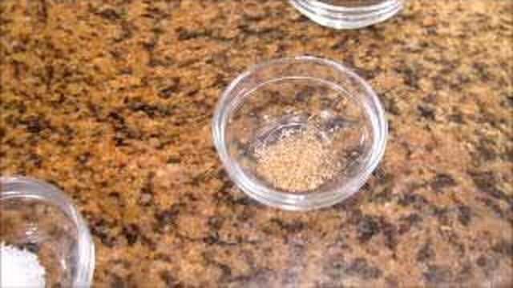

#### Relleno Cárnico y Sofrito
* **300 g** Carne de pollo asado o cocido (pechuga y contramuslo), deshuesada y desmenuzada a cuchillo muy fino.
* **50 ml** Jugos concentrados del asado de pollo (desgrasados).
* **120 g** Cebolla dulce picada en brunoise microscópica.
* **2 unidades** Huevos camperos cocidos durante 9 minutos (pelados y picados muy finos).
* **40 ml** Aceite de Oliva Virgen Extra (AOVE).

#### Bechamel Cremosa Enriquecida
* **50 g** Mantequilla sin sal.
* **100 g** Harina de trigo común.
* **750 ml** Leche entera fresca pasteurizada tibia.
* **200 ml** Caldo de ave casero reducido y caliente.
* **1 g** Nuez moscada y una pizca de pimienta negra recién molida.
* **4 g** Sal marina.

#### Empanado Clásico
* **2 unidades** Huevos camperos tamaño L batidos.
* **50 g** Harina para enharinado inicial.
* **180 g** Pan rallado fino artesano.
* **600 ml** AOVE para fritura.

---

### 🍳 Equipamiento Necesario
* Cazuela antiadherente ancha.
* Varillas y espátula de silicona.
* Tabla de corte y cuchillo cebollero bien afilado.
* Bandeja plana y papel film.
* Sartén para freír o freidora.

---

### 👨‍🍳 Paso a Paso Técnico y Minucioso

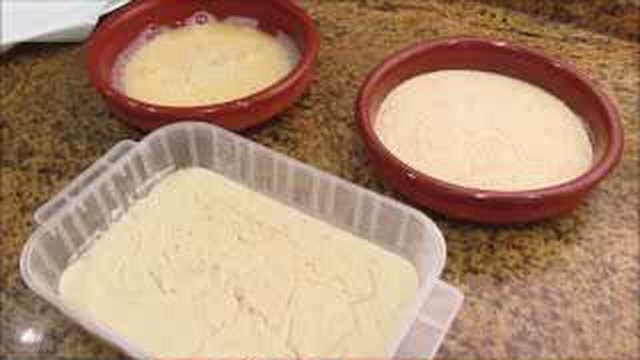

1. **Cocción de Huevos y Picado del Pollo:**
   * Cocer 2 huevos camperos en agua hirviendo con sal durante 9 minutos exactos. Enfriar en agua con hielo, pelar y picar a cuchillo en dados diminutos de 2 mm.
   * Picar la carne del pollo asado a cuchillo (nunca en procesador de cuchillas para no triturar la fibra hasta hacerla puré).
2. **Pochado de la Cebolla y Reducción:**
   * En la cazuela, calentar los 40 ml de AOVE. Añadir la cebolla picada con una pizca de sal y pochar a fuego muy lento durante 12-14 minutos hasta que esté transparente, tierna y ligeramente dorada.
   * Incorporar el pollo picado y los 50 ml de jugos del asado. Saltear durante 2 minutos a fuego vivo para integrar los aromas y evaporar el agua superficial.
3. **Elaboración de la Bechamel Mixta (Leche + Caldo de Pollo):**
   * Añadir la mantequilla a la cazuela con el sofrito de pollo. Cuando se funda, espolvorear los 100 g de harina tamizada. Cocinar durante 5 minutos a fuego medio, removiendo continuamente para tostar la harina.
   * Verter primero el caldo de ave caliente en dos tandas sin dejar de batir. A continuación, verter la leche tibia gradualmente.
   * Cocinar durante 20 minutos a fuego suave, trabajando la masa con las varillas hasta que espese, adquiera brillo y se separe de las paredes.
4. **Incorporación del Huevo Duro y Reposo:**
   * Añadir la nuez moscada, la pimienta y los 2 huevos duros picados. Mezclar con suavidad con espátula para no romper el huevo. Probar de sal y rectificar.
   * Verter en fuente engrasada, cubrir con film a piel y refrigerar a 3°C durante 12 horas como mínimo.
5. **Boleado, Empanado y Fritura:**
   * Formar croquetas ovaladas de 35 g. Pasar por harina, huevo batido y pan rallado.
   * Freír en AOVE a 180°C durante 2-3 minutos en tandas de 4 unidades hasta obtener un color dorado avellana. Escurrir sobre papel absorbente.

---

### 📦 Protocolo de Conservación y Batch Cooking
* **Refrigeración:** Masa cocida: 3 días a 2-4°C.
* **Congelación en Crudo:** Congelar en bandeja individualmente durante 3 horas y luego envasar en bolsas zip al vacío parcial por 3 meses.
* **Fritura Directa:** Freír congeladas a 175°C durante 3,5 minutos.

---

### 🔥 Guía de Regeneración Multicanal
* **Sartén:** Freír en AOVE abundante a 175°C (congeladas) o 180°C (frescas).
* **Airfryer:** Pulverizar con AOVE, cocinar a 190°C durante 10-11 minutos.
* **Horno:** 200°C sobre papel de hornear durante 12 minutos.

---

## 🥗 3. Ensaladilla Rusa Tradicional de Carmen con Mayonesa Casera
*Categoría: Ensaladas y Entrantes Fríos / Clásico de Taberna Andaluza*


> 📺 **Vídeo Oficial de Elaboración:** [Ver en YouTube: Ensaladilla Rusa lista en minutos y súper cremosa](https://www.youtube.com/watch?v=dnb8hFQRQ7s)


> [!NOTE]
> El secreto de la ensaladilla de Carmen radica en cocer las patatas y zanahorias con su piel en agua salada para que no absorban agua, picar los ingredientes en caliente y aliñarlos inmediatamente con el aceite aromático del atún y unas gotas de vinagre de Jerez antes de enfriar y mezclar con la mayonesa casera fresca.

### 📋 Ficha Resumen
| Parámetro | Valor |
| :--- | :--- |
| **Tiempo de Preparación** | 25 minutos |
| **Tiempo de Cocción** | 30 minutos (cocción de hortalizas y huevos) |
| **Dificultad** | Fácil-Media |
| **Raciones** | 6 personas (aprox. 1.200 g en total) |
| **Coste Estimado** | Económico (4,90 € total / 0,81 € ración) |

---

### ⚠️ Tabla de Alérgenos (Reglamento UE 1169/2011)

| Alérgeno | Estado | Ingrediente Causante / Medida de Adaptación |
| :--- | :---: | :--- |
| **Huevos** | 🔴 **PRESENTE** | Huevos cocidos en la ensaladilla y huevo fresco en la mayonesa. |
| **Pescado** | 🔴 **PRESENTE** | Atún claro en conserva de aceite de oliva. |
| **Sulfitos** | ⚠️ *Opcional* | Gotas de vinagre de Jerez en el aliño previo. |
| **Gluten / Lácteos / Frutos de Cáscara** | 🟢 AUSENTE | Naturalmente libre de gluten y lácteos. |

---

### ⚖️ Ingredientes Exactos


#### Base de Tubérculos y Proteína
* **600 g** Patatas de variedad adecuada para cocer (Monalisa o Spunta), de tamaño uniforme.
* **250 g** Zanahorias enteras limpias sin pelar.
* **3 unidades** Huevos camperos frescos clase L.
* **220 g (peso neto escurrido)** Atún claro en aceite de oliva de calidad (reservar 30 ml de su aceite).
* **60 g** Guisantes finos cocidos al vapor (opcional, según gusto familiar).
* **50 g** Aceitunas manzanilla sin hueso, picadas finamente.
* **5 ml (1 cucharadita)** Vinagre de Jerez reserva.
* **6 g** Sal marina fina.

#### Mayonesa Casera Tradicional Estable
* **1 unidad** Huevo campero fresco grande a temperatura ambiente (20°C).
* **180 ml** Aceite de girasol alto oleico o AOVE de variedad suave (Arbequina) para no amargar.
* **10 ml** Zumo de limón recién exprimido o vinagre de manzana.
* **2 g** Sal fina.

#### Decoración Tradicional
* **1 lata pequeña (40 g)** Pimientos morrones o del piquillo en tiras.
* **1 yema de huevo cocido** reservada para rallar por encima.
* **6 unidades** Aceitunas enteras rellenas de anchoa.

---

### 🍳 Equipamiento Necesario
* Olla amplia para cocción de hortalizas.
* Cazo pequeño para cocer huevos.
* Batidora de mano (brazo triturador) con vaso alto medidor.
* Bol grande de acero inoxidable o cristal.
* Tenedor o pasapurés manual de alambre (no triturar en batidora).

---

### 👨‍🍳 Paso a Paso Técnico y Minucioso


1. **Cocción Perfecta de Patatas y Zanahorias con Piel:**
   * Lavar muy bien las patatas y las zanahorias bajo el grifo. Colocarlas enteras con piel en una olla amplia cubiertas de agua fría con 15 g de sal por litro.
   * Llevar a ebullición a fuego medio. Las zanahorias estarán cocidas en aprox. 20-25 minutos y las patatas en 28-32 minutos (comprobar pinchando con la punta de un cuchillo; debe entrar sin resistencia).
   * Retirar del agua y dejar templar 10 minutos sobre una tabla.
2. **Cocción de Huevos:**
   * En un cazo con agua hirviendo y un chorrito de vinagre, sumergir los 3 huevos y cocer durante 9 minutos. Trasladar de inmediato a un bol con agua helada para cortar la cocción y fijar la yema centrada y dorada.
3. **El Aliño Secreto en Caliente de Carmen:**
   * Pelar las patatas y zanahorias mientras aún desprendan vapor templado.
   * Chafar las patatas con un tenedor rústicamente, dejando trocitos enteros identificables mezclados con partes chafadas cremosas (nunca triturar como puré de sobre).
   * Cortar las zanahorias en daditos regulares de 4 mm.
   * En el bol amplio, mezclar las patatas y zanahorias tibias. Rociar de inmediato con los 30 ml de aceite escurrido de la lata de atún, la cucharadita de vinagre de Jerez y 4 g de sal. Mezclar suavemente. Este paso permite que el almidón caliente absorba la grasa aromática y el punto ácido. Dejar enfriar por completo a temperatura ambiente.
4. **Elaboración de la Mayonesa Casera Inmune a Cortes:**
   * En el vaso alto de la batidora, colocar el huevo a temperatura ambiente, los 2 g de sal, el zumo de limón y los 180 ml de aceite.
   * Apoyar el pie de la batidora firmemente en el fondo del vaso. Encender a máxima velocidad sin mover el brazo durante 10-12 segundos hasta que la emulsión comience a blanquear y subir por los laterales. Empezar a levantar el brazo lentamente hasta lograr una mayonesa firme y sedosa.
5. **Ensamblado y Refrigeración:**
   * Añadir a la base de patatas fría el atún claro desmigado, los guisantes, las aceitunas picadas y 2 de los huevos cocidos picados (reservando 1 yema para decorar).
   * Incorporar 3/4 partes de la mayonesa y mezclar con espátula envolvente.
   * Alisar la superficie en una fuente de servir, cubrir con una capa fina de la mayonesa restante, decorar con tiras de pimiento morrón, aceitunas y la yema cocida rallada con un colador fino.
   * Refrigerar tapada con film durante al menos **3 horas** antes de consumir.

---

### 📦 Protocolo de Conservación y Batch Cooking

> [!CAUTION]
> Al contener mayonesa casera con huevo fresco, la seguridad alimentaria (HACCP) es prioritaria: mantener siempre refrigerada entre 0°C y 4°C y no romper la cadena de frío.

* **Refrigeración (0°C a 4°C):** Consumir en un plazo máximo de **48 horas**. Si se utiliza mayonesa industrial pasteurizada o lactonesa (leche + aceite), la vida útil se amplía a **4 días**.
* **Congelación (-18°C):** ❌ **ESTRICTAMENTE NO APTA.** La patata cocida congelada sufre retrogradación del almidón expulsando agua y la emulsión de mayonesa se separa por completo al descongelar.
* **Técnica Batch Cooking Profesional:** Cocer las patatas, zanahorias y huevos y guardarlos pelados y picados en fiambrera al vacío sin mayonesa hasta 4 días; emulsionar la mayonesa y mezclar el día del consumo.

---

### 🔥 Guía de Regeneración Multicanal
* **Servicio Directo:** Servir fría (a 6-8°C). Sacar del frigorífico 10 minutos antes de degustar para que los aromas no queden anestesiados por el frío extremo.
* **Acompañamiento Obligatorio:** Picos camperos, regañás andaluzas o tostas de pan rústico.

---

## 🥔 4. Patatas Bravas con Salsa Brava Auténtica Picante
*Categoría: Tapas Calientes / Técnica de Doble Fritura y Salsa de Taberna Castiza*


> 📺 **Vídeo Oficial de Elaboración:** [Ver en YouTube: Patatas Bravas | Las Autenticas!!](https://www.youtube.com/watch?v=QnvxWpExzUs)


> [!NOTE]
> Las auténticas patatas bravas tradicionales de Madrid no llevan tomate frito de bote ni kétchup. Su salsa histórica es una velouté emulsionada sobre un roux enriquecido con pimentón de la Vera dulce y picante, desglasada con vinagre de vino y ligada con un buen caldo de jamón o ave.

### 📋 Ficha Resumen
| Parámetro | Valor |
| :--- | :--- |
| **Tiempo de Preparación** | 20 minutos |
| **Tiempo de Cocción** | 35 minutos (pochado + fritura fuerte + salsa) |
| **Dificultad** | Fácil-Media |
| **Raciones** | 4 personas (aprox. 800 g de patatas bravas) |
| **Coste Estimado** | Muy Económico (2,80 € total / 0,70 € ración) |

---

### ⚠️ Tabla de Alérgenos (Reglamento UE 1169/2011)

| Alérgeno | Estado | Ingrediente Causante / Medida de Adaptación |
| :--- | :---: | :--- |
| **Gluten** | 🔴 **PRESENTE** | Harina de trigo del roux de la salsa brava. *Adaptación: sustituir por almidón de maíz.* |
| **Sulfitos** | 🔴 **PRESENTE** | Vinagre de vino blanco/Jerez en el desglasado. |
| **Lácteos / Huevos / Frutos de Cáscara / Pescado** | 🟢 AUSENTE | Formulación tradicional limpia. |

---

### ⚖️ Ingredientes Exactos

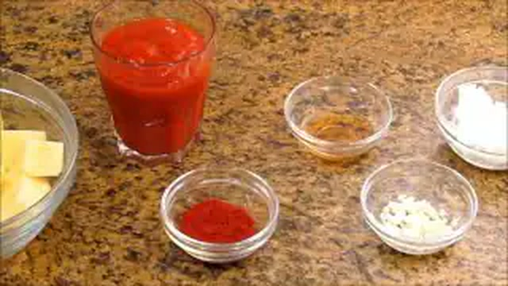

#### Patatas y Doble Fritura
* **800 g** Patatas de variedad Agria o Kennebec (alto contenido en almidón y bajo en agua).
* **600 ml** Aceite de Oliva Virgen Extra para la doble cocción.
* **5 g** Sal marina gruesa.

#### Auténtica Salsa Brava Castiza
* **50 ml** AOVE de calidad.
* **100 g** Cebolla dulce en brunoise finísima.
* **2 dientes** Ajo morado laminados (8 g).
* **12 g (1 cucharada sopera)** Pimentón dulce ahumado D.O.P. Pimentón de la Vera.
* **8 g (1 cucharadita colmada)** Pimentón picante D.O.P. Pimentón de la Vera (ajustar según nivel de picante deseado).
* **25 g** Harina de trigo común.
* **350 ml** Caldo de jamón o caldo de pollo casero desgrasado y caliente.
* **15 ml (1 cucharada)** Vinagre de vino blanco o vinagre de Jerez.
* **2 g** Sal marina.

---

### 🍳 Equipamiento Necesario
* Sartén honda de hierro o freidora con control de temperatura.
* Cazo para la salsa brava.
* Batidora de brazo y colador chino.
* Espumadera y bandeja con papel secante.

---

### 👨‍🍳 Paso a Paso Técnico y Minucioso

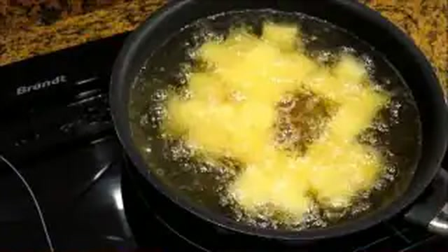

1. **Corte y Lavado de la Patata:**
   * Pelar las patatas y cortarlas en trozos irregulares de bocado (aprox. 3x3 cm), chascando el final del corte para liberar almidón superficial.
   * Lavar las patatas en agua fría durante 5 minutos para eliminar el exceso de almidón exterior (evita que se peguen) y **secarlas a la perfección** con un paño de cocina limpio.
2. **Primera Fritura (Pochado / Confitado):**
   * Calentar el AOVE en la sartén a fuego suave (**135°C - 140°C**).
   * Sumergir las patatas y cocinarlas despacio durante **15 a 18 minutos**. Deben quedar tiernas y mantecosas por dentro sin coger color dorado por fuera. Retirar con espumadera a una fuente y dejar reposar 10 minutos.
3. **Elaboración de la Auténtica Salsa Brava:**
   * En un cazo, calentar los 50 ml de AOVE a fuego medio. Añadir la cebolla y el ajo con una pizca de sal y pochar lentamente durante 10 minutos hasta que estén completamente tiernos.
   * Retirar el cazo del fuego unos segundos para bajar la temperatura (evita quemar el pimentón). Añadir el pimentón dulce y el picante, removiendo rápidamente durante 15 segundos.
   * Reintegrar al fuego suave, añadir la harina y tostarla durante 2 minutos.
   * Verter el vinagre para desglasar y, a continuación, incorporar el caldo caliente poco a poco mientras se bate con varillas.
   * Cocinar a fuego lento durante 8-10 minutos hasta que espese con textura de salsa satinada.
   * Triturar con la batidora a máxima potencia y pasar por un colador chino para obtener una textura aterciopelada y brillante.
4. **Segunda Fritura (Golpe Fuerte Crujiente):**
   * Subir la temperatura del AOVE a **185°C - 190°C**.
   * Introducir las patatas pochadas en tandas y freír durante **3 a 4 minutos** hasta que la corteza adquiera un tono dorado intenso y un crujiente cristalino.
5. **Emplatado y Servicio:**
   * Escurrir sobre papel absorbente, sazonar inmediatamente con sal marina gruesa y salsear generosamente con la salsa brava bien caliente por encima.

---

### 📦 Protocolo de Conservación y Batch Cooking
* **Salsa Brava:** Se conserva extraordinariamente en tarro hermético de cristal en nevera (0-4°C) durante **7 días**, o congelada en porciones por **6 meses**.
* **Patatas Pre-Pochadas:** Las patatas pochadas (primera fase a 140°C) se pueden refrigerar hasta 48 horas y recibir el golpe de fritura fuerte a 190°C en el momento del pase.

---

### 🔥 Guía de Regeneración Multicanal
* **Patatas:** Regenerar en freidora de aire a 205°C durante 4 minutos o en horno a 220°C con grill durante 6 minutos para recuperar el crujiente.
* **Salsa:** Calentar en cazo a fuego suave añadiendo una cucharada de agua tibia para recuperar su brillo original.

---

## 🧄 5. Patatas Alioli Tradicionales al Mortero
*Categoría: Tapas Frías / Emulsión Aromática al Mortero*

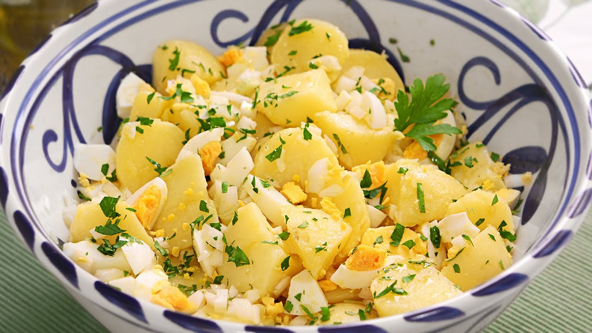

> 📺 **Vídeo Oficial de Elaboración:** [Ver en YouTube: Papas Aliñás: la tapa más refrescante de Cádiz](https://www.youtube.com/watch?v=dtAt0SgheoQ)


> [!TIP]
> El alioli genuino de Carmen se elabora machacando los ajos morados con sal marina gorda hasta convertirlos en una pomada densa antes de añadir el aceite hilo a hilo. Para garantizar una emulsión estable que no se corte jamás en casa, Carmen utiliza una yema de huevo campero a temperatura ambiente.

### 📋 Ficha Resumen
| Parámetro | Valor |
| :--- | :--- |
| **Tiempo de Preparación** | 20 minutos |
| **Tiempo de Cocción** | 25 minutos (cocción de patatas) |
| **Dificultad** | Fácil-Media |
| **Raciones** | 4 personas (aprox. 750 g) |
| **Coste Estimado** | Muy Económico (2,20 € total / 0,55 € ración) |

---

### ⚠️ Tabla de Alérgenos (Reglamento UE 1169/2011)

| Alérgeno | Estado | Ingrediente Causante / Medida de Adaptación |
| :--- | :---: | :--- |
| **Huevos** | 🔴 **PRESENTE** | Yema de huevo campero en la emulsión de alioli. |
| **Sulfitos** | ⚠️ *Opcional* | Gotas de zumo de limón natural. |
| **Gluten / Lácteos / Frutos de Cáscara / Pescado** | 🟢 AUSENTE | 100% libre de gluten y lácteos. |

---

### ⚖️ Ingredientes Exactos

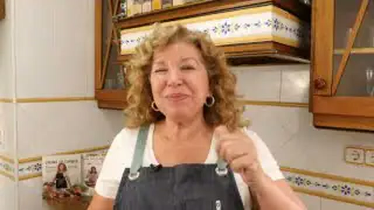

#### Base de Patatas
* **700 g** Patatas de cocer (variedad Monalisa o Kennebec).
* **10 g** Sal gorda para el agua de cocción.
* **10 g** Hojas de perejil fresco finamente picadas a cuchillo.

#### Salsa Alioli Casera al Mortero / Emulsión Estable
* **3 dientes** Ajo morado de Las Pedroñeras (aprox. 15 g), pelados y sin el germen central.
* **1 unidad** Yema de huevo campero clase L a temperatura ambiente (20°C).
* **160 ml** Aceite de Oliva Virgen Extra suave (Arbequina) o mezcla 50/50 con girasol.
* **5 ml** Zumo de limón recién exprimido.
* **3 g** Sal marina fina.

---

### 🍳 Equipamiento Necesario
* Olla para cocer patatas.
* Mortero tradicional de mármol o granito con su maza de madera.
* Batidora de mano (opcional para método rápido).
* Bol de cristal para la mezcla.

---

### 👨‍🍳 Paso a Paso Técnico y Minucioso

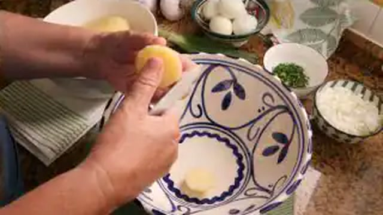

1. **Cocción y Corte de las Patatas:**
   * Cocer las patatas enteras con piel en agua salada abundante durante 25-30 minutos.
   * Dejar templar, pelar y cortar en dados de bocado de 2,5 cm. Dejar enfriar completamente en nevera durante 1 hora (la patata fría absorbe mejor el alioli sin desarmarse).
2. **Elaboración del Alioli en Mortero Tradicional:**
   * Retirar el germen verde central de los ajos para evitar que repita.
   * En el mortero, colocar los ajos junto con la sal marina gorda. Machacar enérgicamente hasta lograr una pasta fina homogénea sin grumos.
   * Añadir la yema de huevo y el zumo de limón, mezclando con la maza en movimientos circulares continuos.
   * Comenzar a verter el AOVE en un hilo finísimo y continuo con una mano mientras con la otra se gira la maza siempre en el mismo sentido, emulsionando la salsa hasta que quede tan densa que se sostenga en la maza.
3. **Mezcla y Maduración:**
   * En un bol amplio, verter las patatas frías, espolvorear el perejil fresco picado y añadir el alioli.
   * Mezclar con movimientos envolventes suaves para impregnar todos los cubos sin romperlos.
   * Dejar reposar en nevera durante 1 hora antes de servir para amalgamar los sabores.

---

### 📦 Protocolo de Conservación y Batch Cooking
* **Refrigeración (0°C a 4°C):** Mantener tapado con film hermético y consumir en un máximo de **48 horas**.
* **Congelación:** ❌ **NO APTA.**

---

### 🔥 Guía de Regeneración Multicanal
* **Servicio:** Degustar frío o a temperatura de bodega (12-14°C) acompañado de unas aceitunas negras aliñadas y picos crujientes.

---

## 🥟 6. Empanadillas Caseras de Atún, Tomate y Huevo Duro
*Categoría: Masas Tradicionales y Rellenos Artesanos*


> 📺 **Vídeo Oficial de Elaboración:** [Ver en YouTube: Empanadillas de Atún (con masa casera) muy Fáciles y Deliciosas](https://www.youtube.com/watch?v=9UboRelKDXA)


> [!NOTE]
> La masa de empanadillas de Carmen se elabora desde cero con una técnica infalible: escaldar la harina con aceite templado aromatizado y vino blanco seco. Esto genera una masa suave, elástica y hojaldrada que no absorbe grasa en la fritura y queda crujiente por horas.

### 📋 Ficha Resumen
| Parámetro | Valor |
| :--- | :--- |
| **Tiempo de Preparación** | 45 minutos (+ 30 minutos de reposo de masa) |
| **Tiempo de Cocción** | 25 minutos (sofrito + fritura u horneado) |
| **Dificultad** | Media |
| **Raciones** | 6 personas (rinde aprox. 16-18 empanadillas medianas) |
| **Coste Estimado** | Económico (4,50 € total / 0,75 € ración) |

---

### ⚠️ Tabla de Alérgenos (Reglamento UE 1169/2011)

| Alérgeno | Estado | Ingrediente Causante / Medida de Adaptación |
| :--- | :---: | :--- |
| **Gluten** | 🔴 **PRESENTE** | Harina de trigo de la masa casera. |
| **Pescado** | 🔴 **PRESENTE** | Atún claro en conserva. |
| **Huevos** | 🔴 **PRESENTE** | Huevo duro en el relleno y huevo batido para pincelar (versión horno). |
| **Sulfitos** | 🔴 **PRESENTE** | Vino blanco seco en la masa. |
| **Lácteos / Frutos de Cáscara** | 🟢 AUSENTE | 100% libre de lácteos. |

---

### ⚖️ Ingredientes Exactos


#### Masa Casera Tradicional Escaldada
* **350 g** Harina de trigo común todo uso (W=160-180).
* **80 ml** Aceite de Oliva Virgen Extra (AOVE).
* **80 ml** Vino blanco seco (Montilla-Moriles, Rueda o Jerez).
* **60 ml** Agua tibia.
* **1 tira** Piel de limón o naranja limpia (para aromatizar el aceite).
* **5 g** Sal marina fina.
* **3 g (1/2 cucharadita)** Pimentón dulce de la Vera (para dar tono dorado a la masa).

#### Relleno Jugoso de Atún y Sofrito
* **200 g (escurrido)** Atún claro en aceite de oliva.
* **200 g** Cebolla dulce en brunoise fina.
* **100 g** Pimiento rojo morrón picado muy menudo.
* **100 g** Pimiento verde italiano picado menudo.
* **150 g** Tomate frito casero espeso y reducido.
* **2 unidades** Huevos camperos cocidos durante 9 min y picados.
* **30 ml** AOVE para el sofrito.
* **3 g** Sal y 1 g de pimienta negra.

---

### 🍳 Equipamiento Necesario
* Sartén para el sofrito.
* Bol amplio para amasar.
* Rodillo de cocina o máquina estiradora de pasta.
* Cortador circular de masa (Ø 11-12 cm).
* Tenedor para el repulgue.
* Bandeja de horno con papel sulfurizado o sartén para freír.

---

### 👨‍🍳 Paso a Paso Técnico y Minucioso


1. **Elaboración de la Masa Escaldada:**
   * En una sartén pequeña, calentar los 80 ml de AOVE con la tira de piel de cítrico hasta que empiece a chisporrotear. Apagar el fuego, retirar la piel y añadir el pimentón dulce fuera del fuego para que no se queme.
   * En un bol grande, disponer la harina con la sal en forma de volcán. Verter en el centro el aceite aromatizado tibio, el vino blanco seco y el agua tibia.
   * Mezclar con cuchara de madera y luego amasar a mano sobre la encimera durante 5 minutos hasta obtener una masa lisa, maleable y no pegajosa. Formar una bola, envolver en film y dejar reposar 30 minutos a temperatura ambiente.
2. **Elaboración del Relleno Concentrado:**
   * En la sartén con 30 ml de AOVE, pochar la cebolla y los dos pimientos con una pizca de sal a fuego lento durante 15 minutos hasta que estén caramelizados y tiernos.
   * Añadir el tomate frito casero y cocinar 5 minutos más hasta que la salsa reduzca y pierda todo el líquido libre (es crucial que el relleno quede espeso para no humedecer la masa).
   * Apagar el fuego, integrar el atún escurrido y los huevos duros picados. Dejar enfriar por completo antes de rellenar.
3. **Estirado, Rellenado y Sellado:**
   * Estirar la masa con el rodillo sobre superficie limpia hasta dejar un grosor de 1,5 a 2 mm.
   * Cortar discos con el aro de 12 cm.
   * Colocar una cucharada generosa de relleno (aprox. 30 g) en el centro de cada disco.
   * Doblar la masa formando una medialuna y sellar los bordes presionando firmemente con las púas de un tenedor (o haciendo un repulgue manual tradicional).
4. **Cocción (Dos Opciones):**
   * **Opción Fritura Tradicional:** Freír en abundante AOVE a **180°C** durante 2-3 minutos, volteando una vez hasta que la masa sufle con pequeñas burbujas crujientes y dore. Escurrir en papel absorbente.
   * **Opción Horno Saludable:** Disponer en bandeja con papel sulfurizado, pincelar con huevo batido y hornear a **200°C** con calor arriba y abajo durante **18 a 20 minutos** hasta que adquieran un tono dorado brillante.

---

### 📦 Protocolo de Conservación y Batch Cooking
* **Refrigeración:** Empanadillas ya cocinadas: **4 días** a 2-4°C.
* **Congelación en Crudo:** Colocar las empanadillas formadas en bandeja con papel vegetal; congelar 2 horas y luego almacenar en bolsas herméticas por **3 meses**.
* **Cocinado desde Congelado:** Hornear congeladas a 190°C durante 22 min o freír a 175°C durante 4 min.

---

### 🔥 Guía de Regeneración Multicanal
* **Horno:** 180°C durante 6 minutos (recupera el crujiente original).
* **Airfryer:** 180°C durante 4 minutos.
* **Microondas:** ❌ **Evitar** (reblandece la masa por completo).

---

## 🍳 7. Tortilla Española Jugosa con Cebolla Pochada
*Categoría: Icono Nacional / Técnica de Confitado y Cuajado al Punto Cremoso*


> 📺 **Vídeo Oficial de Elaboración:** [Ver en YouTube: Tortilla de Patatas Española](https://www.youtube.com/watch?v=uc8Pwe7alJ8)


> [!IMPORTANT]
> La tortilla de patatas perfecta de Carmen se logra confitando las patatas y la cebolla a fuego lento en AOVE abundante hasta que queden como mantequilla, escurriéndolas y dejándolas reposar sumergidas en el huevo batido durante 10 minutos para que el almidón absorba el huevo antes de cuajar solo 1 minuto por lado.

### 📋 Ficha Resumen
| Parámetro | Valor |
| :--- | :--- |
| **Tiempo de Preparación** | 20 minutos |
| **Tiempo de Cocción** | 30 minutos (25 min confitado + 3 min cuajado) |
| **Dificultad** | Media (exige técnica en el volteo) |
| **Raciones** | 4-6 personas (tortilla gruesa de Ø 24 cm, aprox. 1.100 g) |
| **Coste Estimado** | Económico (3,60 € total / 0,60 € ración) |

---

### ⚠️ Tabla de Alérgenos (Reglamento UE 1169/2011)

| Alérgeno | Estado | Ingrediente Causante / Medida de Adaptación |
| :--- | :---: | :--- |
| **Huevos** | 🔴 **PRESENTE** | Huevos camperos frescos (ingrediente estructural). |
| **Gluten / Lácteos / Pescado / Frutos** | 🟢 AUSENTE | 100% naturalmente libre de gluten y lácteos. |

---

### ⚖️ Ingredientes Exactos


* **800 g** Patatas de calidad (variedad Agria, Kennebec o Monalisa).
* **300 g** Cebolla dulce o cebolla blanca madura.
* **7 unidades** Huevos camperos frescos clase L (o 6 XL).
* **400 ml** Aceite de Oliva Virgen Extra (AOVE) para el confitado (se recupera el 85% tras escurrir).
* **8 g** Sal marina fina.

---

### 🍳 Equipamiento Necesario
* Sartén antiadherente de fondo grueso (Ø 22-24 cm) con laterales curvos.
* Sartén amplia para pochar las patatas.
* Escurridor o colador grande de acero inoxidable.
* Bol amplio para el reposo del huevo.
* Plato llano liso o viratortillas específico (diámetro superior al de la sartén).

---

### 👨‍🍳 Paso a Paso Técnico y Minucioso

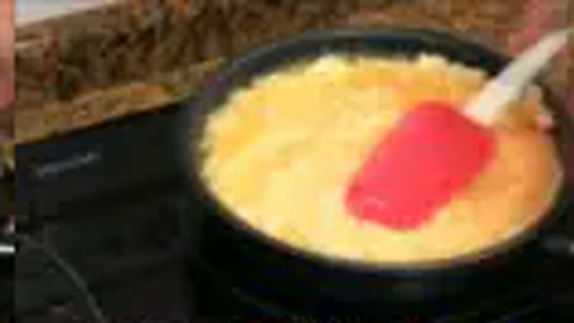

1. **Corte Profesional de Patata y Cebolla:**
   * Pelar las patatas y cortarlas longitudinalmente por la mitad; luego laminar en rodajas finas de 3 mm de grosor (formato tradicional de lasca o abanico).
   * Cortar la cebolla en pluma fina o juliana menuda.
2. **Confitado Lento Maestro:**
   * En la sartén amplia, verter los 400 ml de AOVE y calentar a fuego medio.
   * Añadir las patatas y la cebolla juntas con la mitad de la sal (4 g). El aceite debe cubrir las hortalizas casi por completo.
   * Cocinar a fuego medio-bajo (**130°C - 140°C**) durante **25 a 30 minutos**, removiendo de vez en cuando con espátula de madera para romper algunas lascas sin triturarlas.
   * Las patatas deben quedar completamente tiernas, fundentes y con los bordes de la cebolla ligeramente dorados caramelizados.
3. **Escurrido y Reposo Sagrado de Carmen:**
   * Verter las patatas y cebolla sobre el colador colocado encima de un bol para recoger el AOVE (este aceite perfumado es oro líquido para otros guisos). Dejar escurrir durante 3-4 minutos.
   * En un bol grande, cascar los 7 huevos con el resto de la sal (4 g). Batir con tenedor durante solo 20 segundos (no meter aire ni espumar en exceso).
   * Incorporar las patatas y cebollas calientes escurridas directamente sobre el huevo batido.
   * Mezclar suavemente y dejar reposar durante **10 minutos**. Este reposo permite que el almidón de la patata caliente absorba el huevo crudo, creando una crema densa previa al fuego.
4. **El Cuajado Rápido y Volteo:**
   * Colocar la sartén antiadherente (Ø 24 cm) a fuego fuerte con 1 cucharada sopera del AOVE reservado.
   * Cuando la sartén humee ligeramente, verter la mezcla completa de golpe. Se formará una costra exterior dorada de inmediato.
   * Bajar el fuego a medio y, con una espátula de silicona, ir redondeando los bordes hacia dentro mientras se mueve la sartén en vaivén constante durante **60 a 75 segundos**.
   * Colocar el plato viratortillas aceitado sobre la sartén, voltear con un movimiento firme y seguro sin dudar, y deslizar la tortilla nuevamente hacia la sartén.
   * Redondear los bordes nuevamente y cocinar por el segundo lado durante otros **60 segundos** para lograr un corazón jugoso y meloso (*estilo babé*), o 2,5 minutos si se prefiere cuajada completa.
5. **Reposo:**
   * Deslizar a un plato llano y dejar reposar 5 minutos antes de cortar.

---

### 📦 Protocolo de Conservación y Batch Cooking
* **Refrigeración (0°C a 4°C):** Conservar en recipiente hermético durante **3 días**. Si el cuajado es muy líquido (*babé*), consumir en las primeras 24 horas por seguridad alimentaria.
* **Congelación:** ❌ **NO RECOMENDADA** (la patata cocida se cristaliza y altera su textura).

---

### 🔥 Guía de Regeneración Multicanal
* **Sartén:** Calentar a fuego mínimo tapada con 3 gotas de agua durante 2 minutos por lado.
* **Microondas:** A potencia baja (350W) durante 60 segundos por porción (evita recocer el huevo).
* **Degustación a Temperatura Ambiente:** La mejor forma de disfrutar una tortilla reposada es a temperatura ambiente tras 2 horas de elaboración.

---

## 🦐 8. Tortillitas de Camarones / Gambas Crujientes
*Categoría: Frituras de la Bahía / Encaje Crujiente Gaditano*

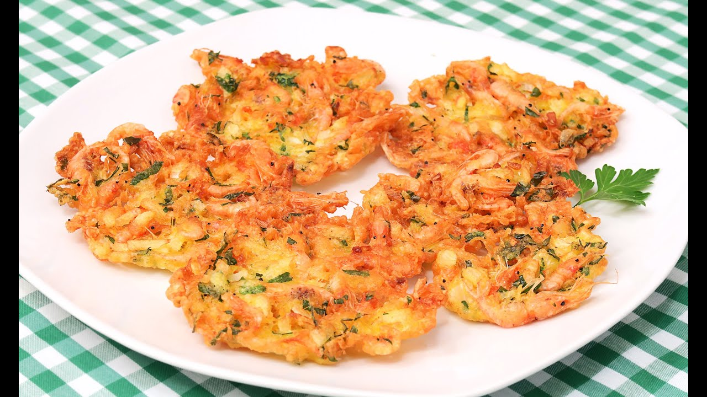

> 📺 **Vídeo Oficial de Elaboración:** [Ver en YouTube: Tortillitas de Camarones de Cádiz](https://www.youtube.com/watch?v=bG6iMLxS6Oo)


> [!NOTE]
> La auténtica tortillita andaluza es fina como una hoja de encaje transparente, suflada y ultra crujiente. El secreto técnico radica en combinar harina de trigo y de garbanzo al 50%, utilizar agua mineral con gas casi helada y freír en aceite muy caliente para provocar una expansión instantánea.

### 📋 Ficha Resumen
| Parámetro | Valor |
| :--- | :--- |
| **Tiempo de Preparación** | 15 minutos (+ 30 min de reposo de masa en frío) |
| **Tiempo de Cocción** | 15 minutos |
| **Dificultad** | Media-Alta (control del punto de masa y fritura) |
| **Raciones** | 4 personas (rinde aprox. 12-14 tortillitas) |
| **Coste Estimado** | Medio (5,20 € total / 1,30 € ración) |

---

### ⚠️ Tabla de Alérgenos (Reglamento UE 1169/2011)

| Alérgeno | Estado | Ingrediente Causante / Medida de Adaptación |
| :--- | :---: | :--- |
| **Crustáceos** | 🔴 **PRESENTE** | Camarones frescos o gamba arrocera picada. |
| **Gluten** | 🔴 **PRESENTE** | Harina de trigo común. *Adaptación: usar 100% harina de garbanzo y arroz para versión celíaca.* |
| **Huevos / Lácteos / Frutos / Soja** | 🟢 AUSENTE | No contiene huevos ni lácteos. |

---

### ⚖️ Ingredientes Exactos


* **100 g** Harina de trigo floja común.
* **100 g** Harina de garbanzo fina tamizada (aporta sabor, color dorado y textura crujiente).
* **150 g** Camarones frescos enteros pequeños (o gambitas arroceras frescas troceadas muy finas).
* **100 g** Cebolleta fresca (incluyendo parte del tallo verde), picada en brunoise microscópica.
* **20 g** Perejil fresco limpio y finamente picado.
* **280-300 ml** Agua mineral con gas muy fría (casi helada).
* **4 g** Sal marina fina.
* **500 ml** Aceite de Oliva Virgen Extra para fritura.

---

### 🍳 Equipamiento Necesario
* Sartén amplia y plana o perol de fritura (mínimo Ø 28 cm).
* Cucharón o cacillo de servir.
* Varillas manuales.
* Espumadera ancha plana para voltear el encaje.
* Bandeja con rejilla o papel secante.

---

### 👨‍🍳 Paso a Paso Técnico y Minucioso

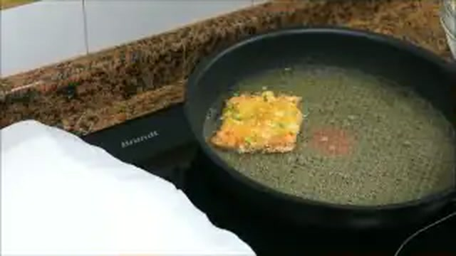

1. **Elaboración de la Masa Fluida:**
   * En un bol amplio, tamizar la harina de trigo y la harina de garbanzo. Añadir la sal.
   * Verter el agua con gas muy fría poco a poco mientras se bate con varillas. La textura final debe ser muy líquida y fluida, similar a la masa de un crepe ligero o nata líquida.
   * Incorporar la cebolleta picada, el perejil fresco y los camarones enteros crudos.
   * Dejar reposar la masa en el frigorífico durante 30 minutos para que las harinas se hidraten y el líquido mantenga su temperatura glacial.
2. **La Fritura en Encaje a Alta Temperatura:**
   * Verter abundante AOVE en la sartén (debe haber aprox. 1,5 cm de profundidad de aceite) y calentar a **185°C - 190°C**.
   * Remover la masa antes de cada extracción. Tomar un cucharón pequeño (aprox. 40 ml) y verter la masa con un movimiento rápido y circular pegado a la superficie del aceite.
   * La masa se expandirá inmediatamente, formando burbujas y creando una red o "encaje" lleno de orificios crujientes.
   * Freír durante **1 a 1,5 minutos** por el primer lado; con una espumadera plana dar la vuelta con cuidado y dorar 45 segundos más por el otro lado.
3. **Escurrido Inmediato:**
   * Retirar con espumadera y colocar sobre rejilla (preferible a papel para que el vapor inferior no ablande la base). Servir al instante crujientes y humeantes.

---

### 📦 Protocolo de Conservación y Batch Cooking
* **Masa Cruda:** La masa con camarones se conserva en nevera hasta **24 horas** bien tapada.
* **Tortillitas Fritas:** ❌ Deben consumirse al minuto de freír. No admiten congelación ni recalentado prolongado.

---

### 🔥 Guía de Regeneración Multicanal
* **Airfryer:** Si sobran, regenerar a 200°C durante 90 segundos para devolver el crujiente.

---

## 🥚 9. Huevos Rellenos de Atún y Yema con Gratinado / Mahonesa
*Categoría: Entrantes Clásicos / Tradición Festiva*

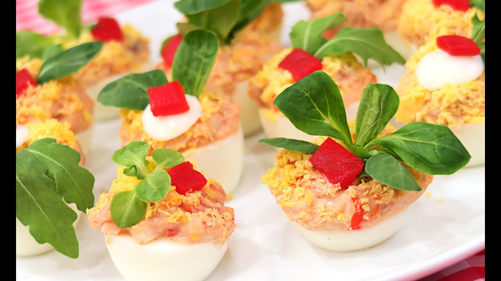

> 📺 **Vídeo Oficial de Elaboración:** [Ver en YouTube: Huevos Rellenos de Atun y Mayonesa | Receta Fácil y Rápida!](https://www.youtube.com/watch?v=igUKFdkin6s)


> [!TIP]
> Para pelar los huevos cocidos sin romper la clara, añade un chorrito de vinagre al agua hirviendo y sumérgelos directamente en agua con hielo a los 9 minutos exactos. Carmen mezcla el atún con las yemas tamizadas y un sofrito de tomate muy concentrado para lograr un relleno untuoso como paté.

### 📋 Ficha Resumen
| Parámetro | Valor |
| :--- | :--- |
| **Tiempo de Preparación** | 20 minutos |
| **Tiempo de Cocción** | 10 minutos (cocción de huevos) |
| **Dificultad** | Muy Fácil |
| **Raciones** | 4 personas (8 medios huevos rellenos) |
| **Coste Estimado** | Económico (3,20 € total / 0,80 € ración) |

---

### ⚠️ Tabla de Alérgenos (Reglamento UE 1169/2011)

| Alérgeno | Estado | Ingrediente Causante / Medida de Adaptación |
| :--- | :---: | :--- |
| **Huevos** | 🔴 **PRESENTE** | Huevos cocidos base y mayonesa. |
| **Pescado** | 🔴 **PRESENTE** | Atún claro en conserva. |
| **Gluten / Lácteos / Sulfitos / Soja** | 🟢 AUSENTE | 100% libre de gluten. |

---

### ⚖️ Ingredientes Exactos


* **4 unidades** Huevos camperos frescos clase L.
* **160 g (peso escurrido)** Atún claro en aceite de oliva.
* **50 g** Tomate frito casero espeso y reducido.
* **80 g** Mayonesa casera densa (o mayonesa suave).
* **8 unidades** Tiras de pimiento morrón para coronar.
* **8 unidades** Aceitunas rellenas de anchoa.
* **1 g** Sal y una pizca de pimienta blanca.

---

### 🍳 Equipamiento Necesario
* Cazo para cocer huevos.
* Tenedor o procesador pequeño para la crema de yemas.
* Manga pastelera con boquilla rizada (opcional para acabado premium).
* Fuente de servicio.

---

### 👨‍🍳 Paso a Paso Técnico y Minucioso


1. **Cocción y Corte de los Huevos:**
   * Cocer los huevos en agua hirviendo durante 9 minutos. Enfriar en agua con hielo, pelar con delicadeza y cortar longitudinalmente por la mitad con cuchillo afilado mojado en agua.
   * Extraer con cuidado las yemas cocidas. Reservar 1 yema entera para la decoración final.
2. **Elaboración de la Crema de Relleno:**
   * En un bol, chafar las 3 yemas restantes con un tenedor hasta reducirlas a polvo fino.
   * Añadir el atún claro bien escurrido y desmigado, el tomate frito espeso, 1 cucharada sopera de mayonesa, sal y pimienta blanca.
   * Mezclar enérgicamente hasta formar una masa homogénea, sedosa y consistente.
3. **Rellenado y Presentación:**
   * Rellenar las cavidades de las claras cocidas con la crema de atún formando un copete generoso con ayuda de una cuchara o manga pastelera.
   * Napar cada medio huevo con una cucharadita de mayonesa.
   * Rallar la yema reservada por encima a través de un colador fino para crear un efecto terciopelo de mimosa.
   * Coronar con una tira de pimiento morrón y media aceituna.
   * Refrigerar 1 hora antes de servir.

---

### 📦 Protocolo de Conservación y Batch Cooking
* **Refrigeración (0°C a 4°C):** Conservar en recipiente hermético durante **3 días**.
* **Congelación:** ❌ **NO APTA.**

---

### 🔥 Guía de Regeneración Multicanal
* **Versión Fría Tradicional:** Servir directamente de nevera a 6-8°C.
* **Versión Gratinada Caliente de Carmen:** Cubrir los huevos rellenos con una capa fina de bechamel suave y queso rallado, y gratinar en horno a 220°C durante 4 minutos hasta dorar la superficie.

---

## 🥓 10. Flamenquines Cordobeses Caseros de Lomo y Jamón Serrano
*Categoría: Fritura Tradicional Andaluza / Rollos Crujientes*


> 📺 **Vídeo Oficial de Elaboración:** [Ver en YouTube: Flamenquines Cordobeses fáciles y deliciosos - Rollitos de Lomo y Jamón](https://www.youtube.com/watch?v=lOKzjd8qUEk)


> [!NOTE]
> El flamenquín tradicional de Córdoba no lleva queso en su receta purista original: se compone de lomo de cerdo extra fino espalmado, envuelto alrededor de una tira gruesa de jamón serrano con tocino ibérico, enrollado firmemente y con un doble empanado que sella los jugos cárnicos.

### 📋 Ficha Resumen
| Parámetro | Valor |
| :--- | :--- |
| **Tiempo de Preparación** | 25 minutos |
| **Tiempo de Cocción** | 10 minutos |
| **Dificultad** | Fácil-Media |
| **Raciones** | 4 personas (4 flamenquines grandes de 180g) |
| **Coste Estimado** | Medio (6,40 € total / 1,60 € ración) |

---

### ⚠️ Tabla de Alérgenos (Reglamento UE 1169/2011)

| Alérgeno | Estado | Ingrediente Causante / Medida de Adaptación |
| :--- | :---: | :--- |
| **Gluten** | 🔴 **PRESENTE** | Harina y pan rallado del empanado. *Adaptación: usar pan rallado sin gluten.* |
| **Huevos** | 🔴 **PRESENTE** | Huevo campero en el rebozado. |
| **Lácteos / Pescado / Sulfitos / Soja** | 🟢 AUSENTE | 100% libre de lácteos. |

---

### ⚖️ Ingredientes Exactos


* **4 filetes (400 g)** Cinta de lomo de cerdo cortada fina y limpia de grasa exterior.
* **160 g** Jamón serrano o ibérico cortado en lonchas finas o bastones jugosos.
* **2 dientes** Ajo morado picados en pasta y 10 g de perejil picado (para marinar la carne).
* **2 unidades** Huevos camperos clase L batidos con 10 ml de agua.
* **60 g** Harina de trigo común.
* **180 g** Pan rallado fino artesano.
* **500 ml** Aceite de Oliva Virgen Extra para freír.
* **3 g** Sal marina y 1 g de pimienta negra.

---

### 🍳 Equipamiento Necesario
* Maza de cocina o espalmador de carne.
* Papel film transparente.
* Sartén alargada u ovalada para fritura holgada.
* Pinzas de cocina y papel absorbente.

---

### 👨‍🍳 Paso a Paso Técnico y Minucioso


1. **Espalmado y Macerado de la Carne:**
   * Colocar cada filete de lomo entre dos hojas de papel film. Golpear suavemente con la maza o la base de una cazuela pesada desde el centro hacia los extremos hasta dejar la carne con un grosor uniforme de 2 mm (esto rompe las fibras y garantiza máxima ternura).
   * Frotar los filetes con la pasta de ajo, perejil, sal y pimienta.
2. **Montaje y Enrollado Compacto:**
   * Extender el filete sobre la tabla. Colocar las lonchas o bastones de jamón en el tercio inferior.
   * Enrollar el lomo sobre sí mismo apretando firmemente hacia delante para formar un cilindro compacto sin huecos de aire interiores. Doblar ligeramente los extremos hacia adentro para sellar el jamón.
3. **Empanado Doble Sellador:**
   * Pasar cada rollo por harina común sacudiendo el exceso.
   * Sumergir en el huevo batido asegurando que cubra las puntas.
   * Rebozar en pan rallado presionando con las manos.
   * Para un crujiente blindado que no se abra al freír, pasar nuevamente por huevo y pan rallado (*doble empanado fino*).
4. **Fritura y Desgrasado:**
   * Calentar el AOVE en sartén honda a **170°C - 175°C** (no más caliente para que el lomo interior se cocine a la perfección antes de que el pan se dore en exceso).
   * Freír los flamenquines durante **4 a 5 minutos**, volteándolos regularmente para un dorado uniforme.
   * Escurrir sobre papel absorbente y servir cortados en rodajas diagonales acompañados de patatas fritas y ensalada fresca.

---

### 📦 Protocolo de Conservación y Batch Cooking
* **Refrigeración en Crudo:** Hasta **48 horas** empanados en bandeja tapada.
* **Congelación (-18°C):** Congelar en crudo envueltos individualmente en film transparente por **3 meses**. Freír directamente sin descongelar a 165°C durante 6 minutos.

---

### 🔥 Guía de Regeneración Multicanal
* **Sartén:** Freír en AOVE a 170°C.
* **Airfryer:** 180°C durante 12-14 minutos pulverizando con spray de AOVE.
* **Horno:** 200°C durante 15 minutos en posición media.

---

## 🦑 11. Calamares a la Romana Crujientes y Tiernos
*Categoría: Frituras de Mar / Técnica del Rebozado Suflado*


> 📺 **Vídeo Oficial de Elaboración:** [Ver en YouTube: Calamares a la Romana](https://www.youtube.com/watch?v=xwTp0-5YhNY)


> [!TIP]
> El truco magistral de Carmen para unos calamares tiernísimos que no queden gomosos es secar las anillas a conciencia y elaborar un rebozado con harina, levadura química y agua con gas helada, logrando una coraza ligera y suflada que sella el vapor interior.

### 📋 Ficha Resumen
| Parámetro | Valor |
| :--- | :--- |
| **Tiempo de Preparación** | 20 minutos |
| **Tiempo de Cocción** | 10 minutos |
| **Dificultad** | Fácil-Media |
| **Raciones** | 4 personas (aprox. 600 g de calamares limpios) |
| **Coste Estimado** | Medio (6,80 € total / 1,70 € ración) |

---

### ⚠️ Tabla de Alérgenos (Reglamento UE 1169/2011)

| Alérgeno | Estado | Ingrediente Causante / Medida de Adaptación |
| :--- | :---: | :--- |
| **Moluscos** | 🔴 **PRESENTE** | Calamares frescos enteros o anillas. |
| **Gluten** | 🔴 **PRESENTE** | Harina de trigo del rebozado. *Adaptación: harina de arroz y Maizena.* |
| **Huevos** | 🔴 **PRESENTE** | Huevo campero en la masa de rebozado. |
| **Lácteos / Pescado / Sulfitos / Soja** | 🟢 AUSENTE | 100% libre de lácteos. |

---

### ⚖️ Ingredientes Exactos

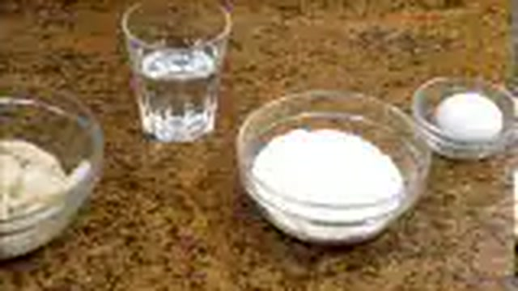
* **600 g** Calamares frescos limpios (tubos limpios cortados en anillas de 1 cm de grosor).
* **120 g** Harina de trigo común.
* **1 unidad** Huevo campero clase L (separada la yema de la clara).
* **100 ml** Agua mineral con gas muy fría (o cerveza rubia fría).
* **4 g (1 cucharadita)** Levadura química en polvo (tipo Royal) o bicarbonato sódico.
* **1 pizca (0,2 g)** Colorante alimentario o cúrcuma (para el tono dorado tradicional de bar).
* **4 g** Sal marina fina.
* **500 ml** Aceite de Oliva Virgen Extra para fritura.
* **1 unidad** Limón cortado en gajos para acompañar.

---

### 🍳 Equipamiento Necesario
* Cazuela honda o sartén de hierro para fritura.
* Varillas y dos boles pequeños.
* Papel absorbente de cocina.
* Termómetro de fritura.

---

### 👨‍🍳 Paso a Paso Técnico y Minucioso


1. **Preparación y Secado del Calamar:**
   * Cortar los tubos de calamar limpios en anillas de 1 a 1,2 cm de grosor.
   * **Paso crítico:** Secar minuciosamente cada anilla con abundante papel absorbente. La humedad exterior es la causa principal de que el rebozado se desprenda durante la fritura. Sazonar con 2 g de sal.
2. **Elaboración de la Masa Romana Suflada:**
   * En un bol, batir la yema de huevo con el agua con gas muy fría, la levadura química, el colorante y 2 g de sal.
   * Añadir los 120 g de harina tamizada e integrar con varillas hasta obtener una crema homogénea y densa (textura similar a masa de bizcocho líquida).
   * En otro bol, montar la clara de huevo a punto de nieve suave e integrarla a la masa con movimientos envolventes (aporta esponjosidad y ligereza suflada).
3. **Fritura a Alta Temperatura:**
   * Calentar el AOVE a **185°C - 190°C**.
   * Pasar las anillas de calamar primero por un velo seco de harina (sacudiendo el exceso), sumergir en la masa romana cubriéndolas por completo y echarlas de inmediato al aceite caliente una a una.
   * Freír en tandas de 6-8 anillas durante **1,5 a 2 minutos** (el calamar fresco requiere muy poco tiempo; freír en exceso endurece la carne).
   * Cuando el rebozado esté inflado, crujiente y dorado, retirar con espumadera a una bandeja con papel absorbente.
4. **Servicio:**
   * Servir de inmediato bien calientes acompañados de gajos de limón fresco y salsa alioli o mayonesa casera.

---

### 📦 Protocolo de Conservación y Batch Cooking
* **Calamares Fritos:** Deben consumirse en el momento para disfrutar de la coraza crujiente.
* **Congelación de Anillas Limpias:** Las anillas frescas limpias se pueden congelar en bolsas al vacío durante **6 meses**; descongelar lentamente en nevera y secar muy bien antes de rebozar.

---

### 🔥 Guía de Regeneración Multicanal
* **Airfryer:** Si se desea recalentar calamares ya fritos, disponer a 200°C durante 2 minutos.
* **Horno:** 210°C durante 4 minutos sobre rejilla.

---

## 📊 Matriz Comparativa y Guía de Servicio Rápido

| N.º | Tapa / Entrante | Textura Clave | Temperatura de Servicio | Maridaje Recomendado |
| :---: | :--- | :--- | :---: | :--- |
| **1** | Croquetas de Jamón Ibérico | Crujiente exterior / Núcleo líquido fundente | Caliente (60°C) | Jerez Fino / Manzanilla de Sanlúcar |
| **2** | Croquetas de Pollo Asado | Corteza fina / Masa melosa con tropezones | Caliente (60°C) | Cerveza lager fría / Vino tinto joven |
| **3** | Ensaladilla Rusa Carmen | Cremosa / Tropezón tierno / Acidez suave | Fría (6-8°C) | Caña de cerveza bien tirada |
| **4** | Patatas Bravas | Doble textura: Crujiente exterior / Manteca interior | Muy Caliente | Vino tinto de Madrid / Cerveza IPA |
| **5** | Patatas Alioli al Mortero | Firmeza tierna / Emulsión densa aromática | Fría o Templada | Vino blanco Verdejo / Sidra natural |
| **6** | Empanadillas de Atún | Hojaldrada crujiente / Relleno jugoso | Caliente o Templada | Cerveza tostada / Vino rosado |
| **7** | Tortilla de Patatas | Sellado exterior fino / Corazón cremoso fluido | Templada (40°C) | Vino tinto Rioja crianza / Ribera del Duero |
| **8** | Tortillitas de Camarones | Encaje ultra fino y quebradizo | Recién frita humeante | Manzanilla pasada / Cava Brut Nature |
| **9** | Huevos Rellenos | Suave / Emulsión tersa aterciopelada | Fría (4-6°C) | Vino blanco Albariño / Rueda |
| **10** | Flamenquines Cordobeses | Crujiente sonoro / Carne jugosa y jamón tierno | Caliente (65°C) | Vino Montilla-Moriles / Cerveza rubia |
| **11** | Calamares a la Romana | Rebozado aireado suflado / Calamar tierno | Muy Caliente recién hecho | Cerveza rubia con limón / Vino blanco Godello |

---
*Documento redactado con rigor técnico gastronómico, formulación exacta y parámetros de seguridad alimentaria según estándares de Cocina con Carmen y el Reglamento UE 1169/2011.*
