# 🥗 Master de Cocina Tradicional: Ensaladas, Aliños y Platos Fríos
> **Inspirado en la filosofía, técnica y maestría del canal *Cocina con Carmen***  
> *Recetario Técnico Enciclopédico, Tablas de Alérgenos UE (Reglamento 1169/2011), Protocolos de Batch Cooking y Guías de Servicio en Frío*

---

## 📖 Prólogo Culinario: Los Secretos de la Huerta, los Aliños y el Frío Tradicional

En la cocina de **Carmen**, una ensalada o un plato frío nunca es un mero acompañamiento improvisado ni una mezcla desordenada de ingredientes crudos. Es una disciplina gastronómica de máxima precisión donde convergen la selección botánica, el dominio de los puntos de cocción de almidones y proteínas, y la física de las emulsiones líquidas.

La excelencia en los aliños y platos fríos tradicionales se sustenta sobre seis principios inquebrantables:

1. **La Temperatura de Corte y el Tratamiento del Almidón:** Las patatas para ensalada campera o ensaladilla deben hervirse siempre enteras con su piel en agua salada al 1,5% para impedir que el agua penetre en el tubérculo y vuelva aguada la textura. Deben pelarse y trocearse mientras conservan calor templado; en ese momento exacto, la estructura celular porosa absorbe el vinagre o el jugo de la conserva antes de que el almidón retrograde y cierre sus poros.
2. **El Amortiguado de la Cebolleta y Alliums:** Para erradicar el picor agresivo y la indigestión provocada por los compuestos azufrados (*sinigrina y alicina*) de la cebolla cruda sin perder su crocancia, Carmen utiliza la técnica del remojo en agua helada con unas gotas de vinagre o sal durante 15 minutos, escurriendo y secando a la perfección antes de integrar.
3. **La Triangulación Ácida del Aliño (La Regla de Oro del Vinagre de Jerez):** El equilibrio organoléptico exige una proporción estricta de 3 partes de grasa noble (Aceite de Oliva Virgen Extra de baja acidez o monovarietales seleccionados) por 1 parte de ácido (Vinagre de Jerez D.O.P. o cítricos frescos). La sal debe disolverse siempre en la fase ácida **antes** de añadir el aceite, ya que el cloruro sódico es insoluble en lípidos.
4. **El Majado de Mortero como Emulsionante Patrimonial:** En elaboraciones icónicas como la pipirrana andaluza, la yema de huevo cocido machacada con ajo desvenado, comino y sal actúa como un agente tensioactivo natural (*lecitina fosfolipídica*), permitiendo que el agua del tomate y el AOVE formen una emulsión estable ("el calducho") imposible de lograr con un simple agitado.
5. **Seguridad Alimentaria y Desproteinización en Crudos (Protocolo Anisakis):** En preparaciones marinas frías como los boquerones en vinagre, la frescura absoluta se complementa con un protocolo estricto de desangrado en agua helada para lograr una carne blanca inmaculada, una congelación preventiva a -20°C durante 5 días (RD 1021/2022) y una coagulación ácida controlada que preserva la jugosidad sin quemar la fibra muscular.
6. **Estrategia de Ensamblado en Batch Cooking:** Las verduras de hoja (cogollos, canónigos, rúcula) y los aliños ácidos deben mantenerse rigurosamente separados en contenedores herméticos hasta el instante previo al consumo para prevenir la plasmólisis osmótica (el marchitado y reblandecimiento por fuga de agua celular).

---

```
                                  MAPA DEL RECETARIO
                                  
  ┌─────────────────────────────────┐       ┌─────────────────────────────────┐
  │     ENSALADAS DE HUERTA Y MAR   │       │   TUBÉRCULOS, PASTAS Y ARROCES  │
  │ • 1. Ensalada Campera           │       │ • 5. Ensaladilla Rusa Carmen    │
  │ • 2. Pipirrana Andaluza         │       │ • 6. Ensalada de Pasta de Verano│
  │ • 3. Pimientos Asados con Melva │       │ • 7. Ensalada de Garbanzos      │
  │ • 11. Tomate con Ventresca      │       │ • 10. Ensalada de Arroz         │
  └────────────────┬────────────────┘       └────────────────┬────────────────┘
                   │                                         │
                   └───────────────────┬─────────────────────┘
                                       │
                    ┌──────────────────┴──────────────────┐
                    │    ALIÑOS Y ENCURTIDOS EMBLEMÁTICOS │
                    │ • 4. Salpicón de Marisco Tradicional│
                    │ • 8. Cogollos al Ajillo con Anchoas │
                    │ • 9. Boquerones en Vinagre de Carmen│
                    └─────────────────────────────────────┘
```

---

## 📑 Índice General de Recetas

1. [🥔 Ensalada Campera Tradicional de Patata, Atún, Huevo y Hortalizas](#1--ensalada-campera-tradicional-de-patata-atún-huevo-y-hortalizas)
2. [🍅 Pipirrana Andaluza Tradicional con Tomate, Pepino, Pimiento y Atún](#2--pipirrana-andaluza-tradicional-con-tomate-pepino-pimiento-y-atún)
3. [🫑 Ensalada de Pimientos Asados al Horno con Melva de Andalucía](#3--ensalada-de-pimientos-asados-al-horno-con-melva-de-andalucía)
4. [🐙 Salpicón de Marisco Tradicional con Pulpo, Gambas y Mejillones](#4--salpicón-de-marisco-tradicional-con-pulpo-gambas-y-mejillones)
5. [🥗 Ensaladilla Rusa Tradicional de Carmen con Mayonesa Casera](#5--ensaladilla-rusa-tradicional-de-carmen-con-mayonesa-casera)
6. [🍝 Ensalada de Pasta de Verano con Atún, Maíz y Salsa Rosa Casera](#6--ensalada-de-pasta-de-verano-con-atún-maíz-y-salsa-rosa-casera)
7. [🧆 Ensalada de Garbanzos Veraniega con Verduras Frescas y Comino](#7--ensalada-de-garbanzos-veraniega-con-verduras-frescas-y-comino)
8. [🥬 Cogollos de Tudela al Ajillo con Anchoas del Cantábrico y Ajo Confitado](#8--cogollos-de-tudela-al-ajillo-con-anchoas-del-cantábrico-y-ajo-confitado)
9. [🐟 Boquerones en Vinagre Tradicionales de Carmen con AOVE, Ajo y Perejil](#9--boquerones-en-vinagre-tradicionales-de-carmen-con-aove-ajo-y-perejil)
10. [🍚 Ensalada de Arroz de Verano Refrescante y Nutritiva](#10--ensalada-de-arroz-de-verano-refrescante-y-nutritiva)
11. [🍅 Ensalada de Tomate con Ventresca, Cebolleta y Aceitunas Gordales](#11--ensalada-de-tomate-con-ventresca-cebolleta-y-aceitunas-gordales)
12. [📊 Tabla Comparativa Maestra: Rendimientos, Costes y Tiempos de Conservación](#12--tabla-comparativa-maestra-rendimientos-costes-y-tiempos-de-conservación)

---

## 1. 🥔 Ensalada Campera Tradicional de Patata, Atún, Huevo y Hortalizas
*Categoría: Ensalada Fría de Tubérculo / Huerta Mediterránea*

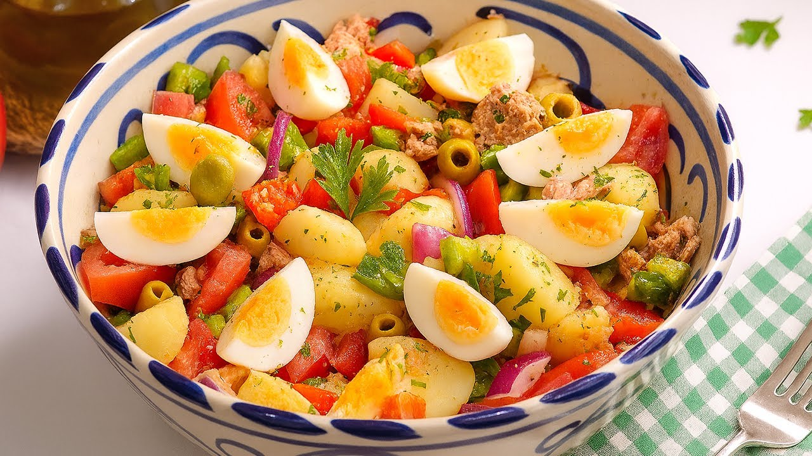

> 📺 **Vídeo Oficial de Elaboración:** [Ver en YouTube: ¡La ensalada campera más fácil y deliciosa!](https://www.youtube.com/watch?v=0YgZUx1f5L8)


> [!NOTE]
> El gran secreto de Carmen para que la ensalada campera no quede sosa ni aguada consiste en cocer las patatas enteras con piel, pelarlas en caliente y regarlas con una parte del vinagre y el aceite mientras están tibias. De este modo, la patata absorbe el aliño hacia su núcleo antes de enfriarse.

```
                    ┌───────────────────────────────┐
                    │       ENSALADA CAMPERA        │
                    │      EQUILIBRIO DE HUERTA     │
                    └───────────────┬───────────────┘
                                    │
           ┌────────────────────────┴────────────────────────┐
           ▼                                                 ▼
┌──────────────────────┐                          ┌──────────────────────┐
│ COCCIÓN Y ABSORCIÓN  │                          │  CRUJIENTE Y FRESCO  │
│ Patatas con piel     │                          │ Cebolleta desflemar  │
│ Pelar en caliente    │                          │ Pimientos verde/rojo │
│ Aliño en templado    │                          │ Atún claro en AOVE   │
└──────────────────────┘                          └──────────────────────┘
```

### 📋 Ficha Resumen
| Parámetro | Valor |
| :--- | :--- |
| **Tiempo de Preparación** | 20 minutos |
| **Tiempo de Cocción** | 30 minutos (cocción de patatas y huevos) |
| **Tiempo de Reposo en Frío** | Mínimo 2 horas (óptimo 4 horas a 3°C) |
| **Dificultad** | Muy Baja |
| **Raciones** | 4 personas (aprox. 350 g por ración) |
| **Coste Estimado** | Económico (4,50 € total / 1,12 € por ración) |

---

### ⚠️ Tabla de Alérgenos (Reglamento UE 1169/2011)

| Alérgeno | Estado | Ingrediente Causante / Medida de Adaptación |
| :--- | :---: | :--- |
| **Pescado** | 🔴 **PRESENTE** | Atún claro en aceite de oliva. *Sustituir por tofu marinado o garbanzos para versión vegetariana.* |
| **Huevos** | 🔴 **PRESENTE** | Huevos camperos cocidos. *Omitir en caso de alergia al huevo.* |
| **Sulfitos** | 🔴 **PRESENTE** | Vinagre de Jerez D.O.P. y aceitunas aliñadas. *Sustituir vinagre por zumo de limón fresco colado.* |
| **Gluten** | 🟢 AUSENTE | Plato naturalmente libre de gluten. |
| **Lácteos / Frutos de Cáscara / Soja** | 🟢 AUSENTE | Formulación tradicional limpia. |

---

### ⚖️ Ingredientes Exactos

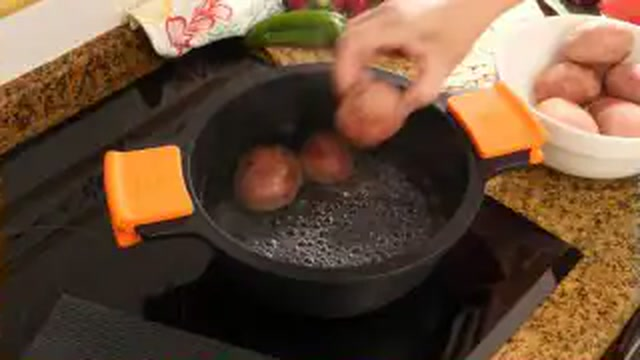

#### Base de Tubérculo y Proteínas
* **800 g** Patatas de cocer firmes (variedad Monalisa, Spunta o Kennebec), de calibre uniforme.
* **3 unidades (aprox. 180 g)** Huevos camperos frescos categoría L.
* **200 g** Atún claro en aceite de oliva virgen extra (peso escurrido aprox. 140 g).
* **80 g** Aceitunas verdes manzanilla sin hueso (o aliñadas caseras partidas).

#### Hortalizas Frescas de Huerta
* **250 g (2 unidades medianas)** Tomates maduros pero firmes (variedad pera o rama), pelados y cortados en dados de 2 cm.
* **120 g (1 unidad mediana)** Cebolleta dulce fresca o cebolla morada, cortada en juliana fina o brunoise.
* **100 g (1 unidad)** Pimiento verde italiano fresco, limpio y cortado en trozos de 1,5 cm.
* **80 g (1/2 unidad)** Pimiento rojo morrón carnoso, cortado en dados de 1,5 cm.
* **10 g** Perejil fresco de hoja lisa, finamente picado.

#### Vinagreta Emulsionada de Carmen
* **75 ml** Aceite de Oliva Virgen Extra (AOVE) variedad Hojiblanca o Picual.
* **25 ml** Vinagre de vino blanco o Vinagre de Jerez D.O.P.
* **5 g (1 cucharadita)** Sal marina fina.
* **1 g (1/2 cucharadita)** Pimienta negra recién molida.

---

### 🍳 Equipamiento Necesario
* Olla amplia (capacidad 3-4 litros).
* Cazo pequeño para cocción de huevos.
* Bol de cristal o acero inoxidable de gran volumen.
* Biberón o tarro de cristal con tapa para emulsionar la vinagreta.
* Escurridor y cuchillo cebollero bien afilado.

---

### 👨‍🍳 Paso a Paso Técnico y Minucioso


1. **Cocción Perfecta de las Patatas:**
   * Lavar minuciosamente las patatas bajo el grifo con un cepillo para retirar restos de tierra sin dañar la piel.
   * Introducir las patatas enteras en una olla amplia y cubrirlas con agua fría (al menos 3 cm por encima). Añadir 15 g de sal marina.
   * Llevar a ebullición a fuego medio-alto. Una vez comience a hervir, bajar a fuego medio suave y cocer durante **25-30 minutos**. Comprobar el punto insertando una brocheta o cuchillo fino en el centro: debe entrar y salir sin resistencia sin que la patata se desmorone.
   * Retirar del agua inmediatamente para cortar la cocción por exceso de calor residual.
2. **Cocción Controlada de los Huevos Camperos:**
   * En un cazo con agua hirviendo y una pizca de sal y vinagre, sumergir los 3 huevos a temperatura ambiente con la ayuda de una cuchara.
   * Cocer durante exactamente **9 minutos y medio** para lograr una yema cremosa sin anillo verdoso de sulfuro de hierro.
   * Transferir de inmediato a un bol con agua con hielo durante 5 minutos. Pelar bajo el agua y reservar.
3. **El Truco del Aliño en Caliente:**
   * En cuanto las patatas templen lo justo para poder manipularlas (unos 5-8 minutos tras sacarlas), retirar la piel con las manos o la punta de un cuchillo.
   * Cortar las patatas en trozos irregulares de bocado (trocear y quebrar suavemente).
   * En un tarro de cristal, mezclar los 25 ml de vinagre, los 5 g de sal y la pimienta. Agitar hasta disolver la sal. Añadir 30 ml del AOVE y emulsionar.
   * Rociar este primer aliño directamente sobre la patata tibia y remover con suavidad. Dejar reposar 15 minutos para que la patata absorba el aroma y el punto ácido.
4. **Desflemar la Cebolleta y Cortar Hortalizas:**
   * Cortar la cebolleta en juliana fina y sumergirla en un cuenco con agua helada y 5 ml de vinagre durante 10 minutos. Escurrir y secar muy bien con papel absorbente.
   * Lavar, secar y trocear los pimientos verde y rojo en dados regulares.
   * Pelar los tomates, retirar el exceso de semillas y cortar en dados de 2 cm.
5. **Ensamblado y Emulsión Final:**
   * En el bol grande donde reposa la patata aliñada, incorporar los pimientos, la cebolleta escurrida, el tomate pelado y las aceitunas manzanilla.
   * Desmigar el atún claro en lomos grandes por encima (aprovechando su propio aceite si es virgen extra de calidad).
   * Picar 2 huevos duros en cuartos o dados e incorporarlos a la mezcla. Cortar el tercer huevo en gajos para la decoración final.
   * Rociar con los restantes 45 ml de AOVE, espolvorear el perejil fresco picado y mezclar con dos cucharas de madera o silicona con movimientos envolventes para no romper la patata.
6. **Reposo y Maduración Térmica:**
   * Tapar el bol con film transparente o tapa hermética y refrigerar a 3-4°C durante un mínimo de **2 horas** antes de servir.

---

### 📦 Protocolo de Conservación y Batch Cooking

> [!IMPORTANT]
> La ensalada campera gana en sabor tras 12-24 horas en refrigeración, ya que los ácidos y aromas del AOVE penetran en la matriz de la patata.

* **Refrigeración (0°C a 4°C):** Conservar en recipiente hermético de cristal. Vida útil óptima: **3 a 4 días**.
* **Batch Cooking Modular:** Si se desea preparar con 4-5 días de antelación, guardar las patatas cocidas enteras con piel en un recipiente y las hortalizas cortadas en otro con papel absorbente en la base. Ensamblar y aliñar 3 horas antes del consumo.
* **Congelación:** ❌ **ESTRICTAMENTE PROHIBIDA**. La patata cocida pierde el agua celular durante la cristalización y al descongelar queda harinosa, esponjosa y aguada.

---

### ❄️ Guía de Servicio y Regeneración en Frío
* **Temperatura de Consumo:** Retirar de la nevera **15-20 minutos antes de servir** para que el AOVE recupere su fluidez líquida (temperatura ideal de consumo: 12-14°C).
* **Toque Final:** Añadir un hilo fino de AOVE fresco y unas escamas de sal marina sobre el huevo justo al emplatar.

---

## 2. 🍅 Pipirrana Andaluza Tradicional con Tomate, Pepino, Pimiento y Atún
*Categoría: Ensalada Tradicional Majada / Andalucía Oriental (Jaén y Granada)*

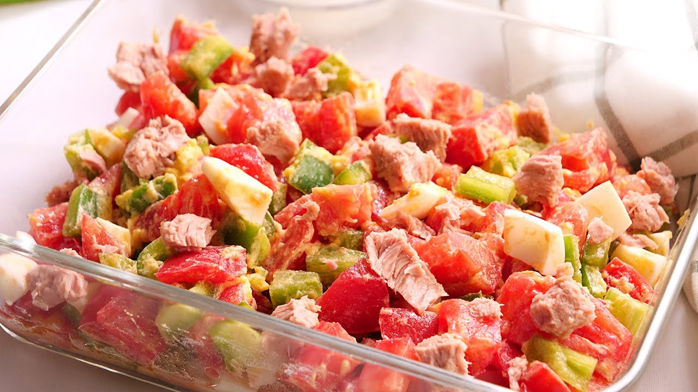

> 📺 **Vídeo Oficial de Elaboración:** [Ver en YouTube: Pipirrana de Jaén - Ensalada Fácil, Refrescante y Deliciosa](https://www.youtube.com/watch?v=qPgJmsQp4Dc)


> [!NOTE]
> La pipirrana auténtica de Jaén no es un picadillo corriente: su identidad radica en el **majado de mortero** donde las yemas de huevo cocido se emulsionan con el diente de ajo, el comino en grano, la sal y el AOVE Picual. El jugo que desprenden los tomates junto al majado forma un caldo denso y aromático ("calducho") que es el auténtico tesoro del plato.

```
                    ┌───────────────────────────────┐
                    │      PIPIRRANA ANDALUZA       │
                    │      EL ARTE DEL MAJADO       │
                    └───────────────┬───────────────┘
                                    │
           ┌────────────────────────┴────────────────────────┐
           ▼                                                 ▼
┌──────────────────────┐                          ┌──────────────────────┐
│  EL MAJADO BASE      │                          │ EL CALDUCHO SAGRADO  │
│ Ajo desvenado + sal  │                          │ Jugos tomate maduro  │
│ Comino tostado       │                          │ Pepino y pimiento 3mm│
│ Yemas huevo + AOVE   │                          │ Emulsión natural     │
└──────────────────────┘                          └──────────────────────┘
```

### 📋 Ficha Resumen
| Parámetro | Valor |
| :--- | :--- |
| **Tiempo de Preparación** | 25 minutos |
| **Tiempo de Cocción** | 10 minutos (cocción de huevos) |
| **Tiempo de Maceración** | 1 hora en frío |
| **Dificultad** | Baja |
| **Raciones** | 4 personas (aprox. 300 g por ración) |
| **Coste Estimado** | Muy Económico (3,80 € total / 0,95 € por ración) |

---

### ⚠️ Tabla de Alérgenos (Reglamento UE 1169/2011)

| Alérgeno | Estado | Ingrediente Causante / Medida de Adaptación |
| :--- | :---: | :--- |
| **Pescado** | 🔴 **PRESENTE** | Atún claro o melva en conserva. *Omitir para versión 100% vegetal.* |
| **Huevos** | 🔴 **PRESENTE** | Huevos cocidos (yema en majado y clara picada). |
| **Sulfitos** | 🔴 **PRESENTE** | Vinagre de Jerez o vino blanco. |
| **Gluten / Lácteos / Frutos Secos** | 🟢 AUSENTE | Formulación naturalmente limpia. |

---

### ⚖️ Ingredientes Exactos


#### Vegetales de Huerta Andaluza
* **1.000 g** Tomates maduros carnosos de temporada (pera maduro, corazón de buey o tomate rosa), pelados meticulosamente.
* **150 g (1 unidad)** Pepino tipo español, pelado completamente y sin semillas acuosas.
* **120 g (1 unidad grande)** Pimiento verde italiano fresco y carnoso.
* **160 g** Atún claro en aceite de oliva o melva de Andalucía (escurrido).

#### Majado Tradicional de Mortero
* **2 unidades** Huevos camperos cocidos durante 9 minutos (separar yemas y claras).
* **1 diente (aprox. 5 g)** Ajo morado de Las Pedroñeras, pelado y desvenado (sin germen central).
* **2 g (1/2 cucharadita)** Comino en grano tostado ligeramente.
* **4 g (1 cucharadita)** Sal marina gruesa.
* **80 ml** Aceite de Oliva Virgen Extra (AOVE) variedad Picual de cosecha temprana (indispensable para la potencia andaluza).
* **20 ml** Vinagre de Jerez Reserva D.O.P.

---

### 🍳 Equipamiento Necesario
* Mortero tradicional de mármol o madera con maza.
* Cuchillo puntilla y cuchillo chef bien afilados.
* Bol hondo de cerámica o cristal.
* Cazo para hervir huevos.

---

### 👨‍🍳 Paso a Paso Técnico y Minucioso

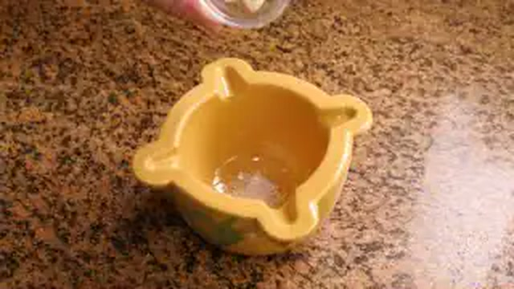

1. **Preparación de Huevos y Extracción de Yemas:**
   * Cocer los 2 huevos camperos en agua hirviendo durante 9 minutos. Enfriar en baño de agua con hielo, pelar y separar con cuidado las yemas cocidas de las claras.
   * Picar las claras en brunoise muy fina (dados de 3 mm) y reservar en un cuenco tapado.
2. **Elaboración del Majado de Mortero (El Secreto de Jaén):**
   * En el mortero, colocar el diente de ajo pelado y desvenado junto con los 4 g de sal marina gruesa (la sal actúa como abrasivo para triturar el ajo sin que salte).
   * Machacar con la maza hasta obtener una pasta lisa y homogénea.
   * Añadir los 2 g de comino en grano y majar enérgicamente hasta pulverizarlo por completo.
   * Incorporar las 2 yemas de huevo cocidas y aplastarlas con la maza hasta integrarlas en la pasta de ajo y comino.
   * Verter los 20 ml de vinagre de Jerez y, a continuación, añadir los 80 ml de AOVE Picual en un hilo fino continuo sin dejar de trabajar la maza con movimientos circulares rápidos. Se formará una emulsión untuosa, dorada y fragante de densidad similar a una salsa fina.
3. **Corte Milimétrico de las Hortalizas:**
   * Pelar los tomates con cuchillo de sierra o escaldándolos 30 segundos en agua hirviendo. Cortarlos sobre una tabla con ranura para no perder ni una gota de su jugo. Picar la pulpa en dados pequeños de 5 mm.
   * Pelar el pepino, cortarlo longitudinalmente, retirar el canal central de semillas con una cuchara pequeña y picar en brunoise de 3x3 mm.
   * Lavar y secar el pimiento verde, retirar el pedúnculo y las semillas interiores, y picar exactamente del mismo tamaño que el pepino.
4. **Ensamblado y Maduración del "Calducho":**
   * En el bol hondo, verter todo el tomate picado con la totalidad de los jugos que haya soltado en la tabla de corte.
   * Agregar el pimiento verde picado, el pepino y las claras de huevo reservadas.
   * Verter la emulsión del mortero rebañando bien las paredes con una lengua de silicona.
   * Mezclar todo el conjunto con una cuchara de madera. Los ácidos del tomate y el vinagre se fundirán con el AOVE y la lecitina de la yema, originando un caldo lechoso y refrescante.
   * Colocar los lomos de atún claro o melva por encima en trozos generosos sin desmenuzar en exceso.
5. **Maceración en Frío:**
   * Llevar al frigorífico a 3-4°C durante **1 hora** antes de llevar a la mesa para que todos los sabores se armonicen.

---

### 📦 Protocolo de Conservación y Batch Cooking
* **Refrigeración (0°C a 4°C):** Conservar en recipiente de cristal hermético durante **48 horas**. A partir del segundo día, el pepino pierde crocancia y cede agua, por lo que es preferible consumirla fresca.
* **Batch Cooking Pro:** Se puede preparar el majado y guardarlo en un tarrito al vacío o tapado con film hasta 4 días. Cortar las hortalizas frescas y mezclar 30 minutos antes del almuerzo.

---

### ❄️ Guía de Servicio y Regeneración en Frío
* Servir en cuencos hondos de barro o cerámica tradicional bien fríos.
* **Acompañamiento Obligatorio:** Servir acompañada de abundante pan de pueblo de corteza crujiente y miga prieta para sopear el calducho.

---

## 3. 🫑 Ensalada de Pimientos Asados al Horno con Melva de Andalucía
*Categoría: Asado Tradicional / Ensalada Templada-Fría de Pimientos*


> 📺 **Vídeo Oficial de Elaboración:** [Ver en YouTube: Pimientos Asados al Horno | Ensalada de Pimientos](https://www.youtube.com/watch?v=3dkUKvJcBn8)


> [!NOTE]
> La textura sedosa de los pimientos asados de Carmen se consigue con dos técnicas cruciales: asarlos a temperatura media-alta untados en AOVE y sal gruesa, y **dejarlos sudar tapados herméticamente** durante 30 minutos tras sacarlos del horno. Esto permite despegar la piel sin esfuerzo y retener el 100% de sus jugos dulces caramelizados.

```
                    ┌───────────────────────────────┐
                    │       PIMIENTOS ASADOS        │
                    │      CARAMELIZACIÓN PURA      │
                    └───────────────┬───────────────┘
                                    │
           ┌────────────────────────┴────────────────────────┐
           ▼                                                 ▼
┌──────────────────────┐                          ┌──────────────────────┐
│ HORNEADO Y SUDADO    │                          │ EMULSIÓN DEL JUGO    │
│ 200°C con piel untada│                          │ Colar jugo del asado │
│ Reposo en recipiente │                          │ Ajo laminado + AOVE  │
│ Pelar sin agua       │                          │ Melva en lomos nobles│
└──────────────────────┘                          └──────────────────────┘
```

### 📋 Ficha Resumen
| Parámetro | Valor |
| :--- | :--- |
| **Tiempo de Preparación** | 15 minutos |
| **Tiempo de Horno** | 45-50 minutos a 200°C |
| **Tiempo de Sudado y Reposo** | 30 minutos |
| **Dificultad** | Baja |
| **Raciones** | 4 personas (aprox. 250 g por ración) |
| **Coste Estimado** | Medio (5,20 € total / 1,30 € por ración) |

---

### ⚠️ Tabla de Alérgenos (Reglamento UE 1169/2011)

| Alérgeno | Estado | Ingrediente Causante / Medida de Adaptación |
| :--- | :---: | :--- |
| **Pescado** | 🔴 **PRESENTE** | Melva canutera o ventresca de atún en aceite. *Sustituir por queso fresco de cabra o huevo cocido.* |
| **Sulfitos** | 🔴 **PRESENTE** | Vinagre de Jerez de buena crianza. |
| **Gluten / Lácteos / Huevos / Frutos Secos** | 🟢 AUSENTE | Formulación limpia. |

---

### ⚖️ Ingredientes Exactos


#### Base de Asado
* **1.200 g (aprox. 4 unidades grandes)** Pimientos rojos morrones carnosos de piel tersa y brillante.
* **150 g (1 unidad)** Cebolleta fresca o cebolla dulce tierna.
* **2 dientes (aprox. 8 g)** Ajo morado, cortados en láminas ultrafinas o majados.
* **200 g** Filetes de melva de Andalucía (o ventresca de bonito del norte) en aceite de oliva.
* **30 ml** Aceite de Oliva Virgen Extra para embadurnar antes de hornear.
* **5 g** Sal marina gruesa.

#### Aliño Emulsionado con Jugos de Asado
* **Todos los jugos colados** desprendidos por los pimientos durante el asado y sudado (aprox. 60-80 ml).
* **60 ml** Aceite de Oliva Virgen Extra variedad Hojiblanca o Arbequina.
* **20 ml** Vinagre de Jerez Reserva D.O.P.
* **3 g** Sal en escamas (tipo Maldon) o sal marina fina.
* **1 pizca** Comino molido (opcional según comarca andaluza).

---

### 🍳 Equipamiento Necesario
* Bandeja de horno con reborde alto.
* Papel de hornear o lámina de silicona.
* Recipiente hondo con tapa hermética o fuente cubierta con papel aluminio (para el sudado).
* Colador de malla fina.
* Fuente de servir alargada.

---

### 👨‍🍳 Paso a Paso Técnico y Minucioso


1. **Horneado y Caramelización de los Pimientos:**
   * Precalentar el horno a **200°C con calor arriba y abajo** (sin ventilador para no secar la carne).
   * Lavar y secar minuciosamente los pimientos rojos con un paño limpio.
   * Disponerlos en la bandeja de horno forrada con papel vegetal. Untar cada pimiento con los 30 ml de AOVE frotando con las manos y espolvorear sal gruesa por encima.
   * Hornear a 200°C durante **45-50 minutos**, dándoles la vuelta a la mitad del tiempo (a los 25 minutos) para que la piel se tueste de manera uniforme y se formen ampollas oscuras en toda la superficie.
2. **Técnica del Sudado Hermético (Crucial):**
   * Sacar los pimientos del horno inmediatamente e introducirlos calientes en un recipiente hondo. Tapar herméticamente con su tapa o con doble capa de papel de aluminio bien sellado en los bordes.
   * Dejar reposar tapados durante **30 minutos**. El vapor atrapado terminará de despegar la epidermis de la pulpa y concentrará los azúcares naturales en un caldo denso.
3. **Pelado Artesanal y Despepitado:**
   * Destapar el recipiente reservando todo el líquido acumulado en el fondo.
   * Pelar los pimientos tirando de la piel con los dedos: se desprenderá de una sola pieza. **NUNCA lavarlos bajo el grifo de agua**, ya que el agua arruinaría el sabor a brasa y el dulzor caramelizado.
   * Retirar el pedúnculo y las semillas interiores.
   * Rasgar la carne de los pimientos longitudinalmente con los dedos o con un cuchillo en tiras de 1,5 a 2 cm de ancho. Colocar las tiras en la fuente de servir.
4. **Filtrado y Emulsión del Aliño:**
   * Colar los jugos acumulados en el recipiente a través de un colador de malla fina sobre un bol para retirar semillas sueltas.
   * Añadir a este jugo el vinagre de Jerez, la sal, los ajos laminados finamente y el AOVE. Batir con unas varillas pequeñas hasta integrar una salsa brillante y sedosa.
5. **Ensamblado y Aderezo:**
   * Cortar la cebolleta fresca en juliana finísima e incorporarla sobre las tiras de pimiento asado.
   * Verter la vinagreta con los jugos por encima asegurando que impregne toda la verdura.
   * Disponer los lomos de melva de Andalucía por encima sin desmigar para mantener una presentación pulcra.
   * Terminar con unas escamas de sal Maldon sobre la melva y un hilo extra de AOVE en crudo.

---

### 📦 Protocolo de Conservación y Batch Cooking
* **Refrigeración (0°C a 4°C):** Esta ensalada es extraordinaria para batch cooking. En recipiente hermético dura en perfecto estado hasta **5 días**, ganando melosidad con el paso de las horas.
* **Congelación:** Se pueden congelar las tiras de pimientos ya asados y limpios sumergidos en su propio jugo (sin cebolleta fresca ni melva) en bolsas zip durante **6 meses**. Descongelar en nevera 24 h y aliñar en fresco.

---

### ❄️ Guía de Servicio y Regeneración en Frío
* Servir a temperatura ambiente templada (16-18°C) o fresca. Acompañar de tostas de pan de masa madre frotadas con ajo.

---

## 4. 🐙 Salpicón de Marisco Tradicional con Pulpo, Gambas y Mejillones
*Categoría: Ensalada Fría de Marisco / Alta Tradición Marinera*


> 📺 **Vídeo Oficial de Elaboración:** [Ver en YouTube: Salpicón de Marisco](https://www.youtube.com/watch?v=u78hq4XjnGo)


> [!NOTE]
> El salpicón de marisco de fiesta de Carmen exige tres mandamientos: cortar todas las verduras en una **brunoise milimétrica de 3x3 mm** para que no roben protagonismo al marisco, respetar los puntos de cocción individuales de cada fruto del mar para evitar texturas gomosas, y emulsionar la vinagreta con una cucharada del agua de cocción del mejillón colada.

```
                    ┌───────────────────────────────┐
                    │      SALPICÓN DE MARISCO      │
                    │      MAESTRÍA COSTERA         │
                    └───────────────┬───────────────┘
                                    │
           ┌────────────────────────┴────────────────────────┐
           ▼                                                 ▼
┌──────────────────────┐                          ┌──────────────────────┐
│ COCCIONES INDIVIDUALES│                         │ BRUNOISE & EMULSIÓN  │
│ Pulpo en rodajas 5mm │                          │ Pimientos 3x3 mm     │
│ Gambas al punto (1m) │                          │ Cebolleta dulce      │
│ Mejillones al vapor  │                          │ Jugo mejillón + AOVE │
└──────────────────────┘                          └──────────────────────┘
```

### 📋 Ficha Resumen
| Parámetro | Valor |
| :--- | :--- |
| **Tiempo de Preparación** | 30 minutos |
| **Tiempo de Cocción** | 10 minutos |
| **Tiempo de Maceración** | Mínimo 2 horas en frío |
| **Dificultad** | Media-Baja |
| **Raciones** | 6 personas (aprox. 220 g por ración) |
| **Coste Estimado** | Medio-Alto (12,50 € total / 2,08 € por ración) |

---

### ⚠️ Tabla de Alérgenos (Reglamento UE 1169/2011)

| Alérgeno | Estado | Ingrediente Causante / Medida de Adaptación |
| :--- | :---: | :--- |
| **Moluscos** | 🔴 **PRESENTE** | Pulpo cocido y mejillones frescos de roca. |
| **Crustáceos** | 🔴 **PRESENTE** | Gambas blancas o langostinos cocidos. |
| **Sulfitos** | 🔴 **PRESENTE** | Vinagre de Jerez o vino blanco del vapor de mejillones. |
| **Pescado / Gluten / Lácteos / Huevos** | 🟢 AUSENTE | Formulación tradicional limpia. |

---

### ⚖️ Ingredientes Exactos


#### Selección de Mariscos Nobles
* **300 g** Pata de pulpo cocido de roca (cortado al bies en rodajas de 5 mm).
* **300 g** Gamba blanca fresca de Huelva o langostinos crudos (para cocer y pelar; peso neto aprox. 180 g).
* **500 g** Mejillones frescos de roca en concha (limpios y desbarbados; rinde aprox. 150 g de vianda limpia).
* **1 hoja** Laurel seco y **30 ml** de vino blanco seco para abrir los mejillones.

#### Hortalizas en Brunoise Fina
* **100 g (1 unidad pequeña)** Pimiento rojo morrón carnoso.
* **100 g (1 unidad)** Pimiento verde italiano.
* **80 g (1/2 unidad)** Pimiento amarillo dulce (aporta contraste cromático).
* **120 g (1 unidad)** Cebolleta fresca dulce o cebolla morada.
* **15 g** Perejil fresco picado a cuchillo en el momento.

#### Vinagreta Marinera Ligada
* **90 ml** Aceite de Oliva Virgen Extra (AOVE) suave (variedad Arbequina).
* **30 ml** Vinagre de Jerez Reserva D.O.P. (o vinagre de manzana ecológico).
* **20 ml** Caldo de cocción de los mejillones, perfectamente colado por gasa o colador fino.
* **4 g** Flor de sal o sal marina fina.
* **1 g** Pimienta blanca molida.

---

### 🍳 Equipamiento Necesario
* Cazuela con tapa para cocer mejillones al vapor.
* Cazo para cocción rápida de gambas con bol de agua con hielo.
* Tabla de corte amplia de polietileno y cuchillo cebollero afilado.
* Bol hondo de cristal para mezclar y reposar.
* Colador con estameña o gasa fina.

---

### 👨‍🍳 Paso a Paso Técnico y Minucioso

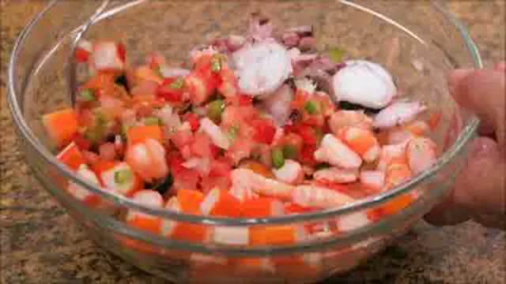

1. **Apertura y Limpieza de los Mejillones:**
   * Limpiar la concha de los mejillones con un cuchillo retirando adherencias y tirar de la barba hacia la parte ancha de la concha para no desgarrar la carne.
   * En una cazuela amplia, verter los 30 ml de vino blanco y la hoja de laurel. Añadir los mejillones, tapar y llevar a fuego vivo durante **2 a 3 minutos**, retirándolos conforme se vayan abriendo. Desechar los que permanezcan cerrados.
   * Separar la vianda de las conchas y retirar cualquier resto de filamento.
   * Colar el jugo de la cazuela por un colador con gasa fina y reservar 20 ml para la vinagreta.
2. **Cocción Exprés de las Gambas:**
   * En un cazo con agua hirviendo con 20 g de sal marina por litro, sumergir las gambas durante **60 a 90 segundos** (hasta que cambien de color y floten ligeramente).
   * Pasar inmediatamente al bol de agua con hielo durante 2 minutos para frenar la cocción y dejar la carne tersa y prieta.
   * Pelar las gambas retirando cabeza y cáscaras (reservar cáscaras para un fumet de otro uso). Cortar las gambas en dos o tres trozos según calibre.
3. **Corte del Pulpo:**
   * Con un cuchillo bien afilado, cortar la pata de pulpo cocido en rodajas finas de medio centímetro de grosor al bies.
4. **Corte Milimétrico de la Verdura (Brunoise Perfecta):**
   * Lavar y secar los pimientos verde, rojo y amarillo. Cortar en láminas finas y luego en tiras de 3 mm para obtener dados exactos de 3x3 mm.
   * Pelar y cortar la cebolleta fresca en brunoise idéntica a la del pimiento.
5. **Emulsión de la Vinagreta de Agua Marina:**
   * En un cuenco, mezclar la sal fina, la pimienta blanca molida y el vinagre de Jerez hasta que la sal esté 100% disuelta.
   * Añadir los 20 ml del caldo de mejillón colado a temperatura ambiente.
   * Incorporar los 90 ml de AOVE Arbequina batiendo con varilla manual hasta lograr una emulsión ligeramente opaca y densa.
6. **Ensamblado y Maduración:**
   * En el bol principal, colocar el pulpo, los mejillones enteros o cortados por la mitad, las gambas troceadas y la brunoise de verduras.
   * Verter la vinagreta emulsionada y el perejil fresco picado.
   * Remover con movimientos suaves de abajo hacia arriba para que todos los elementos queden bañados de manera uniforme.
   * Tapar y refrigerar durante un mínimo de **2 horas** a 3°C antes de servir.

---

### 📦 Protocolo de Conservación y Batch Cooking
* **Refrigeración (0°C a 4°C):** Conservar en recipiente hermético de cristal durante **3 días**. El marisco se impregna del aliño y gana sabor al segundo día sin perder tersura.
* **Congelación:** ❌ **NO RECOMENDADA**. Los pimientos crudos y el marisco descongelado en vinagreta pierden agua y quedan blandos.

---

### ❄️ Guía de Servicio y Regeneración en Frío
* Servir en copas anchas de cóctel de cristal o platos hondos fríos, decorado con una gamba entera cocida en el borde y una ramita de perejil rizado.

---

## 5. 🥗 Ensaladilla Rusa Tradicional de Carmen con Mayonesa Casera
*Categoría: Ensalada Fría de Patata / Clásico Emblemático de España*

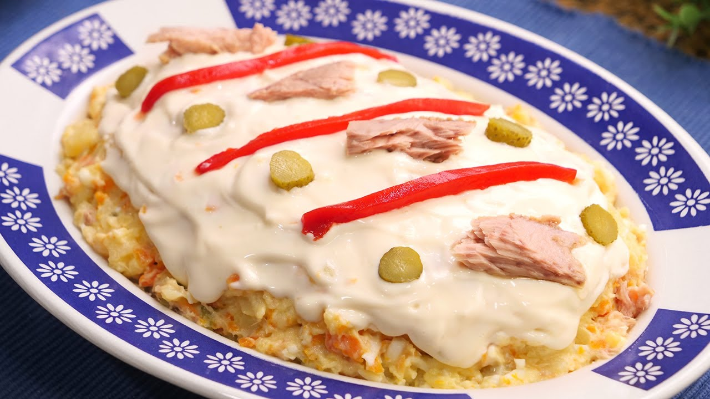

> 📺 **Vídeo Oficial de Elaboración:** [Ver en YouTube: Ensaladilla Rusa lista en minutos y súper cremosa](https://www.youtube.com/watch?v=dnb8hFQRQ7s)


> [!NOTE]
> La ensaladilla rusa de Carmen se distingue por su textura cremosa pero con identidad: **la patata nunca se tritura con batidora**, sino que se chasca y aplasta toscamente con el tenedor mientras aún desprende vapor, humedeciéndola con el jugo aceitoso del atún antes de fundirla con una mayonesa casera densa y suave.

```
                    ┌───────────────────────────────┐
                    │       ENSALADILLA RUSA        │
                    │       TEXTURA Y EMULSIÓN      │
                    └───────────────┬───────────────┘
                                    │
           ┌────────────────────────┴────────────────────────┐
           ▼                                                 ▼
┌──────────────────────┐                          ┌──────────────────────┐
│  PATATA Y ZANAHORIA  │                          │   MAYONESA CASERA    │
│ Cocción entera c/piel│                          │ Huevo t° ambiente    │
│ Machacado a tenedor  │                          │ Aceite suave + limón │
│ Templada + jugo atún │                          │ Montado espeso noble │
└──────────────────────┘                          └──────────────────────┘
```

### 📋 Ficha Resumen
| Parámetro | Valor |
| :--- | :--- |
| **Tiempo de Preparación** | 25 minutos |
| **Tiempo de Cocción** | 30 minutos |
| **Tiempo de Reposo en Frío** | Mínimo 3 horas (óptimo de un día para otro) |
| **Dificultad** | Media-Baja |
| **Raciones** | 6 personas (aprox. 280 g por ración) |
| **Coste Estimado** | Económico (4,90 € total / 0,81 € por ración) |

---

### ⚠️ Tabla de Alérgenos (Reglamento UE 1169/2011)

| Alérgeno | Estado | Ingrediente Causante / Medida de Adaptación |
| :--- | :---: | :--- |
| **Huevos** | 🔴 **PRESENTE** | Huevos duros picados y huevo fresco en la mayonesa casera. *Usar lactonesa o mayonesa vegana (aquafaba).* |
| **Pescado** | 🔴 **PRESENTE** | Atún en aceite de oliva y anchoas (si se usan aceitunas rellenas). |
| **Sulfitos** | 🔴 **PRESENTE** | Pimientos del piquillo en conserva y aceitunas. |
| **Gluten / Lácteos / Soja** | 🟢 AUSENTE | Formulación tradicional limpia. |

---

### ⚖️ Ingredientes Exactos


#### Base de Tubérculos y Hortalizas
* **700 g** Patatas para cocer (variedad Monalisa o Kennebec), enteras y limpias.
* **250 g (2-3 unidades)** Zanahorias medianas peladas.
* **3 unidades** Huevos camperos categoría L.
* **100 g** Guisantes finos tiernos (cocidos al vapor 3 minutos o de conserva extrafina).
* **200 g** Atún claro en aceite de oliva (peso escurrido aprox. 140 g).
* **80 g** Aceitunas rellenas de anchoa o manzanilla, picadas toscamente.
* **60 g** Tiras de pimiento del piquillo asado en conserva para decorar.

#### Mayonesa Casera Tradicional Estable
* **1 unidad (aprox. 60 g)** Huevo campero fresco a temperatura ambiente (o pasteurizado).
* **200 ml** Aceite de girasol o aceite de oliva virgen extra muy suave (variedad Arbequina) para que no amargue ni enmascare.
* **50 ml** Aceite de Oliva Virgen Extra Hojiblanca (para rematar sabor).
* **10 ml (2 cucharaditas)** Zumo de limón recién exprimido o vinagre de manzana.
* **3 g (1/2 cucharadita)** Sal marina fina.

---

### 🍳 Equipamiento Necesario
* Olla amplia con tapa.
* Batidora de mano de inmersión (brazo túrmix) con vaso alto graduado.
* Tenedor de acero inoxidable o machacador de patatas manual.
* Bol amplio para ensamblado y espátula de repostería (lengua).
* Fuente o plato ovalado para presentación tradicional.

---

### 👨‍🍳 Paso a Paso Técnico y Minucioso


1. **Cocción Homogénea de Patatas, Zanahorias y Huevos:**
   * En una olla con abundante agua fría y 15 g de sal, introducir las patatas enteras con piel y las zanahorias peladas.
   * Llevar a ebullición. Las zanahorias estarán tiernas a los **20 minutos** (comprobar pinchando y retirar). Las patatas tardarán entre **25 y 30 minutos**.
   * Cocer los 3 huevos en cazo aparte durante 9 minutos y enfriar en agua con hielo. Pelar y separar 1 yema para la decoración final rallada.
2. **Machacado en Caliente e Hidratación:**
   * Pelar las patatas aún tibias. En el bol amplio, chascarlas con un tenedor grande aplastando los trozos irregulares sin convertirlas en puré pegajoso (debe quedar textura con pequeños tropezones).
   * Verter 2 cucharadas del aceite que viene en la lata de atún sobre la patata caliente y una pizca de sal. Mezclar para que el almidón absorba la grasa perfumada.
   * Picar las zanahorias en daditos de 4-5 mm e incorporarlas al bol.
   * Añadir los 2 huevos duros picados y la clara restante en dados menudos.
3. **Elaboración de la Mayonesa Casera Infalible:**
   * En el vaso alto de la batidora, colocar en el fondo el huevo a temperatura ambiente, los 3 g de sal y los 10 ml de zumo de limón.
   * Verter los 250 ml de aceite por encima (mezcla de girasol y AOVE).
   * Introducir el brazo de la batidora hasta tocar el fondo absoluto del vaso.
   * Encender a velocidad media-alta sin mover el brazo durante **10 a 12 segundos** hasta que se observe que la emulsión blanquea y sube por los lados.
   * Comenzar a levantar la batidora lentamente de abajo hacia arriba con movimientos suaves hasta que todo el aceite quede integrado en una mayonesa espesa y consistente.
4. **Ensamblado y Unión de Ingredientes:**
   * Esperar a que la mezcla de patata y zanahoria esté completamente fría (temperatura ambiente) para no cortar la mayonesa con el calor.
   * Añadir el atún escurrido y desmigado, los guisantes tiernos y las aceitunas picadas.
   * Incorporar tres cuartas partes de la mayonesa casera y mezclar con la espátula con delicadeza hasta que toda la ensaladilla quede ligada uniformemente.
5. **Moldeado y Decoración de Carmen:**
   * Volcar la ensaladilla en una fuente ovalada y alisar la superficie con la espátula dándole forma de cúpula redondeada.
   * Cubrir la superficie con una capa fina de la mayonesa restante para crear un manto blanco pulcro.
   * Decorar con tiras de pimiento del piquillo formando un enrejado, aceitunas enteras y la yema de huevo cocido reservada rallada por encima con un rallador microplane.
6. **Reposo Térmico:**
   * Refrigerar a 3-4°C cubierta con campana o film (sin tocar la mayonesa) durante al menos **3 horas** antes del servicio.

---

### 📦 Protocolo de Conservación y Batch Cooking
* **Refrigeración (0°C a 4°C):** Si se utiliza huevo fresco crudo en la mayonesa, consumir en un máximo de **48 horas**. Si se utiliza huevo pasteurizado, su vida útil se extiende a **4 días** en recipiente hermético.
* **Regla de Oro:** ❌ **NUNCA dejar a temperatura ambiente** más de 30 minutos por riesgo higiénico-sanitario (*Salmonella*).
* **Congelación:** ❌ **INVIABLE**. La mayonesa se separa en dos fases (aceite y agua) y la patata se vuelve incomible.

---

### ❄️ Guía de Servicio y Regeneración en Frío
* Servir bien fría directamente de la nevera, acompañada de picos camperos, colines o regañás de aceite de oliva.

---

## 6. 🍝 Ensalada de Pasta de Verano con Atún, Maíz y Salsa Rosa Casera
*Categoría: Ensalada Fría de Pasta / Verano Familiar*

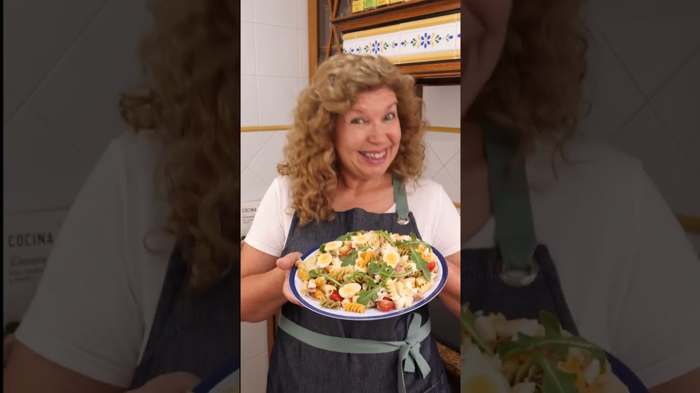

> 📺 **Vídeo Oficial de Elaboración:** [Ver en YouTube: Ensalada de Pasta Fría muy Fácil, Rápida y Deliciosa](https://www.youtube.com/watch?v=BSAR9PTbrcE)


> [!NOTE]
> Para lograr una ensalada de pasta suelta y con textura impecable, Carmen aplica el principio de la **cocción *al dente* estricta**: cocer la pasta 1 minuto menos de lo que indica el fabricante y enfriarla extendida en una bandeja con un hilo de AOVE. Nunca debe pasarse por agua fría del grifo, ya que se eliminaría la película superficial que retiene la salsa rosa.

```
                    ┌───────────────────────────────┐
                    │       ENSALADA DE PASTA       │
                    │      COCCIÓN Y ADHERENCIA     │
                    └───────────────┬───────────────┘
                                    │
           ┌────────────────────────┴────────────────────────┐
           ▼                                                 ▼
┌──────────────────────┐                          ┌──────────────────────┐
│  PASTA AL DENTE      │                          │   SALSA ROSA NOBLE   │
│ Espirales tricolor   │                          │ Mayonesa casera      │
│ 1 min menos cocción  │                          │ Zumo naranja natural │
│ Enfriar en bandeja   │                          │ Kétchup + brandy     │
└──────────────────────┘                          └──────────────────────┘
```

### 📋 Ficha Resumen
| Parámetro | Valor |
| :--- | :--- |
| **Tiempo de Preparación** | 20 minutos |
| **Tiempo de Cocción** | 9 minutos |
| **Tiempo de Reposo en Frío** | 1 hora |
| **Dificultad** | Muy Baja |
| **Raciones** | 4 personas (aprox. 320 g por ración) |
| **Coste Estimado** | Muy Económico (3,90 € total / 0,97 € por ración) |

---

### ⚠️ Tabla de Alérgenos (Reglamento UE 1169/2011)

| Alérgeno | Estado | Ingrediente Causante / Medida de Adaptación |
| :--- | :---: | :--- |
| **Gluten** | 🔴 **PRESENTE** | Pasta de trigo duro (hélices o espirales). *Sustituir por pasta de maíz, arroz o garbanzo 100% sin gluten.* |
| **Huevos** | 🔴 **PRESENTE** | Huevo duro y huevo de la mayonesa en la salsa rosa. |
| **Pescado** | 🔴 **PRESENTE** | Atún claro y salsa Worcestershire (contiene anchoa). |
| **Lácteos** | 🔴 **PRESENTE** | Dados de queso semicurado o gouda. *Omitir o usar queso vegano.* |
| **Sulfitos** | 🔴 **PRESENTE** | Salsa Worcestershire y brandy. |

---

### ⚖️ Ingredientes Exactos


#### Base de Pasta y Tropezones Frescos
* **300 g** Pasta corta estriada (hélices, espirales tricolor, *fusilli* o *penne rigate* de trigo duro).
* **160 g** Atún claro en aceite de oliva (peso escurrido aprox. 110 g).
* **140 g** Maíz dulce tierno en grano en conserva (escurrido).
* **100 g** Queso semicurado o gouda suave, cortado en cubitos de 5x5 mm.
* **2 unidades** Huevos camperos cocidos (pelados y picados en dados).
* **150 g** Tomates cherry maduros (tipo pera o cherry rojo), cortados en mitades.
* **60 g** Aceitunas negras deshuesadas tipo cacereña, cortadas en rodajas.
* **15 ml** Aceite de Oliva Virgen Extra para el enfriado de la pasta.

#### Salsa Rosa Casera Artesana de Carmen
* **150 g** Mayonesa suave casera o de calidad.
* **30 g (2 cucharadas soperas)** Concentrado de tomate o kétchup artesano.
* **20 ml (zumo de 1/2 unidad)** Zumo de naranja natural recién exprimido (aporta brillo y acidez frutal).
* **5 ml (1 cucharadita)** Brandy o Coñac de Jerez (opcional, evaporado o crudo).
* **3 gotas** Salsa Worcestershire (tipo Perrins).
* **1 g** Sal fina y una pizca de pimienta blanca.

---

### 🍳 Equipamiento Necesario
* Olla grande (mínimo 4 litros de agua para 300 g de pasta).
* Bandeja amplia de metal o cristal para enfriado rápido.
* Bol grande de mezcla.
* Batidor pequeño para la salsa rosa.

---

### 👨‍🍳 Paso a Paso Técnico y Minucioso

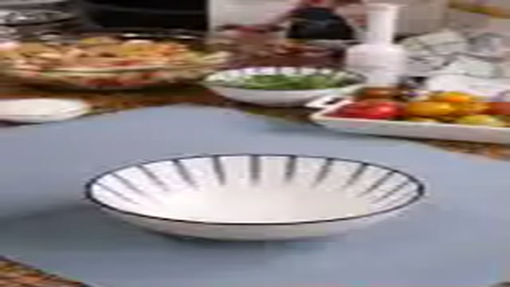

1. **Cocción Rigurosa de la Pasta:**
   * Poner a hervir 3,5 litros de agua con 30 g de sal marina en una olla amplia a fuego vivo.
   * Cuando alcance el borbotón fuerte, añadir los 300 g de pasta y remover durante los primeros 30 segundos para evitar que se pegue al fondo.
   * Cocer exactamente durante **8 a 9 minutos** (1 minuto menos que las instrucciones del paquete para que quede firme y resista el aliño sin reblandecerse).
2. **Técnica de Enfriado en Bandeja (Sin Lavar):**
   * Escurrir la pasta inmediatamente en un colador agitando con fuerza para expulsar el agua de los pliegues.
   * Volcar la pasta caliente sobre una bandeja amplia extendiéndola en una sola capa.
   * Rociar con los 15 ml de AOVE y remover con dos cucharas. El calor evaporará la humedad superficial y el aceite creará una película antiadherente que mantendrá los granos y espirales sueltos mientras enfría a temperatura ambiente.
3. **Elaboración de la Salsa Rosa Equilibrada:**
   * En un cuenco, disponer la mayonesa y añadir el kétchup, el zumo de naranja natural colado, el brandy y las gotas de salsa Worcestershire.
   * Batir enérgicamente con las varillas hasta homogeneizar una salsa de color salmón brillante y textura fluida pero envolvente. Probar y rectificar de sal y pimienta.
4. **Ensamblado y Fusión de Ingredientes:**
   * En el bol hondo, colocar la pasta ya fría.
   * Añadir el atún desmigado, el maíz dulce escurrido, los dados de queso, las aceitunas negras, los tomates cherry cortados y los huevos duros picados.
   * Incorporar la salsa rosa casera y mezclar de manera envolvente con dos cucharas hasta que cada pieza de pasta quede napada por la salsa.
5. **Reposo y Asentado:**
   * Refrigerar durante **1 hora** a 3-4°C para servir refrescante.

---

### 📦 Protocolo de Conservación y Batch Cooking
* **Refrigeración (0°C a 4°C):** Conservar en fiambrera hermética durante **3 a 4 días**.
* **Consejo Pro de Batch Cooking:** Si se guarda para varios días, mezclar la pasta con los ingredientes sólidos y conservar la salsa rosa en un tarrito separado. Mezclar la salsa rosa con la pasta 15 minutos antes de consumir para que la pasta no absorba la salsa en exceso durante el almacenamiento.

---

### ❄️ Guía de Servicio y Regeneración en Frío
* Servir en plato hondo decorado con unas hojas de albahaca fresca o perejil picado y un toque extra de maíz dulce por encima.

---

## 7. 🧆 Ensalada de Garbanzos Veraniega con Verduras Frescas y Comino
*Categoría: Ensalada Fría de Legumbre / Nutrición y Tradición Mediterránea*

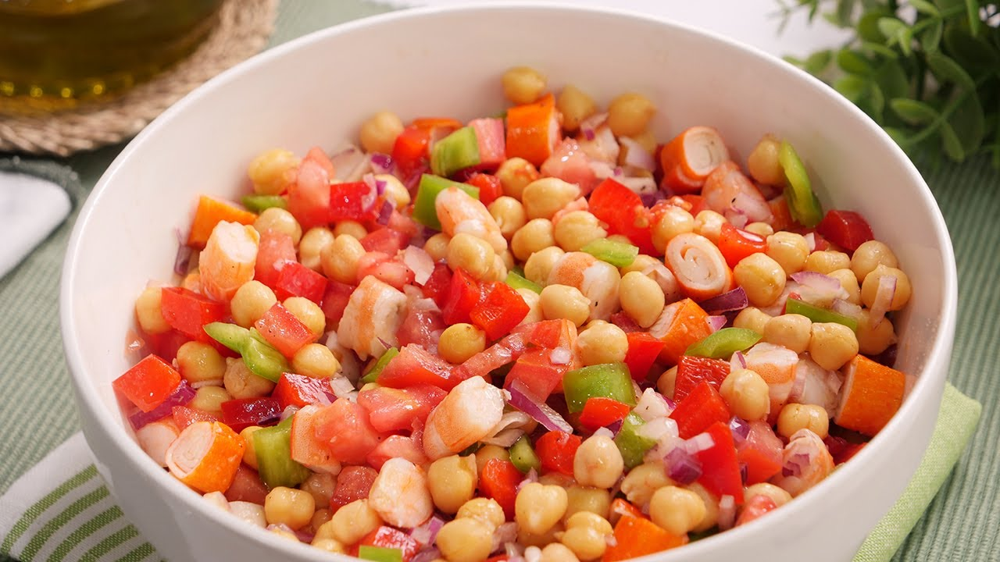

> 📺 **Vídeo Oficial de Elaboración:** [Ver en YouTube: Ensalada de Garbanzos lista en minutos y súper fresca](https://www.youtube.com/watch?v=gRvgUZrW6DU)


> [!NOTE]
> Para convertir una legumbre en una ensalada veraniega ligera y digestible, Carmen recurre a dos técnicas fundamentales: **el enjuague meticuloso y secado de los garbanzos** para retirar restos de espuma o mucílago, y una vinagreta emulsionada con comino molido al momento y mostaza antigua, que potencia el sabor terroso y neutraliza los gases intestinales.

```
                    ┌───────────────────────────────┐
                    │     ENSALADA DE GARBANZOS     │
                    │      FRESCURA Y DIGESTIÓN     │
                    └───────────────┬───────────────┘
                                    │
           ┌────────────────────────┴────────────────────────┐
           ▼                                                 ▼
┌──────────────────────┐                          ┌──────────────────────┐
│  LEGUMBRE MANTECOSA  │                          │  VINAGRETA DE COMINO │
│ Garbanzo pedrosillano│                          │ Comino tostado mortero│
│ Enjuague y secado    │                          │ Mostaza antigua      │
│ Piel fina y entera   │                          │ AOVE + vinagre Jerez │
└──────────────────────┘                          └──────────────────────┘
```

### 📋 Ficha Resumen
| Parámetro | Valor |
| :--- | :--- |
| **Tiempo de Preparación** | 15 minutos |
| **Tiempo de Cocción** | 0 minutos (con garbanzos cocidos de calidad) o 90 min tradicionales |
| **Tiempo de Maceración** | 30 minutos en frío |
| **Dificultad** | Muy Baja |
| **Raciones** | 4 personas (aprox. 300 g por ración) |
| **Coste Estimado** | Muy Económico (3,20 € total / 0,80 € por ración) |

---

### ⚠️ Tabla de Alérgenos (Reglamento UE 1169/2011)

| Alérgeno | Estado | Ingrediente Causante / Medida de Adaptación |
| :--- | :---: | :--- |
| **Mostaza** | 🔴 **PRESENTE** | Mostaza antigua de grano en la vinagreta. *Omitir si hay alergia.* |
| **Huevos** | 🔴 **PRESENTE** | Huevo duro en la guarnición. *Omitir para versión 100% vegana.* |
| **Sulfitos** | 🔴 **PRESENTE** | Vinagre de Jerez o vino blanco. |
| **Gluten / Pescado / Lácteos / Soja** | 🟢 AUSENTE | Formulación naturalmente limpia. |

---

### ⚖️ Ingredientes Exactos


#### Base de Legumbres y Huerta
* **500 g** Garbanzos cocidos (variedad Pedrosillano o Lechoso), tiernos y con piel fina (peso neto escurrido).
* **150 g (1 unidad)** Pimiento rojo morrón carnoso, cortado en brunoise fina.
* **120 g (1 unidad)** Pimiento verde italiano, en dados de 5 mm.
* **120 g (1 unidad)** Cebolleta fresca dulce, cortada en brunoise.
* **150 g** Tomates tipo Kumato o cherry maduros, cortados en cuartos.
* **60 g** Aceitunas negras de Aragón o Kalamata deshuesadas.
* **2 unidades** Huevos camperos cocidos durante 9 minutos (pelados y picados).
* **10 g** Cilantro o perejil fresco picado (según preferencia regional).

#### Vinagreta Digestiva Emulsionada
* **75 ml** Aceite de Oliva Virgen Extra (AOVE) variedad Picual o Hojiblanca.
* **25 ml** Vinagre de Jerez D.O.P. o Vinagre de Manzana sin filtrar.
* **1 cucharadita (5 g)** Mostaza a la antigua (con granos enteros).
* **1/2 cucharadita (2 g)** Comino en grano tostado en sartén seca y molido al mortero.
* **4 g** Sal marina fina y una pizca de pimienta negra.

---

### 🍳 Equipamiento Necesario
* Escurridor de malla fina.
* Mortero pequeño para machacar el comino.
* Tarro de cristal hermético para agitar la vinagreta.
* Bol hondo de servicio.

---

### 👨‍🍳 Paso a Paso Técnico y Minucioso

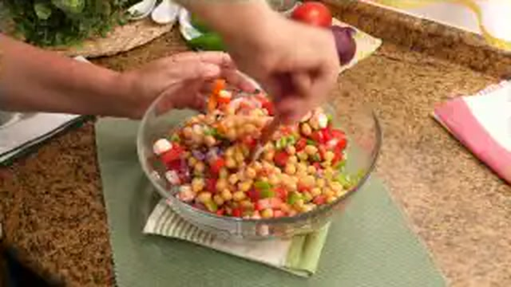

1. **Preparación y Secado de la Legumbre:**
   * Si se utilizan garbanzos en conserva de tarro de cristal, volcarlos en un escurridor y lavarlos suavemente bajo el chorro de agua fría hasta eliminar todo rastro del líquido de gobierno (aquafaba).
   * Dejar escurrir durante **10 minutos** y secar suavemente sobre papel de cocina absorbente. Los garbanzos deben estar completamente secos para que la vinagreta se adhiera a su piel.
2. **Corte Homogéneo de las Verduras:**
   * Picar en dados muy limpios y regulares (brunoise de 5x5 mm) los pimientos rojo y verde, y la cebolleta fresca.
   * Cortar los tomates Kumato en dados o los cherry en cuartos.
3. **Elaboración de la Vinagreta Digestiva de Comino:**
   * Tostar las semillas de comino en una sartén sin aceite durante 1 minuto hasta que desprendan su fragancia oleosa. Majar en el mortero.
   * En el tarro de cristal, añadir la sal, la pimienta, el vinagre y la mostaza antigua. Disolver bien.
   * Añadir el comino molido y los 75 ml de AOVE. Cerrar el tarro y agitar enérgicamente durante 15 segundos hasta obtener una vinagreta emulsionada, espesa y fragante.
4. **Mezclado y Macerado:**
   * En el bol principal, verter los garbanzos secos, la verdura picada, las aceitunas negras y el perejil o cilantro picado.
   * Rociar con la totalidad de la vinagreta y mezclar suavemente con una cuchara grande para no reventar los garbanzos.
   * Añadir por encima los huevos cocidos troceados.
   * Dejar reposar en el frigorífico a 3-4°C durante **30 minutos** antes de consumir para que la legumbre absorba la acidez y las notas especiadas.

---

### 📦 Protocolo de Conservación y Batch Cooking
* **Refrigeración (0°C a 4°C):** Se conserva en condiciones excelentes durante **4 a 5 días** en recipiente hermético. Es uno de los platos más resistentes y equilibrados para llevar en táper al trabajo.
* **Congelación:** ❌ **NO RECOMENDADA** con las verduras crudas añadidas.

---

### ❄️ Guía de Servicio y Regeneración en Frío
* Servir a temperatura fresca (14°C). Remover bien desde el fondo antes de servir cada ración para redistribuir la vinagreta que se haya decantado.

---

## 8. 🥬 Cogollos de Tudela al Ajillo con Anchoas del Cantábrico y Ajo Confitado
*Categoría: Aliño Templado-Frío de Ensalada / Tradición Navarra y Andaluza*

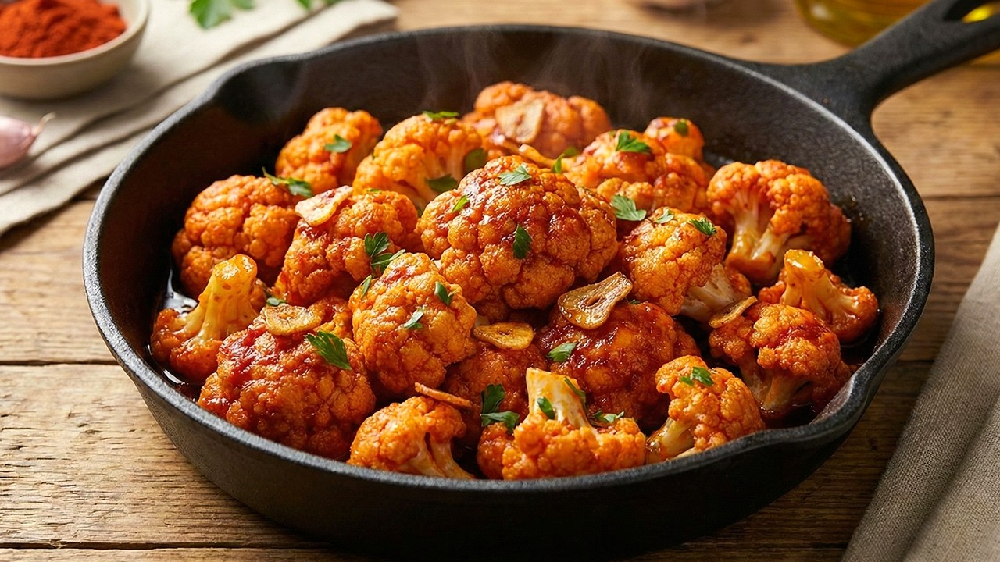

> 📺 **Vídeo Oficial de Elaboración:** [Ver en YouTube: Coliflor al Ajillo con Pimentón - Receta Fácil y Deliciosa](https://www.youtube.com/watch?v=5R-fw9lkY7M)


> [!NOTE]
> La maestría en este plato reside en el contraste térmico y de texturas: el cogollo debe estar **helado, terso y crujiente**, mientras que el refrito de ajos laminados y pimentón se vierte templado tras apagarlo con vinagre de Jerez fuera del fuego. Las anchoas del Cantábrico aportan el punto salino y umami definitivo.

```
                    ┌───────────────────────────────┐
                    │      COGOLLOS AL AJILLO       │
                    │      CONTRASTE TÉRMICO        │
                    └───────────────┬───────────────┘
                                    │
           ┌────────────────────────┴────────────────────────┐
           ▼                                                 ▼
┌──────────────────────┐                          ┌──────────────────────┐
│  COGOLLO CRUJIENTE   │                          │  REFRITO TEMPLADO    │
│ Lavado y secado 100% │                          │ Ajo laminado dorado  │
│ Corte en cuartos     │                          │ Desglasado con Jerez │
│ Temperatura helada   │                          │ Anchoas 00 Cantábrico│
└──────────────────────┘                          └──────────────────────┘
```

### 📋 Ficha Resumen
| Parámetro | Valor |
| :--- | :--- |
| **Tiempo de Preparación** | 10 minutos |
| **Tiempo de Cocinado del Refrito** | 5 minutos |
| **Dificultad** | Muy Baja |
| **Raciones** | 4 personas (aprox. 2 cogollos por persona) |
| **Coste Estimado** | Medio (6,50 € total / 1,62 € por ración) |

---

### ⚠️ Tabla de Alérgenos (Reglamento UE 1169/2011)

| Alérgeno | Estado | Ingrediente Causante / Medida de Adaptación |
| :--- | :---: | :--- |
| **Pescado** | 🔴 **PRESENTE** | Filetes de anchoa del Cantábrico. *Sustituir por láminas de tomate seco confitado para versión vegana.* |
| **Sulfitos** | 🔴 **PRESENTE** | Vinagre de Jerez o sidra en el refrito. |
| **Gluten / Lácteos / Huevos / Soja** | 🟢 AUSENTE | Formulación totalmente limpia. |

---

### ⚖️ Ingredientes Exactos


#### Base Vegetal y Salina
* **4 unidades (aprox. 500 g)** Cogollos de Tudela frescos, apretados y sin hojas marchitas.
* **12-16 filetes (aprox. 80 g)** Anchoas del Cantábrico en aceite de oliva (calidad 00).
* **60 g** Tiras de pimientos del piquillo asados en conserva (opcional para acompañar).

#### Refrito Tradicional al Ajillo de Carmen
* **80 ml** Aceite de Oliva Virgen Extra (AOVE) variedad Hojiblanca.
* **4 dientes (aprox. 16 g)** Ajo morado, pelados y cortados en láminas uniformes de 1,5 mm.
* **25 ml** Vinagre de Jerez D.O.P. o vinagre de sidra natural.
* **1/2 cucharadita (1,5 g)** Pimentón dulce de la Vera D.O.P. (o una punta de guindilla seca si se desea picante).
* **2 g** Flor de sal en escamas.

---

### 🍳 Equipamiento Necesario
* Centrifugadora de lechuga (esencial para eliminar el agua).
* Sartén pequeña antiadherente o cazo de hierro.
* Cuchillo chef bien afilado.
* Bandeja alargada de presentación.

---

### 👨‍🍳 Paso a Paso Técnico y Minucioso


1. **Limpieza, Desinfección y Secado Centrifugado:**
   * Retirar la primera capa exterior de hojas de los cogollos si están dañadas. Cortar la base del tallo manteniendo la unión para que las hojas no se suelten.
   * Lavar sumergiéndolos rápidamente en agua helada.
   * Pasar por centrifugadora de ensaladas o secar minuciosamente sacudiéndolos sobre un paño de cocina limpio. **Cualquier gota de agua residual impedirá que el aceite al ajillo se adhiera al cogollo**.
   * Cortar cada cogollo longitudinalmente en dos mitades y luego cada mitad en dos cuartos (obteniendo 4 cuartos alargados por cogollo).
   * Disponer los cuartos en la bandeja de servir con el corazón hacia arriba.
2. **Elaboración del Refrito al Ajillo Templado:**
   * En una sartén pequeña, calentar los 80 ml de AOVE a fuego medio-bajo.
   * Añadir los ajos laminados y confitarlos lentamente hasta que adquieran un tono dorado pálido y textura crujiente (**cuidado**: si el ajo se quema, amarga todo el plato; retirar en cuanto empiece a dorarse).
   * Apartar la sartén del fuego. Dejar templar 15 segundos y añadir el pimentón dulce de la Vera, removiendo para que se disuelva sin quemarse.
   * Verter inmediatamente los 25 ml de vinagre de Jerez sobre el aceite templado con precaución ante posibles salpicaduras. La mezcla chisporroteará y emulsionará al instante formando una vinagreta templada de color caoba.
3. **Ensamblado y Aderezo Final:**
   * Colocar un filete de anchoa del Cantábrico sobre cada cuarto de cogollo frío (y una tira de pimiento del piquillo al lado).
   * Rociar inmediatamente todo el refrito templado con los ajos dorados por encima de los cogollos con ayuda de una cuchara sopera.
   * Espolvorear unas escamas de flor de sal exclusivamente sobre las zonas del cogollo sin anchoa.

---

### 📦 Protocolo de Conservación y Batch Cooking

> [!WARNING]
> Este plato debe consumirse al momento de su aliñado. Si se deja reposar aliñado en nevera, el ácido del vinagre y la sal marchitarán los cogollos en menos de 2 horas.

* **Conservación para Batch Cooking:**
  * **Cogollos limpios y secos:** Guardar los cuartos de cogollo en una bolsa de conservación con papel absorbente en la nevera hasta **4 días**.
  * **Refrito de ajos:** Guardar el aceite de ajos y vinagre en un tarro hermético.
  * **Ensamblado:** Calentar el refrito 20 segundos y verter sobre los cogollos fríos justo antes de sentarse a la mesa.

---

### ❄️ Guía de Servicio y Regeneración en Frío
* Servir de inmediato disfrutando del contraste entre el frío crujiente de la verdura y la calidez aromática del ajillo y la salinidad de la anchoa.

---

## 9. 🐟 Boquerones en Vinagre Tradicionales de Carmen con AOVE, Ajo y Perejil
*Categoría: Pescado Azul Marinado en Frío / Tapa Estrella de España*

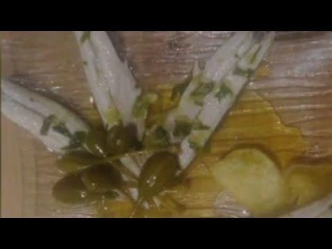

> 📺 **Vídeo Oficial de Elaboración:** [Ver en YouTube: BOQUERONES EN VINAGRE](https://www.youtube.com/watch?v=pSdiSoRbxXg)


> [!NOTE]
> Para obtener unos boquerones en vinagre dignos de la mejor taberna andaluza, Carmen exige tres técnicas maestras: **el desangrado en agua con hielo** para una carne blanca inmaculada, **el curado ácido equilibrado** (vinagre de vino blanco + un toque de agua fría para no acartonar la fibra), y la **congelación preventiva a -20°C durante 5 días** para garantizar 100% de seguridad contra el parásito *Anisakis*.

```
                    ┌───────────────────────────────┐
                    │     BOQUERONES EN VINAGRE     │
                    │     PUREZA, BLANCURA Y SEGURIDAD│
                    └───────────────┬───────────────┘
                                    │
           ┌────────────────────────┴────────────────────────┐
           ▼                                                 ▼
┌──────────────────────┐                          ┌──────────────────────┐
│ DESANGRADO & CURADO  │                          │  PREVENCIÓN ANISAKIS │
│ Agua helada (blanquear│                         │ -20°C durante 5 días │
│ Vinagre 80% + agua 20%│                         │ Cobertura AOVE noble │
│ 4-6 h coagulación    │                          │ Ajo brunoise+perejil │
└──────────────────────┘                          └──────────────────────┘
```

### 📋 Ficha Resumen
| Parámetro | Valor |
| :--- | :--- |
| **Tiempo de Preparación y Limpieza** | 35 minutos |
| **Tiempo de Desangrado** | 1 hora en agua helada |
| **Tiempo de Marinado Ácido** | 4 a 6 horas en frío |
| **Tiempo de Congelación Preventiva** | 5 días a -20°C (o congelar antes de marinar) |
| **Dificultad** | Media (por minuciosidad de limpieza) |
| **Raciones** | 6 personas (aprox. 80 g por ración de aperitivo) |
| **Coste Estimado** | Económico (4,80 € total / 0,80 € por ración) |

---

### ⚠️ Tabla de Alérgenos (Reglamento UE 1169/2011)

| Alérgeno | Estado | Ingrediente Causante / Medida de Adaptación |
| :--- | :---: | :--- |
| **Pescado** | 🔴 **PRESENTE** | Boquerón fresco (*Engraulis encrasicolus*). |
| **Sulfitos** | 🔴 **PRESENTE** | Vinagre de vino blanco o manzana. |
| **Gluten / Lácteos / Huevos / Crustáceos** | 🟢 AUSENTE | Formulación tradicional limpia. |

---

### ⚖️ Ingredientes Exactos


#### Pescado Fresco y Solución de Blanqueado
* **1.000 g** Boquerones frescos de tamaño mediano (brillantes, de agalla roja y carne prieta; peso limpio aprox. 650 g de lomos).
* **500 ml** Agua muy fría con cubitos de hielo (para desangrado).
* **15 g** Sal marina gruesa.

#### Líquido de Maceración y Coagulación
* **350 ml** Vinagre de vino blanco de buena calidad (6% de acidez) o vinagre de manzana.
* **100 ml** Agua mineral fría (amortigua la acidez excesiva y evita que la carne se seque).
* **10 g (1 cucharada sopera)** Sal marina fina.

#### Cobertura y Conservación Noble
* **200 ml** Aceite de Oliva Virgen Extra suave (variedad Arbequina) o mezcla 70% AOVE + 30% girasol para evitar que solidifique en nevera.
* **4 dientes (aprox. 15 g)** Ajo morado pelado, sin germen y picado en brunoise microscópica.
* **20 g** Perejil fresco de hoja lisa, lavado, secado y picado muy fino a cuchillo.

---

### 🍳 Equipamiento Necesario
* Recipiente o fuente amplia plana de cristal o cerámica (evitar metales reactivos).
* Tijeras de cocina y cuenco grande con hielo.
* Escurridor y papel de cocina absorbente.
* Congelador doméstico con capacidad de alcanzar **-20°C**.

---

### 👨‍🍳 Paso a Paso Técnico y Minucioso


1. **Limpieza Quirúrgica del Boquerón:**
   * Sujetar el boquerón por la cabeza con los dedos índice y pulgar, presionar bajo las agallas y tirar hacia abajo: la cabeza y las vísceras saldrán juntas de una sola vez.
   * Introducir el pulgar a lo largo del vientre para abrir el pescado en dos lomos planos.
   * Deslizar el dedo por debajo de la espina central desde la cabeza hacia la cola, levantar la espina con cuidado y cortar en la base de la cola, manteniendo los dos lomos unidos por la piel de la cola o separados según preferencia.
2. **Técnica del Desangrado en Agua Helada (Blancura Absoluta):**
   * Colocar los lomos limpios en un bol grande con agua helada y cubitos de hielo junto con los 15 g de sal gruesa.
   * Dejar reposar en la nevera durante **1 hora**. El agua helada extraerá toda la sangre residual de la espina dorsal y los vasos capilares, logrando que la carne adquiera un color blanco nacarado.
3. **Elaboración de la Solución de Maceración y Curado:**
   * En una jarra, disolver los 10 g de sal fina en los 100 ml de agua mineral fría. Añadir los 350 ml de vinagre de vino blanco y mezclar.
   * Escurrir los boquerones del agua helada y colocarlos con la piel hacia abajo en capas ordenadas dentro de la fuente plana de cristal.
   * Verter la mezcla de vinagre y agua sobre los boquerones, asegurando que todos queden completamente sumergidos sin amontonarse en exceso.
   * Tapar la fuente con film transparente y refrigerar a 3-4°C durante **4 a 6 horas** (boquerones medianos requieren 4 horas; boquerones grandes 6 horas). Estarán listos cuando la carne esté blanca hasta el centro al cortar uno transversalmente.
4. **Escurrido y Desecado:**
   * Retirar los boquerones del vinagre uno a uno y escurrirlos colocándolos sobre bandejas cubiertas con papel de cocina absorbente durante 10 minutos. **NUNCA enjuagarlos con agua**, para no reblandecer la carne curada.
5. **Protocolo de Congelación Preventiva Anti-Anisakis (Obligatorio RD 1021/2022):**
   * Disponer los lomos escurridos en un túper amplio separados por hojas de papel film o papel vegetal.
   * Congelar a **-20°C durante un mínimo de 5 días** (120 horas).
   * Trascurrido ese tiempo, descongelar lentamente en la nevera durante 12-16 horas.
6. **Aliño y Cobertura en Aceite Noble:**
   * Colocar una primera capa de boquerones descongelados en una fiambrera de cristal limpia con la piel hacia abajo.
   * Espolvorear un poco de ajo picado muy fino y perejil fresco.
   * Repetir las capas hasta terminar el pescado.
   * Cubrir completamente con los 200 ml de AOVE asegurando que ningún lomo quede expuesto al aire (evita la oxidación y el enranciado).

---

### 📦 Protocolo de Conservación y Batch Cooking
* **Refrigeración (0°C a 4°C):** Siempre sumergidos en aceite, se conservan en perfecto estado durante **10 a 15 días**.
* **Precaución:** Utilizar siempre un tenedor limpio para extraer las raciones y reponer aceite si el nivel baja y deja asomar el pescado.

---

### ❄️ Guía de Servicio y Regeneración en Frío
* Servir sobre un plato blanco tradicional con un chorrito de su propio aceite, acompañado de patatas fritas de bolsa artesanas y unas aceitunas verdes rellenas de anchoa.

---

## 10. 🍚 Ensalada de Arroz de Verano Refrescante y Nutritiva
*Categoría: Ensalada Fría de Cereal / Frescura Ligera y Nutritiva*

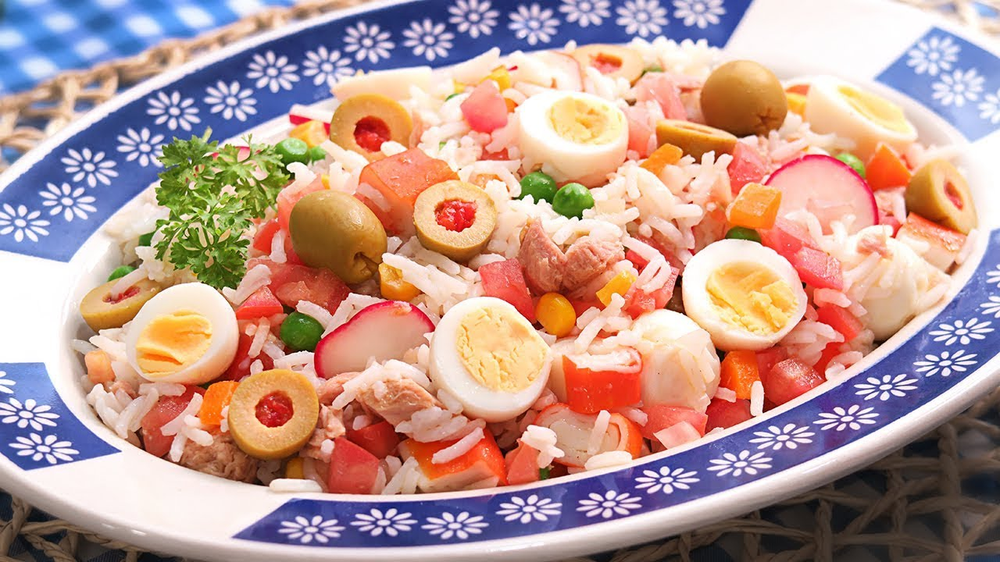

> 📺 **Vídeo Oficial de Elaboración:** [Ver en YouTube: Ensalada de Arroz muy Fácil y Fresquita!](https://www.youtube.com/watch?v=q-YKCS_9qbs)


> [!NOTE]
> Para que el arroz en ensalada no resulte apelmazado ni pastoso, Carmen utiliza **arroz de grano largo o basmati**, cocido con un diente de ajo y una hoja de laurel, escurrido inmediatamente y enfriado en capa fina sobre bandeja. El aliño cítrico a base de AOVE y zumo de lima aporta una frescura vibrante que despierta cada bocado.

```
                    ┌───────────────────────────────┐
                    │       ENSALADA DE ARROZ       │
                    │      GRANO SUELTO Y AROMA     │
                    └───────────────┬───────────────┘
                                    │
           ┌────────────────────────┴────────────────────────┐
           ▼                                                 ▼
┌──────────────────────┐                          ┌──────────────────────┐
│  ARROZ GRANO LARGO   │                          │  ALIÑO CÍTRICO       │
│ Cocción 12-13 min    │                          │ Zumo de lima / limón │
│ Laurel + diente ajo  │                          │ AOVE virgen extra    │
│ Enfriar suelto bandej│                          │ Orégano y mostaza    │
└──────────────────────┘                          └──────────────────────┘
```

### 📋 Ficha Resumen
| Parámetro | Valor |
| :--- | :--- |
| **Tiempo de Preparación** | 15 minutos |
| **Tiempo de Cocción** | 13 minutos |
| **Tiempo de Reposo en Frío** | 1 hora |
| **Dificultad** | Muy Baja |
| **Raciones** | 4 personas (aprox. 280 g por ración) |
| **Coste Estimado** | Muy Económico (3,60 € total / 0,90 € por ración) |

---

### ⚠️ Tabla de Alérgenos (Reglamento UE 1169/2011)

| Alérgeno | Estado | Ingrediente Causante / Medida de Adaptación |
| :--- | :---: | :--- |
| **Huevos** | 🔴 **PRESENTE** | Huevo duro picado. *Omitir para versión vegana.* |
| **Pescado / Crustáceos** | 🔴 **PRESENTE** | Palitos de cangrejo/surimi y atún en aceite. *Sustituir por dados de tofu ahumado y aguacate.* |
| **Mostaza** | 🔴 **PRESENTE** | Mostaza suave en la vinagreta cítrica. |
| **Gluten** | 🔴 **PRESENTE** (en surimi) | Palitos de cangrejo comerciales contienen almidón de trigo. *Usar surimi sin gluten certificado o prescindir de él.* |
| **Lácteos / Soja / Frutos Secos** | 🟢 AUSENTE | Formulación limpia. |

---

### ⚖️ Ingredientes Exactos


#### Base de Cereal y Aromatización
* **250 g** Arroz de grano largo, jazmín o basmati.
* **1 hoja** Laurel seco.
* **1 diente** Ajo entero aplastado con piel.
* **15 ml** Aceite de Oliva Virgen Extra para el enfriado del arroz.

#### Tropezones Frescos y Proteicos
* **140 g** Atún claro en aceite de oliva (escurrido).
* **100 g** Jamón cocido extra o pavo braseado cortado en dados de 5x5 mm.
* **80 g (4 barras)** Palitos de cangrejo (surimi de calidad), cortados en rodajas finas.
* **100 g** Maíz dulce tierno en grano en conserva (escurrido).
* **80 g** Guisantes finos tiernos cocidos al vapor.
* **2 unidades** Huevos camperos cocidos durante 9 minutos (picados).
* **60 g** Pimiento rojo dulce cortado en brunoise fina.
* **60 g** Aceitunas verdes rellenas de pimiento, cortadas en rodajas.

#### Vinagreta Cítrica Refrescante
* **70 ml** Aceite de Oliva Virgen Extra (variedad Arbequina o Manzanilla).
* **25 ml** Zumo de lima o limón recién exprimido y colado.
* **5 g (1 cucharadita)** Mostaza suave de Dijon.
* **1 g** Orégano seco silvestre molido con los dedos.
* **4 g** Sal marina fina y pimienta recién molida.

---

### 🍳 Equipamiento Necesario
* Olla con abundante agua hirviendo.
* Colador amplio y bandeja metálica para enfriar.
* Bol grande de ensalada.
* Biberón o tarro para agitar el aliño.

---

### 👨‍🍳 Paso a Paso Técnico y Minucioso


1. **Cocción Aromática del Arroz:**
   * Enjuagar el arroz de grano largo en un colador bajo agua fría durante 30 segundos para retirar el exceso de almidón exterior.
   * En una olla con 2,5 litros de agua hirviendo y 20 g de sal, incorporar la hoja de laurel y el diente de ajo aplastado.
   * Añadir el arroz y cocer a fuego vivo durante **12 a 13 minutos**, asegurando que el grano quede tierno pero con el corazón entero (*al dente*).
2. **Técnica de Secado y Grano Suelto:**
   * Escurrir el arroz de inmediato en el colador retirando el laurel y el diente de ajo.
   * Extender el arroz caliente en una bandeja amplia, rociar con los 15 ml de AOVE y mover con un tenedor para separar los granos. Dejar enfriar por completo a temperatura ambiente (tardará unos 15 minutos).
3. **Corte y Preparación de Tropezones:**
   * Cortar el jamón cocido en dados regulares de medio centímetro.
   * Cortar los palitos de cangrejo en rodajitas finas.
   * Picar el pimiento rojo en brunoise menuda y los huevos cocidos en dados.
4. **Elaboración de la Vinagreta Cítrica:**
   * En un tarro de cristal, mezclar el zumo de lima, la sal, la pimienta, la mostaza de Dijon y el orégano seco.
   * Añadir los 70 ml de AOVE y agitar con fuerza hasta obtener una emulsión amarilla pálida aromática.
5. **Ensamblado y Fusión:**
   * En el bol hondo, verter el arroz frío y suelto.
   * Añadir el atún escurrido, el jamón cocido, el surimi, el maíz, los guisantes, las aceitunas, el pimiento rojo y el huevo picado.
   * Regar con la vinagreta cítrica y mezclar suavemente de abajo hacia arriba con dos cucharas para integrar todos los colores y sabores.
6. **Reposo Térmico:**
   * Refrigerar tapado a 3-4°C durante **1 hora** antes de llevar a la mesa.

---

### 📦 Protocolo de Conservación y Batch Cooking
* **Refrigeración (0°C a 4°C):** Conservar en recipiente hermético durante **3 a 4 días**. El grano de arroz largo mantiene su elasticidad sin endurecerse en frío.
* **Precaución de Batch Cooking:** Si se guarda para varios días, es ideal incorporar el tomate fresco (si se añade) en el momento de comer para evitar la fermentación de azúcares.

---

### ❄️ Guía de Servicio y Regeneración en Frío
* Servir fresco en plato hondo, decorado con una rodaja fina de lima en el borde y un toque extra de orégano espolvoreado.

---

## 11. 🍅 Ensalada de Tomate con Ventresca, Cebolleta y Aceitunas Gordales
*Categoría: Ensalada Noble de Huerta / Pureza de Producto y AOVE*


> 📺 **Vídeo Oficial de Elaboración:** [Ver en YouTube: Ensalada de Garbanzos muy Rápida, Fácil y Fresquita](https://www.youtube.com/watch?v=4-B7fLuLeks)


> [!NOTE]
> La pureza de esta ensalada no admite atajos: el tomate debe seleccionarse en su punto óptimo de madurez y **NUNCA consumirse recién sacado de la nevera**, ya que el frío adormece los ésteres y aldehídos responsables de su fragancia. La cebolleta desflemada en hielo y la ventresca noble en lomos enteros completan una experiencia gastronómica suprema.

```
                    ┌───────────────────────────────┐
                    │      ENSALADA DE TOMATE       │
                    │       PUREZA DE PRODUCTO      │
                    └───────────────┬───────────────┘
                                    │
           ┌────────────────────────┴────────────────────────┐
           ▼                                                 ▼
┌──────────────────────┐                          ┌──────────────────────┐
│ TOMATE A TEMPERATURA │                          │ VENTRESCA & GORDALES │
│ Madurez noble (20°C) │                          │ Lomos nobles enteros │
│ Corte en gajos grues │                          │ Gordales aliñadas    │
│ Sal en escamas previa│                          │ AOVE Picual temprano │
└──────────────────────┘                          └──────────────────────┘
```

### 📋 Ficha Resumen
| Parámetro | Valor |
| :--- | :--- |
| **Tiempo de Preparación** | 12 minutos |
| **Tiempo de Desflemar Cebolleta** | 10 minutos en agua helada |
| **Dificultad** | Muy Baja |
| **Raciones** | 4 personas (aprox. 250 g por ración) |
| **Coste Estimado** | Medio-Alto (6,80 € total / 1,70 € por ración) |

---

### ⚠️ Tabla de Alérgenos (Reglamento UE 1169/2011)

| Alérgeno | Estado | Ingrediente Causante / Medida de Adaptación |
| :--- | :---: | :--- |
| **Pescado** | 🔴 **PRESENTE** | Ventresca de atún claro o bonito del norte en conserva. *Sustituir por queso fresco de cabra o aguacate.* |
| **Sulfitos** | 🔴 **PRESENTE** | Vinagre de Jerez Reserva y aceitunas aliñadas. |
| **Gluten / Lácteos / Huevos / Soja** | 🟢 AUSENTE | Formulación totalmente limpia. |

---

### ⚖️ Ingredientes Exactos


#### Huerta Noble y Conserva Selecta
* **800 g (aprox. 3-4 unidades)** Tomates de huerta de máxima calidad (variedad Rosa de Barbastro, Corazón de Buey, Raf o Tomate de Huete).
* **150 g (1 unidad)** Cebolleta fresca dulce o cebolla morada de corteza fina.
* **200 g** Ventresca de atún claro o bonito del norte en aceite de oliva (en lomos enteros intactos).
* **100 g** Aceitunas Gordales sevillanas aliñadas (partidas con hueso o deshuesadas).
* **1 cucharadita** Orégano silvestre en rama seco.

#### Aliño Maestro de Cosecha Temprana
* **70 ml** Aceite de Oliva Virgen Extra (AOVE) de recolección temprana (variedad Picual o Cornicabra, con frutado verde intenso).
* **20 ml** Vinagre de Jerez Reserva D.O.P. (o reducción sutil de vinagre balsámico de Jerez).
* **4 g** Sal en escamas (tipo Maldon) o flor de sal marina virgen.

---

### 🍳 Equipamiento Necesario
* Cuchillo de sierra para tomates bien afilado (evita aplastar la pulpa).
* Cuenco con agua helada y cubitos de hielo.
* Fuente plana amplia de cerámica o porcelana.

---

### 👨‍🍳 Paso a Paso Técnico y Minucioso

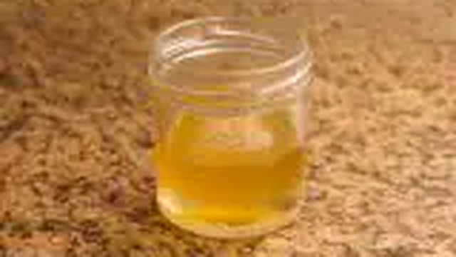

1. **Tratamiento Térmico del Tomate (Temperatura Ambiente):**
   * Asegurarse de que los tomates estén a temperatura ambiente (aprox. 18-20°C). Si estaban en nevera, sacarlos al menos **2 horas antes**.
   * Lavar y secar los tomates con delicadeza.
   * Con el cuchillo de sierra, retirar el pedúnculo superior y cortar en gajos gruesos de 2 cm o rodajas generosas. Disponer los gajos en la fuente de servir formando un abanico ordenado.
2. **Técnica del Sazonado Previo:**
   * Espolvorear 2 g de la flor de sal directamente sobre la carne del tomate recién cortado y dejar reposar 5 minutos. La sal provocará una suave ósmosis que liberará agua vegetal aromatizada en el fondo del plato.
3. **Desflemado Crujiente de la Cebolleta:**
   * Cortar la cebolleta en plumas o juliana fina.
   * Sumergir en el cuenco de agua helada con cubitos de hielo durante **10 minutos**. Escurrir con fuerza y secar sobre papel absorbente. La cebolleta ganará una textura hiper-crujiente y perderá cualquier matiz picante agresivo.
4. **Disposición de la Ventresca y Aceitunas:**
   * Distribuir la cebolleta crujiente por encima de los gajos de tomate.
   * Extraer con cuidado los lomos de ventresca de su lata con un tenedor o pinzas para mantener las láminas enteras sin romper. Colocar los lomos nobles sobre el tomate y la cebolleta.
   * Repartir las aceitunas Gordales aliñadas alrededor de la fuente.
5. **Aliñado Final en Crudo:**
   * Rociar los 20 ml de vinagre de Jerez Reserva sobre el tomate y la cebolleta (evitando mojar en exceso la ventresca para no tapar su delicado sabor graso).
   * Regar generosamente toda la fuente con los 70 ml de AOVE Picual de cosecha temprana.
   * Frotar el orégano seco silvestre entre las palmas de las manos sobre el plato para liberar los aceites esenciales aromáticos.
   * Terminar con las escamas de sal Maldon restantes sobre los lomos de ventresca y el tomate.

---

### 📦 Protocolo de Conservación y Batch Cooking

> [!CAUTION]
> Esta ensalada representa la cumbre de la frescura inmediata. Una vez aliñada, debe consumirse en el plazo de **1 hora**; si se refrigera aliñada, el tomate pierde turgencia y se vuelve harinoso.

* **Estrategia Batch Cooking:**
  * Guardar los tomates enteros a temperatura ambiente en frutero aireado.
  * Mantener la cebolleta ya cortada en agua con hielo en la nevera hasta 3 días.
  * Montar y aliñar la ensalada 5 minutos antes del almuerzo.

---

### ❄️ Guía de Servicio y Regeneración en Frío
* Servir a temperatura ambiente (18-20°C), acompañada de pan rústico de masa madre recién horneado para mojar la emulsión de AOVE y agua de tomate del fondo.

---

## 12. 📊 Tabla Comparativa Maestra: Rendimientos, Costes y Tiempos de Conservación

| Receta | Raciones | Peso Ración (g) | Coste Total (€) | Coste Ración (€) | Reposo Óptimo | Vida Útil Nevera (0-4°C) | Alérgenos Principales |
| :--- | :---: | :---: | :---: | :---: | :---: | :---: | :--- |
| **1. Ensalada Campera Tradicional** | 4 | 350 g | 4,50 € | 1,12 € | 2 - 4 h | 3 - 4 días | Pescado, Huevos, Sulfitos |
| **2. Pipirrana Andaluza Tradicional** | 4 | 300 g | 3,80 € | 0,95 € | 1 h | 48 horas | Pescado, Huevos, Sulfitos |
| **3. Pimientos Asados con Melva** | 4 | 250 g | 5,20 € | 1,30 € | 30 min | 5 días | Pescado, Sulfitos |
| **4. Salpicón de Marisco Tradicional** | 6 | 220 g | 12,50 € | 2,08 € | 2 h | 3 días | Moluscos, Crustáceos, Sulfitos |
| **5. Ensaladilla Rusa Tradicional** | 6 | 280 g | 4,90 € | 0,81 € | 3 - 12 h | 2 - 4 días | Huevos, Pescado, Sulfitos |
| **6. Ensalada de Pasta de Verano** | 4 | 320 g | 3,90 € | 0,97 € | 1 h | 3 - 4 días | Gluten, Huevos, Pescado, Lácteos, Sulfitos |
| **7. Ensalada de Garbanzos Veraniega** | 4 | 300 g | 3,20 € | 0,80 € | 30 min | 4 - 5 días | Mostaza, Huevos, Sulfitos |
| **8. Cogollos de Tudela al Ajillo** | 4 | 160 g | 6,50 € | 1,62 € | Inmediato | Al momento (hojas 4 d) | Pescado, Sulfitos |
| **9. Boquerones en Vinagre de Carmen** | 6 | 80 g | 4,80 € | 0,80 € | 6 h (+5 d cong.) | 10 - 15 días | Pescado, Sulfitos |
| **10. Ensalada de Arroz de Verano** | 4 | 280 g | 3,60 € | 0,90 € | 1 h | 3 - 4 días | Huevos, Pescado, Crustáceos, Mostaza, Gluten (surimi) |
| **11. Ensalada de Tomate con Ventresca**| 4 | 250 g | 6,80 € | 1,70 € | Inmediato | 1 hora (consumo fresco) | Pescado, Sulfitos |

---
*Manual redactado y homologado con los más altos estándares culinarios de **Cocina con Carmen**.*
