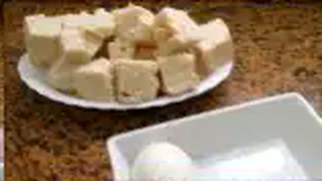
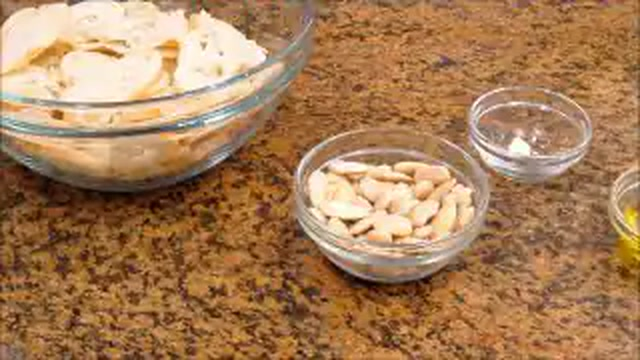
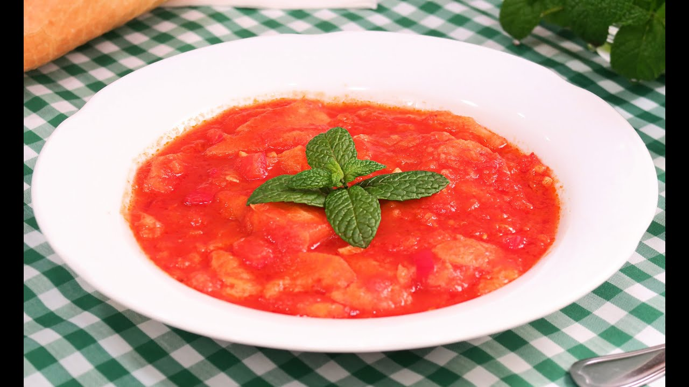
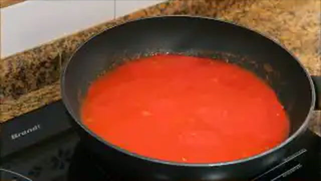
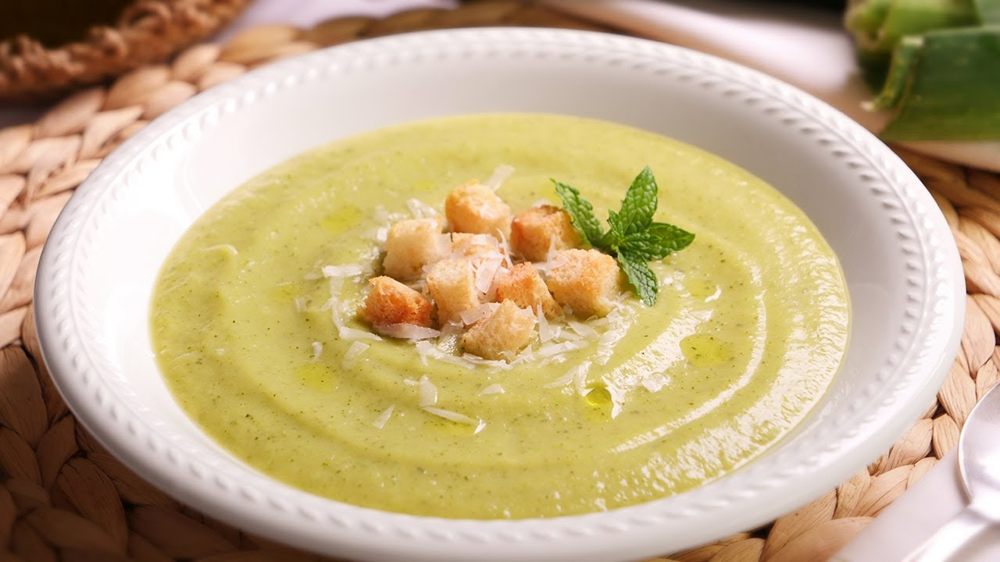
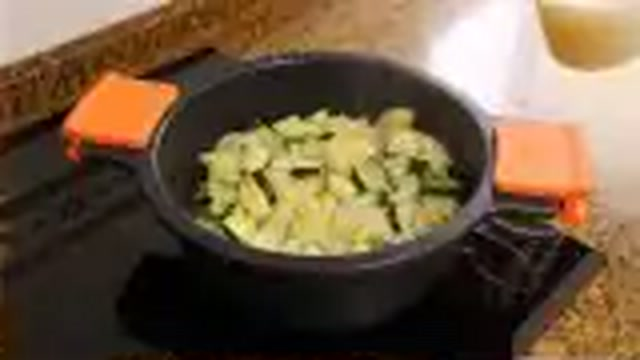
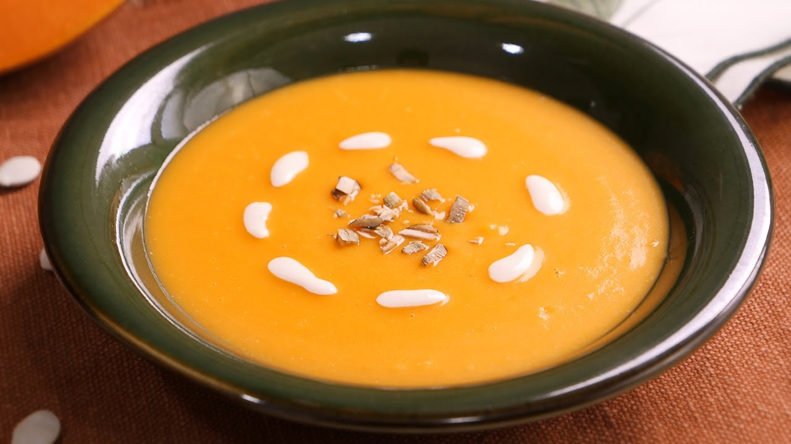
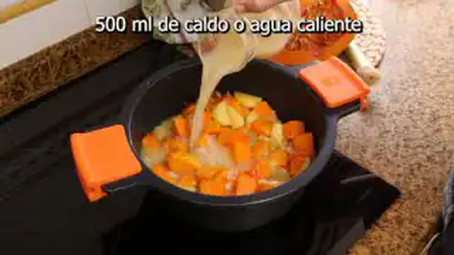
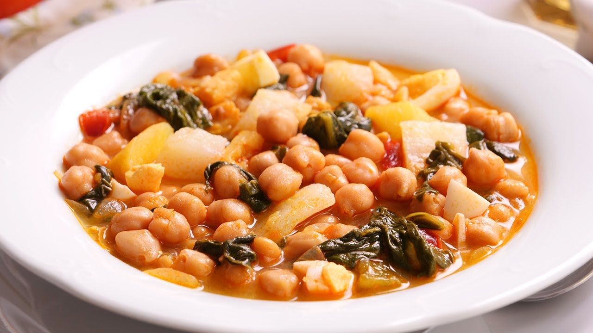

# 🥣 Master de Cocina Tradicional: Sopas, Cremas y Potajes de Cuchara
> **Inspirado en la filosofía, técnica y sabor del canal *Cocina con Carmen***  
> *Recetario Técnico Enciclopédico, Protocolos de Batch Cooking, Alérgenos UE y Guías de Regeneración Profesional*

---

## 📖 Prólogo Culinario: Los Pilares de la Cuchara Tradicional

La cocina de sopas, cremas y potajes constituye el alma más profunda de la gastronomía doméstica española. En la cocina de **Cocina con Carmen**, los caldos y majados no admiten polvos artificiales ni atajos industriales; su excelencia emana del respeto escrupuloso a cinco leyes termodinámicas y culinarias:

1. **El Fondo Noble y la Extracción Prolongada:** Un caldo magistral no es agua caliente con sal, sino una solución saturada de colágeno, minerales y compuestos aromáticos hidrosolubles extraídos a fuego manso y constante (*simmering* a 85-90°C), retirando meticulosamente las impurezas mediante el espumado inicial.
2. **La Emulsión Fría y el Poder del AOVE:** En las sopas frías andaluzas (salmorejo, gazpacho, ajoblanco), la viscosidad no proviene de gelatinas químicas, sino de la dispersión coloidal de gotas microscópicas de Aceite de Oliva Virgen Extra dentro de la matriz acuosa de los vegetales y el almidón de la telera o la almendra.
3. **El Majado de Mortero como Agente de Ligazón:** El uso patrimonial de almendras tostadas, ajos fritos o asados, pan frito en AOVE, azafrán en hebra y comino para dotar a los guisos y sopas de cuerpo, densidad natural y persistencia retronasal sin recurrir a harinas crudas.
4. **El Tratamiento Diferencial del Almidón y la Legumbre:** Los garbanzos exigen siempre agua caliente y salinidad controlada para no encallarse, mientras que las patatas se chascan a cuchillo para liberar amilopectina libre que engorda el caldo de manera natural.
5. **La Maduración y Termodinámica del Reposo:** Un potaje de vigilia o una sopa de marisco concentran sus perfiles organolépticos tras 12-24 horas en frío, gracias a la redistribución osmótica de las sales, la gelificación suave de los fondos y la fijación de compuestos liposolubles en la grasa del guiso.

---

```
                                  MAPA DEL RECETARIO
                                  
  ┌─────────────────────────────────┐       ┌─────────────────────────────────┐
  │      SOPAS FRÍAS ANDALUZAS      │       │     CREMAS DE HUERTA Y OTOÑO    │
  │ • 1. Salmorejo Cordobés         │       │ • 6. Crema de Calabacín         │
  │ • 2. Gazpacho Andaluz           │       │ • 7. Crema de Calabaza Asada    │
  │ • 3. Ajoblanco Malagueño        │       │                                 │
  └────────────────┬────────────────┘       └────────────────┬────────────────┘
                   │                                         │
                   └───────────────────┬─────────────────────┘
                                       │
                    ┌──────────────────┴──────────────────┐
                    │      SOPAS Y POTAJES DE CUCHARA     │
                    │ • 4. Sopa de Ajo Castellana         │
                    │ • 5. Sopa de Picadillo Andaluza     │
                    │ • 8. Potaje de Vigilia Tradicional  │
                    │ • 9. Sopa de Marisco Festiva        │
                    └─────────────────────────────────────┘
```

---

## 📑 Índice General de Recetas

1. [🍅 Salmorejo Cordobés Tradicional de Carmen](#1--salmorejo-cordobés-tradicional-de-carmen)
2. [🥒 Gazpacho Andaluz Tradicional](#2--gazpacho-andaluz-tradicional)
3. [🍇 Ajoblanco Malagueño Tradicional con Uvas Moscatel](#3--ajoblanco-malagueño-tradicional-con-uvas-moscatel)
4. [🧄 Sopa de Ajo Castellana Tradicional con Huevo Escalfado](#4--sopa-de-ajo-castellana-tradicional-con-huevo-escalfado)
5. [🌿 Sopa de Picadillo Andaluza con Fideos, Pollo, Jamón y Hierbabuena](#5--sopa-de-picadillo-andaluza-con-fideos-pollo-jamón-y-hierbabuena)
6. [🥬 Crema de Calabacín Aterciopelada de Carmen (con quesitos y patata)](#6--crema-de-calabacín-aterciopelada-de-carmen-con-quesitos-y-patata)
7. [🎃 Crema de Calabaza Asada con Crujiente de Semillas](#7--crema-de-calabaza-asada-con-crujiente-de-semillas)
8. [🍲 Potaje de Vigilia Tradicional (Garbanzos con Bacalao y Espinacas)](#8--potaje-de-vigilia-tradicional-garbanzos-con-bacalao-y-espinacas)
9. [🦐 Sopa de Marisco y Pescado Festiva de Carmen](#9--sopa-de-marisco-y-pescado-festiva-de-carmen)
10. [📊 Tabla Comparativa Maestra: Rendimientos, Costes y Tiempos](#-tabla-comparativa-maestra-rendimientos-costes-y-tiempos)

---

## 1. 🍅 Salmorejo Cordobés Tradicional de Carmen
*Categoría: Sopa Fría / Emulsión de Huerta y Miga*


> 📺 **Vídeo Oficial de Elaboración:** [Ver en YouTube: Salmorejo](https://www.youtube.com/watch?v=2yQpkUXWSiU)


> [!NOTE]
> El salmorejo no es una sopa líquida ni un gazpacho espeso: es una crema emulsionada densa y untuosa originaria de la campiña cordobesa. El secreto de Carmen radica en el remojo de la miga densa en el agua del propio tomate antes de batir, y la incorporación en hilo del AOVE para lograr la textura de una mayonesa vegetal compacta que sostiene los tropezones de jamón y huevo sin hundirse.

```
                    ┌───────────────────────────────┐
                    │      SALMOREJO CORDOBÉS       │
                    │      EMULSIÓN DE HUERTA       │
                    └───────────────┬───────────────┘
                                    │
           ┌────────────────────────┴────────────────────────┐
           ▼                                                 ▼
┌──────────────────────┐                          ┌──────────────────────┐
│  MACERACIÓN PREVIA   │                          │  EMULSIÓN MECÁNICA   │
│ Tomate pera maduro   │                          │ Diente ajo desvenado │
│ Miga telera andaluza │                          │ AOVE en hilo a 100%  │
│ 15 min de reposo     │                          │ Textura pomada densa │
└──────────────────────┘                          └──────────────────────┘
```

### 📋 Ficha Resumen
| Parámetro | Valor |
| :--- | :--- |
| **Tiempo de Preparación** | 20 minutos |
| **Tiempo de Reposo en Frío** | Mínimo 2 horas (óptimo 4 horas a 3°C) |
| **Dificultad** | Baja |
| **Raciones** | 4 personas (aprox. 320 g por ración con guarnición) |
| **Coste Estimado** | Económico (4,20 € total / 1,05 € por ración) |

---

### ⚠️ Tabla de Alérgenos (Reglamento UE 1169/2011)

| Alérgeno | Estado | Ingrediente Causante / Medida de Adaptación |
| :--- | :---: | :--- |
| **Gluten** | 🔴 **PRESENTE** | Pan de telera cordobesa o candeal. *Sustituir por pan sin gluten de miga densa para celíacos.* |
| **Huevos** | 🔴 **PRESENTE** | Huevos cocidos en la guarnición superior. *Omitir para versión vegana / alérgicos al huevo.* |
| **Sulfitos** | 🟢 AUSENTE | La receta genuina cordobesa de Carmen no lleva vinagre. Si se añade vinagre de Montilla-Moriles pasa a 🔴 PRESENTE. |
| **Lácteos / Pescado / Crustáceos** | 🟢 AUSENTE | Formulación 100% libre de lácteos y trazas marinas. |
| **Frutos de Cáscara / Soja** | 🟢 AUSENTE | No contiene alérgenos de frutos secos. |

---

### ⚖️ Ingredientes Exactos



#### Base del Salmorejo
* **1.000 g** Tomates maduros tipo pera (rojos, carnosos y con piel fina, bien lavados).
* **180 g** Miga de pan de telera cordobesa (o pan blanco candeal/sobado del día anterior, sin corteza dura).
* **1 diente pequeño (6 g)** Ajo morado de Montalbán o Pedroñeras (pelado y sin el germen central verde).
* **120 ml** Aceite de Oliva Virgen Extra (AOVE) D.O. Priego de Córdoba o Baena (variedad Hojiblanca o Picual suave).
* **7 g** Sal marina fina de salinas.
* *(Opcional no purista: 5 ml de vinagre de vino D.O. Montilla-Moriles si se busca un toque de acidez extra).*

#### Guarnición Tradicional
* **2 unidades** Huevos camperos tamaño L (cocidos durante 9 minutos).
* **80 g** Jamón ibérico o serrano de bellota picado en taquitos finos a cuchillo.
* **10 ml** AOVE en crudo para el cordón de brillo final.

---

### 🍳 Equipamiento Necesario
* Batidora de vaso de alta potencia (tipo americana, mín. 1000W) o procesador de alimentos.
* Cuchillo de chef y tabla de corte.
* Colador chino o cedazo fino (opcional, si no se cuenta con batidora potente).
* Cazo para cocer huevos.
* Recipiente hermético de vidrio para atemperar y refrigerar.

---

### 👨‍🍳 Paso a Paso Técnico y Minucioso


1. **Mise en Place y Cocción de Huevos:**
   * Llevar agua a ebullición en un cazo con una pizca de sal y un chorrito de vinagre. Sumergir los 2 huevos camperos y cocer durante 9 minutos exactos.
   * Transferir inmediatamente a un bol con agua helada y cubitos de hielo para frenar la cocción en seco. Pelar una vez fríos y picar en brunoise fina a cuchillo. Reservar en frío.

2. **Preparación y Maceración del Tomate:**
   * Retirar el pedúnculo a los tomates y cortarlos en cuartos. Disponerlos en el vaso de la batidora y triturar a velocidad media durante 1 minuto hasta obtener un puré líquido homogéneo.
   * Cortar la miga de pan de telera en trozos medianos e incorporarla al vaso sobre el puré de tomate. Presionar con la espátula para que el pan absorba todo el jugo y dejar reposar durante 10-15 minutos. Este ablandamiento osmótico facilita una emulsión sedosa sin grumos.

3. **Incorporación Aromática y Triturado Base:**
   * Añadir el diente de ajo sin germen y los 7 g de sal marina.
   * Triturar a velocidad máxima durante 2 minutos hasta obtener una base fina, lisa y sin rastros de pieles de tomate.

4. **Emulsión Maestra con AOVE:**
   * Con la batidora en marcha a velocidad media-baja (o retirando el tapón dosificador de la tapa), verter los 120 ml de AOVE en un hilo fino y constante.
   * Al entrar en contacto con las micropartículas de tomate y los almidones del pan, el aceite formará una emulsión estable. Aumentar a máxima potencia durante 45 segundos finales. La crema adquirirá un tono anaranjado brillante y una consistencia espesa, capaz de mantenerse en cuchara.

5. **Atemperado y Maduración:**
   * Probar el punto de sal y ajustar si fuera necesario. Pasar la crema a un recipiente de cristal, tapar herméticamente y refrigerar a 3-4°C durante al menos 2 horas antes del servicio.

6. **Montaje y Presentación:**
   * Servir en cuencos hondos de barro o porcelana fría. Disponer en el centro una generosa corona de huevo duro picado y los taquitos de jamón ibérico. Rematar con unas gotas de AOVE virgen extra virgen en crudo.

---

### 📦 Protocolo de Conservación y Batch Cooking

> [!IMPORTANT]
> El salmorejo cordobés es una emulsión en frío. **Nunca debe congelarse**, ya que al descongelar el agua libre se separa del aceite (sinéresis irreversible) y la textura queda rota y granulosa.

* **Refrigeración Estándar (2°C a 4°C):** Conservar en jarra o táper de cristal hermético con film al contacto durante **4 a 5 días**.
* **Envasado al Vacío en Frío:** En bolsa sous-vide sellada al 99% sin calor: vida útil de **8 días a 2°C** manteniendo intacto su color y brillo.
* **Separación de Guarniciones:** Almacenar siempre el huevo duro picado y el jamón en recipientes independientes; unirlos únicamente en el momento exacto del emplatado.

---

### 🔥 Guía de Regeneración y Servicio

* **Servicio Óptimo:** Sacar del frigorífico 10 minutos antes del consumo para degustar entre 8°C y 10°C (si está excesivamente helado, las papilas gustativas se adormecen y se pierden los matices del aceite y el tomate).
* **Recuperación de Textura:** Si tras 48 horas en reposo ha perdido algo de homogeneidad en la superficie, remover enérgicamente con varilla manual durante 15 segundos antes de servir.

---

## 2. 🥒 Gazpacho Andaluz Tradicional
*Categoría: Sopa Fría / Bebida Nutracéutica de Hortalizas*


> 📺 **Vídeo Oficial de Elaboración:** [Ver en YouTube: Gazpacho Andaluz muy Fácil, Rápido y Delicioso 😋💕](https://www.youtube.com/watch?v=4bWKqBGFnqA)


> [!NOTE]
> El gazpacho andaluz de Carmen es el estandarte de la frescura veraniega. A diferencia del salmorejo, es una sopa ligera, fluida y bebible, donde el equilibrio exacto entre el pimiento verde italiano, el pepino refrescante, el vinagre de Jerez envejecido y el AOVE crea una armonía ácida y perfumada incomparable.

```
                    ┌───────────────────────────────┐
                    │       GAZPACHO ANDALUZ        │
                    │      SEDA LÍQUIDA DE HUERTA   │
                    └───────────────┬───────────────┘
                                    │
           ┌────────────────────────┴────────────────────────┐
           ▼                                                 ▼
┌──────────────────────┐                          ┌──────────────────────┐
│  EQUILIBRIO VEGETAL  │                          │  COLADO Y EMULSIÓN   │
│ Tomate + Pimiento V. │                          │ Triturado máx. 3 min │
│ Pepino + Ajo leve    │                          │ Pasado por chino     │
│ Vinagre de Jerez D.O.│                          │ Enfriado a 4°C       │
└──────────────────────┘                          └──────────────────────┘
```

### 📋 Ficha Resumen
| Parámetro | Valor |
| :--- | :--- |
| **Tiempo de Preparación** | 15 minutos |
| **Tiempo de Reposo en Frío** | 3 horas (imprescindible para asentar acidez) |
| **Dificultad** | Muy Baja |
| **Raciones** | 4-6 personas (aprox. 250 ml por ración) |
| **Coste Estimado** | Muy Económico (3,60 € total / 0,60 € por ración) |

---

### ⚠️ Tabla de Alérgenos (Reglamento UE 1169/2011)

| Alérgeno | Estado | Ingrediente Causante / Medida de Adaptación |
| :--- | :---: | :--- |
| **Sulfitos** | 🔴 **PRESENTE** | Vinagre de Jerez Reserva D.O.P. (anhídrido sulfuroso natural de fermentación vínica). |
| **Gluten** | ⚠️ *Opcional* | Miga de pan candeal (40 g). *Omitir completamente para un Gazpacho 100% Sin Gluten y más ligero.* |
| **Lácteos / Huevos / Frutos secos** | 🟢 AUSENTE | Totalmente libre de alérgenos animales y trazas secas. |

---

### ⚖️ Ingredientes Exactos


#### Base del Gazpacho
* **1.000 g** Tomates maduros tipo pera o rama bien rojos (1 kg neto).
* **60 g** Pimiento verde tipo italiano (aprox. 1 unidad mediana, limpio de semillas y nervaduras blancas).
* **50 g** Pepino español o tipo Almería (pelado parcialmente para mantener digestibilidad).
* **4 g (1/2 diente)** Ajo morado sin el germen interior.
* **40 g** Miga de pan blanco asentado del día anterior (opcional, Carmen lo usa para dar sedosidad).
* **75 ml** Aceite de Oliva Virgen Extra (AOVE) variedad Hojiblanca.
* **25 ml** Vinagre de Jerez D.O. Reserva (de acidez equilibrada y aroma a madera).
* **8 g** Sal marina fina.
* **120 ml** Agua mineral muy fría (ajustar según el agua propia del tomate).

#### Guarnición de Tropezones (Opcional)
* **30 g** Pimiento verde picado en micro-brunoise.
* **30 g** Pepino pelado picado en micro-brunoise.
* **30 g** Tomate firme en daditos limpios.
* **30 g** Costrones de pan frito o tostado en AOVE.

---

### 🍳 Equipamiento Necesario
* Batidora de vaso de alta velocidad o robot de cocina (Thermomix, Magimix o similar).
* Colador chino fino de malla cónica.
* Jarra de vidrio para refrigerar.
* Cuchillo puntilla y tabla.

---

### 👨‍🍳 Paso a Paso Técnico y Minucioso


1. **Limpieza y Corte de Hortalizas:**
   * Lavar escrupulosamente los tomates y pimientos. Trocear los tomates en cuartos desechando el pedúnculo.
   * Despepitar el pimiento verde y cortar en trozos medianos. Pelar el pepino, cortar los extremos y trocear. Pelar el ajo y extraer el germen central para evitar que repita.

2. **Molienda y Triturado Intenso:**
   * Colocar en el vaso de la batidora los tomates, el pimiento, el pepino, el ajo, la miga de pan remojada en un poco de agua, la sal y el vinagre de Jerez.
   * Triturar a velocidad progresiva (del 4 al 10) durante 3 minutos ininterrumpidos hasta romper completamente la fibra de las hortalizas.

3. **Emulsión del Aceite:**
   * Sin detener el motor, incorporar los 75 ml de AOVE a velocidad media para que se integre con la clorofila y el licopeno sin sobrecalentar la mezcla.
   * Incorporar los 120 ml de agua helada y batir 30 segundos más para calibrar la densidad sedosa.

4. **Filtrado Técnico por Chino:**
   * Verter el gazpacho sobre un colador chino o tamiz fino colocado sobre una jarra de cristal. Con la ayuda de un cazo o mano de mortero, presionar para retener restos de semillas y hollejos microscópicos, logrando una textura de terciopelo líquido.

5. **Refrigeración y Reposo:**
   * Llevar a la nevera durante un mínimo de 3 horas a 2-4°C. **Regla de oro de Carmen:** Nunca añadir cubitos de hielo directos al gazpacho antes de servir, ya que diluyen el sabor y desestabilizan la emulsión; el frío debe ser por reposo en cámara.

6. **Servicio:**
   * Servir en vasos de cristal fino o cuencos fríos, acompañando en platillos laterales los tropezones de hortalizas y costrones de pan.

---

### 📦 Protocolo de Conservación y Batch Cooking

* **Refrigeración (2°C a 4°C):** Conservar en botella de vidrio sellada herméticamente durante **4 días**.
* **Evolución Organoléptica:** El día 2 el sabor se intensifica gracias a la maceración en frío del vinagre y el ajo; agitar enérgicamente la botella antes de servir si se aprecia leve decantación.
* **Congelación:** No recomendada para consumo directo en frío (separa fases). No obstante, puede congelarse como base líquida para enriquecer fondos de pescado o salsas frías.

---

### 🔥 Guía de Regeneración y Servicio

* Servir directo de la nevera a una temperatura de **5°C a 7°C**.
* Agitar siempre antes de verter en vaso o copa.

---

## 3. 🍇 Ajoblanco Malagueño Tradicional con Uvas Moscatel
*Categoría: Sopa Fría / Tradición Andalusí de Frutos Secos*


> 📺 **Vídeo Oficial de Elaboración:** [Ver en YouTube: Ajoblanco | Receta de Sopa Fría](https://www.youtube.com/watch?v=gEdtFKNdeUw)


> [!NOTE]
> Considerado el antecesor histórico del gazpacho (previo a la llegada del tomate de América), el ajoblanco malagueño es una de las creaciones más refinadas de Andalucía. Su base es un majado lácteo y blanco de almendras crudas marconas, ajo sutil y pan, equilibrado con el dulzor fresco de las uvas moscatel de la Axarquía.

```
                    ┌───────────────────────────────┐
                    │      AJOBLANCO MALAGUEÑO      │
                    │      TRADICIÓN ANDALUSÍ       │
                    └───────────────┬───────────────┘
                                    │
           ┌────────────────────────┴────────────────────────┐
           ▼                                                 ▼
┌──────────────────────┐                          ┌──────────────────────┐
│  PASTA DE ALMENDRA   │                          │  LIGAZÓN Y EQUILIBRIO│
│ Almendra Marcona     │                          │ AOVE virgen extra    │
│ Diente ajo blanqueado│                          │ Vinagre de Jerez     │
│ Miga pan remojada    │                          │ Uva Moscatel fresca  │
└──────────────────────┘                          └──────────────────────┘
```

### 📋 Ficha Resumen
| Parámetro | Valor |
| :--- | :--- |
| **Tiempo de Preparación** | 20 minutos |
| **Tiempo de Enfriamiento** | 3 horas en refrigeración |
| **Dificultad** | Baja-Media |
| **Raciones** | 4 personas (aprox. 220 ml por ración) |
| **Coste Estimado** | Medio (5,80 € total / 1,45 € por ración) |

---

### ⚠️ Tabla de Alérgenos (Reglamento UE 1169/2011)

| Alérgeno | Estado | Ingrediente Causante / Medida de Adaptación |
| :--- | :---: | :--- |
| **Frutos de Cáscara** | 🔴 **PRESENTE** | Almendras crudas peladas (variedad Marcona o Comuna). *No apto para alérgicos a frutos secos.* |
| **Gluten** | 🔴 **PRESENTE** | Miga de pan blanco asentado. *Sustituir por pan sin gluten para versión celíaca.* |
| **Sulfitos** | 🔴 **PRESENTE** | Vinagre de vino blanco o vinagre de Jerez suave. |
| **Lácteos / Huevos / Soja** | 🟢 AUSENTE | Emulsión 100% vegetal (apto para veganos e intolerantes a la lactosa). |

---

### ⚖️ Ingredientes Exactos



#### Base del Ajoblanco
* **200 g** Almendras crudas peladas (preferentemente variedad Marcona española, no tostadas ni saladas).
* **100 g** Miga de pan blanco candeal o rústico del día anterior.
* **1 diente pequeño (4 g)** Ajo morado fresco (desvenado y blanqueado 10 segundos en agua hirviendo para máxima finura).
* **90 ml** Aceite de Oliva Virgen Extra (AOVE) suave (variedad Hojiblanca dulce o Arbequina).
* **25 ml** Vinagre de Jerez blanco o vinagre de manzana de calidad.
* **550 ml** Agua mineral helada (a 2°C).
* **6 g** Sal marina fina.

#### Guarnición Noble
* **16 unidades** Uvas frescas Moscatel de Málaga (peladas y despepitadas a cuchillo).
* *(Alternativa estacional: Dados de melón maduro piel de sapo).*
* **Unas gotas** AOVE virgen extra virgen verde para decorar.

---

### 🍳 Equipamiento Necesario
* Procesador de alimentos de alto par o batidora americana de vaso.
* Cuchillo puntilla para pelar uvas.
* Colador fino (opcional).
* Bol de cristal para hidratación de la miga.

---

### 👨‍🍳 Paso a Paso Técnico y Minucioso


1. **Hidratación de la Miga y Acondicionamiento:**
   * Remojar los 100 g de miga de pan en 100 ml del agua helada durante 5 minutos.
   * Blanquear el diente de ajo pelado y sin germen sumergiéndolo 15 segundos en agua hirviendo y enfriándolo en agua helada (técnica magistral para neutralizar la alicina agresiva y que el ajoblanco resulte sedoso y digestivo).

2. **Triturado de la Almendra (Fase Grasa):**
   * Disponer en el vaso de la batidora las almendras crudas, el diente de ajo blanqueado, los 6 g de sal y 100 ml de agua helada.
   * Batir a potencia máxima durante 2 minutos hasta pulverizar la almendra y formar una pasta blanca, densa y finísima, sin sensación arenosa al tacto.

3. **Incorporación del Pan y Emulsión:**
   * Añadir la miga de pan bien hidratada y triturar 1 minuto más hasta su completa integración.
   * Con la máquina en marcha a velocidad media, verter los 90 ml de AOVE en hilo para que la grasa de la almendra y el aceite liguen una emulsión blanca como leche cuajada.
   * Añadir los 25 ml de vinagre y el resto del agua mineral helada (aprox. 350-450 ml) hasta alcanzar la densidad deseada (fluida pero aterciopelada).

4. **Filtrado y Reposo Térmico:**
   * Si no se dispone de batidora de alta gama, colar por colador fino para retirar cualquier mínima partícula.
   * Tapar y refrigerar durante al menos 3 horas a 2-4°C.

5. **Preparación de la Guarnición y Emplatado:**
   * Pelar las uvas moscatel, abrirlas por la mitad con puntilla y retirar las semillas interiores.
   * Servir el ajoblanco bien frío en plato hondo, colocar en el centro 4-6 mitades de uva moscatel y unas gotas de aceite verde en superficie.

---

### 📦 Protocolo de Conservación y Batch Cooking

* **Refrigeración (2°C a 4°C):** Conservar en botella de vidrio sellada durante **3 días**.
* **Comportamiento Físico:** Al no llevar emulsionantes artificiales, tras 24 horas puede presentar una leve línea de decantación entre el aceite y el agua de almendra; basta con agitar suavemente antes de servir.
* **Congelación:** Desaconsejada por alteración de la textura grasa de la almendra cruda.

---

### 🔥 Guía de Regeneración y Servicio

* Servir a temperatura fresca entre **6°C y 8°C**.
* Añadir las uvas o dados de melón justo en el instante de llegar a la mesa.

---

## 4. 🧄 Sopa de Ajo Castellana Tradicional con Huevo Escalfado
*Categoría: Sopa Caliente / Patrimonio Pastoril y Aprovechamiento*


> 📺 **Vídeo Oficial de Elaboración:** [Ver en YouTube: Sopa de Ajo Castellana fácil](https://www.youtube.com/watch?v=6RIfxQfryHE)


> [!NOTE]
> La sopa castellana o sopa de ajo es el monumento ibérico a la humildad y la sabiduría de la cocina de campo. Con tan solo pan duro, ajos morados dorados con mimo, pimentón de la Vera ahumado y un buen caldo casero, se genera un plato reparador donde el huevo se escalfa lentamente con el propio calor del guiso.

```
                    ┌───────────────────────────────┐
                    │      SOPA DE AJO CASTELLANA   │
                    │       COCINA DE LA MEMORIA    │
                    └───────────────┬───────────────┘
                                    │
           ┌────────────────────────┴────────────────────────┐
           ▼                                                 ▼
┌──────────────────────┐                          ┌──────────────────────┐
│  DORADO & PIMENTÓN   │                          │  COCCIÓN & ESCALFADO │
│ Ajo laminado en AOVE │                          │ Pan embebido en caldo│
│ Tacos jamón serrano  │                          │ 15 min chup-chup     │
│ Pimentón fuera fuego │                          │ Huevo cuajado suave  │
└──────────────────────┘                          └──────────────────────┘
```

### 📋 Ficha Resumen
| Parámetro | Valor |
| :--- | :--- |
| **Tiempo de Preparación** | 10 minutos |
| **Tiempo de Cocción** | 25 minutos |
| **Dificultad** | Baja |
| **Raciones** | 4 personas (aprox. 350 ml por ración) |
| **Coste Estimado** | Muy Económico (3,20 € total / 0,80 € por ración) |

---

### ⚠️ Tabla de Alérgenos (Reglamento UE 1169/2011)

| Alérgeno | Estado | Ingrediente Causante / Medida de Adaptación |
| :--- | :---: | :--- |
| **Gluten** | 🔴 **PRESENTE** | Pan de hogaza rústico o candeal duro. *Sustituir por pan rústico sin gluten horneado.* |
| **Huevos** | 🔴 **PRESENTE** | Huevos camperos escalfados en la sopa. |
| **Sulfitos** | 🟢 AUSENTE | No contiene vinos ni sulfitos añadidos. |
| **Lácteos / Pescado / Frutos secos** | 🟢 AUSENTE | Receta libre de derivados lácteos y frutos secos. |

---

### ⚖️ Ingredientes Exactos


#### Base de la Sopa
* **180 g** Pan de hogaza de pueblo de masa madre (o pan candeal) de 2 o 3 días atrás, cortado en rebanadas finas al bies.
* **10 dientes (45 g)** Ajo morado de Las Pedroñeras, pelados y laminados finos a cuchillo.
* **80 g** Jamón curado serrano o ibérico en taquitos pequeños (preferentemente partes de magro y veta de grasa).
* **12 g (1 cucharada sopera colmada)** Pimentón de la Vera D.O.P. (10 g dulce + 2 g agridulce o picante para el toque auténtico).
* **60 ml** Aceite de Oliva Virgen Extra (AOVE) variedad Picual.
* **1.200 ml** Caldo casero de jamón o ave desgrasado (o agua mineral en la versión más austera de convento).
* **4 g** Sal marina fina (ajustar con prudencia por la salazón previa del jamón).

#### Acabado Tradicional
* **4 unidades** Huevos camperos frescos tamaño M o L (a temperatura ambiente).
* **1 hoja pequeña** Laurel seco seleccionado (opcional).

---

### 🍳 Equipamiento Necesario
* Cazuela de barro refractaria tradicional o cazuela ancha de hierro fundido/acero inoxidable.
* Cuchara de madera o espátula.
* Cazo hondo para servir.

---

### 👨‍🍳 Paso a Paso Técnico y Minucioso


1. **Confitado y Dorado de los Ajos:**
   * Verter los 60 ml de AOVE en la cazuela a fuego medio-bajo.
   * Añadir los ajos laminados y la hoja de laurel. Dejar que los ajos se doren despacio durante 4-5 minutos, adquiriendo un tono avellana claro sin llegar a quemarse (si el ajo se quema, amarga irreversiblemente el caldo).

2. **Incorporación del Jamón y Rehogado del Pan:**
   * Añadir los 80 g de taquitos de jamón y sofreír durante 60 segundos para que suelten sus aromas y grasas en el aceite.
   * Incorporar las rebanadas finas de pan duro. Remover constantemente con la cuchara de madera durante 3-4 minutos para que el pan se impregne por completo del aceite aromatizado y tome un ligero tostado crujiente.

3. **El Punto Crítico del Pimentón y Desglasado:**
   * **Maniobra de Carmen:** Retirar la cazuela del fuego directo durante 15 segundos para bajar la temperatura.
   * Espolvorear los 12 g de pimentón de la Vera sobre el pan y remover rápidamente durante 10 segundos para que se cocine en el calor residual sin quemarse.
   * Inmediatamente, devolver al fuego y verter los 1.200 ml de caldo caliente (o agua) para frenar la temperatura del pimentón.

4. **Cocción a Fuego Manso (*Chup-Chup*):**
   * Llevar a ebullición suave y cocinar a fuego bajo durante 15-18 minutos. Con la cuchara de madera, presionar suavemente las rebanadas de pan para que se deshagan parcialmente, engordando el caldo y creando la textura rota y espesa característica de la sopa castellana. Rectificar de sal.

5. **Escalfado de los Huevos Camperos:**
   * Bajar el fuego al mínimo. Cascar los 4 huevos uno a uno directamente sobre la superficie de la sopa, dejando espacio entre ellos.
   * Tapar la cazuela durante 3-4 minutos con el fuego casi apagado para que la clara cuaje con el vapor y quede blanca opaca, manteniendo la yema completamente líquida y cremosa.

6. **Servicio:**
   * Servir de inmediato en cuencos de barro refractario, asegurando que cada comensal reciba su huevo escalfado intacto en el centro para romperlo con la cuchara en la mesa.

---

### 📦 Protocolo de Conservación y Batch Cooking

* **Refrigeración (2°C a 4°C):** La base de la sopa de ajo (sin el huevo) se conserva perfectamente durante **3 días**. El pan continuará absorbiendo caldo; al regenerar simplemente añadir 50-80 ml de caldo adicional.
* **Protocolo para Batch Cooking:** Cocinar la sopa completa hasta el paso 4 y enfriar. Los huevos deben cascarse y escalfarse **siempre frescos** durante la regeneración térmica final.
* **Congelación:** No recomendable, ya que el pan hidratado se vuelve gomoso y se desintegra en una pasta harinosa al descongelar.

---

### 🔥 Guía de Regeneración Multicanal

* **En Cazuela (Recomendado):** Disponer la sopa a fuego suave, añadir 50 ml de caldo o agua para aligerar la absorción del pan. Cuando rompa a hervir suavemente, cascar el huevo fresco, tapar 3 minutos y servir.
* **En Horno Tradicional:** Regenerar en cazuelitas individuales de barro a 180°C durante 10 minutos; añadir el huevo en los últimos 4 minutos de horneado.
* **En Microondas:** Calentar la sopa previamente sin huevo a 700W durante 2 minutos. Escalfar el huevo aparte o cocinarlo a baja potencia (400W) vigilando para no reventar la yema.

---

## 5. 🌿 Sopa de Picadillo Andaluza con Fideos, Pollo, Jamón y Hierbabuena
*Categoría: Sopa de Fiesta y Hogar / Caldo Clarificado Aromatizado*



> 📺 **Vídeo Oficial de Elaboración:** [Ver en YouTube: Sopa de Tomate Andaluza con Pan | Receta Fácil y Rápida!](https://www.youtube.com/watch?v=CEm5vXpqDA8)


> [!NOTE]
> Imprescindible en las mesas andaluzas durante el invierno y las celebraciones navideñas. La sopa de picadillo de Carmen destaca por la limpidez y nobleza de su caldo de gallina y jamón, perfumado en el último instante con una generosa rama de hierbabuena fresca que transforma el caldo en una infusión balsámica reconfortante.

```
                    ┌───────────────────────────────┐
                    │       SOPA DE PICADILLO       │
                    │      TRADICIÓN ANDALUZA       │
                    └───────────────┬───────────────┘
                                    │
           ┌────────────────────────┴────────────────────────┐
           ▼                                                 ▼
┌──────────────────────┐                          ┌──────────────────────┐
│  EXTRACCIÓN DE FONDO │                          │  MONTAJE & PICADILLO │
│ Gallina + Jamón noble│                          │ Fideos cabello ángel │
│ Espumado meticuloso  │                          │ Pollo + Jamón + Huevo│
│ Colado por estameña  │                          │ Hierbabuena fresca   │
└──────────────────────┘                          └──────────────────────┘
```

### 📋 Ficha Resumen
| Parámetro | Valor |
| :--- | :--- |
| **Tiempo de Preparación** | 15 minutos |
| **Tiempo de Cocción del Caldo** | 90 minutos |
| **Dificultad** | Baja-Media |
| **Raciones** | 6 personas (aprox. 350 ml por ración) |
| **Coste Estimado** | Económico (5,50 € total / 0,91 € por ración) |

---

### ⚠️ Tabla de Alérgenos (Reglamento UE 1169/2011)

| Alérgeno | Estado | Ingrediente Causante / Medida de Adaptación |
| :--- | :---: | :--- |
| **Gluten** | 🔴 **PRESENTE** | Fideos finos de trigo (cabello de ángel o nº 1). *Sustituir por fideos de arroz o maíz para celíacos.* |
| **Huevos** | 🔴 **PRESENTE** | Huevo duro picado en la guarnición. |
| **Apio** | ⚠️ *Opcional* | Puerro/apio en el fondo de ave. *Omitir si hay alergia al apio.* |
| **Lácteos / Pescado / Sulfitos** | 🟢 AUSENTE | Caldo natural puro sin aditivos ni lácteos. |

---

### ⚖️ Ingredientes Exactos


#### Fondo Magistral de Ave y Jamón
* **450 g** Cuartos traseros de pollo de corral o gallina campera (con piel y hueso).
* **1 unidad (120 g)** Hueso de jamón curado (desalado bajo el grifo de agua templada).
* **1 unidad (80 g)** Hueso blanco de ternera salado (enjuagado).
* **1 unidad (120 g)** Puerro limpio (solo la parte blanca y verde clara).
* **1 unidad (100 g)** Zanahoria pelada.
* **2.200 ml** Agua mineral fría.
* **4 g** Sal marina fina (ajustar al final tras la evaporación).

#### Para la Sopa y el Picadillo
* **120 g** Fideos de trigo finos (cabello de ángel o fideo fino nº 0/1).
* **150 g** Carne de pollo cocida del caldo, deshuesada y deshebrada o picada fina.
* **80 g** Jamón curado ibérico o serrano picado en brunoise fina a cuchillo.
* **2 unidades** Huevos camperos cocidos durante 9 minutos y picados finos.
* **6-8 ramitas** Hierbabuena fresca limpia (esencial, aroma distintivo).

---

### 🍳 Equipamiento Necesario
* Olla alta de acero inoxidable (capacidad mínima 4-5 litros).
* Espumadera metálica para desespumar.
* Colador chino y estameña o paño de hilo para clarificar.
* Cazo y cacerola pequeña para fideos.

---

### 👨‍🍳 Paso a Paso Técnico y Minucioso



1. **Montaje del Fondo en Frío y Espumado:**
   * Introducir en la olla el pollo o gallina, el hueso de jamón, el hueso blanco de ternera, el puerro y la zanahoria. Cubrir con los 2.200 ml de agua mineral fría.
   * Llevar a ebullición a fuego medio. Durante los primeros 15 minutos, retirar con la espumadera toda la espuma grisácea e impurezas que suben a la superficie para lograr un caldo translúcido y limpio.

2. **Cocción Prolongada y Desgrasado:**
   * Bajar a fuego mínimo, tapar parcialmente y mantener un hervor sereno (*chup-chup*) durante 80-90 minutos.
   * Retirar del fuego. Extraer las piezas de carne y reservar. Pasar el caldo por un colador provisto de una gasa o estameña fina para atrapar cualquier sedimento. Si se desea un caldo extra limpio, dejar enfriar y retirar la capa de grasa solidificada en superficie.

3. **Preparación del Picadillo:**
   * Desmenuzar la carne de pollo cocida, desechando pieles y cartílagos, picándola en trozos diminutos.
   * Picar los 2 huevos cocidos y el jamón ibérico en taquitos milimétricos.

4. **Cocción de los Fideos:**
   * Llevar 1.500 ml del caldo desgrasado a ebullición en una cazuela limpia.
   * Añadir los 120 g de fideos finos y cocer durante 2 a 3 minutos exactos (deben quedar *al dente*, pues terminarán de ablandarse en el plato). Probar el punto de sal.

5. **Aromatizado con Hierbabuena y Emplatado:**
   * En el fondo de cada plato hondo o sopera individual, disponer una cucharada generosa de picadillo: pollo deshebrado, jamón en taquitos y huevo duro picado.
   * Verter el caldo hirviendo con los fideos directamente sobre el picadillo.
   * Coronar de inmediato con una ramita fresca de hierbabuena sumergida parcialmente. El calor del caldo liberará al instante los aceites esenciales mentolados.

---

### 📦 Protocolo de Conservación y Batch Cooking

* **Fondo de Caldo:** Se conserva en botella o táper de cristal hermético durante **4 días a 2-4°C** o congelado en porciones durante **3 meses**.
* **Envasado al Vacío del Caldo:** Termosellado al 99% en bolsa sous-vide: **12 días a 2°C**.
* **Gestión del Picadillo:** Guardar el pollo, jamón y huevo picados en recipientes herméticos separados. Cocinar los fideos en el momento del consumo para que no se hinchen ni absorban el caldo.

---

### 🔥 Guía de Regeneración Multicanal

* **En Cazo:** Hervir la cantidad de caldo necesaria, añadir los fideos 2 minutos y verter sobre el picadillo a temperatura ambiente.
* **En Microondas (Caldo ya preparado):** Calentar a 800W durante 2 minutos en tazón hondo tapado; añadir la hierbabuena fresca tras salir del microondas.

---

## 6. 🥬 Crema de Calabacín Aterciopelada de Carmen (con quesitos y patata)
*Categoría: Crema de Verduras / Suavidad y Emulsión Láctea*



> 📺 **Vídeo Oficial de Elaboración:** [Ver en YouTube: Crema de Calabacín muy Fácil y Deliciosa](https://www.youtube.com/watch?v=Cc_dKVHxgsw)


> [!NOTE]
> Una de las recetas más aclamadas del recetario familiar de Carmen. Su técnica magistral consiste en conservar parte de la piel del calabacín para aportar un elegante tono verde pastel, rehogar la patata y el puerro antes de incorporar el líquido y añadir quesitos en porciones al final, batiendo a máxima revolución para emulsionar una crema ligera, sin hebras y con textura de seda.

```
                    ┌───────────────────────────────┐
                    │      CREMA DE CALABACÍN       │
                    │      ATERCIOPELADA CASERA     │
                    └───────────────┬───────────────┘
                                    │
           ┌────────────────────────┴────────────────────────┐
           ▼                                                 ▼
┌──────────────────────┐                          ┌──────────────────────┐
│  REHOGADO & COCCIÓN  │                          │  EMULSIÓN DE QUESITOS│
│ Puerro en AOVE dulce │                          │ Quesitos en porciones│
│ Patata chascada      │                          │ Batido a máx. potencia│
│ Calabacín 18 min     │                          │ Nuez moscada sutil   │
└──────────────────────┘                          └──────────────────────┘
```

### 📋 Ficha Resumen
| Parámetro | Valor |
| :--- | :--- |
| **Tiempo de Preparación** | 15 minutos |
| **Tiempo de Cocción** | 22 minutos |
| **Dificultad** | Muy Baja |
| **Raciones** | 4 personas (aprox. 300 g por ración) |
| **Coste Estimado** | Muy Económico (2,80 € total / 0,70 € por ración) |

---

### ⚠️ Tabla de Alérgenos (Reglamento UE 1169/2011)

| Alérgeno | Estado | Ingrediente Causante / Medida de Adaptación |
| :--- | :---: | :--- |
| **Lácteos** | 🔴 **PRESENTE** | Quesitos en porciones (o queso crema). *Sustituir por bebida vegetal de avena/soja o crema de anacardos para 100% Sin Lactosa / Vegana.* |
| **Gluten** | 🟢 AUSENTE | La crema no contiene gluten (espesada de forma natural con patata). *Verificar que los costrones de pan opcionales sean sin gluten.* |
| **Huevos / Pescado / Frutos secos** | 🟢 AUSENTE | Formulación limpia de huerta y lácteo. |

---

### ⚖️ Ingredientes Exactos


#### Base de la Crema
* **800 g** Calabacines verdes frescos y firmes (lavados; pelados a rayas alternas, dejando el 50% de la piel para color y nutrientes).
* **220 g** Patatas de variedad Monalisa o Kennebec (peladas y chascadas en trozos medianos).
* **150 g** Puerro (solo la parte blanca limpia, picada en rodajas finas) o cebolla dulce.
* **1 diente** Ajo pelado sin germen.
* **45 ml** Aceite de Oliva Virgen Extra (AOVE) variedad Hojiblanca.
* **450 ml** Caldo suave de verduras casero o agua mineral (justo al ras de las verduras, clave para no aguar la crema).
* **6 unidades (aprox. 95 g)** Quesitos en porciones tradicionales (tipo El Caserío / La Vaca que ríe) o 100 g de queso crema untable.
* **5 g** Sal marina fina.
* **0,5 g** Pimienta blanca molida.
* **Un pellizco (0,2 g)** Nuez moscada recién rallada.

#### Acompañamiento
* **30 g** Costrones de pan frito en AOVE o semillas de sésamo tostado.
* **Un hilo** AOVE en crudo.

---

### 🍳 Equipamiento Necesario
* Cazuela u olla de acero inoxidable (Ø 22-24 cm).
* Batidora de brazo potente (mínimo 800W) o batidora de vaso de alta velocidad.
* Cuchillo pelador y tabla.

---

### 👨‍🍳 Paso a Paso Técnico y Minucioso



1. **Rehogado Aromático Inicial:**
   * En la cazuela a fuego medio, calentar los 45 ml de AOVE. Añadir el puerro en rodajas y el diente de ajo con una pizca de sal.
   * Pochar a fuego medio-suave durante 6-7 minutos sin que coja color dorado para mantener el tono claro de la crema.

2. **Sellado de Patata y Calabacín:**
   * Incorporar la patata chascada (haciendo palanca con el cuchillo para liberar amilasa y amilopectina) y rehogar durante 2 minutos.
   * Añadir el calabacín cortado en dados medianos. Saltear todo junto durante 3 minutos removiendo con frecuencia para impregnar la verdura del aceite del sofrito.

3. **Cocción a Fuego Justo:**
   * Verter los 450 ml de caldo caliente o agua. **Regla de oro de Carmen:** El líquido no debe cubrir por completo las verduras, sino quedar ligeramente por debajo de su nivel, ya que el calabacín desprende más del 90% de su peso en agua durante la cocción.
   * Tapar y cocer a fuego medio durante 16-18 minutos, hasta que la patata esté tierna al pincharla con un tenedor.

4. **Emulsión con Quesitos y Especias:**
   * Retirar la cazuela del fuego. Añadir los 6 quesitos en porciones, la pimienta blanca, la nuez moscada rallada y ajustar el punto de sal.
   * Introducir el brazo de la batidora y triturar a potencia máxima durante al menos 2 minutos y medio ininterrumpidos. La grasa del queso y el aceite se emulsionarán con los almidones de la patata, transformando el caldo en una crema densa, homogénea, de tono verde claro y sin ninguna hebra.

5. **Servicio:**
   * Servir caliente o templada en cuencos hondos. Decorar con un hilo de AOVE virgen extra y unos costrones de pan frito crujiente o semillas tostadas.

---

### 📦 Protocolo de Conservación y Batch Cooking

* **Refrigeración (2°C a 4°C):** Conservar en recipiente de cristal hermético hasta **4 días**.
* **Congelación (-18°C):** Apta para congelación durante **2 meses**. *Nota técnica:* Al descongelar, la patata puede mostrar ligera separación acuosa; para regenerarla perfecta, calentar y batir enérgicamente 30 segundos con varilla o batidora para reconstituir la emulsión.
* **Envasado al Vacío:** En bolsa sous-vide: **10 días a 2°C**.

---

### 🔥 Guía de Regeneración Multicanal

* **En Cazo/Sartén:** Calentar a fuego suave durante 4 minutos, removiendo con varilla manual.
* **En Microondas:** Disponer la ración en plato hondo con campana a 650W durante 2 minutos, remover y dar 30 segundos finales a 800W.

---

## 7. 🎃 Crema de Calabaza Asada con Crujiente de Semillas
*Categoría: Crema de Otoño / Concentración de Azúcares y Maillard*



> 📺 **Vídeo Oficial de Elaboración:** [Ver en YouTube: Crema de Calabaza muy Fácil, Rápida y Deliciosa](https://www.youtube.com/watch?v=3by5jwWrXSo)


> [!NOTE]
> Frente a la clásica calabaza cocida en agua que a menudo resulta acuosa y plana, Carmen aplica la técnica magistral del asado previo al horno: al asar la calabaza y la zanahoria con un toque de AOVE a 200°C, los azúcares naturales se caramelizan, evaporando el exceso de agua y multiplicando la profundidad sápida.

```
                    ┌───────────────────────────────┐
                    │     CREMA CALABAZA ASADA      │
                    │     CARAMELIZACIÓN & SEDA     │
                    └───────────────┬───────────────┘
                                    │
           ┌────────────────────────┴────────────────────────┐
           ▼                                                 ▼
┌──────────────────────┐                          ┌──────────────────────┐
│    ASADO EN HORNO    │                          │  TRITURADO & CRUNCH  │
│ Calabaza a 200°C     │                          │ Emulsión leche coco  │
│ Concentración azúcar │                          │ Jengibre + Comino    │
│ Caramelización 35min │                          │ Pipas tostadas AOVE  │
└──────────────────────┘                          └──────────────────────┘
```

### 📋 Ficha Resumen
| Parámetro | Valor |
| :--- | :--- |
| **Tiempo de Preparación** | 15 minutos |
| **Tiempo de Asado y Cocción** | 40 minutos |
| **Dificultad** | Baja |
| **Raciones** | 4 personas (aprox. 320 g por ración) |
| **Coste Estimado** | Económico (3,90 € total / 0,97 € por ración) |

---

### ⚠️ Tabla de Alérgenos (Reglamento UE 1169/2011)

| Alérgeno | Estado | Ingrediente Causante / Medida de Adaptación |
| :--- | :---: | :--- |
| **Lácteos** | ⚠️ *Opcional* | Solo si se utiliza nata ligera o mantequilla. *Con leche de coco es 100% Libre de Lácteos y Vegana.* |
| **Gluten** | 🟢 AUSENTE | Naturalmente libre de gluten. |
| **Frutos secos / Huevos / Soja** | 🟢 AUSENTE | Sin alérgenos obligatorios de declaración. |

---

### ⚖️ Ingredientes Exactos


#### Para el Asado y Base
* **850 g** Calabaza tipo Cacahuete (Butternut) o Potimarrón (pelada, sin pipas y cortada en dados de 3 cm).
* **180 g** Zanahorias (peladas y cortadas en rodajas gruesas).
* **2 dientes** Ajo en camisa (con su piel para que no se quemen en el horno).
* **45 ml** Aceite de Oliva Virgen Extra (AOVE) para embadurnar.
* **140 g** Cebolla dulce o chalotas picadas en brunoise.
* **500 ml** Caldo vegetal casero caliente (cebolla, puerro, apio y zanahoria).
* **100 ml** Leche de coco entera (o nata para cocinar al 18% M.G.).
* **4 g (1 cucharadita)** Jengibre fresco recién rallado.
* **1 g** Comino molido.
* **6 g** Sal marina fina.
* **1 g** Pimienta negra recién molida.

#### Crujiente de Semillas para Guarnición
* **30 g** Pipas de calabaza peladas crudas.
* **15 g** Pipas de girasol peladas.
* **5 ml** AOVE.
* **1 pellizco** Sal en escamas y pimentón dulce.

---

### 🍳 Equipamiento Necesario
* Bandeja de horno y papel sulfurizado (papel de hornear).
* Horno convencional con calor arriba y abajo.
* Cazuela de fondo grueso (Ø 22 cm).
* Batidora de vaso de alta velocidad.
* Sartén pequeña para tostar semillas.

---

### 👨‍🍳 Paso a Paso Técnico y Minucioso



1. **Asado Maestro y Concentración de Sabores:**
   * Precalentar el horno a 200°C.
   * Disponer en la bandeja con papel de hornear los dados de calabaza, las rodajas de zanahoria y los 2 ajos en camisa. Regar con 30 ml de AOVE, salpimentar y mezclar con las manos para impregnar bien.
   * Hornear a 200°C durante 30-35 minutos, hasta que las aristas de la calabaza estén tiernas y caramelizadas en un tono dorado tostado.

2. **Pochado de Cebolla y Especias:**
   * Mientras se hornea, calentar 15 ml de AOVE en la cazuela a fuego medio. Añadir la cebolla dulce picada y pochar durante 8 minutos hasta que esté transparente y dulce.
   * Añadir el jengibre rallado y el comino molido; rehogar 30 segundos para activar sus aceites aromáticos.

3. **Integración y Cocción Corta:**
   * Extraer la calabaza y zanahoria asadas del horno. Pelar los ajos asados (que tendrán textura de puré dulce) y verter todo en la cazuela con la cebolla.
   * Añadir los 500 ml de caldo vegetal caliente. Dejar cocer a fuego medio-bajo durante 6-8 minutos para amalgamar sabores.

4. **Triturado y Emulsión Sedosa:**
   * Verter el contenido de la cazuela en el vaso de la batidora americana. Añadir los 100 ml de leche de coco (o nata).
   * Triturar a velocidad máxima durante 2 minutos completos hasta obtener una crema naranja intensa, brillante, aterciopelada y densa.

5. **Elaboración del Topping Crujiente:**
   * En una sartén pequeña con 5 ml de AOVE, tostar las pipas de calabaza y girasol a fuego medio durante 2-3 minutos hasta que se inflen y crujan. Retirar, espolvorear sal en escamas y un toque de pimentón.

6. **Presentación:**
   * Servir la crema humeante en cuencos anchos. Disponer un hilo circular de leche de coco o AOVE y coronar en el centro con una cucharada del crujiente de semillas tostadas.

---

### 📦 Protocolo de Conservación y Batch Cooking

* **Refrigeración (2°C a 4°C):** Conservar en frasco de vidrio hermético durante **5 días**.
* **Congelación (-18°C):** Excelente congelación durante **3 meses** sin alteración de estructura ni separación de fases gracias a la cocción asada y la emulsión de coco.
* **Envasado al Vacío:** En bolsa sous-vide: **12 días a 2°C**.

---

### 🔥 Guía de Regeneración Multicanal

* **En Cazuela:** Calentar a fuego lento 3-4 minutos removiendo suavemente.
* **En Microondas:** 2 minutos a 750W con tapa. Añadir el crujiente de semillas siempre después de calentar.

---

## 8. 🍲 Potaje de Vigilia Tradicional (Garbanzos con Bacalao y Espinacas)
*Categoría: Legumbres y Guiso de Cuaresma / Sofrito y Majado Magistral*



> 📺 **Vídeo Oficial de Elaboración:** [Ver en YouTube: Garbanzos con Bacalao y Espinacas - Potaje Fácil, Rápido y Delicioso](https://www.youtube.com/watch?v=dTxbi-ma7zQ)


> [!NOTE]
> El rey indiscutible de los platos de cuchara de Semana Santa y Cuaresma. Carmen ejecuta el potaje de vigilia con garbanzos tiernos y mantecosos, bacalao desalado confitado en los últimos minutos para preservar sus lascas jugosas, espinacas frescas y un majado espeso de pan frito, ajos, cominos y azafrán que otorga un caldo untuoso con cuerpo inolvidable.

```
                    ┌───────────────────────────────┐
                    │       POTAJE DE VIGILIA       │
                    │     GARBANZOS CON BACALAO     │
                    └───────────────┬───────────────┘
                                    │
           ┌────────────────────────┴────────────────────────┐
           ▼                                                 ▼
┌──────────────────────┐                          ┌──────────────────────┐
│  COCCIÓN DE LEGUMBRE │                          │  MAJADO & CONFITADO  │
│ Garbanzo en agua hirv│                          │ Pan + Ajo + Comino   │
│ Fuego lento 80 min   │                          │ Espinacas frescas    │
│ Desespumado continuo │                          │ Bacalao últimos 6min │
└──────────────────────┘                          └──────────────────────┘
```

### 📋 Ficha Resumen
| Parámetro | Valor |
| :--- | :--- |
| **Tiempo de Remojo Previo** | 12 horas (en agua templada con sal) |
| **Tiempo de Preparación** | 20 minutos |
| **Tiempo de Cocción** | 85-95 minutos (cazuela tradicional) o 25 min (olla exprés) |
| **Dificultad** | Media |
| **Raciones** | 6 personas (aprox. 420 g por ración con salsa) |
| **Coste Estimado** | Medio (7,50 € total / 1,25 € por ración) |

---

### ⚠️ Tabla de Alérgenos (Reglamento UE 1169/2011)

| Alérgeno | Estado | Ingrediente Causante / Medida de Adaptación |
| :--- | :---: | :--- |
| **Pescado** | 🔴 **PRESENTE** | Bacalao desalado (lomos o dados). |
| **Huevos** | 🔴 **PRESENTE** | Huevos duros camperos en cuartos para guarnecer. |
| **Gluten** | 🔴 **PRESENTE** | Pan frito del majado. *Sustituir por pan sin gluten o espesar solo con almendras y garbanzos machacados.* |
| **Frutos de Cáscara** | ⚠️ *Opcional* | Almendras tostadas del majado tradicional. |
| **Lácteos / Soja / Mostaza** | 🟢 AUSENTE | Receta tradicional sin lácteos. |

---

### ⚖️ Ingredientes Exactos


#### Base de Legumbre y Pescado
* **350 g** Garbanzos secos castellanos o pedrosillanos (remojados 12 horas en agua templada con 5 g de sal = aprox. 750 g ya hidratados).
* **300 g** Lomo o dados de bacalao desalado limpio (en porciones de bocado, sin espinas).
* **300 g** Espinacas frescas limpias (o 250 g de espinacas congeladas de hoja entera descongeladas y bien escurridas).
* **1 hoja** Laurel seco.
* **1 unidad** Cebolla entera pelada (para la cocción inicial).
* **1.500 ml** Agua mineral o fumet ligero de bacalao/verduras caliente.

#### Sofrito y Majado Tradicional de Vigilia
* **180 g** Cebolla dulce picada en brunoise fina.
* **120 g** Tomate maduro rallado (sin piel ni semillas).
* **4 dientes (20 g)** Ajo morado pelado.
* **1 rebanada (30 g)** Pan rústico del día anterior.
* **20 g** Almendras crudas peladas (Marcona).
* **8 g (1 cucharada sopera)** Pimentón dulce de la Vera D.O.P.
* **1 g (1/2 cucharadita)** Comino en grano tostado (esencial para la digestibilidad).
* **15 hebras** Azafrán español tostado.
* **65 ml** Aceite de Oliva Virgen Extra (AOVE) variedad Picual.
* **5 g** Sal marina fina (ajustar con cautela tras añadir el bacalao).

#### Guarnición
* **3 unidades** Huevos camperos cocidos durante 9 minutos (cortados en cuartos o gajos).

---

### 🍳 Equipamiento Necesario
* Cazuela ancha y honda de hierro fundido (Cocotte) u olla de acero inoxidable (mín. 4 L).
* Mortero tradicional de mármol o picadora.
* Sartén para freír el majado.
* Espumadera y cucharón.

---

### 👨‍🍳 Paso a Paso Técnico y Minucioso


1. **Remojo y Cocción Maestra del Garbanzo:**
   * Hidratar los garbanzos 12 horas en abundante agua templada con una pizca de sal marina.
   * **Regla física del garbanzo:** Llevar los 1.500 ml de agua o caldo a ebullición franca con la hoja de laurel y la cebolla entera. Incorporar los garbanzos escurridos **siempre en agua hirviendo** (si entran en agua fría se encallan y quedan duros).
   * Desespumar meticulosamente al romper de nuevo el hervor. Bajar el fuego al mínimo, tapar y cocer a fuego lento (*chup-chup*) durante 70-80 minutos hasta que estén tiernos.

2. **Elaboración del Majado Tradicional:**
   * En una sartén con 25 ml de AOVE, freír la rebanada de pan por ambos lados hasta que esté bien dorada y crujiente. Retirar al mortero.
   * En el mismo aceite, dorar 2 dientes de ajo enteros y las almendras crudas hasta que tomen color avellana. Pasar al mortero.
   * Tostar ligeramente las hebras de azafrán y los cominos. Incorporar al mortero con un pellizco de sal gorda y 4 cucharadas de garbanzos cocidos. Machacar enérgicamente hasta lograr una pasta densa y uniforme.

3. **El Sofrito Concentrado:**
   * En la misma sartén, añadir los 40 ml restantes de AOVE y pochar la cebolla en brunoise con los otros 2 dientes de ajo picados durante 10 minutos a fuego suave.
   * Añadir el tomate rallado y cocinar 6-8 minutos hasta evaporar todo el agua y obtener un sofrito espeso.
   * Apartar del fuego, añadir la cucharada de pimentón de la Vera, remover 10 segundos y verter un cucharón del caldo de los garbanzos para fijar el color.

4. **Ensamblaje del Guiso y Espinacas:**
   * Retirar la cebolla entera del agua de los garbanzos.
   * Incorporar a la olla el sofrito de tomate y pimentón, junto con el majado del mortero disuelto en un poco de caldo.
   * Agregar las espinacas frescas troceadas. Al principio ocuparán mucho volumen, pero en 3 minutos reducirán con el calor del vapor. Remover suavemente con movimientos envolventes. Dejar cocer todo junto durante 8 minutos para que el almidón del majado engorde el caldo.

5. **Confitado del Bacalao (*Cocción Pasiva*):**
   * Cortar el bacalao desalado en dados limpios de unos 3-4 cm.
   * Introducir el bacalao en el potaje, sumergiéndolo suavemente entre los garbanzos.
   * Cocer a fuego muy bajo durante **5 a 6 minutos como máximo** (la proteína del bacalao debe coagular a 55°C para que las lascas se separen jugosas y la gelatina se integre en la salsa sin desmigarse ni secarse).

6. **Reposo y Presentación:**
   * Apagar el fuego. Probar y rectificar de sal si fuera necesario.
   * Disponer los gajos de huevo duro en la superficie. Dejar reposar tapado 15-20 minutos antes de servir para asentar todos los sabores.

---

### 📦 Protocolo de Conservación y Batch Cooking

> [!IMPORTANT]
> El potaje de vigilia es uno de los platos que más gana tras 24 horas de reposo en refrigeración, ya que la gelatina del bacalao y los almidones del majado alcanzan su máximo equilibrio sápido.

* **Refrigeración (2°C a 4°C):** Conservar en recipiente hermético de cristal durante **4 días**.
* **Congelación (-18°C):** Apto para congelar durante **3 meses** (retirar previamente el huevo duro, ya que la clara cocida se vuelve gomosa al descongelar; añadir huevo cocido fresco al regenerar).
* **Envasado al Vacío:** En barqueta o bolsa sous-vide: **10 días a 2°C**.

---

### 🔥 Guía de Regeneración Multicanal

* **En Cazuela (Recomendado):** Disponer el potaje a fuego muy suave con 30-40 ml de caldo o agua para reponer evaporación. Tapar y calentar durante 6-7 minutos sin remover con violencia (hacer movimientos de vaivén de la cazuela para no romper los garbanzos ni el bacalao).
* **En Microondas:** Calentar porciones individuales a 650W durante 3 minutos en recipiente hondo tapado.
* **Baño María / Sous-Vide:** Para bolsas de vacío conservadas a 2°C, sumergir a 75°C durante 15 minutos. Textura idéntica al momento de elaboración.

---

## 9. 🦐 Sopa de Marisco y Pescado Festiva de Carmen
*Categoría: Sopa Marinera de Celebración / Fumet Rojo de Corales*


> 📺 **Vídeo Oficial de Elaboración:** [Ver en YouTube: Sopa de Marisco y Pescado muy Fácil y Deliciosa](https://www.youtube.com/watch?v=tv3E8BPI3QY)


> [!NOTE]
> La sopa marinera por excelencia de las fiestas navideñas y ocasiones especiales. La firma inconfundible de Carmen radica en extraer toda la potencia sápida de los corales tostando y machacando las cabezas de langostinos con un toque flambeado de coñac/brandy, logrando un caldo de color rubí yodado sobre el que nadan tropezones nobles de rape, calamar, almejas y gambas.

```
                    ┌───────────────────────────────┐
                    │    SOPA DE MARISCO FESTIVA    │
                    │     EXTRACCIÓN DE CORALES     │
                    └───────────────┬───────────────┘
                                    │
           ┌────────────────────────┴────────────────────────┐
           ▼                                                 ▼
┌──────────────────────┐                          ┌──────────────────────┐
│  FUMET ROJO NOBLE    │                          │  COCCIÓN DE TROPEZÓN │
│ Cabezas marisco AOVE │                          │ Calamar en brunoise  │
│ Flambeado con Brandy │                          │ Rape en dados 5 min  │
│ Prensado de corales  │                          │ Almejas abiertas vapor│
└──────────────────────┘                          └──────────────────────┘
```

### 📋 Ficha Resumen
| Parámetro | Valor |
| :--- | :--- |
| **Tiempo de Preparación** | 25 minutos |
| **Tiempo de Elaboración del Fumet** | 30 minutos |
| **Tiempo de Cocción Final** | 15 minutos |
| **Dificultad** | Media |
| **Raciones** | 6 personas (aprox. 350 ml por ración) |
| **Coste Estimado** | Medio-Alto (12,50 € total / 2,08 € por ración) |

---

### ⚠️ Tabla de Alérgenos (Reglamento UE 1169/2011)

| Alérgeno | Estado | Ingrediente Causante / Medida de Adaptación |
| :--- | :---: | :--- |
| **Crustáceos** | 🔴 **PRESENTE** | Langostinos / gambones (cuerpos y cabezas). |
| **Pescado** | 🔴 **PRESENTE** | Rape limpio y espinas del fondo. |
| **Moluscos** | 🔴 **PRESENTE** | Almejas finas/chirlas y calamar/sepia. |
| **Gluten** | ⚠️ *Opcional* | Rebanada de pan frito del majado ligado. *Sustituir por almidón de maíz o arroz para celíacos.* |
| **Sulfitos** | 🔴 **PRESENTE** | Brandy o coñac del flambeado. |
| **Lácteos / Huevos / Soja** | 🟢 AUSENTE | Libre de derivados lácteos y huevos. |

---

### ⚖️ Ingredientes Exactos


#### Para el Fumet Rojo de Corales Concentrado
* **350 g** Cabezas y cáscaras de langostinos o gambones frescos.
* **400 g** Espinas y cabeza limpia de rape o merluza (sin ojos ni agallas rojas).
* **1 unidad (120 g)** Puerro limpio (parte blanca troceada).
* **1 unidad (100 g)** Cebolla cortada en cuartos.
* **1 unidad (80 g)** Zanahoria en rodajas.
* **50 ml** Brandy o Coñac español de calidad.
* **80 g** Tomate frito casero concentrado.
* **3 dientes** Ajo morado pelado.
* **50 ml** Aceite de Oliva Virgen Extra (AOVE).
* **1.800 ml** Agua mineral fría.
* **1 hoja** Laurel seco.

#### Tropezones Nobles y Majado Ligador
* **300 g** Colas de langostinos o gambones pelados y limpios de intestino.
* **300 g** Lomo de rape fresco limpio, cortado en dados de 2 cm.
* **250 g** Almejas finas o chirlas (vivas y purgadas en agua con sal marina 1 hora).
* **180 g** Calamar o sepia limpia, cortada en daditos pequeños.
* **1 rebanada (25 g)** Pan frito crujiente en AOVE.
* **15 hebras** Azafrán español tostado.
* **15 g** Hojas de perejil fresco picado muy fino.
* **6 g** Sal marina fina.

---

### 🍳 Equipamiento Necesario
* Olla alta para caldo y cazuela ancha de servir (Ø 28-30 cm).
* Sartén para flambar.
* Colador chino de acero inoxidable y maza de mortero para prensar cabezas.
* Mortero tradicional de mármol.

---

### 👨‍🍳 Paso a Paso Técnico y Minucioso


1. **Purga de Almejas y Pelado del Marisco:**
   * Colocar las almejas en un recipiente con agua fría y 35 g de sal marina durante 60 minutos para expulsar la arena. Aclarar con agua corriente.
   * Pelar los langostinos/gambones, reservando los cuerpos limpios en frío y separando todas las cabezas y cáscaras para el fondo.

2. **Extracción de Corales y Flambeado:**
   * En la olla a fuego vivo con 40 ml de AOVE, dorar fuertemente las cabezas y cáscaras de los langostinos junto con los ajos y el puerro durante 5-6 minutos, aplastando con la cuchara de madera para que liberen todos los jugos naranjas y corales.
   * Verter los 50 ml de brandy y flambear con precaución (o evaporar a fuego muy vivo durante 2 minutos hasta apagar el alcohol).

3. **Cocción y Prensado del Fumet Rojo:**
   * Incorporar a la olla las espinas de rape, la cebolla, zanahoria, laurel, el tomate frito casero y los 1.800 ml de agua fría.
   * Llevar a ebullición, desespumar y cocer a fuego medio durante 25 minutos (nunca sobrepasar los 30 min para no extraer notas amargas de las espinas).
   * Colar el caldo a través de un colador chino sobre otra cazuela, presionando fuertemente las cabezas y verduras con la maza de mortero para extraer toda la sustancia y color rojo brillante.

4. **Elaboración del Majado Ligador:**
   * En el mortero, machacar el azafrán tostado con un gramo de sal, la rebanada de pan frito crujiente y el perejil fresco hasta lograr una pasta fina. Disolver con un cucharón de caldo caliente.

5. **Cocción Escalonada de Tropezones:**
   * En la cazuela ancha con 10 ml de AOVE, saltear los dados de calamar a fuego vivo durante 3 minutos.
   * Verter el caldo rojo de marisco hirviendo y añadir el majado del mortero, removiendo para aportar cuerpo y brillo al caldo. Dejar hervir 5 minutos a fuego medio.
   * Incorporar los dados de rape y las almejas purgadas. Tapar durante 3 minutos hasta que las almejas se abran por completo.
   * Añadir los cuerpos de los langostinos troceados en el último minuto de cocción. Apagar el fuego de inmediato (se cocinarán con el calor residual quedando tiernos y jugosos).

6. **Servicio Festivo:**
   * Espolvorear perejil fresco recién picado y servir humeante en soperas individuales o platos hondos, asegurando un reparto equilibrado de rape, almejas y langostinos.

---

### 📦 Protocolo de Conservación y Batch Cooking

* **Fumet Rojo de Marisco Base:** Se puede congelar hasta **3 meses** o mantener en nevera durante **3 días a 2°C**.
* **Sopa Completa con Tropezones:** Consumir en un máximo de **48 horas en refrigeración (2°C a 4°C)**.
* **Congelación del Conjunto:** Desaconsejada con el marisco ya cocido (los langostinos y almejas pierden textura); lo ideal en batch cooking es congelar el fumet concentrado y añadir los tropezones frescos el día del servicio en 5 minutos de cocción.

---

### 🔥 Guía de Regeneración Multicanal

* **En Cazuela (Método Recomendado):** Calentar a fuego lento tapado hasta alcanzar 70-75°C. No permitir ebullición violenta para no sobrecocer ni endurecer el marisco.
* **En Microondas:** Calentar a potencia media (500W) durante 2,5 minutos para respetar la terneza de las gambas.

---

## 📊 Tabla Comparativa Maestra: Rendimientos, Costes y Tiempos

| Receta | Raciones | Peso/Ración | Tiempo Total | Coste Total | Coste/Ración | Alérgeno Principal | Vida Útil (2-4°C) | Congelación |
| :--- | :---: | :---: | :---: | :---: | :---: | :--- | :---: | :---: |
| **1. Salmorejo Cordobés** | 4 | 320 g | 20 min | 4,20 € | 1,05 € | Gluten, Huevo | 5 días | ❌ No |
| **2. Gazpacho Andaluz** | 5 | 250 ml | 15 min | 3,60 € | 0,72 € | Sulfitos, Gluten* | 4 días | ❌ No |
| **3. Ajoblanco Malagueño** | 4 | 220 ml | 20 min | 5,80 € | 1,45 € | Frutos cáscara, Gluten | 3 días | ❌ No |
| **4. Sopa de Ajo Castellana**| 4 | 350 ml | 35 min | 3,20 € | 0,80 € | Gluten, Huevo | 3 días | ❌ No |
| **5. Sopa de Picadillo** | 6 | 350 ml | 105 min | 5,50 € | 0,91 € | Gluten, Huevo | 4 días (caldo) |  Sí (caldo) |
| **6. Crema de Calabacín** | 4 | 300 g | 37 min | 2,80 € | 0,70 € | Lácteos | 4 días |  Sí (2 meses) |
| **7. Crema Calabaza Asada** | 4 | 320 g | 55 min | 3,90 € | 0,97 € | Ninguno / Lácteos* | 5 días |  Sí (3 meses) |
| **8. Potaje de Vigilia** | 6 | 420 g | 110 min | 7,50 € | 1,25 € | Pescado, Gluten, Huevo| 4 días |  Sí (sin huevo)|
| **9. Sopa de Marisco** | 6 | 350 ml | 70 min | 12,50 € | 2,08 € | Crustáceos, Pescado, Moluscos| 2 días |  Sí (fumet) |

---

## 🛠️ Guía Rápida de Adaptación para Intolerancias y Dietas Especiales

```
┌───────────────────────────────────────────────────────────────────────────────────────┐
│                        MATRIZ DE SUSTITUCIONES TÉCNICAS                               │
├───────────────────┬───────────────────────────────┬───────────────────────────────────┤
│ CONDICIÓN / DIETA │ INGREDIENTE A REEMPLAZAR      │ SUSTITUTO PROFESIONAL IDÓNEO      │
├───────────────────┼───────────────────────────────┼───────────────────────────────────┤
│ **Celíacos**      │ Pan de telera / hogaza        │ Pan artesanal 100% sin gluten     │
│ (Sin Gluten)      │ Harina del majado             │ Almidón de maíz (Maizena) / Arroz │
│                   │ Fideos de trigo tradicionales │ Fideos de arroz o maíz            │
├───────────────────┼───────────────────────────────┼───────────────────────────────────┤
│ **Intolerancia**  │ Quesitos en porciones         │ Crema de anacardos triturada o    │
│ **a la Lactosa**  │ Nata / Mantequilla            │ Leche de coco / AOVE extra virgen │
├───────────────────┼───────────────────────────────┼───────────────────────────────────┤
│ **Dieta Vegana**  │ Bacalao desalado              │ Tofu ahumado / Setas Shiitake     │
│ (100% Vegetal)    │ Huevo duro / Huevos escalfados│ Garbanzos crujientes / Aguacate   │
│                   │ Jamón ibérico en taquitos     │ Dados de berenjena ahumada / Tempeh│
│                   │ Pollo / Gallina / Fumet       │ Fondo concentrado de verduras     │
└───────────────────┴───────────────────────────────┴───────────────────────────────────┘
```
