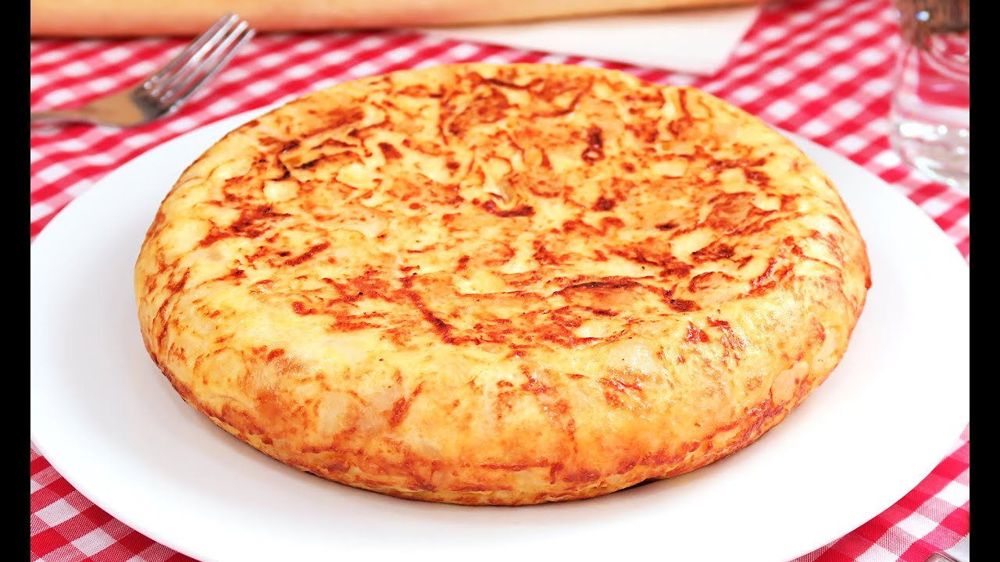
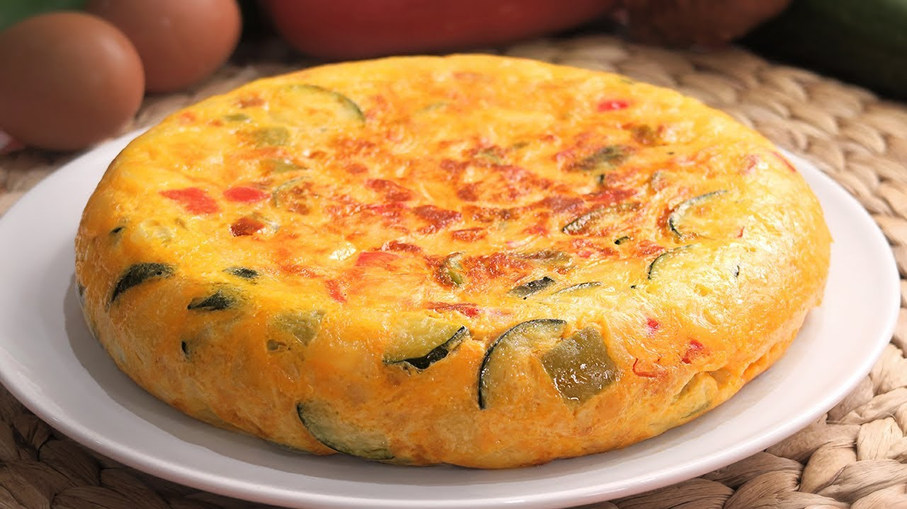
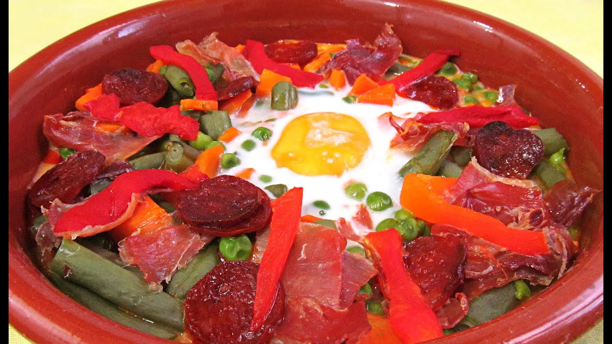
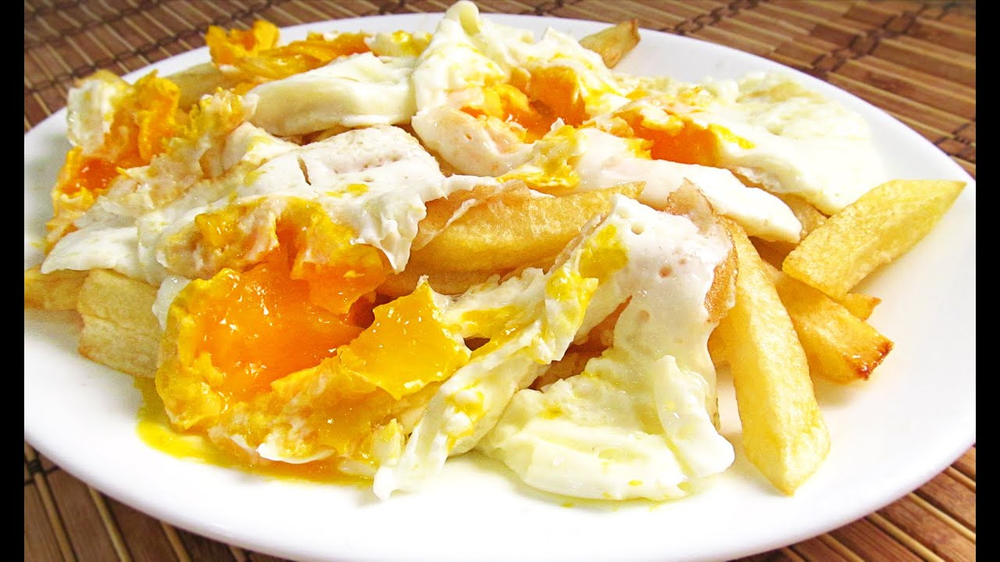
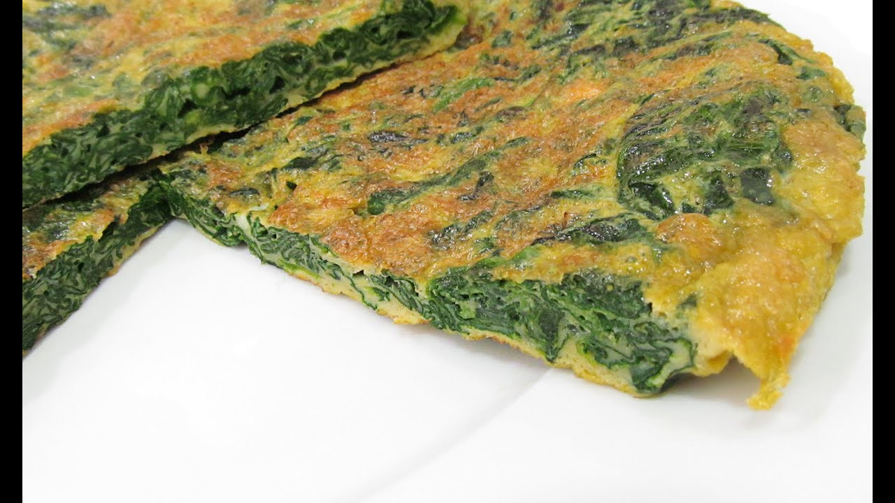
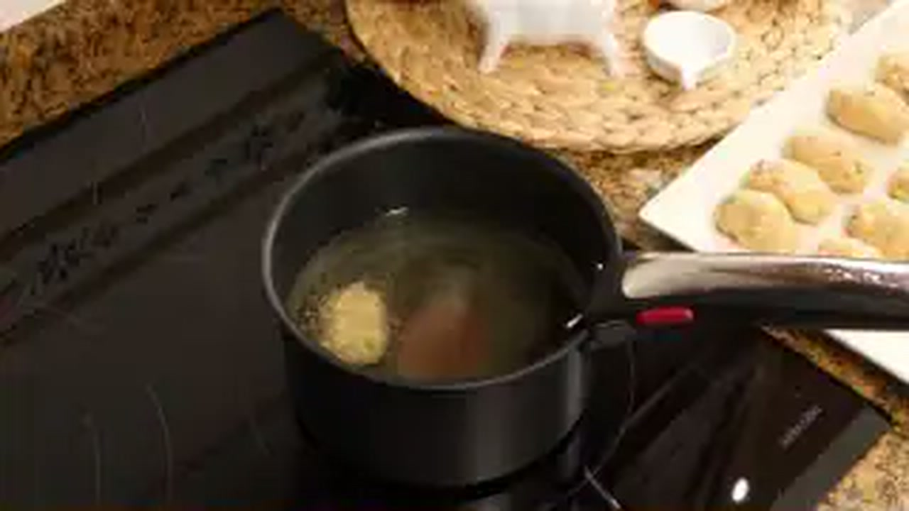
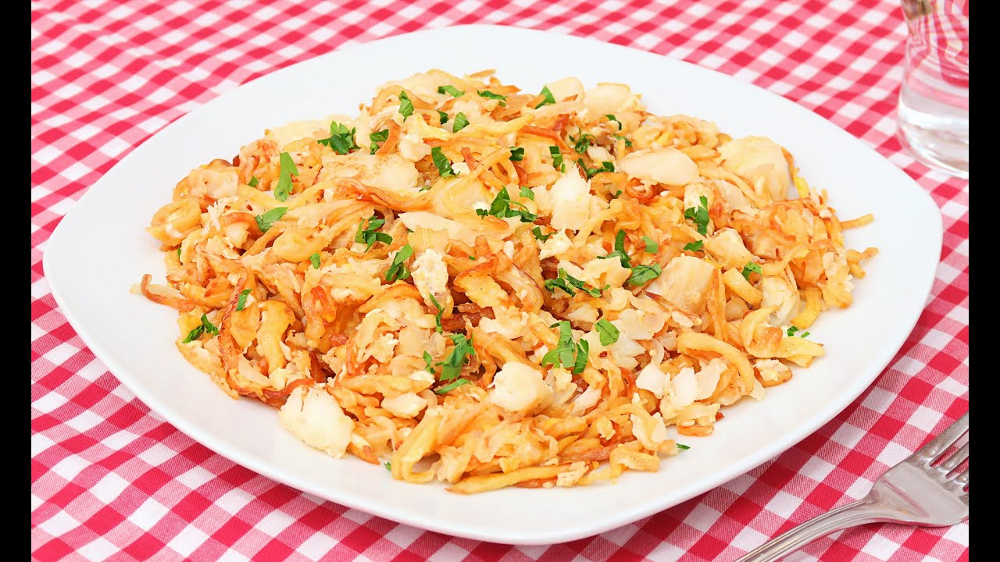

# 🍳 Master de Cocina Tradicional: Huevos, Tortillas y Revueltos
> **Inspirado en la filosofía, técnica y maestría del canal *Cocina con Carmen***  
> *Recetario Técnico Enciclopédico, Termodinámica del Cuajado, Alérgenos UE (Reglamento 1169/2011), Protocolos de Batch Cooking y Guías de Regeneración Profesional*

---

## 📖 Prólogo Culinario: Los Secretos del Huevo y la Termodinámica de Carmen

El huevo es el ingrediente más versátil, delicado y noble de la gastronomía doméstica española. En la cocina de **Cocina con Carmen**, una simple tortilla o un revuelto no son platos menores improvisados a la ligera, sino un ejercicio de máxima precisión térmica y respeto por el producto. El comportamiento de las proteínas del huevo (ovalbúmina, conalbúmina, ovomucoide y las lipoproteínas de la yema) reacciona con extrema sensibilidad a cada grado centígrado y a cada segundo sobre el fuego.

La maestría de Carmen en las elaboraciones con huevo descansa sobre cinco principios técnicos inalterables:

```
                              TERMODINÁMICA DEL HUEVO
                                         
          62°C ─────────────── 65°C ─────────────── 70°C ─────────────── 80°C
       Comienza la        Yema densa y       Coagulación total     Sobrecalentamiento:
       coagulación        cremosa (punto     de la clara (firme,    expulsión de agua
      de la clara         jugoso Carmen)     sin baba vítrea)       y textura gomosa
```

1. **La Coagulación Fraccionada y la Ventana Térmica (62°C - 68°C):** La clara de huevo comienza a desnaturalizarse a los 62°C y cuaja por completo a los 65°C, mientras que la yema inicia su espesamiento a los 65°C y coagula en bloque a los 70°C. El secreto de una tortilla o revuelto jugoso reside en mantener el núcleo interior entre los **64°C y 67°C**: la clara queda cocinada y segura, mientras la yema permanece como una salsa emulsionada aterciopelada que baña el resto de ingredientes.
2. **El Confitado Lento de la Patata y la Hidratación en Tibio:** La patata para tortilla no se fríe crujiente como para guarnición; se corta en láminas finas e irregulares y se pocha lentamente en abundante Aceite de Oliva Virgen Extra (AOVE) a 135-145°C junto a la cebolla, logrando que el almidón se vuelva tierno y mantecoso. El paso definitivo de Carmen consiste en **mezclar la patata escurrida pero aún caliente con el huevo batido y dejarla reposar de 5 a 10 minutos**: el almidón absorbe parte del huevo crudo y la mezcla se templa, creando una emulsión previa que evita el choque térmico en la sartén.
3. **La Fritura con Puntilla y Choque Térmico (180°C - 190°C):** El huevo frito perfecto exige abundante AOVE muy caliente, una clara que sufla instantáneamente creando un encaje tostado y crujiente (*la puntilla*), mientras que con la espumadera se rocía aceite caliente sobre la clara circundante sin tocar la yema, preservándola líquida, tibia y protegida por un fino velo blanquecino.
4. **La Emulsión Mecánica en los Revueltos (Fuego Apagado y Vaivén):** Un revuelto nunca debe parecer una tortilla rota ni una masa reseca de huevo cuajado. Se cocina a fuego muy suave (o directamente con el calor residual de la sartén fuera del fuego), removiendo continuamente con espátula de silicona en movimientos envolventes para crear cristales proteicos microscópicos y una textura similar a una crema untuosa.
5. **Seguridad Alimentaria y Calidad del Producto:** Uso exclusivo de huevos camperos frescos (Categoría A, Código 0 o 1) con cáscara intacta. Control estricto de la cadena de frío (0-4°C) y consumo inmediato tras el cuajado jugoso, o mantenimiento a más de 65°C si se destina a servicio profesional.

---

```
                                  MAPA DEL RECETARIO
                                  
  ┌─────────────────────────────────┐       ┌─────────────────────────────────┐
  │      TORTILLAS EMBLEMÁTICAS     │       │       REVUELTOS DE TABERNA      │
  │ • 1. Tortilla Española Jugosa   │       │ • 5. Revuelto Setas, Gambas     │
  │ • 2. Tortilla Paisana Completa  │       │      y Jamón                    │
  │ • 6. Tortilla Espinacas y Pasas │       │ • 10. Revuelto Gramajo Clásico  │
  │ • 7. Tortilla de Bacalao        │       │                                 │
  └────────────────┬────────────────┘       └────────────────┬────────────────┘
                   │                                         │
                   └───────────────────┬─────────────────────┘
                                       │
                    ┌──────────────────┴──────────────────┐
                    │     HUEVOS DE CAZUELA, RELLENOS     │
                    │         Y PLATOS DE TRADICIÓN       │
                    │ • 3. Huevos a la Flamenca           │
                    │ • 4. Huevos Rotos con Jamón         │
                    │ • 8. Huevos Rellenos Gratinados     │
                    │ • 9. Huevos Tontos de la Abuela     │
                    │ • 11. Pisto Manchego con Huevo      │
                    └─────────────────────────────────────┘
```

---

## 📑 Índice General de Recetas

1. [🍳 Tortilla Española de Patatas Jugosa con Cebolla Pochada (el punto perfecto de Carmen)](#1--tortilla-española-de-patatas-jugosa-con-cebolla-pochada-el-punto-perfecto-de-carmen)
2. [🫑 Tortilla Paisana Tradicional con Chorizo, Guisantes, Pimiento y Jamón](#2--tortilla-paisana-tradicional-con-chorizo-guisantes-pimiento-y-jamón)
3. [🥘 Huevos a la Flamenca Tradicionales en Cazuela de Barro](#3--huevos-a-la-flamenca-tradicionales-en-cazuela-de-barro)
4. [🥔 Huevos Rotos con Jamón Ibérico y Patatas Panadera](#4--huevos-rotos-con-jamón-ibérico-y-patatas-panadera)
5. [🍄 Revuelto de Setas Silvestres, Gambas al Ajillo y Jamón](#5--revuelto-de-setas-silvestres-gambas-al-ajillo-y-jamón)
6. [🥬 Tortilla de Espinacas Frescas, Piñones y Pasas](#6--tortilla-de-espinacas-frescas-piñones-y-pasas)
7. [🐟 Tortilla de Bacalao Desmigado con Pimientos y Cebolla](#7--tortilla-de-bacalao-desmigado-con-pimientos-y-cebolla)
8. [🥚 Huevos Rellenos de Atún y Yema Gratinados con Bechamel Sedosa](#8--huevos-rellenos-de-atún-y-yema-gratinados-con-bechamel-sedosa)
9. [🥖 Huevos Tontos Tradicionales de la Abuela](#9--huevos-tontos-tradicionales-de-la-abuela)
10. [🥓 Revuelto Gramajo Tradicional con Jamón y Patatas Paja Crujientes](#10--revuelto-gramajo-tradicional-con-jamón-y-patatas-paja-crujientes)
11. [🍆 Pisto Manchego con Huevos Fritos con Puntilla](#11--pisto-manchego-con-huevos-fritos-con-puntilla)
12. [📊 Tabla Comparativa Maestra: Rendimientos, Costes, Tiempos y Alérgenos](#-tabla-comparativa-maestra-rendimientos-costes-tiempos-y-alérgenos)
13. [🛡️ Protocolo Higiénico-Sanitario y Conservación de Ovoproductos](#️-protocolo-higiénico-sanitario-y-conservación-de-ovoproductos)

---

## 1. 🍳 Tortilla Española de Patatas Jugosa con Cebolla Pochada (el punto perfecto de Carmen)
*Categoría: Tortilla Monumental / Técnica de Pochado Lento y Reposo Previo*



> 📺 **Vídeo Oficial de Elaboración:** [Ver en YouTube: Tortilla de Patatas Española](https://www.youtube.com/watch?v=uc8Pwe7alJ8)


> [!NOTE]
> El sello inconfundible de Carmen para lograr la tortilla perfecta combina tres factores: corte fino de la patata (variedad Monalisa o Agria), pochado conjunto con la cebolla a fuego dulce hasta que caramelice por sus propios azúcares sin quemarse, y un **reposo obligatorio de 8 minutos de la patata escurrida caliente dentro del huevo batido** antes de verter a la sartén. El cuajado se hace a fuego vivo: apenas 1 minuto y medio por lado para un exterior dorado y un corazón jugoso y fundente.

### 📋 Ficha Resumen
| Parámetro | Valor |
| :--- | :--- |
| **Tiempo de Preparación** | 20 minutos |
| **Tiempo de Cocción** | 30 minutos (pochado) + 4 minutos (cuajado) |
| **Dificultad** | Media (técnica de volteo y control de fuego) |
| **Raciones** | 4-6 personas (Sartén Ø 24-26 cm) |
| **Coste Estimado** | Económico (4,20 € total / 0,70 € ración) |

---

### ⚠️ Tabla de Alérgenos (Reglamento UE 1169/2011)
| Alérgeno | Estado | Ingrediente Causante / Medida de Adaptación |
| :--- | :---: | :--- |
| **Huevos** | 🔴 **PRESENTE** | Huevos camperos clase L. |
| **Gluten** | 🟢 AUSENTE | No contiene harinas ni cereales. |
| **Lácteos** | 🟢 AUSENTE | No contiene leche ni derivados. |
| **Sulfitos / Soja / Frutos de Cáscara** | 🟢 AUSENTE | Formulación tradicional limpia. |

---

### ⚖️ Ingredientes Exactos
* **800 g** Patatas de calidad (variedad Monalisa, Kennebec o Agria), peladas y lavadas.
* **350 g** Cebolla dulce o tipo Reca (aprox. 1 cebolla grande y media), pelada.
* **7 unidades (aprox. 420 g sin cáscara)** Huevos camperos frescos (categoría 0 o 1, clase L).
* **350 ml** Aceite de Oliva Virgen Extra (AOVE) de acidez suave (variedad Arbequina o Picual suave).
* **6 g** Sal marina fina (4 g para las patatas/cebolla y 2 g para los huevos batidos).

---

### 🍳 Equipamiento Necesario
* Sartén antiadherente de fondo grueso (Ø 24-26 cm) de alta calidad.
* Plato llano amplio o vuelcatortillas (tapadera plana con pomo).
* Espumadera metálica o de silicona para escurrir.
* Bol amplio de cristal o acero inoxidable para batir y reposar.
* Colador grande colocado sobre recipiente para recuperar el AOVE limpio.

---

### 👨‍🍳 Paso a Paso Técnico y Minucioso

1. **Corte y Calibrado de Patata y Cebolla:**
   * Cortar las patatas peladas por la mitad a lo largo y luego en láminas finas de unos 2-3 mm de grosor (*corte tradicional de media luna fina irregular*).
   * Cortar la cebolla en juliana fina (tiras de 2 mm).
   * Colocar la patata y la cebolla juntas en un bol y sazonar con 4 g de sal marina; mezclar con las manos para distribuir la sal de manera uniforme.
2. **Pochado y Confitado Lento en AOVE:**
   * En la sartén de 24-26 cm, calentar los 350 ml de AOVE a fuego medio (aprox. 140°C).
   * Añadir la mezcla de patata y cebolla. El aceite debe cubrir prácticamente los ingredientes; si no cubre por completo, reducir el fuego y tapar la sartén los primeros 10 minutos para que el vapor generado ablande la patata.
   * Cocinar a fuego medio-bajo durante **25-30 minutos**, removiendo cada 4-5 minutos con la espumadera para que la patata no se tueste en el fondo y la cebolla se vuelva translúcida y dorada.
   * Conforme la patata se ablanda, romper algunos trozos suavemente con el canto de la espumadera. La textura final debe ser tierna, casi como un puré grueso pero con trozos enteros reconocibles.
3. **Escurrido y Reposo de la Mezcla en el Huevo:**
   * Volcar el contenido de la sartén sobre el colador grande para retirar el exceso de aceite (guardar ese AOVE infusionado de cebolla y patata, es oro líquido para otros guisos).
   * En el bol amplio, batir los 7 huevos con 2 g de sal durante 45 segundos con un tenedor o varilla ligera. **No batir en exceso**: no queremos espumar ni incorporar aire, solo romper las claras y homogeneizar con las yemas.
   * Incorporar las patatas y cebolla escurridas y **aún calientes** directamente dentro del bol con el huevo batido.
   * Remover suavemente con una cuchara para integrar y **dejar reposar durante 8 a 10 minutos**. Durante este reposo, el almidón de la patata absorbe el huevo crudo, la clara se atempera y se crea la emulsión densa característica del punto de Carmen.
4. **Sellado y Cuajado Magistral:**
   * Poner la sartén antiadherente a fuego medio-alto con 1 cucharada sopera (15 ml) del AOVE reservado.
   * Cuando la sartén humee ligeramente (170°C), verter la mezcla completa de golpe. Se escuchará un chisporroteo inmediato.
   * Bajar el fuego a medio. Con una espátula de silicona, perfilar los bordes hacia dentro en movimientos circulares mientras se mueve la sartén con la muñeca hacia delante y atrás para evitar que el fondo se pegue. Mantener durante **1 minuto y medio (90 segundos)**.
5. **El Volteo y Sellado Final:**
   * Colocar el plato llano o vuelcatortillas humedecido con unas gotas de agua sobre la sartén.
   * Con un movimiento firme, decidido y continuo, dar la vuelta a la sartén.
   * Deslizar la tortilla nuevamente hacia la sartén, empujando suavemente los bordes con la espátula hacia abajo para darle la forma redondeada y abombada clásica (*el perfilado de Carmen*).
   * Cocinar por esta segunda cara durante **1 minuto a fuego medio-alto** para sellar y dejar el corazón jugoso.
6. **Reposo y Servicio:**
   * Deslizar al plato de servicio. Dejar reposar **3 minutos** antes de cortar para que los jugos internos se asienten y no se desparrame en exceso al primer corte.

---

### 📦 Protocolo de Conservación y Batch Cooking
* **Base de Patata y Cebolla Pochada (Batch Cooking):** Se puede confitar gran cantidad de patata y cebolla, escurrir bien el aceite y envasar en recipientes herméticos de vidrio. Se conserva en nevera (2-4°C) hasta **4 días** o congelada hasta **2 meses**.
* **Montaje Express:** Para preparar la tortilla fresca, basta con calentar la base de patata/cebolla 1 minuto en microondas o sartén, mezclar con los huevos frescos batidos, reposar 5 minutos y cuajar al momento.
* **Tortilla Cuajada:** Si sobra tortilla, refrigerar cubierta con film a 3-4°C máximo **2 días**.

---

### 🔥 Guía de Regeneración Multicanal
* **Sartén (Recomendado para devolver el crujiente exterior):** Calentar una sartén a fuego medio sin aceite. Colocar el trozo de tortilla durante 1,5 minutos por cara con tapa puesta para que el calor penetre al corazón sin secar el huevo.
* **Horno / Airfryer:** Precalentar a 160°C. Calentar durante 4-5 minutos (o 3 min a 150°C en airfryer).
* **Microondas (Uso Rápido):** Colocar el trozo cubierto con una campana a **400W durante 35-45 segundos**. Evitar potencias altas (800W+) porque coagulan instantáneamente la yema residual volviéndola esponjosa y reseca.

---

## 2. 🫑 Tortilla Paisana Tradicional con Chorizo, Guisantes, Pimiento y Jamón
*Categoría: Tortilla Campesina / Relleno Rico en Embutido y Hortalizas*



> 📺 **Vídeo Oficial de Elaboración:** [Ver en YouTube: Tortilla Campera o Paisana | muy Fácil y Riquísima!](https://www.youtube.com/watch?v=ApfsBqMFCPs)


> [!TIP]
> En la tortilla paisana de Carmen, los pimientos rojos y verdes se cortan en dados regulares y se sofríen junto con la cebolla antes de incorporar el chorizo y el jamón. El chorizo debe soltar su pringue rojizo sin quemarse, tiñendo ligeramente el aceite que luego impregnará las patatas y el huevo de un sabor ahumado espectacular.

### 📋 Ficha Resumen
| Parámetro | Valor |
| :--- | :--- |
| **Tiempo de Preparación** | 25 minutos |
| **Tiempo de Cocción** | 35 minutos |
| **Dificultad** | Media |
| **Raciones** | 6 personas (Sartén Ø 26 cm) |
| **Coste Estimado** | Medio (5,80 € total / 0,96 € ración) |

---

### ⚠️ Tabla de Alérgenos (Reglamento UE 1169/2011)
| Alérgeno | Estado | Ingrediente Causante / Medida de Adaptación |
| :--- | :---: | :--- |
| **Huevos** | 🔴 **PRESENTE** | Huevos camperos clase L. |
| **Gluten** | 🟡 TRAZAS / VARIABLE | Según el chorizo seleccionado. *Usar chorizo artesano libre de gluten certificado.* |
| **Lácteos / Sulfitos** | 🟡 VARIABLE | Posibles aditivos en embutidos comerciales. Usar embutido tradicional puro. |

---

### ⚖️ Ingredientes Exactos
* **650 g** Patatas peladas cortadas en dados medianos de 1,5 cm (tipo mirepoix).
* **180 g** Cebolla picada en dados.
* **100 g** Pimiento rojo morrón fresco en dados de 1 cm.
* **100 g** Pimiento verde italiano fresco en dados de 1 cm.
* **100 g** Guisantes finos (frescos blanqueados 3 min o congelados descongelados y secos).
* **90 g** Taquitos de jamón serrano o ibérico (brunoise de 0,5 cm).
* **90 g** Chorizo dulce o semi-curado de guiso, sin piel y cortado en daditos pequeños.
* **7 unidades** Huevos camperos frescos clase L.
* **250 ml** Aceite de Oliva Virgen Extra (AOVE).
* **4 g** Sal marina fina.

---

### 👨‍🍳 Paso a Paso Técnico y Minucioso

1. **Sofrito de Verduras y Fritura de Patatas:**
   * En sartén amplia, calentar 200 ml de AOVE a fuego medio. Añadir las patatas en dados sazonadas con 3 g de sal y pochar durante 15 minutos hasta que estén tiernas y ligeramente doradas por fuera. Retirar con espumadera y reservar en bol.
   * En la misma sartén con el aceite remanente, sofreír la cebolla, el pimiento rojo y el pimiento verde a fuego medio durante 10 minutos hasta que estén pochados y caramelizados.
2. **Salteado de Chorizo, Jamón y Guisantes:**
   * Añadir los 90 g de chorizo en dados a la sartén de las verduras. Saltear a fuego vivo durante 1 minuto para que sude su pimentón y grasa natural.
   * Incorporar los 90 g de jamón serrano y los 100 g de guisantes. Saltear todo junto durante **1 minuto más** (el jamón no debe freírse en exceso para no endurecerse).
3. **Unión de Ingredientes y Reposo en Huevo:**
   * Escurrir todo el conjunto de verduras, chorizo, jamón y patatas en un colador.
   * En el bol grande, batir los 7 huevos con 1 g de sal (el chorizo y jamón ya aportan salinidad).
   * Verter la mezcla caliente escurrida dentro del huevo batido. Mezclar con suavidad y dejar reposar **6 minutos** para que los sabores se amalgamen.
4. **Cuajado de la Tortilla Paisana:**
   * Calentar la sartén antiadherente a fuego medio con 1 cucharada de aceite.
   * Verter la mezcla. Bajar el fuego a medio-bajo (al llevar más ingredientes y grosor, requiere un cuajado ligeramente más lento que la de patata clásica).
   * Cocinar durante **2 minutos y medio**, perfilando los bordes con espátula.
   * Dar la vuelta con plato llano y cuajar la otra cara durante **2 minutos**.
5. **Servicio:** Servir templada o a temperatura ambiente en porciones triangulares generosas.

---

### 📦 Batch Cooking y Conservación
* **Base Paisana Congelable:** El sofrito de patata, pimientos, guisantes, chorizo y jamón se puede congelar en raciones herméticas. Para cocinar, descongelar en nevera la noche anterior y mezclar con el huevo batido fresco.
* **Refrigeración:** Aguanta perfectamente en nevera 48 horas en táper sellado. Excelente para llevar de picnic o fiambrera.

---

### 🔥 Guía de Regeneración Multicanal
* **Horno Convencional:** 170°C durante 6 minutos tapada con papel de aluminio.
* **Sartén:** A fuego bajo con tapa durante 2 minutos por cara.

---

## 3. 🥘 Huevos a la Flamenca Tradicionales en Cazuela de Barro
*Categoría: Guiso de Cazuela / Fusión de Sofrito Andaluz, Verduras de Huerta y Horno*



> 📺 **Vídeo Oficial de Elaboración:** [Ver en YouTube: Huevos a la Flamenca](https://www.youtube.com/watch?v=LoPqGOBpQhU)


> [!NOTE]
> Los huevos a la flamenca son el epítome de la cocina andaluza festiva. Carmen prepara una base de tomate frito casero muy reducido con cebolla y pimiento, enriquecida con patatas en dados fritas crujientes, guisantes, tiras de pimiento morrón asado, rodajas de chorizo artesano y jamón ibérico. Todo se hornea en cazuelitas individuales de barro hasta que la clara coagula en un blanco impoluto y la yema tiembla como un botón dorado.

### 📋 Ficha Resumen
| Parámetro | Valor |
| :--- | :--- |
| **Tiempo de Preparación** | 20 minutos |
| **Tiempo de Cocción** | 25 minutos (sofrito y patatas) + 8 minutos (horno) |
| **Dificultad** | Baja-Media |
| **Raciones** | 4 personas (4 cazuelas individuales de barro de Ø 16 cm) |
| **Coste Estimado** | Medio (6,50 € total / 1,62 € ración) |

---

### ⚠️ Tabla de Alérgenos (Reglamento UE 1169/2011)
| Alérgeno | Estado | Ingrediente Causante / Medida de Adaptación |
| :--- | :---: | :--- |
| **Huevos** | 🔴 **PRESENTE** | Huevos camperos en cazuela. |
| **Gluten** | 🟡 TRAZAS / VARIABLE | En el chorizo o embutidos. Usar embutidos garantizados *sin gluten*. |
| **Sulfitos / Lácteos** | 🟢 AUSENTE | Formulación tradicional limpia. |

---

### ⚖️ Ingredientes Exactos
* **8 unidades** Huevos camperos frescos clase L (2 huevos por cazuela individual).
* **400 g** Patatas cortadas en dados pequeños (1x1 cm).
* **500 g** Tomate frito casero espeso (elaborado con tomate pera maduro, cebolla y AOVE).
* **150 g** Guisantes tiernos cocidos.
* **100 g** Tiras de pimiento morrón asado en conserva o natural.
* **120 g** Chorizo ibérico en rodajas finas (aprox. 16-20 rodajitas).
* **100 g** Jamón ibérico o serrano en lascas finas o taquitos.
* **1 unidad** Cebolla mediana picada finamente.
* **2 dientes** Ajo picados en láminas.
* **150 ml** Aceite de Oliva Virgen Extra para freír las patatas y sofrito.
* **4 g** Sal marina y pimienta negra recién molida.
* **1 cucharadita (3 g)** Pimentón dulce de la Vera.

---

### 🍳 Equipamiento Necesario
* 4 cazuelas individuales de barro refractario (aptas para horno y fuego directo) o 1 fuente amplia de barro.
* Horno convencional con calor arriba y abajo (o función grill suave).
* Sartén para freír patatas y elaborar el sofrito.

---

### 👨‍🍳 Paso a Paso Técnico y Minucioso

1. **Fritura Crujiente de Patatas:**
   * En sartén con abundante AOVE a 170°C, freír los dados de patata hasta que queden dorados por fuera y tiernos por dentro (aprox. 8-10 minutos).
   * Escurrir sobre papel absorbente y sazonar con un toque de sal. Reservar.
2. **Elaboración de la Base Sofrita y Chup-Chup:**
   * En una sartén con 30 ml de AOVE, pochar la cebolla picada y los ajos a fuego suave durante 10 minutos.
   * Añadir el pimentón dulce, remover 10 segundos fuera del fuego para que no amargue e incorporar inmediatamente los 500 g de tomate frito casero espeso.
   * Cocinar a fuego lento durante 5 minutos para que se integren los sabores.
   * Agregar los guisantes y la mitad de las patatas fritas al tomate sofrito; mezclar con delicadeza.
3. **Montaje en Cazuelas de Barro:**
   * Precalentar el horno a **190°C con calor arriba y abajo**.
   * Repartir la salsa de tomate con verduras y patatas en la base de las 4 cazuelas de barro precalentadas ligeramente.
   * Decorar los laterales con las patatas fritas restantes, las tiras de pimiento morrón asado, las rodajas de chorizo y las lascas de jamón.
   * Hacer dos pequeños huecos en el centro de cada cazuela con el dorso de una cuchara.
4. **Disposición de los Huevos y Horneado Controlado:**
   * Cascar 2 huevos camperos en cada cazuela, depositando cada yema en su respectivo hueco.
   * Añadir una mota microscópica de sal fina sobre las claras (nunca sobre la yema para no mancharla con puntos blancos de deshidratación).
   * Introducir las cazuelas en el tercio medio del horno a **190°C durante 7 a 9 minutos**.
   * **El Punto Crítico de Carmen:** Retirar la cazuela en el instante exacto en que la clara haya perdido la transparencia y se vuelva blanca lechosa, pero la yema siga completamente líquida y brillante. Tener en cuenta que el barro conserva el calor residual y seguirá cocinando el huevo 1-2 minutos fuera del horno.
5. **Toque Final:** Espolvorear un giro de pimienta negra recién molida y servir inmediatamente con abundante pan de pueblo.

---

### 📦 Protocolo de Batch Cooking
* **Cazuela Base Preparada:** La salsa de tomate con verduras, chorizo, jamón y patatas se puede ensamblar con antelación en las cazuelas de barro y refrigerar tapadas hasta **48 horas**.
* **Cocinado Final al Minuto:** En el momento de comer, atemperar las cazuelas 15 minutos, cascar los huevos frescos y hornear directamente.

---

### 🔥 Guía de Regeneración
* **Horno:** Si se recalienta una cazuela ya horneada, cubrir con papel de aluminio y calentar a 160°C durante 6 minutos (la yema cuajará por completo, pero mantendrá su humedad).

---

## 4. 🥔 Huevos Rotos con Jamón Ibérico y Patatas Panadera
*Categoría: Clásico de Taberna / Fritura Perfecta y Choque de Texturas*



> 📺 **Vídeo Oficial de Elaboración:** [Ver en YouTube: Cómo hacer Huevos Rotos al estilo Lucio](https://www.youtube.com/watch?v=-8A0try7i84)


> [!TIP]
> Para unos huevos rotos de categoría suprema, la patata debe cortarse en rodajas panaderas (3-4 mm), pochándose primero a fuego medio y subiendo la temperatura al final para tostar los bordes. Los huevos deben freírse con puntilla en AOVE muy caliente, colocarse sobre la cama de patatas y cubrirse con el jamón ibérico recién cortado para que su grasa se funda con el calor del plato antes de romperlos con dos cuchillos en la mesa frente a los comensales.

### 📋 Ficha Resumen
| Parámetro | Valor |
| :--- | :--- |
| **Tiempo de Preparación** | 15 minutos |
| **Tiempo de Cocción** | 20 minutos |
| **Dificultad** | Baja |
| **Raciones** | 4 personas |
| **Coste Estimado** | Medio-Alto (según calidad del jamón ibérico: 7,50 € total) |

---

### ⚠️ Tabla de Alérgenos (Reglamento UE 1169/2011)
| Alérgeno | Estado | Ingrediente Causante / Medida de Adaptación |
| :--- | :---: | :--- |
| **Huevos** | 🔴 **PRESENTE** | Huevos camperos fritos. |
| **Gluten / Lácteos / Sulfitos** | 🟢 AUSENTE | Elaboración 100% natural libre de alérgenos adicionales. |

---

### ⚖️ Ingredientes Exactos
* **800 g** Patatas de calidad (variedad Agria o Kennebec), peladas.
* **1 unidad (150 g)** Cebolla cortada en juliana fina (opcional pero imprescindible para Carmen).
* **1 unidad (80 g)** Pimiento verde italiano cortado en tiras (opcional).
* **6 unidades** Huevos camperos tamaño L o XL muy frescos.
* **150 g** Jamón Ibérico de Bellota cortado en lonchas finas a temperatura ambiente (22°C).
* **300 ml** Aceite de Oliva Virgen Extra para freír patatas y huevos.
* **5 g** Sal marina gruesa / escamas de sal maldon.

---

### 👨‍🍳 Paso a Paso Técnico y Minucioso

1. **Elaboración de las Patatas Panadera:**
   * Cortar las patatas peladas en rodajas de unos 3-4 mm de grosor (*corte panadera*).
   * En sartén amplia con 250 ml de AOVE a 140°C, añadir las patatas junto con la cebolla y el pimiento verde sazonados con 4 g de sal.
   * Cocinar a fuego medio-bajo durante 15 minutos, removiendo ocasionalmente, hasta que las patatas estén muy tiernas y comiencen a deshacerse ligeramente.
   * Subir el fuego a tope (180°C) durante los últimos 2-3 minutos para que los bordes de las patatas tomen un color dorado apetecible y una textura ligeramente crocante.
   * Escurrir bien con espumadera y disponerlas inmediatamente sobre una fuente amplia y precalentada.
2. **Fritura Magistral de los Huevos con Puntilla:**
   * En una sartén pequeña (Ø 18-20 cm), poner 60-80 ml del AOVE caliente a fuego fuerte hasta que alcance los **185°C** (debe humear levemente).
   * Cascar un huevo en una taza y deslizarlo con suavidad en el centro del aceite.
   * Inmediatamente, la clara suflará creando una puntilla dorada y crujiente en los bordes. Con una espumadera o cuchara, bañar la clara con el aceite hirviendo durante **30 a 45 segundos**. La yema debe quedar cruda y líquida en su totalidad.
   * Sacar con la espumadera, escurrir el exceso de grasa y depositar con cuidado sobre la cama de patatas panadera calientes.
   * Repetir el proceso con los 5 huevos restantes (se pueden freír de dos en dos si la sartén es más ancha).
3. **El Emplatado y el Ritual de la Rotura:**
   * Disponer las lonchas finas de jamón ibérico alrededor y por encima de los huevos calientes. La grasa entreverada del jamón se volverá translúcida y liberará sus aromas oleicos al entrar en contacto con el vapor de las patatas.
   * Añadir unas escamas de sal marina sobre las yemas.
   * **El Corte de Carmen:** Con dos cuchillos de mesa o cuchara y tenedor, realizar 3 o 4 cortes rápidos cruzados en directo sobre las yemas, permitiendo que la salsa líquida fluya e impregne cada lasca de patata y jamón. Servir inmediatamente con pan crujiente.

---

### 📦 Conservación y Batch Cooking
* **Patata Panadera Base:** Se puede tener la patata panadera pochada con cebolla refrigerada en recipiente hermético hasta 3 días.
* **Fritura al Momento:** Los huevos fritos jamás deben guardarse ni recalentarse; se fríen y montan en 3 minutos.

---

## 5. 🍄 Revuelto de Setas Silvestres, Gambas al Ajillo y Jamón
*Categoría: Revuelto Gourmet / Emulsión a Fuego Manso y Textura Mantequilla*


> 📺 **Vídeo Oficial de Elaboración:** [Ver en YouTube: Gambas al Ajillo fáciles de hacer y deliciosas](https://www.youtube.com/watch?v=aRSkZu3mTvc)


> [!NOTE]
> Un auténtico revuelto según Carmen nunca es un huevo seco en migas. El secreto consiste en saltear las setas a fuego vivo para evaporar toda su agua de vegetación, dorar los ajitos con las gambas, apagar el fuego y verter los huevos batidos sobre la sartén caliente, ligando la mezcla enérgicamente fuera del fuego con el calor residual hasta conseguir una crema satinada y untuosa.

### 📋 Ficha Resumen
| Parámetro | Valor |
| :--- | :--- |
| **Tiempo de Preparación** | 15 minutos |
| **Tiempo de Cocción** | 12 minutos |
| **Dificultad** | Baja-Media |
| **Raciones** | 4 personas |
| **Coste Estimado** | Medio (6,90 € total / 1,72 € ración) |

---

### ⚠️ Tabla de Alérgenos (Reglamento UE 1169/2011)
| Alérgeno | Estado | Ingrediente Causante / Medida de Adaptación |
| :--- | :---: | :--- |
| **Huevos** | 🔴 **PRESENTE** | Huevos camperos clase L. |
| **Crustáceos** | 🔴 **PRESENTE** | Gambas frescas o langostinos. *Adaptación: omitir marisco y duplicar setas/jamón.* |
| **Gluten / Lácteos** | 🟢 AUSENTE | Formulación tradicional limpia. |

---

### ⚖️ Ingredientes Exactos
* **6 unidades** Huevos camperos frescos clase L.
* **300 g** Setas variadas de temporada o silvestres (boletus, níscalos, setas de cardo, champiñones portobello), limpias y troceadas.
* **200 g** Gambas frescas peladas o colas de langostino crudo.
* **80 g** Jamón ibérico cortado en finas tiras o taquitos menudos.
* **3 dientes** Ajo laminados finamente.
* **1 guindilla cayena pequeña** (opcional, para el toque de taberna).
* **45 ml** Aceite de Oliva Virgen Extra (AOVE).
* **15 ml** Nata líquida o leche entera (opcional, el truco de Carmen para asegurar máxima untuosidad).
* **1 cucharada** Perejil fresco picado muy fino.
* **3 g** Sal marina fina y pimienta negra molida.

---

### 👨‍🍳 Paso a Paso Técnico y Minucioso

1. **Evaporación y Dorado de las Setas:**
   * En una sartén amplia, calentar 20 ml de AOVE a fuego fuerte.
   * Añadir las setas troceadas. Al principio soltarán agua; saltear a fuego vivo durante 5-6 minutos hasta que todo el líquido se evapore y las setas empiecen a dorarse y concentrar sus azúcares. Retirar a un plato.
2. **Ajillo y Salteado de Gambas y Jamón:**
   * En la misma sartén, añadir los 25 ml restantes de AOVE junto con los ajos laminados y la cayena a fuego medio.
   * Cuando el ajo empiece a bailar y tomar un color dorado claro (sin quemarse), añadir las gambas y saltear durante **45-60 segundos** hasta que cambien de color.
   * Reincorporar las setas doradas y el jamón ibérico; dar 2 vueltas rápidas en la sartén durante 30 segundos y retirar la guindilla cayena.
3. **El Batido Ligero del Huevo:**
   * En un bol, batir los 6 huevos con los 15 ml de nata/leche, 2 g de sal marina, un toque de pimienta negra y el perejil picado. Batir solo hasta romper las claras (sin generar espuma).
4. **La Emulsión del Revuelto Fuera del Fuego:**
   * **EL SECRETO DE CARMEN:** Bajar el fuego al mínimo absoluto o directamente **retirar la sartén del fuego**.
   * Verter los huevos batidos sobre el salteado caliente.
   * Con una espátula de silicona, comenzar a remover de forma continua y circular, llevando el huevo cuajado de los bordes hacia el centro.
   * Si la sartén pierde calor demasiado rápido, acercarla al fuego suave durante 10 segundos y volver a retirarla. El proceso dura aprox. **1 minuto y medio a 2 minutos**.
   * Parar el cocinado cuando el huevo presente un aspecto cremoso, brillante y húmedo, similar a una crema pastelera salada (*baveuse*).
5. **Servicio Inmediato:** Volcar de inmediato sobre tostas de pan de masa madre frotadas con ajo y aceite.

---

### 📦 Conservación y Batch Cooking
* **Salteado Base Listo:** Las setas salteadas con ajo y gambas se pueden conservar en frío hasta 48 horas.
* **Cuajado In situ:** El revuelto con huevo debe cuajarse siempre en el momento exacto de su consumo para no perder la emulsión.

---

## 6. 🥬 Tortilla de Espinacas Frescas, Piñones y Pasas
*Categoría: Tortilla de Huerta / Fusión Andalusí-Mediterránea*



> 📺 **Vídeo Oficial de Elaboración:** [Ver en YouTube: Tortilla de Espinacas](https://www.youtube.com/watch?v=XjuMkb7VQ-g)


> [!TIP]
> Para evitar que la tortilla de espinacas quede aguada, Carmen nunca hierve las espinacas en agua: las saltea en crudo con un hilo de AOVE y ajo hasta que reduzcan, y luego las presiona firmemente en un colador para extraer hasta la última gota de clorofila líquida antes de juntarlas con el huevo.

### 📋 Ficha Resumen
| Parámetro | Valor |
| :--- | :--- |
| **Tiempo de Preparación** | 15 minutos |
| **Tiempo de Cocción** | 15 minutos |
| **Dificultad** | Baja |
| **Raciones** | 4 personas (Sartén Ø 22 cm) |
| **Coste Estimado** | Económico (3,90 € total / 0,97 € ración) |

---

### ⚠️ Tabla de Alérgenos (Reglamento UE 1169/2011)
| Alérgeno | Estado | Ingrediente Causante / Medida de Adaptación |
| :--- | :---: | :--- |
| **Huevos** | 🔴 **PRESENTE** | Huevos camperos clase L. |
| **Frutos de Cáscara** | 🔴 **PRESENTE** | Piñones nacionales. *Adaptación: sustituir por semillas de girasol tostadas o suprimir.* |
| **Sulfitos** | 🟡 VARIABLE | Posibles en uvas pasas comerciales no ecológicas. |
| **Gluten / Lácteos** | 🟢 AUSENTE | Formulación tradicional limpia. |

---

### ⚖️ Ingredientes Exactos
* **500 g** Espinacas frescas baby o de hoja limpia.
* **35 g** Piñones nacionales tostados.
* **40 g** Uvas pasas de Corinto o sultanas (hidratadas 10 min en agua templada o vino dulce).
* **2 dientes** Ajo laminados finamente.
* **5 unidades** Huevos camperos frescos clase L.
* **35 ml** Aceite de Oliva Virgen Extra (AOVE).
* **3 g** Sal marina fina.
* **1 pizca (0,3 g)** Nuez moscada recién rallada.

---

### 👨‍🍳 Paso a Paso Técnico y Minucioso

1. **Hidratación y Tostado:**
   * Poner las pasas a hidratar en un vasito con agua tibia durante 10 minutos; escurrir y secar con papel absorbente.
   * En una sartén sin aceite a fuego medio, tostar los piñones durante 2 minutos vigilando constantemente para que no se quemen. Reservar.
2. **Salteado en Seco y Deshidratación de Espinacas:**
   * En la misma sartén amplia, calentar 25 ml de AOVE y dorar los ajos laminados a fuego medio.
   * Añadir las espinacas frescas en 2 o 3 tandas. Conforme el calor ablanda las hojas, añadir el resto.
   * Cocinar durante **4-5 minutos** hasta que hayan reducido su volumen por completo.
   * Añadir las pasas hidratadas, los piñones tostados, la nuez moscada y 2 g de sal. Saltear todo junto durante 1 minuto.
   * **El Prensado Clave:** Pasar las espinacas salteadas a un colador fino y presionar con la parte trasera de un cucharón para eliminar todo el exceso de líquido verde.
3. **Integración y Cuajado:**
   * Batir los 5 huevos en un bol con 1 g de sal. Añadir las espinacas bien escurridas y tibias.
   * Calentar la sartén antiadherente (Ø 22 cm) con 10 ml de AOVE a fuego medio-alto.
   * Verter la mezcla y cuajar durante **1 minuto y medio** por el primer lado.
   * Dar la vuelta con plato llano y cuajar **1 minuto** por el segundo lado para que quede tierna, jugosa y de un verde brillante y apetitoso.

---

### 📦 Conservación y Batch Cooking
* Las espinacas con piñones y pasas salteadas y escurridas se conservan en nevera hasta **3 días** listas para cuajar la tortilla en 3 minutos.

---

## 7. 🐟 Tortilla de Bacalao Desmigado con Pimientos y Cebolla
*Categoría: Tortilla Tradicional de Cuaresma y Sidrería / Pescado y Hortaliza*


> 📺 **Vídeo Oficial de Elaboración:** [Ver en YouTube: Tortilla de Bacalao](https://www.youtube.com/watch?v=4nkFQKZ2b50)


> [!NOTE]
> Esta tortilla emblemática exige un bacalao desalado en su punto justo de salinidad, desmigado muy fino y escurrido. Carmen pocha primero la cebolla y el pimiento verde hasta dejarlos extremadamente melosos; después confita el bacalao apenas 1 minuto para que suelte su gelatina natural, la cual emulsiona con el huevo creando una textura sedosa sin igual.

### 📋 Ficha Resumen
| Parámetro | Valor |
| :--- | :--- |
| **Tiempo de Preparación** | 20 minutos |
| **Tiempo de Cocción** | 20 minutos |
| **Dificultad** | Media |
| **Raciones** | 4 personas (Sartén Ø 24 cm) |
| **Coste Estimado** | Medio (6,20 € total / 1,55 € ración) |

---

### ⚠️ Tabla de Alérgenos (Reglamento UE 1169/2011)
| Alérgeno | Estado | Ingrediente Causante / Medida de Adaptación |
| :--- | :---: | :--- |
| **Huevos** | 🔴 **PRESENTE** | Huevos camperos clase L. |
| **Pescado** | 🔴 **PRESENTE** | Bacalao desalado. |
| **Gluten / Lácteos / Sulfitos** | 🟢 AUSENTE | Formulación tradicional limpia. |

---

### ⚖️ Ingredientes Exactos
* **300 g** Bacalao desalado de primera calidad, desmigado a mano y sin espinas ni piel.
* **250 g** Cebolla dulce cortada en juliana muy fina.
* **150 g** Pimiento verde italiano cortado en tiras finas.
* **2 dientes** Ajo picados muy finos.
* **6 unidades** Huevos camperos frescos clase L.
* **50 ml** Aceite de Oliva Virgen Extra (AOVE).
* **2 cucharadas** Perejil fresco recién picado.
* **2 g** Sal marina fina (ajustar con cautela por el bacalao).

---

### 👨‍🍳 Paso a Paso Técnico y Minucioso

1. **Pochar la Verdura Melosa:**
   * En sartén amplia, calentar 40 ml de AOVE a fuego suave.
   * Añadir la cebolla y el pimiento verde con 1 g de sal. Pochar lentamente durante **15 minutos** hasta que la cebolla esté completamente transparente y tierna como mantequilla.
   * Añadir el ajo picado en los últimos 2 minutos de pochado.
2. **Confitado Rápido del Bacalao:**
   * Secar el bacalao desmigado con papel de cocina.
   * Subir ligeramente el fuego en la sartén de las verduras e incorporar el bacalao desmigado.
   * Saltear durante **60 a 90 segundos**, solo hasta que el bacalao cambie de color translúcido a blanco nacarado y comience a soltar su gelatina blanca (*pil-pil* incipiente).
   * Añadir el perejil fresco picado, mezclar y retirar del fuego inmediatamente para que no se seque.
3. **Emulsión con Huevo y Cuajado Jugoso:**
   * Batir los 6 huevos enérgicamente en un bol con 1 g de sal.
   * Incorporar el salteado tibio de bacalao, cebolla y pimiento con todos sus jugos gelatinosos. Mezclar y reposar 3 minutos.
   * Poner la sartén a fuego medio-alto con 10 ml de AOVE.
   * Verter la mezcla. Mover en vaivén rápido y redondear los bordes durante **1 minuto**.
   * Dar la vuelta y cuajar por el otro lado durante apenas **45-60 segundos**.
   * Debe quedar con un aspecto abombado, dorado por fuera y extraordinariamente jugosa (*babé*) por dentro.

---

### 📦 Conservación y Batch Cooking
* El sofrito de cebolla, pimiento y bacalao confitado se puede refrigerar hasta **2 días**.
* Consumir la tortilla recién hecha para disfrutar de la máxima ternura del bacalao.

---

## 8. 🥚 Huevos Rellenos de Atún y Yema Gratinados con Bechamel Sedosa
*Categoría: Plato de Fiesta Familiar / Fusión de Huevo Cocido, Sofrito y Gratinado al Horno*


> 📺 **Vídeo Oficial de Elaboración:** [Ver en YouTube: Huevos Rellenos de Atun y Mayonesa | Receta Fácil y Rápida!](https://www.youtube.com/watch?v=igUKFdkin6s)


> [!TIP]
> Carmen transforma los tradicionales huevos rellenos fríos en un plato caliente de fiesta gratinándolos con una bechamel muy ligera y fluida (50 g de harina por litro) enriquecida con un toque de tomate frito, coronada con queso rallado que gratina a 220°C creando una costra dorada irresistible.

### 📋 Ficha Resumen
| Parámetro | Valor |
| :--- | :--- |
| **Tiempo de Preparación** | 25 minutos |
| **Tiempo de Cocción** | 10 min (cocción huevos) + 12 min (bechamel) + 8 min (gratinado) |
| **Dificultad** | Media |
| **Raciones** | 4-6 personas (12 medios huevos rellenos) |
| **Coste Estimado** | Económico (4,80 € total / 0,80 € ración) |

---

### ⚠️ Tabla de Alérgenos (Reglamento UE 1169/2011)
| Alérgeno | Estado | Ingrediente Causante / Medida de Adaptación |
| :--- | :---: | :--- |
| **Huevos** | 🔴 **PRESENTE** | Huevos cocidos. |
| **Pescado** | 🔴 **PRESENTE** | Atún en conserva de oliva. |
| **Lácteos** | 🔴 **PRESENTE** | Leche, mantequilla y queso rallado. *Adaptación: bebida de soja/arroz y queso vegano.* |
| **Gluten** | 🔴 **PRESENTE** | Harina de trigo en bechamel. *Adaptación: Maizena (almidón de maíz).* |

---

### ⚖️ Ingredientes Exactos

#### Relleno de Huevos
* **6 unidades** Huevos camperos clase L.
* **160 g (2 latas escurridas)** Atún claro en aceite de oliva virgen.
* **80 g** Tomate frito casero espeso.
* **8 unidades** Aceitunas verdes manzanilla sin hueso picadas finamente.
* **1 cucharadita** Pimiento morrón asado picado en brunoise.
* **1 pizca** Sal marina y pimienta.

#### Bechamel Fluida de Gratinado
* **500 ml** Leche entera fresca tibia.
* **30 g** Mantequilla sin sal.
* **20 ml** Aceite de Oliva Virgen Extra (AOVE).
* **35 g** Harina de trigo común (W=120-140) o Maizena.
* **1 cucharada (20 g)** Tomate frito casero (para dar tono rosado y sabor).
* **1 pizca** Nuez moscada y pimienta blanca.
* **3 g** Sal marina.
* **80 g** Queso rallado para gratinar (mezcla Emmental y Mozzarella curada o Manchego tierno).

---

### 👨‍🍳 Paso a Paso Técnico y Minucioso

1. **Cocción Perfecta del Huevo Duro (Técnica de Carmen):**
   * Llevar a ebullición un cazo con agua abundante, 1 cucharada de sal marina y 1 cucharada de vinagre (facilita el pelado posterior).
   * Sumergir los 6 huevos a temperatura ambiente con una cuchara con cuidado.
   * Cocinar a fuego medio-bajo (hervor suave) durante **exactamente 9 minutos y medio**.
   * Retirar de inmediato y sumergir en un bol con agua con hielo durante 5 minutos para frenar la cocción en seco y evitar el cerco grisáceo en la yema. Pelar bajo el chorro de agua fría.
2. **Elaboración de la Farsa del Relleno:**
   * Cortar los huevos cocidos por la mitad longitudinalmente.
   * Extraer las 6 yemas cocidas. Reservar 1 yema para la decoración final.
   * En un bol, aplastar las 5 yemas restantes con un tenedor. Añadir el atún escurrido y desmigado, el tomate frito casero, las aceitunas verdes picadas y el pimiento morrón. Mezclar hasta obtener una pasta homogénea y jugosa.
   * Rellenar los 12 huecos de las claras cocidas con la farsa, haciendo una cúpula redondeada en cada medio huevo.
3. **Elaboración de la Bechamel Sedosa:**
   * En un cazo, calentar la mantequilla y el AOVE a fuego medio. Añadir la harina y cocinar durante **3 minutos** removiendo con varillas (*roux blanco*).
   * Verter la leche tibia en 3 tandas, batiendo continuamente para evitar grumos.
   * Añadir la nuez moscada, pimienta blanca, sal y la cucharada de tomate frito. Cocinar a fuego medio-bajo durante 8 minutos hasta que espese con textura fluida pero napante.
4. **Montaje y Gratinado:**
   * Disponer 2 cucharadas de bechamel en el fondo de una fuente refractaria apta para horno.
   * Colocar los medios huevos rellenos ordenadamente.
   * Napar completamente los huevos con la bechamel caliente.
   * Espolvorear por encima el queso rallado y rallar la yema cocida reservada con un rallador fino.
   * Gratinar en el horno precalentado a **220°C (con grill superior)** durante **6 a 8 minutos** hasta que la superficie esté dorada, burbujeante y crujiente. Servir calientes.

---

### 📦 Conservación y Batch Cooking
* **Montaje en Crudo (Refrigerable):** Se pueden dejar montados con su bechamel y queso en la fuente, cubiertos con film, en nevera hasta **48 horas**.
* **Gratinado Directo:** Hornear a 200°C durante 12-14 minutos directo de la nevera.

---

## 9. 🥖 Huevos Tontos Tradicionales de la Abuela
*Categoría: Joya de la Cocina de Aprovechamiento / Buñuelo Tradicional de Pan y Caldo*



> 📺 **Vídeo Oficial de Elaboración:** [Ver en YouTube: Huevos Tontos: Receta de Aprovechamiento Fácil y Deliciosa](https://www.youtube.com/watch?v=bHI5xjVTALY)


> [!NOTE]
> Los *huevos tontos* son una de las recetas más entrañables y antiguas del recetario popular español, nacida en épocas de escasez. Carmen rescata esta maravilla elaborando una masa con miga de pan candeal asentado del día anterior, huevos batidos, ajo frito, abundante perejil fresco y un toque de jamón picado. Se fríen en forma de quenelles doradas y crujientes y se terminan cociendo 3 minutos en un caldo de pollo casero hirviendo con azafrán, hinchándose como esponjas suculentas.

### 📋 Ficha Resumen
| Parámetro | Valor |
| :--- | :--- |
| **Tiempo de Preparación** | 20 minutos |
| **Tiempo de Cocción** | 10 minutos (fritura) + 5 minutos (hervor en caldo) |
| **Dificultad** | Baja |
| **Raciones** | 4 personas (rinde aprox. 16-18 huevos tontos) |
| **Coste Estimado** | Muy Económico (2,80 € total / 0,70 € ración) |

---

### ⚠️ Tabla de Alérgenos (Reglamento UE 1169/2011)
| Alérgeno | Estado | Ingrediente Causante / Medida de Adaptación |
| :--- | :---: | :--- |
| **Huevos** | 🔴 **PRESENTE** | Huevos camperos clase L. |
| **Gluten** | 🔴 **PRESENTE** | Miga de pan de trigo. *Adaptación: usar pan artesano sin gluten asentado.* |
| **Lácteos** | 🟡 OPCIONAL | Si se remoja en leche. *Adaptación: usar caldo o agua.* |

---

### ⚖️ Ingredientes Exactos
* **4 unidades** Huevos camperos frescos clase L.
* **180 g** Miga de pan candeal o de pueblo del día anterior (sin corteza).
* **60 ml** Leche entera tibia o caldo de ave para remojar ligeramente la miga.
* **3 dientes** Ajo picados en brunoise microscópica.
* **4 cucharadas** Perejil fresco muy picado.
* **60 g** Taquitos de jamón curado o tocino entreverado picado muy fino.
* **1 pizca (0,5 g)** Pimienta negra molida y sal marina fina.
* **200 ml** Aceite de Oliva Virgen Extra para la fritura.
* **750 ml** Caldo de pollo o puchero casero hirviendo con unas hebras de azafrán tostado (para el acabado caldoso).

---

### 👨‍🍳 Paso a Paso Técnico y Minucioso

1. **Hidratación y Amasado de la Miga:**
   * En un bol, desmigar el pan duro con las manos. Verter los 60 ml de leche o caldo tibio y dejar reposar 5 minutos para que la miga se ablande.
   * Aplastar la miga con un tenedor hasta formar una pasta deshecha.
2. **Incorporación de Aromáticos y Huevos:**
   * Añadir al bol el ajo picado muy fino, el perejil fresco abundante, los taquitos minúsculos de jamón y una pizca de pimienta.
   * Cascar los 4 huevos en el bol y mezclar todo con un tenedor o cuchara de madera hasta obtener una masa densa, espesa pero moldeable con cuchara. Si queda excesivamente líquida, añadir un puñadito más de miga o pan rallado fino; si queda seca, un chorrito más de huevo.
   * Dejar reposar la masa **10 minutos** a temperatura ambiente para que el almidón del pan absorba los jugos.
3. **Fritura Dorada de los Huevos Tontos:**
   * Calentar el AOVE en una sartén honda a **175°C**.
   * Con ayuda de dos cucharas soperas untadas en aceite, tomar porciones de masa del tamaño de una nuez grande y darles forma ovalada (*quenelle*).
   * Deslizar en el aceite caliente en tandas de 4-5 unidades. Los buñuelos se inflarán ligeramente.
   * Freír durante **2 minutos**, dándoles la vuelta hasta que adquieran un color dorado intenso y uniforme.
   * Sacar con espumadera y escurrir sobre papel absorbente.
4. **Cocción en Caldo Aromático (El Toque Sublime de Carmen):**
   * En una cazuela ancha, poner a hervir los 750 ml de caldo de pollo casero con unas hebras de azafrán.
   * Añadir los huevos tontos fritos al caldo hirviendo a fuego suave.
   * Cocinar durante **3 a 4 minutos**. Los huevos tontos absorberán el caldo perfumado, aumentando de volumen y volviéndose extremadamente jugosos y tiernos por dentro sin deshacerse.
5. **Servicio:** Servir en plato hondo con 3-4 huevos tontos por persona y unos cazos del caldo reconfortante.

---

### 📦 Conservación y Batch Cooking
* **Fritos en Seco:** Los huevos tontos ya fritos se pueden congelar en bolsas herméticas hasta 2 meses.
* **Regeneración en Caldo:** Se echan directamente congelados en el caldo hirviendo y se cuecen 5 minutos.

---

## 10. 🥓 Revuelto Gramajo Tradicional con Jamón y Patatas Paja Crujientes
*Categoría: Revuelto Rápido de Taberna / Contraste Crujiente de Patata Paja*



> 📺 **Vídeo Oficial de Elaboración:** [Ver en YouTube: Bacalao Dorado | Revuelto de Patatas con Huevo | Bacalhau à Brás](https://www.youtube.com/watch?v=C91HXCCIaBU)


> [!TIP]
> El revuelto Gramajo es una de las grandes creaciones de la cocina rioplatense y española. El secreto absoluto de Carmen para que quede insuperable está en las patatas: deben cortarse finísimas en corte paja (*allumette*), lavarse dos veces en agua fría para eliminar todo el almidón superficial, secarse escrupulosamente con un paño y freírse en AOVE muy caliente hasta que queden como hilos de oro crujientes. Al mezclar con el huevo y el jamón cocido en juliana, la patata conserva su mordisco crujiente.

### 📋 Ficha Resumen
| Parámetro | Valor |
| :--- | :--- |
| **Tiempo de Preparación** | 20 minutos |
| **Tiempo de Cocción** | 10 minutos |
| **Dificultad** | Baja-Media |
| **Raciones** | 4 personas |
| **Coste Estimado** | Económico (4,50 € total / 1,12 € ración) |

---

### ⚠️ Tabla de Alérgenos (Reglamento UE 1169/2011)
| Alérgeno | Estado | Ingrediente Causante / Medida de Adaptación |
| :--- | :---: | :--- |
| **Huevos** | 🔴 **PRESENTE** | Huevos camperos clase L. |
| **Gluten / Lácteos / Sulfitos** | 🟢 AUSENTE | Formulación tradicional limpia (verificar jamón cocido sin gluten/lactosa). |

---

### ⚖️ Ingredientes Exactos
* **500 g** Patatas especiales para freír (variedad Agria o Spunta), peladas.
* **6 unidades** Huevos camperos frescos clase L.
* **150 g** Jamón cocido extra (o mezcla 50% jamón cocido y 50% jamón serrano) cortado en juliana fina.
* **80 g** Guisantes finos tiernos cocidos (opcional tradicional).
* **1 unidad pequeña (80 g)** Cebolleta fresca cortada en brunoise minúscula (pochada previamente).
* **300 ml** Aceite de Oliva Virgen Extra para freír las patatas paja.
* **20 ml** Mantequilla o AOVE para el cuajado del revuelto.
* **3 g** Sal marina fina y pimienta blanca recién molida.
* **1 cucharada** Perejil fresco picado.

---

### 👨‍🍳 Paso a Paso Técnico y Minucioso

1. **Corte y Fritura Maestra de las Patatas Paja:**
   * Cortar las patatas con mandolina o a cuchillo en tiras finísimas de 1,5 mm de grosor (*corte paja*).
   * Sumergir las tiras en un bol con agua con hielo durante 10 minutos para desprender el exceso de almidón.
   * Escurrir y secar completamente entre dos paños de cocina limpios (el agua en el aceite arruina la fritura).
   * Calentar abundante AOVE en sartén honda a **180°C**.
   * Freír las patatas paja en tandas pequeñas durante **2-3 minutos**, moviéndolas con una espumadera para que no se apelmacen, hasta que adquieran un tono dorado claro y crujiente.
   * Retirar a una bandeja con papel absorbente y salar ligeramente.
2. **Salteado de Aromáticos y Jamón:**
   * En una sartén amplia, fundir los 20 ml de mantequilla o AOVE a fuego medio.
   * Añadir la cebolleta picada y pochar 3 minutos hasta que esté tierna.
   * Incorporar el jamón cocido en tiras finas y los guisantes; saltear durante **45 segundos**.
3. **El Cuajado Cremoso con Crujiente:**
   * En un bol, batir ligeramente los 6 huevos con sal marina y pimienta blanca.
   * Añadir las 3/4 partes de las patatas paja crujientes a la sartén junto con el jamón.
   * Verter inmediatamente los huevos batidos.
   * Bajar el fuego al mínimo y remover con la espátula durante **60 a 90 segundos**, integrando todo con movimientos envolventes.
   * Retirar del fuego mientras el huevo aún esté jugoso, brillante y semicuajado (*no debe secarse*).
4. **Servicio y Coronación:**
   * Emplatar al instante. Coronar con el cuarto restante de patatas paja crujientes reservadas (para garantizar el doble contraste de texturas) y espolvorear con perejil fresco picado.

---

### 📦 Conservación y Batch Cooking
* **Patatas Paja:** Las patatas paja fritas caseras se pueden guardar en una lata hermética con papel absorbente hasta 24 horas manteniendo su textura crujiente.
* **Elaboración al Momento:** El cuajado se ejecuta en 2 minutos justo antes de servir.

---

## 11. 🍆 Pisto Manchego con Huevos Fritos con Puntilla
*Categoría: Reina de las Guarniciones Tradicionales / Sofrito Lento de Huerta y Huevo Frito*


> 📺 **Vídeo Oficial de Elaboración:** [Ver en YouTube: Receta de Pisto muy Fácil y Deliciosa](https://www.youtube.com/watch?v=z6xxkLBFqco)


> [!NOTE]
> El pisto manchego auténtico de Carmen no cuece las verduras a la vez: cada hortaliza entra en la cazuela respetando su tiempo exacto de cocción (primero la cebolla y los pimientos, después el calabacín y finalmente el tomate maduro rallado). El resultado es un pisto meloso, concentrado y caramelizado que sirve de lecho real para dos huevos fritos en AOVE con puntilla tostada y yema volcánica.

### 📋 Ficha Resumen
| Parámetro | Valor |
| :--- | :--- |
| **Tiempo de Preparación** | 25 minutos |
| **Tiempo de Cocción** | 45 minutos (pisto lento) + 3 minutos (huevos fritos) |
| **Dificultad** | Baja-Media |
| **Raciones** | 4 personas |
| **Coste Estimado** | Económico (4,90 € total / 1,22 € ración) |

---

### ⚠️ Tabla de Alérgenos (Reglamento UE 1169/2011)
| Alérgeno | Estado | Ingrediente Causante / Medida de Adaptación |
| :--- | :---: | :--- |
| **Huevos** | 🔴 **PRESENTE** | Huevos fritos camperos. |
| **Gluten / Lácteos / Sulfitos** | 🟢 AUSENTE | Pisto 100% vegetal libre de alérgenos. |

---

### ⚖️ Ingredientes Exactos

#### Pisto Manchego Tradicional
* **500 g** Calabacín fresco lavado (con o sin piel según preferencia), cortado en dados de 1,5 cm.
* **350 g** Cebolla dulce picada en dados de 1 cm.
* **200 g** Pimiento verde italiano cortado en dados de 1,5 cm.
* **200 g** Pimiento rojo morrón cortado en dados de 1,5 cm.
* **800 g** Tomates maduros tipo pera pelados y triturados (o tomate triturado natural en conserva de máxima calidad).
* **2 dientes** Ajo picados finamente.
* **80 ml** Aceite de Oliva Virgen Extra (AOVE).
* **6 g** Sal marina fina.
* **1 cucharadita (5 g)** Azúcar de caña (para equilibrar la acidez del tomate).
* **1/2 cucharadita** Comino molido (el toque secreto de la Mancha de Carmen).

#### Huevos Fritos de Acompañamiento
* **8 unidades** Huevos camperos frescos clase L (2 por persona).
* **200 ml** AOVE para la fritura a 185°C.
* **1 pizca** Sal gruesa o escamas.

---

### 👨‍🍳 Paso a Paso Técnico y Minucioso

1. **Pochar Pimientos y Cebolla:**
   * En una cazuela ancha de barro o sartén honda de hierro fundido, calentar los 80 ml de AOVE a fuego medio.
   * Añadir la cebolla picada y los dados de pimiento rojo y verde con 3 g de sal. Pochar a fuego medio-bajo durante **15 minutos**, removiendo periódicamente, hasta que la verdura esté tierna y brillante.
   * Añadir el ajo picado en los últimos 2 minutos.
2. **Incorporación del Calabacín:**
   * Agregar los dados de calabacín a la cazuela.
   * Cocinar a fuego medio durante **10 minutos**, permitiendo que el calabacín se impregne del aceite y empiece a ablandarse sin llegar a deshacerse.
3. **Reducción y Concentración del Tomate:**
   * Incorporar el tomate triturado, el azúcar, el comino molido y los 3 g restantes de sal.
   * Bajar el fuego al mínimo y dejar cocinar con la cazuela semi-tapada durante **25 a 30 minutos** (*haciendo chup-chup lento*).
   * Remover cada 5 minutos para que no se agarre al fondo.
   * El pisto estará perfecto cuando el agua del tomate se haya evaporado por completo y el aceite de oliva aflore brillante en la superficie (*el sofrito frito en su propia grasa*).
4. **Fritura de los Huevos con Puntilla:**
   * Calentar el AOVE en sartén pequeña a **185°C**.
   * Freír los huevos de uno en uno o de dos en dos durante **45 segundos**, salpicando aceite sobre la clara para suflarla y tostar los bordes en puntilla crujiente, dejando la yema completamente líquida.
5. **Montaje y Degustación:**
   * Servir una generosa base de pisto manchego caliente en platos hondos o cazuelitas de barro.
   * Coronar con 2 huevos fritos recién hechos sobre cada ración y un toque de sal en escamas. Acompañar con abundante pan de hogaza para mojar.

---

### 📦 Protocolo de Batch Cooking
* **Pisto Maduro en Frío:** El pisto manchego es el plato estrella del batch cooking; gana en intensidad y redondez tras 24-48 horas de reposo en frío.
* **Conservación en Frío (0-4°C):** Se conserva en recipientes herméticos de cristal durante **hasta 6 días**.
* **Congelación (-18°C):** Congela de forma excelente durante **6 meses**.
* **Uso Multiplato:** Sirve de base para empanadas, rellenos de verduras, guarnición de carnes/pescados o cena rápida con huevos.

---

### 🔥 Guía de Regeneración Multicanal
* **Cazuela / Sartén (Recomendado):** Calentar a fuego lento durante 5 minutos removiendo suavemente.
* **Microondas:** 2 minutos a 700W tapado.
* **Horno:** 180°C durante 10 minutos.

---

## 📊 Tabla Comparativa Maestra: Rendimientos, Costes, Tiempos y Alérgenos

| Nº | Receta Emblemática | Tiempo Total | Dificultad | Coste Total / Ración | Alérgenos Principales (UE) | Punto de Cuajado Óptimo |
| :--- | :--- | :--- | :--- | :--- | :--- | :--- |
| **1** | **Tortilla Española Jugosa** | 55 min | Media | 4,20 € / 0,70 € | 🥚 Huevos | Interior cremoso (*babé* a 65°C) |
| **2** | **Tortilla Paisana Completa** | 60 min | Media | 5,80 € / 0,96 € | 🥚 Huevos (posible gluten en embutido) | Cuajada jugosa envolvente |
| **3** | **Huevos a la Flamenca** | 45 min | Baja-Media | 6,50 € / 1,62 € | 🥚 Huevos (posible gluten en embutido) | Clara blanca firme, yema líquida |
| **4** | **Huevos Rotos con Jamón** | 35 min | Baja | 7,50 € / 1,87 € | 🥚 Huevos | Puntilla crujiente, yema fundente |
| **5** | **Revuelto Setas y Gambas** | 25 min | Baja-Media | 6,90 € / 1,72 € | 🥚 Huevos, 🦐 Crustáceos | Textura satinada a fuego apagado |
| **6** | **Tortilla de Espinacas y Pasas** | 30 min | Baja | 3,90 € / 0,97 € | 🥚 Huevos, 🥜 Frutos de cáscara | Tierna, sin humedad residual |
| **7** | **Tortilla de Bacalao** | 40 min | Media | 6,20 € / 1,55 € | 🥚 Huevos, 🐟 Pescado | Extra jugosa con gelatina natural |
| **8** | **Huevos Rellenos Gratinados** | 50 min | Media | 4,80 € / 0,80 € | 🥚 Huevos, 🐟 Pescado, 🌾 Gluten, 🥛 Lácteos | Gratinado dorado burbujeante |
| **9** | **Huevos Tontos Tradicionales** | 35 min | Baja | 2,80 € / 0,70 € | 🥚 Huevos, 🌾 Gluten | Esponjosos e hidratados en caldo |
| **10** | **Revuelto Gramajo Crujiente** | 30 min | Baja-Media | 4,50 € / 1,12 € | 🥚 Huevos | Huevo untuoso con hebras crocantes |
| **11** | **Pisto Manchego con Huevos** | 60 min | Baja-Media | 4,90 € / 1,22 € | 🥚 Huevos | Sofrito confitado y puntilla tostada |

---

## 🛡️ Protocolo Higiénico-Sanitario y Conservación de Ovoproductos

> [!CAUTION]
> **Normativa Sanitaria y Seguridad del Huevo:**
> 1. **Selección:** Comprar siempre huevos con cáscara limpia, íntegra y con sello de trazabilidad visible. No lavar los huevos antes de guardarlos en el frigorífico (el agua destruye la cutícula protectora natural y facilita la entrada de microorganismos a través de los poros). Lavar solo inmediatamente antes de cascar si fuera imprescindible.
> 2. **Cascar sin Contaminación Cruzada:** Nunca cascar el huevo en el borde del mismo plato o sartén donde se va a cocinar o batir. Usar un recipiente intermedio.
> 3. **Curva de Tiempo y Temperatura:**
>    - Elaboraciones con huevo crudo o semicuajado (*tortillas jugosas, revueltos*): consumir en un plazo máximo de **2 horas** a temperatura ambiente o refrigerar a menos de **4°C** y consumir antes de **24 horas**.
>    - En hostelería o colectividades, si no se alcanza un tratamiento térmico de **75°C en el centro del producto** (o 65°C mantenido durante 2 minutos), es preceptivo el uso de ovoproducto pasteurizado según la normativa vigente (RD 1021/2022).
> 4. **Conservación de Yemas y Claras Sobrantes:**
>    - **Claras:** Se pueden refrigerar en táper de cristal hermético hasta **5 días** o congelar en cubitera hasta **6 meses** sin perder su capacidad de montado.
>    - **Yemas:** Cubrir con una fina capa de agua o AOVE en recipiente hermético para que no se oxiden ni formen costra seca; consumir en **24-48 horas**.
