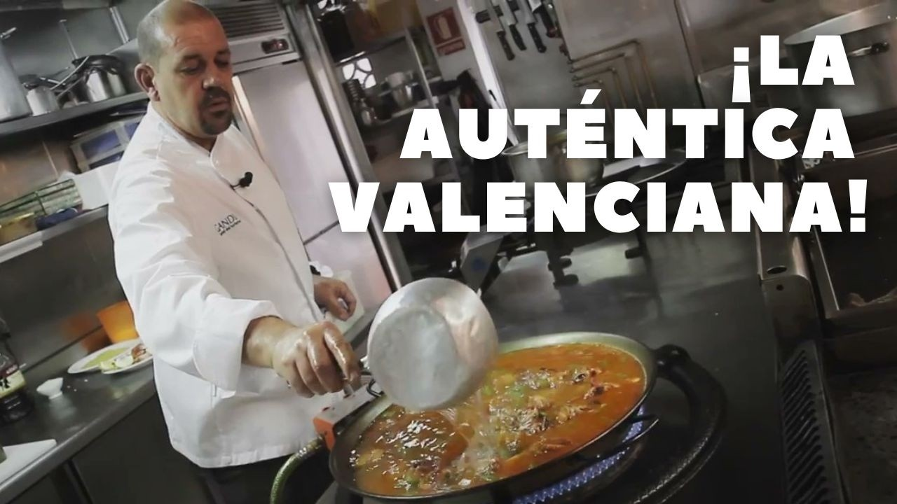
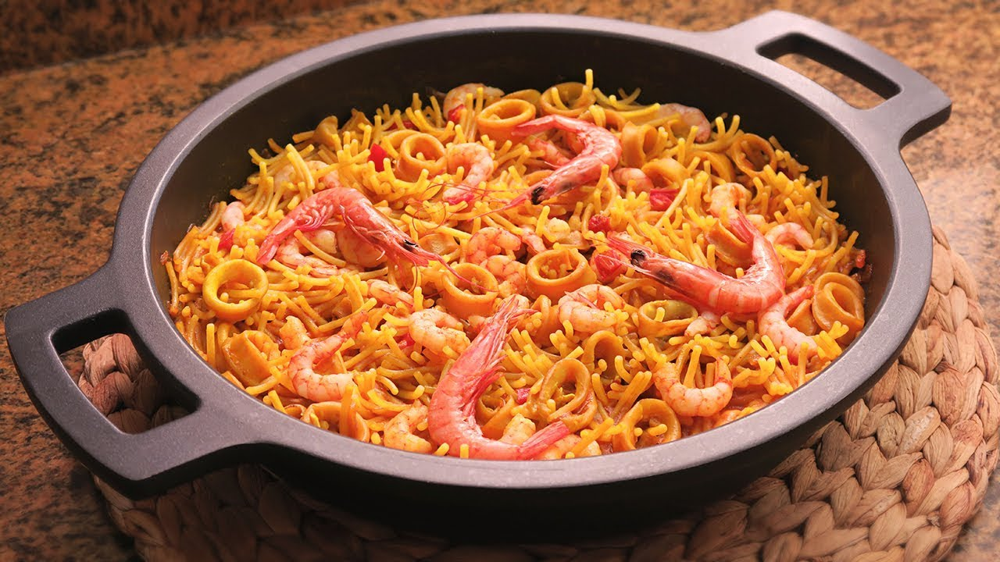
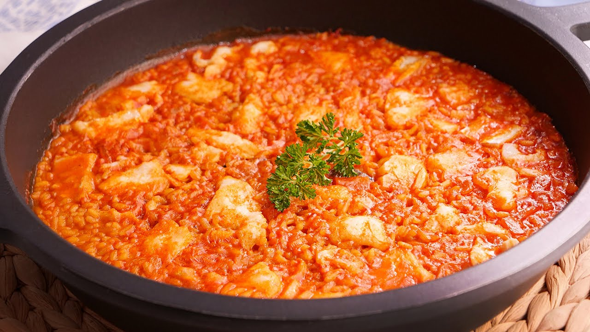

# 🥘 Master de Cocina Tradicional: Arroces, Paellas y Fideuás
> **Inspirado en la filosofía, técnica y sabor de *Cocina con Carmen***  
> *Recetario Técnico Enciclopédico, Protocolos de Fondos y Fumet Maestro, Ratios Exactos de Absorción, Alérgenos UE (Reglamento 1169/2011), Batch Cooking y Regeneración Multicanal*

---

## 📖 Prólogo Culinario: Los Pilares del Arroz y la Fideuá Tradicional

El universo de los arroces, paellas y fideuás constituye una de las cumbres técnicas más admiradas y exigentes de la gastronomía española. En la cocina de **Cocina con Carmen**, un arroz jamás se concibe como un mero acompañamiento hervido; es un lienzo hidrodinámico donde cada grano absorbe la esencia viva de un fondo profundo y noble, manteniendo su corazón al dente sin abrirse ni apelmazarse.

Para alcanzar la perfección en arroces secos, melosos, caldosos y fideuás crujientes, Carmen se rige por cinco leyes inmutables:

1. **La Elección Varietal del Grano y la Estructura del Almidón:**  
   * **Arroz Bomba (*Japónica*):** Posee un alto contenido en amilosa y una excepcional capacidad de resistencia a la sobrecocción. Absorbe de 2,5 a 3 partes de caldo por cada parte de grano sin romperse, manteniendo una textura firme e individualizada, ideal para paellas secas y arroces al horno.
   * **Arroz Senia / Bahía:** Variedad tradicional valenciana de gran porosidad que absorbe los sabores con máxima intensidad, aunque con menor margen de tiempo de cocción (16-18 minutos estrictos).
   * **Arroz Albufera:** Híbrido perfecto entre Bomba y Senia; combina la máxima transmisión sápida con una textura cremosa pero firme, ideal para arroces melosos y cazuelas.
2. **El Fondo Noble (Fumet y Caldo Maestro) como Alma del Plato:** El agua pura jamás toca la paellera salvo para desglasar; todo el sabor reside en caldos cocinados con morralla de roca, cabezas de galera, rape, cangrejos, carcasas tostadas de ave o recortes de cerdo ibérico. Un fondo extraordinario aporta colágeno natural y grasa emulsionada que viste cada grano con un brillo satinado.
3. **El Nacarado, la Reacción de Maillard y la Salmorreta:**  
   * El sellado previo del arroz en la grasa aromática del sofrito (*nacarado*) impermeabiliza la superficie del grano mediante una fina película lipídica, retardando la liberación descontrolada de amilopectina y evitando que el arroz se vuelva pastoso.
   * La **Salmorreta Alicantina** (majado concentrado de ñora frita, ajos dorados, tomate concentrado y perejil) actúa como base catalizadora de umami, color cobrizo natural y profundidad aromática.
4. **La Termodinámica de la Ebullición y el Control de Fuego:**  
   * **Arroces Secos en Paella:** 8-10 minutos iniciales a fuego vivo para fijar la distribución homogénea del grano y expandir los poros, seguidos de 8-10 minutos a fuego suave para permitir la absorción total por capilaridad. Finalmente, 1-2 minutos de fuego vivo para caramelizar la grasa y los azúcares del fondo, creando el mítico *socarrat* crujiente sin quemar el almidón.
   * **Arroces Caldosos y Melosos:** Cocción continua en recipientes hondos (cazuela de barro o hierro fundido), removiendo suavemente en los melosos para suspender una fracción controlada de almidón que ligue el caldo en una emulsión sedosa.
5. **El Tostado del Fideo y el Reposo Sagrado:** En la fideuá marinera, tostar el fideo fino (nº 0 o cabellín) en AOVE antes de incorporar el caldo no solo aporta un sabor a fruto seco y cereal tostado inconfundible, sino que permite que los fideos se hinchen de forma vertical (*erizados*) durante el secado final al horno. Todo arroz seco exige un reposo de 5 minutos cubierto con un paño de algodón limpio para que las presiones osmóticas internas se equilibren y el grano termine de asentarse.

---

```
                                  MAPA DEL RECETARIO
                                  
  ┌─────────────────────────────────┐       ┌─────────────────────────────────┐
  │       ARROCES SECOS Y PAELLAS   │       │   ARROCES DE HORNO Y CAZUELA    │
  │ • 3. Paella Mixta Tradicional   │       │ • 2. Arroz Costillejas y Verdura│
  │ • 4. Arroz a Banda con Salmorreta│      │ • 7. Arroz al Horno Valenciano  │
  │ • 5. Arroz Negro con Sepia      │       │                                 │
  └────────────────┬────────────────┘       └────────────────┬────────────────┘
                   │                                         │
                   └───────────────────┬─────────────────────┘
                                       │
                    ┌──────────────────┴──────────────────┐
                    │    ARROCES CALDOSOS, MELOSOS Y FIDEUÁ│
                    │ • 1. Arroz Caldoso Marinero         │
                    │ • 6. Fideuá de Fideo Fino Crujiente │
                    │ • 8. Arroz Meloso Bacalao y Coliflor│
                    └─────────────────────────────────────┘
```

---

## 📑 Índice General de Recetas

1. [🦞 1. Arroz Caldoso Marinero con Rape, Gambones y Mejillones de Roca](#1--arroz-caldoso-marinero-con-rape-gambones-y-mejillones-de-roca)
2. [🥩 2. Arroz con Costillejas de Cerdo Ibérico, Alcachofas y Verduras](#2--arroz-con-costillejas-de-cerdo-ibérico-alcachofas-y-verduras)
3. [🥘 3. Paella Mixta Tradicional de Pollo, Conejo, Calamares y Gambas](#3--paella-mixta-tradicional-de-pollo-conejo-calamares-y-gambas)
4. [🐟 4. Arroz a Banda Tradicional con Salmorreta y Alioli Casero](#4--arroz-a-banda-tradicional-con-salmorreta-y-alioli-casero)
5. [🦑 5. Arroz Negro con Sepia en su Tinta y Habitas Tiernas](#5--arroz-negro-con-sepia-en-su-tinta-y-habitas-tiernas)
6. [🍤 6. Fideuá Marinera de Fideo Fino Crujiente con Rape y Langostinos](#6--fideuá-marinera-de-fideo-fino-crujiente-con-rape-y-langostinos)
7. [🏺 7. Arroz al Horno Tradicional Valenciano con Costilla, Morcilla, Garbanzos y Tomate](#7--arroz-al-horno-tradicional-valenciano-con-costilla-morcilla-garbanzos-y-tomate)
8. [🐟 8. Arroz Meloso con Bacalao y Coliflor](#8--arroz-meloso-con-bacalao-y-coliflor)
9. [📊 Tabla Comparativa Maestra: Rendimientos, Costes, Ratios y Tiempos](#-tabla-comparativa-maestra-rendimientos-costes-ratios-y-tiempos)
10. [📚 Glosario Técnico de los Maestros Arroceros](#-glosario-técnico-de-los-maestros-arroceros)

---

## 🦞 1. Arroz Caldoso Marinero con Rape, Gambones y Mejillones de Roca
*Categoría: Arroz de Cuchara Marinero / Caldos Nobles de Costa*


> 📺 **Vídeo Oficial de Elaboración:** [Ver en YouTube: Sopa de Marisco y Pescado muy Fácil y Deliciosa](https://www.youtube.com/watch?v=tv3E8BPI3QY)


> [!NOTE]
> El secreto de Carmen para este arroz caldoso radica en extraer el coral de las cabezas de los gambones directamente sobre el AOVE caliente y elaborar un fumet potente con la cabeza del rape y galeras. Para que el arroz no se pase ni absorba todo el caldo durante el servicio, debe servirse inmediatamente tras 15-16 minutos de cocción, dejando que termine de afinarse en el plato hondo.

### 📋 Ficha Resumen
| Parámetro | Valor |
| :--- | :--- |
| **Tiempo de Preparación** | 25 minutos |
| **Tiempo de Cocción** | 35 minutos (20 min fumet + 16 min arroz) |
| **Dificultad** | Media |
| **Raciones** | 4 personas (aprox. 450 g de arroz caldoso por ración) |
| **Coste Estimado** | Medio-Alto (13,50 € total / 3,37 € ración) |
| **Ratio Arroz : Caldo** | 1 : 4,5 (100 g de arroz por cada 450 ml de fumet) |

---

### ⚠️ Tabla de Alérgenos (Reglamento UE 1169/2011)

| Alérgeno | Estado | Ingrediente Causante / Medida de Adaptación |
| :--- | :---: | :--- |
| **Pescado** | 🔴 **PRESENTE** | Rape fresco y pescado de roca en el fumet. |
| **Crustáceos** | 🔴 **PRESENTE** | Gambones y galeras del fondo marinero. |
| **Moluscos** | 🔴 **PRESENTE** | Mejillones de roca frescos. |
| **Gluten** | 🟢 AUSENTE | Naturalmente libre de gluten (verificar pimentón puro). |
| **Sulfitos** | 🔴 **PRESENTE** | Vino blanco seco del sofrito y conservantes naturales del marisco fresco. |
| **Lácteos / Huevos / Frutos Cáscara** | 🟢 AUSENTE | Formulación marinera limpia. |

---

### ⚖️ Ingredientes Exactos

#### Fumet Marinero Concentrado
* **1 unidad (aprox. 600 g)** Cabeza y espinas de rape fresco limpio.
* **200 g** Galeras frescas o cangrejos de sopa.
* **1 unidad** Puerro mediano (solo la parte blanca y verde clara).
* **1 rama** Apio verde fresco.
* **2 dientes** Ajo morado chafados con piel.
* **1.800 ml** Agua mineral fría.
* **20 ml** AOVE virgen extra.

#### Base del Arroz y Marisco
* **350 g** Arroz Bomba D.O. Valencia o Calasparra.
* **400 g** Lomo de rape fresco limpio cortado en dados de bocado (3x3 cm).
* **8 unidades (aprox. 350 g)** Gambones australes o langostinos frescos enteros.
* **500 g** Mejillones de roca frescos y limpios (sin barbas).
* **1 unidad (200 g)** Sepia o calamar mediano limpio, cortado en dados pequeños.

#### Sofrito y Majado Marinero
* **150 g** Tomate maduro de pera rallado sin piel.
* **1 unidad (120 g)** Cebolla dulce picada en brunoise microscópica.
* **1/2 unidad (70 g)** Pimiento rojo carnoso en brunoise fina.
* **1/2 unidad (60 g)** Pimiento verde italiano en brunoise fina.
* **3 dientes** Ajo morado picados muy finos.
* **1 cucharadita (5 g)** Pimentón dulce de la Vera D.O.P.
* **0,20 g (15-18 hebras)** Azafrán español tostado.
* **60 ml** Vino blanco seco (Manzanilla de Sanlúcar o Rueda).
* **70 ml** Aceite de Oliva Virgen Extra (AOVE).
* **8 g** Sal marina fina y un ramillete de perejil fresco picado.

---

### 🍳 Equipamiento Necesario
* Cazuela honda de hierro fundido (Cocotte) o cazuela de barro refractario (Ø 30-32 cm).
* Olla para fumet con colador de malla fina o chino.
* Cazo auxiliar para abrir los mejillones al vapor.
* Mortero tradicional de mármol.
* Cuchara de madera o espátula de silicona térmica.

---

### 👨‍🍳 Paso a Paso Técnico y Minucioso

1. **Elaboración del Fumet Marinero:**
   * En una olla alta, calentar 20 ml de AOVE. Añadir las galeras o cangrejos y aplastar las cabezas con la maza para liberar jugos. Dorar a fuego vivo 3 minutos.
   * Añadir los recortes y cabeza de rape, el puerro, el apio y los ajos chafados. Cubrir con 1.800 ml de agua fría.
   * Llevar a ebullición suave (*simmering* a 90°C), espumar meticulosamente durante los primeros 5 minutos para eliminar albúminas y cocinar a fuego manso durante **20 minutos**. Colar por chino fino presionando bien y mantener bien caliente a fuego mínimo.
2. **Apertura de Mejillones al Vapor:**
   * En un cazo tapado a fuego vivo, disponer los mejillones con 20 ml de vino blanco. Cocinar 2-3 minutos hasta que se abran. Retirar de las conchas (reservando algunas con media concha para decorar). Colar el caldo resultante por gasa o colador fino e incorporarlo al fumet caliente.
3. **Marcado del Marisco y Extracción del Coral:**
   * En la cazuela honda, calentar los 70 ml de AOVE a fuego vivo. Añadir los gambones enteros y marcar durante 1 minuto por cada lado. Con la ayuda de unas pinzas y una cuchara, presionar levemente las cabezas sobre el aceite para que suelten su coral rojizo. Retirar los gambones a un plato.
   * En el mismo aceite perfumado, dorar los dados de rape durante 1,5 minutos. Retirar junto a los gambones.
4. **Sofrito Paciente Concentrado:**
   * Bajar el fuego a medio. Incorporar a la cazuela la sepia troceada y sofreír 4 minutos hasta que evapore su agua y comience a dorar.
   * Añadir la cebolla, el pimiento rojo y el pimiento verde. Pochar lentamente durante **10-12 minutos** hasta que la verdura quede caramelizada y tierna.
   * Incorporar los ajos picados, dar unas vueltas durante 1 minuto e integrar el pimentón dulce fuera del fuego para evitar que amargue.
   * Añadir el tomate rallado y sofreír a fuego medio durante 6-8 minutos hasta que se concentre y el aceite se separe de la pulpa (*sofrito confitado*).
   * Verter los 40 ml de vino blanco restantes y raspar el fondo para desglasar los jugos adheridos. Reducir 2 minutos.
5. **Nacarado del Grano y Cocción Hidrodinámica:**
   * Incorporar los 350 g de Arroz Bomba a la cazuela y nacarar durante **2 minutos** removiendo con la cuchara de madera para envolver cada grano en el sofrito graso.
   * Añadir el azafrán previamente majado en el mortero con una pizca de sal.
   * Verter hirviendo **1.550 ml del fumet marinero** (proporción 1:4,5 aprox.).
   * Subir el fuego al máximo y cocinar a borbotón vivo durante **6 minutos**.
   * Bajar el fuego a medio-bajo (*chup-chup* suave) y proseguir la cocción durante **8 minutos** más.
6. **Integración Final de Pescado y Reposo:**
   * En el minuto 14 de cocción, incorporar a la cazuela los dados de rape, los gambones marcados y los mejillones.
   * Rectificar de sal si fuera necesario. Apagar el fuego exactamente al minuto **16**.
   * Espolvorear con perejil fresco recién picado. Dejar reposar la cazuela destapada únicamente durante **2-3 minutos** antes de servir en platos hondos atemperados con un generoso cucharón de caldo aromático.

---

### 📦 Protocolo de Conservación y Batch Cooking

> [!IMPORTANT]
> **El arroz caldoso NO tolera el reposo prolongado ni la congelación en formato terminado**, ya que el grano continúa hidratándose por ósmosis y se rompe (*arroz pasado*). La estrategia profesional de Batch Cooking consiste en disociar los componentes:

* **Conservación de la Base Marinera (Sin Arroz):**
  * El fumet colado se conserva en nevera (0-4°C) hasta **3 días** o congelado en recipientes herméticos a -18°C durante **3 meses**.
  * El sofrito con la sepia puede prepararse con 48 horas de antelación y guardarse refrigerado.
* **Servicio Exprés en 16 Minutos:** Para el día del consumo, calentar el sofrito, nacarar el arroz fresco, verter el fumet hirviendo y cocinar al momento.

---

### 🔥 Guía de Regeneración Multicanal

* **Cazuela / Cazo (Obligatorio para sobras de arroz caldoso):** Calentar a fuego muy suave añadiendo 50-70 ml de caldo o agua caliente para devolver la fluidez al caldo que haya absorbido el grano. Calentar sin hervir vigorosamente durante 3 minutos.
* **Microondas:** Disponer en bol hondo de cerámica con 2 cucharadas de agua, tapar con campana y calentar a 600W durante 2 minutos.
* **Horno / Freidora de Aire:** ❌ **INAPLICABLE** para elaboraciones caldosas.

---

## 🥩 2. Arroz con Costillejas de Cerdo Ibérico, Alcachofas y Verduras
*Categoría: Arroz Campero / Tradición de Huerta y Dehesa*


> 📺 **Vídeo Oficial de Elaboración:** [Ver en YouTube: Arroz con Carne de Cerdo | Receta muy Fácil y Rápida!](https://www.youtube.com/watch?v=ctJNLi-CyTA)


> [!TIP]
> El secreto de Carmen para este arroz radica en dorar intensamente las costillejas hasta lograr una costra dorada de Maillard profunda y aprovechar el fondo caramelizado para confitar las alcachofas frescas. Al usar Arroz Bomba o Albufera, el grano absorbe la gelatina de la carne y el matiz amargo y noble de la alcachofa sin ablandarse.

### 📋 Ficha Resumen
| Parámetro | Valor |
| :--- | :--- |
| **Tiempo de Preparación** | 20 minutos |
| **Tiempo de Cocción** | 45 minutos (25 min sofrito y carne + 18 min arroz) |
| **Dificultad** | Fácil-Media |
| **Raciones** | 4 personas (aprox. 380 g por ración) |
| **Coste Estimado** | Económico-Medio (7,80 € total / 1,95 € ración) |
| **Ratio Arroz : Caldo** | 1 : 2,8 (100 g de arroz por cada 280 ml de caldo) |

---

### ⚠️ Tabla de Alérgenos (Reglamento UE 1169/2011)

| Alérgeno | Estado | Ingrediente Causante / Medida de Adaptación |
| :--- | :---: | :--- |
| **Sulfitos** | 🔴 **PRESENTE** | Vino blanco seco utilizado en el desglasado. |
| **Apio** | ⚠️ *Opcional* | Presente en el caldo de carne y verduras base. |
| **Gluten / Lácteos / Huevos / Frutos Cáscara** | 🟢 AUSENTE | Formulación tradicional limpia. |
| **Crustáceos / Moluscos / Pescado** | 🟢 AUSENTE | Elaboración de tierra. |

---

### ⚖️ Ingredientes Exactos

#### Proteína Ibérica y Huerta
* **500 g** Costillejas de cerdo ibérico troceadas en trozos pequeños (2-3 cm) y carnosas.
* **4 unidades (aprox. 400 g)** Alcachofas frescas de temporada (limpias, torneadas y cortadas en cuartos).
* **150 g** Judías verdes planas (bajoqueta) limpias y troceadas en 3 cm.
* **1 unidad (100 g)** Pimiento rojo carnoso en tiras medianas.
* **4 unidades** Ajos tiernos limpios cortados en trozos de 2 cm.
* **1/2 limón** Para frotar y sumergir las alcachofas torneadas (anti-oxidación).

#### Grano y Base Aromática
* **360 g** Arroz Bomba o variedad Albufera.
* **150 g** Tomate maduro rallado (sin piel ni semillas).
* **4 dientes** Ajo morado picados finos.
* **1 cucharadita colmada (6 g)** Pimentón dulce ahumado de la Vera.
* **0,20 g** Hebras de azafrán de La Mancha tostadas.
* **1 rama** Romero fresco silvestre (opcional, para aromatizar los últimos minutos).

#### Caldo Maestro de Carne y Verduras
* **1.050 ml** Caldo de carne casero suave (elaborado con huesos de ternera tostados, carcasa de pollo, puerro y zanahoria) caliente a 90°C.
* **60 ml** Vino blanco seco de mesa.
* **70 ml** Aceite de Oliva Virgen Extra (AOVE) variedad Picual.
* **7 g** Sal marina fina y pimienta negra molida al gusto.

---

### 🍳 Equipamiento Necesario
* Paella de acero pulido o cazuela ancha baja de hierro fundido (Ø 34-36 cm).
* Tabla de corte y puntilla para tornear alcachofas.
* Bol con agua fría, hielo y ramas de perejil para conservar las alcachofas.
* Paleta arrocera de acero inoxidable o madera.

---

### 👨‍🍳 Paso a Paso Técnico y Minucioso

1. **Preparación y Limpieza de las Alcachofas:**
   * Retirar las hojas exteriores más duras de las alcachofas hasta llegar a las hojas tiernas de color verde amarillento.
   * Cortar las puntas duras superiores y pelar el tallo exterior. Cortar en cuartos y retirar el heno interior si lo tuviera.
   * Frotar con medio limón y sumergir en agua fría con perejil fresco para evitar el pardeamiento enzimático.
2. **Sellado Intenso de las Costillejas Ibéricas:**
   * Colocar la paella bien nivelada sobre el fuego. Añadir los 70 ml de AOVE y calentar a fuego vivo.
   * Salpimentar las costillejas de cerdo e incorporarlas al centro. Dorar durante **8-10 minutos** a fuego vivo-medio, volteándolas con frecuencia hasta que todos sus lados luzcan una costra dorada crujiente y hayan soltado parte de su grasa noble.
   * Desplazar las costillas hacia el anillo exterior de la paella.
3. **Confitado de Alcachofas y Verduras:**
   * Escurrir y secar muy bien las alcachofas con papel absorbente.
   * En el centro de la paella con el aceite perfumado, dorar las tiras de pimiento rojo durante 3 minutos; retirar y reservar en un plato.
   * Añadir los cuartos de alcachofa y las judías verdes. Dorar a fuego medio durante **5-6 minutos** hasta que adquieran un tono dorado en sus bordes. Añadir los ajos tiernos en el último minuto.
4. **El Sofrito Tradicional:**
   * Abrir un hueco en el centro de la paella. Incorporar los ajos picados y dorar 30 segundos.
   * Añadir el pimentón dulce de la Vera, remover rápidamente con la grasa durante 5 segundos para que no se queme e incorporar de inmediato el tomate rallado.
   * Cocinar todo junto a fuego medio durante **6 minutos** hasta que el tomate reduzca totalmente su agua y se forme una pasta brillante y densa adherida al fondo.
   * Verter el vino blanco y raspar el fondo con la paleta para integrar todos los azúcares caramelizados (*fond*). Dejar evaporar 2 minutos.
5. **Nacarado del Arroz y Cocción:**
   * Mezclar la carne, las verduras y el sofrito por toda la superficie.
   * Añadir los 360 g de arroz y rehogar durante **2 minutos** sin parar de remover, asegurando que el grano se transparente en sus extremos.
   * Añadir las hebras de azafrán tostadas y majadas.
   * Verter los **1.050 ml de caldo de carne y verduras hirviendo** de manera uniforme.
   * Distribuir bien el grano por toda la paella con la paleta. **A partir de este momento, NO volver a remover el arroz con cuchara.**
   * Colocar las tiras de pimiento rojo reservadas decorando la superficie.
   * Cocinar a fuego vivo durante **8 minutos** (el arroz debe bailar en la superficie).
   * Bajar el fuego a suave (*chup-chup* tranquilo) y continuar durante **9 minutos** más. En los últimos 3 minutos, colocar la ramita de romero fresco en el centro.
6. **Socarrat y Reposo:**
   * En el minuto 17, retirar la rama de romero. Si se desea un *socarrat* crujiente, avivar el fuego al máximo durante **60-90 segundos** escuchando el crepitar seco del grano en el fondo (cuando huela a tostado noble sin humo negro, apagar de inmediato).
   * Cubrir la paella con un paño de cocina de algodón limpio y dejar reposar durante **5 minutos** antes de servir en la mesa.

---

### 📦 Protocolo de Conservación y Batch Cooking

* **Conservación en Frío (0°C a 4°C):** Si sobran raciones, transferir inmediatamente a un recipiente hermético plano de vidrio en cuanto baje la temperatura a 60°C (máximo 1 hora a temperatura ambiente). Consumir en un plazo de **48 horas**.
* **Congelación:** ⚠️ No se aconseja congelar el arroz cocido ya que el grano cristaliza y pierde su textura al descongelar. Las costillas ibéricas con el sofrito y las verduras sí se pueden congelar como base concentrada durante **2 meses**.

---

### 🔥 Guía de Regeneración Multicanal

* **Sartén Antiadherente (Método Rey para Arroz Seco):** Calentar la sartén a fuego medio con 1 cucharadita de AOVE. Disponer el arroz en capa fina y tostar durante 3-4 minutos sin remover para regenerar una costra crujiente deliciosa.
* **Horno Convencional:** Precalentar a 180°C. Colocar el arroz en bandeja refractaria, tapar con papel de aluminio y calentar durante 8 minutos.
* **Microondas:** Disponer el arroz con una cucharada sopera de agua o caldo, cubrir con tapa para microondas y calentar a 700W durante 1,5 minutos.

---

## 🥘 3. Paella Mixta Tradicional de Pollo, Conejo, Calamares y Gambas
*Categoría: Paella Clásica de Fiesta / Mar y Montaña Familiar*



> 📺 **Vídeo Oficial de Elaboración:** [Ver en YouTube: Receta Paella Valenciana Auténtica y Original](https://www.youtube.com/watch?v=zrSyyNugKYo)


> [!NOTE]
> La paella mixta de domingo es una de las creaciones más celebradas en los hogares españoles. Carmen enseña que el equilibrio perfecto se logra cocinando las carnes con paciencia para que aporten su jugo tostado, mientras que el calamar y las gambas entregan su salinidad marina, todo amparado por un caldo mixto de ave y morralla que amalgama ambos mundos.

### 📋 Ficha Resumen
| Parámetro | Valor |
| :--- | :--- |
| **Tiempo de Preparación** | 25 minutos |
| **Tiempo de Cocción** | 45 minutos |
| **Dificultad** | Media |
| **Raciones** | 6 personas (aprox. 360 g por ración) |
| **Coste Estimado** | Medio (11,50 € total / 1,91 € ración) |
| **Ratio Arroz : Caldo** | 1 : 2,5 (100 g de arroz por cada 250 ml de caldo) |

---

### ⚠️ Tabla de Alérgenos (Reglamento UE 1169/2011)

| Alérgeno | Estado | Ingrediente Causante / Medida de Adaptación |
| :--- | :---: | :--- |
| **Crustáceos** | 🔴 **PRESENTE** | Gambas frescas o langostinos de guarnición. |
| **Moluscos** | 🔴 **PRESENTE** | Calamares o anillas de calamar fresco. |
| **Pescado** | 🔴 **PRESENTE** | En el caldo mixto de pescado y marisco base. |
| **Sulfitos** | 🟢 AUSENTE | Sin sulfitos añadidos (caldo casero limpio). |
| **Gluten / Lácteos / Huevos** | 🟢 AUSENTE | Libre de gluten y lácteos. |

---

### ⚖️ Ingredientes Exactos

#### Carnes y Frutos del Mar
* **400 g** Pollo de corral troceado en trozos pequeños de bocado (con hueso).
* **300 g** Conejo de granja troceado menudo.
* **250 g** Calamar fresco limpio, cortado en anillas o dados de 2 cm.
* **6 unidades** Gambas arroceras o langostinos frescos enteros con cabeza.
* **150 g** Mejillones limpios (opcional para decorar al final).

#### Huerta y Base Aromática
* **150 g** Judías verdes planas (bajoqueta o ferradura) troceadas.
* **100 g** Garrofó cocido o alubias blancas grandes cocidas.
* **1 unidad (120 g)** Pimiento rojo cortado en tiras longitudinales.
* **180 g** Tomate maduro de huerta rallado.
* **3 dientes** Ajo morado picados en brunoise fina.
* **1 cucharadita (5 g)** Pimentón dulce de la Vera.
* **0,25 g (20 hebras)** Azafrán de La Mancha tostado y molido.

#### Grano y Caldo Mixto
* **500 g** Arroz Redondo tradicional o Arroz Bomba D.O.
* **1.250 ml** Caldo mixto casero caliente (50% caldo de pollo + 50% fumet de pescado suave).
* **80 ml** Aceite de Oliva Virgen Extra (AOVE).
* **8 g** Sal marina gruesa y una pizca de pimienta negra para salar la carne.

---

### 🍳 Equipamiento Necesario
* Paella de acero pulido tradicional (Ø 40-42 cm para 6 personas).
* Paellero de gas concéntrico o difusor de fuego amplio para reparto térmico perfecto.
* Paleta larga arrocera de acero.
* Paño de algodón limpio para reposo.

---

### 👨‍🍳 Paso a Paso Técnico y Minucioso

1. **Nivelado de la Paella y Salteado de Gambas:**
   * Nivelar la paella sobre el quemador de gas. Añadir los 80 ml de AOVE y espolvorear sal marina en el perímetro exterior de la paella para evitar salpicaduras.
   * Encender a fuego medio-alto. Saltear las gambas durante **1 minuto por lado** solo para aromatizar el aceite. Retirar y reservar en un plato.
2. **Dorado Prolongado de Pollo y Conejo:**
   * Incorporar el pollo y el conejo troceados al centro de la paella.
   * Freír a fuego medio-vivo durante **12-14 minutos**, dándoles la vuelta constantemente hasta que adquieran un color caoba dorado profundo y uniforme.
   * Desplazar las carnes hacia los bordes de la paella donde el calor es más moderado.
3. **Pochado de Calamares y Verduras:**
   * Añadir las anillas de calamar en el centro y sofreír 3-4 minutos hasta que empiecen a tomar color.
   * Añadir las tiras de pimiento rojo, dorar 2 minutos y retirar la mitad de las tiras para la decoración final.
   * Incorporar las judías verdes y el garrofó. Rehogar todo durante 4 minutos.
4. **El Sofrito y la Concentración:**
   * Hacer un hueco en el centro del fondo. Añadir los ajos picados y dorar 30 segundos.
   * Añadir el pimentón dulce, mezclar durante 4 segundos e incorporar de golpe el tomate rallado para frenar la cocción del pimentón.
   * Sofreír a fuego suave durante **6 minutos** hasta que el sofrito pierda toda la humedad y el aceite chisporrotee limpio. Integrar carnes y calamares con el sofrito.
5. **Nacarado, Caldo y Ebullición:**
   * Añadir los 500 g de arroz trazando un "caballón" o cruz a lo largo de la paella.
   * Nacarar el arroz durante **2 minutos** removiendo con la paleta para impregnar cada grano de grasa y pigmentos.
   * Verter los **1.250 ml de caldo mixto hirviendo** (1:2,5). Distribuir el arroz y los ingredientes de forma uniforme por toda la paella.
   * Espolvorear el azafrán molido e infusionado. Probar el caldo: debe estar ligeramente alegre de sal, ya que el grano absorberá parte de la salinidad.
   * Cocinar a fuego muy vivo durante **8-10 minutos** hasta que el arroz asome a la superficie.
   * Bajar el fuego a medio-bajo y cocinar durante **7-8 minutos** adicionales.
   * En los últimos 3 minutos, colocar armónicamente por encima las gambas reservadas, las tiras de pimiento rojo y los mejillones.
6. **Socarrat Final y Reposo:**
   * Subir el fuego a tope durante el último minuto para caramelizar el fondo de almidón y grasa (*socarrat*). Cuando el chasquido cambie a un chisporroteo seco y rítmico, apagar el fuego.
   * Tapar con paño limpio o papel vegetal y dejar reposar durante **5 minutos** innegociables antes de emplatar.

---

### 📦 Protocolo de Conservación y Batch Cooking

* **Refrigeración:** Envasar en recipientes herméticos poco profundos a 0-4°C por un máximo de **48 horas**.
* **Batch Cooking Doméstico:** Las carnes doradas con los calamares, verduras y el sofrito concentrado pueden congelarse juntos en tupper hermético por **3 meses**. El día del evento, solo se descongela la base, se calienta en la paella, se añade el arroz fresco y se vierte el caldo hirviendo.

---

### 🔥 Guía de Regeneración Multicanal

* **Sartén con Tapa (Recomendado):** Calentar a fuego medio con 1 cucharadita de aceite virgen extra durante 4 minutos, logrando una textura crujiente abajo y granos sueltos arriba.
* **Horno a 190°C:** Disponer en bandeja con unas gotas de caldo esparcidas, cubrir con papel de aluminio y regenerar durante 7-9 minutos.
* **Microondas:** 700W durante 2 minutos en plato con campana plástica húmeda.

---

## 🐟 4. Arroz a Banda Tradicional con Salmorreta y Alioli Casero
*Categoría: Arroz Seco Alicantino / Esencia Pura de Pescadores*


> 📺 **Vídeo Oficial de Elaboración:** [Ver en YouTube: Arroz con Sepia y Gambas - Receta fácil y deliciosa](https://www.youtube.com/watch?v=dyrYszuM6sg)


> [!TIP]
> El auténtico Arroz a Banda de la costa levantina es un arroz de capa ultrafina (máximo 1 grano de grosor) cocido exclusivamente con un caldo potentísimo de morralla y enriquecido con la genuina **Salmorreta Alicantina**. El arroz se sirve "a banda" (solo), acompañado de un alioli casero al mortero de ajo y AOVE.

### 📋 Ficha Resumen
| Parámetro | Valor |
| :--- | :--- |
| **Tiempo de Preparación** | 30 minutos |
| **Tiempo de Cocción** | 40 minutos (25 min caldo + 16 min arroz) |
| **Dificultad** | Media-Alta (exige control del punto de grano fino) |
| **Raciones** | 4 personas (aprox. 280 g de arroz seco por ración) |
| **Coste Estimado** | Medio (9,20 € total / 2,30 € ración) |
| **Ratio Arroz : Caldo** | 1 : 2,3 (100 g de arroz por cada 230 ml de caldo) |

---

### ⚠️ Tabla de Alérgenos (Reglamento UE 1169/2011)

| Alérgeno | Estado | Ingrediente Causante / Medida de Adaptación |
| :--- | :---: | :--- |
| **Pescado** | 🔴 **PRESENTE** | Morralla de roca, cintas, cabrachos y rape en el caldo. |
| **Crustáceos** | 🔴 **PRESENTE** | Galeras y cangrejos de roca del fumet. |
| **Moluscos** | 🔴 **PRESENTE** | Sepia fresca picada en el arroz. |
| **Huevos** | ⚠️ *Opcional* | En el alioli (si se añade yema para facilitar la emulsión; el alioli tradicional puro de mortero solo lleva ajo y AOVE). |
| **Gluten / Lácteos / Sulfitos** | 🟢 AUSENTE | Formulación tradicional limpia. |

---

### ⚖️ Ingredientes Exactos

#### Fondo / Caldo de Morralla de Pescadores
* **1 kg** Pescado de roca variado (morralla: cabracho, araña, cintas, rascacio, cangrejos y galeras).
* **1 unidad** Cabeza de rape fresca limpia.
* **1 unidad** Puerro y 1 tomate maduro partido en dos.
* **2.000 ml** Agua mineral fría.
* **30 ml** AOVE virgen extra y 10 g de sal marina.

#### Salmorreta Alicantina Auténtica (Para 4 raciones)
* **2 unidades** Ñoras secas de Alicante (despepitadas y limpias).
* **4 dientes** Ajo morado pelados.
* **2 unidades (200 g)** Tomates maduros rallados.
* **1 ramillete** Perejil fresco (hojas).
* **40 ml** Aceite de Oliva Virgen Extra (AOVE).

#### Arroz y Base de Paella
* **320 g** Arroz Senia o Arroz Bomba D.O. Valencia.
* **1 unidad (200 g)** Sepia limpia cortada en daditos minúsculos (1x1 cm).
* **750 ml** Caldo de morralla colado y muy caliente.
* **0,20 g** Azafrán en hebra tostado.
* **50 ml** AOVE para la paella y sal al gusto.

#### Alioli Tradicional al Mortero
* **2 dientes** Ajo morado sin germen.
* **1 pizca** Sal gruesa.
* **150 ml** AOVE suave (Arbequina o Hojiblanca).
* **1 cucharadita** Zumo de limón fresco (opcional, para estabilizar).

---

### 🍳 Equipamiento Necesario
* Paella de acero pulido ancha (Ø 38-40 cm para lograr capa ultrafina de 4 raciones).
* Olla alta para caldo y colador chino fino.
* Sartén pequeña para la salmorreta y vaso batidor.
* Mortero de mármol y maza de madera.

---

### 👨‍🍳 Paso a Paso Técnico y Minucioso

1. **Elaboración del Caldo de Morralla:**
   * En una olla, dorar los cangrejos y galeras con 30 ml de AOVE a fuego vivo durante 3 minutos aplastando los caparazones.
   * Añadir toda la morralla de roca, la cabeza de rape, el puerro y el tomate. Cubrir con 2 litros de agua fría.
   * Llevar a ebullición suave, desespumar continuamente durante 5 minutos y cocer a fuego medio durante **25 minutos** (no sobrepasar 30 minutos para evitar que las espinas amarguen el caldo). Colar y mantener caliente a 90°C.
2. **Elaboración de la Salmorreta Alicantina:**
   * En una sartén pequeña con 40 ml de AOVE a fuego muy suave, dorar los dientes de ajo enteros y las ñoras secas limpias durante **1-2 minutos**, vigilando que la ñora no se queme (si se quema, amarga).
   * Añadir el tomate rallado y el perejil. Cocinar a fuego lento durante 8-10 minutos hasta que el tomate reduzca su agua.
   * Pasar todo el contenido de la sartén al vaso de la batidora y triturar hasta obtener una pasta roja brillante homogénea (*salmorreta*).
3. **Elaboración del Alioli de Mortero:**
   * En el mortero, machacar los 2 ajos con la pizca de sal gruesa hasta obtener una pasta lisa sin grumos.
   * Añadir el AOVE gota a gota al principio, girando la maza en sentido horario continuo sin detenerse hasta que emulsione y monte una salsa densa y firme. Terminar con unas gotas de limón.
4. **Cocinado del Arroz en Paella:**
   * Nivelar la paella sobre el fuego. Añadir 50 ml de AOVE y calentar a fuego medio.
   * Añadir la sepia en daditos minúsculos y saltear durante **3-4 minutos** hasta que esté tierna y comience a dorar.
   * Añadir **2 cucharadas soperas colmadas (aprox. 50 g)** de la salmorreta recién hecha. Rehogar 1 minuto con la sepia.
   * Incorporar los 320 g de arroz y nacarar a fuego medio durante **2 minutos**, impregnando cada grano con la salmorreta.
   * Añadir el azafrán tostado y molido.
   * Verter hirviendo los **750 ml del caldo de morralla**.
   * Repartir el arroz por toda la paella de modo que quede en una capa uniforme y delgadísima.
   * Cocinar a fuego vivo durante **7 minutos**. El caldo debe hervir vigorosamente.
   * Bajar el fuego al mínimo y cocinar durante **9 minutos** más, hasta que el líquido se absorba por completo.
5. **El Socarrat Levantino y Reposo:**
   * En el último minuto, subir el fuego al máximo para tostar la base. El sonido cambiará a un chisporroteo crujiente y regular. Retirar del fuego.
   * Reposar **5 minutos** tapado con papel o paño limpio.
   * Servir la paella al centro y acompañar con el mortero de alioli casero fresco.

---

### 📦 Protocolo de Conservación y Batch Cooking

* **Conservación de Caldo y Salmorreta:**
  * La salmorreta alicantina se puede conservar en tarro de cristal cubierto con una fina capa de AOVE en nevera hasta **15 días** o congelar en cubiteras de hielo durante **6 meses**.
  * El caldo de morralla se congela perfectamente en botellas herméticas por **3 meses**.
* **Arroz Terminado:** Consumir de inmediato. Si se refrigera, dura 48 horas en frío hermético.

---

### 🔥 Guía de Regeneración Multicanal

* **Sartén Plana a Fuego Medio (Óptimo):** Tostar 3 minutos en sartén antiadherente para recuperar el crujiente del socarrat original.
* **Horno Gratinador:** 4 minutos a 200°C en posición media-alta.
* **Microondas:** 1,5 minutos a 650W tapado.

---

## 🦑 5. Arroz Negro con Sepia en su Tinta y Habitas Tiernas
*Categoría: Arroz Seco Marinero / Pigmentos y Contrastes de Huerta*


> 📺 **Vídeo Oficial de Elaboración:** [Ver en YouTube: Arroz Negro con Calamares y Sepia](https://www.youtube.com/watch?v=NK1gmcS9qwA)


> [!NOTE]
> El secreto de Carmen para que el arroz negro no resulte pesado ni monocorde radica en utilizar la tinta natural de la sepia disuelta en el caldo caliente, incorporar la melsa (el bazo marrón de la sepia) al sofrito para un umami prodigioso, y rematar con habitas tiernas baby salteadas que aportan frescor crujiente y dulzura.

### 📋 Ficha Resumen
| Parámetro | Valor |
| :--- | :--- |
| **Tiempo de Preparación** | 20 minutos |
| **Tiempo de Cocción** | 35 minutos |
| **Dificultad** | Media |
| **Raciones** | 4 personas (aprox. 320 g por ración) |
| **Coste Estimado** | Medio (8,90 € total / 2,22 € ración) |
| **Ratio Arroz : Caldo** | 1 : 2,5 (100 g de arroz por cada 250 ml de caldo) |

---

### ⚠️ Tabla de Alérgenos (Reglamento UE 1169/2011)

| Alérgeno | Estado | Ingrediente Causante / Medida de Adaptación |
| :--- | :---: | :--- |
| **Moluscos** | 🔴 **PRESENTE** | Sepia fresca y bolsas de tinta de calamar/sepia. |
| **Pescado** | 🔴 **PRESENTE** | Caldo de pescado y rape de base. |
| **Sulfitos** | 🔴 **PRESENTE** | Vino blanco seco del desglasado del sofrito. |
| **Gluten / Lácteos / Huevos** | 🟢 AUSENTE | Formulación tradicional limpia. |
| **Crustáceos** | ⚠️ *Opcional* | Si el fumet base contiene galeras o cangrejos. |

---

### ⚖️ Ingredientes Exactos

#### Moluscos, Huerta y Tintas
* **500 g** Sepia fresca sucia (reservando su bolsa de tinta y su melsa/bazo marrón).
* **150 g** Habitas baby tiernas frescas (o habitas repeladas congeladas de primera calidad).
* **3 bolsas (aprox. 12 g)** Tinta de calamar/sepia natural diluida en 50 ml de caldo tibio.
* **1 unidad (150 g)** Cebolla dulce grande picada en brunoise microscópica.
* **1/2 unidad (60 g)** Pimiento verde italiano picado fino.
* **3 dientes** Ajo morado finamente picados.
* **150 g** Tomate maduro rallado.

#### Grano y Fondo Oscuro
* **350 g** Arroz Bomba o Bahía D.O. Valencia.
* **875 ml** Fumet de pescado de roca casero bien caliente.
* **50 ml** Vino blanco seco (Rueda o Manzanilla).
* **70 ml** Aceite de Oliva Virgen Extra (AOVE).
* **6 g** Sal marina fina.

#### Acompañamiento Opcional
* **Alioli suave casero** (con ajo confitado o asado para suavizar la acidez).

---

### 🍳 Equipamiento Necesario
* Paella esmaltada o de acero pulido (Ø 34-36 cm).
* Sartén pequeña para saltear las habitas.
* Colador fino y mortero o vaso batidor.
* Paleta arrocera.

---

### 👨‍🍳 Paso a Paso Técnico y Minucioso

1. **Limpieza y Preparación de la Sepia:**
   * Limpiar la sepia con cuidado de no romper la bolsa de tinta. Retirar la boca y los ojos.
   * Cortar el cuerpo y las patas de la sepia en dados pequeños y homogéneos de 1,5 cm.
   * Reservar la melsa (glándula de color marrón claro que aporta una profundidad sápida extraordinaria al sofrito).
2. **Pochado y Caramelización de la Cebolla (Clave del Color):**
   * En la paella, añadir 50 ml de AOVE a fuego medio. Añadir la cebolla picada y el pimiento verde con una pizca de sal.
   * Pochar lentamente durante **15-18 minutos**, removiendo con frecuencia hasta que la cebolla adquiera un tono marrón dorado oscuro (*cebolla bien caída*).
3. **Salteado de la Sepia y la Melsa:**
   * Subir el fuego a medio-alto. Añadir los dados de sepia y sofreír durante **5 minutos** hasta que comiencen a dorarse y hayan evaporado el líquido.
   * Añadir la melsa aplastada con un tenedor y los ajos picados; rehogar 1 minuto.
   * Añadir el tomate rallado y sofreír durante **6 minutos** hasta que el sofrito esté concentrado y brillante.
   * Desglasar con los 50 ml de vino blanco, rascando el fondo para integrar los azúcares caramelizados. Dejar evaporar el alcohol durante 2 minutos.
4. **Disolución de la Tinta e Hidratación del Grano:**
   * En una taza con caldo caliente, disolver las bolsas de tinta de calamar y colar sobre los 875 ml de fumet caliente para evitar impurezas.
   * Añadir los 350 g de arroz a la paella y nacarar con el sofrito oscuro durante **2 minutos**.
   * Verter todo el fumet negro hirviendo sobre la paella. Remover suavemente para distribuir el grano de forma equilibrada.
   * Cocinar a fuego vivo durante **8 minutos**, observando el hervor potente y uniforme.
   * Reducir el fuego a suave y proseguir la cocción durante **8 minutos** adicionales.
5. **Salteado de Habitas y Acabado:**
   * En una sartén pequeña con 20 ml de AOVE a fuego vivo, saltear las habitas baby durante **2 minutos** con una pizca de sal marina hasta que queden tiernas pero crujientes.
   * En el minuto 14 de cocción del arroz, distribuir las habitas por toda la superficie de la paella.
   * En el último minuto, subir el fuego para fijar un sutil *socarrat* oscuro. Apagar el fuego al minuto 17.
   * Reposar cubierto con un paño de algodón durante **5 minutos**.
   * Servir en la propia paella con puntos de alioli suave sobre la superficie.

---

### 📦 Protocolo de Conservación y Batch Cooking

* **Conservación en Nevera:** 0-4°C en recipiente hermético durante **48 horas**.
* **Base Negra Congelable:** El sofrito de cebolla caramelizada con la sepia, su tinta y el tomate puede congelarse en bolsas herméticas por **3 meses**. El día del consumo, se descongela la base, se vierte en la paella con el arroz fresco y el fumet caliente.

---

### 🔥 Guía de Regeneración Multicanal

* **Sartén Antiadherente a Fuego Medio:** 3-4 minutos sin remover, perfecta para recuperar la soltura del grano y el socarrat.
* **Horno Convencional:** 180°C durante 6-8 minutos cubierto con papel aluminio.
* **Microondas:** 1,5 minutos a 700W con campana protectora.

---

## 🍤 6. Fideuá Marinera de Fideo Fino Crujiente con Rape y Langostinos
*Categoría: Fideuá Tradicional de Gandía y Costa Levantina / Texturas de Mar*



> 📺 **Vídeo Oficial de Elaboración:** [Ver en YouTube: Fideuà de Mariscos con Gambas y Calamares](https://www.youtube.com/watch?v=wEWe7HRVsGs)


> [!TIP]
> Para lograr la auténtica fideuá de fideo fino que queda erizada hacia arriba (*fideus drets*), Carmen tuesta los fideos cabellín nº 0 en seco o con una pizca de AOVE antes de cocinarlos con el fumet de galeras. Un golpe final de horno o gratinador a alta temperatura evapora la última humedad y levanta las puntas de los fideos en un espectáculo visual y crujiente.

### 📋 Ficha Resumen
| Parámetro | Valor |
| :--- | :--- |
| **Tiempo de Preparación** | 20 minutos |
| **Tiempo de Cocción** | 25 minutos |
| **Dificultad** | Fácil-Media |
| **Raciones** | 4 personas (aprox. 280 g por ración) |
| **Coste Estimado** | Medio (10,50 € total / 2,62 € ración) |
| **Ratio Fideo : Caldo** | 1 : 2,2 (100 g de fideo fino por cada 220 ml de fumet) |

---

### ⚠️ Tabla de Alérgenos (Reglamento UE 1169/2011)

| Alérgeno | Estado | Ingrediente Causante / Medida de Adaptación |
| :--- | :---: | :--- |
| **Gluten** | 🔴 **PRESENTE** | Fideos finos de trigo duro (usar fideos de arroz o maíz para versión sin gluten). |
| **Pescado** | 🔴 **PRESENTE** | Rape fresco y morralla en el fumet. |
| **Crustáceos** | 🔴 **PRESENTE** | Langostinos y galeras en el fondo marinero. |
| **Moluscos** | 🔴 **PRESENTE** | Sepia o calamar troceado en la base. |
| **Lácteos / Huevos / Frutos Cáscara** | 🟢 AUSENTE | Formulación tradicional limpia. |
| **Sulfitos** | 🟢 AUSENTE | Elaboración sin vino añadido. |

---

### ⚖️ Ingredientes Exactos

#### Fideos y Frutos del Mar
* **350 g** Fideos de trigo duro calibre fino (nº 0 cabellín o nº 1).
* **300 g** Lomo de rape fresco limpio cortado en dados de 2x2 cm.
* **8 unidades (aprox. 300 g)** Langostinos frescos enteros de costa.
* **1 unidad (200 g)** Sepia limpia cortada en brunoise menuda.

#### Base Aromática y Sofrito
* **2 cucharadas soperas (50 g)** Salmorreta alicantina tradicional (ñora, ajo y tomate concentrado) o en su defecto 150 g de tomate rallado con 1 cucharadita de pimentón y 2 ajos picados.
* **0,20 g** Hebras de azafrán tostado.
* **770 ml** Fumet de pescado de roca y galeras muy potente y caliente.
* **70 ml** Aceite de Oliva Virgen Extra (AOVE).
* **6 g** Sal marina fina.

#### Acompañamiento
* **Alioli casero suave** emulsionado con AOVE y ajo.

---

### 🍳 Equipamiento Necesario
* Paella de acero pulido o apta para horno (Ø 36-38 cm).
* Horno precalentado a 210°C con función grill o aire.
* Cazo para mantener el fumet hirviendo.
* Pinzas de cocina y paleta.

---

### 👨‍🍳 Paso a Paso Técnico y Minucioso

1. **Tostado Previo de los Fideos (El Secreto de la Textura):**
   * En la paella amplia sin aceite o con apenas 10 ml de AOVE a fuego medio-bajo, añadir los 350 g de fideos finos.
   * Tostar durante **4-5 minutos** removiendo constantemente con dos paletas hasta que todos los fideos adquieran un color avellana dorado homogéneo. Retirar inmediatamente a una fuente amplia para frenar el tostado y reservar.
2. **Marcado del Marisco y Rape:**
   * En la misma paella, añadir los 60 ml de AOVE restantes a fuego vivo.
   * Marcar los langostinos enteros durante **1 minuto por lado** prensando ligeramente las cabezas para que desprendan sus jugos al aceite. Retirar y reservar.
   * Saltear los dados de rape durante **1,5 minutos** hasta sellar su exterior manteniendo el corazón jugoso. Retirar junto a los langostinos.
3. **Sofrito y Fusión:**
   * En el aceite perfumado, añadir la sepia cortada menuda y sofreír durante **4 minutos** hasta que comience a dorar.
   * Incorporar la salmorreta alicantina (o el tomate rallado con ajo y pimentón). Rehogar a fuego medio durante **3 minutos** hasta que el sofrito quede denso y brillante.
4. **Incorporación de Fideos y Fumet:**
   * Añadir los fideos tostados reservados a la paella y mezclar homogéneamente con la sepia y el sofrito durante **1 minuto**.
   * Verter hirviendo los **770 ml de fumet de pescado y galeras** con el azafrán disuelto.
   * Distribuir los fideos de forma completamente plana y regular.
   * Cocinar a fuego vivo en el fuego durante **4-5 minutos**, momento en el que el fideo habrá absorbido casi todo el caldo y comenzará a asomar en la superficie.
   * Disponer por encima los dados de rape y los langostinos enteros marcados.
5. **Horneado y Levantamiento de Fideos (*Fideus Drets*):**
   * Trasladar la paella de inmediato al horno precalentado a **210°C (con grill o calor superior)**.
   * Hornear durante **4-5 minutos**. Durante este proceso, el calor seco superior hará que las puntas de los fideos se deshidraten y se levanten en vertical apuntando hacia arriba.
   * Retirar del horno cuando los fideos estén erizados y crujientes en la superficie.
   * Dejar reposar **2 minutos** antes de servir acompañada con alioli.

---

### 📦 Protocolo de Conservación y Batch Cooking

* **Conservación en Frío:** La fideuá aguanta **48 horas** refrigerada a 0-4°C, aunque perderá el efecto crujiente superior.
* **Batch Cooking Profesional:** Fideos tostados en seco con semanas de antelación guardados en bote de cristal hermético en despensa. Fumet y sofrito congelados listos para usar. La fideuá se termina en menos de 10 minutos al momento de comer.

---

### 🔥 Guía de Regeneración Multicanal

* **Horno / Freidora de Aire (Método Óptimo):** 190°C durante 4 minutos para devolver la textura crujiente a las puntas de los fideos.
* **Sartén Antiadherente:** Fuego vivo 3 minutos removiendo para crear costra tostada.
* **Microondas:** ❌ No recomendable (ablanda los fideos).

---

## 🏺 7. Arroz al Horno Tradicional Valenciano con Costilla, Morcilla, Garbanzos y Tomate
*Categoría: Arroz Seco de Cazuela de Barro / *Arròs al Forn* Patrimonial*


> 📺 **Vídeo Oficial de Elaboración:** [Ver en YouTube: Arroz con Carne de Cerdo | Receta muy Fácil y Rápida!](https://www.youtube.com/watch?v=ctJNLi-CyTA)


> [!NOTE]
> El *Arròs al Forn* (también conocido como *arroz paseado* porque antaño se llevaba al horno del panadero del pueblo) es un prodigio de la cocina de aprovechamiento valenciana. El secreto de Carmen para que quede suelto y seco radica en utilizar una cazuela de barro refractaria bien caliente, un caldo de puchero concentrado e hirviendo con ratio exacto 1:2, y colocar una cabeza de ajos entera en el centro que perfuma toda la cocción.

### 📋 Ficha Resumen
| Parámetro | Valor |
| :--- | :--- |
| **Tiempo de Preparación** | 20 minutos |
| **Tiempo de Cocción** | 40 minutos (15 min marcado + 25 min horno) |
| **Dificultad** | Fácil-Media |
| **Raciones** | 4-5 personas (aprox. 420 g por ración) |
| **Coste Estimado** | Económico (6,90 € total / 1,38 € ración) |
| **Ratio Arroz : Caldo** | 1 : 2 exacto (100 g de arroz por cada 200 ml de caldo de cocido) |

---

### ⚠️ Tabla de Alérgenos (Reglamento UE 1169/2011)

| Alérgeno | Estado | Ingrediente Causante / Medida de Adaptación |
| :--- | :---: | :--- |
| **Gluten** | ⚠️ *Opcional* | En la morcilla de cebolla (asegurar morcilla 100% libre de gluten). |
| **Sulfitos** | 🟢 AUSENTE | Elaboración tradicional sin vino. |
| **Apio** | ⚠️ *Opcional* | Si el caldo de puchero contiene apio. |
| **Lácteos / Huevos / Pescado / Crustáceos** | 🟢 AUSENTE | Guiso tradicional de huerta y cerdo. |

---

### ⚖️ Ingredientes Exactos

#### Cárnicos y Embutidos
* **350 g** Costillejas de cerdo troceadas pequeñas.
* **150 g** Panceta fresca o tocino entreverado de cerdo en tiras de 2 cm.
* **2 unidades (aprox. 180 g)** Morcillas de cebolla valencianas o morcillas oreadas (pinchadas con palillo para que no revienten).
* **200 g** Garbanzos cocidos de cocido/puchero (bien escurridos).

#### Huerta y Hortalizas
* **1 unidad** Cabeza de ajos entera limpia (con sus pieles exteriores retiradas y un corte horizontal superior).
* **1 unidad grande (aprox. 250 g)** Patata cortada en rodajas de 1 cm de grosor.
* **1 unidad grande (200 g)** Tomate maduro cortado en rodajas de 1 cm.
* **1 unidad (100 g)** Tomate maduro rallado para el sofrito.
* **1 cucharadita (5 g)** Pimentón dulce de la Vera.

#### Grano y Caldo de Puchero
* **400 g** Arroz Bomba D.O. Valencia.
* **800 ml** Caldo de puchero o cocido casero hirviendo (con su azafrán en hebra tostado).
* **60 ml** Aceite de Oliva Virgen Extra (AOVE).
* **6 g** Sal marina fina.

---

### 🍳 Equipamiento Necesario
* Cazuela de barro refractaria tradicional o fuente de gres / hierro fundido (Ø 32-34 cm).
* Horno convencional precalentado a 220°C con calor arriba y abajo.
* Sartén para el dorado previo de carnes y verduras.

---

### 👨‍🍳 Paso a Paso Técnico y Minucioso

1. **Precalentado del Horno y Cazuela:**
   * Precalentar el horno a **220°C** con calor superior e inferior. Introducir la cazuela de barro vacía en el horno durante 10 minutos para que adquiera temperatura térmica.
2. **Dorado Previo de Ingredientes en Sartén:**
   * En una sartén amplia con 60 ml de AOVE a fuego medio-alto, dorar las rodajas de patata durante **2-3 minutos por lado** hasta que tomen color dorado claro pero sin cocinarse por completo. Retirar a un plato.
   * En el mismo aceite, dorar la cabeza de ajos entera por ambos lados durante 3 minutos. Retirar.
   * Añadir las costillejas y la panceta; dorar a fuego vivo durante **6-8 minutos** hasta que estén bien tostadas y crujientes.
   * Añadir las morcillas pinchadas y dorar suavemente **1 minuto por lado** con cuidado de no romperlas. Retirar las morcillas junto a las carnes.
3. **Sofrito y Nacarado del Arroz:**
   * En la misma sartén con la grasa aromatizada de las carnes, añadir el tomate rallado y el pimentón dulce. Sofreír durante **4 minutos** hasta concentrar.
   * Añadir los 400 g de arroz y los 200 g de garbanzos cocidos. Rehogar a fuego suave durante **2 minutos** mezclando bien para que el grano absorba todos los jugos.
4. **Montaje Tradicional en la Cazuela de Barro:**
   * Sacar la cazuela de barro caliente del horno con manoplas.
   * Volcar el arroz con los garbanzos y el sofrito en el fondo de la cazuela, distribuyéndolo uniformemente.
   * Colocar la cabeza de ajos dorada en el centro exacto de la cazuela.
   * Distribuir armónicamente alrededor de la cabeza de ajos: las costillejas, la panceta, las rodajas de patata doradas, las rodajas de tomate crudo y las 2 morcillas de cebolla en los extremos.
5. **Horneado Preciso y Reposo:**
   * Verter con cuidado por los laterales los **800 ml de caldo de cocido hirviendo** teñido con azafrán (ratio 1:2 exacto).
   * Introducir inmediatamente en el horno a **220°C** (en la parte media-baja) y hornear durante **20 minutos** ininterrumpidos.
   * Tras 20 minutos, comprobar que el caldo se ha consumido por completo y el grano luce seco, suelto y con costra dorada superior.
   * Sacar la cazuela del horno y dejar reposar durante **5 minutos** antes de servir en la mesa.

---

### 📦 Protocolo de Conservación y Batch Cooking

* **Conservación:** Se mantiene refrigerado en recipiente hermético durante **3 días** a 0-4°C.
* **Batch Cooking:** Este arroz se beneficia extraordinariamente del uso de sobras del cocido o puchero del día anterior (garbanzos, caldos y carnes).

---

### 🔥 Guía de Regeneración Multicanal

* **Horno Convencional (Ideal):** 190°C durante 8 minutos para reactivar la costra superior de la patata y el grano.
* **Sartén Antiadherente:** Saltear a fuego medio 3 minutos con unas gotas de aceite.
* **Microondas:** 2 minutos a 700W cubierto.

---

## 🐟 8. Arroz Meloso con Bacalao y Coliflor
*Categoría: Arroz Meloso Tradicional / Cuaresma y Sabores de Huerto*



> 📺 **Vídeo Oficial de Elaboración:** [Ver en YouTube: Arroz con Bacalao fácil, rápido y delicioso](https://www.youtube.com/watch?v=mCCll8M49JM)


> [!TIP]
> El arroz meloso de bacalao y coliflor es uno de los platos de cuchara más refinados y aromáticos del recetario popular. Carmen enseña que la coliflor debe dorarse previamente a fuego vivo para eliminar el olor azufrado crudo y caramelizar sus azúcares, mientras que el bacalao se añade desmigado en los últimos 3 minutos para que su gelatina natural ligue el caldo en una textura melosa sublime sin sobrecocinar su carne.

### 📋 Ficha Resumen
| Parámetro | Valor |
| :--- | :--- |
| **Tiempo de Preparación** | 15 minutos |
| **Tiempo de Cocción** | 30 minutos |
| **Dificultad** | Fácil |
| **Raciones** | 4 personas (aprox. 400 g por ración) |
| **Coste Estimado** | Económico-Medio (7,50 € total / 1,87 € ración) |
| **Ratio Arroz : Caldo** | 1 : 3,2 (100 g de arroz por cada 320 ml de caldo) |

---

### ⚠️ Tabla de Alérgenos (Reglamento UE 1169/2011)

| Alérgeno | Estado | Ingrediente Causante / Medida de Adaptación |
| :--- | :---: | :--- |
| **Pescado** | 🔴 **PRESENTE** | Bacalao desalado y caldo de pescado blanco/espinas de bacalao. |
| **Sulfitos** | 🟢 AUSENTE | Elaboración limpia sin vino. |
| **Gluten / Lácteos / Huevos / Crustáceos** | 🟢 AUSENTE | Naturalmente libre de alérgenos mayores. |

---

### ⚖️ Ingredientes Exactos

#### Bacalao y Verduras de Huerta
* **350 g** Lomo o migas gruesas de bacalao desalado desalinizadas en su punto justo, cortadas en bocados.
* **300 g** Coliflor fresca cortada en ramilletes pequeños de bocado (limpios y secos).
* **4 unidades** Ajos tiernos limpios cortados en trozos de 2 cm.
* **1/2 unidad (70 g)** Pimiento rojo carnoso cortado en dados pequeños.
* **1 unidad (150 g)** Tomate maduro rallado.
* **3 dientes** Ajo morado picados en brunoise.
* **1 cucharadita (5 g)** Pimentón dulce de la Vera.

#### Grano y Caldo
* **320 g** Arroz Albufera o Arroz Bomba D.O.
* **1.050 ml** Caldo de pescado suave o agua de escaldar pieles de bacalao y verduras, muy caliente.
* **0,20 g** Azafrán en hebra tostado.
* **60 ml** Aceite de Oliva Virgen Extra (AOVE).
* **1 manojo** Perejil fresco picado y sal al gusto.

---

### 🍳 Equipamiento Necesario
* Cazuela honda de barro esmaltado o cocotte de hierro fundido (Ø 28-30 cm).
* Cazo auxiliar para mantener el caldo hirviendo.
* Cuchara de madera para guiar el movimiento del almidón.

---

### 👨‍🍳 Paso a Paso Técnico y Minucioso

1. **Dorado Previo de la Coliflor:**
   * En la cazuela honda, calentar 50 ml de AOVE a fuego medio-alto.
   * Añadir los ramilletes secos de coliflor y saltear durante **5-6 minutos** hasta que adquieran un tono dorado tostado en sus bordes. Retirar a un plato.
2. **El Sofrito Meloso:**
   * En el mismo aceite, añadir los ajos tiernos y el pimiento rojo; sofreír durante **4 minutos** a fuego medio.
   * Incorporar los ajos picados y dorar 30 segundos.
   * Añadir el pimentón dulce fuera del fuego, remover 4 segundos y volcar inmediatamente el tomate rallado.
   * Sofreír a fuego suave durante **6 minutos** hasta que el tomate reduzca y concentre su pulpa.
3. **Nacarado y Cocción del Arroz Meloso:**
   * Reincorporar los ramilletes de coliflor dorados a la cazuela.
   * Añadir los 320 g de arroz y nacarar a fuego suave durante **1,5 minutos**, removiendo con la cuchara de madera.
   * Añadir las hebras de azafrán tostadas y molidas.
   * Verter hirviendo **1.000 ml del caldo caliente**.
   * Cocinar a fuego vivo durante **7 minutos**, removiendo suavemente en círculos 2 o 3 veces para ayudar a desprender una fracción de almidón que ligará el caldo.
   * Bajar a fuego medio-bajo y cocinar durante **6 minutos** más (*chup-chup* constante).
4. **Incorporación del Bacalao y Emulsión:**
   * En el minuto 13 de cocción, incorporar los trozos de bacalao desalado distribuyéndolos por toda la cazuela.
   * Mover la cazuela por las asas con movimientos de vaivén para que el colágeno y la gelatina del bacalao emulsionen con el caldo y el almidón del grano.
   * Probar el punto de sal (el bacalao aporta su propia salinidad natural).
   * Apagar el fuego exactamente en el minuto **16**.
   * Espolvorear con perejil fresco picado. Dejar reposar durante **3 minutos** tapado.
   * Servir en platos hondos: el arroz debe quedar suntuoso, untuoso y fluido (*meloso*).

---

### 📦 Protocolo de Conservación y Batch Cooking

* **Conservación en Frío:** Refrigerar a 0-4°C en recipiente hermético durante **48 horas**.
* **Batch Cooking:** Sofrito con coliflor y caldo preparados con antelación. Incorporar el arroz y el bacalao en el momento del consumo.

---

### 🔥 Guía de Regeneración Multicanal

* **Cazo a Fuego Lento (Óptimo):** Calentar a fuego suave con 50 ml de agua caliente o caldo, removiendo suavemente durante 3 minutos para restablecer la melosidad cremosa original.
* **Microondas:** 2 minutos a 600W en bol tapado con un chorrito de agua.
* **Horno:** ❌ No aplicable para arroces melosos.

---

## 📊 Tabla Comparativa Maestra: Rendimientos, Costes, Ratios y Tiempos

| # | Receta | Tipología de Arroz / Pasta | Ratio Líquido (Grano:Caldo) | Tiempo Cocción Fuego | Tiempo Reposo | Coste / Ración | Dificultad |
| :-: | :--- | :---: | :---: | :---: | :---: | :-: | :---: |
| **1** | **Arroz Caldoso Marinero** | Bomba / Caldoso | **1 : 4,5** | 16 min | 2-3 min | 3,37 € | Media |
| **2** | **Arroz Costillejas y Alcachofas** | Bomba o Albufera / Seco | **1 : 2,8** | 17 min (+ 1 min socarrat) | 5 min | 1,95 € | Fácil-Media |
| **3** | **Paella Mixta Tradicional** | Redondo / Senia / Bomba | **1 : 2,5** | 17 min (+ 1 min socarrat) | 5 min | 1,91 € | Media |
| **4** | **Arroz a Banda con Salmorreta** | Senia o Bomba / Seco Fino | **1 : 2,3** | 16 min (+ 1 min socarrat) | 5 min | 2,30 € | Media-Alta |
| **5** | **Arroz Negro con Sepia** | Bomba / Seco en Paella | **1 : 2,5** | 17 min (+ 1 min socarrat) | 5 min | 2,22 € | Media |
| **6** | **Fideuá Marinera Fideo Fino** | Fideo nº 0 o 1 / Horno | **1 : 2,2** | 5 min fuego + 5 min horno | 2 min | 2,62 € | Fácil-Media |
| **7** | **Arroz al Horno Valenciano** | Bomba / Horno en Barro | **1 : 2,0** | 20 min horno a 220°C | 5 min | 1,38 € | Fácil-Media |
| **8** | **Arroz Meloso Bacalao y Coliflor** | Albufera o Bomba / Meloso | **1 : 3,2** | 16 min | 3 min | 1,87 € | Fácil |

---

## 📚 Glosario Técnico de los Maestros Arroceros

* **Nacarar:** Técnica fundamental consistente en rehogar el grano de arroz crudo en la materia grasa del sofrito durante 1-2 minutos antes de incorporar el caldo. La grasa sella la superficie del almidón, otorgándole un brillo nacarado y evitando que los granos se revienten y se apelmacen.
* **Salmorreta:** Majado tradicional alicantino a base de ñoras sofritas, ajos dorados, tomate maduro concentrado y perejil triturados hasta formar una pasta espesa. Aporta color, umami marino y acidez equilibrada a los arroces y fideuás.
* **Socarrat:** Fina costra crujiente, dorada y caramelizada que se forma en la base de la paellera durante el último minuto de cocción gracias a la reacción entre los azúcares residuales del sofrito, las grasas emulsionadas y el almidón del grano. Nunca debe saber a quemado, sino a cereal tostado noble.
* **Melsa:** Bazo de la sepia o calamar, de tonalidad ocre-marrón claro. Es rica en aminoácidos libres y sales minerales, constituyendo el mayor potenciador natural de sabor marino en los sofritos de arroces negros y marineros.
* **Amilosa vs. Amilopectina:** Los dos polisacáridos que componen el almidón del arroz. Los arroces ricos en amilosa (como el Bomba) absorben grandes cantidades de caldo sin romperse ni liberar almidón libre (ideal para paellas secas), mientras que los ricos en amilopectina espesan el medio líquido (ideal para risottos y arroces melosos).
* **Fideus Drets (Fideos Erizados):** Fenómeno físico-culinario de la fideuá fina levantina donde el fideo tostado previamente, tras absorber el caldo y recibir calor seco superior en el horno, se deshidrata en su superficie y se curva hacia arriba en posición vertical.
