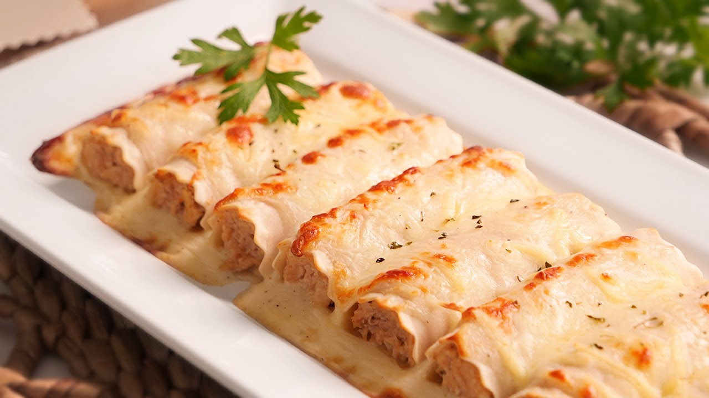
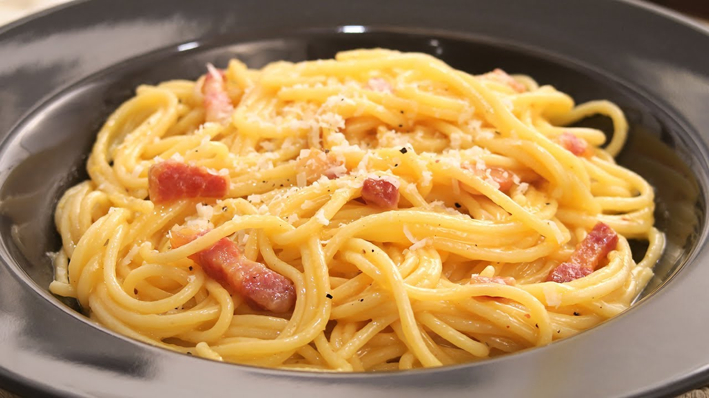
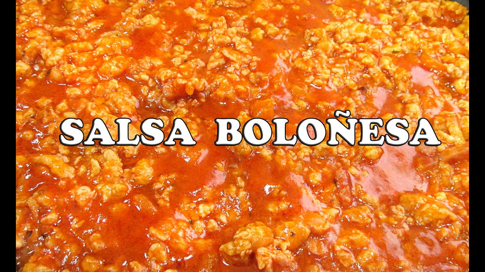
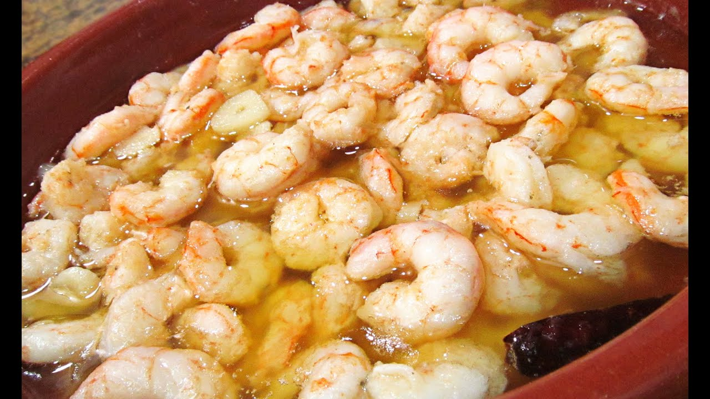

# 🍝 Master de Cocina Tradicional: Pastas, Gratinados y Lasañas de la Abuela
> **Inspirado en la filosofía, técnica y maestría del canal *Cocina con Carmen***  
> *Recetario Técnico Enciclopédico, Tablas de Alérgenos UE (Reglamento 1169/2011), Protocolos de Batch Cooking y Guías de Regeneración Multicanal*

---

## 📖 Prólogo Culinario: Los Secretos de la Pasta, el Ragú y el Gratinado Perfecto

La cocina de pastas y gratinados al horno representa uno de los pilares más reconfortantes y celebrados del recetario familiar. En la cocina de **Carmen**, estos platos van mucho más allá de un simple hervido de pasta: son el resultado de la armonía entre sofritos concentrados de larga cocción, salsas bechamel aterciopeladas cocinadas a fuego paciente y el control milimétrico del horno para obtener costras doradas y crujientes sin resecar el núcleo.

La excelencia en los gratinados y pastas tradicionales se fundamenta en cinco principios técnicos fundamentales:

1. **La Cocción de la Pasta y la Reserva del Agua de Almidón (*L'Acqua di Cottura*):** La pasta siempre debe cocerse en abundante agua hirviendo con sal marina (10 g de sal por cada litro de agua y 100 g de pasta), retirándola invariablemente 1-2 minutos antes del tiempo indicado por el fabricante cuando vaya a someterse a un posterior horneado o manteado en sartén. El agua de cocción, rica en amilopectina disuelta, es el agente emulsionante imprescindible para ligar salsas y grasas.
2. **El Ragú y la Cocción Lenta (*Il Chup-Chup Infalible*):** Una salsa boloñesa o un asado para relleno de canelones no se apresura. Exige un sellado inicial de las carnes a alta temperatura para activar la reacción de Maillard, seguido de un sofrito minucioso de verduras (mirepoix de cebolla, zanahoria y apio) y una cocción a fuego lentísimo durante al menos dos horas. La incorporación gradual de vino y leche entera equilibra la acidez del tomate y rompe el colágeno de las fibras cárnicas, logrando una melosidad inigualable.
3. **La Bechamel Sedosa y el Roux Maduro:** En las lasañas y canelones, la bechamel no es un mero adorno, sino el elemento conductor que aporta humedad y estructura. El roux (mantequilla y harina en proporción 1:1) debe tostarse durante un mínimo de 5 minutos a fuego medio para neutralizar el sabor a cereal crudo antes de recibir la leche caliente aromatizada con nuez moscada y pimienta blanca.
4. **La Arquitectura del Montaje por Capas:** En una lasaña o canelón perfecto, la humedad debe distribuirse de forma equilibrada: una base ligera de bechamel o tomate en la fuente previene que la pasta se adhiera al fondo; las capas de relleno deben ser homogéneas y compactas para evitar desmoronamientos al corte; y la capa superior de pasta debe quedar completamente sellada y napada bajo un velo generoso de bechamel y queso rallado de alto punto de fusión.
5. **El Gratinado Termodinámico y el Reposo Obligatorio:** El horneado debe dividirse en dos fases: una cocción envolvente a 180°C para calentar e integrar el núcleo, y un golpe final de gratinador a 220°C para dorar los quesos y la mantequilla superficial. Al salir del horno, **el reposo de 10 a 15 minutos es sagrado**: permite que la bechamel se asiente, los jugos se redistribuyan y el corte salga en porciones limpias y estables.

---

```
                                  MAPA DEL RECETARIO
                                  
  ┌─────────────────────────────────┐       ┌─────────────────────────────────┐
  │     GRATINADOS DE LA FAMILIA    │       │     LASAÑAS Y CANELONES TOP     │
  │ • 1. Macarrones con Chorizo     │       │ • 2. Lasaña Boloñesa Tradicional│
  │ • 6. Pasta con Salsa Boloñesa 2h│       │ • 3. Canelones Fiesta Asado/Foie│
  │                                 │       │ • 5. Lasaña Atún y Pimientos    │
  │                                 │       │ • 8. Canelones Espinaca/Ricotta │
  └────────────────┬────────────────┘       └────────────────┬────────────────┘
                   │                                         │
                   └───────────────────┬─────────────────────┘
                                       │
                    ┌──────────────────┴──────────────────┐
                    │      PASTAS EMBLEMÁTICAS AL PLATO   │
                    │ • 4. Espaguetis Carbonara al Huevo  │
                    │ • 7. Espaguetis Gambas al Ajillo    │
                    └─────────────────────────────────────┘
```

---

## 📑 Índice General de Recetas

1. [🧀 1. Macarrones Gratinados de la Abuela con Chorizo, Carne Picada, Tomate Frito y Bechamel](#-1-macarrones-gratinados-de-la-abuela-con-chorizo-carne-picada-tomate-frito-y-bechamel)
2. [🥩 2. Lasaña Casera Tradicional Boloñesa de Carne y Verduras con Bechamel Sedosa](#-2-lasaña-casera-tradicional-boloñesa-de-carne-y-verduras-con-bechamel-sedosa)
3. [👑 3. Canelones Tradicionales de Fiesta Rellenos de Asado Mixto y Foie](#-3-canelones-tradicionales-de-fiesta-rellenos-de-asado-mixto-y-foie)
4. [🥚 4. Espaguetis a la Carbonara Tradicional al Huevo con Guanciale/Panceta y Pecorino/Parmesano](#-4-espaguetis-a-la-carbonara-tradicional-al-huevo-con-guancialepanceta-y-pecorinoparmesano)
5. [🐟 5. Lasaña de Atún, Huevos Duros y Pimientos Asados con Bechamel Gratinada](#-5-lasaña-de-atún-huevos-duros-y-pimientos-asados-con-bechamel-gratinada)
6. [🍅 6. Pasta con Salsa Boloñesa Tradicional de Larga Cocción (2h de chup-chup)](#-6-pasta-con-salsa-boloñesa-tradicional-de-larga-cocción-2h-de-chup-chup)
7. [🦐 7. Espaguetis con Gambas al Ajillo y Guindilla](#-7-espaguetis-con-gambas-al-ajillo-y-guindilla)
8. [🍃 8. Canelones de Espinacas, Ricotta/Requesón y Piñones](#-8-canelones-de-espinacas-ricottarequesón-y-piñones)
9. [📊 Tabla Comparativa Maestra: Rendimientos, Costes, Tiempos y Alérgenos](#-tabla-comparativa-maestra-rendimientos-costes-tiempos-y-alérgenos)
10. [🌟 Decálogo de Oro de Carmen para Pastas y Gratinados Insuperables](#-decálogo-de-oro-de-carmen-para-pastas-y-gratinados-insuperables)

---

## 🧀 1. Macarrones Gratinados de la Abuela con Chorizo, Carne Picada, Tomate Frito y Bechamel
*Categoría: Gratinado de Pasta Tradicional / Cocina Confort Familiar*


> 📺 **Vídeo Oficial de Elaboración:** [Ver en YouTube: Lasaña de Carne con Queso y Bechamel súper Deliciosa](https://www.youtube.com/watch?v=uOHVtbaz_Zg)


> [!NOTE]
> El secreto de Carmen para unos macarrones gratinados de leyenda reside en tres detalles técnicos: cocer la pasta 2 minutos menos de lo habitual (dejándola muy al dente), dorar el chorizo dulce en dados minúsculos para que suelte su pimentón y grasa natural antes de añadir la carne picada mixta, y bañar la fuente no solo con queso, sino con una bechamel ligera y fluida que se infiltra por el interior de los macarrones creando una jugosidad sublime.

```
                  ARQUITECTURA DE LOS MACARRONES GRATINADOS
                  
          ┌────────────────────────────────────────────────────────┐
          │  COSTRA: Queso Rallado Fundente + Copos de Mantequilla │
          ├────────────────────────────────────────────────────────┤
          │  NAPADO: Bechamel Ligera Aromatizada con Nuez Moscada  │
          ├────────────────────────────────────────────────────────┤
          │  NÚCLEO: Macarrones Pluma al Dente impregnados de      │
          │          Sofrito de Tomate Casero + Chorizo + Picada   │
          ├────────────────────────────────────────────────────────┤
          │  BASE: Velo Fino de Tomate Frito (Anti-adherente)      │
          └────────────────────────────────────────────────────────┘
```

### 📋 Ficha Resumen
| Parámetro | Valor |
| :--- | :--- |
| **Tiempo de Preparación** | 25 minutos |
| **Tiempo de Cocción / Horneado** | 30 minutos sofrito + 20 minutos horno (10 min cocción + 10 min gratinador) |
| **Dificultad** | Fácil - Media |
| **Raciones** | 4 - 6 personas (aprox. 350 g por ración) |
| **Coste Estimado** | Económico (5,40 € total / 0,90 € por ración) |

---

### ⚠️ Tabla de Alérgenos (Reglamento UE 1169/2011)

| Alérgeno | Estado | Ingrediente Causante / Medida de Adaptación |
| :--- | :---: | :--- |
| **Gluten** | 🔴 **PRESENTE** | Macarrones de trigo duro y harina de la bechamel. *Adaptación: usar pasta de maíz/arroz sin gluten y Maizena para la bechamel.* |
| **Lácteos** | 🔴 **PRESENTE** | Mantequilla, leche entera y queso rallado. *Adaptación: bebida de soja/avena sin azúcar, AOVE y queso vegano rallado.* |
| **Huevos** | 🟢 AUSENTE | La pasta seca estándar de trigo duro no contiene huevo (verificar etiquetado). |
| **Sulfitos** | 🟢 AUSENTE | Embutido artesano limpio. |
| **Pescado / Frutos de Cáscara** | 🟢 AUSENTE | Receta cárnica clásica. |

---

### ⚖️ Ingredientes Exactos

#### Pasta y Sofrito de la Abuela
* **400 g** Macarrones rayados (tipo pluma o tortiglioni de trigo duro).
* **250 g** Carne picada mixta (50% aguja de ternera, 50% magro de cerdo).
* **100 g** Chorizo dulce de guiso oreado (sin piel, cortado en brunoise fina de 3 mm).
* **1 unidad (150 g)** Cebolla dulce picada muy fina.
* **2 dientes** Ajo pelados y picados en brunoise.
* **400 g** Tomate frito casero espeso (o tomate triturado reducido con AOVE y pizca de azúcar).
* **40 ml** Aceite de Oliva Virgen Extra (AOVE).
* **1 cucharadita (2 g)** Orégano silvestre seco.
* **4 g** Sal marina fina y una pizca de pimienta negra recién molida.

#### Bechamel Ligera para Napar
* **40 g** Mantequilla sin sal (82% M.G.).
* **40 g** Harina de trigo común todo uso.
* **600 ml** Leche entera de vaca tibia.
* **1 pizca (0,5 g)** Nuez moscada recién rallada.
* **2 g** Sal fina y pimienta blanca.

#### Cobertura Gratinada
* **120 g** Queso rallado cuatro quesos o mezcla de Mozzarella, Emmental y Gouda.
* **30 g** Queso curado o Parmesano rallado en polvo.
* **15 g** Mantequilla cortada en pequeños dados.

---

### 🍳 Equipamiento Necesario
* Olla grande (5-6 litros) para hervir la pasta.
* Sartén amplia o cazuela baja antiadherente (Ø 28 cm).
* Cazo mediano y varillas de acero/silicona para la bechamel.
* Fuente refractaria de vidrio o cerámica para horno (30 x 20 cm).
* Colador amplio para pasta.

---

### 👨‍🍳 Paso a Paso Técnico y Minucioso

1. **Elaboración del Sofrito con Chorizo y Carne:**
   * En una sartén amplia, calentar los 40 ml de AOVE a fuego medio. Añadir el chorizo picado y saltear durante 2 minutos hasta que empiece a fundir su grasa y liberar su característico tono anaranjado.
   * Incorporar la cebolla y el ajo picados con una pizca de sal. Pochar a fuego medio-suave durante 10 minutos hasta que la cebolla esté tierna, translúcida y ligeramente dorada.
   * Subir ligeramente el fuego, agregar la carne picada salpimentada y desmenuzarla constantemente con la cuchara de madera para que no queden bolas apelmazadas. Cocinar durante 5-6 minutos hasta que pierda el color rosado y comience a dorarse.
   * Verter el tomate frito casero y el orégano. Mezclar de manera uniforme, bajar el fuego y dejar cocer a fuego suave (*chup-chup*) durante 10 minutos para que los sabores se amalgamen y la salsa tome cuerpo. Probar y rectificar de sal.

2. **Preparación de la Bechamel Fluida de Cobertura:**
   * En un cazo a fuego medio, fundir los 40 g de mantequilla. Añadir los 40 g de harina tamizada y cocinar el roux con las varillas durante **4 minutos**, tostando suavemente la harina sin quemarla.
   * Verter la leche tibia en hilo continuo mientras se bate enérgicamente para evitar grumos.
   * Cocinar a fuego suave durante **8-10 minutos** removiendo sin parar hasta obtener una bechamel cremosa, suave y fluida (con textura de crema ligera, ya que espesará en el horno). Sazonar con la nuez moscada, sal y pimienta blanca.

3. **Cocción Al Dente de la Pasta:**
   * Poner a hervir 4 litros de agua con 40 g de sal. Cuando rompa a hervir vigorosamente, añadir los 400 g de macarrones.
   * Cocinar **2 minutos menos del tiempo recomendado en el paquete** (si indica 10 minutos, cocer durante 8 minutos). Escurrir la pasta inmediatamente, reservando medio vaso del agua de cocción.

4. **Integración, Montaje y Gratinado:**
   * Volcar los macarrones calientes directamente en la sartén con el sofrito de carne y chorizo. Si la mezcla estuviera muy densa, añadir 2-3 cucharadas del agua de cocción reservada. Remover bien durante 1 minuto a fuego suave para que la pasta se impregne del tomate por fuera y por dentro.
   * Untar la base de la fuente de horno con 2 cucharadas de salsa de tomate o bechamel. Disponer todos los macarrones con su sofrito nivelando la superficie con la espátula.
   * Verter la bechamel tibia cubriendo de forma homogénea toda la pasta.
   * Espolvorear la mezcla de quesos rallados por toda la superficie y repartir los daditos de mantequilla.
   * Introducir en el horno precalentado a **200°C con calor arriba y abajo durante 10 minutos**, y posteriormente encender el **gratinador a 220°C durante 6-8 minutos** hasta lograr una costra dorada con burbujeo periférico y puntos tostados crujientes.
   * Dejar reposar fuera del horno durante **5 minutos antes de servir**.

---

### 📦 Protocolo de Conservación y Batch Cooking

* **Refrigeración (0°C a 4°C):** Conservar en recipiente hermético de cristal hasta por **4 días**.
* **Congelación (-18°C):**
  * *Opción recomendada (en crudo antes de gratinar):* Montar la fuente completa (macarrones con salsa, bechamel y queso), dejar enfriar a temperatura ambiente, envolver con doble capa de papel film y papel de aluminio, y congelar. Vida útil: **3 meses**.
  * *Porciones ya horneadas:* Cortar porciones individuales una vez frías y congelar en recipientes herméticos.

---

### 🔥 Guía de Regeneración Multicanal

* **Horno Convencional (Porción o Fuente Completa):**
  * *Desde refrigerado:* Hornear a 180°C durante 15 minutos cubierto con papel de aluminio para no quemar el queso.
  * *Desde congelado (sin hornear previamente):* Hornear a 170°C tapado con aluminio durante 35-40 minutos; retirar el papel y gratinar a 210°C durante 8 minutos.
* **Airfryer:** Colocar la porción en molde de silicona/aluminio a 160°C durante 8 minutos y luego 2 minutos a 190°C para devolver el crujiente al queso.
* **Microondas:** Calentar a 700W durante 2,5 - 3 minutos tapado con campana. *Nota: La costra perderá el crujiente pero mantendrá la jugosidad interna.*

---

## 🥩 2. Lasaña Casera Tradicional Boloñesa de Carne y Verduras con Bechamel Sedosa
*Categoría: Lasaña Clásica al Horno / Gran Plato de Domingo*


> 📺 **Vídeo Oficial de Elaboración:** [Ver en YouTube: Lasaña de Carne con Queso y Bechamel súper Deliciosa](https://www.youtube.com/watch?v=uOHVtbaz_Zg)


> [!TIP]
> Para conseguir que la lasaña de Carmen se corte en porciones perfectas que no se desmoronen en el plato, es imprescindible intercalar capas finas y densas de relleno (sin exceso de líquido libre), hidratar correctamente las placas de pasta y rematar con una bechamel de consistencia media que selle las cuatro esquinas de la fuente.

```
                      ESTRUCTURA DE CAPAS DE LA LASAÑA
                      
    ┌──────────────────────────────────────────────────────────────┐
    │ CAPA SUPERIOR: Bechamel Sedosa + Parmesano + Dados Mantequilla│
    ├──────────────────────────────────────────────────────────────┤
    │ CAPA 4: Placas de Pasta al Huevo                             │
    ├──────────────────────────────────────────────────────────────┤
    │ CAPA 3: Ragú Boloñesa Concentrado + Hilo de Bechamel         │
    ├──────────────────────────────────────────────────────────────┤
    │ CAPA 2: Placas de Pasta al Huevo                             │
    ├──────────────────────────────────────────────────────────────┤
    │ CAPA 1: Ragú Boloñesa Concentrado + Hilo de Bechamel         │
    ├──────────────────────────────────────────────────────────────┤
    │ BASE: Fina Película de Bechamel y Tomate                     │
    └──────────────────────────────────────────────────────────────┘
```

### 📋 Ficha Resumen
| Parámetro | Valor |
| :--- | :--- |
| **Tiempo de Preparación** | 45 minutos |
| **Tiempo de Cocción / Horneado** | 45 minutos sofrito + 30 minutos horno + 15 minutos reposo |
| **Dificultad** | Media |
| **Raciones** | 6 - 8 personas (fuente grande de 8 raciones generosas) |
| **Coste Estimado** | Medio (8,20 € total / 1,02 € por ración) |

---

### ⚠️ Tabla de Alérgenos (Reglamento UE 1169/2011)

| Alérgeno | Estado | Ingrediente Causante / Medida de Adaptación |
| :--- | :---: | :--- |
| **Gluten** | 🔴 **PRESENTE** | Placas de lasaña de trigo y harina del roux. *Adaptación: placas de pasta sin gluten y fécula de maíz.* |
| **Lácteos** | 🔴 **PRESENTE** | Mantequilla, leche entera, queso Parmigiano/Gouda. |
| **Huevos** | 🔴 **PRESENTE** | Placas de lasaña tradicionales al huevo (*lasagne all'uovo*). |
| **Apio** | 🔴 **PRESENTE** | Rama de apio en el mirepoix del sofrito. *Omitir para personas alérgicas.* |
| **Sulfitos** | 🔴 **PRESENTE** | Copa de vino tinto o blanco seco. *Sustituir por caldo de carne casero si se requiere evitar sulfitos.* |

---

### ⚖️ Ingredientes Exactos

#### Placas de Pasta
* **16-18 placas** Pasta de lasaña al huevo (precocidas o para hervir).
* **30 ml** Aceite de oliva (para el agua de remojo).

#### Ragú Boloñesa de Carne y Huerta
* **350 g** Carne picada de aguja de ternera.
* **250 g** Carne picada de magro de cerdo o panceta fresca picada.
* **1 unidad grande (180 g)** Cebolla dulce picada en brunoise fina.
* **2 unidades (140 g)** Zanahorias peladas y ralladas o picadas minúsculas.
* **1 rama (50 g)** Apio verde lavado y picado muy fino.
* **2 dientes** Ajo machacados.
* **600 g** Tomate natural triturado de calidad o passata rústica.
* **100 ml** Vino tinto con cuerpo o vino blanco seco.
* **50 ml** Aceite de Oliva Virgen Extra.
* **1 hoja** Laurel seco.
* **1 cucharadita** Tomillo y orégano secos.
* **6 g** Sal marina y pimienta negra recién molida.

#### Bechamel Sedosa de Cobertura
* **60 g** Mantequilla sin sal.
* **60 g** Harina de trigo común.
* **850 ml** Leche entera tibia.
* **1 g** Nuez moscada recién rallada, sal y pimienta blanca.

#### Acabado Gratinado
* **150 g** Queso Mozzarella rallado de baja humedad.
* **60 g** Queso Parmesano Reggiano o Grana Padano recién rallado.
* **20 g** Mantequilla en dados fríos.

---

### 🍳 Equipamiento Necesario
* Cazuela de fondo grueso (cocotte o sartén honda Ø 28 cm).
* Bandeja refractaria profunda (32 x 22 x 6 cm).
* Varillas y cazo para bechamel.
* Bol amplio para hidratar las placas de pasta con paños limpios de algodón.

---

### 👨‍🍳 Paso a Paso Técnico y Minucioso

1. **Cocción del Ragú Boloñesa Concentrado:**
   * En la cazuela con el AOVE caliente a fuego medio, añadir la cebolla, la zanahoria y el apio con una pizca de sal. Pochar durante 12-14 minutos hasta que las verduras estén muy tiernas y comiencen a caramelizar suavemente.
   * Añadir los ajos y sofreír 1 minuto.
   * Incorporar la carne picada de ternera y cerdo. Romperla con la espátula para evitar grumos y cocinar a fuego vivo durante 8 minutos hasta que se dore y evapore el agua de la carne.
   * Verter el vino tinto y raspar el fondo de la cazuela para recuperar los jugos caramelizados. Dejar reducir a fuego fuerte durante 3-4 minutos hasta que el alcohol se evapore totalmente.
   * Añadir el tomate triturado, la hoja de laurel, el tomillo, el orégano, la sal y la pimienta. Bajar el fuego al mínimo, tapar parcialmente y cocinar a fuego manso (*chup-chup*) durante **35-40 minutos**, removiendo de vez en cuando hasta obtener una boloñesa espesa, untuosa y brillante sin exceso de líquido acuoso. Retirar el laurel.

2. **Elaboración de la Bechamel Sedosa:**
   * En un cazo, derretir los 60 g de mantequilla a fuego medio. Añadir la harina tamizada y cocinar el roux removiendo constantemente durante **5 minutos** hasta que adquiera un tono avellana claro.
   * Verter la leche entera tibia en 3 tandas, batiendo con energía tras cada adición. Cocinar durante **12 minutos** a fuego suave hasta que espese y adquiera una textura aterciopelada y brillante. Condimentar con sal, nuez moscada y pimienta blanca.

3. **Acondicionamiento de las Placas:**
   * Si son placas precocidas, sumergirlas en agua caliente durante 10-12 minutos hasta que estén flexibles. Si son placas secas tradicionales, cocerlas en abundante agua con sal durante 6-7 minutos.
   * Extender las placas sobre paños de cocina limpios y secos sin que se solapen.

4. **Montaje Estructurado de la Lasaña:**
   * Pincelar el fondo de la fuente con una fina capa de bechamel mezclada con una cucharada de salsa boloñesa.
   * Colocar la **primera capa de placas de pasta** cubriendo bien la base.
   * Extender un tercio del ragú boloñesa de manera uniforme y napar con 3-4 cucharadas de bechamel y una lluvia fina de parmesano.
   * Colocar la **segunda capa de pasta**, otro tercio de boloñesa, bechamel y queso.
   * Disponer la **tercera capa de pasta**, el resto del ragú boloñesa y un velo de bechamel.
   * Cerrar con la **cuarta capa de placas de pasta**.
   * Cubrir toda la superficie superior con la totalidad de la bechamel restante, asegurando que cubra los bordes para que no se sequen.
   * Espolvorear la mozzarella y el parmesano rallado, distribuyendo los dados de mantequilla por encima.

5. **Horneado, Gratinado y Reposo Crucial:**
   * Hornear a **190°C con calor arriba y abajo durante 25 minutos** (en la bandeja central).
   * Activar el gratinador a **220°C durante 5-7 minutos** hasta obtener un tono dorado caoba con burbujeo activo.
   * **REPOSO SAGRADO:** Retirar del horno y dejar reposar sobre una rejilla durante **15 minutos** antes de porcionar. Este reposo permite que las proteínas y grasas lácteas cohesionen la lasaña, logrando cortes limpios de alta pastelería salada.

---

### 📦 Protocolo de Conservación y Batch Cooking

* **Refrigeración (0°C a 4°C):** Aguanta en perfecto estado hasta **4 días** bien tapada en su propia fuente.
* **Congelación (-18°C):**
  * Congelar la lasaña completa una vez montada (en crudo) o ya horneada y enfriada.
  * Congelación por porciones: cortar cuadrados individuales fríos, envolver individualmente en papel film y bolsa zip. Vida útil: **3 meses**.

---

### 🔥 Guía de Regeneración Multicanal

* **Horno Convencional:**
  * *Porción refrigerada:* 180°C durante 12-15 minutos con papel aluminio.
  * *Lasaña entera congelada:* Descongelar 12h en nevera y hornear a 180°C durante 30 minutos + 5 min gratinador; o directamente congelada a 160°C tapada durante 50 minutos + 10 min a 200°C destapada.
* **Airfryer:** Precalentar a 170°C. Colocar la porción en molde apto durante 10 minutos tapada con papel de aluminio y 2 minutos destapada a 190°C.
* **Microondas:** Calentar porción individual a 650W durante 3-4 minutos.

---

## 👑 3. Canelones Tradicionales de Fiesta Rellenos de Asado Mixto y Foie
*Categoría: Pasta Rellena Festiva / Gran Clásico Tradicional de Celebración*



> 📺 **Vídeo Oficial de Elaboración:** [Ver en YouTube: Canelones de Pollo fáciles y deliciosos](https://www.youtube.com/watch?v=1-AgQEacBLk)


> [!NOTE]
> En Cataluña y en toda la tradición española de fiesta (como San Esteban o Navidad), los canelones supremos se rellenan con el asado de tres carnes cocinadas lentamente con cebolla, brandy y vino rancio. Carmen eleva esta receta triturando la carne asada a cuchillo o picadora gruesa (nunca en puré fino tipo papilla) y enriqueciéndola con un toque de paté de foie y un par de cucharadas de la propia bechamel para una suntuosidad incomparable.

```
                  PROCESO DEL RELLENO DE CANELONES DE FIESTA
                  
┌──────────────────────┐      ┌──────────────────────┐      ┌──────────────────────┐
│ 1. ASADO 3 CARNES    │      │ 2. DESGLASE Y PICADO │      │ 3. LIGAZÓN SUPREMA   │
│ Pollo + Cerdo + Vaca │ ───► │ Reducción Brandy     │ ───► │ Incorporación Foie   │
│ Rostido lento 45 min │      │ Picado textura rústic│      │ + 3 cdas Bechamel    │
└──────────────────────┘      └──────────────────────┘      └──────────────────────┘
```

### 📋 Ficha Resumen
| Parámetro | Valor |
| :--- | :--- |
| **Tiempo de Preparación** | 50 minutos |
| **Tiempo de Cocción / Horneado** | 45 minutos asado carnes + 20 minutos horno |
| **Dificultad** | Media - Alta |
| **Raciones** | 6 personas (rinde aprox. 18-20 canelones, 3 por persona) |
| **Coste Estimado** | Medio - Alto (9,50 € total / 1,58 € por ración) |

---

### ⚠️ Tabla de Alérgenos (Reglamento UE 1169/2011)

| Alérgeno | Estado | Ingrediente Causante / Medida de Adaptación |
| :--- | :---: | :--- |
| **Gluten** | 🔴 **PRESENTE** | Placas de canelones y harina de trigo en la bechamel. |
| **Lácteos** | 🔴 **PRESENTE** | Mantequilla, leche entera de la bechamel y queso curado rallado. |
| **Huevos** | 🔴 **PRESENTE** | Placas de canelón al huevo. |
| **Sulfitos** | 🔴 **PRESENTE** | Brandy / Coñac o vino rancio en el asado. |
| **Frutos de Cáscara** | 🟢 AUSENTE | Formulación sin frutos secos. |

---

### ⚖️ Ingredientes Exactos

#### Placas de Canelón
* **18-20 placas** de canelón clásico al huevo.

#### Asado Cárnico para el Relleno
* **250 g** Contramuslos de pollo de corral deshuesados y sin piel.
* **200 g** Magro de cerdo (cabecero de lomo o panceta magra).
* **200 g** Falda o aguja de ternera en dados medianos.
* **1 unidad (150 g)** Cebolla dulce en cuartos.
* **1 unidad (100 g)** Tomate maduro en mitades.
* **3 dientes** Ajo con piel aplastados.
* **50 ml** Brandy o Coñac de calidad (o mezcla con vino rancio/Jerez seco).
* **60 g** Mousse o paté de foie gras de pato de buena calidad.
* **40 ml** Aceite de Oliva Virgen Extra y 20 g de manteca de cerdo ibérica (o solo AOVE).
* **1 rama** Canela y 1 hoja de laurel.
* **5 g** Sal marina y pimienta negra molida.

#### Bechamel Sedosa Enriquecida
* **50 g** Mantequilla sin sal.
* **50 g** Harina de trigo.
* **750 ml** Leche entera tibia.
* **50 ml** Jugos filtrados del propio asado de las carnes (aporta sabor profundo).
* **1 g** Nuez moscada, sal y pimienta blanca.

#### Gratinado Dorado
* **120 g** Queso Emmental o Manchego semicurado rallado.
* **40 g** Queso Parmesano en polvo.
* **20 g** Mantequilla en copos.

---

### 🍳 Equipamiento Necesario
* Cazuela de hierro fundido o sartén honda para el rostizado.
* Picadora de carne, procesador de alimentos o cuchillo cebollero pesado.
* Manga pastelera desechable con boquilla ancha lisa (facilita el relleno).
* Fuente refractaria de horno amplia (35 x 25 cm).
* Paños de hilo/algodón limpios para secar placas.

---

### 👨‍🍳 Paso a Paso Técnico y Minucioso

1. **Rostizado Tradicional de las Tres Carnes:**
   * En la cazuela con el AOVE y la manteca caliente a fuego medio-alto, dorar los trozos de ternera, cerdo y pollo salpimentados hasta que adquieran un color dorado intenso y caramelizado por todos sus lados (10 minutos).
   * Añadir la cebolla, el tomate, los ajos aplastados, el laurel y la ramita de canela. Bajar el fuego a medio-bajo y pochar junto a la carne durante 20 minutos, removiendo para que las verduras se confiten en la grasa.
   * Verter el brandy y flambear con precaución o dejar reducir a fuego vivo durante 3-4 minutos raspando los jugos pegados al fondo de la cazuela.
   * Añadir 50 ml de agua o caldo suave, tapar y dejar cocer a fuego muy bajo durante **20 minutos más** hasta que las carnes estén tiernas.
   * Retirar los ajos, el laurel y la canela. Escurrir la carne y las verduras reservando los jugos de cocción del fondo.

2. **Picado y Emulsión del Relleno:**
   * Pasar las carnes templadas y la cebolla confitada por la picadora con disco grueso o procesar a toques cortos en el robot de cocina. Debe quedar una textura rústica picada finísima, nunca una pasta homogénea gomosa.
   * Pasar la carne picada a una sartén limpia, encender a fuego bajo, incorporar los 60 g de paté de foie gras y mezclar hasta que se funde con el calor residual.
   * Añadir 3 cucharadas colmadas de la bechamel recién hecha para aportar untuosidad y cohesión al relleno. Dejar enfriar y colocar en una manga pastelera.

3. **Cocción y Manejo de las Placas:**
   * Hervir las placas de canelón en abundante agua salada hirviendo siguiendo las instrucciones del fabricante (aprox. 6-8 minutos), enfriar en un bol con agua helada para cortar la cocción y disponerlas extendidas sobre paños limpios.

4. **Elaboración de la Bechamel con Reducción de Asado:**
   * Derretir la mantequilla, añadir la harina y tostar durante 4 minutos. Incorporar los 750 ml de leche tibia y los 50 ml de jugos colados del asado. Cocinar a fuego suave 10 minutos con varillas. Ajustar de sal, pimienta y nuez moscada.

5. **Relleno, Enrollado y Montaje:**
   * Pincelar el fondo de la fuente con una capa fina de bechamel.
   * Con la manga pastelera, escudillar un cilindro generoso de relleno en uno de los extremos de cada placa de pasta.
   * Enrollar la placa sobre sí misma con cuidado, cerrando el cilindro de canelón.
   * Disponer los canelones en la fuente alineados uno junto al otro, con la junta de cierre orientada hacia abajo.
   * Verter toda la bechamel cremosa cubriendo por completo los canelones sin dejar esquinas al descubierto.
   * Coronar con la mezcla de quesos rallados y los dados de mantequilla.

6. **Horneado y Gratinado:**
   * Hornear a **190°C durante 15 minutos** y gratinar a **220°C durante 5-6 minutos** hasta obtener un dorado uniforme con costra crujiente.
   * Reposar 10 minutos antes de servir en mesa con paleta ancha.

---

### 📦 Protocolo de Conservación y Batch Cooking

* **Refrigeración (0°C a 4°C):** Los canelones aguantan hasta **3 días** en la nevera.
* **Congelación (-18°C):**
  * El canelón es el producto festivo por excelencia para congelar. Disponer los canelones enrollados en bandejas de aluminio desechables, napar con la bechamel y el queso, cubrir con tapa o papel film + aluminio y congelar en crudo. Vida útil: **3 meses**.
  * Hornear directamente congelados a 170°C tapados durante 35 minutos y 8 minutos a 200°C destapados con gratinador.

---

### 🔥 Guía de Regeneración Multicanal

* **Horno Tradicional:** 180°C durante 15-18 minutos tapado con papel aluminio para regenerar el corazón sin quemar el queso.
* **Airfryer:** Disponer 2-3 canelones en bandeja compatible, hornear a 160°C durante 8 minutos y 2 minutos a 190°C.
* **Microondas:** 2 canelones a 650W durante 2,5 minutos.

---

## 🥚 4. Espaguetis a la Carbonara Tradicional al Huevo con Guanciale/Panceta y Pecorino/Parmesano
*Categoría: Pasta Clásica al Plato / Emulsión de Yema y Queso Sin Nata*



> 📺 **Vídeo Oficial de Elaboración:** [Ver en YouTube: Espaguetis con Salsa Carbonara Italiana | Receta muy Fácil y Rápida!](https://www.youtube.com/watch?v=67piG_M-CjU)


> [!IMPORTANT]
> **CÓDIGO DE HONOR DE CARMEN:** La auténtica carbonara tradicional **JAMÁS LLEVA NATA, NI CEBOLLA, NI CHAMPIÑONES**. La cremosidad inigualable de este plato histórico italiano se logra exclusivamente mediante la emulsión mecánica fuera del fuego entre las yemas de huevo frescas, la grasa fundida del guanciale o panceta curada, el queso Pecorino/Parmesano finamente rallado y el agua de cocción de la pasta cargada de almidón.

```
                      MECÁNICA DE LA EMULSIÓN CARBONARA
                      
┌─────────────────────────┐      ┌─────────────────────────┐      ┌─────────────────────────┐
│ 1. DORADO DEL GUANCIALE │      │ 2. MEZCLA CARBO-CREMA   │      │ 3. MANTECADURA OFF-FIRE │
│ Guanciale/Panceta a     │ ───► │ Yemas + Pecorino/Parme  │ ───► │ Pasta + Grasa + Crema + │
│ fuego lento: crujiente  │      │ + Pimienta tostada      │      │ Agua de cocción a 65°C  │
└─────────────────────────┘      └─────────────────────────┘      └─────────────────────────┘
```

### 📋 Ficha Resumen
| Parámetro | Valor |
| :--- | :--- |
| **Tiempo de Preparación** | 10 minutos |
| **Tiempo de Cocción** | 12 minutos |
| **Dificultad** | Media (exige control térmico para no cuajar el huevo) |
| **Raciones** | 4 personas |
| **Coste Estimado** | Económico - Medio (4,80 € total / 1,20 € por ración) |

---

### ⚠️ Tabla de Alérgenos (Reglamento UE 1169/2011)

| Alérgeno | Estado | Ingrediente Causante / Medida de Adaptación |
| :--- | :---: | :--- |
| **Gluten** | 🔴 **PRESENTE** | Espaguetis de trigo duro. *Adaptación: espaguetis sin gluten de maíz/arroz.* |
| **Huevos** | 🔴 **PRESENTE** | Yemas de huevo camperas frescas en la crema. |
| **Lácteos** | 🔴 **PRESENTE** | Queso Pecorino Romano y Parmigiano Reggiano. |
| **Sulfitos / Pescado / Soja** | 🟢 AUSENTE | Embutido curado sin aditivos alérgenos. |

---

### ⚖️ Ingredientes Exactos

#### Pasta y Chacinado
* **400 g** Espaguetis de sémola de trigo duro de trefilado al bronce (tipo Spaghetti n.º 5 o Spaghettoni).
* **160 g** Guanciale curado italiano (en su defecto, panceta curada o panceta ibérica entreverada de alta calidad, nunca beicon ahumado industrial), cortado en tiras de 1 cm x 0,5 cm.
* **3,5 litros** Agua para cocer la pasta.
* **25 g** Sal marina gruesa (menos sal de lo habitual, ya que el guanciale y el pecorino son muy sabrosos).

#### Crema de Carbonara Emulsionada
* **4 unidades** Yemas de huevos camperos clase L muy frescas.
* **1 unidad** Huevo campero entero clase L.
* **60 g** Queso Pecorino Romano D.O.P. recién rallado muy fino (sabor intenso y salino).
* **40 g** Queso Parmigiano Reggiano o Grana Padano recién rallado fino (aporta dulzura láctica).
* **1 cucharada colmada (4 g)** Granos de pimienta negra entera, tostados en sartén seca y machacados en mortero.
* **60-80 ml** Agua de cocción hirviendo de la pasta (para emulsionar).

---

### 🍳 Equipamiento Necesario
* Sartén amplia (Ø 28-30 cm) de acero o aluminio para saltear la pasta.
* Olla alta para cocer los espaguetis.
* Bol de cristal o metal amplio para batir las yemas y el queso.
* Mortero o molinillo de pimienta.
* Pinzas largas para servir pasta.

---

### 👨‍🍳 Paso a Paso Técnico y Minucioso

1. **Tostado de la Pimienta y Dorado del Guanciale:**
   * En la sartén fría sin nada de aceite, poner los granos de pimienta negra machacados a fuego medio durante 1 minuto para despertar sus aceites esenciales.
   * Añadir las tiras de guanciale o panceta. Cocinar a fuego medio-bajo durante **7-9 minutos** removiendo ocasionalmente. La grasa debe fundirse despacio, volviéndose transparente, y los trocitos de carne deben quedar dorados y muy crujientes por fuera pero tiernos por dentro.
   * Retirar la sartén del fuego. Sacar la mitad del guanciale crujiente a un plato con papel absorbente para la guarnición final, dejando en la sartén la grasa líquida fundida y la otra mitad del guanciale.

2. **Preparación de la "Carbo-Crema" Base:**
   * En el bol amplio, verter las 4 yemas y el huevo entero.
   * Añadir el queso Pecorino rallado, el Parmesano y la mitad de la pimienta negra machacada.
   * Batir con unas varillas de mano hasta formar una pasta espesa, densa y homogénea (textura de crema espesa).

3. **Cocción Perfecta al Dente de los Espaguetis:**
   * En la olla con el agua hirviendo y la sal, sumergir los espaguetis.
   * Cocinar durante **1 minuto menos** de lo indicado por el fabricante para dejarlos bien al dente.
   * Extraer una taza grande (200 ml) del agua de cocción de la pasta antes de escurrir.

4. **La Mantecadura y Emulsión Fuera del Fuego (*Il Momento Magico*):**
   * Con unas pinzas, pasar los espaguetis directamente de la olla a la sartén con la grasa tibia del guanciale (a fuego medio durante 30 segundos), añadiendo 4 cucharadas del agua de cocción para que la grasa y el almidón comiencen a emulsionar.
   * **APAGAR EL FUEGO POR COMPLETO Y RETIRAR LA SARTÉN DEL FOCO DE CALOR DURANTE 30 SEGUNDOS** (la temperatura debe bajar a aprox. 65°C-70°C; si está a más de 75°C el huevo cuajará en tortilla revuelta).
   * Verter 2 cucharadas de agua de cocción dentro del bol de la crema de yemas y batir rápidamente para atemperarla.
   * Volcar la crema de yemas sobre los espaguetis en la sartén fuera del fuego.
   * Mover y saltear enérgicamente los espaguetis con movimientos envolventes y continuos con las pinzas durante 60-90 segundos. A medida que la yema entra en contacto con el almidón caliente y la grasa del guanciale, se formará una salsa cremosa, brillante y aterciopelada que abraza cada hebra de pasta. Si queda muy espesa, añadir otra cucharada de agua de cocción caliente.

5. **Emplatado Inmediato:**
   * Servir inmediatamente haciendo un nido alto con las pinzas en platos hondos atemperados.
   * Coronar con el guanciale crujiente reservado, una lluvia adicional de Pecorino y un golpe final de pimienta negra recién molida. Servir al instante.

---

### 📦 Protocolo de Conservación y Batch Cooking

> [!CAUTION]
> La auténtica carbonara al huevo es una emulsión viva que **no admite refrigeración prolongada ni congelación**, ya que el recalentado cuaja las yemas y rompe la emulsión. Debe consumirse en el momento exacto de su elaboración.

---

### 🔥 Guía de Regeneración Multicanal

* **Sartén a Fuego Ultrabajo con Agua Caliente:** Si sobran raciones, colocar en sartén a fuego mínimo con 2 cucharadas de agua caliente y remover constantemente durante 1 minuto sin que llegue a hervir.

---

## 🐟 5. Lasaña de Atún, Huevos Duros y Pimientos Asados con Bechamel Gratinada
*Categoría: Lasaña Marinera de la Abuela / Cocina Tradicional sin Carne*


> 📺 **Vídeo Oficial de Elaboración:** [Ver en YouTube: Lasaña de Carne con Queso y Bechamel súper Deliciosa](https://www.youtube.com/watch?v=uOHVtbaz_Zg)


> [!NOTE]
> Una de las lasañas más populares en los hogares españoles es la lasaña fría o templada de atún y pimientos del piquillo o asados a la leña. Carmen equilibra el sofrito con un tomate frito casero muy espeso, atún en aceite de oliva escurrido y huevos camperos cocidos en su punto, logrando un corte limpio y un contraste delicioso entre la dulzura del pimiento y el gratinado lácteo.

```
                   CAPAS DE LA LASAÑA DE ATÚN Y PIMIENTOS
                   
    ┌──────────────────────────────────────────────────────────────┐
    │ COBERTURA: Bechamel Cremosa + Queso Gratinado Dorado         │
    ├──────────────────────────────────────────────────────────────┤
    │ PLACAS DE PASTA                                              │
    ├──────────────────────────────────────────────────────────────┤
    │ RELLENO 2: Atún en AOVE + Huevo Duro Picado + Tomate Casero  │
    ├──────────────────────────────────────────────────────────────┤
    │ PLACAS DE PASTA                                              │
    ├──────────────────────────────────────────────────────────────┤
    │ RELLENO 1: Pimientos Rojos Asados en Tiras + Sofrito Tomate  │
    ├──────────────────────────────────────────────────────────────┤
    │ BASE: Bechamel Fina Antiadherente                            │
    └──────────────────────────────────────────────────────────────┘
```

### 📋 Ficha Resumen
| Parámetro | Valor |
| :--- | :--- |
| **Tiempo de Preparación** | 30 minutos |
| **Tiempo de Cocción / Horneado** | 20 minutos sofrito + 25 minutos horno |
| **Dificultad** | Fácil |
| **Raciones** | 6 personas |
| **Coste Estimado** | Muy Económico (5,20 € total / 0,86 € por ración) |

---

### ⚠️ Tabla de Alérgenos (Reglamento UE 1169/2011)

| Alérgeno | Estado | Ingrediente Causante / Medida de Adaptación |
| :--- | :---: | :--- |
| **Gluten** | 🔴 **PRESENTE** | Placas de lasaña y harina del roux. |
| **Pescado** | 🔴 **PRESENTE** | Atún en conserva en aceite de oliva. |
| **Huevos** | 🔴 **PRESENTE** | Huevos cocidos en el relleno y placas al huevo. |
| **Lácteos** | 🔴 **PRESENTE** | Leche entera, mantequilla y queso gratinado. |
| **Sulfitos / Frutos de Cáscara** | 🟢 AUSENTE | Formulación limpia. |

---

### ⚖️ Ingredientes Exactos

#### Pasta y Relleno Marinero
* **12-14 placas** de lasaña precocidas o tradicionales.
* **3 latas (240 g peso escurrido)** Atún claro en aceite de oliva virgen o de oliva de calidad.
* **3 unidades** Huevos camperos cocidos durante 9 minutos (pelados y picados a cuchillo).
* **150 g** Pimientos rojos asados a la leña (o pimientos del piquillo) cortados en tiras finas.
* **1 unidad (140 g)** Cebolla dulce picada en brunoise.
* **1 diente** Ajo picado fino.
* **450 g** Tomate frito casero concentrado.
* **30 ml** Aceite de oliva virgen extra.
* **1 cucharadita** Orégano seco, sal marina y pimienta negra.

#### Bechamel y Queso
* **50 g** Mantequilla.
* **50 g** Harina de trigo común.
* **750 ml** Leche entera tibia.
* **1 g** Nuez moscada, sal y pimienta blanca.
* **130 g** Queso Mozzarella y Gouda rallados.

---

### 🍳 Equipamiento Necesario
* Sartén mediana para el sofrito.
* Fuente refractaria rectangular de 28 x 18 cm.
* Cazo y varillas para bechamel.
* Cazo para cocer huevos.

---

### 👨‍🍳 Paso a Paso Técnico y Minucioso

1. **Sofrito de Cebolla y Base de Tomate:**
   * En una sartén con el AOVE caliente, pochar la cebolla y el ajo picado a fuego medio-suave durante 10 minutos con una pizca de sal hasta que caramelicen suavemente.
   * Añadir el tomate frito casero y el orégano. Dejar reducir durante 6-8 minutos a fuego suave para concentrar los azúcares y espesar la salsa.

2. **Preparación del Relleno de Atún y Pimientos:**
   * Escurrir el atún reservando una cucharada de su aceite para aromatizar el sofrito. Desmigar el atún con un tenedor en trozos medianos (para que se note la textura en boca).
   * Incorporar el atún desmigado y las tiras de pimiento asado a la sartén con el tomate y la cebolla. Mezclar a fuego apagado.
   * Añadir los 3 huevos cocidos picados y mezclar con suavidad. Probar y rectificar de sal si fuera necesario.

3. **Elaboración de la Bechamel Suave:**
   * Fundir la mantequilla en un cazo, tostar la harina durante 4 minutos y verter la leche tibia batiendo continuamente. Cocinar 10 minutos hasta que nape el dorso de una cuchara. Sazonar con sal, nuez moscada y pimienta blanca.

4. **Montaje y Gratinado:**
   * Pincelar el fondo de la fuente con una cucharada de bechamel.
   * Disponer una capa de placas de pasta.
   * Extender la mitad del relleno de atún, tomate, pimiento y huevo de manera uniforme.
   * Cubrir con otra capa de placas de pasta.
   * Extender la otra mitad del relleno.
   * Cerrar con una última capa de pasta.
   * Cubrir toda la lasaña con la bechamel y espolvorear el queso rallado.
   * Hornear a **190°C durante 20 minutos** y gratinar a **220°C durante 5 minutos** hasta que el queso esté fundido y dorado.
   * Reposar 10 minutos antes de cortar.

---

### 📦 Protocolo de Conservación y Batch Cooking

* **Refrigeración (0°C a 4°C):** Conservar en nevera durante **3-4 días**.
* **Congelación (-18°C):** Excelente para congelar en porciones horneadas o la fuente entera en crudo. Vida útil: **3 meses**.

---

### 🔥 Guía de Regeneración Multicanal

* **Horno Tradicional:** 175°C durante 15 minutos cubierto con papel vegetal o aluminio.
* **Airfryer:** 160°C durante 7 minutos en molde apto.
* **Microondas:** 2,5 minutos a 600W.

---

## 🍅 6. Pasta con Salsa Boloñesa Tradicional de Larga Cocción (2h de chup-chup)
*Categoría: Salsa Clásica de Larga Cocción / Ragù Tradicional de Carmen*



> 📺 **Vídeo Oficial de Elaboración:** [Ver en YouTube: Cómo hacer Salsa Boloñesa](https://www.youtube.com/watch?v=wDX5h0CUPhc)


> [!TIP]
> El secreto absoluto de la boloñesa tradicional italiana adoptada por Carmen reside en dos técnicas maestras: el sofrito paciente del mirepoix vegetal (cebolla, apio y zanahoria finísimamente picados) y la incorporación de leche entera tibia a mitad de cocción. El ácido láctico ablanda las fibras duras de la carne de ternera, neutraliza la acidez del tomate y produce una salsa aterciopelada que se adhiere a la pasta como un guante.

```
                   LÍNEA TEMPORAL DEL RAGÚ DE 2 HORAS
                   
00:00 ──► Dorado de carnes a fuego vivo y sellado de jugos
00:15 ──► Mirepoix (cebolla, zanahoria, apio) pochado lento
00:30 ──► Desglase con vino tinto y evaporación de alcoholes
00:45 ──► Incorporación de leche entera para romper colágeno
01:00 ──► Adición de tomate triturado y aromáticos
01:00 a 02:00 ──► Chup-chup mínimo tapado semiabierto (reducción magistral)
```

### 📋 Ficha Resumen
| Parámetro | Valor |
| :--- | :--- |
| **Tiempo de Preparación** | 20 minutos |
| **Tiempo de Cocción** | 2 horas y 15 minutos a fuego manso |
| **Dificultad** | Fácil - Paciente |
| **Raciones** | 6 - 8 personas (rinde aprox. 1 kg de salsa boloñesa concentrada) |
| **Coste Estimado** | Económico - Medio (6,80 € total / 0,85 € por ración de salsa) |

---

### ⚠️ Tabla de Alérgenos (Reglamento UE 1169/2011)

| Alérgeno | Estado | Ingrediente Causante / Medida de Adaptación |
| :--- | :---: | :--- |
| **Gluten** | 🔴 **PRESENTE** | En la pasta con la que se sirve (tagliatelle, espaguetis o rigatoni). *Salsa 100% sin gluten.* |
| **Lácteos** | 🔴 **PRESENTE** | Leche entera incorporada en el guiso y queso parmesano al servir. *Adaptación: caldo de carne en lugar de leche.* |
| **Apio** | 🔴 **PRESENTE** | Tallo de apio en el mirepoix tradicional. |
| **Sulfitos** | 🔴 **PRESENTE** | Copa de vino tinto o blanco seco. |
| **Huevos / Pescado / Frutos de Cáscara** | 🟢 AUSENTE | Libre de estos alérgenos. |

---

### ⚖️ Ingredientes Exactos

#### Carnes y Sofrito
* **400 g** Carne de aguja o falda de ternera picada en carnicería (1 solo pase).
* **250 g** Magro de cerdo o panceta fresca curada picada.
* **1 unidad grande (160 g)** Cebolla dulce picada en brunoise microscópica.
* **2 unidades (120 g)** Zanahorias peladas y picadas finísimas.
* **1 rama (50 g)** Apio verde tierno limpio y picado minúsculo.
* **2 dientes** Ajo pelados enteros aplastados.
* **45 ml** Aceite de Oliva Virgen Extra y 20 g de mantequilla.

#### Líquidos y Concentración
* **150 ml** Vino tinto seco con cuerpo (o blanco seco tipo Chianti/Rioja).
* **200 ml** Leche entera fresca de vaca tibia.
* **800 g** Tomate pelado entero en conserva triturado a mano o passata rústica.
* **200 ml** Caldo de carne casero o agua caliente.
* **1 hoja** Laurel fresco o seco.
* **1 pizca** Nuez moscada recién rallada.
* **6 g** Sal marina gruesa y pimienta negra en grano recién molida.

#### Pasta Recomendada y Servicio
* **500 g** Tagliatelle al huevo, Rigatoni o Pappardelle.
* **80 g** Queso Parmigiano Reggiano 24 meses recién rallado.

---

### 🍳 Equipamiento Necesario
* Cazuela pesada de hierro colado (cocotte) o cazuela de barro/acero de fondo grueso (Ø 26-28 cm).
* Cuchara de madera o espátula de silicona resistente al calor.
* Olla alta para cocción de pasta.

---

### 👨‍🍳 Paso a Paso Técnico y Minucioso

1. **Sellado de Carnes:**
   * En la cazuela pesada a fuego medio-alto, calentar el AOVE y la mantequilla. Añadir la carne de ternera y cerdo.
   * Cocinar durante 10 minutos separando bien los trozos con la cuchara de madera. Dejar que se dore intensamente en el fondo sin que se queme para generar fondo caramelizado (*sucres*).

2. **Mirepoix y Sofrito Lento:**
   * Empujar la carne hacia los bordes de la cazuela dejando el centro libre. Incorporar la cebolla, la zanahoria, el apio y los ajos aplastados con una pizca de sal.
   * Bajar el fuego a medio-bajo y sofreír las verduras junto con la carne durante **15 minutos** hasta que la cebolla esté transparente y la zanahoria tierna.

3. **Desglase con Vino:**
   * Subir el fuego y verter los 150 ml de vino tinto. Raspar vigorosamente el fondo de la cazuela con la cuchara de madera para disolver todos los sedimentos caramelizados.
   * Dejar hervir a fuego vivo durante **4-5 minutos** hasta que el olor a alcohol desaparezca y el líquido se haya reducido casi a seco.

4. **El Secreto de la Leche:**
   * Verter los 200 ml de leche entera tibia y la pizca de nuez moscada.
   * Cocinar a fuego medio removiendo con frecuencia durante **10 minutos** hasta que la leche haya sido casi totalmente absorbida por la carne. Este paso neutraliza los ácidos y confiere una melosidad sedosa a las proteínas cárnicas.

5. **La Gran Cocción Lenta de 2 Horas (*El Chup-Chup Infalible*):**
   * Añadir el tomate triturado, la hoja de laurel, sal, pimienta y 100 ml de caldo caliente.
   * Llevar a hervor suave, bajar el fuego al mínimo absoluto (número 2 o 3 en vitrocerámica / llama de vela en gas), colocar la tapa semiabierta dejando una pequeña ranura para que escape el vapor y cocinar durante **2 horas completas**.
   * Remover cada 20 minutos vigilando el fondo. Si tras 90 minutos se observa muy seca, añadir los restantes 100 ml de caldo caliente.
   * Al cabo de 2 horas, la salsa presentará una superficie brillante con pequeñas gotas de aceite color rubí separadas, un tono rojo oscuro profundo y una consistencia espesa, cremosa y untuosa. Retirar el laurel y los ajos.

6. **Mantecado con la Pasta:**
   * Cocer los tagliatelle o rigatoni al dente en agua hirviendo con sal.
   * Escurrir reservando medio vaso de agua de cocción.
   * Volcar la pasta en una sartén amplia con abundante salsa boloñesa caliente y 3-4 cucharadas del agua de cocción. Saltear durante 1 minuto a fuego medio para que la salsa penetre en la pasta.
   * Servir en platos hondos con una lluvia copiosa de Parmigiano Reggiano.

---

### 📦 Protocolo de Conservación y Batch Cooking

* **Refrigeración (0°C a 4°C):** Esta salsa **mejora ostensiblemente al día siguiente**. Conservar en tarros de cristal herméticos hasta por **5 días**.
* **Congelación (-18°C):** Es la salsa reina del batch cooking. Racionar en recipientes de cristal o bolsas de congelación en porciones de 200 g o 400 g. Vida útil: **6 meses**.

---

### 🔥 Guía de Regeneración Multicanal

* **Cazo / Sartén:** Calentar a fuego suave con 2 cucharadas de agua o caldo durante 4-5 minutos.
* **Microondas:** Calentar en bol tapado a 700W durante 2 minutos, remover y calentar 1 minuto más.

---

## 🦐 7. Espaguetis con Gambas al Ajillo y Guindilla
*Categoría: Pasta Marinera Rápida / Alta Técnica de Emulsión al Aceite*



> 📺 **Vídeo Oficial de Elaboración:** [Ver en YouTube: Gambas al Ajillo fáciles de hacer y deliciosas](https://www.youtube.com/watch?v=aRSkZu3mTvc)


> [!NOTE]
> El plato de pasta marinera rápida por excelencia en la cocina de Carmen. El truco maestro consiste en infusionar las cabezas y cáscaras de las gambas en el AOVE para extraer su jugo coralino, colar ese aceite perfumado y cocinar en él las láminas de ajo a fuego muy suave para que queden doradas y tiernas sin amargar jamás. El agua de cocción de la pasta ligará el aceite creando una salsa brillante y sedosa.

```
               PROCESO DE EMULSIÓN DEL AJILLO MARINERO
               
┌──────────────────────┐      ┌──────────────────────┐      ┌──────────────────────┐
│ 1. ACEITE DE CORAL   │      │ 2. INFUSIÓN DE AJO   │      │ 3. MANTECADO FINAL   │
│ Salteado cabezas en  │ ───► │ Aceite colado + ajos │ ───► │ Pasta al dente +     │
│ AOVE y prensado jugo │      │ láminas + guindilla  │      │ agua de almidón +    │
└──────────────────────┘      └──────────────────────┘      │ perejil fresco       │
                                                            └──────────────────────┘
```

### 📋 Ficha Resumen
| Parámetro | Valor |
| :--- | :--- |
| **Tiempo de Preparación** | 15 minutos |
| **Tiempo de Cocción** | 12 minutos |
| **Dificultad** | Fácil |
| **Raciones** | 4 personas |
| **Coste Estimado** | Medio (6,50 € total / 1,62 € por ración) |

---

### ⚠️ Tabla de Alérgenos (Reglamento UE 1169/2011)

| Alérgeno | Estado | Ingrediente Causante / Medida de Adaptación |
| :--- | :---: | :--- |
| **Gluten** | 🔴 **PRESENTE** | Espaguetis de trigo duro. *Adaptación: espaguetis de arroz o maíz sin gluten.* |
| **Crustáceos** | 🔴 **PRESENTE** | Gambas frescas o langostinos. |
| **Sulfitos** | 🔴 **PRESENTE** | Chorro de vino blanco seco o manzanilla de Sanlúcar. |
| **Lácteos / Huevos / Frutos de Cáscara** | 🟢 AUSENTE | Plato mediterráneo limpio libre de lácteos y huevo. |

---

### ⚖️ Ingredientes Exactos

#### Pasta y Mariscos
* **400 g** Espaguetis o Linguine de trigo duro de calidad.
* **400 g** Gambas frescas o langostinos enteros (crudos).
* **6 dientes** Ajo morado de Las Pedroñeras pelados y laminados finos.
* **2 unidades** Guindillas de cayena secas (o 1 guindilla fresca en aros sin semillas).
* **80 ml** Aceite de Oliva Virgen Extra de baja acidez (variedad Arbequina o Hojiblanca).
* **50 ml** Vino blanco seco (Manzanilla de Sanlúcar, Fino de Jerez o Rueda).
* **1 manojo** Perejil fresco de hoja plana lavado y picado finamente.
* **4 litros** Agua y 35 g de sal marina gruesa para la pasta.
* **Sal fina** para sazonar las gambas.

---

### 🍳 Equipamiento Necesario
* Sartén amplia (Ø 28-30 cm).
* Olla alta para hervir pasta.
* Colador chino fino para filtrar el aceite de marisco.
* Pinzas de cocina.

---

### 👨‍🍳 Paso a Paso Técnico y Minucioso

1. **Pelado de Gambas y Extracción de Esencia:**
   * Pelar las 400 g de gambas reservando los cuerpos limpios en un plato con una pizca de sal.
   * En la sartén amplia, calentar 30 ml de AOVE a fuego medio-alto. Añadir las cabezas y cáscaras de las gambas y saltear durante 3 minutos, aplastando con el envés de una cuchara de madera para que liberen todos sus jugos corales yodados.
   * Verter el vino blanco y dejar hervir 1 minuto.
   * Colar este aceite sobre un cuenco presionando bien las cabezas con el colador chino para extraer hasta la última gota de extracto marino aromatizado. Desechar las cáscaras.

2. **Infusión del Ajillo y Guindilla:**
   * Limpiar la sartén con un papel. Verter el aceite de coral filtrado y añadir los restantes 50 ml de AOVE limpio.
   * Poner a fuego suave y añadir los 6 dientes de ajo laminados y las 2 guindillas de cayena.
   * Cocinar lentamente durante **4-5 minutos** a fuego suave. Los ajos deben bailar en el aceite, volviéndose dorados y crujientes con un tono pajizo, **sin llegar nunca a ponerse marrones o negros** (el ajo quemado arruina el plato por su amargor).

3. **Salteado Ultrarrápido de las Gambas:**
   * Subir el fuego a medio-alto, añadir los cuerpos de las gambas sazonados y saltear únicamente durante **60 a 90 segundos** (las gambas deben quedar nacaradas, jugosas y tiernas, nunca resecas).
   * Retirar inmediatamente las gambas y la mitad de los ajos a un plato para evitar que se pasen de cocción.

4. **Cocción y Manteado de la Pasta:**
   * Cocer los espaguetis en el agua hirviendo con sal durante 1 minuto menos del tiempo indicado en el paquete.
   * Pasar los espaguetis directamente de la olla a la sartén con el aceite perfumado caliente.
   * Añadir **60-80 ml del agua de cocción de la pasta hirviendo** y el perejil fresco picado.
   * Mantear y remover vigorosamente con las pinzas a fuego vivo durante 1 minuto. El aceite y el agua con almidón formarán una emulsión sedosa y brillante que recubre cada espagueti.
   * Reincorporar las gambas salteadas con sus jugos y mezclar durante 15 segundos.

5. **Servicio:**
   * Emplatar al momento en platos hondos calientes, coronando con los ajitos crujientes y un extra de perejil picado.

---

### 📦 Protocolo de Conservación y Batch Cooking

* **Consumo Preferente Inmediato:** Este plato debe consumirse al momento para disfrutar de la tersura de las gambas y el crujiente de los ajos.
* **Conservación:** Si sobra, refrigerar en recipiente hermético hasta por **2 días**.

---

### 🔥 Guía de Regeneración Multicanal

* **Sartén:** Saltear a fuego medio-alto con 2 cucharadas de agua durante 2 minutos.
* **Microondas:** 1,5 minutos a 600W tapado.

---

## 🍃 8. Canelones de Espinacas, Ricotta/Requesón y Piñones
*Categoría: Pasta Rellena Vegetariana / Clásico Suave y Delicado*


> 📺 **Vídeo Oficial de Elaboración:** [Ver en YouTube: CANELONES DE RICOTA Y ESPINACAS I RECETA FÁCIL⭐️⭐️⭐️⭐️⭐️](https://www.youtube.com/watch?v=IIun3wUUJNc)


> [!TIP]
> Para lograr unos canelones de espinacas insuperables que no agüen la bechamel ni queden secos, Carmen aplica dos secretos: saltear las espinacas frescas con ajo y piñones tostados nacionales, y **escurrirlas enérgicamente sobre un colador presionando con un plato** para eliminar el 100% del líquido amargo residual antes de mezclar con la ricotta cremosa y el queso curado.

```
              EQUILIBRIO DEL RELLENO DE ESPINACAS Y RICOTTA
              
┌────────────────────────┐    ┌────────────────────────┐    ┌────────────────────────┐
│ Espinacas Frescas      │    │ Drenaje Extremo de     │    │ Ricotta Sedosa +       │
│ Salteadas con Ajo y    │───►│ Líquidos Libres        │───►│ Piñones Tostados +     │
│ Piñones Nacionales     │    │ (Presión en Colador)   │    │ Nuez Moscada y Parmesano
└────────────────────────┘    └────────────────────────┘    └────────────────────────┘
```

### 📋 Ficha Resumen
| Parámetro | Valor |
| :--- | :--- |
| **Tiempo de Preparación** | 35 minutos |
| **Tiempo de Cocción / Horneado** | 15 minutos sofrito + 20 minutos horno |
| **Dificultad** | Fácil - Media |
| **Raciones** | 4 - 6 personas (rinde aprox. 16-18 canelones) |
| **Coste Estimado** | Medio (6,20 € total / 1,03 € por ración) |

---

### ⚠️ Tabla de Alérgenos (Reglamento UE 1169/2011)

| Alérgeno | Estado | Ingrediente Causante / Medida de Adaptación |
| :--- | :---: | :--- |
| **Gluten** | 🔴 **PRESENTE** | Placas de canelones y harina en bechamel. |
| **Lácteos** | 🔴 **PRESENTE** | Queso Ricotta/Requesón, leche, mantequilla y queso curado. |
| **Huevos** | 🔴 **PRESENTE** | Placas de canelón al huevo y huevo en el relleno. |
| **Frutos de Cáscara** | 🔴 **PRESENTE** | Piñones nacionales tostados. *Omitir para alérgicos a frutos secos.* |
| **Sulfitos / Pescado** | 🟢 AUSENTE | Receta 100% vegetariana sin sulfitos ni pescado. |

---

### ⚖️ Ingredientes Exactos

#### Pasta y Relleno Verde
* **16-18 placas** de canelones al huevo.
* **600 g** Espinacas frescas lavadas (o 450 g de espinacas congeladas en hojas descongeladas y muy escurridas).
* **350 g** Queso Ricotta italiano o requesón artesano fresco de oveja/vaca bien escurrido.
* **40 g** Piñones ibéricos nacionales tostados.
* **40 g** Pasas de Corinto o sultanas (opcional, estilo tradicional catalán).
* **2 dientes** Ajo pelados y picados en brunoise.
* **1 unidad** Huevo campero clase M (aporta cohesión al hornear).
* **50 g** Queso Parmesano o Grana Padano rallado.
* **30 ml** Aceite de Oliva Virgen Extra.
* **1 pizca (1 g)** Nuez moscada recién rallada, sal y pimienta negra.

#### Bechamel y Cobertura
* **45 g** Mantequilla sin sal.
* **45 g** Harina de trigo común.
* **700 ml** Leche entera tibia.
* **1 g** Nuez moscada, sal y pimienta blanca.
* **120 g** Queso rallado para gratinar (Mozzarella, Emmental o Gouda).
* **15 g** Mantequilla en dados.

---

### 🍳 Equipamiento Necesario
* Sartén amplia (Ø 28 cm) para saltear espinacas.
* Colador grande y bol para prensar las verduras.
* Fuente refractaria para horno (30 x 22 cm).
* Manga pastelera desechable.

---

### 👨‍🍳 Paso a Paso Técnico y Minucioso

1. **Salteado y Escurrido de Espinacas:**
   * En una sartén amplia con 30 ml de AOVE a fuego medio, dorar ligeramente los piñones durante 1 minuto hasta que tomen color dorado; añadir los ajos picados y sofreír 30 segundos.
   * Añadir las espinacas frescas en tandas (parecerán mucho volumen pero reducirán drásticamente en 3 minutos). Saltear con una pizca de sal hasta que se colapsen por completo.
   * **PASO CLAVE:** Volcar las espinacas en un colador grande. Presionar firmemente con el envés de un plato o cuchara durante 3 minutos hasta extraer todo el líquido acuoso verdoso.
   * Pasar las espinacas bien secas a una tabla y picarlas finamente a cuchillo.

2. **Elaboración del Relleno Cremoso:**
   * En un bol amplio, mezclar las espinacas picadas con los 350 g de ricotta o requesón, los piñones salteados, los 50 g de queso parmesano rallado, el huevo campero, la nuez moscada, sal y pimienta negra.
   * Mezclar con un tenedor hasta obtener una farsa cremosa, compacta y perfumada. Pasar a una manga pastelera.

3. **Bechamel y Cocción de Placas:**
   * Hervir y enfriar las placas de canelón según las pautas estándar y secar sobre paños.
   * Elaborar la bechamel tostando la harina en la mantequilla durante 4 minutos y agregando la leche tibia batiendo hasta espesar (10 minutos).

4. **Montaje, Relleno y Gratinado:**
   * Cubrir la base de la fuente con 2 cucharadas de bechamel.
   * Rellenar generosamente las placas de canelón con la manga pastelera y enrollar los cilindros.
   * Disponer los canelones contiguos en la fuente con la solapa hacia abajo.
   * Cubrir completamente con la bechamel y espolvorear el queso rallado y los dados de mantequilla.
   * Hornear a **190°C durante 15 minutos** y gratinar a **220°C durante 5 minutos** hasta que la costra esté dorada y crujiente.
   * Reposar 8 minutos antes de servir.

---

### 📦 Protocolo de Conservación y Batch Cooking

* **Refrigeración (0°C a 4°C):** Conservar en nevera durante **3 días**.
* **Congelación (-18°C):** Excelente para congelar en fuentes desechables de aluminio en crudo con bechamel y queso. Vida útil: **3 meses**.

---

### 🔥 Guía de Regeneración Multicanal

* **Horno:** 180°C durante 15 minutos cubierto con papel aluminio.
* **Airfryer:** 160°C durante 7 minutos en bandeja adaptada.
* **Microondas:** 2,5 minutos a 600W.

---

## 📊 Tabla Comparativa Maestra: Rendimientos, Costes, Tiempos y Alérgenos

| # | Receta Emblemática | Raciones | Tiempo Total | Coste Total | Coste / Ración | Alérgenos Principales (UE) | Clave Técnica de Éxito |
| :-: | :--- | :-: | :-: | :-: | :-: | :--- | :--- |
| **1** | **Macarrones Gratinados con Chorizo y Carne** | 4-6 | 45 min | 5,40 € | 0,90 € | Gluten, Lácteos | Pasta -2 min al dente + bechamel fluida infiltrada |
| **2** | **Lasaña Casera Boloñesa Tradicional** | 6-8 | 1 h 20 min | 8,20 € | 1,02 € | Gluten, Lácteos, Huevos, Apio, Sulfitos | Ragú espeso sin agua libre + reposo 15 min |
| **3** | **Canelones de Fiesta Asado Mixto y Foie** | 6 | 1 h 30 min | 9,50 € | 1,58 € | Gluten, Lácteos, Huevos, Sulfitos | Rostizado 3 carnes + picado rústico + foie |
| **4** | **Espaguetis Carbonara Tradicional al Huevo** | 4 | 20 min | 4,80 € | 1,20 € | Gluten, Huevos, Lácteos | Emulsión fuera del fuego a 65°C + agua almidón |
| **5** | **Lasaña de Atún, Huevos Duros y Pimientos** | 6 | 45 min | 5,20 € | 0,86 € | Gluten, Pescado, Huevos, Lácteos | Atún en AOVE escurrido + sofrito concentrado |
| **6** | **Pasta con Salsa Boloñesa de Larga Cocción** | 6-8 | 2 h 20 min | 6,80 € | 0,85 € | Gluten, Lácteos, Apio, Sulfitos | Leche entera en cocción + 2h chup-chup mínimo |
| **7** | **Espaguetis con Gambas al Ajillo y Guindilla** | 4 | 20 min | 6,50 € | 1,62 € | Gluten, Crustáceos, Sulfitos | Infusión aceite de coral + gamba nacarada 60s |
| **8** | **Canelones de Espinacas, Ricotta y Piñones** | 4-6 | 45 min | 6,20 € | 1,03 € | Gluten, Lácteos, Huevos, Frutos Cáscara | Prensado extremo de espinacas + ricotta densa |

---

## 🌟 Decálogo de Oro de Carmen para Pastas y Gratinados Insuperables

1. **La Salinidad Sagrada del Agua:** La pasta no se sala tímidamente. Emplea siempre entre **8 y 10 gramos de sal gruesa por litro de agua**, agregándola en el instante exacto en que el agua rompa a hervir vigorosamente, antes de sumergir la pasta.
2. **El Oro Líquido del Almidón (*Acqua di Cottura*):** Guarda siempre un vaso del agua turbia de cocción de la pasta antes de escurrirla. Su amilopectina disuelta es el emulsionante natural que transforma cualquier grasa o aceite en una crema brillante y sedosa.
3. **El Punto Al Dente en los Gratinados:** Toda pasta que vaya a terminar su cocción en el horno debe retirarse del agua hirviendo **entre 2 y 3 minutos antes** de lo indicado por el fabricante; de lo contrario, absorberá los líquidos de la salsa y se volverá pastosa y quebradiza.
4. **El Roux Rubio y Maduro:** No apresures la bechamel. Cocina la harina en la mantequilla o AOVE durante al menos 4 a 6 minutos a fuego suave. Si la harina queda cruda, la bechamel sabrá a engrudo; si se tuesta con paciencia, aportará notas de fruto seco y una digestibilidad perfecta.
5. **La Leche Tibia Anti-Grumos:** Vierte siempre la leche a temperatura tibia o caliente sobre el roux caliente. El choque térmico con leche fría favorece la formación de grumos difíciles de disolver.
6. **El Desglasado Magistral de las Carnes:** Cada vez que selles carne picada o piezas para asado, raspa con fuerza el fondo de la cazuela vertiendo vino o caldo. Los azúcares y proteínas caramelizadas (*reacción de Maillard*) contienen más del 50% de la potencia aromática del plato.
7. **La Paciencia de la Boloñesa:** Una boloñesa de 20 minutos es un sofrito de carne; la verdadera boloñesa requiere un mínimo de 90 a 120 minutos a fuego mínimo con tapa semiabierta para transformar las fibras de la carne en una mantequilla cárnica untuosa.
8. **El Velo Protector Superior:** En lasañas y canelones, la última capa de pasta jamás debe quedar en contacto directo con el aire caliente del horno o se resecará convirtiéndose en cartón duro. Cúbrela siempre de extremo a extremo con bechamel y queso fundente.
9. **La Termodinámica de la Gratinadora:** Hornea primero a 180°C-190°C para calentar el corazón de la fuente de manera homogénea y solo en los últimos 5 a 7 minutos activa el gratinador superior a máxima potencia para crear la costra dorada sin resecar el relleno.
10. **El Sagrado Reposo de Asentamiento:** Nunca cortes una lasaña o canelones recién sacados del horno. Concédeles **entre 10 y 15 minutos de reposo sobre la encimera**: la bechamel gelatinizará ligeramente, los jugos se reabsorberán y cada porción mantendrá su arquitectura perfecta en el plato.
