# 🍲 Master de Cocina Tradicional: Legumbres y Potajes de Cuchara
> **Inspirado en la filosofía, técnica y maestría del canal *Cocina con Carmen***  
> *Recetario Técnico Enciclopédico Profesional, Tablas de Alérgenos UE (Reglamento 1169/2011), Protocolos de Batch Cooking y Guías de Regeneración Multicanal*

---

## 📖 Prólogo Culinario: Los Secretos de los Potajes y Legumbres de la Abuela

La cocina de legumbres y potajes de cuchara representa el pilar nutricional, emocional y cultural más profundo de los hogares españoles. En la cocina de **Cocina con Carmen**, una olla de lentejas, un potaje de garbanzos o una cazuela de fabes no admiten prisas, polvos artificiales ni espesantes industriales; su textura untuosa y su caldo trabado son el resultado directo de la paciencia, el control de la termodinámica del agua y la alquimia de los majados tradicionales.

Para alcanzar la maestría en la cocción de legumbres según la sabiduría tradicional de Carmen, deben dominarse cinco leyes inquebrantables:

```
                            LEYES MAESTRAS DE LA LEGUMBRE
                                          
  ┌───────────────────────┐   ┌───────────────────────┐   ┌───────────────────────┐
  │   1. AGUA Y OSMOSIS   │   │   2. ESPUMADO ACTIVO  │   │  3. SOFRITO Y MAJADO  │
  │ • Garbanzo: tibia/sal │──▶│ • Retirada de saponina│──▶│ • Reducción paciente  │
  │ • Alubia/Lenteja: fría│   │ • Asustado con agua   │   │ • Ligazón coloidal con│
  │ • Dureza agua <15°fH  │   │ • Chup-chup a 85-90°C │   │   frutos y almidón    │
  └───────────────────────┘   └───────────────────────┘   └───────────────────────┘
                                          │
                                          ▼
                      ┌───────────────────────────────────────┐
                      │    4. COLÁGENO Y GRASA EQUILIBRADA    │
                      │ • Compango / Hueso ibérico / Morro    │
                      │ • Gelatinización natural del caldo    │
                      └───────────────────┬───────────────────┘
                                          │
                                          ▼
                      ┌───────────────────────────────────────┐
                      │    5. MADURACIÓN Y REPOSO EN FRÍO     │
                      │ • Redistribución osmótica de sales    │
                      │ • Textura óptima a las 24 horas       │
                      └───────────────────────────────────────┘
```

1. **La Termodinámica del Remojo y la Dureza del Agua:**
   * **El Garbanzo:** Es la única legumbre que **siempre debe entrar en agua caliente** (tanto en el remojo previo con una pizca de sal gorda o bicarbonato si el agua es muy dura, como al incorporarse a la olla de cocción). El agua fría endurece su cutícula exterior haciéndola impermeable, lo que provoca el temido "garbanzo encallado".
   * **Las Alubias y Fabes:** Deben sumergirse en **agua mineral fría y blanda** durante 10-14 horas. El agua clorada o excesivamente caliza calcifica la pectina de la piel, impidiendo que el corazón de la alubia se hidrate uniformemente.
   * **La Lenteja Pardina:** Gracias a su tamaño reducido y bajo contenido en celulosa, apenas requiere 1 a 2 horas de remojo o puede cocinarse directamente en frío con excelentes resultados.
2. **El Espumado Meticuloso y el "Asustado" de las Fabes:** Durante los primeros 15-20 minutos de ebullición viva, las legumbres liberan saponinas y proteínas desnaturalizadas en forma de espuma blanquecina o grisácea en la superficie. Espumar con una rasera fina no solo clarifica el caldo, sino que reduce notablemente la indigestión y flatulencias. Además, cortar el hervor de las alubias ("asustarlas") con 2 o 3 adiciones de chorritos de agua helada frena la dilatación violenta de la piel evitando que se rompan.
3. **El Majado de Mortero como Agente Coloidal:** Carmen jamás añade harinas crudas para espesar un potaje. La densidad perfecta se logra mediante dos técnicas maestras: el **majado en mortero** (pan frito en AOVE, ajos fritos o asados, cominos enteros tostados, almendras y pimentón de la Vera) disuelto con un cazo de caldo caliente, o bien el triturado de unas pocas cucharadas de la propia legumbre cocida con zanahoria y cebolla.
4. **La Extracción del Colágeno Noble:** En los guisos con carnes (cocido andaluz, garbanzos con callos, judiones con oreja), el secreto de la untuosidad que impregna los labios al comer proviene del tejido conectivo de cortes ricos en elastina y colágeno (morro, manitas, pata de ternera, tocino ibérico y jarrete). Cocinados a fuego manso (*simmering* constante a 88-92°C), este colágeno se transforma en gelatina soluble.
5. **La Maduración y Asentado del Caldo (Efecto Día Siguiente):** Un potaje recién apagado es bueno, pero tras 12 a 24 horas de reposo en frío se vuelve sublime. Durante este periodo, la retrogradación del almidón estabiliza la viscosidad, las sales se equilibran en el interior del grano y los aromas de pimentón, laurel y compango se funden íntimamente.

---

## 🗺️ Mapa Conceptual del Recetario de Cuchara

```
                                  MAPA DEL RECETARIO
                                  
  ┌─────────────────────────────────┐       ┌─────────────────────────────────┐
  │     LENTEJAS Y GUISOS RÁPIDOS   │       │    ALUBIAS Y FABES REGIONALES   │
  │ • 1. Lentejas Pardinas Costilla │       │ • 2. Fabada Rápida Asturiana    │
  │ • 8. Lentejas Veganas Boniato   │       │ • 5. Alubias Blancas y Panceta  │
  │                                 │       │ • 7. Judiones de La Granja      │
  └────────────────┬────────────────┘       └────────────────┬────────────────┘
                   │                                         │
                   └───────────────────┬─────────────────────┘
                                       │
                    ┌──────────────────┴──────────────────┐
                    │      GARBANZOS Y COCIDOS NOBLES     │
                    │ • 3. Potaje de Vigilia Garbanzos    │
                    │ • 4. Cocido Andaluz con su Pringá   │
                    │ • 6. Garbanzos con Callos y Morro   │
                    └─────────────────────────────────────┘
```

---

## 📑 Índice General de Recetas

1. [🥘 1. Lentejas Pardinas con Chorizo, Costilla y el Majado Secreto de Carmen](#1--lentejas-pardinas-con-chorizo-costilla-y-el-majado-secreto-de-carmen)
2. [🍲 2. Fabada Rápida Casera con Compango Asturiano](#2--fabada-rápida-casera-con-compango-asturiano)
3. [🐟 3. Potaje de Garbanzos con Bacalao y Espinacas Frescas (Vigilia)](#3--potaje-de-garbanzos-con-bacalao-y-espinacas-frescas-vigilia)
4. [🥩 4. Cocido Andaluz Tradicional con su Pringá de Tocino, Ternera, Pollo y Chorizo](#4--cocido-andaluz-tradicional-con-su-pringá-de-tocino-ternera-pollo-y-chorizo)
5. [🫘 5. Alubias Blancas Estofadas con Verduras de la Huerta y Panceta Ibérica](#5--alubias-blancas-estofadas-con-verduras-de-la-huerta-y-panceta-ibérica)
6. [🔥 6. Garbanzos con Callos y Morro a la Madrileña](#6--garbanzos-con-callos-y-morro-a-la-madrileña)
7. [👑 7. Judiones de la Granja con Oreja y Chorizo](#7--judiones-de-la-granja-con-oreja-y-chorizo)
8. [🍠 8. Potaje de Lentejas Castellanas Vegetarianas con Boniato y Verduras](#8--potaje-de-lentejas-castellanas-vegetarianas-con-boniato-y-verduras)
9. [📊 Tabla Comparativa Maestra: Rendimientos, Tiempos, Costes y Métodos de Cocción](#-tabla-comparativa-maestra-rendimientos-tiempos-costes-y-métodos-de-cocción)
10. [🧪 Tabla Técnica de Tiempos de Remojo y Cocción de Legumbres en España](#-tabla-técnica-de-tiempos-de-remojo-y-cocción-de-legumbres-en-españa)

---

## 1. 🥘 Lentejas Pardinas con Chorizo, Costilla y el Majado Secreto de Carmen
*Categoría: Legumbre Castellana / Guiso Tradicional de Cazuela Familiar*

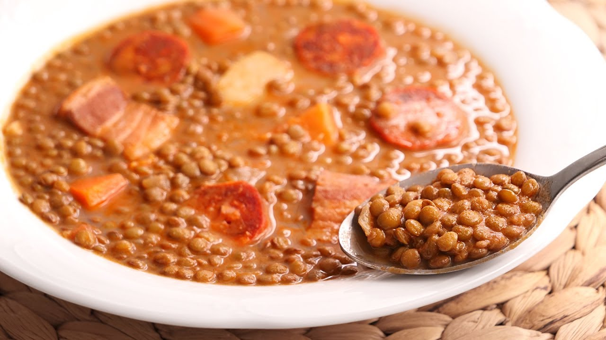

> 📺 **Vídeo Oficial de Elaboración:** [Ver en YouTube: Lentejas con Chorizo muy fáciles y súper deliciosas 😋💕](https://www.youtube.com/watch?v=7nLT6nmxMjE)


> [!NOTE]
> El gran secreto por el que las lentejas de Carmen son legendarias radica en su **majado de mortero final**: ajos fritos en su punto sin quemar, una rebanada de pan frito dorado en AOVE, comino en grano tostado al momento y perejil fresco machacado con un cazo del propio caldo. Este majado emulsiona el caldo al instante, aporta un brillo aterciopelado y evita cualquier pesadez digestiva.

```
                    ┌───────────────────────────────┐
                    │  LENTEJAS PARDINAS DE CARMEN  │
                    │   ESTRUCTURA DE COCCIÓN       │
                    └───────────────┬───────────────┘
                                    │
           ┌────────────────────────┴────────────────────────┐
           ▼                                                 ▼
┌──────────────────────┐                          ┌──────────────────────┐
│  SELLADO Y FONDO     │                          │    MAJADO SECRETO    │
│ Costilla de cerdo    │                          │ Dientes de ajo fritos│
│ Chorizo oreado       │                          │ Pan candeal frito    │
│ Sofrito cebolla/puerro                          │ Comino tostado mortero│
│ Pimentón de la Vera  │                          │ Emulsión con caldo   │
└──────────────────────┘                          └──────────────────────┘
```

### 📋 Ficha Resumen
| Parámetro | Valor |
| :--- | :--- |
| **Tiempo de Remojo** | Opcional (1 hora en agua fría) o cocción directa |
| **Tiempo de Cocción** | 45-50 min (Olla tradicional) / 15-18 min (Olla exprés rápida) |
| **Dificultad** | Baja-Media |
| **Raciones** | 4-6 personas (aprox. 420 g por ración con carne) |
| **Coste Estimado** | Muy Económico (4,60 € total / 0,92 € por ración) |

---

### ⚠️ Tabla de Alérgenos (Reglamento UE 1169/2011)

| Alérgeno | Estado | Ingrediente Causante / Medida de Adaptación |
| :--- | :---: | :--- |
| **Gluten** | 🔴 **PRESENTE** | Pan candeal frito del majado. *Adaptación: usar pan tostado sin gluten o espesar triturando unas pocas lentejas con zanahoria.* |
| **Sulfitos** | 🟡 **TRAZAS** | Posible presencia en el chorizo curado según fabricante. *Revisar etiquetado.* |
| **Lácteos / Huevos / Soja** | 🟢 AUSENTE | Formulación tradicional limpia. |
| **Frutos de Cáscara / Pescado** | 🟢 AUSENTE | Sin frutos secos ni ingredientes marinos. |

---

### ⚖️ Ingredientes Exactos


#### Base de Legumbres y Cárnicos
* **350 g** Lentejas pardinas de Tierra de Campos (o IGP Lenteja de la Armuña).
* **300 g** Costilla de cerdo fresca troceada en bocados individuales.
* **1 unidad (120 g)** Chorizo dulce oreado artesano de pueblo (cortado en rodajas gruesas).
* **1 trozo (60 g)** Panceta fresca de cerdo o tocino entreverado ibérico.
* **1 hueso pequeño (50 g)** Hueso de jamón ibérico bien lavado.

#### Verduras y Aromáticos
* **1 unidad (140 g)** Cebolla dulce picada en brunoise fina.
* **1 unidad (80 g)** Puerro (solo la parte blanca) picado fino.
* **1 unidad (60 g)** Pimiento verde italiano limpio en trozos pequeños.
* **2 unidades (160 g)** Zanahorias peladas y cortadas en rodajas de 0,5 cm.
* **1 unidad grande (200 g)** Patata monalisa o agria chascada en trozos medianos.
* **2 hojas** Laurel seco seleccionado.
* **1 cucharadita colmada (5 g)** Pimentón dulce de la Vera con D.O.P.
* **1.200 ml** Agua fría mineral o caldo suave de verduras/huesos.
* **45 ml** Aceite de Oliva Virgen Extra (AOVE) variedad Picual.
* **5 g** Sal marina fina (ajustar al final tras reducir el caldo).

#### Majado Secreto de Carmen
* **3 dientes** Ajo morado de Las Pedroñeras pelados.
* **1 rebanada (25 g)** Pan candeal o de hogaza asentado del día anterior.
* **1/2 cucharadita (2 g)** Comino en grano entero.
* **4 ramas** Perejil fresco de hoja lisa (solo las hojas limpias).
* **1 cazo (80 ml)** Caldo caliente de la cocción de las lentejas.

---

### 🍳 Equipamiento Necesario
* Cazuela de fondo grueso (Ø 26-28 cm) de acero o hierro colado.
* Sartén pequeña para dorar el pan y los ajos del majado.
* Mortero tradicional de mármol o madera de olivo con maza.
* Espumadera de alambre para retirar impurezas.
* Cuchillo cebollero bien afilado y tabla de corte.

---

### 👨‍🍳 Paso a Paso Técnico y Minucioso


1. **Sellado de Carnes y Base Grasa:**
   * En la cazuela amplia, verter los 45 ml de AOVE a fuego medio-alto. Incorporar los trozos de costilla sazonados con una pizca de sal y la panceta en dados. Dorar durante 5-6 minutos hasta que adquieran una costra dorada y liberen sus jugos grasos.
   * Añadir las rodajas de chorizo, voltear durante 1 minuto para que suelten su pimentón natural sin quemarlo, y retirar todo a un plato reservándolo.
2. **Pochado Lento de Verduras:**
   * En la misma grasa residual de la cazuela (fuego medio-bajo), añadir la cebolla dulce, el puerro y el pimiento verde con una pizca de sal para favorecer la sudoración.
   * Pochar pacientemente durante 8-10 minutos hasta que la cebolla esté transparente y comience a dorarse en los bordes.
   * Retirar la cazuela del fuego unos segundos, agregar los 5 g de pimentón de la Vera, remover rápidamente durante 10 segundos para tostarlo con el calor residual y reintegrar inmediatamente a la hornilla con las zanahorias y el laurel.
3. **Incorporación de Legumbres y Cocción Inicial:**
   * Lavar las lentejas bajo el grifo de agua fría en un colador y agregarlas a la cazuela junto con las carnes reservadas (costilla, panceta y chorizo) y el hueso de jamón.
   * Cubrir con los 1.200 ml de agua mineral fría (el agua debe sobrepasar las lentejas unos 3 dedos).
   * Llevar a ebullición a fuego vivo. En cuanto rompa a hervir, bajar el fuego a suave (*chup-chup* constante con tapa entreabierta a 88-90°C) y espumar meticulosamente durante los primeros 10 minutos para retirar impurezas y exceso de grasa superficial.
4. **Adición de la Patata Chascada:**
   * A los 25 minutos de cocción, incorporar la patata chascada a cuchillo (hundir la hoja y quebrar la patata para que libere su amilopectina libre en el caldo).
5. **Elaboración del Majado Secreto de Carmen:**
   * Mientras se cuecen las patatas, calentar un chorrito de AOVE en la sartén pequeña. Freír los 3 dientes de ajo enteros y la rebanada de pan candeal hasta que queden dorados y crujientes por ambas caras. Escurrir.
   * En el mortero, añadir los granos de comino con una pizca de sal gorda y machacar hasta reducirlos a polvo fino. Añadir los ajos fritos tiernos y las hojas de perejil fresco; majar hasta formar una pasta verde homogénea.
   * Añadir el pan frito crujiente y machacar con energía hasta integrarlo.
   * Verter un cazo del caldo hirviendo de las lentejas directamente en el mortero, remover con la maza para emulsionar la pasta y verter todo el contenido en la cazuela de las lentejas.
6. **Cocción Final, Espesado y Reposo:**
   * Remover la cazuela con movimientos de vaivén por las asas (evitar meter cucharas metálicas agresivas para no romper las lentejas ni deshacer la patata).
   * Cocinar a fuego muy suave durante 10-12 minutos más hasta que la lenteja y la patata estén como mantequilla y el caldo haya adquirido una textura ligada y densa.
   * Probar el punto de sal y rectificar si es necesario. Apagar el fuego y **dejar reposar 15 minutos tapado** antes de servir.

---

### 📦 Protocolo de Conservación y Batch Cooking

> [!IMPORTANT]
> Las lentejas son ideales para preparar en grandes cantidades semanales, pero si vas a congelar, retira las patatas previamente ya que pierden su estructura coloidal y quedan acuosas y harinosas.

* **Refrigeración (0°C a 4°C):** En táper hermético de cristal, conservan su calidad óptima durante **4 a 5 días**. El caldo espesará ligeramente por absorción; añadir un chorrito de caldo o agua tibia al calentar.
* **Congelación (-18°C):** Congelar en raciones individuales sin patata hasta por **3 meses**. Descongelar en refrigeración 12 horas antes de regenerar.

---

### 🔥 Guía de Regeneración Multicanal

* **Cazuela Tradicional (Método Maestro):** Verter la ración en un cazo con 30-40 ml de agua o caldo suave. Calentar a fuego lento tapado durante 4-5 minutos, agitando en vaivén hasta que recupere el hervor suave.
* **Microondas:** Servir en plato hondo de cerámica, tapar con campana de microondas y calentar a 650W durante 2 minutos, remover el centro y dar un golpe final de 1 minuto a 750W.

---

### 💡 Secretos del Chef y Errores Críticos a Evitar

* ❌ **Error Crítico:** Hervir a borbotones violentos. La piel de la lenteja pardina se desprenderá flotando en el caldo y el grano quedará arenoso.
* ✔️ **El Truco de Carmen:** Si el caldo ha quedado demasiado líquido por exceso de agua, no añadas harina: saca un cazo con media patata, un trozo de zanahoria y 2 cucharadas de lentejas, tritúralo con la batidora e incorpóralo de nuevo al guiso.

---

### 🍷 Maridaje Tradicional
* **Vino:** Tinto joven de la D.O. Ribera del Duero o D.O. Toro (Tempranillo / Tinta de Toro).
* **Guarnición:** Guindillas verdes encurtidas en vinagre (piparras) y hogaza de pan de masa madre de corteza crujiente.

---

## 2. 🍲 Fabada Rápida Casera con Compango Asturiano
*Categoría: Legumbre Asturiana / Cocción de Alta Eficiencia con Sabor Auténtico*

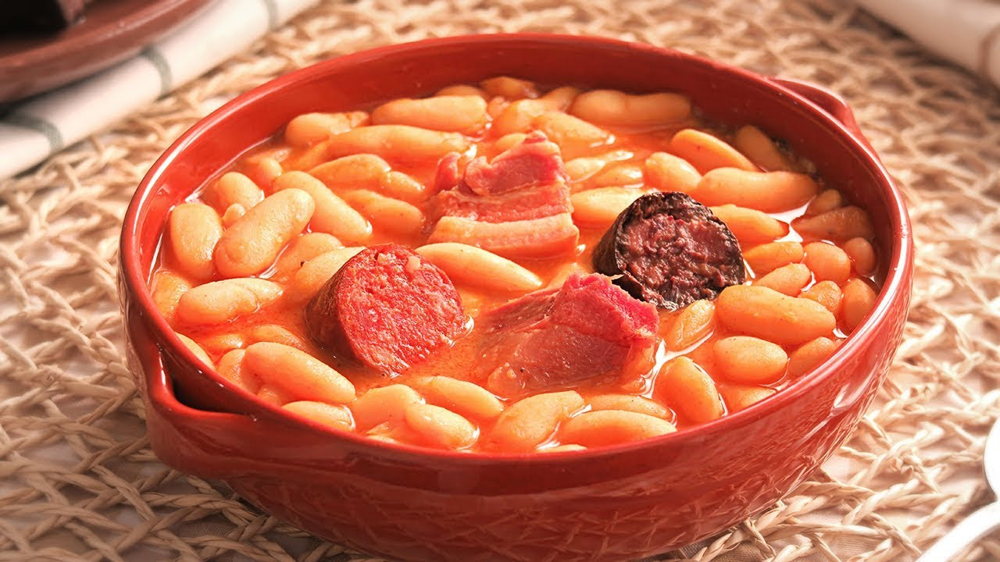

> 📺 **Vídeo Oficial de Elaboración:** [Ver en YouTube: Fabada Asturiana | Receta Tradicional Auténtica](https://www.youtube.com/watch?v=NvhuoE8ENGQ)


> [!TIP]
> Para disfrutar de una fabada sublime sin necesidad de cocerla durante 4 horas en festivos, Carmen recurre al secreto de un compango ahumado de máxima pureza cocinado en un fondo desgrasado, combinado con un azafrán en hebra tostado en papel de aluminio que tiñe las fabes de un tono oro rojizo inconfundible.

```
                    ┌───────────────────────────────┐
                    │     FABADA RÁPIDA CASERA      │
                    │    EQUILIBRIO Y COMPANGO      │
                    └───────────────┬───────────────┘
                                    │
           ┌────────────────────────┴────────────────────────┐
           ▼                                                 ▼
┌──────────────────────┐                          ┌──────────────────────┐
│  DESGRASADO PREVIO   │                          │   LIGAZÓN NATURAL    │
│ Pinchado de embutidos│                          │ Vaivén de cazuela    │
│ Escaldado del lacón  │                          │ Almidón de la faba   │
│ Fuego a 85°C         │                          │ Azafrán infusionado  │
└──────────────────────┘                          └──────────────────────┘
```

### 📋 Ficha Resumen
| Parámetro | Valor |
| :--- | :--- |
| **Tiempo de Preparación** | 15 minutos (+ 12 h remojo en faba seca / 0 min en faba cocida artesanal) |
| **Tiempo de Cocción** | 35-40 minutos (olla rápida) o 25 minutos con faba artesana de tarro |
| **Dificultad** | Baja |
| **Raciones** | 4 personas (aprox. 450 g por ración con compango) |
| **Coste Estimado** | Medio (7,80 € total / 1,95 € por ración) |

---

### ⚠️ Tabla de Alérgenos (Reglamento UE 1169/2011)

| Alérgeno | Estado | Ingrediente Causante / Medida de Adaptación |
| :--- | :---: | :--- |
| **Sulfitos** | 🟡 **TRAZAS** | Presente comúnmente en el chorizo y morcilla curados del compango asturiano. |
| **Gluten / Lácteos / Huevos** | 🟢 AUSENTE | Receta 100% libre de gluten de forma natural. |
| **Pescado / Crustáceos / Soja** | 🟢 AUSENTE | Sin ingredientes marinos ni soja. |

---

### ⚖️ Ingredientes Exactos


#### Faba y Compango Asturiano
* **500 g** Fabes asturianas secas con I.G.P. Faba Asturiana (o 2 tarros de 540 g de fabes cocidas artesanas de granja).
* **2 unidades** Chorizos asturianos ahumados con leña de roble.
* **2 unidades** Morcillas asturianas ahumadas de cebolla.
* **150 g** Lacón curado asturiano o jamón curado en taco.
* **150 g** Tocino blanco entreverado salado curado (panceta curada).

#### Aromáticos y Fondo
* **1 unidad (150 g)** Cebolla entera blanca pelada (claveteada con 2 clavos de olor opcionales).
* **2 dientes** Ajo morado enteros aplastados con piel.
* **1 hoja** Laurel fresco seco.
* **1 pizca generosa (12-15 hebras)** Azafrán español tostado.
* **1 cucharadita (4 g)** Pimentón dulce ahumado asturiano o de la Vera.
* **1.500 ml** Agua mineral blanda fría (muy importante: baja en cal).
* **20 ml** AOVE virgen extra suave.
* **3 g** Sal gruesa (incorporar solo al final).

---

### 🍳 Equipamiento Necesario
* Olla exprés rápida superrápida de 6 litros o cazuela ancha baja de barro/hierro colado.
* Papel de aluminio para tostar el azafrán.
* Palillo de madera para pinchar los embutidos.

---

### 👨‍🍳 Paso a Paso Técnico y Minucioso

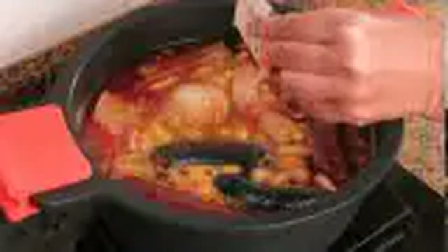

1. **Remojo Osmótico de las Fabes:**
   * Si se usa faba seca: disponer los 500 g de fabes en un bol hondo amplio con abundante agua mineral fría (3 partes de agua por 1 de legumbre). Dejar hidratar durante **12 a 14 horas**. Al terminar, escurrir con delicadeza sin apretarlas.
2. **Tratamiento Técnico del Compango (Prevención de Roturas y Exceso Graso):**
   * Poner a remojo el trozo de lacón en agua tibia desde la noche anterior para desalinizualo equilibradamente.
   * Pinchar los chorizos y las morcillas en 3 o 4 puntos con un palillo para permitir la salida paulatina de vapor interno durante la cocción sin que revienten ni desintegren el caldo.
3. **Montaje de la Olla y Cocción Controlada:**
   * En la olla, colocar en el fondo las fabes escurridas.
   * Acomodar encima el compango ordenado: chorizos, morcillas, lacón y tocino entreverado.
   * Añadir la cebolla entera pelada, los 2 dientes de ajo aplastados, la hoja de laurel y los 20 ml de AOVE.
   * Cubrir con agua mineral fría de modo que sobrepase dos dedos el nivel de las fabes.
4. **Espumado y Asustado de la Faba:**
   * Llevar a ebullición viva destapado. En cuanto comience a borbotear, retirar pacientemente toda la espuma blanca y grasa espesa que se acumula en los bordes con la espumadera durante 5 minutos.
   * "Asustar" las fabes virtiendo 60 ml de agua helada en los laterales de la olla para romper el hervor. Repetir esta operación 2 veces.
5. **Infusión de Azafrán y Cierre de Olla Rápida:**
   * Envolver las hebras de azafrán en un cuadrado de papel de aluminio y calentarlo suavemente durante 10 segundos sobre la tapa de la olla caliente. Machacar con los dedos y disolver en una tacita con 30 ml de caldo tibio; verter en la olla junto con la cucharadita de pimentón dulce.
   * Si se usa **olla exprés superrápida**: cerrar la tapa hermética, elevar a la posición 2 de presión y cocinar durante **18-20 minutos** exactos a fuego suave. Despresurizar de forma natural sin forzar la válvula.
   * Si se hace en **cazuela tradicional**: cocinar a fuego mínimo (*chup-chup* suave) durante **2 horas y media**, asustando cada 45 minutos.
6. **Ligado de la Salsa y Desgrase:**
   * Abrir la olla. Retirar la cebolla y los ajos (se pueden desechar o triturar 2 cucharadas de faba con un trocito de cebolla para devolverlo al caldo).
   * Sacar las piezas de compango a una tabla para cortarlas en porciones limpias.
   * Agitar la cazuela por las asas con movimientos circulares lentos durante 3 minutos: el almidón superficial de las fabes emulsionará de inmediato con el colágeno del lacón y el azafrán, creando una crema dorada densa.
   * Dejar reposar 20 minutos antes de emplatar.

---

### 📦 Protocolo de Conservación y Batch Cooking

* **Refrigeración (0°C a 4°C):** Aguanta en condiciones impecables hasta **4 días**. De hecho, al día siguiente la faba habrá absorbido todos los matices ahumados del compango.
* **Congelación:** Se puede congelar hasta por **2 meses** en recipientes rígidos con abundante caldo para proteger el grano de la quemadura por frío.

---

### 🔥 Guía de Regeneración Multicanal

* **Cazuela a Fuego Manso (Óptimo):** Calentar a fuego mínimo sin usar cuchara; mover únicamente en vaivén por las asas durante 6 minutos.

---

### 💡 Secretos del Chef y Errores Críticos a Evitar

* ❌ **Error Crítico:** Remover la fabada con cuchara metálica. Romperá la delicada piel de la faba asturiana, convirtiendo el plato en un puré grumoso.
* ✔️ **El Truco de Carmen:** Si el compango aporta demasiada grasa flotante, dejar templar la olla 10 minutos y retirar el exceso de aceite rojizo con un cazo plano apoyado en la superficie.

---

### 🍷 Maridaje Tradicional
* **Bebida:** Sidra natural asturiana escanciada fresca (o vino tinto joven de Cangas).
* **Acompañamiento:** Pan de escanda o pan rústico de leña.

---

## 3. 🐟 Potaje de Garbanzos con Bacalao y Espinacas Frescas (Vigilia)
*Categoría: Cocina de Cuaresma / Potaje Marinero Conventual*


> 📺 **Vídeo Oficial de Elaboración:** [Ver en YouTube: Garbanzos con Bacalao y Espinacas - Potaje Fácil, Rápido y Delicioso](https://www.youtube.com/watch?v=dTxbi-ma7zQ)


> [!NOTE]
> El secreto de la cremosidad de este clásico de vigilia está en dos pasos magistrales de Carmen: cocinar los garbanzos en un caldo corto elaborado con la piel y espinas del bacalao (rico en gelatina marina natural) y ligar el potaje final con un majado de almendras tostadas, ajo frito y la yema de un huevo cocido.

```
                    ┌───────────────────────────────┐
                    │       POTAJE DE VIGILIA       │
                    │   EMULSIÓN DE HUERTA Y MAR    │
                    └───────────────┬───────────────┘
                                    │
           ┌────────────────────────┴────────────────────────┐
           ▼                                                 ▼
┌──────────────────────┐                          ┌──────────────────────┐
│     FONDO MARINO     │                          │    MAJADO Y YEMA     │
│ Pieles y recortes    │                          │ Almendras tostadas   │
│ Gelatina de bacalao  │                          │ Ajo frito + perejil  │
│ Garbanzo en caliente │                          │ Yema cocida coloidal │
└──────────────────────┘                          └──────────────────────┘
```

### 📋 Ficha Resumen
| Parámetro | Valor |
| :--- | :--- |
| **Tiempo de Remojo** | 12 horas (garbanzos en agua tibia con sal) |
| **Tiempo de Cocción** | 60 min (tradicional) / 25 min (olla rápida) |
| **Dificultad** | Media |
| **Raciones** | 4-5 personas (aprox. 400 g por ración) |
| **Coste Estimado** | Medio (6,90 € total / 1,38 € por ración) |

---

### ⚠️ Tabla de Alérgenos (Reglamento UE 1169/2011)

| Alérgeno | Estado | Ingrediente Causante / Medida de Adaptación |
| :--- | :---: | :--- |
| **Pescado** | 🔴 **PRESENTE** | Bacalao desalado y fondo de espinas. |
| **Huevos** | 🔴 **PRESENTE** | Huevo duro (yema en majado y clara en guarnición). |
| **Frutos de Cáscara** | 🔴 **PRESENTE** | Almendras tostadas del majado. *Adaptación: sustituir por semillas de girasol tostadas.* |
| **Gluten** | 🔴 **PRESENTE** | Pan frito del majado. *Sustituir por pan sin gluten.* |
| **Lácteos / Soja / Sulfitos** | 🟢 AUSENTE | Formulación tradicional limpia. |

---

### ⚖️ Ingredientes Exactos


#### Garbanzos y Bacalao
* **400 g** Garbanzos castellanos o pedrosillanos secos.
* **350 g** Bacalao desalado de primera calidad (lomos y trozos con piel).
* **300 g** Espinacas frescas de hoja limpia (sin tallos gruesos).

#### Sofrito y Fondo
* **1 unidad (150 g)** Cebolla dulce picada muy fina.
* **2 dientes** Ajo morado picados en láminas.
* **1 unidad (120 g)** Tomate maduro rallado sin piel.
* **1 cucharadita (4 g)** Pimentón dulce de la Vera.
* **1 hoja** Laurel.
* **50 ml** Aceite de Oliva Virgen Extra (AOVE).
* **1.200 ml** Caldo de pescado suave o agua caliente.

#### Majado Conventual de Carmen
* **12 unidades (20 g)** Almendras crudas peladas.
* **2 dientes** Ajo enteros.
* **1 rebanada (20 g)** Pan candeal frito.
* **2 unidades** Huevos cocidos durante 9 minutos (separar yemas para majado y picar claras).
* **1 ramita** Perejil fresco.

---

### 👨‍🍳 Paso a Paso Técnico y Minucioso

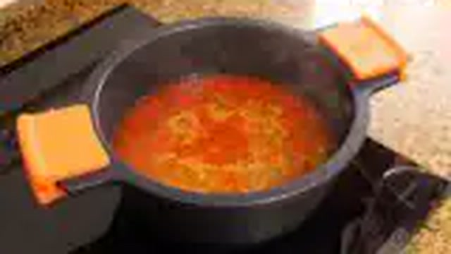

1. **Remojo e Inicio Térmico de los Garbanzos:**
   * Remojar los 400 g de garbanzos en agua templada con 5 g de sal gorda durante 12 horas.
   * En la olla, calentar los 1.200 ml de agua o caldo suave hasta ebullición franca. Incorporar los garbanzos escurridos con una hoja de laurel y media cebolla. Mantener cocción suave durante 20 minutos en olla rápida (o 50 minutos en cazuela).
2. **El Sofrito Marino y Cocinado de Espinacas:**
   * En una cazuela ancha, calentar los 50 ml de AOVE. Pochar la cebolla picada y los ajos durante 8 minutos hasta que caramelicen.
   * Añadir el tomate rallado y sofreír hasta que reduzca a una pasta densa. Agregar el pimentón de la Vera fuera del fuego y remover.
   * Incorporar las espinacas frescas cortadas groseramente. En apenas 2 minutos perderán su volumen al contacto con el sofrito.
3. **El Majado de Almendras y Yemas:**
   * En una sartén pequeña, dorar las almendras, los 2 dientes de ajo y la rebanada de pan en un chorro de AOVE.
   * En el mortero, machacar las almendras tostadas con los ajos fritos, el pan frito y el perejil. Incorporar las 2 yemas de huevo duro cocido y trabajar hasta lograr una crema espesa. Disolver con un cazo de caldo caliente.
4. **Integración del Bacalao y Emulsión:**
   * Verter los garbanzos cocidos con su caldo caliente sobre la cazuela del sofrito con espinacas.
   * Añadir el majado del mortero y remover en vaivén.
   * Incorporar los trozos de bacalao desalado con la piel hacia arriba en los últimos **5 a 7 minutos de cocción**. El calor suave cocinará el bacalao en su punto perfecto sin secarlo y liberará su gelatina.
5. **Acabado y Reposo:**
   * Decorar con las claras de huevo duro picadas en cubitos pequeños.
   * Reposar 10 minutos antes de servir.

---

### 📦 Protocolo de Conservación y Batch Cooking

* **Refrigeración:** Aguanta **3 días** a 3°C. Al recalentar, hacerlo muy suavemente para no pasar de cocción el bacalao.
* **Congelación:** Se recomienda congelar sin el huevo duro (la clara congelada adquiere textura gomosa).

---

## 4. 🥩 Cocido Andaluz Tradicional con su Pringá de Tocino, Ternera, Pollo y Chorizo
*Categoría: Monumento de la Cocina Andaluza / Dos Vuelcos y Pringá de Mortero*

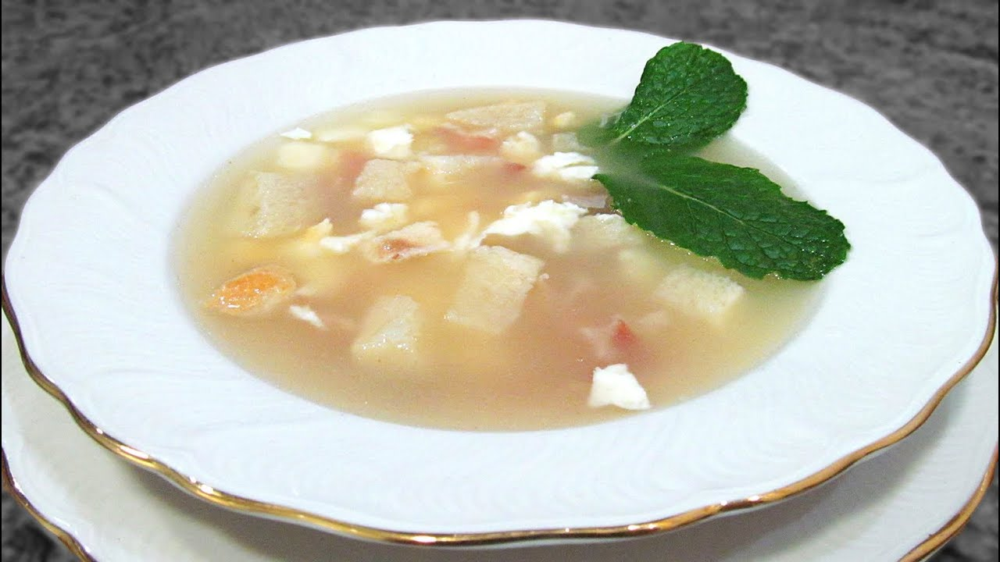

> 📺 **Vídeo Oficial de Elaboración:** [Ver en YouTube: Receta de puchero andaluz](https://www.youtube.com/watch?v=Tzf3zkC6B1U)


> [!NOTE]
> En Andalucía el cocido tiene personalidad propia: se enriquece con calabaza totana y judías verdes planas, logrando un caldo dorado con un sutil contraste dulce. La *pringá* se sirve aparte y se deshace con tenedor o se "pringa" con pan de telera caliente.

```
                    ┌───────────────────────────────┐
                    │    COCIDO TRADICIONAL ANDALUZ │
                    │      LOS DOS VUELCOS          │
                    └───────────────┬───────────────┘
                                    │
           ┌────────────────────────┴────────────────────────┐
           ▼                                                 ▼
┌──────────────────────┐                          ┌──────────────────────┐
│  PRIMER VUELCO: SOPA │                          │ SEGUNDO VUELCO:      │
│ Garbanzo lechoso     │                          │ LA PRINGÁ            │
│ Calabaza y judías    │                          │ Tocino blanco ibérico│
│ Caldo trabado oro    │                          │ Jarrete + Pollo + Ch.│
└──────────────────────┘                          └──────────────────────┘
```

### 📋 Ficha Resumen
| Parámetro | Valor |
| :--- | :--- |
| **Tiempo de Remojo** | 12 horas (garbanzos en agua templada) |
| **Tiempo de Cocción** | 1h 45m (tradicional) / 45 min (olla rápida) |
| **Dificultad** | Media |
| **Raciones** | 6 personas (rendimiento muy generoso) |
| **Coste Estimado** | Económico-Medio (9,20 € total / 1,53 € por ración) |

---

### ⚠️ Tabla de Alérgenos (Reglamento UE 1169/2011)

| Alérgeno | Estado | Ingrediente Causante / Medida de Adaptación |
| :--- | :---: | :--- |
| **Sulfitos** | 🟡 **TRAZAS** | Posibles en el chorizo oreado. |
| **Gluten / Lácteos / Huevos** | 🟢 AUSENTE | Libre de alérgenos comunes (si no se añade fideo al caldo). |

---

### ⚖️ Ingredientes Exactos

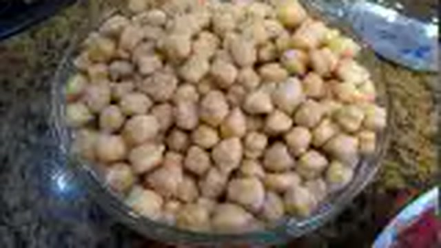

#### Legumbres y Carnes de la Pringá
* **450 g** Garbanzos lechosos andaluces remojados.
* **350 g** Jarrete / morcillo de ternera en trozos grandes.
* **1/2 unidad (400 g)** Pollo campero o gallina (cuarto trasero con piel).
* **150 g** Tocino blanco fresco salado de cerdo ibérico.
* **150 g** Tocino entreverado ibérico curado.
* **1 unidad (120 g)** Chorizo andaluz oreado para cocido.
* **1 trozo (80 g)** Hueso de jamón ibérico curado y blanqueado.
* **1 hueso (70 g)** Hueso blanco de canilla salado lavado.

#### Verduras de la Huerta del Sur
* **250 g** Calabaza dulce pelada cortada en dados grandes (3x3 cm).
* **150 g** Judías verdes planas (bajoqueta) despuntadas y troceadas.
* **2 unidades (180 g)** Patatas medianas chascadas.
* **1 cucharadita (3 g)** Pimentón dulce.
* **1/2 cucharadita** Comino molido (para favorecer digestión).
* **2.500 ml** Agua mineral limpia.
* **6 g** Sal marina.

---

### 👨‍🍳 Paso a Paso Técnico y Minucioso

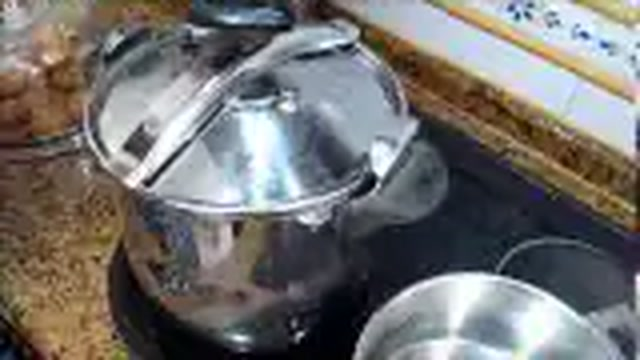

1. **El Fondo Noble y Extracción de Carnes:**
   * En una olla grande de 8 litros, introducir el morcillo de ternera, el pollo, el tocino blanco, el tocino entreverado, el hueso de jamón y el hueso blanco con los 2.500 ml de agua fría.
   * Poner a fuego fuerte. Al romper el hervor, espumar de manera constante y exhaustiva durante 12-15 minutos para retirar cualquier residuo de sangre coagulada.
2. **Entrada de Garbanzos en Agua Hirviendo:**
   * Cuando el caldo esté perfectamente limpio y hirviendo a borbotones, añadir los 450 g de garbanzos escurridos (templados, nunca sacados directamente de la nevera).
   * Bajar el fuego a medio-bajo, tapar la olla y cocinar durante **1 hora** (o 25 minutos en olla exprés).
3. **Incorporación de Verduras y Embutidos:**
   * Abrir la olla, incorporar el chorizo, las judías verdes planas, las patatas chascadas y los dados de calabaza.
   * Añadir el comino molido y el pimentón dulce disuelto en un poco de caldo.
   * Cocinar durante **25-30 minutos más** a fuego lento hasta que los garbanzos y la calabaza estén tiernos y melosos. Probar y rectificar de sal.
4. **Servicio y Majado de la Pringá:**
   * **Primer Vuelco:** Servir en plato hondo los garbanzos con su caldo trabado, las patatas, las judías verdes y la calabaza tierna.
   * **Segundo Vuelco:** Servir en una fuente central las carnes calientes (ternera, pollo, tocinos y chorizo). Con dos tenedores, desmenuzar y mezclar todo hasta obtener la auténtica pasta de pringá andaluza para untar en pan crujiente.

---

## 5. 🫘 Alubias Blancas Estofadas con Verduras de la Huerta y Panceta Ibérica
*Categoría: Estofado Campesino / Guiso Suave y Untuoso*

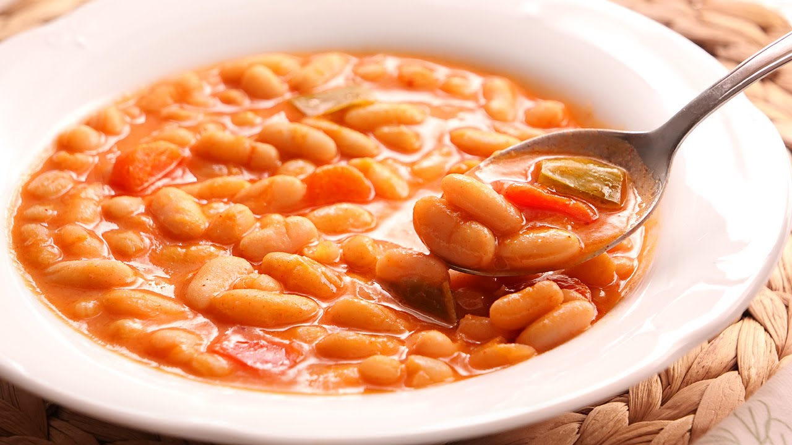

> 📺 **Vídeo Oficial de Elaboración:** [Ver en YouTube: Judías Blancas con Verduras súper Fáciles y Deliciosas - Alubias](https://www.youtube.com/watch?v=ICbt1w6_XO0)


> [!TIP]
> Para conseguir que las alubias queden con un caldo espeso y aterciopelado sin necesidad de compangos pesados, Carmen sofríe puerro, pimiento y zanahoria, y tritura una porción de las verduras con medio cazo de alubias cocidas para devolverlo a la cazuela en el tramo final.

```
                    ┌───────────────────────────────┐
                    │   ALUBIAS BLANCAS ESTOFADAS   │
                    │   LIGAZÓN DE HUERTA NATURAL   │
                    └───────────────┬───────────────┘
                                    │
           ┌────────────────────────┴────────────────────────┐
           ▼                                                 ▼
┌──────────────────────┐                          ┌──────────────────────┐
│  ESTOFADO EN FRÍO    │                          │  TRITURADO VEGETAL   │
│ Alubia de riñón blanda                          │ Zanahoria + Puerro   │
│ Panceta ibérica      │                          │ + 1 cazo de alubias  │
│ Laurel y pimentón    │                          │ Reincorporación 100% │
└──────────────────────┘                          └──────────────────────┘
```

### 📋 Ficha Resumen
| Parámetro | Valor |
| :--- | :--- |
| **Tiempo de Remojo** | 10-12 horas en agua fría |
| **Tiempo de Cocción** | 1h 15m (cazuela) / 22 min (olla rápida) |
| **Dificultad** | Baja |
| **Raciones** | 4 personas (aprox. 380 g por ración) |
| **Coste Estimado** | Muy Económico (3,90 € total / 0,97 € por ración) |

---

### ⚠️ Tabla de Alérgenos (Reglamento UE 1169/2011)

| Alérgeno | Estado | Ingrediente Causante / Medida de Adaptación |
| :--- | :---: | :--- |
| **Gluten / Lácteos / Huevos / Soja** | 🟢 AUSENTE | Formulación naturalmente limpia. |
| **Sulfitos** | 🟢 AUSENTE | Sin embutidos sulfitados añadidos. |

---

### ⚖️ Ingredientes Exactos

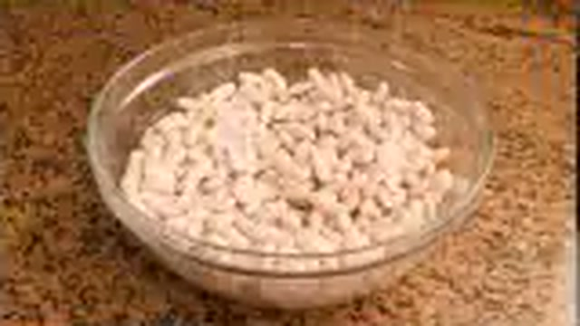
* **400 g** Alubias blancas de riñón o alubia arrocina seca (remojada 12 h).
* **200 g** Panceta fresca ibérica cortada en tacos medianos.
* **1 unidad (140 g)** Cebolla dulce entera.
* **1 unidad (90 g)** Puerro limpio (parte blanca).
* **1 unidad (70 g)** Pimiento verde italiano.
* **1 unidad (70 g)** Pimiento rojo carnoso.
* **2 unidades (160 g)** Zanahorias peladas enteras.
* **3 dientes** Ajo enteros con piel aplastados.
* **2 hojas** Laurel seco.
* **1 cucharadita (4 g)** Pimentón dulce de la Vera.
* **40 ml** AOVE virgen extra.
* **1.300 ml** Agua mineral blanda fría.
* **5 g** Sal fina.

---

### 👨‍🍳 Paso a Paso Técnico y Minucioso


1. **Montaje en Frío (*Estofado a la Antigua*):**
   * En la cazuela, colocar las alubias escurridas, los tacos de panceta ibérica, la cebolla entera pelada, el puerro, los pimientos enteros, las zanahorias, los ajos y el laurel.
   * Cubrir con el agua mineral fría y regar con los 40 ml de AOVE y el pimentón dulce.
2. **Cocción y Doble Asustado:**
   * Llevar a ebullición a fuego medio. En cuanto rompa a hervir, bajar el fuego y espumar durante 8 minutos.
   * Asustar las alubias virtiendo 50 ml de agua helada en dos ocasiones separadas por 20 minutos de intervalo.
3. **Triturado Ligador:**
   * Cuando las verduras estén tiernas (a los 45 minutos), retirar a un vaso batidor la cebolla, el puerro, los pimientos, una de las zanahorias y 1 cazo de alubias cocidas con un poco de caldo.
   * Triturar hasta formar una crema fina y suave. Verter de nuevo en la cazuela.
4. **Acabado:**
   * Cortar la otra zanahoria en rodajas finas y dejarla en el guiso.
   * Cocinar todo junto a fuego muy suave durante 10 minutos más para integrar los sabores. Añadir la sal en este momento final.

---

## 6. 🔥 Garbanzos con Callos y Morro a la Madrileña
*Categoría: Casquería Clásica / Concentrado de Colágeno y Tradición Tabernera*

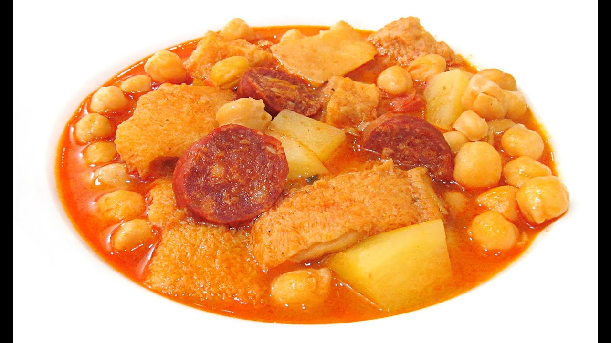

> 📺 **Vídeo Oficial de Elaboración:** [Ver en YouTube: Callos con Garbanzos](https://www.youtube.com/watch?v=cBHUTBzfYtE)


> [!NOTE]
> El secreto de unos callos con garbanzos sublimes radica en la melosidad extrema lograda mediante la cocción prolongada de la pata y el morro de ternera. El caldo no necesita almidones añadidos: su propia densidad gelifica al enfriar y acaricia el paladar al degustarse bien caliente.

```
                    ┌───────────────────────────────┐
                    │   GARBANZOS CON CALLOS/MORRO  │
                    │   FUSIÓN DE GELATINA PURA     │
                    └───────────────┬───────────────┘
                                    │
           ┌────────────────────────┴────────────────────────┐
           ▼                                                 ▼
┌──────────────────────┐                          ┌──────────────────────┐
│  COCCIÓN DE CASQUERÍA│                          │   SOFRITO TABERNERO  │
│ Callos + Pata + Morro│                          │ Cebolla + Ajo morado │
│ Cocción a baja temp. │                          │ Pimentón D/P + Guind.│
│ Colágeno disuelto    │                          │ Fusión con garbanzo  │
└──────────────────────┘                          └──────────────────────┘
```

### 📋 Ficha Resumen
| Parámetro | Valor |
| :--- | :--- |
| **Tiempo de Remojo** | 12 h garbanzos / Blanqueado de casquería |
| **Tiempo de Cocción** | 2h 30m (tradicional) / 50 min (olla rápida) |
| **Dificultad** | Media-Alta |
| **Raciones** | 6 personas |
| **Coste Estimado** | Económico (7,20 € total / 1,20 € por ración) |

---

### ⚠️ Tabla de Alérgenos (Reglamento UE 1169/2011)

| Alérgeno | Estado | Ingrediente Causante / Medida de Adaptación |
| :--- | :---: | :--- |
| **Sulfitos** | 🟡 **TRAZAS** | En morcilla y chorizo asturiano/madrileño. |
| **Gluten** | 🟡 **OPCIONAL** | Si se utiliza una cucharada de harina en el sofrito (se puede omitir totalmente ya que la gelatina de la pata traba sola). |

---

### ⚖️ Ingredientes Exactos

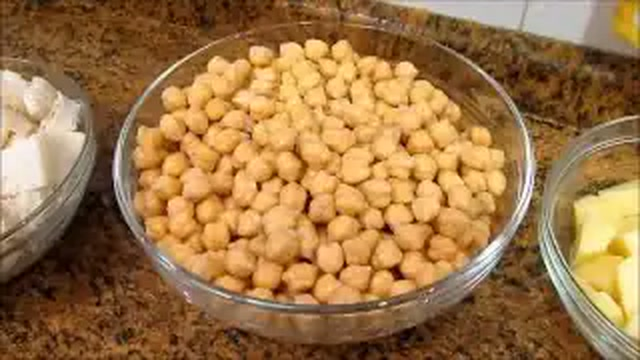
* **400 g** Garbanzos pedrosillanos o castellanos remojados en agua tibia.
* **500 g** Callos de ternera (toalla/panza) limpios y cortados en cuadros de 3x3 cm.
* **300 g** Morro de ternera limpio en trozos.
* **1/2 unidad** Pata de ternera fresca limpia (el gran secreto del colágeno).
* **1 unidad (120 g)** Chorizo curado asturiano o de cantimpalo.
* **1 unidad (120 g)** Morcilla asturiana de cebolla.
* **100 g** Punta de jamón serrano curado en dados.
* **1 unidad (150 g)** Cebolla picada muy fina.
* **4 dientes** Ajo morado picados.
* **1 cucharadita (4 g)** Pimentón dulce de la Vera + **1/2 cucharadita (2 g)** Pimentón picante.
* **1 unidad** Guindilla cayena (opcional para toque alegre).
* **2 hojas** Laurel y 4 granos de pimienta negra.
* **50 ml** AOVE virgen extra.
* **1.800 ml** Agua mineral para la cocción.

---

### 👨‍🍳 Paso a Paso Técnico y Minucioso

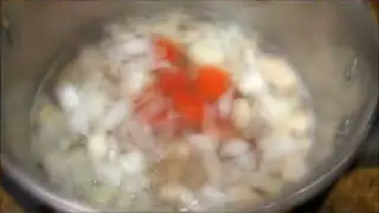

1. **Blanqueado y Cocción de la Casquería:**
   * En una olla amplia, poner los callos, el morro y la pata cubiertos de agua fría con un chorrito de vinagre. Llevar a ebullición durante 3 minutos, desechar por completo esa agua y lavar bien las carnes bajo el grifo de agua fría.
   * Volver a colocar en la olla con agua limpia fría, 1 hoja de laurel, granos de pimienta y la punta de jamón. Cocinar en olla rápida durante 35 minutos (o 1h 45m en olla tradicional) hasta que estén tiernos.
2. **Cocción de Garbanzos en el Caldo Gelatinoso:**
   * Abrir la olla, retirar la pata de ternera, deshuesarla y picar su gelatina devolviéndola al guiso.
   * Llevar el caldo a ebullición viva y agregar los garbanzos remojados escurridos. Cocinar 15 minutos más en olla rápida (o 40 min tradicional).
3. **El Sofrito Tabernero Picante:**
   * En una sartén con los 50 ml de AOVE, pochar la cebolla picada y los ajos con la guindilla hasta que tomen color dorado.
   * Añadir el chorizo y la morcilla en rodajas gruesas y sofreír 1 minuto.
   * Retirar del fuego, agregar el pimentón dulce y picante, remover y verter de inmediato en la cazuela con los callos y garbanzos.
4. **Fusión y Asentado:**
   * Cocinar todo junto a fuego muy suave durante 15 minutos destapado para que el caldo reduzca y alcance su textura untuosa y pegajosa en labios. Reposar mínimo 4 horas (idealmente hasta el día siguiente).

---

## 7. 👑 Judiones de la Granja con Oreja y Chorizo
*Categoría: Gran Legumbre Señorial / Textura Mantecosa Suprema*

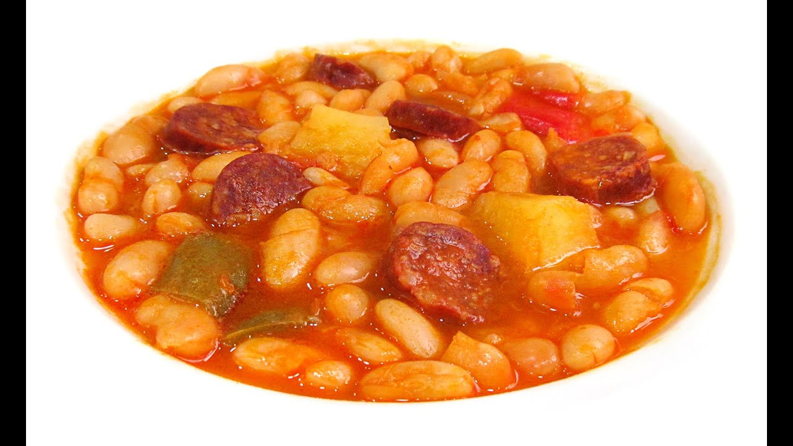

> 📺 **Vídeo Oficial de Elaboración:** [Ver en YouTube: Judías Blancas con Chorizo](https://www.youtube.com/watch?v=bGlmOMdA1hE)


> [!NOTE]
> El judión de San Ildefonso (La Granja) posee un calibre extraordinario y una piel sumamente delicada. Para evitar que la piel se desprenda y el interior quede duro, el secreto de Carmen es cocinarlo a fuego lentísimo (*a fuego de vela*), con tres "asustados" de agua fría y la gelatina sedosa de la oreja de cerdo previamente chamuscada y cocida.

```
                    ┌───────────────────────────────┐
                    │    JUDIONES DE LA GRANJA      │
                    │   MANTECA PURA Y GELATINA     │
                    └───────────────┬───────────────┘
                                    │
           ┌────────────────────────┴────────────────────────┐
           ▼                                                 ▼
┌──────────────────────┐                          ┌──────────────────────┐
│  REMOJO PROLONGADO   │                          │  COCCIÓN A FUEGO VELA│
│ 16-18 h agua blanda  │                          │ Fuego mínimo a 82°C  │
│ Hidratación del núcleo                          │ 3 Asustados helados  │
│ Oreja chamuscada     │                          │ Cero turbulencia     │
└──────────────────────┘                          └──────────────────────┘
```

### 📋 Ficha Resumen
| Parámetro | Valor |
| :--- | :--- |
| **Tiempo de Remojo** | 16-18 horas en agua mineral fría |
| **Tiempo de Cocción** | 2h 45m (cazuela tradicional a fuego manso) |
| **Dificultad** | Media |
| **Raciones** | 4-5 personas |
| **Coste Estimado** | Medio (6,80 € total / 1,36 € por ración) |

---

### ⚠️ Tabla de Alérgenos (Reglamento UE 1169/2011)

| Alérgeno | Estado | Ingrediente Causante / Medida de Adaptación |
| :--- | :---: | :--- |
| **Sulfitos** | 🟡 **TRAZAS** | Presentes en chorizo artesano. |
| **Gluten / Lácteos / Huevos** | 🟢 AUSENTE | Formulación tradicional limpia. |

---

### ⚖️ Ingredientes Exactos


* **450 g** Judiones secos de La Granja (I.G.P. o selección calidad).
* **1 unidad (250 g)** Oreja de cerdo fresca limpia (chamuscada y troceada en bocados de 2x2 cm).
* **2 unidades (180 g)** Chorizo curado artesano de pueblo.
* **1 unidad (120 g)** Morcilla de cebolla o de arroz.
* **100 g** Panceta curada ibérica.
* **1 unidad (140 g)** Cebolla dulce.
* **1 unidad (70 g)** Pimiento verde.
* **3 dientes** Ajo morado enteros.
* **1 cucharada colmada (6 g)** Pimentón dulce de la Vera.
* **1 hoja** Laurel y 2 clavos de olor.
* **45 ml** AOVE.
* **1.600 ml** Agua mineral blanda.
* **5 g** Sal marina.

---

### 👨‍🍳 Paso a Paso Técnico y Minucioso


1. **Remojo Prolongado:**
   * Por su gran volumen celular, sumergir los judiones en agua mineral blanda durante un mínimo de **16 a 18 horas** en lugar fresco.
2. **Puesta en Marcha y Cocción de Oreja:**
   * En cazuela amplia de fondo pesado, colocar los judiones escurridos, la oreja troceada, la panceta, los ajos, la cebolla claveteada con los clavos de olor y el laurel. Cubrir con agua mineral fría.
   * Llevar a ebullición suave y espumar cuidadosamente durante 10 minutos.
3. **Técnica del Triple Asustado a Fuego Manso:**
   * Cortar el hervor con 60 ml de agua helada a los 30 min, a los 60 min y a los 90 min de cocción.
   * Mantener el fuego en el mínimo absoluto (fuego de vela, apenas un temblor en el agua).
4. **El Sofrito de Pimentón y Embutidos:**
   * En una sartén con el AOVE, pochar el pimiento verde picado. Añadir el chorizo y la morcilla en rodajas, sofreír 1 minuto, añadir el pimentón fuera del fuego y volcar todo sobre los judiones a las 2 horas de cocción.
5. **Ligazón y Textura de Mantequilla:**
   * Cocinar los últimos 30-40 minutos agitando la cazuela periódicamente por las asas. El interior del judión debe deshacerse en boca con textura de pura crema sin que la piel exterior se haya desgarrado.
   * Ajustar de sal y reposar 20 minutos tapado.

---

## 8. 🍠 Potaje de Lentejas Castellanas Vegetarianas con Boniato y Verduras
*Categoría: Cuchara Saludable 100% Vegetal / Cocina de Huerta y Otoño*

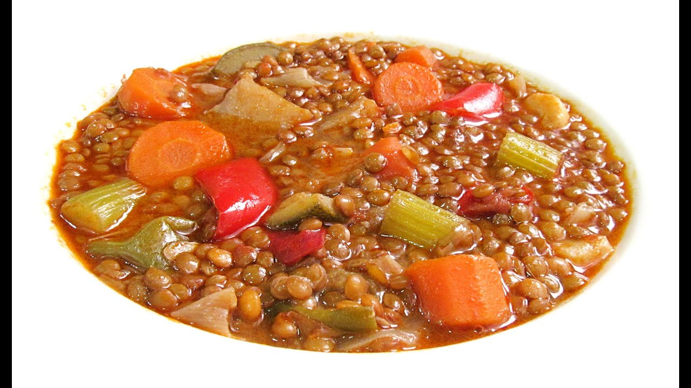

> 📺 **Vídeo Oficial de Elaboración:** [Ver en YouTube: Lentejas con Verduras fáciles y deliciosas](https://www.youtube.com/watch?v=fDQ6aUaww-Q)


> [!TIP]
> Una alternativa vegetal repleta de sabor y cremosidad natural. El secreto de Carmen para dotar a estas lentejas de un cuerpo untuoso sin emplear una gota de grasa animal radica en el uso de boniato chascado (que carameliza y espesa el caldo) combinado con una pulpa de pimiento choricero hidratada y comino tostado.

```
                    ┌───────────────────────────────┐
                    │    LENTEJAS CON BONIATO       │
                    │   CREMOSIDAD 100% VEGETAL     │
                    └───────────────┬───────────────┘
                                    │
           ┌────────────────────────┴────────────────────────┐
           ▼                                                 ▼
┌──────────────────────┐                          ┌──────────────────────┐
│  DULZURA Y FIBRA     │                          │    FONDO AROMÁTICO   │
│ Boniato en trozos    │                          │ Pulpa choricero / ñora│
│ Calabaza y zanahoria │                          │ Comino + Cúrcuma     │
│ Almidón sedoso dulce │                          │ Aceite virgen Arbeq. │
└──────────────────────┘                          └──────────────────────┘
```

### 📋 Ficha Resumen
| Parámetro | Valor |
| :--- | :--- |
| **Tiempo de Remojo** | No requiere (o 30 min en agua fría) |
| **Tiempo de Cocción** | 40-45 min (cazuela) / 14 min (olla rápida) |
| **Dificultad** | Muy Baja |
| **Raciones** | 4 personas (aprox. 390 g por ración) |
| **Coste Estimado** | Muy Económico (3,20 € total / 0,80 € por ración) |

---

### ⚠️ Tabla de Alérgenos (Reglamento UE 1169/2011)

| Alérgeno | Estado | Ingrediente Causante / Medida de Adaptación |
| :--- | :---: | :--- |
| **Apio** | 🟡 **OPCIONAL** | Si se añade una ramita de apio al sofrito de huerta. |
| **Gluten / Lácteos / Huevos / Soja / Sulfitos** | 🟢 AUSENTE | 100% Vegano, Vegetariano y sin alérgenos mayores. |

---

### ⚖️ Ingredientes Exactos

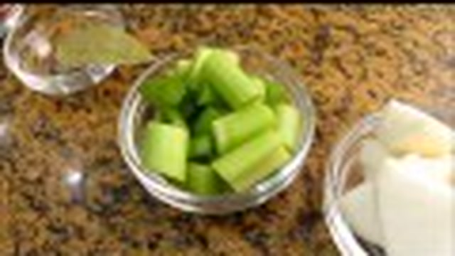
* **350 g** Lentejas castellanas (o pardinas de cultivo ecológico).
* **1 unidad grande (250 g)** Boniato (batata dulce) pelado y chascado en dados medianos.
* **150 g** Calabaza pelada cortada en cubos de 2 cm.
* **2 unidades (160 g)** Zanahorias cortadas en rodajas.
* **1 unidad (120 g)** Puerro (parte blanca) picado.
* **1 unidad (130 g)** Cebolla dulce en brunoise.
* **1 unidad (70 g)** Pimiento rojo dulce picado.
* **100 g** Espinacas frescas tiernas picadas.
* **2 cucharaditas (10 g)** Carne de pimiento choricero o pulpa de ñora hidratada.
* **3 dientes** Ajo morado picados en láminas finas.
* **1 cucharadita** Pimentón ahumado dulce.
* **1/2 cucharadita** Comino molido y 1/4 cucharadita cúrcuma molida.
* **50 ml** Aceite de Oliva Virgen Extra (AOVE) variedad Arbequina.
* **1.200 ml** Caldo de verduras casero o agua mineral.
* **5 g** Sal marina.

---

### 👨‍🍳 Paso a Paso Técnico y Minucioso

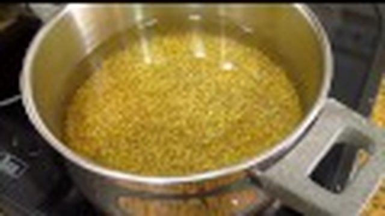

1. **Sofrito Aromático de Huerta:**
   * En la cazuela, calentar los 50 ml de AOVE a fuego medio. Añadir los ajos laminados, la cebolla, el puerro y el pimiento rojo con una pizca de sal. Pochar durante 8-10 minutos hasta que la verdura esté tierna y brillante.
   * Incorporar la carne de pimiento choricero, el pimentón ahumado, el comino y la cúrcuma. Remover durante 20 segundos.
2. **Incorporación de Tubérculos y Lentejas:**
   * Añadir las zanahorias en rodajas, la calabaza y los dados de boniato chascados. Saltear 2 minutos para que absorban el aceite aromático.
   * Incorporar las lentejas lavadas y cubrir con los 1.200 ml de caldo vegetal caliente.
3. **Cocción Suave y Liberación de Almidón Dulce:**
   * Llevar a ebullición, bajar el fuego y cocinar a fuego suave tapado durante 30 minutos. El boniato liberará parte de su almidón dulce en el caldo, trabándolo sin necesidad de grasas cárnicas.
4. **Acabado con Espinacas Frescas:**
   * En los últimos 5 minutos de cocción, incorporar las espinacas frescas picadas y remover suavemente en vaivén.
   * Rectificar de sal y dejar reposar 10 minutos antes de servir.

---

## 📊 Tabla Comparativa Maestra: Rendimientos, Tiempos, Costes y Métodos de Cocción

| # | Receta Emblemática de Cuchara | Tiempo Remojo | Tiempo Olla Exprés | Tiempo Cazuela Trad. | Coste / Ración | Textura y Ligazón Predominante |
| :-: | :--- | :---: | :---: | :---: | :---: | :--- |
| **1** | **Lentejas Pardinas con Costilla y Majado** | 0-1 h (fría) | 15-18 min | 45-50 min | 0,92 € | Majado de pan candeal frito, comino y ajos |
| **2** | **Fabada Rápida con Compango Asturiano** | 12-14 h (fría) | 18-20 min | 2h 30 min | 1,95 € | Almidón propio de la faba y grasa de compango |
| **3** | **Potaje de Vigilia Garbanzos y Bacalao** | 12 h (tibia/sal) | 22-25 min | 1h 00 min | 1,38 € | Majado de almendras, pan y yema de huevo cocido |
| **4** | **Cocido Andaluz con su Pringá Completa** | 12 h (tibia/sal) | 40-45 min | 1h 45 min | 1,53 € | Colágeno de tocinos, calabaza totana y garbanzo |
| **5** | **Alubias Blancas con Panceta Ibérica** | 10-12 h (fría) | 20-22 min | 1h 15 min | 0,97 € | Puré de verduras pochadas y alubias trituradas |
| **6** | **Garbanzos con Callos y Morro Madrileño** | 12 h (tibia/sal) | 50 min | 2h 30 min | 1,20 € | Gelatina soluble pura de pata y morro de ternera |
| **7** | **Judiones de la Granja con Oreja** | 16-18 h (fría) | 35 min | 2h 45 min | 1,36 € | Colágeno de oreja y manteca vegetal de judión |
| **8** | **Lentejas Vegetarianas con Boniato** | 0 h (directo) | 14 min | 40-45 min | 0,80 € | Almidón caramelizado de boniato y calabaza |

---

## 🧪 Tabla Técnica de Tiempos de Remojo y Cocción de Legumbres en España

```
┌──────────────────────────┬──────────────────┬─────────────────┬─────────────────┬──────────────────┐
│ Variedad de Legumbre     │ Tipo de Remojo   │ Horas de Remojo │ Olla Tradicional│ Olla Rápida Press│
├──────────────────────────┼──────────────────┼─────────────────┼─────────────────┼──────────────────┤
│ Lenteja Pardina          │ Agua fría        │ 0 a 2 horas     │ 40 - 50 min     │ 15 - 18 min      │
│ Lenteja Castellana       │ Agua fría        │ 2 a 4 horas     │ 50 - 60 min     │ 18 - 20 min      │
│ Garbanzo Castellano      │ Agua tibia + sal │ 12 horas        │ 1h 30m - 2h 00m │ 25 - 30 min      │
│ Garbanzo Pedrosillano    │ Agua tibia + sal │ 10 - 12 horas   │ 1h 15m - 1h 45m │ 20 - 25 min      │
│ Garbanzo Lechoso Andaluz │ Agua tibia + sal │ 12 horas        │ 1h 30m - 2h 00m │ 25 - 30 min      │
│ Alubia Blanca de Riñón   │ Agua fría blanda │ 10 - 12 horas   │ 1h 15m - 1h 30m │ 20 - 22 min      │
│ Faba Asturiana (I.G.P.)  │ Agua fría mineral│ 12 - 14 horas   │ 2h 15m - 2h 45m │ 20 - 25 min      │
│ Judión de La Granja      │ Agua fría mineral│ 16 - 18 horas   │ 2h 30m - 3h 00m │ 30 - 35 min      │
│ Alubia Tolosana / Pinta  │ Agua fría blanda │ 10 - 12 horas   │ 1h 30m - 2h 00m │ 22 - 25 min      │
└──────────────────────────┴──────────────────┴─────────────────┴─────────────────┴──────────────────┘
```

---

> **Compilado y Certificado por el Chef Enciclopedista de *Cocina con Carmen***  
> *Todos los derechos de adaptación técnica y divulgación gastronómica tradicional reservados.*
