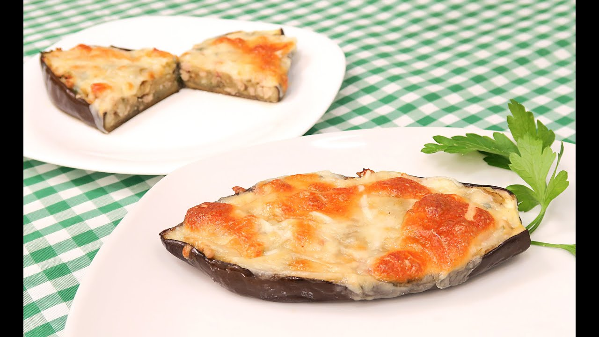
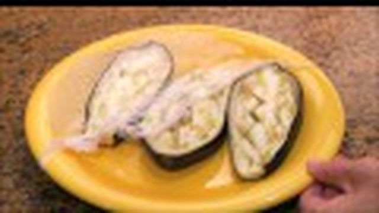
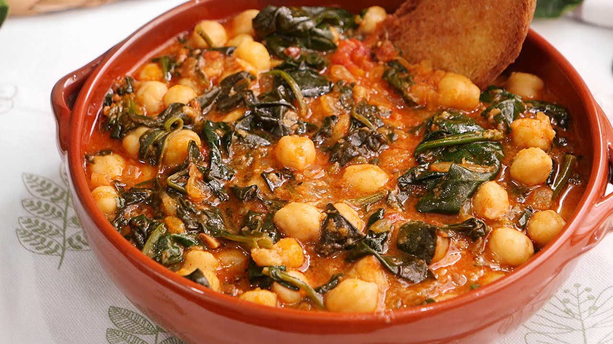
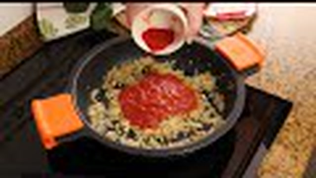
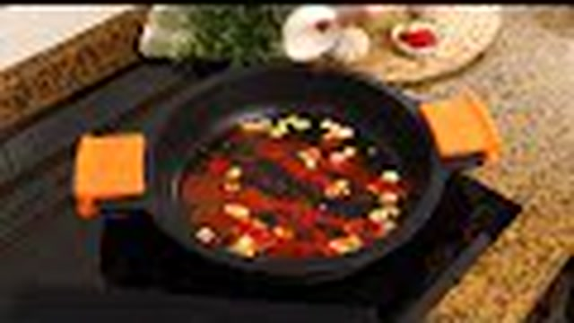
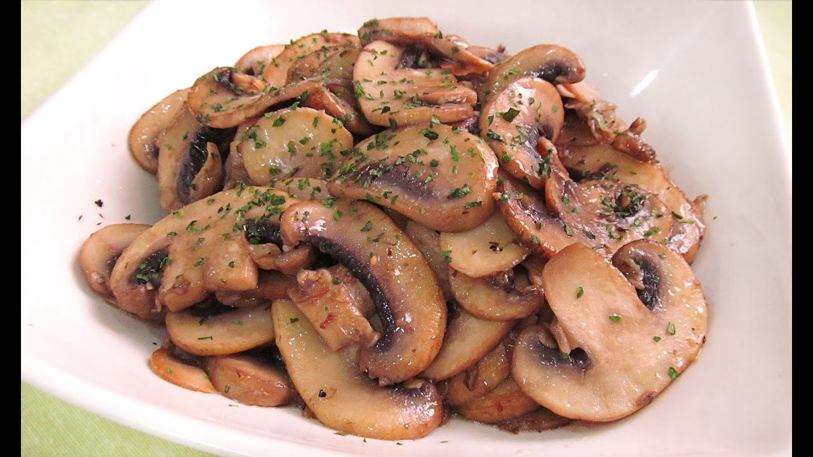
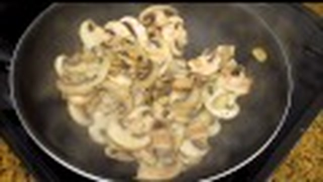
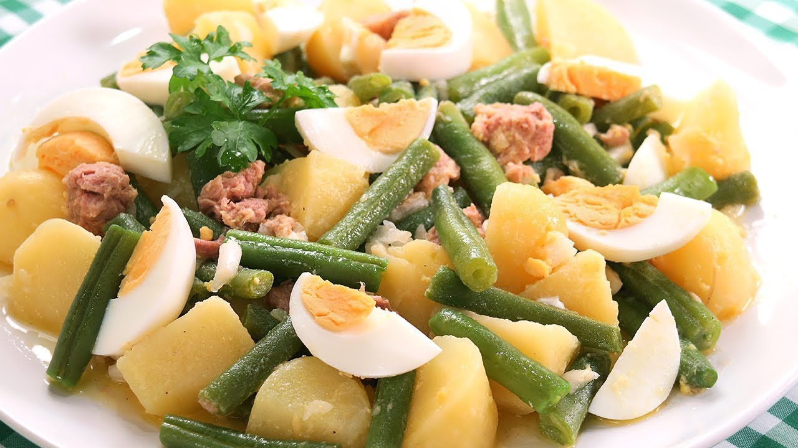

# 🥦 Master de Cocina Tradicional: Verduras, Pistos y Platos Hortícolas de Carmen
> **Inspirado en la filosofía, técnica y maestría del canal *Cocina con Carmen***  
> *Recetario Técnico Enciclopédico Profesional, Tablas de Alérgenos UE (Reglamento 1169/2011), Protocolos de Batch Cooking y Guías de Regeneración Multicanal*

---

## 📖 Prólogo Culinario: Los Secretos de la Huerta Tradicional y el Tratamiento de la Hortaliza

El tratamiento de las verduras y hortalizas en la cocina tradicional española constituye una de las pruebas de fuego más rigurosas para cualquier cocinero. En el recetario de **Cocina con Carmen**, los vegetales no son un simple acompañamiento ni una guarnición secundaria; son los auténticos protagonistas de la mesa, capaces de expresar una complejidad aromática sublime cuando se comprenden y aplican sus leyes termodinámicas y biológicas:

1. **El Pochado Escalonado y el Control del Agua Libre:** Cada hortaliza posee una densidad celular, porcentaje de agua y tiempo de cocción diferente. Mezclarlas todas al mismo tiempo en la sartén provoca que las verduras más duras queden crudas o que las más acuosas suelten sus jugos de golpe, cociendo el conjunto en lugar de sofreírlo. En el pisto manchego y los sofritos maestros de Carmen, la cebolla y los pimientos entran primero; tras ablandar su fibra y comenzar su caramelización, se incorpora el calabacín y la berenjena, concluyendo con el tomate triturado para ligar y reducir los azúcares naturales.
2. **La Caramelización de Azúcares y Reacción de Maillard sin Saturación Grasa:** Para platos como las patatas a lo pobre o los champiñones al ajillo, el secreto radica en el manejo preciso de la temperatura del Aceite de Oliva Virgen Extra (AOVE). El confitado lento a 130-140°C ablanda el almidón y la pectina de las hortalizas sin quemar sus azúcares; un golpe final a fuego medio-alto permite dorar los bordes sin que el vegetal absorba un exceso de lípidos.
3. **La Conservación de la Clorofila y el Choque Térmico (Blanqueado):** En judías verdes, menestras y espinacas, una sobrecocción prolongada degrada la clorofila en feofitina, transformando el verde vivo y brillante en un tono pardo apagado y destruyendo su textura crujiente. Carmen aplica la técnica del hervor rápido en agua generosamente salada seguido de un enfriado inmediato en baño de agua con hielo, fijando el pigmento y manteniendo la verdura al dente.
4. **El Majado de Mortero Tradicional y la Emulsión Ligadora:** Platos cumbre como las espinacas con garbanzos al estilo sevillano alcanzan su densidad y equilibrio organoléptico característico gracias al majado de pan frito crujiente, ajos dorados, comino en grano tostado, pimentón de la Vera y vinagre de Jerez. Este majado actúa como un emulsionante natural que atrapa el agua de cocción y el aceite, creando una salsa sedosa y envolvente sin harinas añadidas.
5. **El Horneado, Rellenos Nobles y Gratinados con Bechamel Sedosa:** Las berenjenas y calabacines rellenos exigen vaciados limpios y cocciones previas que concentren su pulpa antes de unirse a carnes nobles, atún o huevos de granja. El napado final con una bechamel de roux rubio suave (leche entera y nuez moscada) protege la jugosidad interior y genera una costra dorada que encierra todos los aromas de la huerta.

---

```
                                  MAPA DEL RECETARIO
                                  
  ┌─────────────────────────────────┐       ┌─────────────────────────────────┐
  │     HUERTA CONFITADA Y PISTOS   │       │      RELLENOS Y GRATINADOS      │
  │ • 1. Pisto Manchego Escalonado  │       │ • 2. Berenjenas Rellenas Carne  │
  │ • 6. Patatas a lo Pobre         │       │ • 3. Calabacines Rellenos Atún  │
  │ • 10. Judías Verdes con Tomate  │       │ • 11. Pastel de Verduras y Cabra│
  └────────────────┬────────────────┘       └────────────────┬────────────────┘
                   │                                         │
                   └───────────────────┬─────────────────────┘
                                       │
                    ┌──────────────────┴──────────────────┐
                    │     GUISOS, AJILLOS Y MENESTRAS     │
                    │ • 4. Menestra Tudelana con Jamón    │
                    │ • 5. Espinacas con Garbanzos Sevilla│
                    │ • 7. Alcachofas Salteadas con Jamón │
                    │ • 8. Coliflor al Ajoarriero         │
                    │ • 9. Champiñones al Ajillo y Vino   │
                    └─────────────────────────────────────┘
```

---

## 📑 Índice General de Recetas

1. [🥘 Pisto Manchego Tradicional con Pochado Escalonado](#1--pisto-manchego-tradicional-con-pochado-escalonado)
2. [🍆 Berenjenas Rellenas de Carne Picada Gratinadas con Bechamel](#2--berenjenas-rellenas-de-carne-picada-gratinadas-con-bechamel)
3. [🥒 Calabacines Rellenos de Atún, Huevo y Verduras Gratinados](#3--calabacines-rellenos-de-atún-huevo-y-verduras-gratinados)
4. [🍲 Menestra de Verduras Tudelana con Jamón Ibérico](#4--menestra-de-verduras-tudelana-con-jamón-ibérico)
5. [🥬 Espinacas con Garbanzos al Estilo Sevillano y Majado de Pan y Comino](#5--espinacas-con-garbanzos-al-estilo-sevillano-y-majado-de-pan-y-comino)
6. [🥔 Patatas a lo Pobre con Pimientos y Cebolla Confitada](#6--patatas-a-lo-pobre-con-pimientos-y-cebolla-confitada)
7. [🌿 Alcachofas Salteadas con Jamón Ibérico y Ajos Tiernos](#7--alcachofas-salteadas-con-jamón-ibérico-y-ajos-tiernos)
8. [🧄 Coliflor al Ajoarriero con Pimentón de la Vera](#8--coliflor-al-ajoarriero-con-pimentón-de-la-vera)
9. [🍄 Champiñones al Ajillo con Vino Blanco y Perejil](#9--champiñones-al-ajillo-con-vino-blanco-y-perejil)
10. [🍅 Judías Verdes con Tomate Frito Casero y Taquitos de Jamón](#10--judías-verdes-con-tomate-frito-casero-y-taquitos-de-jamón)
11. [🥧 Pastel de Verduras al Horno con Queso de Cabra](#11--pastel-de-verduras-al-horno-con-queso-de-cabra)
12. [📊 Tabla Comparativa Maestra: Rendimientos, Costes, Tiempos y Conservación](#12--tabla-comparativa-maestra-rendimientos-costes-tiempos-y-conservación)
13. [🛠️ Guía Rápida de Adaptación para Intolerancias y Dietas Especiales](#13-️-guía-rápida-de-adaptación-para-intolerancias-y-dietas-especiales)

---

## 1. 🥘 Pisto Manchego Tradicional con Pochado Escalonado
*Categoría: Huerta Confitada / Clásico Castellano de Temporada*


> 📺 **Vídeo Oficial de Elaboración:** [Ver en YouTube: Receta de Pisto muy Fácil y Deliciosa](https://www.youtube.com/watch?v=z6xxkLBFqco)


> [!NOTE]
> El gran secreto de Carmen para que el pisto manchego no se convierta en una masa pastosa ni en una sopa aceitosa reside en dos premisas técnicas: cortar todas las verduras en dados homogéneos de 1 cm (macedonia) y respetar escrupulosamente los tiempos de incorporación a la cazuela según la dureza de cada fibra. La berenjena debe purgarse previamente con sal para extraer su agua amarga y no absorber exceso de aceite.

```
                   CRONOLOGÍA DEL POCHADO ESCALONADO
                   
  0 min          10 min         20 min         30 min               50 min
  ┌──────────────┬──────────────┬──────────────┬────────────────────┐
  │ Cebolla +    │ Calabacín    │ Berenjena    │ Tomate triturado   │
  │ Pimientos    │ troceado con │ purgada y    │ + Reducción lenta  │
  │ verde y rojo │ piel fina    │ escurrida    │ a fuego suave      │
  └──────────────┴──────────────┴──────────────┴────────────────────┘
```

### 📋 Ficha Resumen
| Parámetro | Valor |
| :--- | :--- |
| **Tiempo de Preparación (Mise en place)** | 25 minutos |
| **Tiempo de Cocción** | 50 minutos |
| **Dificultad** | Baja - Media |
| **Raciones** | 4-6 personas (rinde aprox. 1.200 g) |
| **Coste Estimado** | Muy Económico (4,20 € total / 0,84 € por ración) |

---

### ⚠️ Tabla de Alérgenos (Reglamento UE 1169/2011)

| Alérgeno | Estado | Ingrediente Causante / Medida de Adaptación |
| :--- | :---: | :--- |
| **Gluten** | 🟢 AUSENTE | Receta 100% libre de gluten. |
| **Lácteos** | 🟢 AUSENTE | Libre de derivados lácteos. |
| **Huevos** | ⚠️ *Opcional* | Solo si se corona con huevo frito o escalfado en el servicio. |
| **Sulfitos** | 🟢 AUSENTE | Sin sulfitos añadidos. |
| **Soja / Frutos de Cáscara / Pescado** | 🟢 AUSENTE | Formulación vegetal limpia. |

---

### ⚖️ Ingredientes Exactos


#### Base de Huerta Seleccionada
* **300 g** Cebolla dulce o recia cortada en brunoise regular de 1 cm.
* **200 g** Pimiento verde italiano limpio (sin semillas) cortado en dados de 1 cm.
* **200 g** Pimiento rojo carnoso limpio cortado en dados de 1 cm.
* **350 g** Calabacín fresco con piel limpia cortado en cubos de 1 cm.
* **300 g** Berenjena tersa cortada en cubos de 1 cm.
* **600 g** Tomate maduro de pera triturado o rallado (o pulpa de tomate natural de calidad).
* **3 dientes (15 g)** Ajo morado picado finamente.

#### Grasas y Condimentos
* **90 ml** Aceite de Oliva Virgen Extra (AOVE) variedad Picual o Cornicabra.
* **5 g** Sal marina fina (ajustar en dos tandas).
* **3 g** Azúcar blanco o panela (opcional, para equilibrar la acidez del tomate).
* **1 g** Pimienta negra recién molida.
* **1 hoja** Laurel seco.

---

### 🍳 Equipamiento Necesario
* Cazuela ancha de barro o sartén honda de acero inoxidable / hierro fundido (Ø 28-30 cm).
* Tabla de corte amplia y cuchillo de chef afilado.
* Colador amplio para purga de berenjenas.
* Espátula de madera o silicona resistente al calor.

---

### 👨‍🍳 Paso a Paso Técnico y Minucioso


1. **Purga Osmótica de la Berenjena:**
   * Cortar la berenjena en dados de 1 cm, colocarla en un colador y espolvorear con 3 g de sal marina. Dejar reposar durante 20 minutos para que exude los jugos amargos. Enjuagar rápidamente bajo agua fría y secar con papel absorbente.
2. **Pochado Inicial de Aromáticos y Pimientos:**
   * Calentar los 90 ml de AOVE en la cazuela a fuego medio (140°C). Añadir los ajos picados y, cuando comiencen a bailar sin dorarse (1 minuto), incorporar la cebolla, el pimiento verde, el pimiento rojo, la hoja de laurel y 2 g de sal.
   * Pochar a fuego medio-bajo durante **10-12 minutos**, removiendo con frecuencia hasta que la cebolla esté translúcida y los pimientos hayan perdido su rigidez.
3. **Incorporación Escalonada del Calabacín y la Berenjena:**
   * Añadir el calabacín a la cazuela. Rehogar durante **8 minutos** a fuego medio para que comience a ablandarse sin deshacerse.
   * Incorporar la berenjena purgada y secada. Mezclar todo el conjunto y cocinar durante **10 minutos adicionales**, permitiendo que las hortalizas absorban el aceite perfumado.
4. **Adición del Tomate y Concentración Lenta:**
   * Verter los 600 g de tomate triturado, añadir la pimienta negra recién molida y el azúcar si el tomate presenta alta acidez.
   * Bajar el fuego a nivel suave (fuego lento con chup-chup constante), tapar parcialmente la cazuela y cocinar durante **20-25 minutos**, removiendo cada 4-5 minutos para evitar que el tomate se pegue al fondo.
5. **Punto Óptimo y Reposo:**
   * El pisto estará terminado cuando el tomate haya cambiado de rojo brillante a un tono granate intenso, el aceite comience a asomar suavemente por los bordes y el agua libre se haya evaporado por completo. Probar de sal y rectificar.
   * Dejar reposar fuera del fuego 15 minutos antes de servir para asentar sabores.

---

### 📦 Protocolo de Conservación y Batch Cooking

> [!IMPORTANT]
> El pisto manchego es una de las elaboraciones que más mejora tras 24 horas de reposo en frío, ya que los ácidos grasos del AOVE fijan los aromas de los pimientos y el tomate caramelizado.

* **Refrigeración (2°C a 4°C):** Conservar en recipiente hermético de cristal hasta por **5 días**.
* **Congelación (-18°C):** Apto para congelación en bolsas de vacío o tuppers herméticos durante **3 meses**. Para descongelar, pasar al frigorífico 12 horas antes.
* **Envasado al Vacío:** Envasar en frío al 95% de vacío en bolsas termosellables. Aguanta **14 días en nevera** a 3°C sin alteración microbiológica.

---

### 🔥 Guía de Regeneración Multicanal

* **Sartén / Cazuela (Óptimo):** Calentar a fuego medio durante 4-5 minutos con unas gotas de AOVE fresco.
* **Microondas:** 2-3 minutos a 700W en recipiente tapado con válvula abierta.
* **Horno (como base de gratinados):** Calentar a 180°C durante 8 minutos antes de añadir huevos o queso.

---

## 2. 🍆 Berenjenas Rellenas de Carne Picada Gratinadas con Bechamel
*Categoría: Relleno de Horno / Gratinado Tradicional Familiar*



> 📺 **Vídeo Oficial de Elaboración:** [Ver en YouTube: Berenjenas Rellenas de Carne Picada al Horno](https://www.youtube.com/watch?v=edNiOtiHfBc)


> [!TIP]
> Para conseguir unas barquitas de berenjena firmes que no se rompan al rellenar, ásalas primero en el horno con unos cortes en cruz en la pulpa sin perforar la piel exterior. Al vaciarlas con una cuchara sopera, deja siempre un borde de 0,5 cm de grosor. El sofrito de la carne con la pulpa debe quedar seco y bien concentrado antes de napa con la bechamel.

### 📋 Ficha Resumen
| Parámetro | Valor |
| :--- | :--- |
| **Tiempo de Preparación** | 30 minutos |
| **Tiempo de Cocción y Gratinado** | 45 minutos |
| **Dificultad** | Media |
| **Raciones** | 4 personas (4 mitades generosas) |
| **Coste Estimado** | Económico-Medio (6,80 € total / 1,70 € por ración) |

---

### ⚠️ Tabla de Alérgenos (Reglamento UE 1169/2011)

| Alérgeno | Estado | Ingrediente Causante / Medida de Adaptación |
| :--- | :---: | :--- |
| **Gluten** | 🔴 **PRESENTE** | Harina de trigo en la bechamel. *Adaptación: usar harina de maíz (Maizena).* |
| **Lácteos** | 🔴 **PRESENTE** | Mantequilla, leche entera y queso rallado. *Adaptación: bebida vegetal sin azúcar y queso vegano.* |
| **Huevos** | 🟢 AUSENTE | No contiene huevos. |
| **Sulfitos** | 🔴 **PRESENTE** | Vino blanco en la reducción del sofrito cárnico. |
| **Soja / Frutos de Cáscara** | 🟢 AUSENTE | Libre de estos alérgenos. |

---

### ⚖️ Ingredientes Exactos


#### Barquitas de Berenjena y Sofrito Cárnico
* **2 unidades grandes (approx. 700 g)** Berenjenas moradas tersas y firmes.
* **350 g** Carne picada mixta (50% ternera / 50% cerdo) de carnicería de confianza.
* **1 unidad (150 g)** Cebolla dulce picada en brunoise fina.
* **1/2 unidad (60 g)** Pimiento rojo cortado en daditos finos.
* **2 dientes** Ajo morado picado.
* **150 g** Salsa de tomate frito casero concentrado.
* **50 ml** Vino blanco seco (tipo Montilla-Moriles o Rueda).
* **45 ml** Aceite de Oliva Virgen Extra (AOVE).
* **4 g** Sal marina fina.
* **1 g** Pimienta negra molida y 1/2 cucharadita de orégano seco silvestre.

#### Bechamel Sedosa de Cobertura y Gratinado
* **35 g** Mantequilla sin sal (o 35 ml de AOVE).
* **35 g** Harina de trigo común.
* **450 ml** Leche entera fresca tibia.
* **1 pizca (0,5 g)** Nuez moscada recién rallada.
* **2 g** Sal marina.
* **100 g** Queso semicurado rallado (tipo Manchego o mezcla con Gouda/Mozzarella).

---

### 🍳 Equipamiento Necesario
* Horno convencional con función grill.
* Bandeja de horno con papel sulfurizado o fuente refractaria.
* Sartén amplia antiadherente para el sofrito (Ø 26-28 cm).
* Cazo y varillas manuales para la bechamel.
* Cuchara sopera para vaciado.

---

### 👨‍🍳 Paso a Paso Técnico y Minucioso



1. **Precocción y Vaciado de las Berenjenas:**
   * Lavar las berenjenas y cortarlas longitudinalmente por la mitad. Realizar incisiones profundas en forma de rombo en la pulpa con la punta de un cuchillo, sin cortar la piel exterior. Pincelar con 15 ml de AOVE y espolvorear una pizca de sal.
   * Hornear a **190°C con calor arriba y abajo durante 25 minutos**, hasta que la pulpa esté tierna.
   * Retirar del horno, dejar atemperar 5 minutos y extraer la pulpa con una cuchara dejando un margen de seguridad de 5 mm en la piel. Picar la pulpa extraída a cuchillo y reservar.
2. **Elaboración del Relleno Cárnico Concentrado:**
   * En la sartén, calentar 30 ml de AOVE a fuego medio. Añadir el ajo, la cebolla y el pimiento rojo. Pochar durante 8-10 minutos hasta que la verdura esté caramelizada y blanda.
   * Subir el fuego, incorporar la carne picada y salpimentar. Desmenuzar la carne con la espátula para que no queden bolas compactas y dorar durante 6 minutos.
   * Verter el vino blanco y desglasar el fondo, dejando reducir 2 minutos hasta evaporar el alcohol.
   * Añadir la pulpa de berenjena picada, el tomate frito casero y el orégano. Cocinar a fuego lento durante 8 minutos hasta obtener una farsa jugosa pero sin líquido sobrante.
3. **Elaboración de la Bechamel Suave:**
   * En un cazo a fuego medio, fundir la mantequilla. Añadir la harina y cocinar el roux durante 3 minutos sin que tome color tostado oscuro.
   * Verter la leche tibia gradualmente mientras se bate enérgicamente con las varillas. Cocinar a fuego suave durante 8-10 minutos hasta lograr una crema fluida, brillante y sin grumos. Añadir la nuez moscada y sal.
4. **Montaje y Gratinado:**
   * Disponer las 4 pieles de berenjena en una fuente refractaria. Rellenar generosamente con la farsa de carne y berenjena, presionando suavemente.
   * Napar la superficie con la bechamel caliente y espolvorear el queso rallado por encima.
   * Introducir en el horno a **200°C en posición grill (a media altura) durante 10-12 minutos**, hasta que la costra esté dorada, burbujeante y crujiente.

---

### 📦 Protocolo de Conservación y Batch Cooking

* **Refrigeración:** Las berenjenas ya montadas (con bechamel y queso) aguantan en crudo o ya horneadas **3 días a 3°C** cubiertas con papel film.
* **Congelación:** Congelar montadas sin hornear en bandejas de aluminio bien precintadas hasta **2 meses**. 
* **Hornear directo de congelación:** Hornear a 180°C durante 25 minutos cubiertas con papel de aluminio y 8 minutos adicionales a 210°C con grill destapadas.

---

### 🔥 Guía de Regeneración Multicanal

* **Horno Convencional (Recomendado):** 160°C durante 12 minutos para calentar el núcleo sin quemar el queso.
* **Airfryer:** Precalentar a 170°C y regenerar durante 7-8 minutos.
* **Microondas:** 2 minutos a potencia media (600W) si se tiene prisa (la costra perderá algo de textura crujiente).

---

## 3. 🥒 Calabacines Rellenos de Atún, Huevo y Verduras Gratinados
*Categoría: Relleno Ligero / Cocina Mediterránea de Verano*


> 📺 **Vídeo Oficial de Elaboración:** [Ver en YouTube: Calabacín relleno de Atún al Microondas | Receta en Menos de 10 Minutos!](https://www.youtube.com/watch?v=XsqDFZzJVao)


> [!NOTE]
> Para conseguir un relleno de atún jugoso que no resulte aceitoso ni pesado, es imprescindible escurrir meticulosamente el atún en conserva y cocinar la pulpa del calabacín con cebolla y pimiento hasta evaporar toda su humedad interna antes de mezclar con el huevo duro y el tomate casero.

### 📋 Ficha Resumen
| Parámetro | Valor |
| :--- | :--- |
| **Tiempo de Preparación** | 20 minutos |
| **Tiempo de Cocción** | 35 minutos |
| **Dificultad** | Baja |
| **Raciones** | 4 personas (4 barquetas) |
| **Coste Estimado** | Muy Económico (4,90 € total / 1,22 € por ración) |

---

### ⚠️ Tabla de Alérgenos (Reglamento UE 1169/2011)

| Alérgeno | Estado | Ingrediente Causante / Medida de Adaptación |
| :--- | :---: | :--- |
| **Pescado** | 🔴 **PRESENTE** | Atún claro en aceite de oliva. *Adaptación vegana: sustituir por tofu desmigado o garbanzos machacados.* |
| **Huevos** | 🔴 **PRESENTE** | Huevo duro campero picado. |
| **Lácteos** | 🔴 **PRESENTE** | Queso rallado para gratinar. *Omitir o usar levadura nutricional / queso vegetal.* |
| **Gluten** | 🟢 AUSENTE | Elaboración natural sin bechamel (o usando bechamel sin gluten si se desea). |
| **Sulfitos / Soja** | 🟢 AUSENTE | Formulación limpia. |

---

### ⚖️ Ingredientes Exactos


#### Barquetas de Calabacín
* **2 unidades medianas (aprox. 600 g)** Calabacines verdes claros rectos y firmes.
* **1.500 ml** Agua mineral para escaldado previo + 10 g de sal.

#### Relleno Mediterráneo
* **220 g (3 latas pequeñas)** Atún claro en aceite de oliva virgen extra de calidad (peso escurrido: 160 g).
* **2 unidades** Huevos camperos clase L cocidos (9 minutos).
* **1 unidad (120 g)** Cebolla dulce picada en brunoise diminuta.
* **1/2 unidad (50 g)** Pimiento verde italiano picado muy fino.
* **1 diente** Ajo morado picado.
* **180 g** Tomate frito casero concentrado.
* **30 ml** Aceite de Oliva Virgen Extra (AOVE).
* **3 g** Sal marina fina y una pizca de pimienta blanca molida.
* **80 g** Queso mozzarella rallado mezclado con 30 g de queso Parmesano o Manchego curado rallado.

---

### 🍳 Equipamiento Necesario
* Cazuela amplia para escaldar calabacines.
* Cuchara parisina (vaciador) o cuchara de postre.
* Sartén antiadherente para sofrito.
* Fuente refractaria de horno.

---

### 👨‍🍳 Paso a Paso Técnico y Minucioso


1. **Escaldado y Vaciado de los Calabacines:**
   * Lavar los calabacines, retirar los extremos y cortarlos longitudinalmente por la mitad.
   * Hervir en agua con sal durante **6-7 minutos**. Deben quedar ligeramente al dente para no romperse al vaciar.
   * Sumergir en un bol con agua helada 1 minuto para cortar la cocción y preservar su verde brillante.
   * Con una cuchara parisina o de postre, retirar la pulpa central dejando una pared firme de 4 mm. Picar la pulpa menuda y escurrir en un colador presionando con una espátula para expulsar el exceso de agua.
2. **Sofrito de la Pulpa y Verduras:**
   * En la sartén con 30 ml de AOVE, pochar el ajo, la cebolla y el pimiento verde a fuego medio durante 8 minutos con una pizca de sal.
   * Añadir la pulpa de calabacín escurrida y rehogar a fuego vivo durante 6 minutos, permitiendo que se evapore el agua remanente.
3. **Integración del Atún, Huevo y Tomate:**
   * Retirar la sartén del fuego. Incorporar el atún desmigado y escurrido, los 2 huevos duros picados en daditos finos y el tomate frito casero.
   * Mezclar con suavidad para que el huevo mantenga su textura, sazonar con la pimienta blanca y rectificar de sal.
4. **Relleno y Gratinado:**
   * Colocar las 4 barquitas de calabacín sobre la fuente de horno.
   * Rellenar copiosamente con la mezcla de atún y verduras.
   * Cubrir la superficie con la mezcla de quesos rallados.
   * Hornear a **200°C con calor arriba y abajo + grill durante 12-14 minutos**, hasta que el queso esté completamente fundido y con manchas doradas crujientes.

---

### 📦 Protocolo de Conservación y Batch Cooking

* **Refrigeración:** Aguanta perfectamente en la nevera durante **3 días a 3-4°C**.
* **Congelación:** Se recomienda congelar ya cocinados y fríos. Congelar en recipientes herméticos individuales hasta **2 meses**.
* **Descongelación:** 12 horas en frío antes de recalentar para que el calabacín no suelte agua sobre el relleno.

---

### 🔥 Guía de Regeneración Multicanal

* **Horno:** 175°C durante 10 minutos tapado con papel aluminio para conservar la humedad y 2 minutos finales destapado.
* **Airfryer:** 160°C durante 6-7 minutos.
* **Microondas:** 2 minutos a 600W.

---

## 4. 🍲 Menestra de Verduras Tudelana con Jamón Ibérico
*Categoría: Huerta Noble / Técnica de Cocciones Individuales*


> 📺 **Vídeo Oficial de Elaboración:** [Ver en YouTube: Judías Blancas con Verduras súper Fáciles y Deliciosas - Alubias](https://www.youtube.com/watch?v=ICbt1w6_XO0)


> [!IMPORTANT]
> La auténtica menestra tudelana nunca se elabora cociendo todas las verduras juntas en la misma olla. Cada vegetal exige un tiempo térmico exacto para mantener su punto crujiente al dente. La salsa se liga mediante el sofrito de jamón ibérico con un velo microscópico de harina tostada y la emulsión con el caldo concentrado de la cocción de las propias verduras.

```
                  SISTEMA DE COCCIONES INDIVIDUALES
                  
  ALCACHOFAS      ───► 15 min en agua con limón / perejil
  ZANAHORIAS      ───► 10 min en agua con sal
  JUDÍAS VERDES   ───► 8 min + Choque de agua con hielo
  GUISANTES       ───► 4 min (vapor o escaldado)
  ESPÁRRAGOS      ───► 6 min al vapor
                             │
                             ▼
  LIGAZÓN FINAL   ───► Sofrito de ajo + Jamón Ibérico + Roux sutil + Fondo noble
```

### 📋 Ficha Resumen
| Parámetro | Valor |
| :--- | :--- |
| **Tiempo de Preparación (Limpieza y Torneado)** | 35 minutos |
| **Tiempo de Cocción Total** | 30 minutos |
| **Dificultad** | Media-Alta |
| **Raciones** | 4 personas (plato principal de 350 g) |
| **Coste Estimado** | Medio (7,90 € total / 1,97 € por ración) |

---

### ⚠️ Tabla de Alérgenos (Reglamento UE 1169/2011)

| Alérgeno | Estado | Ingrediente Causante / Medida de Adaptación |
| :--- | :---: | :--- |
| **Gluten** | 🔴 **PRESENTE** | Harina de trigo para ligar la salsa. *Adaptación: usar almidón de maíz.* |
| **Lácteos** | 🟢 AUSENTE | Elaboración 100% con AOVE. |
| **Huevos** | ⚠️ *Opcional* | Solo si se añade huevo duro o huevo escalfado de guarnición. |
| **Sulfitos** | 🔴 **PRESENTE** | Vino blanco seco en el desglasado. |
| **Soja / Frutos de Cáscara / Pescado** | 🟢 AUSENTE | Formulación limpia. |

---

### ⚖️ Ingredientes Exactos


#### Selección Hortícola de Temporada
* **4 unidades** Alcachofas frescas medianas (torneadas y cortadas en cuartos).
* **200 g** Judías verdes planas o redondas limpias (cortadas en tiras de 4 cm).
* **180 g** Guisantes finos frescos o congelados de máxima calidad.
* **2 unidades (150 g)** Zanahorias peladas y cortadas en rodajas de 5 mm.
* **1 manojo (200 g)** Espárragos verdes o trigueros frescos (retirada la base leñosa).
* **1 unidad (150 g)** Patata para guiso chascada en trozos medianos.

#### Fondo Noble, Sofrito y Ligazón
* **120 g** Jamón ibérico de bellota en taquitos regulares de 4x4 mm (con su veta blanca).
* **4 dientes** Ajo morado laminado fino.
* **1 unidad (100 g)** Cebolla dulce picada en brunoise microscópica.
* **15 g** Harina de trigo todo uso tamizada.
* **60 ml** Vino blanco seco de calidad (tipo Rueda o Manzanilla de Sanlúcar).
* **70 ml** Aceite de Oliva Virgen Extra (AOVE).
* **350 ml** Caldo resultante de cocer las verduras (colado y desgrasado).
* **1 ramillete** Perejil fresco picado muy fino.
* **4 g** Sal marina gruesa para las cocciones y sal fina para ajustar.

---

### 🍳 Equipamiento Necesario
* Cazuela ancha y baja (tipo sauté o rustidera de 30 cm).
* 2 ollas medianas para cocción escalonada de verduras.
* Bol grande con agua helada para choque térmico.
* Espumadera y colador fino.

---

### 👨‍🍳 Paso a Paso Técnico y Minucioso


1. **Torneado y Cocción de las Alcachofas:**
   * Retirar las hojas exteriores duras de las alcachofas hasta llegar al corazón tierno de tono amarillo pálido. Cortar las puntas duras y pelar el tallo. Frotar con medio limón o mantener en agua con ramas de perejil para evitar la oxidación enzimática.
   * Cocer en agua hirviendo con 5 g de sal durante **14-16 minutos** hasta que la base esté tierna al clavar la punta de un cuchillo. Escurrir y reservar el agua de cocción.
2. **Cocción Diferenciada del Resto de Vegetales:**
   * En otra olla con agua hirviendo con sal, cocer las zanahorias y las patatas durante **10-12 minutos**.
   * Añadir las judías verdes y los espárragos en los últimos 7 minutos de cocción.
   * Añadir los guisantes en los últimos 3 minutos.
   * Extraer las verduras con espumadera y sumergir inmediatamente las judías, espárragos y guisantes en el bol con agua y hielo durante 2 minutos para sellar la clorofila. Escurrir y reservar.
3. **Sofrito de Jamón y Elaboración del Roux Ligador:**
   * En la cazuela ancha, calentar los 70 ml de AOVE a fuego medio. Añadir los ajos laminados y la cebolla dulce. Sofreír durante 8 minutos hasta que la cebolla esté transparente y el ajo fragante sin quemarse.
   * Incorporar los taquitos de jamón ibérico y saltear únicamente durante **40 segundos** para que el calor suelte sus aromas sin resecar la proteína.
   * Espolvorear los 15 g de harina tamizada. Cocinar durante 2 minutos removiendo continuamente para tostar el almidón.
4. **Emulsión de la Salsa y Glaseado:**
   * Verter los 60 ml de vino blanco y dejar reducir 1 minuto.
   * Añadir 300-350 ml del caldo de cocción de verduras caliente. Batir suavemente con cuchara de madera formando una salsa verde aterciopelada, ligera y brillante. Dejar hervir 3 minutos a fuego suave.
5. **Ensamblaje y Vaivén Final:**
   * Incorporar todas las verduras cocidas con sumo cuidado para no romper las puntas de alcachofa ni las patatas.
   * Mover la cazuela con movimientos de vaivén circulares durante **4-5 minutos** a fuego lento para que la salsa nape y perfume cada verdura.
   * Espolvorear abundante perejil fresco picado y servir de inmediato.

---

### 📦 Protocolo de Conservación y Batch Cooking

* **Refrigeración:** 3 días en recipiente hermético a 3°C.
* **Congelación:** ❌ Desaconsejada en la menestra ligada con patata (la patata cocida pierde el agua y se vuelve harinosa y gomosa). Si se desea congelar, congelar las verduras cocidas por separado sin patata y preparar la salsa y el jamón el día del servicio.

---

### 🔥 Guía de Regeneración Multicanal

* **Cazuela / Sartén (Recomendado):** Regenerar a fuego bajo durante 4 minutos añadiendo 2 cucharadas de agua o caldo si la salsa ha espesado demasiado en el frío.
* **Microondas:** 2 minutos a 600W tapado.

---

## 5. 🥬 Espinacas con Garbanzos al Estilo Sevillano y Majado de Pan y Comino
*Categoría: Guiso Tradicional de Taberna / Cocina Andaluza Histórica*



> 📺 **Vídeo Oficial de Elaboración:** [Ver en YouTube: Espinacas con Garbanzos - Receta Tradicional y Sabrosa](https://www.youtube.com/watch?v=cviNRSB1At0)


> [!NOTE]
> Este plato legendario de la cuaresma sevillana encuentra su máxima expresión en el equilibrio entre el comino recién tostado, el pimentón dulce de la Vera y el toque avinagrado de Jerez. El majado de pan frito y ajo frito machacado en mortero confiere a las espinacas esa textura untuosa y melosa característica de las tabernas de Triana y El Arenal.

```
                    EL MAJADO TRIPLEMENTE EMULSIONADO
                    
  Pan candeal frito en AOVE ─┐
  Dientes de ajo dorados    ─┼──► Mortero de piedra ──► Desglasado con Vinagre de Jerez
  Comino en grano tostado   ─┤    con pimentón dulce     y agua de garbanzos
  Sal gorda marina          ─┘
```

### 📋 Ficha Resumen
| Parámetro | Valor |
| :--- | :--- |
| **Tiempo de Preparación** | 15 minutos |
| **Tiempo de Cocción** | 25 minutos |
| **Dificultad** | Baja |
| **Raciones** | 4 personas (rinde aprox. 1.000 g) |
| **Coste Estimado** | Muy Económico (3,60 € total / 0,90 € por ración) |

---

### ⚠️ Tabla de Alérgenos (Reglamento UE 1169/2011)

| Alérgeno | Estado | Ingrediente Causante / Medida de Adaptación |
| :--- | :---: | :--- |
| **Gluten** | 🔴 **PRESENTE** | Pan de telera o candeal en el majado. *Adaptación: usar rebanada de pan sin gluten tostado o almendras.* |
| **Sulfitos** | 🔴 **PRESENTE** | Vinagre de Jerez Reserva. *Adaptación: zumo de limón fresco.* |
| **Lácteos / Huevos** | 🟢 AUSENTE | Receta 100% vegana de origen cuaresmal. |
| **Soja / Frutos de Cáscara** | 🟢 AUSENTE | Formulación vegetal limpia. |

---

### ⚖️ Ingredientes Exactos


#### Base del Guiso
* **600 g** Espinacas frescas limpias (o 450 g de espinacas congeladas en hojas enteras, descongeladas y muy bien escurridas).
* **400 g** Garbanzos cocidos de calidad (variedad Pedrosillano o Lechoso), lavados y escurridos.
* **60 ml** Aceite de Oliva Virgen Extra (AOVE).
* **150 ml** Caldo de verduras casero o agua de cocción de los garbanzos.

#### El Majado Sevillano Tradicional
* **2 rebanadas (40 g)** Pan candeal o telera del día anterior.
* **5 dientes** Ajo morado pelados.
* **1 cucharada colmada (4 g)** Comino en grano entero.
* **1 cucharada (8 g)** Pimentón dulce de la Vera con D.O.P.
* **1/2 cucharadita (2 g)** Pimentón picante de la Vera (opcional, para toque canalla).
* **25 ml** Vinagre de Jerez Reserva con D.O.
* **4 g** Sal marina gruesa.
* **1 g** Pimienta negra molida.

---

### 🍳 Equipamiento Necesario
* Cazuela de barro o sartén honda de hierro (Ø 28 cm).
* Mortero de mármol o piedra con su maza.
* Sartén pequeña para freír el pan y ajos.
* Colador y espátula.

---

### 👨‍🍳 Paso a Paso Técnico y Minucioso



1. **Tratamiento y Escaldado de las Espinacas:**
   * Si se usan espinacas frescas, escaldarlas en agua hirviendo con sal durante **2 minutos**. Escurrir inmediatamente y presionar con las manos o una espátula para retirar toda el agua libre. Picar toscamente a cuchillo.
2. **Elaboración del Majado en Mortero:**
   * En una sartén pequeña, calentar los 60 ml de AOVE a fuego medio. Freír los 5 dientes de ajo enteros hasta que estén dorados pero tiernos por dentro (3 minutos). Retirar y colocar en el mortero.
   * En el mismo aceite, freír las 2 rebanadas de pan candeal hasta que estén bien crujientes y doradas por ambas caras. Escurrir y pasar al mortero.
   * Tostar el comino en grano en la sartén apagada con el calor residual durante 30 segundos; pasarlo al mortero.
   * Apartar la sartén del fuego, dejar templar el aceite 30 segundos e incorporar los pimentones dulce y picante, removiendo 10 segundos para que se disuelvan en la grasa sin quemarse. Verter el vinagre de Jerez inmediatamente para frenar la cocción.
   * En el mortero, machacar los ajos, el pan frito, los cominos y la sal marina gruesa hasta formar una pasta densa y uniforme. Verter el aceite con el pimentón y el vinagre del paso anterior, integrando todo con la maza.
3. **Cocción y Ligazón del Guiso:**
   * En la cazuela amplia, volcar las espinacas escurridas y el majado del mortero disuelto con 100 ml de caldo caliente.
   * Cocinar a fuego medio durante **5 minutos**, removiendo constantemente para que las espinacas se impregnen del majado aromático y adquieran brillo.
4. **Incorporación de los Garbanzos y Asentamiento:**
   * Añadir los 400 g de garbanzos cocidos y los 50 ml de caldo restante.
   * Cocinar a fuego lento durante **8-10 minutos**, realizando movimientos envolventes con la cuchara para que los garbanzos absorban los sabores sin romperse y la salsa espese hasta una consistencia untuosa.
   * Probar de sal y vinagre, rectificando según preferencia. Servir caliente acompañado de triángulos de pan frito crujiente.

---

### 📦 Protocolo de Conservación y Batch Cooking

* **Refrigeración:** Aguanta de forma excepcional hasta **5 días a 3°C**. El reposo acentúa la integración del comino y el vinagre.
* **Congelación:** Se congela perfectamente en raciones individuales herméticas hasta **3 meses**. 
* **Regeneración tras congelar:** Descongelar en microondas o sartén a fuego suave con 2 cucharadas de agua para recuperar la fluidez.

---

### 🔥 Guía de Regeneración Multicanal

* **Cazuela / Sartén:** Calentar a fuego lento 3-4 minutos tapado.
* **Microondas:** 2 minutos a 750W removiendo a mitad del tiempo.

---

## 6. 🥔 Patatas a lo Pobre con Pimientos y Cebolla Confitada
*Categoría: Confitado Clásico Andaluz / Guarnición y Plato de Campiña*


> 📺 **Vídeo Oficial de Elaboración:** [Ver en YouTube: Patatas a lo Pobre con Pimientos](https://www.youtube.com/watch?v=JjNE0fGfPNY)


> [!TIP]
> El secreto de unas patatas a lo pobre sublimes de Carmen radica en no freírlas a fuego vivo, sino confitarlas lentamente tapadas a fuego suave (130°C) en abundante AOVE. La patata debe absorber el vapor interior y el aceite, quedando tierna como mantequilla por dentro con ligeros toques dorados al final.

### 📋 Ficha Resumen
| Parámetro | Valor |
| :--- | :--- |
| **Tiempo de Preparación** | 15 minutos |
| **Tiempo de Confitado** | 30 minutos |
| **Dificultad** | Muy Baja |
| **Raciones** | 4 personas |
| **Coste Estimado** | Muy Económico (2,80 € total / 0,70 € por ración) |

---

### ⚠️ Tabla de Alérgenos (Reglamento UE 1169/2011)

| Alérgeno | Estado | Ingrediente Causante / Medida de Adaptación |
| :--- | :---: | :--- |
| **Gluten** | 🟢 AUSENTE | Receta 100% natural libre de gluten. |
| **Lácteos / Huevos** | 🟢 AUSENTE | Base vegetal (huevos opcionales en el servicio). |
| **Sulfitos** | 🟢 AUSENTE | Sin aditivos ni vinagres. |
| **Soja / Frutos de Cáscara** | 🟢 AUSENTE | Formulación limpia. |

---

### ⚖️ Ingredientes Exactos


* **800 g** Patatas de variedad agria, monalisa o kennebec (peladas y cortadas en rodajas panaderas de 4-5 mm de grosor).
* **250 g** Cebolla dulce cortada en juliana fina de 3 mm.
* **150 g** Pimiento verde italiano cortado en tiras de 1 cm.
* **100 g** Pimiento rojo carnoso cortado en tiras de 1 cm.
* **4 dientes** Ajo morado machacados con un golpe en su camisa (piel limpia).
* **150 ml** Aceite de Oliva Virgen Extra (AOVE).
* **5 g** Sal marina fina.
* **1 g** Pimienta negra recién molida.

---

### 🍳 Equipamiento Necesario
* Sartén amplia antiadherente o de hierro (Ø 28-30 cm) con su tapadera correspondiente.
* Espumadera o espátula ancha para voltear sin romper.
* Fuente de servicio o escurridor.

---

### 👨‍🍳 Paso a Paso Técnico y Minucioso


1. **Corte y Lavado de la Patata:**
   * Pelar las patatas y cortarlas en rodajas uniformes de 4-5 mm de grosor. Lavar ligeramente en agua fría para eliminar el almidón superficial y secar bien con un paño limpio.
2. **Disposición y Confitado Lento:**
   * En la sartén amplia en frío, verter los 150 ml de AOVE. Añadir las patatas, la cebolla en juliana, los pimientos verde y rojo en tiras y los 4 dientes de ajo con piel.
   * Espolvorear los 5 g de sal marina y mezclar con suavidad para que todos los ingredientes queden untados de aceite.
   * Encender a fuego medio-bajo. En cuanto empiece a chisporrotear suavemente, **tapar la sartén** y mantener la cocción a fuego lento durante **20 minutos**.
   * El vapor condensado en la tapa y el aceite confitarán la patata, dejándola tierna y cremosa. Remover con cuidado cada 6-7 minutos dando la vuelta con la espumadera para no romper las rodajas.
3. **Golpe de Fuego y Dorado:**
   * Retirar la tapadera. Subir el fuego a nivel medio-alto durante los últimos **8-10 minutos** para evaporar el agua superficial y permitir que los bordes de las patatas y la cebolla se doren ligeramente (*reacción de Maillard suave*).
4. **Escurrido y Servicio:**
   * Con ayuda de una espumadera, extraer las patatas a lo pobre escurriendo el exceso de aceite sobre la sartén (este aceite perfumado se reserva para tortillas o sofritos posteriores).
   * Servir en fuente caliente, coronando si se desea con dos huevos fritos camperos de yema líquida o taquitos de jamón.

---

### 📦 Protocolo de Conservación y Batch Cooking

* **Refrigeración:** 3 días a 3°C en fiambrera hermética.
* **Congelación:** ❌ No recomendada (la patata confitada congelada pierde su estructura almidonosa).

---

### 🔥 Guía de Regeneración Multicanal

* **Sartén:** Saltear 3 minutos a fuego medio sin añadir aceite.
* **Airfryer:** 180°C durante 5 minutos para recuperar un toque crujiente exterior.
* **Microondas:** 90 segundos a 700W.

---

## 7. 🌿 Alcachofas Salteadas con Jamón Ibérico y Ajos Tiernos
*Categoría: Huerta de Invierno / Salteado Gourmet Rápido*


> 📺 **Vídeo Oficial de Elaboración:** [Ver en YouTube: Alcachofas en Salsa Verde: ¡Fáciles, Rápidas y Deliciosas! ⏱️](https://www.youtube.com/watch?v=FlBqO8jvEmU)


> [!NOTE]
> Las alcachofas frescas poseen una enzima polifenol oxidasa muy activa que las ennegrece en contacto con el aire. Para mantener su tono dorado verdoso y evitar notas amargas, pélalas concienzudamente retirando todas las hojas fibrosas hasta llegar al corazón amarillo, cuécelas en agua hirviendo con sal y perejil, y saltéalas a fuego vivo con ajos tiernos y jamón añadido en el último segundo.

### 📋 Ficha Resumen
| Parámetro | Valor |
| :--- | :--- |
| **Tiempo de Preparación** | 20 minutos |
| **Tiempo de Cocción** | 20 minutos |
| **Dificultad** | Media |
| **Raciones** | 4 personas |
| **Coste Estimado** | Medio (6,50 € total / 1,62 € por ración) |

---

### ⚠️ Tabla de Alérgenos (Reglamento UE 1169/2011)

| Alérgeno | Estado | Ingrediente Causante / Medida de Adaptación |
| :--- | :---: | :--- |
| **Gluten** | 🟢 AUSENTE | Receta limpia sin harinas. |
| **Sulfitos** | 🔴 **PRESENTE** | Vino Fino de Jerez o vino blanco seco. |
| **Lácteos / Huevos** | 🟢 AUSENTE | Elaboración con AOVE y jamón ibérico. |
| **Soja / Frutos de Cáscara** | 🟢 AUSENTE | Libre de estos alérgenos. |

---

### ⚖️ Ingredientes Exactos


* **8 unidades** Alcachofas frescas de temporada (variedad Blanca de Tudela o similar).
* **1 manojo (100 g)** Ajos tiernos o ajetes frescos limpios y cortados en rodajas de 1 cm.
* **120 g** Jamón ibérico en taquitos finos o virutas finas.
* **50 ml** Vino Fino de Jerez o Manzanilla de Sanlúcar.
* **50 ml** Aceite de Oliva Virgen Extra (AOVE).
* **1 unidad** Limón fresco cortado por la mitad y 4 ramas de perejil fresco para el agua.
* **4 g** Sal marina para el agua de cocción y sal en escamas al servir.
* **1 g** Pimienta negra recién molida.

---

### 🍳 Equipamiento Necesario
* Cuchillo puntilla afilado para tornear.
* Olla mediana para cocción de alcachofas.
* Sartén amplia antiadherente (Ø 28 cm).
* Colador.

---

### 👨‍🍳 Paso a Paso Técnico y Minucioso


1. **Torneado y Limpieza de Alcachofas:**
   * Cortar el tallo dejando 3 cm, pelando la parte externa fibrosa del mismo.
   * Retirar con los dedos o puntilla las hojas exteriores oscuras hasta descubrir las hojas de base amarilla y textura tierna. Cortar la punta superior (aprox. 2 cm).
   * Cortar cada alcachofa en cuartos o en octavos longitudinales y retirar la pelusilla interior si la tuviera. Frotar con limón e introducir en un bol con agua fría y perejil.
2. **Cocción al Dente:**
   * Llevar a ebullición 1,5 litros de agua con 4 g de sal marina. Introducir los cuartos de alcachofa y cocer a fuego medio durante **12-14 minutos**, hasta que la base esté tierna pero firme.
   * Escurrir inmediatamente y secar sobre papel absorbente.
3. **Salteado con Ajos Tiernos y Desglasado:**
   * En la sartén amplia, calentar los 50 ml de AOVE a fuego medio-alto. Añadir los ajetes tiernos y saltear durante 2 minutos hasta que desprendan su perfume.
   * Incorporar los cuartos de alcachofa cocidos y bien secos. Dorar a fuego vivo durante **4-5 minutos**, volteándolos para que se caramelicen y tomen un color dorado apetecible.
   * Verter los 50 ml de vino Fino de Jerez y desglasar, dejando que el alcohol se evapore y el líquido glasee las alcachofas (1,5 minutos).
4. **Incorporación del Jamón y Emplatado:**
   * Apagar el fuego e incorporar inmediatamente los 120 g de jamón ibérico. Remover con el calor residual durante 30 segundos (el calor fundirá la grasa entreverada sin resecar la carne).
   * Servir de inmediato en platos llanos con un toque de pimienta negra y unas escamas de sal marina.

---

### 📦 Protocolo de Conservación y Batch Cooking

* **Refrigeración:** Las alcachofas cocidas aguantan **4 días a 3°C** cubiertas de agua con unas gotas de limón. El plato ya salteado con jamón se conserva **2 días en nevera**.
* **Congelación:** Congelar solo las alcachofas cocidas y bien escurridas (hasta **3 meses**). Saltear con jamón fresco el día de consumo.

---

### 🔥 Guía de Regeneración Multicanal

* **Sartén:** Saltear 2 minutos a fuego vivo con unas gotas de AOVE.
* **Microondas:** 1 minuto a 600W.

---

## 8. 🧄 Coliflor al Ajoarriero con Pimentón de la Vera
*Categoría: Tradición del Norte / Sabor Intenso y Reconfortante*


> 📺 **Vídeo Oficial de Elaboración:** [Ver en YouTube: Coliflor al Ajillo con Pimentón - Receta Fácil y Deliciosa](https://www.youtube.com/watch?v=5R-fw9lkY7M)


> [!TIP]
> Para evitar el desagradable olor a sulfuro al cocer la coliflor, no la sobrecocines: cuécela al vapor o en agua hirviendo durante 10-12 minutos exactos hasta que esté al dente. El secreto del refrito ajoarriero reside en retirar la sartén del fuego antes de añadir el pimentón y cortar la temperatura de inmediato con un chorrito de vinagre para que no se queme ni amargue.

### 📋 Ficha Resumen
| Parámetro | Valor |
| :--- | :--- |
| **Tiempo de Preparación** | 10 minutos |
| **Tiempo de Cocción** | 15 minutos |
| **Dificultad** | Muy Baja |
| **Raciones** | 4 personas |
| **Coste Estimado** | Muy Económico (2,90 € total / 0,72 € por ración) |

---

### ⚠️ Tabla de Alérgenos (Reglamento UE 1169/2011)

| Alérgeno | Estado | Ingrediente Causante / Medida de Adaptación |
| :--- | :---: | :--- |
| **Gluten** | 🟢 AUSENTE | Receta 100% libre de gluten. |
| **Sulfitos** | 🔴 **PRESENTE** | Vinagre de vino blanco o manzana del refrito. |
| **Lácteos / Huevos** | 🟢 AUSENTE | Plato 100% vegetal. |
| **Soja / Frutos de Cáscara** | 🟢 AUSENTE | Formulación limpia. |

---

### ⚖️ Ingredientes Exactos


* **1 unidad mediana (aprox. 900 g)** Coliflor blanca fresca, limpia y separada en ramilletes regulares.
* **6 dientes** Ajo morado cortados en láminas finas de 1 mm.
* **70 ml** Aceite de Oliva Virgen Extra (AOVE).
* **1 cucharada colmada (10 g)** Pimentón dulce de la Vera con D.O.P.
* **1/2 cucharadita (2 g)** Pimentón picante de la Vera (opcional).
* **20 ml** Vinagre de vino blanco o vinagre de sidra de manzana.
* **5 g** Sal marina gruesa para el agua de cocción.
* **1 rama** Perejil fresco picado.

---

### 🍳 Equipamiento Necesario
* Vaporera u olla amplia con cestillo de vapor (o cazuela convencional).
* Sartén pequeña para el refrito ajoarriero.
* Fuente de servir amplia.

---

### 👨‍🍳 Paso a Paso Técnico y Minucioso



1. **Corte y Cocción al Vapor de la Coliflor:**
   * Retirar las hojas verdes exteriores y el tronco central duro de la coliflor. Separar en ramilletes homogéneos medianos y lavar bajo el grifo.
   * Cocer al vapor durante **10-12 minutos** (o en agua hirviendo con 5 g de sal durante 9-10 minutos). Comprobar el punto pinchando con un tenedor: debe entrar con suavidad pero el ramillete debe mantener su forma entera.
   * Escurrir con cuidado para no deshacerla y colocar en una fuente caliente.
2. **Elaboración del Refrito Ajoarriero Tradicional:**
   * En la sartén pequeña, calentar los 70 ml de AOVE a fuego medio. Añadir los ajos laminados y dorarlos lentamente hasta que adquieran un color avellana claro y crujiente (aprox. 3 minutos).
   * **Retirar la sartén del fuego** y esperar 20 segundos para que baje la temperatura del aceite.
   * Incorporar el pimentón dulce y picante, removiendo enérgicamente con una cuchara de madera durante 5 segundos para que se disuelva en la grasa caliente.
   * Verter de inmediato los 20 ml de vinagre: el aceite chisporroteará emulsionando el pimentón y el vinagre, creando una salsa roja brillante y homogénea.
3. **Salseado y Servicio:**
   * Verter el refrito ajoarriero humeante sobre los ramilletes de coliflor en la fuente.
   * Espolvorear perejil fresco picado y servir caliente.

---

### 📦 Protocolo de Conservación y Batch Cooking

* **Refrigeración:** Conservar en fiambrera hermética durante **4 días a 3°C**.
* **Congelación:** Apta para congelar durante **2 meses** (los ramilletes cocidos al vapor conservan mejor su textura tras la congelación que los hervidos).

---

### 🔥 Guía de Regeneración Multicanal

* **Horno / Gratinador:** 180°C durante 6 minutos (se puede añadir una capa fina de pan rallado o queso si se desea gratinar).
* **Microondas:** 2 minutos a 650W.

---

## 9. 🍄 Champiñones al Ajillo con Vino Blanco y Perejil
*Categoría: Tapeo Clásico / Salteado Volumétrico Exprés*



> 📺 **Vídeo Oficial de Elaboración:** [Ver en YouTube: Champiñones al Ajillo - Receta fácil y deliciosa](https://www.youtube.com/watch?v=ePSyDCzsp6o)


> [!NOTE]
> Para que los champiñones queden dorados y carnosos en lugar de encogerse y hervirse en sus propios jugos, la sartén debe estar humeante a fuego muy vivo antes de introducirlos. No los laves sumergiéndolos en agua; límpialos con un paño húmedo o un cepillo para que no absorban humedad innecesaria.

### 📋 Ficha Resumen
| Parámetro | Valor |
| :--- | :--- |
| **Tiempo de Preparación** | 10 minutos |
| **Tiempo de Cocción** | 12 minutos |
| **Dificultad** | Muy Baja |
| **Raciones** | 4 personas (tapa generosa) |
| **Coste Estimado** | Muy Económico (2,50 € total / 0,62 € por ración) |

---

### ⚠️ Tabla de Alérgenos (Reglamento UE 1169/2011)

| Alérgeno | Estado | Ingrediente Causante / Medida de Adaptación |
| :--- | :---: | :--- |
| **Gluten** | 🟢 AUSENTE | Receta natural libre de gluten. |
| **Sulfitos** | 🔴 **PRESENTE** | Vino blanco seco en la reducción. |
| **Lácteos / Huevos** | 🟢 AUSENTE | 100% vegetal. |
| **Soja / Frutos de Cáscara** | 🟢 AUSENTE | Formulación limpia. |

---

### ⚖️ Ingredientes Exactos


* **500 g** Champiñones frescos enteros de París o Portobello (limpios y cortados en cuartos o láminas gruesas de 6 mm).
* **6 dientes** Ajo morado picados en brunoise fina.
* **1 unidad** Guindilla cayena seca (opcional, para toque picante tradicional).
* **60 ml** Vino blanco seco (tipo Verdejo o Manzanilla).
* **50 ml** Aceite de Oliva Virgen Extra (AOVE).
* **15 g** Hojas de perejil fresco recién picado.
* **3 g** Sal marina fina y escamas de sal al final.
* **1 g** Pimienta negra recién molida.
* **10 ml** Zumo de limón fresco recién exprimido (opcional).

---

### 🍳 Equipamiento Necesario
* Cazuela de barro tradicional o sartén de hierro colado / acero inoxidable (Ø 26 cm).
* Cuchara de madera.

---

### 👨‍🍳 Paso a Paso Técnico y Minucioso



1. **Limpieza y Corte de los Hongos:**
   * Cortar la base terrosa del tallo. Limpiar los sombreros con un paño húmedo o papel de cocina. Cortar los champiñones en cuartos regulares (si son pequeños, se pueden dejar enteros).
2. **Salteado a Fuego Vivo (Sellado Térmico):**
   * Calentar los 50 ml de AOVE en la cazuela o sartén a fuego medio-alto. Añadir los ajos picados y la guindilla cayena.
   * Cuando el ajo comience a bailar y tome un ligero color rubio (apenas 45 segundos), incorporar los champiñones troceados.
   * Saltear a fuego muy vivo sin tapar durante **5-6 minutos**, removiendo de vez en cuando. Los champiñones soltarán algo de líquido que se evaporará con rapidez mientras se doran y caramelizan sus bordes.
3. **Desglasado con Vino Blanco y Reducción:**
   * Salpimentar e incorporar los 60 ml de vino blanco seco y el zumo de limón.
   * Dejar hervir a fuego vivo durante **3-4 minutos** hasta que el alcohol se evapore por completo y el vino se reduzca formando una salsita densa, emulsionada con el aceite y los jugos naturales del hongo.
4. **Acabado con Perejil:**
   * Apagar el fuego, espolvorear copiosamente el perejil fresco picado y mezclar. Servir inmediatamente bien caliente en la propia cazuela de barro.

---

### 📦 Protocolo de Conservación y Batch Cooking

* **Refrigeración:** Aguanta **3 días en nevera a 3°C** en recipiente hermético.
* **Congelación:** ❌ No recomendada para champiñones salteados (su alto contenido hídrico hace que queden blandos y gomosos tras descongelar).

---

### 🔥 Guía de Regeneración Multicanal

* **Sartén:** 2 minutos a fuego vivo.
* **Microondas:** 1 minuto a 700W.

---

## 10. 🍅 Judías Verdes con Tomate Frito Casero y Taquitos de Jamón
*Categoría: Tradición Casera / Huerta Verde en Salsa Noble*



> 📺 **Vídeo Oficial de Elaboración:** [Ver en YouTube: Ensalada Campera con Judías Verdes o Ejotes](https://www.youtube.com/watch?v=x-pbWdS1T8o)


> [!TIP]
> Para lograr unas judías verdes tiernas pero con una textura firme y un verde deslumbrante, retira bien las hebras laterales con un pelador de verduras, córtalas en bastones regulares y realiza una cocción corta (7-8 minutos) enfriando en agua con hielo. Luego, mézclalas con un tomate frito casero reducido pacientemente con su sofrito de cebolla y jamón.

### 📋 Ficha Resumen
| Parámetro | Valor |
| :--- | :--- |
| **Tiempo de Preparación** | 15 minutos |
| **Tiempo de Cocción** | 20 minutos |
| **Dificultad** | Muy Baja |
| **Raciones** | 4 personas |
| **Coste Estimado** | Muy Económico (3,80 € total / 0,95 € por ración) |

---

### ⚠️ Tabla de Alérgenos (Reglamento UE 1169/2011)

| Alérgeno | Estado | Ingrediente Causante / Medida de Adaptación |
| :--- | :---: | :--- |
| **Gluten** | 🟢 AUSENTE | Receta 100% natural sin gluten. |
| **Lácteos / Huevos** | 🟢 AUSENTE | Base vegetal con jamón ibérico. |
| **Sulfitos** | 🟢 AUSENTE | Sin sulfitos añadidos. |
| **Soja / Frutos de Cáscara** | 🟢 AUSENTE | Formulación limpia. |

---

### ⚖️ Ingredientes Exactos


* **600 g** Judías verdes planas (tipo perona) o redondas frescas.
* **350 g** Salsa de tomate frito casero concentrado de Carmen.
* **100 g** Jamón serrano o ibérico cortado en taquitos regulares de 3 mm.
* **1 unidad (120 g)** Cebolla dulce picada en brunoise fina.
* **2 dientes** Ajo morado picados.
* **45 ml** Aceite de Oliva Virgen Extra (AOVE).
* **4 g** Sal marina gruesa para la cocción y sal fina para ajustar.
* **1 pizca** Azúcar (si el tomate requiere equilibrar acidez).
* **1 g** Pimienta negra molida.

---

### 🍳 Equipamiento Necesario
* Cazuela amplia para cocer judías.
* Bol con agua y cubitos de hielo.
* Sartén honda o cazuela baja para el sofrito y ensamblaje.

---

### 👨‍🍳 Paso a Paso Técnico y Minucioso


1. **Limpieza, Corte y Blanqueado:**
   * Retirar los extremos y las hebras laterales de las judías verdes con una puntilla o pelador. Cortar en tiras transversales o bastones de unos 5 cm.
   * Llevar a ebullición abundante agua con 4 g de sal marina. Introducir las judías y cocer a fuego vivo durante **7-8 minutos**.
   * Retirar con espumadera y sumergir inmediatamente en el bol con agua helada durante 2 minutos para cortar la cocción y fijar la clorofila. Escurrir bien.
2. **Sofrito de Ajo, Cebolla y Jamón:**
   * En la cazuela baja, calentar los 45 ml de AOVE a fuego medio. Añadir los ajos y la cebolla picada con una pizca de sal fina. Pochar durante **8-10 minutos** hasta que la cebolla esté transparente y caramelizada.
   * Incorporar los taquitos de jamón y rehogar durante 1 minuto para liberar su grasa aromatizada.
3. **Integración con el Tomate y las Judías:**
   * Añadir los 350 g de salsa de tomate frito casero a la cazuela. Cocinar a fuego medio-bajo durante 4 minutos para integrar con el sofrito de cebolla y jamón.
   * Incorporar las judías verdes escurridas. Mezclar con suavidad y cocinar a fuego lento durante **5-6 minutos**, permitiendo que las judías se impregnen del tomate y absorban todos los sabores.
   * Probar el punto de sal y pimienta, y servir caliente.

---

### 📦 Protocolo de Conservación y Batch Cooking

* **Refrigeración:** Aguanta perfectamente **4 días a 3°C** en fiambrera de vidrio. Los sabores se concentran aún más tras 24 horas.
* **Congelación:** Se puede congelar en recipientes herméticos hasta por **2 meses**. Descongelar en refrigeración.

---

### 🔥 Guía de Regeneración Multicanal

* **Cazuela / Sartén:** Calentar tapado a fuego suave durante 4 minutos.
* **Microondas:** 2 minutos a 700W en recipiente con tapa.

---

## 11. 🥧 Pastel de Verduras al Horno con Queso de Cabra
*Categoría: Horno y Repostería Salada / Pastel Hortícola Festivo*


> 📺 **Vídeo Oficial de Elaboración:** [Ver en YouTube: Pastel de Calabacín con Queso y Bacon | Receta muy Fácil y Deliciosa](https://www.youtube.com/watch?v=G_vgmNYTF_8)


> [!NOTE]
> Este pastel horneado combina la terneza de las verduras previamente pochadas con la untuosidad de una royale de huevos camperos y nata, coronado con rodajas de rulo de queso de cabra caramelizadas. Es imprescindible pochar y escurrir bien las verduras antes de unirlas a la mezcla líquida para evitar que suelten agua durante el horneado y humedezcan la masa.

```
                      ARQUITECTURA DEL PASTEL DE HUERTA
                      
  ┌─────────────────────────────────────────────────────────────┐
  │  Rulo de Queso de Cabra gratinado y caramelizado al horno   │
  ├─────────────────────────────────────────────────────────────┤
  │  Royale cremosa: 4 Huevos camperos + 200 ml Nata + Especias │
  ├─────────────────────────────────────────────────────────────┤
  │  Sofrito noble: Calabacín + Puerro + Zanahoria + Espinacas  │
  ├─────────────────────────────────────────────────────────────┤
  │  Base de molde forrado con papel sulfurizado y AOVE         │
  └─────────────────────────────────────────────────────────────┘
```

### 📋 Ficha Resumen
| Parámetro | Valor |
| :--- | :--- |
| **Tiempo de Preparación** | 25 minutos |
| **Tiempo de Horneado** | 40 minutos |
| **Dificultad** | Baja - Media |
| **Raciones** | 6 personas (molde cake de 25 cm) |
| **Coste Estimado** | Medio (5,40 € total / 0,90 € por ración) |

---

### ⚠️ Tabla de Alérgenos (Reglamento UE 1169/2011)

| Alérgeno | Estado | Ingrediente Causante / Medida de Adaptación |
| :--- | :---: | :--- |
| **Huevos** | 🔴 **PRESENTE** | 4 huevos camperos en la royale cuajante. |
| **Lácteos** | 🔴 **PRESENTE** | Nata líquida (o crema de leche) y queso de rulo de cabra. *Adaptación: nata vegetal de soja/avena y queso vegano.* |
| **Gluten** | 🟢 AUSENTE | Receta naturalmente sin harinas añadidas. |
| **Sulfitos / Soja / Frutos de Cáscara** | 🟢 AUSENTE | Formulación limpia. |

---

### ⚖️ Ingredientes Exactos


#### Relleno Hortícola Salteado
* **1 unidad (200 g)** Calabacín mediano cortado en daditos pequeños de 5 mm.
* **2 unidades (180 g)** Puerros limpios (solo parte blanca) cortados en medias lunas finas.
* **2 unidades (140 g)** Zanahorias peladas y ralladas gruesas o en brunoise fina.
* **150 g** Espinacas frescas limpias picadas.
* **1 unidad (100 g)** Pimiento rojo asado en tiras (opcional, para contraste de color).
* **40 ml** Aceite de Oliva Virgen Extra (AOVE).
* **4 g** Sal marina fina.
* **1 g** Pimienta negra molida.

#### Royale Cuajante y Cobertura
* **4 unidades** Huevos camperos frescos clase L.
* **200 ml** Nata líquida para cocinar (18-35% M.G.) o leche evaporada.
* **1 pizca (0,5 g)** Nuez moscada recién rallada.
* **120 g** Rulo de queso de cabra cortado en rodajas de 8 mm.
* **15 g** Mantequilla o AOVE para engrasar el molde.

---

### 🍳 Equipamiento Necesario
* Molde rectangular tipo plum-cake (25x10 cm).
* Papel de horno sulfurizado.
* Sartén amplia para pochar las verduras.
* Bol grande y varillas manuales.
* Horno con calor arriba y abajo.

---

### 👨‍🍳 Paso a Paso Técnico y Minucioso


1. **Pochar y Secar las Verduras:**
   * En la sartén amplia, calentar los 40 ml de AOVE a fuego medio. Añadir el puerro y la zanahoria con una pizca de sal y pochar durante 8 minutos hasta que estén muy tiernos.
   * Incorporar el calabacín y saltear durante 6 minutos.
   * Añadir las espinacas frescas picadas y cocinar 3 minutos hasta que reduzcan su volumen.
   * Verter las verduras en un colador y presionar suavemente para eliminar cualquier resto de líquido o grasa sobrante. Dejar atemperar 5 minutos.
2. **Elaboración de la Royale:**
   * En el bol grande, batir enérgicamente los 4 huevos camperos con los 200 ml de nata líquida, la nuez moscada, sal marina y pimienta negra molida hasta obtener una emulsión homogénea y ligeramente espumosa.
   * Incorporar las verduras templadas y las tiras de pimiento asado al bol, mezclando con una espátula para repartir los vegetales uniformemente.
3. **Encamisado del Molde y Horneado:**
   * Forrar el molde de plum-cake con papel sulfurizado engrasado con unas gotas de AOVE o mantequilla.
   * Verter la mezcla de verduras y royale en el molde, alisando la superficie.
   * Disponer las rodajas de rulo de queso de cabra sobre la superficie del pastel.
   * Precalentar el horno a **180°C**. Introducir el pastel a media altura y hornear durante **35-40 minutos**.
   * Estará listo cuando al insertar un palillo o brocheta en el centro, este salga limpio y el queso de cabra esté fundido y dorado.
4. **Atemperado y Desmoldado:**
   * Retirar del horno y dejar templar dentro del molde durante 15 minutos.
   * Desmoldar tirando de los extremos del papel de horno. Se puede servir tibio o completamente frío cortado en rebanadas gruesas.

---

### 📦 Protocolo de Conservación y Batch Cooking

* **Refrigeración:** Aguanta en óptimas condiciones hasta **4 días a 3-4°C** envuelto en papel vegetal y film.
* **Congelación:** Se puede congelar cortado en porciones individuales envueltas en film hasta **2 meses**.
* **Consumo Frío o Caliente:** Es un plato extraordinariamente versátil que resulta delicioso tanto caliente como a temperatura ambiente en picnics o buffets.

---

### 🔥 Guía de Regeneración Multicanal

* **Horno:** 160°C durante 8 minutos.
* **Microondas:** 45 segundos por porción a 600W.
* **Sartén:** Marcar las rebanadas en sartén antiadherente con una gota de AOVE durante 1,5 minutos por lado para crear una costra crujiente exterior.

---

## 12. 📊 Tabla Comparativa Maestra: Rendimientos, Costes, Tiempos y Conservación

| Receta | Raciones | Peso/Ración | Tiempo Total | Coste Total | Coste/Ración | Alérgeno Principal | Vida Útil (2-4°C) | Congelación |
| :--- | :---: | :---: | :---: | :---: | :---: | :--- | :---: | :---: |
| **1. Pisto Manchego** | 4-6 | 250 g | 75 min | 4,20 € | 0,84 € | Ninguno | 5 días |  Sí (3 meses) |
| **2. Berenjenas Rellenas** | 4 | 350 g | 75 min | 6,80 € | 1,70 € | Gluten, Lácteos, Sulfitos | 3 días |  Sí (2 meses) |
| **3. Calabacines Rellenos** | 4 | 280 g | 55 min | 4,90 € | 1,22 € | Pescado, Huevos, Lácteos | 3 días |  Sí (2 meses) |
| **4. Menestra Tudelana** | 4 | 350 g | 65 min | 7,90 € | 1,97 € | Gluten, Sulfitos | 3 días | ❌ Desaconsejada |
| **5. Espinacas con Garbanzos**| 4 | 250 g | 40 min | 3,60 € | 0,90 € | Gluten, Sulfitos | 5 días |  Sí (3 meses) |
| **6. Patatas a lo Pobre** | 4 | 220 g | 45 min | 2,80 € | 0,70 € | Ninguno | 3 días | ❌ Desaconsejada |
| **7. Alcachofas con Jamón** | 4 | 180 g | 40 min | 6,50 € | 1,62 € | Sulfitos | 2 días |  Sí (solo cocidas)|
| **8. Coliflor al Ajoarriero** | 4 | 230 g | 25 min | 2,90 € | 0,72 € | Sulfitos | 4 días |  Sí (2 meses) |
| **9. Champiñones al Ajillo** | 4 | 140 g | 22 min | 2,50 € | 0,62 € | Sulfitos | 3 días | ❌ Desaconsejada |
| **10. Judías Verdes con Tomate**| 4 | 260 g | 35 min | 3,80 € | 0,95 € | Ninguno | 4 días |  Sí (2 meses) |
| **11. Pastel de Verduras** | 6 | 160 g | 65 min | 5,40 € | 0,90 € | Huevos, Lácteos | 4 días |  Sí (2 meses) |

---

## 13. 🛠️ Guía Rápida de Adaptación para Intolerancias y Dietas Especiales

```
┌──────────────────────────────────────────────────────────────────────────────────────────┐
│                         MATRIZ DE SUSTITUCIONES TÉCNICAS HORTÍCOLAS                      │
├───────────────────┬─────────────────────────────────┬────────────────────────────────────┤
│ CONDICIÓN / DIETA │ INGREDIENTE A REEMPLAZAR        │ SUSTITUTO PROFESIONAL IDÓNEO       │
├───────────────────┼─────────────────────────────────┼────────────────────────────────────┤
│ **Celíacos**      │ Harina de trigo en bechamel     │ Almidón de maíz refinado (Maizena) │
│ (Sin Gluten)      │ Pan candeal del majado          │ Pan artesanal 100% sin gluten /    │
│                   │                                 │ Almendra tostada molida            │
├───────────────────┼─────────────────────────────────┼────────────────────────────────────┤
│ **Intolerancia**  │ Leche entera de vaca            │ Bebida de soja o avena sin azúcar  │
│ **a la Lactosa**  │ Nata líquida (crema de leche)   │ Nata vegetal culinaria / Almendras │
│                   │ Queso rallado / Rulo de cabra   │ Queso curado sin lactosa / Levadura│
│                   │ Mantequilla                     │ AOVE 100% virgen extra             │
├───────────────────┼─────────────────────────────────┼────────────────────────────────────┤
│ **Dieta Vegana**  │ Carne picada mixta              │ Soja texturizada fina hidratada con│
│ (100% Vegetal)    │                                 │ caldo de verduras y pimentón ahum. │
│                   │ Atún en aceite                  │ Tofu desmigado con algas nori o    │
│                   │                                 │ garbanzos machacados con mostaza   │
│                   │ Jamón ibérico / serrano         │ Setas shiitake salteadas ahumadas o│
│                   │                                 │ dados de berenjena deshidratada    │
│                   │ Huevos en royale (pastel)       │ Harina de garbanzo mezclada con    │
│                   │                                 │ agua mineral y tofu sedoso         │
├───────────────────┼─────────────────────────────────┼────────────────────────────────────┤
│ **Bajo en Sodio** │ Jamón curado / Sal marina       │ Ajo asado, orégano silvestre,      │
│                   │                                 │ zumo de limón y pimentón de la Vera│
└───────────────────┴─────────────────────────────────┴────────────────────────────────────┘
```

---

> *Documento técnico enciclopédico elaborado y estandarizado para la colección oficial de **Cocina con Carmen** — Tu Chef PrepMaster.*
