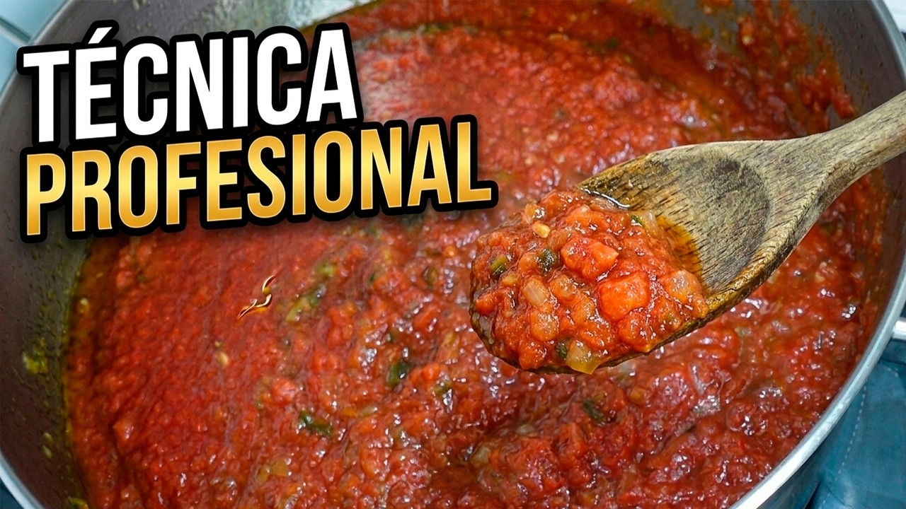
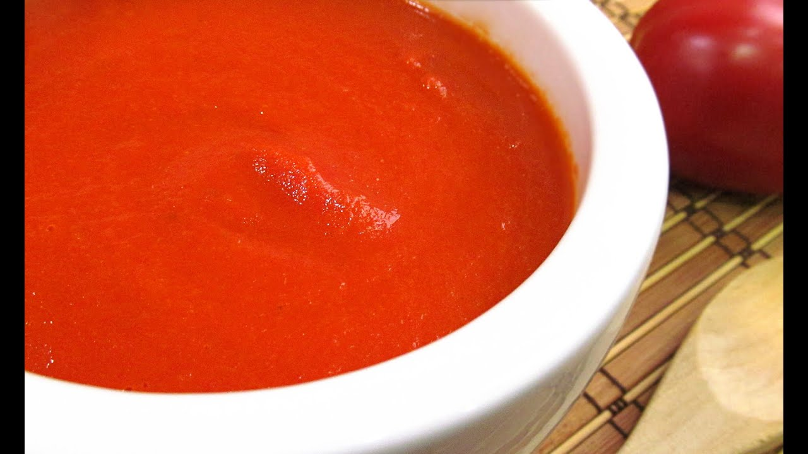
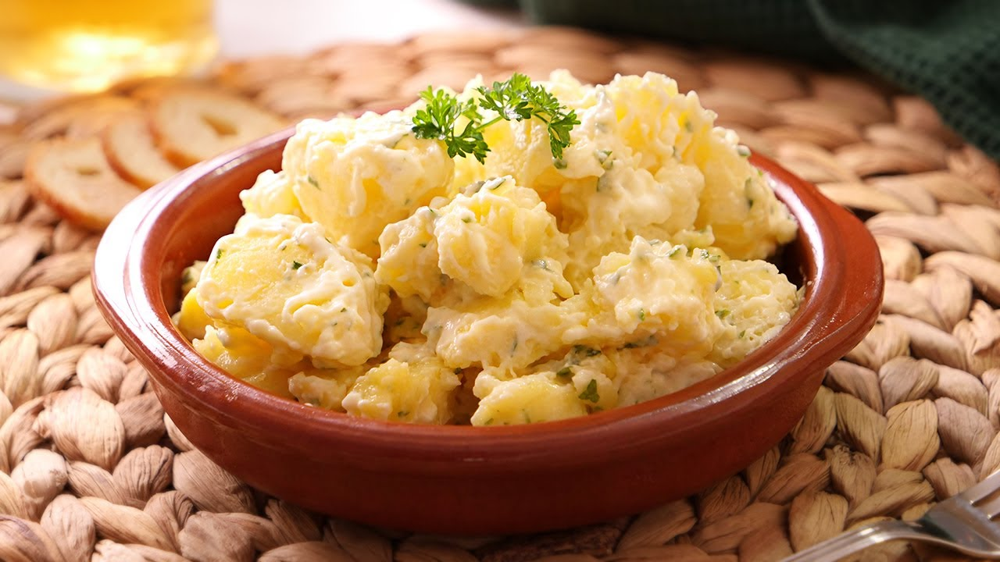
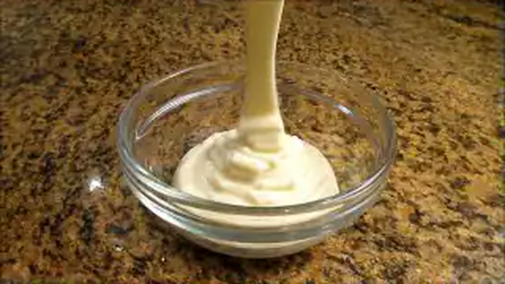
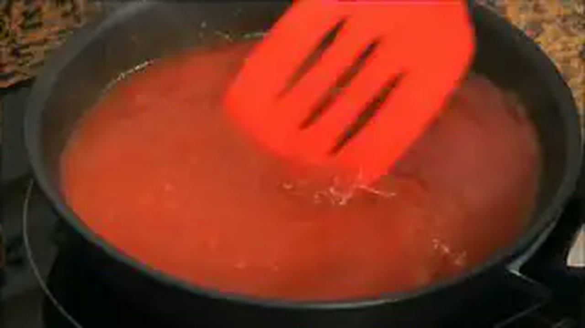
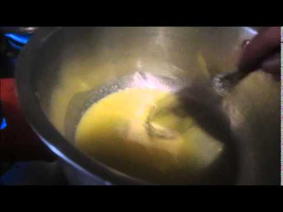
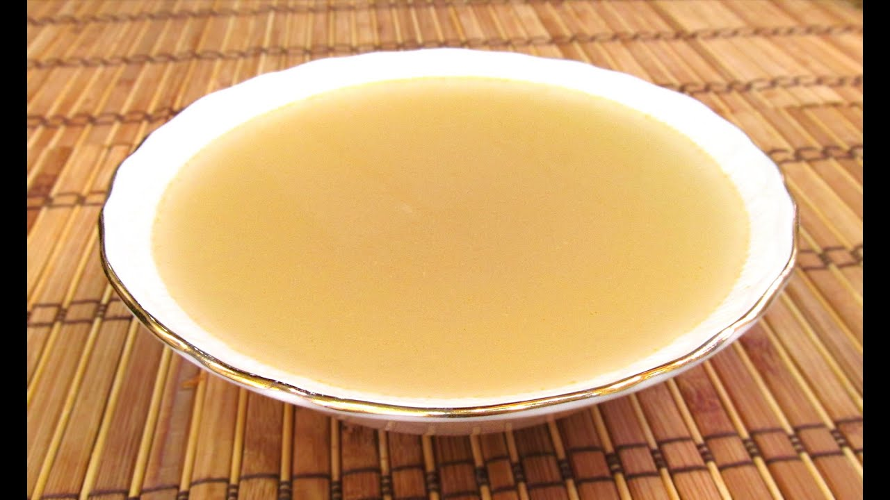
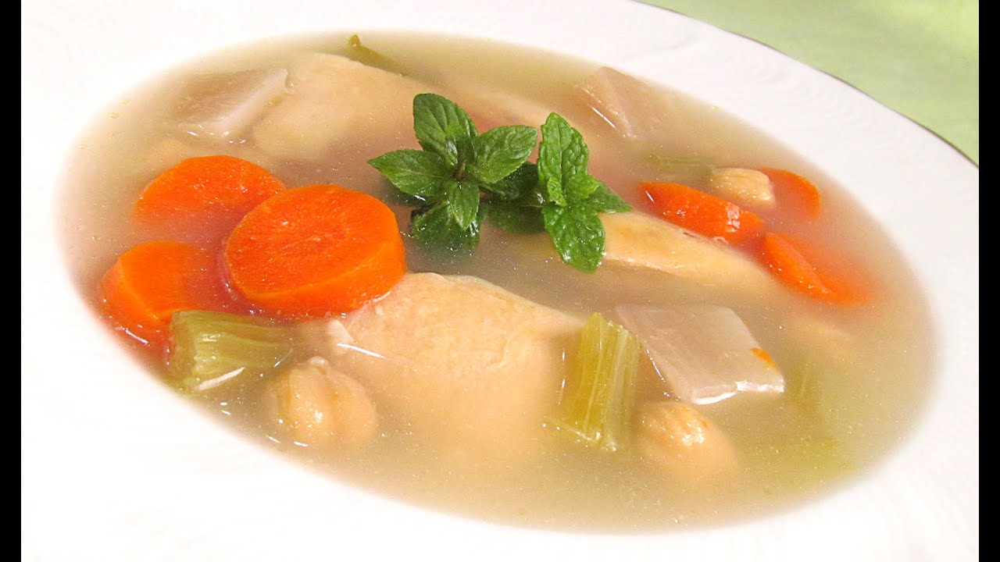

# 🍅 Master de Cocina Tradicional: Salsas, Sofritos, Fondos y Adobos de Carmen
> **Inspirado en la filosofía, técnica y maestría del canal *Cocina con Carmen***  
> *Recetario Técnico Enciclopédico Profesional, Tablas de Alérgenos UE (Reglamento 1169/2011), Protocolos de Batch Cooking, Dosificación de Cubiteras y Guías de Regeneración Multicanal*

---

## 📖 Prólogo Culinario: Los Cimientos Invisibles del Sabor y la Gran Cocina de Base

En la alta cocina doméstica y tradicional transmitida por **Cocina con Carmen**, los platos estelares —desde un arroz caldoso marinero hasta unas albóndigas en salsa o un guiso de legumbres— no adquieren su grandeza en el último hervor, sino en sus **bases invisibles**. Los sofritos, salsas madre, adobos y fondos constituyen la arquitectura química y aromática sobre la que se edifica cualquier elaboración:

1. **La Reacción de Maillard y el Pochado Lento en Grasa Noble (AOVE):** El sofrito no es un simple rehogado rápido; es una transformación termodinámica donde los azúcares naturales de la cebolla y los pimientos se caramelizan lentamente a temperaturas controladas (110–130°C). El Aceite de Oliva Virgen Extra actúa como vehículo de extracción de los compuestos liposolubles de los vegetales y especias (licopeno del tomate, capsaicina y carotenos del pimentón), fijándolos en la salsa.
2. **El Colágeno, la Gelatina y la Claridad de los Fondos:** Los caldos y fondos artesanos obtienen su untuosidad y cuerpo natural de la hidrólisis del colágeno presente en huesos y articulaciones de carnes o pescados, transformándolo en gelatina líquida que aporta viscosidad sedosa sin necesidad de espesantes artificiales. El control del hervor a fuego lento (sin ebullición violenta) evita la emulsión de grasas e impurezas, garantizando caldos cristalinos y limpios.
3. **El Equilibrio entre Grasa, Ácido y Emulsión:** En salsas frías o tibias (como la mayonesa por inmersión, el alioli al mortero o la salsa verde), el secreto reside en el control de la tensión interfacial entre la fase acuosa (zumo de limón, vinagre o fumet) y la fase lipídica (aceite virgen extra). La lecitina del huevo o los mucílagos del ajo y la gelatina del pescado actúan como surfactantes naturales.
4. **La Maduración y la Osmosis en los Adobos:** En la tradición andaluza del adobo, el vinagre de Jerez D.O.P., el ajo machacado y los aceites esenciales del comino y orégano silvestre penetran en la fibra muscular de pescados y carnes mediante difusión osmótica. Este proceso no solo aromatiza en profundidad, sino que reduce el pH del alimento, actuando como un conservante natural y ablandador de fibras.
5. **Estrategia Batch Cooking y Longevidad:** Disponer de fondos reducidos en cubiteras, sofritos madre congelados en porciones planas y tarros de tomate frito casero al baño María permite construir platos de restaurante en cuestión de minutos, garantizando una constancia culinaria profesional en el hogar.

---

```
                                  MAPA DE LAS BASES CULINARIAS
                                  
  ┌─────────────────────────────────┐       ┌─────────────────────────────────┐
  │     SOFRITOS Y CONCENTRADOS     │       │       FONDOS Y CALDOS BASE      │
  │ • 1. Sofrito Madre Universal    │       │ • 10. Fondo Oscuro Tostado      │
  │ • 2. Tomate Frito Concentrado   │       │ • 11. Fumet Rojo de Marisco     │
  │ • 8. Salsa Brava Tradicional    │       │ • 12. Caldo de Pollo y Jamón    │
  └────────────────┬────────────────┘       └────────────────┬────────────────┘
                   │                                         │
                   └───────────────────┬─────────────────────┘
                                       │
                    ┌──────────────────┴──────────────────┐
                    │     EMULSIONES, SALSAS Y ADOBOS     │
                    │ • 3. Bechamel Sedosa Sin Grumos     │
                    │ • 4. Alioli Casero al Mortero       │
                    │ • 5. Mayonesa Firme por Inmersión   │
                    │ • 6. Salsa Verde de Pescados        │
                    │ • 7. Salsa Española de Glaseado     │
                    │ • 9. Adobo Andaluz Tradicional      │
                    └─────────────────────────────────────┘
```

---

## 📑 Índice General de Recetas

1. [🥘 Sofrito Madre Universal de Carmen (Base Dorada Multiusos)](#1--sofrito-madre-universal-de-carmen-base-dorada-multiusos)
2. [🍅 Salsa de Tomate Frito Casero Reducido y Concentrado en AOVE](#2--salsa-de-tomate-frito-casero-reducido-y-concentrado-en-aove)
3. [🥛 Salsa Bechamel Perfecta y Sedosa Sin Grumos](#3--salsa-bechamel-perfecta-y-sedosa-sin-grumos)
4. [🧄 Salsa Alioli Casera Tradicional al Mortero (Emulsión Densa)](#4--salsa-alioli-casera-tradicional-al-mortero-emulsión-densa)
5. [🥚 Mayonesa Casera con Toque de Limón por Inmersión](#5--mayonesa-casera-con-toque-de-limón-por-inmersión)
6. [🌿 Salsa Verde Tradicional para Pescados y Mariscos](#6--salsa-verde-tradicional-para-pescados-y-mariscos)
7. [🍷 Salsa Española Oscura Reducida para Carnes y Albóndigas](#7--salsa-española-oscura-reducida-para-carnes-y-albóndigas)
8. [🌶️ Salsa Brava Casera Auténtica con Pimentón de la Vera](#8--salsa-brava-casera-auténtica-con-pimentón-de-la-vera)
9. [🐟 Adobo Andaluz Tradicional para Bienmesabe, Carnes y Pescados](#9--adobo-andaluz-tradicional-para-bienmesabe-carnes-y-pescados)
10. [🥩 Fondo Oscuro de Carne Casero Tostado y Gelatinoso](#10--fondo-oscuro-de-carne-casero-tostado-y-gelatinoso)
11. [🦐 Fumet Rojo de Pescado y Marisco Concentrado con Brandy](#11--fumet-rojo-de-pescado-y-marisco-concentrado-con-brandy)
12. [🍗 Caldo de Pollo de Corral y Hueso de Jamón Tradicional](#12--caldo-de-pollo-de-corral-y-hueso-de-jamón-tradicional)
13. [📊 Tabla Comparativa Maestra: Rendimientos, Costes, Tiempos y Conservación](#13--tabla-comparativa-maestra-rendimientos-costes-tiempos-y-conservación)
14. [🧊 Matriz de Congelación en Cubiteras y Dosificación Batch Cooking](#14--matriz-de-congelación-en-cubiteras-y-dosificación-batch-cooking)
15. [🛠️ Guía Rápida de Adaptación para Intolerancias y Dietas Especiales](#15-️-guía-rápida-de-adaptación-para-intolerancias-y-dietas-especiales)

---

## 1. 🥘 Sofrito Madre Universal de Carmen (Base Dorada Multiusos)
*Categoría: Concentrado Vegetal / Base de Arroces, Guisos, Legumbres y Estofados*



> 📺 **Vídeo Oficial de Elaboración:** [Ver en YouTube: SOFRITO BASE MADRE: La técnica profesional que CAMBIARÁ tus platos ✅](https://www.youtube.com/watch?v=65Crmgj3EaA)


> [!NOTE]
> El sofrito madre de Carmen es el corazón de la cocina mediterránea. No lleva prisa: el secreto radica en picar la verdura en brunoise milimétrica regular (2-3 mm) y pocharla en abundante AOVE durante 45 minutos a fuego muy suave hasta que pierda el 60% de su volumen de agua, concentrando los azúcares naturales sin tostar en exceso.

```
                      CRONOGRAMA DEL SOFRITO MADRE
                      
   0 min        15 min                 35 min           40 min      45 min
   ┌────────────┬──────────────────────┬────────────────┬───────────┐
   │ Ajo + AOVE │ Cebolla dulce        │ Tomate natural │ Pimentón  │ Reducción
   │ + Pimientos│ en pochado lento     │ rallado + sal  │ de la Vera│ confitada
   └────────────┴──────────────────────┴────────────────┴───────────┘
```

### 📋 Ficha Resumen
| Parámetro | Valor |
| :--- | :--- |
| **Tiempo de Preparación (Mise en place)** | 20 minutos |
| **Tiempo de Cocción** | 45 minutos |
| **Dificultad** | Fácil - Media (requiere paciencia y control de fuego) |
| **Rendimiento** | Aprox. 550–600 g de pasta concentrada (12-14 raciones base) |
| **Coste Estimado** | Muy Económico (3,20 € lote completo / 0,23 € por porción de 40 g) |

---

### ⚠️ Tabla de Alérgenos (Reglamento UE 1169/2011)

| Alérgeno | Estado | Ingrediente Causante / Medida de Adaptación |
| :--- | :---: | :--- |
| **Gluten** | 🟢 AUSENTE | 100% libre de cereales con gluten. |
| **Lácteos** | 🟢 AUSENTE | Elaborado exclusivamente con aceite vegetal. |
| **Huevos** | 🟢 AUSENTE | Sin trazas ni derivados. |
| **Sulfitos** | 🟢 AUSENTE | Sin sulfitos añadidos. |
| **Pescado / Crustáceos / Moluscos** | 🟢 AUSENTE | Base 100% vegetal limpia. |

---

### ⚖️ Ingredientes Exactos

#### Vegetales Frescos de Huerta
* **400 g** Cebolla dulce o cebolla recia pelada (picada en brunoise fina de 2 mm).
* **180 g** Pimiento verde italiano limpio y despepitado (en brunoise fina).
* **180 g** Pimiento rojo morrón carnoso limpio (en brunoise fina).
* **5 dientes (25 g)** Ajo morado de Las Pedroñeras pelado y picado finamente.
* **450 g** Tomate maduro de pera rallado a mano (desechando la piel).

#### Grasas, Especias y Condimentos
* **120 ml** Aceite de Oliva Virgen Extra (AOVE) de variedad Picual o Hojiblanca.
* **6 g** Sal marina fina.
* **4 g (1 cucharadita colmada)** Pimentón dulce de la Vera con D.O.P.
* **1 hoja** Laurel seco de monte.
* **1 g** Pimienta negra recién molida.

---

### 🍳 Equipamiento Necesario
* Cazuela ancha de fondo grueso o sartén honda de acero inoxidable / hierro fundido (Ø 28 cm).
* Tabla de corte grande y cuchillo cebollero bien afilado.
* Rallador de cuatro caras para el tomate.
* Espátula de madera de olivo o silicona resistente al calor.

---

### 👨‍🍳 Paso a Paso Técnico y Minucioso

1. **Aromatización del Aceite e Inicio de Pochado:**
   * Disponer los 120 ml de AOVE en la cazuela a fuego medio-bajo (130°C). Añadir los ajos picados y la hoja de laurel.
   * Cuando el ajo comience a bailar y desprenda aroma sin tomar color dorado (aprox. 1 minuto), verter de inmediato la cebolla, el pimiento verde y el pimiento rojo junto con 3 g de sal marina.
2. **Pochado Lento y Sudado de Hortalizas (20-25 minutos):**
   * Bajar el fuego al mínimo. Dejar que las hortalizas suden lentamente con la cazuela semi-tapada durante 20 minutos, removiendo cada 3-4 minutos.
   * La verdura debe volverse totalmente translúcida, tierna y reducir su volumen a la mitad. Los bordes comenzarán a adquirir un suave tono dorado miel gracias a la fructosa caramelizada.
3. **Adición del Tomate y Reducción del Agua Libre (15 minutos):**
   * Destapar la cazuela, subir ligeramente el fuego a medio-bajo e incorporar los 450 g de tomate rallado junto con el resto de la sal (3 g) y la pimienta negra.
   * Cocinar a fuego lento durante 15 minutos, permitiendo que el agua del tomate se evapore gradualmente mientras la pulpa se confita en el AOVE. Sabremos que está en su punto cuando el aceite empiece a separarse y burbujear limpio en los laterales.
4. **Toque Maestro de Pimentón y Reposo:**
   * Retirar la cazuela unos segundos del foco de calor directo para bajar la temperatura a 100°C. Añadir los 4 g de pimentón dulce de la Vera y remover durante 30 segundos continuos para que libere sus aromas esenciales sin quemarse (el pimentón quemado amarga irreversiblemente).
   * Devolver al fuego mínimo 1 minuto más, retirar la hoja de laurel y apagar el fuego. Dejar enfriar por completo a temperatura ambiente antes de envasar.

---

### 📦 Protocolo de Conservación y Batch Cooking

* **Refrigeración (2°C a 4°C):** Guardar en tarro de cristal hermético cubierto con una fina película de 5 ml de AOVE en la superficie. Conserva intacto su sabor durante **8 días**.
* **Congelación en Cubiteras (-18°C):** Repartir el sofrito frío en cubiteras de silicona (aprox. 30-35 g por cubo). Una vez congelados (4 horas), desmoldar los cubos y guardarlos en bolsas zip herméticas etiquetadas con fecha. Vida útil: **6 meses**.
* **Envasado al Vacío:** Envasar en bolsas de vacío de 150 g (ración para 4 personas). Aguanta **21 días en nevera** o **12 meses en congelador**.

---

### 🔥 Guía de Regeneración y Aplicación

* **Para Arroces y Paellas:** Añadir 2 cubos de sofrito (60-70 g) directamente en la paella caliente tras dorar la carne o marisco; rehogar 1 minuto con el arroz antes de verter el caldo hirviendo.
* **Para Guisos y Legumbres:** Incorporar 2-3 cubos congelados directamente al puchero al inicio del chup-chup.

---

## 2. 🍅 Salsa de Tomate Frito Casero Reducido y Concentrado en AOVE
*Categoría: Salsa de Tomate Confitada / Textura Mermelada Untuosa*



> 📺 **Vídeo Oficial de Elaboración:** [Ver en YouTube: Salsa de Tomate casera](https://www.youtube.com/watch?v=3aGqApVHmFk)


> [!TIP]
> El tomate frito de verdad de Carmen no es un puré aguado ni una salsa ácida. Se elabora pochando primero cebolla y ajo, añadiendo abundante AOVE y dejando que el tomate reduzca a fuego lentísimo durante más de 1 hora hasta perder toda su agua libre y adquirir un color rubí oscuro y un brillo acharolado.

### 📋 Ficha Resumen
| Parámetro | Valor |
| :--- | :--- |
| **Tiempo de Preparación** | 15 minutos |
| **Tiempo de Cocción** | 65-75 minutos |
| **Dificultad** | Fácil |
| **Rendimiento** | Aprox. 750 g de concentrado espeso (para 6-8 platos de pasta o guisos) |
| **Coste Estimado** | Muy Económico (3,60 € lote total) |

---

### ⚠️ Tabla de Alérgenos (Reglamento UE 1169/2011)

| Alérgeno | Estado | Ingrediente Causante / Medida de Adaptación |
| :--- | :---: | :--- |
| **Gluten** | 🟢 AUSENTE | Receta naturalmente sin gluten. |
| **Lácteos** | 🟢 AUSENTE | 100% vegetal. |
| **Huevos / Pescado / Soja** | 🟢 AUSENTE | Sin ingredientes de origen animal. |
| **Sulfitos** | 🟢 AUSENTE | Sin conservantes ni sulfitos. |

---

### ⚖️ Ingredientes Exactos

#### Base de Tomate y Aromáticos
* **1.600 g** Tomate maduro de pera (fresco escaldado y triturado o pulpa de tomate triturado 100% natural de lata de máxima calidad).
* **250 g** Cebolla dulce finamente picada.
* **4 dientes (20 g)** Ajo morado pelado y laminado fino.
* **120 ml** Aceite de Oliva Virgen Extra (AOVE) virgen extra.
* **8 g** Sal marina fina.
* **6 g** Azúcar blanco o panela de caña pura (ajustar según acidez del tomate).
* **1 g** Pimienta negra recién molida.
* **1 ramita** Albahaca fresca u orégano seco silvestre (opcional, al final).

---

### 👨‍🍳 Paso a Paso Técnico y Minucioso

1. **Confitado de Ajos y Cebolla:**
   * En una cazuela alta (para evitar salpicaduras), calentar los 120 ml de AOVE a fuego suave.
   * Añadir los ajos laminados; cuando aromaticen sin dorarse (1 min), verter la cebolla picada con 3 g de sal. Pochar durante **15 minutos** hasta que la cebolla esté tierna y caramelizada.
2. **Incorporación del Tomate y Cocción Lenta:**
   * Verter los 1.600 g de tomate triturado, el resto de la sal (5 g), el azúcar y la pimienta negra.
   * Mezclar enérgicamente y llevar a hervor suave. Bajar la potencia al mínimo, tapar parcialmente la cazuela con una tapa ladeada o tapa antisalpicaduras.
3. **Reducción y Confitura en Grasa (50-60 minutos):**
   * Cocinar a fuego lento durante una hora, removiendo con espátula de madera cada 5-7 minutos raspando el fondo para evitar que se pegue.
   * A medida que el agua se evapora, la mezcla pasará de un rojo claro acuoso a un tono carmesí denso. El tomate estará listo cuando el aceite se separe visiblemente de la pulpa y la salsa napa densamente una cuchara sin soltar una sola gota de agua en el plato.
4. **Aromatizado Final y Textura:**
   * Añadir la albahaca u orégano en los últimos 2 minutos de reposo fuera del fuego.
   * Si se desea una textura ultra fina de restaurante, pasar por un pasapurés o colador chino (evitar batidora eléctrica a alta velocidad para no incorporar aire y no decolorar el rojo intenso a naranja).

---

### 📦 Protocolo de Conservación y Batch Cooking

* **Conservas al Baño María (Despensa a temperatura ambiente):** Llenar tarros de cristal esterilizados hasta 1 cm del borde con el tomate hirviendo. Cerrar las tapas herméticamente y hervir los botes cubiertos de agua durante **25 minutos**. Dejar enfriar dentro del agua. Vida útil: **12 meses en despensa oscura y fresca**.
* **Refrigeración:** 7 días en nevera bien tapado.
* **Congelación:** En bolsas de congelación planas de 200 g o tarros de plástico aptos durante **6 meses**.

---

## 3. 🥛 Salsa Bechamel Perfecta y Sedosa Sin Grumos
*Categoría: Salsa Madre Blanca / Ligazón de Harina, Grasa y Leche*


> 📺 **Vídeo Oficial de Elaboración:** [Ver en YouTube: Cómo hacer Bechamel fácil y sin grumos en 3 minutos!](https://www.youtube.com/watch?v=YaUlZZ-TXmk)


> [!IMPORTANT]
> Los dos principios innegociables de Carmen para una bechamel de terciopelo son: **cocinar el roux (harina + mantequilla) al menos 3 minutos** a fuego medio para eliminar el sabor a almidón crudo, e incorporar **la leche SIEMPRE caliente/tibia en 3 tandas**, batiendo con varillas manuales sin descanso.

```
                  RATIOS Y TEXTURAS DE BECHAMEL (Por 1 Litro de Leche)
                  
   Mantequilla / AOVE   Harina de Trigo    Destino Culinario
   ────────────────────────────────────────────────────────────────────────
   • 45 g               45 g               Sopas crema y veloutés fluidas
   • 60 g               60 g               Napar lasañas, canelones y verduras
   • 85 g               85 g               Rellenos densos (berenjenas/huevos)
   • 110-120 g          110-120 g          Masa de croquetas tradicionales
```

### 📋 Ficha Resumen (Proporción para Napar Lasañas y Gratinados)
| Parámetro | Valor |
| :--- | :--- |
| **Tiempo de Preparación** | 5 minutos |
| **Tiempo de Cocción** | 15 minutos |
| **Dificultad** | Fácil |
| **Rendimiento** | Aprox. 650 ml de salsa bechamel sedosa |
| **Coste Estimado** | Muy Económico (1,40 € total) |

---

### ⚠️ Tabla de Alérgenos (Reglamento UE 1169/2011)

| Alérgeno | Estado | Ingrediente Causante / Medida de Adaptación |
| :--- | :---: | :--- |
| **Gluten** | 🔴 **PRESENTE** | Harina de trigo común. *Adaptación: sustituir por almidón de maíz (Maizena) disuelto en leche fría.* |
| **Lácteos** | 🔴 **PRESENTE** | Mantequilla y leche entera de vaca. *Adaptación: AOVE y bebida vegetal de avena sin azúcar o soja neutra.* |
| **Huevos / Pescado / Frutos secos** | 🟢 AUSENTE | No contiene estos alérgenos. |

---

### ⚖️ Ingredientes Exactos (Para 650 ml de Salsa)
* **45 g** Mantequilla pura sin sal (o 45 ml de AOVE suave).
* **45 g** Harina de trigo de repostería/común tamizada.
* **650 ml** Leche entera fresca de vaca calentada a 60°C.
* **3 g** Sal marina fina.
* **0,8 g** Nuez moscada entera recién rallada (imprescindible que sea fresca).
* **0,5 g** Pimienta blanca molida (para no manchar el color blanco puro de la salsa).

---

### 👨‍🍳 Paso a Paso Técnico y Minucioso

1. **Calentamiento de la Leche:**
   * En un cazo secundario o microondas, calentar los 650 ml de leche hasta que esté bien tibia/caliente (sin llegar a hervir para no formar nata superficial).
2. **Elaboración del Roux Blanco-Rubio:**
   * En una cazuela antiadherente de fondo térmico, fundir los 45 g de mantequilla a fuego medio-bajo (110°C).
   * Añadir los 45 g de harina tamizada de golpe. Remover continuamente con varillas metálicas durante **3 minutos cronometrados**. La mezcla burbujeará formando una pasta suave color marfil; esto garantiza que el gluten y el almidón se cocinen y pierdan el sabor a harina cruda.
3. **Adición de Leche en 3 Fases Térmicas:**
   * **Fase 1:** Verter aproximadamente 150 ml de leche caliente sobre el roux sin apartar del fuego. Batir enérgicamente con las varillas; la masa absorberá el líquido de inmediato formando una masa espesa y lisa.
   * **Fase 2:** Añadir otros 250 ml de leche caliente mientras se continúa batiendo con movimientos circulares rápidos. La mezcla se aflojará y comenzará a tomar consistencia de crema.
   * **Fase 3:** Verter el resto de la leche (250 ml). Mezclar hasta disolver cualquier posible resto.
4. **Cocción a Fuego Lento y Condimentado:**
   * Mantener a fuego medio-bajo dejando hervir a fuego muy lento durante **8-10 minutos**, removiendo periódicamente para que el almidón gelifique plenamente.
   * Incorporar la sal, la pimienta blanca y la nuez moscada recién rallada en el último minuto. Retirar del fuego.

---

### 📦 Protocolo de Conservación y Regeneración

* **Prevención de Costra (Piel):** Si no se va a usar de inmediato, colocar un trozo de film transparente en contacto directo (a piel) con la superficie de la bechamel aún caliente.
* **Refrigeración:** 4 días en recipiente hermético a 3°C.
* **Regeneración:** Al enfriar, la bechamel se compactará debido a la retrogradación del almidón. Para regenerar, calentar en cazo a fuego muy suave con 30-40 ml de leche templada batiendo con varillas; recuperará su textura cremosa original en 2 minutos.

---

## 4. 🧄 Salsa Alioli Casera Tradicional al Mortero (Emulsión Densa)
*Categoría: Emulsión Fría Tradicional / Ajo y Aceite Puro*



> 📺 **Vídeo Oficial de Elaboración:** [Ver en YouTube: Patatas con Alioli muy Fácil, Económica y Deliciosa](https://www.youtube.com/watch?v=KlMqj64PNvc)


> [!NOTE]
> El auténtico alioli (all-i-oli) de la costa mediterránea consta únicamente de ajo, sal y aceite de oliva. Para quienes buscan la máxima estabilidad sin riesgo de corte en el día a día doméstico, Carmen enseña el método purista al mortero con la adición magistral de 1 yema de huevo o unas gotas de limón frío que garantizan un cuerpo firme donde una cuchara se sostiene de pie.

```
                      MECÁNICA DE LA EMULSIÓN EN MORTERO
                      
   Mortero de Mármol      Majado de Ajos        AOVE en Hilo Fino       Emulsión Densa
   ┌────────────────┐     ┌──────────────┐      ┌─────────────────┐     ┌───────────────┐
   │ Dientes de ajo │ ──> │ Pasta sedosa │  ──> │ Caída gota a    │ ──> │ Pomada densa  │
   │ + sal gruesa   │     │ sin grumos   │      │ gota + fricción │     │ brillante     │
   └────────────────┘     └──────────────┘      └─────────────────┘     └───────────────┘
```

### 📋 Ficha Resumen
| Parámetro | Valor |
| :--- | :--- |
| **Tiempo de Preparación** | 12 minutos |
| **Tiempo de Cocción** | 0 minutos (elaboración en frío) |
| **Dificultad** | Media - Alta (exige coordinación y paciencia en el batido) |
| **Rendimiento** | Aprox. 240 g de salsa densa (6-8 personas) |
| **Coste Estimado** | Económico (1,60 € total) |

---

### ⚠️ Tabla de Alérgenos (Reglamento UE 1169/2011)

| Alérgeno | Estado | Ingrediente Causante / Medida de Adaptación |
| :--- | :---: | :--- |
| **Gluten / Lácteos / Frutos secos** | 🟢 AUSENTE | Formulación naturalmente limpia. |
| **Huevos** | ⚠️ *Condicional* | Solo si se utiliza la variante estabilizada con yema de huevo. En la receta 100% purista (solo ajo y AOVE), está 🟢 AUSENTE. |
| **Sulfitos** | 🟢 AUSENTE | Sin sulfitos. |

---

### ⚖️ Ingredientes Exactos

#### Fórmula Clásica Estabilizada
* **3 dientes medianos (18 g)** Ajo morado fresco de Las Pedroñeras (retirado el germen interior verde para evitar amargor y repetición).
* **3 g** Sal marina gruesa (ayuda a la fricción abrasiva durante el majado).
* **200 ml** Aceite de Oliva Virgen Extra suave (variedad Arbequina, Empeltre o mezcla 70% girasol alto oleico / 30% Picual para no resultar excesivamente picante).
* **1 unidad (20 g)** Yema de huevo de gallina campera a temperatura ambiente (opcional, técnica de seguridad).
* **5 ml (1 cucharadita)** Zumo de limón recién exprimido.

---

### 👨‍🍳 Paso a Paso Técnico y Minucioso

1. **Majado Abrasivo del Ajo:**
   * En un mortero pesado de piedra o cerámica, colocar los 3 dientes de ajo troceados junto con los 3 g de sal gruesa.
   * Majar con la maza realizando movimientos circulares y de presión continua hasta reducir el ajo a una papilla o pomada completamente lisa y translúcida, sin el menor trozo sólido.
2. **Inicio de la Emulsión:**
   * Añadir la yema de huevo (si se utiliza) y los 5 ml de zumo de limón a la pasta de ajo. Mezclar con la maza hasta homogeneizar.
3. **Incorporación del Aceite Gota a Gota:**
   * Con la mano izquierda, sostener la aceitera o biberón vertiendo el aceite **gota a gota** en el borde del mortero.
   * Con la mano derecha, girar la maza con ritmo constante y siempre en el **mismo sentido de giro (horario)**, frotando el fondo y las paredes del mortero.
4. **Montado y Espesamiento:**
   * A medida que la emulsión atrapa el aceite, la salsa irá blanqueando y ganando un cuerpo extraordinario. Cuando haya tomado consistencia, el aceite puede verterse en un hilo muy fino y continuo sin dejar de remover.
   * La salsa estará lista cuando adquiera una textura semejante a una mantequilla pomada brillante y emita un sonido denso al ser batida.

---

### 📦 Protocolo de Conservación y Seguridad Alimentaria

* **Refrigeración Estricta:** Debido a la presencia de huevo crudo y ajo fresco, conservar en recipiente de cristal hermético en la zona más fría de la nevera (2°C a 4°C) por un **máximo de 48 horas**.
* **Precaución:** No congelar (las emulsiones frías colapsan y se cortan al descongelar debido a la cristalización del agua libre).

---

## 5. 🥚 Mayonesa Casera con Toque de Limón por Inmersión
*Categoría: Emulsión Fría Rápida / Técnica de Batidora Sin Fallo*



> 📺 **Vídeo Oficial de Elaboración:** [Ver en YouTube: Cómo hacer Mayonesa Casera SIN que se corte | Garantizado!!](https://www.youtube.com/watch?v=Xx1IgbRh3bU)


> [!TIP]
> La regla de oro de Carmen para que la mayonesa **NUNCA se corte** en la batidora de mano es simple: el huevo y el aceite deben estar a la **misma temperatura ambiente (20–22°C)**. Colocar el brazo de la batidora en el fondo del vaso, encender a máxima potencia y **NO levantarlo durante los primeros 15 segundos**.

### 📋 Ficha Resumen
| Parámetro | Valor |
| :--- | :--- |
| **Tiempo de Preparación** | 3 minutos |
| **Tiempo de Cocción** | 0 minutos |
| **Dificultad** | Muy Fácil |
| **Rendimiento** | Aprox. 260 ml (1 tarro mediano) |
| **Coste Estimado** | Muy Económico (0,90 € total) |

---

### ⚠️ Tabla de Alérgenos (Reglamento UE 1169/2011)

| Alérgeno | Estado | Ingrediente Causante / Medida de Adaptación |
| :--- | :---: | :--- |
| **Huevos** | 🔴 **PRESENTE** | Huevo fresco entero. *Adaptación: lactonesa con 80 ml de leche entera pasteurizada o aquafaba (agua de garbanzos) para versión vegana.* |
| **Gluten / Lácteos / Pescado** | 🟢 AUSENTE | Libre de estos alérgenos. |

---

### ⚖️ Ingredientes Exactos
* **1 unidad (60 g)** Huevo fresco entero tamaño L (a temperatura ambiente).
* **200 ml** Aceite (100 ml AOVE variedad suave Arbequina + 100 ml Aceite de Girasol Alto Oleico para equilibrar sabor).
* **10 ml (1 cucharada)** Zumo de limón recién colado (o vinagre de manzana).
* **3 g** Sal marina fina.
* **1 pizca (opcional)** Mostaza de Dijon (0,5 g, aporta lecitina y un sutil matiz).

---

### 👨‍🍳 Paso a Paso Técnico y Minucioso

1. **Disposición por Densidades en el Vaso:**
   * En el vaso estrecho de la batidora eléctrica (minipimer), cascar el huevo en el fondo cuidando de no romper la yema.
   * Añadir la sal marina, el zumo de limón y verter suavemente los 200 ml de aceite sobre el huevo. El huevo quedará sumergido en el fondo por su mayor densidad.
2. **Emulsión por Inmersión:**
   * Introducir el cabezal de la batidora hasta apoyarlo firmemente en el fondo del vaso, cubriendo la yema de huevo.
   * Accionar la batidora a velocidad media-alta manteniéndola **completamente quieta en el fondo durante 12-15 segundos**. Se observará cómo se forma una emulsión blanca espesa en la base que va subiendo hacia la superficie.
3. **Ligado Final:**
   * Cuando la mitad inferior esté totalmente emulsionada, inclinar suavemente el cabezal y comenzar a subirlo muy despacio hacia la superficie para integrar el aceite restante durante 5 segundos.
   * Probar de sal y acidez, rectificar si fuera necesario con unas gotas más de limón y dar dos pulsaciones finales.

---

### 📦 Protocolo de Conservación

* **Refrigeración:** Tapar con film o tapa hermética inmediatamente tras su preparación. Conservar en nevera a 3°C por un **máximo de 72 horas**.
* **Solución de Emergencia si se Corta:** En un vaso limpio poner 1 cucharada de agua tibia (15 ml); encender la batidora e incorporar la mayonesa cortada en hilo fino; emulsionará al instante.

---

## 6. 🌿 Salsa Verde Tradicional para Pescados y Mariscos
*Categoría: Salsa Caliente Ligada / Clásico Vasco-Mediterráneo*


> 📺 **Vídeo Oficial de Elaboración:** [Ver en YouTube: Merluza en Salsa Verde | Receta de Pescado muy Fácil y Rápida](https://www.youtube.com/watch?v=N0wn91UNU1A)


> [!NOTE]
> La salsa verde perfecta de Carmen no depende de espesantes pesados, sino de la sutil ligazón entre el colágeno y los jugos del pescado/marisco, el vino blanco evaporado, un roux rubio muy ligero (solo 10 g de harina) y un perejil fresco picado y añadido en el último instante para que no pierda su clorofila ni su perfume.

### 📋 Ficha Resumen
| Parámetro | Valor |
| :--- | :--- |
| **Tiempo de Preparación** | 10 minutos |
| **Tiempo de Cocción** | 12 minutos |
| **Dificultad** | Fácil |
| **Rendimiento** | Aprox. 420 ml de salsa verde sedosa (para 4 raciones de merluza, rape o almejas) |
| **Coste Estimado** | Económico (1,80 € total) |

---

### ⚠️ Tabla de Alérgenos (Reglamento UE 1169/2011)

| Alérgeno | Estado | Ingrediente Causante / Medida de Adaptación |
| :--- | :---: | :--- |
| **Gluten** | 🔴 **PRESENTE** | Harina de trigo común en el roux. *Adaptación: fécula de maíz (Maizena) o reducción natural sin harina por vaivén.* |
| **Sulfitos** | 🔴 **PRESENTE** | Vino blanco seco. |
| **Pescado** | ⚠️ *Condicional* | Fumet de pescado utilizado como base líquida. |
| **Lácteos / Huevos** | 🟢 AUSENTE | Sin derivados lácteos ni huevos. |

---

### ⚖️ Ingredientes Exactos
* **4 dientes (20 g)** Ajo morado finamente picado en brunoise.
* **25 g** Perejil fresco de hoja lisa (solo hojas y tallos tiernos, picados muy finos a cuchillo).
* **10 g (1 cucharada rasa)** Harina de trigo común.
* **100 ml** Vino blanco seco de buena acidez (tipo Rueda Verdejo, Txakoli o Manzanilla de Sanlúcar).
* **300 ml** Fumet de pescado casero caliente (o caldo suave de marisco).
* **50 ml** Aceite de Oliva Virgen Extra (AOVE).
* **3 g** Sal marina fina y 1 pizca de pimienta blanca.
* **1/2 guindilla cayena** (opcional, para un sutil toque picante tradicional).

---

### 👨‍🍳 Paso a Paso Técnico y Minucioso

1. **Aromatizado del Aceite:**
   * En una cazuela baja y ancha (preferiblemente de barro esmaltado o acero inoxidable), calentar los 50 ml de AOVE a fuego medio-bajo.
   * Incorporar los ajos picados y la media guindilla cayena. Cocinar durante 1-2 minutos cuidando estrictamente que el ajo adquiera un tono marfil tierno y **nunca marrón** para evitar notas amargas.
2. **Cocción del Roux Verde:**
   * Añadir los 10 g de harina y la mitad del perejil picado. Remover con varilla o cuchara de madera durante **1 minuto** para cocinar la harina en el aceite perfumado.
3. **Desglasado y Reducción Alcohólica:**
   * Verter los 100 ml de vino blanco seco de golpe. Subir a fuego medio y dejar hervir con burbuja viva durante **2 minutos** para evaporar el alcohol etílico y concentrar la acidez floral del vino.
4. **Adición del Fumet y Emulsión por Vaivén:**
   * Verter gradualmente los 300 ml de fumet de pescado caliente mientras se remueve continuamente con las varillas.
   * Bajar a fuego medio-suave y cocinar durante **6-8 minutos** hasta que la salsa ligue en una crema esmeralda brillante.
   * Añadir el resto del perejil fresco picado y la sal en el último minuto.
5. **Servicio con Pescados:**
   * Si se preparan lomos de merluza o almejas, colocarlos directamente en la salsa los últimos 4 minutos de cocción, moviendo la cazuela en vaivén circular continuo para que la gelatina del pescado emulsione la salsa a la perfección.

---

### 📦 Protocolo de Conservación y Regeneración

* **Refrigeración:** Conservar hasta por **3 días** en recipiente cerrado a 3°C.
* **Regeneración:** Calentar en cazuela a fuego suave con 2 cucharadas de fumet o agua; no hervir violentamente para preservar el color verde vivo del perejil.

---

## 7. 🍷 Salsa Española Oscura Reducida para Carnes y Albóndigas
*Categoría: Salsa Madre Oscura / Glaseado Untuoso de Carne y Bresa*


> 📺 **Vídeo Oficial de Elaboración:** [Ver en YouTube: Albóndigas en salsa española: Un homenaje a la cocina tradicional](https://www.youtube.com/watch?v=9J-dvHmqN1w)


> [!TIP]
> La salsa española magistral de Carmen logra su intenso color caoba y sabor profundo sin aditivos artificiales gracias a dos pilares: tostar bien el roux de harina en mantequilla/AOVE hasta que huela a fruto seco, y reducir un buen fondo oscuro de carne casero con vino tinto de crianza o vino oloroso de Jerez.

### 📋 Ficha Resumen
| Parámetro | Valor |
| :--- | :--- |
| **Tiempo de Preparación** | 15 minutos |
| **Tiempo de Cocción** | 35 minutos |
| **Dificultad** | Media |
| **Rendimiento** | Aprox. 380–400 ml de salsa espesa brillante (napado perfecto) |
| **Coste Estimado** | Económico (2,40 € total) |

---

### ⚠️ Tabla de Alérgenos (Reglamento UE 1169/2011)

| Alérgeno | Estado | Ingrediente Causante / Medida de Adaptación |
| :--- | :---: | :--- |
| **Gluten** | 🔴 **PRESENTE** | Harina de trigo tostada. *Adaptación: tostar harina de arroz o ligar al final con Maizena exprés.* |
| **Sulfitos** | 🔴 **PRESENTE** | Vino tinto o vino oloroso de Jerez. |
| **Apio** | ⚠️ *Opcional* | Si el fondo oscuro de carne incluye bresa de apio. |
| **Lácteos** | ⚠️ *Opcional* | Si se usa mantequilla para el roux; sustituible 100% por AOVE. |

---

### ⚖️ Ingredientes Exactos
* **1 unidad (150 g)** Cebolla dulce en brunoise fina.
* **1 unidad pequeña (80 g)** Zanahoria pelada y picada muy fina.
* **2 dientes (10 g)** Ajo morado picado.
* **40 g** Grasa (20 g Mantequilla sin sal + 20 ml AOVE).
* **30 g** Harina de trigo común.
* **120 ml** Vino tinto con cuerpo (D.O. Rioja/Ribera) o Vino Oloroso seco de Jerez.
* **550 ml** Fondo Oscuro de Carne tostado casero caliente (ver receta 10).
* **15 g (1 cucharada)** Concentrado de tomate doble o tomate frito casero.
* **1 ramillete** Tomillo fresco y 1 hoja de laurel.
* **3 g** Sal marina y pimienta negra recién molida.

---

### 👨‍🍳 Paso a Paso Técnico y Minucioso

1. **Caramelización de la Bresa Vegetal:**
   * En una cazuela a fuego medio, calentar la grasa (mantequilla y AOVE). Añadir la cebolla, la zanahoria y el ajo con una pizca de sal.
   * Pochar durante **12-15 minutos** hasta que las verduras adquieran un tono dorado oscuro caramelizado.
2. **Elaboración del Roux Oscuro:**
   * Incorporar los 30 g de harina a la cazuela. Cocinar a fuego medio removiendo continuamente durante **4-5 minutos** hasta que la harina se tueste y adquiera un color avellana tostado con aroma a galleta.
   * Añadir los 15 g de concentrado de tomate y mezclar 1 minuto.
3. **Desglasado con Vino y Evaporación:**
   * Verter los 120 ml de vino tinto/oloroso raspando el fondo de la cazuela con la espátula para desglasar todos los azúcares adheridos.
   * Dejar reducir a fuego vivo durante **3 minutos** hasta que el vino se reduzca a la mitad y desaparezca el aroma punzante del alcohol.
4. **Adición del Fondo y Reducción Lenta:**
   * Incorporar los 550 ml de fondo oscuro caliente, el tomillo y el laurel.
   * Cocinar a fuego lento durante **20 minutos**, desespumando cualquier impureza que suba a la superficie, hasta que la salsa reduzca y napa el dorso de una cuchara de madera.
5. **Colado y Textura de Terciopelo:**
   * Pasar la salsa por un colador chino o estameña apretando bien las verduras con la maza para extraer todo el jugo concentrado. Probar de sal y pimienta.

---

### 📦 Protocolo de Conservación y Batch Cooking

* **Refrigeración:** 5 días en tarro hermético.
* **Congelación en Bolsas o Cubiteras:** Hasta **6 meses**. Perfecta para descongelar 3 cubos y napar filetes a la plancha, albóndigas o solomillos al instante.

---

## 8. 🌶️ Salsa Brava Casera Auténtica con Pimentón de la Vera
*Categoría: Salsa Caliente Emulsionada / Clásico de Taberna Madrileña*



> 📺 **Vídeo Oficial de Elaboración:** [Ver en YouTube: Mejillones en Salsa Picante | Salsa Brava | Receta muy Sencilla y Deliciosa](https://www.youtube.com/watch?v=Q2UG8WFg7Us)


> [!NOTE]
> La salsa brava tradicional madrileña que defiende Carmen **no lleva kétchup ni tomate frito comercial**. Su textura untuosa y su color rojo fuego se obtienen a partir de una velouté con cebolla pochadísima, caldo de cocido o jamón y una mezcla maestra de **pimentón dulce y picante de la Vera** ligada con vinagre de Jerez.

### 📋 Ficha Resumen
| Parámetro | Valor |
| :--- | :--- |
| **Tiempo de Preparación** | 10 minutos |
| **Tiempo de Cocción** | 20 minutos |
| **Dificultad** | Fácil |
| **Rendimiento** | Aprox. 350 ml (para 4-6 raciones generosas de patatas bravas) |
| **Coste Estimado** | Muy Económico (1,10 € total) |

---

### ⚠️ Tabla de Alérgenos (Reglamento UE 1169/2011)

| Alérgeno | Estado | Ingrediente Causante / Medida de Adaptación |
| :--- | :---: | :--- |
| **Gluten** | 🔴 **PRESENTE** | Harina de trigo de la velouté. *Adaptación: harina de arroz o almidón de maíz.* |
| **Sulfitos** | 🔴 **PRESENTE** | Vinagre de Jerez D.O.P. |
| **Lácteos / Huevos / Frutos secos** | 🟢 AUSENTE | Formulación sin alérgenos lácteos ni huevos. |

---

### ⚖️ Ingredientes Exactos
* **150 g** Cebolla dulce picada muy fina en brunoise.
* **2 dientes (10 g)** Ajo morado picado.
* **50 ml** Aceite de Oliva Virgen Extra (AOVE).
* **20 g (1 cucharada colmada)** Harina de trigo común.
* **8 g (1 cucharada sopera rasa)** Pimentón picante de la Vera D.O.P.
* **8 g (1 cucharada sopera rasa)** Pimentón dulce de la Vera D.O.P.
* **320 ml** Caldo de cocido, jamón o pollo caliente desgrasado.
* **15 ml (1 cucharada)** Vinagre de Jerez de calidad.
* **2 g** Sal marina fina.
* **1 punta de cayena molida** (opcional, para nivel de picante extra).

---

### 👨‍🍳 Paso a Paso Técnico y Minucioso

1. **Pochado Profundo:**
   * Calentar el AOVE en una sartén a fuego medio. Añadir el ajo y la cebolla con una pizca de sal. Pochar durante **12 minutos** a fuego suave hasta que la cebolla esté dorada y tierna.
2. **Tostado de Harina y Pimentones:**
   * Añadir la harina y cocinarla durante **2 minutos** removiendo con varillas para eliminar sabor a crudo.
   * Retirar la sartén del fuego para evitar quemar el pimentón. Añadir el pimentón dulce y el picante junto con la cayena; remover durante **20 segundos** para que el aceite caliente absorba los pigmentos y aromas del pimentón.
3. **Desglasado y Ligazón:**
   * Verter de inmediato el vinagre de Jerez y el caldo de pollo/cocido caliente poco a poco mientras se bate vigorosamente con las varillas.
   * Regresar al fuego medio-bajo y cocinar durante **8-10 minutos**, dejando que la salsa espese y adquiera una textura brillante y sedosa.
4. **Triturado y Colado Fino:**
   * Pasar la salsa por el vaso de la batidora o procesador de alimentos a alta potencia durante 1 minuto hasta obtener una crema lisa. Colar por colador fino para retirar cualquier impureza.

---

### 📦 Protocolo de Conservación y Regeneración

* **Refrigeración:** Hasta **7 días** en tarro de cristal hermético en nevera.
* **Congelación:** 3 meses en bolsas zip o tarros pequeños. Regenerar a fuego suave removiendo con varillas.

---

## 9. 🐟 Adobo Andaluz Tradicional para Bienmesabe, Carnes y Pescados
*Categoría: Marinada y Conserva Aromática / Tradición de San Fernando y Cádiz*


> 📺 **Vídeo Oficial de Elaboración:** [Ver en YouTube: COSTILLAS DE CERDO EN ADOBO](https://www.youtube.com/watch?v=WADY6EtJq70)


> [!IMPORTANT]
> El adobo andaluz de Carmen (el alma del cazón en adobo o bienmesabe, del lomo y de las alitas de pollo) requiere un equilibrio milimétrico entre el vinagre de Jerez, el agua (para rebajar la agresividad ácida sin perder potencia), el orégano silvestre y el comino en grano majado en mortero.

```
                      MECÁNICA OSMÓTICA DEL ADOBO ANDALUZ
                      
   Majado de Especias     Fase Líquida Equilibrada   Inmersión Proteica (Frío)
   ┌────────────────┐     ┌────────────────────────┐  ┌───────────────────────┐
   │ Ajo + Comino   │ ──> │ 50% Vinagre de Jerez   │─>│ Cazón / Pollo / Lomo  │
   │ + Sal + Orégano│     │ 50% Agua mineral fría  │  │ 12-24 h a 3°C en frío │
   └────────────────┘     └────────────────────────┘  └───────────────────────┘
```

### 📋 Ficha Resumen
| Parámetro | Valor |
| :--- | :--- |
| **Tiempo de Preparación** | 10 minutos |
| **Tiempo de Maceración** | 12 a 24 horas (en frío a 3°C) |
| **Dificultad** | Muy Fácil |
| **Rendimiento** | Aprox. 420 ml de adobo líquido (rinde para marinar 1 kg de cazón, pollo o lomo) |
| **Coste Estimado** | Muy Económico (1,50 € total) |

---

### ⚠️ Tabla de Alérgenos (Reglamento UE 1169/2011)

| Alérgeno | Estado | Ingrediente Causante / Medida de Adaptación |
| :--- | :---: | :--- |
| **Sulfitos** | 🔴 **PRESENTE** | Vinagre de Jerez con D.O.P. |
| **Gluten** | 🟢 AUSENTE | La marinada es 100% libre de gluten. *(Nota: el enharinado posterior para freír sí lleva harina de trigo o garbanzo).* |
| **Lácteos / Huevos / Soja** | 🟢 AUSENTE | Sin trazas. |

---

### ⚖️ Ingredientes Exactos (Para 1 kg de Pescado o Carne)
* **6 dientes (30 g)** Ajo morado con piel, aplastados de un golpe de cuchillo.
* **12 g (2 cucharadas colmadas)** Orégano seco silvestre andaluz de monte.
* **6 g (1 cucharadita colmada)** Comino en grano entero (tostado 1 minuto en sartén seca).
* **12 g (1 cucharada sopera colmada)** Pimentón dulce de la Vera D.O.P.
* **2 hojas** Laurel seco rasgadas por la mitad.
* **10 g** Sal marina gruesa.
* **180 ml** Vinagre de Jerez D.O.P. (o vinagre de vino blanco de buena solera).
* **180 ml** Agua mineral fría (para equilibrar el pH).
* **40 ml** Vino blanco seco (opcional, para redondear matices florales).

---

### 👨‍🍳 Paso a Paso Técnico y Minucioso

1. **Tostado y Majado Aromático:**
   * En una sartén pequeña sin aceite a fuego medio, tostar los 6 g de comino en grano durante 60 segundos hasta que desprendan sus aceites esenciales.
   * Pasar los cominos al mortero junto con la sal gruesa y los ajos aplastados; majar enérgicamente hasta romper los ajos y triturar las semillas de comino.
2. **Integración de Líquidos y Especias:**
   * En un bol amplio de cristal o acero inoxidable (nunca aluminio reactivo), verter el majado del mortero.
   * Añadir el pimentón dulce de la Vera, el orégano silvestre y las hojas de laurel rotas.
   * Incorporar los 180 ml de vinagre de Jerez, los 180 ml de agua mineral fría y el vino blanco. Mezclar con varilla hasta disolver completamente la sal y emulsionar el pimentón.
3. **Protocolo de Maceración por Tipo de Proteína:**
   * **Cazón / Tintorera / Pez Espada (cortado en tacos de 3 cm):** Macerar cubierto en la marinada durante **12 a 16 horas** en nevera a 3°C.
   * **Lomo de Cerdo / Costillas / Pollo:** Macerar durante **24 a 36 horas** en frío.
4. **Técnica de Fritura Andaluza Posterior:**
   * Escurrir los trozos de adobo en un colador durante 15 minutos; secar ligeramente con papel absorbente. Pasar por harina especial de pescado o harina de garbanzo y freír en abundante AOVE bien caliente (180°C) durante 2 minutos hasta conseguir una costra crujiente exterior y un interior jugoso.

---

### 📦 Protocolo de Conservación

* **Líquido de Adobo Base (sin carne/pescado):** Guardar en botella de cristal en nevera hasta por **3 semanas**.
* **Proteína Marinada:** Una vez completado el tiempo de maceración, escurrir y congelar los tacos marinados en bolsas de vacío hasta por **3 meses**.

---

## 10. 🥩 Fondo Oscuro de Carne Casero Tostado y Gelatinoso
*Categoría: Fondo Mayor / Caldo Concentrado de Ternera y Huesos Tostados*



> 📺 **Vídeo Oficial de Elaboración:** [Ver en YouTube: FONDO CLARO FONDO OSCURO EN GASTRONOMIA](https://www.youtube.com/watch?v=K6r8q-iZf1M)


> [!TIP]
> La riqueza inconfundible de este fondo oscuro reside en el **tostado profundo de los huesos y la bresa en el horno a 220°C** hasta alcanzar un color pardo dorado (reacción de Maillard). Al cocer a fuego lentísimo durante 6 horas, el colágeno del tuétano y los cartílagos se transforma en gelatina pura que cuaja en bloque al enfriar.

### 📋 Ficha Resumen
| Parámetro | Valor |
| :--- | :--- |
| **Tiempo de Preparación** | 20 minutos |
| **Tiempo de Horno y Cocción** | 50 min de horno + 6 horas de hervor lento |
| **Dificultad** | Media (requiere paciencia y desespumado riguroso) |
| **Rendimiento** | Aprox. 1,4–1,5 litros de fondo oscuro concentrado |
| **Coste Estimado** | Medio (5,80 € lote total / 0,19 € por cubo concentrado) |

---

### ⚠️ Tabla de Alérgenos (Reglamento UE 1169/2011)

| Alérgeno | Estado | Ingrediente Causante / Medida de Adaptación |
| :--- | :---: | :--- |
| **Sulfitos** | 🔴 **PRESENTE** | Vino tinto usado para desglasar la bandeja de horno. |
| **Apio** | 🔴 **PRESENTE** | Rama de apio en la bresa aromática. *Adaptación: omitir si hay alergia específica.* |
| **Gluten / Lácteos / Huevos** | 🟢 AUSENTE | 100% natural sin espesantes. |

---

### ⚖️ Ingredientes Exactos
* **1.200 g** Huesos de ternera (rodilla, caña con tuétano y recortes de espinazo).
* **600 g** Falda, morcillo o recortes de carne de ternera con tendones.
* **1 unidad (200 g)** Pie de cerdo o manita de ternera limpia (fuente excepcional de colágeno natural).
* **300 g** Cebolla recia con piel limpia cortada en cuartos.
* **200 g** Zanahorias troceadas en trozos grandes.
* **150 g** Puerro (parte blanca y verde clara).
* **1 rama (50 g)** Apio verde.
* **1 cabeza entera** Ajo cortada transversalmente por la mitad.
* **60 g** Concentrado de tomate doble pasta.
* **200 ml** Vino tinto con cuerpo (D.O. Rioja o similar).
* **4,5 litros** Agua mineral fría.
* **Aromáticos:** 2 hojas de laurel, 4 ramas de tomillo fresco, 1 rama de romero, 10 granos de pimienta negra.
* **20 ml** AOVE.

---

### 👨‍🍳 Paso a Paso Técnico y Minucioso

1. **Tostado Profundo en Horno (Maillard):**
   * Precalentar el horno a **220°C con calor arriba y abajo**.
   * En una bandeja de horno amplia, disponer los huesos, el pie de cerdo y la carne de ternera untados con 20 ml de AOVE. Hornear durante **30 minutos**.
   * Añadir a la bandeja las cebollas, zanahorias, puerro, apio, ajos y el concentrado de tomate untado sobre los huesos. Hornear **20 minutos adicionales** hasta que todo esté intensamente tostado y caramelizado (sin quemar a negro carbón).
2. **Desglasado de la Placa:**
   * Pasar todos los huesos y verduras tostadas a una olla alta de 8-10 litros.
   * Poner la bandeja de horno sobre el fuego de la cocina, verter los 200 ml de vino tinto y raspar vigorosamente con espátula de madera para disolver todos los jugos caramelizados pegados al metal. Verter este elixir concentrado en la olla.
3. **Cocción a Fuego Lento y Desespumado Constante:**
   * Cubrir con los 4,5 litros de agua mineral fría. Añadir el laurel, tomillo, romero y pimienta negra.
   * Llevar a ebullición suave a fuego medio. Durante los primeros **45 minutos**, retirar minuciosamente con una espumadera toda la espuma blanquecina e impurezas grasas que suban a la superficie.
   * Bajar el fuego al mínimo (85–90°C, con un suave murmullo de burbujas). Cocinar semi-tapado durante **6 horas**, añadiendo agua caliente si el nivel baja en exceso.
4. **Filtrado y Desgrasado en Frío:**
   * Colar el caldo por un colador chino cubierto con una estameña o paño de hilo húmedo, dejando caer el líquido por gravedad sin machacar los huesos para que no enturbie.
   * Dejar enfriar a temperatura ambiente y luego refrigerar en nevera durante **12 horas**. La grasa subirá a la superficie y formará una costra sólida blanca fácil de retirar con una cuchara, dejando un fondo 100% desgrasado y gelatinoso como un flan.

---

### 📦 Protocolo de Conservación y Congelación en Cubiteras

* **Refrigeración:** 5 días en nevera.
* **Cubiteras de Concentrado (-18°C):** Verter el fondo líquido en cubiteras. Cada cubo (aprox. 30 ml) es una pastilla de sabor natural para enriquecer salsas, arroces, legumbres y carnes. Vida útil: **9 meses**.

---

## 11. 🦐 Fumet Rojo de Pescado y Marisco Concentrado con Brandy
*Categoría: Fondo Marino / Caldo Rojo de Cabezas de Gambones y Roca*



> 📺 **Vídeo Oficial de Elaboración:** [Ver en YouTube: Caldo de Pescado casero | Fumet](https://www.youtube.com/watch?v=1yl7izBAsuc)


> [!NOTE]
> El fumet rojo de Carmen destaca por su sabor iodado profundo y su color anaranjado rubí. El secreto radica en **aplastar las cabezas de los mariscos en la cazuela para liberar todo su coral**, flambearlas con brandy y **no sobrepasar NUNCA los 25-30 minutos de cocción** para evitar que las espinas de pescado se degraden y aporten notas amargas o turbidez.

```
                      CRONOLOGÍA EXACTA DEL FUMET ROJO
                      
   0 min        6 min           8 min         10 min        12 min            35 min
   ┌────────────┬───────────────┬─────────────┬─────────────┬─────────────────┐
   │ Marisco +  │ Aplastado de  │ Flambeado   │ Bresa +     │ Agua fría +     │ Colado fino
   │ AOVE vivo  │ corales       │ con Brandy  │ Tomate frito│ Espinas (25 min)│ por estameña
   └────────────┴───────────────┴─────────────┴─────────────┴─────────────────┘
```

### 📋 Ficha Resumen
| Parámetro | Valor |
| :--- | :--- |
| **Tiempo de Preparación** | 15 minutos |
| **Tiempo de Cocción** | 35 minutos |
| **Dificultad** | Fácil - Media |
| **Rendimiento** | Aprox. 1,4–1,5 litros de caldo marino concentrado |
| **Coste Estimado** | Medio (6,50 € total) |

---

### ⚠️ Tabla de Alérgenos (Reglamento UE 1169/2011)

| Alérgeno | Estado | Ingrediente Causante / Medida de Adaptación |
| :--- | :---: | :--- |
| **Crustáceos** | 🔴 **PRESENTE** | Cabezas y cáscaras de gambones o langostinos. |
| **Pescado** | 🔴 **PRESENTE** | Espinas y cabezas de pescado blanco (merluza, rape o roca). |
| **Sulfitos** | 🔴 **PRESENTE** | Brandy y vino blanco seco. |
| **Gluten / Lácteos / Huevos** | 🟢 AUSENTE | 100% libre de gluten y lácteos. |

---

### ⚖️ Ingredientes Exactos
* **450 g** Cabezas y cuerpos de gambones, langostinos o carabineros frescos.
* **700 g** Espinas y cabezas de pescado blanco limpio de agallas y ojos (merluza, rape, congrio, salmonete o morralla de roca).
* **1 unidad (150 g)** Cebolla dulce en brunoise.
* **1 unidad (100 g)** Puerro (parte blanca picada).
* **1 unidad (80 g)** Zanahoria picada en rodajas finas.
* **2 unidades (200 g)** Tomates maduros rallados.
* **3 dientes** Ajo morado laminado.
* **50 ml** Brandy o Coñac de calidad (para flambear).
* **80 ml** Vino blanco seco.
* **2,2 litros** Agua mineral muy fría.
* **45 ml** Aceite de Oliva Virgen Extra (AOVE).
* **1 cucharadita (4 g)** Pimentón dulce de la Vera.
* **Aromáticos:** 1 hoja de laurel, 4 ramas de perejil fresco, 6 granos de pimienta blanca.

---

### 👨‍🍳 Paso a Paso Técnico y Minucioso

1. **Dorado y Extracción de Coral del Marisco:**
   * En una cazuela amplia de fondo difusor, calentar los 45 ml de AOVE a fuego vivo.
   * Añadir las cabezas y cáscaras de gambones. Saltear durante **4-5 minutos**, aplastando con fuerza las cabezas con la mano de mortero o espátula de madera contra el fondo de la cazuela para liberar todo el jugo y coral anaranjado.
2. **Flambeado con Brandy:**
   * Verter los 50 ml de brandy. Con precaución (apagando la campana extractora), prender fuego con un encendedor largo y dejar flambear durante **45 segundos** hasta que las llamas se extingan solas, caramelizando los azúcares del alcohol.
3. **Pochado de Bresa y Tomate:**
   * Añadir el ajo, la cebolla, el puerro y la zanahoria. Rehogar a fuego medio durante **6 minutos** hasta que la verdura ablande.
   * Incorporar el pimentón dulce, remover 15 segundos e inmediatamente verter el tomate rallado y el vino blanco. Reducir durante **4 minutos** hasta evaporar el líquido.
4. **Infusión y Cocción Corta de Espinas (25 minutos):**
   * Añadir las espinas y cabezas de pescado limpias de sangre.
   * Cubrir de inmediato con los 2,2 litros de agua mineral bien fría (el arranque en frío ayuda a que los sabores y colágenos se disuelvan limpiamente en el agua). Añadir el laurel, perejil y pimienta.
   * Llevar a ebullición; espumar cuidadosamente durante los primeros 5 minutos. Bajar a fuego suave y cocer durante **exactamente 25 minutos**.
5. **Filtrado Escrupuloso:**
   * Retirar del fuego y colar pasando el caldo por un colador chino con gasa o estameña sin triturar ni aplastar las espinas para evitar sedimentos arenosos y turbidez.

---

### 📦 Protocolo de Conservación y Batch Cooking

* **Refrigeración:** Consumir en un plazo máximo de **48 horas** a 2-3°C.
* **Congelación:** Excelente en botellas o bolsas zip de 500 ml y cubiteras para arroces durante **4 meses**.

---

## 12. 🍗 Caldo de Pollo de Corral y Hueso de Jamón Tradicional
*Categoría: Fondo Blanco Tradicional / Caldo Reconfortante de Cuchara*



> 📺 **Vídeo Oficial de Elaboración:** [Ver en YouTube: Caldo de Pollo](https://www.youtube.com/watch?v=eOrUK6O3uM8)


> [!TIP]
> El secreto del caldo dorado y limpio de Carmen está en **blanquear previamente el hueso de jamón durante 2 minutos en agua hirviendo** para retirar impurezas de salmuera rancia, tostar media cebolla directamente al fuego para dar tono ámbar y mantener una cocción constante a fuego lento sin borbotones violentos para que no emulsione la grasa.

### 📋 Ficha Resumen
| Parámetro | Valor |
| :--- | :--- |
| **Tiempo de Preparación** | 15 minutos |
| **Tiempo de Cocción** | 3 horas a fuego lento |
| **Dificultad** | Fácil |
| **Rendimiento** | Aprox. 2,2–2,4 litros de caldo dorado limpio |
| **Coste Estimado** | Económico (4,20 € total) |

---

### ⚠️ Tabla de Alérgenos (Reglamento UE 1169/2011)

| Alérgeno | Estado | Ingrediente Causante / Medida de Adaptación |
| :--- | :---: | :--- |
| **Apio** | 🔴 **PRESENTE** | Rama de apio fresco. *Adaptación: omitir en caso de alergia.* |
| **Gluten / Lácteos / Huevos / Sulfitos** | 🟢 AUSENTE | Caldo 100% puro y limpio. |

---

### ⚖️ Ingredientes Exactos
* **1 unidad (approx. 800 g)** Carcasa, alitas y cuartos traseros de pollo campero de corral.
* **1 trozo (120 g)** Hueso de jamón ibérico curado de calidad (previamente blanqueado).
* **1 trozo (100 g)** Hueso blanco de ternera salado (enjuagado).
* **2 unidades (180 g)** Zanahorias peladas.
* **1 unidad (120 g)** Puerro limpio (entero con parte verde).
* **1 rama (40 g)** Apio verde fresco.
* **1 unidad (60 g)** Nabo o chirivía pequeña.
* **1 unidad (150 g)** Cebolla cortada por la mitad (tostada en sartén sin aceite hasta quedar casi negra en la base cortada).
* **3,5 litros** Agua mineral fría.
* **4 g** Sal marina fina (ajustar con cautela ya que el jamón aporta sal).
* **6 granos** Pimienta negra entera.

---

### 👨‍🍳 Paso a Paso Técnico y Minucioso

1. **Blanqueado del Hueso de Jamón:**
   * En un cazo pequeño con agua hirviendo, sumergir el hueso de jamón durante 2 minutos. Escurrir y desechar esa agua. Esto purga impurezas exteriores que podrían agriar el caldo.
2. **Tostado de la Cebolla (Color Ámbar Natural):**
   * Cortar la cebolla por la mitad con piel limpia. En una sartén sin aceite a fuego vivo, tostar la cara cortada durante 4 minutos hasta que esté bien ennegrecida. Esto aporta el tono dorado rústico tradicional sin colorantes artificiales.
3. **Ensamblaje y Arranque en Frío:**
   * En una olla alta de 6-8 litros, colocar el pollo de corral, el hueso de jamón blanqueado, el hueso de ternera, todas las verduras limpias (zanahoria, puerro, apio, nabo) y las mitades de cebolla tostada.
   * Cubrir con los 3,5 litros de agua mineral muy fría.
4. **Espumado y Cocción a Fuego Lento (3 horas):**
   * Llevar a ebullición suave a fuego medio. Al comenzar a hervir, aparecerá una densa espuma grisácea en la superficie; retirarla meticulosamente con la espumadera durante los primeros 25 minutos.
   * Añadir los granos de pimienta negra. Bajar el fuego al mínimo para mantener un suave "chup-chup" sin turbulencias durante **3 horas**, manteniendo la olla parcialmente tapada.
5. **Filtrado y Clarificación:**
   * Retirar los sólidos con una araña o pinzas. Pasar el caldo por un colador chino forrado con gasa de algodón húmeda.
   * Probar de sal y rectificar. Dejar enfriar y desengrasar en frío al día siguiente retirando la fina capa de grasa solidificada superior.

---

### 📦 Protocolo de Conservación y Regeneración

* **Refrigeración:** 4-5 días en botellas de cristal a 3°C.
* **Congelación:** 6 meses en recipientes o bolsas de 1 litro.
* **Uso Culinario:** Base inigualable para sopas de fideos finos con hierbabuena, arroces de pollo, potajes de garbanzos y caldos de consomé.

---

## 13. 📊 Tabla Comparativa Maestra: Rendimientos, Costes, Tiempos y Conservación

| Nº | Base / Salsa / Fondo | Rendimiento Final | Tiempo Total | Coste Total | Nevera (2-4°C) | Congelador (-18°C) | Formato de Almacenamiento Óptimo |
| :---: | :--- | :---: | :---: | :---: | :---: | :---: | :--- |
| **1** | **Sofrito Madre Universal** | 550–600 g | 65 min | 3,20 € | 8 días | 6 meses | Cubiteras de 35 g y bolsas al vacío planas |
| **2** | **Tomate Frito Concentrado** | 750 g | 80 min | 3,60 € | 7 días | 12 meses (Baño M.) | Tarros herméticos al baño María / Bolsas zip |
| **3** | **Bechamel Sedosa Napar** | 650 ml | 20 min | 1,40 € | 4 días | *No congelar* | Recipiente a piel con film / Cazuela a fuego suave |
| **4** | **Alioli Casero al Mortero** | 240 g | 12 min | 1,60 € | 48 horas | *No congelar* | Tarro de cristal pequeño en zona fría |
| **5** | **Mayonesa por Inmersión** | 260 ml | 3 min | 0,90 € | 72 horas | *No congelar* | Vaso hermético refrigerado a 3°C |
| **6** | **Salsa Verde Tradicional** | 420 ml | 22 min | 1,80 € | 3 días | 2 meses | Recipiente hermético / Cazuela para pescado |
| **7** | **Salsa Española Oscura** | 400 ml | 50 min | 2,40 € | 5 días | 6 meses | Cubiteras de 30 ml o tarros de cristal |
| **8** | **Salsa Brava Tradicional** | 350 ml | 30 min | 1,10 € | 7 días | 3 meses | Botella con dosificador / Tarro hermético |
| **9** | **Adobo Andaluz Líquido** | 420 ml | 10 min | 1,50 € | 21 días | 3 meses (con carne) | Botella de cristal / Bolsas de marinado al vacío |
| **10** | **Fondo Oscuro de Carne** | 1.500 ml | 7 horas | 5,80 € | 5 días | 9 meses | Cubiteras concentradas de 30 ml y bloques |
| **11** | **Fumet Rojo de Marisco** | 1.450 ml | 50 min | 6,50 € | 48 horas | 4 meses | Botellas de 500 ml y cubiteras para arroces |
| **12** | **Caldo de Pollo y Jamón** | 2.300 ml | 3 h 15 min | 4,20 € | 5 días | 6 meses | Botellas de 1 litro y bolsas de congelación |

---

## 14. 🧊 Matriz de Congelación en Cubiteras y Dosificación Batch Cooking

> [!TIP]
> La técnica de congelación en cubiteras de silicona estándar (cubos de **30 a 35 ml / g**) es la herramienta más potente de organización en la cocina. Permite dosificar con precisión milimétrica sin necesidad de descongelar un bloque grande:

```
                           GUÍA DE DOSIFICACIÓN POR PLATO
                           
   Elaboración Destino            Base Recomendada          Dosificación Exacta
   ─────────────────────────────────────────────────────────────────────────────
   • Paella / Arroz (4 pers.)     Sofrito Madre             2 Cubos (70 g)
                                  Fumet Rojo / Caldo Pollo  1 Litro (Líquido hirviendo)
   • Guiso de Legumbres (4 pers.) Sofrito Madre             2 Cubos (70 g)
                                  Fondo Oscuro / Jamón      2 Cubos de fondo concentrado
   • Salsa para 4 Filetes         Salsa Española Oscura     3 Cubos (90 ml) + jugo sartén
   • Albóndigas Guisadas          Salsa Española + Sofrito  4 Cubos Española + 1 Sofrito
   • Patatas Bravas (2 raciones)  Salsa Brava Casera        4 Cucharadas soperas calientes
   • Merluza en Salsa Verde       Salsa Verde Base          100 ml por lomo en sartén
```

---

## 15. 🛠️ Guía Rápida de Adaptación para Intolerancias y Dietas Especiales

* **Celíacos (Sin Gluten 100%):**
  * *Bechamel:* Sustituir la harina de trigo por **40 g de almidón de maíz (Maizena)** disuelto en frío en un vaso de leche antes de verter sobre la grasa caliente.
  * *Salsa Española y Brava:* Reemplazar la harina por harina de arroz tostada o espesar al final con Maizena exprés.
* **Intolerantes a la Lactosa y Veganos:**
  * *Bechamel:* Sustituir la mantequilla por AOVE virgen extra y la leche de vaca por **bebida de avena sin azúcar o bebida de soja neutra**.
  * *Mayonesa Vegana (Lactonesa/Aquafaba):* Sustituir el huevo por **50 ml de leche vegetal neutra o 60 ml de aquafaba (agua de cocción de garbanzos reducida)**.
* **Dietas Bajas en Sodio (Hipertensión):**
  * *Caldos y Fondos:* Prescindir del hueso blanco salado; utilizar carcasas de pollo tostadas con mayor cantidad de apio, puerro y cebolla tostada para potenciar el sabor umami natural. En el sofrito, potenciar con laurel y orégano.
* **Alérgicos a los Crustáceos / Pescado:**
  * En la salsa verde, sustituir el fumet por un caldo blanco de verduras (puerro, cebolla, zanahoria y perejil) concentrado y perfumado con vino blanco.

---
*Compendio enciclopédico de Salsas, Sofritos, Fondos y Adobos redactado bajo los estándares gastronómicos de excelencia del canal Cocina con Carmen.*
