# 🥐 Master de Cocina Tradicional: Masas, Panes, Empanadas y Quiches
> **Inspirado en la filosofía, técnica y maestría panadera y repostera del canal *Cocina con Carmen***  
> *Recetario Técnico Enciclopédico, Tablas de Alérgenos UE (Reglamento 1169/2011), Control de Fermentación, Protocolos de Batch Cooking y Guías de Horneado / Regeneración Multicanal*

---

## 📖 Prólogo Culinario: Los Secretos de las Masas y Horneados de Carmen

El arte de las masas horneadas representa la cúspide de la alquimia en la cocina tradicional española y mediterránea. En el obrador doméstico de **Carmen**, cada harina, fermento y grasa cuenta una historia de paciencia y transformación físico-química. Lejos de la prisa industrial y los impulsores artificiales, el secreto de una masa inolvidable —ya sea una corteza de pan que canta al salir del horno, un hojaldrado fundente o una empanada jugosa por dentro y crujiente por fuera— reside en el dominio de cinco principios fundamentales:

1. **La Fuerza de la Harina y la Formación de la Red de Gluten:** La harina no es un ingrediente neutro. Comprender el equilibrio entre proteínas formadoras de gluten (*gliadina* para la extensibilidad y *glutenina* para la elasticidad y tenacidad) define el éxito de cada masa. Una harina floja de repostería (W=90-120) es ideal para masas quebradas y brisas donde buscamos textura arenosa sin elasticidad; una harina panificable de fuerza media (W=180-220) proporciona el cuerpo perfecto para empanadas gallegas y empanadillas; mientras que una harina de gran fuerza (W=280-320) es indispensable para sostener la hidratación y el alveolado de una pizza de larga fermentación o un pan rústico sin amasado.
2. **El Aceite del Sofrito como Alma de la Masa de Empanada:** Uno de los sellos inconfundibles de Carmen en sus empanadas tradicionales consiste en utilizar el propio aceite de oliva virgen extra filtrado y templado del sofrito de cebolla, pimientos y pimentón dulce para amasar la harina. Este aceite no solo emulsiona la masa confiriéndole un color anaranjado y un aroma profundo desde el núcleo, sino que acorta las cadenas de gluten, logrando una masa suave, flexible al estirar y quebradiza al morder.
3. **El Control Térmico de las Grasas en Masas Quebradas y Hojaldres:** En la masa brisa y el hojaldre, la temperatura es el factor crítico. La mantequilla debe mantenerse fría (entre 4°C y 8°C) durante el arenado (*sablage*) o laminado. Si la mantequilla se funde por exceso de manipulación o calor ambiental, es absorbida por la harina, activando el gluten de forma indeseada y transformando una tarta quebradiza en una masa correosa y encogida en el horno.
4. **La Larga Fermentación en Frío y el Desarrollo Enzimático:** Reducir la cantidad de levadura fresca al mínimo (menos del 0,5% del peso de la harina) y retardar la fermentación en bloque dentro de la nevera a 4°C durante 24 a 48 horas permite a las enzimas amilasas y proteasas descomponer los almidones complejos en azúcares simples y las proteínas en aminoácidos. El resultado es una masa de pizza o pan con aroma a cereal tostado, alveolos aireados y una digestibilidad extraordinaria que evita la sensación de pesadez.
5. **El Efecto Horno Holandés y la Termodinámica del Vapor:** Hornear masas de alta hidratación dentro de una cazuela de hierro fundido (Cocotte) o recipiente de vidrio refractario (Pyrex) con tapa cerrada a 240°C atrapa la humedad evaporada de la propia masa durante los primeros 20 minutos. Este microclima de vapor saturado retrasa la caramelización prematura de la corteza, permitiendo que el pan se expanda al máximo (*oven spring*) y gelatinice los almidones superficiales, creando una corteza fina, dorada, ampollada y crujiente que cruje al presionar.

---

```
                                  MAPA DEL RECETARIO
                                  
  ┌─────────────────────────────────┐       ┌─────────────────────────────────┐
  │     EMPANADAS TRADICIONALES     │       │       PANADERÍA Y PIZZAS        │
  │ • 1. Empanada Gallega de Atún   │       │ • 2. Pizza Larga Fermentación   │
  │ • 7. Empanada Pollo y Cebolla   │       │ • 5. Pan Sin Amasado en Cocotte │
  └────────────────┬────────────────┘       └────────────────┬────────────────┘
                   │                                         │
                   └───────────────────┬─────────────────────┘
                                       │
                    ┌──────────────────┴──────────────────┐
                    │      MASAS QUEBRADAS, HOJALDRES     │
                    │           Y EMPANADILLAS            │
                    │ • 3. Masa Quebrada / Brisa Casera   │
                    │ • 4. Quiche Lorraine Tradicional    │
                    │ • 6. Masa Empanadillas Fritas/Horno │
                    │ • 8. Hojaldre Espinacas, Feta y Nuez│
                    └─────────────────────────────────────┘
```

---

## 📑 Índice General de Recetas

1. [🥟 1. Masa de Empanada Gallega Tradicional con Relleno de Atún y Pimientos](#-1-masa-de-empanada-gallega-tradicional-con-relleno-de-atún-y-pimientos)
2. [🍕 2. Masa de Pizza Casera Crujiente de Larga Fermentación (24-48h)](#-2-masa-de-pizza-casera-crujiente-de-larga-fermentación-24-48h)
3. [🥧 3. Masa Quebrada / Brisa Casera para Tartas Saladas y Quiches](#-3-masa-quebrada--brisa-casera-para-tartas-saladas-y-quiches)
4. [🥓 4. Quiche Lorraine Tradicional con Bacon Ahumado y Queso Gruyère](#-4-quiche-lorraine-tradicional-con-bacon-ahumado-y-queso-gruyère)
5. [🥖 5. Pan Casero Fácil Sin Amasado (en Cocotte / Pyrex con Corteza Crujiente)](#-5-pan-casero-fácil-sin-amasado-en-cocotte--pyrex-con-corteza-crujiente)
6. [🥟 6. Masa para Empanadillas Fritas y al Horno (Obleas Caseras de Carmen)](#-6-masa-para-empanadillas-fritas-y-al-horno-obleas-caseras-de-carmen)
7. [🍗 7. Empanada de Pollo Asado, Cebolla Caramelizada y Queso Fundente](#-7-empanada-de-pollo-asado-cebolla-caramelizada-y-queso-fundente)
8. [🥬 8. Hojaldre Relleno de Espinacas Frescas, Queso Feta y Nueces](#-8-hojaldre-relleno-de-espinacas-frescas-queso-feta-y-nueces)
9. [📊 Tabla Comparativa Maestra: Hidratación, Fermentación, Costes y Horneado](#-tabla-comparativa-maestra-hidratación-fermentación-costes-y-horneado)

---

## 🥟 1. Masa de Empanada Gallega Tradicional con Relleno de Atún y Pimientos
*Categoría: Masa Fermentada Enriquecida / Horneado Tradicional Gallego*


> 📺 **Vídeo Oficial de Elaboración:** [Ver en YouTube: Empanadillas de Atún (con masa casera) muy Fáciles y Deliciosas](https://www.youtube.com/watch?v=9UboRelKDXA)


> [!NOTE]
> **El Secreto Magistral de Carmen:** El verdadero sabor de la empanada gallega no proviene de añadir agua y aceite virgen a la harina, sino de extraer todo el aceite perfumado del sofrito de cebolla, pimientos y pimentón dulce. Al colar el sofrito y usar ese aceite tibio mezclado con vino blanco gallego (Ribeiro o Albariño) para amasar la harina, la masa adquiere una elasticidad sedosa, un color dorado rojizo inconfundible y una textura quebradiza que se deshace en la boca sin apelmazarse jamás.

### 📋 Ficha Resumen
| Parámetro | Valor |
| :--- | :--- |
| **Tiempo de Preparación** | 45 minutos (sofrito y amasado) |
| **Tiempo de Fermentación / Reposo** | 60-75 minutos a temperatura ambiente (22-24°C) |
| **Tiempo de Horneado** | 40-45 minutos a 200°C (calor arriba y abajo sin ventilador) |
| **Dificultad** | Media |
| **Raciones** | 8-10 porciones (molde rectangular de 35x25 cm o bandeja de horno) |
| **Coste Estimado** | Económico-Medio (6,80 € total / 0,68 € ración) |

---

### ⚠️ Tabla de Alérgenos (Reglamento UE 1169/2011)

| Alérgeno | Estado | Ingrediente Causante / Medida de Adaptación |
| :--- | :---: | :--- |
| **Gluten** | 🔴 **PRESENTE** | Harina de trigo en la masa. *Adaptación: sustituir por mezcla panificable sin gluten con goma xantana (requiere 15% más de hidratación).* |
| **Pescado** | 🔴 **PRESENTE** | Atún claro en conserva de aceite de oliva. *Adaptación vegana/vegetariana: sustituir por setas shiitake y tofu marinado.* |
| **Huevos** | 🔴 **PRESENTE** | Huevos cocidos en el relleno y huevo batido para el pincelado exterior. *Adaptación: suprimir en relleno y pincelar con aceite del sofrito o leche vegetal.* |
| **Sulfitos** | 🟡 TRAZAS | Vino blanco del amasado y sofrito. *Adaptación: sustituir por caldo de pescado casero o agua mineral tibia.* |
| **Lácteos / Soja / Frutos de Cáscara** | 🟢 AUSENTE | Formulación tradicional libre de lácteos y frutos secos. |

---

### ⚖️ Ingredientes Exactos


#### Para la Masa Tradicional (Hydration ~56%, Fat ~20%)
* **500 g** Harina de trigo panificable (fuerza media, W=180-200, 11% proteína).
* **100 ml** Aceite templado escurrido del sofrito del relleno (imprescindible).
* **100 ml** Vino blanco seco gallego (Ribeiro, Albariño o Verdejo) a temperatura ambiente.
* **80-100 ml** Agua mineral tibia (aprox. 30°C).
* **15 g** Levadura fresca de panadería (o 5 g de levadura seca de panadero).
* **8 g** Sal marina fina (1 cucharadita colmada).
* **1 pizca (2 g)** Pimentón dulce de la Vera (opcional, para realzar el color).

#### Para el Relleno Tradicional de Atún y Pimientos
* **350 g** Atún claro en conserva de buena calidad, escurrido (reservar su aceite).
* **450 g (3 unidades medianas)** Cebollas dulces picadas en juliana fina (*pluma*).
* **180 g (1 unidad)** Pimiento rojo carnoso cortado en tiras finas o dados medianos.
* **140 g (1 unidad)** Pimiento verde tipo italiano cortado en trozos similares.
* **150 g** Tomate triturado natural o salsa de tomate frito casero espeso.
* **2 unidades** Dientes de ajo laminados muy finos.
* **1 cucharadita (4 g)** Pimentón dulce de la Vera con D.O.P.
* **2 unidades** Huevos camperos cocidos durante 9 minutos y picados en dados medianos.
* **120 ml** Aceite de Oliva Virgen Extra (AOVE) para pochar el sofrito.
* **4 g** Sal marina fina y una pizca de pimienta negra recién molida.

#### Para el Acabado y Sellado
* **1 unidad** Huevo campero batido con una cucharadita de agua fría para dorar la superficie.

---

### 🍳 Equipamiento Necesario
* Sartén amplia antiadherente o cazuela baja (Ø 28-30 cm) para el sofrito.
* Colador fino metálico sobre un bol de cristal (para rescatar el aceite del sofrito).
* Bol amplio de amasado o superficie de trabajo limpia (mármol, granito o madera).
* Rodillo de repostería de madera o polietileno.
* Bandeja de horno rectangular (35x25 cm aprox.) o molde para empanadas con papel vegetal.
* Pincel de silicona de cocina y tenedor para pinchar la masa.

---

### 👨‍🍳 Paso a Paso Técnico y Minucioso


#### Fase 1: El Sofrito Aromático y la Extracción del Aceite
1. **Pochado Lento:** En una sartén amplia, calentar los 120 ml de AOVE a fuego medio. Añadir los ajos laminados y, en cuanto empiecen a "bailar" sin dorarse, incorporar la cebolla en juliana, el pimiento rojo y el pimiento verde con una pizca de sal.
2. **Confitado:** Bajar el fuego a potencia media-baja y pochar tapado durante **25 a 30 minutos**, removiendo cada 5 minutos. La verdura debe quedar completamente tierna, transparente y reducida, sin quemarse.
3. **Integración del Tomate y Pimentón:** Añadir el pimentón dulce de la Vera, remover durante 15 segundos fuera del fuego para evitar que se amargue, y regresar al fuego incorporando el tomate triturado. Cocinar a fuego suave otros **10 minutos** hasta que el agua del tomate se evapore por completo y el sofrito quede denso y brillante.
4. **Colado y Enfriado:** Verter el sofrito sobre un colador fino colocado sobre un bol. Presionar suavemente con una cuchara para escurrir el aceite. Dejar enfriar el sofrito a temperatura ambiente. Medir **100 ml** de este aceite escurrido (tibio) para la masa.
5. **Finalización del Relleno:** En un bol grande, mezclar el sofrito escurrido con el atún desmenuzado en trozos generosos y los 2 huevos duros picados. Probar de sal y pimienta. Dejar enfriar por completo (nunca rellenar una masa tibia con relleno caliente).

#### Fase 2: Amasado y Fermentación de la Masa
1. **Disolución de la Levadura:** En un vaso, disolver los 15 g de levadura fresca en los 80 ml de agua tibia con una pizca de la harina. Dejar reposar 5 minutos hasta que espume ligeramente.
2. **Integración de Secos y Líquidos:** En un bol grande, tamizar los 500 g de harina con los 8 g de sal y el pimentón dulce. Hacer un volcán en el centro.
3. **Amasado:** Verter en el centro los 100 ml del aceite del sofrito templado, los 100 ml de vino blanco y la levadura disuelta en agua. Comenzar a integrar con una rasqueta o con la mano desde el centro hacia los bordes.
4. **Desarrollo del Gluten:** Trasladar la masa a la mesa de trabajo (no suele requerir harina extra si se respetan las proporciones). Amasar con movimientos de vaivén durante **8 a 10 minutos** hasta obtener una bola lisa, elástica, suave y ligeramente satinada por el aceite.
5. **Primer Levado:** Bolear la masa, colocarla en un bol ligeramente engrasado con unas gotas de aceite del sofrito, tapar con un paño limpio o film transparente y dejar fermentar en un lugar cálido sin corrientes durante **60 a 75 minutos**, o hasta que duplique su volumen inicial.

#### Fase 3: Estirado, Relleno, Chimenea y Horneado
1. **División:** Desgasificar suavemente la masa sobre la mesa y dividirla en dos porciones: una ligeramente mayor para la base (aprox. 55%) y otra para la tapa (aprox. 45%).
2. **Estirado de la Base:** Con el rodillo, estirar la porción mayor sobre una lámina de papel vegetal hasta dejar un grosor uniforme de unos **2 a 3 mm**, asegurando que sobresalga 1,5 cm por los bordes de la bandeja.
3. **Disposición del Relleno:** Colocar el papel con la base sobre la bandeja de horno. Extender el relleno de atún y pimientos de forma homogénea, dejando libre un margen de 1,5 cm en todo el contorno.
4. **Colocación de la Tapa y Sellado (*Repulgue*):** Estirar la segunda porción de masa igual de fina. Enrollarla en el rodillo y desenrollarla sobre el relleno. Recortar el exceso de masa sobrante (guardar los recortes para decoración). Doblar el borde de la base sobre la tapa, pellizcando y girando la masa formando un cordón tradicional (*repulgue*) bien sellado para que no escapen los jugos.
5. **La Chimenea y Respiraderos:** Hacer un orificio central de 1,5 cm de diámetro en la tapa (la *chimenea*) para que el vapor generado por el sofrito escape libremente y la masa no se infle como un globo. Pinchar toda la superficie de la masa repetidamente con un tenedor.
6. **Decoración y Pincelado:** Formar tiras finas con los recortes sobrantes y decorar la superficie. Pincelar toda la empanada de forma homogénea con el huevo batido.
7. **Curva de Horneado:** Precalentar el horno a **200°C con calor arriba y abajo** (sin ventilador). Introducir la bandeja en la guía media-baja del horno. Hornear durante **40 a 45 minutos**, hasta que la superficie presente un color dorado caoba brillante y la base esté completamente cocida y crujiente.
8. **Reposo:** Retirar del horno y dejar reposar sobre una rejilla durante al menos **30 minutos** antes de cortar. La empanada gallega se asienta y gana en sabor y textura cuando se degusta tibia o a temperatura ambiente.

---

### 📦 Protocolo de Conservación y Batch Cooking

* **Conservación a Temperatura Ambiente:** Una vez enfriada, se conserva perfecta tapada con un paño limpio durante **24-48 horas** en lugar fresco y seco.
* **Refrigeración (0°C a 4°C):** En táper hermético o envuelta en papel de aluminio, aguanta en óptimas condiciones organolépticas hasta **4-5 días**.
* **Congelación (-18°C):**
  * *En Crudo:* Montar la empanada completa (sin pincelar de huevo), envolver en film plástico y congelar sobre una bandeja plana. Hornear directamente sin descongelar a 190°C durante 50-55 minutos (pincelando el huevo justo antes de entrar al horno).
  * *Ya Horneada:* Cortar en porciones individuales, envolver en film y congelar en bolsas herméticas. Vida útil: **3 meses**.

---

### 🔥 Guía de Regeneración Multicanal

* **Horno Convencional (Óptimo):** Precalentar a 170°C. Colocar las porciones de empanada sobre la rejilla durante 8-10 minutos. Recupera el crujiente de la base y la jugosidad del relleno.
* **Airfryer (Freidora de Aire):** Calentar a 160°C durante 4-5 minutos.
* **Sartén Antiadherente con Tapa:** Colocar la porción a fuego muy bajo con la tapa puesta durante 4 minutos para calentar el interior, y destapar el último minuto para tostar la base.
* **Microondas:** ❌ **DESACONSEJADO** (ablanda la masa y la vuelve gomosa). Solo en caso de extrema prisa, 30 segundos a 600W.

---

## 🍕 2. Masa de Pizza Casera Crujiente de Larga Fermentación (24-48h)
*Categoría: Panadería Italiana / Fermentación Lenta en Frío / Hidratación 65-68%*

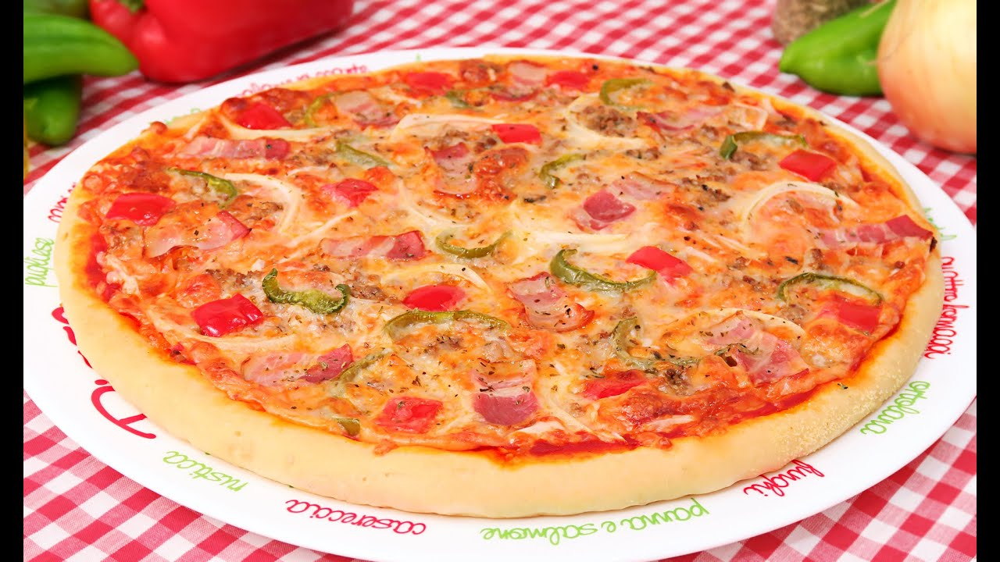

> 📺 **Vídeo Oficial de Elaboración:** [Ver en YouTube: Pizza Casera estilo Especial de la Casa | Telepizza](https://www.youtube.com/watch?v=AtCw_GBzDe4)


> [!TIP]
> **El Secreto Magistral de Carmen:** La diferencia entre una pizza pesada y apelmazada y una pizza crujiente, ligera y digestible como la de los mejores pizzeros napolitanos radica en el **tiempo y la cantidad de levadura**. Usar apenas 2 gramos de levadura fresca por cada medio kilo de harina y permitir que la masa madure lentamente en la nevera durante 24 a 48 horas transforma completamente la estructura del cereal, generando grandes burbujas de aire (*alveolos*) y un borde inflado y crujiente (*cornicione*).

### 📋 Ficha Resumen
| Parámetro | Valor |
| :--- | :--- |
| **Tiempo de Preparación** | 20 minutos (amasado y pliegues) |
| **Tiempo de Fermentación** | 2 horas a temp. ambiente + **24 a 48 horas en frío (4°C)** + 2 horas de atemperado |
| **Tiempo de Horneado** | 8-10 minutos a máxima potencia (250°C - 275°C) sobre piedra o bandeja precalentada |
| **Dificultad** | Media |
| **Raciones** | 3 pizzas individuales de Ø 30 cm (bolas de ~270 g) |
| **Coste Estimado** | Muy Económico (1,80 € total / 0,60 € por pizza base) |

---

### ⚠️ Tabla de Alérgenos (Reglamento UE 1169/2011)

| Alérgeno | Estado | Ingrediente Causante / Medida de Adaptación |
| :--- | :---: | :--- |
| **Gluten** | 🔴 **PRESENTE** | Harina de trigo de fuerza. *Adaptación: harina panificable sin gluten con psyllium y almidón de maíz.* |
| **Lácteos / Huevos / Soja / Frutos de Cáscara** | 🟢 AUSENTE | La masa pura solo contiene harina, agua, levadura, sal y AOVE. |

---

### ⚖️ Ingredientes Exactos (Porcentajes de Panadero)


* **500 g (100%)** Harina de trigo de fuerza media-alta (tipo '00' para pizza o fuerza W=280-300, 12,5% proteína).
* **330 ml (66%)** Agua mineral fría (a unos 10-12°C).
* **2 g (0,4%)** Levadura fresca de panadería (o 0,7 g de levadura seca instantánea).
* **12 g (2,4%)** Sal marina fina.
* **15 ml (3%)** Aceite de Oliva Virgen Extra (AOVE) de buena densidad.
* **3 g (0,6%)** Miel o extracto de malta (opcional, para favorecer el dorado en hornos domésticos).
* **Sémola de trigo duro (*Semola rimacinata*)** para espolvorear la mesa y estirar (evita que la masa se pegue y aporta textura ultra crujiente).

---

### 🍳 Equipamiento Necesario
* Bol de cristal amplio con tapa hermética.
* Rasqueta de panadero (plástica o metálica).
* Báscula digital de precisión (gramera).
* Piedra para hornear de cordierita o, en su defecto, la propia bandeja metálica del horno invertida en la posición más baja.
* Pala para pizza o tabla fina de madera para transferir la masa.

---

### 👨‍🍳 Paso a Paso Técnico y Minucioso


#### Fase 1: Autólisis y Amasado Suave
1. **Autólisis Inicial:** En un bol grande, mezclar los 500 g de harina con 300 ml del agua fría (reservar 30 ml). Remover con una cuchara durante 2 minutos hasta que no quede harina seca. Tapar y dejar reposar **30 minutos**. Esta técnica relaja la proteína y reduce drásticamente el tiempo de amasado manual.
2. **Adición de la Levadura:** Disolver los 2 g de levadura fresca en los 30 ml de agua restante e incorporarla a la masa autolítica. Amasar dentro del bol pellizcando y doblando la masa sobre sí misma durante 3 minutos.
3. **Incorporación de Sal y AOVE:** Añadir los 12 g de sal marina y los 3 g de miel. Amasar durante 3 minutos hasta que la sal se disuelva por completo. Finalmente, verter los 15 ml de AOVE y continuar amasando hasta que la grasa sea absorbida en su totalidad.
4. **Técnica de Pliegues (*Slap and Fold*):** Pasar la masa a la mesa sin enharinar. Realizar 3 series de pliegues franceses cada 15 minutos, dejando reposar la masa tapada entre cada tanda. La masa pasará de ser pegajosa a convertirse en una superficie elástica, lisa y brillante como la seda.

#### Fase 2: Maduración Lenta en Frío (La Magia de las 24-48h)
1. **Bloque en Frío:** Engrasar ligeramente un recipiente hermético con AOVE, colocar la masa en bloque, tapar herméticamente y dejar **1 hora a temperatura ambiente** para que arranque la fermentación.
2. **Refrigeración Controlada:** Trasladar el recipiente al estante intermedio de la nevera (**4°C**) y dejar madurar durante un mínimo de **24 horas** (óptimo: 48 horas). Durante este tiempo, la actividad enzimática transformará los azúcares complejos, liberando aromas lácticos y alcohólicos nobles.

#### Fase 3: Boleado y Segunda Fermentación
1. **División y Boleado:** Sacar la masa de la nevera 3 horas antes de hornear. Volcar sobre la mesa ligeramente espolvoreada con sémola y dividir con la rasqueta en **3 porciones iguales de aprox. 270 g**.
2. **Tensión de las Bolas:** Bolear cada porción tensando la superficie hacia la base con las palmas de las manos contra la mesa (*piirlatura*).
3. **Atemperado y Relajación:** Colocar las bolas en una bandeja o recipientes individuales espolvoreados con sémola, tapar con film o tapa hermética y dejar fermentar a temperatura ambiente (20-22°C) durante **2 a 3 horas**, hasta que aumenten su volumen y la red de gluten esté completamente relajada.

#### Fase 4: Estirado Manual, Cobertura y Horneado Doméstico Extremo
1. **Precalentado a Máxima Potencia:** Colocar la piedra refractaria o la bandeja de horno dada la vuelta en la guía más alta (o más baja si el horno calienta por la solera) y precalentar el horno a su **máxima temperatura (250°C a 275°C)** durante al menos 45 minutos.
2. **Estirado a Mano (Prohibido Rodillo):** Colocar una bola de masa sobre un lecho generoso de sémola rimacinata. Con las yemas de los dedos, presionar desde el centro hacia los bordes, empujando las burbujas de gas hacia el perímetro exterior para crear un borde inflado (*cornicione*). Tomar la masa por los nudillos e ir girándola por gravedad hasta obtener un disco de Ø 28-30 cm con un centro fino de 2 mm y un borde esponjoso.
3. **Montaje:** Pasar el disco a la pala o papel vegetal. Extender 2-3 cucharadas de passata de tomate sazonada con sal y albahaca, mozzarella bien escurrida y los ingredientes deseados.
4. **Horneado Rápido:** Deslizar la pizza directamente sobre la piedra o bandeja precalentada al rojo vivo. Hornear a 250-275°C durante **7 a 9 minutos** (los últimos 2 minutos con el grill encendido para gratinar el borde).

---

### 📦 Protocolo de Conservación y Batch Cooking

* **Congelación de Bolas en Crudo:** Tras bolearlas y dejarlas 1 hora a temperatura ambiente, congelar cada bola en un táper individual engrasado. Descongelar en la nevera durante 24 horas y atemperar 3 horas antes de estirar.
* **Pre-cocción de Bases (*Par-baking*):** Hornear los discos solo con salsa de tomate a 250°C durante 3 minutos. Enfriar sobre rejilla, envolver en film y congelar. Para consumir, añadir el queso e ingredientes y hornear 5 minutos directamente congeladas.

---

### 🔥 Guía de Regeneración Multicanal

* **Sartén + Grill (El Método Maestro):** Colocar la porción de pizza fría en una sartén antiadherente a fuego medio-alto durante 3 minutos para devolver el crujiente a la base, y luego meterla 1 minuto bajo el grill del horno para fundir el queso.
* **Airfryer:** 180°C durante 3-4 minutos.
* **Horno Convencional:** 200°C sobre rejilla durante 5 minutos.
* **Microondas:** ❌ **TERMINANTEMENTE PROHIBIDO** (convierte la masa en goma incomible).

---

## 🥧 3. Masa Quebrada / Brisa Casera para Tartas Saladas y Quiches
*Categoría: Masa Escaldada / Técnica del Arenado (*Sablage*) / Sin Fermentación*


> 📺 **Vídeo Oficial de Elaboración:** [Ver en YouTube: MASA QUEBRADA CASERA | Para quiches, tartas...](https://www.youtube.com/watch?v=9dvXaiCLcX4)


> [!NOTE]
> **El Secreto Magistral de Carmen:** El fallo más común al hacer masa quebrada casera es amasarla demasiado o usar mantequilla blanda. Para que quede crujiente, arenosa y que no encoja ni baje por las paredes del molde al hornearse, **la mantequilla debe estar congelada o recién sacada de la nevera**, cortada en cubitos microscópicos y trabajada con la harina solo con la punta de los dedos hasta formar una arena gruesa. No se debe amasar: solo unir con 2-3 cucharadas de agua helada y dejarla reposar en frío para que las grasas cristalicen.

### 📋 Ficha Resumen
| Parámetro | Valor |
| :--- | :--- |
| **Tiempo de Preparación** | 15 minutos |
| **Tiempo de Refrigeración** | 1 hora en nevera (4°C) |
| **Tiempo de Horneado en Blanco** | 15 min con peso + 5 min sin peso a 180°C |
| **Dificultad** | Fácil-Media |
| **Rendimiento** | 1 molde de tarta acanalado de Ø 26-28 cm |
| **Coste Estimado** | Muy Económico (1,60 € total) |

---

### ⚠️ Tabla de Alérgenos (Reglamento UE 1169/2011)

| Alérgeno | Estado | Ingrediente Causante / Medida de Adaptación |
| :--- | :---: | :--- |
| **Gluten** | 🔴 **PRESENTE** | Harina de trigo floja. *Adaptación: harina de arroz + almidón de maíz.* |
| **Lácteos** | 🔴 **PRESENTE** | Mantequilla de vaca (82% M.G.). *Adaptación: manteca de cerdo ibérica fría o margarina vegetal pura sin aceite de palma.* |
| **Huevos** | 🔴 **PRESENTE** | Yema de huevo fresca (aporta cohesión y color). *Adaptación: sustituir por 20 ml de agua helada extra.* |
| **Sulfitos / Frutos de Cáscara / Soja** | 🟢 AUSENTE | Formulación tradicional limpia. |

---

### ⚖️ Ingredientes Exactos

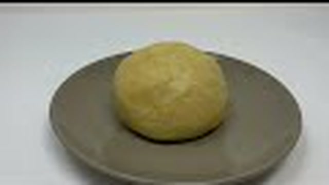

* **250 g** Harina de trigo floja / repostería (baja en proteína, W=90-110).
* **125 g** Mantequilla sin sal de alta calidad (82% materia grasa), **muy fría y cortada en dados de 1x1 cm**.
* **1 unidad** Yema de huevo campero tamaño L (fresca de la nevera).
* **30-40 ml** Agua helada (con cubitos de hielo en el vaso).
* **5 g (1 cucharadita)** Sal marina fina.
* **3 g (media cucharadita)** Azúcar blanquilla (mejora la textura y favorece la reacción de Maillard).

---

### 🍳 Equipamiento Necesario
* Bol amplio de acero inoxidable o cristal (enfriado previamente en la nevera).
* Molde de tarta rizado / quiche desmontable de Ø 26-28 cm.
* Papel de horno vegetal.
* Peso para hornear en blanco (legumbres secas como garbanzos o bolas cerámicas de horneado).
* Rodillo de repostería y tenedor.

---

### 👨‍🍳 Paso a Paso Técnico y Minucioso

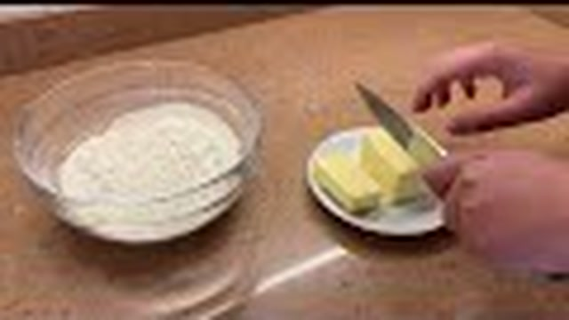

#### Fase 1: El Arenado (*Sablage*)
1. **Tamizado de Secos:** En el bol frío, tamizar los 250 g de harina junto con los 5 g de sal y los 3 g de azúcar.
2. **Técnica del Arenado:** Incorporar los 125 g de mantequilla muy fría en cubos. Con las puntas de los dedos (para no transmitir calor con las palmas) o con un estribo cortamapas / tenedor, frotar la mantequilla con la harina rápidamente durante 2 a 3 minutos hasta obtener una textura que recuerde a la arena de playa mojada o pan rallado grueso, sin que queden trozos de mantequilla grandes.
3. **Hidratación y Ligazón:** Hacer un hueco en el centro, verter la yema de huevo y 30 ml de agua helada. Con una espátula o con la mano en forma de garra, integrar los ingredientes compactando la masa contra las paredes del bol sin amasar ni friccionar. Si la masa está demasiado quebradiza, añadir la cucharada de agua helada restante.
4. **Fraisage (Aplastamiento Rápido):** Volcar la masa sobre la mesa y, con la palma de la mano, aplastarla hacia delante una o dos veces (*fraisage*) para homogeneizar la grasa sin desarrollar gluten.
5. **Formación del Disco y Reposo en Frío:** Formar un disco plano de unos 2 cm de grosor, envolver firmemente en film transparente y refrigerar en la nevera durante al menos **1 hora** (o hasta 48 horas).

#### Fase 2: Forrado del Molde (*Fonçage*) y Horneado en Blanco (*Blind Baking*)
1. **Estirado:** Sacar la masa de la nevera 5 minutos antes. Colocarla entre dos láminas de papel vegetal y estirarla con el rodillo desde el centro hacia los extremos, girando la masa un cuarto de vuelta en cada pasada, hasta obtener un grosor de **3 a 4 mm** y un diámetro 5 cm superior al molde.
2. **Encajado en el Molde:** Retirar el papel superior, levantar la masa con la ayuda del rodillo y dejarla caer suavemente sobre el molde engrasado. Con las yemas de los dedos, presionar delicadamente la masa en los ángulos rectos de la base y los bordes rizados, sin estirar de la masa (si se estira, encogerá en el horno).
3. **Corte del Borde:** Pasar el rodillo por encima del borde del molde para cortar el sobrante de masa limpiamente.
4. **Segundo Reposo en Frío:** Pinchar toda la base repetidamente con un tenedor y meter el molde forrado al **congelador durante 15 minutos** (este paso es vital para que la mantequilla se endurezca y los bordes no bajen ni un milímetro al entrar al calor).
5. **Horneado en Blanco con Peso:** Precalentar el horno a **180°C con calor arriba y abajo**. Colocar una hoja de papel vegetal arrugada y adaptada sobre la masa y rellenar con garbanzos secos o bolas cerámicas. Hornear en la guía media durante **15 minutos**.
6. **Secado Final:** Retirar el papel y los pesos, y hornear otros **5 minutos** a 180°C para que la base quede ligeramente dorada, sellada y seca, lista para recibir cualquier relleno húmedo sin reblandecerse.

---

### 📦 Protocolo de Conservación y Batch Cooking

* **Masa Cruda en Refrigeración:** Hasta **3 días** bien envuelta en film.
* **Masa Cruda en Congelación:** Hasta **3 meses** en forma de disco plano o directamente estirada y congelada dentro del propio molde.
* **Base Horneada en Blanco:** Se conserva en un recipiente seco y hermético a temperatura ambiente durante **48 horas**.

---

## 🥓 4. Quiche Lorraine Tradicional con Bacon Ahumado y Queso Gruyère
*Categoría: Tarta Salada Francesa / Emulsión Láctea (*Appareil*) / Horneado Gourmet*

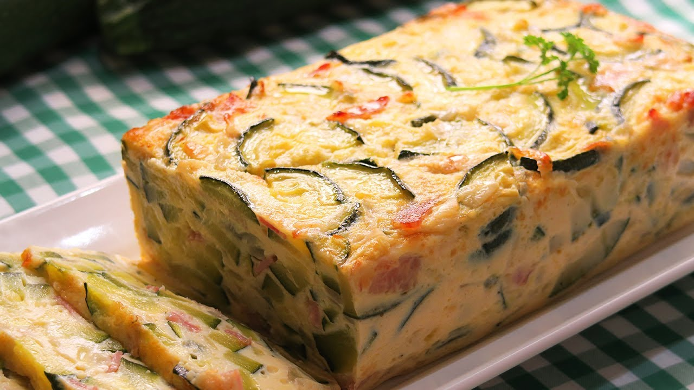

> 📺 **Vídeo Oficial de Elaboración:** [Ver en YouTube: Pastel de Calabacín con Queso y Bacon | Receta muy Fácil y Deliciosa](https://www.youtube.com/watch?v=G_vgmNYTF_8)


> [!TIP]
> **El Secreto Magistral de Carmen:** La auténtica Quiche Lorraine no lleva cebolla ni bechamel; su gloria radica en el *appareil*, una crema sedosa compuesta únicamente por nata para montar de alto contenido graso (35% M.G.), huevos frescos camperos, pimienta blanca recién molida y un toque generoso de nuez moscada. Al dorar previamente los lardones de panceta ahumada para desgrasarlos y escurrirlos bien, la quiche queda ligera, con el queso Gruyère fundido en la base y un cuajado cremoso tipo flan salado que no suelta líquido al cortar.

### 📋 Ficha Resumen
| Parámetro | Valor |
| :--- | :--- |
| **Tiempo de Preparación** | 20 minutos (preparación del relleno y ligazón) |
| **Tiempo de Cocción** | 20 min (horneado en blanco de la base) + **30-35 min a 175°C** |
| **Dificultad** | Fácil-Media |
| **Raciones** | 6-8 personas (molde de Ø 26 cm) |
| **Coste Estimado** | Medio (5,90 € total / 0,74 € ración) |

---

### ⚠️ Tabla de Alérgenos (Reglamento UE 1169/2011)

| Alérgeno | Estado | Ingrediente Causante / Medida de Adaptación |
| :--- | :---: | :--- |
| **Gluten** | 🔴 **PRESENTE** | Masa quebrada de la base. |
| **Lácteos** | 🔴 **PRESENTE** | Nata líquida (crema de leche 35% M.G.), mantequilla de la masa y queso Gruyère/Emmental. *Adaptación: nata de soja para cocinar y queso vegetal curado.* |
| **Huevos** | 🔴 **PRESENTE** | 3 huevos camperos enteros + 1 yema en el batido ligador. |
| **Sulfitos / Soja / Pescado / Frutos de Cáscara** | 🟢 AUSENTE | Formulación clásica limpia. |

---

### ⚖️ Ingredientes Exactos

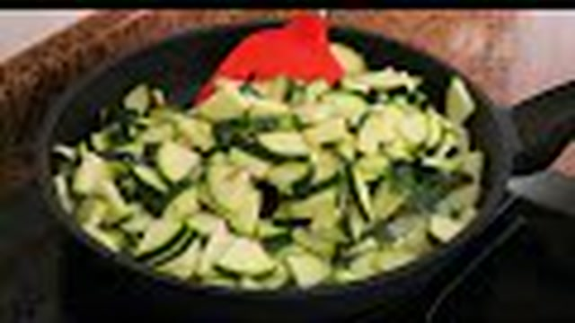

#### Para la Base
* **1 unidad** Base de Masa Quebrada casera horneada en blanco (según la receta nº 3).

#### Para el Relleno y la Crema (*Appareil*)
* **220 g** Panceta ahumada artesana o bacon magro en una sola pieza, cortado en tiras gruesas (*lardons* de 5x15 mm).
* **150 g** Queso Gruyère auténtico (o mezcla 70% Gruyère + 30% Emmental suizo) rallado grueso en el momento.
* **3 unidades** Huevos camperos enteros tamaño L.
* **1 unidad** Yema de huevo campero tamaño L.
* **250 ml** Nata líquida para montar (Crema de leche con mínimo 35% M.G.).
* **100 ml** Leche entera fresca pasteurizada.
* **1,5 g (media cucharadita)** Nuez moscada recién rallada.
* **1 g** Pimienta blanca molida.
* **3 g** Sal marina fina (ajustar con moderación debido al punto salino del bacon y el queso).

---

### 🍳 Equipamiento Necesario
* Sartén antiadherente para dorar los lardones de bacon.
* Papel absorbente de cocina.
* Bol amplio de batir con varillas manuales.
* Molde de quiche de Ø 26 cm con la base quebrada precocida.
* Rallador de cuatro caras para el queso.

---

### 👨‍🍳 Paso a Paso Técnico y Minucioso


1. **Cocinado y Desgrasado del Bacon:**
   * Calentar una sartén a fuego medio sin añadir nada de aceite.
   * Incorporar los 220 g de tiras de panceta ahumada y saltear durante **5 a 7 minutos**, removiendo periódicamente, hasta que estén doradas y crujientes por fuera pero tiernas por dentro.
   * Retirar los lardones con una espumadera y escurrirlos concienzudamente sobre un plato cubierto con doble capa de papel absorbente. Desechar la grasa líquida acumulada en la sartén.
2. **Elaboración del Batido Ligador (*Appareil*):**
   * En un bol amplio, cascar los 3 huevos camperos y añadir la yema extra. Batir con las varillas manuales durante 1 minuto sin meter excesivo aire (para evitar que la quiche sufle y luego se desinfle abruptamente al enfriar).
   * Incorporar los 250 ml de nata líquida (35% M.G.) y los 100 ml de leche entera fresca.
   * Añadir la nuez moscada recién rallada, la pimienta blanca y la sal. Mezclar hasta obtener una crema lisa y homogénea.
3. **Distribución por Capas en la Base:**
   * Sobre la base de masa quebrada horneada en blanco (aún templada o fría), repartir de manera uniforme en el fondo el 80% del queso Gruyère rallado.
   * Distribuir por encima los lardones de bacon desgrasados y crujientes.
4. **Vertido y Coronado de Queso:**
   * Verter con cuidado el batido líquido sobre el molde, dejando unos 3 mm libres hasta el borde superior de la masa para evitar desbordamientos durante el inflado en el horno.
   * Espolvorear el 20% de queso Gruyère restante sobre la superficie para formar una costra dorada irresistible.
5. **Horneado y Curva Térmica:**
   * Precalentar el horno a **175°C con calor arriba y abajo** (sin ventilador).
   * Colocar la quiche en la bandeja central del horno y hornear durante **30 a 35 minutos**.
   * La quiche estará lista cuando la superficie presente un dorado suave uniforme y el centro esté cuajado pero conserve un temblor muy ligero tipo gelatina al sacudir suavemente el molde.
6. **Atemperado y Corte:**
   * Dejar reposar la quiche dentro del molde sobre una rejilla durante al menos **20 minutos** antes de desmoldar y cortar en cuñas. Servir tibia.

---

### 📦 Protocolo de Conservación y Batch Cooking

* **Refrigeración:** Tapada con film o en campana de cristal, aguanta **3-4 días** en frío.
* **Congelación:** Una vez completamente fría, cortar en porciones, separar con papel vegetal y congelar en táper hermético hasta **2 meses**.

---

### 🔥 Guía de Regeneración Multicanal

* **Horno Convencional (Excelente):** 160°C durante 10-12 minutos. Mantiene la cremosidad del relleno y el crujiente de la base quebrada.
* **Airfryer:** 150°C durante 6 minutos.
* **Microondas:** ❌ 40 segundos a 500W (solo para templar en emergencias, pierde textura quebradiza).

---

## 🥖 5. Pan Casero Fácil Sin Amasado (en Cocotte / Pyrex con Corteza Crujiente)
*Categoría: Panadería Rústica / Alta Hidratación (76%) / Horneado en Horno Holandés*

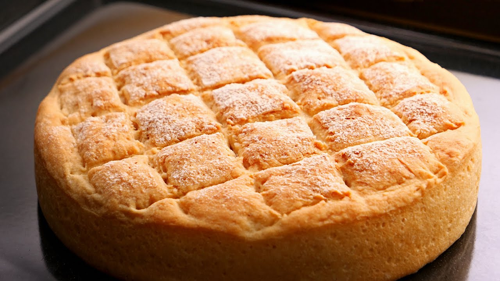

> 📺 **Vídeo Oficial de Elaboración:** [Ver en YouTube: Pan Casero fácil de hacer (con harina común) | Corteza crujiente y Miga esponjosa](https://www.youtube.com/watch?v=eUdgQxr-lbU)


> [!NOTE]
> **El Secreto Magistral de Carmen:** Para hacer un pan de panadería artesana en casa con corteza gruesa y crujiente que "cante" al sacarlo y una miga abierta y esponjosa, **no hace falta amasar durante media hora ni tener masa madre**. El secreto es una hidratación alta (casi el 80%), dejar que el tiempo y las enzimas hagan el trabajo solas durante una fermentación reposada, y hornear la masa dentro de una **cazuela de hierro fundido (Cocotte) o fuente de Pyrex con tapa precalentada a 240°C**. La tapa atrapa el propio vapor del pan, logrando un greñado espectacular sin necesidad de inyectar vapor en el horno.

### 📋 Ficha Resumen
| Parámetro | Valor |
| :--- | :--- |
| **Tiempo de Preparación** | 10 minutos de mezclado + 4 pliegues de 30 segundos |
| **Tiempo de Fermentación** | 3 horas a temperatura ambiente (o 12-18h en frío para máxima complejidad) |
| **Tiempo de Horneado** | 25 min con tapa a 240°C + 20 min destapado a 200°C |
| **Dificultad** | Muy Fácil |
| **Rendimiento** | 1 hogaza rústica redonda de aprox. 850 g |
| **Coste Estimado** | Muy Económico (0,90 € por hogaza completa) |

---

### ⚠️ Tabla de Alérgenos (Reglamento UE 1169/2011)

| Alérgeno | Estado | Ingrediente Causante / Medida de Adaptación |
| :--- | :---: | :--- |
| **Gluten** | 🔴 **PRESENTE** | Harina de trigo y harina integral. *Adaptación: mezcla panificable sin gluten con semillas y goma xantana.* |
| **Lácteos / Huevos / Soja / Frutos de Cáscara** | 🟢 AUSENTE | Pan 100% vegano, sin grasas añadidas ni alérgenos lácteos. |

---

### ⚖️ Ingredientes Exactos (Fórmula Panadera)


* **450 g (90%)** Harina de trigo panificable (W=180-220, 11-12% proteína).
* **50 g (10%)** Harina de trigo integral o harina de centeno (aporta aroma a cereal de campo y color rústico).
* **380 ml (76%)** Agua mineral tibia (a unos 24-26°C).
* **3 g (0,6%)** Levadura fresca de panadería (o 1 g de levadura seca de panadero).
* **10 g (2%)** Sal marina fina.

---

### 🍳 Equipamiento Necesario
* Bol grande de cristal o plástico para mezclar.
* Espátula o cuchara de madera.
* Cesto de fermentación (*banneton*) redondo de Ø 22 cm o bol forrado con un paño de lino limpio espolvoreado con harina de arroz.
* Cazuela de hierro fundido esmaltado (tipo Le Creuset / Cocotte) de Ø 24-26 cm con tapa apta para 250°C o fuente honda de Pyrex de vidrio refractario con tapa.
* Cuchilla de afeitar o cuchillo de sierra muy afilado para greñar (*lame*).
* Papel vegetal de horneado.

---

### 👨‍🍳 Paso a Paso Técnico y Minucioso


#### Fase 1: Mezclado Simple y Reposo Inicial
1. **Disolución:** En el bol grande, verter los 380 ml de agua tibia y disolver los 3 g de levadura fresca con los dedos.
2. **Integración:** Añadir los 450 g de harina blanca, los 50 g de harina integral y los 10 g de sal. Mezclar con una cuchara de madera o con la rasqueta durante solo **1 minuto**, hasta que no se aprecie harina seca en el fondo. Quedará una masa pegajosa, húmeda y de aspecto informe.
3. **Reposo:** Tapar el bol con film transparente o un gorro de ducha plástico y dejar reposar **30 minutos** a temperatura ambiente.

#### Fase 2: Los Pliegues en el Bol (*Stretch and Fold*)
1. **Técnica de Pliegues:** Mojarse las manos con un poco de agua. Coger un extremo de la masa desde el fondo del bol, estirarlo hacia arriba sin romperlo y doblarlo sobre el centro. Girar el bol 90 grados y repetir el proceso con los 4 costados.
2. **Ciclo de Refuerzo:** Realizar **3 tandas de pliegues**, espaciadas por 30 minutos de reposo tapado. Se apreciará cómo en cada tanda la masa gana fuerza, tensión y elasticidad sin haberse manchado las manos de harina.
3. **Fermentación en Bloque:** Tras el último pliegue, dejar fermentar tapado durante **1,5 a 2 horas** a temperatura ambiente (o meter a la nevera toda la noche), hasta que la masa esté esponjosa, llena de burbujas superficiales y haya doblado su volumen.

#### Fase 3: Formado de la Hogaza y Segundo Levado
1. **Volcado y Tensado:** Espolvorear ligeramente la mesa con harina. Volcar la masa con cuidado de no desgasificar las grandes burbujas internas.
2. **Boleado Redondo:** Plegar las cuatro esquinas hacia el centro formando un paquete. Darle la vuelta dejando la costura abajo. Con las dos manos ahuecadas, arrastrar la bola hacia uno mismo sobre la mesa para generar tensión en la piel exterior (*boule*).
3. **Reposo en Cesto:** Espolvorear generosamente el banneton o bol con paño con una mezcla 50/50 de harina de trigo y harina de arroz (la harina de arroz no absorbe humedad y evita que la masa se pegue). Colocar la hogaza boca abajo (con la costura hacia arriba). Tapar y dejar levar durante **45 a 60 minutos**.

#### Fase 4: Horneado a Ciegas con Vapor Atrapado
1. **Precalentado Extremo con la Cazuela Dentro:** 45 minutos antes de hornear, meter la cazuela Cocotte o fuente de Pyrex con su tapa puesta en la guía media-baja del horno. Encender a **240°C con calor arriba y abajo**.
2. **Volcado y Greñado:** Cortar un pliego de papel vegetal. Volcar con cuidado la hogaza del banneton sobre el papel (la costura quedará ahora en la base y la superficie lisa arriba). Con una cuchilla inclinada a 45 grados, realizar un corte longitudinal decidido y rápido de 1 cm de profundidad (*la greña*).
3. **Horneado Fase 1 (Vapor Saturado):** Con guantes térmicos, sacar con extremo cuidado la cazuela hirviendo del horno. Retirar la tapa. Coger el pan por las esquinas del papel vegetal e introducirlo en el interior de la cazuela. Poner la tapa inmediatamente y devolver al horno a **240°C durante 25 minutos**. El vapor atrapado mantendrá la corteza flexible permitiendo que el pan suba al máximo.
4. **Horneado Fase 2 (Secado y Caramelización de la Corteza):** Retirar la tapa de la cazuela. Bajar la temperatura del horno a **200°C** y hornear destapado durante otros **20 a 25 minutos**, hasta que la corteza adquiera un tono castaño dorado profundo y al golpear la base suene completamente hueco.
5. **El Canto del Pan y Enfriado:** Sacar la hogaza de la cazuela y transferirla inmediatamente a una rejilla metálica. Escuchar cómo la corteza cruje y "canta" mientras se contrae. **Dejar enfriar al menos 2 horas antes de cortar** para que la miga termine de asentarse y no quede gomosa.

---

### 📦 Protocolo de Conservación y Batch Cooking

* **Conservación a Temperatura Ambiente:** Guardado en una bolsa de papel o paño de tela de lino, el pan aguanta con corteza crujiente y miga tierna durante **3 a 4 días**.
* **Congelación en Rebanadas:** Una vez completamente frío, cortar toda la hogaza en rebanadas uniformes de 1,5 cm. Congelar en bolsas zip herméticas. Vida útil: **3 meses**.
* **Regeneración de Rebanadas:** Tostar directamente congeladas en la tostadora tradicional o sobre plancha con unas gotas de AOVE.

---

## 🥟 6. Masa para Empanadillas Fritas y al Horno (Obleas Caseras de Carmen)
*Categoría: Masa Escaldada Tradicional / Fritura Crujiente y Suflada / Obleas Artesanas*


> 📺 **Vídeo Oficial de Elaboración:** [Ver en YouTube: Empanadillas de Atún (con masa casera) muy Fáciles y Deliciosas](https://www.youtube.com/watch?v=9UboRelKDXA)


> [!TIP]
> **El Secreto Magistral de Carmen:** Las obleas industriales compradas se rompen con facilidad y quedan secas al hornearse. La masa tradicional de Carmen se elabora escaldando la harina con una mezcla caliente de **vino blanco, agua, manteca de cerdo ibérica (o mantequilla) y AOVE perfumado con un diente de ajo**. Esta grasa caliente relaja la harina al instante, permitiendo estirar las obleas finísimas sin que se encojan, formando miles de pequeñas burbujas crujientes y doradas al freírse y un bocado tierno y hojaldrado al hornearse.

### 📋 Ficha Resumen
| Parámetro | Valor |
| :--- | :--- |
| **Tiempo de Preparación** | 30 minutos (amasado y corte de obleas) |
| **Tiempo de Reposo** | 30 minutos a temperatura ambiente |
| **Tiempo de Cocción** | 2-3 min (fritura a 180°C) o 15-18 min (horno a 200°C) |
| **Dificultad** | Fácil |
| **Rendimiento** | Aprox. 20-24 obleas medianas de Ø 12 cm |
| **Coste Estimado** | Muy Económico (2,20 € total de obleas y relleno clásico) |

---

### ⚠️ Tabla de Alérgenos (Reglamento UE 1169/2011)

| Alérgeno | Estado | Ingrediente Causante / Medida de Adaptación |
| :--- | :---: | :--- |
| **Gluten** | 🔴 **PRESENTE** | Harina de trigo común. *Adaptación: harina sin gluten con almidón de tapioca y goma xantana.* |
| **Lácteos** | 🟡 CONDICIONAL | Si se usa mantequilla en lugar de manteca de cerdo. Con manteca o AOVE es libre de lácteos. |
| **Huevos** | 🔴 **PRESENTE** | Huevo duro en el relleno tradicional y pincelado (en versión horno). |
| **Pescado** | 🔴 **PRESENTE** | Relleno clásico de atún en conserva. |
| **Sulfitos** | 🟡 TRAZAS | Vino blanco del escaldado de la masa. *Adaptación: sustituir por caldo o agua mineral.* |

---

### ⚖️ Ingredientes Exactos

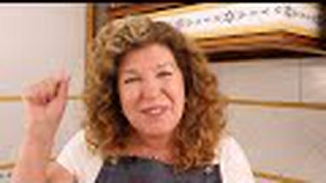

#### Para la Masa Escaldada de Obleas
* **350 g** Harina de trigo todo uso (W=140-160).
* **60 ml** Aceite de Oliva Virgen Extra (AOVE).
* **40 g** Manteca de cerdo ibérica de calidad (o mantequilla sin sal).
* **75 ml** Vino blanco seco (o cerveza rubia).
* **60 ml** Agua mineral.
* **1 diente** Ajo pelado entero (para perfumar el aceite caliente).
* **6 g (1 cucharadita)** Sal marina fina.
* **2 g** Pimentón dulce (opcional, para tonalidad dorada).

#### Para el Relleno Tradicional de Atún, Tomate y Huevo
* **200 g** Atún claro en conserva de aceite de oliva, bien escurrido.
* **2 unidades** Huevos camperos cocidos durante 9 minutos y picados muy finos.
* **120 g** Salsa de tomate frito casero espeso y reducido.
* **50 g** Pimiento morrón asado en conserva picado fino.
* **1 pizca** Sal y pimienta negra molida.

#### Para la Cocción
* **500 ml** AOVE o aceite de orujo de oliva para freír (versión fritura).
* **1 unidad** Huevo campero batido para pincelar (versión horno).

---

### 🍳 Equipamiento Necesario
* Cazo pequeño para calentar los líquidos y grasas.
* Bol amplio para amasar.
* Rodillo de amasar fino.
* Cortapastas redondo de Ø 12 cm (o un tazón/bol pequeño y un cuchillo).
* Tenedor para sellar los bordes.
* Sartén honda para freír o bandeja de horno con papel vegetal.

---

### 👨‍🍳 Paso a Paso Técnico y Minucioso

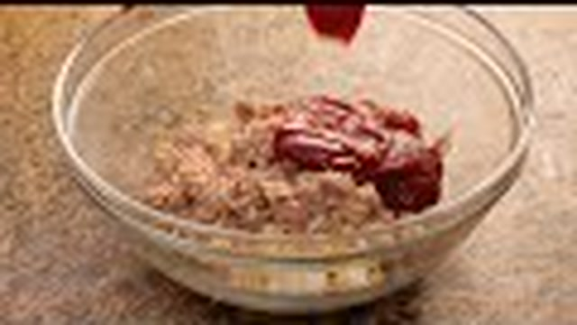

#### Fase 1: El Escaldado de la Grasa y el Amasado
1. **Infusión y Escaldado Térmico:** En un cazo pequeño, calentar los 60 ml de AOVE con el diente de ajo entero a fuego medio hasta que el ajo empiece a dorarse. Retirar el ajo. Añadir al cazo los 40 g de manteca de cerdo, los 75 ml de vino blanco, los 60 ml de agua y los 6 g de sal. Llevar a ebullición suave y apagar el fuego en cuanto la manteca se funda.
2. **Mezclado:** En un bol grande, colocar los 350 g de harina tamizada con el pimentón dulce. Verter la mezcla líquida caliente sobre la harina en el centro.
3. **Amasado Rápido:** Remover primero con una cuchara de madera para no quemarse y, en cuanto baje la temperatura, pasar a la mesa de trabajo. Amasar durante **3 a 5 minutos**. Se obtendrá una masa sumamente elástica, satinada, no pegajosa y tibia al tacto.
4. **Reposo:** Envolver la bola en film transparente y dejar reposar a temperatura ambiente durante **30 minutos** para que el gluten se relaje y no ofrezca resistencia al estirar.

#### Fase 2: Corte de Obleas y Relleno
1. **Estirado Extra-Fino:** Dividir la masa en dos porciones. Con el rodillo, estirar sobre la mesa limpia (no hace falta enharinar gracias a la riqueza grasa de la masa) hasta dejarla con un grosor homogéneo de **1,5 mm**.
2. **Corte:** Con el cortapastas de Ø 12 cm, cortar los discos de masa. Recoger los recortes sobrantes, unirlos, reposar 5 minutos y volver a estirar para aprovechar toda la masa.
3. **Relleno:** En un bol, mezclar el atún desmenuzado, el huevo duro picado, el pimiento morrón y el tomate frito espeso. Colocar una cucharada sopera generosa de relleno en el centro de cada oblea.
4. **Sellado Hermético:** Doblar la oblea por la mitad sobre el relleno formando una media luna. Presionar los bordes con la yema del dedo para expulsar el aire interior y sellar el contorno marcando firmemente con las púas de un tenedor (o haciendo un repulgue trenzado fino).

#### Fase 3: Doble Opcional de Cocinado
* **Opción A: Fritura Crujiente Tradicional:**
  1. Calentar abundante AOVE en una sartén honda a **180°C**.
  2. Freír las empanadillas por tandas de 3-4 unidades durante **1,5 a 2 minutos por lado**, regándolas por encima con la espumadera con el aceite caliente para que se formen sus características ampollas y burbujas crujientes.
  3. Escurrir sobre papel absorbente y servir calientes.
* **Opción B: Horneado Ligero y Dorado:**
  1. Precalentar el horno a **200°C con calor arriba y abajo**.
  2. Disponer las empanadillas sobre una bandeja con papel vegetal y pincelar la superficie con huevo batido.
  3. Hornear durante **15 a 18 minutos**, hasta que luzcan bien doradas y crujientes.

---

### 📦 Protocolo de Conservación y Batch Cooking

* **Congelación en Crudo:** Colocar las empanadillas ya selladas sobre una bandeja separadas entre sí. Congelar durante 2 horas y transferir a bolsas herméticas. Aguanta **3 meses**.
* **Cocción Directa:** Se pueden freír directamente congeladas en aceite a 175°C durante 3 minutos o hornear a 190°C durante 20 minutos sin necesidad de descongelación previa.

---

## 🍗 7. Empanada de Pollo Asado, Cebolla Caramelizada y Queso Fundente
*Categoría: Cocina de Aprovechamiento Gourmet / Masa Enriquecida / Horneado Familiar*

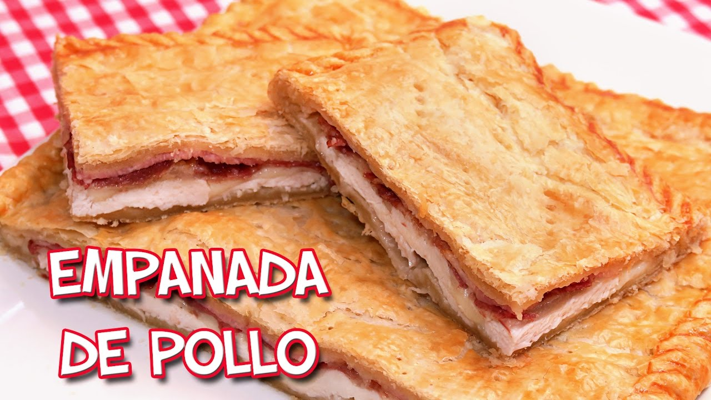

> 📺 **Vídeo Oficial de Elaboración:** [Ver en YouTube: Empanada de Pollo Jamón Bacon y Queso | Receta muy Fácil y Rápida!](https://www.youtube.com/watch?v=kWjLNDTWyn8)


> [!NOTE]
> **El Secreto Magistral de Carmen:** Esta empanada es el rey del aprovechamiento de un buen pollo asado de domingo. En lugar de pechuga seca, desmigamos toda la carne del pollo (pechuga, muslos y piel crujiente) y la mezclamos con cebolla caramelizada lentamente a fuego dulce con un chorrito de vino dulce Pedro Ximénez o brandy, junto con queso gallego de Tetilla o Arzúa-Ulloa en dados. Al hornearse, el queso se funde emulsionando los jugos del pollo, creando un interior cremoso que contrasta con la masa crujiente.

### 📋 Ficha Resumen
| Parámetro | Valor |
| :--- | :--- |
| **Tiempo de Preparación** | 40 minutos (caramelizado y desmigado) |
| **Tiempo de Fermentación** | 60 minutos |
| **Tiempo de Horneado** | 40-45 minutos a 195°C |
| **Dificultad** | Media |
| **Raciones** | 8 porciones generosas |
| **Coste Estimado** | Económico (5,20 € total aprovechando sobras de asado) |

---

### ⚠️ Tabla de Alérgenos (Reglamento UE 1169/2011)

| Alérgeno | Estado | Ingrediente Causante / Medida de Adaptación |
| :--- | :---: | :--- |
| **Gluten** | 🔴 **PRESENTE** | Harina de trigo de la masa. |
| **Lácteos** | 🔴 **PRESENTE** | Queso de Tetilla / Arzúa-Ulloa o Mozzarella. *Adaptación: queso vegano fundente a base de anacardos.* |
| **Huevos** | 🔴 **PRESENTE** | Huevo batido de pincelado superficial. |
| **Sulfitos** | 🟡 TRAZAS | Vino Pedro Ximénez o vino blanco del sofrito. |
| **Pescado / Frutos de Cáscara / Soja** | 🟢 AUSENTE | Formulación limpia. |

---

### ⚖️ Ingredientes Exactos


#### Para la Masa de Empanada Enriquecida
* **500 g** Harina de trigo panificable (W=180-200).
* **90 ml** Aceite de oliva virgen extra (o grasa del asado de pollo filtrada).
* **90 ml** Cerveza rubia o vino blanco a temperatura ambiente.
* **90 ml** Caldo de pollo casero tibio (o agua mineral).
* **15 g** Levadura fresca de panadero.
* **8 g** Sal marina fina.
* **1 cucharadita (3 g)** Pimentón dulce de la Vera.

#### Para el Relleno Cremoso de Pollo y Cebolla Confitada
* **400 g** Pollo asado o cocido desmigado a cuchillo (pechuga, contramuslo y jugos gelatinosos del asado).
* **600 g (4 unidades grandes)** Cebollas dulces picadas en juliana fina.
* **180 g** Queso de Tetilla gallego, Arzúa-Ulloa o Mozzarella rallada en dados de 1 cm.
* **50 g** Taquitos minúsculos de jamón serrano o bacon ahumado (opcional, para realzar el fondo).
* **40 ml** Vino dulce Pedro Ximénez, Oporto o Brandy de Jerez.
* **50 ml** Aceite de Oliva Virgen Extra (AOVE).
* **1 pizca** Tomillo seco o romero picado.
* **Sal y pimienta negra recién molida.**

#### Para el Acabado
* **1 unidad** Huevo campero batido para pincelar.

---

### 🍳 Equipamiento Necesario
* Cazuela amplia para caramelizar la cebolla.
* Bol y rodillo de amasar.
* Bandeja de horno de 35x25 cm con papel vegetal.
* Tenedor y pincel de cocina.

---

### 👨‍🍳 Paso a Paso Técnico y Minucioso


1. **Caramelización Natural de la Cebolla:**
   * En una cazuela baja, calentar los 50 ml de AOVE a fuego medio. Añadir la cebolla en juliana con una pizca de sal.
   * Tapar y pochar a fuego lento durante **30 a 35 minutos**, removiendo periódicamente hasta que adquiera un tono caramelo dorado natural por la concentración de sus propios azúcares.
   * Añadir los taquitos de jamón y el vino dulce Pedro Ximénez. Subir el fuego 2 minutos para evaporar el alcohol y caramelizar el fondo. Dejar enfriar completamente.
2. **Integración del Relleno:**
   * En un bol amplio, mezclar la cebolla caramelizada fría con el pollo asado desmigado a cuchillo, el tomillo, pimienta negra y los dados de queso de Tetilla. Rectificar de sal si fuera necesario.
3. **Amasado y Fermentación:**
   * En un bol grande, tamizar la harina con la sal y el pimentón. Disolver la levadura en el caldo tibio.
   * Integrar la harina con el caldo con levadura, la cerveza y los 90 ml de aceite.
   * Amasar en la mesa durante 8 minutos hasta tener una masa lisa y elástica.
   * Dejar fermentar tapada durante **60 minutos** hasta duplicar volumen.
4. **Montaje y Sellado de la Empanada:**
   * Dividir la masa en dos partes (55% base y 45% tapa).
   * Estirar la base finita sobre papel vegetal y colocarla en la bandeja de horno.
   * Repartir el relleno de pollo, cebolla y queso de manera uniforme dejando 2 cm libres en los bordes.
   * Cubrir con la tapa estirada, recortar sobrantes y realizar el sellado perimetral trenzado (*repulgue*).
   * Practicar la chimenea central de 2 cm y pinchar la superficie con el tenedor.
   * Decorar con tiras de masa sobrante y pincelar toda la superficie con huevo batido.
5. **Horneado Dorado:**
   * Hornear a **195°C con calor arriba y abajo** (posición media-baja) durante **40 a 45 minutos**, hasta que adquiera un color dorado caoba y la base esté completamente crujiente.
   * Dejar templar 20 minutos antes de servir para que el queso fundido no se desborde al cortar.

---

### 📦 Protocolo de Conservación y Batch Cooking

* **Nevera:** 4 días en táper hermético.
* **Congelación:** 3 meses en porciones individuales envueltas en film.
* **Regeneración:** Horno a 170°C durante 8 minutos o freidora de aire a 160°C durante 4 minutos.

---

## 🥬 8. Hojaldre Relleno de Espinacas Frescas, Queso Feta y Nueces
*Categoría: Pastelería Salada / Masa Hojaldrada / Relleno Mediterráneo*

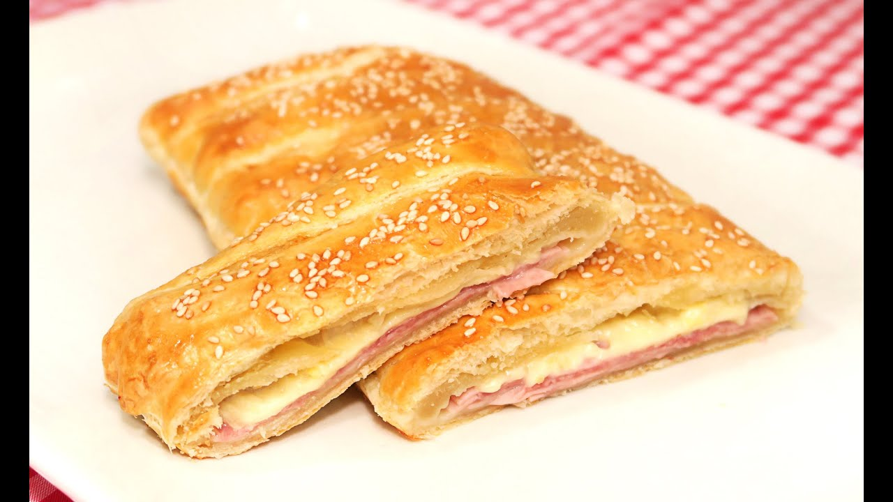

> 📺 **Vídeo Oficial de Elaboración:** [Ver en YouTube: Trenza de Hojaldre rellena de Jamón y Queso](https://www.youtube.com/watch?v=_yj6EVhwNDY)


> [!TIP]
> **El Secreto Magistral de Carmen:** Para que un hojaldre relleno de verduras quede crujiente y no se humedezca ni quede apelmazado por debajo, **el secreto radica en secar completamente las espinacas**. Tras saltearlas con un ajito, se deben escurrir y prensar sobre un colador para expulsar hasta la última gota de agua vegetal. Al combinar las espinacas secas con queso Feta desmenuzado, nueces tostadas crujientes y una cucharada de queso crema o ricotta que ligue la mezcla, el hojaldre sube en finas capas etéreas y crujientes en el horno.

### 📋 Ficha Resumen
| Parámetro | Valor |
| :--- | :--- |
| **Tiempo de Preparación** | 25 minutos |
| **Tiempo de Horneado** | 25-30 minutos a 200°C con calor arriba y abajo |
| **Dificultad** | Fácil |
| **Raciones** | 6 raciones (trenza o empanada hojaldrada) |
| **Coste Estimado** | Económico-Medio (4,60 € total) |

---

### ⚠️ Tabla de Alérgenos (Reglamento UE 1169/2011)

| Alérgeno | Estado | Ingrediente Causante / Medida de Adaptación |
| :--- | :---: | :--- |
| **Gluten** | 🔴 **PRESENTE** | Masa de hojaldre con harina de trigo. *Adaptación: hojaldre sin gluten comercial con mantequilla.* |
| **Lácteos** | 🔴 **PRESENTE** | Mantequilla del hojaldre, queso Feta griego y queso ricotta/crema. *Adaptación: queso feta vegano de coco y hojaldre con margarina vegetal pura.* |
| **Frutos de Cáscara** | 🔴 **PRESENTE** | Nueces pacanas o nueces de nogal troceadas. *Adaptación: sustituir por semillas de girasol o calabaza tostadas.* |
| **Huevos** | 🔴 **PRESENTE** | Huevo batido de pincelado. |
| **Sulfitos / Pescado / Soja** | 🟢 AUSENTE | Formulación vegetariana limpia. |

---

### ⚖️ Ingredientes Exactos

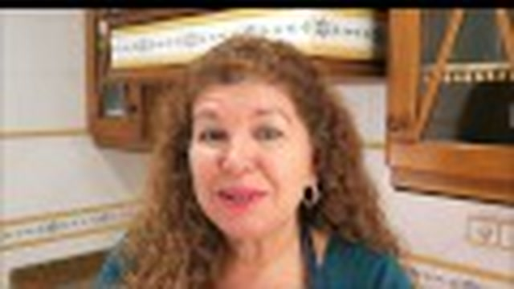

#### Para el Hojaldrado
* **2 láminas (aprox. 500 g)** Masa de hojaldre rectangular elaborada con mantequilla (fresca o descongelada en frío).
* **1 unidad** Huevo campero batido para sellar y pincelar.
* **1 cucharada (10 g)** Semillas de sésamo blanco o negro para espolvorear.

#### Para el Relleno Mediterráneo
* **500 g** Espinacas frescas baby o espinacas de hoja limpia.
* **180 g** Queso Feta D.O.P. griego desmenuzado en trozos irregulares.
* **80 g** Queso ricotta fresco o queso crema tipo Philadelphia (para cohesionar).
* **60 g** Nueces peladas tostadas y picadas en trozos medianos.
* **25 g** Piñones nacionales ligeramente dorados en sartén (opcional pero muy recomendado).
* **2 unidades** Dientes de ajo picados en brunoise microscópica.
* **30 ml** Aceite de Oliva Virgen Extra (AOVE).
* **1 pizca** Nuez moscada recién rallada y pimienta negra molida.
* **Sal marina fina (muy poca, el queso Feta aporta salinidad natural).**

---

### 🍳 Equipamiento Necesario
* Sartén amplia para saltear las espinacas.
* Colador fino metálico para prensar y escurrir líquidos.
* Bandeja de horno plana con papel vegetal.
* Cuchillo afilado o cortador de pizza para trenzar la masa.
* Pincel de silicona de cocina.

---

### 👨‍🍳 Paso a Paso Técnico y Minucioso

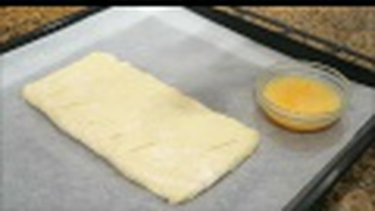

1. **Salteado y Escurrido Riguroso de las Espinacas:**
   * En una sartén amplia, calentar los 30 ml de AOVE y dorar el ajo picado durante 30 segundos sin quemarlo.
   * Añadir las espinacas frescas en tandas (al principio abultan mucho pero reducen su volumen en un 90%). Saltear a fuego vivo durante **4 a 5 minutos** hasta que caigan.
   * Verter las espinacas sobre un colador fino y presionar con la base de un vaso o una cuchara durante 3 minutos para extraer todo el líquido verde exudado. Dejar templar.
2. **Elaboración del Relleno:**
   * En un bol, colocar las espinacas bien secas y picarlas ligeramente con tijeras de cocina.
   * Incorporar el queso Feta desmenuzado con las manos, los 80 g de queso ricotta o crema, las nueces picadas, los piñones dorados, la nuez moscada y una pizca de pimienta negra. Mezclar homogéneamente con un tenedor.
3. **Montaje en Trenza o Corona de Hojaldre:**
   * Desenrollar la lámina de hojaldre fría sobre su propio papel vegetal en la bandeja de horno.
   * Disponer el relleno en el tercio central longitudinal de la masa.
   * Con el cuchillo, realizar cortes diagonales paralelos de 1,5 cm de ancho en los dos tercios laterales de la masa.
   * Cruzar las tiras alternativamente de izquierda a derecha sobre el relleno formando un trenzado elegante.
4. **Pincelado y Horneado:**
   * Pincelar toda la superficie del hojaldre con huevo batido y espolvorear las semillas de sésamo por encima.
   * Precalentar el horno a **200°C con calor arriba y abajo**.
   * Hornear durante **25 a 30 minutos** en la guía intermedia, hasta que el hojaldre haya subido en finas capas crujientes y muestre un tono dorado uniforme y brillante.
5. **Servicio:**
   * Dejar reposar 10 minutos sobre una rejilla para que el hojaldre asiente su crujiente. Cortar con cuchillo de sierra en porciones generosas.

---

### 📦 Protocolo de Conservación y Batch Cooking

* **Conservación:** Se degusta óptimamente recién horneado o tibio. En nevera aguanta **2 días**.
* **Congelación en Crudo:** Se puede montar la trenza completa, congelar en crudo sobre bandeja y envolver en film. Hornear directamente congelada a 190°C durante 35 minutos.

---

### 🔥 Guía de Regeneración Multicanal

* **Horno Convencional:** 180°C durante 6-8 minutos para devolver el crujiente al hojaldre.
* **Airfryer:** 160°C durante 4 minutos.
* **Microondas:** ❌ **EVITAR** (humedece la mantequilla del hojaldre y pierde el inflado).

---

## 📊 Tabla Comparativa Maestra: Hidratación, Fermentación, Costes y Horneado

| Receta / Preparación | Tipo de Masa / Grasa | % Hidratación Aprox. | Tipo de Fermentación | Tª y Tiempo de Horneado | Rendimiento Típico | Coste Total Est. (€) |
| :--- | :--- | :---: | :--- | :--- | :--- | :---: |
| **1. Empanada Gallega de Atún** | Fermentada / Aceite Sofrito + Vino | 56% | 60-75 min temp. ambiente | 200°C / 40-45 min | 8-10 raciones (35x25 cm) | 6,80 € |
| **2. Pizza Larga Fermentación** | Panaria Directa / AOVE | 66% | 24-48h en frío (4°C) | 250-275°C / 8-10 min | 3 pizzas Ø 30 cm | 1,80 € |
| **3. Masa Quebrada / Brisa** | Escaldada-Arenada / Mantequilla fría | 25-30% | Sin fermentar (1h reposo frío) | 180°C / 20 min (en blanco) | 1 molde Ø 26-28 cm | 1,60 € |
| **4. Quiche Lorraine** | Quebrada + *Appareil* Lácteo | N/A (Emulsión) | Sin fermentar | 175°C / 30-35 min | 6-8 raciones | 5,90 € |
| **5. Pan Rústico Sin Amasado** | Alta Hidratación / Sin grasa | 76% | 3h ambiente o 12-18h frío | 240°C (Cocotte 25m + 20m) | 1 hogaza de 850 g | 0,90 € |
| **6. Masa Empanadillas** | Escaldada / Manteca + AOVE + Vino | 40% | 30 min reposo ambiente | Fritura 180°C / Horno 200°C | 20-24 obleas Ø 12 cm | 2,20 € |
| **7. Empanada de Pollo y Queso** | Enriquecida / AOVE + Cerveza | 54% | 60 min temp. ambiente | 195°C / 40-45 min | 8 raciones | 5,20 € |
| **8. Hojaldre Espinacas y Feta** | Laminada / Mantequilla | N/A (Hojaldre) | Reposo en frío | 200°C / 25-30 min | 6 raciones | 4,60 € |

---

> *Recetario compilado y redactado bajo los más rigurosos estándares culinarios y técnicos de **Cocina con Carmen**.*  
> *Prohibida la simulación de masas o tiempos de reposo incompletos: la paciencia y el respeto a la temperatura son el verdadero secreto del buen horneado casero.*
