# 🍮 Master de Repostería Tradicional: Postres de Cuchara y Flanes Artesanos
> **Inspirado en la filosofía, maestría y técnica del canal *Cocina con Carmen***  
> *Recetario Técnico Enciclopédico, Termodinámica del Azúcar y la Coagulación, Protocolos de Batch Cooking, Alérgenos UE (Reglamento 1169/2011) y Guías de Conservación Profesional*

---

## 📖 Prólogo Culinario: Los Secretos de los Postres de Cuchara Tradicionales

Los postres de cuchara y los flanes representan la cúspide de la repostería hogareña y de convento en España. En la cocina de **Carmen**, estos bocados no se conciben como meros remates azucarados, sino como un ejercicio de precisión termodinámica donde la sencillez de los ingredientes nobles (leche entera fresca, huevos camperos, azúcar blanquilla, cítricos de la huerta y canela en rama) se transforma en una textura sublime e inolvidable.

La excelencia de un postre de cuchara artesano descansa sobre cinco pilares científicos y culinarios:

1. **La Infusión Láctea y la Extracción de Terpenos:** La leche nunca se hierve con violencia. Debe aromatizarse a fuego lento (80-85°C) con pieles de limón y naranja cortadas quirúrgicamente sin el albedo blanco amargo, y canela en rama de Ceylán. Este proceso extrae los aceites esenciales volátiles (limoneno, citral, cinamaldehído) y los fija en los glóbulos grasos de la leche sin desnaturalizar sus caseínas.
2. **La Coagulación Controlada de Ovoproteínas:** En natillas, cremas y flanes, el huevo es el agente estructurante. La ovoalbúmina y la vitelina cuajan entre los 65°C y los 82°C. Superar los 85°C sin la protección de un almidón provoca la sinéresis irreversible (la proteína se estrangula, expulsa el agua y la crema "se corta" adquiriendo textura de tortilla dulce). El control del fuego manso y el baño maría amortiguado son leyes inquebrantables.
3. **La Gelatinización y Fricción Mecánica del Almidón de Arroz:** Un arroz con leche no adquiere cremosidad añadiendo nata artificial, sino estimulando la liberación paulatina de amilopectina del grano redondo mediante el removido continuo con cuchara de madera. El blanqueado previo en agua purga el exceso de almidón superficial y abre el poro para que el grano absorba la leche aromatizada hasta el núcleo.
4. **La Alquimia del Caramelo y la Reacción de Pirólisis:** El caramelo de flan y tocino de cielo no es azúcar quemado al descuido. Requiere una caramelización controlada a 165-175°C para alcanzar tonos ámbar dorado sin notas acres ni amargas. Un toque milimétrico de ácido (zumo de limón) previene la recristalización prematura de la sacarosa.
5. **El Tiempo de Reposo Osmótico y Maduración en Frío:** Un flan o un arroz con leche recién cocinados son solo la mitad del postre. El reposo refrigerado a 2-4°C durante 12-24 horas asienta las redes de gel, permite que el caramelo se licue por ósmosis extrayendo la humedad del fondo del molde y amalgama los aromas en un perfil sensorial redondo y aterciopelado.

---

```
                                  MAPA DEL RECETARIO
                                  
  ┌─────────────────────────────────┐       ┌─────────────────────────────────┐
  │     ARROCES Y TRADICIÓN LÁCTEA   │       │   CREMAS Y YEMAS AL FUEGO       │
  │ • 1. Arroz con Leche Cremoso    │       │ • 3. Natillas Caseras con Galleta│
  │ • 8. Arroz con Leche Asturiano  │       │ • 4. Crema Catalana Crujiente   │
  └────────────────┬────────────────┘       └────────────────┬────────────────┘
                   │                                         │
                   └───────────────────┬─────────────────────┘
                                       │
                    ┌──────────────────┴──────────────────┐
                    │     FLANES, ALMÍBARES Y EMULSIONES  │
                    │ • 2. Flan de Huevo Tradicional      │
                    │ • 5. Tocino de Cielo de Jerez       │
                    │ • 6. Mousse de Limón Exprés Cremosa │
                    │ • 7. Panna Cotta Vainilla y Coulis  │
                    └─────────────────────────────────────┘
```

---

## 📑 Índice General de Recetas

1. [🍚 Arroz con Leche Cremoso de la Abuela con Canela y Cítricos](#1--arroz-con-leche-cremoso-de-la-abuela-con-canela-y-cítricos)
2. [🍮 Flan de Huevo Tradicional al Baño María con Caramelo Líquido Casero](#2--flan-de-huevo-tradicional-al-baño-maría-con-caramelo-líquido-casero)
3. [🥛 Natillas Caseras de Yema con Galleta María y Canela](#3--natillas-caseras-de-yema-con-galleta-maría-y-canela)
4. [🔥 Crema Catalana Tradicional con Azúcar Quemado Crujiente](#4--crema-catalana-tradicional-con-azúcar-quemado-crujiente)
5. [👑 Tocino de Cielo Tradicional de Jerez](#5--tocino-de-cielo-tradicional-de-jerez)
6. [🍋 Mousse de Limón Cremosa Fácil y Rápida](#6--mousse-de-limón-cremosa-fácil-y-rápida)
7. [🍓 Panna Cotta Tradicional de Vainilla con Coulis de Frutos Rojos](#7--panna-cotta-tradicional-de-vainilla-con-coulis-de-frutos-rojos)
8. [✨ Arroz con Leche Caramelizado al Estilo Asturiano](#8--arroz-con-leche-caramelizado-al-estilo-asturiano)
9. [📊 Tabla Comparativa Maestra: Rendimientos, Costes y Tiempos](#9--tabla-comparativa-maestra-rendimientos-costes-y-tiempos)
10. [🛠️ Guía Rápida de Adaptación para Intolerancias y Dietas Especiales](#10--guía-rápida-de-adaptación-para-intolerancias-y-dietas-especiales)
11. [📜 Decálogo de Oro del Chef Pastelero de Carmen](#11--decálogo-de-oro-del-chef-pastelero-de-carmen)

---

## 1. 🍚 Arroz con Leche Cremoso de la Abuela con Canela y Cítricos
*Categoría: Postre Lácteo Tradicional / Gelatinización de Almidón por Fricción Mansa*

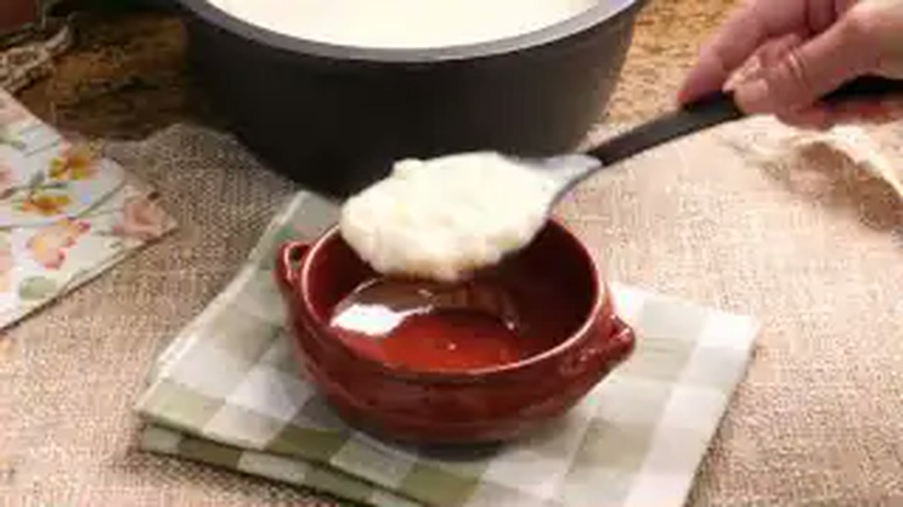

> 📺 **Vídeo Oficial de Elaboración:** [Ver en YouTube: Arroz con Leche Súper Cremoso y Delicioso](https://www.youtube.com/watch?v=-HcKl9xMCqw)


> [!NOTE]
> El secreto de Carmen para que el arroz con leche quede ultra cremoso sin necesidad de natas ni espesantes artificiales consta de tres pasos sagrados: blanquear el arroz 2 minutos en un vaso de agua hirviendo con una pizca de sal para abrir el grano, cocerlo a fuego mínimo durante 45 minutos sin dejar de remover con cuchara de madera, y añadir el azúcar junto a una nuez de mantequilla únicamente en los últimos 8 minutos para evitar que el grano se endurezca o se pegue.

```
                    ┌───────────────────────────────┐
                    │     ARROZ CON LECHE CARMEN    │
                    │   PROCESO DE COCCIÓN MANSA    │
                    └───────────────┬───────────────┘
                                    │
           ┌────────────────────────┴────────────────────────┐
           ▼                                                 ▼
┌──────────────────────┐                          ┌──────────────────────┐
│  BLANQUEADO EN AGUA  │                          │  INFUSIÓN Y FRICCIÓN │
│ 200 ml agua + sal    │                          │ Leche entera fresca  │
│ 2 min hervor suave   │                          │ 45 min fuego mínimo  │
│ Abre poro del grano  │                          │ Cuchara madera en 8  │
└──────────┬───────────┘                          └──────────┬───────────┘
           │                                                 │
           └────────────────────────┬────────────────────────┘
                                    ▼
                         ┌──────────────────────┐
                         │   AZÚCAR Y MANTECA   │
                         │ Añadir en minuto 40  │
                         │ Manteca aporta seda  │
                         │ Servir fluido y frío │
                         └──────────────────────┘
```

### 📋 Ficha Resumen
| Parámetro | Valor |
| :--- | :--- |
| **Tiempo de Preparación** | 10 minutos |
| **Tiempo de Cocción** | 50 minutos |
| **Tiempo de Reposo en Frío** | 4 horas (óptimo 12 horas a 3°C) |
| **Dificultad** | Baja-Media (requiere atención constante) |
| **Raciones** | 6 personas (aprox. 220 g por ración) |
| **Coste Estimado** | Muy Económico (2,40 € total / 0,40 € ración) |

---

### ⚠️ Tabla de Alérgenos (Reglamento UE 1169/2011)

| Alérgeno | Estado | Ingrediente Causante / Medida de Adaptación |
| :--- | :---: | :--- |
| **Lácteos** | 🔴 **PRESENTE** | Leche entera de vaca y mantequilla. *Adaptación: bebida de avena barista o almendras y margarina 100% vegetal.* |
| **Gluten** | 🟢 AUSENTE | El arroz es un cereal naturalmente libre de gluten. |
| **Huevos** | 🟢 AUSENTE | Formulación tradicional andaluza sin huevo. |
| **Sulfitos / Soja / Frutos de Cáscara** | 🟢 AUSENTE | Formulación limpia. |

---

### ⚖️ Ingredientes Exactos


#### Infusión y Apertura de Grano
* **1.200 ml** Leche entera fresca pasteurizada (mínimo 3,6% M.G.).
* **160 g** Arroz redondo tradicional (variedad Senia, Bahía o Bomba).
* **200 ml** Agua mineral natural.
* **1 unidad (corteza)** Piel de limón fino (solo la parte amarilla, sin nada de albedo blanco).
* **1 unidad (corteza)** Piel de naranja dulce (solo la parte naranja exterior).
* **1 rama (5 g)** Canela en rama de Ceylán de máxima calidad.
* **1 pizca (1 g)** Sal marina fina (potenciador osmótico del sabor).

#### Endulzado y Emulsión Final
* **140 g** Azúcar blanquilla tradicional.
* **25 g** Mantequilla sin sal de calidad (82% M.G.) a temperatura ambiente.
* **5 g** Canela de Ceylán molida fina para espolvorear al servir.

---

### 🍳 Equipamiento Necesario
* Cazuela amplia de fondo difusor grueso (triple fondo de acero o hierro esmaltado).
* Cuchara de madera tradicional o espátula de silicona térmica.
* Pelador de cítricos de precisión.
* Cuencos de barro cocido o fuentes individuales de cristal.
* Colador fino para espolvorear canela.

---

### 👨‍🍳 Paso a Paso Técnico y Minucioso


1. **Aromatización e Infusión de la Leche:**
   * En un cazo independiente, verter los 1.200 ml de leche entera fresca junto con la piel de limón, la piel de naranja y la rama de canela partida por la mitad.
   * Llevar a fuego medio hasta que alcance unos 85°C (primeros indicios de vapor y pequeñas burbujas periféricas, sin llegar a hervor violento).
   * Apagar el fuego, tapar el cazo y dejar infusionar en caliente durante 15 minutos para que la grasa láctea absorba los aceites esenciales cítricos.
2. **Blanqueado Previo del Arroz:**
   * En la cazuela principal de fondo grueso, verter los 200 ml de agua mineral y el gramo de sal marina. Llevar a ebullición.
   * Incorporar los 160 g de arroz redondo. Cocinar a fuego medio durante **2 a 3 minutos** removiendo enérgicamente, hasta que el arroz haya absorbido casi la totalidad del agua.
   * *Justificación técnica:* Este choque térmico rompe la cutícula exterior del grano, expulsa el exceso de almidón astringente y prepara el grano para absorber la leche sin apelmazarse ni pegarse al fondo.
3. **Cocción Lenta y Fricción Mecánica:**
   * Retirar las pieles de cítricos y la canela de la leche infusionada (o colarla) y verterla caliente sobre el arroz en la cazuela principal.
   * Llevar a ebullición suave y bajar inmediatamente el fuego al mínimo (chup-chup muy lento).
   * Cocinar durante **40 minutos**, removiendo de forma continua cada 2-3 minutos con movimientos en forma de "8" y raspando el fondo para evitar cualquier adherencia. La fricción constante entre los granos liberará la amilopectina que emulsionará la leche.
4. **Incorporación del Azúcar y Manteca:**
   * Transcurridos los 40 minutos de cocción y con el grano ya completamente tierno y meloso, añadir los 140 g de azúcar y los 25 g de mantequilla.
   * Cocinar durante **8 a 10 minutos adicionales** a fuego muy suave, removiendo sin parar. El azúcar licuará ligeramente la mezcla al disolverse y luego adquirirá un brillo dorado nacarado mientras la mantequilla redondea la grasa.
5. **Punto de Fluidez y Reposo:**
   * Apagar el fuego cuando el arroz esté sumamente cremoso pero aún fluido (al enfriar, el almidón continuará absorbiendo líquido y compactará).
   * Verter inmediatamente en cazuelas individuales de barro o cuencos de cristal.
   * Dejar templar a temperatura ambiente durante 30 minutos y trasladar al frigorífico a 3°C durante un mínimo de 4 horas.
6. **Servicio Tradicional:**
   * En el momento de servir, espolvorear una lluvia fina y uniforme de canela molida con ayuda de un colador.

---

### 📦 Protocolo de Conservación y Batch Cooking
* **Refrigeración (2°C a 4°C):** Conservar tapado con papel film o en recipientes herméticos hasta **4-5 días**.
* **Congelación:** ❌ **NO RECOMENDADA.** El grano de arroz congelado sufre retrogradación del almidón cristalizado; al descongelar se vuelve granuloso, arenoso y expulsa agua (sinéresis).
* **Control de Consistencia:** Si tras 2 días en nevera ha espesado demasiado, puede aligerarse añadiendo 2 cucharadas de leche entera caliente y mezclando suavemente antes de servir.

---

### 🔥 Guía de Degustación y Servicio
* **Temperatura de Servicio:** Servir fresco a 8-10°C (no excesivamente helado de nevera para no anestesiar las papilas) o a temperatura ambiente según preferencia tradicional.

---

## 2. 🍮 Flan de Huevo Tradicional al Baño María con Caramelo Líquido Casero
*Categoría: Repostería Conventual / Coagulación Térmica de Ovoproteínas*

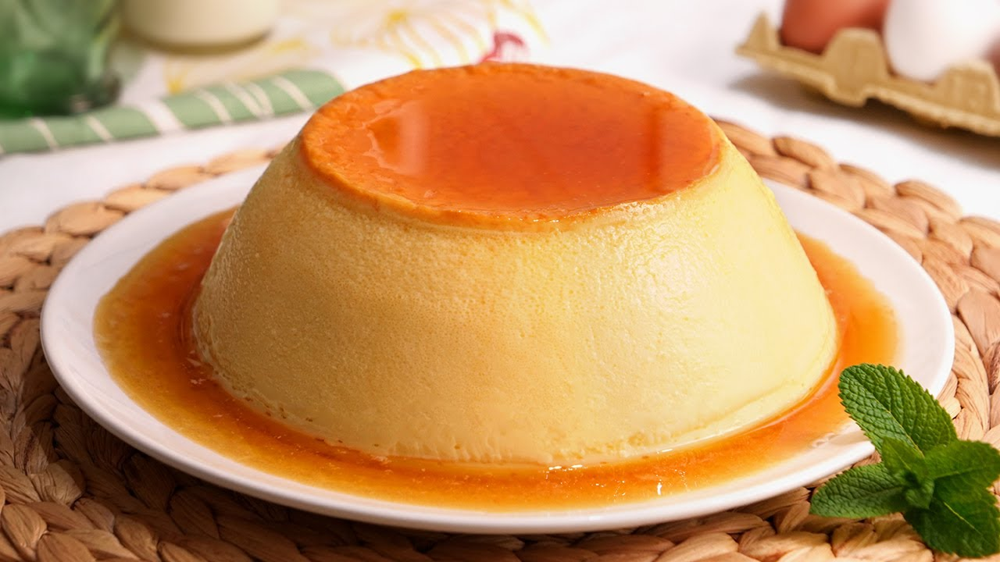

> 📺 **Vídeo Oficial de Elaboración:** [Ver en YouTube: Flan de Huevo Casero muy Fácil y Delicioso (con solo 3 Ingredientes)](https://www.youtube.com/watch?v=QfHAUkooA-Q)


> [!NOTE]
> Para conseguir un flan de huevo sedoso, brillante, sin "ojos" ni poros y con una textura aterciopelada que tiemble al desmoldar, Carmen aplica dos reglas de oro: batir los huevos con las varillas de forma suave y circular sin meter aire ni espumas, y hornear al baño María a temperatura moderada (160°C) colocando un paño de cocina de algodón bajo la flanera para absorber las vibraciones del agua hirviendo.

```
                    ┌───────────────────────────────┐
                    │     FLAN DE HUEVO CARMEN      │
                    │   COAGULACIÓN SIN BURBUJAS    │
                    └───────────────┬───────────────┘
                                    │
           ┌────────────────────────┴────────────────────────┐
           ▼                                                 ▼
┌──────────────────────┐                          ┌──────────────────────┐
│   CARAMELO RUBIO     │                          │    BATIDO SIN AIRE   │
│ Azúcar + gotas limón │                          │ Huevos + yemas extra │
│ Tono ámbar cobrizo   │                          │ Movimiento circular  │
│ Tapizar molde entero │                          │ Colado por malla     │
└──────────┬───────────┘                          └──────────┬───────────┘
           │                                                 │
           └────────────────────────┬────────────────────────┘
                                    ▼
                         ┌──────────────────────┐
                         │ BAÑO MARÍA CON PAÑO  │
                         │ Horno a 160°C        │
                         │ Paño amortiguador    │
                         │ 55 min / Reposo 12h  │
                         └──────────────────────┘
```

### 📋 Ficha Resumen
| Parámetro | Valor |
| :--- | :--- |
| **Tiempo de Preparación** | 15 minutos |
| **Tiempo de Horneado (Baño María)** | 55-60 minutos |
| **Tiempo de Maduración en Frío** | Mínimo 12 horas (óptimo 24 horas a 3°C) |
| **Dificultad** | Baja |
| **Raciones** | 8 personas (molde flanera de 18-20 cm o 8 flaneras individuales) |
| **Coste Estimado** | Muy Económico (2,80 € total / 0,35 € ración) |

---

### ⚠️ Tabla de Alérgenos (Reglamento UE 1169/2011)

| Alérgeno | Estado | Ingrediente Causante / Medida de Adaptación |
| :--- | :---: | :--- |
| **Huevos** | 🔴 **PRESENTE** | Huevos enteros y yemas camperas (base estructural). |
| **Lácteos** | 🔴 **PRESENTE** | Leche entera fresca. *Adaptación: leche de almendras o soja sin azúcar.* |
| **Gluten** | 🟢 AUSENTE | 100% libre de harinas y almidones. Apto para celíacos. |
| **Sulfitos / Frutos de Cáscara** | 🟢 AUSENTE | Formulación tradicional limpia. |

---

### ⚖️ Ingredientes Exactos

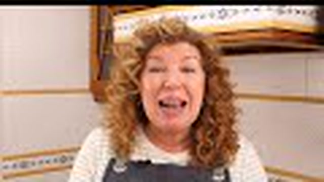

#### Caramelo Líquido Casero
* **120 g** Azúcar blanquilla.
* **30 ml** Agua mineral natural.
* **5 ml (1 cucharadita)** Zumo de limón recién exprimido (evita la cristalización).

#### Aparejo del Flan
* **500 ml** Leche entera fresca pasteurizada (3,6% M.G.).
* **4 unidades (clase L, aprox. 240 g)** Huevos camperos frescos enteros.
* **2 unidades (aprox. 40 g)** Yemas de huevo campero adicionales (aporta untuosidad y color dorado intenso).
* **120 g** Azúcar blanquilla.
* **1 unidad** Vaina de vainilla Bourbon (abierta y raspada) o 1 rama de canela con corteza de limón.

---

### 🍳 Equipamiento Necesario
* Flanera tradicional con tapa de acero inoxidable (Ø 18 cm) o molde de corona.
* Bandeja honda de horno para baño María.
* Paño de cocina limpio de algodón puro (sin suavizantes aromáticos).
* Cazo de fondo grueso para el caramelo.
* Varillas manuales y colador de malla fina.

---

### 👨‍🍳 Paso a Paso Técnico y Minucioso

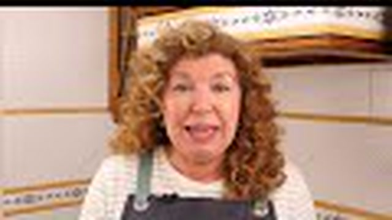

1. **Elaboración del Caramelo Rubio Artesano:**
   * En un cazo a fuego medio, disponer los 120 g de azúcar, los 30 ml de agua y el zumo de limón.
   * Dejar fundir sin remover con cuchara (mover únicamente el cazo por el mango con vaivenes suaves) hasta que adquiera un tono dorado ámbar cobrizo brillante (aprox. 170°C).
   * Verter inmediatamente en la flanera, girando el molde con cuidado para tapizar el fondo y las paredes laterales. Dejar enfriar hasta que cristalice y endurezca.
2. **Infusión Aromática Láctea:**
   * En otro cazo, calentar la leche con las semillas y la vaina de vainilla abierta (o canela y piel de limón) hasta los 80°C.
   * Retirar del fuego, tapar y dejar reposar 10 minutos. Colar y templar a unos 40°C.
3. **Elaboración del Aparejo sin Emulsión de Aire:**
   * En un bol amplio, disponer los 4 huevos enteros, las 2 yemas y los 120 g de azúcar.
   * Con las varillas manuales, mezclar con movimientos circulares bajos y suaves durante 2 minutos hasta disolver el azúcar por completo, **evitando deliberadamente batir con fuerza para no generar espuma ni burbujas de aire**.
   * Verter la leche infusionada tibia en un hilo fino continuo sobre los huevos sin parar de mezclar suavemente.
   * Pasar toda la mezcla a través de un colador de malla fina directamente al molde caramelizado para eliminar cualquier resto de chalaza o clara densa.
4. **Disposición del Baño María Técnico:**
   * Precalentar el horno a **160°C con calor arriba y abajo (sin ventilador)**.
   * Colocar un paño de cocina doblado en el fondo de la bandeja honda de horno. Depositar la flanera tapada sobre el paño.
   * Verter agua muy caliente (a punto de hervir) en la bandeja hasta cubrir dos tercios de la altura de la flanera.
   * *Justificación técnica:* El paño evita que el molde entre en contacto con el metal caliente de la bandeja e impide que el agua hierva a borbotones, garantizando una temperatura interna constante a 83-85°C que logra un flan liso como la seda.
5. **Cocción y Maduración:**
   * Hornear durante **50 a 55 minutos**. Comprobar el punto insertando una aguja o brocheta fina en el centro: debe salir limpia y sin líquido adherido.
   * Retirar la flanera del baño María, retirar la tapa y dejar enfriar a temperatura ambiente durante 1 hora.
   * Tapar de nuevo y refrigerar a 3°C durante un mínimo de **12 a 24 horas**. Durante este reposo, el azúcar del caramelo absorbe agua por ósmosis y se transforma en un almíbar fluido y abundante.
6. **Desmoldado Perfecto:**
   * Pasar la punta de un cuchillo fino y flexible por el borde superior para despegarlo.
   * Colocar un plato hondo amplio sobre la flanera y voltear con un movimiento rápido y decidido. Dejar que el flan caiga por su propio peso bañado en su caramelo líquido.

---

### 📦 Protocolo de Conservación y Batch Cooking
* **Refrigeración (2°C a 4°C):** Se conserva en perfecto estado hasta **6 días** dentro de su molde o en plato tapado con campana.
* **Congelación:** ❌ **DESACONSEJADA TOTALMENTE.** El congelador rompe la red proteica del huevo cuajado, provocando que al descongelar expulse todo el líquido y quede con textura esponjosa y gomosa.

---

### 🔥 Guía de Degustación y Servicio
* **Temperatura de Servicio:** Degustar frío (6-8°C). Acompañar de forma opcional con un rosetón de nata montada artesana sin azúcar para equilibrar la dulzura del caramelo.

---

## 3. 🥛 Natillas Caseras de Yema con Galleta María y Canela
*Categoría: Crema de Yema Tradicional / Espesado Mixto Yema-Almidón*

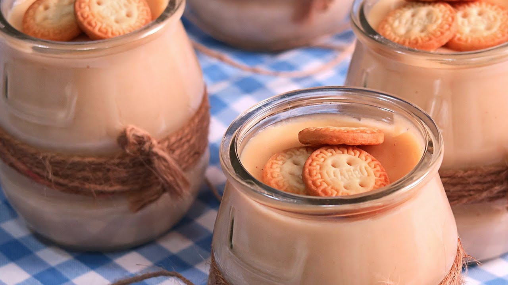

> 📺 **Vídeo Oficial de Elaboración:** [Ver en YouTube: NATILLAS DE GALLETAS MARÍA | LAS MÁS RICAS Y FÁCILES!](https://www.youtube.com/watch?v=2Ow48FrVHCc)


> [!NOTE]
> Las auténticas natillas de Carmen tienen el espesor justo, un color amarillo dorado brillante y una textura que acaricia la cuchara. El secreto para que jamás se corten ni queden con sabor a harina consiste en disolver la Maizena en frío con las yemas, temperar con la leche caliente vertida poco a poco, y cocinar a fuego suave sin sobrepasar los 84°C, retirando inmediatamente a un baño maría con hielo para cortar la cocción en seco.

```
                    ┌───────────────────────────────┐
                    │    NATILLAS CASERAS CARMEN    │
                    │   TEMPERADO Y CORTE TÉRMICO   │
                    └───────────────┬───────────────┘
                                    │
           ┌────────────────────────┴────────────────────────┐
           ▼                                                 ▼
┌──────────────────────┐                          ┌──────────────────────┐
│  DISOLUCIÓN EN FRÍO  │                          │ TEMPERADO ESCALONADO │
│ 5 yemas camperas     │                          │ Verter leche en hilo │
│ 15 g Maizena + azúcar│                          │ Integración térmica  │
│ Cero grumos secos    │                          │ Fuego lento a 83°C   │
└──────────┬───────────┘                          └──────────┬───────────┘
           │                                                 │
           └────────────────────────┬────────────────────────┘
                                    ▼
                         ┌──────────────────────┐
                         │ BAÑO MARÍA INVERTIDO │
                         │ Cortar cocción en bol│
                         │ Galleta María encima │
                         │ Canela molida fina   │
                         └──────────────────────┘
```

### 📋 Ficha Resumen
| Parámetro | Valor |
| :--- | :--- |
| **Tiempo de Preparación** | 10 minutos |
| **Tiempo de Cocción** | 12 minutos |
| **Tiempo de Enfriado** | 3 horas en refrigeración |
| **Dificultad** | Baja-Media |
| **Raciones** | 6 personas (aprox. 160 g por ración) |
| **Coste Estimado** | Muy Económico (2,20 € total / 0,36 € ración) |

---

### ⚠️ Tabla de Alérgenos (Reglamento UE 1169/2011)

| Alérgeno | Estado | Ingrediente Causante / Medida de Adaptación |
| :--- | :---: | :--- |
| **Huevos** | 🔴 **PRESENTE** | Yemas de huevo camperas. |
| **Lácteos** | 🔴 **PRESENTE** | Leche entera pasteurizada. *Adaptación: leche de avena o soja.* |
| **Gluten** | 🔴 **PRESENTE** | Galleta María tradicional de trigo. *Adaptación: usar galletas María sin gluten.* |
| **Sulfitos / Frutos de Cáscara** | 🟢 AUSENTE | Formulación tradicional limpia. |

---

### ⚖️ Ingredientes Exactos


#### Infusión Láctea
* **800 ml** Leche entera fresca pasteurizada (3,6% M.G.).
* **1 unidad** Corteza de limón sin albedo blanco.
* **1 rama (4 g)** Canela en rama de Ceylán.
* **1 cucharadita (5 ml)** Extracto puro de vainilla natural (opcional).

#### Base Emulsionada de Yemas
* **5 unidades** Yemas de huevo campero fresco clase L (reservar claras para merengues o mousses).
* **110 g** Azúcar blanquilla.
* **18 g** Almidón de maíz (Maizena) tamizado.
* **1 pizca (0,5 g)** Sal fina.

#### Acabado Clásico
* **6 unidades** Galletas María doradas tradicionales.
* **4 g** Canela en polvo de Ceylán para espolvorear.

---

### 🍳 Equipamiento Necesario
* Cazo de acero inoxidable de fondo grueso.
* Bol de cristal o acero inoxidable y varillas manuales.
* Recipiente amplio con agua y cubitos de hielo (baño maría inverso).
* 6 cuencos o copas de postre individuales.

---

### 👨‍🍳 Paso a Paso Técnico y Minucioso


1. **Infusión Aromática:**
   * En el cazo, calentar los 800 ml de leche con la piel de limón y la rama de canela hasta que comience a humear (unos 85°C). Retirar del fuego, tapar y reposar 10 minutos.
2. **Mezcla y Disolución de Yemas:**
   * En el bol, mezclar las 5 yemas de huevo con los 110 g de azúcar, la pizca de sal y los 18 g de Maizena tamizada.
   * Batir enérgicamente con las varillas manuales durante 1 minuto hasta que la mezcla blanquee ligeramente y no quede el menor grumo de almidón.
3. **Temperado Escalonado:**
   * Retirar la canela y la piel de limón de la leche caliente.
   * Verter un cucharón de leche caliente sobre el bol de las yemas mientras se remueve continuamente con las varillas. Repetir con un segundo cucharón.
   * *Justificación técnica:* Este atemperado eleva gradualmente la temperatura de las yemas sin coagularlas de golpe por choque térmico.
4. **Cocinado a Fuego Lento hasta el Punto de Rosa:**
   * Verter toda la mezcla del bol de vuelta al cazo a través de un colador.
   * Poner a fuego suave-medio (nivel 4 de 9 en placa de inducción). Remover constantemente trazando figuras en forma de "8" con la espátula o varillas, cubriendo todo el fondo.
   * Cocinar durante **6 a 8 minutos**. Cuando la espuma superficial desaparezca y la crema espese cubriendo el dorso de una cuchara de madera (punto de napado a 82-84°C), retirar de inmediato del fuego. **Nunca dejar que hierva a borbotones**.
5. **Corte Térmico y Emplatado:**
   * Colocar la base del cazo sobre el recipiente con agua helada y remover durante 1 minuto para detener la inercia térmica.
   * Repartir la crema caliente en 6 cuencos individuales.
   * Colocar de inmediato una galleta María en el centro de cada cuenco para que absorba el vapor y quede tierna.
   * Dejar enfriar a temperatura ambiente durante 20 minutos y refrigerar un mínimo de 3 horas. Espolvorear con canela molida antes de servir.

---

### 📦 Protocolo de Conservación y Batch Cooking
* **Refrigeración (2°C a 4°C):** Conservar tapadas con film plástico hasta **3-4 días**.
* **Congelación:** ❌ **NO ADMISIBLE.** El almidón de maíz y la yema sufren sinéresis severa al descongelar.

---

### 🔥 Guía de Degustación y Servicio
* **Servicio:** Servir bien frías de nevera (4-6°C) para disfrutar del contraste entre la untuosidad de la crema y la galleta hidratada en canela.

---

## 4. 🔥 Crema Catalana Tradicional con Azúcar Quemado Crujiente
*Categoría: Postre Tradicional de Cazuela / Cuajado de Yema y Costra Vítrea*

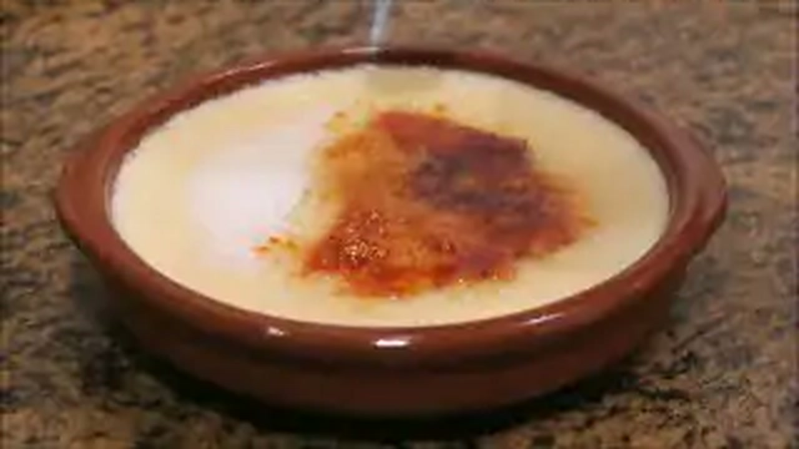

> 📺 **Vídeo Oficial de Elaboración:** [Ver en YouTube: Crema Catalana | Receta Tradicional Fácil Rápida y Deliciosa!](https://www.youtube.com/watch?v=frJfPGTAHyE)


> [!NOTE]
> La Crema Catalana se diferencia de las natillas y de la crème brûlée francesa en dos aspectos fundamentales: se aromatiza con canela y cítricos (limón y naranja), se elabora exclusivamente con leche (sin nata) y se espesa con almidón de maíz al fuego. El secreto de Carmen para una costra de caramelo perfecta que suene a "clac" al romperla con la cuchara es espolvorear una capa muy fina y homogénea de azúcar blanco y quemarla con soplete o pala candente justo en el instante previo a llevarla a la mesa.

```
                    ┌───────────────────────────────┐
                    │    CREMA CATALANA CARMEN      │
                    │   COSTRA CRUJIENTE AL INSTANTE│
                    └───────────────┬───────────────┘
                                    │
           ┌────────────────────────┴────────────────────────┐
           ▼                                                 ▼
┌──────────────────────┐                          ┌──────────────────────┐
│ INFUSIÓN DÚO CÍTRICO │                          │ CUOCADO DENSO ALMIDÓN│
│ Limón + Naranja      │                          │ Yemas + Maizena 30 g │
│ Canela en rama       │                          │ Espesado a fuego 84°C│
│ Leche entera fresca  │                          │ Cazuelas de barro    │
└──────────┬───────────┘                          └──────────┬───────────┘
           │                                                 │
           └────────────────────────┬────────────────────────┘
                                    ▼
                         ┌──────────────────────┐
                         │   QUEMADO AL INSTANTE│
                         │ Enfriado total en frío│
                         │ Capa fina de azúcar  │
                         │ Soplete / Pala hierro │
                         └──────────────────────┘
```

### 📋 Ficha Resumen
| Parámetro | Valor |
| :--- | :--- |
| **Tiempo de Preparación** | 10 minutos |
| **Tiempo de Cocción** | 12 minutos |
| **Tiempo de Refrigeración** | 4 horas a 3°C |
| **Dificultad** | Baja |
| **Raciones** | 4-5 personas (cazuelas de barro tradicionales de 12 cm) |
| **Coste Estimado** | Muy Económico (2,10 € total / 0,42 € ración) |

---

### ⚠️ Tabla de Alérgenos (Reglamento UE 1169/2011)

| Alérgeno | Estado | Ingrediente Causante / Medida de Adaptación |
| :--- | :---: | :--- |
| **Huevos** | 🔴 **PRESENTE** | Yemas de huevo camperas (5 unidades). |
| **Lácteos** | 🔴 **PRESENTE** | Leche entera pasteurizada. *Adaptación: leche de almendras.* |
| **Gluten** | 🟢 AUSENTE | Utiliza exclusivamente almidón de maíz puro sin gluten. |
| **Sulfitos / Frutos de Cáscara** | 🟢 AUSENTE | Formulación tradicional limpia. |

---

### ⚖️ Ingredientes Exactos


#### Infusión Aromática
* **600 ml** Leche entera fresca pasteurizada (3,6% M.G.).
* **1 unidad** Piel de limón fino (sin parte blanca).
* **1 unidad** Piel de naranja dulce (sin parte blanca).
* **1 rama (4 g)** Canela en rama de Ceylán.

#### Base de Crema
* **5 unidades** Yemas de huevo campero clase L.
* **100 g** Azúcar blanquilla para la crema.
* **25 g** Almidón de maíz (Maizena) tamizado.

#### Costra Caramelizada Superior
* **50 g** Azúcar blanquilla extra (10 g por cazuela para el quemado final).

---

### 🍳 Equipamiento Necesario
* Cazuelas de barro refractario tradicionales (Ø 12 cm).
* Soplete pastelero de gas o pala de hierro tradicional de quemar.
* Cazo de acero inoxidable.
* Varillas manuales y colador fino.

---

### 👨‍🍳 Paso a Paso Técnico y Minucioso


1. **Infusión Cítrica Doble:**
   * Calentar en el cazo la leche entera con las cortezas de limón y naranja y la rama de canela partida.
   * Al alcanzar los primeros hervores suaves (85°C), retirar del fuego, tapar y reposar durante 15 minutos. Colar.
2. **Ligazón de Yemas y Maizena:**
   * En un bol, batir las 5 yemas con los 100 g de azúcar y los 25 g de Maizena tamizada hasta obtener una pasta lisa, cremosa y homogénea.
3. **Cocción de la Crema:**
   * Verter la leche tibia colada sobre la mezcla de yemas en hilo continuo mientras se remueve con las varillas.
   * Regresar la mezcla al cazo a fuego medio-bajo. Remover enérgicamente sin cesar con las varillas para evitar que se adhiera al fondo.
   * Cocinar durante **4 a 6 minutos** hasta que la mezcla espese de forma visible adquiriendo la textura de una crema pastelera ligera y sedosa. Retirar de inmediato del fuego.
4. **Dosificado y Enfriado:**
   * Verter la crema caliente en las cazuelas de barro refractario individuales.
   * Dejar templar 30 minutos a temperatura ambiente y luego refrigerar durante un mínimo de 4 horas para que adquiera firmeza y cuerpo.
5. **Quemado Crujiente Magistral:**
   * **Justo antes de servir (nunca con antelación):** Sacar las cazuelas de la nevera.
   * Espolvorear una capa delgada y uniforme de azúcar sobre toda la superficie (unos 10 g por cazuela).
   * Pasar la llama del soplete pastelero a unos 3-4 cm de distancia en círculos continuos (o aplicar la pala de hierro al rojo vivo) hasta que el azúcar burbujee, se licúe y cristalice en un tono caramelo dorado crujiente.
   * Dejar reposar 1 minuto a temperatura ambiente para que la película de caramelo solidifique como un cristal antes de hincar la cuchara.

---

### 📦 Protocolo de Conservación y Batch Cooking
* **Conservación de la Crema:** Guardar en nevera a 2-4°C hasta **4 días** sin quemar el azúcar.
* **Norma del Azúcar Quemado:** El azúcar debe quemarse siempre al momento de servir. Si se quema y se introduce en la nevera, la humedad del ambiente licuará el caramelo en 20 minutos, destruyendo la textura crujiente.

---

### 🔥 Guía de Degustación y Servicio
* **Experiencia Sensorial:** Romper la costra vítrea crujiente con el dorso de la cuchara para encontrar debajo la crema fresca, sedosa y aromática con notas de canela y naranja.

---

## 5. 👑 Tocino de Cielo Tradicional de Jerez
*Categoría: Alta Repostería Histórica Española / Emulsión Pura de Yemas y Almíbar*

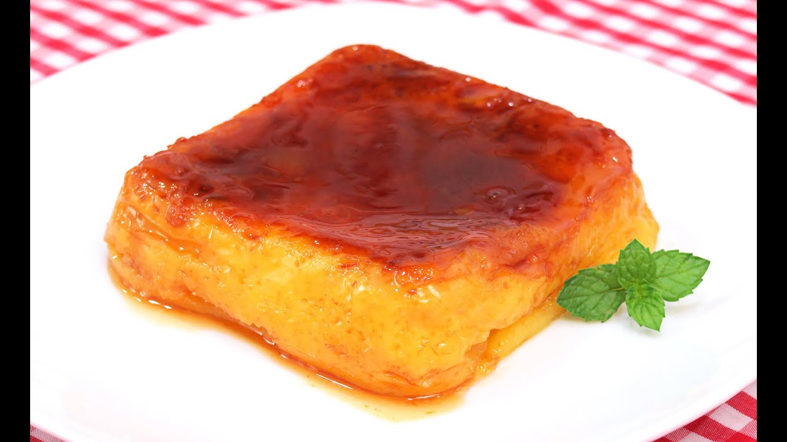

> 📺 **Vídeo Oficial de Elaboración:** [Ver en YouTube: Tocino de Cielo en el Microondas | Postre Fácil y Rápido!](https://www.youtube.com/watch?v=bMl_sjrPQVY)


> [!NOTE]
> El tocino de cielo nació en el siglo XIV en los conventos de Jerez de la Frontera, creado por las monjas para aprovechar las yemas sobrantes de la clarificación del vino de Jerez con claras de huevo. Es un postre noble compuesto únicamente de yemas, agua y azúcar. El secreto de Carmen para que quede con su transparencia ambarina, sin burbujas y con una textura que se deshace en la boca consiste en elaborar un almíbar a punto de hebra fina (105-108°C), atemperarlo antes de unirlo a las yemas batidas con infinita delicadeza, y colarlo por estameña o tamiz fino dos veces.

```
                    ┌───────────────────────────────┐
                    │     TOCINO DE CIELO CARMEN    │
                    │   ALQUIMIA DE YEMA Y ALMÍBAR  │
                    └───────────────┬───────────────┘
                                    │
           ┌────────────────────────┴────────────────────────┐
           ▼                                                 ▼
┌──────────────────────┐                          ┌──────────────────────┐
│ ALMÍBAR HEBRA FINA   │                          │  YEMAS SIN ESPUMA    │
│ 250 g azúcar + agua  │                          │ 8 yemas + 1 huevo    │
│ 105°C-108°C exactos  │                          │ Romper sin batir     │
│ Enfriar hasta tibio  │                          │ Doble colado fino    │
└──────────┬───────────┘                          └──────────┬───────────┘
           │                                                 │
           └────────────────────────┬────────────────────────┘
                                    ▼
                         ┌──────────────────────┐
                         │ VAPORERA O HORNO 140°│
                         │ Tapado hermético     │
                         │ 35 min vapor suave   │
                         │ Reposo en frío 12h   │
                         └──────────────────────┘
```

### 📋 Ficha Resumen
| Parámetro | Valor |
| :--- | :--- |
| **Tiempo de Preparación** | 20 minutos |
| **Tiempo de Cocción al Vapor** | 35-40 minutos |
| **Tiempo de Reposo en Frío** | 12 horas |
| **Dificultad** | Media-Alta (control de almíbar y vapor) |
| **Raciones** | 6 personas (en moldes individuales tradicionales o flanera de 16 cm) |
| **Coste Estimado** | Económico (2,70 € total / 0,45 € ración) |

---

### ⚠️ Tabla de Alérgenos (Reglamento UE 1169/2011)

| Alérgeno | Estado | Ingrediente Causante / Medida de Adaptación |
| :--- | :---: | :--- |
| **Huevos** | 🔴 **PRESENTE** | Yemas camperas frescas (ingrediente base esencial). |
| **Gluten** | 🟢 AUSENTE | 100% libre de gluten de forma natural. |
| **Lácteos** | 🟢 AUSENTE | No contiene leche, nata ni mantequilla. 100% libre de lácteos. |
| **Sulfitos / Frutos de Cáscara** | 🟢 AUSENTE | Formulación purista tradicional. |

---

### ⚖️ Ingredientes Exactos


#### Caramelo de Base
* **80 g** Azúcar blanquilla.
* **20 ml** Agua.
* **2 ml** Zumo de limón.

#### Almíbar de Hebra Fina (Espejuelo)
* **250 g** Azúcar blanquilla.
* **150 ml** Agua mineral natural.
* **1 trocito** Piel de limón (opcional, retirar al colar).

#### Yemas Nobles
* **8 unidades** Yemas de huevo campero fresco clase L.
* **1 unidad** Huevo campero entero (aporta elasticidad a la proteína para el desmoldado).

---

### 🍳 Equipamiento Necesario
* Flaneritas individuales de aluminio o molde rectangular de tocino de cielo.
* Papel de aluminio para tapar herméticamente cada molde.
* Termómetro de cocina (para controlar los 105-108°C del almíbar).
* Olla vaporera o bandeja de baño María para horno con tapa.
* Colador fino de tela (estameña) o tamiz de repostería.

---

### 👨‍🍳 Paso a Paso Técnico y Minucioso

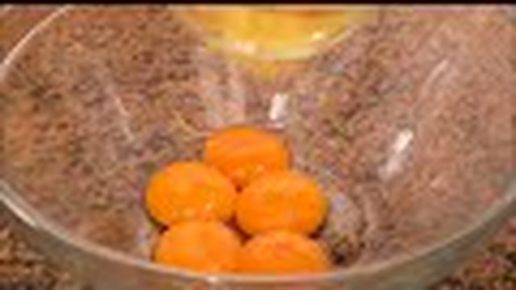

1. **Caramelizado de los Moldes:**
   * En un cazo pequeño, hacer un caramelo rubio con los 80 g de azúcar, 20 ml de agua y zumo de limón hasta tono dorado suave.
   * Distribuir una capa fina en el fondo de las flaneritas individuales. Dejar enfriar hasta que endurezca.
2. **Elaboración del Almíbar en Punto de Hebra Fina (105-108°C):**
   * En otro cazo, colocar los 250 g de azúcar con los 150 ml de agua y el trocito de piel de limón.
   * Llevar a ebullición a fuego medio durante **4 a 5 minutos** hasta que el termómetro marque entre 105°C y 108°C (punto de hebra fina: al tomar una gota entre dos dedos con guantes o con una cuchara, forma un hilo fino que se corta con facilidad).
   * Retirar del fuego y dejar enfriar hasta que esté templado (unos 45-50°C). **Nunca mezclar con las yemas estando hirviendo o las cocinaría al instante**.
3. **Preparación y Doble Colado de las Yemas:**
   * En un bol, colocar las 8 yemas y el huevo entero.
   * Pinchar las yemas con un tenedor o varilla y mezclar con suavidad extrema sin batir, únicamente rompiendo la estructura para no crear espuma.
   * Verter el almíbar tibio en un hilo fino sobre las yemas mientras se remueve despacio con la espátula.
   * Pasar la mezcla dos veces por un colador de tela o tamiz muy fino para retirar impurezas, burbujas y restos de claras.
4. **Cocción al Vapor Hermética:**
   * Llenar los moldes caramelizados con la mezcla colada.
   * Cubrir cada molde con papel de aluminio sellando los bordes con fuerza para evitar que entre ni una sola gota de vapor condensado.
   * Cocinar en vaporera sobre agua hirviendo a fuego suave (o en el horno a 140°C al baño María) durante **30 a 35 minutos**.
   * Comprobar el cuajado presionando suavemente la superficie a través del papel: debe sentirse firme y elástica como una gelatina densa.
5. **Enfriado y Maduración:**
   * Dejar enfriar a temperatura ambiente y refrigerar durante un mínimo de 12 horas.
   * Para desmoldar, pasar una espátula fina por los laterales y volcar sobre el plato de servicio.

---

### 📦 Protocolo de Conservación y Batch Cooking
* **Refrigeración (2°C a 4°C):** Se conserva extraordinariamente bien hasta **7-8 días** gracias a la alta concentración de azúcar del almíbar.
* **Congelación:** ❌ **NO ADMISIBLE.** Pierde su textura vítrea y gelatinosa.

---

### 🔥 Guía de Degustación y Servicio
* **Maridaje Tradicional:** Servir frío cortado en pequeñas porciones junto a una copita de vino Pedro Ximénez o un café solo bien cargado para contrastar su intensa dulzura conventual.

---

## 6. 🍋 Mousse de Limón Cremosa Fácil y Rápida
*Categoría: Postre Frío Aireado / Emulsión Cítrico-Proteica sin Horno*

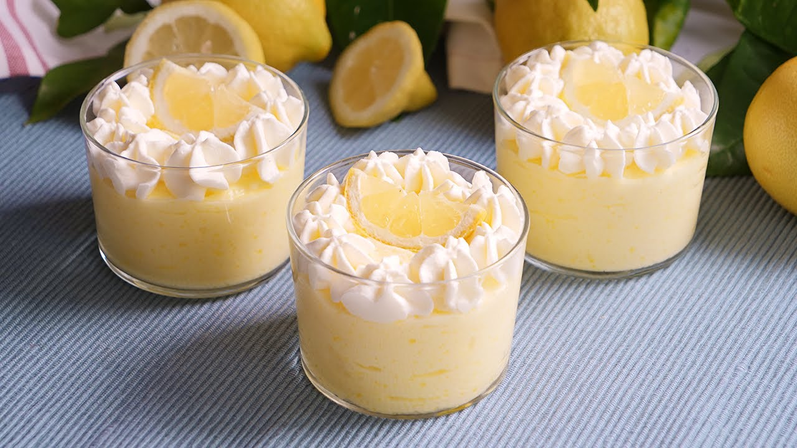

> 📺 **Vídeo Oficial de Elaboración:** [Ver en YouTube: Mousse de Limón fácil y rápida (sin gelatina ni huevo) 🍋💕](https://www.youtube.com/watch?v=rdyVl2b6GCA)


> [!NOTE]
> Esta mousse es uno de los postres estrella más aclamados de Carmen: se prepara en 10 minutos sin necesidad de gelatinas ni cocción. El fundamento químico radica en el ácido cítrico del zumo de limón fresco, que reacciona con las caseínas de la leche condensada espesándola de forma inmediata, mientras que la nata montada bien fría aporta la estructura de microburbujas de aire que genera su textura etérea y esponjosa.

```
                    ┌───────────────────────────────┐
                    │     MOUSSE DE LIMÓN CARMEN    │
                    │   EMULSIÓN Y AIREACIÓN FRÍA   │
                    └───────────────┬───────────────┘
                                    │
           ┌────────────────────────┴────────────────────────┐
           ▼                                                 ▼
┌──────────────────────┐                          ┌──────────────────────┐
│  REACCIÓN ÁCIDA FRÍA │                          │ NATA MONTADA AL 35%  │
│ Leche condensada     │                          │ Nata muy fría a 3°C  │
│ Zumo limón colado    │                          │ Montado firme        │
│ Cuajado instantáneo  │                          │ Microburbujas de aire│
└──────────┬───────────┘                          └──────────┬───────────┘
           │                                                 │
           └────────────────────────┬────────────────────────┘
                                    ▼
                         ┌──────────────────────┐
                         │ MOVIMIENTOS ENVOLVENT│
                         │ Integrar con espátula│
                         │ Copas individuales   │
                         │ 4h frío estabilizador│
                         └──────────────────────┘
```

### 📋 Ficha Resumen
| Parámetro | Valor |
| :--- | :--- |
| **Tiempo de Preparación** | 10 minutos |
| **Tiempo de Cocción** | 0 minutos (sin horno ni fuego) |
| **Tiempo de Enfriado en Frío** | Mínimo 4 horas a 3°C |
| **Dificultad** | Muy Fácil |
| **Raciones** | 6 personas (aprox. 150 g por copa) |
| **Coste Estimado** | Económico (3,20 € total / 0,53 € ración) |

---

### ⚠️ Tabla de Alérgenos (Reglamento UE 1169/2011)

| Alérgeno | Estado | Ingrediente Causante / Medida de Adaptación |
| :--- | :---: | :--- |
| **Lácteos** | 🔴 **PRESENTE** | Nata para montar (35% M.G.) y leche condensada entera. |
| **Gluten** | 🟢 AUSENTE | 100% libre de gluten. |
| **Huevos** | 🟢 AUSENTE | Fórmula de Carmen sin huevo crudo. |
| **Sulfitos / Frutos de Cáscara** | 🟢 AUSENTE | Formulación limpia. |

---

### ⚖️ Ingredientes Exactos

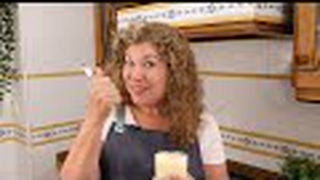

#### Base Cítrica Concentrada
* **370 g (1 lata pequeña)** Leche condensada entera tradicional.
* **150 ml** Zumo de limones frescos recién exprimidos y colados (aprox. 3-4 limones medianos).
* **1 cucharada (5 g)** Ralladura fina de piel de limón (solo parte amarilla).

#### Estructura Aireada
* **400 ml** Nata líquida para montar (mínimo 35% Materia Grasa) muy fría (a 2-4°C).
* **1 cucharadita (4 g)** Ralladura de lima verde para decoración final.
* **6 hojitas** Hierbabuena fresca para el pase.

---

### 🍳 Equipamiento Necesario
* Batidora eléctrica de varillas para montar la nata.
* Bol amplio de acero o cristal (preferiblemente enfriado 15 minutos en el congelador).
* Espátula de silicona (lengua de gato).
* Copas de cristal o vasos anchos de postre.
* Rallador microplane para cítricos.

---

### 👨‍🍳 Paso a Paso Técnico y Minucioso

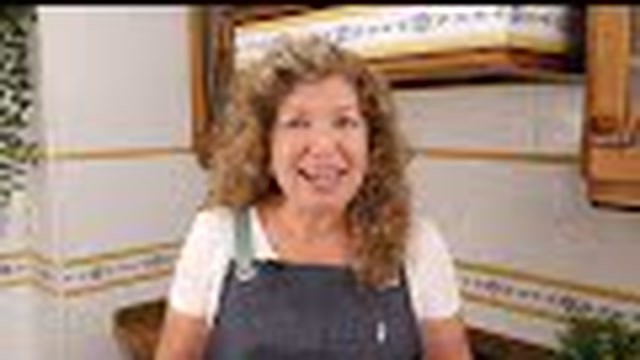

1. **Reacción Cítrico-Láctea:**
   * En un bol mediano, verter los 370 g de leche condensada y la ralladura fina de limón.
   * Añadir los 150 ml de zumo de limón colado poco a poco mientras se remueve con las varillas manuales.
   * En apenas 30 segundos, se apreciará cómo la mezcla espesa intensamente adquiriendo consistencia de crema densa por la coagulación ácida de las proteínas lácteas. Reservar.
2. **Montado Firme de la Nata:**
   * En el bol previamente enfriado, verter los 400 ml de nata líquida muy fría.
   * Con la batidora de varillas eléctricas a velocidad media-alta, batir durante **2 a 3 minutos** hasta lograr picos firmes y consistentes, con cuidado de no sobrebatir para que no se convierta en mantequilla.
3. **Integración Envolvente para Conservar el Aire:**
   * Añadir un tercio de la nata montada a la crema de limón y leche condensada, mezclando con energía para aligerar la densidad de la base.
   * Incorporar el resto de la nata montada en dos tandas, utilizando la espátula de silicona con **movimientos envolventes suaves de abajo hacia arriba**, rotando el bol con la otra mano para no perder las microburbujas de aire.
4. **Dosificado y Estabilización en Frío:**
   * Repartir la mousse en 6 copas individuales o vasos de cristal con la ayuda de una cuchara o manga pastelera.
   * Llevar al frigorífico a 3°C durante un mínimo de **4 horas** (óptimo de un día para otro) para que la mousse adquiera cuerpo esponjoso y una temperatura refrescante.
5. **Presentación:**
   * Decorar con una lluvia de ralladura de lima verde fresca y una hojita de hierbabuena en la coronación de la copa.

---

### 📦 Protocolo de Conservación y Batch Cooking
* **Refrigeración (2°C a 4°C):** Conservar tapada con film transparente hasta **4 días** sin perder volumen ni esponjosidad.
* **Congelación Semi-Freddo:** Puede congelarse en copas tapadas hasta **1 mes**; al sacarla y dejarla templar 15 minutos se disfruta con una textura idéntica a un helado cremoso de limón.

---

### 🔥 Guía de Degustación y Servicio
* **Momento Ideal:** Excelente digestivo tras comidas copiosas de guisos o carnes, gracias al frescor cítrico del limón y la suavidad láctea.

---

## 7. 🍓 Panna Cotta Tradicional de Vainilla con Coulis de Frutos Rojos
*Categoría: Postre Lácteo Gelificado / Textura Temblorosa Italiana*

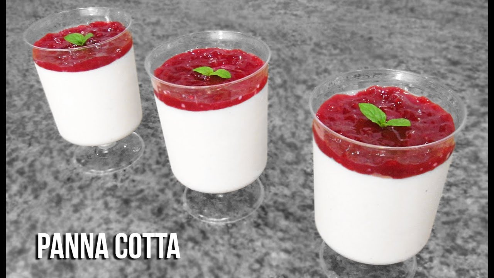

> 📺 **Vídeo Oficial de Elaboración:** [Ver en YouTube: Panacota (Panna Cotta)](https://www.youtube.com/watch?v=LkYUvAFD-2s)


> [!NOTE]
> La auténtica Panna Cotta (*nata cocida*) debe tener la gelificación mínima indispensable para sostenerse en pie con su célebre temblor ("wobble") al mover el plato, fundiéndose al instante en el paladar. Carmen utiliza nata de alta calidad al 35% M.G., vaina de vainilla natural y hojas de gelatina hidratadas en agua helada integradas fuera del fuego para no degradar su poder gelificante.

```
                    ┌───────────────────────────────┐
                    │      PANNA COTTA CARMEN       │
                    │   GELIFICACIÓN MÍNIMA SEDOSA  │
                    └───────────────┬───────────────┘
                                    │
           ┌────────────────────────┴────────────────────────┐
           ▼                                                 ▼
┌──────────────────────┐                          ┌──────────────────────┐
│  INFUSIÓN DE VAINILLA│                          │  GELATINA HIDRATADA  │
│ Nata 35% + leche     │                          │ 3 hojas (6 g) en frío│
│ Vaina Bourbon raspada│                          │ Disolver a 60°C      │
│ Hervor suave         │                          │ Sin hervir gelatina  │
└──────────┬───────────┘                          └──────────┬───────────┘
           │                                                 │
           └────────────────────────┬────────────────────────┘
                                    ▼
                         ┌──────────────────────┐
                         │ COULIS CASERO FRUTOS │
                         │ Frambuesas y moras   │
                         │ Reducción 8 min      │
                         │ Colado de pepitas    │
                         └──────────────────────┘
```

### 📋 Ficha Resumen
| Parámetro | Valor |
| :--- | :--- |
| **Tiempo de Preparación** | 15 minutos |
| **Tiempo de Cocción** | 10 minutos |
| **Tiempo de Gelificación en Frío** | Mínimo 5 horas a 3°C |
| **Dificultad** | Baja |
| **Raciones** | 6 personas (aprox. 150 g por ración) |
| **Coste Estimado** | Medio (3,80 € total / 0,63 € ración) |

---

### ⚠️ Tabla de Alérgenos (Reglamento UE 1169/2011)

| Alérgeno | Estado | Ingrediente Causante / Medida de Adaptación |
| :--- | :---: | :--- |
| **Lácteos** | 🔴 **PRESENTE** | Nata líquida y leche entera. *Adaptación: nata vegetal de coco y bebida de almendras.* |
| **Gluten** | 🟢 AUSENTE | 100% libre de gluten. |
| **Huevos** | 🟢 AUSENTE | No contiene huevo. |
| **Sulfitos / Frutos de Cáscara** | 🟢 AUSENTE | Formulación limpia. |

---

### ⚖️ Ingredientes Exactos

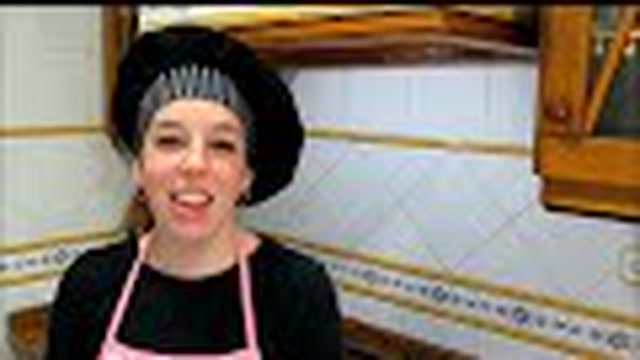

#### Base de Panna Cotta
* **450 ml** Nata líquida para montar (mínimo 35% M.G.).
* **150 ml** Leche entera fresca pasteurizada.
* **75 g** Azúcar blanquilla.
* **1 unidad** Vaina de vainilla Bourbon de calidad (abierta y raspada).
* **6 g (3 hojas)** Gelatina neutra en hojas (cola de pescado).
* **300 ml** Agua muy fría con cubitos de hielo (para hidratar la gelatina).

#### Coulis Artesano de Frutos Rojos
* **250 g** Frutos rojos variados frescos o congelados (frambuesas, arándanos, moras y fresas).
* **50 g** Azúcar blanquilla.
* **15 ml (1 cucharada)** Zumo de limón recién exprimido.
* **20 ml** Agua mineral.

---

### 🍳 Equipamiento Necesario
* 6 moldes individuales de flanera o vasitos de cristal transparente.
* Cazo de acero inoxidable.
* Bol pequeño con agua helada.
* Colador chino fino para colar el coulis de frutos rojos.

---

### 👨‍🍳 Paso a Paso Técnico y Minucioso

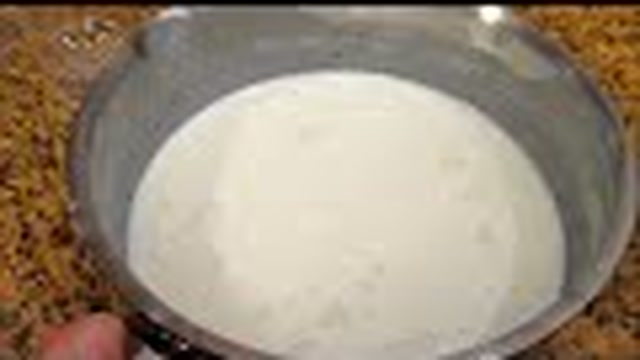

1. **Hidratación de la Gelatina:**
   * Sumergir las 3 hojas de gelatina neutra en el bol con agua muy fría durante **6 a 8 minutos** para que se hidraten y queden completamente flexibles.
2. **Infusión y Disolución Láctea:**
   * En el cazo, colocar los 450 ml de nata, los 150 ml de leche, los 75 g de azúcar y las semillas junto con la vaina de vainilla abierta.
   * Llevar a fuego medio hasta que comience a hervir suavemente. Apagar el fuego de inmediato y retirar la vaina de vainilla.
   * Escurrir las hojas de gelatina hidratadas con las manos y agregarlas a la mezcla caliente. Remover con varillas durante 1 minuto hasta que se disuelvan por completo sin dejar rastro.
3. **Llenado y Gelificación:**
   * Verter la mezcla en moldes ligeramente engrasados con una gota de aceite neutro (si se van a desmoldar) o directamente en vasitos de cristal individuales.
   * Dejar templar a temperatura ambiente durante 30 minutos y trasladar al refrigerador a 3°C durante al menos **5 horas**.
4. **Elaboración del Coulis Casero:**
   * En un cazo pequeño, verter los 250 g de frutos rojos, los 50 g de azúcar, el zumo de limón y los 20 ml de agua.
   * Cocinar a fuego medio durante **8 a 10 minutos**, machacando la fruta con un tenedor para que libere todos sus jugos.
   * Pasar por el colador chino presionando con la maza para retirar todas las pepitas y obtener una salsa roja brillante y sedosa. Dejar enfriar en nevera.
5. **Servicio y Pase:**
   * Bañar la superficie de cada panna cotta con dos cucharadas generosas de coulis frío antes de servir, decorando opcionalmente con un fruto rojo fresco entero.

---

### 📦 Protocolo de Conservación y Batch Cooking
* **Refrigeración (2°C a 4°C):** Conservar tapada con film hasta **5 días** en nevera.
* **Congelación:** ❌ **NO RECOMENDADA.** Al descongelar, la gelatina neutra sufre sinéresis y la textura se vuelve acuosa.

---

### 🔥 Guía de Degustación y Servicio
* **Textura Clave:** Al clavar la cuchara, debe ceder sin oponer resistencia gomosa, deshaciéndose en la lengua con un tacto untuoso y un balance perfecto entre la vainilla láctea y la acidez del coulis.

---

## 8. ✨ Arroz con Leche Caramelizado al Estilo Asturiano
*Categoría: Cuchara de Alta Tradición / Cocción Lenta Reducida y Costra Crujiente*

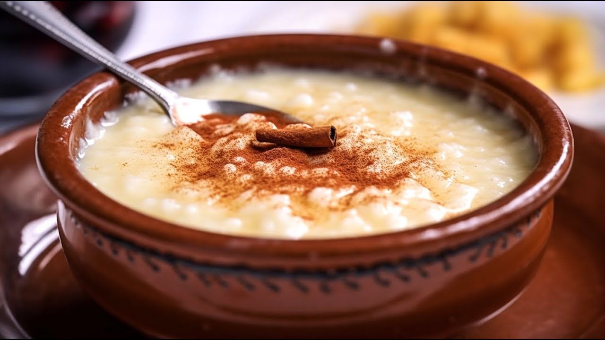

> 📺 **Vídeo Oficial de Elaboración:** [Ver en YouTube: Arroz con Leche al estilo portugués muy Fácil y Cremoso - Arroz Doce](https://www.youtube.com/watch?v=pbXen8GpPsc)


> [!NOTE]
> El arroz con leche asturiano es una de las joyas indiscutibles de la gastronomía del norte. A diferencia de otras versiones, exige una proporción altísima de leche fresca (casi 10 a 1 respecto al arroz), una cocción extremadamente lenta de entre 90 y 120 minutos donde el grano casi se funde en una crema densa, la adición generosa de mantequilla artesana y una gruesa costra de azúcar caramelizada con pala de hierro candente o soplete justo antes de disfrutarlo.

```
                    ┌───────────────────────────────┐
                    │     ARROZ ASTURIANO CARMEN    │
                    │   REDUCCIÓN ULTRA LENTA (2H)  │
                    └───────────────┬───────────────┘
                                    │
           ┌────────────────────────┴────────────────────────┐
           ▼                                                 ▼
┌──────────────────────┐                          ┌──────────────────────┐
│  ALTA RATIO LÁCTEA   │                          │ 90-110 MIN A FUEGO 1 │
│ 1.500 ml leche entera│                          │ Remover sin descanso │
│ 130 g arroz redondo  │                          │ Grano hiperblando    │
│ Infusión canela-piel │                          │ Crema de almidón puro│
└──────────┬───────────┘                          └──────────┬───────────┘
           │                                                 │
           └────────────────────────┬────────────────────────┘
                                    ▼
                         ┌──────────────────────┐
                         │ MANTECA + QUEMADO TOP│
                         │ Mantequilla al final │
                         │ Enfriado 12h en frío │
                         │ Azúcar y soplete top │
                         └──────────────────────┘
```

### 📋 Ficha Resumen
| Parámetro | Valor |
| :--- | :--- |
| **Tiempo de Preparación** | 10 minutos |
| **Tiempo de Cocción** | 1 hora y 45 minutos (105 minutos) |
| **Tiempo de Reposo en Frío** | 12 horas a 3°C |
| **Dificultad** | Media (exige paciencia y atención continua) |
| **Raciones** | 6-8 personas (rinde aprox. 1.200 g de crema densa) |
| **Coste Estimado** | Económico (3,10 € total / 0,45 € ración) |

---

### ⚠️ Tabla de Alérgenos (Reglamento UE 1169/2011)

| Alérgeno | Estado | Ingrediente Causante / Medida de Adaptación |
| :--- | :---: | :--- |
| **Lácteos** | 🔴 **PRESENTE** | Leche entera de vaca y mantequilla de calidad. |
| **Gluten** | 🟢 AUSENTE | Cereal naturalmente libre de gluten. |
| **Huevos** | 🟢 AUSENTE | Receta tradicional sin huevo. |
| **Sulfitos / Soja / Frutos de Cáscara** | 🟢 AUSENTE | Formulación tradicional limpia. |

---

### ⚖️ Ingredientes Exactos

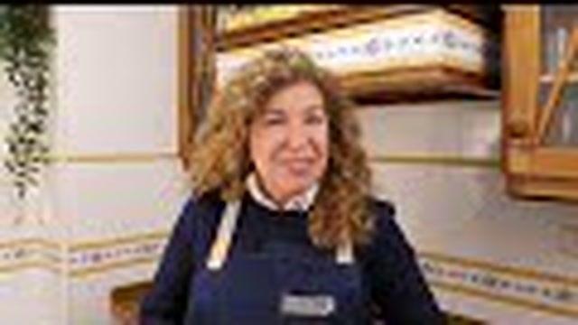

#### Cocción e Infusión
* **1.500 ml** Leche entera fresca pasteurizada (3,6% M.G.).
* **130 g** Arroz redondo tradicional (variedad Senia o Bahía).
* **150 ml** Agua mineral con 1 g de sal marina.
* **1 unidad** Corteza de limón (sin albedo blanco).
* **1 rama (5 g)** Canela en rama de Ceylán.
* **20 ml** Licor de anís dulce tradicional o chorrito de orujo blanco (toque secreto asturiano).

#### Acabado Mantecoso y Costra
* **170 g** Azúcar blanquilla para la cocción final.
* **50 g** Mantequilla asturiana con sal o sin sal (82% M.G.) a dados.
* **60 g** Azúcar blanquilla extra para quemar (10 g por cuenco).

---

### 🍳 Equipamiento Necesario
* Cazuela ancha de hierro colado esmaltado o triple fondo de acero (Ø 26-28 cm).
* Cuchara de madera resistente o espátula de silicona.
* Soplete pastelero potente o plancha de hierro fundido para requemar.
* Cazuelas individuales de barro vidriado.

---

### 👨‍🍳 Paso a Paso Técnico y Minucioso

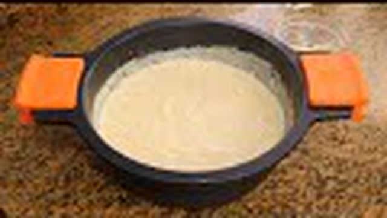

1. **Apertura de Grano en Agua:**
   * En la cazuela amplia, poner los 150 ml de agua mineral con el gramo de sal a hervir.
   * Añadir los 130 g de arroz y remover a fuego vivo durante 2 minutos hasta que el agua se evapore y el grano se abra.
2. **Adición Progresiva de Leche Infusionada:**
   * En paralelo, calentar la leche entera con la piel de limón y la canela.
   * Verter la leche caliente sobre el arroz en la cazuela a través de un colador.
   * Llevar a ebullición suave y reducir inmediatamente al mínimo nivel posible de fuego (simmering muy lento).
3. **Cocción Extrema y Removido Asturiano (90 Minutos):**
   * Cocinar a fuego mínimo durante **90 minutos**, removiendo cada 2-3 minutos con movimientos envolventes y continuos en forma de "8".
   * El arroz absorberá lentamente la leche mientras el grano se desmorona de forma parcial, creando una crema sumamente densa, amarilla y aterciopelada.
   * A los 80 minutos de cocción, incorporar el chorrito de anís dulce.
4. **Incorporación de Mantequilla y Azúcar:**
   * Pasados los 90 minutos y con el grano hiperblando, agregar los 170 g de azúcar y los 50 g de mantequilla a dados.
   * Cocinar durante **10 a 15 minutos más** sin parar de remover. El azúcar licuará la mezcla unos minutos para luego ligar en un néctar brillante y denso.
5. **Enfriado y Maduración:**
   * Verter en las cazuelas individuales de barro.
   * Dejar enfriar a temperatura ambiente y reposar en refrigeración (3°C) durante un mínimo de 12 horas.
6. **Caramelizado Crujiente de Servicio:**
   * Sacar las cazuelas de la nevera.
   * Cubrir toda la superficie con una capa generosa de azúcar blanquilla (10 g por cuenco).
   * Quemar con soplete o con la pala de hierro al rojo vivo hasta formar una costra tostada, crujiente y de color ámbar oscuro.
   * Servir de inmediato para disfrutar del contraste brutal entre el caramelo caliente crujiente y el arroz frío y untuoso.

---

### 📦 Protocolo de Conservación y Batch Cooking
* **Refrigeración (2°C a 4°C):** Conservar tapado sin quemar hasta **5 días**.
* **Congelación:** ❌ **NO ADMISIBLE.** Destruye la textura cremosa del almidón.

---

### 🔥 Guía de Degustación y Servicio
* **Maridaje:** Acompañar con un culín de sidra dulce o un café solo bien tostado.

---

## 9. 📊 Tabla Comparativa Maestra: Rendimientos, Costes y Tiempos

| Receta | Raciones | Peso/Ración | Tiempo Cocción | Tiempo Frío | Coste Total | Coste/Ración | Alérgenos Principales | Vida Útil (2-4°C) | Congelable |
| :--- | :---: | :---: | :---: | :---: | :---: | :---: | :--- | :---: | :---: |
| **1. Arroz con Leche Abuela** | 6 | 220 g | 50 min | 4 horas | 2,40 € | 0,40 € | Lácteos | 5 días | ❌ No |
| **2. Flan de Huevo Tradicional** | 8 | 140 g | 55 min | 12 horas | 2,80 € | 0,35 € | Huevos, Lácteos | 6 días | ❌ No |
| **3. Natillas Caseras con Galleta** | 6 | 160 g | 12 min | 3 horas | 2,20 € | 0,36 € | Huevos, Lácteos, Gluten | 4 días | ❌ No |
| **4. Crema Catalana Crujiente** | 5 | 150 g | 12 min | 4 horas | 2,10 € | 0,42 € | Huevos, Lácteos | 4 días | ❌ No |
| **5. Tocino de Cielo de Jerez** | 6 | 90 g | 35 min | 12 horas | 2,70 € | 0,45 € | Huevos | 8 días | ❌ No |
| **6. Mousse de Limón Cremosa** | 6 | 150 g | 0 min | 4 horas | 3,20 € | 0,53 € | Lácteos | 4 días |  Sí (semifreddo) |
| **7. Panna Cotta con Coulis** | 6 | 150 g | 10 min | 5 horas | 3,80 € | 0,63 € | Lácteos | 5 días | ❌ No |
| **8. Arroz con Leche Asturiano** | 8 | 180 g | 105 min | 12 horas | 3,10 € | 0,39 € | Lácteos | 5 días | ❌ No |

---

## 10. 🛠️ Guía Rápida de Adaptación para Intolerancias y Dietas Especiales

```
┌────────────────────────────────────────────────────────────────────────────────────────────────┐
│                           MATRIZ DE SUSTITUCIONES TÉCNICAS REPOSTERAS                          │
├────────────────────┬───────────────────────────────┬───────────────────────────────────────────┤
│ CONDICIÓN / DIETA  │ INGREDIENTE A REEMPLAZAR      │ SUSTITUTO PROFESIONAL IDÓNEO              │
├────────────────────┼───────────────────────────────┼───────────────────────────────────────────┤
│ **Celíacos**       │ Galleta María tradicional     │ Galleta María certificada Sin Gluten      │
│ (Sin Gluten)       │ Harinas con trazas            │ Almidón de maíz puro (Maizena certificada)│
├────────────────────┼───────────────────────────────┼───────────────────────────────────────────┤
│ **Intolerancia a** │ Leche entera de vaca          │ Bebida vegetal de avena barista o almendra│
│ **la Lactosa**     │ Nata líquida 35% M.G.         │ Nata vegetal para montar / Crema de coco  │
│                    │ Mantequilla tradicional       │ Margarina 100% vegetal sin suero lácteo   │
│                    │ Leche condensada              │ Leche condensada de coco o avena          │
├────────────────────┼───────────────────────────────┼───────────────────────────────────────────┤
│ **Alergia al**     │ Huevos enteros en flan        │ Bebida de soja + agar-agar o Maizena      │
│ **Huevo**          │ Yemas en natillas             │ Maizena + cúrcuma (color) + bebida avena  │
├────────────────────┼───────────────────────────────┼───────────────────────────────────────────┤
│ **Veganos**        │ Gelatina neutra animal        │ Agar-agar en polvo (2 g por cada 6 g hoja)│
│ (100% Vegetal)     │ Todos los lácteos y huevos    │ Ver adaptaciones de lactosa y huevo arriba│
└────────────────────┴───────────────────────────────┴───────────────────────────────────────────┘
```

---

## 11. 📜 Decálogo de Oro del Chef Pastelero de Carmen

1. **Nunca descuides el albedo cítrico:** Al pelar limones y naranjas para infusionar, utiliza un pelador afilado y retira cualquier resto blanco. El albedo contiene limonina y naringina, compuestos amargos que arruinarían la sutileza de la leche.
2. **La leche siempre entera y fresca:** Los postres de cuchara tradicionales dependen de los glóbulos grasos (3,6% M.G.) para vehicular los aromas y crear una emulsión sedosa. Las leches desnatadas o aguadas dan resultados planos y sin cuerpo.
3. **Control estricto de la temperatura de coagulación:** En cremas y natillas, nunca permitas que la mezcla supere los 84°C. A partir de 85°C, las proteínas del huevo sufren sinéresis y la crema se corta.
4. **Baño María con paño amortiguador:** Para flanes y tocinos de cielo, coloca siempre un trapo de cocina bajo los moldes. Evita el contacto directo con la bandeja metálica caliente e impide que el agua hierva a borbotones, garantizando una textura sin agujeros.
5. **No batas con exceso de aire las masas de flan:** Para lograr un corte liso como el cristal, mezcla las yemas y el azúcar con movimientos suaves y circulares. El exceso de aire genera espuma que se convierte en porosidades ("ojos") al hornear.
6. **El azúcar se añade al final en los arroces:** Incorporar el azúcar al principio de la cocción del arroz con leche endurece el grano y multiplica el riesgo de que se pegue al fondo de la cazuela.
7. **El colado de malla fina es obligatorio:** Pasa siempre las mezclas de flanes, natillas y tocinos de cielo por un colador fino antes de cocinarlos para eliminar chalazas y restos de clara densa.
8. **La nata se monta a temperatura de nevera:** Para la mousse y la panna cotta, la nata debe estar entre 2°C y 4°C y el bol preferiblemente frío para que los glóbulos grasos atrapen y estabilicen el aire sin fundirse.
9. **El quemado del azúcar se realiza al momento:** La costra crujiente de la crema catalana o el arroz asturiano debe quemarse justo antes de servir. Si se deja reposar o se refrigera, la higroscopicidad del azúcar absorberá la humedad y perderá el "clac".
10. **El reposo en frío es el ingrediente invisible:** Todo postre de cuchara necesita un mínimo de 4 a 12 horas de refrigeración para asentar sus geles, licuar el caramelo y madurar sus aromas. La prisa es el peor enemigo de la repostería tradicional.
