# 🍰 Master de Repostería y Dulces Tradicionales: Bizcochos, Tartas y Frutas de Sartén
> **Inspirado en la filosofía y técnica de *Cocina con Carmen***  
> *Recetario Técnico, Gramajes Exactos, Alérgenos UE, Conservación y Regeneración*

---

## 📖 Prólogo Culinario: Los Secretos de la Repostería Tradicional de Carmen

La repostería casera tradicional de **Cocina con Carmen** representa la sabiduría de generaciones donde la precisión de los pesajes, el batido aireado y el control térmico del horno y la sartén garantizan postres tiernos, esponjosos y reconfortantes:

1. **La Emulsión Inicial de Huevos y Azúcar:** Batir enérgicamente hasta blanquear y triplicar volumen para incorporar microburbujas de aire que darán esponjosidad sin depender exclusivamente del impulsor químico.
2. **El Tamizado y Movimientos Envolventes:** Tamizar siempre la harina con el impulsor para evitar grumos e integrar con espátula con movimientos suaves para no desarrollar la red de gluten en bizcochos.
3. **El Control Térmico en Frituras Dulces:** Mantener el AOVE a 170-175°C en torrijas, leche frita, pestiños y buñuelos para lograr un dorado exterior crujiente sin quemar ni empapar de grasa el interior.
4. **La Infusión Láctea Cítrica y Aromática:** Infusionar la leche a 80°C con cáscara de limón, naranja (sin albedo blanco) y canela en rama de Ceilán, dejando reposar tapado para máxima extracción de terpenos.
5. **El Enfriamiento Lento y Reposo de Masas:** Enfriar bizcochos y tartas sobre rejilla metálica para evitar condensación inferior por vapor atrapado.

---

## 🎂 1. Bizcocho de Yogur Esponjoso 1, 2, 3 Tradicional
*Categoría: Bizcochos Clásicos / El Rey de las Meriendas Familiares*

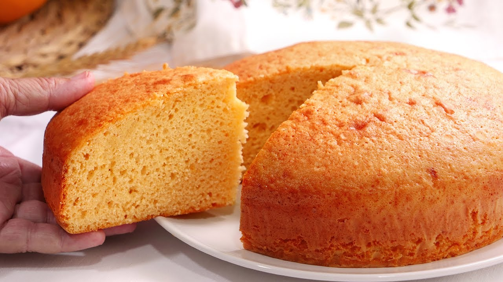

> 📺 **Vídeo Oficial de Elaboración:** [Ver en YouTube: Bizcocho 1234 muy Fácil, Esponjoso y Económico (sin usar báscula)](https://www.youtube.com/watch?v=uNn0P1hKr9I)

### 📋 Ficha Resumen
| Parámetro | Valor |
| :--- | :--- |
| **Tiempo de Preparación** | 15 minutos |
| **Tiempo de Horneado** | 35-40 minutos |
| **Dificultad** | Muy Fácil |
| **Raciones** | 8-10 raciones (molde corona/redondo 22 cm) |
| **Coste Estimado** | Muy Económico (2,20 € total / 0,22 € ración) |

### ⚠️ Tabla de Alérgenos (Reglamento UE 1169/2011)
| Alérgeno | Estado | Ingrediente Causante / Medida de Adaptación |
| :--- | :---: | :--- |
| **Gluten** | 🔴 **PRESENTE** | Harina de trigo común. *Sustituir por mix comercial sin gluten o 70% harina de arroz + 30% maicena.* |
| **Huevos** | 🔴 **PRESENTE** | 3 huevos camperos clase L. |
| **Lácteos** | 🔴 **PRESENTE** | 1 yogur natural entero (125 g). *Sustituir por yogur de soja o vegetal.* |
| **Frutos de Cáscara / Soja** | 🟢 AUSENTE | Formulación limpia. |

### ⚖️ Ingredientes Exactos

* **1 unidad (125 g)** Yogur natural entero sin azúcar (el vasito sirve de medida métrica).
* **3 unidades (180 g)** Huevos camperos frescos clase L a temperatura ambiente.
* **240 g (2 vasitos)** Azúcar blanco común.
* **100 ml (1 vasito)** Aceite de girasol alto oleico o AOVE suave (Arbequina).
* **360 g (3 vasitos)** Harina de trigo de repostería (tipo W100 sin polvo leudante).
* **16 g (1 sobre)** Impulsor químico / levadura química tipo Royal.
* **1 cucharadita (5 ml)** Extracto natural de vainilla o ralladura fina de 1 limón ecológico.
* **1 g (pizca)** Sal marina fina.
* **10 g** Mantequilla y harina extra para encamisar el molde.

### 👨‍🍳 Paso a Paso Técnico

1. **Preparación y Precalentamiento:** Precalentar el horno a 180°C con calor arriba y abajo (sin ventilador). Enmantequillar y enharinar un molde de 22 cm sacudiendo el exceso.
2. **Blanqueado Aireado:** En un bol amplio, batir los 3 huevos con los 240 g de azúcar y la pizca de sal con varillas eléctricas durante 5 minutos hasta que la mezcla duplique su volumen, blanquee y forme relieve.
3. **Integración de Líquidos:** Añadir el yogur natural, el aceite y la ralladura de limón. Batir a velocidad baja durante 45 segundos hasta integrar.
4. **Tamizado e Integración Suave:** Tamizar la harina junto con el impulsor químico sobre el bol. Integrar con espátula de silicona mediante movimientos envolventes de abajo hacia arriba solo hasta que no queden rastros de harina seca.
5. **Horneado Perfecto:** Verter la masa en el molde. Hornear a 180°C en la rejilla central durante 35-40 minutos. No abrir la puerta antes del minuto 30. Comprobar la cocción pinchando con brocheta en el centro (debe salir limpia y seca).
6. **Desmoldado:** Dejar templar 10 minutos dentro del molde, desmoldar sobre rejilla metálica y enfriar por completo.

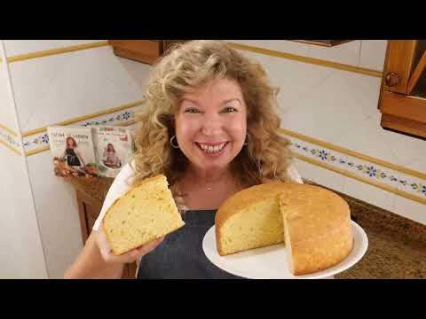

### 📦 Conservación y Batch Cooking
* **Temperatura Ambiente:** Guardar tapado con campana de cristal o en bolsa zip hermética durante **5 días** tierno y jugoso.
* **Congelación:** Cortar en porciones individuales, envolver en film y congelar a -18°C hasta **3 meses**. Descongelar 30 min a temperatura ambiente o 20s en microondas.

---

## 👵 2. Tarta de la Abuela Tradicional de Galletas, Crema y Chocolate
*Categoría: Tartas Clásicas Sin Horno / Cumpleaños Tradicional*

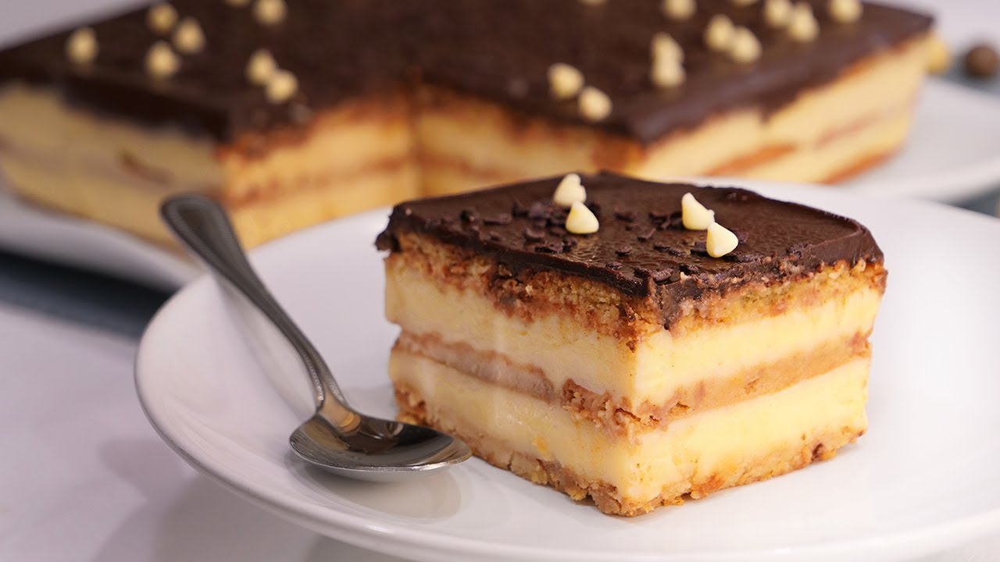

> 📺 **Vídeo Oficial de Elaboración:** [Ver en YouTube: Tarta de Galletas, Crema y Chocolate (Sin Horno) | Tarta de la Abuela](https://www.youtube.com/watch?v=8KcDJi_nOkY)

### 📋 Ficha Resumen
| Parámetro | Valor |
| :--- | :--- |
| **Tiempo de Preparación** | 40 minutos |
| **Tiempo de Reposo en Frío** | 4 horas mínimo (óptimo 12h) |
| **Dificultad** | Fácil |
| **Raciones** | 10-12 raciones (molde rectangular 20x30 cm) |
| **Coste Estimado** | Económico (4,80 € total / 0,40 € ración) |

### ⚠️ Tabla de Alérgenos (Reglamento UE 1169/2011)
| Alérgeno | Estado | Ingrediente Causante / Medida de Adaptación |
| :--- | :---: | :--- |
| **Gluten** | 🔴 **PRESENTE** | Galletas María hojaldradas. *Usar galletas María certificadas Sin Gluten.* |
| **Lácteos** | 🔴 **PRESENTE** | Leche entera, mantequilla y nata. *Usar bebidas y natas vegetales.* |
| **Huevos** | 🔴 **PRESENTE** | Yemas de huevo de la crema pastelera. |
| **Soja** | ⚠️ *Trazas* | Posible lecitina de soja en el chocolate de cobertura. |

### ⚖️ Ingredientes Exactos

* **300 g (2 paquetes)** Galletas María hojaldradas o tostadas clásicas.
* **250 ml** Leche entera templada con 1 cucharada de cacao en polvo y un chorrito de anís dulce (para remojar).

#### Crema Pastelera Sedosa de Carmen
* **750 ml** Leche entera pasteurizada.
* **4 unidades (80 g)** Yemas de huevo campero L.
* **120 g** Azúcar blanco.
* **55 g** Almidón de maíz (Maicena).
* **1 rama** Canela de Ceilán y la piel de 1 limón sin albedo.
* **25 g** Mantequilla fría sin sal.

#### Cobertura de Ganache de Chocolate Espejo
* **200 g** Chocolate negro fondant para postres (55-70% cacao).
* **200 ml** Nata líquida para montar (35% M.G.).
* **40 g** Mantequilla sin sal a temperatura ambiente (para brillo espejo).

### 👨‍🍳 Paso a Paso Técnico

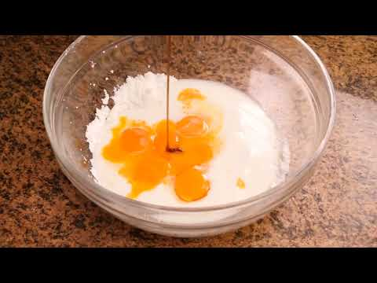
1. **Crema Pastelera Infusionada:** Infusionar 600 ml de leche con la canela y piel de limón a 80°C. En un bol, batir las 4 yemas con el azúcar, la maicena y los 150 ml de leche fría restante. Colar la leche caliente sobre el bol batiendo continuamente, devolver al cazo a fuego medio-bajo y espesar removiendo sin parar con varillas hasta que hierva suave 1 min. Retirar del fuego, añadir los 25 g de mantequilla y tapar con film a piel.
2. **Ganache Brillante:** Calentar la nata hasta ebullición. Verter sobre el chocolate troceado en un bol. Dejar reposar 2 min y batir desde el centro hasta emulsionar. Incorporar los 40 g de mantequilla en pomada.
3. **Montaje por Capas:** En la base del molde rectangular, colocar una capa de galletas remojadas brevemente (1 segundo por lado en la leche con anís). Verter la mitad de la crema pastelera caliente. Colocar otra capa de galletas remojadas, verter el resto de la crema, cubrir con una tercera capa de galletas.
4. **Cobertura y Reposo:** Verter la ganache de chocolate sobre la última capa de galletas, alisando con espátula. Refrigerar a 3-4°C un mínimo de 6 horas (óptimo de un día para otro).

---

## 🧀 3. Tarta de Queso Tradicional al Horno de la Abuela
*Categoría: Tartas al Horno / Corazón Cremoso y Superficie Dorada*

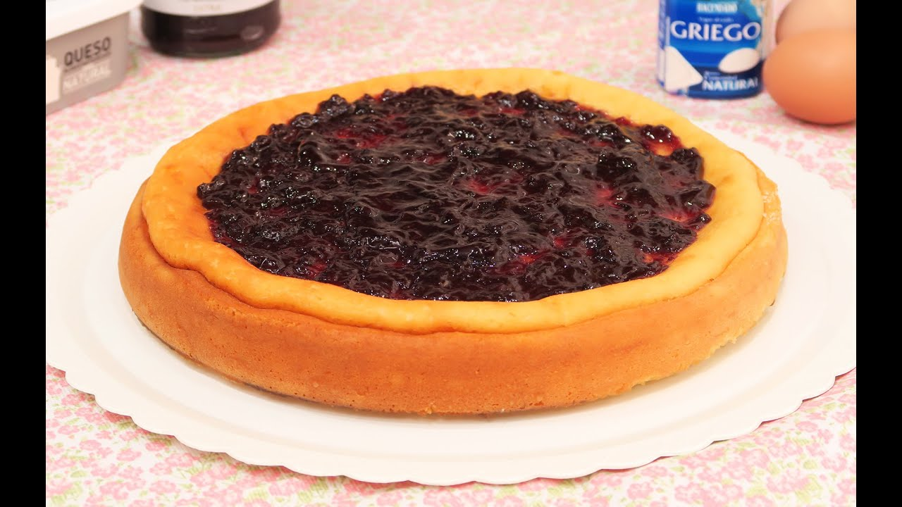

> 📺 **Vídeo Oficial de Elaboración:** [Ver en YouTube: Tarta de Queso Philadelphia al Horno](https://www.youtube.com/watch?v=39ixe_DxP_g)

### 📋 Ficha Resumen
| Parámetro | Valor |
| :--- | :--- |
| **Tiempo de Preparación** | 15 minutos |
| **Tiempo de Horneado** | 45-50 minutos a 190°C |
| **Dificultad** | Muy Fácil |
| **Raciones** | 8 raciones (molde 22 cm) |
| **Coste Estimado** | Medio (5,50 € total / 0,68 € ración) |

### ⚖️ Ingredientes Exactos

* **600 g** Queso crema tipo Philadelphia (entero, no light).
* **4 unidades (240 g)** Huevos camperos clase L.
* **350 ml** Nata líquida para montar (35% M.G.).
* **180 g** Azúcar blanco común.
* **18 g (1 cucharada sopera colmada)** Harina de trigo o maicena (para celíacos).
* **1 cucharadita** Extracto de vainilla y una pizca de sal.

### 👨‍🍳 Paso a Paso Técnico

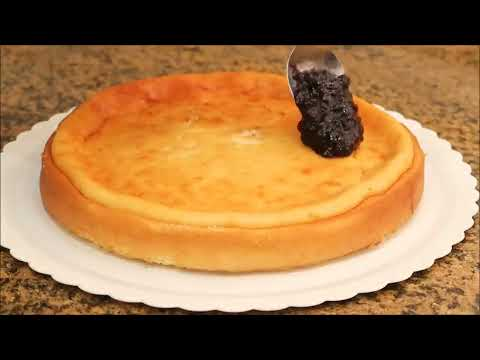
1. **Forrado del Molde:** Arrugar una hoja de papel de horno bajo el grifo, escurrir bien y forrar el molde desmontable de 22 cm dejando que sobresalga por los bordes.
2. **Batido Suave:** En un bol grande, mezclar el queso crema con el azúcar con varillas manuales hasta suavizar. Añadir los huevos uno a uno, integrando con suavidad sin meter exceso de aire.
3. **Integración:** Verter la nata, la vainilla, la pizca de sal y la cucharada de harina tamizada. Mezclar hasta obtener una crema líquida homogénea.
4. **Horneado:** Verter en el molde y hornear a 190°C (horno precalentado, calor arriba y abajo) durante 45 minutos. El centro debe quedar tembloroso tipo flan (*wobble* característico).
5. **Reposo:** Apagar el horno y dejar reposar dentro con la puerta entreabierta 15 minutos. Enfriar a temperatura ambiente y reposar en nevera mínimo 4 horas antes de cortar.

---

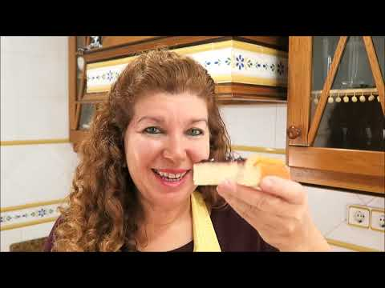

## 🥖 4. Torrijas Tradicionales de Leche y Miel de Carmen
*Categoría: Dulces de Sartén / Semana Santa y Fiestas Tradicionales*

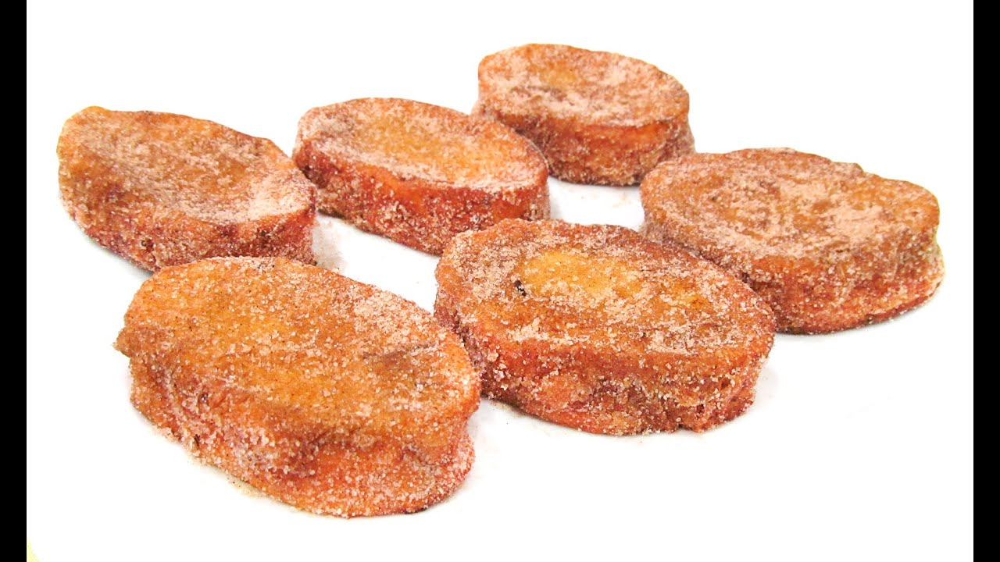

> 📺 **Vídeo Oficial de Elaboración:** [Ver en YouTube: Torrijas de Leche caseras](https://www.youtube.com/watch?v=p8U3EkCM5dg)

### 📋 Ficha Resumen
| Parámetro | Valor |
| :--- | :--- |
| **Tiempo de Preparación** | 20 minutos |
| **Tiempo de Fritura** | 20 minutos |
| **Dificultad** | Fácil |
| **Raciones** | 12-14 torrijas grandes |
| **Coste Estimado** | Muy Económico (3,20 € total / 0,24 € unidad) |

### ⚖️ Ingredientes Exactos

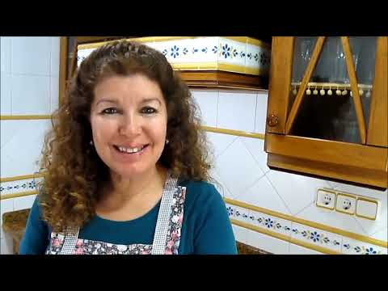
* **1 barra (400 g)** Pan especial de torrijas o pan de hogaza con miga densa del día anterior (rebanadas de 2 cm).
* **1.000 ml** Leche entera pasteurizada.
* **120 g** Azúcar blanco.
* **1 rama** Canela en rama y piel de 1 limón y 1 naranja.
* **3 unidades** Huevos camperos batidos para rebozar.
* **300 ml** AOVE suave para freír.
* **150 g** Miel de flores disuelta en 40 ml de agua tibia (o mezcla de 100g azúcar + 1 cucharada canela molida).

### 👨‍🍳 Paso a Paso Técnico

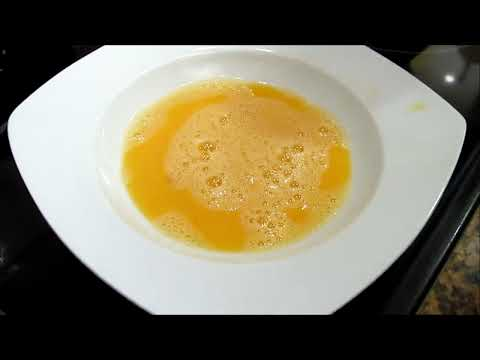
1. **Infusión Láctea:** Hervir la leche con el azúcar, la canela y las pieles cítricas. Apagar, tapar y dejar templar 15 minutos para que la miga absorba sin romperse.
2. **Remojo Paciente:** Colocar las rebanadas de pan en una fuente honda. Verter la leche infusionada colada tibia sobre el pan. Dejar reposar 8-10 minutos hasta que estén completamente empapadas como esponjas sin deshacerse.
3. **Rebozado y Fritura:** Pasar con cuidado cada rebanada por huevo batido. Freír en AOVE caliente a 175°C en tandas de 2 o 3 unidades durante 1,5 minutos por lado hasta que adquieran un tono dorado avellanado brillante.
4. **Escurrido y Enmelado:** Escurrir sobre papel absorbente 30 segundos y pasar inmediatamente por la miel rebajada tibia (o rebozar en la mezcla de azúcar y canela molida).

---

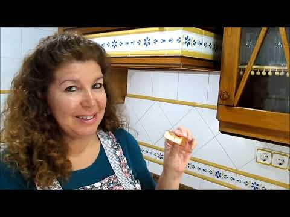

## 🥛 5. Leche Frita Cremosa Tradicional
*Categoría: Dulces de Sartén / Clásico Inolvidable de la Abuela*

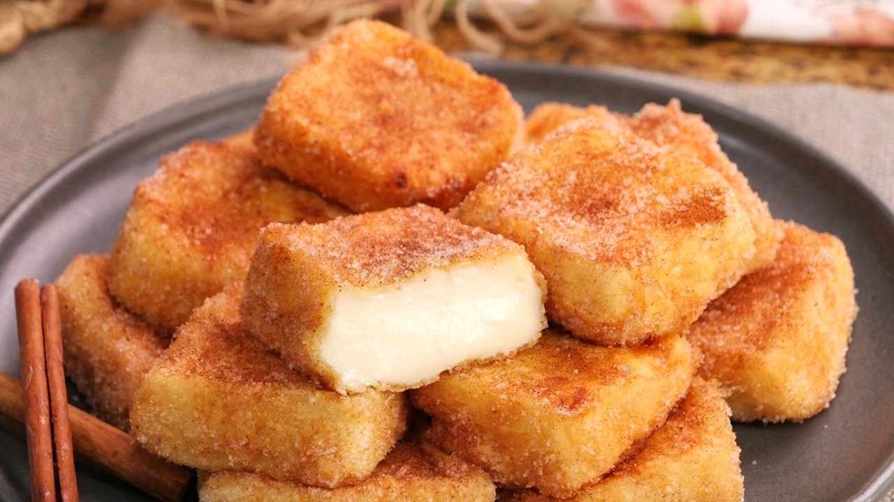

> 📺 **Vídeo Oficial de Elaboración:** [Ver en YouTube: Leche Frita Casera - Postre tradicional fácil y sabroso](https://www.youtube.com/watch?v=Bb8elT-6Ncc)

### 📋 Ficha Resumen
| Parámetro | Valor |
| :--- | :--- |
| **Tiempo de Preparación** | 25 minutos (+ 4h de cuajado en frío) |
| **Tiempo de Fritura** | 15 minutos |
| **Dificultad** | Media |
| **Raciones** | 16-18 porciones cuadradas |
| **Coste Estimado** | Muy Económico (2,80 € total / 0,16 € porción) |

### ⚖️ Ingredientes Exactos

* **1.000 ml** Leche entera fresca.
* **120 g** Azúcar blanco.
* **90 g** Almidón de maíz (Maicena).
* **3 unidades (60 g)** Yemas de huevo campero.
* **1 rama** Canela de Ceilán y piel de 1 limón.
* **30 g** Mantequilla sin sal.
* **Harina y 2 huevos batidos** para el rebozado.
* **300 ml** AOVE para freír.
* **100 g azúcar + 1 cucharadita de canela molida** para el rebozado final.

### 👨‍🍳 Paso a Paso Técnico

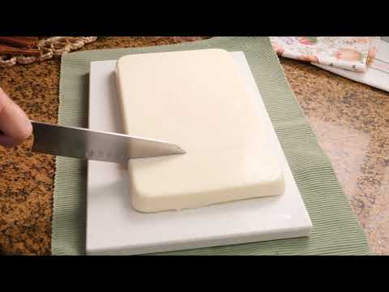
1. **Infusión y Mezcla:** Infusionar 800 ml de leche con la canela y el limón. Disolver la maicena y las yemas en los 200 ml de leche fría restante con el azúcar.
2. **Espesado:** Colar la leche caliente sobre la mezcla de maicena, devolver al cazo a fuego medio-bajo y cocinar removiendo continuamente con varillas hasta que espese intensamente y hierva 2 minutos. Añadir la mantequilla fuera del fuego.
3. **Cuajado en Molde:** Verter la crema en una fuente rectangular aceitada (de unos 2 cm de grosor), cubrir con film a piel y refrigerar 4 horas hasta que esté firme y fría.
4. **Corte y Fritura:** Cortar en cuadrados de 4x4 cm. Pasar por harina, sacudir el exceso, bañar en huevo batido y freír en AOVE a 180°C durante 1 min por lado hasta dorar. Rebozar calientes en azúcar y canela.

---

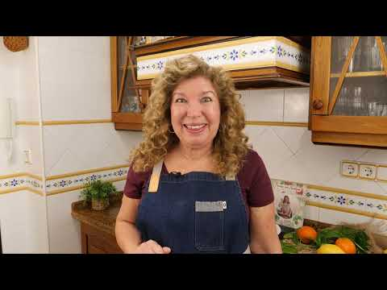

## 🥧 6. Tarta de Manzana Casera con Crema y Base de Hojaldre
*Categoría: Tartas Clásicas / Textura Hojaldrada y Frutal*

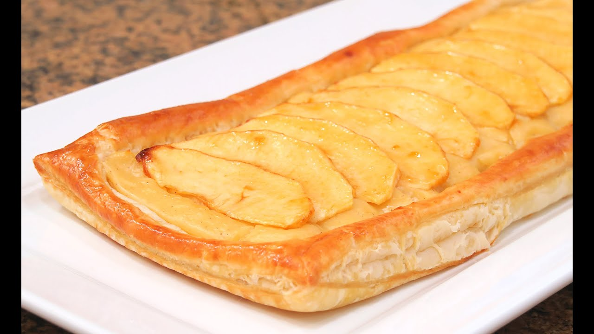

> 📺 **Vídeo Oficial de Elaboración:** [Ver en YouTube: Tarta de Manzana con Crema y Hojaldre | Fácil y Rápida!](https://www.youtube.com/watch?v=mRDQQZlMDA4)

### ⚖️ Ingredientes Exactos

* **1 lámina (250 g)** Hojaldre mantequilla rectangular refrigerado.
* **3 unidades (500 g)** Manzanas variedad Reineta o Golden maduras.
* **350 ml** Crema pastelera tradicional espesa (preparada con leche, yema, maicena y azúcar).
* **60 g** Mermelada de albaricoque o melocotón + 1 cucharada de agua (para abrillantar).

### 👨‍🍳 Paso a Paso Técnico

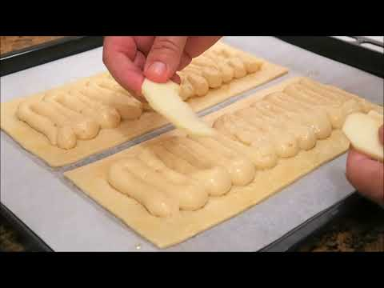
1. **Base y Crema:** Extender el hojaldre en una bandeja con papel vegetal. Pinchar la base con tenedor (dejando 1 cm de borde sin pinchar). Extender la crema pastelera fría sobre la base.
2. **Colocación de Manzana:** Pelar, descorazonar y cortar las manzanas en láminas finas de 2 mm. Disponerlas solapadas en filas ordenadas sobre la crema.
3. **Horneado y Brillo:** Hornear a 195°C durante 30-35 minutos hasta que el hojaldre esté inflado y dorado y la manzana tierna. Calentar la mermelada con el agua y pintar generosamente la superficie caliente con un pincel.

---

## 🧁 7. Magdalenas Caseras de Pueblo con Copete y Azúcar
*Categoría: Repostería Tradicional de Desayuno*

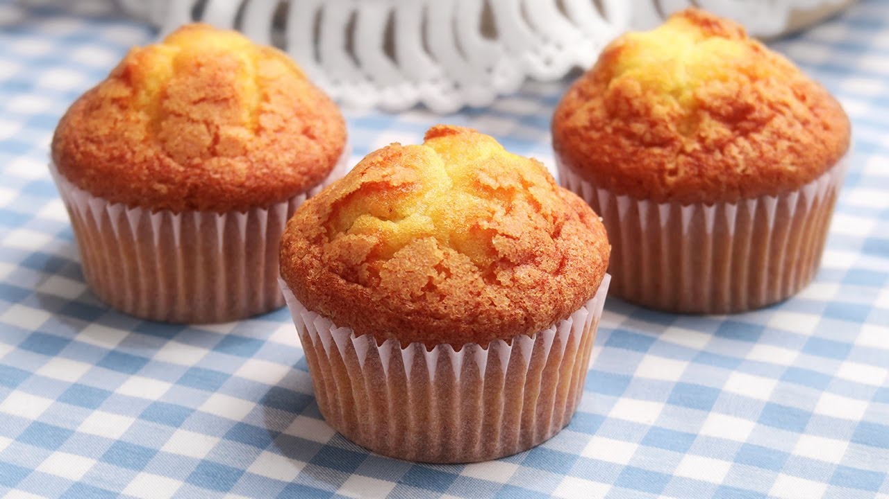

> 📺 **Vídeo Oficial de Elaboración:** [Ver en YouTube: Magdalenas caseras muy Esponjosas y con Copete](https://www.youtube.com/watch?v=A18f1F1tFKc)

### ⚖️ Ingredientes Exactos

* **250 g** Harina de trigo común.
* **200 g** Azúcar blanco (+ extra para espolvorear).
* **3 unidades (180 g)** Huevos camperos clase L.
* **125 ml** Leche entera fresca.
* **175 ml** AOVE suave o aceite de girasol.
* **16 g** Impulsor químico (polvo de hornear).
* **Ralladura de 1 limón** y 1 pizca de sal.

### 👨‍🍳 Paso a Paso Técnico (El Secreto del Copete)

1. **Batido Intenso:** Batir los huevos con el azúcar durante 7 minutos hasta blanquear.
2. **Emulsión Líquida:** Añadir la leche, el aceite y la ralladura batiendo a velocidad baja.
3. **Tamizado e Integración:** Incorporar la harina, levadura y sal tamizadas. Mezclar con espátula.
4. **El Secreto del Choque Térmico (Clave de Carmen):** Tapar el bol con la masa y **refrigerar en nevera durante 1 hora mínimo (o toda la noche)**.
5. **Horneado con Copete:** Llenar las cápsulas de papel (colocadas dentro de un molde rígido de magdalenas) hasta 3/4 de su capacidad. Espolvorear 1/2 cucharadita de azúcar en el centro de cada una. Hornear en horno precalentado a 210°C durante 13-15 minutos. El contraste térmico frío-calor disparará el copete hacia arriba.

---

## 🥯 8. Rosquillas de Anís Caseras de la Abuela
*Categoría: Dulces Tradicionales de Sartén*

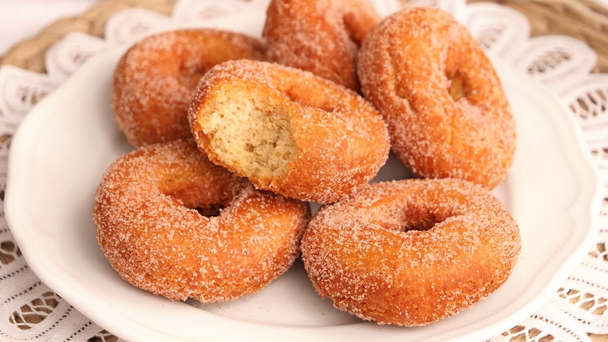

> 📺 **Vídeo Oficial de Elaboración:** [Ver en YouTube: Rosquillas Fritas de Anís deliciosas y muy tiernas | Receta Tradicional de la Abuela](https://www.youtube.com/watch?v=6xrmDY5ZXjo)

### ⚖️ Ingredientes Exactos

* **450 g** Harina de trigo común.
* **3 unidades** Huevos camperos L.
* **100 g** Azúcar blanco.
* **60 ml** AOVE aromatizado con piel de limón y frito.
* **60 ml** Licor de anís dulce.
* **10 g** Impulsor químico.
* **Ralladura de 1 limón y 1 naranja**.
* **Aceite abundante para freír y azúcar para rebozar**.

### 👨‍🍳 Paso a Paso Técnico

1. **Masa Aromática:** Batir los huevos con el azúcar, añadir el AOVE aromatizado frío, el anís licor y las ralladuras. Incorporar la harina tamizada con el impulsor hasta tener una masa tierna y manejable (engrasarse las manos con aceite para trabajarla).
2. **Formado:** Tomar porciones de masa de 25 g, hacer cordones, unir los extremos formando rosquillas y hacerles 2 o 3 pequeños cortes exteriores con tijera.
3. **Fritura:** Freír en AOVE a 170°C hasta que se doren uniformemente e hinchen. Rebozar calientes en azúcar común.

---

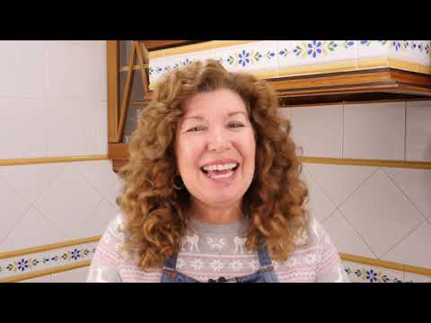

## 📊 Matriz Comparativa Maestra de Repostería y Dulces

| Elaboración | Tiempo Total | Dificultad | Rendimiento | Coste Total | Conservación Óptima | Método de Regeneración / Servicio |
| :--- | :---: | :---: | :---: | :---: | :---: | :--- |
| **Bizcocho de Yogur 1, 2, 3** | 50 min | Muy Fácil | 8-10 raciones | 2,20 € | 5 días tierno (campana) | Temperatura ambiente |
| **Tarta de la Abuela** | 40 min + 6h frío | Fácil | 10-12 raciones | 4,80 € | 5 días (nevera 3°C) | Servicio frío directo |
| **Tarta de Queso al Horno** | 60 min + 4h frío | Muy Fácil | 8 raciones | 5,50 € | 4 días (nevera 3°C) | Temperatura ambiente (sacar 30m antes) |
| **Torrijas de Leche y Miel** | 40 min | Fácil | 12-14 uds | 3,20 € | 3 días (nevera) | Templar 15s en microondas |
| **Leche Frita Cremosa** | 40 min + 4h frío | Media | 16-18 porciones | 2,80 € | 3 días (nevera) | Sartén suave o templar en micro |
| **Tarta de Manzana** | 45 min | Fácil | 6-8 raciones | 3,90 € | 3 días (nevera) | Templar 3 min en horno a 160°C |
| **Magdalenas de Pueblo** | 25 min + 1h frío | Fácil | 12-14 magdalenas| 2,40 € | 7 días (bolsa zip) | Temperatura ambiente |
| **Rosquillas de Anís** | 40 min | Fácil-Media | 20-24 rosquillas| 2,10 € | 10 días (lata metálica) | Temperatura ambiente |
