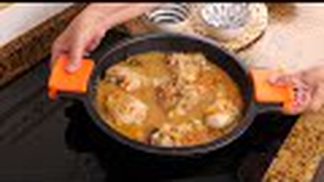
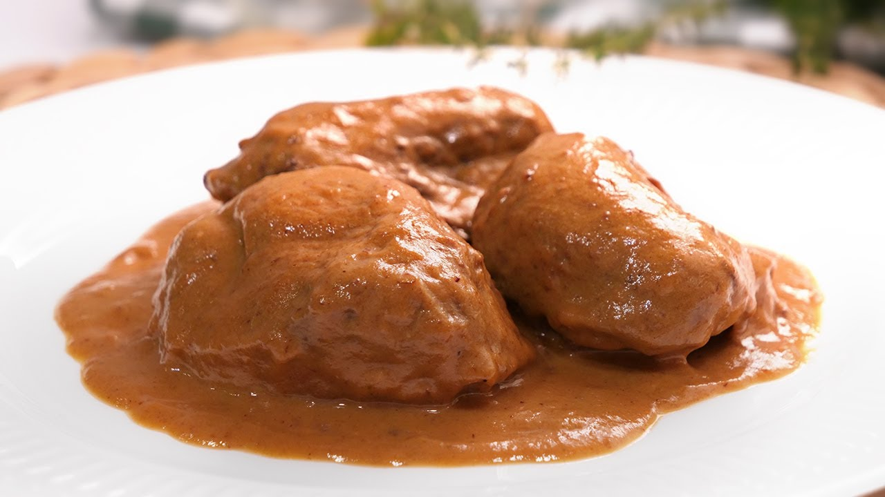
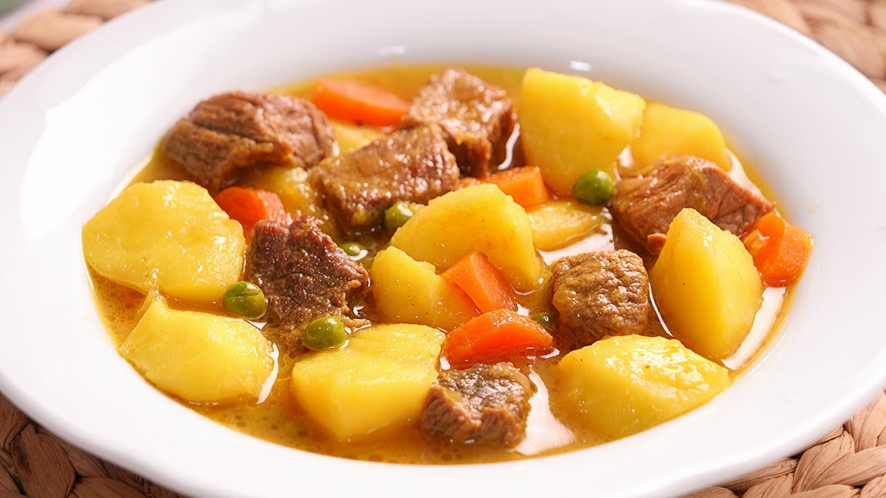
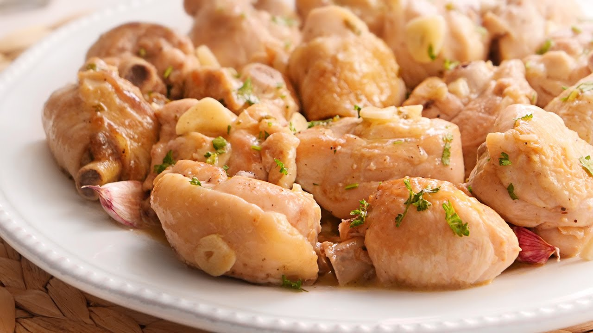
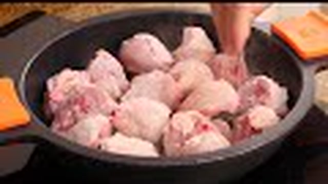
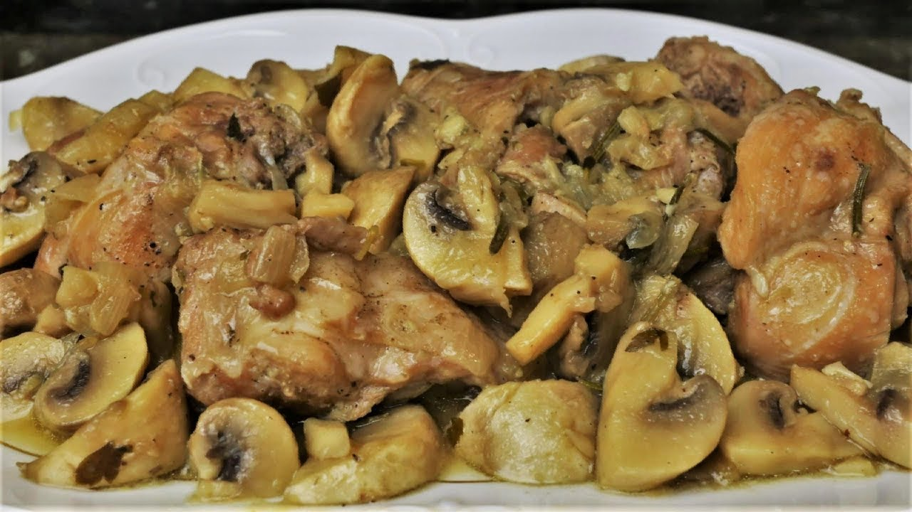
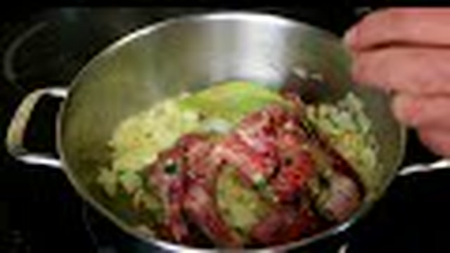

# 🥘 Master de Cocina Tradicional: Carnes, Aves y Guisos Familiares
> **Inspirado en la filosofía y técnica de *Cocina con Carmen***  
> *Recetario Técnico, Protocolos de Batch Cooking, Alérgenos UE y Guías de Regeneración Profesional*

---

## 📖 Prólogo Culinario: Los Pilares del Guiso Tradicional

La cocina de guiso y cazuela representa el patrimonio gastronómico más reconfortante y sabio de nuestra tradición. En el estilo inconfundible de **Cocina con Carmen**, los platos no admiten prisas ni atajos artificiales; su excelencia reside en el dominio de cinco leyes fundamentales:

1. **El Sofrito Paciente:** La base aromática donde la cebolla, el ajo, el pimiento y el tomate se caramelizan lentamente en Aceite de Oliva Virgen Extra (AOVE), evaporando el agua libre y concentrando los azúcares naturales.
2. **El Sellado y la Reacción de Maillard:** Dorar las piezas de carne a fuego vivo sin amontonarlas para sellar jugos, generar costra dorada y fijar los compuestos sápidos que enriquecerán el fondo.
3. **El Desglasado Técnico:** El uso del vino (Fino, Manzanilla, Montilla-Moriles, Rueda o Tintos con cuerpo) para disolver los jugos caramelizados pegados en el fondo de la cazuela (*fond*), aportando acidez equilibrada y aromas profundos.
4. **El Majado Tradicional:** La alquimia del mortero que combina almendras o piñones tostados, ajos asados, yemas cocidas, perejil fresco y pan frito para aportar untuosidad, cuerpo y brillo a la salsa sin recurrir a espesantes industriales.
5. **El Fuego Lento (*Chup-chup*) y el Reposo:** La cocción a fuego suave que transforma el colágeno intramuscular de las carnes duras en gelatina soluble sedosa. Un guiso siempre alcanza su apogeo tras reposar 12-24 horas.

---

```
                                  MAPA DEL RECETARIO
                                  
  ┌─────────────────────────────────┐       ┌─────────────────────────────────┐
  │         AVES Y GRANJA           │       │         CARNES ROJAS            │
  │ • 1. Pollo en Pepitoria         │       │ • 3. Ternera a la Jardinera     │
  │ • 7. Pollo al Ajillo Tradicional│       │ • 4. Carrilleras al Vino Tinto  │
  │ • 8. Conejo al Ajillo/Cazadora  │       │                                 │
  └────────────────┬────────────────┘       └────────────────┬────────────────┘
                   │                                         │
                   └───────────────────┬─────────────────────┘
                                       │
                    ┌──────────────────┴──────────────────┐
                    │       CERDO, LEGUMBRES Y PICADOS    │
                    │ • 2. Albóndigas en Salsa Abuela     │
                    │ • 5. Lentejas Pardinas con Chorizo  │
                    │ • 6. Estofado de Magro con Patatas  │
                    └─────────────────────────────────────┘
```

---

## 🍗 1. Pollo en Pepitoria Tradicional
*Categoría: Aves / Guiso de Convento y Tradición Señorial*


> 📺 **Vídeo Oficial de Elaboración:** [Ver en YouTube: Pollo guisado al estilo de la abuela: ¡La receta definitiva!](https://www.youtube.com/watch?v=YKqSq5d_ERY)


> [!NOTE]
> Una de las joyas de la gastronomía española con orígenes hispanoárabes. La salsa no se espesa con harinas crudas sino mediante un majado noble de azafrán en hebra, almendras tostadas y yemas de huevo cocido disueltas en el fondo de cocción.

### 📋 Ficha Resumen
| Parámetro | Valor |
| :--- | :--- |
| **Tiempo de Preparación** | 20 minutos |
| **Tiempo de Cocción** | 50 minutos |
| **Dificultad** | Media |
| **Raciones** | 4 personas (aprox. 380g por ración con salsa) |
| **Coste Estimado** | Económico-Medio (6,50 € total / 1,62 € ración) |

---

### ⚠️ Tabla de Alérgenos (Reglamento UE 1169/2011)

| Alérgeno | Estado | Ingrediente Causante / Medida de Adaptación |
| :--- | :---: | :--- |
| **Gluten** | ⚠️ *Opcional* | Harina de trigo del enharinado previo. *Sustituir por maicena o harina de arroz para 100% Sin Gluten.* |
| **Huevos** | 🔴 **PRESENTE** | Yemas y claras de huevo cocido en el majado y guarnición. |
| **Frutos de Cáscara** | 🔴 **PRESENTE** | Almendras crudas marconas tostadas. |
| **Sulfitos** | 🔴 **PRESENTE** | Vino blanco seco (Montilla-Moriles o Rueda). |
| **Lácteos** | 🟢 AUSENTE | No contiene lácteos ni derivados. |
| **Apio / Mostaza / Soja / Pescado** | 🟢 AUSENTE | Formulación limpia tradicional. |

---

### ⚖️ Ingredientes Exactos


#### Base y Proteína
* **1.200 g** Pollo de corral limpio, cortado en octavos (jamoncitos, muslos y pechugas con hueso).
* **35 g** Harina de trigo común (o almidón de maíz para celíacos) para un enharinado muy leve.
* **60 ml** Aceite de Oliva Virgen Extra (AOVE) de variedad Picual o Hojiblanca.
* **6 g** Sal marina fina.
* **1,5 g** Pimienta negra recién molida.

#### Sofrito y Desglasado
* **220 g** Cebolla dulce o cebolla blanca, picada en brunoise fina.
* **4 dientes** Ajo morado de Las Pedroñeras (aprox. 20 g), pelados y laminados.
* **1 hoja** Laurel seco seleccionado.
* **150 ml** Vino blanco seco de calidad (Jerez Fino, Montilla-Moriles o Rueda Verdejo).
* **550 ml** Caldo de pollo casero suave y desgrasado (o agua mineral en su defecto).

#### El Majado Tradicional de Pepitoria
* **45 g** Almendras crudas peladas (preferiblemente variedad Marcona).
* **2 unidades** Huevos camperos tamaño L (cocidos durante 9 min).
* **0,25 g (unas 18-20 hebras)** Azafrán en hebra español con D.O. La Mancha.
* **15 g** Hojas de perejil fresco limpio.
* **1 rebanada (25 g)** Pan rústico del día anterior.

---

### 🍳 Equipamiento Necesario
* Cazuela ancha y baja de hierro fundido (Cocotte) o acero inoxidable de fondo grueso (Ø 28-30 cm).
* Mortero tradicional de mármol o trituradora de mano.
* Sartén pequeña para tostado de almendras y pan.
* Cazo para cocción de huevos.
* Pinzas de cocina y espumadera.

---

### 👨‍🍳 Paso a Paso Técnico y Minucioso



1. **Mise en Place y Huevos Cocidos:**
   * Hervir los 2 huevos en agua con un pellizco de sal durante 9 minutos exactos desde que rompa a hervir. Cortar la cocción en baño de agua con hielo, pelar, separar las yemas (para el majado) y picar las claras en brunoise fina (reservar como guarnición final).
   * Salpimentar las piezas de pollo de manera uniforme y pasarlas por un velo finísimo de harina, sacudiendo enérgicamente para eliminar cualquier exceso.

2. **Sellado Maestro (Maillard):**
   * Calentar el AOVE en la cazuela a fuego medio-alto (175°C). Dorar las presas de pollo en dos tandas para no bajar la temperatura del aceite, buscando un tono dorado uniforme (4-5 minutos por lado). Retirar a una fuente y reservar los jugos exudados.

3. **El Sofrito Base:**
   * En el mismo aceite aromatizado, reducir el fuego a suave e incorporar la cebolla brunoise con una pizca de sal y la hoja de laurel. Pochar despacio durante 14-16 minutos hasta que la cebolla quede transparente, blanda y ligeramente dulce. Incorporar la mitad de los ajos picados durante los últimos 3 minutos para que no se quemen.

4. **Elaboración del Majado Sublime:**
   * En una sartén con unas gotas de AOVE, freír la rebanada de pan hasta que quede crujiente y dorada. Tostar las almendras a fuego muy suave hasta que desprendan aroma.
   * Tostar ligeramente las hebras de azafrán envolviéndolas en papel vegetal sobre la tapa tibia de la cazuela durante 20 segundos.
   * En el mortero, machacar las hebras de azafrán con un gramo de sal gorda hasta reducirlas a polvo. Añadir el pan frito troceado, las almendras tostadas, el perejil fresco y las dos yemas cocidas. Trabajar con la maza con movimientos circulares hasta lograr una pasta untuosa, homogénea y densa. Diluir con 50 ml de caldo tibio para facilitar su integración.

5. **Desglasado y Cocción (*Chup-Chup*):**
   * Subir el fuego del sofrito, verter los 150 ml de vino blanco y raspar el fondo con cuchara de madera para incorporar todos los jugos caramelizados del pollo. Dejar evaporar el alcohol a fuego vivo durante 3 minutos.
   * Reintegrar las piezas de pollo y los jugos de la fuente a la cazuela. Verter el resto del caldo de pollo caliente (500 ml) y distribuir el majado del mortero sobre el guiso, removiendo con movimientos basculantes de la cazuela para emulsionar la salsa.
   * Tapar dejando una pequeña rendija y cocer a fuego lento durante 30 minutos. Destapar y cocer 10 minutos más a fuego suave para que la salsa reduzca y espese de forma natural gracias a la yema y la almendra.

6. **Acabado y Reposo:**
   * Espolvorear la clara de huevo picada y unas hojas de perejil fresco. Apagar el fuego y dejar reposar tapado un mínimo de 20 minutos antes de servir.

---

### 📦 Protocolo de Conservación y Batch Cooking

> [!IMPORTANT]
> La salsa pepitoria mejora drásticamente tras 24 horas de reposo porque las grasas y almidones del majado se amalgaman con los jugos de ave.

* **Abatimiento Térmico:** Tras cocinar, destapar y enfriar a temperatura ambiente un máximo de 45 min; luego transferir a refrigeración para pasar de 65°C a <10°C en menos de 2 horas.
* **Refrigeración (0°C a 4°C):** Conservar en recipiente hermético de cristal libre de BPA durante **4 días**.
* **Congelación (-18°C):** Apta para congelación durante **3 meses**. *Nota:* La clara de huevo cocida tiende a volverse gomosa en el congelador; se recomienda no añadir la clara picada si se va a congelar y agregarla fresca en la regeneración.
* **Envasado al Vacío:** En barqueta o bolsa sous-vide termo-sellada con 98% de vacío en frío: vida útil de **10 días a 2°C**.

---

### 🔥 Guía de Regeneración Multicanal

* **Cazuela / Sartén (Recomendado):** Disponer el pollo con su salsa, añadir 30 ml de agua mineral o caldo suave. Calentar tapado a fuego bajo durante 7-8 minutos, moviendo suavemente en vaivén hasta recuperar textura untuosa y 74°C en el centro del ave.
* **Horno Tradicional:** Precalentar a 150°C. Colocar en fuente apta para horno cubierta con papel sulfurizado o de aluminio. Regenerar durante 14 minutos.
* **Microondas:** Disponer la ración en plato hondo con campana extractora/tapa para microondas. Calentar a 650W durante 2,5 minutos, remover la salsa y dar 1 minuto adicional a potencia media.
* **Baño María / Termocirculador Sous-Vide:** Para bolsas de vacío, sumergir a 72°C constantes durante 18 minutos. Calidad idéntica a recién elaborado.

---

## 🧆 2. Albóndigas en Salsa de la Abuela
*Categoría: Carnes Picadas / Clásico Familiar Imperecedero*


> 📺 **Vídeo Oficial de Elaboración:** [Ver en YouTube: Albóndigas en salsa española: Un homenaje a la cocina tradicional](https://www.youtube.com/watch?v=9J-dvHmqN1w)


> [!TIP]
> El secreto de unas albóndigas tiernas como una nube no está en añadir exceso de pan, sino en hidratar la miga en leche entera con un toque de ajo asado y utilizar una proporción 60/40 de ternera jugosa y magro de cerdo ibérico.

### 📋 Ficha Resumen
| Parámetro | Valor |
| :--- | :--- |
| **Tiempo de Preparación** | 30 minutos |
| **Tiempo de Cocción** | 45 minutos |
| **Dificultad** | Fácil-Media |
| **Raciones** | 4 personas (aprox. 20-24 albóndigas medianas de 40g) |
| **Coste Estimado** | Económico (5,80 € total / 1,45 € ración) |

---

### ⚠️ Tabla de Alérgenos (Reglamento UE 1169/2011)

| Alérgeno | Estado | Ingrediente Causante / Medida de Adaptación |
| :--- | :---: | :--- |
| **Gluten** | 🔴 **PRESENTE** | Pan remojado y harina del sellado. *Usar pan sin gluten y harina de garbanzo o arroz.* |
| **Huevos** | 🔴 **PRESENTE** | Huevo campero en la masa cárnica aglutinante. |
| **Lácteos** | 🔴 **PRESENTE** | Leche entera para remojar la miga. *Sustituir por caldo de carne o bebida vegetal neutra.* |
| **Sulfitos** | 🔴 **PRESENTE** | Vino blanco del sofrito. |
| **Frutos de Cáscara** | 🟢 AUSENTE | No contiene frutos secos. |

---

### ⚖️ Ingredientes Exactos


#### Masa de Albóndigas Artesanas
* **400 g** Carne picada de aguja o babilla de ternera (1 solo pase por picadora).
* **300 g** Carne picada de magro o cabecero de cerdo ibérico.
* **1 unidad** Huevo campero fresco clase L.
* **70 g** Miga de pan blanco artesano del día anterior.
* **90 ml** Leche entera fresca pasteurizada.
* **2 dientes** Ajo morado picados a cuchillo en pasta puré (10 g).
* **15 g** Perejil fresco finamente picado.
* **6 g** Sal marina.
* **1 g** Pimienta blanca molida y una pizca de nuez moscada rallada.
* **40 g** Harina de trigo para bolear suavemente.
* **100 ml** AOVE para el dorado superficial.

#### Salsa Española Tradicional de la Abuela
* **200 g** Cebolla dulce en brunoise fina.
* **100 g** Zanahoria pelada y rallada o picada muy menuda.
* **80 g** Pimiento verde italiano picado fino.
* **2 dientes** Ajo morado picados (10 g).
* **120 g** Tomate pera maduro triturado natural.
* **120 ml** Vino blanco oloroso o Montilla-Moriles.
* **500 ml** Caldo oscuro de carne tostada o ternera.
* **1 hoja** Laurel y una ramita de tomillo fresco.
* **15 g** Harina de trigo (para ligar el roux del sofrito).

---

### 🍳 Equipamiento Necesario
* Bol amplio de acero inoxidable para amasar.
* Sartén antiadherente profunda o cazuela de barro/acero de 28 cm.
* Batidora de inmersión / pasapurés (opcional para textura de salsa extra fina).
* Racionador o cuchara de servir.

---

### 👨‍🍳 Paso a Paso Técnico y Minucioso


1. **Hidratación y Mezclado de la Farsa:**
   * En un cuenco, desmenuzar la miga de pan y empaparla con la leche templada durante 5 minutos. Escurrir ligeramente con las manos.
   * En el bol grande, colocar la carne de ternera y cerdo. Incorporar el huevo batido, la miga hidratada, el ajo en pasta, el perejil fresco picado, la sal, la pimienta y la nuez moscada.
   * Mezclar con las manos o espátula solo lo justo hasta integrar, sin amasar en exceso para evitar que la proteína libere miosina y las albóndigas queden duras. Dejar reposar la farsa en nevera 20 minutos para que tome cuerpo.

2. **Formado y Sellado Dorado:**
   * Formar bolas de unos 35-40 gramos con las manos ligeramente humedecidas con agua o aceite. Pasarlas por un lecho ligero de harina, retirando el exceso con un colador.
   * Calentar el AOVE a 180°C en la sartén. Freír las albóndigas en tandas rápidas durante 1,5-2 minutos solo para formar una costra exterior dorada, manteniendo el corazón crudo y jugoso. Retirar y reservar en fuente.

3. **Elaboración de la Salsa Magistral:**
   * En la cazuela con 3 cucharadas del aceite colado de freír las albóndigas, sofreír a fuego medio la cebolla, el pimiento verde y la zanahoria con el laurel y media cucharadita de sal. Pochar durante 12-14 minutos hasta que la verdura esté tierna y caramelizada.
   * Añadir el ajo y el tomate triturado. Sofreír 6 minutos hasta evaporar toda el agua vegetal y ver brotar el aceite rojo brillante.
   * Añadir la cucharada de harina (15g) y tostarla 1 minuto para cocinar el almidón.

4. **Desglasado, Triturado (opcional) y Guisado:**
   * Verter el vino blanco, raspar el fondo de la cazuela y reducir a fuego vivo durante 3 minutos. Añadir el caldo de carne caliente y cocinar la salsa a fuego medio durante 10 minutos.
   * *(Paso opcional estilo Carmen):* Retirar el laurel y triturar la salsa con batidora para lograr una textura aterciopelada de color anaranjado brillante, devolviéndola a la cazuela.
   * Introducir las albóndigas reservadas con sus jugos en la salsa. Cocinar tapado a fuego muy suave (*chup-chup*) durante 15 minutos, moviendo la cazuela con vaivén para que la gelatina de la carne ligue la salsa.

---

### 📦 Protocolo de Conservación y Batch Cooking

* **Abatimiento:** Bajar de 60°C a <10°C en menos de 90 minutos sumergiendo la base del recipiente en baño maría inverso (agua y hielo).
* **Nevera (0-4°C):** En táper hermético de vidrio cubiertas de salsa, **4-5 días** en condiciones organolépticas perfectas.
* **Congelador (-18°C):** Extraordinario comportamiento en congelación. Vida útil de **4 meses**. Descongelar en nevera durante 12 horas antes de regenerar.
* **Vacío Profesional:** Bolsas al 95% de vacío con líquido frío: vida útil de **12 días a 2°C**.

---

### 🔥 Guía de Regeneración Multicanal

* **Cazuela / Fuego Directo:** Fuego medio-bajo durante 6-8 minutos con tapa. Añadir 20 ml de agua si la salsa ha espesado mucho en frío.
* **Horno:** 160°C durante 12 minutos en bandeja refractaria tapada.
* **Microondas:** 700W durante 3 minutos en recipiente apto con tapa perforada.
* **Baño María:** Regenerar a 75°C durante 15 minutos.

---

## 🥩 3. Ternera Guisada a la Jardinera
*Categoría: Carnes Rojas / Estofado Campestre Tradicional*


> 📺 **Vídeo Oficial de Elaboración:** [Ver en YouTube: Estofado de Carne de Ternera con Patatas muy fácil y delicioso](https://www.youtube.com/watch?v=mtI-FlYqzoA)


> [!NOTE]
> La ternera a la jardinera es el epítome del guiso de domingo. El corte rey para esta preparación es la **morcilla, aguja o aleta de ternera**, ricas en tejido conjuntivo que se descompone en gelatina untuosa tras un estofado prolongado.

### 📋 Ficha Resumen
| Parámetro | Valor |
| :--- | :--- |
| **Tiempo de Preparación** | 25 minutos |
| **Tiempo de Cocción** | 1 hora 30 minutos (cazuela tradicional) / 35 min (olla exprés) |
| **Dificultad** | Media |
| **Raciones** | 4-5 personas |
| **Coste Estimado** | Medio (9,50 € total / 2,10 € ración) |

---

### ⚠️ Tabla de Alérgenos (Reglamento UE 1169/2011)

| Alérgeno | Estado | Ingrediente Causante / Medida de Adaptación |
| :--- | :---: | :--- |
| **Gluten** | ⚠️ *Opcional* | Harina del sellado de la ternera. *Omitir o sustituir por almidón de tapioca/maicena.* |
| **Sulfitos** | 🔴 **PRESENTE** | Vino tinto o blanco del estofado. |
| **Apio** | ⚠️ *Opcional* | Si se incorpora al caldo base o sofrito mirepoix. |
| **Huevos / Lácteos / Frutos Secos** | 🟢 AUSENTE | Totalmente libre de estos alérgenos. |

---

### ⚖️ Ingredientes Exactos


#### Carne y Sellado
* **900 g** Ternera para guisar (corte aguja, llana o morcillo) cortada en dados regulares de 3,5 cm.
* **30 g** Harina de trigo para espolvorear.
* **65 ml** AOVE virgen extra.
* **7 g** Sal y 2 g de pimienta negra molida.

#### Sofrito y Verduras Jardinera
* **200 g** Cebolla morada o blanca picada en dados medianos.
* **3 dientes** Ajo picados finos (15 g).
* **120 g** Pimiento rojo morrón en dados.
* **100 g** Pimiento verde italiano en dados.
* **150 g** Tomate maduro rallado sin piel ni semillas.
* **200 g** Zanahorias peladas y cortadas en rodajas de 1 cm.
* **150 g** Guisantes finos (frescos o congelados de primera calidad).
* **150 g** Judías verdes planas o redondas limpias y troceadas (3 cm).
* **180 ml** Vino blanco seco o tinto joven D.O. Rioja/Ribera.
* **650 ml** Caldo de carne o fondo oscuro de ternera.
* **1 ramita** Romero fresco, 1 hoja de laurel y 1 clavo de olor clavado en una cebolla.

---

### 🍳 Equipamiento Necesario
* Cazuela holandesa de hierro esmaltado (Ø 26-28 cm) o cazuela de fondo difusor triple.
* Cuchara de madera / espátula resistente al calor.
* Pinzas y tabla de corte para vegetales.

---

### 👨‍🍳 Paso a Paso Técnico y Minucioso


1. **Preparación y Sellado Intenso:**
   * Secar meticulosamente los tacos de ternera con papel absorbente (el agua superficial impide la reacción de Maillard). Salpimentar y pasar por una sutil película de harina.
   * Calentar el AOVE en la cazuela a fuego vivo. Sellar los dados de ternera en 2 o 3 tandas hasta conseguir un color tostado avellanado intenso en todas sus caras (aprox. 6-8 minutos por tanda). Retirar la carne a una fuente.

2. **Sofrito de Fondo y Desglasado:**
   * Bajar el fuego a medio. Añadir a la misma cazuela la cebolla, el pimiento rojo y el pimiento verde con una pizca de sal. Rehogar durante 10-12 minutos hasta que estén pochados y con bordes caramelizados.
   * Incorporar el ajo picado y el tomate rallado. Sofreír 6-7 minutos hasta que el tomate reduzca por completo y concentre su color.
   * Verter el vino y raspar con energía todos los azúcares adheridos a la base. Reducir a la mitad durante 4 minutos para evaporar alcoholes.

3. **Estofado Prolongado:**
   * Devolver la ternera y los jugos desprendidos a la cazuela. Agregar la zanahoria troceada, la hoja de laurel, el romero y el clavo.
   * Cubrir con el caldo de ternera caliente. Llevar a ebullición suave, tapar herméticamente y bajar el fuego al mínimo (chup-chup cadencioso a unos 85-90°C).
   * Cocinar durante 1 hora y 15 minutos en cazuela tradicional (o 30 minutos en olla a presión rápida).

4. **Incorporación de la Jardinera Fresca:**
   * Destapar la cazuela, comprobar la ternura de la carne (debe ceder ante la presión de un tenedor).
   * Añadir las judías verdes y los guisantes. Cocinar destapado a fuego suave durante 12-15 minutos más para que las verduras queden al dente, conserven su color verde vivo y la salsa espese hasta napar el dorso de la cuchara. Ajustar de sal.

---

### 📦 Protocolo de Conservación y Batch Cooking

* **Abatimiento:** Enfriado veloz en baño maría de hielo y pase a nevera.
* **Nevera (0-4°C):** Óptimo durante **4 días**. El colágeno gelatiniza en frío formando un bloque firme que se licúa suavemente al calentar.
* **Congelador (-18°C):** Excelente hasta **3 meses**. Los guisantes y judías verdes mantienen buena textura si no se sobrecocieron.
* **Vacío:** Excelente hasta **10 días a 2°C**.

---

### 🔥 Guía de Regeneración Multicanal

* **Cazuela / Sartén:** Fuego medio-bajo durante 6-7 minutos tapado con 2 cucharadas de agua para fluidificar la gelatina natural.
* **Horno:** 150°C durante 15 minutos tapado.
* **Microondas:** 600W durante 3-4 minutos en táper de cristal con tapa de silicona.
* **Baño María:** 75°C durante 20 minutos en bolsa al vacío.

---

## 🍷 4. Carrilleras de Cerdo Ibérico en Salsa al Vino Tinto
*Categoría: Carnes / Melosidad Extrema y Alta Cocina Tradicional*



> 📺 **Vídeo Oficial de Elaboración:** [Ver en YouTube: Carrilleras en Salsa al Vino Tinto muy Tiernas y Deliciosas](https://www.youtube.com/watch?v=OvEN0uHBdFI)


> [!IMPORTANT]
> La carrillera (músculo masetero) es la pieza reina del colágeno. Requiere una cocción pausada para transformar el tejido conectivo duro en gelatina pura soluble, creando una salsa con un brillo de espejo natural sin necesidad de mantequilla o maicenas.

### 📋 Ficha Resumen
| Parámetro | Valor |
| :--- | :--- |
| **Tiempo de Preparación** | 20 minutos |
| **Tiempo de Cocción** | 2 horas 15 minutos (cazuela) / 45 min (olla rápida) |
| **Dificultad** | Media |
| **Raciones** | 4 personas (8 carrilleras ibéricas / 2 por persona) |
| **Coste Estimado** | Medio-Alto (11,00 € total / 2,75 € ración) |

---

### ⚠️ Tabla de Alérgenos (Reglamento UE 1169/2011)

| Alérgeno | Estado | Ingrediente Causante / Medida de Adaptación |
| :--- | :---: | :--- |
| **Sulfitos** | 🔴 **PRESENTE** | Vino tinto con cuerpo (Ribera del Duero o Toro). |
| **Gluten** | ⚠️ *Opcional* | Si se enharinan las carrilleras. *Eliminar enharinado para 100% Sin Gluten.* |
| **Apio** | 🔴 **PRESENTE** | Rama de apio en el mirepoix aromático. *Omitir si hay alergia.* |
| **Huevos / Lácteos / Frutos Secos** | 🟢 AUSENTE | Receta naturalmente libre. |

---

### ⚖️ Ingredientes Exactos


#### Carrilleras y Sellado
* **8 unidades (aprox. 850 g)** Carrilleras de cerdo ibérico limpias de exceso de grasa y telilla exterior.
* **50 ml** AOVE virgen extra.
* **6 g** Sal marina gruesa.
* **2 g** Pimienta negra en grano machacada.
* **20 g** Harina de trigo común (opcional para el sellado).

#### Bresa Aromática y Reducción
* **250 g** Cebolla dulce cortada en mirepoix (dados de 1,5 cm).
* **150 g** Puerro (solo la parte blanca) lavado y troceado.
* **140 g** Zanahoria pelada y troceada.
* **50 g** Rama de apio verde limpio en dados.
* **4 dientes** Ajo morado chafados con piel (camisa).
* **500 ml** Vino tinto con cuerpo, taninos maduros y buena acidez (Garnacha, Tempranillo o Syrah).
* **400 ml** Fondo oscuro de ternera tostada casero (o caldo concentrado de carne).
* **1 bouquet garni** (1 hoja de laurel, 2 ramas de tomillo fresco, 1 rama de romero atados con hilo de cocina).
* **1 trocito (2 cm)** Piel de naranja ecológica (sin albedo blanco).

---

### 🍳 Equipamiento Necesario
* Cocotte o cazuela de hierro fundido esmaltado de Ø 26 cm.
* Chino fino o colador de malla cónica.
* Espumadera y pinzas.
* Cuchara salsera.

---

### 👨‍🍳 Paso a Paso Técnico y Minucioso


1. **Limpieza y Sellado Profundo:**
   * Retirar con un cuchillo afilado la fascia blanca exterior (telilla) de las carrilleras para evitar que encojan al cocinarse. Salpimentar generosamente.
   * Calentar el AOVE en la cocotte a fuego alto. Dorar las carrilleras hasta obtener una costra oscura y caramelizada muy marcada (unos 3-4 minutos por lado). Retirar a una fuente.

2. **Pochado de la Bresa Hortícola:**
   * En la misma grasa con los jugos concentrados, bajar a fuego medio e incorporar la cebolla, el puerro, la zanahoria, el apio y los ajos en camisa.
   * Pochar durante 18-20 minutos, removiendo con frecuencia, hasta que los vegetales adquieran un tono dorado oscuro muy caramelizado (fondant).

3. **Desglasado y Reducción del Vino:**
   * Subir el fuego al máximo, verter los 500 ml de vino tinto y raspar a conciencia el fondo de la cazuela.
   * Dejar reducir el vino tinto a fuego vivo hasta que pierda el 60% de su volumen y se evapore todo el alcohol (aprox. 8-10 minutos), concentrando aromas frutales y taninos.

4. **Cocción Lenta del Colágeno:**
   * Reintroducir las carrilleras con sus jugos en la cocotte. Añadir el fondo oscuro de ternera caliente, el bouquet garni y la tira de piel de naranja. El líquido debe cubrir casi por completo la carne.
   * Llevar a hervor suave, tapar la cocotte y cocinar a fuego mínimo durante 2 horas y 15 minutos (o en horno a 140°C durante 2h 30min). Las carrilleras estarán listas cuando al clavar una brocheta entre y salga sin resistencia alguna.

5. **Filtrado y Glaseado de la Salsa:**
   * Extraer con delicadeza las carrilleras (son extremadamente tiernas y pueden romperse) y colocarlas en una bandeja.
   * Pasar la salsa con todas sus verduras por un chino fino o colador, presionando con el cazo para extraer los jugos y pectinas de la verdura (descartar los restos fibrosos).
   * Devolver la salsa colada a la cazuela limpia y reducir a fuego medio durante 8-10 minutos hasta que adquiera textura de jarabe y nape la cuchara con un brillo intenso.
   * Reintegrar las carrilleras a la salsa reducida y glasearlas a fuego mínimo durante 3 minutos, bañándolas continuamente con la cuchara.

---

### 📦 Protocolo de Conservación y Batch Cooking

* **Abatimiento:** Bajar la temperatura a <10°C en <90 minutos.
* **Nevera (0-4°C):** Conservar en recipiente hermético hasta **5 días**. Con el reposo, el vino se redondea y la carne absorbe la melosidad de la salsa.
* **Congelador (-18°C):** Aguanta **4 meses** en congelación perfecta. La salsa no se corta gracias a la emulsión natural de gelatina.
* **Vacío:** Extraordinario resultado en sous-vide. **14 días a 2°C**.

---

### 🔥 Guía de Regeneración Multicanal

* **Cazuela / Sartén:** Fuego muy bajo tapado durante 8 minutos, salseando continuamente con cuchara hasta que el centro esté humeante.
* **Horno:** 140°C durante 12-15 minutos en fuente tapada con papel aluminio.
* **Microondas:** 600W durante 2 minutos, girar la pieza y calentar 1,5 minutos más.
* **Baño María / Sous-Vide:** 70°C durante 20 minutos (método ideal para banquetes y restaurantes).

---

## 🍲 5. Lentejas Pardinas con Chorizo y Costilla de Carmen
*Categoría: Legumbres / Guiso Tradicional de Cuchara*


> 📺 **Vídeo Oficial de Elaboración:** [Ver en YouTube: Lentejas con Chorizo muy fáciles y súper deliciosas 😋💕](https://www.youtube.com/watch?v=7nLT6nmxMjE)


> [!TIP]
> Para lograr unas lentejas perfectas que no pierdan la piel ni queden caldosas, se utiliza **lenteja pardina** (que no necesita remojo previo obligatorio) y se inicia la cocción siempre en **agua fría**, haciendo un sofrito triturado que aporta densidad sin harinas.

### 📋 Ficha Resumen
| Parámetro | Valor |
| :--- | :--- |
| **Tiempo de Preparación** | 15 minutos |
| **Tiempo de Cocción** | 50 minutos |
| **Dificultad** | Fácil |
| **Raciones** | 5-6 personas |
| **Coste Estimado** | Muy Económico (4,20 € total / 0,70 € ración) |

---

### ⚠️ Tabla de Alérgenos (Reglamento UE 1169/2011)

| Alérgeno | Estado | Ingrediente Causante / Medida de Adaptación |
| :--- | :---: | :--- |
| **Sulfitos** | ⚠️ *Trazas* | Posibles sulfitos en el embutido (chorizo tradicional). |
| **Gluten** | ⚠️ *Opcional* | Comprobar que el chorizo y pimentón estén certificados sin gluten. |
| **Lácteos / Huevos / Frutos Secos / Soja** | 🟢 AUSENTE | Libre de estos alérgenos en elaboración casera limpia. |

---

### ⚖️ Ingredientes Exactos


#### Legumbre y Chup-chup
* **400 g** Lentejas pardinas secas seleccionadas y lavadas bajo el grifo.
* **200 g** Costilla de cerdo fresca troceada menuda.
* **2 unidades (160 g)** Chorizo dulce o ahumado artesano cortado en rodajas gruesas.
* **1 unidad (80 g)** Hueso de jamón ibérico curado (desalado bajo el grifo).
* **1 unidad (100 g)** Morcilla de cebolla curada (opcional, pinchada para no reventar).
* **1.600 ml** Agua mineral fría o caldo suave de verduras.
* **2 hojas** Laurel seco.
* **40 ml** AOVE virgen extra.

#### Verduras y Sofrito Secreto de Carmen
* **1 unidad (180 g)** Cebolla entera pelada.
* **1 unidad (130 g)** Pimiento verde italiano limpio y entero.
* **1 unidad (120 g)** Zanahoria pelada y cortada en rodajas.
* **1 unidad (180 g)** Patata para guisar (variedad Monalisa o Kennebec), chascada.
* **1 cabeza** Ajo morado entera lavada (con un corte transversal por la mitad).
* **1 unidad (120 g)** Tomate maduro entero pelado.
* **6 g (1 cucharadita colmada)** Pimentón dulce de la Vera con D.O.P.
* **1 g** Comino molido (clave para facilitar la digestión y aportar aroma).
* **7 g** Sal marina fina (ajustar al final tras la salazón del jamón y embutidos).

---

### 🍳 Equipamiento Necesario
* Cazuela alta de acero inoxidable o barro esmaltado de Ø 24-26 cm.
* Vaso batidor para el puré de verduras aromáticas.
* Espumadera para desespumar impurezas.

---

### 👨‍🍳 Paso a Paso Técnico y Minucioso


1. **Carga en Frío (*Todo en Crudo* Base):**
   * En la cazuela amplia, colocar las lentejas lavadas. Disponer la costilla de cerdo, las rodajas de chorizo, el hueso de jamón, la cebolla entera, el pimiento verde entero, el tomate maduro pelado, la cabeza de ajos entera, las hojas de laurel y las zanahorias en rodajas.
   * Cubrir todo con 1.600 ml de agua mineral fría (el agua debe sobrepasar las lentejas unos 3-4 dedos).

2. **Arranque y Desespumado:**
   * Poner a fuego medio-alto hasta que rompa a hervir. En los primeros 5-8 minutos, retirar con la espumadera la espuma blanquecina e impurezas que suben a la superficie.
   * Bajar el fuego a suave, tapar la cazuela y mantener una cocción suave y continua durante 30 minutos.

3. **El Toque Maestro de Carmen (Sofrito / Emulsión de Verduras):**
   * En una sartén pequeña con los 40 ml de AOVE caliente, retirar del fuego, añadir la cucharadita de pimentón dulce de la Vera y el comino molido; remover 5 segundos para que no se queme el pimentón y verter de inmediato en la cazuela de las lentejas.
   * Extraer de la cazuela la cebolla cocida, el pimiento verde, el tomate y 4 dientes de ajo tiernos extraídos de la cabeza cocida, junto con 2 cucharadas de caldo y lentejas.
   * Triturar este conjunto en el vaso batidor hasta obtener una crema finísima y devolverla a la cazuela. Este puré ligará el caldo dándole un cuerpo sedoso incomparable sin necesidad de enharinar.

4. **Patatas Chascadas y Reducción Final:**
   * Añadir la patata pelada y **chascada** (introduciendo el cuchillo y rompiendo el final para liberar fécula). Si se usa morcilla, incorporarla ahora.
   * Cocinar todo a fuego lento durante 15-18 minutos más, hasta que las lentejas y las patatas estén tiernas como mantequilla. Probar el punto de sal y rectificar si fuera necesario.
   * Reposar 15 minutos con la cazuela apagada antes de servir.

---

### 📦 Protocolo de Conservación y Batch Cooking

* **Abatimiento:** Enfriar rápido pasando la cazuela a recipiente plano de cristal.
* **Nevera (0-4°C):** Aguanta **4 días**. La textura mejora al día siguiente conforme el almidón se asienta.
* **Congelador (-18°C):** *ADVERTENCIA:* La patata cocida no tolera bien la congelación (se vuelve arenosa y suelta agua). Si se van a congelar porciones para batch cooking, **retirar los trozos de patata** antes de congelar. Las lentejas con carne congelan perfectamente durante **3 meses**.
* **Vacío:** **8 días a 2°C** (sin patata).

---

### 🔥 Guía de Regeneración Multicanal

* **Cazuela (Recomendado):** Fuego suave durante 5 minutos. Si el caldo se ha espesado en exceso durante el reposo en frío, añadir 40-50 ml de agua caliente o caldo.
* **Microondas:** 700W durante 3 minutos en cuenco tapado, remover en el minuto 2.
* **Baño María:** 80°C durante 15 minutos.

---

## 🥔 6. Estofado de Magro de Cerdo con Patatas Chascadas
*Categoría: Carnes de Cerdo / Estofado Popular y Reconfortante*



> 📺 **Vídeo Oficial de Elaboración:** [Ver en YouTube: Estofado de Carne de Ternera con Patatas muy fácil y delicioso](https://www.youtube.com/watch?v=mtI-FlYqzoA)


> [!NOTE]
> El magro de cerdo cocinado con paciencia y patatas chascadas es el plato de diario más querido de la cocina española. La técnica del **chascado** rompe la estructura del tubérculo, permitiendo que el almidón se disuelva en el caldo y cree una salsa espesa y brillante.

### 📋 Ficha Resumen
| Parámetro | Valor |
| :--- | :--- |
| **Tiempo de Preparación** | 20 minutos |
| **Tiempo de Cocción** | 55 minutos |
| **Dificultad** | Fácil |
| **Raciones** | 4 personas |
| **Coste Estimado** | Muy Económico (4,80 € total / 1,20 € ración) |

---

### ⚠️ Tabla de Alérgenos (Reglamento UE 1169/2011)

| Alérgeno | Estado | Ingrediente Causante / Medida de Adaptación |
| :--- | :---: | :--- |
| **Sulfitos** | 🔴 **PRESENTE** | Vino blanco del desglasado. |
| **Gluten** | 🟢 AUSENTE | Espesado exclusivamente por la fécula natural de la patata. |
| **Huevos / Lácteos / Pescado / Frutos Secos** | 🟢 AUSENTE | 100% libre de alérgenos mayores. |

---

### ⚖️ Ingredientes Exactos


#### Carne y Sofrito
* **650 g** Magro de jamón o cabecero de lomo de cerdo cortado en dados de 3 cm.
* **50 ml** AOVE virgen extra.
* **200 g** Cebolla blanca picada fina en brunoise.
* **3 dientes** Ajo morado picados en láminas (15 g).
* **100 g** Pimiento rojo morrón cortado en cuadritos pequeños.
* **80 g** Pimiento verde italiano cortado fino.
* **120 g** Tomate maduro triturado natural.
* **120 ml** Vino blanco seco (Montilla-Moriles, Rueda o Manzanilla).
* **1 cucharadita (5 g)** Pimentón dulce de la Vera (o agridulce).
* **1 hoja** Laurel y una pizca de orégano seco silvestre.

#### Tubérculo y Fondo
* **850 g** Patatas especiales para guiso (variedad Monalisa, Spunta o Agria).
* **120 g** Zanahoria pelada y cortada en finas rodajas.
* **700 ml** Caldo de carne suave o caldo de verduras casero caliente.
* **6 g** Sal marina y 1,5 g de pimienta negra recién molida.

---

### 🍳 Equipamiento Necesario
* Cazuela ancha de fondo grueso (acero inoxidable o hierro fundido de Ø 26-28 cm).
* Cuchillo puntilla para chascar patatas.
* Cuchara de madera.

---

### 👨‍🍳 Paso a Paso Técnico y Minucioso


1. **Sellado del Magro:**
   * Salpimentar los dados de magro de cerdo. Calentar el AOVE en la cazuela a fuego medio-alto y dorar la carne durante 6-7 minutos hasta que esté bien sellada y con tono dorado. Retirar la carne a un plato.

2. **Sofrito Aromático de la Huerta:**
   * En la misma grasa, añadir la cebolla, el pimiento rojo y el verde con un pellizco de sal. Sofreír a fuego medio durante 10-12 minutos hasta que la verdura esté tierna y pochada.
   * Incorporar el ajo laminado y remover 1 minuto. Añadir el tomate triturado y cocinar 5 minutos hasta que reduzca y se separe el aceite.
   * Retirar un instante del fuego, espolvorear el pimentón de la Vera y el orégano, remover con rapidez para evitar que se amargue y verter de inmediato el vino blanco.

3. **Desglasado y Cocción de la Carne:**
   * Devolver la cazuela al fuego vivo y dejar reducir el vino blanco durante 3 minutos, desglasando el fondo.
   * Reintegrar el magro de cerdo con sus jugos, añadir las zanahorias y la hoja de laurel. Verter la mitad del caldo caliente (350 ml), tapar y dejar cocer a fuego suave durante 20 minutos para que el magro empiece a ablandarse.

4. **Técnica del Chascado de Patatas y Ligazón:**
   * Pelar las patatas y lavarlas. Cortarlas realizando un corte con el cuchillo y arrancando el trozo al final con un chasquido (*crack* característico). Esto libera los gránulos de almidón en el guiso.
   * Incorporar las patatas chascadas a la cazuela, rehogándolas 2 minutos junto a la carne para que se impregnen del sofrito.
   * Añadir el resto del caldo caliente (hasta cubrir las patatas a ras). Subir el fuego hasta ebullición y luego bajar a fuego suave (*chup-chup* constante).
   * Cocinar destapado o semi-tapado durante 20-25 minutos, hasta que la patata esté blanda al pincharla.
   * Mover la cazuela en vaivén circular durante los últimos 5 minutos para emulsionar el caldo con el almidón, logrando una salsa untuosa y trabada.

---

### 📦 Protocolo de Conservación y Batch Cooking

* **Abatimiento:** Enfriar rápidamente a <10°C.
* **Nevera (0-4°C):** Conservar durante **3 días** en recipiente hermético. *Nota:* Con el paso de los días la patata absorbe caldo; al recalentar, añadir un chorrito de agua.
* **Congelador (-18°C):** ⚠️ **NO RECOMENDADO CON PATATA.** La patata congelada en trozos sufre retrogradación del almidón, adquiriendo textura arenosa y perdiendo cohesión. Si se desea congelar la base de magro con sofrito, hacerlo antes de incorporar las patatas.
* **Vacío:** Conservar hasta **5 días a 2°C**.

---

### 🔥 Guía de Regeneración Multicanal

* **Cazuela:** Calentar a fuego lento durante 6-7 minutos, añadiendo 30 ml de caldo o agua para aligerar la salsa.
* **Microondas:** 650W durante 3 minutos en recipiente de vidrio tapado.
* **Horno:** 150°C durante 12 minutos tapado.

---

## 🧄 7. Pollo al Ajillo Tradicional
*Categoría: Aves / Fritura-Guiso de Taberna Andaluza*



> 📺 **Vídeo Oficial de Elaboración:** [Ver en YouTube: Pollo al Ajillo muy Fácil y súper Delicioso](https://www.youtube.com/watch?v=i4kNnVTDqqA)


> [!TIP]
> El auténtico pollo al ajillo de Carmen no es un simple pollo frito con ajos crudos: es una emulsión brillante de aceite de oliva, ajos confitados en camisa, vino blanco seco y reducción de jugos de ave que forma una salsa para mojar pan sin parar.

### 📋 Ficha Resumen
| Parámetro | Valor |
| :--- | :--- |
| **Tiempo de Preparación** | 15 minutos |
| **Tiempo de Cocción** | 35 minutos |
| **Dificultad** | Muy Fácil |
| **Raciones** | 4 personas |
| **Coste Estimado** | Muy Económico (4,90 € total / 1,22 € ración) |

---

### ⚠️ Tabla de Alérgenos (Reglamento UE 1169/2011)

| Alérgeno | Estado | Ingrediente Causante / Medida de Adaptación |
| :--- | :---: | :--- |
| **Sulfitos** | 🔴 **PRESENTE** | Vino blanco seco o Fino de Jerez. |
| **Gluten / Huevos / Lácteos / Frutos Secos** | 🟢 AUSENTE | Receta limpia sin harinas añadidas. |

---

### ⚖️ Ingredientes Exactos


#### Base y Proteína
* **1.200 g** Pollo troceado menudo (piezas pequeñas con hueso: alitas, muslos, pechuga cortada en bocados).
* **120 ml** AOVE virgen extra de calidad superior.
* **1 cabeza y media (aprox. 15 dientes)** Ajo morado de Las Pedroñeras.
* **1 hoja** Laurel seco grande.
* **1 ramita** Tomillo seco o fresco y 1 ramita de romero fresco.
* **150 ml** Vino blanco seco (Fino de Jerez, Manzanilla de Sanlúcar o vino blanco de mesa).
* **60 ml** Caldo de pollo suave o agua caliente.
* **15 g** Hojas de perejil fresco picadas muy finas.
* **6 g** Sal marina y 2 g de pimienta negra recién molida.

---

### 🍳 Equipamiento Necesario
* Sartén amplia de hierro o cazuela baja de acero inoxidable (Ø 30 cm) para que el pollo quepa en una sola capa.
* Pinzas de cocina.
* Mortero o prensa ajos.

---

### 👨‍🍳 Paso a Paso Técnico y Minucioso



1. **Aromatizado del Aceite y Confitado de Ajos:**
   * Separar los dientes de ajo. Dejar 8 dientes enteros con su piel (*en camisa*), haciéndoles únicamente una incisión longitudinal con el cuchillo. Pelar y laminar los 7 dientes restantes.
   * En la sartén grande, poner los 120 ml de AOVE a fuego bajo. Añadir los ajos en camisa y la hoja de laurel. Confitar a fuego muy suave durante 8-10 minutos hasta que estén tiernos por dentro y ligeramente dorados por fuera. Retirar los ajos en camisa y reservar en un plato.

2. **Dorado Crujiente del Pollo:**
   * Subir el fuego a medio-alto. Salpimentar generosamente las piezas de pollo.
   * Introducir el pollo en el aceite bien caliente en una sola capa. Dorar intensamente durante 15-18 minutos, dándole la vuelta con pinzas para conseguir un tostado crujiente y uniforme por todos sus lados. La carne debe cocinarse casi por completo en su propia grasa.

3. **Incorporación de Aromáticos y Ajo Laminado:**
   * Retirar el exceso de grasa si el pollo ha soltado demasiado aceite (dejando unas 4-5 cucharadas).
   * Bajar el fuego a medio e incorporar los ajos laminados que teníamos crudos, las ramitas de tomillo y romero, y los ajos en camisa reservados. Remover continuamente durante 2 minutos hasta que el ajo laminado tome un color dorado pajizo (sin quemarse).

4. **Desglasado y Emulsión de la Salsa al Ajillo:**
   * Subir el fuego al máximo y verter los 150 ml de vino blanco. Remover vigorosamente con cuchara raspando el fondo para integrar los jugos caramelizados del pollo.
   * Dejar hervir a borbotones durante 3 minutos hasta evaporar el alcohol.
   * Añadir los 60 ml de caldo o agua caliente, bajar el fuego y cocinar 5 minutos moviendo la sartén en vaivén circular para que el colágeno del pollo y el AOVE emulsionen creando una salsa dorada, untuosa y brillante.
   * Espolvorear con perejil fresco recién picado y servir caliente.

---

### 📦 Protocolo de Conservación y Batch Cooking

* **Abatimiento:** Pasar de caliente a <10°C en menos de 1 hora.
* **Nevera (0-4°C):** Conservar en fiambrera de vidrio hasta **4 días**. La salsa se convertirá en gelatina aromática que vuelve a fundirse al calor.
* **Congelador (-18°C):** Apto durante **3 meses**.
* **Vacío:** Excelente hasta **10 días a 2°C**.

---

### 🔥 Guía de Regeneración Multicanal

* **Sartén (Método Óptimo para recuperar piel crujiente):** Calentar a fuego medio-vivo durante 4-5 minutos moviendo continuamente para reactivar el dorado.
* **Horno / Grill:** Precalentar a 180°C (con grill suave). Colocar en bandeja y hornear durante 7-8 minutos.
* **Microondas:** 700W durante 2 minutos (la piel perderá parte de su crujiente, pero conservará todo el jugo).
* **Airfryer:** 175°C durante 4 minutos para un resultado extra crujiente.

---

## 🐇 8. Conejo al Ajillo y Romero en Cazadora / Salsa Rústica
*Categoría: Carne de Caza Menor / Granja — Tradición Campestre*



> 📺 **Vídeo Oficial de Elaboración:** [Ver en YouTube: Conejo con champiñones](https://www.youtube.com/watch?v=q9ZurN2aLn4)


> [!NOTE]
> La carne de conejo es extraordinariamente magra, saludable y rica en proteínas de alto valor biológico. Al no tener apenas grasa infiltrada, requiere un sellado vivo pero corto y un guisado arropado por un majado de sus propios hígados y hierbas silvestres.

### 📋 Ficha Resumen
| Parámetro | Valor |
| :--- | :--- |
| **Tiempo de Preparación** | 15 minutos |
| **Tiempo de Cocción** | 45 minutos |
| **Dificultad** | Fácil-Media |
| **Raciones** | 4 personas |
| **Coste Estimado** | Económico-Medio (6,80 € total / 1,70 € ración) |

---

### ⚠️ Tabla de Alérgenos (Reglamento UE 1169/2011)

| Alérgeno | Estado | Ingrediente Causante / Medida de Adaptación |
| :--- | :---: | :--- |
| **Sulfitos** | 🔴 **PRESENTE** | Vino blanco seco o Fino de Jerez. |
| **Gluten** | ⚠️ *Opcional* | Rebanada de pan frito del majado cazadora. *Usar pan sin gluten o almendras extra.* |
| **Frutos de Cáscara** | 🔴 **PRESENTE** | Almendras tostadas del majado rústico. |
| **Huevos / Lácteos / Soja** | 🟢 AUSENTE | Libre de estos alérgenos. |

---

### ⚖️ Ingredientes Exactos


#### Base y Proteína
* **1.100 g** Conejo de granja limpio troceado menudo (incluyendo el hígado fresco).
* **70 ml** AOVE virgen extra.
* **1 cabeza (10-12 dientes)** Ajo morado pelados y picados en láminas gruesas.
* **1 ramita** Romero fresco campestre y 2 ramitas de tomillo fresco.
* **1 hoja** Laurel.
* **180 ml** Vino blanco seco de buena calidad o Manzanilla.
* **250 ml** Caldo de verduras o agua mineral tibia.
* **6 g** Sal marina y 2 g de pimienta negra molida.

#### Majado Rústico Cazadora
* **El hígado** del propio conejo (limpio de hieles).
* **1 rebanada (20 g)** Pan rústico frito en el mismo aceite.
* **25 g** Almendras crudas peladas tostadas.
* **10 g** Perejil fresco.
* **1 cucharadita (3 g)** Pimentón dulce de la Vera.

---

### 🍳 Equipamiento Necesario
* Cazuela de barro refractaria o cocotte de hierro fundido (Ø 28 cm).
* Mortero de piedra o mármol.
* Pinzas de cocina.

---

### 👨‍🍳 Paso a Paso Técnico y Minucioso



1. **Sellado del Conejo y del Hígado:**
   * Salpimentar los trozos de conejo y el hígado.
   * Calentar el AOVE en la cazuela a fuego medio-alto. Saltear el hígado durante 2 minutos hasta que tome color exterior pero quede tierno por dentro; retirar al mortero de inmediato.
   * En el mismo aceite, dorar las piezas de conejo durante 10-12 minutos hasta que luzcan un color dorado uniforme y piel sellada. Retirar a una fuente.

2. **Sofrito de Ajos y Confección del Majado:**
   * Bajar el fuego a medio. Añadir los ajos laminados y la hoja de laurel a la cazuela, cocinándolos durante 2-3 minutos hasta que adquieran un tono dorado claro.
   * Freír la rebanada de pan en el mismo aceite 1 minuto por lado y pasarla al mortero junto con las almendras tostadas.
   * En el mortero, majar el hígado frito, el pan crujiente, las almendras, las hojas de perejil, el pimentón y una pizca de sal hasta obtener una masa densa y aromática. Diluir con 50 ml de vino blanco.

3. **Guisado Campestre y Reducción:**
   * Devolver los trozos de conejo y sus jugos a la cazuela con los ajos dorados.
   * Subir el fuego, incorporar el resto del vino blanco (130 ml) y raspar el fondo. Dejar evaporar el alcohol durante 3 minutos.
   * Añadir el majado disuelto del mortero, las ramas de romero y tomillo frescos y el caldo tibio (250 ml).
   * Remover con vaivén para que el majado ligue con el aceite y el caldo formando una salsa rústica envolvente.
   * Tapar y cocinar a fuego suave durante 20-25 minutos, hasta que la carne esté tierna pero jugosa sin resecarse.
   * Destapar los últimos 5 minutos para que la salsa reduzca y espese al punto óptimo. Dejar reposar 10 minutos antes de servir.

---

### 📦 Protocolo de Conservación y Batch Cooking

* **Abatimiento:** Enfriamiento rápido a <10°C en <60 minutos.
* **Nevera (0-4°C):** Conservar en recipiente hermético de cristal durante **3-4 días**. El romero y el ajo perfuman la carne en profundidad durante el reposo.
* **Congelador (-18°C):** Congela excelentemente durante **3 meses**. La salsa con majado protege la fibra del conejo de la deshidratación.
* **Vacío:** Conservar hasta **10 días a 2°C**.

---

### 🔥 Guía de Regeneración Multicanal

* **Cazuela / Sartén:** Calentar a fuego lento tapado durante 6 minutos con 2 cucharadas de agua para fluidificar el majado.
* **Horno:** 150°C durante 10-12 minutos en fuente cubierta.
* **Microondas:** 600W durante 2,5 minutos tapado con campana.
* **Baño María:** 72°C durante 15 minutos en bolsa de vacío.

---

## 📊 Matriz Comparativa y Guía de Rendimiento Batch Cooking

| Receta | Días Nevera (0-4°C) | Meses Congelador (-18°C) | Tolerancia al Vacío | Salsa Base / Ligazón | Maridaje Sugerido |
| :--- | :---: | :---: | :---: | :--- | :--- |
| **1. Pollo en Pepitoria** | 4 días | 3 meses *(sin clara)* | 10 días | Almendra, yema y azafrán | Vino Blanco Rueda / Fino |
| **2. Albóndigas de la Abuela** | 5 días | 4 meses | 12 días | Sofrito de verduras triturado | Vino Tinto Crianza Rioja |
| **3. Ternera a la Jardinera** | 4 días | 3 meses | 10 días | Fondo oscuro y colágeno | Vino Tinto Ribera del Duero |
| **4. Carrilleras al Vino Tinto** | 5 días | 4 meses | 14 días | Reducción vino y gelatina pura | Vino Tinto Roble / Toro |
| **5. Lentejas Pardinas de Carmen** | 4 días | 3 meses *(sin patata)*| 8 días | Fécula legumbre y puré sofrito | Tinto Joven / Cerveza Tostada |
| **6. Estofado de Magro** | 3 días | *No recom. patata* | 5 días | Fécula patata chascada | Tinto Garnacha / Mencía |
| **7. Pollo al Ajillo** | 4 días | 3 meses | 10 días | Emulsión AOVE, vino y ajo | Manzanilla de Sanlúcar |
| **8. Conejo en Salsa Cazadora** | 4 días | 3 meses | 10 días | Majado de hígado y almendras | Vino Blanco Fermentado en Barrica |

---

> [!IMPORTANT]
> **Norma de Seguridad Alimentaria en Batch Cooking Doméstico e Institucional:**  
> En todas las preparaciones de carnes y guisos, la regeneración debe alcanzar al menos **74°C en el centro de la pieza durante un mínimo de 15 segundos** antes de ser consumida, garantizando la pasteurización superficial y profunda del alimento.
