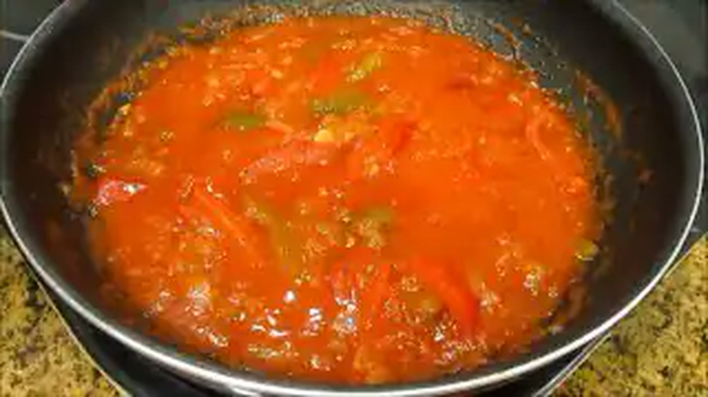
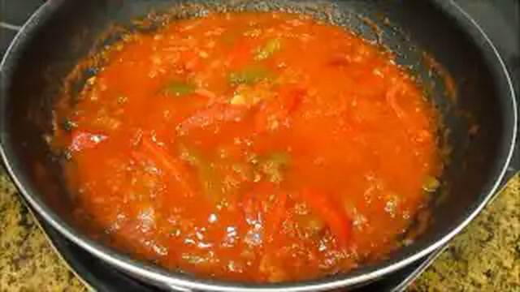
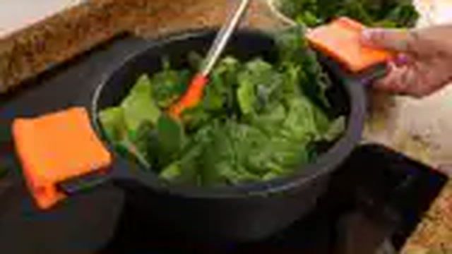
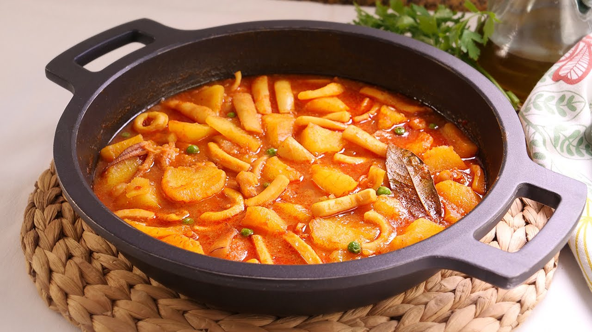
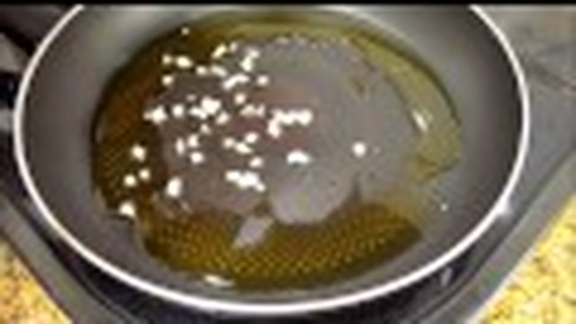
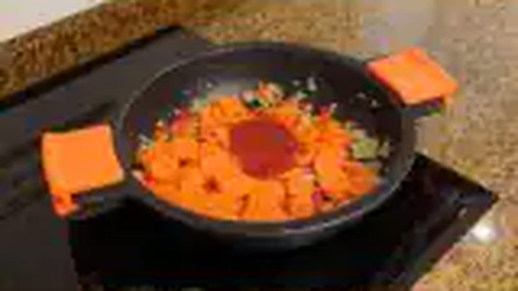
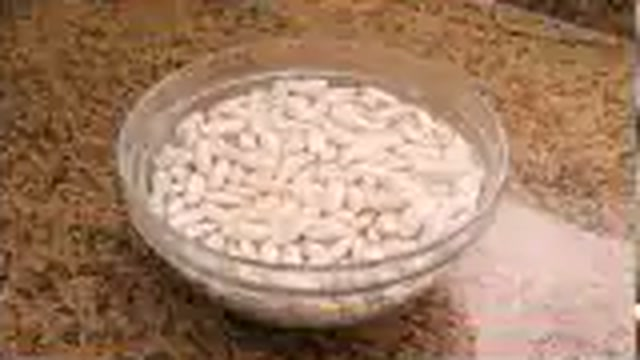
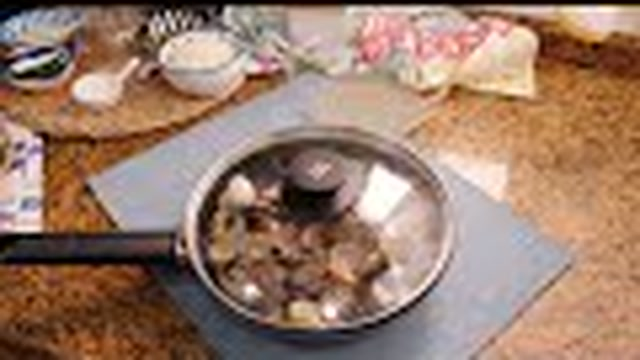
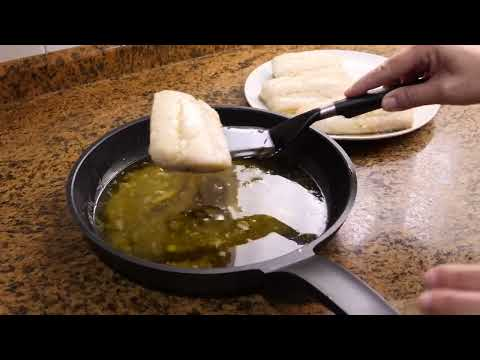

# 🐟 RECETARIO MAESTRO: PESCADOS, MARISCOS, LEGUMBRES Y ARROCES TRADICIONALES
> **Basado en la tradición culinaria, técnicas caseras y sofritos del canal *Cocina con Carmen***  
> *Compilado y estandarizado por el Chef Investigador Especialista en Cocina Marinera y Tradición Ibérica*

---

## 🧭 INTRODUCCIÓN TÉCNICA Y PRINCIPIOS DE LA COCINA DE CARMEN

La cocina tradicional española —y muy especialmente la de inspiración andaluza y marinera que abandera Carmen— se fundamenta en cuatro pilares inmutables:
1. **La maestría del sofrito**: Paciencia, fuego medio-bajo, evaporación lenta del agua vegetal y caramelización sutil de azúcares naturales (cebolla traslúcida, ajo aromático sin amargor y tomate reducido hasta concentrar su pectina).
2. **El respeto termodinámico del pescado y marisco**: Coagulación precisa de proteínas (miosina entre 50-55°C, colágeno a 60°C). El pescado nunca se hierve con violencia; se escalfa o se confita en la salsa residual con calor pasivo y tapa.
3. **El almidón como agente de ligazón**: El chascado de la patata para liberar amilopectina en guisos (marmitakos, sepias), la harina sofrita en la salsa verde o el almidón de la legumbre mantecosa que espesa el caldo de forma natural.
4. **La ingeniería del Batch Cooking tradicional**: La cocina de cuchara gana con el reposo de 24 horas gracias a la maduración de los aromas hidrosolubles y liposolubles, pero exige una gestión rigurosa de las temperaturas de refrigeración, el enfriamiento rápido y técnicas de regeneración que no destruyan la jugosidad de las proteínas marinas.

---

## 📑 ÍNDICE GENERAL DE RECETAS

1. [🐟 Merluza en Salsa Verde Tradicional con Almejas y Gambas](#1--merluza-en-salsa-verde-tradicional-con-almejas-y-gambas)
2. [🐟 Bacalao al Ajoarriero Tradicional con Pimientos Asados y Tomate](#2--bacalao-al-ajoarriero-tradicional-con-pimientos-asados-y-tomate)
3. [🍲 Potaje de Garbanzos con Bacalao y Espinacas Frescas (Guiso de Cuaresma)](#3--potaje-de-garbanzos-con-bacalao-y-espinacas-frescas-guiso-de-cuaresma)
4. [🍲 Marmitako Tradicional de Bonito del Norte con Patatas Chascadas](#4--marmitako-tradicional-de-bonito-del-norte-con-patatas-chascadas)
5. [🦑 Calamares en su Tinta Caseros con Arroz Blanco de Acompañamiento](#5--calamares-en-su-tinta-caseros-con-arroz-blanco-de-acompañamiento)
6. [🥘 Arroz Caldoso Marinero con Rape, Gambones y Mejillones](#6--arroz-caldoso-marinero-con-rape-gambones-y-mejillones)
7. [🍲 Fabada Rápida Casera de Carmen con Compango Asturiano](#7--fabada-rápida-casera-de-carmen-con-compango-asturiano)
8. [🦪 Almejas a la Marinera Tradicionales con Vino Fino y Pimentón](#8--almejas-a-la-marinera-tradicionales-con-vino-fino-y-pimentón)
9. [🥘 Guiso Marinero de Sepia con Patatas y Guisantes Tiernos](#9--guiso-marinero-de-sepia-con-patatas-y-guisantes-tiernos)
10. [🐟 Bacalao al Pil Pil (Técnica Tradicional con el Truco del Colador)](#10--bacalao-al-pil-pil-técnica-tradicional-con-el-truco-del-colador)

---

## 1. 🐟 Merluza en Salsa Verde Tradicional con Almejas y Gambas


> 📺 **Vídeo Oficial de Elaboración:** [Ver en YouTube: Merluza en Salsa Verde | Receta de Pescado muy Fácil y Rápida](https://www.youtube.com/watch?v=N0wn91UNU1A)


Una de las joyas cumbre de la cocina marinera: lomos gruesos de merluza cocinados en una emulsión sedosa de ajo, perejil fresco picado muy fino, vino blanco seco y el jugo yodado que desprenden las almejas al abrirse.

```
                    ┌───────────────────────────────┐
                    │    MERLUZA EN SALSA VERDE     │
                    │         CON ALMEJAS           │
                    └───────────────┬───────────────┘
                                    │
           ┌────────────────────────┴────────────────────────┐
           ▼                                                 ▼
┌──────────────────────┐                          ┌──────────────────────┐
│  SOFRITO & LIGAZÓN   │                          │ COCCIÓN PASIVA LOMOS │
│ Ajo laminado + AOVE  │                          │ Temp interna 52-54°C │
│ Harina tostada 1 min │                          │ Reposo tapado 3 min  │
│ Fino/Txakoli + Fumet │                          │ Emulsión natural     │
└──────────────────────┘                          └──────────────────────┘
```

### 📋 Ficha Resumen
- **Tiempo de preparación:** 15 minutos
- **Tiempo de cocción:** 20 minutos
- **Tiempo total:** 35 minutos
- **Dificultad:** Media-Baja
- **Raciones:** 4 personas
- **Coste estimado:** Medio-Alto (aprox. 3,80 € / ración)

### ⚠️ Declaración de Alérgenos (Reglamento UE 1169/2011)
- **Pescado** (Lomos de merluza y fumet)
- **Moluscos** (Almejas finas o babosas)
- **Crustáceos** (Gambas blancas o langostinos)
- **Gluten** (Harina de trigo para ligar el roux rubio; sustituible por almidón de maíz)
- **Sulfitos** (Vino blanco / fino)

### ⚖️ Ingredientes Exactos


| Ingrediente | Cantidad Exacta | Notas de Selección y Corte |
| :--- | :--- | :--- |
| **Lomos o rodajas de merluza limpia** | 800 g (4 lomos de 200 g) | Merluza de pincho o del Cantábrico con piel, sin espinas |
| **Almejas finas o babosas** | 350 g | Vivas, bien purgadas en agua con sal marina gruesa |
| **Gambas blancas o langostinos crudos** | 200 g (12-16 uds) | Frescas, peladas (reservar cabezas para el fumet) |
| **Dientes de ajo morado** | 4 unidades (20 g) | Pelados y picados en brunoise milimétrica |
| **Perejil fresco de hoja lisa** | 25 g (un manojo generoso) | Sólo las hojas, lavadas, secadas y picadas finísimas a cuchillo |
| **Harina de trigo común (o Maizena)** | 18 g (1 cucharada sopera rasa) | Tamizada para evitar grumos |
| **Vino blanco seco (o Fino de Jerez / Manzanilla)** | 100 ml | Buena acidez, nunca vino de baja calidad |
| **Caldo de pescado casero (Fumet)** | 350 ml | Elaborado con espinas de merluza, cabezas de gamba y puerro |
| **Aceite de oliva virgen extra (AOVE)** | 60 ml (4 cucharadas soperas) | Variedad hojiblanca o picual suave |
| **Sal marina fina** | 6 g (al gusto) | Ajustar tras la apertura de las almejas |
| **Pimienta blanca molida** | 1 g | Opcional, toque aromático |

### 🍳 Equipamiento Necesario
- Cazuela ancha y baja (tipo cazuela de barro refractaria o sauté de acero inoxidable de 30-32 cm de diámetro).
- Cuchillo de chef cebollero y tabla de corte.
- Colador fino de malla metálica.
- Espátula de madera o silicona.
- Tapa hermética para la cazuela.

### 👨‍🍳 Paso a Paso Técnico y Minucioso


1. **Purga de almejas:** Disponer las almejas en un cuenco con abundante agua fría y 35 g de sal por litro durante al menos 1 hora para expulsar cualquier resto de arena. Escurrir y enjuagar con agua fría corriente.
2. **Preparación del pescado:** Secar los lomos de merluza con papel absorbente. Salar ligeramente por ambas caras 10 minutos antes de cocinar para compactar la fibra muscular.
3. **Elaboración de la base aromática:** Poner la cazuela a fuego medio-bajo con los 60 ml de AOVE. Añadir el ajo picado. Dejar que comience a "bailar" y soltar aroma durante 1-2 minutos sin que tome color dorado oscuro (si se dora en exceso amargará la salsa verde).
4. **Creación del roux y desglasado:** Añadir la cucharada de harina (18 g) y remover constantemente con cuchara de madera durante 60-90 segundos para cocinar el almidón y eliminar el sabor a crudo. Verter los 100 ml de vino blanco/fino y remover con brío hasta que evapore el alcohol durante 2 minutos.
5. **Incorporación del caldo y perejil:** Añadir los 350 ml de fumet caliente poco a poco sin dejar de mover en vaivén la cazuela para crear una velouté ligera y homogénea. Agregar 3/4 partes del perejil picado. Dejar hervir suavemente 3 minutos hasta que la salsa espese ligeramente.
6. **Cocción de almejas y merluza:** 
   - Introducir los lomos de merluza con la piel hacia abajo en la cazuela.
   - Distribuir las almejas alrededor de los lomos.
   - Tapar la cazuela herméticamente y mantener a fuego medio-bajo durante 4 minutos exactos.
7. **Adición de gambas y ligado por vaivén:** Destapar; comprobar que las almejas han abierto (descartar las que permanezcan cerradas). Añadir los cuerpos de las gambas peladas. Mover la cazuela con movimientos circulares en vaivén sobre el fuego para que la gelatina de la merluza y el jugo de las almejas emulsionen la salsa.
8. **Punto final y reposo:** Apagar el fuego cuando el centro de la merluza alcance 52-54°C (aspecto blanco nacarado y láminas que se separan con leve presión). Espolvorear el resto del perejil fresco por encima, reposar 2 minutos tapado fuera del fuego y servir de inmediato.


### 🧊 Conservación y Seguridad en Batch Cooking
- **Refrigeración (3-4°C):** Hasta 48 horas en recipiente hermético de vidrio cubierto por su propia salsa.
- **Congelación (-18°C):** **Desaconsejada** para el conjunto. La merluza cocinada pierde agua al descongelar y queda estropajosa, mientras que las almejas se resecan y encogen.
- **Microbiología marina:** Los mariscos bivalvos y la merluza deben enfriarse rápidamente (bajar de 60°C a <10°C en menos de 90 minutos mediante baño maría inverso con hielos antes de meter a la nevera) para evitar proliferación bacteriana.

### ♨️ Guía de Regeneración Óptima
- **En cazuela / sartén (Método preferente):** Disponer la merluza y su salsa en una sartén a fuego muy suave (al 2 de 9). Añadir 2 cucharadas de fumet o agua para reponer la humedad evaporada. Tapar y dejar atemperar durante 4-5 minutos sin dejar que la salsa vuelva a hervir a borbotones (máximo 65°C en la salsa) para que el pescado no se sobrecueza.
- **Microondas:** Potencia reducida al 40% (aprox. 320W) durante 2 minutos y medio, tapado siempre con campana plástica apta para conservar el vapor.

---

## 2. 🐟 Bacalao al Ajoarriero Tradicional con Pimientos Asados y Tomate



> 📺 **Vídeo Oficial de Elaboración:** [Ver en YouTube: Bacalao con Tomate fácil y delicioso](https://www.youtube.com/watch?v=TNjGDWUjEg8)


Guiso emblemático de arrieros y pescadores de la ribera navarra y vasca, perfeccionado por Carmen mediante el confitado lento del bacalao desmigado junto a un sofrito denso de cebolla, ajos, pimientos del piquillo/morrones asados y tomate frito casero concentrado.

```
                    ┌───────────────────────────────┐
                    │     BACALAO AL AJOARRIERO     │
                    │       TRADICIONAL CASERO      │
                    └───────────────┬───────────────┘
                                    │
           ┌────────────────────────┴────────────────────────┐
           ▼                                                 ▼
┌──────────────────────┐                          ┌──────────────────────┐
│  SOFRITO CONCENTRADO │                          │ CONFITADO BACALAO    │
│ Pimientos + Cebolla  │                          │ Aceite aromatizado   │
│ Tomate frito casero  │                          │ Emulsión con gelatina│
│ Guindilla + Pimentón │                          │ Fuego lento 8-10 min │
└──────────────────────┘                          └──────────────────────┘
```

### 📋 Ficha Resumen
- **Tiempo de preparación:** 20 minutos
- **Tiempo de cocción:** 35 minutos
- **Tiempo total:** 55 minutos
- **Dificultad:** Media
- **Raciones:** 4-6 personas
- **Coste estimado:** Medio (aprox. 2,90 € / ración)

### ⚠️ Declaración de Alérgenos (Reglamento UE 1169/2011)
- **Pescado** (Bacalao desalado)
- *Libre de gluten de forma natural (verificar pimentón puro y tomate sin espesantes)*
- *Libre de lácteos y huevo*

### ⚖️ Ingredientes Exactos


| Ingrediente | Cantidad Exacta | Notas de Selección y Corte |
| :--- | :--- | :--- |
| **Bacalao desalado desmigado o en tacos finos** | 700 g | Bacalao de buena curación desalado en agua fría durante 48h |
| **Pimientos del piquillo (o morrones asados)** | 250 g | Cortados en tiras finas de 5 mm |
| **Pimiento verde italiano** | 150 g (1 unidad grande) | Picado en brunoise fina |
| **Cebolla dulce o reca** | 250 g (1 unidad grande) | Picada en brunoise fina |
| **Dientes de ajo morado** | 6 unidades (30 g) | Fileteados en láminas regulares |
| **Tomate triturado natural (o frito casero)** | 350 g | Reducido a fuego lento |
| **Pimentón dulce de la Vera D.O.P.** | 5 g (1 cucharadita) | De calidad ahumada |
| **Guindilla seca / Cayena** | 1 unidad | Sin semillas (ajustar picante al gusto) |
| **Aceite de oliva virgen extra (AOVE)** | 100 ml | Para confitar ajos y bacalao |
| **Sal marina fina** | 3 g (probar antes) | El bacalao ya aporta salazón residual |
| **Perejil fresco picado** | 10 g | Para decorar al final |

### 🍳 Equipamiento Necesario
- Cazuela de barro esmaltado o sartén honda de hierro fundido (28-30 cm).
- Cuchillo cebollero y tabla de madera/polietileno.
- Espumadera y cuchara de madera.
- Escurridor para el bacalao.

### 👨‍🍳 Paso a Paso Técnico y Minucioso


1. **Desalado y secado del bacalao:** Desalar el bacalao cambiando el agua cada 8 horas en frigorífico durante 48 horas. Escurrir muy bien y desmigar en lascas o tiras medianas de unos 3-4 cm con las manos, retirando cualquier espina residual. Secar con paño limpio.
2. **Confitado inicial de ajos y bacalao:** En la cazuela, calentar los 100 ml de AOVE con los ajos laminados y la cayena a fuego muy suave (90-100°C). Cuando los ajos comiencen a dorarse levemente, añadir las lascas de bacalao. Confitar durante 3 minutos removiendo para que el bacalao suelte su gelatina blanca (albúmina). Retirar el bacalao y los ajos a un plato, conservando todo el aceite y la gelatina en la cazuela.
3. **Elaboración del sofrito aromático:** En el mismo aceite aromatizado, añadir la cebolla picada y el pimiento verde. Pochar a fuego medio-bajo durante 15 minutos con una pizca de sal, hasta que la cebolla esté melosa y caramelizada.
4. **Incorporación de pimientos y tomate:** Agregar las tiras de pimiento del piquillo asado. Rehogar 3 minutos para que se integren. Añadir el pimentón dulce de la Vera fuera del fuego directo, remover 15 segundos para no quemarlo y verter de inmediato el tomate triturado. Cocinar a fuego lento durante 10-12 minutos hasta obtener una salsa espesa y brillante donde el aceite empiece a aflorar en la superficie.
5. **Ensamblaje y ligado final:** Reincorporar el bacalao confitado, los ajos y todo el jugo de gelatina que haya soltado en el plato.
6. **Cocción integrada:** Mantener a fuego muy suave durante 5-6 minutos, realizando movimientos circulares y de vaivén con la cazuela para que el aceite, el tomate y la gelatina del bacalao liguen en una textura untuosa y homogénea.
7. **Punto y reposo:** Rectificar de sal si fuera necesario. Retirar del fuego y dejar reposar 10 minutos tapado antes de degustar con pan rústico.


### 🧊 Conservación y Seguridad en Batch Cooking
- **Refrigeración (3-4°C):** Excelente para Batch Cooking. Se conserva en perfecto estado hasta **4 días** en recipiente hermético de vidrio. De hecho, tras 24 horas los sabores del pimiento, el ajo y el bacalao se redondean exponencialmente.
- **Congelación (-18°C):** Apto para congelar hasta **2 meses**. El bacalao en lascas guisado tolera mejor la congelación que los lomos enteros, aunque puede soltar algo de líquido al descongelar que se reemulsiona al calentar.

### ♨️ Guía de Regeneración Óptima
- **En cazuela / sartén:** Verter en sartén a fuego medio-bajo, añadir 1 cucharada de agua o caldo suave y remover constantemente durante 4-5 minutos hasta que esté bien caliente y vuelva a brillar.
- **Microondas:** 2 minutos a 600W en recipiente tapado, remover a mitad de tiempo para uniformizar la temperatura interna.

---

## 3. 🍲 Potaje de Garbanzos con Bacalao y Espinacas Frescas (Guiso de Cuaresma)


> 📺 **Vídeo Oficial de Elaboración:** [Ver en YouTube: Garbanzos con Bacalao y Espinacas - Potaje Fácil, Rápido y Delicioso](https://www.youtube.com/watch?v=dTxbi-ma7zQ)


El gran clásico de la cocina de vigilia andaluza y española. Carmen utiliza un "majado" tradicional de pan frito, ajos, comino y pimentón que otorga una densidad inigualable al caldo, combinado con la cremosidad del garbanzo y el toque fresco de la espinaca.

```
                    ┌───────────────────────────────┐
                    │      POTAJE DE CUARESMA       │
                    │     GARBANZOS CON BACALAO     │
                    └───────────────┬───────────────┘
                                    │
           ┌────────────────────────┴────────────────────────┐
           ▼                                                 ▼
┌──────────────────────┐                          ┌──────────────────────┐
│  MAJADO TRADICIONAL  │                          │ COCCIÓN Y ENSAMBLAJE │
│ Pan frito + Ajo frito│                          │ Garbanzos tiernos    │
│ Comino + Pimentón    │                          │ Espinacas marchitas  │
│ Caldo triturado      │                          │ Bacalao final 4 min  │
└──────────────────────┘                          └──────────────────────┘
```

### 📋 Ficha Resumen
- **Tiempo de preparación:** 15 minutos (más remojo previo)
- **Tiempo de cocción:** 1 hora 15 min (en olla tradicional) o 25 min (en olla exprés)
- **Tiempo total:** 1 hora 30 minutos
- **Dificultad:** Media-Baja
- **Raciones:** 6 personas
- **Coste estimado:** Económico (aprox. 1,60 € / ración)

### ⚠️ Declaración de Alérgenos (Reglamento UE 1169/2011)
- **Pescado** (Bacalao desalado)
- **Gluten** (Rebanada de pan del majado; sustituible por pan sin gluten o almendras tostadas)
- **Huevo** (Huevo cocido picado de guarnición tradicional; opcional)

### ⚖️ Ingredientes Exactos


| Ingrediente | Cantidad Exacta | Notas de Selección y Corte |
| :--- | :--- | :--- |
| **Garbanzos pedrosillano o lechoso** | 400 g (en seco) | Puestos en remojo 12h en agua templada con sal |
| **Bacalao desalado en tacos limpios** | 350 g | Desalado, sin espinas, cortado en cubos de 3 cm |
| **Espinacas frescas en hojas** | 300 g | Lavadas y troceadas (o 200 g descongeladas y escurridas) |
| **Cebolla blanca grande** | 200 g | 1 unidad picada fina para el sofrito |
| **Tomate maduro triturado** | 150 g | Sin piel ni semillas |
| **Dientes de ajo morado** | 5 unidades (25 g) | 3 para el majado, 2 para el sofrito |
| **Rebanada de pan del día anterior** | 30 g (1 rebanada) | De hogaza de trigo |
| **Pimentón dulce de la Vera** | 6 g (1 cucharadita colmada) | Ahumado artesanal |
| **Comino en grano (o molido)** | 2 g (1/2 cucharadita) | Clave digestivo y aromático tradicional |
| **Hoja de laurel seco** | 2 unidades | Enteras |
| **Huevos camperos** | 2 unidades | Cocidos durante 10 min, pelados y picados |
| **Aceite de oliva virgen extra (AOVE)** | 60 ml | Para freír pan, ajos y sofrito |
| **Agua mineral o fumet suave** | 1.400 ml | Para la cocción de los garbanzos |
| **Sal marina fina** | 6 g (ajustar al final) | Controlar por la salazón del bacalao |

### 🍳 Equipamiento Necesario
- Olla profunda de fondo grueso (o cazuela de hierro fundido / olla exprés).
- Sartén pequeña para freír el majado.
- Mortero tradicional de piedra/cerámica (o vaso de batidora).
- Espumadera y cucharón de servicio.

### 👨‍🍳 Paso a Paso Técnico y Minucioso


1. **Remojo y cocción inicial de garbanzos:** Tras 12 horas de remojo en agua templada con una pizca de bicarbonato o sal, escurrir los garbanzos. Poner en la olla 1,4 litros de agua o caldo suave con las 2 hojas de laurel y media cebolla. Llevar a ebullición. **Regla de oro:** Introducir siempre los garbanzos cuando el agua esté hirviendo a borbotones para evitar que queden duros (hollejo encallado). Cocer a fuego lento espumando las impurezas durante 1 hora (o 20-25 minutos en olla a presión rápida).
2. **Elaboración del majado de Carmen:** 
   - En una sartén pequeña con 30 ml de AOVE, freír los 3 dientes de ajo enteros y la rebanada de pan hasta que estén dorados y crujientes.
   - Pasar los ajos fritos y el pan al mortero (o vaso batidor). Añadir los granos de comino, el pimentón dulce y un cucharón de caldo caliente de los garbanzos.
   - Majar o triturar enérgicamente hasta obtener una pasta densa y uniforme.
3. **El sofrito base:** En la misma sartén con el aceite restante (30 ml), pochar la cebolla picada con los 2 ajos restantes durante 8-10 minutos. Añadir el tomate triturado y cocinar a fuego lento durante 8 minutos hasta que reduzca por completo.
4. **Integración del guiso:** Cuando los garbanzos estén tiernos, verter en la olla el sofrito de tomate y cebolla junto con el majado del mortero. Remover en vaivén para que el caldo tome cuerpo y color inmediatamente. Dejar cocer el conjunto a fuego suave durante 10 minutos.
5. **Incorporación de espinacas:** Añadir las espinacas frescas cortadas a la olla. Aunque ocupen mucho volumen inicial, reducirán y se integrarán en apenas 3-4 minutos de cocción suave.
6. **Punto final del bacalao:** Incorporar los tacos de bacalao desalado sumergiéndolos suavemente entre los garbanzos. Cocinar a fuego muy lento durante solo 4 minutos. El calor del guiso cocinará el bacalao a la perfección sin resecarlo ni romper sus lascas.
7. **Reposo y presentación:** Apagar el fuego, rectificar de sal, añadir el huevo duro picado por encima y dejar reposar 15 minutos antes de servir.



### 🧊 Conservación y Seguridad en Batch Cooking
- **Refrigeración (3-4°C):** Excepcional para Batch Cooking. Aguanta de **3 a 4 días**. El caldo espesa con el reposo gracias a los almidones de la legumbre.
- **Congelación (-18°C):** Se puede congelar hasta **3 meses** en recipientes herméticos dejando 2 cm libres en la parte superior. Las espinacas y el garbanzo congelan bien; el bacalao mantiene su sabor aunque pierde una mínima firmeza.
- **Consejo de textura:** Si al día siguiente el caldo está excesivamente denso, añadir 50-70 ml de agua caliente o caldo al calentar.

### ♨️ Guía de Regeneración Óptima
- **En olla / cazo:** Verter la porción a fuego medio-bajo, tapar y remover suavemente con espátula de abajo hacia arriba para no romper los garbanzos ni el bacalao durante 5-6 minutos.
- **Microondas:** Calentar 3 minutos a potencia media (600W), reposar 1 minuto para distribución del calor.

---

## 4. 🍲 Marmitako Tradicional de Bonito del Norte con Patatas Chascadas



> 📺 **Vídeo Oficial de Elaboración:** [Ver en YouTube: Patatas con Calamares - Guiso tradicional muy Fácil y Delicioso](https://www.youtube.com/watch?v=xKHBBhtAmGg)


El guiso marinero por excelencia del mar Cantábrico. El secreto de Carmen radica en el "chascado" de las patatas para que la amilopectina ligue el caldo con la pulpa de pimiento choricero, y en apagar el fuego en el instante justo en que entra el bonito para que se cocine exclusivamente con el calor residual.

```
                    ┌───────────────────────────────┐
                    │      MARMITAKO DE BONITO      │
                    │      DEL NORTE TRADICIONAL    │
                    └───────────────┬───────────────┘
                                    │
           ┌────────────────────────┴────────────────────────┐
           ▼                                                 ▼
┌──────────────────────┐                          ┌──────────────────────┐
│  PATATAS CHASCADAS   │                          │ COCCIÓN BONITO 55°C  │
│ Liberación almidón   │                          │ En dados de 2.5 cm   │
│ Pulpa choricero + ajo│                          │ Fuego APAGADO        │
│ Fumet de espinas 20m │                          │ Reposo tapado 5 min  │
└──────────────────────┘                          └──────────────────────┘
```

### 📋 Ficha Resumen
- **Tiempo de preparación:** 20 minutos
- **Tiempo de cocción:** 30 minutos
- **Tiempo total:** 50 minutos
- **Dificultad:** Media
- **Raciones:** 4 personas
- **Coste estimado:** Medio (aprox. 3,20 € / ración en temporada de bonito)

### ⚠️ Declaración de Alérgenos (Reglamento UE 1169/2011)
- **Pescado** (Bonito del norte fresco y caldo de espinas/fumet)
- *Libre de gluten de forma natural*
- *Libre de lácteos, huevos y crustáceos*

### ⚖️ Ingredientes Exactos


| Ingrediente | Cantidad Exacta | Notas de Selección y Corte |
| :--- | :--- | :--- |
| **Bonito del Norte o Atún fresco limpio** | 600 g | Limpio de piel y espinas negras, cortado en dados de 2,5 cm |
| **Patatas monalisa o kennebec (para guisar)** | 800 g (4 patatas medianas) | Peladas y chascadas a cuchillo |
| **Pimiento verde italiano** | 120 g (1 unidad) | Picado en brunoise fina |
| **Pimiento rojo morrón** | 100 g (1/2 unidad) | Picado en brunoise fina |
| **Cebolla dulce** | 200 g (1 grande) | Picada en brunoise fina |
| **Dientes de ajo morado** | 3 unidades (15 g) | Muy picados |
| **Carne o pulpa de pimiento choricero** | 30 g (2 cucharaditas colmadas) | Rehidratada o de tarro de calidad artesanal |
| **Tomate maduro triturado** | 120 g (3 cucharadas) | Frito o reducido |
| **Vino blanco seco o Txakoli** | 80 ml | Para desglasar el fondo |
| **Fumet de pescado casero (de espinas de bonito)** | 900 ml | Caliente |
| **Aceite de oliva virgen extra (AOVE)** | 60 ml | |
| **Pimentón dulce (o agridulce)** | 4 g (1 cucharadita) | |
| **Hoja de laurel** | 1 unidad | |
| **Sal marina fina** | 6 g (al gusto) | |

### 🍳 Equipamiento Necesario
- Cazuela de fondo difusor ancho o marmita de hierro esmaltado (Cocotte).
- Cuchillo puntilla para chascar patatas.
- Tabla de corte y espátula de madera.

### 👨‍🍳 Paso a Paso Técnico y Minucioso


1. **Técnica de chascado de la patata:** Pelar las patatas y lavarlas. Introducir el cuchillo de puntilla 1 cm y tirar haciendo palanca para romper ("chascar" o "cascar") el trozo con un chasquido seco. Este corte irregular expone las celdas de almidón abiertas, lo que espesará el caldo de forma natural sin necesidad de añadir harinas.
2. **Sofrito marinero:** En la cazuela con los 60 ml de AOVE, pochar a fuego medio la cebolla, el pimiento verde, el pimiento rojo y el ajo durante 12-14 minutos con una pizca de sal, hasta que las verduras estén completamente pochadas y tiernas.
3. **Especiado y desglasado:** Añadir la pulpa de pimiento choricero, el pimentón dulce y el tomate triturado. Rehogar 2 minutos sin dejar de remover. Verter el vino blanco/txakoli y raspar el fondo con la espátula para rescatar los azúcares caramelizados. Dejar evaporar el alcohol 2 minutos.
4. **Rehogado de patatas:** Añadir las patatas chascadas a la cazuela y rehogarlas durante 3 minutos junto al sofrito para que se impregnen de los aromas y aceites coloreados.
5. **Cocción en caldo:** Cubrir con el fumet caliente (unos 900 ml, justo hasta tapar las patatas sin ahogarlas) y añadir la hoja de laurel. Llevar a ebullición, bajar el fuego al mínimo, tapar y cocer a fuego lento durante 20-25 minutos, hasta que las patatas estén tiernas como mantequilla al pincharlas con la punta del cuchillo.
6. **El secreto del punto del bonito (Crucial):** 
   - Salpimentar los dados de bonito fresco.
   - Con las patatas ya listas, **apagar el fuego por completo**.
   - Introducir los dados de bonito en la cazuela distribuyéndolos uniformemente y sumergiéndolos en el caldo hirviente.
   - Tapar la cazuela herméticamente y dejar reposar durante **4 a 5 minutos exactos** fuera del fuego.
   - El calor residual de la marmita cocinará el bonito hasta alcanzar una temperatura interna de 52-55°C: jugoso, rosado en el corazón y sin la textura seca/estropajosa que produce hervirlo.
7. **Servicio:** Espolvorear con perejil fresco picado y servir en plato hondo.


### 🧊 Conservación y Seguridad en Batch Cooking
- **Refrigeración (3-4°C):** **Máximo 48 horas**. La patata guisada sufre un proceso de retrogradación del almidón que puede alterar levemente su textura a partir del tercer día, volviéndose arenosa.
- **Congelación (-18°C):** **TERMINANTEMENTE DESACONSEJADA**. La patata cocida congelada cristaliza el agua celular, destruyendo su estructura y quedando gomosa y acuosa al descongelar.
- **Protocolo de enfriamiento:** Bajar de temperatura rápidamente colocando la base de la cazuela en agua fría antes de introducir en refrigeración.

### ♨️ Guía de Regeneración Óptima
- **En cazuela a fuego mínimo:** Calentar muy despacio sin remover con cuchara (sólo mover la cazuela por las asas para no aplastar la patata ni romper el bonito). Añadir 3 cucharadas de agua o fumet si ha espesado mucho. Retirar en cuanto humee (unos 65°C), sin llegar a hervir.

---

## 5. 🦑 Calamares en su Tinta Caseros con Arroz Blanco de Acompañamiento


> 📺 **Vídeo Oficial de Elaboración:** [Ver en YouTube: Arroz Negro con Calamares y Sepia](https://www.youtube.com/watch?v=NK1gmcS9qwA)


Guiso de salsa negra aterciopelada, profunda y brillante, donde la dulzura de la cebolla muy pochada contrarresta la salinidad yodada de la tinta natural del cefalópodo.

```
                    ┌───────────────────────────────┐
                    │     CALAMARES EN SU TINTA     │
                    │        TRADICIONALES          │
                    └───────────────┬───────────────┘
                                    │
           ┌────────────────────────┴────────────────────────┐
           ▼                                                 ▼
┌──────────────────────┐                          ┌──────────────────────┐
│  CEBOLLA CARAMELIZADA│                          │ COCCIÓN CALAMAR      │
│ 3 cebollas a fuego   │                          │ Sellado previo       │
│ muy lento (25 min)   │                          │ Salsa triturada/fina │
│ Tinta disuelta vino  │                          │ Guiso lento 35-40 min│
└──────────────────────┘                          └──────────────────────┘
```

### 📋 Ficha Resumen
- **Tiempo de preparación:** 25 minutos
- **Tiempo de cocción:** 45 minutos
- **Tiempo total:** 1 hora 10 minutos
- **Dificultad:** Media
- **Raciones:** 4 personas
- **Coste estimado:** Medio (aprox. 3,10 € / ración)

### ⚠️ Declaración de Alérgenos (Reglamento UE 1169/2011)
- **Moluscos** (Calamares limpios y bolsas de tinta natural)
- **Sulfitos** (Vino blanco o vino fino)
- *Libre de gluten de forma natural (si no se añade pan ni harina para espesar)*

### ⚖️ Ingredientes Exactos


| Ingrediente | Cantidad Exacta | Notas de Selección y Corte |
| :--- | :--- | :--- |
| **Calamares frescos o chipirones limpios** | 1.000 g (1 kg entero = 750 g limpio) | Limpios, cuerpos en anillas de 1,5 cm y tentáculos enteros |
| **Cebolla morada o dulce** | 500 g (3 cebollas grandes) | La base de la salsa; picada en brunoise |
| **Dientes de ajo morado** | 4 unidades (20 g) | Picados muy finos |
| **Pimiento verde italiano** | 100 g (1 unidad pequeña) | Picado fino |
| **Tomate maduro rallado** | 120 g (1 tomate grande) | Sin piel |
| **Tinta de calamar (natural o comercial)** | 4 bolsitas (16 g) | Disueltas en el vino |
| **Vino blanco seco (o Manzanilla de Sanlúcar)** | 120 ml | |
| **Caldo de pescado o agua** | 250 ml | Templado |
| **Aceite de oliva virgen extra (AOVE)** | 60 ml | |
| **Sal marina fina y pimienta negra** | 5 g sal + 1 g pimienta | |
| **Arroz blanco tipo jazmín o bomba (guarnición)**| 240 g en seco | Cocido con 1 diente de ajo y 1 hoja de laurel |

### 🍳 Equipamiento Necesario
- Cazuela ancha y honda de hierro o acero inoxidable.
- Batidora de brazo o vaso americano (para colar y refinar la salsa).
- Colador chino de malla fina.

### 👨‍🍳 Paso a Paso Técnico y Minucioso


1. **Limpieza del calamar:** Limpiar los calamares retirando la pluma transparente, tripas y boca. Conservar la piel fina si se desea mayor sabor o pelar para acabado blanco. Cortar los tubos en anillas de 1,5 cm de grosor y los tentáculos en 2-3 piezas. Secar meticulosamente con papel de cocina.
2. **Sellado a alta temperatura:** En la cazuela bien caliente con 2 cucharadas de AOVE a fuego vivo, saltear los calamares durante 2 minutos hasta que cambien de color y suelten el exceso de agua. Retirar los calamares y reservar su jugo escurrido en un cuenco.
3. **El pochado negro de la cebolla:** En la misma cazuela con el resto del AOVE, añadir la gran cantidad de cebolla picada, el pimiento verde y los ajos con una pizca de sal. Pochar a fuego muy lento durante 20-25 minutos. La cebolla debe quedar completamente transparente, reducida a una cuarta parte y con un tono dorado caramelo natural.
4. **Tomate y desglasado con tinta:** Añadir el tomate rallado y cocinar 5 minutos. En un vaso, mezclar el vino blanco con las 4 bolsitas de tinta de calamar removiendo con un tenedor hasta disolver completamente. Verter sobre la cebolla y cocinar 3 minutos a fuego vivo para evaporar el alcohol.
5. **Triturado y refinado de la salsa (Toque Maestro de Carmen):** Pasar todo el sofrito negro por el vaso batidor junto con 150 ml de caldo de pescado. Triturar a máxima potencia durante 1 minuto y pasar por el colador chino de vuelta a la cazuela. Quedará una salsa negra de textura aterciopelada y brillante, sin tropezones de verdura.
6. **Cocción lenta del calamar:** Incorporar los calamares sellados y los jugos que soltaron a la salsa negra colada. Añadir el resto del caldo de pescado si la salsa estuviera muy densa. Tapar y guisar a fuego suave durante 30-35 minutos, hasta que el calamar esté tierno como mantequilla (comprobar pinchando con tenedor).
7. **Guarnición y emplatado:** Servir caliente acompañado de moldes de arroz blanco recién cocido con un toque de ajo sofrito.


### 🧊 Conservación y Seguridad en Batch Cooking
- **Refrigeración (3-4°C):** **Hasta 4 días**. Es uno de los mejores platos para preparar con antelación, ya que la tinta y el sofrito maduran ganando complejidad y perdiendo cualquier aspereza.
- **Congelación (-18°C):** **Excelente hasta 3 meses**. La salsa en su tinta protege la fibra del calamar de la desecación por congelación. Descongelar lentamente 24 horas en nevera.

### ♨️ Guía de Regeneración Óptima
- **En cazuela:** 4 minutos a fuego suave con 2 cucharadas de agua para fluidificar la salsa.
- **Microondas:** 2 minutos a 700W en plato hondo tapado.

---

## 6. 🥘 Arroz Caldoso Marinero con Rape, Gambones y Mejillones


> 📺 **Vídeo Oficial de Elaboración:** [Ver en YouTube: Sopa de Marisco y Pescado muy Fácil y Deliciosa](https://www.youtube.com/watch?v=tv3E8BPI3QY)


La apoteosis del arroz de costa andaluz: grano en su punto exacto de suspensión (*al dente* con corazón tierno), empapado en un caldo rojo intenso con base de ñora, azafrán en hebra, sofrito concentrado y marisco jugoso.

```
                    ┌───────────────────────────────┐
                    │     ARROZ CALDOSO MARINERO    │
                    │        DE COSTA CASERO        │
                    └───────────────┬───────────────┘
                                    │
           ┌────────────────────────┴────────────────────────┐
           ▼                                                 ▼
┌──────────────────────┐                          ┌──────────────────────┐
│ SALMORRETA / SOFRITO │                          │ PROPORCIÓN & TIEMPOS │
│ Ñora + Ajo + Tomate  │                          │ 1 parte arroz x 4.5  │
│ Azafrán tostado      │                          │ Fuego vivo 8 min     │
│ Fumet de roca rojo   │                          │ Fuego bajo 7 min     │
└──────────────────────┘                          └──────────────────────┘
```

### 📋 Ficha Resumen
- **Tiempo de preparación:** 20 minutos
- **Tiempo de cocción:** 25 minutos
- **Tiempo total:** 45 minutos
- **Dificultad:** Media-Alta (control crítico del tiempo de grano)
- **Raciones:** 4 personas
- **Coste estimado:** Medio-Alto (aprox. 3,90 € / ración)

### ⚠️ Declaración de Alérgenos (Reglamento UE 1169/2011)
- **Pescado** (Rape fresco y caldo de pescado de roca)
- **Crustáceos** (Gambones o langostinos)
- **Moluscos** (Mejillones de roca o almejas)
- *Libre de gluten de forma natural*

### ⚖️ Ingredientes Exactos


| Ingrediente | Cantidad Exacta | Notas de Selección y Corte |
| :--- | :--- | :--- |
| **Arroz tipo Bomba, Albufera o Senia** | 300 g (aprox. 75 g por persona) | Grano redondo de alta absorción |
| **Rape limpio en dados** | 350 g | Sin piel ni cartílago central (reservar cabeza para fumet) |
| **Gambones o langostinos enteros** | 8 unidades (aprox. 300 g) | Crudos, frescos o descongelados de calidad |
| **Mejillones limpios de roca** | 300 g | Desbarbados y limpios de adherencias exteriores |
| **Caldo de pescado de roca y marisco caliente** | 1.350 ml (proporción 1:4,5) | Elaborado con cabezas de gambón, morralla y verduras |
| **Cebolla picada fina** | 150 g (1 mediana) | |
| **Pimiento rojo morrón** | 80 g (1/2 unidad) | En brunoise pequeña |
| **Dientes de ajo morado** | 3 unidades (15 g) | Picados |
| **Tomate maduro triturado** | 120 g | |
| **Carne de ñora o pimiento choricero** | 15 g (1 cucharada) | |
| **Hebras de azafrán natural** | 15-20 hebras (0,1 g) | Ligeramente tostadas |
| **Pimentón dulce de la Vera** | 4 g (1 cucharadita) | |
| **Aceite de oliva virgen extra (AOVE)** | 60 ml | |
| **Sal marina fina** | 7 g (ajustar tras probar caldo) | |

### 🍳 Equipamiento Necesario
- Cazuela de barro esmaltada honda o paella/arrocera honda de hierro fundido (32 cm).
- Cazo para mantener el caldo a punto de hervor continuo.
- Pinzas y espumadera.

### 👨‍🍳 Paso a Paso Técnico y Minucioso


1. **Extracción aromática del marisco:** En la cazuela con los 60 ml de AOVE a fuego fuerte, marcar los gambones enteros durante 1 minuto por cada lado. Retirar a un plato. En el mismo aceite, sofreír los dados de rape durante 1 minuto y retirar junto a los gambones para evitar sobrecocinarlos.
2. **Elaboración de la salmorreta / sofrito:** Bajar a fuego medio. Añadir la cebolla, el pimiento rojo y el ajo picado. Pochar lentamente durante 10 minutos. Añadir la carne de ñora, el pimentón dulce, las hebras de azafrán y el tomate triturado. Reducir el sofrito durante 6-8 minutos hasta que caramelice y adquiera un tono caoba oscuro.
3. **Nacarado del arroz:** Añadir los 300 g de arroz a la cazuela. Remover con cuchara de madera durante 2 minutos a fuego medio para que el grano se impregne de grasa y se selle el almidón exterior ("nacarar").
4. **Cocción en caldo (Cronometraje estricto):** 
   - Verter los 1.350 ml de fumet de pescado hirviendo (temperatura 100°C) sobre el arroz nacarado.
   - **Minutos 1 a 8:** Fuego vivo / fuerte para que el grano baile y suelte parte del almidón en suspensión.
   - **Minutos 8 a 15:** Bajar a fuego medio-suave.
5. **Incorporación de pescados y mariscos:** 
   - En el **minuto 12** de cocción, incorporar los mejillones limpios crudos (se abrirán directamente con el vapor del arroz) y los dados de rape marcados.
   - En el **minuto 14**, colocar los gambones en la parte superior.
6. **Reposo y textura caldosa:** Apagar el fuego exactamente a los **15-16 minutos** de cocción (el arroz debe tener un punto crujiente milimétrico en su núcleo). Dejar reposar destapado durante 2-3 minutos. El arroz terminará de cocinarse con el calor residual, quedando con un grano entero, suelto y rodeado de un caldo untuoso y aromático.


### 🧊 Conservación y Seguridad en Batch Cooking
- **Conservación:** **PLATO DE CONSUMO INMEDIATO**. Los arroces caldosos NO son aptos para el Batch Cooking tradicional ya que el grano continúa absorbiendo caldo indefinidamente, pasando de caldoso a pastoso y perdiendo su textura en pocas horas.
- **Técnica Batch Cooking Profesional para Arroces (Separación de Bases):**
  - Preparar el sofrito/salmorreta y el fumet concentrado con días de antelación y refrigerar por separado hasta 4 días (o congelar).
  - En el momento de comer: calentar el caldo, sofreír el arroz 2 min con la base y cocer 15 minutos en directo.
- **Riesgo Sanitario (*Bacillus cereus*):** Si sobra arroz cocinado, enfriar a <5°C en menos de 2 horas. Nunca dejar arroces templados a temperatura ambiente durante más de 1 hora.

### ♨️ Guía de Regeneración Óptima
- Si se recalienta una porción sobrante: calentar 100 ml de caldo de pescado hasta hervir en un cazo, volcar el arroz sobrante y calentar a fuego vivo durante 90 segundos exactos.

---

## 7. 🍲 Fabada Rápida Casera de Carmen con Compango Asturiano


> 📺 **Vídeo Oficial de Elaboración:** [Ver en YouTube: Fabada Asturiana | Receta Tradicional Auténtica](https://www.youtube.com/watch?v=NvhuoE8ENGQ)


La versión inteligente y accesible de Carmen para disfrutar de una fabada sublime entre semana sin sacrificar sabor: utilizando alubias de granja cocidas de máxima calidad en conserva de cristal, emulsionadas con un sofrito de compango sofrito, pimentón y el almidón del propio caldo.

```
                    ┌───────────────────────────────┐
                    │      FABADA RÁPIDA CASERA     │
                    │       DE CARMEN (30 MIN)      │
                    └───────────────┬───────────────┘
                                    │
           ┌────────────────────────┴────────────────────────┐
           ▼                                                 ▼
┌──────────────────────┐                          ┌──────────────────────┐
│ COMPANGO SOFRITO     │                          │ EMULSIÓN & LIGAZÓN   │
│ Chorizo + Morcilla   │                          │ Fabes enjuagadas     │
│ Panceta curada dorada│                          │ 1 cacillo triturado  │
│ Desgrasado controlado│                          │ Chup-chup 15-20 min  │
└──────────────────────┘                          └──────────────────────┘
```

### 📋 Ficha Resumen
- **Tiempo de preparación:** 10 minutos
- **Tiempo de cocción:** 25 minutos
- **Tiempo total:** 35 minutos
- **Dificultad:** Muy Baja
- **Raciones:** 4 personas
- **Coste estimado:** Económico (aprox. 2,10 € / ración)

### ⚠️ Declaración de Alérgenos (Reglamento UE 1169/2011)
- *Libre de alérgenos mayores (Comprobar que el compango [morcilla/chorizo] no contenga trazas de gluten o lactosa según fabricante artesanal)*

### ⚖️ Ingredientes Exactos


| Ingrediente | Cantidad Exacta | Notas de Selección y Corte |
| :--- | :--- | :--- |
| **Alubias / Fabes cocidas en conserva de cristal**| 800 g (2 tarros de 400 g peso neto) | Variedad Granja o Judión, bien enteras |
| **Chorizo asturiano ahumado** | 150 g (1-2 piezas) | Pinchado con tenedor para soltar jugo |
| **Morcilla asturiana curada ahumada** | 150 g (1-2 piezas) | Entera, sin pinchar para que no se rompa |
| **Panceta curada o tocino entreverado** | 150 g (1 taco grueso) | Cortado en tiras de 1 cm |
| **Cebolla blanca** | 120 g (1 pequeña) | Picada en brunoise fina |
| **Dientes de ajo** | 2 unidades (10 g) | Picados |
| **Pimentón dulce de la Vera D.O.P.** | 5 g (1 cucharadita) | Ahumado |
| **Hebras de azafrán** | 8-10 hebras | |
| **Hoja de laurel** | 1 unidad | |
| **Caldo casero de carne o agua mineral** | 450 ml | Templado |
| **Aceite de oliva virgen extra (AOVE)** | 30 ml (2 cucharadas) | |
| **Sal marina fina** | 2-3 g (con moderación) | El compango aporta bastante sal |

### 🍳 Equipamiento Necesario
- Cazuela ancha de barro o hierro fundido (26-28 cm).
- Colador grande para enjuagar las fabes de conserva.
- Tenedor o pasapurés para triturar parte de la legumbre.

### 👨‍🍳 Paso a Paso Técnico y Minucioso


1. **Tratamiento de las alubias cocidas:** Volcar los botes de fabes en un colador grande y lavarlas bajo el grifo de agua fría con chorro muy suave para retirar el líquido de gobierno (gelatina de conservación) sin romper la piel. Escurrir delicadamente.
2. **Dorado del compango:** En la cazuela con 2 cucharadas de AOVE, dorar a fuego medio los tacos de panceta y el chorizo pinchado durante 4-5 minutos para que suelten sus grasas ahumadas y aromas. Retirar la mitad del exceso de grasa si se prefiere una fabada más ligera y digestiva.
3. **Sofrito base:** Añadir a la grasa aromatizada la cebolla picada y los ajos. Pochar a fuego suave durante 8 minutos hasta que estén tiernos. Añadir el azafrán, la hoja de laurel y el pimentón dulce, removiendo 15 segundos fuera del fuego.
4. **Integración de líquidos y cocción del compango:** Colocar la panceta, el chorizo y la morcilla entera (con sumo cuidado). Verter los 450 ml de caldo o agua templada. Dejar hervir suavemente durante 10 minutos para que el compango se cocine y perfume el caldo.
5. **Incorporación de las fabes:** Añadir con delicadeza las fabes cocidas escurridas a la cazuela, distribuyéndolas sin remover con cuchara metálica (mover siempre la cazuela en vaivén por las asas para no romper los hollejos).
6. **El truco de Carmen para espesar el caldo:** Retirar en una taza 3 cucharadas de fabes con un poco de caldo. Aplastarlas concienzudamente con un tenedor hasta formar un puré denso y devolverlo a la cazuela.
7. **El "Chup-chup" final:** Cocer todo junto a fuego muy lento durante 10-12 minutos destapado, moviendo la cazuela en círculos para que el almidón del puré ligue con la grasa del compango creando un caldo denso, untuoso y aterciopelado.
8. **Reposo:** Retirar del fuego y dejar reposar 10-15 minutos antes de servir el compango cortado en rodajas sobre los platos.


### 🧊 Conservación y Seguridad en Batch Cooking
- **Refrigeración (3-4°C):** **Hasta 4 días**. Guiso perfecto para Batch Cooking. Al enfriar la grasa solidifica en la superficie, lo que permite retirarla fácilmente con una cuchara si se desea desgrasar aún más antes de recalentar.
- **Congelación (-18°C):** **Apta hasta 3 meses**. Las alubias cocidas en caldo denso congelan francamente bien si no sufren choques térmicos bruscos.

### ♨️ Guía de Regeneración Óptima
- **En cazuela:** Calentar a fuego muy lento con tapa durante 6-7 minutos. Si el caldo ha quedado excesivamente espeso por el reposo, añadir 40-50 ml de agua caliente y agitar en vaivén.

---

## 8. 🦪 Almejas a la Marinera Tradicionales con Vino Fino y Pimentón


> 📺 **Vídeo Oficial de Elaboración:** [Ver en YouTube: Almejas a la Marinera ¡un plato delicioso y fácil de preparar!](https://www.youtube.com/watch?v=cuCcuOZ4KRk)


Un aperitivo o entrante marinero de alta alcurnia: almejas carnosas abiertas al vapor de un sofrito concentrado de ajo, cebolla, pimentón y vino de Jerez, ligadas con una salsa para mojar pan sin descanso.

```
                    ┌───────────────────────────────┐
                    │    ALMEJAS A LA MARINERA      │
                    │       TRADICIONALES           │
                    └───────────────┬───────────────┘
                                    │
           ┌────────────────────────┴────────────────────────┐
           ▼                                                 ▼
┌──────────────────────┐                          ┌──────────────────────┐
│  SOFRITO CONCENTRADO │                          │ APERTURA AL VAPOR    │
│ Brunoise finísima    │                          │ Fuego vivo con tapa  │
│ Harina tostada 1 min │                          │ 2 a 3 min máximo     │
│ Fino / Manzanilla    │                          │ Jugo yodado emulsionado│
└──────────────────────┘                          └──────────────────────┘
```

### 📋 Ficha Resumen
- **Tiempo de preparación:** 15 minutos (más purga de arena)
- **Tiempo de cocción:** 10 minutos
- **Tiempo total:** 25 minutos
- **Dificultad:** Baja
- **Raciones:** 4 personas (como entrante)
- **Coste estimado:** Medio-Alto (aprox. 3,50 € / ración según calidad de almeja)

### ⚠️ Declaración de Alérgenos (Reglamento UE 1169/2011)
- **Moluscos** (Almejas vivas)
- **Gluten** (Harina de trigo para ligazón; reemplazable por harina de arroz o almidón de maíz)
- **Sulfitos** (Vino blanco / fino)

### ⚖️ Ingredientes Exactos


| Ingrediente | Cantidad Exacta | Notas de Selección y Corte |
| :--- | :--- | :--- |
| **Almejas frescas (fina, babosa o japónica)** | 600 g | Vivas, conchas cerradas e intactas |
| **Cebolla dulce** | 120 g (1 pequeña) | Picada en brunoise milimétrica casi invisible |
| **Dientes de ajo morado** | 3 unidades (15 g) | Muy picados |
| **Harina de trigo (o Maizena)** | 12 g (1 cucharadita colmada) | Para espesar la salsa |
| **Pimentón dulce de la Vera** | 4 g (1 cucharadita rasa) | Aporta el color rojizo marinero clásico |
| **Guindilla cayena (opcional)** | 1 unidad pequeña | Para un toque picante sutil |
| **Vino Fino de Jerez, Manzanilla o blanco seco**| 100 ml | |
| **Caldo de pescado o agua** | 80 ml | |
| **Aceite de oliva virgen extra (AOVE)** | 45 ml (3 cucharadas) | |
| **Perejil fresco de hoja lisa picado** | 15 g | Abundante y recién picado |
| **Sal fina** | 1 g (atención al jugo salino) | |

### 🍳 Equipamiento Necesario
- Sartén amplia o cazuela baja (28 cm) con tapa hermética de cristal.
- Cuenco hondo para el remojo con sal.
- Cuchara de madera y espumadera.

### 👨‍🍳 Paso a Paso Técnico y Minucioso


1. **Desarenado meticuloso:** Sumergir las almejas en 1 litro de agua fría con 35 g de sal gorda durante mínimo 2 horas en la nevera, cambiando el agua a mitad de tiempo. Enjuagar con cuidado bajo el grifo.
2. **Sofrito de la salsa marinera:** Calentar los 45 ml de AOVE en la cazuela a fuego medio. Añadir la cayena, los ajos picados y la cebolla finísima con una pizca insignificante de sal. Pochar durante 8-10 minutos hasta que la cebolla esté tierna, transparente y fundente.
3. **Elaboración del roux rojizo:** Incorporar la cucharada de harina y remover durante 1 minuto para tostarla. Añadir el pimentón dulce de la Vera, mezclar 10 segundos y verter de inmediato el vino fino y los 80 ml de caldo/agua.
4. **Reducción:** Cocinar a fuego medio durante 2 minutos hasta que la salsa espese y evapore el olor a alcohol, formando una base aterciopelada color teja.
5. **Apertura de las almejas al vapor:**
   - Subir el fuego al máximo.
   - Añadir las almejas escurridas y repartirlas por la cazuela.
   - **Tapar de inmediato** con la tapa hermética.
   - Cocinar al vapor durante **2 a 3 minutos**.
6. **Emulsión y selección:** Destapar la cazuela; retirar de inmediato del fuego en cuanto la mayoría de las almejas estén abiertas. Desechar cualquier almeja que haya quedado completamente cerrada.
7. **Toque final:** Mover la cazuela en círculos para que el agua de mar liberada por las almejas se fusione con la salsa de pimentón. Espolvorear abundante perejil fresco picado y servir inmediatamente en cazuela caliente.


### 🧊 Conservación y Seguridad en Batch Cooking
- **Conservación:** **Consumo prioritario en el momento**. Las almejas recalentadas tienden a encogerse y volverse correosas como goma.
- **Refrigeración máxima:** 24 horas en frío intenso (2-3°C).
- **Técnica Batch Cooking para Salsa Marinera:** Se puede preparar la base del sofrito con pimentón, vino y harina con 3 días de antelación y guardarla en la nevera. En el momento del servicio: calentar el sofrito a fuego vivo, añadir las almejas frescas y abrir al vapor en 3 minutos.

### ♨️ Guía de Regeneración Óptima
- En sartén a fuego muy bajo con 2 cucharadas de agua, tapado solo 90 segundos hasta templar sin sobrecocinar el molusco.

---

## 9. 🥘 Guiso Marinero de Sepia con Patatas y Guisantes Tiernos


> 📺 **Vídeo Oficial de Elaboración:** [Ver en YouTube: Patatas con Calamares - Guiso tradicional muy Fácil y Delicioso](https://www.youtube.com/watch?v=xKHBBhtAmGg)


Un guiso tradicional de cuchara de los pueblos costeros andaluces. La sepia (o jibia) se cocina a fuego lento hasta alcanzar una textura tierna que se deshace en la boca, bañada en una salsa espesada por la patata pochada y el frescor verde del guisante.

```
                    ┌───────────────────────────────┐
                    │     GUISO DE SEPIA CASERO     │
                    │    CON PATATAS Y GUISANTES    │
                    └───────────────┬───────────────┘
                                    │
           ┌────────────────────────┴────────────────────────┐
           ▼                                                 ▼
┌──────────────────────┐                          ┌──────────────────────┐
│  ESTOFADO DE SEPIA   │                          │ CHASCADO & GUISANTES │
│ Sepia en dados 3 cm  │                          │ Patatas impregnadas  │
│ Sofrito pimiento/ajo │                          │ Fumet rojo 25 min    │
│ Vino blanco reducido │                          │ Guisantes últimos 5m │
└──────────────────────┘                          └──────────────────────┘
```

### 📋 Ficha Resumen
- **Tiempo de preparación:** 20 minutos
- **Tiempo de cocción:** 40 minutos
- **Tiempo total:** 1 hora
- **Dificultad:** Media-Baja
- **Raciones:** 4 personas
- **Coste estimado:** Medio (aprox. 2,80 € / ración)

### ⚠️ Declaración de Alérgenos (Reglamento UE 1169/2011)
- **Moluscos** (Sepia / Choco limpio)
- **Pescado** (Fumet de pescado)
- **Sulfitos** (Vino blanco)
- *Libre de gluten de forma natural*

### ⚖️ Ingredientes Exactos


| Ingrediente | Cantidad Exacta | Notas de Selección y Corte |
| :--- | :--- | :--- |
| **Sepia o Choco limpio y fresco** | 750 g (peso limpio) | Cortada en dados regulares de 3x3 cm |
| **Patatas de guisar (Monalisa)** | 700 g (3 patatas grandes) | Peladas y chascadas en trozos medianos |
| **Guisantes tiernos (frescos o congelados extrafinos)**| 150 g | |
| **Cebolla dulce** | 180 g (1 unidad grande) | Picada en brunoise fina |
| **Pimiento verde italiano** | 100 g (1 unidad) | Picado fino |
| **Dientes de ajo morado** | 4 unidades (20 g) | Picados |
| **Tomate maduro triturado** | 150 g | |
| **Vino blanco seco o Manzanilla** | 100 ml | |
| **Fumet de pescado o caldo suave** | 750 ml | Caliente |
| **Pimentón dulce de la Vera** | 4 g (1 cucharadita) | |
| **Hebras de azafrán o colorante natural** | 10 hebras | |
| **Hoja de laurel** | 1 unidad | |
| **Aceite de oliva virgen extra (AOVE)** | 60 ml | |
| **Sal marina fina y pimienta negra** | 6 g sal + 1 g pimienta | |

### 🍳 Equipamiento Necesario
- Cazuela ancha y honda de hierro fundido o acero inoxidable.
- Cuchillo cebollero y cuchillo de puntilla.
- Cucharón y espátula.

### 👨‍🍳 Paso a Paso Técnico y Minucioso


1. **Preparación y dorado de la sepia:** Secar concienzudamente los trozos de sepia con papel absorbente. Calentar la cazuela a fuego vivo con 2 cucharadas de AOVE. Añadir la sepia y dorar durante 3-4 minutos hasta que evapore el agua que desprende y empiece a adquirir tono dorado. Retirar y reservar en un plato.
2. **Sofrito marinero:** En la misma cazuela con el resto del aceite a fuego medio-bajo, añadir la cebolla, el pimiento verde y los ajos con una pizca de sal. Pochar durante 12 minutos hasta que la verdura esté muy blanda y caramelizada.
3. **Tomate y desglasado:** Añadir el tomate triturado, el pimentón y el laurel. Cocinar 6 minutos hasta reducir. Verter el vino blanco/manzanilla y raspar el fondo con la cuchara. Dejar reducir 2 minutos.
4. **Estofado previo de la sepia:** Reincorporar la sepia con sus jugos a la cazuela. Cubrir con 300 ml de fumet caliente. Tapar y dejar cocer a fuego lento durante **15 minutos** para ablandar las fibras elásticas del cefalópodo antes de añadir las patatas.
5. **Incorporación de patatas chascadas:** Añadir las patatas chascadas y las hebras de azafrán. Rehogar 2 minutos para que absorban la grasa y el color del guiso.
6. **Cocción conjunta:** Verter el resto del fumet caliente (unos 450 ml, hasta cubrir las patatas a ras). Llevar a hervor suave, tapar y cocer durante **20 minutos** a fuego lento.
7. **Guisantes y punto final:** En los **últimos 5 minutos** de cocción, añadir los guisantes tiernos. Probar y rectificar de sal y pimienta. Las patatas deben estar untuosas y la sepia tiernísima.
8. **Reposo:** Apagar el fuego, reposar 10 minutos tapado para que el almidón termine de ligar el caldo en una textura sedosa.


### 🧊 Conservación y Seguridad en Batch Cooking
- **Refrigeración (3-4°C):** **Hasta 48-72 horas**. Al igual que con el marmitako, la presencia de patata desaconseja superar los 3 días de nevera.
- **Congelación (-18°C):** **Desaconsejada** por la pérdida de estructura de la patata. Si se desea congelar para Batch Cooking: preparar el guiso de sepia con su sofrito SIN patata (congelar hasta 3 meses), y añadir las patatas frescas y guisantes el día de la cocción final.

### ♨️ Guía de Regeneración Óptima
- Calentar a fuego lento en cazo o sartén con 3 cucharadas de caldo/agua, moviendo suavemente en vaivén durante 5 minutos.

---

## 10. 🐟 Bacalao al Pil Pil (Técnica Tradicional con el Truco del Colador)


> 📺 **Vídeo Oficial de Elaboración:** [Ver en YouTube: Bacalao al Pil Pil - Receta Fácil y Deliciosa](https://www.youtube.com/watch?v=rEkKSxf9lhk)  
> 📊 **Infografía Educativa TouChef:** [Ver Infografía Técnica](assets/infografia_bacalao_al_pil_pil_truco_colador.jpg)


El gran desafío histórico de este tótem de la cocina vasca e ibérica es lograr la emulsión perfecta entre el aceite de oliva y la gelatina natural del bacalao sin requerir 30 minutos de extenuante vaivén de cazuela ni aparatos de laboratorio. El truco magistral de Carmen mediante el uso del **colador metálico invertido** permite una fricción superficial de alta frecuencia que monta un pil-pil espeso, dorado, brillante y aterciopelado en apenas 2 minutos de reloj.

```
                    ┌───────────────────────────────┐
                    │      BACALAO AL PIL PIL       │
                    │      (TRUCO DEL COLADOR)      │
                    └───────────────┬───────────────┘
                                    │
           ┌────────────────────────┴────────────────────────┐
           ▼                                                 ▼
┌──────────────────────┐                          ┌──────────────────────┐
│  CONFITADO GELATINA  │                          │ EMULSIÓN POR COLADOR │
│ AOVE templado (50°C) │                          │ Fricción mecánica    │
│ Piel arriba y abajo  │                          │ Aireación + colágeno │
│ Exudación de suero   │                          │ Pil-pil denso en 2m  │
└──────────────────────┘                          └──────────────────────┘
```

### 📋 Ficha Resumen
- **Tiempo de preparación:** 10 minutos
- **Tiempo de cocción:** 10 minutos
- **Tiempo total:** 20 minutos
- **Dificultad:** Media-Baja (Simplificada por técnica de fricción)
- **Raciones:** 4 personas (4 lomos de 200 g)
- **Coste estimado:** Medio (aprox. 3,50 € / ración)

### ⚠️ Declaración de Alérgenos (Reglamento UE 1169/2011)
- **Pescado** (Lomos de bacalao desalado con piel)
- *100% Libre de Gluten*
- *100% Libre de Lácteos*
- *100% Libre de Huevos y Frutos de Cáscara*

### ⚖️ Ingredientes Exactos


| Ingrediente | Cantidad Exacta | Notas de Selección y Corte |
| :--- | :--- | :--- |
| **Lomos de bacalao desalado con piel** | 800 g (4 lomos de 200 g) | Desalado perfecto en frío 48h. Imprescindible piel intacta |
| **Aceite de oliva virgen extra (AOVE)** | 220 ml (1 vaso generoso) | Variedad hojiblanca o arbequina de baja acidez |
| **Dientes de ajo morado** | 6 unidades (30 g) | Pelados y cortados en láminas regulares de 2 mm |
| **Guindilla seca (cayena)** | 1 unidad grande | Cortada en aros finos (sin semillas para picante elegante) |
| **Perejil fresco** | 5 g | Opcional, para decorar en hoja al pase final |

### 🍳 Equipamiento Necesario
- Cazuela ancha y baja (sauté antiadherente o cazuela de barro de 28-30 cm).
- Colador metálico de malla fina (de mano, de 14 a 18 cm de diámetro).
- Espumadera o espátula ancha para girar lomos sin romper la piel.
- Plato auxiliar limpio para reposo de lomos y aromáticos.

### 👨‍🍳 Paso a Paso Técnico y Minucioso


1. **Aromatizado en frío del AOVE:** En la cazuela fría, verter los 220 ml de AOVE. Añadir los ajos laminados y la guindilla en aros. Encender a fuego suave para que el aceite extraiga pausadamente los aceites esenciales del ajo sin dorarlo bruscamente.
2. **Retirada de aromáticos:** En cuanto los ajos alcancen un tono dorado pajizo crujiente (aprox. 3-4 minutos), retirarlos junto con los aros de guindilla con una espumadera y reservarlos en un plato seco.
3. **Atemperado del aceite:** Dejar templar el aceite fuera del fuego 1 minuto para estabilizar la temperatura a 50-55°C (no debe freír, sino confitar suavemente).
4. **Confitado pasivo del bacalao:** 
   - Introducir los 4 lomos con la piel hacia arriba. Confitar a fuego mínimo durante **4 minutos**.
   - Con la espátula, voltear con delicadeza dejando la piel hacia abajo otros **4 minutos**.
   - Observar cómo el fondo se llena de perlas blanquecinas: es la gelatina natural y el agua intersticial del bacalao.
5. **Reserva del bacalao:** Retirar los lomos a un plato limpio. Verter los jugos gelatinosos que suelte el plato de vuelta a la cazuela templada.
6. **Técnica del colador invertido (Emulsión en 2 minutos):** 
   - Con la cazuela fuera del fuego y el aceite tibio (nunca hirviendo), colocar el colador de malla fina boca abajo en el fondo.
   - Realizar movimientos circulares continuos y enérgicos frotando la base de la cazuela con el colador.
   - La malla rompe la tensión superficial y dispersa las microgotas de colágeno acuoso en la fase lipídica, montando una emulsión amarilla, densa, brillante y cremosa en 120 segundos exactos.
7. **Integración y golpe de calor:** Devolver los lomos de bacalao a la cazuela bañándolos con la salsa montada (*nappe* perfecto). Coronar con los ajos laminados crujientes y la guindilla. Dar un golpe de calor suave de 60 segundos y servir de inmediato.


### 🧊 Conservación y Seguridad en Batch Cooking
- **Refrigeración (3-4°C):** Hasta 72 horas en recipiente hermético de vidrio. La emulsión se solidifica por la gelatina y el aceite en frío.
- **Congelación (-18°C):** **Desaconsejada**. El proceso de descongelación desestabiliza la emulsión agua-aceite y destruye la textura del bacalao confitado.
- **Seguridad e inocuidad:** Al ser una emulsión mecánica de grasa y colágeno sin huevo, tiene una excelente estabilidad microbiológica siempre que se refrigere antes de 90 minutos.

### ♨️ Guía de Regeneración Óptima
- **En cazuela a fuego mínimo (Método preferente):** Disponer el bacalao y el pil-pil solidificado en sartén a fuego mínimo (1 sobre 9). Añadir 1 cucharadita de agua tibia. Mover suavemente en vaivén a baja temperatura (máx. 50°C) hasta que la salsa vuelva a fluidificarse brillante y sedosa sin separarse el aceite.
- **Microondas:** Desaconsejado a alta potencia (cortaría la emulsión). Si es necesario, usar 250W durante 1 minuto con intervalos de 20 segundos agitando el recipiente.

---

## 📊 MATRIZ RESUMEN: CONTROL TÉRMICO, BATCH COOKING Y REGENERACIÓN

| Receta | Temp. Corazón / Punto Óptimo | Vida en Frío (3-4°C) | ¿Apto Congelar? | Método Óptimo de Regeneración |
| :--- | :--- | :--- | :--- | :--- |
| **Merluza en Salsa Verde** | 52 - 54 °C (Blanco nacarado) | 48 horas | ❌ No recomendado | Sartén tapada a fuego mínimo + 2 cdas fumet (60°C máx) |
| **Bacalao al Ajoarriero** | 55 - 60 °C (Confitado meloso) | 4 días | ✔️ Sí (2 meses) | Cazuela a fuego lento removiendo con vaivén (5 min) |
| **Potaje de Garbanzos/Bacalao**| 100°C caldo / 54°C bacalao | 4 días | ✔️ Sí (3 meses) | Cazo a fuego medio-bajo con tapa removiendo suave |
| **Marmitako de Bonito** | 52 - 55 °C (Calor residual) | 48 horas | ❌ No (por patata) | Fuego mínimo sin hervir + 3 cdas caldo (atemperado) |
| **Calamares en su Tinta** | 65 - 70 °C (Fibra gelatinizada) | 4 días | ✔️ Sí (3 meses) | Cazuela a fuego suave con 2 cdas de agua (4 min) |
| **Arroz Caldoso Marinero** | Grano *al dente* (15 min) | Consumo inmediato | ❌ No | Consumo en el acto (o regenerar bases por separado) |
| **Fabada Rápida Casera** | 90 - 95 °C (Emulsión ligada) | 4 días | ✔️ Sí (3 meses) | Cazuela a fuego lento + 50 ml agua tibia agitando |
| **Almejas a la Marinera** | Vapor rápido (2-3 min máx) | 24 horas | ❌ No | Sartén con tapa a fuego muy suave 90 segundos |
| **Guiso de Sepia y Patatas**| Sepia tierna / Patata melosa | 48-72 horas | ❌ No (por patata) | Cazuela a fuego lento con tapa 5 min |
| **Bacalao al Pil Pil (Colador)**| 50 - 55 °C (Gelatina emulsionada) | 72 horas | ❌ No recomendado | Sartén a fuego mínimo + 1 cdita agua tibia con vaivén suave |

---

## 🌿 CONSEJOS MAESTROS DE 'COCINA CON CARMEN' PARA EL ÉXITO MARINERO

1. **El secreto del fumet casero:** Nunca tires las cabezas y cáscaras de gambas ni las espinas de pescado blanco. Sofríelas 3 minutos en 2 cucharadas de aceite, añade un puerro, una rama de perejil y 1 litro de agua, y cuécelas solo **20 minutos**. Hervir las espinas más de 25 minutos extrae sabores amargos y turbiedad indeseada.
2. **El punto del ajo:** El ajo en la cocina marinera debe perfumar, jamás quemarse. En cuanto empiece a flotar y tomar un color marfil dorado pálido, añade el siguiente ingrediente líquido o vegetal para frenar la temperatura.
3. **El reposo de los guisos:** Todo guiso de legumbre, calamares o bacalao necesita al menos 10-15 minutos de reposo antes de llegar a la mesa. Durante este tiempo, los jugos se asientan, la salsa termina de espesar por ligazón coloidal y la temperatura desciende al punto óptimo de degustación (unos 60°C), donde las papilas gustativas perciben los sabores con mayor intensidad.
