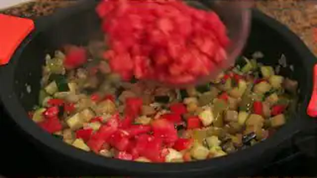
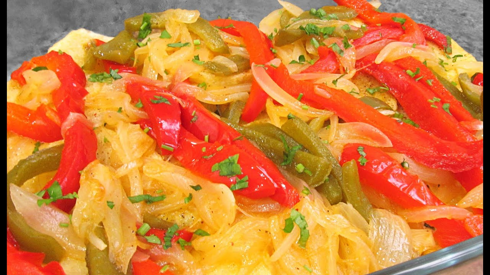
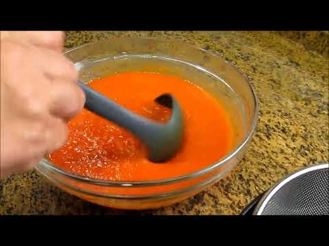
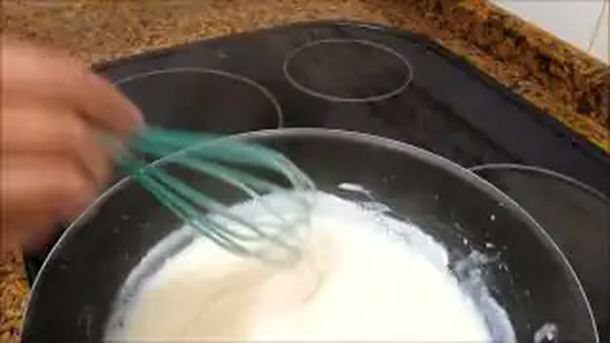
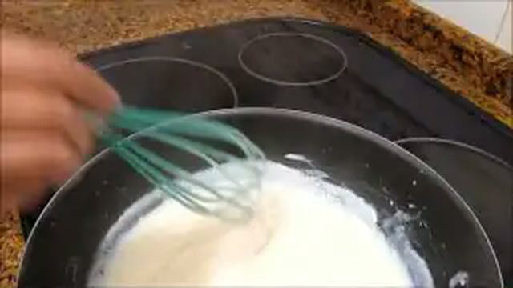

# Recetario Maestro: Bases, Verduras, Sofritos y Repostería Tradicional
## Colección Especial «Cocina con Carmen» — Tu Chef PrepMaster

---

## 📋 Índice General del Documento

1. [Manual de Buenas Prácticas y Estandarización Culinaria](#1-manual-de-buenas-prácticas-y-estandarización-culinaria)
2. [Bloque I: Verduras y Guarniciones Tradicionales](#bloque-i-verduras-y-guarniciones-tradicionales)
   - 1.1. [Pisto Manchego Tradicional](#11-pisto-manchego-tradicional)
   - 1.2. [Menestra de Verduras Tudelana con Jamón Ibérico](#12-menestra-de-verduras-tudelana-con-jamón-ibérico)
   - 1.3. [Espinacas con Garbanzos al Estilo Sevillano y Toque de Crema](#13-espinacas-con-garbanzos-al-estilo-sevillano-y-toque-de-crema)
   - 1.4. [Patatas a lo Pobre con Pimientos Tricolor y Cebolla Confitada](#14-patatas-a-lo-pobre-con-pimientos-tricolor-y-cebolla-confitada)
3. [Bloque II: Salsas y Sofritos Base](#bloque-ii-salsas-y-sofritos-base)
   - 2.1. [Sofrito Madre Multiusos de Carmen (Concentrado Concentración Lenta)](#21-sofrito-madre-multiusos-de-carmen)
   - 2.2. [Salsa de Tomate Frito Casero Reducido (Confitura de Huerta)](#22-salsa-de-tomate-frito-casero-reducido)
   - 2.3. [Salsa Bechamel Perfecta Sedosa Sin Grumos (Roux Rubio Equilibrado)](#23-salsa-bechamel-perfecta-sedosa-sin-grumos)
   - 2.4. [Emulsiones Frías Clásicas: Mahonesa Tradicional y Alioli al Mortero](#24-emulsiones-frías-clásicas-mahonesa-tradicional-y-alioli-al-mortero)
4. [Bloque III: Postres Tradicionales de la Abuela](#bloque-iii-postres-tradicionales-de-la-abuela)
   - 3.1. [Arroz con Leche Cremoso de la Abuela (Infusión Lenta y Mantecado)](#31-arroz-con-leche-cremoso-de-la-abuela)
   - 3.2. [Flan de Huevo Tradicional al Baño María con Caramelo Rubio](#32-flan-de-huevo-tradicional-al-baño-maría-con-caramelo-rubio)
   - 3.3. [Natillas Caseras de Yema con Galleta María y Canela de Ceilán](#33-natillas-caseras-de-yema-con-galleta-maría-y-canela-de-ceilán)
5. [Matriz Maestra de Conservación al Vacío, Abatimiento y Regeneración](#5-matriz-maestra-de-conservación-al-vacío-abatimiento-y-regeneración)

---

## 1. Manual de Buenas Prácticas y Estandarización Culinaria

Este documento constituye la guía técnica oficial para la producción, batch cooking, envasado al vacío y regeneración de las elaboraciones base de verduras, salsas y postres tradicionales inspiradas en el recetario de **Cocina con Carmen**.

### Principios Fundamentales:
- **Pesaje 100% en Gramos (g):** Eliminación total de medidas volumétricas imprecisas (cucharadas, pizcas, vasos) para garantizar reproducibilidad exacta y control de mermas.
- **Seguridad Alimentaria y Alérgenos:** Identificación estricta de los 14 alérgenos de declaración obligatoria conforme al Reglamento (UE) Nº 1169/2011.
- **Protocolo de Abatimiento Térmico:** Para conservación en frío, toda preparación caliente debe descender de **65 °C a menos de 10 °C en un tiempo inferior a 120 minutos** antes de entrar en refrigeración a 3 °C o congelación a -18 °C.
- **Integridad y Textura:** Parámetros específicos de envasado al vacío (porcentaje de vacío en cámara o bolsas gofradas) adaptados a cada matriz de alimento (humedad, fragilidad mecánica y emulsiones).

---

# BLOQUE I: VERDURAS Y GUARNICIONES TRADICIONALES

---

## 1.1. Pisto Manchego Tradicional

> 📺 **Vídeo Oficial de Elaboración:** [Ver en YouTube: Receta de Pisto muy Fácil y Deliciosa](https://www.youtube.com/watch?v=z6xxkLBFqco)

Guarnición y plato principal emblemático de la huerta manchega. Elaborado mediante pochado escalonado según densidad y tiempo de cocción de cada hortaliza, integrando tomate frito concentrado hasta evaporación del exceso de agua libre.

### Ficha Técnica
| Parámetro | Valor |
| :--- | :--- |
| **Categoría** | Guarnición / Principal Vegetal |
| **Rendimiento Neto** | 1.200 g (4 raciones de 300 g) |
| **Tiempo de Mise en Place** | 25 min |
| **Tiempo de Cocción** | 50 min |
| **Tiempo Total** | 75 min |
| **Dificultad** | Baja - Media |
| **Alérgenos (UE 1169/2011)** | Ninguno (Exento de los 14 alérgenos principales) |

### Ingredientes Estandarizados

| Ingrediente | Cantidad (g) | % Fórmula | Función / Especificación Técnica |
| :--- | :--- | :--- | :--- |
| **Aceite de Oliva Virgen Extra (AOVE)** | 120 g | 6.7% | Variedad Picual o Cornicabra para resistir cocción prolongada |
| **Cebolla dulce / blanca** | 350 g | 19.6% | Corte en macedonia / dados de 1,5 cm |
| **Pimiento verde italiano** | 250 g | 14.0% | Limpio de semillas, corte en dados de 1,5 cm |
| **Pimiento rojo morrón** | 250 g | 14.0% | Carnoso, limpio de nervaduras, corte de 1,5 cm |
| **Calabacín con piel fina** | 400 g | 22.4% | Firme, lavado, cortado en dados de 1,5 cm |
| **Berenjena morada (opcional Carmen)** | 200 g | 11.2% | Con piel, purgada con sal 15 min, dados de 1,5 cm |
| **Tomate maduro triturado tamizado** | 500 g | 28.0% | Natural o en conserva extra, sin piel ni semillas |
| **Ajo morado pelado** | 20 g (4 dientes) | 1.1% | Picado en brunoise fina |
| **Sal marina fina** | 12 g | 0.7% | Sazonado en cada fase para extracción osmótica |
| **Azúcar blanco (regulador de acidez)** | 8 g | 0.4% | Corrección de pH del tomate |
| **Pimienta negra molida** | 1 g | 0.05% | Molienda fina al momento |

### Mise en Place y Equipamiento
- **Cortes:** Todas las verduras deben cortarse en dados homogéneos de aproximadamente **15 mm × 15 mm** para que la cocción sea uniforme.
- **Equipamiento:** Cazuela de barro esmaltada o sartén honda de hierro fundido/acero inoxidable de fondo grueso (mínimo 28 cm de diámetro), espátula de madera o silicona térmica.

### Paso a Paso de Ejecución Técnica

1. **Calentamiento del Medio Graso:** En la cazuela amplia, verter los 120 g de AOVE a fuego medio-bajo (temperatura diana del aceite: 140 °C).
2. **Pochado de Base Aromática (Cebolla y Ajo):** Añadir la cebolla (350 g) con 3 g de sal. Sofreír durante 8 minutos hasta que comience a transparentar. Incorporar el ajo (20 g) y cocinar durante 2 minutos más sin que tome coloración oscura.
3. **Incorporación de Pimientos:** Agregar el pimiento verde (250 g) y el pimiento rojo (250 g) junto con 3 g de sal. Rehogar a fuego medio durante 10-12 minutos, removiendo periódicamente hasta que pierdan rigidez.
4. **Adición de Hortalizas Tiernas (Calabacín y Berenjena):** Incorporar los dados de calabacín (400 g) y berenjena (200 g) con otros 3 g de sal. Sofreír el conjunto durante 10 minutos. Las hortalizas deben quedar tiernas pero conservando su estructura sin llegar a deshacerse (al dente firme).
5. **Guisado y Reducción del Tomate:** Añadir el tomate triturado (500 g), el azúcar (8 g), la sal restante (3 g) y la pimienta negra (1 g). Bajar a fuego lento (chup-chup suave, aprox. 90-95 °C), tapar parcialmente y dejar cocer durante 20-25 minutos. Remover cada 5 minutos para evitar que el tomate se adhiera al fondo.
6. **Punto Final de Reducción:** Destapar los últimos 5 minutos para que el agua de vegetación evapore por completo y el aceite flote ligeramente en la superficie con un brillo rojizo característico. Retirar del fuego y reposar 10 minutos antes de servir o abatir.

### Protocolo de Conservación, Envasado y Vida Útil
- **Abatimiento:** Extender en bandeja gastronorm de acero inoxidable y abatir a <10 °C en <90 minutos.
- **Envasado al Vacío:** Envasar en bolsas termosellables de 90 micras al **95% de vacío** (o 100% si se usa cámara de vacío profesional con sensor de líquidos fríos).
- **Vida Útil:** 
  - Refrigeración (3 °C): 7 a 9 días en bolsa al vacío sellada; 4 días en táper hermético tradicional.
  - Congelación (-18 °C): Hasta 6 meses. La berenjena y el calabacín pueden ablandarse ligeramente al descongelar, pero mantienen sabor óptimo.
  - Pasteurización sous-vide (85 °C durante 45 min en bolsa): Hasta 30 días a 3 °C.

### Regeneración y Servicio
- **Roner Sous-Vide / Baño María:** Sumergir la bolsa directamente a **75 °C durante 15 minutos**.
- **Sartén Tradicional:** Verter el contenido y saltear a fuego medio-alto durante 4-5 minutos hasta humear.
- **Microondas:** Disponer en plato hondo, cubrir con campana y calentar a 750 W durante 2,5 - 3 minutos.
- **Servicio:** Servir caliente acompañado tradicionalmente de un huevo frito con puntilla, lascas de jamón ibérico curado o lomo de bacalao confitado.

---

## 1.2. Menestra de Verduras Tudelana con Jamón Ibérico

> 📺 **Vídeo Oficial de Elaboración:** [Ver en YouTube: Judías Blancas con Verduras súper Fáciles y Deliciosas - Alubias](https://www.youtube.com/watch?v=ICbt1w6_XO0)

Elaboración clásica de verduras de temporada cocinadas por separado al vapor/ebullición según su punto exacto de cocción para preservar clorofila, textura y valor organoléptico, ensambladas finalmente con un velouté ligero ligado con caldo de verduras, ajo dorado y dados de jamón ibérico.

### Ficha Técnica
| Parámetro | Valor |
| :--- | :--- |
| **Categoría** | Entrante / Guarnición de Alta Cocina Tradicional |
| **Rendimiento Neto** | 1.150 g (4 raciones de 285 g) |
| **Tiempo de Mise en Place** | 35 min |
| **Tiempo de Cocción** | 35 min |
| **Tiempo Total** | 70 min |
| **Dificultad** | Media |
| **Alérgenos (UE 1169/2011)** | Gluten (Trigo en la harina para ligar - sustituible por Maicena para versión Sin Gluten) |

### Ingredientes Estandarizados

| Ingrediente | Cantidad (g) | % Fórmula | Función / Especificación Técnica |
| :--- | :--- | :--- | :--- |
| **Alcachofas frescas (corazones limpios)** | 300 g (peso neto) | 16.2% | Variedad Blanca de Tudela, torneadas y en cuartos |
| **Judías verdes planas o redondas** | 200 g | 10.8% | Despuntadas y cortadas en trozos de 4 cm |
| **Guisantes finos frescos o congelados extra** | 180 g | 9.7% | Calibre fino dulce |
| **Zanahoria pelada** | 180 g | 9.7% | Cortada en rodajas de 5 mm o torneada |
| **Espárragos blancos (tallos y yemas)** | 160 g | 8.6% | Cocidos al punto o conserva de alta calidad |
| **Taquitos de Jamón Ibérico de bellota** | 120 g | 6.5% | Grasa entreverada, dados regulares de 5 mm |
| **Aceite de Oliva Virgen Extra (AOVE)** | 60 g | 3.2% | Para dorar el jamón y emulsionar el roux |
| **Ajo morado** | 15 g (3 dientes) | 0.8% | Laminado fino |
| **Cebolla dulce** | 100 g | 5.4% | Picada en brunoise finísima |
| **Harina de trigo todo uso** | 15 g | 0.8% | Agente ligante para velouté ligero |
| **Caldo de cocción de las verduras / Jamón** | 350 g | 18.9% | Fondo clarificado y colado |
| **Sal marina fina** | 8 g | 0.4% | Ajuste de sazón |
| **Pimentón dulce de la Vera (opcional Carmen)** | 2 g | 0.1% | Matiz ahumado tradicional |

### Mise en Place y Equipamiento
- **Limpieza de Alcachofas:** Retirar hojas exteriores duras, cortar puntas y tornear el tallo; sumergir en agua fría con ramas de perejil fresco (evita el pardeamiento enzimático sin el sabor ácido del limón).
- **Equipamiento:** Olla para cocción al vapor o ebullición escalonada, bol con agua helada (baño inverso) para fijar la clorofila, cazuela baja de acero inoxidable o sartén sauté de 28 cm.

### Paso a Paso de Ejecución Técnica

1. **Cocción Escalonada de las Verduras (Respeto de Tiempos):**
   - En una olla con 2 litros de agua y 15 g de sal hirviendo a borbotones:
     - Cocer las **zanahorias** durante 8 minutos.
     - Añadir las **alcachofas** y cocer 10-12 minutos (comprobar con la punta de un cuchillo).
     - Cocer las **judías verdes** durante 6-7 minutos.
     - Escaldar los **guisantes** durante 2-3 minutos.
   - Conforme cada verdura alcanza su punto exacto, transferirla de inmediato a un baño de agua con hielo durante 2 minutos para cortar la cocción y conservar colores vivos. Escurrir y reservar. Guardar 350 g del agua de cocción.
2. **Sofrito y Base Ligada:** En la cazuela baja, añadir los 60 g de AOVE a fuego medio (130 °C). Incorporar los ajos laminados (15 g) y dorar ligeramente (1 minuto).
3. **Sofrito de Cebolla y Jamón:** Añadir la cebolla brunoise (100 g) y pochar hasta que esté tierna (6 min). Incorporar los 120 g de jamón ibérico y saltear brevemente (1 minuto) para que sude su grasa sin resecarse.
4. **Elaboración del Velouté Rápido:** Espolvorear la harina (15 g) y el pimentón dulce (2 g). Cocinar el roux durante 2 minutos removiendo con varilla para tostar la harina y eliminar el sabor a crudo.
5. **Ligazón y Emulsión:** Verter los 350 g de caldo de cocción caliente poco a poco, batiendo constantemente hasta obtener una salsa ligera, sedosa y brillante.
6. **Ensamblado y Glaseado de Verduras:** Añadir todas las verduras cocidas escurridas y los espárragos blancos en trozos. Mover la cazuela con movimientos de vaivén circulares (vaivén del pil-pil) a fuego mínimo durante 4-5 minutos para que los jugos se fundan y las verduras absorban la salsa. Rectificar de sal si es necesario (el jamón ya aporta salinidad).

### Protocolo de Conservación, Envasado y Vida Útil
- **Abatimiento:** Abatir rápidamente a <10 °C en <60 minutos.
- **Envasado al Vacío:** Envasar en bolsas de 90 micras con **vacío controlado al 85%** para no aplastar las yemas de espárrago ni los corazones de alcachofa.
- **Vida Útil:**
  - Refrigeración (3 °C): 5 a 6 días en vacío.
  - Congelación (-18 °C): No recomendable si contiene patata; para menestra sin patata, hasta 3 meses (las verduras perderán algo de tersura pero conservan sabor).

### Regeneración y Servicio
- **Roner Sous-Vide:** Regenerar la bolsa a **70 °C durante 12-14 minutos**.
- **Sartén:** Volcar y calentar a fuego medio con 1 cucharada de caldo adicional, moviendo en vaivén suave durante 3 minutos.
- **Presentación:** Disponer en plato hondo de cerámica artesanal, coronando con 1 huevo poché o escalfado y un hilo de AOVE crudo virgen extra.

---

## 1.3. Espinacas con Garbanzos al Estilo Sevillano y Toque de Crema

> 📺 **Vídeo Oficial de Elaboración:** [Ver en YouTube: Espinacas con Garbanzos - Receta Tradicional y Sabrosa](https://www.youtube.com/watch?v=cviNRSB1At0)

Fusión de la receta tradicional andaluza de vigilia (majado de pan frito, ajo, comino y pimentón) con la variante suave aterciopelada de espinacas a la crema. Un equilibrio magistral de legumbre, vegetal y aroma especiado.

### Ficha Técnica
| Parámetro | Valor |
| :--- | :--- |
| **Categoría** | Plato Principal / Guarnición Enriquecida |
| **Rendimiento Neto** | 1.300 g (4 raciones de 325 g) |
| **Tiempo de Mise en Place** | 15 min |
| **Tiempo de Cocción** | 30 min |
| **Tiempo Total** | 45 min |
| **Dificultad** | Baja |
| **Alérgenos (UE 1169/2011)** | Gluten (Pan frito - omitir para celiacos), Lácteos (Nata/leche en variante crema) |

### Ingredientes Estandarizados

| Ingrediente | Cantidad (g) | % Fórmula | Función / Especificación Técnica |
| :--- | :--- | :--- | :--- |
| **Espinacas frescas (o congeladas en hojas)** | 600 g | 31.6% | Limpias, lavadas y escurridas |
| **Garbanzos cocidos (Pedrosillano o lechoso)** | 500 g | 26.3% | Cocidos en su punto, escurridos (guardar aquafaba) |
| **Pan de hogaza candeal del día anterior** | 50 g | 2.6% | En rebanadas para freír y majar |
| **Ajo morado** | 25 g (5 dientes) | 1.3% | Pelados enteros para freír |
| **Aceite de Oliva Virgen Extra (AOVE)** | 80 g | 4.2% | Para freír majado y rehogar |
| **Comino en grano (o molido)** | 4 g | 0.2% | Especiado esencial sevillano |
| **Pimentón dulce de la Vera** | 8 g | 0.4% | Aporte aromático y color rubí |
| **Vinagre de Jerez D.O. Reserva** | 15 g | 0.8% | Desglasado y toque ácido de contraste |
| **Tomate frito casero concentrado** | 80 g | 4.2% | Cuerpo y dulzor al majado |
| **Nata para cocinar 18% M.G. (o leche entera)** | 120 g | 6.3% | Aporte de cremosidad y untuosidad sedosa |
| **Caldo de verduras o agua de cocción** | 200 g | 10.5% | Fluidez del guiso |
| **Sal marina fina** | 8 g | 0.4% | Sazón equilibrada |
| **Pimienta negra molida** | 1 g | 0.05% | Molienda fresca |

### Mise en Place y Equipamiento
- **Blanqueado de Espinacas:** Escaldar las espinacas en agua hirviendo durante 90 segundos, enfriar en agua con hielo, escurrir estrujando con las manos para retirar el exceso de agua y picar toscamente a cuchillo.
- **Equipamiento:** Mortero tradicional de piedra/madera o procesador de alimentos, sartén honda o cazuela de 26 cm.

### Paso a Paso de Ejecución Técnica

1. **Fritura del Majado Sevillano:** En la cazuela con los 80 g de AOVE a fuego medio (160 °C), dorar los dientes de ajo enteros (25 g) y la rebanada de pan (50 g) hasta que adquieran un tono dorado crujiente homogéneo. Retirar y colocar en el vaso del mortero o trituradora.
2. **Elaboración del Majado:** En el mortero junto al pan y ajo frito, incorporar los 4 g de comino, los 8 g de sal y machacar hasta formar una pasta. Añadir los 8 g de pimentón dulce, los 15 g de vinagre de Jerez y los 80 g de tomate frito casero. Majar hasta obtener una pasta emulsionada densa.
3. **Rehogado de Espinacas:** En el mismo aceite residual de la cazuela a fuego medio, volcar las espinacas picadas (600 g) y saltear durante 3-4 minutos para que se impregnen de la grasa aromática.
4. **Integración del Majado y Especias:** Volcar el majado sobre las espinacas y remover bien a fuego medio durante 2 minutos para que el pimentón y el comino liberen sus aceites esenciales.
5. **Adición de Garbanzos y Caldo:** Añadir los 500 g de garbanzos cocidos y los 200 g de caldo de verduras. Dejar cocinar a fuego suave durante 10 minutos para que las legumbres absorban el fondo especiado.
6. **Toque de Crema y Mantecado:** Verter los 120 g de nata líquida (o leche entera), remover suavemente con movimientos envolventes y dejar cocer a fuego lento durante 4-5 minutos más hasta que la salsa ligue y adquiera una textura aterciopelada cremosa. Rectificar de sal y pimienta negra.

### Protocolo de Conservación, Envasado y Vida Útil
- **Abatimiento:** Abatimiento a <10 °C en <90 minutos.
- **Envasado al Vacío:** Bolsas de 90 micras al **95% de vacío**.
- **Vida Útil:**
  - Refrigeración (3 °C): 6 a 7 días.
  - Congelación (-18 °C): Hasta 4 meses (la nata emulsionada resiste perfectamente la regeneración térmica sin cortarse).

### Regeneración y Servicio
- **Roner Sous-Vide:** 15 minutos a **75 °C**.
- **Cazo / Cazuela:** Calentar a fuego lento con 2 cucharadas de agua o leche durante 4 minutos removiendo suavemente.
- **Servicio:** Servir en cazuelita de barro caliente, coronado con costrones de pan frito crujiente o triángulos de pan tostado con ajo.

---

## 1.4. Patatas a lo Pobre con Pimientos Tricolor y Cebolla Confitada

> 📺 **Vídeo Oficial de Elaboración:** [Ver en YouTube: Patatas a lo Pobre con Pimientos](https://www.youtube.com/watch?v=JjNE0fGfPNY)

Guarnición reina de la cocina tradicional andaluza y española. Patatas cortadas en rodajas de grosor medio confitadas lentamente en abundante aceite a baja temperatura junto a pimientos y cebolla, rematadas con un ligero golpe de fuego vivo para caramelizar los azúcares naturales.

### Ficha Técnica
| Parámetro | Valor |
| :--- | :--- |
| **Categoría** | Guarnición Tradicional Multiusos |
| **Rendimiento Neto** | 1.000 g (4 raciones de 250 g) |
| **Tiempo de Mise en Place** | 20 min |
| **Tiempo de Cocción** | 35 min |
| **Tiempo Total** | 55 min |
| **Dificultad** | Baja |
| **Alérgenos (UE 1169/2011)** | Ninguno (100% libre de alérgenos obligatorios) |

### Ingredientes Estandarizados

| Ingrediente | Cantidad (g) | % Fórmula | Función / Especificación Técnica |
| :--- | :--- | :--- | :--- |
| **Patata de variedad semitardía (Monalisa / Kennebec)** | 1.000 g (peso limpio) | 52.6% | Patata para freír/confitar, rodajas de 4-5 mm |
| **Cebolla dulce o juliana fina** | 300 g | 15.8% | Corte en pluma / juliana de 3 mm |
| **Pimiento verde italiano** | 150 g | 7.9% | Corte en tiras de 1 cm de ancho |
| **Pimiento rojo morrón** | 150 g | 7.9% | Corte en tiras de 1 cm de ancho |
| **Ajo morado con piel (chafado)** | 30 g (6 dientes) | 1.6% | Dientes enteros con golpe seco (en camisa) |
| **Aceite de Oliva Virgen Extra (AOVE)** | 250 g | 13.2% | Medio de confitado (se escurre al final) |
| **Sal marina fina** | 10 g | 0.5% | Sazonado en crudo |
| **Vinagre de vino blanco o Jerez (opcional Carmen)** | 10 g | 0.5% | Rociado final en caliente para asentar sabores |
| **Perejil fresco picado** | 5 g | 0.25% | Toque verde aromático al pase |

### Mise en Place y Equipamiento
- **Corte de Patata:** Pelar, lavar y secar perfectamente las patatas. Cortar en rodajas tipo panadera regulares de **4 a 5 mm de grosor** (usar mandolina con guardia para garantizar grosor idéntico).
- **Equipamiento:** Sartén amplia antiadherente de 30 cm de diámetro con tapa, espumadera de araña de acero inoxidable, escurridor metálico sobre bol.

### Paso a Paso de Ejecución Técnica

1. **Sazonado y Mezcla en Frío:** En un bol grande, mezclar las patatas en rodajas (1.000 g), la cebolla en juliana (300 g), los pimientos en tiras (300 g) y los ajos en camisa chafados (30 g). Añadir los 10 g de sal y mezclar bien con las manos limpias para repartir homogéneamente.
2. **Inicio del Confitado a Fuego Lento:** Disponer la mezcla en la sartén amplia y verter los 250 g de AOVE. Llevar a fuego medio-bajo (temperatura diana: **120 °C - 130 °C**). Las patatas no deben freírse ruidosamente, sino cocerse en el aceite lentamente.
3. **Cocción Tapada:** Cubrir la sartén con su tapa y cocinar durante 20-25 minutos, removiendo con mucho cuidado con la espumadera cada 6-7 minutos dando vueltas desde el fondo hacia arriba para no quebrar las rodajas.
4. **Comprobación de Ternura:** Cuando la patata esté completamente tierna y se corte fácilmente con el canto de la espátula de madera, retirar la tapa.
5. **Golpe de Fuego y Rustido:** Subir el fuego a medio-alto (170 °C) durante los últimos 4-5 minutos sin remover en exceso, permitiendo que algunas patatas y cebollas tomen un sutil tono dorado y tostado en los bordes.
6. **Escurrido del Exceso de Grasa:** Retirar la sartén del fuego. Inclinar y retirar el exceso de aceite con un cazo (este aceite aromatizado se reserva para sofritos o tortillas). Rociar con los 10 g de vinagre de vino sobre el fondo caliente (evaporará de inmediato dejando solo el aroma) y espolvorear el perejil picado fresco.

### Protocolo de Conservación, Envasado y Vida Útil
- **Abatimiento:** Extender en una sola capa en bandeja gastronorm y enfriar a <10 °C en <45 minutos.
- **Envasado al Vacío:** Bolsas de 90 micras al **80% de vacío** (un vacío excesivo compactaría la patata convirtiéndola en puré).
- **Vida Útil:**
  - Refrigeración (3 °C): 5 a 6 días en vacío.
  - Congelación: No recomendada (la estructura celular del almidón de patata cocido retrograda y genera textura gomosa y exudación de agua).

### Regeneración y Servicio
- **Horno / Sartén (Recomendado):** Saltear a fuego medio-alto en sartén antiadherente con una gota de aceite durante 3-4 minutos, o disponer en placa a 180 °C en horno durante 8 minutos para devolver el toque crujiente exterior.
- **Roner Sous-Vide:** 12 minutos a **70 °C**.
- **Servicio:** Guarnición idónea para carnes asadas, pescados al horno, huevos fritos o como relleno de tortillas y empanadas.

---

# BLOQUE II: SALSAS Y SOFRITOS BASE

---

## 2.1. Sofrito Madre Multiusos de Carmen

> 📺 **Vídeo Oficial de Elaboración:** [Ver en YouTube: Estofado de Carne de Ternera con Patatas muy fácil y delicioso](https://www.youtube.com/watch?v=mtI-FlYqzoA)

El pilar maestro de toda la cocina mediterránea tradicional. Concentrado denso de hortalizas pochadas a fuego muy lento durante más de 60 minutos hasta que los azúcares se caramelizan (reacción de Maillard suave) y el agua se evapora en un 70%, liberando una pasta aromática rica en ácido glutámico natural (umami puro).

### Ficha Técnica
| Parámetro | Valor |
| :--- | :--- |
| **Categoría** | Base Culinaria Maestra / Fondo Concentrado |
| **Rendimiento Neto** | 750 g (Base concentrada para 6-8 guisos de 4 pax) |
| **Tiempo de Mise en Place** | 20 min |
| **Tiempo de Cocción** | 65 min |
| **Tiempo Total** | 85 min |
| **Dificultad** | Baja (requiere paciencia y control de fuego) |
| **Alérgenos (UE 1169/2011)** | Ninguno |

### Ingredientes Estandarizados

| Ingrediente | Cantidad (g) | % Fórmula | Función / Especificación Técnica |
| :--- | :--- | :--- | :--- |
| **Cebolla dulce tipo Figueres o Reca** | 600 g | 33.3% | Picada en brunoise fina de 2 mm |
| **Puerro (parte blanca y verde clara)** | 200 g | 11.1% | Lavado exhaustivo, brunoise fina |
| **Pimiento verde italiano** | 200 g | 11.1% | Limpio, brunoise fina |
| **Pimiento rojo carnoso** | 150 g | 8.3% | Sin nervios, brunoise fina |
| **Ajo morado de Las Pedroñeras** | 40 g (8 dientes) | 2.2% | Picado finísimo / micropicado |
| **Tomate maduro triturado tamizado** | 500 g | 27.8% | Concentración de pulpa natural |
| **Aceite de Oliva Virgen Extra (AOVE)** | 100 g | 5.5% | Extractor lipídico de aromas liposolubles |
| **Sal marina fina** | 10 g | 0.55% | Sazón y deshidratación celular |
| **Pimentón dulce de la Vera D.O.** | 8 g | 0.44% | Matiz ahumado y color profundo |
| **Laurel seco** | 2 g (2 hojas) | 0.1% | Hoja entera (retirar al envasar) |

### Mise en Place y Equipamiento
- **Corte:** Todo el corte vegetal debe ser en **brunoise milimétrica (2 a 3 mm)** para maximizar la superficie de contacto térmico y lograr una pasta homogénea integrable en cualquier arroz, legumbre o guiso sin grumos toscos.
- **Equipamiento:** Cazuela ancha de hierro fundido esmaltado (tipo Cocotte) o cacerola de acero inoxidable de triple fondo difusor (28 cm), espátula raspadora plana.

### Paso a Paso de Ejecución Técnica

1. **Infusión Grasa y Ajo:** En la cazuela fría, añadir los 100 g de AOVE y los 40 g de ajo picado. Encender a fuego suave y dejar que el ajo sude y libere alicina durante 3 minutos sin tomar color marrón.
2. **Pochado Lento de Cebolla y Puerro:** Añadir la cebolla (600 g), el puerro (200 g), las 2 hojas de laurel y 5 g de sal. Cocinar a fuego muy bajo con la cazuela tapada durante 25 minutos, removiendo cada 5 minutos. La cebolla debe reducir su volumen a la mitad y adquirir un color rubio brillante traslúcido.
3. **Adición de Pimientos:** Incorporar el pimiento verde (200 g) y el pimiento rojo (150 g) con 2 g de sal. Continuar pochando a fuego lento destapado durante 15 minutos hasta que los pimientos estén completamente tiernos y caramelizados.
4. **Punto del Pimentón:** Retirar la cazuela unos segundos del foco de calor directo, abrir un hueco en el centro, incorporar los 8 g de pimentón dulce y remover durante 20 segundos con el calor residual para tostarlo sin quemarlo (el pimentón quemado aporta amargor irreversible).
5. **Reducción y Caramelización del Tomate:** Volcar de inmediato los 500 g de tomate triturado y los 3 g de sal restantes. Bajar el fuego al mínimo y dejar cocer durante 25 minutos removiendo con frecuencia y raspando el fondo para integrar los azúcares que caramelizan.
6. **Punto Óptimo de Concentrado:** El sofrito estará listo cuando el aceite se separe nítidamente de la masa vegetal concentrada, el tomate haya perdido toda su acidez ácida acuosa y la mezcla tenga una consistencia espesa untable color caoba oscuro. Retirar el laurel y enfriar.

### Protocolo de Conservación, Envasado y Vida Útil
- **Porcionado Batch Cooking:** Fraccionar en porciones estándar de **100 g o 150 g** (equivalente a la base para 4 comensales).
- **Envasado al Vacío:** Bolsas de vacío al **100% de vacío** en cámara, o tarros de cristal herméticos esterilizados.
- **Vida Útil:**
  - Refrigeración (3 °C): 14 a 18 días en bolsa al vacío.
  - Congelación (-18 °C): Hasta 12 meses sin merma de aroma ni textura (ideal congelar en cubiteras de silicona de 50 g y pasar a bolsa ziploc/vacío).
  - Conserva casera al baño maría: 12 meses a temperatura ambiente (tarros esterilizados hervidos a 100 °C durante 35 min).

### Regeneración y Aplicación
- **Uso Directo:** Añadir 2 a 3 cucharadas colmadas (75-100 g) directamente a la paella antes de añadir el arroz, al inicio de un guiso de lentejas, estofado de carne, fideuá o salsa marinera. No requiere descongelación previa en cocciones calientes.

---

## 2.2. Salsa de Tomate Frito Casero Reducido

> 📺 **Vídeo Oficial de Elaboración:** [Ver en YouTube: Salsa de Tomate casera](https://www.youtube.com/watch?v=3aGqApVHmFk)

Salsa de tomate tradicional andaluza frita lentamente en aceite de oliva virgen extra con ajo, cebolla pochada y cocción prolongada hasta obtener una confitura untuosa de sabor dulce natural, acidez equilibrada y cuerpo denso inigualable.

### Ficha Técnica
| Parámetro | Valor |
| :--- | :--- |
| **Categoría** | Salsa Madre Clásica / Conservería |
| **Rendimiento Neto** | 800 g (a partir de 2 kg de tomate fresco o en conserva) |
| **Tiempo de Mise en Place** | 15 min |
| **Tiempo de Cocción** | 60 min |
| **Tiempo Total** | 75 min |
| **Dificultad** | Baja |
| **Alérgenos (UE 1169/2011)** | Ninguno |

### Ingredientes Estandarizados

| Ingrediente | Cantidad (g) | % Fórmula | Función / Especificación Técnica |
| :--- | :--- | :--- | :--- |
| **Tomate pera maduro pelado y triturado** | 2.000 g | 83.3% | Variedad Roma / Pera madurada en rama, tamizada |
| **Aceite de Oliva Virgen Extra (AOVE)** | 120 g | 5.0% | Emulsión y fritura lenta |
| **Cebolla dulce** | 200 g | 8.3% | Picada finísima |
| **Ajo morado** | 20 g (4 dientes) | 0.8% | Laminado fino |
| **Pimiento verde italiano** | 60 g | 2.5% | En un solo trozo (para retirar o triturar) |
| **Azúcar blanco (o panela)** | 12 g | 0.5% | Corrector de acidez cítrica natural |
| **Sal marina fina** | 12 g | 0.5% | Realce de sabor |
| **Pimienta negra molida** | 1 g | 0.04% | Toque especiado sutil |
| **Albahaca fresca o orégano seco (opcional)** | 3 g | 0.12% | Matiz aromático |

### Mise en Place y Equipamiento
- **Preparación del Tomate:** Si se utiliza tomate fresco, escaldar 30 segundos en agua hirviendo con una cruz en la base, refrescar en hielo, pelar, despepitar y triturar groseramente. Si se usa conserva, elegir tomate entero pelado extra y triturar en pasapurés o batidora de vaso.
- **Equipamiento:** Cazuela alta antisalpicaduras (mínimo 24 cm de diámetro y 12 cm de altura) con tapa con orificio de vapor, espátula de madera larga.

### Paso a Paso de Ejecución Técnica

1. **Aromatización del Aceite:** Verter los 120 g de AOVE en la cazuela a fuego medio (140 °C). Añadir los ajos laminados (20 g) y el trozo de pimiento verde (60 g). Dorar durante 2 minutos hasta que el ajo esté rubio claro.
2. **Pochado de la Cebolla:** Incorporar la cebolla picada (200 g) con 3 g de sal. Bajar el fuego y pochar lentamente durante 12-15 minutos hasta que adquiera un color dorado miel.
3. **Incorporación del Tomate:** Verter los 2.000 g de tomate triturado con cuidado. Añadir los 9 g de sal restantes, el azúcar (12 g) y la pimienta negra (1 g).
4. **Cocción a Fuego Lento y Fritura:** Subir a fuego medio hasta que comience a hervir con fuerza. En ese instante, tapar parcialmente y bajar a fuego mínimo (chup-chup regular, 92-95 °C).
5. **Reducción de Volumen (Concentración):** Dejar reducir durante 45-50 minutos removiendo cada 8 minutos para raspar el fondo. El volumen total debe reducirse aproximadamente en un 55-60%, pasando de una consistencia líquida y acuosa a una crema espesa, densa y brillante.
6. **Punto de Fritura y Emulsión:** En los últimos 5 minutos, el aceite libre debe subir y emulsionarse al batir enérgicamente con la cuchara. Probar y rectificar de sal o azúcar si el tomate fuese excesivamente ácido. Pasar por pasapurés si se desea una textura 100% fina de restaurante o dejar rústico al estilo Carmen.

### Protocolo de Conservación, Envasado y Vida Útil
- **Envasado al Vacío / Tarros:** Envasar en caliente (>85 °C) en tarros de cristal esterilizados cerrados al vacío por inversión térmica, o abatir a <10 °C y envasar en bolsas de vacío de 90 micras al 100%.
- **Vida Útil:**
  - Refrigeración (3 °C): 15 días en bolsa al vacío; 7 días en táper cerrado.
  - Congelación (-18 °C): Hasta 12 meses.
  - Conserva al Baño María: 12 a 18 meses a temperatura ambiente en lugar oscuro y seco.

### Regeneración y Servicio
- Calentar directamente en cazo a fuego medio durante 3 minutos o integrar en salsas para pastas, albóndigas, huevos al plato, empanadillas o bases de pizza artesanal.

---

## 2.3. Salsa Bechamel Perfecta Sedosa Sin Grumos

> 📺 **Vídeo Oficial de Elaboración:** [Ver en YouTube: Cómo hacer Bechamel fácil y sin grumos en 3 minutos!](https://www.youtube.com/watch?v=YaUlZZ-TXmk)

La técnica maestra de la bechamel tradicional española para croquetas cremosas o coberturas de lasaña/gratinados. Basada en un roux rubio perfectamente cocido y la adición escalonada de leche caliente entera infusionada con nuez moscada y pimienta blanca.

### Ficha Técnica
| Parámetro | Valor |
| :--- | :--- |
| **Categoría** | Salsa Madre Caliente Emulsionada por Almidón |
| **Rendimiento Neto** | 1.100 g (Cobertura para 2 bandejas de lasaña o base de canelones) |
| **Tiempo de Mise en Place** | 10 min |
| **Tiempo de Cocción** | 20 min |
| **Tiempo Total** | 30 min |
| **Dificultad** | Media (precisión en el batido y temperaturas) |
| **Alérgenos (UE 1169/2011)** | Gluten (Harina de trigo), Lácteos (Mantequilla y leche) |

### Ingredientes Estandarizados

| Ingrediente | Cantidad (g) | % Fórmula | Función / Especificación Técnica |
| :--- | :--- | :--- | :--- |
| **Mantequilla sin sal (82% M.G.)** | 60 g | 5.2% | Grasa noble para roux (opcional 30g mantequilla + 30g AOVE) |
| **Aceite de Oliva Virgen Extra suave** | 20 g | 1.7% | Evita que la mantequilla se queme y aporta brillo |
| **Harina de trigo todo uso (W 100-140)** | 80 g | 6.9% | Almidón espesante (para cobertura suave) |
| *(Nota: Para croquetas moldeables subir harina a 130g)* | - | - | - |
| **Leche entera fresca pasteurizada (3.6% M.G.)** | 1.000 g | 85.8% | Leche entera caliente (mínimo 70 °C) |
| **Sal marina fina** | 7 g | 0.6% | Sazón base |
| **Nuez moscada recién rallada** | 1.5 g | 0.13% | Aromatizante esencial indispensable |
| **Pimienta blanca molida** | 0.8 g | 0.07% | Sabor especiado sin motas negras visibles |

### Mise en Place y Equipamiento
- **Infusión de la Leche:** Calentar la leche en un cazo con una pizca de nuez moscada hasta que alcance 75 °C - 80 °C (sin que llegue a hervir a borbotones). Mantener caliente.
- **Equipamiento:** Cazo hondo de acero inoxidable de fondo encapsulado (20-22 cm), varilla manual de repostería de acero fino (batidor de globo), lengua de silicona.

### Paso a Paso de Ejecución Técnica

1. **Fusión de las Grasas:** En el cazo a fuego medio-bajo (110 °C), derretir los 60 g de mantequilla junto con los 20 g de AOVE hasta que cese el burbujeo de suero lácteo.
2. **Cocción del Roux (Paso Crítico Anti-Sabor a Crudo):** Añadir los 80 g de harina de golpe. Remover inmediatamente con la varilla manual a fuego medio (120 °C) durante **2 a 3 minutos continuos**. La mezcla debe formar una pasta espumosa y adquirir un color avellana muy claro (Roux Rubio) desprendiendo aroma a galleta horneada.
3. **Técnica Anti-Grumos (Choque Térmico Controlado):**
   - **Primer Vertido (200 g de leche caliente):** Verter el primer vaso de leche caliente sobre el roux batiendo enérgicamente en círculos con la varilla. La harina absorberá el líquido de inmediato formando una masa densa despegada de las paredes.
   - **Segundo Vertido (300 g de leche caliente):** Incorporar la siguiente tanda de leche sin dejar de batir enérgico. La masa comenzará a disolverse y emulsionar suavemente.
   - **Tercer Vertido (500 g de leche restante):** Añadir el resto de la leche caliente en un chorro continuo mientras se bate con rapidez. La mezcla quedará totalmente homogénea, fluida y sin ningún grumo.
4. **Cocción y Gelatinización del Almidón:** Bajar a fuego medio-suave. Cocinar la salsa sin dejar de remover con la varilla (pasando especialmente por la base y los bordes del cazo) durante **10 a 12 minutos**. La amilosa y amilopectina de la harina deben gelatinizar por completo para espesar y eliminar cualquier resto de textura harinosa.
5. **Sazonado y Emulsión Final:** Añadir los 7 g de sal, los 1.5 g de nuez moscada recién rallada y los 0.8 g de pimienta blanca. Probar y batir fuera del fuego durante 1 minuto adicional para ganar brillo y sedosidad aterciopelada.

### Protocolo de Conservación, Envasado y Vida Útil
- **Protección Film a Piel:** Para reposo inmediato, cubrir la superficie en contacto directo con film plástico alimentario para evitar la formación de costra láctea.
- **Abatimiento:** Abatir a <10 °C en <60 minutos.
- **Envasado al Vacío:** Envasar fría en bolsas de vacío al **100% de vacío** termoselladas.
- **Vida Útil:**
  - Refrigeración (3 °C): 5 a 6 días en bolsa al vacío.
  - Congelación (-18 °C): No recomendada para bechamel de cobertura fina (el almidón retrograda y suelta agua al descongelar); para masa de croquetas densa, congelación hasta 6 meses en porciones empanadas.

### Regeneración y Servicio
- **Roner Sous-Vide:** 15 minutos a **65 °C** y batir la bolsa antes de abrir.
- **Cazo Tradicional:** Calentar a fuego muy suave con 2 cucharadas de leche batiendo con varilla para devolver la emulsión lisa original.
- **Aplicación:** Verter caliente sobre canelones, lasañas o verduras gratinadas y hornear a 210 °C con queso rallado durante 10 minutos con grill.

---

## 2.4. Emulsiones Frías Clásicas: Mahonesa Tradicional y Alioli al Mortero

> 📺 **Vídeo Oficial de Elaboración:** [Ver en YouTube: Cómo hacer Mayonesa Casera SIN que se corte | Garantizado!!](https://www.youtube.com/watch?v=Xx1IgbRh3bU)

Las dos grandes salsas emulsionadas frías de la gastronomía española. Elaboración en emulsión estable de fase grasa en agua mediante lecitina de yema de huevo y alicina de ajo.

### Ficha Técnica
| Parámetro | Mahonesa Casera al Huevo | Alioli Tradicional al Mortero |
| :--- | :--- | :--- |
| **Categoría** | Salsa Emulsionada Fría | Salsa Emulsionada Fría al Ajo |
| **Rendimiento Neto** | 400 g | 350 g |
| **Tiempo de Elaboración** | 5 min | 15 min |
| **Dificultad** | Baja | Media - Alta |
| **Alérgenos (UE 1169/2011)** | Huevo | Huevo (en versión con yema) / Ninguno (en alioli puro ajo-aceite) |

### Ingredientes Estandarizados

| Ingrediente | Mahonesa (g) | Alioli Tradicional (g) | Función Técnica |
| :--- | :--- | :--- | :--- |
| **Huevo campero entero (Talla L)** | 60 g (1 unidad a temp. ambiente) | - | Agente emulsionante natural (lecitinas) |
| **Yema de huevo campero (opcional ligazón)**| - | 20 g (1 yema) | Estabilizador del alioli para evitar corte |
| **Dientes de ajo morado pelados** | - | 25 g (5 dientes) | Base aromática y tensoactivo (alicina) |
| **Aceite de Girasol alto oleico o AOVE suave** | 280 g | 100 g | Grasa neutra para cuerpo cremoso |
| **Aceite de Oliva Virgen Extra (AOVE Frutado)** | 60 g | 200 g | Sabor noble y carácter mediterráneo |
| **Zumo de limón natural colado** | 10 g | 8 g | Desnaturalización proteica y acidez |
| **Vinagre de vino blanco (opcional)** | 5 g | - | Regulador de pH y sabor tradicional |
| **Sal marina fina** | 4 g | 4 g | Realce de sabor y fricción mecánica |

### Paso a Paso de Ejecución Técnica

#### A. Mahonesa Perfecta Inmulsionable (Técnica Batidora de Mano sin Corte)
1. **Regla de Temperaturas:** El huevo y el aceite deben estar exactamente a la **misma temperatura (ambiente, aprox. 20-22 °C)** para evitar tensiones interfaciales que provoquen el corte de la emulsión.
2. **Disposición Estratificada:** En el vaso estrecho de la batidora, colocar primero el huevo entero (60 g), la sal (4 g), el zumo de limón (10 g) y el vinagre (5 g). Verter suavemente encima la mezcla de aceites (280 g girasol + 60 g AOVE). El aceite flotará sobre la fase acuosa inferior.
3. **Emulsificación con Batidora de Inmersión:** Introducir el pie de la batidora hasta tocar el fondo del vaso de forma totalmente perpendicular.
4. **Accionamiento sin Mover:** Encender a máxima potencia manteniendo el brazo de la batidora completamente quieto en el fondo durante **10 a 12 segundos**. Se observará cómo la emulsión blanca y densa sube por los laterales del vaso.
5. **Ascenso Progresivo:** Cuando el 80% del aceite esté emulsionado, inclinar levemente el brazo y ascender lentamente a lo largo de 5 segundos hasta incorporar todo el aceite superior. Rectificar de sal y reservar refrigerada.

#### B. Alioli Tradicional al Mortero
1. **Molienda Celular del Ajo:** En un mortero de piedra o cerámica pesada, colocar los ajos laminados (25 g) y la sal fina (4 g). Con la maza, machacar con movimientos circulares enérgicos y constantes contra las paredes hasta transformar el ajo en una pasta translúcida, sedosa y libre de tropezones (3-4 minutos).
2. **Adición de la Yema (Técnica Segura):** Añadir la yema de huevo (20 g) a temperatura ambiente e integrar con la maza durante 1 minuto hasta formar una pomada homogénea.
3. **Emulsificación Gota a Gota:** Con una mano, sostener la aceitera vertiendo el AOVE en un **hilo finísimo (gota a gota)** mientras que con la otra mano se gira la maza del mortero en un movimiento circular continuo siempre en el mismo sentido.
4. **Crecimiento de la Masa:** A medida que la emulsión "coge cuerpo" y emite el sonido característico de fricción espesa, el chorro de aceite puede ser ligeramente más continuo, sin superar nunca la capacidad de absorción de la masa. Finalizar con las gotas de zumo de limón para asentar y blanquear ligeramente la salsa.

---

### Protocolo de Conservación y Seguridad Alimentaria
- **Cadena de Frío Estricta:** Almacenar inmediatamente en tarro cerrado hermético a **3 °C - 4 °C**.
- **Vida Útil:** 
  - Con huevo fresco: Máximo **48 a 72 horas** en refrigeración estricta.
  - Con huevo pasteurizado (ovoproducto comercial): Hasta **7 días a 3 °C**.
  - Congelación: **Estrictamente prohibida** (la congelación rompe la película de lecitina y separa irreversiblemente la grasa del agua).

---

# BLOQUE III: POSTRES TRADICIONALES DE LA ABUELA

---

## 3.1. Arroz con Leche Cremoso de la Abuela

> 📺 **Vídeo Oficial de Elaboración:** [Ver en YouTube: Arroz con Leche Casero Cremoso y Fácil!](https://www.youtube.com/watch?v=cVnrPFwv0MU)

Elaboración tradicional de arroz con leche de grano hinchado y meloso mediante cocción lenta a fuego mínimo con leche entera aromatizada con cítricos y canela, enriquecida con mantequilla al final para un mantecado untuoso digno de la mejor cocina asturiana y andaluza.

### Ficha Técnica
| Parámetro | Valor |
| :--- | :--- |
| **Categoría** | Repostería Tradicional / Postre Lácteo |
| **Rendimiento Neto** | 1.600 g (6-8 raciones generosas de 200-250 g) |
| **Tiempo de Mise en Place** | 15 min |
| **Tiempo de Cocción** | 55 min |
| **Tiempo Total** | 70 min |
| **Dificultad** | Media (requiere remover continuo) |
| **Alérgenos (UE 1169/2011)** | Lácteos (Leche entera y mantequilla) |

### Ingredientes Estandarizados

| Ingrediente | Cantidad (g) | % Fórmula | Función / Especificación Técnica |
| :--- | :--- | :--- | :--- |
| **Arroz de grano redondo (Bomba / Senia / Bahía)** | 200 g | 9.8% | Alto contenido en amilopectina para liberar almidón |
| **Leche entera fresca pasteurizada (3.6% M.G.)** | 1.500 g | 73.8% | Medio líquido rico en grasa y lactosa |
| **Nata líquida 35% M.G. (opcional Carmen)** | 200 g | 9.8% | Aporte extra de untuosidad aterciopelada |
| **Azúcar blanco común** | 180 g | 8.8% | Edulcorante (se añade al final para no endurecer grano) |
| **Mantequilla sin sal (82% M.G.)** | 40 g | 2.0% | Mantecado final y brillo espejado |
| **Cáscara de limón (solo parte amarilla)** | 8 g (piel de 1 limón) | 0.4% | Aromático cítrico sin albedo blanco amargo |
| **Cáscara de naranja (solo parte naranja)** | 8 g (piel de 1/2 naranja)| 0.4% | Matiz dulce floral |
| **Canela en rama de Ceilán** | 6 g (2 ramas) | 0.3% | Infusión especiada dulce |
| **Sal marina fina** | 2 g | 0.1% | Potenciador de los azúcares y lácteos |
| **Agua mineral (para apertura inicial del poro)** | 150 g | 7.4% | Hidratación rápida del almidón inicial |
| **Canela en polvo / Azúcar para requemar** | Al gusto | - | Acabado superficial al pase |

### Mise en Place y Equipamiento
- **Cítricos:** Pelar las cáscaras de limón y naranja con pelador de patatas cuidando minuciosamente de no llevar nada de la parte blanca interna (albedo), que amarga la leche durante la cocción larga.
- **Equipamiento:** Cazuela amplia de acero inoxidable de fondo grueso o cobre esmaltado (26 cm), cuchara o espátula de madera de haya o silicona.

### Paso a Paso de Ejecución Técnica

1. **Apertura del Grano de Arroz:** En la cazuela, colocar los 200 g de arroz redondo con los 150 g de agua y la pizca de sal (2 g) a fuego medio. Dejar hervir suavemente durante 4-5 minutos hasta que el arroz haya absorbido casi toda el agua. Esta técnica abre la estructura del almidón exterior sin romper el grano.
2. **Infusión Láctea:** Simultáneamente, calentar en otro cazo los 1.500 g de leche junto a los 200 g de nata, las ramas de canela (6 g) y las pieles de limón y naranja (16 g) hasta que alcance los 80 °C. Dejar reposar 5 minutos tapado.
3. **Cocción Lenta y Removido Continuo:** Verter la leche infusionada colada sobre el arroz caliente a través de un colador. Bajar el fuego a mínimo (temperatura de cocción: **88 °C - 92 °C**, con leve temblor superficial pero sin ebullición turbulenta).
4. **Liberación de Amilopectina (El Secreto de la Abuela):** Cocinar durante **40 a 45 minutos**, removiendo cada 2-3 minutos con la cuchara de madera dibujando círculos y ochos por el fondo para que el grano choque y desprenda su almidón en la leche, creando una crema espesa.
5. **Incorporación del Azúcar (Tiempo Exacto):** Cuando el arroz esté tierno y el conjunto tenga textura melosa, incorporar los 180 g de azúcar blanco. **Nunca añadir el azúcar al principio**, ya que caramelizaría prematuramente y endurecería el centro del grano de arroz. Cocinar durante 5 a 7 minutos más removiendo sin parar hasta que el azúcar se disuelva y la crema espese un punto más.
6. **Mantecado Final:** Retirar la cazuela del fuego. Añadir los 40 g de mantequilla fría cortada en dados pequeños. Remover enérgicamente durante 1 minuto hasta que la mantequilla se emulsione completamente en el arroz con leche, otorgándole un brillo espectacular y una textura ultra untuosa.
7. **Emplatado y Enfriado:** Verter en cuencos individuales de barro o cristal. Dejar enfriar a temperatura ambiente cubierto con papel sulfurizado para evitar costra seca y pasar a refrigeración a 3 °C.

### Protocolo de Conservación y Regeneración
- **Vida Útil:** 
  - Refrigeración (3 °C): 5 a 6 días en recipientes cerrados.
  - Congelación: **No recomendada** (el arroz se ablanda en exceso y la leche emulsionada suelta suero).
- **Servicio:** Servir frío de nevera o templado. Espolvorear canela de Ceilán molida por encima o espolvorear 10 g de azúcar blanco y quemar con soplete/pala de quemar para crear una costra crujiente de caramelo crujiente estilo asturiano.

---

## 3.2. Flan de Huevo Tradicional al Baño María con Caramelo Rubio

> 📺 **Vídeo Oficial de Elaboración:** [Ver en YouTube: Flan de Huevo Casero muy Fácil y Delicioso (con solo 3 Ingredientes)](https://www.youtube.com/watch?v=QfHAUkooA-Q)

El postre más canónico de la repostería casera. Coagulación térmica lenta de las proteínas del huevo entero y la yema suspendidas en leche infusionada con vainilla y cítricos, reposado sobre una base de caramelo líquido brillante sin burbujas interiores.

### Ficha Técnica
| Parámetro | Valor |
| :--- | :--- |
| **Categoría** | Repostería Tradicional / Flan Coagulado |
| **Rendimiento Neto** | 1.100 g (8 flaneras individuales de 135 g o 1 flanera familiar grande) |
| **Tiempo de Mise en Place** | 20 min |
| **Tiempo de Cocción** | 50 min (Horno Baño María) |
| **Tiempo Total** | 70 min + 4 horas de reposo en frío |
| **Dificultad** | Media |
| **Alérgenos (UE 1169/2011)** | Huevo, Lácteos (Leche entera) |

### Ingredientes Estandarizados

| Ingrediente | Cantidad (g) | % Fórmula | Función / Especificación Técnica |
| :--- | :--- | :--- | :--- |
| **Huevos camperos enteros frescos (Talla L)** | 300 g (5 unidades) | 26.5% | Agente coagulante y estructura proteica |
| **Yemas de huevo campero** | 40 g (2 yemas) | 3.5% | Aporte de grasa, sedosidad y color dorado |
| **Leche entera fresca pasteurizada (3.6% M.G.)** | 650 g | 57.5% | Base líquida láctea de disolución |
| **Azúcar blanco para la mezcla láctea** | 140 g | 12.4% | Dulzor y retención de humedad |
| **Piel de limón (sin albedo)** | 5 g | 0.4% | Aromatizante |
| **Vaina de vainilla Bourbon (o canela en rama)** | 3 g (1 vaina) | 0.25% | Semillas raspadas e infundidas |
| **Azúcar blanco para el Caramelo** | 150 g | - | Caramelo líquido base |
| **Agua mineral para el Caramelo** | 30 g | - | Disolución inicial del caramelo |
| **Zumo de limón para el Caramelo** | 3 g (unas gotas) | - | Evita la recristalización del azúcar |

### Mise en Place y Equipamiento
- **Equipamiento:** Flaneras individuales de aluminio/acero o molde grande con tapa (20 cm de diámetro), bandeja de horno profunda con reborde alto (mínimo 6 cm), varilla de mano, colador de malla fina/chino.

### Paso a Paso de Ejecución Técnica

1. **Elaboración del Caramelo Rubio:**
   - En un cazo de acero inoxidable a fuego medio, colocar los 150 g de azúcar, los 30 g de agua y las gotas de limón.
   - Dejar fundir sin meter cucharas ni remover mecánicamente (solo moviendo el cazo por el mango con giros suaves) hasta que adquiera un color ámbar dorado brillante (temperatura diana: **165 °C - 170 °C**).
   - Verter inmediatamente en el fondo de las flaneras y girarlas con cuidado para cubrir el fondo y parte de las paredes. Dejar enfriar hasta que solidifique.
2. **Infusión de la Leche:** En una cacerola, verter los 650 g de leche entera con la piel de limón y la vaina de vainilla abierta con sus semillas raspadas. Calentar hasta casi ebullición (85 °C), retirar del fuego, tapar y dejar infusionar durante 10 minutos. Colar y dejar templar a 40 °C.
3. **Mezcla Homogénea sin Aire (Técnica Anti-Burbujas):**
   - En un bol amplio, disponer los 300 g de huevos enteros, los 40 g de yemas y los 140 g de azúcar.
   - Mezclar suavemente con la varilla de mano **sin batir enérgicamente ni meter aire** (evitar que forme espuma, ya que el aire atrapado genera huecos y aspecto de queso gruyère en el flan).
4. **Integración y Colado Fino:** Verter la leche templada sobre los huevos en un hilo constante removiendo suavemente. Pasar la mezcla resultante por un **colador fino o tamiz** para eliminar cualquier resto de clara densa o impureza.
5. **Llenado de Moldes y Baño María:**
   - Verter la mezcla colada en las flaneras caramelizadas.
   - Disponer las flaneras en la bandeja de horno honda. Colocar un paño o papel de cocina en el fondo de la bandeja (evita el contacto directo y vibraciones del metal).
   - Verter **agua caliente a 80 °C** en la bandeja hasta cubrir las 2/3 partes de la altura de las flaneras. Cubrir las flaneras con papel de aluminio para evitar que la superficie se reseque o forme costra dura.
6. **Cocción a Baja Temperatura:** Introducir en el horno precalentado a **160 °C (calor arriba y abajo sin ventilador)** durante **45 a 50 minutos** (para flaneras individuales) o **65-70 minutos** (para flanera grande). El flan estará listo cuando al pinchar el centro con un palillo salga limpio y el centro tenga un ligero temblor de gelatina firme.
7. **Enfriado y Reposo Obligatorio:** Sacar del baño maría, dejar enfriar a temperatura ambiente durante 1 hora y refrigerar en nevera a 3 °C durante un **mínimo de 4 a 6 horas (idealmente 12 horas)** antes de desmoldar para que el caramelo se licúe y la estructura gelifique a la perfección.

### Protocolo de Conservación y Servicio
- **Vida Útil:** 
  - Refrigeración (3 °C): 7 a 9 días en las flaneras tapadas herméticamente.
  - Congelación: No recomendada (la estructura proteica coagulada sinaptea y libera agua quedando esponjoso y seco).
- **Desmoldado:** Pasar la punta de un cuchillo fino por el borde superior, colocar el plato de servicio boca abajo sobre la flanera y voltear con un movimiento seco y seguro. El caramelo líquido bañará la corona dorada del flan. Acompañar si se desea con nata montada fresca o frutos rojos.

---

## 3.3. Natillas Caseras de Yema con Galleta María y Canela de Ceilán

> 📺 **Vídeo Oficial de Elaboración:** [Ver en YouTube: Cómo hacer Natillas Caseras de forma Fácil y Rápida](https://www.youtube.com/watch?v=RlE_EnejGfg)

Postre de cuchara por excelencia. Crema inglesa espesada por la coagulación de yemas de huevo combinada con una pequeña proporción de almidón de maíz (maicena) para asegurar estabilidad térmica y evitar que la crema se corte, coronada con la clásica galleta María impregnada.

### Ficha Técnica
| Parámetro | Valor |
| :--- | :--- |
| **Categoría** | Repostería Tradicional / Crema de Cuchara |
| **Rendimiento Neto** | 1.150 g (6 cuencos individuales de 190 g) |
| **Tiempo de Mise en Place** | 15 min |
| **Tiempo de Cocción** | 15 min |
| **Tiempo Total** | 30 min + 2 horas de reposo en frío |
| **Dificultad** | Baja - Media |
| **Alérgenos (UE 1169/2011)** | Huevo (Yemas), Lácteos (Leche entera), Gluten (Galleta María - sustituible por galleta sin gluten) |

### Ingredientes Estandarizados

| Ingrediente | Cantidad (g) | % Fórmula | Función / Especificación Técnica |
| :--- | :--- | :--- | :--- |
| **Leche entera fresca pasteurizada (3.6% M.G.)** | 1.000 g | 76.9% | Medio lácteo base |
| **Yemas de huevo campero (Talla L)** | 120 g (6 yemas) | 9.2% | Sabor, color amarillo vivo y coagulación |
| **Azúcar blanco común** | 130 g | 10.0% | Dulzor equilibrado |
| **Almidón de maíz refinado (Maicena)** | 25 g | 1.9% | Estabilizante térmico anti-corte y textura |
| **Piel de limón (limpia de parte blanca)** | 6 g | 0.5% | Aporte cítrico aromático |
| **Canela en rama de Ceilán** | 4 g (1 rama) | 0.3% | Infusión de aroma dulce |
| **Vaina de vainilla Bourbon o extracto puro** | 2 g | 0.15% | Fondo avainillado clásico |
| **Galletas tipo María tradicionales** | 6 unidades (aprox. 40 g) | 3.1% | Coronación tradicional |
| **Canela en polvo de Ceilán** | 3 g | 0.2% | Decoración superficial |

### Mise en Place y Equipamiento
- **Disolución en Frío:** Separar 150 g de la leche fría en un vaso para disolver el almidón de maíz en frío (evita grumos insolubles).
- **Equipamiento:** Cazo de acero inoxidable de fondo grueso (20-22 cm), bol de cristal para blanquear yemas, varilla manual, colador fino, cuencos de cerámica o cristal.

### Paso a Paso de Ejecución Técnica

1. **Infusión Láctea Aromática:** En el cazo, verter los 850 g de leche restante junto a la piel de limón (6 g), la rama de canela (4 g) y la vainilla (2 g). Calentar a fuego medio hasta que empiece a hervir (85 °C - 90 °C). Apagar el fuego, tapar el cazo y dejar reposar 10 minutos para que los aromas se transfieran a la grasa láctea.
2. **Blanqueado de Yemas y Maicena:**
   - En el bol de cristal, colocar los 120 g de yemas de huevo y los 130 g de azúcar. Batir con la varilla durante 2 minutos hasta que la mezcla aclare su color y esté cremosa.
   - Añadir al vaso con los 150 g de leche fría reservada los 25 g de almidón de maíz y remover bien con una cucharilla hasta su disolución total.
   - Verter esta mezcla de leche y maicena sobre las yemas azucaradas y batir con la varilla hasta que quede totalmente homogénea.
3. **Temperado de la Mezcla (Anti-Coagulación Brusca):** Colar la leche infusionada caliente. Verter un cazo de leche caliente sobre el bol de las yemas sin dejar de batir con la varilla. Este temperado eleva progresivamente la temperatura de las yemas evitando que cuajen de golpe.
4. **Espesado y Cocción Controlada:** Verter toda la mezcla del bol de nuevo en el cazo a través del colador. Poner a fuego medio-bajo (temperatura diana de cocción: **82 °C - 85 °C**).
5. **Napeado de la Cuchara:** Remover de manera constante y continua con la varilla o cuchara de madera dibujando ochos y raspando bien las esquinas del fondo. Cocinar durante **5 a 7 minutos**. La crema espesará progresivamente hasta adquirir una consistencia cremosa y aterciopelada que cubrirá (napeará) el dorso de la cuchara. **Evitar que rompa a hervir borbotón violento** (si sobrepasa los 88 °C la yema podría coagular en grumos).
6. **Emplatado y Disposición de la Galleta:** Retirar de inmediato del fuego para cortar la inercia térmica. Verter rápidamente en los cuencos individuales.
7. **Coronación Clásica:** Colocar inmediatamente una galleta María flotando en el centro de cada cuenco (se hidratará con el calor de la crema volviéndose tierna) y espolvorear la canela de Ceilán en polvo sobre la superficie. Dejar enfriar a temperatura ambiente y luego reposar en refrigeración a 3 °C un mínimo de 2 horas antes de servir.

### Protocolo de Conservación y Degustación
- **Vida Útil:** 
  - Refrigeración (3 °C): 4 a 5 días en recipientes cerrados herméticos.
  - Congelación: **No recomendada** (el almidón y la yema sueltan líquido y la crema pierde su emulsión cremosa).
- **Degustación:** Servir bien frías de nevera. La galleta habrá absorbido la humedad de la crema adquiriendo textura de bizcocho tierno.

---

# 5. Matriz Maestra de Conservación al Vacío, Abatimiento y Regeneración

Esta matriz consolida las directrices técnicas de procesado posterior para producción profesional, obradores, servicios de catering y batch cooking semanal.

| Elaboración | Tª Abatimiento (<10°C) | % Vacío Recomendado | Vida Útil (3°C) | Vida Útil (-18°C) | Regeneración Óptima | Acabado de Servicio |
| :--- | :--- | :--- | :--- | :--- | :--- | :--- |
| **Pisto Manchego** | < 90 min | 95% - 100% | 8 - 10 días | 6 meses | Roner 75°C (15 min) o Sartén fuerte (4 min) | Huevo frito / Jamón ibérico |
| **Menestra Tudelana** | < 60 min | 85% (vacío suave) | 5 - 6 días | 3 meses (sin patata) | Roner 70°C (12 min) o Sartén vaivén (3 min) | Huevo poché / AOVE crudo |
| **Espinacas c/ Garbanzos** | < 90 min | 95% | 6 - 7 días | 4 meses | Roner 75°C (15 min) o Cazo medio (4 min) | Costrones de pan frito |
| **Patatas a lo Pobre** | < 45 min | 80% (presión baja) | 5 - 6 días | No recomendada | Horno 180°C (8 min) o Sartén fuego vivo | Salteado con huevo roto |
| **Sofrito Madre Carmen** | < 60 min | 100% | 18 días | 12 meses | Directo a cocción o sartén (descongelado) | Base de arroces y guisos |
| **Tomate Frito Reducido** | < 60 min | 100% | 15 días (o conserva 12m) | 12 meses | Cazo directo a fuego medio (3 min) | Pasta, albóndigas o tostas |
| **Salsa Bechamel Sedosa** | < 60 min | 100% (film a piel) | 5 - 6 días | 6 meses (solo croquetas) | Roner 65°C (15 min) o Cazo con leche | Gratinado a 210°C horno |
| **Mahonesa / Alioli** | Inmediato (4°C) | No envasar al vacío | 3 días (huevo fresco) | Prohibida | Servicio directo en frío (4°C) | Acompañamiento frío |
| **Arroz con Leche** | < 60 min | No vacío (film a piel) | 5 - 6 días | No recomendada | Servicio directo frío o templado | Canela o azúcar quemado |
| **Flan de Huevo Tradicional** | < 60 min | Tapado hermético | 7 - 9 días | No recomendada | Desmoldado en frío directo | Caramelo líquido / Nata |
| **Natillas con Galleta** | < 45 min | Tapado hermético | 4 - 5 días | No recomendada | Servicio directo en frío | Galleta tierna y canela |

---
*Documento redactado y validado técnicamente por el Chef Investigador para el ecosistema 12PrepMaster y el recetario oficial de Cocina con Carmen.*
