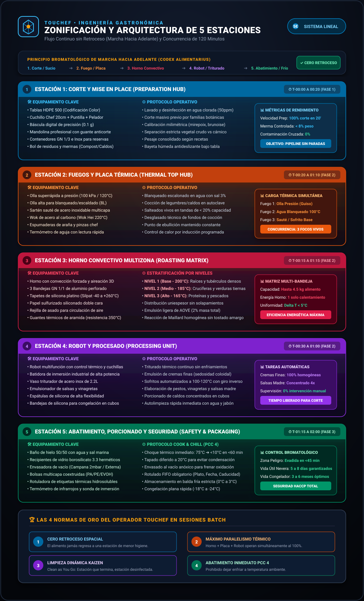
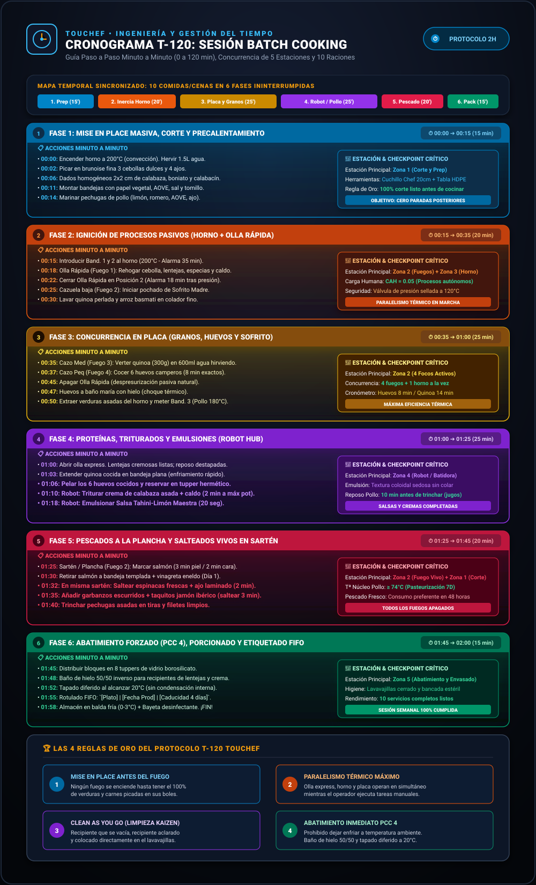
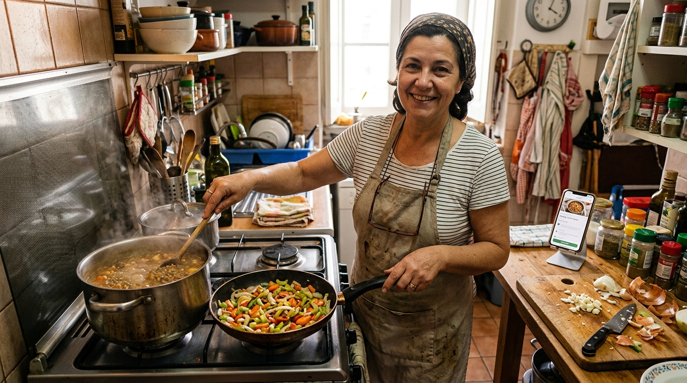
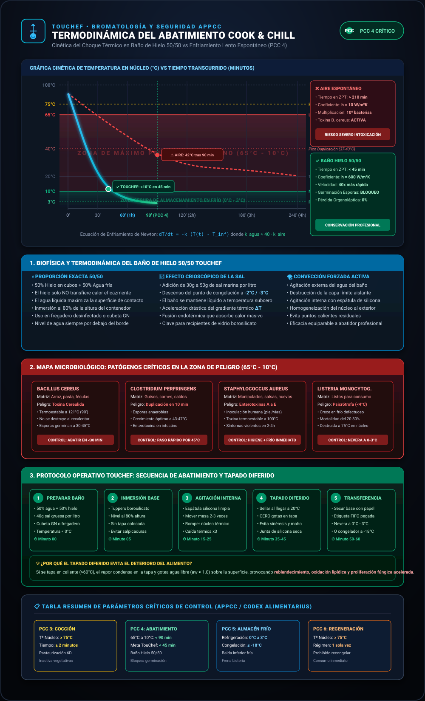

# ⏱️ MANUAL MAESTRO DE EJECUCIÓN EN 2 HORAS: MENÚS SEMANALES, CRONOGRAMAS MINUTO A MINUTO Y ENSAMBLADO EN 5 MINUTOS
**Documento Técnico:** `02_batch_cooking_sistemas / 02_menus_semanales_ejecucion_2h.md`  
**Autor:** Especialista en Batch Cooking y Organización Culinaria Eficiente — *TouChef / PrepMaster Engine*  
**Versión:** 2.0.0 (Protocolo de Producción de Alto Rendimiento)  
**Fecha de Publicación:** 19 de Agosto de 2026  

---

## 1. PROTOCOLO OPERATIVO DE LA SESIÓN T-120

El protocolo **T-120** está diseñado para transformar la cocina en una estación de producción sincronizada donde se elaboran **10 servicios completos (5 comidas + 5 cenas)** en una ventana ininterrumpida de **120 minutos**.

```
                           CRONOGRAMA ESTRUCTURAL T-120
0:00                  0:15                  0:45                  1:20           1:45         2:00
┌─────────────────────┬─────────────────────┬─────────────────────┬──────────────┬────────────┐
│   MISE EN PLACE     │  IGNICIÓN TÉRMICA   │ CONCURRENCIA PLACA  │  PROTEÍNAS Y │ABATIMIENTO │
│  Y CORTE MASIVO     │ (Horno + Olla Pres) │  (Granos + Sofrito) │  EMULSIONES  │ Y ENVASADO │
└─────────────────────┴─────────────────────┴─────────────────────┴──────────────┴────────────┘
```

### Checklist Pre-Vuelo (T-15 min antes del encendido):
- [ ] **Bancada 100% despejada** de pequeños electrodomésticos u objetos ajenos.
- [ ] **Fregadero vacío y desinfectado**; lavavajillas vacío con puerta entreabierta.
- [ ] **Tabla de corte fijada** con paño húmedo antideslizante inferior.
- [ ] **Cuchillos afilados** (cebollero principal de 20 cm y puntilla auxiliar).
- [ ] **Boles de trasvase y recipientes de vidrio herméticos** limpios y listos en la Zona 5.
- [ ] **Hervidor de agua lleno** o cazo auxiliar para disponer de agua hirviendo inmediata.
- [ ] **Horno conectado a $200^\circ\text{C}$ con ventilador** en el instante $T=0:00$.


> **Infografía Técnica Vertical TouChef:** Flujo espacial y concurrencia modular para la ejecución de menús semanales completos en 120 minutos sin paradas operativas.

---

## 2. MENÚ SEMANAL 1: "MEDITERRÁNEO INTEGRAL Y PROTEICO"
*Enfoque: Alto valor biológico, carbohidratos de bajo índice glucémico, grasas cardiosaludables y micronutrientes antiinflamatorios.*

### 2.1. Matriz de Menú Semanal (5 Días: 5 Comidas + 5 Cenas)

| Día | 🍽️ Comida (Almuerzo) | 🌙 Cena |
| :--- | :--- | :--- |
| **Lunes** | **Lentejas Pardinas Estofadas** con hortalizas de raíz, sofrito madre y toque de comino. | **Lomo de Salmón al Horno** con lecho de boniato asado, calabacín y vinagreta de eneldo. |
| **Martes** | **Pechuga de Pollo Marinada al Romero** con quinoa perlada al vapor y dados de calabaza asada. | **Crema Aterciopelada de Calabaza y Zanahoria Asada** con semillas de calabaza y huevo duro picado. |
| **Miércoles** | **Ensalada Templada de Lentejas y Quinoa** con dados de calabacín asado, tomates cherry confitados, queso feta y nueces. | **Wok Salteado de Tiras de Pollo y Verduras Asadas** con arroz basmati integral y sésamo tostado. |
| **Jueves** | **Garbanzos Salteados con Espinacas Frescas**, calabaza asada y taquitos de jamón ibérico. | **Tortilla Jugosa de Calabacín y Cebolla Pochada** acompañada de crema de calabaza y zanahoria. |
| **Viernes** | **Power Bowl Proteico:** Pollo desmenuzado, quinoa perlada, hojas de espinaca crudas, boniato asado y salsa tahini-limón. | **Lomos de Merluza / Pescado Blanco a la Plancha** con guarnición de verduras asadas y emulsión de AOVE y limón. |

---

### 2.2. Lista Consolidada de la Compra (Menú 1 - 2 a 4 Personas)

```
========================================================================================
LISTA DE LA COMPRA CONSOLIDADA — MENÚ 1 MEDITERRÁNEO INTEGRAL
========================================================================================

🥦 FRUTAS, VERDURAS Y HORTALIZAS:
  • Calabaza Butternut: 1 unidad grande (~1.5 kg)
  • Boniato / Batata: 2 unidades medianas (~600 g)
  • Calabacines medianos: 3 unidades (~750 g)
  • Cebollas dulces: 4 unidades (~800 g)
  • Zanahorias: 6 unidades (~600 g)
  • Pimientos rojos: 2 unidades (~400 g)
  • Tomates cherry: 1 tarrina (250 g)
  • Espinacas baby frescas: 2 bolsas grandes (600 g)
  • Ajos: 1 cabeza
  • Limones frescos: 3 unidades
  • Hierbas frescas: Romero, tomillo y eneldo (1 manojo c/u)

🥩 CARNICERÍA Y PESCADERÍA:
  • Pechugas de pollo enteras de corral: 1.2 kg
  • Lomos de salmón fresco: 4 unidades (~600 g)
  • Lomos de merluza fresca / bacalao: 4 unidades (~600 g)
  • Taquitos de jamón ibérico: 150 g

🥫 DESPENSA SECA Y GRANOS:
  • Lentejas pardinas secas: 400 g
  • Garbanzos cocidos en tarro de vidrio: 2 tarros de 400 g netos (800 g)
  • Quinoa perlada real: 300 g
  • Arroz basmati integral: 250 g
  • Nueces peladas y semillas de calabaza/sésamo: 150 g

🥚 REFRIGERADOS Y LÁCTEOS:
  • Huevos camperos (categoría 0/1): 1 docena (12 unidades)
  • Queso Feta D.O.P.: 1 bloque (200 g)
  • Caldo artesano de ave o verduras en brik: 1 litro

🫒 CONDIMENTOS Y ACEITES:
  • Aceite de Oliva Virgen Extra (AOVE): 500 ml
  • Pasta de sésamo (Tahini): 100 g
  • Mostaza de Dijon, comino molido, pimentón dulce, sal marina y pimienta negra en grano.
========================================================================================
```

---

### 2.3. Cronograma Minuto a Minuto de la Sesión (00:00 a 120:00)

```
[00:00 - 00:15] BLOQUE 1: MISE EN PLACE MASIVA Y PRECALENTAMIENTO
├── 00:00 • Encender horno a 200°C con ventilador. Llenar hervidor con 1.5L de agua y activar.
├── 00:02 • Pelar y picar en brunoise fina 3 cebollas dulces y 4 dientes de ajo (separar en bol).
├── 00:06 • Pelar y cortar en dados homogéneos de 2x2 cm: calabaza (1.2 kg), boniatos (600 g) y calabacines (750 g).
├── 00:11 • Disponer dados de calabaza, boniato y calabacín en 2 bandejas de horno con papel sulfurizado.
│           Aliñar con 3 cucharadas de AOVE, sal, pimienta y tomillo.
└── 00:14 • Cortar pechugas de pollo en filetes gruesos y marinar con zumo de 1 limón, 2 cdas AOVE, romero y ajo picado.

[00:15 - 00:35] BLOQUE 2: ACTIVACIÓN DE MAQUINARIA PASIVA (HORNO + OLLA RÁPIDA)
├── 00:15 • INTRODUCIR BANDEJA 1 Y 2 AL HORNO (Calabaza, boniato y calabacín a 200°C - Temporizador: 35 min).
├── 00:18 • FUEGO 1 (OLLA A PRESIÓN): Añadir 2 cdas AOVE, sofreír 1/3 de la cebolla picada y 1 diente de ajo por 2 min.
│           Añadir 400g lentejas pardinas, 2 zanahorias en rodajas, 1 hoja de laurel, 1 cdta pimentón dulce y 1 cdta comino.
│           Cubrir con 1L de agua caliente + 250ml caldo de ave. Cerrar tapa express en Posición 2.
│           Al subir la válvula, bajar a fuego medio-bajo (Temporizador: 18 min).
├── 00:25 • FUEGO 2 (CAZUELA / COCOTTE): Añadir 3 cdas AOVE y el resto de la cebolla picada a fuego medio-bajo con una pizca de sal.
│           Iniciar el pochado lento del "Sofrito Madre" (remover periódicamente).
└── 00:30 • Lavar quinoa en colador fino bajo agua fría. Lavar arroz basmati integral.

[00:35 - 01:00] BLOQUE 3: COCCIONES DE PLACA PARALELAS (GRANOS, HUEVOS Y SOFRITO)
├── 00:35 • FUEGO 3 (CAZO MEDIO): Verter quinoa escurrida (300g) con 600ml de agua hirviendo y sal.
│           Tapar y cocer a fuego bajo durante 14 minutos exactos hasta absorción total.
├── 00:37 • FUEGO 4 (CAZO PEQUEÑO): Hervir agua. Introducir 6 huevos camperos con cuchara.
│           Cocer 8 minutos exactos. Al sonar alarma, transferir inmediatamente a un bol con agua helada para frenar cocción.
├── 00:45 • ALARMA OLLA RÁPIDA: Apagar Fuego 1 y retirar del foco de calor. Dejar despresurizar de forma natural.
├── 00:50 • ALARMA HORNO BANDEJAS: Extraer verduras asadas. Reservar la mitad de la calabaza para la crema.
│           REDUCIR HORNO A 180°C.
└── 00:52 • INTRODUCIR BANDEJA 3 AL HORNO: Pechugas de pollo marinadas y tomates cherry enteros (Temporizador: 22 min).

[01:00 - 01:25] BLOQUE 4: PROTEÍNAS, TRITURADOS Y EMULSIONES (ROBOT)
├── 01:00 • Despresurizar totalmente olla rápida y abrir. Comprobar textura de lentejas (cremosas y enteras). Reservar destapadas.
├── 01:03 • Retirar Fuego 3 (Quinoa lista). Extender la quinoa en una bandeja plana para enfriamiento rápido.
├── 01:06 • Pelar los 6 huevos duros enfriados y reservar en táper hermético cubiertos con papel húmedo.
├── 01:10 • ZONA ROBOT / BATIDORA: Introducir la calabaza asada reservada (aprox. 600g) + 2 zanahorias cocidas de las lentejas + 
│           400ml de caldo caliente + 1 cda de tahini + toque de pimienta. Triturar a máxima potencia 2 min hasta textura aterciopelada.
│           Verter en jarra o recipiente de vidrio.
├── 01:18 • ZONA ROBOT (EMULSIÓN): En vaso batidor pequeño mezclar: 6 cdas AOVE + 2 cdas zumo de limón + 1 cda mostaza de Dijon + 
│           1 cda tahini + 2 cdas agua tibia + sal y pimienta. Emulsionar 20 seg. (Salsa Tahini-Limón Maestra).
└── 01:22 • ALARMA HORNO POLLO: Extraer pechugas asadas y tomates cherry confitados. Dejar reposar 10 min para retener jugos.

[01:25 - 01:45] BLOQUE 5: COCCIÓN RÁPIDA DE PESCADOS Y SALTEADOS
├── 01:25 • FUEGO 2 (SARTÉN AMPLIA / PLANCHA): Calentar 1 cda AOVE a fuego vivo. Marcar los lomos de salmón (3 min por el lado de la piel,
│           dar la vuelta 2 min). Retirar inmediatamente a bandeja templada (el pescado del lunes se consume fresco).
├── 01:32 • En la misma sartén, saltear 1 bolsa de espinacas (300g) con 1 diente de ajo laminado durante 2 min (solo marchitar).
│           Mezclar con 1 tarro de garbanzos lavados y escurridos + taquitos de jamón ibérico. Saltear 3 min.
└── 01:40 • Cortar la mitad de las pechugas de pollo en tiras y la otra mitad en filetes limpios.

[01:45 - 02:00] BLOQUE 6: ABATIMIENTO, PORCIONADO Y ETIQUETADO BROMATOLÓGICO
├── 01:45 • Disponer los recipientes de vidrio en la Zona 5 sobre paños fríos:
│           1. Recipiente 1: Lentejas estofadas (Raciones Lunes + Miércoles).
│           2. Recipiente 2: Quinoa perlada cocida suelta.
│           3. Recipiente 3: Verduras asadas mixtas (Calabaza, boniato, calabacín).
│           4. Recipiente 4: Pechugas de pollo asadas (lonchas y tiras).
│           5. Recipiente 5: Salmón marcado con vinagreta de eneldo (Consumo preferente: Lunes).
│           6. Recipiente 6: Garbanzos salteados con espinacas y jamón.
│           7. Botella/Jarra Vidrio: Crema aterciopelada de calabaza y zanahoria.
│           8. Biberón/Tarro: Salsa Tahini-Limón emulsionada.
│           9. Recipiente 7: Huevos camperos cocidos enteros.
├── 01:54 • Rotular etiquetas con cinta de pintor y marcador indeleble: `[Nombre Componente] | [Fecha Prod] | [Consumo Max: 4 días]`.
├── 01:57 • Almacenar en el refrigerador en las baldas correspondientes (Salmón y pollo en balda fría central; verduras y cremas en balda superior).
└── 02:00 • Limpieza final: Bayeta con desinfectante en bancadas y cierre del lavavajillas. FIN DE SESIÓN.
```


> **Infografía Técnica Vertical TouChef:** Cronograma visual paso a paso minuto a minuto (0 a 120 min), asignación de 5 estaciones concurrentes y las 4 reglas de oro del protocolo T-120 para completar 10 servicios semanales sin paradas operativas.


> **Fotografía Real Operativa:** Bandejas de asado simultáneo por niveles con verduras densas y proteínas protegidas para aprovechamiento térmico óptimo del horno convectivo.

---

### 2.4. Tabla Gantt de Concurrencia Térmica (Menú 1)

| Recurso / Estación | 0:00 - 0:15 | 0:15 - 0:30 | 0:30 - 0:45 | 0:45 - 1:00 | 1:00 - 1:15 | 1:15 - 1:30 | 1:30 - 1:45 | 1:45 - 2:00 |
| :--- | :--- | :--- | :--- | :--- | :--- | :--- | :--- | :--- |
| **Horno (200°C / 180°C)** | Precalentando | 🟨 Verduras Asadas (Bandejas 1 & 2) | 🟨 Verduras Asadas | 🟩 Pollo Marinado + Cherrys | 🟩 Pollo Marinado | Apagado / Reposo | — | — |
| **Fuego 1 (Olla Rápida)** | — | 🟧 Sofrito + Presurización Lentejas | 🟧 Cocción Lentejas (18m) | Despresurización natural | Destapado / Reposo | — | — | — |
| **Fuego 2 (Sartén/Plancha)**| — | 🟫 Sofrito Cebolla | 🟫 Sofrito Cebolla | — | — | 🟦 Salmón Plancha | 🟪 Salteado Garbanzos | Limpieza |
| **Fuego 3 (Cazo Med)** | — | — | 🟨 Cocción Quinoa | 🟨 Quinoa reposo | Extendido bandeja | — | — | Limpieza |
| **Fuego 4 (Cazo Peq)** | — | — | 🥚 Huevos Duros (8m) | Choque agua con hielo | Pelado huevos | — | — | Limpieza |
| **Robot / Batidora** | — | — | — | — | 🟨 Crema Calabaza | 🟫 Emulsión Tahini | Aclarado robot | — |
| **Tabla de Corte (Prep)** | 🔪 Mise en place | 🔪 Picar cebollas | 🔪 Cortar pollo | 🔪 Limpiar tabla | 🔪 Pelar huevos | 🔪 Trocear pollo | Limpieza tabla | — |
| **Zona Abatimiento (Pack)**| Disponer tuppers | — | — | — | Enfriar quinoa | Enfriar bandejas | Porcionado boles| 🏷️ Etiquetado / Nevera |


> **Fotografía Real Operativa:** Resultado final de la sesión de 2 horas: tuppers herméticos de vidrio borosilicato porcionados y listos para ensamblaje diario en 5 minutos.

---

### 2.5. Guía de Ensamblado Diario Express en 5 Minutos (Menú 1)

#### ☀️ LUNES
- **Comida (Lentejas Estofadas):** Verter 2 cazos de lentejas estofadas en un plato hondo. Calentar en microondas 90 seg a 800W con tapa antisalpicaduras. Añadir un chorrito de AOVE virgen extra en crudo y unas gotas de vinagre de Jerez o piparras picadas. *(Tiempo: 3 min)*.
- **Cena (Salmón con Boniato y Calabacín):** Calentar 1 minuto en microondas o sartén los dados de boniato y calabacín asados. Servir el lomo de salmón encima a temperatura ambiente o templado. Rociar con la vinagreta de eneldo y limón. *(Tiempo: 4 min)*.

#### ☀️ MARTES
- **Comida (Pollo con Quinoa y Calabaza):** Servir en un plato llano una base de quinoa perlada (150g), dados de calabaza asada (150g) y 1 pechuga de pollo fileteada. Templar 90 seg en microondas. Salsear con 2 cucharadas de salsa Tahini-Limón. *(Tiempo: 3 min)*.
- **Cena (Crema de Calabaza con Huevo Duro):** Calentar en un cazo o microondas 350ml de crema de calabaza y zanahoria (2 min). Servir en bol hondo, picar 1 huevo duro por encima, añadir semillas de calabaza tostadas y un hilo de AOVE. *(Tiempo: 4 min)*.

#### ☀️ MIÉRCOLES
- **Comida (Ensalada Templada de Lentejas y Quinoa):** En un bol grande mezclar 4 cdas de lentejas escurridas, 4 cdas de quinoa, dados de calabacín asado y tomates cherry confitados. Desmenuzar 50g de queso feta y añadir nueces picadas. Aliñar con vinagreta de mostaza. *(Tiempo: 4 min - Plato frío/templado)*.
- **Cena (Wok de Pollo y Verduras con Arroz):** En una sartén a fuego vivo con 1 cdta de AOVE, saltear durante 2 minutos las tiras de pollo asado, dados de verduras y 150g de arroz basmati integral. Añadir 1 cda de salsa de soja tamari y espolvorear sésamo. *(Tiempo: 4 min)*.

#### ☀️ JUEVES
- **Comida (Garbanzos con Espinacas y Calabaza):** Calentar el recipiente de garbanzos salteados con espinacas y jamón durante 2 minutos en sartén o microondas. Añadir dados de calabaza asada templados por encima. *(Tiempo: 3 min)*.
- **Cena (Tortilla de Calabacín con Crema):** Batir 2 huevos con sal y pimienta. Cuajar en sartén con 3 cucharadas de calabacín y cebolla asada durante 2 minutos (jugosa por dentro). Acompañar con un vaso caliente de crema de calabaza. *(Tiempo: 5 min)*.

#### ☀️ VIERNES
- **Comida (Power Bowl Proteico):** Disponer una cama de espinacas baby crudas en la base del bol. Añadir por sectores: quinoa perlada fría, pollo desmenuzado, boniato asado y tomates cherry. Coronar con semillas de sésamo y salsa Tahini-Limón. *(Tiempo: 3 min)*.
- **Cena (Merluza / Pescado a la Plancha con Verduras):** Marcar 2 lomos de merluza en sartén antiadherente con unas gotas de AOVE durante 2 min por cara. Servir con las últimas verduras asadas regeneradas en el microondas. *(Tiempo: 5 min)*.

---

## 3. MENÚ SEMANAL 2: "CONFORT TRADICIONAL IBÉRICO Y GUISOS REGENERABLES"
*Enfoque: Sabores tradicionales de cuchara, cocciones lentas optimizadas en olla express, aprovechamiento integral y salsas reducidas sin harinas refinadas.*

### 3.1. Matriz de Menú Semanal (5 Días: 5 Comidas + 5 Cenas)

| Día | 🍽️ Comida (Almuerzo) | 🌙 Cena |
| :--- | :--- | :--- |
| **Lunes** | **Guiso de Ternera Mechada** en su propio jugo glaseado con patatas chasqueadas y zanahorias baby. | **Sopa de Picadillo Reconfortante:** Caldo de ave concentrado con fideos finos, huevo duro picado y jamón. |
| **Martes** | **Arroz Meloso de Verduras y Garbanzos** con base de sofrito de pimiento choricero y tomate concentrado. | **Pisto Manchego Tradicional** con huevo a la plancha de yema fluida y pan integral tostado. |
| **Miércoles** | **Lomo de Cerdo Asado a la Mostaza Antigua** con puré rústico de patata y compota de manzana. | **Crema Suave de Calabacín, Puerro y Patata** con lascas de queso curado y picatostes. |
| **Jueves** | **Ensalada Campera Tradicional:** Patatas cocidas, judías verdes al dente, atún claro, huevo duro y cebolleta. | **Tosta Rústica de Ternera Mechada Desmenuzada** con pimientos asados confitados y hojas de rúcula. |
| **Viernes** | **Potaje de Garbanzos con Bacalao y Espinacas** trabado con majado tradicional de ajo y almendras. | **Hamburguesas Caseras de Pollo/Pavo** a la plancha con guarnición de pisto manchego y canónigos. |

---

### 3.2. Lista Consolidada de la Compra (Menú 2)

```
========================================================================================
LISTA DE LA COMPRA CONSOLIDADA — MENÚ 2 CONFORT TRADICIONAL IBÉRICO
========================================================================================

🥩 CARNICERÍA Y PESCADERÍA:
  • Morcillo o aguja de ternera para guisar: 1.2 kg (en tacos grandes)
  • Cinta de lomo de cerdo fresca (pieza entera): 1 kg
  • Lomos de bacalao desalado: 500 g
  • Carcasa de pollo + hueso de jamón + punta de ternera (para caldo): 800 g
  • Jamón serrano / ibérico en taquitos y lonchas: 200 g
  • Atún claro en aceite de oliva: 3 latas (240 g netos)

🥦 FRUTAS, VERDURAS Y HORTALIZAS:
  • Patatas especiales para guisar (Monilisa o Kennebec): 2.5 kg
  • Cebollas dulces y cebolletas frescas: 6 unidades (~1.2 kg)
  • Puerros gruesos: 3 unidades (~500 g)
  • Calabacines: 4 unidades (~1 kg)
  • Pimientos verdes italianos y pimientos rojos: 4 unidades (~700 g)
  • Tomates maduros para triturar / pera: 1 kg
  • Judías verdes planas: 400 g
  • Espinacas frescas: 1 bolsa (300 g)
  • Manzanas Golden o Reineta: 3 unidades
  • Dientes de ajo frescos: 1 cabeza grande
  • Perejil fresco de hoja plana: 1 manojo

🥫 DESPENSA Y GRANOS:
  • Garbanzos secos pedrosillanos (o 3 tarros cocidos de 400g): 500 g
  • Arroz bomba / redondo: 300 g
  • Fideos finos de cabello de ángel: 150 g
  • Carne de pimiento choricero: 1 tarro pequeño (100 g)
  • Almendras crudas sin piel: 50 g

🥚 REFRIGERADOS Y CONDIMENTOS:
  • Huevos camperos: 1 docena (12 unidades)
  • Queso curado manchego: 150 g
  • Vino blanco seco (Montilla-Moriles o Rueda): 250 ml
  • AOVE, vinagre de Jerez, laurel, pimentón dulce, hebras de azafrán, sal y pimienta.
========================================================================================
```

---

### 3.3. Cronograma Minuto a Minuto de la Sesión (00:00 a 120:00)

```
[00:00 - 00:15] BLOQUE 1: MISE EN PLACE Y FONDOS INICIALES
├── 00:00 • Encender horno a 190°C. Poner a calentar 2L de agua en olla grande.
├── 00:02 • FUEGO 1 (OLLA RÁPIDA - FONDOS): Dorar con 1 cda AOVE la carcasa de pollo, hueso de jamón y trozo de ternera (3 min).
│           Añadir 1 puerro, 1 zanahoria y 1 cebolla en mitades. Cubrir con 2L de agua. Cerrar olla rápida (15 min en presión 2).
├── 00:08 • Pelar patatas (2.5 kg). Chascar 1 kg en trozos para el guiso de ternera. Cortar 1 kg en dados para cocer (ensalada campera/puré).
└── 00:13 • Picar en brunoise: 3 cebollas, 3 pimientos (rojo/verde) y 3 calabacines para el Pisto Manchego Maestro.

[00:15 - 00:40] BLOQUE 2: IGNICIÓN DE GUISOS Y HORNEADO DE LOMO
├── 00:15 • BANDEJA DE HORNO: Salpimentar la cinta de lomo de cerdo (1 kg). Pincelar con mostaza de Dijon antigua, 1 cda miel y romero.
│           Colocar en los laterales las 3 manzanas cortadas en cuartos. Introducir al horno a 180°C (Temporizador: 35 min).
├── 00:20 • ALARMA OLLA RÁPIDA CALDO: Despresurizar, colar el caldo a una cazuela limpia y reservar carne de picadillo desmenuzada.
├── 00:24 • FUEGO 1 (OLLA RÁPIDA - GUISO TERNERA): En la misma olla, sellar a fuego vivo los tacos de ternera con 2 cdas AOVE hasta dorar costra.
│           Añadir 1 cebolla picada, 2 ajos enteros, 1 cda carne de pimiento choricero y desglasar con 150ml de vino blanco.
│           Incorporar las patatas chascadas y 2 zanahorias en rodajas. Cubrir con 600ml de caldo recién colado.
│           Cerrar olla rápida (Temporizador: 22 min en presión 2).
└── 00:30 • FUEGO 2 (CAZUELA ANCHA): Añadir 4 cdas AOVE e iniciar el Pisto Manchego (cebolla + pimientos a fuego medio 10 min).

[00:40 - 01:05] BLOQUE 3: PISTO MANCHEGO, PATATAS CAMPERAS Y HUEVOS
├── 00:40 • FUEGO 2: Incorporar el calabacín y 500g de tomate maduro triturado al pisto. Bajar fuego y pochar tapado 25 min.
├── 00:43 • FUEGO 3 (OLLA MEDIANA): Hervir agua con sal. Añadir las patatas en dados y las judías verdes limpias troceadas.
│           Cocer 15 minutos hasta que la patata esté tierna pero firme.
├── 00:48 • FUEGO 4 (CAZO PEQUEÑO): Cocer 6 huevos camperos durante 8 minutos exactos. Pasar a baño maría de agua con hielo.
├── 00:55 • ALARMA HORNO LOMO: Extraer lomo asado y manzanas. Dejar reposar la carne envuelta en papel aluminio 15 min antes de cortar.
└── 00:58 • Triturar las manzanas asadas con el jugo del fondo de la bandeja para obtener una compota sedosa instantánea.

[01:05 - 01:30] BLOQUE 4: CREMA DE PUERRO/CALABACÍN Y POTAJE EXPRESS
├── 01:05 • ALARMA OLLA RÁPIDA TERNERA: Dejar despresurizar de forma natural. Comprobar que la ternera se deshace al toque del tenedor.
├── 01:10 • Escurrir patatas y judías verdes de Fuego 3. Reservar la mitad para Ensalada Campera y aplastar la otra mitad con tenedor +
│           compota de manzana y 1 cda de AOVE (Puré Rústico listo).
├── 01:15 • FUEGO 3 (REUTILIZADO PARA CREMA): Rehogar 2 puerros y 2 calabacines troceados con 1 cda AOVE por 4 min.
│           Cubrir con 400ml de caldo de ave y cocer 12 minutos.
├── 01:20 • FUEGO 1 (DESTAPADO - POTAJE DE BACALAO): En el caldo sobrante o fondo de cazuela, añadir 1 tarro de garbanzos cocidos,
│           150g de espinacas frescas y los lomos de bacalao en dados. Cocer a fuego lento 6 minutos con un majado de almendras y ajo frito.
└── 01:28 • Apagar fuego de Pisto Manchego (espeso, confitado y brillante).

[01:30 - 01:45] BLOQUE 5: TRITURADO Y CORTE DE FILETES
├── 01:30 • ZONA ROBOT: Triturar el contenido de la crema de calabacín y puerro a máxima potencia hasta textura fina.
├── 01:35 • Cortar el lomo de cerdo asado en lonchas finas de 0.5 cm con cuchillo jamonero o cebollero muy afilado.
├── 01:40 • Pelar los 6 huevos cocidos. Separar 3 para picadillo/sopa y 3 para la ensalada campera.
└── 01:43 • Desmenuzar una ración de ternera mechada con dos tenedores para las tostas del jueves.

[01:45 - 02:00] BLOQUE 6: ABATIMIENTO, PORCIONADO Y ALMACENAJE
├── 01:45 • Disponer los 8 recipientes herméticos sobre la bancada fría:
│           1. Guiso de ternera mechada con salsa glaseada.
│           2. Caldo concentrado de ave (en botella de vidrio) + carne y huevos de picadillo.
│           3. Pisto manchego tradicional confitado.
│           4. Lonchas de lomo asado + puré rústico de patata y manzana.
│           5. Crema suave de calabacín y puerro.
│           6. Base de ensalada campera (patata + judías verdes + atún).
│           7. Potaje express de garbanzos con bacalao y espinacas.
│           8. Ternera mechada desmenuzada en su jugo.
├── 01:54 • Etiquetado con fechado y asignación de balda en refrigerador (Bacalao y Pisto en consumo preferente días 1-2).
└── 02:00 • Limpieza Kaizen y sanitización final de superficies. FIN DE SESIÓN.
```

---

### 3.4. Tabla Gantt de Concurrencia Térmica (Menú 2)

| Recurso / Estación | 0:00 - 0:15 | 0:15 - 0:30 | 0:30 - 0:45 | 0:45 - 1:00 | 1:00 - 1:15 | 1:15 - 1:30 | 1:30 - 1:45 | 1:45 - 2:00 |
| :--- | :--- | :--- | :--- | :--- | :--- | :--- | :--- | :--- |
| **Horno (190°C)** | Precalentando | 🥩 Lomo de Cerdo + Manzanas | 🥩 Lomo Asado (35m) | Reposo lomo | — | — | — | — |
| **Fuego 1 (Olla Rápida)** | 🍲 Caldo de Ave Express (15m) | 🍲 Colar caldo | 🥘 Guiso Ternera Mechada (22m) | 🥘 Cocción ternera | Despresurizar | 🐟 Potaje Bacalao (6m) | — | Limpieza |
| **Fuego 2 (Cazuela)** | — | 🍅 Sofrito Pisto | 🍅 Pisto Confitado | 🍅 Pisto Tapado | 🍅 Pisto reducción | Reposo pisto | — | Limpieza |
| **Fuego 3 (Olla Aux)** | 💧 Hervir agua | — | 🥔 Patatas y Judías (15m) | Escurrido | 🥣 Base Crema Puerro | 🥣 Cocción crema | — | Limpieza |
| **Fuego 4 (Cazo Peq)** | — | — | — | 🥚 Huevos Duros (8m) | Choque helado | Pelado | — | Limpieza |
| **Robot / Batidora** | — | — | — | 🍎 Compota Manzana | — | — | 🥣 Triturar Crema | Aclarado |
| **Tabla de Corte** | 🔪 Mise en place | 🔪 Chascar patatas | 🔪 Picar pisto | 🔪 Deshuesar ave | 🔪 Pelar huevos | 🔪 Lonchear lomo | 🔪 Desmenuzar ternera | Limpieza |
| **Zona Envasado** | Preparar tuppers | — | — | — | Enfriar bandejas | Enfriar guiso | Porcionado boles | 🏷️ Nevera |

---

### 3.5. Guía de Ensamblado Diario Express en 5 Minutos (Menú 2)

#### ☀️ LUNES
- **Comida (Guiso de Ternera Mechada con Patatas):** Servir 2 cazos generosos de carne de ternera, patatas y salsa trabada en plato hondo. Calentar en microondas 2 min a 800W. Espolvorear perejil fresco picado. *(Tiempo: 3 min)*.
- **Cena (Sopa de Picadillo Reconfortante):** Calentar 350ml de caldo de ave en un cazo hasta hervir. Añadir 30g de fideos finos y cocer 2 minutos. Verter en bol hondo y añadir 2 cucharadas de huevo duro picado, taquitos de jamón y pollo desmenuzado. *(Tiempo: 4 min)*.

#### ☀️ MARTES
- **Comida (Arroz Meloso de Verduras y Garbanzos):** En una sartén, calentar 3 cucharadas de pisto manchego con 1 cazo de caldo de ave caliente. Añadir 150g de garbanzos cocidos y 150g de arroz ya cocido. Mantecar a fuego vivo durante 3 minutos hasta que quede meloso y brillante. *(Tiempo: 4 min)*.
- **Cena (Pisto Manchego con Huevo a la Plancha):** Calentar 250g de pisto manchego en el plato (90 seg microondas). En una sartén con 1 cdta de AOVE, hacer un huevo a la plancha con puntilla (2 min). Colocar sobre el pisto y romper la yema con pan tostado. *(Tiempo: 4 min)*.

#### ☀️ MIÉRCOLES
- **Comida (Lomo Asado con Puré Rústico):** Regenerar las lonchas finas de lomo de cerdo en sartén tapada con 2 cucharadas de jugo durante 1 minuto (para no resecar la carne). Servir junto a 2 bolas de puré rústico de patata y compota de manzana templada. *(Tiempo: 4 min)*.
- **Cena (Crema de Calabacín y Puerro con Queso):** Calentar en bol 350ml de crema de calabacín (2 min). Coronar con lascas finas de queso curado manchego y picatostes de pan integral crujientes. *(Tiempo: 3 min)*.

#### ☀️ JUEVES
- **Comida (Ensalada Campera Tradicional):** Sacar el táper de patatas y judías verdes cocidas. Añadir 1 lata de atún claro escurrido, 1 huevo duro en cuartos, 2 cucharadas de cebolleta fresca picada y tomates cherry. Aliñar con AOVE virgen extra, vinagre de Jerez y sal en escamas. *(Tiempo: 3 min - Plato frío)*.
- **Cena (Tosta Rústica de Ternera Mechada):** Tostar 2 rebanadas gruesas de pan de masa madre. Untar una base de pimientos asados confitados, disponer la ternera mechada caliente por encima y terminar con unas hojas de rúcula y pimienta negra recién molida. *(Tiempo: 5 min)*.

#### ☀️ VIERNES
- **Comida (Potaje de Garbanzos con Bacalao y Espinacas):** Verter el potaje en una cazuela pequeña o bol. Calentar a fuego suave durante 3 minutos para que el caldo ligue y el bacalao suelte su gelatina natural. Servir bien caliente. *(Tiempo: 4 min)*.
- **Cena (Hamburguesas Caseras con Pisto):** Dorar 2 hamburguesas de pollo/pavo en sartén 2.5 minutos por lado. Servir acompañadas de 3 cucharadas de pisto manchego templado y una ensalada verde de canónigos. *(Tiempo: 5 min)*.

---

## 4. MATRIZ BROMATOLÓGICA DE CONSERVACIÓN Y REGENERACIÓN TÉRMICA

### 4.1. Vida Útil y Asignación de Almacenamiento

| Tipo de Preparación / Alimento | Nevera ($\le 4^\circ\text{C}$) | Congelador ($-18^\circ\text{C}$) | Método Óptimo de Regeneración |
| :--- | :--- | :--- | :--- |
| **Pescados frescos cocinados / mariscada** | 48 horas máx. | 2 meses | Sartén suave tapada con 1 cda de caldo/agua (no sobrecocinar). |
| **Guisos de carne y legumbres en salsa** | 4 a 5 días | 3 a 4 meses | Cazo a fuego medio añadiendo unas gotas de agua para recuperar fluidez. |
| **Pechugas de pollo asadas / fileteadas** | 4 días | 2 meses | Sartén con tapa a fuego medio 90 seg con unas gotas de aceite o caldo. |
| **Cremas y purés vegetales emulsionados** | 5 días | 3 meses | Cazo o microondas removiendo con varilla para homogeneizar la emulsión. |
| **Granos cocidos (Quinoa, Arroz basmati)** | 4 días | 1 mes | Salteado en sartén a fuego vivo con unas gotas de AOVE (recupera grano suelto). |
| **Patatas cocidas en trozos / guisadas** | 3 a 4 días | ❌ NO congelar (el almidón cristaliza y se vuelve arenoso) | Microondas o fuego suave sin remover bruscamente para no romper el tubérculo. |
| **Huevos duros cocidos con cáscara** | 7 días | ❌ NO congelar | Consumo frío directo tras pelar. |


> **Infografía Técnica Vertical TouChef:** Curvas de abatimiento en baño de hielo 50/50 y control microbiológico del Punto Crítico de Control (PCC 4) para la conservación segura de raciones semanales.

---

## 5. CONCLUSIÓN DEL SISTEMA DE PRODUCCIÓN TOUCHEF

Al completar cualquiera de estos dos menús mediante el **Protocolo T-120**, el hogar dispone de:
1. **10 comidas/cenas de alta calidad nutricional**, sin aditivos ni conservantes industriales.
2. **Reducción del estrés cognitivo semanal a cero:** Se elimina la pregunta diaria "¿Qué hay de comer hoy?".
3. **Control exacto del gasto de supermercado:** Se compra únicamente lo planificado en la matriz, eliminando mermas y residuos en la nevera.
4. **Alimentación flexible y variada:** El ensamble modular permite adaptar cada ración al apetito o preferencia del comensal en menos de 300 segundos.
