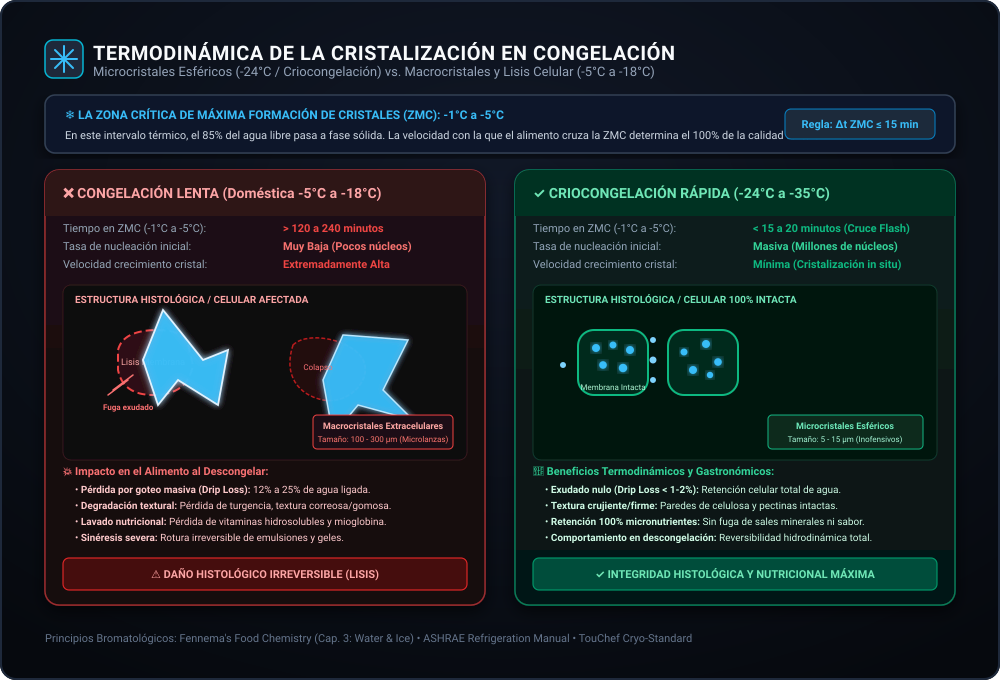
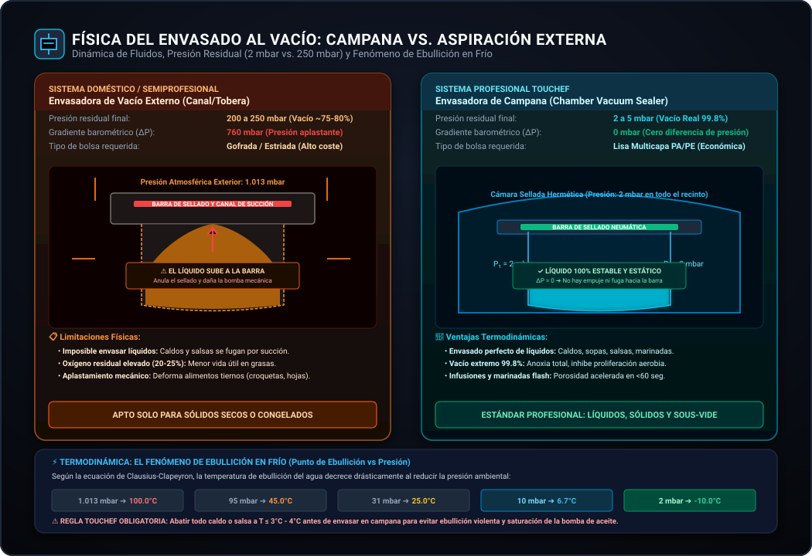
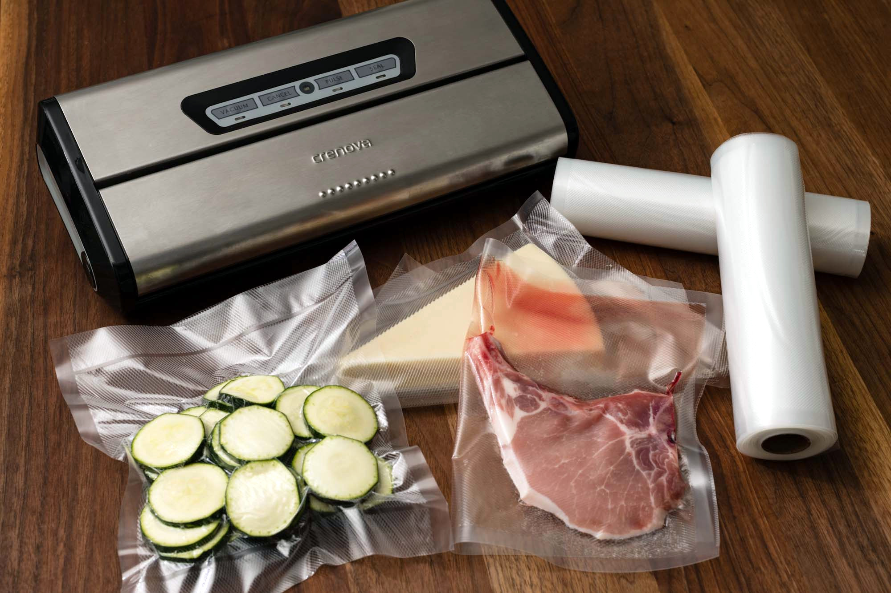
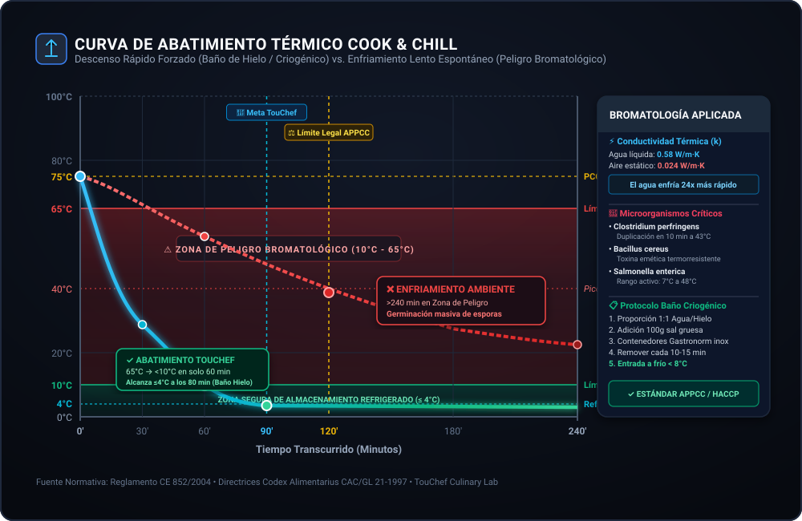
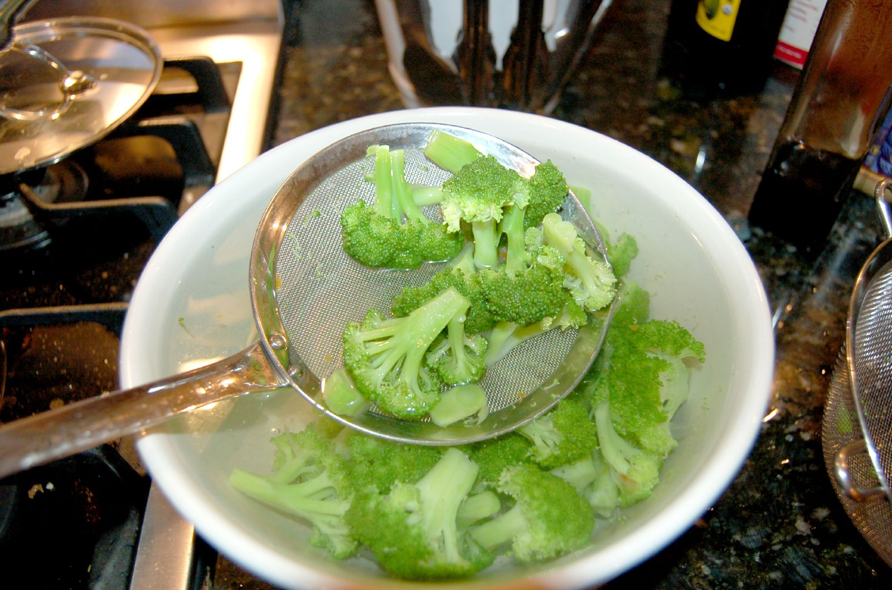
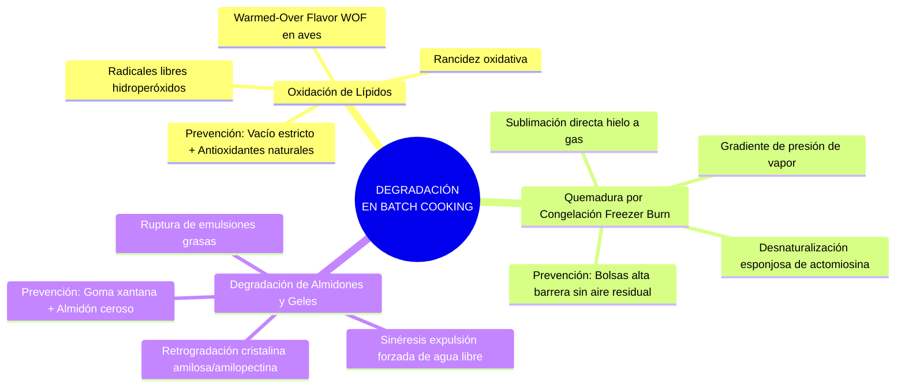

# 🧊 Ingeniería de Conservación en Batch Cooking: Termodinámica del Frío, Envasado al Vacío y Cinética de Degradación

> **Documento Técnico de Referencia — TouChef Process Engineering Standard (PES-03)**  
> **Área:** Tecnología de los Alimentos, Sistemas Cook & Chill y Preservación Organoléptica  
> **Destinatarios:** Ingenieros de Procesos Culinarios, Chefs Ejecutivos, Diseñadores de Menús Batch Cooking  
> **Revisión:** 2.4 | **Estado:** Aprobado para Producción

---

## 1. Termodinámica del Frío y Fisiología Celular del Alimento

El control térmico es el vector primario de conservación biológica y fisicoquímica en la ingeniería de procesos culinarios. La refrigeración y la congelación no son meras reducciones térmicas pasivas, sino manipulaciones cinéticas directas sobre la **ecuación de Arrhenius**, el coeficiente térmico $Q_{10}$, la actividad de agua ($a_w$) y el estado de agregación molecular del agua intracelular y extracelular.

```
                  ┌─────────────────────────────────────────────────────────┐
                  │                 TERMODINÁMICA DEL FRÍO                  │
                  └────────────────────────────┬────────────────────────────┘
                                               │
               ┌───────────────────────────────┴───────────────────────────────┐
               ▼                                                               ▼
┌───────────────────────────────┐                               ┌───────────────────────────────┐
│         REFRIGERACIÓN         │                               │          CONGELACIÓN          │
│          (0°C a 4°C)          │                               │        (-18°C a -24°C)        │
├───────────────────────────────┤                               ├───────────────────────────────┤
│ • Estado: Agua Líquida        │                               │ • Estado: Transición a Hielo  │
│ • Inhibición cinética         │                               │ • Inmovilización de aw (<0.6) │
│ • Ralentización bacteriana    │                               │ • Detención metabólica total  │
│ • Vida útil: Días             │                               │ • Vida útil: Meses            │
└──────────────┬────────────────┘                               └──────────────┬────────────────┘
               │                                                               │
               ▼                                                               ▼
┌───────────────────────────────┐                               ┌───────────────────────────────┐
│     RIESGO MICROBIOLÓGICO     │                               │      ZONA CRÍTICA: -1°C/-5°C  │
│ Listeria monocytogenes        │                               │ Rápida  -> Microcristales (OK)│
│ Yersinia enterocolitica       │                               │ Lenta   -> Macrocristales (KO)│
└───────────────────────────────┘                               └───────────────────────────────┘
```

### 1.1. Cinética Enzimática y Microbiológica ($Q_{10}$ y Arrhenius)

La tasa de reacción química, enzimática y metabólica bacteriana en matrices alimentarias responde a la relación de Arrhenius:

$$k = A \cdot e^{-\frac{E_a}{R \cdot T}}$$

Donde:
* $k$: Constante de velocidad de degradación o duplicación microbiana.
* $A$: Factor pre-exponencial de colisión molecular.
* $E_a$: Energía de activación de la reacción ($\text{J}\cdot\text{mol}^{-1}$).
* $R$: Constante universal de los gases ($8.314\,\text{J}\cdot\text{mol}^{-1}\cdot\text{K}^{-1}$).
* $T$: Temperatura termodinámica absoluta ($\text{K}$).

En el rango de $0^\circ\text{C}$ a $40^\circ\text{C}$, el coeficiente de temperatura $Q_{10}$ cuantifica cómo se reduce la tasa de proliferación microbiana al descender la temperatura $10^\circ\text{C}$:

$$Q_{10} = \left(\frac{k_2}{k_1}\right)^{\frac{10}{T_2 - T_1}}$$

En bacterias mesófilas patógenas (*Salmonella spp.*, *Escherichia coli*, *Staphylococcus aureus*), un descenso de temperatura desde $37^\circ\text{C}$ (temperatura óptima de proliferación) a $4^\circ\text{C}$ eleva el tiempo de duplicación ($\tau$) desde 20 minutos hasta el cese total de división celular.

> [!CAUTION]
> **Patógenos Psicrótrofos en Refrigeración ($0^\circ\text{C}$ a $4^\circ\text{C}$):**  
> *Listeria monocytogenes*, *Yersinia enterocolitica*, *Clostridium botulinum* Tipo E (no proteolítico) y *Aeromonas hydrophila* son capaces de multiplicarse a temperaturas sub-$4^\circ\text{C}$. Por ello, la refrigeración por sí sola es un obstáculo temporal y **debe combinarse con la reducción de oxígeno (vacío), acidificación ($pH$) o control estricto de vida útil**.

---

### 1.2. Refrigeración ($0^\circ\text{C}$ a $4^\circ\text{C}$) vs Congelación ($-18^\circ\text{C}$ a $-24^\circ\text{C}$)

| Parámetro Fisicoquímico | Refrigeración ($0^\circ\text{C}$ a $4^\circ\text{C}$) | Congelación Comercial / Doméstica ($-18^\circ\text{C}$ a $-24^\circ\text{C}$) |
| :--- | :--- | :--- |
| **Estado Físico del Agua ($H_2O$)** | Fase líquida activa ($a_w \approx 0.95 - 0.99$) | Fase sólida cristalina (hielo Ih), $a_w < 0.60$ |
| **Actividad Enzimática** | Ralentizada ($10\% - 25\%$ de velocidad basal) | Casi nula (reacciones lipoxigenasas residuales lentas) |
| **Proliferación Bacteriana** | Mesófilos inhibidos; psicrótrofos activos | Detención biológica total ($T < -12^\circ\text{C}$) |
| **Viabilidad de Esporas** | Latentes (posible germinación de psicrótrofos) | Latencia metabólica criogénica |
| **Impacto Estructural** | Turgencia y membrana celular intactas | Variable según tamaño y morfología de cristales de hielo |
| **Vida Útil Típica** | $3 - 10\text{ días}$ (según envasado) | $3 - 12\text{ meses}$ (sin degradación higiénica) |

---

### 1.3. Termodinámica de la Cristalización: Microcristales vs Macrocristales

La congelación de un alimento no ocurre instantáneamente a $0^\circ\text{C}$. Debido a la concentración de solutos (sales, azúcares, aminoácidos), el punto de congelación inicial desciende típicamente a entre $-0.5^\circ\text{C}$ y $-2.2^\circ\text{C}$ (**descenso crioscópico**).

#### La Zona de Máxima Formación de Cristales (ZMC)
El intervalo comprendido entre **$-1^\circ\text{C}$ y $-5^\circ\text{C}$** es la **Zona Crítica de Nucleación**. En este rango térmico se congela aproximadamente el $80\%$ del agua libre del alimento.

```mermaid
graph TD
    subgraph Congelacion_Lenta_Domestica ["CONGELACIÓN LENTA DOMÉSTICA (>6 horas en ZMC)"]
        A1[Enfriamiento Lento] --> B1[Baja Tasa de Nucleación]
        B1 --> C1[Migración Osmótica de Agua al Espacio Extracelular]
        C1 --> D1[Crecimiento de MACROCRISTALES Irregulares]
        D1 --> E1[Rotura Mecánica de Membranas Celulares]
        E1 --> F1["Pérdida Masiva de Exudado al Descongelar (Drip Loss: 8-18%)"]
    end

    subgraph Congelacion_Rapida_Criogenica ["CONGELACIÓN RÁPIDA / ABATIDOR (<30 min en ZMC)"]
        A2[Enfriamiento Ultra-Rápido] --> B2[Alta Tasa de Nucleación Homogénea]
        B2 --> C2[Inmovilización In Situ del Agua Intra y Extracelular]
        C2 --> D2[Formación de MICROCRISTALES Esféricos Diminutos]
        D2 --> E2[Integridad de Membranas y Fibras Miofibrilares Intacta]
        E2 --> F2["Mínimo Exudado al Descongelar (Drip Loss: <2%)"]
    end
```




> **Procedencia Técnica & Histología de Alimentos:** Análisis termodinámico y morfología cristalográfica según modelos de Fennema (*Food Chemistry*) y estándares criogénicos TouChef para prevención de lisis celular y *drip loss*.

#### Fisiopatología del Daño Celular (*Lisis Celular y Drip Loss*)

1. **Congelación Lenta Doméstica ($-18^\circ\text{C}$ estática):**
   - La baja velocidad de extracción calórica ($v < 0.2\,\text{cm/h}$) permite que el agua extracelular se congele primero (menor concentración osmótica).
   - El gradiente de presión de vapor extrae agua del interior celular por ósmosis.
   - Se forman **macrocristales extracelulares aciculares (agudos y de gran tamaño)** que actúan como microlanzas, perforando sarcolemas musculares y paredes celulares vegetales (pectinas y celulosa).
   - **Resultado:** Pérdida masiva de líquido sinovial/intracelular al descongelar (**Drip Loss** de hasta el $18\%$), arrastrando vitaminas hidrosolubles (complejo B, vitamina C), péptidos de sabor umami y dejando texturas gomosas o acorchadas.

2. **Congelación Rápida / Ultracongelación ($v > 2\,\text{cm/h}$):**
   - El cruce vertiginoso de la ZMC provoca una tasa de nucleación exponencialmente superior a la velocidad de crecimiento de cristal.
   - El agua se solidifica *in situ* tanto intracelular como extracelularmente formando **microcristales nanométricos esféricos**.
   - No hay lisis celular mecánica ni colapso de la matriz proteica.

---

## 2. Tecnología de Envasado al Vacío: Doméstico vs Profesional

El envasado al vacío (*Vacuum Packaging*) consiste en la evacuación forzada de la atmósfera gaseosa de un contenedor o bolsa termosellable, reduciendo la presión parcial de oxígeno ($pO_2$) a menos del $1\%$, y la presión atmosférica residual por debajo de umbrales críticos ($5 - 50\,\text{mbar}$).

```
                  ┌─────────────────────────────────────────────────────────┐
                  │                 TECNOLOGÍA DE VACÍO                     │
                  └────────────────────────────┬────────────────────────────┘
                                               │
               ┌───────────────────────────────┴───────────────────────────────┐
               ▼                                                               ▼
┌───────────────────────────────┐                               ┌───────────────────────────────┐
│         VACÍO EXTERNO         │                               │       CAMPANA DE VACÍO        │
│        (Gama Doméstica)       │                               │       (Gama Profesional)      │
├───────────────────────────────┤                               ├───────────────────────────────┤
│ • Succión directa por tobera  │                               │ • Despresurización total      │
│ • Presión: 200 a 350 mbar     │                               │ • Presión: 2 a 15 mbar        │
│ • Vacío real: 75% - 85%       │                               │ • Vacío real: 99.8% - 99.9%   │
│ • Bolsas gofradas obligatorias│                               │ • Bolsas lisas económicas     │
│ • NO tolera líquidos libres   │                               │ • Envasa caldos/salsas frías  │
└───────────────────────────────┘                               └───────────────────────────────┘
```

### 2.1. Comparativa Mecánica: Vacío Externo vs Campana de Vacío

| Característica Técnica | Envasadora de Vacío Externo (Canal/Tobera) | Envasadora de Campana (Chamber Sealer) |
| :--- | :--- | :--- |
| **Principio Físico** | Aspiración de aire directamente del interior de la bolsa desde el exterior | Despresurización homogénea de toda la cámara sellada mediante bomba rotativa de aceite |
| **Presión Residual Alcanzable** | $200 - 350\,\text{mbar}$ ($75\% - 85\%$ de vacío relativo) | **$2 - 15\,\text{mbar}$ ($99.8\% - 99.9\%$ de vacío absoluto)** |
| **Capacidad con Líquidos** | **Crítica / Limitada:** El diferencial de presión succiona el caldo hacia la barra de sellado, arruinando la soldadura | **Excelente:** La presión dentro y fuera de la bolsa es idéntica en la cámara; no hay succión del líquido |
| **Ebullición a Baja Temperatura** | No controlable; riesgo de aspiración líquida | Fenómeno observable (ebullición en frío a $20^\circ\text{C}$ a $\sim 23\,\text{mbar}$); requiere sensor de punto de ebullición |
| **Tipo de Bolsa Requerida** | **Bolsas Gofradas** (con microrrelieve interior para canalizar el aire) | **Bolsas Lisas Multicapa** (coste por unidad $70\%$ inferior) |
| **Potencia de Bomba** | $10 - 18\,\text{L/min}$ (bomba de pistón en seco) | $4 - 20\,\text{m}^3/\text{h}$ (bomba de paletas en baño de aceite) |
| **Ancho y Calidad de Sellado** | Soldadura simple estrecha ($1.5 - 2.5\,\text{mm}$) | Soldadura doble o ancha ($4 - 5\,\text{mm}$) con corte de sobrante |


> **Procedencia Técnica & Termodinámica de Vacío:** Diagrama de fluidos y curvas de presión de vapor según ecuación de Clausius-Clapeyron para envasado de matrices líquidas y cocción *Sous-Vide*.


> **Fotografía Real Operativa:** Envasadora de campana profesional de cámara transparente despresurizando homogéneamente matrices con caldos y marinadas sin ebullición ni desborde.


> **Fotografía Real Operativa:** Envasadora de aspiración externa sellando bolsas gofradas texturizadas de alta barrera para porciones secas y congelación rápida.

---

### 2.2. Materiales de Barrera y Fisiología de Polímeros

La efectividad del vacío depende de la impermeabilidad molecular del polímero a los gases atmosféricos.

```
       Bolsa Multicapa Coextruida (Estructura de Alta Barrera)
       ──────────────────────────────────────────────────────────
       [ CAPA EXTERIOR ]  Poliamida (PA) -> Resistencia mecánica y punción
       ──────────────────────────────────────────────────────────
       [ CAPA CENTRAL  ]  EVOH           -> Barrera ultra-baja a O2 y N2
       ──────────────────────────────────────────────────────────
       [ CAPA INTERIOR ]  Polietileno (PE) -> Grado alimentario y termosellable
       ──────────────────────────────────────────────────────────
```

#### Parámetros Críticos de Ingeniería:
1. **OTR (Oxygen Transmission Rate):** Medido en $\text{cm}^3 / (\text{m}^2 \cdot 24\text{h} \cdot \text{bar})$ a $23^\circ\text{C}$ y $0\%\,\text{HR}$.
   - Una bolsa estándar de PE simple posee un OTR inadmisible de $>1000$.
   - Una bolsa de conservación profesional PA/PE coextruida ($20/70\,\mu\text{m}$) ofrece un OTR $<30$.
   - Una bolsa de alta barrera con lámina intermedia de **EVOH (Etileno Vinil Alcohol)** reduce el OTR a $<2.0$.
2. **WVTR (Water Vapor Transmission Rate):** Medido en $\text{g} / (\text{m}^2 \cdot 24\text{h})$. Vital para prevenir la deshidratación y la quemadura por congelación ($WVTR < 1.5\,\text{g/m}^2$).
3. **Grosor Nominal:**
   - **$90\,\mu\text{m}$ ($20\,\text{PA} / 70\,\text{PE}$):** Estándar para verduras, arroces, legumbres y carnes sin hueso.
   - **$120 - 150\,\mu\text{m}$:** Imprescindible para piezas con aristas óseas (costillares, marisco, crustáceos) y cocción *Sous-Vide* prolongada.

---

### 2.3. Contenedores Rígidos con Válvula de Vacío (Tritán y Borosilicato)

Para alimentos deformables por presión negativa (pastas cocidas, hojas verdes, bayas, tortillas, pescados delicados), se utilizan recipientes rígidos:

* **Vidrio Borosilicato 3.3:**
  - Coeficiente de dilatación térmica ultra-bajo ($\alpha = 3.3 \times 10^{-6}\,\text{K}^{-1}$).
  - Resistente a choques térmicos de hasta $\Delta T = 150^\circ\text{C}$ (apto para pasar de $-20^\circ\text{C}$ a horno a $+200^\circ\text{C}$).
  - Cero adsorción de olores o migraciones poliméricas de plastificantes/bisfenoles.
* **Tritán (Copolímero Libre de BPA/BPS):**
  - Alta tenacidad mecánica, resistencia al impacto y transparencia óptica.
  - Válvula de silicona platino unidireccional con sellador labial dinámico.
* **Protocolo de Vacío Rígido:** La bomba extrae el aire a través de la válvula superior hasta que la membrana elástica central cede y colapsa hacia el interior, indicando un vacío manométrico efectivo de $\sim -500\,\text{mbar}$ a $-700\,\text{mbar}$.

---

## 3. Tabla Maestra de Vida Útil de Alimentos en Batch Cooking

La siguiente tabla refleja cinéticas de vida útil calculadas bajo parámetros higiénicos estrictos (elaboración bajo protocolo BPM, abatimiento térmico inmediato y respeto ininterrumpido de la cadena de frío).

```
╔═══════════════════════════════════════════════════════════════════════════════════════════════╗
║                      MATRIZ DE CONSERVACIÓN TOUCHEF (VIDA ÚTIL MÁXIMA)                        ║
╠═══════════════════════════════════════════════════════════════════════════════════════════════╣
║ Matriz de Alimento             │ Nevera Trad. │ Nevera Vacío │ Congelador   │ Factor Limitante║
║                                │ (3°C - 4°C)  │ (1°C - 3°C)  │ (-18°C/-24°C)│ Primario        ║
╠════════════════════════════════╪══════════════╪══════════════╪══════════════╪═════════════════╣
║ Carnes Rojas Guisadas / Asadas │ 3 - 4 días   │ 12 - 16 días │ 6 - 9 meses  │ Rancidez / O2   ║
║ Aves Cocinadas (Pollo, Pavo)   │ 2 - 3 días   │ 8 - 12 días  │ 4 - 6 meses  │ Warmed-Over Fl. ║
║ Pescado Blanco Cocido          │ 2 días       │ 6 - 7 días   │ 3 - 4 meses  │ Hidrólisis prot.║
║ Pescado Azul (Salmón, Atún)    │ 1 - 2 días   │ 5 - 6 días   │ 2 - 3 meses  │ Perox. lipídica ║
║ Mariscos y Moluscos Cocidos    │ 1 - 2 días   │ 4 - 5 días   │ 2 - 3 meses  │ Trimetilamina   ║
║ Legumbres Cocidas (en caldo)   │ 3 - 4 días   │ 10 - 14 días │ 4 - 6 meses  │ Fermentación pH ║
║ Legumbres Secas Escurridas     │ 4 - 5 días   │ 14 - 18 días │ 6 meses      │ Sinéresis       ║
║ Arroz Blanco / Integral Cocido │ 2 días MAX   │ 6 - 7 días   │ 2 - 3 meses  │ Bacillus cereus ║
║ Pasta Cocida (Al Dente)        │ 3 días       │ 7 - 9 días   │ No recom.    │ Retrogradación  ║
║ Verduras al Vapor / Salteadas  │ 3 - 4 días   │ 9 - 12 días  │ 4 - 6 meses  │ Oxidación enz.  ║
║ Caldos Concentrados y Fondos   │ 4 - 5 días   │ 15 - 20 días │ 9 - 12 meses │ Acidificación   ║
║ Salsas con Tomate / Reducción  │ 4 - 5 días   │ 14 - 18 días │ 6 meses      │ Crecimiento moho║
║ Salsas Emulsionadas (Lácteas)  │ 2 - 3 días   │ 6 - 8 días   │ Incompatible │ Ruptura de fase ║
║ Huevos Duros Enteros con Cáscara│ 5 - 7 días  │ Incompatible │ Incompatible │ Textura gomosa  ║
║ Proteínas Veg. (Tofu / Tempeh) │ 3 - 4 días   │ 10 - 14 días │ 4 - 5 meses  │ Descomposición N║
╚════════════════════════════════╧══════════════╧══════════════╧══════════════╧═════════════════╝
```

> [!IMPORTANT]
> **El Vector Crítico de *Bacillus cereus* en Cereales y Almidones:**  
> El arroz cocido es un sustrato de altísimo riesgo epidemiológico. Sus esporas sobreviven a la cocción a $100^\circ\text{C}$. Si el arroz reposa en la Zona de Peligro Térmico ($>10^\circ\text{C}$ y $<60^\circ\text{C}$), las esporas germinan y sintetizan la **toxina emética cereulida**, un péptido termoestable que no se inactiva ni con recalentamiento posterior a $>100^\circ\text{C}$. El arroz DEBE ser abatido en menos de 60 minutos a $<4^\circ\text{C}$.

---

## 4. El Sistema Cook & Chill: Termodinámica del Abatimiento Térmico

El sistema **Cook & Chill** (Cocinar y Enfriar Rápidamente) es el pilar de seguridad alimentaria que separa la gastronomía profesional de la cocina intuitiva.

```mermaid
gantt
    title Curva de Abatimiento Térmico Reglamentaria (APPCC / HACCP)
    dateFormat X
    axisFormat %s min

    section Zona Segura Caliente
    Cocción y Mantenimiento (>65°C) :done, 0, 10

    section Zona de Peligro Crítico
    Paso de 65°C a 10°C (MÁXIMO 120 MINUTOS) :crit, active, 10, 120

    section Estabilización Final
    Descenso de 10°C a 3°C (MÁXIMO 120 MINUTOS) :active, 120, 240
```




> **Procedencia Técnica & Termodinámica de Transferencia de Calor:** Modelo de enfriamiento por convección forzada en baño criogénico ($k=0.58\text{ W/m}\cdot\text{K}$) conforme a directrices de seguridad microbiológica Codex Alimentarius CAC/GL 21-1997.

### 4.1. La Zona de Peligro de Temperatura (ZPT / Danger Zone)

El rango térmico entre **$+65^\circ\text{C}$ y $+10^\circ\text{C}$** (con un pico exponencial destructivo entre **$+35^\circ\text{C}$ y $+43^\circ\text{C}$**) es el intervalo donde la velocidad de duplicación bacteriana alcanza su máximo asintótico ($\tau < 15\text{ minutos}$).

#### Normativa de Tiempos Críticos (Codex Alimentarius & FDA Food Code):
* **Fase 1 (Abatimiento Primario):** De $+65^\circ\text{C}$ a $+10^\circ\text{C}$ en **$t \le 120\,\text{minutos}$**.
* **Fase 2 (Estabilización Refrigerada):** De $+10^\circ\text{C}$ a $\le +3^\circ\text{C}$ en las siguientes **$120\,\text{minutos}$** (tiempo total acumulado desde fin de cocción: $< 4\,\text{horas}$).

---

### 4.2. Transferencia Térmica y Protocolo Doméstico de Abatimiento

En ausencia de un abatidor de temperatura profesional por chorro de aire criogénico (*blast chiller* a $-40^\circ\text{C}$), meter ollas calientes a la nevera está **estrictamente desaconsejado**.

```
                ┌───────────────────────────────────────────────────┐
                │   ¿POR QUÉ NUNCA METER COMIDA CALIENTE DIRECTA   │
                │             AL REFRIGERADOR?                      │
                └─────────────────────────┬─────────────────────────┘
                                          │
       ┌──────────────────────────────────┼──────────────────────────────────┐
       ▼                                  ▼                                  ▼
┌───────────────────────┐      ┌───────────────────────┐      ┌───────────────────────┐
│  SOBRECARGA TÉRMICA   │      │ CONDENSACIÓN INTERNA  │      │  CENTRO TÉRMICO AISLADO│
│ El compresor colapsa  │      │ Se genera humedad en  │      │ El núcleo de la olla  │
│ y eleva la T° global  │      │ techo y paredes; goteo│      │ tarda >8h en enfriar; │
│ de la cámara >8°C.    │      │ de patógenos sobre    │      │ fermentación anaerobia│
│ Peligro para otros    │      │ alimentos adyacentes. │      │ en el fondo de la olla│
│ alimentos almacenados.│      │                       │      │ (Clostridium perfring)│
└───────────────────────┘      └───────────────────────┘      └───────────────────────┘
```

#### Protocolo de Abatimiento Doméstico por Convección Forzada Invertida

La tasa de transferencia calórica por conducción y convección responde a la Ley de Enfriamiento de Newton:

$$\frac{dQ}{dt} = h \cdot A \cdot (T_{\text{alimento}} - T_{\text{medio}})$$

Donde:
* $h$: Coeficiente de transferencia de calor superficial ($\text{W}/(\text{m}^2\cdot\text{K})$). En agua/hielo agitado, $h$ es hasta **25 veces superior** que en aire estático de nevera.
* $A$: Área superficial expuesta del contenedor ($\text{m}^2$).
* $T_{\text{medio}}$: Temperatura del baño criogénico.

```
                              BAÑO DE HIELO INVERTIDO
               ┌─────────────────────────────────────────────────────┐
               │    Recipiente Gastronorm / Cristal Bajo Perfil     │
               │    ┌───────────────────────────────────────────┐    │
               │    │   ALIMENTO CALIENTE (Espesor <= 40 mm)   │    │
               │    └───────────────────────────────────────────┘    │
               │  ~~~~~~~~~~~~~~~~~~~~~~~~~~~~~~~~~~~~~~~~~~~~~~~~~  │
               │  Agua líquida + Hielo picado (50:50) + Sal gruesa   │
               │  Temperatura del baño: -2°C a 0°C                   │
               └─────────────────────────────────────────────────────┘
```

#### Pasos Estandarizados del Protocolo:
1. **Fraccionamiento de Masa:** Nunca enfriar en la olla de cocción. Traspasar inmediatamente a recipientes de acero inoxidable o vidrio de perfil plano (**profundidad de alimento $\le 40\,\text{mm}$**), maximizando la relación $A/V$ (área superficial frente a volumen).
2. **Preparación de la Salmuera Criogénica:** Mezclar en pica o barreño $50\%$ agua fría, $50\%$ hielo en escamas/cubitos y $100\,\text{g}$ de sal común ($\text{NaCl}$) por cada litro de agua. El descenso crioscópico inducido por la solvatación salina sitúa la temperatura del baño a **$-2^\circ\text{C}$ a $0^\circ\text{C}$**.
3. **Agitación Dinámica:** Remover el alimento cada 10 minutos con espátula esterilizada para romper el gradiente térmico central y forzar la convección interna.
4. **Verificación con Sonda:** Registrar con termómetro digital de penetración el descenso hasta $\le 10^\circ\text{C}$ en núcleo en menos de 45-60 minutos.
5. **Sellado y Transferencia:** Tapar herméticamente o envasar al vacío y transferir a la zona más fría del frigorífico ($0^\circ\text{C}$ a $2^\circ\text{C}$, sobre la bandeja de carnes/pescados).


> **Fotografía Real Operativa:** Choque térmico forzado y enfriamiento acelerado por inmersión en baño de agua y hielo para atravesar la zona de peligro bacteriano en tiempo récord.

---

## 5. Trazabilidad FIFO, Etiquetado y Descongelación Segura

### 5.1. Sistema FIFO (*First In, First Out*) y Rotación de Stock

La regla de oro de la ingeniería de despensa: **lo primero que entra es lo primero que sale**.

```
    LÍNEA DE ENTRADA (Elaboración Batch) ──► [ POSICIÓN POSTERIOR ]
                                                     │
                                                     ▼ (Avance Diario)
                                             [ POSICIÓN MEDIA ]
                                                     │
                                                     ▼ (Consumo Inmediato)
    LÍNEA DE SALIDA (Consumo)          ◄─── [ POSICIÓN FRONTAL ]
```

* **Organización Física en Frigorífico:** Los táperes recién cocinados se ubican en la parte trasera del estante correspondiente. El stock previamente elaborado se desplaza a la línea frontal de consumo inmediato.
* **Separación por Gradiente Térmico:**
  - *Estante Superior ($4^\circ\text{C} - 5^\circ\text{C}$):* Salsas ácidas, verduras cocidas, preparaciones listas para consumo.
  - *Estante Medio ($3^\circ\text{C} - 4^\circ\text{C}$):* Legumbres, cereales, proteínas cocinadas.
  - *Cajón Inferior / Zona Cero ($0^\circ\text{C} - 2^\circ\text{C}$):* Pescados al vacío, carnes frías, mariscos.

---

### 5.2. Etiquetado Normalizado TouChef (Estándar Técnico)

Cada contenedor debe incorporar una etiqueta adhesiva hidrosoluble o rotulación técnica indeleble con la siguiente arquitectura de datos:

```
┌────────────────────────────────────────────────────────────┐
│ TOUCHEF PROCESS ENGINEERING — BATCH ID: #2026-W34-08       │
├────────────────────────────────────────────────────────────┤
│ RECETA: Estofado de Lentejas Pardinas con Ragú de Ternera  │
│ TIPO: [X] Nevera Vacío    [ ] Congelación    [ ] Despensa  │
├────────────────────────────────────────────────────────────┤
│ FECHA ELABORACIÓN (t0): 19/08/2026 - 20:30h                │
│ ABATIMIENTO: [X] Baño Hielo (<45 min a 8°C)                │
│ TEMP. CONSERVACIÓN OBJETIVO: 2.0°C                         │
├────────────────────────────────────────────────────────────┤
│ FECHA CONSUMO LÍMITE (tmax): 02/09/2026 (14 días en vacío) │
│ RACIONES: 4 pax (Porción: 380 g/u)                         │
│ ALÉRGENOS ACTIVOS: Apio, Sulfitos (No contiene gluten)     │
│ PROTOCOLO REGENERACIÓN: Horno/Cazo a >75°C núcleo (3 min)  │
└────────────────────────────────────────────────────────────┘
```

---

### 5.3. Protocolos Cinéticos de Descongelación Segura

La descongelación es más peligrosa microbiológicamente que la congelación. Durante la descongelación, la capa exterior del alimento alcanza temperaturas de proliferación activa mientras el centro continúa congelado.

```
                  ┌─────────────────────────────────────────────────────────┐
                  │              CINÉTICA DE DESCONGELACIÓN                 │
                  └────────────────────────────┬────────────────────────────┘
                                               │
        ┌──────────────────────────────────────┼──────────────────────────────────────┐
        ▼                                      ▼                                      ▼
┌───────────────────────┐            ┌───────────────────────┐            ┌───────────────────────┐
│     MÉTODO A: ORO     │            │    MÉTODO B: PLATA    │            │    MÉTODO C: FUEGO    │
│ Descongelación Lenta  │            │ Inmersión Agua Corriente│          │ Regeneración Térmica  │
│ en Frigo (<4°C)       │            │ Fría (<12°C) en Bolsa │            │ Directa (>75°C)       │
├───────────────────────┤            ├───────────────────────┤            ├───────────────────────┤
│ • Tiempo: 12 - 24 h   │            │ • Tiempo: 30 - 90 min │            │ • Tiempo: Inmediato   │
│ • Reabsorción osmótica│            │ • Convección líquida  │            │ • Caldos, guisos,     │
│   del agua en matriz. │            │ • Alimento en bolsa   │            │   salsas en cazo.     │
│ • Cero proliferación. │            │   estanca sellada.    │            │ • Pasa directo a >75°C│
└───────────────────────┘            └───────────────────────┘            └───────────────────────┘
```

> [!CAUTION]
> **PROHIBICIÓN ABSOLUTA: Descongelación a Temperatura Ambiente ($20^\circ\text{C} - 25^\circ\text{C}$):**  
> Dejar alimentos descongelando sobre la encimera expone la superficie a la ZPT durante 4-8 horas. Los exudados proteicos ricos en nitrógeno actúan como caldo de cultivo hiperbólico para *Staphylococcus aureus* (producción de enterotoxinas termoestables) y *Salmonella*.

#### Regla Inquebrantable de No Recongelación:
**NUNCA recongelar un alimento crudo o cocinado que haya sido descongelado**, a menos que haya sido sometido a un nuevo proceso de cocción térmica completa con pasteurización en núcleo ($\ge 75^\circ\text{C}$ durante al menos 2 minutos). 

*Causa fisicoquímica:* La segunda congelación genera macrocristales aún mayores sobre una matriz proteica previamente desnaturalizada, transformando el alimento en una papilla fibrosa deshidratada con carga bacteriana exponencial acumulativa.

---

## 6. Factores Fisicoquímicos de Degradación y Prevención



---

### 6.1. Oxidación de Lípidos y *Warmed-Over Flavor* (WOF)

La autooxidación de ácidos grasos insaturados procede mediante una reacción en cadena por radicales libres:

```
Iniciación:   RH + O2 (Luz / Fe2+ / Cu2+) ──► R• + •OH
Propagación:  R• + O2 ──► ROO• (Radical Peroxilo)
              ROO• + RH ──► ROOH (Hidroperóxido) + R•
Terminación:  R• + R• / ROO• + R• ──► Polímeros / Aldehídos / Cetonas no reactivas
```

* **El Fenómeno WOF (*Warmed-Over Flavor*):** Muy acusado en aves cocinadas (pollo, pavo) y carnes recalentadas. Durante la cocción inicial, el calor desnaturaliza la mioglobina muscular, liberando **hierro hemo libre ($\text{Fe}^{2+}$)**. Este catión actúa como potente catalizador pro-oxidante de los fosfolípidos de membrana celular, generando en 24-48 horas compuestos volátiles desagradables (*hexanal*, *trans-2-nonenal*) con aroma a "cartón mojado" o "óxido".
* **Estrategia de Mitigación TouChef:**
  1. Envasado al vacío antes de transcurridos 30 minutos del abatimiento (eliminación de $O_2$).
  2. Adición de agentes quelantes y antioxidantes polifenólicos naturales durante el cocinado (romero con ácido carnósico, tomillo con timol, ajo, vitamina E).

---

### 6.2. Quemadura por Congelación (*Freezer Burn*) y Sublimación

La quemadura por congelación no es una alteración bacteriana, sino un **fenómeno de transferencia de masa por sublimación**:

```
      Matriz Celular del Alimento (Hielo Ih)
                   │
                   ▼  (Sublimación directa sólido -> vapor por baja humedad relativa en congelador)
      Pérdida de Moléculas de H2O hacia el aire de la cámara
                   │
                   ▼
      Bolsas de Aire Vacías / Microporos Secos
                   │
                   ▼  (Oxidación acelerada por contacto directo de aire en los poros)
      Desnaturalización Irreversible de Proteínas (Actomiosina correosa y manchas blanco-grisáceas)
```

* **Cálculo Termodinámico:** El aire frío del congelador a $-18^\circ\text{C}$ posee una presión de vapor de saturación extremadamente baja ($P_{\text{sat}} \approx 1.25\,\text{mbar}$). Si existe aire dentro del contenedor o bolsa, se genera un gradiente continuo de potencial químico que deseca el alimento.
* **Prevención:**
  - Vacío íntimo sin holguras de aire (*skin packaging* o extracción mecánica completa).
  - Uso de films con $WVTR < 1.0\,\text{g}/(\text{m}^2\cdot\text{día})$.
  - Glaseado superficial protector con fina película de agua líquida en alimentos no envasados antes de congelación.

---

### 6.3. Fenómenos Coloidales en Almidones: Retrogradación y Sinéresis

Los almidones cocinados (geles formados por amilosa y amilopectina gelatinizadas a $>65^\circ\text{C}$) se encuentran en un estado metaestable hidratado.

```
       GEL GELATINIZADO FRESCO              REPOSO EN FRÍO (1°C - 4°C)
      ┌─────────────────────────┐           ┌─────────────────────────┐
      │  Red hidratada abierta  │           │ Recristalización Amilosa│
      │   H2O atrapada en gel   │  ──────►  │  (Estructura B compacta)│
      │                         │           │ Expulsión masiva de H2O │
      └─────────────────────────┘           └─────────────────────────┘
                                                  (SINÉRESIS)
```

1. **Retrogradación:** Las cadenas lineales de amilosa disueltas se alinean paralelamente mediante puentes de hidrógeno intermoleculares, recristalizando en una estructura cristalina rígida (almidón resistente tipo RS3).
2. **Sinéresis (Purga de Agua):** La contracción de la red coloidal expulsa forzadamente el agua libre retenida hacia el exterior del táper (líquido acuoso flotando sobre purés, cremas o salsas ligadas con harina de trigo o maicena común).
3. **Ruptura de Emulsiones Grasas en Frío:** Las salsas ricas en lípidos (crema de leche, bechamel, mantequilla) sufren cristalización fraccionada de los triglicéridos a baja temperatura, rasgando la película de surfactante proteico y provocando la **separación bifásica (fase grasa sobrenadante y fase acuosa inferior)**.

#### Soluciones de Ingeniería Culinaria para Batch Cooking:
* **Sustitución de Almidón Nativo por Almidones Cerosos (*Waxy Maize*):** Ricos en amilopectina ($>99\%$) con estructura ramificada que impide el alineamiento de amilosa y elimina la retrogradación en congelación.
* **Adición de Hidrocoloides Estabilizantes:**
  - **Goma Xantana ($0.1\% - 0.25\%$):** Polímero pseudoplástico que inmoviliza el agua libre mediante alta viscosidad a bajas tasas de cizalla, previniendo la sinéresis en congelación/descongelación.
  - **Goma Garrofín / Algarrobo ($0.1\%$):** Efecto sinérgico crioprotector con xantana para cremas y emulsiones lácteas.
* **Regeneración Térmica de Almidones Retrogradados:** El recalentamiento en cazo o microondas a **$>70^\circ\text{C}$ con agitación mecánica vigorosa** re-gelatiniza parcialmente la red y recombina el agua purgada.

---

## 7. Protocolo Operativo Resumido para Sesiones Batch Cooking

```
┌─────────────────────────────────────────────────────────────────────────────────────────────┐
│                       ALGORITMO DE DECISIÓN TOUCHEF PRESERVATION                            │
└──────────────────────────────────────────────┬──────────────────────────────────────────────┘
                                               │
                                       [ FIN DE COCCIÓN ]
                                               │
                                               ▼
                              [ MEDICIÓN TÉRMICA INICIAL: >75°C ]
                                               │
                                               ▼
                          [ TRANSFERENCIA A GASTitems/BANDEJA PLANA ]
                                   (Espesor máximo: 40 mm)
                                               │
                                               ▼
                       [ ABATIMIENTO EN BAÑO CRIOGÉNICO: Agua+Hielo+Sal ]
                                 (Alcanzar <10°C en <45 min)
                                               │
                                               ▼
                              ┌────────────────┴────────────────┐
                              ▼                                 ▼
                     ¿CONSUMO EN DÍAS 1 A 3?           ¿CONSUMO EN DÍAS 4+?
                              │                                 │
                              ▼                                 ▼
                    [ ENVASADO AL VACÍO /             [ ENVASADO AL VACÍO ALTA
                     BOROSILICATO RÍGIDO ]             BARRERA (PA/PE 120µm) ]
                              │                                 │
                              ▼                                 ▼
                    [ REFRIGERACIÓN: 1°C-3°C ]        [ CONGELACIÓN RÁPIDA: -24°C ]
                              │                                 │
                              ▼                                 ▼
                    [ CONSUMO ANTES DE tmax ]         [ DESCONGELACIÓN EN NEVERA
                                                       (12-24h previas al consumo) ]
```

---

*TouChef Food Science & Engineering Group — Documentación Técnica de Plataforma.*
