# 🍳 Técnicas Avanzadas de Cocción en Batch Cooking: Termodinámica, Cinética Fisicoquímica y Retención Matricial

> **Documento Técnico de Referencia — TouChef Process Engineering Standard (PES-04)**  
> **Área:** Ingeniería de Procesos Culinarios, Termodinámica Aplicada y Cinética de Transformación Matricial  
> **Destinatarios:** Ingenieros Gastronómicos, Chefs Ejecutivos de Producción, Diseñadores de Sistemas Batch Cooking  
> **Revisión:** 3.1 | **Estado:** Aprobado para Producción

---

## 1. Escaldado y Blanqueado Estratificado de Vegetales (Blanching & Shock Chilling)

El escaldado (*blanching*) es una operación unitaria termomecánica de corta duración a temperatura controlada ($85^\circ\text{C} - 100^\circ\text{C}$), seguida obligatoriamente por una extracción calórica forzada instantánea (*shock chilling* a $T \le 3^\circ\text{C}$). En sistemas de Batch Cooking, su propósito no es cocinar el vegetal hasta su punto de servicio, sino estabilizar la matriz celular vegetal frente a la degradación bioquímica durante el almacenamiento refrigerado ($0-4^\circ\text{C}$) o congelado ($-18^\circ\text{C}$).

```
                   ┌─────────────────────────────────────────────────────────┐
                   │             CIRCUITO CINÉTICO DE BLANQUEADO             │
                   └────────────────────────────┬────────────────────────────┘
                                                │
                ┌───────────────────────────────┴───────────────────────────────┐
                ▼                                                               ▼
 ┌───────────────────────────────┐                               ┌───────────────────────────────┐
 │     FASE 1: SHOCK TÉRMICO     │                               │      FASE 2: CHOQUE 50/50     │
 │  Agua hirviendo a 100°C + 2%  │                               │    Agua + Hielo (Ratio 1:1)   │
 │   Presión osmótica salina     │                               │     T < 2°C en agitación      │
 ├───────────────────────────────┤                               ├───────────────────────────────┤
 │ • Inactivación LOX, PPO, POD  │                               │ • Extracción de inercia q_in  │
 │ • Expulsión de aire alveolar  │ ── Transición en <3 seg ───▶  │ • Cristalización pectínica    │
 │ • Activación de PME (55-70°C) │                               │ • Bloqueo de feofitinización  │
 │ • Fijación de Mg²⁺ clorofila  │                               │ • Caída núcleo a T < 4°C      │
 └───────────────────────────────┘                               └───────────────────────────────┘
```

---

### 1.1. Cinética de Inactivación Enzimática (LOX, PPO y POD)

Los tejidos vegetales crudos contienen sistemas enzimáticos que catalizan reacciones de degradación organoléptica, incluso bajo refrigeración:

1. **Lipoxigenasas (LOX, EC 1.13.11.12):** Oxidan los ácidos grasos poliinsaturados (linoleico y linolénico) de las membranas celulares, generando hidroperóxidos que se descomponen en hexanales, nonenales y cetonas volátiles. Son las causantes directas del sabor rancio, olor a "heno seco" o hierba vieja y decoloración de carotenoides.
2. **Polifenoloxidasas (PPO / Tirosinasas, EC 1.14.18.1):** Catalizan la hidroxilación de monofenoles a o-difenoles y la oxidación de estos a o-quinonas, las cuales polimerizan espontáneamente formando melaninas pardas/negras (pardeamiento enzimático en alcachofas, patatas, champiñones y berenjenas).
3. **Peroxidasas (POD, EC 1.11.1.7):** Es la enzima termoestable por excelencia en el reino vegetal. Al ser más resistente al calor que LOX y PPO, se utiliza en ingeniería de alimentos como **marcador cinético patrón**: si la POD ha sido inactivada en un $90-95\%$, se garantiza la destrucción total de LOX y PPO.

#### Modelo Cinético de Inactivación Térmica
La velocidad de desnaturalización enzimática sigue una cinética de primer orden:

$$\ln\left(\frac{A_t}{A_0}\right) = -k_T \cdot t$$

Donde:
* $A_0$: Actividad enzimática inicial.
* $A_t$: Actividad enzimática residual en el tiempo $t$.
* $k_T$: Constante cinética de inactivación a la temperatura $T$ ($\text{s}^{-1}$), dependiente de la energía de activación $E_a$ ($200 - 350\,\text{kJ/mol}$ para POD).
* **Tiempo de Reducción Decimal ($D_T$):** Tiempo en minutos requerido a temperatura $T$ para reducir la actividad enzimática en un $90\%$ ($1\,\text{log}$):

$$D_T = \frac{\ln(10)}{k_T} = \frac{2.303}{k_T}$$

---

### 1.2. Bioquímica de la Clorofila: Prevención de la Feofitina

El color verde brillante de los vegetales procede de las **clorofilas $a$ y $b$**, moléculas porfirínicas coordinadas con un catión central de magnesio ($\text{Mg}^{2+}$) y ancladas a las membranas tilacoides por una cadena hidrofóbica de fitol.

```
       Clorofila a / b (Verde Esmeralda)
                 │
                 │ + H⁺ (Medio ácido / Cocción prolongada)
                 │ - Mg²⁺ (Pérdida del catión magnesio)
                 ▼
       Feofitina a / b (Pardo Oliva Opaco)
                 │
                 │ Calor prolongado (>100°C)
                 │ Desesterificación del fitol
                 ▼
          Feofórbido / Pirofeofitina (Pardo Grisáceo)
```

#### Factores Fisicoquímicos Críticos:
1. **Desplazamiento del Ion $\text{Mg}^{2+}$:** Durante la cocción prolongada, las vacuolas celulares se rompen liberando ácidos orgánicos endógenos (ácido málico, cítrico, oxálico), reduciendo el pH intracelular ($pH < 5.5$). Los iones $\text{H}^+$ desplazan al $\text{Mg}^{2+}$ del anillo de porfirina, transformando la clorofila en **feofitina** (color verde oliva opaco / pardo).
2. **Solución Técnica:**
   - **Ratio Agua/Materia Vegetal:** $\ge 10:1$ (volumen/masa). Una masa crítica elevada de agua diluye instantáneamente los ácidos orgánicos volátiles emitidos, amortiguando la caída de pH.
   - **Salinidad del 2% ($20\,\text{g/L}$ NaCl):** La fuerza iónica incrementada retarda la difusión de protones hacia los cloroplastos y mantiene la presión osmótica de turgencia.
   - **Tiempo Estricto Sub-crítico:** La exposición a $100^\circ\text{C}$ debe ser inferior al umbral de translocación del $\text{Mg}^{2+}$ (típicamente $60-180\,\text{segundos}$).

---

### 1.3. Preservación Estructural: Pectinas, PME y Firmeza (*Al Dente*)

La pared celular vegetal está compuesta por microfibrillas de celulosa embebidas en una matriz amorfa de hemicelulosa y **pectinas** (polímeros de ácido $\alpha$-D-galacturónico esterificado con grupos metoxilo).

* **Desmetoxilación por PME (Pectina Metilesterasa):** En el rango térmico de **$55^\circ\text{C}$ a $70^\circ\text{C}$**, la enzima endógena PME se activa antes de desnaturalizarse. La PME hidroliza los ésteres metílicos de la pectina, dejando grupos carboxilo libres ($\text{-COO}^-$).
* **Entrecruzamiento con Calcio ($\text{Ca}^{2+}$):** Los carboxilos libres reaccionan con iones $\text{Ca}^{2+}$ presentes en el agua o en los tejidos formando **puentes de pectato cálcico** (estructura de "caja de huevos"). Este reticulado molecular refuerza la pared celular y vuelve al vegetal resistente a la sobrecocción y al posterior ablandamiento durante la regeneración térmica.

---

### 1.4. Protocolo Termodinámico de Choque Térmico 50/50

Para detener la inercia térmica ($q_{in}$ acumulado en el centro geométrico del alimento), el baño de enfriamiento debe operar bajo condiciones de **alta capacidad de transferencia calórica conductiva y convectiva**:

$$\dot{Q} = h \cdot A \cdot (T_{superficie} - T_{baño})$$

* **Composición del Baño:** $50\%$ agua líquida + $50\%$ hielo picado/cubos ($1:1$ masa a masa) con adición de sal marina al $1\%$ para descender el punto crioscópico del baño a $-0.5^\circ\text{C}$.
* **Regla de Transferencia:** El tiempo de permanencia en el baño 50/50 debe ser **exactamente igual al tiempo de inmersión en agua hirviendo ($t_{shock} = t_{boil}$)**.
* **Secado Centrífugo Forzado:** La presencia de agua residual libre ($a_w = 1.0$) en la superficie del vegetal tras el blanqueado acelera el ataque de mohos y degrada el sellado al vacío. Todo vegetal blanqueado debe centrifugarse mecánicamente o secarse sobre paños técnicos de microfibra antes de envasar.


> **Fotografía Real Operativa:** Proceso de fijación de clorofila y cese instantáneo de cocción mediante inmersión dinámica en baño de agua con hielo tras escaldado cronometrado.

---

### 1.5. Matriz Maestra de Blanqueado Estratificado por Especies Vegetales

| Familia / Vegetal | Calibre / Corte | Tiempo Escaldado ($100^\circ\text{C}$) | Tiempo Baño 50/50 ($<2^\circ\text{C}$) | Marcador Organoléptico Óptimo | Vida Útil Vacío ($2^\circ\text{C}$) |
| :--- | :--- | :--- | :--- | :--- | :--- |
| **Brócoli / Coliflor** | Floretes calibrados $\varnothing 35\,\text{mm}$ | $90 - 120\,\text{s}$ | $120\,\text{s}$ | Verde esmeralda vivo / Resistencia firme al corte | $7 - 9\text{ días}$ |
| **Judías Verdes (Boby/Plana)** | Enteras despuntadas | $150 - 180\,\text{s}$ | $180\,\text{s}$ | Flexión elástica sin fractura fibrosa | $8 - 10\text{ días}$ |
| **Guisantes Frescos / Tirabeques** | Vainas / Granos tiernos | $45 - 60\,\text{s}$ | $60\,\text{s}$ | Piel lisa turgente (sin arrugamiento osmótico) | $6 - 8\text{ días}$ |
| **Espárragos Verdes** | Calibre medio $\varnothing 12\,\text{mm}$ | $90 - 120\,\text{s}$ | $120\,\text{s}$ | Tallo firme, yema compacta sin aperturas | $7 - 9\text{ días}$ |
| **Zanahoria / Nabo** | Rodajas $\text{e} = 4\,\text{mm}$ o Bastones | $180 - 240\,\text{s}$ | $240\,\text{s}$ | Centro traslúcido, retención de "crunch" | $10 - 12\text{ días}$ |
| **Espinaca / Acelga (Hoja)** | Hojas enteras lavadas | $20 - 30\,\text{s}$ | $30\,\text{s}$ | Colapso de volumen sin disolución de cloroplastos | $5 - 6\text{ días}$ |
| **Calabacín / Calabaza dulce** | Medias lunas $\text{e} = 6\,\text{mm}$ | $60 - 75\,\text{s}$ | $75\,\text{s}$ | Pulpa elástica, sin exudación gelatinosa | $6 - 7\text{ días}$ |

---

## 2. Asado Multizona por Densidades en Horno Convectivo

El horno convectivo forzado es el reactor térmico central del Batch Cooking. Permite procesar de $4$ a $10\,\text{kg}$ de insumos simultáneamente mediante la sincronización de bandejas por niveles de densidad tisular, gradiente vertical de temperatura y tasa de deshidratación controlada.

```
                  ┌─────────────────────────────────────────────────────────┐
                  │          HORNO CONVECTIVO MULTIZONA: DINÁMICA           │
                  └────────────────────────────┬────────────────────────────┘
                                               │
     ┌─────────────────────────────────────────┼─────────────────────────────────────────┐
     │                                         │                                         │
     ▼                                         ▼                                         ▼
┌───────────────────────────┐     ┌───────────────────────────┐     ┌───────────────────────────┐
│  NIVEL SUPERIOR (RACK 4)  │     │  NIVEL MEDIO (RACK 2-3)   │     │  NIVEL INFERIOR (RACK 1)  │
│   PROTEÍNAS NOBLES & AVES │     │   CRUCÍFERAS Y HORTALIZAS │     │    TUBÉRCULOS DENSOS      │
│  T = 160°C - 170°C        │     │  T = 180°C - 190°C        │     │  T = 200°C - 210°C        │
├───────────────────────────┤     ├───────────────────────────┤     ├───────────────────────────┤
│ • Convección moderada     │     │ • Convección forzada      │     │ • Máxima conducción solera│
│ • Retención mioglobina    │     │ • Reacción Maillard flash │     │ • Dextrinización almidón  │
│ • Evita exudado prematuro │     │ • Secado superficial      │     │ • Caramelización homogénea│
└───────────────────────────┘     └───────────────────────────┘     └───────────────────────────┘
```


> **Fotografía Real Operativa:** Distribución estratificada en horno con bandejas simultáneas: tubérculos caramelizando en el nivel de mayor inercia y proteínas protegidas en altura.

---

### 2.1. Termodinámica de Transferencia de Calor en Cámara Convectiva

La tasa neta de transferencia de calor hacia un alimento dispuesto en una bandeja responde a tres mecanismos simultáneos:

$$\dot{q}_{total} = \dot{q}_{conveccion} + \dot{q}_{radiacion} + \dot{q}_{conduccion}$$

$$\dot{q}_{total} = h_c A (T_\infty - T_s) + \varepsilon \sigma A (T_{pared}^4 - T_s^4) + \frac{k_{bandeja}}{L} A (T_{chapa} - T_{base})$$

Donde:
* $h_c$: Coeficiente convectivo del aire forzado ($25 - 60\,\text{W/m}^2\text{K}$).
* $\varepsilon$: Emisividad superficial del alimento ($0.85 - 0.95$).
* $\sigma$: Constante de Stefan-Boltzmann ($5.67 \times 10^{-8}\,\text{W/m}^2\text{K}^4$).
* $k_{bandeja}$: Conductividad térmica del sustrato de horneado.

---

### 2.2. Estratificación por Niveles y Densidad de Tejido

```
                                  VENTILADOR / TURBINA
                                       ┌─────────┐
                                       │ ( (O) ) │
                                       └────┬────┘
                                            │
  ┌─────────────────────────────────────────┼─────────────────────────────────────────┐
  │ RACK 4 (Superior - 160°C/170°C)         ▼ Flujo Convectivo Suave                  │
  │ [ Bandeja GN 1/1: Pechugas Pollo Marinadas / Salmón / Tofu Prensado ]             │
  ├───────────────────────────────────────────────────────────────────────────────────┤
  │ RACK 3 (Medio-Alto - 180°C)             ▼ Flujo Convectivo Turbulento             │
  │ [ Bandeja GN 1/1: Pimientos / Berenjenas / Calabacín / Cebollas en cuartos ]      │
  ├───────────────────────────────────────────────────────────────────────────────────┤
  │ RACK 2 (Medio - 190°C)                  ▼ Flujo Convectivo Intenso                │
  │ [ Bandeja GN 1/1: Brócoli / Coliflor / Coles de Bruselas con AOVE ]               │
  ├───────────────────────────────────────────────────────────────────────────────────┤
  │ RACK 1 (Inferior - 200°C/210°C)         ▲ Radiación de Solera + Conducción Máxima │
  │ [ Bandeja GN 1/1: Patatas / Boniato / Calabaza Butternut / Remolacha ]            │
  └───────────────────────────────────────────────────────────────────────────────────┘
```

#### 1. Nivel Inferior (Rack 1 — $200^\circ\text{C}$ a $210^\circ\text{C}$): Tubérculos y Raíces Densas
* **Matrices:** Patata agria, boniato, calabaza butternut, chirivía, remolacha, zanahoria gruesa.
* **Fenómeno:** Estas matrices poseen alto contenido de almidón ($\ge 18\%$) y baja difusividad térmica ($\alpha \approx 1.2 \times 10^{-7}\,\text{m}^2/\text{s}$). Requieren una intensa conductividad basal desde la solera para activar la hidrólisis enzimática de almidones a maltosas y su posterior caramelización sin que el núcleo quede crudo.

#### 2. Nivel Medio (Racks 2 y 3 — $180^\circ\text{C}$ a $190^\circ\text{C}$): Crucíferas y Hortalizas de Media Turgencia
* **Matrices:** Ramilletes de brócoli/coliflor, coles de Bruselas cortadas al medio, calabacín, pimiento rojo, berenjena en dados.
* **Fenómeno:** El flujo convectivo directo deshidrata la fina película superficial de humedad lipídica ($H_2O + \text{AOVE}$), elevando rápidamente la temperatura de los bordes a $>140^\circ\text{C}$ para desatar la reacción de Maillard (aromas a nuez tostada, pirazinas) en $20-25\,\text{minutos}$ sin ablandar el tejido vascular interno.

#### 3. Nivel Superior (Rack 4 — $160^\circ\text{C}$ a $170^\circ\text{C}$): Proteínas y Elementos Delicados
* **Matrices:** Pechugas de pollo maceradas, contramuslos deshuesados, lomos de salmón, bloques de tofu prensado marinado.
* **Fenómeno:** Evita el secado violento de la superficie proteica y la exudación prematura de albúminas líquidas. Se logra un calentamiento gradual hasta alcanzar una temperatura de núcleo de $72^\circ\text{C}$ en aves y $52^\circ\text{C}$ en pescados.

---

### 2.3. Comparativa de Sustratos: Papel de Horno Siliconado vs Silpat de Silicona Platino

```
                  ┌─────────────────────────────────────────────────────────┐
                  │             DINÁMICA TÉRMICA DEL SUSTRATO               │
                  └────────────────────────────┬────────────────────────────┘
                                               │
                ┌───────────────────────────────┴───────────────────────────────┐
                ▼                                                               ▼
 ┌───────────────────────────────┐                               ┌───────────────────────────────┐
 │   PAPEL SULFURIZADO KRAFT     │                               │      SILPAT FIBRA-SILICONA    │
 │ (e = 0.05 mm | k ≈ 0.15 W/mK) │                               │ (e = 0.85 mm | k ≈ 0.35 W/mK) │
 ├───────────────────────────────┤                               ├───────────────────────────────┤
 │ • Resistencia térmica baja    │                               │ • Alta inercia y capacitancia │
 │ • Conducción rápida a la base │                               │ • Distribución ultra-homogénea│
 │ • Mayor tostado y costra      │                               │ • Suprime puntos calientes    │
 │ • Absorbe exudados residuales │                               │ • Retiene humedad basal       │
 └───────────────────────────────┘                               └───────────────────────────────┘
```

| Parámetro Físico-Técnico | Papel de Horno Kraft Siliconado (Doble Cara) | Tapete Silpat (Fibra de Vidrio + Silicona Platino) |
| :--- | :--- | :--- |
| **Grosor / Espesor ($e$)** | $0.04 - 0.06\,\text{mm}$ (mínima barrera) | $0.75 - 0.90\,\text{mm}$ (alta amortiguación) |
| **Inercia Térmica ($C_p$)** | Despreciable; transferencia instantánea | Elevada; requiere $3-5\,\text{min}$ para equilibrar |
| **Formación de "Socarraet" / Costra** | **Máxima:** Ideal para tubérculos, boniatos y patatas | **Suave y Uniforme:** Ideal para verduras tiernas y albóndigas |
| **Comportamiento con Líquidos** | Permeable a micro-desecación | Totalmente hidrofóbico e impermeable |
| **Reutilización y Fatiga** | Monouso / 1 ciclo de cocción | $>2.000$ ciclos operativos ($T_{max} = 250^\circ\text{C}$) |
| **Recomendación Batch Cooking** | **Bandeja inferior de asados crujientes** | **Bandejas intermedias de verduras delicadas/proteínas** |

---

### 2.4. Protocolo de Carga Sincronizada y Tiempos Escalonados

Para optimizar el balance energético del horno convectivo, se aplica el **Protocolo de Inserción Inversa**:

```mermaid
gantt
    title Cronograma de Carga Sincronizada en Horno Convectivo (T = 190°C)
    dateFormat  m
    axisFormat %M min

    section Rack 1 (Tubérculos)
    Boniato / Patatas / Calabaza (Rack 1) :active, r1, 0, 45
    section Rack 3 (Crucíferas)
    Brócoli / Coliflor / Zanahoria (Rack 3) :crit, r3, 15, 45
    section Rack 4 (Proteínas)
    Pechugas Pollo Marinadas (Rack 4) :active, r4, 25, 45
    section Fase Final
    Extracción Simultánea y Abatimiento :milestone, m1, 45, 45
```



---

## 3. Salmueras Secas y Húmedas de Retención Hídrica

El talón de Aquiles del Batch Cooking es la **pérdida de jugosidad tras la regeneración térmica** (recalentamiento en microondas, sartén o vapor). La carne blanca (pechuga de pollo, pavo, lomo de cerdo) y el pescado magro sufren una pérdida de agua libre por contracción miofibrilar que puede alcanzar el $25-30\%$ del peso neto original. El uso de salmueras científicamente formuladas modifica la estructura supramolecular de las proteínas musculares, elevando la **Capacidad de Retención de Agua (CRA)**.

```
                      MÚSCULO CÁRNICO EN ESTADO NATIVO
         Miosina ───────────────────────────────────── Actina
                     [ Espacio Interfilamentario Estrecho ]
                        (Agua libre expulsable al calentar)
                                     │
                                     │ + Iones Na⁺ y Cl⁻ (Salazón/Salmuera)
                                     ▼
                   MÚSCULO TRAS TRATAMIENTO OSMÓTICO
         Miosina ──(–)──(–)──[ REPULSIÓN ELECTROSTÁTICA ]──(–)──(–)── Actina
                     [ Expansión del Espacio Interfibrilar ]
                     [ Inmovilización del Agua por Capilaridad ]
```

---

### 3.1. Biofísica Muscular: Miosina, Actina y Repulsión Electrostática

El músculo cárnico está formado por sarcómeros donde los filamentos gruesos de **miosina** interactúan con los filamentos finos de **actina**.
1. **Desnaturalización Salina Selectiva:** A concentraciones salinas fisiológicas ($>0.6\,\text{M}$ NaCl, equivalente a $\sim 3.5-5.8\%$), los iones $\text{Na}^+$ y $\text{Cl}^-$ penetran en el entramado miofibrilar.
2. **Apantallamiento y Repulsión de Cargas:** El ion $\text{Cl}^-$ se une selectivamente a los grupos amino cargados positivamente de la miosina, aumentando la carga neta negativa de la proteína. Las moléculas de miosina adyacentes comienzan a repelerse electrostáticamente, expandiendo el espacio interfibrilar.
3. **Disolución Parcial de Filamentos Cruzados:** La miosina superficial se solubiliza parcialmente formando un gel proteico periférico que sella los canalículos musculares, atrapando mecánicamente el agua durante la contracción térmica (la cual ocurre típicamente entre $60^\circ\text{C}$ y $68^\circ\text{C}$).

---

### 3.2. Cinética Osmótica: Leyes de Difusión de Fick

El transporte de cloruro sódico y agua hacia el interior del núcleo muscular responde a la **Segunda Ley de Fick** para difusión no estacionaria:

$$\frac{\partial C(x,t)}{\partial t} = D_{NaCl} \frac{\partial^2 C(x,t)}{\partial x^2}$$

Donde:
* $C(x,t)$: Concentración de $\text{NaCl}$ a una profundidad $x$ y tiempo $t$.
* $D_{NaCl}$: Coeficiente de difusión de la sal en tejido muscular cárnico ($\approx 1.2 \times 10^{-9}\,\text{m}^2/\text{s}$ a $4^\circ\text{C}$).
* Para un cilindro cárnico (ej. pechuga o lomo) de radio $r$, el perfil de concentración media $\bar{C}(t)$ se resuelve mediante series de Bessel, determinando que **el tiempo requerido para alcanzar el equilibrio osmótico es cuadrático con el espesor**: $t \propto x^2$.

---

### 3.3. Salmuera Húmeda (*Wet Brining*): Protocolos al 5% y 7%

La salmuera húmeda implica la inmersión completa de la pieza en una solución acuosa isotónica-hipertónica controlada.

```
┌────────────────────────────────────────────────────────────────────────────────────────┐
│                        FÓRMULA MAESTRA DE SALMUERA HÚMEDA PES-04                       │
├────────────────────────────────────────────────────────────────────────────────────────┤
│ • Agua Mineral / Filtrada: ................... 1000 g (100.0%)                          │
│ • Sal Marina Fina (NaCl puro): .............. 60 g   (6.0% p/v)                         │
│ • Azúcar Blanco / Sacarosa: ................. 25 g   (2.5% p/v - atenúa astringencia)   │
│ • Pimienta Negra en grano machacada: ........ 3 g    (0.3%)                            │
│ • Hojas de Laurel / Tomillo fresco: ......... 2 g    (0.2%)                            │
│ • Temperatura de Operación: ................. 1.5°C a 3.0°C (Cámara frigorífica)       │
└────────────────────────────────────────────────────────────────────────────────────────┘
```

#### Rendimiento y Balance de Masa
* **Ganancia de Peso Crudo:** $+8\%$ a $+12\%$ por absorción osmótica hídrica.
* **Cooking Loss (Pérdida en Cocción):** Se reduce del $28\%$ (control sin salmuera) al **$12 - 15\%$**.
* **Drip Loss Post-Regeneración en Tupper (Día 4):** $\le 2.5\%$ de exudado libre.

---

### 3.4. Salmuera Seca (*Dry Brining*): Control al 1.0% - 1.2%

La salmuera seca consiste en la aplicación directa de cloruro sódico fino sobre la superficie del alimento sin adición de agua externa, seguida de un reposo refrigerado sobre rejilla ventilada.

```
       MOMENTO 0h (Aplicación)          MOMENTO 1h (Fase Exudativa)          MOMENTO 12-24h (Reabsorción)
   ┌─────────────────────────────┐   ┌─────────────────────────────┐   ┌─────────────────────────────┐
   │ • • • • • • • • • • • • • • │   │ ~ ~ ~ ~ ~ ~ ~ ~ ~ ~ ~ ~ ~ ~ │   │                             │
   │ ░░░░░░░░░░░░░░░░░░░░░░░░░░░ │   │ ░░░░░░░░░░░░░░░░░░░░░░░░░░░ │   │ ▓▓▓▓▓▓▓▓▓▓▓▓▓▓▓▓▓▓▓▓▓▓▓▓▓▓▓ │
   │ ░░░░░░░░░░░░░░░░░░░░░░░░░░░ │   │ ░░░░░░░░░░░░░░░░░░░░░░░░░░░ │   │ ▓▓▓▓▓▓▓▓▓▓▓▓▓▓▓▓▓▓▓▓▓▓▓▓▓▓▓ │
   └─────────────────────────────┘   └─────────────────────────────┘   └─────────────────────────────┘
      Cristales de sal secos en         El gradiente osmótico extrae      La salmuera concentrada es
      superficie.                       agua celular que disuelve la      reabsorbida por difusión; la
                                        sal exterior.                     superficie queda seca ("pellicle").
```

* **Dosificación Estricta:** **$10 - 12\,\text{g}$ de sal marina por cada $1000\,\text{g}$ de proteína ($1.0\% - 1.2\%\,\text{p/p}$)**.
* **Formación de la Película Seca (*Pellicle*):** Al reposar destapado a $2^\circ\text{C}$ con flujo de aire durante $12-24\,\text{horas}$, la superficie se deshidrata mientras el interior retiene la salmuera reabsorbida. Esto genera una corteza exterior con nula actividad de agua superficial ($a_{w,sup} < 0.70$), lo que desata una **reacción de Maillard explosiva y ultrarrápida al entrar en contacto con el calor**.

---

### 3.5. Tabla Comparativa de Ingeniería de Salmueras

| Matriz Proteica | Método Recomendado | Concentración / Dosis | Tiempo de Contacto ($2^\circ\text{C}$) | Rendimiento Post-Cocción | Ventaja Principal en Batch Cooking |
| :--- | :--- | :--- | :--- | :--- | :--- |
| **Pechuga de Pollo / Pavo** | Salmuera Húmeda | $6.0\%\,\text{NaCl} + 2.5\%\,\text{Sacarosa}$ | $90 - 120\,\text{min}$ | $88 - 92\%$ del peso | Cero resecamiento tras 4 días en tupper y microondas |
| **Contramuslos de Pollo** | Salmuera Seca | $1.1\%\,\text{p/p NaCl}$ | $6 - 12\,\text{horas}$ | $84 - 86\%$ del peso | Piel crujiente + retención de gelatina interna |
| **Lomo de Cerdo / Solomillo** | Salmuera Húmeda | $5.0\%\,\text{NaCl} + 2.0\%\,\text{Sacarosa}$ | $180 - 240\,\text{min}$ | $86 - 89\%$ del peso | Textura elástica sedosa sin rigidez proteica |
| **Lomos de Salmón / Bacalao** | Salmuera Húmeda Rápida | $7.0\%\,\text{NaCl}$ | $15 - 20\,\text{min}$ | $92 - 95\%$ del peso | **Supresión total de la albúmina blanca exudada** |
| **Tofu Firme / Seitán** | Salmuera Húmeda Templada | $4.0\%\,\text{NaCl} + \text{Sojas}$ | $60 - 90\,\text{min}$ | $105 - 108\%$ del peso | Penetración homogénea de sabor y retención estructural |

---

## 4. Confitado a Baja Temperatura en Grasa Noble (AOVE / Manteca)

El confitado es una técnica milenaria de conservación y cocción hidrofóbica que sumerge por completo el alimento en una fase lipídica continua a temperaturas sub-ebullición (**$65^\circ\text{C} - 80^\circ\text{C}$**).

```
                      INTERFAZ DE CONFITADO LIPÍDICO
 ┌────────────────────────────────────────────────────────────────────────┐
 │ FASE LIPÍDICA: AOVE Virgen Extra / Manteca (T = 70°C, a_w ≈ 0.0)      │
 │                                                                        │
 │         Transferencia de calor convectiva suave (baja entalpía)        │
 │                          │        │        │                           │
 │                          ▼        ▼        ▼                           │
 │      ┌────────────────────────────────────────────────────────┐        │
 │      │ MATRIZ VEGETAL / ANIMAL (a_w = 0.98, T_core = 68°C)    │        │
 │      │ • Solubilización suave de protopectinas a pectinas      │        │
 │      │ • Desnaturalización lenta de colágeno a gelatina       │        │
 │      │ • Ausencia de ebullición interna (P_vap < 1 atm)       │        │
 │      │ • Emulsión de aromas liposolubles en los tejidos       │        │
 │      └────────────────────────────────────────────────────────┘        │
 │                          ▲        ▲        ▲                           │
 │                          │        │        │                           │
 │      Barrera Hidrofóbica Total: Cero Penetración de Oxígeno O₂         │
 └────────────────────────────────────────────────────────────────────────┘
```

---

### 4.1. Termodinámica y Mecánica de Fluidos en Fase Grasa

1. **Baja Conductividad y Alta Inercia Térmica:** Los lípidos tienen una conductividad térmica ($k_{aceite} \approx 0.17\,\text{W/m}\cdot\text{K}$) significativamente menor que el agua ($k_{agua} \approx 0.60\,\text{W/m}\cdot\text{K}$). Esto asegura una transmisión calórica ultra-amortiguada, eliminando los gradientes térmicos violentos y los picos de sobrecalentamiento local.
2. **Preservación de la Presión de Vapor Interna:** Al operar a $T \le 80^\circ\text{C}$, la presión de vapor del agua celular ($P_{vap} \approx 47.3\,\text{kPa}$ a $80^\circ\text{C}$) se mantiene muy por debajo de la presión atmosférica ($101.3\,\text{kPa}$). **El agua interna no entra en ebullición**: las vacuolas celulares no estallan y los tejidos no se desmoronan ni liberan jugos al exterior.

---

### 4.2. Grasa Noble como Barrera Hidrofóbica y Conservante Natural

* **Exclusión de Oxígeno Disuelto:** Los lípidos presentan una solubilidad de oxígeno extremadamente baja a temperaturas de enfriamiento. Al enfriar el alimento inmerso en su propio aceite, la grasa se solidifica o densifica creando un **sellado anaeróbico hermético**.
* **Actividad de Agua ($a_w$) Interfacial Nula:** La fase grasa pura posee un $a_w < 0.20$. Las bacterias patógenas o mohos no pueden colonizar la película lipídica circundante.
* **Polifenoles Antioxidantes del AOVE:** El uso de Aceite de Oliva Virgen Extra con alta concentración de biofenoles (oleocantal, hidroxitirosol $>300\,\text{mg/kg}$) transfiere antioxidantes a la superficie del alimento, bloqueando la oxidación lipídica durante los días de almacenamiento.

---

### 4.3. Guía de Ejecución de Confitados Clave para Batch Cooking

```
┌──────────────────────────────────────────────────────────────────────────────────────────┐
│                        PROTOCOLO DE CONFITADO MULTI-MATRIZ                               │
├──────────────────────────────────────────────────────────────────────────────────────────┤
│ 1. Preparación de la Carga:                                                             │
│    • Alcachofas: Torneadas al 100%, frotadas con limón, secado mecánico absoluto.        │
│    • Puerros: Solo el cilindro blanco central (calibre 25-30 mm), corte de 6 cm.         │
│    • Dientes de Ajo: Pelados enteros (sin daños mecánicos) + Romero + Tomillo + Piel limón│
│    • Tomates Cherry: Pinchados con microaguja para evitar rotura por dilatación.        │
│                                                                                          │
│ 2. Inmersión y Cocción Térmica:                                                         │
│    • Cubrir con AOVE (1 cm por encima de la masa sólida).                                │
│    • Control de Sonda: Mantener entre 68°C y 75°C constantes (Horno o Placa inducción).  │
│                                                                                          │
│ 3. Envasado y Maduración:                                                               │
│    • Traspasar a tarros de cristal esterilizados herméticos CON su propio AOVE templado. │
│    • Vida útil: 15 a 21 días a 2°C (la grasa se convierte en un bloque protector).       │
│    • Subproducto Noble: El AOVE resultante es un aceite aromatizado de alta gastronomía. │
└──────────────────────────────────────────────────────────────────────────────────────────┘
```

| Matriz Alimentaria | Grasa Vehículo | Temperatura Núcleo/Baño | Tiempo Operativo | Textura Final Obtenida |
| :--- | :--- | :--- | :--- | :--- |
| **Corazones de Alcachofa** | AOVE Variedad Picual / Cornicabra | $75^\circ\text{C} \pm 2^\circ\text{C}$ | $75 - 90\,\text{min}$ | Mantequillosa, hojas tiernas sin resistencia fibrosa |
| **Cilindros de Puerro** | AOVE Variedad Arbequina | $80^\circ\text{C} \pm 1^\circ\text{C}$ | $50 - 60\,\text{min}$ | Fondant sedoso, retención de azúcares dulces |
| **Dientes de Ajo Confitados** | AOVE + Manteca de Cerdo Ibérica (80/20) | $70^\circ\text{C} \pm 2^\circ\text{C}$ | $100 - 120\,\text{min}$ | Pasta untable dulce sin picor ni alicina irritante |
| **Tomates Cherry Rama** | AOVE + Dientes de Ajo aplastados | $65^\circ\text{C} \pm 2^\circ\text{C}$ | $40 - 50\,\text{min}$ | Piel intacta translúcida, explosión de néctar dulce |
| **Lomos de Bacalao Desalado** | AOVE de baja acidez ($<0.2^\circ$) | $62^\circ\text{C} \pm 1^\circ\text{C}$ | $16 - 20\,\text{min}$ | Lascas nacaradas separables con ligera presión |
| **Muslos de Pollo de Corral** | Manteca de Cerdo Ibérica pura | $82^\circ\text{C} \pm 2^\circ\text{C}$ | $150 - 180\,\text{min}$ | Colágeno $100\%$ transformado en gelatina líquida |

---

## 5. Cocción al Vapor y Papillote Estratificado

La cocción al vapor saturado ($100^\circ\text{C}$) o vapor suave ($85^\circ\text{C}$) es el método por excelencia para preservar la densidad nutricional y micronutrientes hidrosolubles de las matrices vegetales y marinas.

```
                  ┌─────────────────────────────────────────────────────────┐
                  │          TERMODINÁMICA DEL VAPOR SATURADO               │
                  └────────────────────────────┬────────────────────────────┘
                                               │
                ┌───────────────────────────────┴───────────────────────────────┐
                ▼                                                               ▼
 ┌───────────────────────────────┐                               ┌───────────────────────────────┐
 │   EBULLICIÓN POR INMERSIÓN    │                               │     VAPOR SATURADO (100°C)    │
 ├───────────────────────────────┤                               ├───────────────────────────────┤
 │ • Flujo de lixiviación masivo │                               │ • Calor latente: 2257 kJ/kg   │
 │ • Arrastre de Vit C (45-60%)  │                               │ • Mínimo volumen condensado   │
 │ • Disolución de iones K⁺, Mg²⁺│                               │ • Pérdida Vit C < 12-15%      │
 │ • Lavado de compuestos umami │                               │ • Retención mineral > 92%     │
 └───────────────────────────────┘                               └───────────────────────────────┘
```

---

### 5.1. Calor Latente de Condensación vs Lixiviación Acuosa (*Leaching*)

* **Transferencia por Cambio de Fase:** Cuando $1\,\text{kg}$ de vapor de agua entra en contacto con la superficie fría de un vegetal ($20^\circ\text{C}$), se condensa transfiriendo su **calor latente de vaporización ($\Delta H_{vap} = 2257\,\text{kJ/kg}$)** de forma casi instantánea. Esto calienta el alimento con una velocidad entre $3$ y $5$ veces superior a la del aire caliente en convección seca.
* **Fenómeno de Lixiviación (*Leaching*):** En la ebullición tradicional, el alimento está inmerso en una masa infinita de disolvente polar ($H_2O$), generando un gradiente químico que extrae por difusión pasiva los compuestos solubles. En el vapor, solo se condensa una micro-película de agua sobre la superficie que resbala rápidamente, reduciendo la pérdida difusiva a una fracción mínima.

$$\text{Pérdida por Lixiviación: } M_{perdida} = k_L \cdot A \cdot (C_{alimento} - C_{agua})$$

---

### 5.2. Cinética de Retención de Vitaminas Termolábiles e Hidrosolubles

1. **Ácido Ascórbico (Vitamina C):** Es la vitamina más lábil al calor y a la oxidación. En ebullición convencional, las pérdidas oscilan entre el $40\%$ y el $65\%$. Bajo vapor saturado con inyección directa, **la retención supera el $85 - 90\%$**.
2. **Complejo B (Tiamina $B_1$, Riboflavina $B_2$, Folatos $B_9$):** Altamente solubles en agua. Su degradación en vapor se limita únicamente a la desnaturalización térmica directa, eliminando el factor de arrastre hídrico.
3. **Glucosinolatos en Crucíferas:** Precursores de isotiocianatos anticancerígenos (sulforafano). Se preservan de forma óptima en cocciones a vapor corto ($<5\,\text{min}$ a $100^\circ\text{C}$ o $85^\circ\text{C}$).

---

### 5.3. Papillote Técnico Multicapa

El papillote no es un simple envoltorio estético, sino una **micro-cámara hiperbárica de vaporización controlada** a presión isométrica ($P \approx 1.05 - 1.10\,\text{atm}$).

```
                             CORTE DEL PAPILLOTE TÉCNICO
 ┌─────────────────────────────────────────────────────────────────────────────┐
 │ CAPA 1 (Exterior): Papel Aluminio Técnico (Barrera Térmica Radiante/Sellado)│
 │   ┌─────────────────────────────────────────────────────────────────────┐   │
 │   │ CAPA 2 (Interior): Papel Sulfurizado Siliconado (Cero Adherencia)   │   │
 │   │                                                                     │   │
 │   │   MICROATMÓSFERA SATURADA DE VOLÁTILES (T = 98°C - 102°C)           │   │
 │   │   • Pescado Blanco / Salmón / Hortalizas finas cortadas             │   │
 │   │   • Emulsión de jugo propio + 5 g AOVE + 10 ml Vino Blanco/Caldo    │   │
 │   │   • Arrastre hidrotérmico de terpenos de hierbas aromáticas         │   │
 │   │                                                                     │   │
 │   └─────────────────────────────────────────────────────────────────────┘   │
 └─────────────────────────────────────────────────────────────────────────────┘
```

#### Protocolo de Ejecución para Batch Cooking
* **Montaje:** Disponer las verduras de cocción rápida (láminas de calabacín, puerro en juliana fina, tirabeques) en la base para que actúen como "cama hidrófila". Sobre ellas, colocar la proteína sazonada.
* **Cierre Doble Plegado (*Hem-Seal*):** El perímetro debe doblarse sobre sí mismo tres veces para asegurar que la expansión de vapor infle el paquete como un balón, forzando la recirculación de los aromas sin escape de vapor.
* **Refrigeración en su Propio Envase:** El papillote cerrado puede abatirse directamente. Al enfriarse, el vapor se condensa generando un **micro-vacío relativo** en su interior, conservando el pescado o ave en sus jugos esterilizados durante $4 - 5\,\text{días}$ a $2^\circ\text{C}$.

---

## 6. Desglasado Técnico y Emulsión de Salsas Madre Concentradas

En la cocina de producción por lotes, las salsas no deben prepararse en volúmenes diluidos que ocupen espacio en frío y se separen al congelar. El protocolo TouChef establece la **extracción hiperconcentrada de sustratos Maillard** y su dosificación en lingotes o cubos ultracongelados (*Drop & Go*).

```
 ┌─────────────────────────────────────────────────────────────────────────┐
 │                   EXTRACCIÓN Y CONCENTRACIÓN MAILLARD                   │
 └────────────────────────────────────┬────────────────────────────────────┘
                                      │
 ┌────────────────────────────────────┴────────────────────────────────────┐
 │ 1. SUCRO-PIRÓLISIS Y MAILLARD EN SOLERA (T = 160°C - 180°C)             │
 │    Formación de melanoidinas, amadoris y pirazinas adheridas ("fond").  │
 ├─────────────────────────────────────────────────────────────────────────┤
 │ 2. DESGLASADO TÉRMICO CON DISOLVENTE POLAR                              │
 │    Choque con Vino seco / Caldo noble frío (Extracción de sustratos).   │
 ├─────────────────────────────────────────────────────────────────────────┤
 │ 3. REDUCCIÓN COLOIDAL A FUEGO LENTO                                     │
 │    Evaporación forzada hasta alcanzar consistencia Glace (25-35° Brix). │
 ├─────────────────────────────────────────────────────────────────────────┤
 │ 4. ESTABILIZACIÓN REOLÓGICA CON MICROLÍPIDOS / HIDROCOLOIDES            │
 │    Montado con mantequilla fría a 55°C o Xantana al 0.1% (Anti-sinéresis)│
 ├─────────────────────────────────────────────────────────────────────────┤
 │ 5. DOSIFICACIÓN EN CUBITERAS DE SILICONA Y ABATIMIENTO A -24°C          │
 │    Lingotes de 30 ml envasados al vacío listos para salsear en 60 s.    │
 └─────────────────────────────────────────────────────────────────────────┘
```

---

### 6.1. Química del "Fond" y Solvatación de Compuestos de Maillard

Durante el sellado de carnes, aves o vegetales en recipientes de acero inoxidable o hierro colado, las proteínas y azúcares reductores reaccionan a $T > 140^\circ\text{C}$ formando una costra adherida de polímeros aromáticos hidrosolubles y liposolubles (**melanoidinas**).

* **Dinámica del Desglasado:**
  - Se retira el exceso de grasa libre pura (que impediría la solubilización).
  - Se añade un líquido polar (vino blanco/tinto seco, vermut, caldo de huesos rico en colágeno, agua de setas) a $T_{liquido} \approx 10^\circ\text{C}$ sobre la superficie a $170^\circ\text{C}$.
  - El choque térmico fractura la costra cristalizada mientras los dipolos del disolvente hidratan y disuelven los compuestos aromáticos polares adheridos.

---

### 6.2. Concentración a Glace / Demi-Glace (°Brix)

La reducción continuada eleva la concentración de sólidos solubles y la viscosidad dinámica:

$$\text{°Brix Inicial: } 4 - 6^\circ \xrightarrow{\text{Evaporación del } 80\% \text{ del agua}} \text{°Brix Final: } 28 - 36^\circ$$

* **Gelatinización Natural:** A esta concentración, la **prolina y la hidroxiprolina** del colágeno hidrolizado forman una red viscoelástica densa que se gelifica totalmente a temperatura ambiente.

---

### 6.3. Estabilización de Emulsiones frente a la Sinéresis por Congelación

Las salsas madre tradicionales sufren **sinéresis** (separación de fases agua-aceite y aspecto "cortado") al descongelarse debido al crecimiento de cristales de hielo que rompen la matriz de la emulsión.

```
                      EMULSIÓN ESTABILIZADA PES-04
 ┌─────────────────────────────────────────────────────────────────────────┐
 │ Gotícula Lipídica (Mantequilla/AOVE)                                   │
 │       \                                                                 │
 │        ├── Recubierta por Fosfolípidos / Caseinatos lácteos             │
 │       /                                                                 │
 │ Matriz Acuosa Continua Intersticial:                                    │
 │       └── Reforzada con Goma Xantana al 0.1% (1 g/kg de salsa)          │
 │           • Viscosidad pseudoplástica independiente de la temperatura.  │
 │           • Red tridimensional que inmoviliza el agua libre.            │
 │           • CERO sinéresis tras 6 meses a -18°C y regeneración flash.   │
 └─────────────────────────────────────────────────────────────────────────┘
```

---

### 6.4. Sistema de Cubos de Salsa Hiperconcentrada "Drop & Go"

1. **Porcionado:** Verter la salsa reducida templada ($45^\circ\text{C}$) en moldes de silicona de grado alimentario en alvéolos de **$25 - 30\,\text{ml}$**.
2. **Abatimiento Criogénico:** Congelar a $-24^\circ\text{C}$ en el congelador/abatidor.
3. **Desmolde y Vacío:** Extraer los lingotes sólidos y envasarlos juntos en una bolsa de vacío lisa de $90\,\mu\text{m}$ con cierre zip o termosellada.
4. **Regeneración en Servicio:** Añadir 1 cubo congelado directamente sobre la sartén caliente donde se regenera la proteína o verdura. El cubo se funde y emulsiona en $45 - 60\,\text{segundos}$ creando una salsa de textura napante de restaurante con brillo espejo.

---

## 7. Salteado Vivo al Wok de Alta Turgencia (Wok Hei & Flash Searing)

El salteado al wok es el proceso de mayor densidad de flujo térmico por unidad de superficie en la cocina profesional ($T_{superficie} > 220^\circ\text{C} - 280^\circ\text{C}$).

```
                  ┌─────────────────────────────────────────────────────────┐
                  │            DINÁMICA FÍSICA DEL SALTEADO WOK             │
                  └────────────────────────────┬────────────────────────────┘
                                               │
                ┌───────────────────────────────┴───────────────────────────────┐
                ▼                                                               ▼
 ┌───────────────────────────────┐                               ┌───────────────────────────────┐
 │   EFECTO LEIDENFROST INVERSO  │                               │    COMPLEJO QUÍMICO WOK HEI   │
 ├───────────────────────────────┤                               ├───────────────────────────────┤
 │ • Vaporización flash perimetral│                               │ • Pirólisis de microaerosoles │
 │ • Cojín de vapor protector    │                               │ • Generación de guaiacol      │
 │ • Presión de turgencia intacta│                               │ • Retención de texturas       │
 │ • Cero colapso hidrostático   │                               │ • Tiempo de contacto: <90 s   │
 └───────────────────────────────┘                               └───────────────────────────────┘
```

---

### 7.1. Densidad de Flujo Térmico y Efecto Leidenfrost

Cuando un vegetal troceado con alto contenido de agua entra en contacto con el acero al carbono a $240^\circ\text{C}$:
1. La fina humedad superficial se evapora instantáneamente generando un micro-cojín de vapor de alta presión que suspende parcialmente el alimento (**efecto Leidenfrost**).
2. La deshidratación queda estrictamente confinada a las primeras $100 - 200\,\mu\text{m}$ del tejido exterior.
3. Las vacuolas del parénquima interno mantienen su **presión de turgencia hidrostática ($\Psi_p$)**, logrando una textura crujiente y jugosa (*crispy-tender*) inalcanzable por otros medios.

---

### 7.2. La Química del *Wok Hei* (Aliento del Wok)

El característico sabor ahumado, tostado y complejo del salteado a alta temperatura proviene de tres reacciones simultáneas:
* **Micro-Pirólisis Lipídica de Aerosoles:** Durante el salteado y lanzamiento continuo en el aire, diminutas microgotas de aceite vegetal entran en contacto con el aire supercaliente y la llama, oxidándose parcialmente y generando compuestos volátiles de aroma ahumado (derivados de furanos y alquenales).
* **Pirosíntesis de Guaiacol y 2-Acetil-1-Pirrolina:** Reacciones entre aminoácidos azufrados y carbohidratos a $>200^\circ\text{C}$ que confieren notas a tostado noble y palomitas de maíz.

---

### 7.3. La Regla del 20% de Capacidad: Prevención del "Hervido Espurio"

El error crítico más común en Batch Cooking es sobrecargar el wok.

```
       CARGA CORRECTA (20% Volumen / Max 350 g)         SOBRECARGA INCORRECTA (>50% Volumen / 1000 g)
   ┌──────────────────────────────────────────────┐   ┌──────────────────────────────────────────────┐
   │                  T = 240°C                   │   │                  T = 95°C                    │
   │                                              │   │                                              │
   │      ♨   ♨   ♨ (Vapor libre se disipa)       │   │        ~ ~ ~ ~ ~ ~ ~ ~ ~ ~ ~ ~ ~ ~           │
   │                                              │   │      ░░░░░░░░░░░░░░░░░░░░░░░░░░░             │
   │   •  •  •  •  •  •  •  •  •  •  •  •  •      │   │    [ ALIMENTO HERVIDO EN SU JUGO ]           │
   │ ──────────────────────────────────────────   │   │ ──────────────────────────────────────────   │
   │   Caída térmica instantánea: <15°C           │   │   Colapso térmico: Caída >140°C              │
   │   Costra Maillard flash en 90 segundos       │   │   Pérdida de agua por exudado masivo         │
   └──────────────────────────────────────────────┘   └──────────────────────────────────────────────┘
```

#### Protocolo de Producción por Tandas para Batch Cooking
1. **Lotes de $300 - 400\,\text{g}$:** Procesar los vegetales en tandas secuenciales de 90 segundos.
2. **Descarga Laminar:** Volcar inmediatamente sobre bandejas perforadas de acero inoxidable (Bandejas GN perforadas) para que el vapor residual escape sin reblandecer el producto inferior.
3. **Unificación Post-Enfriamiento:** Una vez frías ($<10^\circ\text{C}$), mezclar todas las tandas y proceder al envasado al vacío.

---

## 8. Enfriamiento Dinámico y Abatimiento Forzado

La condensación de agua en el interior de recipientes herméticos (tuppers de vidrio o policarbonato y bolsas de vacío) es el **vector primario de degradación organoléptica y proliferación microbiana** en la cocina por lotes.

```
 ┌─────────────────────────────────────────────────────────────────────────┐
 │            MECANISMO DE DETERIORO POR CIERRE EN CALIENTE               │
 └────────────────────────────────────┬────────────────────────────────────┘
                                      │
 ┌────────────────────────────────────┴────────────────────────────────────┐
 │ 1. CIERRE HERMÉTICO A T > 45°C                                          │
 │    El aire interior se satura de vapor de agua al 100% HR.              │
 ├─────────────────────────────────────────────────────────────────────────┤
 │ 2. ENFRIAMIENTO EN CÁMARA FRÍA                                          │
 │    La tapa plástica/vidrio se enfría más rápido que el centro térmico.  │
 ├─────────────────────────────────────────────────────────────────────────┤
 │ 3. ALCANCE DEL PUNTO DE ROCÍO (T_dew)                                   │
 │    Condensación masiva de microgotas de agua destilada pura en la tapa. │
 ├─────────────────────────────────────────────────────────────────────────┤
 │ 4. LLUVIA DE CONDENSACIÓN INTERNA                                       │
 │    Las gotas caen sobre la superficie del alimento, creando charcos     │
 │    de actividad de agua máxima (a_w = 1.00) y dilución salina superficial│
 ├─────────────────────────────────────────────────────────────────────────┤
 │ 5. GERMINACIÓN EXPLOSIVA DE ESPORAS Y MOHOS                             │
 │    Proliferación acelerada de Bacillus cereus, Clostridium y Penicillium │
 └─────────────────────────────────────────────────────────────────────────┘
```

---

### 8.1. Termodinámica de la Condensación: Clausius-Clapeyron y Punto de Rocío

La presión de vapor de saturación del agua ($P_{sat}$) en función de la temperatura se rige por la **Ecuación de Clausius-Clapeyron**:

$$\ln\left(\frac{P_{sat}(T)}{P_0}\right) = -\frac{\Delta H_{vap}}{R} \left(\frac{1}{T} - \frac{1}{T_0}\right)$$

* A $60^\circ\text{C}$, el aire en equilibrio sobre el alimento caliente contiene aproximadamente **$130\,\text{g}$ de vapor de agua por $\text{m}^3$**.
* Al enfriarse el contenedor a $4^\circ\text{C}$, el aire solo puede retener **$6.4\,\text{g/m}^3$**.
* El exceso de **$\sim 123.6\,\text{g/m}^3$ de agua precipita obligatoriamente como condensación líquida**. Si el recipiente está cerrado, esa agua queda atrapada sobre el alimento.

---

### 8.2. Curvas de Abatimiento Normativas vs Descenso Espontáneo

```mermaid
graph TD
    subgraph Enfriamiento_Espontaneo_Peligroso ["ENFRIAMIENTO PASIVO A TEMPERATURA AMBIENTE (>4 horas)"]
        A1["Alimento Caliente (70°C)"] --> B1["Permanencia prolongada en Zona Crítica (60°C a 10°C)"]
        B1 --> C1["Germinación de esporas de Clostridium perfringens y B. cereus"]
        C1 --> D1["Condensación masiva en contenedor sellado"]
        D1 --> E1["Vida útil real: <48-72 horas antes de fermentación/moho"]
    end

    subgraph Abatimiento_Forzado_TouChef ["ABATIMIENTO DINÁMICO FORZADO (<90 minutos)"]
        A2["Alimento Caliente (70°C)"] --> B2["Extracción calórica activa (Baño inverso / Chapa laminar)"]
        B2 --> C2["Cruce vertiginoso de la Zona Crítica en <60 min"]
        C2 --> D2["Alcanza T_core < 4°C sin condensación residual"]
        D2 --> E2["Vida útil garantizada: 7 a 14 días en vacío"]
    end
```




> **Procedencia Técnica & Termodinámica Aplicada:** Curva cinética de enfriamiento forzado vs descenso espontáneo en aire estático ($k_{aire}=0.024\text{ W/m}\cdot\text{K}$) conforme a estándares de ingeniería culinaria PES-04.

#### Parámetros Críticos de Seguridad Alimentaria
* **Zona de Peligro Microbiológico:** Rango de **$+65^\circ\text{C}$ a $+10^\circ\text{C}$**, donde las bacterias patógenas duplican su población cada $15-20\,\text{minutos}$.
* **Estándar TouChef (Superior a la norma APPCC europea):**
  - Descenso de $+65^\circ\text{C}$ a $+10^\circ\text{C}$ en **$\le 60\,\text{minutos}$** (Norma estándar permite hasta $120\,\text{min}$).
  - Descenso de $+10^\circ\text{C}$ a $+3^\circ\text{C}$ en **$\le 30\,\text{minutos}$** adicionales.

---

### 8.3. Métodos Avanzados de Abatimiento Doméstico y Semi-Industrial

```
┌──────────────────────────────────────────────────────────────────────────────────────────┐
│                  LOS 3 PROTOCOLOS DE ABATIMIENTO DINÁMICO PES-04                         │
├──────────────────────────────────────────────────────────────────────────────────────────┤
│ MÉTODO 1: Enfriamiento Laminar en Bandeja Gastronorm Perforada                           │
│ • Esparcir el alimento en una sola capa de espesor < 25 mm sobre bandeja metálica fría. │
│ • Colocar bajo corriente de aire frío o campana con extractor a potencia máxima.         │
│ • Tiempo estimado de caída a 15°C: 18 a 22 minutos.                                      │
│                                                                                          │
│ MÉTODO 2: Baño María Inverso Criogénico con Agitación Mecánica                          │
│ • Recipiente metálico exterior: 40% Agua + 50% Hielo + 10% Sal Marina gruesa (-2°C).     │
│ • Recipiente interior de acero con salsas, guisos, cremas o legumbres.                  │
│ • Agitación continua con espátula: Rompe la capa límite térmica conductiva.              │
│ • Tiempo estimado de caída de 85°C a 8°C: 12 a 15 minutos.                               │
│                                                                                          │
│ MÉTODO 3: Bloques Eutécticos / Placas Acumuladoras de Frío                               │
│ • Bandejas de soporte con acumuladores eutécticos a -18°C pre-congelados debajo.         │
│ • Contacto conductivo directo metal-metal para extracción ultra-rápida.                  │
└──────────────────────────────────────────────────────────────────────────────────────────┘
```

---

### 8.4. Protocolo de Tapado Diferido TouChef (*Delayed Sealing Protocol*)

Para erradicar el $100\%$ de la condensación interna, se aplica la siguiente regla operacional:

```
[ ALIMENTO COCINADO ] 
       │
       ▼
[ ABATIMIENTO ACTIVO DESTAPADO / REJILLA ] 
       │
       ▼
[ CONTROL TERMOMÉTRICO POR SONDA ]
       │
       ├──── ¿T_core > 8°C? ────▶ MANTENER ENFRIAMIENTO DINÁMICO (Prohibido tapar)
       │
       ▼ (T_core ≤ 8°C y Ausencia de Gradiente Térmico Superficie-Ambiente)
[ CIERRE HERMÉTICO O SELLADO AL VACÍO ]
       │
       ▼
[ ALMACENAMIENTO A 2°C / -18°C ] ──▶ CERO CONDENSACIÓN INTERNA
```

---

## 9. Matriz Maestra de Síntesis: Cocción, Abatimiento y Regeneración

Esta matriz consolida las variables termodinámicas y operativas de todas las técnicas tratadas para su ejecución estandarizada en cocina de producción:

| Grupo Matricial | Técnica Primaria de Cocción | Parámetros Clave de Proceso | Método de Abatimiento Forzado | Envase Óptimo de Guarda | Protocolo de Regeneración Térmica | Vida Útil ($2^\circ\text{C}$) |
| :--- | :--- | :--- | :--- | :--- | :--- | :--- |
| **Vegetales Verdes (Crucíferas / Vainas)** | Escaldado Estratificado + Shock 50/50 | $100^\circ\text{C}$ ($60-120\,\text{s}$) + Sal $2\%$ | Inmersión $50/50$ ($<2^\circ\text{C}$) + Centrifugado | Bolsa Vacío Lisa ($90\,\mu\text{m}$) o Tupper Vidrio | Salteado flash $60\,\text{s}$ a fuego vivo con unas gotas de AOVE | $7 - 9\text{ días}$ |
| **Tubérculos y Raíces Densas** | Asado Convectivo Nivel 1 (Solera) | $200^\circ\text{C} - 210^\circ\text{C}$ ($35-45\,\text{min}$) sobre Papel Kraft | Extensión laminar en bandeja GN metálica | Tupper Hermético con válvula o Vacío parcial ($70\%$) | Horno aire $200^\circ\text{C}$ ($5\,\text{min}$) o Airfryer ($3\,\text{min}$) | $8 - 10\text{ días}$ |
| **Aves y Carnes Blancas** | Salmuera Húmeda $6\%$ + Asado Nivel 4 | Inmersión $2\,\text{h}$ + Horno $165^\circ\text{C}$ hasta $T_{core} = 72^\circ\text{C}$ | Enfriamiento laminar asistido + reposo cubierto | Vacío Total ($99.8\%$) con gelatina de asado | Baño termostático $65^\circ\text{C}$ ($15\,\text{min}$) o sartén tapada fuego bajo | $8 - 10\text{ días}$ |
| **Pescados Magros y Grasos** | Salmuera Seca $1.1\%$ + Confitado AOVE | Salazón $20\,\text{min}$ + Confitado $62^\circ\text{C}$ ($18\,\text{min}$) | Inmersión del recipiente en baño salino $-2^\circ\text{C}$ | En su propio AOVE en tarro o Vacío con aceite | Inmersión de la bolsa en agua caliente $55^\circ\text{C}$ ($8\,\text{min}$) | $5 - 6\text{ días}$ |
| **Hortalizas Nobles (Alcachofas/Puerros)** | Confitado a Baja Temperatura | $75^\circ\text{C}$ constante ($75\,\text{min}$) en AOVE Monovarietal | Enfriamiento estático sumergido hasta $10^\circ\text{C}$ | Tarro de cristal cubierto totalmente de AOVE | Marcado en plancha caliente por la cara del corte | $15 - 21\text{ días}$ |
| **Salsas Madre y Fondos Maillard** | Desglasado + Reducción a Glace ($30^\circ\,\text{Brix}$) | Reducción a fuego lento + Xantana $0.1\%$ | Dosificación en moldes + Congelación a $-24^\circ\text{C}$ | Cubos sólidos en bolsa zip al vacío | Directo congelado a sartén caliente (*Drop & Go* en $60\,\text{s}$) | $6\text{ meses}$ ($-18^\circ\text{C}$) |
| **Verduras Salteadas de Alta Turgencia** | Wok Flash a Alta Temperatura | $T > 220^\circ\text{C}$ en tandas de $300\,\text{g}$ ($90\,\text{s}$) | Bandeja GN perforada con tiro de aire | Tupper hermético vidrio con papel secante base | Golpe de sartén a fuego máximo $45\,\text{s}$ sin tapar | $6 - 7\text{ días}$ |

---

## 10. Checklist de Verificación Operativa para Master Trainers

Antes de dar por concluido un ciclo de cocción por lotes en planta o cocina doméstica, el supervisor debe auditar los siguientes puntos críticos de control (PCC):

- [ ] **PCC 1 — Blanqueado:** Se ha comprobado que el volumen del baño hirviendo es al menos $10\times$ la masa vegetal y el baño de hielo mantiene una proporción real $50/50$ con presencia de hielo flotante continuo.
- [ ] **PCC 2 — Secado Post-Blanqueado:** Se ha eliminado toda humedad superficial libre mediante centrifugación o paños técnicos antes del envasado.
- [ ] **PCC 3 — Carga del Horno:** Los tubérculos ocupan la solera/rack inferior a $\ge 200^\circ\text{C}$, mientras que las proteínas están ubicadas en el nivel superior a $\le 170^\circ\text{C}$.
- [ ] **PCC 4 — Salmueras:** El pesaje de sal marina se ha realizado con báscula de precisión ($\pm 0.1\,\text{g}$) respetando el rango $1.0-1.2\%$ en salazón seca o $5-7\%$ en húmeda.
- [ ] **PCC 5 — Confitado:** La sonda térmica confirma que la temperatura de la grasa nunca superó los $80^\circ\text{C}$ ni bajó de $65^\circ\text{C}$.
- [ ] **PCC 6 — Abatimiento Anti-Condensación:** Ningún contenedor o bolsa de vacío ha sido sellado con temperatura de núcleo superior a **$8^\circ\text{C}$**.
- [ ] **PCC 7 — Trazabilidad:** Todo envase cuenta con etiqueta técnica indicando fecha de producción, técnica aplicada, temperatura de guarda ($2^\circ\text{C}$) y fecha límite de consumo preferente.
