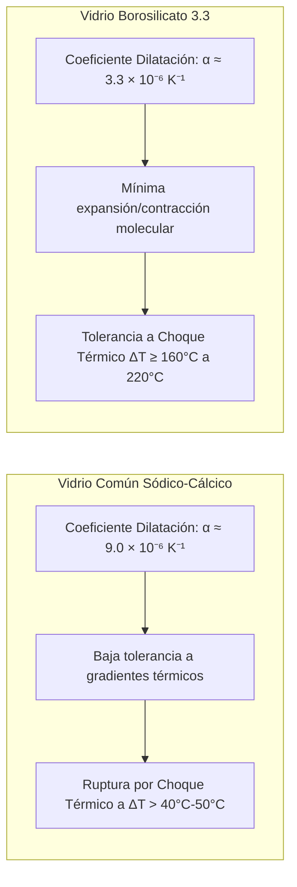
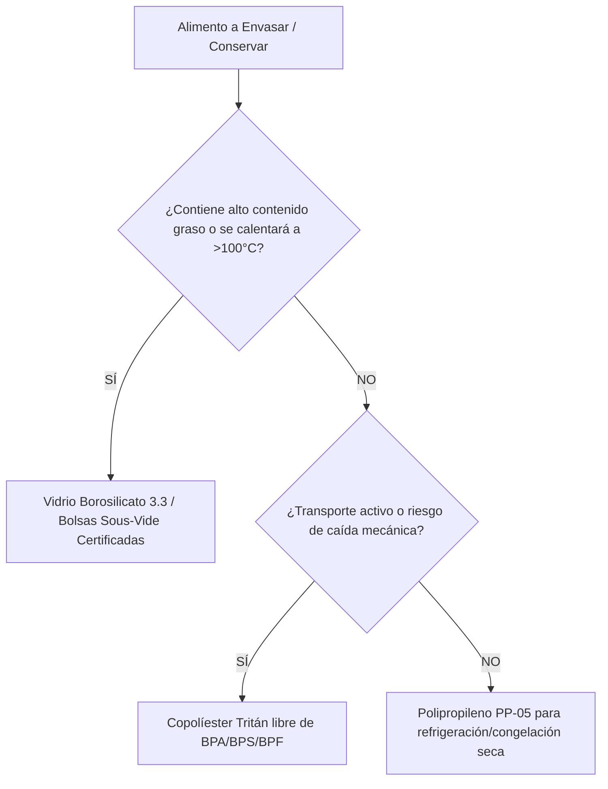
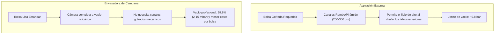
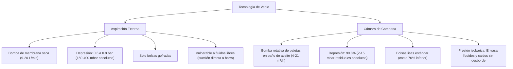
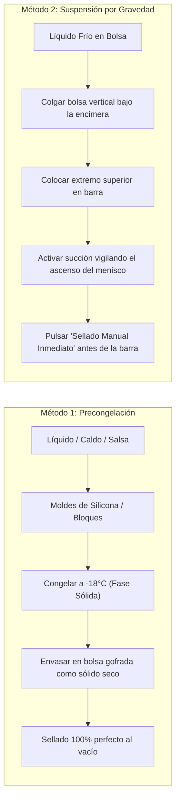
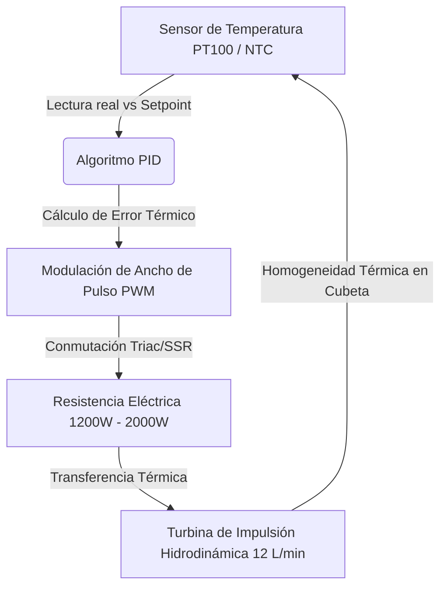
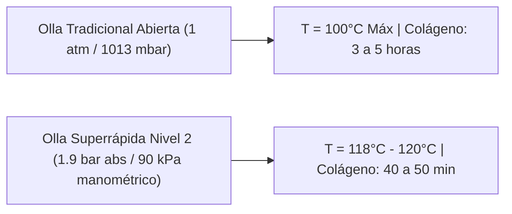
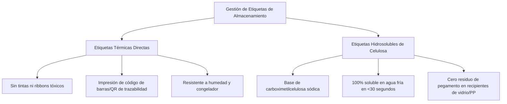

# 🏺 Guía Técnica Maestra de Equipamiento, Envases y Tecnología de Conservación en Cocina Eficiente

> **Documento Técnico de Referencia — TouChef Process Engineering Standard (PES-05)**  
> **Área:** Ciencia de Materiales Culinarios, Termodinámica del Equipamiento, Tecnología de Vacío y Metrología  
> **Destinatarios:** Ingenieros de Procesos Culinarios, Chefs Batch Cooking, Técnicos de Calidad y Seguridad Alimentaria  
> **Revisión:** 2.0 | **Estado:** Aprobado para Producción

---

## 1. Tipología y Ciencia de Materiales en Recipientes de Almacenamiento

El diseño de un sistema de Batch Cooking de alto rendimiento depende críticamente de la compatibilidad termodinámica, química y toxicológica entre el alimento y la matriz del envase. La selección inadecuada del material no solo compromete la vida útil y las propiedades organolépticas, sino que induce riesgos de migración de xenobióticos y fallos mecánicos catastróficos durante los gradientes térmicos.

```
                               ┌───────────────────────────────────────────────────────────┐
                               │       MATRIZ DE SELECCIÓN DE CONTENEDORES Y ENVASES       │
                               └─────────────────────────────┬─────────────────────────────┘
                                                             │
                 ┌───────────────────────────────────────────┼───────────────────────────────────────────┐
                 ▼                                           ▼                                           ▼
  ┌─────────────────────────────┐             ┌─────────────────────────────┐             ┌─────────────────────────────┐
  │     VIDRIO BOROSILICATO     │             │    POLÍMEROS TÉCNICOS       │             │     BOLSAS MULTICAPA        │
  │            (3.3)            │             │      (PP-05 / Tritán)       │             │       (PA/PE/EVOH)          │
  ├─────────────────────────────┤             ├─────────────────────────────┤             ├─────────────────────────────┤
  │ • -40°C a +400°C            │             │ • Ultraligeros e irrompibles│             │ • Vacío profundo e inmersión│
  │ • Choque térmico: ΔT 160°C  │             │ • Tritán: Claridad óptica   │             │ • 90 a 150 micras           │
  │ • Inercia química 100%      │             │ • PP-05: Económico / Flexible│            │ • Barrera total O2 y vapor  │
  │ • Libre de Bisfenoles/Ftal  │             │ • Riesgo migración lipídica │             │ • Sous-Vide y congelación   │
  └──────────────┬──────────────┘             └──────────────┬──────────────┘             └──────────────┬──────────────┘
                 │                                           │                                           │
                 ▼                                           ▼                                           ▼
       [Guisos, Ácidos, Horno]                     [Frutas, Transporte Seco]                   [Proteínas, Sous-Vide]
```

---

### 1.1. Vidrio Borosilicato 3.3: Inercia Química y Resistencia Térmica

El vidrio de borosilicato 3.3 es el estándar de referencia absoluto para conservación, horneado y regeneración en procesos de cocina eficiente. A diferencia del vidrio sódico-cálcico estándar (empleado en botellas y tarros de conservas convencionales), el borosilicato sustituye una fracción significativa de óxidos de sodio y calcio por trióxido de boro ($\text{B}_2\text{O}_3$).

```
Composición Típica (% en masa):
SiO2 (81%) | B2O3 (13%) | Na2O + K2O (4%) | Al2O3 (2%)
```



#### Parámetros Fisicoquímicos y Ventajas Operacionales

1. **Rango de Trabajo Extremo ($-40^\circ\text{C}$ a $+400^\circ\text{C}$):** Permite el paso directo desde el congelador ($-18^\circ\text{C}$) al horno precalentado a $200^\circ\text{C}$ o microondas, siempre que el recipiente contenga líquido o base húmeda que homogeneice la transmisión térmica.
2. **Inercia Química Absoluta e Hidrolítica (Clase 1 según ISO 719):** No reacciona con matrices alimentarias ácidas (tomate frito, escabeches, marinadas cítricas con $\text{pH} < 3.5$) ni con medios fuertemente salinos o alcohólicos.
3. **Superficie No Porosa y Resistencia a la Tinción:** Inmune a la adsorción de cromóforos liposolubles como el licopeno (tomate), carotenoides (zanahoria) y curcumina (cúrcuma/curry), así como a la retención de compuestos azufrados volátiles (alicina, disulfuro de alilo procedentes de ajo y cebolla).
4. **Cero Lixiviación de Xenobióticos:** Totalmente exento de bisfenol A (BPA), bisfenol S (BPS), ftalatos, plastificantes orgánicos y metales pesados.

> [!IMPORTANT]
> **Gestión de Tapas y Hermeticidad:**  
> Aunque el cuerpo de vidrio resiste $+400^\circ\text{C}$, **las tapas de Polipropileno (PP) con juntas de silicona deben retirarse siempre antes de introducir el recipiente en el horno convencional**, y deben mantenerse con la válvula de desvaporización abierta durante el uso en microondas para evitar sobrepresiones o deformaciones de la junta elástica.

---

### 1.2. Polímeros Alimentarios Certificados: Polipropileno (PP-05) y Copolíester Tritán

Los plásticos técnicos ofrecen ventajas insustituibles en peso tara, resistencia a impactos mecánicos y ergonomía para logística externa, pero requieren una rigurosa selección técnica basada en sus propiedades termomecánicas y límites toxicológicos.



#### Comparativa Técnica: Polipropileno (PP-05) vs Copolíester Tritán

| Propiedad Técnica | Polipropileno Homopolímero / Copolímero (PP-05) | Copolíester Tritán (TX1001 / TX2001) |
| :--- | :--- | :--- |
| **Estructura Polimérica** | Termoplástico semicristalino alifático | Poliéster amorfo termoplástico modificado |
| **Claridad Óptica** | Translúcido / Semi-opaco | Transparencia cristalina (Transmisión $>90\%$) |
| **Temperatura de Transición Vítrea ($T_g$)** | $-10^\circ\text{C}$ a $0^\circ\text{C}$ | $108^\circ\text{C}$ a $115^\circ\text{C}$ |
| **Punto de Fusión ($T_m$)** | $160^\circ\text{C} - 165^\circ\text{C}$ | Amorfo (sin fusión neta; ablandamiento $>120^\circ\text{C}$) |
| **Resistencia al Impacto (Izod)** | Media-Baja a temperaturas $<0^\circ\text{C}$ (fragilidad vítrea) | Extremadamente Alta ($>650\text{ J/m}$, irrompible) |
| **Resistencia a Ciclos de Lavavajillas** | 100-200 ciclos (tiende a rayarse y volverse opaco) | $>1000$ ciclos sin estrés superficial (*crazing*) |
| **Comportamiento ante Microondas** | Apto hasta $100^\circ\text{C}$ (agua); vulnerable a aceites | No recomendado para microondas prolongado |
| **Certificación de Disruptores** | Libre de BPA por composición | Libre de BPA, BPS, BPF y actividad estrogénica (EA) |

#### Riesgos de Migración Global y Específica con Grasas Calientes

El talón de Aquiles del Polipropileno (PP-05) en la cocina de producción radica en su afinidad no polar con los lípidos alimentarios:

1. **Sobrecalentamiento Localizado por Grasas:** Mientras el agua pura hierve a $100^\circ\text{C}$ a presión atmosférica, los triglicéridos vegetales y grasas animales pueden superar rápidamente los $140^\circ\text{C} - 180^\circ\text{C}$ bajo radiación de microondas.
2. **Efecto Esponja Lipídica y Deformación:** A temperaturas $>110^\circ\text{C}$, el aceite caliente en contacto con las paredes de PP supera la temperatura de deflexión térmica bajo carga (HDT), reblandeciendo la matriz y provocando el grabado o *pitting* de la superficie plástica.
3. **Migración de Aditivos:** Bajo estrés térmico graso, se acelera la cinética de migración de aditivos de procesado (antioxidantes fenólicos tipo Irganox 1010, agentes de nucleación y oligómeros de bajo peso molecular) hacia el alimento, excediendo potencialmente el Límite de Migración Global (LMG de $10\text{ mg/dm}^2$ establecido en el Reglamento UE 10/2011).

> [!CAUTION]
> **Protocolo Estricto de Uso de Plásticos:**  
> Prohibir terminantemente calentar guisos con alto contenido lipídico (ej. carnes en salsa, currys, aceites, confitados) dentro de fiambreras de PP-05 en microondas. Utilizar siempre vidrio borosilicato o traspasar el contenido a un plato cerámico antes del calentamiento.

---

### 1.3. Bolsas de Vacío Coextruidas y Estructuras Multicapa (PA/PE/EVOH)

Las bolsas de envasado no son películas homogéneas simples de plástico, sino laminados técnicos o coextrusiones poliméricas diseñadas para aportar barrera a gases, resistencia mecánica y termosellabilidad hermética.

```
ESTRUCTURA DE UNA BOLSA MULTICAPA DE ALTA BARRERA:
┌───────────────────────────────────────────────────────────┐
│ CAPA EXTERNA: Poliamida (PA / Nylon, 20-30 μm)            │ -> Resistencia al punzonamiento y tensión
├───────────────────────────────────────────────────────────┤
│ CAPA INTERMEDIA: Adhesivo de Enlace (Tie Layer, 3-5 μm)   │ -> Cohesión entre polímeros polares y apolares
├───────────────────────────────────────────────────────────┤
│ CAPA BARRERA: EVOH (Etileno-Alcohol Vinílico, 5-10 μm)    │ -> Barrera ultra-baja al Oxígeno (OTR < 2 cm³/m²·d·bar)
├───────────────────────────────────────────────────────────┤
│ CAPA INTERMEDIA: Adhesivo de Enlace (Tie Layer, 3-5 μm)   │ -> Cohesión
├───────────────────────────────────────────────────────────┤
│ CAPA INTERNA: Polietileno de Baja Densidad (PE-LD/LLDPE)  │ -> Termosellabilidad (110°C-130°C) e inercia biológica
└───────────────────────────────────────────────────────────┘
```

#### Calibres Técnicos y Ámbitos de Aplicación

| Espesor ($\mu\text{m}$) | Estructura Típica | Resistencia Mecánica | Ámbito de Aplicación Óptimo |
| :--- | :--- | :--- | :--- |
| **$90\,\mu\text{m}$** | $\text{PA/PE } 20/70$ | Estándar | Filetes limpios, verduras blandas, pescados sin espinas, sous-vide hasta $75^\circ\text{C}$ y almacenamiento en frío común. |
| **$120\,\mu\text{m}$** | $\text{PA/PE } 30/90$ o $\text{PA/EVOH/PE}$ | Alta | Carnes con corte óseo serrado, legumbres, marisco con cáscara blanda, sous-vide prolongado ($>75^\circ\text{C}$ hasta $100^\circ\text{C}$) y congelación prolongada. |
| **$150\,\mu\text{m}$** | $\text{PA/PE } 40/110$ | Extrema (Anti-Perforación) | Costillares de cerdo/ternera con huesos puntiagudos, crustáceos duros (bogavante, centollo), caza y piezas con aristas cristalinas congeladas. |

#### Bolsas Lisas vs Bolsas Gofradas (Estructuradas)



---

### 1.4. Recipientes Rígidos con Válvula de Vacío Integrada

Los sistemas rígidos despresurizables representan el puente perfecto entre la conservación al vacío y la integridad geométrica de preparaciones culinarias delicadas que colapsarían aplastadas bajo la compresión mecánica de una bolsa flexible (ej. ensaladas de hojas tiernas, frutos rojos, aguacate marinado, masas en fermentación retardada).

```
                      ┌──────────────────────────────────────────────┐
                      │    CABEZAL DE SUCCIÓN / BOMBA ELÉCTRICA      │
                      └──────────────────────┬───────────────────────┘
                                             │ (Depresión: -0.5 a -0.7 bar)
                                             ▼
                      ┌──────────────────────────────────────────────┐
                      │      VÁLVULA DE SILICONA ANTIRRETORNO        │
                      │    (Venteo por tracción lateral elástica)    │
                      ├──────────────────────────────────────────────┤
                      │       TAPA DE TRITÁN / POLICARBONATO         │
                      │ ┌──────────────────────────────────────────┐ │
                      │ │ JUNTA PERIMETRAL DE DOBLE LABIO SILICONA │ │
                      │ └──────────────────────────────────────────┘ │
                      ├──────────────────────────────────────────────┤
                      │                                              │
                      │             CUERPO DEL RECIPIENTE            │
                      │         (Vidrio Borosilicato / Tritán)       │
                      │                                              │
                      │   [Alimentos Delicados sin Compresión]       │
                      │                                              │
                      └──────────────────────────────────────────────┘
```

#### Modos de Evacuación y Métricas de Depresión

1. **Bombas Manuales de Pistón:** Generan depresiones moderadas entre $-0.3\text{ bar}$ y $-0.45\text{ bar}$. Aptas para rotación rápida de 24 a 48 horas; dependen de la fuerza y cadencia del operador.
2. **Bombas Eléctricas Portátiles (Ion-Litio):** Integran micromotores de vacío con parada automática por presostato diferencial al alcanzar $-0.6\text{ bar}$ a $-0.7\text{ bar}$ ($600 - 700\text{ mbar}$ de presión negativa).
3. **Cánulas de Conexión a Envasadora de Sobremesa:** Utilizan la bomba de pistón de la envasadora externa mediante una manguera de silicona conectada al puerto de accesorios, alcanzando el vacío nominal máximo del equipo ($-0.8\text{ bar}$).

---

## 2. Equipamiento de Sellado y Tecnología de Vacío

El envasado al vacío retira el comburente principal de la oxidación lipídica y del metabolismo de bacterias aerobias ($O_2$). Sin embargo, la física de succión impone profundas diferencias entre los sistemas domésticos/semiprofesionales de aspiración externa y los sistemas industriales de campana.



---

### 2.1. Envasadoras de Aspiración Externa

#### Principio Físico y Arquitectura
El extremo abierto de la bolsa gofrada se coloca en una pequeña cubeta de vacío. Al cerrar la tapa mediante bloqueo mecánico, una bomba de membrana de doble cabezal extrae el aire a través de la red de canales gofrados.

* **Depresión Nominal Máxima:** $0.75 - 0.85\text{ bar}$ ($750 - 850\text{ mbar}$ manométricos negativos $\equiv 150 - 250\text{ mbar}$ de presión absoluta residual).
* **Concentración Residual de Oxígeno ($O_2$):** Alrededor del $3\% - 5\%$ (suficiente para frenar mohos y rancidez oxidativa a corto plazo, pero no para inhibición de microaerófilos).
* **Barra de Termosellado:** Resistencia de hilo plano de Níquel-Cromo (NiCr) de $2.5\text{ mm}$ a $5\text{ mm}$ de anchura, recubierta con tela de teflón (PTFE). Control por temporizador electrónico de pulso ($2 - 6\text{ segundos}$).

---

### 2.2. Envasadoras de Campana Profesionales (Chamber Vacuum Sealers)

#### Termodinámica de la Cámara Isobárica
En una envasadora de campana, tanto el interior de la bolsa como la cámara exterior sufren exactamente la misma despresurización simultánea. Al no existir gradiente de presión entre el interior y el exterior de la bolsa durante la aspiración, **los líquidos no experimentan empuje mecánico hacia la barra de sellado**.

```
PROCESO EN CÁMARA DE CAMPANA:
1. CIERRE DE CAMPANA  ──> 2. VACÍO HOMOGÉNEO  ──> 3. TERMOSELLADO  ──> 4. DESCOMPRESIÓN ATMOSFÉRICA
  [Presión 1013 mbar]      [Presión baja a 5 mbar]  [Pistones sellan bolsa]  [Colapso exterior sobre alimento]
  ┌───────────────┐        ┌───────────────┐        ┌───────────────┐        ┌───────────────┐
  │   = = = = =   │        │   .   .   .   │        │   .   .   .   │        │ ▓▓▓▓▓▓▓▓▓▓▓▓▓ │
  │  ┌─────────┐  │        │  ┌─────────┐  │        │  ┌─────────┐  │        │ ▓┌─────────┐▓ │
  │  │ Líquido │  │        │  │ Líquido │  │        │  │ Líquido │  │        │ ▓│ Líquido │▓ │
  │  └─────────┘  │        │  └─────────┘  │        │  └─────────┘  │        │ ▓└─────────┘▓ │
  └───────────────┘        └───────────────┘        └───────────────┘        └───────────────┘
```

#### Ebullición en Frío: Ecuación de Clausius-Clapeyron y Control del Punto de Ebullición
La relación entre la presión en la cámara y el punto de ebullición del agua se rige por la ecuación de Clausius-Clapeyron:

$$\ln\left(\frac{P_2}{P_1}\right) = -\frac{\Delta H_{vap}}{R} \left(\frac{1}{T_2} - \frac{1}{T_1}\right)$$

```
Presión Absoluta en Cámara vs Punto de Ebullición del Agua Pura:
 1013 mbar  ──>  100.0 °C  (Presión Atmosférica Estándar)
  200 mbar  ──>   60.1 °C
  100 mbar  ──>   45.8 °C
   50 mbar  ──>   32.9 °C
   20 mbar  ──>   17.5 °C  <-- ¡Hervirá a temperatura ambiente!
    8 mbar  ──>    3.8 °C  <-- ¡Hervirá incluso saliendo de nevera!
```

> [!WARNING]
> **Peligro de Ebullición Flash (*Flash Boiling*):**  
> Si se introduce una salsa o caldo caliente a $40^\circ\text{C}$ en una campana con vacío profundo ($10\text{ mbar}$), el líquido entrará en ebullición instantánea y violenta. El vapor generado satura la bomba de aceite, provocando emulsión de agua en el lubricante y expulsión espumosa del producto fuera de la bolsa.
> 
> **Regla Operativa:** Todo producto líquido debe abatirse a $T \le 4^\circ\text{C}$ antes del envasado en campana, o bien programar el equipo por porcentaje de vacío ($90\% - 95\%$) en lugar de presión absoluta mínima.

---

### 2.3. Hacks y Protocolos de Envasado de Líquidos en Equipos Externos

Para operadores que no disponen de envasadora de campana, existen cuatro protocolos técnicos contrastados para envasar preparaciones húmedas sin comprometer el termosellado:



#### Protocolo 3: Trampa de Celulosa Absorbente Sanitaria
1. Doblar una tira de papel secante alimentario o gasa celulósica estéril en un ancho de $2\text{ cm}$.
2. Insertar transversalmente en la boca de la bolsa, $3\text{ cm}$ por debajo de la zona de termosellado.
3. El líquido asciende durante la succión y es retenido por capilaridad en la tira celulósica, permitiendo que la resistencia selle en seco sobre film limpio y no contaminado.

#### Protocolo 4: Botes de Vacío Rígidos y Tarros Twist-Off
1. Llenar tarros de cristal estándar de conserva dejando $2\text{ cm}$ de cámara de aire superior.
2. Colocar la tapa metálica sobrepuesta sin enroscar.
3. Introducir el tarro dentro de un contenedor rígido grande de vacío conectado a la envasadora externa.
4. Al despresurizar el bote y reintroducir bruscamente el aire exterior, la tapa del tarro se deprime con un clic hermético perfecto.

---

## 3. Equipamiento de Cocción, Control Térmico y Metrología

La reproducibilidad en la cocina eficiente se fundamenta en la exactitud y la distribución uniforme de la energía térmica. Un desvío de apenas $+1.5^\circ\text{C}$ en una cocción sous-vide desnaturaliza irreversiblemente las proteínas miofibrilares de un pescado o reseca una pechuga de ave.

```
                  ┌─────────────────────────────────────────────────────────┐
                  │          FLUJO DE CONTROL TÉRMICO Y COCCIÓN             │
                  └────────────────────────────┬────────────────────────────┘
                                               │
                 ┌─────────────────────────────┴─────────────────────────────┐
                 ▼                                                           ▼
  ┌─────────────────────────────┐                             ┌─────────────────────────────┐
  │     COCCIÓN / PROCESO       │                             │   CONTROL Y REGENERACIÓN    │
  ├─────────────────────────────┤                             ├─────────────────────────────┤
  │ • Roner Sous-Vide (PID)     │                             │ • Termopar Aguja Fina (KT)  │
  │ • Olla Superrápida (120°C)  │                             │ • Horno Vapor Combinado     │
  │ • Bolas Antievaporación PP  │                             │ • Airfryer Doble Resistencia│
  └─────────────────────────────┘                             └─────────────────────────────┘
```

---

### 3.1. Roner y Circuladores de Inmersión Sous-Vide

El Roner moderno combina una resistencia calefactora tubular blindada con una turbina hidrodinámica y un controlador electrónico PID (*Proportional-Integral-Derivative*).



#### Especificaciones Técnicas Críticas

1. **Potencia Calefactora:** $1200\text{ W}$ a $2000\text{ W}$. Garantiza una velocidad de recuperación térmica ($>1.5^\circ\text{C}/\text{min}$) tras introducir cargas masivas de bolsas refrigeradas.
2. **Caudal de Circulación Forzada:** $10 - 14\text{ L/min}$. Impide la formación de gradientes de temperatura o "zonas frías" muertas en los rincones de la cubeta de cocción.
3. **Estabilidad Térmica:** $\pm 0.05^\circ\text{C}$ a $\pm 0.1^\circ\text{C}$ en régimen estacionario.
4. **Protección de Nivel:** Sensores de boya magnética o sondas de conductividad para corte automático en seco si el nivel desciende por evaporación.

#### Aislamiento Térmico y Bolas Antievaporación de Polipropileno
En cocciones prolongadas ($>12\text{ horas}$) o a temperaturas elevadas ($>75^\circ\text{C}$ para verduras y legumbres), la pérdida de calor y agua por vaporización superficial es crítica:

```
           ═══════════════════════════════════════════════
           ○○○○○○○○○○○○○○○○○○○○○○○○○○○○○○○○○○○○○○○○○○○○○○○  <-- Capa de Bolas PP (Ø 20 mm)
           ~~~~~~~~~~~~~~~~~~~~~~~~~~~~~~~~~~~~~~~~~~~~~~~
           │  [Bolsa Vacío]   [Bolsa Vacío]   [Bolsa Vacío]│
           │                                               │  <-- Cubeta Policarbonato con
           │         Roner: Turbina Activa (12 L/min)      │      funda de Neopreno
           └───────────────────────────────────────────────┘
```

* **Eficiencia de las Esferas Flotantes:** Una capa bicapa de esferas huecas de PP ($\varnothing 20\text{ mm}$) reduce la **pérdida de agua por evaporación en un $90\%$** y el **consumo energético en un $75\%$**, evitando que el Roner corte por bajo nivel durante la noche.

---

### 3.2. Ollas a Presión Superrápidas (Autoclaves Domésticas)

Las ollas a presión de última generación con cierre de bayoneta y juntas de silicona de alta estanqueidad operan bajo el principio de elevación del punto de ebullición por presurización confinada.



#### Comparativa de Tiempos y Retención Nutricional

| Matriz Alimentaria | Cocción Tradicional ($100^\circ\text{C}$) | Olla Superrápida ($118^\circ\text{C} - 120^\circ\text{C}$) | Reducción de Tiempo | Retención Vitamínica / Textura |
| :--- | :--- | :--- | :--- | :--- |
| **Garbanzos / Alubias Secas** | $120 - 180\text{ min}$ | $25 - 35\text{ min}$ | **$-75\%$** | Superior (menor lixiviación de minerales) |
| **Caldo de Huesos (Extracción Colágeno)** | $360 - 480\text{ min}$ | $60 - 75\text{ min}$ | **$-84\%$** | Gelatinización completa y caldo denso |
| **Jarrete de Ternera / Rabo de Toro** | $180 - 240\text{ min}$ | $40 - 50\text{ min}$ | **$-78\%$** | Fibras tiernas con mínima oxidación lipídica |
| **Tubérculos y Verduras Duras** | $30 - 40\text{ min}$ | $6 - 8\text{ min}$ | **$-80\%$** | Conservación óptima de polifenoles |

---

### 3.3. Hornos Combinados de Vapor y Freidoras de Aire de Doble Resistencia

#### Horno de Vapor Combinado (Combi-Steam)
* **Control de Humedad ($30\% - 100\%\text{ HR}$):** El vapor de agua tiene un calor específico y un coeficiente de transferencia superficial mucho mayores que el aire seco.
* **Regeneración Óptima de Batch Cooking:** Permite calentar bandejas completas de cereales, legumbres y carnes a $120^\circ\text{C}$ con $60\%$ de humedad en 8-12 minutos sin resecar los bordes ni alterar la jugosidad original.

#### Freidoras de Aire (Airfryer) de Doble Resistencia (Dual-Heating Vortex)
* **Arquitectura de Doble Elemento:** Resistencia superior ($1500\text{ W} - 1800\text{ W}$) asistida por ventilador centrífugo de alta velocidad junto a una resistencia inferior independiente ($400\text{ W} - 600\text{ W}$).
* **Regeneración Crujiente Ultrarrápida:** Ideal para devolver la textura crujiente a rebozados, tubérculos asados, empanados y piel de aves en 3-5 minutos a $190^\circ\text{C}$ sin necesidad de precalentamiento prolongado ni adición de aceites extra.

---

### 3.4. Metrología Culinaria: Termometría de Aguja Fina e Infrarrojos

```
                    TERMÓMETRO DE AGUJA FINA (SOUS-VIDE):
                    ┌────────────────────────────┐
                    │ Termopar Tipo T / K        │ ──> Lectura digital: 54.2 °C (t90 < 1.5s)
                    └─────────────┬──────────────┘
                                  │ Cable apantallado de teflón
                                  ▼
                    ┌────────────────────────────┐
                    │ Sonda Aguja (Ø 1.1 mm)     │
                    └─────────────┬──────────────┘
                                  │
                    ══════════════▼══════════════ <── Cinta de Neopreno Autosellante
                    ───────────────────────────── <── Lámina Plástica de Bolsa Vacío
                    ░░░░░░░░░░░░░░░░░░░░░░░░░░░░░
                    ░░░░ [CENTRO TÉRMICO] ░░░░░░░ <── Núcleo Geométrico del Alimento
                    ░░░░░░░░░░░░░░░░░░░░░░░░░░░░░
```

1. **Termómetros de Contacto por Termopar de Aguja Fina ($\varnothing \le 1.1\text{ mm}$):**
   * Emplean sensores termopar tipo K o T con punta biselada hipodérmica.
   * **Protocolo de Inserción en Vacío:** Se adhiere un fragmento de $1.5\text{ cm}$ de **cinta de espuma de neopreno / silicona de celda cerrada** en el exterior de la bolsa. Se clava la aguja atravesando la cinta hasta el corazón geométrico del alimento. La celda elastomérica se cierra automáticamente sobre la aguja, manteniendo el vacío sin entrada de agua del baño.
2. **Termómetros de Radiación Infrarroja (IR):**
   * Óptica típica $12:1$ con emisividad precalibrada a $\epsilon = 0.95$.
   * **Uso Exclusivo:** Medición de temperatura superficial instantánea (temperatura del fondo de sartenes de hierro fundido para reacción de Maillard a $>180^\circ\text{C}$, planchas de asado y control de temperatura de recepción en superficie de alimentos refrigerados). No apto para núcleos internos de productos gruesos.

---

## 4. Accesorios de Organización, Trazabilidad y Ergonomía

La trazabilidad y la gestión del espacio físico en el refrigerador y congelador marcan la diferencia entre un sistema de conservación profesional y el desperdicio alimentario por obsolescencia o contaminación cruzada.

```
                      SISTEMA DE ETIQUETADO Y TRAZABILIDAD PES-05:
         ┌──────────────────────────────────────────────────────────────────┐
         │ PLATO: Solomillo de Cerdo Glaseado en Mostaza Antigua            │
         │ LOTE: 20260819-B02        │  FECHA PROD: 19/08/2026              │
         │ CAD. REFRIGERACIÓN: 29/08 │  CAD. CONGELACIÓN: 19/02/2027        │
         ├──────────────────────────────────────────────────────────────────┤
         │ REGENERACIÓN: Sous-Vide 58°C / 15 min   O   Airfryer 180°C / 4 m │
         │ ALÉRGENOS: [X] Mostaza   [ ] Gluten   [ ] Lácteos   [ ] Frutos S │
         └──────────────────────────────────────────────────────────────────┘
```

---

### 4.1. Rotuladoras Térmicas y Etiquetas Hidrosolubles



#### Ventajas Operativas de las Etiquetas Hidrosolubles (*Wash-Away Labels*)
* **Eliminación del Biofilm Adhesivo:** Las etiquetas adhesivas convencionales de papel o plástico dejan capas de adhesivo acrílico gomoso tras lavados repetidos, convirtiéndose en nichos de atrapamiento de suciedad y proliferación microbiana.
* **Disolución Total en Lavavajillas:** Al contacto con agua a cualquier temperatura ($>15^\circ\text{C}$), la estructura polimérica de la etiqueta se desintegra instantáneamente en fibras de celulosa biodegradables sin obstruir bombas ni filtros de desagüe.

---

### 4.2. Ergonomía, Densidad de Almacenamiento y Congelación Plana

```
                         CONGELACIÓN PLANA EN RACKS VERTICALES:
             ┌────────────────────────────────────────────────────────┐
             │            CAJÓN DEL CONGELADOR / FRIGORÍFICO          │
             │                                                        │
             │   ┌───┐  ┌───┐  ┌───┐  ┌───┐  ┌───┐  ┌───┐  ┌───┐      │
             │   │ B │  │ B │  │ B │  │ B │  │ B │  │ B │  │ B │      │
             │   │ O │  │ O │  │ O │  │ O │  │ O │  │ O │  │ O │      │
             │   │ L │  │ L │  │ L │  │ L │  │ L │  │ L │  │ L │      │
             │   │ S │  │ S │  │ S │  │ S │  │ S │  │ S │  │ S │      │
             │   │ A │  │ A │  │ A │  │ A │  │ A │  │ A │  │ A │      │
             │   │ 1 │  │ 2 │  │ 3 │  │ 4 │  │ 5 │  │ 6 │  │ 7 │      │
             │   └───┘  └───┘  └───┘  └───┘  └───┘  └───┘  └───┘      │
             │   ├─── DIVISOR METÁLICO VERTICAL AJUSTABLE ───┤        │
             └────────────────────────────────────────────────────────┘
```

1. **Protocolo de Congelación Plana (*Flat Freezing*):**
   * Las bolsas de vacío con líquidos, salsas o porciones fraccionadas se congelan inicialmente dispuestas de forma 100% horizontal sobre una bandeja metálica de aluminio (máxima velocidad de conducción térmica hacia el centro geométrico).
   * Una vez solidificadas en placas delgadas y uniformes de $1.5 - 2.5\text{ cm}$ de espesor, se almacenan en posición vertical ordenadas cronológicamente mediante divisores de cajón tipo archivador.
2. **Impacto en la Descongelación:** Una placa plana de $2\text{ cm}$ se descongela por conducción en baño de agua fría en menos de $15\text{ minutos}$, frente a las $6 - 8\text{ horas}$ requeridas por un bloque cúbico o cilindro irregular de igual masa.
3. **Soportes de Inmersión Sous-Vide (*Sous-Vide Racks*):** Racks de alambre de acero inoxidable 304 que mantienen las bolsas separadas a una distancia constante de $15\text{ mm}$ en la cubeta, evitando que floten a la superficie o se solapen impidiendo el flujo de agua caliente.
4. **Embudos de Boca Ancha con Base Estable:** Elementos de silicona o acero inoxidable que permiten verter preparaciones densas o salsas directamente al fondo de las bolsas sin manchar la zona superior de sellado.

---

## 5. Tabla Maestra de Especificaciones, Inversión y Mantenimiento

| Equipo / Accesorio | Parámetros Técnicos Clave | Rango de Inversión Estándar | Vida Útil Estimada | Mantenimiento Preventivo Crítico |
| :--- | :--- | :--- | :--- | :--- |
| **Recipientes Borosilicato 3.3** | $-40^\circ\text{C}$ a $+400^\circ\text{C}$, $\Delta T \ge 160^\circ\text{C}$ | 25 € - 60 € (Juego 5 uds) | Indefinida ($>10$ años) | Inspección de mellas en bordes; cambio de juntas de silicona cada 24 meses. |
| **Recipientes Tritán con Válvula** | TX1001, libre BPA, vacío $-0.65\text{ bar}$ | 30 € - 70 € (Juego 3 uds) | 5 - 8 años | Lavado de válvulas de silicona; lubricación ligera de juntas con aceite vegetal si resecan. |
| **Envasadora Aspiración Externa** | $0.8\text{ bar}$ vacío, bomba $12\text{ L/min}$, NiCr $3\text{ mm}$ | 60 € - 180 € | 3 - 6 años | Limpieza de cubeta de vacío tras cada uso; sustitución de teflón y juntas de esponja cuando pierdan memoria. |
| **Envasadora de Campana** | Vacío $99.8\%$ ($5\text{ mbar}$), bomba $8\text{ m}^3/\text{h}$ | 600 € - 1.800 € | $>10$ años | Cambio de aceite de la bomba cada 100-200 horas operativas; secado de condensados (*Dehumidification cycle*). |
| **Roner / Circulador Sous-Vide** | $1200\text{ W} - 1500\text{ W}$, estabilidad $\pm 0.05^\circ\text{C}$ | 80 € - 220 € | 4 - 8 años | Descalcificación periódica con ácido cítrico o vinagre al $10\%$ cada 30 ciclos de cocción. |
| **Olla Presión Superrápida** | $1.9\text{ bar}$ abs ($120^\circ\text{C}$), Inox 18/10 | 90 € - 250 € | $>10$ años | Reemplazo anual de junta de silicona de la tapa; verificación de válvula de seguridad y conducto de escape. |
| **Horno Vapor / Airfryer Dual** | $1800\text{ W}$, Doble elemento + Convección | 100 € - 600 € | 4 - 7 años | Limpieza de resistencias inferiores/superiores; descalcificación del calderín de vapor. |
| **Termómetro Aguja Fina Sous-Vide** | Termopar Tipo K/T, aguja $\varnothing 1.1\text{ mm}$ | 45 € - 130 € | 5 años | Calibración periódica en punto de hielo ($0.0^\circ\text{C}$) y ebullición ($100.0^\circ\text{C}$); desinfección de sonda. |
| **Rotuladora / Etiquetas Solubles** | Térmica directa + Celulosa biodegradable | 20 € - 50 € | 3 - 5 años | Almacenamiento de rollos solubles en ambiente seco ($<50\%\text{ HR}$) con desecante de sílice. |

---

## 6. Conclusión y Checklist de Implementación Operativa

```
CHECKLIST DE EQUIPAMIENTO BATCH COOKING EFICIENTE:
 [ ] Vidrio Borosilicato 3.3 para horneado, platos grasos, guisos y regeneración.
 [ ] Contenedores de Tritán / Bolsas Multicapa PA/PE para transporte y almacenamiento en frío.
 [ ] Bolsas gofradas (90-120 μm) para envasadora externa o bolsas lisas (120-150 μm) para campana.
 [ ] Sistema de sellado calibrado con protocolos de contención para líquidos (precongelación o gravedad).
 [ ] Circulador Sous-Vide con cubeta aislada y bolas de polipropileno antievaporación.
 [ ] Olla a presión superrápida para extracción acelerada de colágeno y cocción de legumbres.
 [ ] Termómetro digital de sonda ultrafina y cinta de espuma autosellante para control sous-vide.
 [ ] Sistema de trazabilidad con etiquetas hidrosolubles y rotulación de fechas/alérgenos/regeneración.
```

Con la integración sinérgica de esta arquitectura de envases y equipamiento térmico, la cocina de producción eficiente alcanza el equilibrio perfecto entre **seguridad alimentaria microbiológica, rendimiento organoléptico de restaurante de alta gama y máxima optimización de tiempo y consumo energético**.
