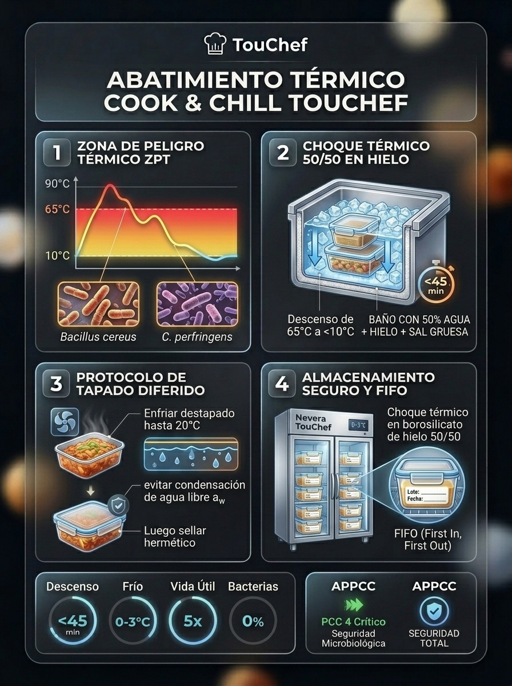
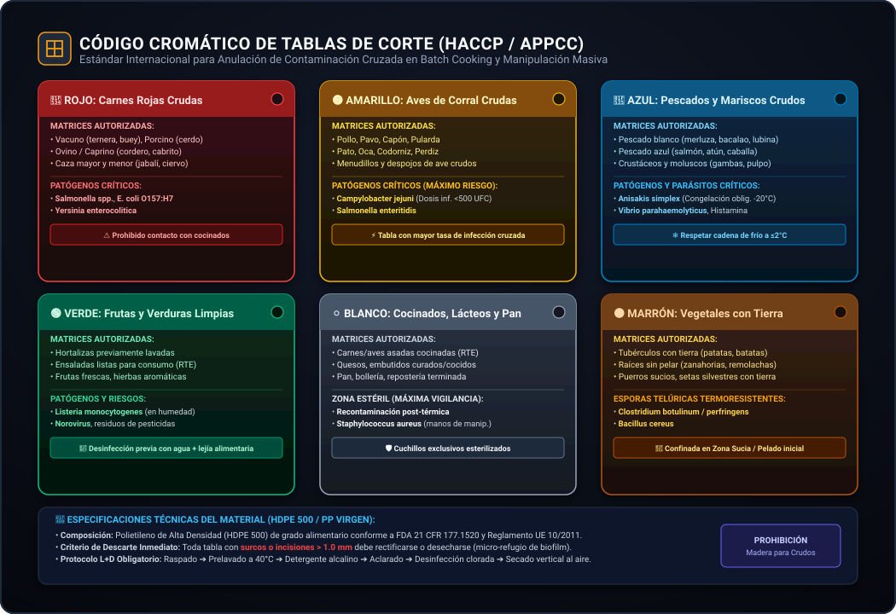
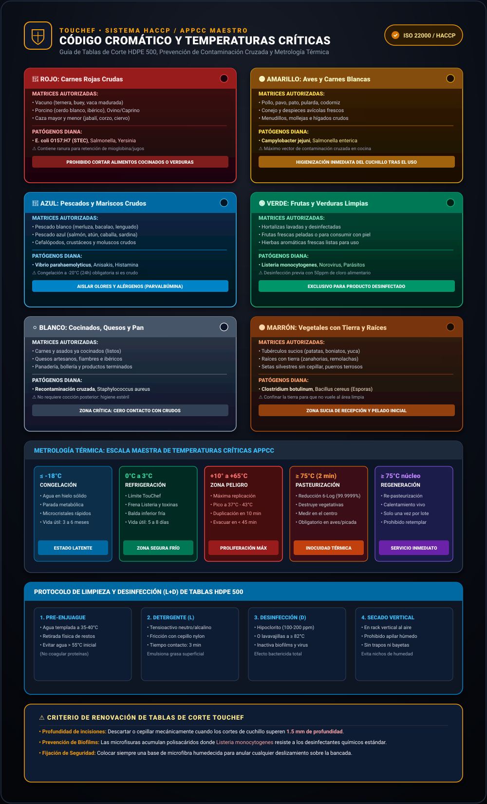
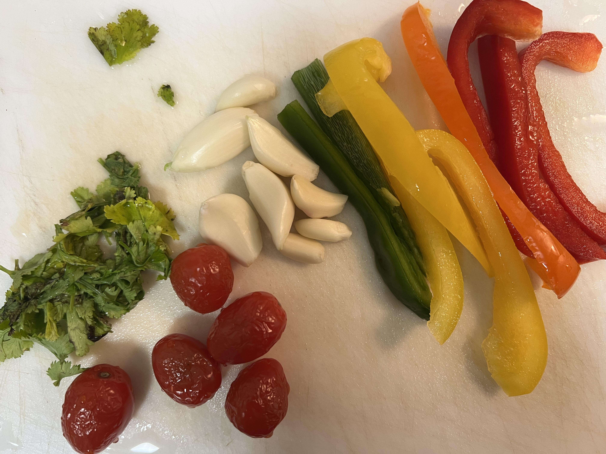

# 🛡️ Protocolo Oficial APPCC / HACCP de Seguridad e Higiene Alimentaria en Sistemas Batch Cooking

> 📊 **Infografía Educativa TouChef:** [Ver Infografía Técnica](assets/infografia_tecnica_abatimiento_cook_chill.jpg)




> **Documento Técnico Oficial de Calidad y Seguridad Alimentaria — PrepMaster & TouChef Standard (HACCP-BC-06)**  
> **Área:** Higiene Alimentaria, Microbiología Predictiva, Análisis de Peligros y Puntos Críticos de Control (APPCC / HACCP)  
> **Marco Normativo:** Reglamento (CE) Nº 852/2004, Reglamento (CE) Nº 2073/2005 (Criterios microbiológicos), Codex Alimentarius (CXC 1-1969 rev. 2020), FDA Food Code 2022, Guías Técnicas AESAN y EFSA.  
> **Destinatarios:** Responsables de Calidad, Chefs de Producción Batch Cooking, Manipuladores de Alimentos y Operadores Domésticos Avanzados.  
> **Estado:** Aprobado para Producción y Auditoría Sanitaria | **Versión:** 3.1.0

---

## 📑 Índice General

1. [Marco Introductorio y Principios APPCC Aplicados al Batch Cooking](#1-marco-introductorio-y-principios-appcc-aplicados-al-batch-cooking)
2. [Identificación y Gestión de Puntos Críticos de Control (PCC 1 a PCC 6)](#2-identificación-y-gestión-de-puntos-críticos-de-control-pcc-1-a-pcc-6)
   - [PCC 1: Recepción y Frescura de Materias Primas](#pcc-1-recepción-y-frescura-de-materias-primas)
   - [PCC 2: Prevención de Contaminación Cruzada en la Mise en Place](#pcc-2-prevención-de-contaminación-cruzada-en-la-mise-en-place)
   - [PCC 3: Tratamiento Térmico y Cocción Segura en Núcleo](#pcc-3-tratamiento-térmico-y-cocción-segura-en-núcleo)
   - [PCC 4: Abatimiento Térmico Obligatorio (Cook & Chill)](#pcc-4-abatimiento-térmico-obligatorio-cook--chill)
   - [PCC 5: Almacenamiento en Frío Estricto y Cadena Térmica](#pcc-5-almacenamiento-en-frío-estricto-y-cadena-térmica)
   - [PCC 6: Regeneración Térmica Obligatoria Previa al Consumo](#pcc-6-regeneración-térmica-obligatoria-previa-al-consumo)
3. [Microbiología Predictiva y Patógenos Críticos en Alimentos Almacenados](#3-microbiología-predictiva-y-patógenos-críticos-en-alimentos-almacenados)
   - [*Bacillus cereus* y la Toxina Emética Cereulida en Féculas](#bacillus-cereus-y-la-toxina-emética-cereulida-en-féculas)
   - [*Clostridium botulinum* Tipo II (Psicrótrofo) en Envasado al Vacío](#clostridium-botulinum-tipo-ii-psicrótrofo-en-envasado-al-vacío)
   - [*Listeria monocytogenes*: Dinámica Psicrótrofa y Formación de Biofilms](#listeria-monocytogenes-dinámica-psicrótrofa-y-formación-de-biofilms)
   - [*Salmonella enterica* y *Staphylococcus aureus* (Enterotoxinas Termoestables)](#salmonella-enterica-y-staphylococcus-aureus-enterotoxinas-termoestables)
4. [Protocolo de Higiene de Superficies, Utillaje y Tablas de Corte](#4-protocolo-de-higiene-de-superficies-utillaje-y-tablas-de-corte)
   - [Código Cromático Internacional de Tablas de Corte](#código-cromático-internacional-de-tablas-de-corte)
   - [Procedimiento Operativo de Limpieza y Sanitización Química (L+D)](#procedimiento-operativo-de-limpieza-y-sanitización-química-ld)
5. [Biofísica de la Descongelación Segura y Prohibición de Recongelación](#5-biofísica-de-la-descongelación-segura-y-prohibición-de-recongelación)
6. [Registros Oficiales y Checklists de Auditoría Diaria](#6-registros-oficiales-y-checklists-de-auditoría-diaria)
7. [Glosario Normativo y Científico](#7-glosario-normativo-y-científico)

---

# 1. Marco Introductorio y Principios APPCC Aplicados al Batch Cooking

El **Batch Cooking** (producción culinaria por lotes diferidos) altera sustancialmente el perfil de riesgo toxicológico y microbiológico respecto a la cocina de servicio inmediato (*Cook & Serve*). Al desvincular temporalmente la cocción del consumo (intervalos de 48 a 120 horas en refrigeración, o de semanas en congelación), se introduce una ventana crítica durante la cual **las esporas supervivientes pueden germinar, multiplicarse y sintetizar toxinas** si no se aplican barreras biológicas estrictas (*Hurdle Technology* de Leistner).

```
   ┌──────────────────────────────────────────────────────────────────────────────┐
   │             FLUJO DE PROCESO BATCH COOKING & MAPA DE PUNTOS PCC              │
   └──────────────────────────────────────┬───────────────────────────────────────┘
                                          │
    [ RECEPCIÓN MATERIAS PRIMAS ] ───────► ( PCC 1: Temp & Integridad )
                  │
    [ PREPARACIÓN / MISE EN PLACE ] ─────► ( PCC 2: Contaminación Cruzada & Tablas )
                  │
    [ TRATAMIENTO TÉRMICO / COCCIÓN ] ───► ( PCC 3: Temp Núcleo >75°C / Pasteurización )
                  │
    [ ABATIMIENTO TÉRMICO FORZADO ] ─────► ( PCC 4: 65°C a <10°C en <120 min )
                  │
    [ ALMACENAMIENTO EN FRÍO / VACÍO ] ──► ( PCC 5: Nevera 0-4°C / Congelador <= -18°C )
                  │
    [ REGENERACIÓN TÉRMICA ] ────────────► ( PCC 6: Temp Núcleo >74°C en todo el volumen )
                  │
               CONSUMO
```

El presente protocolo define los **Límites Críticos (LC)**, la **Frecuencia de Monitorización**, las **Acciones Correctivas Inmediatas** y los **Registros Documentales** obligatorios para cada fase de la cadena alimentaria.

---

# 2. Identificación y Gestión de Puntos Críticos de Control (PCC 1 a PCC 6)

---

## PCC 1: Recepción y Frescura de Materias Primas

### 1. Peligros Asociados
* **Biológicos:** Carga bacteriana inicial elevada ($N_0 > 10^5\,\text{UFC/g}$), presencia de *Salmonella spp.* en aves, *Listeria monocytogenes* en carnes crudas/lácteos frescos, anisákidos viables en pescado, enterobacterias por rotura de vísceras.
* **Químicos:** Histamina en pescados escómbridos ($>100\,\text{mg/kg}$ por degradación de histidina por bacterias histidino-descarboxilasas a temperaturas $>4^\circ\text{C}$), metales pesados, pesticidas residuales.
* **Físicos:** Cuerpos extraños, rotura de empaques primarios, pérdida de vacío o escarcha superficial por descongelación previa.

### 2. Límites Críticos (LC)

| Categoría de Materia Prima | Límite Crítico Térmico (Recepción) | Criterios Organolépticos de Rechazo Inmediato |
| :--- | :--- | :--- |
| **Aves y Carnes Frescas Picadas** | $T \le 4.0^\circ\text{C}$ | Decoloración verdosa/parda, superficie viscosa, olor amoniacal/ácido. |
| **Carnes Frescas (Piezas enteras)** | $T \le 7.0^\circ\text{C}$ (Objetivo $\le 4.0^\circ\text{C}$) | Exudado lechoso o turbio, pérdida de elasticidad muscular al tacto. |
| **Pescado Fresco Eviscerado** | $0.0^\circ\text{C} \le T \le 2.0^\circ\text{C}$ (Con hielo) | Ojos hundidos/opacos, agallas marrones/secas, carne blanda, olor a trimetilamina. |
| **Moluscos Bivalvos Vivos** | $T \le 6.0^\circ\text{C}$ (Vivos y viables) | Valvas abiertas que no cierran a la percusión, líquido intervalvar turbio/ausente. |
| **Ovoproductos Pasteurizados** | $T \le 4.0^\circ\text{C}$ | Envase abombado, fecha de caducidad vencida, precinto roto. |
| **Lácteos y Derivados** | $T \le 4.0^\circ\text{C}$ | Hinchamiento gaseoso en yogures/cremas, sinéresis ácida anormal. |
| **Ultracongelados** | $T \le -18.0^\circ\text{C}$ (Tolerancia breve: $-15^\circ\text{C}$) | Presencia de bloques compactos de hielo (evidencia de descongelación y recongelación). |
| **Vegetales y Hortalizas de IV Gama** | $T \le 4.0^\circ\text{C}$ | Bolsas con acumulación de gases (abombamiento), condensación marrón interna. |

```
   ┌──────────────────────────────────────────────────────────────────────────┐
   │             ÁRBOL DE DECISIÓN DE ACEPTACIÓN EN RECEPCIÓN (PCC 1)         │
   └────────────────────────────────────┬─────────────────────────────────────┘
                                        │
                         ¿Temperatura en Límite Crítico?
                         ├── NO ──► [ RECHAZO INMEDIATO Y DEVOLUCIÓN A PROVEEDOR ]
                         └── SÍ
                              │
               ¿Integridad de Empaque y Lote Trazable?
               ├── NO ──► [ RECHAZO / CUARENTENA ]
               └── SÍ
                    │
       ¿Atributos Organolépticos Conformes?
       ├── NO ──► [ RECHAZO ]
       └── SÍ ──► [ ACEPTADO: Etiquetado Primario y Entrada a Cámara Fría en < 15 min ]
```

### 3. Vigilancia y Monitorización
* **Frecuencia:** $100\%$ de los lotes recibidos.
* **Método:** Inserción de termómetro de sonda de penetración calibrado entre envases o en el centro de piezas testigo; termometría infrarroja de superficie para envases termosellados intactos.
* **Acción Correctiva:** Rechazo formal del lote, registro en el albarán de entrega con firma del transportista y notificación al departamento de calidad.

---

## PCC 2: Prevención de Contaminación Cruzada en la Mise en Place

### 1. Peligros Asociados
* Transferencia de patógenos entéricos (*Salmonella*, *Campylobacter*, *E. coli* O157:H7) desde materias primas crudas hacia alimentos cocinados o listos para consumo (RTE: *Ready-to-Eat*).
* Contaminación cruzada por alérgenos no declarados (proteínas de gluten, crustáceos, huevo, frutos de cáscara, soja, sésamo).
* Proliferación por permanencia excesiva de alimentos perecederos a temperatura ambiente durante el pelado, corte y marinado.

### 2. Límites Críticos (LC) y Reglas Operativas
1. **Regla de Tiempo Fuera de Frío ($t_{\text{off-cold}}$):**  
   $$\sum t_{\text{ambiente}} \le 30\text{ minutos}$$  
   Ningún producto cárnico, avícola, pescadero o lácteo debe permanecer a temperatura ambiente ($>8^\circ\text{C}$) más de 30 minutos acumulados durante el pre-acondicionamiento.
2. **Separación Espacial y Temporal Estricta:**
   * **Zonificación física:** Área Sucia (recepción y pelado de tubérculos/hortalizas sucias) $\to$ Área Cruda Limpia (corte y porcionado) $\to$ Área Térmica/Cocción $\to$ Área de Envasado Limpio / Abatimiento.
   * **Separación temporal:** Si se opera en espacio compartido, procesar primero vegetales RTE y alimentos cocinados; sanitizar completamente el recinto antes de ingresar carnes crudas o aves.
3. **Flujo Unidireccional ("Marcha Hacia Adelante"):** Prohibición absoluta de retroceso de materias primas o desperdicios a través de zonas de producto terminado o limpio.

---

## PCC 3: Tratamiento Térmico y Cocción Segura en Núcleo

### 1. Peligros Asociados
* Supervivencia de patógenos vegetativos (*Listeria monocytogenes*, *Salmonella enterica*, *Campylobacter jejuni*, *Escherichia coli* enterohemorrágica) por subcocción o subestimación del gradiente térmico interno en piezas gruesas.

### 2. Límites Críticos (LC) de Pasteurización y Cocción

La letalidad térmica se rige por la acumulación de calor letal ($F$-value). El estándar mínimo exigido en batch cooking es una **reducción logarítmica de $6D$ para *L. monocytogenes* y de $7D$ para *Salmonella spp.***

$$t_{\text{letal}} = D_{\text{ref}} \cdot 10^{\frac{T_{\text{ref}} - T}{z}}$$

Donde para *L. monocytogenes*: $T_{\text{ref}} = 70^\circ\text{C}$, $D_{70} \approx 0.25\text{ min} = 15\text{ s}$, $z \approx 7.5^\circ\text{C}$.

```
   ┌──────────────────────────────────────────────────────────────────────────┐
   │            CURVA DE INACTIVACIÓN TÉRMICA EQUIVALENTE (6D / 7D)           │
   │                                                                          │
   │   75°C ───► Instantáneo (< 1 segundo en centro térmico)                  │
   │   70°C ───► 2.0 minutos                                                  │
   │   68°C ───► 4.0 minutos                                                  │
   │   65°C ───► 10.0 minutos                                                 │
   │   63°C ───► 25.0 minutos                                                 │
   │   60°C ───► 45.0 minutos (Sólo con sous-vide de precisión ±0.1°C)        │
   │   55°C ───► Inseguro para cocciones estándar discontinuas                 │
   └──────────────────────────────────────────────────────────────────────────┘
```

| Tipo de Alimento | Temperatura Mínima en Núcleo | Tiempo Mínimo de Sostenimiento | Justificación Microbiológica |
| :--- | :--- | :--- | :--- |
| **Aves y Preparados de Ave (Pollo, Pavo)** | $74.0^\circ\text{C} - 75.0^\circ\text{C}$ | $\ge 15\text{ segundos}$ | Reducción $7D$ de *Salmonella enterica* y *Campylobacter*. |
| **Carnes Picadas y Hamburguesas** | $75.0^\circ\text{C}$ | $\ge 15\text{ segundos}$ | Internalización superficial de *E. coli* STEC durante el picado. |
| **Carnes Rojas / Cerdo (Pieza Entera)** | $65.0^\circ\text{C}$ (o $70^\circ\text{C}$) | $\ge 10\text{ min}$ (o $\ge 2\text{ min}$) | Eliminación de *Salmonella*, *Listeria* y parásitos (*Trichinella*). |
| **Pescados y Cefalópodos** | $65.0^\circ\text{C}$ | $\ge 1\text{ minuto}$ | Inactivación de *Anisakis simplex* (o congelación previa $-20^\circ\text{C} \times 24\text{h}$). |
| **Guisos, Sopas, Caldos y Salsas** | $100.0^\circ\text{C}$ (Ebullición) | $\ge 3\text{ minutos}$ en agitación | Homogeneización térmica de la masa líquida total. |
| **Huevos y Ovoproductos (Tortillas/Revueltos)**| $72.0^\circ\text{C}$ | $\ge 2\text{ minutos}$ (o cuajado completo) | Destrucción de *Salmonella Enteritidis*. |

### 3. Vigilancia y Monitorización
* **Instrumentación:** Termómetro digital de inserción calibrado con sonda de aguja fina ($\le 1.5\text{ mm}$).
* **Punto de Medición:** Centro geométrico de la pieza de mayor volumen del lote de cocción.
* **Acción Correctiva:** Si el núcleo no alcanza el LC al cumplirse el tiempo programado, continuar la cocción térmica hasta alcanzar el binomio temperatura-tiempo validado. Si no se puede garantizar la homogeneidad, descartar el lote.

---

## PCC 4: Abatimiento Térmico Obligatorio (Cook & Chill)

### 1. Peligros Asociados
* **El mayor punto de vulnerabilidad biológica en Batch Cooking.**  
* La permanencia del alimento cocinado en la **Zona de Peligro Térmico ($65^\circ\text{C} \to 10^\circ\text{C}$)** activa la germinación explosiva de endosporas bacterianas termorresistentes (*Bacillus cereus*, *Clostridium perfringens*, *Clostridium botulinum*), las cuales se duplican cada 15-20 minutos a $35-45^\circ\text{C}$.

### 2. Límites Críticos (LC) y Tiempos Máximos
* **Normativa Europea / Codex / FDA:**  
  * **Paso 1:** De $65^\circ\text{C}$ a $\le 21^\circ\text{C}$ en menos de **120 minutos** (óptimo $<60\text{ min}$).
  * **Paso 2:** De $21^\circ\text{C}$ a $\le 4^\circ\text{C}$ (o $<10^\circ\text{C}$ intermedio) en un tiempo acumulado total inferior a **120 minutos** (estándar profesional de abatidor) o máximo **180 minutos** en sistemas de emergencia.
  * **Excepción estricta para Arroces y Féculas:** De $65^\circ\text{C}$ a $\le 10^\circ\text{C}$ en **$<60\text{ minutos}$**.

```
  Temperatura (°C)
   70°C ┬── Inicio del Abatimiento Inmediato
        │
   60°C ┼─────────────────────────────────────────────────────────────
        │   ZONA DE MÁXIMO RIESGO: GERMINACIÓN DE ESPORAS
   40°C ┼   (Duplicación bacteriana cada 15 min de B. cereus y C. perfringens)
        │
   20°C ┼───────────────────────── Línea de los 60 min (Meta: < 21°C)
        │
   10°C ┼───────────────────────── Meta obligatoria en < 120 min
        │
    3°C ┴───────────────────────── Almacenamiento final estable
        0         30         60         90        120        Tiempo (min)
```


> **Procedencia Técnica & Validación Bromatológica:** Curva de control para el Punto Crítico de Control (PCC 4) según Reglamento CE 852/2004 y directrices FDA Food Code para enfriamiento rápido forzado en matrices alimentarias densas.


> **Infografía Técnica Vertical TouChef:** Cinética de enfriamiento rápido en baño de hielo 50/50, mapa de patógenos en Zona de Peligro (65°C a 10°C) y protocolo de 5 pasos con tapado diferido.

### 3. Protocolos de Abatimiento por Entorno

#### A. Entorno Profesional / Industrial (Abatidor de Temperatura)
* Disposición en bandejas Gastronorm 1/1 de bajo perfil con espesor de capa de alimento $\le 4\text{ cm}$.
* Selección del programa: **Abatimiento Positivo Fuerte (*Hard Chill*)** para alimentos densos (guisos, purés, legumbres); **Abatimiento Suave (*Soft Chill*)** para hortalizas delicadas.

#### B. Entorno Doméstico / Semi-profesional (Sin Abatidor Mecánico)
* **Prohibido introducir recipientes humeantes ($>60^\circ\text{C}$) directamente en neveras convencionales:** Eleva la temperatura ambiente del recinto, rompe la cadena de frío de los alimentos contiguos y genera condensación masiva.
* **Procedimiento Obligatorio del Baño de Hielo Bifásico:**
  1. Transferir el alimento caliente a recipientes planos de acero inoxidable o vidrio borosilicato de baja altura ($\le 4\text{ cm}$).
  2. Sumergir el recipiente en un baño maría inverso con **$50\%$ agua fría $+ 50\%$ hielo picado $+ 200\,\text{g}$ de sal común** (la sal desciende el punto eutéctico del agua a $-2^\circ\text{C} / -4^\circ\text{C}$).
  3. Agitar continuamente con espátula desinfectada para romper el gradiente interno de conducción.
  4. Una vez alcanzados los $\le 10^\circ\text{C}$ en sonda, tapar herméticamente y transferir al estante más frío de la nevera ($0-3^\circ\text{C}$).


> **Fotografía Real Operativa:** Protocolo de abatimiento bifásico mediante baño de agua con hielo y sal para cumplimiento de PCC 4 y reducción térmica acelerada.

---

## PCC 5: Almacenamiento en Frío Estricto y Cadena Térmica

### 1. Peligros Asociados
* Crecimiento lento pero progresivo de patógenos psicrótrofos (*Listeria monocytogenes*, *Yersinia enterocolitica*, *Clostridium botulinum* Tipo E y B no proteolítico).
* Degradación enzimática y autooxidación lipídica.

### 2. Límites Críticos (LC) y Matriz de Vida Útil

| Rango de Temperatura | Tipo de Conservación | Límite Crítico | Alarma / Acción |
| :--- | :--- | :--- | :--- |
| **Cámara / Nevera Batch** | Refrigeración Estricta | **$0.0^\circ\text{C} \text{ a } +3.5^\circ\text{C}$** (Máximo legal $+4.0^\circ\text{C}$) | Si $T > 5.0^\circ\text{C}$ durante $>2\text{h}$, reclasificar vida útil o descartar. |
| **Cámara de Congelación** | Congelación Comercial | **$\le -18.0^\circ\text{C}$** | Si $T > -15.0^\circ\text{C}$, verificar compresor y consumo preferente. |

### 3. Matriz de Vida Útil Segura en Refrigeración ($0-3^\circ\text{C}$)

```
┌─────────────────────────────────────────────────────────────────────────────┐
│                    MATRIZ TOXICOLÓGICA DE VIDA ÚTIL EN FRÍO                 │
├──────────────────────────────────────┬──────────────────────┬───────────────┤
│ Categoría de Alimento Batch          │ Envasado Tradicional │ Vacío Hermético│
├──────────────────────────────────────┼──────────────────────┼───────────────┤
│ Arroz cocinado, pasta, quinoa        │ 48 - 72 horas (MÁX)  │ 5 días (T<3°C)│
│ Pescados y mariscos cocinados        │ 48 horas             │ 4 días (T<2°C)│
│ Aves y carnes picadas cocinadas      │ 72 horas (3 días)    │ 6 - 8 días    │
│ Carnes guisadas en piezas grandes    │ 96 horas (4 días)    │ 10 - 12 días  │
│ Legumbres cocinadas y caldos         │ 72 - 96 horas        │ 8 - 10 días   │
│ Cremas de verduras y purés           │ 96 horas (4 días)    │ 8 - 10 días   │
│ Huevos cocidos con cáscara intacta   │ 7 días               │ N/A           │
└──────────────────────────────────────┴──────────────────────┴───────────────┘
```

> [!IMPORTANT]
> **Rotulación Obligatoria Secundaria en Todo Envase Batch:**  
> Cada contenedor debe poseer una etiqueta indeleble con:
> 1. Nombre descriptivo del producto y alérgenos destacados.
> 2. Fecha y hora exacta de finalización del abatimiento.
> 3. Lote interno de producción (L-AAMMDD-X).
> 4. Fecha límite de consumo seguro ($T \le 3^\circ\text{C}$).
> 5. Método y temperatura exigida de regeneración.


> **Fotografía Real Operativa:** Identificación y rotulado de recipientes y frascos herméticos con fecha de envasado, lote interno y fecha límite de consumo según protocolo de trazabilidad HACCP.

---

## PCC 6: Regeneración Térmica Obligatoria Previa al Consumo

### 1. Peligros Asociados
* Multiplicación de células residuales no detectadas durante el almacenamiento.
* Ingestión de toxinas bacterianas termolábiles (toxina botulínica, enterotoxina diarreica de *B. cereus*) que no fueron destruidas por falta de calor homogéneo.

### 2. Límites Críticos (LC)
* **Regla de Oro de Regeneración:** El alimento debe alcanzar una temperatura en el núcleo de **$\ge 74.0^\circ\text{C}$ en todo su volumen en un tiempo no superior a 60 minutos** desde su extracción del refrigerador.
* **Prohibición de Mantenimiento en Templado Inseguro:** Si el alimento se va a mantener caliente para servicio continuo, debe mantenerse en baño maría o mantenedor a una temperatura **estrictamente superior a $\ge 65.0^\circ\text{C}$**.
* **Prohibición de Doble Regeneración:** Queda **terminantemente prohibido reenfriar y volver a regenerar un alimento que ya ha sido regenerado una vez**. La porción no consumida debe ser destruida inmediatamente.

```
   ┌──────────────────────────────────────────────────────────────────────────┐
   │             TABLA DE PARÁMETROS DE REGENERACIÓN POR MÉTODO               │
   ├───────────────────┬──────────────────────────────────────────────────────┤
   │ Horno Convección  │ 140°C - 160°C con humedad 20-30% hasta T_núcleo >74°C│
   │ Microondas        │ Potencia media-alta con campana, pausa y remoción    │
   │ Fuego Directo     │ Llevar guisos/sopas a ebullición franca (>100°C)     │
   │ Baño María / Sous │ Agua a 80°C - 85°C hasta igualar termómetro en aguja │
   └───────────────────┴──────────────────────────────────────────────────────┘
```

---

# 3. Microbiología Predictiva y Patógenos Críticos en Alimentos Almacenados

---

## *Bacillus cereus* y la Toxina Emética Cereulida en Féculas

### 1. Ecología y Formación de Esporas
* *Bacillus cereus* es un bacilo Gram positivo, formador de endosporas, anaerobio facultativo, omnipresente en el suelo, cosechas de cereales y granos crudos.
* Durante la cocción culinaria estándar del arroz, pasta o patatas ($100^\circ\text{C}$), las células vegetativas mueren, pero **las esporas de *B. cereus* sobreviven ilesas al calor**.
* Cuando el arroz cocinado se deja enfriar lentamente a temperatura ambiente ($20^\circ\text{C} - 45^\circ\text{C}$), las esporas experimentan un fenómeno de **choque térmico activador (*heat activation*)**, germinando en células vegetativas que se multiplican exponencialmente.

```
   Espora latente en arroz crudo
                │
   Cocción a 100°C ────► Destruye células vegetativas pero ACTIVA la espora
                │
   Enfriamiento lento (25°C-45°C) ───► Germinación y multiplicación exponencial
                │
   Síntesis de CEREULIDA ────────────► TOXINA EMÉTICA TERMOESTABLE (Indestructible)
                │
   Recalentado posterior a 100°C ────► Las bacterias mueren, la toxina PERMANECE
```

### 2. Dualidad Toxicológica: Síndrome Diarreico vs. Síndrome Emético

```
┌─────────────────────────────┬───────────────────────────────┬───────────────────────────────┐
│ Característica              │ Síndrome Emético              │ Síndrome Diarreico            │
├─────────────────────────────┼───────────────────────────────┼───────────────────────────────┤
│ **Toxina Responsable**      │ **Cereulida** (Dodecadepsi-   │ **Enterotoxinas proteicas**   │
│                             │ péptido cíclico termoestable) │ (Hbl, Nhe, CytK - termolábil) │
│ **Lugar de Producción**     │ **Pre-formada en el alimento**│ **In vivo en intestino humano**│
│ **Alimentos Típicos**       │ Arroz frito, pasta, féculas   │ Guisos de carne, verduras     │
│ **Período de Incubación**   │ **0.5 a 6 horas** (Súbito)    │ 8 a 16 horas                  │
│ **Sintomatología**          │ Vómitos intensos, náuseas     │ Diarrea acuosa, cólicos       │
│ **Termoestabilidad Toxina** │ **Sobrevive a 121°C x 90 min**│ Inactivada a 56°C x 5 min     │
│ **Resistencia a pH**        │ Estable entre pH 2.0 y 11.0   │ Degradada por ácido gástrico  │
└─────────────────────────────┴───────────────────────────────┴───────────────────────────────┘
```

> [!CAUTION]
> **Por qué el arroz debe abatirse en $<60$ minutos y no conservarse más de 72 horas:**  
> La toxina **Cereulida** resiste el calor de fritura, horneado y microondas una vez formada. Ningún calentamiento posterior hará que un arroz colonizado sea seguro. El único método preventivo eficaz es **evitar la germinación bajando la temperatura a $<10^\circ\text{C}$ en menos de 60 minutos** y limitar su vida útil a **máximo 72 horas a $\le 3^\circ\text{C}$**.

---

## *Clostridium botulinum* Tipo II (Psicrótrofo) en Envasado al Vacío

### 1. El Riesgo Anóxico en Batch Cooking
* El envasado al vacío elimina el oxígeno ($O_2 < 0.5\%$), inhibiendo mohos y bacterias aerobias alterantes (*Pseudomonas*). Sin embargo, crea el **entorno anóxico perfecto para los clostridios esporulados anaerobios estrictos**.

### 2. Comparativa entre Grupos de *C. botulinum*

```
┌──────────────────────────────────────┬──────────────────────┬───────────────────────────────┐
│ Parámetro Fisiológico                │ Grupo I (Proteolítico)│ Grupo II (No Proteolítico)    │
├──────────────────────────────────────┼──────────────────────┼───────────────────────────────┤
│ **Tipos de Toxina**                  │ A, B, F              │ B, E, F                       │
│ **Temperatura Mínima de Crecimiento**│ $10.0^\circ\text{C}$ │ **$3.0^\circ\text{C}$ a $3.3^\circ\text{C}$ (Psicrótrofo)**│
│ **Termorresistencia de Esporas**     │ Muy Alta ($D_{121} = 0.21\text{ min}$) │ Moderada ($D_{82.2} = 1.5 - 2.0\text{ min}$) │
│ **pH Mínimo de Crecimiento**         │ $4.6$                │ **$5.0$**                     │
│ **$a_w$ Mínima**                     │ $0.935$              │ **$0.970$**                   │
│ **Tolerancia a NaCl**                │ $10\%$               │ **$3.5\% - 5.0\%$**           │
│ **Peligro Principal en Cocina**      │ Conservas caseras    │ **Sous-vide y Vacío en Nevera**│
└──────────────────────────────────────┴──────────────────────┴───────────────┘
```

### 3. Mecanismos de Control (Hurdle Technology)
En preparaciones al vacío en batch cooking no esterilizadas industrialmente ($T < 121^\circ\text{C}$), se debe garantizar al menos **UNA** de las siguientes barreras:
1. **Control de Temperatura Estricto:** Mantenimiento continuo entre **$0.0^\circ\text{C} \text{ y } +2.5^\circ\text{C}$** para productos con vida útil superior a 10 días.
2. **Acidificación de la Matriz:** Formular salsas y marinados con **$pH \le 4.6$** mediante zumo de limón, vinagre o ácido láctico.
3. **Actividad de Agua y Salazón:** Concentración acuosa de **$\text{NaCl} \ge 3.5\%$** o $a_w \le 0.92$.
4. **Regla de los 10 Días (UK FSA / ACMSF):** Cualquier producto al vacío no pasteurizado a $90^\circ\text{C} \times 10\text{ min}$ (reducción $6D$ de esporas Grupo II) o sin barreras de $pH/\text{sal}$ **NO debe superar los 10 días de vida útil a $\le 3^\circ\text{C}$**.

---

## *Listeria monocytogenes*: Dinámica Psicrótrofa y Formación de Biofilms

### 1. Características Singulares del Patógeno
* Bacilo Gram positivo, no esporulado, anaerobio facultativo.
* **Capacidad psicrótrofa extrema:** Puede multiplicarse activamente a temperaturas desde **$-1.5^\circ\text{C}$ hasta $45.0^\circ\text{C}$**.
* **Halotolerancia y resistencia ácida:** Tolera concentraciones de sal de hasta el $10-12\%$ y rangos de $pH$ entre $4.3$ y $9.4$.

```
   Tasa de Crecimiento de Listeria monocytogenes según Temperatura
   
   40°C ┼           ▲
        │          ╱ ╲
   20°C ┼         ╱   ╲
        │        ╱     ╲
    8°C ┼───────╱─────── (Crecimiento rápido: duplicación en ~8 horas)
        │      ╱
    4°C ┼─────╱───────── (Crecimiento moderado: duplicación en ~24-36 horas)
    0°C ┼────╱────────── (Crecimiento lento pero continuo)
   -1.5°C ──┴─────────── Límite térmico inferior de multiplicación
```

### 2. Implicaciones Clínicas y Criterios Normativos (Reglamento CE 2073/2005)
* Causa la **listeriosis invasiva** (septicemia, meningitis, aborto espontáneo en gestantes), con una tasa de mortalidad del **$20\% - 30\%$** en poblaciones vulnerables (ancianos, inmunodeprimidos, neonatos).
* **Límites Legales:**
  * Alimentos listos para consumo (RTE) que pueden favorecer el desarrollo de *L. monocytogenes*: **Ausencia en $25\,\text{g}$** antes de que el alimento salga del control inmediato del productor, o $<100\,\text{UFC/g}$ a lo largo de toda su vida comercial si se demuestra mediante estudios de durabilidad predictiva.

### 3. Biofilms en Ambientes Húmedos de Cocina
* *L. monocytogenes* genera **biopelículas de exopolisacáridos** altamente resistentes en superficies de acero inoxidable rayadas, gomas de sellado de refrigeradores, cuchillas de robots cortadores y desagües de zonas de preparación. Requiere detergentes alcalinos con acción mecánica y posterior desinfección oxidante.

---

## *Salmonella enterica* y *Staphylococcus aureus* (Enterotoxinas Termoestables)

```
┌──────────────────────────────┬───────────────────────────────┬───────────────────────────────┐
│ Patógeno                     │ Vector Principal / Origen     │ Mecanismo Patogénico          │
├─────────────────────────────┼───────────────────────────────┼───────────────────────────────┤
│ ***Salmonella enterica***   │ Huevos crudos, carne de ave,  │ Infección celular invasiva.   │
│ *(Enteritidis, Typhimurium)*│ contaminación cruzada en tablas│ Destruida por calor $>75°C$.  │
├─────────────────────────────┼───────────────────────────────┼───────────────────────────────┤
│ ***Staphylococcus aureus***  │ Portadores humanos (manos,    │ **Intoxicación por Enterotoxina│
│                             │ nariz, piel, heridas cutáneas)│ preformada (SEA a SEE)**.     │
│                             │ en alimentos cocinados tibios │ **Termoestable (100°C x 30 min│
│                             │ manipulados sin guantes.**    │ no la inactiva).**            │
└─────────────────────────────┴───────────────────────────────┴───────────────────────────────┘
```

> [!WARNING]
> **El Peligro de *Staphylococcus aureus* en Manipulación Post-Cocción:**  
> Si un alimento recién cocinado se manipula a mano descubierta durante el emplatado o porcionado en recipientes batch y se deja enfriar lentamente entre $10^\circ\text{C}$ y $45^\circ\text{C}$, *S. aureus* sintetiza enterotoxinas estafilocócicas. Aunque luego el plato se regenere a $>75^\circ\text{C}$, **la toxina permanecerá intacta**, provocando vómitos fulminantes en 1 a 4 horas.

---

# 4. Protocolo de Higiene de Superficies, Utillaje y Tablas de Corte

---

## Código Cromático Internacional de Tablas de Corte

Para anular radicalmente la contaminación cruzada entre matrices de distinto nivel de riesgo biológico, se establece el siguiente estándar obligatorio de codificación cromática:

```
┌─────────────────────────────────────────────────────────────────────────────┐
│              SISTEMA CROMÁTICO ESTANDARIZADO DE TABLAS Y CUCHILLOS          │
├──────────────┬──────────────────────────────┬───────────────────────────────┤
│ Color        │ Grupo de Alimento Asignado   │ Matriz Permitida              │
├──────────────┼──────────────────────────────┼───────────────────────────────┤
│ 🔴 **ROJO**   │ Carnes Rojas Crudas          │ Vacuno, porcino, ovino, caza  │
│ 🟡 **AMARILLO**│ Aves de Corral Crudas       │ Pollo, pavo, pato, codorniz   │
│ 🔵 **AZUL**   │ Pescados y Mariscos Crudos   │ Pescado blanco/azul, marisco  │
│ 🟢 **VERDE**  │ Vegetales, Frutas, Ensaladas │ Hortalizas limpias, frutas    │
│ ⚪ **BLANCO** │ Alimentos Cocinados / RTE    │ Carnes cocinadas, pan, queso  │
│ 🟤 **MARRÓN** │ Vegetales con Tierra / Asados│ Tubérculos sin pelar, raíces  │
└──────────────┴──────────────────────────────┴───────────────────────────────┘
```

```
       🔴 CARNES ROJAS             🟡 AVES CRUDAS              🔵 PESCADOS CRUDOS
    ┌────────────────────┐      ┌────────────────────┐      ┌────────────────────┐
    │  Vacuno / Cerdo    │      │   Pollo / Pavo     │      │   Pescados/Mariscos│
    └────────────────────┘      └────────────────────┘      └────────────────────┘
       🟢 FRUTAS / VERDURAS        ⚪ ALIMENTOS COCINADOS      🟤 TUBÉRCULOS / SUCIOS
    ┌────────────────────┐      ┌────────────────────┐      ┌────────────────────┐
    │   Hortalizas RTE   │      │   Quesos / Embutido│      │   Raíces con tierra│
    └────────────────────┘      └────────────────────┘      └────────────────────┘
```


> **Procedencia Técnica & Prevención de Riesgos Biológicos:** Estándar internacional de codificación cromática para anulación de contaminación cruzada según directrices HACCP / APPCC y especificaciones de material HDPE 500 (FDA 21 CFR 177.1520 / Reglamento UE 10/2011).


> **Infografía Técnica Vertical TouChef:** Guía visual de las 6 tablas de corte HDPE 500, patógenos diana, escala de metrología térmica (congelación, frío TouChef 0-3°C, peligro 10-65°C y pasteurización 75°C) y protocolo L+D.


> **Fotografía Real Operativa:** Disposición segregada de estaciones de corte y mise en place con recipientes independientes para neutralizar la contaminación cruzada en cocina.

### Especificaciones Técnicas del Material de Tablas
1. **Composición:** Polietileno de Alta Densidad (**HDPE 500**) o Polipropileno virgen de grado alimentario (normativa FDA 21 CFR 177.1520 / Reglamento UE 10/2011).
2. **Prohibición Expresa:** Tablas de madera no tratada para productos cárnicos o pescados crudos en entornos de manipulación industrial o batch semi-profesional.
3. **Criterio de Reemplazo:** Toda tabla que presente **surcos o hendiduras profundas superiores a $1.0\,\text{mm}$** producidas por el filo de cuchillos debe ser rectificada mediante cepillado mecánico industrial o desechada inmediatamente, al constituir micro-nichos protectores contra la desinfección química.

---

## Procedimiento Operativo de Limpieza y Sanitización Química (L+D)

La desinfección nunca es efectiva sobre superficies que contengan materia orgánica residual (grasas, proteínas, almidones). El protocolo se ejecuta en 5 fases secuenciales inalterables:

```
  [ FASE 1: Raspado Mecánico y Desescombro ]
                     │
  [ FASE 2: Prelavado con Agua Templada (40°C - 45°C) ]
                     │
  [ FASE 3: Aplicación de Detergente Desengrasante + Fricción Mecánica ]
                     │
  [ FASE 4: Aclarado con Agua Potable ]
                     │
  [ FASE 5: DESINFECCIÓN QUÍMICA (Hipoclorito o Alcohol 70%) + Secado al Aire ]
```

### Protocolo de Agentes Desinfectantes Autorizados

```
┌─────────────────────────────────────────────────────────────────────────────┐
│                    MATRIZ DE DESINFECTANTES QUÍMICOS HOMOLOGADOS            │
├──────────────────────┬──────────────────────────────┬───────────────────────┤
│ Agente Químico       │ Concentración Operativa      │ Tiempo y Aplicación   │
├──────────────────────┼──────────────────────────────┼───────────────────────┤
│ **Hipoclorito Sódico**│ **100 a 200 ppm de Cloro**   │ Contacto $\ge 5$ min. │
│ *(Apto uso alimentario)*│ (~2 a 4 mL de lejía 50 g/L por│ Aclarado obligatorio si│
│                      │ litro de agua fría)          │ supera 100 ppm.       │
├──────────────────────┼──────────────────────────────┼───────────────────────┤
│ **Alcohol Etílico /**│ **$70\% \text{ v/v}$ en base**│ Pulverización directa.│
│ **Isopropílico 70%** │ **acuosa desmineralizada**   │ Contacto $\ge 60$ s.  │
│ *(Grado Alimentario)* │                              │ **Evaporación sin residuo**│
├──────────────────────┼──────────────────────────────┼───────────────────────┤
│ **Ácido Peracético** │ **50 a 150 ppm**             │ Contacto $\ge 2$ min. │
│ *(Uso en enjuagues)* │                              │ Sin aclarado a $<100$ ppm│
└──────────────────────┴──────────────────────────────┴───────────────────────┘
```

> [!TIP]
> **Termodesinfección en Lavavajillas:**  
> El lavado mecánico industrial o doméstico programado a **temperatura de lavado $\ge 60^\circ\text{C}$ con ciclo de aclarado final a $\ge 82.0^\circ\text{C}$** garantiza la higienización física completa de recipientes Gastronorm, cubertería y tapas sin dejar residuos químicos.

---

# 5. Biofísica de la Descongelación Segura y Prohibición de Recongelación

---

## Justificación Biofísica: Por Qué Está Estrictamente Prohibido Recongelar

La prohibición sanitaria de recongelar un alimento descongelado en crudo o cocinado responde a dos fenómenos concurrentes: **lisis mecánica tisular** y **cinética exponencial de microorganismos reactivados**.

```
  ┌───────────────────────────────────────────────────────────────────────────┐
  │         CICLO DESTRUCTIVO DE LA DOBLE CONGELACIÓN / DESCONGELACIÓN        │
  └─────────────────────────────────────┬─────────────────────────────────────┘
                                        │
             [ 1ª Congelación: Latencia Bacteriana + Micro/Macrocristales ]
                                        │
             [ Descongelación: Rotura Celular + Liberación Masiva de EXUDADO ]
                                        │ (Medio de cultivo puro con aw ~ 1.0)
                                        │
             [ Multiplicación Logarítmica Rápida (N0 se multiplica x100-x1000) ]
                                        │
             [ 2ª Congelación: NO esteriliza, preserva la alta carga N0 ]
                                        │
             [ 2ª Descongelación: CARGA INICIAL CRÍTICA -> Toxinogénesis Masiva ]
```

### 1. Dinámica del Exudado Celular (*Drip Loss*)
* Durante la congelación, el agua intracelular forma cristales de hielo que distienden y rompen el sarcolema y las membranas celulares miofibrilares.
* Durante la descongelación, el agua no es reabsorbida en su totalidad: se drena hacia el exterior en forma de **exudado enriquecido** (*purga*).
* Este líquido contiene albúminas, aminoácidos libres, péptidos, sales minerales y glucógeno, elevando la actividad de agua en superficie a **$a_w \approx 0.99$**, constituyendo el caldo de cultivo más favorable posible para la reproducción microbiana.

### 2. Multiplicación Exponencial Acumulativa
* La congelación **no es un proceso de esterilización bactericida**, sino bacteriostático: abate temporalmente la actividad metabólica.
* Durante la primera descongelación, las bacterias supervivientes salen de la fase de latencia (*lag phase*) y entran en fase logarítmica.
* Si el alimento se recongela y se vuelve a descongelar, la carga microbiana de partida del segundo ciclo no es $N_0$, sino $N_{\text{final-1}}$, alcanzando densidades tóxicas ($>10^6\,\text{UFC/g}$) en una fracción mínima del tiempo habitual.

---

## Métodos de Descongelación Seguros

```
┌─────────────────────────────────────────────────────────────────────────────┐
│                    MÉTODOS CIENTÍFICOS DE DESCONGELACIÓN ACEPTADOS          │
├──────────────────────┬──────────────────────────────┬───────────────────────┤
│ Método               │ Condiciones Operativas       │ Observaciones         │
├──────────────────────┼──────────────────────────────┼───────────────────────┤
│ **1. Refrigeración** │ Cámara a **$0.0^\circ\text{C}$│ **Método de elección.**│
│ **Lenta en Cámara**  │ **a $+4.0^\circ\text{C}$** en │ Recipiente con rejilla│
│                      │ bandeja con drenaje          │ de separación de purga│
├──────────────────────┼──────────────────────────────┼───────────────────────┤
│ **2. Inmersión en**  │ Agua corriente fría          │ Alimento en bolsa     │
│ **Agua Fría (<12°C)**│ continua o con recambio      │ sellada al vacío;     │
│                      │ permanente; tiempo $<120$ min│ cocción inmediata.    │
├──────────────────────┼──────────────────────────────┼───────────────────────┤
│ **3. Microondas en** │ Modo descongelación ($30\%$) │ **Cocción térmica**   │
│ **Modo Defrost**     │ con remoción de puntos calientes│ **inmediata obligatoria**│
├──────────────────────┼──────────────────────────────┼───────────────────────┤
│ **4. Cocción Directa**│ Bloques finos ($\le 2.5\text{ cm}$)│ Exige garantizar      │
│ **desde Congelado**  │ en fritura, horno o guiso    │ $>75^\circ\text{C}$ en núcleo│
└──────────────────────┴──────────────────────────────┴───────────────────────┘
```

> [!CAUTION]
> **Prohibición Absoluta:**  
> Queda terminantemente prohibido descongelar alimentos a temperatura ambiente, sobre mesados de cocina, en agua estancada tibia o cerca de fuentes directas de calor ambiental.

---

# 6. Registros Oficiales y Checklists de Auditoría Diaria

---

## Plantilla 1: Control de Recepción de Mercancías (PCC 1)

```
+-------------------------------------------------------------------------------------------------------------------------+
| REGISTRO OFICIAL DE RECEPCIÓN DE MATERIAS PRIMAS (PCC 1)                                                                |
| Instalación / Lote de Producción: _________________________  Responsable: ___________________________________           |
+------------+------------+---------------+----------+------------+------------+-------------+--------------+-------------+
| Fecha/Hora | Proveedor  | Producto      | Nº Lote  | Temp (°C)  | Caducidad  | Empaque OK? | Estado (A/R) | Firma/Resp. |
+------------+------------+---------------+----------+------------+------------+-------------+--------------+-------------+
| __/__ _:_  | _________  | Pechuga Pollo | ________ | ____ °C    | __/__/__   |  [ ] S [ ] N|  [ ] A [ ] R | ___________ |
| __/__ _:_  | _________  | Salmón Fresco | ________ | ____ °C    | __/__/__   |  [ ] S [ ] N|  [ ] A [ ] R | ___________ |
| __/__ _:_  | _________  | Arroz Grano   | ________ | N/A (Seco) | __/__/__   |  [ ] S [ ] N|  [ ] A [ ] R | ___________ |
| __/__ _:_  | _________  | Verduras IV G | ________ | ____ °C    | __/__/__   |  [ ] S [ ] N|  [ ] A [ ] R | ___________ |
+------------+------------+---------------+----------+------------+------------+-------------+--------------+-------------+
* Estado: A = Aceptado | R = Rechazado (Indicar causa y número de devolución en campo observaciones)
```

---

## Plantilla 2: Registro de Tratamiento Térmico y Abatimiento (PCC 3 & PCC 4)

```
+-------------------------------------------------------------------------------------------------------------------------+
| REGISTRO DE COCCIÓN TÉRMICA Y ABATIMIENTO RÁPIDO (PCC 3 & PCC 4)                                                         |
| Fecha de Batch: ___________________  Turno: ___________________  Cocinero Responsable: ________________________________ |
+---------------+----------+-------------------------+------------------------------------------------------+-------------+
| Plato /       | Lote     | COCCIÓN EN NÚCLEO (PCC 3)| ABATIMIENTO TÉRMICO (PCC 4)                          | Destino /   |
| Preparación   | Interno  | Temp (°C) | Hora Final  | Temp Ini(°C)| Temp 60m(°C)| Temp Fin(°C)| Tiempo Tot| Nevera Nº   |
+---------------+----------+-----------+-------------+-------------+-------------+-------------+-----------+-------------+
| Arroz Integral| L-260819A| ___._ °C  | __:__       | ___._ °C    | ___._ °C    | ___._ °C    | ___ min   | Cámara 1    |
| Pollo Asado   | L-260819B| ___._ °C  | __:__       | ___._ °C    | ___._ °C    | ___._ °C    | ___ min   | Cámara 1    |
| Crema Calabaza| L-260819C| ___._ °C  | __:__       | ___._ °C    | ___._ °C    | ___._ °C    | ___ min   | Cámara 2    |
| Lentejas Estof| L-260819D| ___._ °C  | __:__       | ___._ °C    | ___._ °C    | ___._ °C    | ___ min   | Cámara 2    |
+---------------+----------+-----------+-------------+-------------+-------------+-------------+-----------+-------------+
* Límites Críticos: Cocción >= 75°C en núcleo (o curva equivalente). Abatimiento de 65°C a <10°C en < 120 min (<60 min en arroz).
```

---

## Plantilla 3: Control Diario de Temperaturas de Cámaras y Equipos de Frío (PCC 5)

```
+-------------------------------------------------------------------------------------------------------------------------+
| REGISTRO DIARIO DE TEMPERATURAS EN EQUIPOS DE FRÍO (PCC 5)                                                              |
| Mes / Año: __________________   Frecuencia Mínima: 2 lecturas al día (Inicio de turno y Cierre)                          |
+----+-----------------------------+-----------------------------+-----------------------------+-------------------------+
|    | CÁMARA 1 (Platos Cocinados) | CÁMARA 2 (Carnes/Pesc Crud) | CONGELADOR 1 (Materias Prim)| ACCIÓN CORRECTIVA       |
|    | Rango Exigido: 0.0°C a 3.0°C| Rango Exigido: 0.0°C a 3.0°C| Rango Exigido: <= -18.0°C   | (Si T fuera de rango)   |
| DÍA| Mañana (°C) | Tarde (°C)    | Mañana (°C) | Tarde (°C)    | Mañana (°C) | Tarde (°C)    |                         |
+----+-------------+---------------+-------------+---------------+-------------+---------------+-------------------------+
| 01 | ____ °C     | ____ °C       | ____ °C     | ____ °C       | ____ °C     | ____ °C       |                         |
| 02 | ____ °C     | ____ °C       | ____ °C     | ____ °C       | ____ °C     | ____ °C       |                         |
| 03 | ____ °C     | ____ °C       | ____ °C     | ____ °C       | ____ °C     | ____ °C       |                         |
| ...| ____ °C     | ____ °C       | ____ °C     | ____ °C       | ____ °C     | ____ °C       |                         |
| 31 | ____ °C     | ____ °C       | ____ °C     | ____ °C       | ____ °C     | ____ °C       |                         |
+----+-------------+---------------+-------------+---------------+-------------+---------------+-------------------------+
```

---

## Checklist de Auditoría Higiénico-Sanitaria Pre-Operacional y Post-Operacional

```markdown
### 📋 Checklist de Verificación Diaria de Seguridad Alimentaria

#### Fase A: Pre-Operacional (Antes de Iniciar la Producción Batch)
- [ ] **Calibración de Termómetros:** Verificación del punto cero ($0.0^\circ\text{C} \pm 0.3^\circ\text{C}$) en vaso térmico con agua destilada y hielo triturado.
- [ ] **Inspección de Tablas de Corte:** Estado físico de las tablas HDPE (ausencia de incisiones profundas $>1\text{ mm}$, colores clasificados y listos).
- [ ] **Dispensadores de Higiene:** Jabón bactericida, papel secamanos desechable de un solo uso y solución hidroalcohólica al $70\%$ disponibles y llenos.
- [ ] **Esterilidad de Superficies:** Mesados de acero inoxidable limpios, desinfectados con alcohol al $70\%$ y secos antes de disponer la mise en place.
- [ ] **Equipos de Frío:** Verificación de temperaturas en display y termómetro testigo interno ($\le 3.0^\circ\text{C}$ en neveras, $\le -18^\circ\text{C}$ en congelador).

#### Fase B: Operacional (Durante el Proceso de Cocinado y Fraccionado)
- [ ] **Higiene de Manos:** Lavado de manos de 30 segundos cada vez que se cambia de tarea, tras tocar alimentos crudos o tras toser/estornudar.
- [ ] **Control de Alérgenos:** Separación estricta de recipientes y utensilios al manipular ingredientes alérgenos (frutos secos, sésamo, gluten).
- [ ] **Termometría en Núcleo:** Inserción y registro de temperatura en núcleo en el $100\%$ de los lotes cocinados ($\ge 75^\circ\text{C}$).
- [ ] **Inicio Inmediato de Abatimiento:** Ningún alimento cocinado permanece más de 10 minutos a temperatura ambiente antes de entrar al abatidor o baño de hielo.

#### Fase C: Post-Operacional (Cierre y Envasado)
- [ ] **Etiquetado Completo:** Todos los recipientes envasados cuentan con etiqueta con Lote, Fecha de Elaboración y Fecha de Caducidad Secundaria.
- [ ] **Limpieza y Desinfección Profunda (L+D):** Ejecución del protocolo de 5 fases en todos los mesados, tablas, cuchillos y maquinaria de corte.
- [ ] **Gestión de Residuos:** Vaciado, limpieza y desinfección de cubos de basura con apertura de pedal; retirada al contenedor exterior.
- [ ] **Registro Documental:** Archivo físico o digital de las 3 plantillas cumplimentadas con la firma del auditor / cocinero responsable.
```

---

## 7. Glosario Normativo y Científico

* **$a_w$ (Actividad de Agua):** Relación entre la presión de vapor de agua del alimento y la del agua pura a la misma temperatura. Los valores $>0.95$ son óptimos para la proliferación bacteriana.
* **APPCC / HACCP:** *Hazard Analysis and Critical Control Points* (Análisis de Peligros y Puntos de Control Crítico). Sistema preventivo de gestión de la inocuidad alimentaria.
* **Cereulida:** Toxina emética producida por *Bacillus cereus*. Estructura cíclica de dodecadepsipeptídeo que confiere resistencia a enzimas proteolíticas digestivas (pepsina, tripsina), pH extremo y calor ($121^\circ\text{C} \times 90\text{ min}$).
* **Descenso Crioscópico:** Descenso del punto de congelación de una solución acuosa debido a la presencia de solutos disueltos. En alimentos ocurre típicamente entre $-0.5^\circ\text{C}$ y $-2.2^\circ\text{C}$.
* **Límite Crítico (LC):** Criterio cuantitativo o cualitativo que separa lo aceptable de lo inaceptable en un Punto Crítico de Control.
* **Patógeno Psicrótrofo:** Microorganismo capaz de crecer y reproducirse a temperaturas de refrigeración ($\le 4.0^\circ\text{C}$ e incluso $\le 0.0^\circ\text{C}$), manteniendo un rango óptimo mesófilo ($20-30^\circ\text{C}$). Ejemplos: *Listeria monocytogenes*, *Yersinia enterocolitica*, *Clostridium botulinum* Tipo II.
* **Reducción Logarítmica ($nD$):** Disminución de la población microbiana en un factor de $10^n$. Una reducción $6D$ reduce una población inicial de $1\,000\,000$ bacterias a 1 sola célula viable ($99.9999\%$ de destrucción).
* **Zona de Peligro Térmico:** Intervalo de temperaturas comprendido entre $+4.0^\circ\text{C}$ y $+60.0^\circ\text{C}$ (o $+65.0^\circ\text{C}$ según normativas europeas más exigentes) donde los microorganismos patógenos proliferan a velocidad máxima.

---
*Fin del Documento Técnico Oficial HACCP-BC-06. Aprobado para implementación y auditoría en sistemas PrepMaster & TouChef.*
