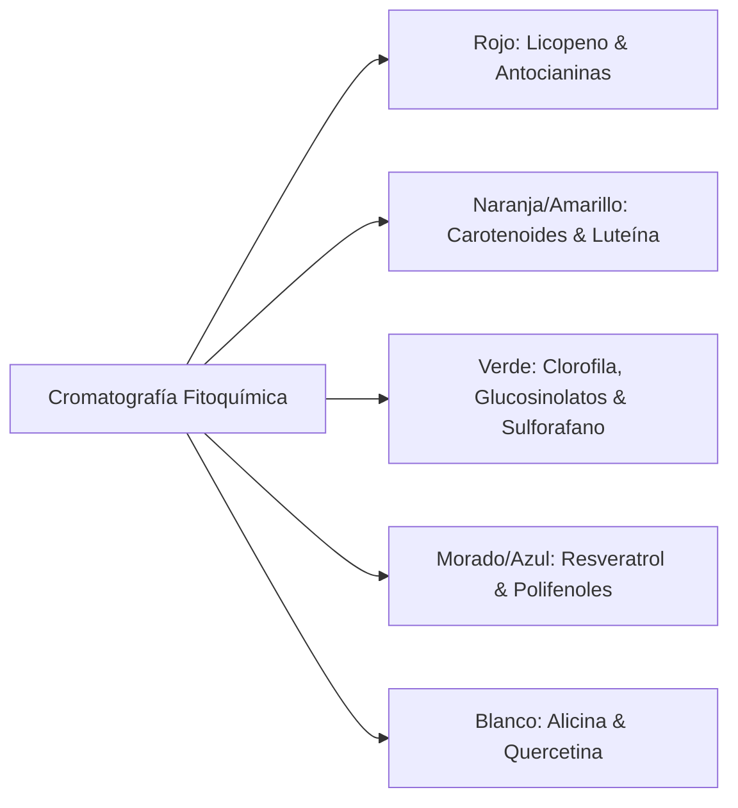
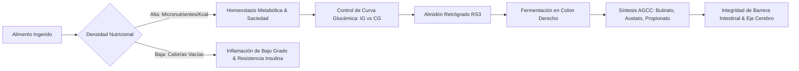
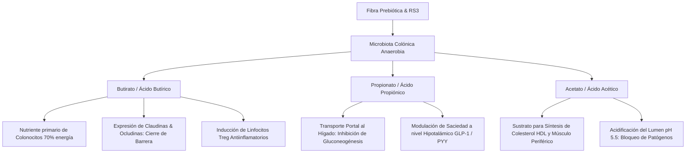
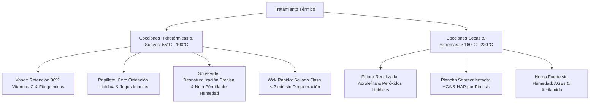
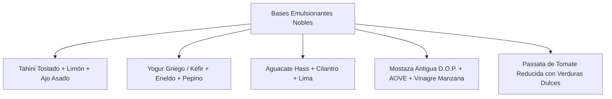
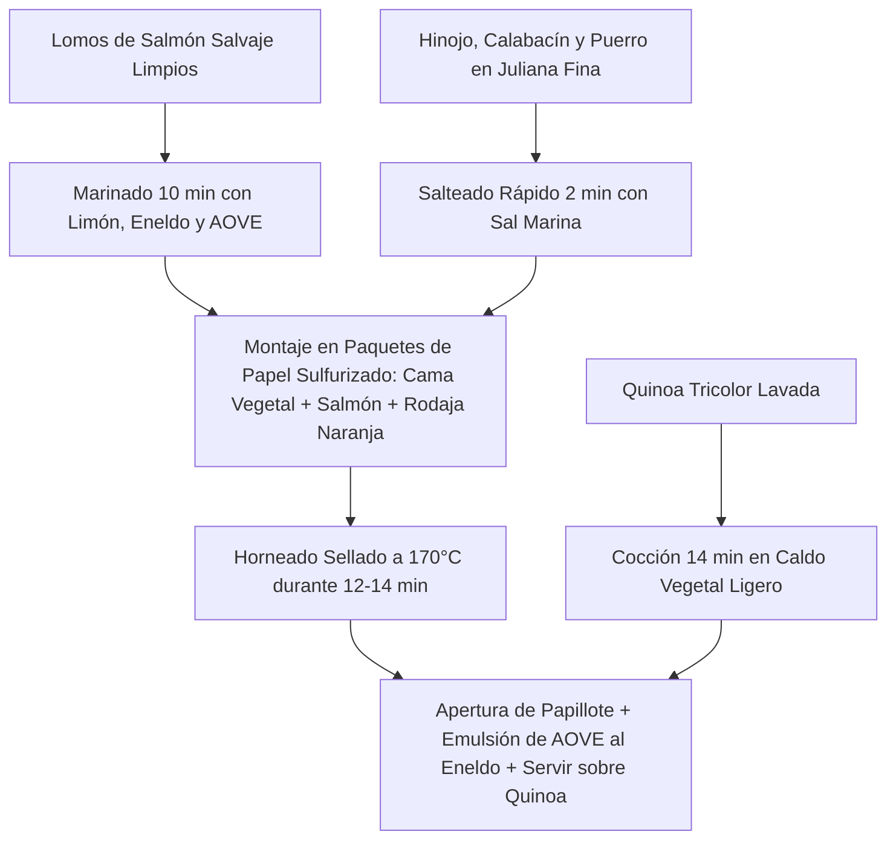
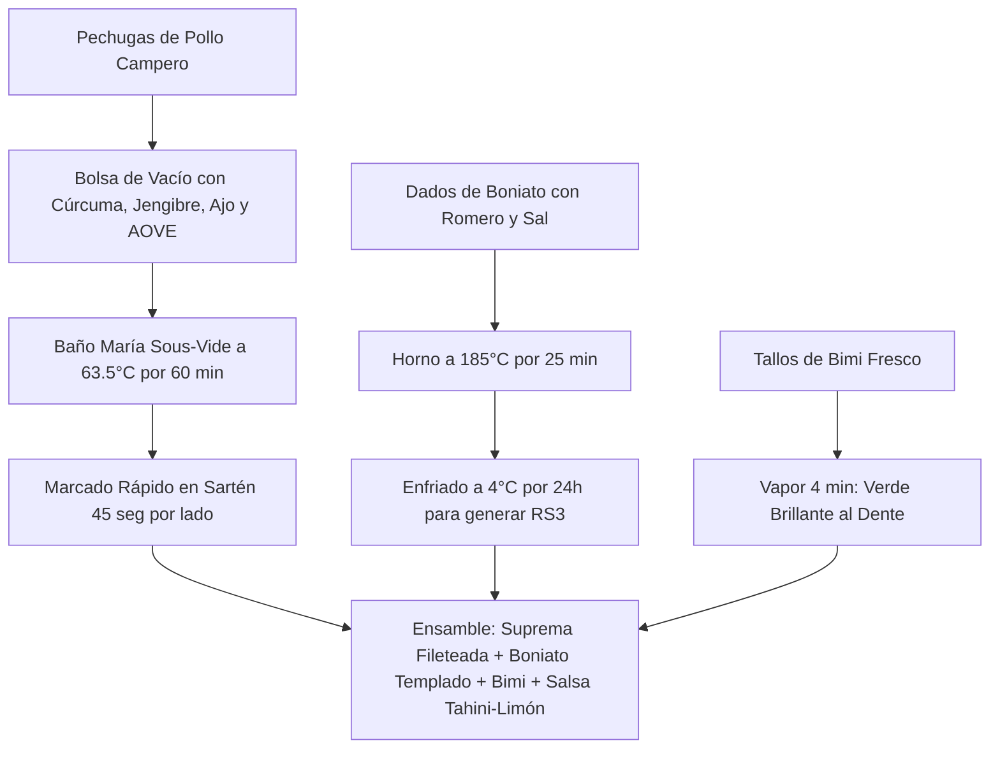
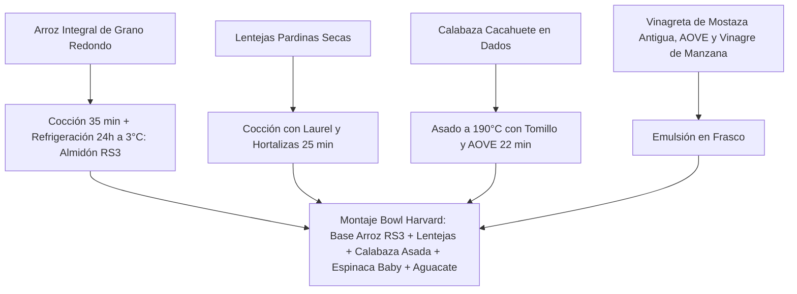
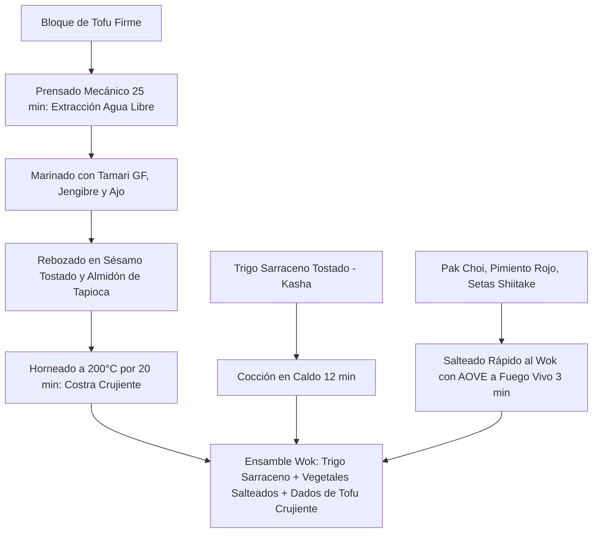
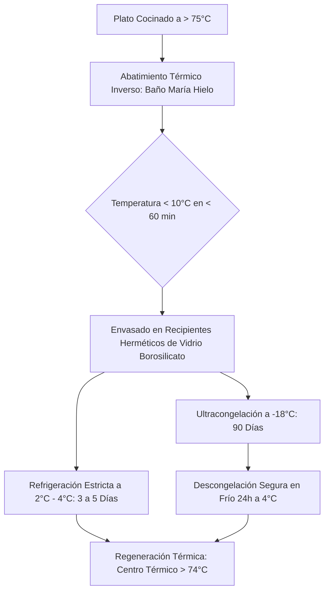

# 🥗 TALLER 01 — Fundamentos de Cocina Saludable, Bioquímica Nutricional y Gastronomía Preventiva
> **TouChef Master Series — Manual Clínico-Culinario y Operativo**  
> *Especialidad: Nutrición Humana, Metabolismo Energético, Microbiota y Técnicas Culinarias de Alta Retención Nutricional*

---

```mermaid
graph TD
    A[Cocina Saludable & Nutrición Traslacional] --> B[Arquitectura del Plato Harvard]
    A --> C[Cinética Glucémica & Almidón Retrógrado RS3]
    A --> D[Ecosistema de Microbiota & AGCC]
    A --> E[Termodinámica Culinaria de Alta Retención]
    A --> F[Sustitución Funcional de Ultraprocesados]
    
    B --> B1[50% Hortalizas/Frutas | 25% Proteína Noble | 25% Granos Complejos | AOVE]
    C --> C1[Índice vs Carga Glucémica | Desamilación & Cristalización a 3°C]
    D --> D1[Akkermansia, Butirato & Integridad Epitelial]
    E --> E1[Vapor, Papillote, Sous-Vide & Wok vs AGEs/Acrilamida/HAP]
    F --> F1[Emulsiones Nobles, Umami Botánico & Harinas Integrales]
```

---

## 1. El Método del Plato Harvard (*Healthy Eating Plate*) & Bioquímica de Macronutrientes

El modelo del Plato de Alimentación Saludable, desarrollado por la Escuela de Salud Pública de Harvard (*Harvard T.H. Chan School of Public Health*), constituye el estándar clínico contemporáneo para la formulación de menús equilibrados, superando definitivamente las deficiencias de la pirámide nutricional tradicional.

```
┌─────────────────────────────────────────────────────────────────────────────┐
│                 ARQUITECTURA DEL PLATO HARVARD (100% MATRIZ)                │
├──────────────────────────────────────────────┬──────────────────────────────┤
│               50% VEGETALES Y FRUTAS         │    25% GRANOS INTEGRALES     │
│   (Variedad cromática, hojas verdes,         │   (Quinoa, arroz integral,   │
│    crucíferas, hortalizas de temporada.      │    trigo sarraceno, avena    │
│    Excluye la patata/papa frita).            │    cortada, tubérculos con   │
│                                              │    almidón retrógrado RS3).  │
├──────────────────────────────────────────────┼──────────────────────────────┤
│         25% PROTEÍNAS DE ALTA CALIDAD        │      GRASAS SALUDABLES       │
│   (Pescado salvaje, aves de corral,          │   (Aceite de Oliva Virgen    │
│    huevos camperos, legumbres, tempeh/tofu.  │    Extra - AOVE, aguacate,   │
│    Minimizar carnes rojas y procesadas).     │    frutos secos, semillas).  │
├──────────────────────────────────────────────┴──────────────────────────────┤
│ HIDRATACIÓN CELULAR: Agua mineral, infusiones botánicas, café sin azúcar.   │
└─────────────────────────────────────────────────────────────────────────────┘
```

---

### 1.1. Fracción Vegetal y Frutas (50% del Volumen del Plato)

La base vegetal no solo aporta agua estructural ($85\text{ - }95\%$) y micronutrientes esenciales, sino que actúa como una matriz bioactiva de **fitoquímicos no energéticos** que modulan vías metabólicas y epigenéticas.



#### A. Diversidad Cromática y Familias Fitoquímicas
1. **Crucíferas (*Brassicaceae*):** Brócoli, bimi, col kale, coliflor, coles de Bruselas, rúcula y rábano. Contienen glucosinolatos (glucorafanina), que mediante la enzima vegetal **mirosinasa** se hidrolizan a **sulforafano** e indol-3-carbinol, potentes inductores de enzimas de detoxificación hepática de Fase II (vía Nrf2).
2. **Carotenoides y Flavonoides:** Zanahorias, calabazas, tomates maduros (ricos en licopeno trans que se isomeriza a cis mediante calor y lípidos aumentando su absorción un $400\%$), pimientos y espinacas (luteína y zeaxantina para la protección macular).
3. **Compuestos Organosulfurados:** Ajo, cebolla, puerro y chalotas (alicina, quercetina y sulfuro de alilo) con propiedades hipotensoras y moduladoras del endotelio vascular.

#### B. La Distinción Metabólica: Hortalizas vs. Tubérculos
- Las hortalizas de hoja, tallo y fruto poseen una densidad calórica muy baja ($15\text{ - }35\text{ kcal/100g}$) y nulo impacto insulinémico.
- **La Patata (*Solanum tuberosum*):** Harvard excluye explícitamente la patata de la fracción del $50\%$ vegetal debido a su altísimo índice glucémico ($IG > 80$) cuando se consume cocida o en puré caliente, comportándose metabólicamente como un carbohidrato de rápida asimilación. Si se utiliza, debe contabilizarse dentro del cuadrante del $25\%$ de carbohidratos y someterse a retrogradación térmica.

---

### 1.2. Fracción de Proteína de Alta Calidad (25% del Plato)

La masa muscular esquelética y los sistemas enzimáticos requieren una disponibilidad continua de aminoácidos esenciales. El objetivo en cocina saludable es maximizar la densidad proteica minimizando la inflamación sistémica y la sobrecarga lipídica aterogénica.

```
┌─────────────────────────────────────────────────────────────────────────────┐
│                   VALOR BIOLÓGICO Y BALANCE AMINOACÍDICO                    │
├──────────────────────────────┬────────────────────────┬─────────────────────┤
│ FUENTE PROTEICA NOBLE        │ AMINOGRAMA & ASIMILACIÓN│ VENTAJA CLÍNICA     │
├──────────────────────────────┼────────────────────────┼─────────────────────┤
│ Pescados Azules Pequeños     │ Completo (DIAAS > 1.1) │ Rico en EPA/DHA;    │
│ (Caballa, Sardina, Boquerón) │ Digestión rápida       │ bajo en mercurio.   │
├──────────────────────────────┼────────────────────────┼─────────────────────┤
│ Pescados Blancos / Magros    │ Completo (DIAAS > 1.0) │ Máxima digestibilidad│
│ (Merluza, Bacalao, Corvina)  │ Hipoalergénico general │ Cero grasa saturada │
├──────────────────────────────┼────────────────────────┼─────────────────────┤
│ Aves de Pasto / Corral       │ Completo (DIAAS > 1.0) │ Perfil lipídico     │
│ (Pechuga/Muslo sin piel)     │ Rico en BCAA & Leucina │ rico en monoinsatur.│
├──────────────────────────────┼────────────────────────┼─────────────────────┤
│ Huevos Camperos (Clase 0 / 1)│ Patrón de Oro (VB 100) │ Colina cerebral y   │
│                              │ Ovoalbúmina + Yema     │ Luteína / Zeaxantina│
├──────────────────────────────┼────────────────────────┼─────────────────────┤
│ Legumbres Nobles Integrales  │ Limitante en Metionina │ Fibra prebiótica    │
│ (Lentejas, Garbanzos)        │ Rico en Lisina/Treonina│ Cero colesterol     │
├──────────────────────────────┼────────────────────────┼─────────────────────┤
│ Tofu Firme / Tempeh Orgánico │ Completo (DIAAS 0.98)  │ Isoflavonas activas │
│                              │ Fermentado fúngico     │ Salud cardiovascular│
└──────────────────────────────┴────────────────────────┴─────────────────────┘
```

> [!IMPORTANT]
> **Restricción de Carnes Procesadas y Rojas:**
> La IARC/OMS clasifica a las carnes ultraprocesadas (embutidos con nitritos E249-E250, salchichas industriales, fiambres de bajo porcentaje cárnico) como carcinógenos del Grupo 1, debido a la formación endógena de $N$-nitrosaminas y hierro hemo oxidativo. La carne roja fresca debe restringirse a un máximo de 1-2 tomas semanales ($<350\text{ g/semana}$), priorizando cortes magros alimentados a pasto.

---

### 1.3. Fracción de Carbohidratos Complejos e Integrales (25% del Plato)

Los granos enteros retienen las tres fracciones anatómicas del cereal:
1. **Salvado (*Bran*):** Capa externa multicelular rica en fibra insoluble, vitaminas del complejo B, minerales traza (hierro, zinc, magnesio) y polifenoles.
2. **Germen (*Germ*):** Núcleo embrionario repleto de ácidos grasos esenciales, vitamina E ($\alpha$-tocoferol) y fitoesteroles.
3. **Endospermo (*Endosperm*):** Reserva energética central compuesta por gránulos de almidón envueltos en una matriz proteica.

```
       ESTRUCTURA DEL GRANO INTEGRAL vs. GRANO REFINADO INDUSTRIAL
       
       GRANO COMPLETO (INTEGRAL)               GRANO REFINADO (BLANCO)
       ┌────────────────────────┐              ┌────────────────────────┐
       │ SALVADO (Fibra/B/Zn)   │              │                        │
       │  ┌──────────────────┐  │              │  ┌──────────────────┐  │
       │  │ ENDOSPERMO       │  │              │  │ ENDOSPERMO       │  │
       │  │ (Almidón Complejo│  │  ─────────>  │  │ (Almidón Puro    │  │
       │  │  + Proteína)     │  │  PULIDO /    │  │  Desprovisto de  │  │
       │  │   ┌───────────┐  │  │  REFINADO    │  │  Fibra y Micron.)│  │
       │  │   │ GERMEN    │  │  │              │  │                  │  │
       │  │   │ (Vit E/W3)│  │  │              │  │                  │  │
       │  │   └───────────┘  │  │              │  │                  │  │
       │  └──────────────────┘  │              │  └──────────────────┘  │
       └────────────────────────┘              └────────────────────────┘
          Índice Glucémico: BAJO                  Índice Glucémico: ALTO
          Saciedad: 4-6 Horas                     Pico Insulina -> Hambre reactiva
```

- **Selección de Granos de Rendimiento:** Quinoa real, arroz integral de grano largo/redondo, trigo sarraceno, avena cortada en grano (*steel-cut oats*), centeno integral, cebada perlada, mijo y boniato asado con piel.

---

### 1.4. Grasas Funcionales e Hidratación Celular

El Aceite de Oliva Virgen Extra (AOVE) es el pilar lipídico insustituible de la cocina saludable TouChef:
- **Ácido Oleico ($18:1\text{ }n\text{-}9$):** Ácido graso monoinsaturado que constituye entre el $70\%$ y el $80\%$ de su perfil, confiriendo una extraordinaria estabilidad termo-oxidativa (punto de humo: $210^\circ\text{C}$).
- **Fracción Insaponificable (Polifenoles Menores):**
  - **Oleocantal:** Molécula con actividad antiinflamatoria homóloga al ibuprofeno (inhibición selectiva de COX-1 y COX-2). Produce el cosquilleo característico en la orofaringe.
  - **Hidroxitirosol y Oleuropeína:** Neutralizadores directos de radicales peroxilo con capacidad de proteger a las lipoproteínas de baja densidad (LDL) del daño oxidativo.
- **Fuentes Complementarias:** Aguacate fresco (ácido oleico y fitoesteroles), nueces y semillas de lino/chía (ácido alfa-linolénico ALA), semillas de calabaza (ricas en zinc y magnesio).
- **Líquidos e Hidratación:** Agua mineral como bebida prioritaria ($30\text{ - }35\text{ ml/kg/día}$), infusiones sin edulcorar (té verde matcha rico en EGCG, manzanilla, jengibre) y café negro de tueste natural.

---

## 2. Densidad Nutricional, Cinética Glucémica y Microbiota Intestinal



---

### 2.1. Densidad Nutricional vs. Densidad Calórica (Índice ANDI)

El principio de densidad nutricional evalúa la concentración de vitaminas, minerales, fitoquímicos y fibra en relación con la energía calórica aportada (*Nutrient-to-Calorie Ratio*):

$$\text{Densidad Nutricional} = \frac{\sum (\text{Vitaminas} + \text{Minerales} + \text{Fitoquímicos} + \text{Fibra})}{\text{Calorías Totales (kcal)}}$$

- **Alimentos de Altísima Densidad Nutricional (Hojas verdes, crucíferas, bayas, setas, moluscos, pescados grasos pequeños):** Aportan saturación de micronutrientes celulares con mínimo aporte de carbohidratos simples y grasas saturadas pro-inflamatorias.
- **Alimentos de Alta Densidad Calórica y Nula Densidad Nutricional (Ultraprocesados, harinas refinadas, bollería, refrescos):** Generan saciedad mecánica transitoria pero perpetúan el déficit funcional de micronutrientes (*hambre oculta*).

---

### 2.2. Cinética Glucémica: Índice Glucémico (IG) vs. Carga Glucémica (CG)

Para evitar fluctuaciones drásticas en los niveles de glucosa plasmática y la consiguiente hiperinsulinemia compensatoria, la cocina saludable parametriza los hidratos de carbono bajo dos variables clínicas:

1. **Índice Glucémico (IG):** Mide la velocidad relativa con la que un carbohidrato ($50\text{ g}$ de hidratos disponibles) eleva la glucemia en comparación con la glucosa pura ($IG = 100$).
2. **Carga Glucémica (CG):** Evalúa el impacto glucémico real de una ración estándar de comida, integrando el IG y la cantidad neta de carbohidratos en gramos:

$$\text{Carga Glucémica (CG)} = \frac{\text{Índice Glucémico (IG)} \times \text{Gramos de Carbohidratos Netos de la Porción}}{100}$$

```
┌─────────────────────────────────────────────────────────────────────────────┐
│ ESCALA DE CARGA GLUCÉMICA (CG):                                             │
│ • CG Baja: $\le 10$  (Ideal para homeostasis metabólica y Batch Cooking)     │
│ • CG Media: $11\text{ - }19$ (Aceptable combinado con proteínas y grasas)  │
│ • CG Alta: $\ge 20$  (Desaconsejada; induce picos y caídas reactivas)      │
└─────────────────────────────────────────────────────────────────────────────┘
```

| Alimento & Preparación | IG Bruto | Ración Típica | Carbohidratos Netos | Carga Glucémica (CG) | Clasificación |
| :--- | :---: | :---: | :---: | :---: | :---: |
| **Arroz Blanco Caliente (Jazmín/Bomba)** | $85$ | $150\text{ g}$ cocido | $42\text{ g}$ | **$35.7$** | 🔴 CG Muy Alta |
| **Arroz Integral Enfriado 24h (RS3)** | $48$ | $150\text{ g}$ cocido | $34\text{ g}$ | **$16.3$** | 🟡 CG Media/Baja |
| **Quinoa Real Hervida** | $50$ | $150\text{ g}$ cocida | $28\text{ g}$ | **$14.0$** | 🟡 CG Media |
| **Lentejas Pardinas Estofadas** | $29$ | $200\text{ g}$ cocidas | $24\text{ g}$ | **$7.0$** | 🟢 CG Muy Baja |
| **Boniato Asado con Piel y Enfriado** | $54$ | $120\text{ g}$ | $20\text{ g}$ | **$10.8$** | 🟢 CG Baja |
| **Baguette de Harina de Trigo Blanca** | $95$ | $60\text{ g}$ | $32\text{ g}$ | **$30.4$** | 🔴 CG Muy Alta |

---

### 2.3. Ingeniería del Almidón Resistente Tipo 3 (RS3 - Almidón Retrógrado)

El almidón se compone de dos polisacáridos: **amilosa** (cadenas lineales unidas por enlaces $\alpha\text{-}(1,4)$) y **amilopectina** (cadenas ramificadas con enlaces $\alpha\text{-}(1,6)$).

```
   GELATINIZACIÓN TÉRMICA                   RETROGRADACIÓN A 3°C (24 HORAS)
   (Cocción con agua > 70°C)                (Recristalización en Doble Hélice)
   ┌───────────────────────┐                ┌───────────────────────┐
   │ Gránulo de Almidón    │                │ Cadenas de Amilosa    │
   │ Hinchado y Desplegado │  ───────────>  │ Alineadas e Inaccesibles│
   │ Totalmente Accesible a│   ENFRIAMIENTO │ a la Amilasa Pancreát.│
   │ la Alfa-Amilasa Humana│   LENTO 24H    │ (Comportamiento Fibra)│
   └───────────────────────┘                └───────────────────────┘
      100% Absorbible en Duodeno               Llega Intacto al Colon (RS3)
```

#### Protocolo Culinario TouChef para la Creación de RS3:
1. **Cocción Húmeda Completa:** Cocer el grano o tubérculo (arroz integral, trigo sarraceno, patata entera con piel, boniato, lentejas) en abundante agua o caldo hasta la completa gelatinización del almidón.
2. **Abatimiento y Refrigeración Obligatoria:** Enfriar rápidamente y conservar en nevera hermética entre **$2^\circ\text{C}$ y $4^\circ\text{C}$ durante un mínimo de 24 horas**. Durante este periodo térmico, las cadenas de amilosa se realinean formando enlaces de hidrógeno altamente compactos y cristalinos insolubles en agua.
3. **Regeneración Térmica Suave:** El almidón retrógrado Tipo 3 tolera recalentados moderados ($<130^\circ\text{C}$). Al templar el plato a fuego suave o al vapor ($60\text{ - }75^\circ\text{C}$), la estructura cristalina no se disuelve, manteniendo sus propiedades prebióticas intactas.
4. **Beneficio Clínico:** 
   - Reducción del $20\text{ - }30\%$ de las calorías metabolizables efectivas.
   - Aplanamiento de la curva de glucosa e insulina postprandial.
   - Transporte masivo de sustrato fermentable al colon.

---

### 2.4. Ecosistema de la Microbiota y Ácidos Grasos de Cadena Corta (AGCC)

El colon humano alberga más de $10^{14}$ microorganismos simbióticos. La fermentación anaerobia de la fibra dietética y del almidón resistente produce los tres metabolitos maestros de la salud humana:



- **Integridad de la Mucina (*Akkermansia muciniphila*):** Bacteria comensal degradadora y estimuladora de la capa de mucina gástrica. Se alimenta de polifenoles (manzanas asadas, arándanos, granada) y fibra soluble, impidiendo la traslocación bacteriana y el paso de endotoxinas (LPS) al torrente sanguíneo.
- **Microbiota Antiinflamatoria (*Faecalibacterium prausnitzii*):** Principal productora de butirato; su abundancia se correlaciona directamente con la ingesta variada de vegetales ricos en inulina y granos integrales cocinados y enfriados.

---

### 2.5. Farmacopea Culinaria de Fibras Dietéticas

```
┌─────────────────────────────────────────────────────────────────────────────┐
│                          CLASIFICACIÓN DE FIBRAS TOUCHEF                    │
├──────────────────────────────────────┬──────────────────────────────────────┤
│ FIBRAS SOLUBLES & MUCÍLAGOS          │ FIBRAS INSOLUBLES & ESTRUCTURALES    │
├──────────────────────────────────────┼──────────────────────────────────────┤
│ • Beta-glucanos (Avena, Cebada)      │ • Celulosa y Hemicelulosa            │
│ • Pectinas (Manzana asada, Cítricos) │   (Salvado de cereales, pieles de    │
│ • Mucílagos (Semillas Lino/Chía)     │    hortalizas, crucíferas, frutos)   │
│ • Inulina y FOS (Ajo, Cebolla,       │ • Lignina (Semillas, tallos leñosos) │
│   Espárragos, Alcachofas, Puerros)   │                                      │
│                                      │ Efecto: Aumento de bolo fecal,       │
│ Efecto: Formación de geles viscosos, │ aceleración del tránsito colónico,   │
│ retraso del vaciamiento gástrico,    │ arrastre de ácidos biliares y        │
│ máxima fermentabilidad colónica.     │ detoxificación luminal.              │
└──────────────────────────────────────┴──────────────────────────────────────┘
```

---

## 3. Física y Química de las Técnicas Culinarias Saludables

El método de cocción determina si un alimento conserva sus propiedades bioactivas o se transforma en una fuente de tóxicos pro-inflamatorios y mutagénicos.



---

### 3.1. Termodinámica de las Técnicas de Alta Retención

```
┌─────────────────────────────────────────────────────────────────────────────┐
│                    TABLA COMPARATIVA DE TRANSFERENCIA TÉRMICA               │
├─────────────────┬──────────┬───────────────┬────────────────────────────────┤
│ TÉCNICA         │ RANGO T° │ MEDIO FÍSICO  │ IMPACTO EN MATRIZ NUTRICIONAL  │
├─────────────────┼──────────┼───────────────┼────────────────────────────────┤
│ Cocción Vapor   │ 95-100°C │ Vapor de agua │ Máxima retención de vit. C y   │
│                 │          │ en convección │ glucosinolatos. No lixiviación.│
├─────────────────┼──────────┼───────────────┼────────────────────────────────┤
│ Papillote       │ 140-160°C│ Vapor cerrado │ Cocción en atmósfera reductora.│
│ (Horno Sellado) │ (cámara) │ autógeno      │ Concentra aromas volátiles.    │
├─────────────────┼──────────┼───────────────┼────────────────────────────────┤
│ Sous-Vide       │ 54-65°C  │ Conducción por│ Desnaturalización colágena sin │
│ (Baja T° Vacío) │          │ baño termost. │ daño miofibrilar. Jugos al 100%│
├─────────────────┼──────────┼───────────────┼────────────────────────────────┤
│ Salteado Wok    │ 180-200°C│ Conducción    │ Tiempo mínimo (<3 min). Cero   │
│ (Flash Térmico) │          │ + película AOVE│ degradación interior. Crujiente│
├─────────────────┼──────────┼───────────────┼────────────────────────────────┤
│ Fritura Profunda│ 180-210°C│ Inmersión en  │ Hipercalórico (+300% lípidos), │
│ Convencional    │          │ baño graso    │ oxidación y degradación térmic.│
└─────────────────┴──────────┴───────────────┴────────────────────────────────┘
```

#### A. Cocción al Vapor (*Steaming*)
- **Física del Proceso:** El calor latente de vaporización ($2.257\text{ kJ/kg}$) transfiere energía al alimento sin contacto con agua líquida libre.
- **Ventaja Nutricional:** Evita la **lixiviación** (disolución de compuestos hidrosolubles como la vitamina C, folatos y minerales en el agua de cocción). Conserva la enzima mirosinasa si se mantiene el tiempo por debajo de 4-5 minutos (brócoli *al dente* verde brillante).

#### B. Papillote de Precisión
- **Mecanismo:** El alimento se confina herméticamente en papel sulfurizado o silicona platino junto a hierbas y hortalizas finas. Al elevarse la temperatura, el agua intracelular se evapora generando una sobrepresión interna que cuece el alimento en sus propios efluvios aromáticos.
- **Ventaja Lipídica:** El pescado azul cocinado en papillote preserva íntegramente sus ácidos grasos poliinsaturados Omega-3 (EPA/DHA), evitando su termorregresión y peroxidación.

#### C. Sous-Vide y Baja Temperatura (Cocción al Vacío)
- **Cinética Miofibrilar:** A $55\text{ - }62^\circ\text{C}$, las proteínas sarcoplasmáticas y miofibrilares de la carne o pescado se coagulan suavemente sin que las fibras de miosina se contraigan de forma violenta, reteniendo hasta un $95\%$ del agua intracelular original. La ausencia de oxígeno en la bolsa de vacío impide toda reacción de autooxidación lipídica.

---

### 3.2. Formación y Prevención de Compuestos Tóxicos por Pirolisis

```
┌─────────────────────────────────────────────────────────────────────────────┐
│                    TOXICOLOGÍA DE LA COCCIÓN EXTREMA                        │
├────────────────────────┬──────────────────────────┬─────────────────────────┤
│ COMPUESTO TÓXICO       │ MATRIZ DE ORIGEN         │ RIESGO CLÍNICO          │
├────────────────────────┼──────────────────────────┼─────────────────────────┤
│ Acrilamida             │ Asparagina + Azúcares    │ Neurotóxico,            │
│ ($C_3H_5NO$)           │ reductores a >120°C      │ Carcinógeno Grupo 2A    │
│                        │ (Patatas fritas, tostadas│ (IARC). Daño ADN.       │
├────────────────────────┼──────────────────────────┼─────────────────────────┤
│ Aminas Heterocíclicas  │ Aminoácidos + Creatina a │ Carcinogénesis colónica,│
│ (HCA: PhIP, MeIQx)     │ >180°C (Carne quemada)   │ mamaria y prostática.   │
├────────────────────────┼──────────────────────────┼─────────────────────────┤
│ Hidrocarburos Aromát.  │ Gota de grasa fundida    │ Carcinógeno Grupo 1     │
│ Policíclicos (HAP)     │ sobre llama/brasa        │ Potente mutágeno de     │
│ (Benzo[a]pireno)       │ que humea hacia la carne │ ligando de receptores AhR│
├────────────────────────┼──────────────────────────┼─────────────────────────┤
│ Productos Finales de   │ Reacción glucosa/proteína│ Unión al receptor RAGE, │
│ Glicación Avanzada     │ a calor seco prolongado  │ inflamación vascular,   │
│ (Dietary AGEs)         │ (Costras ultra tostadas) │ rigidez arterial crónica│
└────────────────────────┴──────────────────────────┴─────────────────────────┘
```

#### Protocolos Culinarios TouChef de Mitigación de AGEs, HCA y Acrilamida:
1. **Marinado Ácido Antioxidante Previo:** Sumergir carnes y pescados en una solución con zumo de limón fresco, vinagre de sidra de manzana o vino blanco junto a **hierbas ricas en ácido carnósico y rosmarínico (romero, tomillo, orégano, ajo rallado)** durante 30-60 minutos antes de cocinar. Reduce la formación de HCA y AGEs entre un **$70\%$ y un $90\%$**.
2. **Control de Humedad y Temperatura:** Utilizar cocciones con vapor o sartenes gruesas a fuego medio ($<160^\circ\text{C}$), evitando carbonizaciones visibles.
3. **Tratamiento Anti-Acrilamida en Tubérculos:** Remojar las patatas o boniatos cortados en agua tibia durante 15-20 minutos para eliminar el exceso de azúcares libres superficiales antes de hornear a temperaturas no superiores a $175^\circ\text{C}$.

---

## 4. Ingeniería Culinaria para la Sustitución de Ultraprocesados

La industria de alimentos ultraprocesados diseña sus formulaciones calculando el **Punto de Éxtasis (*Bliss Point*)**: la combinación hedónica exacta de azúcares refinados, grasas saturadas de bajo coste, sodio y potenciadores artificiales (glutamato monosódico E621) que anula los centros hipotalámicos de saciedad y desencadena respuestas de recompensa dopaminérgica.

```
                  DESCONSTRUCCIÓN Y REEMPLAZO TOUCHEF
┌──────────────────────────────────────┐     ┌──────────────────────────────────────┐
│  FORMULACIÓN ULTRAPROCESADA TÍPICA   │     │    REEMPLAZO FUNCIONAL TOUCHEF       │
├──────────────────────────────────────┤     ├──────────────────────────────────────┤
│ • Aceites refinados de palma/girasol │     │ • Aceite de Oliva Virgen Extra (AOVE)│
│ • Jarabes de glucosa y sacarosa      │ --> │ • Pasta de dátiles medjool / compotas│
│ • Almidones modificados y gomas ind. │     │ • Semillas lino/chía, aguacate, tahini│
│ • Glutamato Monosódico (E621)        │     │ • Levadura nutricional, Shiitake mol.│
│ • Sal refinada pura (NaCl 99.9%)     │     │ • Sal marina virgen + Especias botán.│
└──────────────────────────────────────┘     └──────────────────────────────────────┘
```

---

### 4.1. Fórmulas Maestras de Salsas y Emulsiones Caseras



#### 1. Emulsión Cítrica de Tahini y Jengibre
- **Mecanismo:** La pasta de sésamo molida al $100\%$ contiene lecitinas y lípidos naturales que, al combinarse con agua fría y ácido cítrico, forman una emulsión blanca densa y sedosa sin necesidad de lácteos ni mayonesas industriales.
- **Fórmula:** $60\text{ g}$ Tahini crudo o tostado suave $+ 45\text{ ml}$ Zumo de limón $+ 30\text{ ml}$ Agua helada $+ 5\text{ g}$ Jengibre fresco rallado $+ 1\text{ pizca}$ Sal marina y comino tostado. Emulsionar con varilla enérgica.

#### 2. Vinagreta Funcional de Mostaza Antigua y AOVE
- **Mecanismo:** Los mucílagos y semillas de mostaza emulsionan de forma espontánea el ácido acético del vinagre sin filtrar con los triglicéridos del AOVE.
- **Fórmula (Ratio 3:1):** $60\text{ ml}$ AOVE de cosecha temprana $+ 20\text{ ml}$ Vinagre de manzana con la "madre" viva $+ 15\text{ g}$ Mostaza a la antigua D.O.P. $+ 5\text{ g}$ Hierbas provenzales.

#### 3. Salsa Tzatziki Funcional de Kéfir y Ajo Negro
- **Mecanismo:** La fermentación del kéfir aporta probióticos vivos (*Lactobacillus kefiri*) y ácido láctico que sustituye a las salsas comerciales agrias cargadas de estabilizantes.
- **Fórmula:** $150\text{ g}$ Yogur griego artesanal o Kéfir escurrido $+ 100\text{ g}$ Pepino rallado y deshidratado con sal $+ 1\text{ diente}$ de Ajo negro machacado $+ 10\text{ ml}$ AOVE $+ 5\text{ g}$ Eneldo fresco picado $+ 10\text{ ml}$ Zumo de limón.

#### 4. Passata y Sofrito Reducido Sin Azúcar Añadido
- **Mecanismo de Dulzor Natural:** Para neutralizar la acidez natural del tomate sin añadir sacarosa refinada, se caramelizan lentamente a baja temperatura ($90\text{ - }100^\circ\text{C}$) hortalizas ricas en azúcares endógenos (zanahoria rallada muy fina y cebolla pochada en AOVE durante 25 minutos).

---

### 4.2. Potenciadores Naturales de Umami (El Quinto Sabor sin Químicos)

Para generar alta palatabilidad sin aditivos artificiales, se utilizan fuentes naturales ricas en **ácido glutámico libre e inosinato/guanilato disódico natural**:
1. **Levadura Nutricional Desactivada (*Saccharomyces cerevisiae*):** Aporta notas queseras, saladas y umami, siendo además una fuente natural de vitaminas del complejo B y zinc.
2. **Polvo de Setas Shiitake Deshidratadas:** Las setas secas contienen altas concentraciones de guanilato natural. Moler setas deshidratadas en molinillo de especias y utilizar $1\text{ cucharadita}$ en caldos, guisos y salteados multiplica la profundidad de sabor por sinergia umami.
3. **Pasta de Miso No Pasteurizado:** Aporta péptidos fermentados y bacterias probióticas (añadir siempre con el fuego apagado a $<45^\circ\text{C}$ para no destruir sus enzimas activas).

---

## 5. Recetario Maestro de Cocina Saludable (4 Fórmulas Harvard)

---

### RECETA 1: Salmón Salvaje al Papillote con Hinojo Confitado, Cítricos, Quinoa Real Tricolor y AOVE al Eneldo Fresco

> **Matriz Harvard:** 50% Vegetales Aromáticos (Hinojo, Calabacín, Puerro) | 25% Proteína Noble (Salmón Salvaje rico en EPA/DHA) | 25% Grano Completo (Quinoa Tricolor) | AOVE y Cítricos.

```
┌─────────────────────────────────────────────────────────────────────────────┐
│ METADATA DE COCINA & BATCH COOKING                                          │
│ • Tiempo de Preparación: 15 min | Tiempo de Cocción: 18 min                 │
│ • Rendimiento: 4 Raciones completas de 450g c/u                             │
│ • Estaciones Térmicas: Horno (Papillote 170°C) + Cazo (Cocción de Quinoa)   │
│ • Conservación: 3 días en nevera a 3°C | No congelar el papillote armado    │
└─────────────────────────────────────────────────────────────────────────────┘
```



#### Ingredientes de Precisión (4 Raciones):
- **Proteína Noble Marina:** $560\text{ g}$ de Lomos de Salmón salvaje o de acuicultura sostenible certificada (4 porciones de $140\text{ g}$, sin espinas y con piel limpia).
- **Fracción Vegetal Aromática (50% Volumen):**
  - $250\text{ g}$ de Bulbo de hinojo fresco cortado en juliana muy fina.
  - $200\text{ g}$ de Puerro (parte blanca y verde clara en rodajas finas).
  - $200\text{ g}$ de Calabacín verde con piel en medias lunas finas.
  - $1\text{ Naranja}$ ecológica cortada en rodajas finas (aporta acidez y flavonoides protectores).
  - $1\text{ Limón}$ ecológico (zumo y ralladura de la piel sin albedo).
- **Fracción de Grano Entero (25% Volumen):**
  - $200\text{ g}$ de Quinoa Real Tricolor seca (blanca, roja y negra).
  - $450\text{ ml}$ de Caldo vegetal suave o agua filtrada.
- **Grasas Cardioprotectoras y Aromas:**
  - $40\text{ ml}$ de Aceite de Oliva Virgen Extra de extracción en frío.
  - $15\text{ g}$ de Eneldo fresco finamente picado.
  - $4\text{ g}$ de Sal marina sin refinar $+ 1\text{ pizca}$ de pimienta rosa recién molida.

#### Información Nutricional Detallada (Por Ración de 450g):
- **Energía:** $485\text{ kcal}$
- **Proteínas:** $34.2\text{ g}$ (Valor biológico excelente, rica en todos los aminoácidos esenciales)
- **Carbohidratos Netos:** $32.4\text{ g}$ (Fibra dietética: $6.8\text{ g}$, Carga Glucémica: $12.5$ — Baja)
- **Grasas Totales:** $23.1\text{ g}$
  - Ácidos Grasos Saturados: $3.2\text{ g}$
  - Ácidos Grasos Monoinsaturados (Ácido Oleico): $12.4\text{ g}$
  - Ácidos Grasos Poliinsaturados: $7.5\text{ g}$ (de los cuales **$2.400\text{ mg}$ son Omega-3 EPA/DHA directos**)
- **Micronutrientes Clave:**
  - Vitamina D3: $520\text{ UI}$ ($86\%\text{ CDR}$).
  - Selenio: $42\text{ }\mu\text{g}$ ($76\%\text{ CDR}$).
  - Vitamina B12: $3.8\text{ }\mu\text{g}$ ($158\%\text{ CDR}$).
  - Potasio: $820\text{ mg}$.

#### Procedimiento de Cocina:
1. **Cocción de la Quinoa:** Lavar la quinoa bajo chorro de agua fría en colador fino para eliminar saponinas amargas. Hervir en el caldo durante 14 minutos a fuego bajo tapado. Retirar del fuego y reposar 5 minutos con un paño antes de ahuecar con tenedor.
2. **Cama Vegetal:** En una sartén con $10\text{ ml}$ de AOVE, saltear el hinojo, el puerro y el calabacín durante 2 minutos a fuego vivo. Deben quedar crujientes, liberando su agua inicial.
3. **Armado del Papillote:** Cortar 4 hojas grandes de papel sulfurizado ($35\times 30\text{ cm}$). Colocar en el centro una cama generosa de las verduras salteadas. Disponer el lomo de salmón sazonado con sal marina, eneldo y pimienta rosa. Coronar con una rodaja fina de naranja y unas gotas de zumo de limón.
4. **Sellado Hermético:** Doblar los bordes del papel sobre sí mismos realizando pliegues sucesivos en forma de empanadilla triangular hermética, atrapando todo el vapor interior.
5. **Cocción:** Hornear a $170^\circ\text{C}$ con calor arriba y abajo (sin ventilador agresivo) durante 12-14 minutos. El paquete debe inflarse como un globo.
6. **Servicio:** Abrir con tijeras en el momento de servir y regar con el AOVE emulsionado con eneldo fresco. Acompañar de la quinoa tricolor.

#### Instrucciones de Batch Cooking & Regeneración:
- **Almacenamiento:** Conservar la quinoa y las verduras con el salmón en recipientes de vidrio herméticos separados en nevera a $3^\circ\text{C}$ durante 3 días.
- **Regeneración:** Regenerar el salmón y las verduras en horno a $140^\circ\text{C}$ durante 6 minutos o en microondas a potencia media ($500\text{W}$) durante 2 minutos para no sobrecocer ni secar la grasa del salmón.

---

### RECETA 2: Suprema de Pollo Campero Sous-Vide con Marinada de Cúrcuma y Jengibre, Boniato Asado al Romero y Bimi al Vapor con Vinagreta de Tahini

> **Matriz Harvard:** 50% Vegetal (Brócoli Bimi y Rúcula) | 25% Proteína Magra (Pollo de Pasto) | 25% Carbohidrato Complejo Retrógrado (Boniato Asado) | Grasa Noble de Tahini y AOVE.

```
┌─────────────────────────────────────────────────────────────────────────────┐
│ METADATA DE COCINA & BATCH COOKING                                          │
│ • Tiempo de Preparación: 20 min | Tiempo de Cocción: 60 min (Sous-Vide)     │
│ • Rendimiento: 4 Raciones de 460g c/u                                       │
│ • Estaciones Térmicas: Roner Sous-Vide (63.5°C) + Horno (Boniato) + Vapor   │
│ • Conservación: 5 días en bolsa de vacío refrigerada | Apto congelación     │
└─────────────────────────────────────────────────────────────────────────────┘
```



#### Ingredientes de Precisión (4 Raciones):
- **Proteína de Pasto:** $600\text{ g}$ de Pechuga de pollo campero o ecológico de corral (limpia de grasa visible).
- **Marinada Bioactiva Antiinflamatoria:**
  - $20\text{ ml}$ de AOVE.
  - $6\text{ g}$ de Cúrcuma pura en polvo $+ 1.5\text{ g}$ de Pimienta negra recién molida (la **piperina** multiplica la biodisponibilidad de los curcuminoides un $2000\%$).
  - $10\text{ g}$ de Jengibre fresco rallado $+ 2\text{ dientes}$ de Ajo asado en pasta.
  - $15\text{ ml}$ de Zumo de limón fresco.
- **Fracción Vegetal Verde:**
  - $350\text{ g}$ de Brócoli Bimi (*Brassica oleracea var. alboglabra*) o brócoli en ramilletes.
  - $100\text{ g}$ de Hojas tiernas de rúcula silvestre.
- **Carbohidrato Complejo Prebiótico:**
  - $400\text{ g}$ de Boniato cortado en cubos de $2\text{ cm}$ (asado con piel).
  - $1\text{ rama}$ de Romero fresco $+ 10\text{ ml}$ de AOVE.
- **Aderezo Noble:**
  - $50\text{ g}$ de Salsa Emulsionada de Tahini y Limón (según fórmula de la sección 4.1).

#### Información Nutricional Detallada (Por Ración de 460g):
- **Energía:** $455\text{ kcal}$
- **Proteínas:** $38.5\text{ g}$ (Excelente aporte de leucina: $3.2\text{ g}$ para síntesis muscular)
- **Carbohidratos Netos:** $31.8\text{ g}$ (Fibra dietética: $7.2\text{ g}$, Carga Glucémica: $11.0$ — Baja)
- **Grasas Totales:** $18.2\text{ g}$ (Predominio de ácido oleico y lípidos insaturados de sésamo)
- **Micronutrientes Clave:**
  - Vitamina C: $95\text{ mg}$ ($118\%\text{ CDR}$).
  - Vitamina A ($\beta$-caroteno): $1.150\text{ }\mu\text{g}$ RAE ($143\%\text{ CDR}$).
  - Calcio biodisponible: $165\text{ mg}$.
  - Niacina (Vitamina B3): $14.5\text{ mg}$ ($90\%\text{ CDR}$).

#### Procedimiento de Cocina:
1. **Cocción al Vacío (Sous-Vide):** Introducir las pechugas de pollo en bolsas de vacío gofradas junto con los ingredientes de la marinada antiinflamatoria. Envasar al $99\%$ de vacío. Sumergir en baño termostático a **$63.5^\circ\text{C}$ durante 60 minutos**. Esto garantiza una pasteurización clínica completa reteniendo la totalidad de los jugos sarcoplasmáticos.
2. **Asado y Retrogradación de Boniato:** Mezclar los cubos de boniato con AOVE, sal marina y romero. Hornear a $185^\circ\text{C}$ durante 25 minutos. Refrigerar 24 horas a $4^\circ\text{C}$ para inducir almidón retrógrado RS3 antes de regenerar suavemente.
3. **Cocción al Vapor de Bimi:** Cocer los tallos de bimi al vapor durante exactamente 4 minutos. Deben mantener textura crujiente y un color verde esmeralda que indica la preservación de la mirosinasa.
4. **Finalización de la Proteína:** Retirar el pollo de la bolsa y sellar en sartén de hierro muy caliente con unas gotas de AOVE durante 45 segundos por lado solo para dorar la superficie mediante reacción de Maillard superficial rápida. Cortar en medallones de $1\text{ cm}$.
5. **Servicio:** Disponer la cama de rúcula y bimi al vapor, los dados de boniato templados, el pollo fileteado y salsear con la emulsión de tahini y limón.

#### Instrucciones de Batch Cooking & Regeneración:
- **Seguridad en Vacío:** Las bolsas de pollo sous-vide pasteurizadas pueden mantenerse intactas en nevera a $2^\circ\text{C}$ hasta por 7 días sin degradación organoléptica ni proliferación microbiana.
- **Regeneración:** Sumergir la bolsa cerrada en agua caliente a $60^\circ\text{C}$ durante 10 minutos antes de dorar en sartén, o lonchear en frío para consumir en ensaladas templadas.

---

### RECETA 3: Harvard Energy Bowl de Lentejas Pardinas con Arroz Integral Retrógrado (RS3), Aguacate, Calabaza Asada y Vinagreta de Mostaza Antigua

> **Matriz Harvard:** 50% Vegetal (Calabaza Asada, Espinacas Baby, Tomate Cherry) | 25% Proteína Vegetal Completa (Lentejas Pardinas + Arroz Integral RS3) | 25% Carbohidrato Complejo | AOVE y Aguacate Hass.

```
┌─────────────────────────────────────────────────────────────────────────────┐
│ METADATA DE COCINA & BATCH COOKING                                          │
│ • Tiempo de Preparación: 15 min | Tiempo de Cocción: 30 min                 │
│ • Rendimiento: 4 Bowls completos de 480g c/u                                │
│ • Estaciones Térmicas: Olla Cocción Legumbre + Horno Asado Calabaza         │
│ • Conservación: 5 días en nevera a 3°C | Almidón RS3 optimizado             │
└─────────────────────────────────────────────────────────────────────────────┘
```



#### Ingredientes de Precisión (4 Raciones):
- **Base de Legumbre & Grano Sinergista:**
  - $200\text{ g}$ de Lentejas Pardinas secas (cocidas con 1 hoja de laurel y 1 clavo de olor).
  - $160\text{ g}$ de Arroz Integral de grano redondo (cocido y **enfriado 24 horas a $3^\circ\text{C}$** para formar RS3).
- **Fracción Vegetal y Color:**
  - $350\text{ g}$ de Calabaza tipo cacahuete en cubos de $1.5\text{ cm}$.
  - $120\text{ g}$ de Hojas tiernas de Espinaca Baby cruda.
  - $150\text{ g}$ de Tomates Cherry de rama cortados por la mitad.
  - $1\text{ rama}$ de Tomillo fresco $+ 2\text{ g}$ de Canela de Ceylán en polvo (potencia la caramelización de la calabaza).
- **Grasas Saludables y Aderezo:**
  - $1\text{ Aguacate Hass}$ grande maduro (cortado en láminas, unos $160\text{ g}$ de pulpa limpia).
  - $20\text{ g}$ de Semillas de Calabaza tostadas suavemente.
  - $60\text{ ml}$ de Vinagreta Funcional de Mostaza Antigua y AOVE (según fórmula 4.1).

#### Información Nutricional Detallada (Por Ración de 480g):
- **Energía:** $490\text{ kcal}$
- **Proteínas:** $19.8\text{ g}$ (Complementariedad proteica perfecta de aminoácidos esenciales: DIAAS $0.96$)
- **Carbohidratos Netos:** $49.5\text{ g}$ (Fibra dietética total: **$14.2\text{ g}$**, de los cuales $4.8\text{ g}$ son Almidón Resistente RS3)
- **Grasas Totales:** $21.5\text{ g}$ (Ácido oleico monoinsaturado y lípidos de aguacate)
- **Micronutrientes Clave:**
  - Magnesio: $148\text{ mg}$ ($37\%\text{ CDR}$).
  - Hierro no hemo: $6.2\text{ mg}$ ($44\%\text{ CDR}$).
  - Folatos (Vitamina B9): $210\text{ }\mu\text{g}$ ($52\%\text{ CDR}$).
  - Potasio: $960\text{ mg}$.

#### Procedimiento de Cocina:
1. **Cocción y Retrogradación del Arroz:** Cocer el arroz integral en agua abundante durante 35 minutos. Escurrir, enfriar bajo chorro de agua fría y transferir en una capa fina a un recipiente en la nevera a $3^\circ\text{C}$ durante 24 horas.
2. **Cocción de Lentejas:** Cocer las lentejas pardinas en agua limpia con la hoja de laurel y sal durante 25 minutos hasta que estén tiernas pero no rotas. Escurrir.
3. **Calabaza Especiada:** Disponer los cubos de calabaza en una bandeja de horno con $10\text{ ml}$ de AOVE, sal marina, tomillo y canela. Asar a $190^\circ\text{C}$ durante 22 minutos hasta que los bordes caramelicen ligeramente.
4. **Ensamblaje del Bowl:** En un cuenco amplio de servicio:
   - Cuadrante 1: Base de Arroz Integral Retrógrado mezclado con las lentejas pardinas templadas.
   - Cuadrante 2: Calabaza asada templada.
   - Cuadrante 3: Hojas de espinaca baby y tomates cherry frescos.
   - Cuadrante 4: Láminas de aguacate fresco coronadas con semillas de calabaza.
5. **Aliño:** Verter la vinagreta emulsionada de mostaza antigua justo antes de degustar.

#### Instrucciones de Batch Cooking & Regeneración:
- **Resistencia al Tiempo:** Las lentejas y el arroz integral resisten 5 días perfectamente en frío sin perder textura ni valor biológico.
- **Servicio:** Se puede consumir a temperatura ambiente o templando solo la base de legumbre/arroz y calabaza durante 1 minuto al microondas, añadiendo el aguacate y las espinacas frescas al final.

---

### RECETA 4: Tofu Firme Marinado en Costra de Sésamo, Wok Crujiente Arcoíris (Pak Choi, Pimiento, Shiitake) y Trigo Sarraceno

> **Matriz Harvard:** 50% Vegetal Crujiente Wok (Pak Choi, Pimiento, Shiitake, Brotes) | 25% Proteína Noble (Tofu Firme de Soja no transgénica) | 25% Grano Completo (Trigo Sarraceno) | Sésamo y AOVE.

```
┌─────────────────────────────────────────────────────────────────────────────┐
│ METADATA DE COCINA & BATCH COOKING                                          │
│ • Tiempo de Preparación: 20 min | Tiempo de Cocción: 20 min                 │
│ • Rendimiento: 4 Raciones de 450g c/u                                       │
│ • Estaciones Térmicas: Plancha/Horno Tofu + Wok Vegetales + Cazo Sarraceno  │
│ • Conservación: 4 días en nevera a 3°C | Mantiene textura crujiente         │
└─────────────────────────────────────────────────────────────────────────────┘
```



#### Ingredientes de Precisión (4 Raciones):
- **Proteína Noble Vegetal:** $500\text{ g}$ de Tofu firme ecológico (cuajado con sales de calcio).
- **Marinado y Costra:**
  - $30\text{ ml}$ de Tamari auténtico (salsa de soja fermentada sin gluten y sin azúcares).
  - $10\text{ ml}$ de Aceite de sésamo tostado de primera presión.
  - $5\text{ g}$ de Jengibre fresco rallado.
  - $15\text{ g}$ de Almidón de tapioca o maicena.
  - $30\text{ g}$ de Semillas de sésamo blanco y negro.
- **Fracción Vegetal Arcoíris (Wok):**
  - $250\text{ g}$ de Pak Choi cortado longitudinalmente en cuartos.
  - $150\text{ g}$ de Pimiento rojo en tiras finas (*juliana*).
  - $150\text{ g}$ de Setas Shiitake frescas laminadas.
  - $100\text{ g}$ de Brotes de soja o alfalfa frescos.
  - $25\text{ ml}$ de AOVE para el salteado a fuego vivo.
- **Fracción de Grano Completo:**
  - $200\text{ g}$ de Grano entero de Trigo Sarraceno (*Fagopyrum esculentum* — pseudocereal libre de gluten).
  - $400\text{ ml}$ de Agua o caldo de verduras limpio.

#### Información Nutricional Detallada (Por Ración de 450g):
- **Energía:** $460\text{ kcal}$
- **Proteínas:** $24.6\text{ g}$ (Perfil completo de aminoácidos, rica en arginina y lisina)
- **Carbohidratos Netos:** $39.4\text{ g}$ (Fibra dietética: $8.6\text{ g}$, Carga Glucémica: $13.2$ — Baja)
- **Grasas Totales:** $20.2\text{ g}$ (Grasas poliinsaturadas y monoinsaturadas)
- **Micronutrientes Clave:**
  - Calcio biodisponible: $380\text{ mg}$ ($47\%\text{ CDR}$, aportado por el tofu cuajado con sales de calcio y el sésamo).
  - Magnesio: $160\text{ mg}$ ($40\%\text{ CDR}$).
  - Rutina (Bioflavonoide vascular del sarraceno): $75\text{ mg}$.
  - Hierro: $5.4\text{ mg}$ ($38\%\text{ CDR}$).

#### Procedimiento de Cocina:
1. **Prensado del Tofu:** Envolver el bloque de tofu firme en un paño de lino limpio y colocar un peso de $2\text{ kg}$ encima durante 25 minutos para drenar el agua libre. Cortar en dados de $2\times 2\text{ cm}$.
2. **Marinado y Rebozado:** Macerar los dados de tofu durante 15 minutos en la mezcla de tamari, jengibre y aceite de sésamo. Escurrir ligeramente, pasar por el almidón de tapioca y rebozar en las semillas de sésamo.
3. **Cocción del Tofu:** Hornear a $200^\circ\text{C}$ sobre papel de horno durante 20 minutos con ventilador hasta obtener una costra dorada y crujiente.
4. **Cocción del Trigo Sarraceno:** Lavar el grano de sarraceno y tostar en seco en un cazo durante 1 minuto. Añadir el agua hirviendo con una pizca de sal, tapar y cocer a fuego lento durante 12 minutos hasta que absorba el líquido. Dejar reposar 5 minutos.
5. **Técnica de Salteado al Wok:** Calentar el wok o sartén amplia a fuego máximo con el AOVE. Saltear primero las setas shiitake y el pimiento durante 2 minutos moviendo constantemente. Añadir el pak choi y saltear 1 minuto adicional. Las verduras deben mantener un crujiente vibrante (*al dente*).
6. **Ensamble:** Servir el trigo sarraceno en la base, disponer las verduras salteadas del wok, coronar con los dados crujientes de tofu al sésamo y terminar con brotes frescos.

#### Instrucciones de Batch Cooking & Regeneración:
- **Conservación:** Guardar el trigo sarraceno y las verduras en un recipiente de vidrio, y el tofu crujiente en otro recipiente separado para que no pierda su textura crocante con la humedad de los vegetales.
- **Regeneración:** Saltear todo junto en sartén caliente durante 2 minutos o calentar en horno de convección a $170^\circ\text{C}$ durante 5 minutos.

---

## 6. Matriz de Densidad Nutricional y Alérgenos del Taller 01

```
LEYENDA DE MATRIZ:
❌ = Ausente por Diseño Clínico  |  ⚠️ = Trazas Potenciales / Opcional  |  ✅ = Presente Controlado
```

| Receta TouChef Saludable | Gluten | Crustáceos / Pescados | Huevos | Cacahuetes | Soja | Lácteos / Lactosa | Frutos Cáscara | Sésamo | Mostaza | Sulfitos | Carga Glucémica (CG) |
| :--- | :---: | :---: | :---: | :---: | :---: | :---: | :---: | :---: | :---: | :---: | :---: |
| **1. Salmón al Papillote & Quinoa** | ❌ | ✅ *(Pescado)* | ❌ | ❌ | ❌ | ❌ | ❌ | ❌ | ❌ | ❌ | 🟢 Baja ($12.5$) |
| **2. Suprema Pollo Sous-Vide & Bimi** | ❌ | ❌ | ❌ | ❌ | ❌ | ❌ | ❌ | ✅ *(Tahini)* | ❌ | ❌ | 🟢 Baja ($11.0$) |
| **3. Harvard Energy Bowl Lentejas RS3** | ❌ | ❌ | ❌ | ❌ | ❌ | ❌ | ❌ | ❌ | ✅ *(Mostaza)* | ❌ | 🟢 Muy Baja ($7.0$) |
| **4. Tofu en Sésamo & Wok Sarraceno** | ❌ *(Tamari GF)* | ❌ | ❌ | ❌ | ✅ *(Tofu)* | ❌ | ❌ | ✅ *(Sésamo)* | ❌ | ❌ | 🟢 Baja ($13.2$) |

---

## 7. Protocolo de Conservación y Vida Útil en Batch Cooking Saludable



1. **Abatimiento de Temperatura Rápido:** Para preservar los fitoquímicos sensibles a la temperatura y evitar el crecimiento de patógenos como *Bacillus cereus* en granos cocinados, enfriar los recipientes sumergiéndolos en un baño de agua y hielo durante 20 minutos antes de introducirlos en la nevera.
2. **Aislamiento en Vidrio Borosilicato:** El vidrio evita la migración de microplásticos, bisfenol A (BPA) y ftalatos hacia las grasas del plato (AOVE, pescados grasos), garantizando la pureza química del menú durante los 5 días de conservación.
3. **Regla de Oro de Recalentado:** Regenerar únicamente la ración que se va a ingerir, alcanzando un mínimo de **$74^\circ\text{C}$** en el núcleo del alimento. No someter los platos a múltiples ciclos térmicos.

---
*Manual de formación técnica y clínica validado por el Comité de Nutrición y Dietética Avanzada de TouChef 2026.*
