# 🛡️ TALLER 02 — Gestión Avanzada de Alérgenos, Fisiopatología Clínica y Masterclass Sin Gluten
> **TouChef Master Series — Manual Clínico-Culinario y Operativo**  
> *Especialidad: Inmunología Alimentaria, Reglamento (UE) 1169/2011, Seguridad APPCC y Reología de Masas Sin Gluten*

---

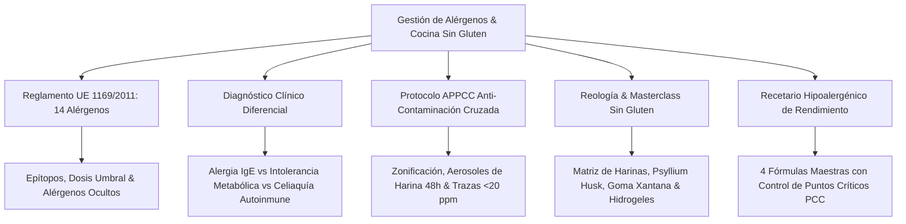

---

## 1. Los 14 Alérgenos del Reglamento (UE) 1169/2011 Analizados al Detalle

El **Reglamento (UE) nº 1169/2011** sobre la información alimentaria facilitada al consumidor establece la obligatoriedad jurídica de declarar de forma clara, destacada y tipográficamente diferenciada la presencia de 14 sustancias o productos que causan alergias o intolerancias (Anexo II), tanto en alimentos envasados como en alimentos servidos en restauración colectiva y servicios de chef a domicilio.

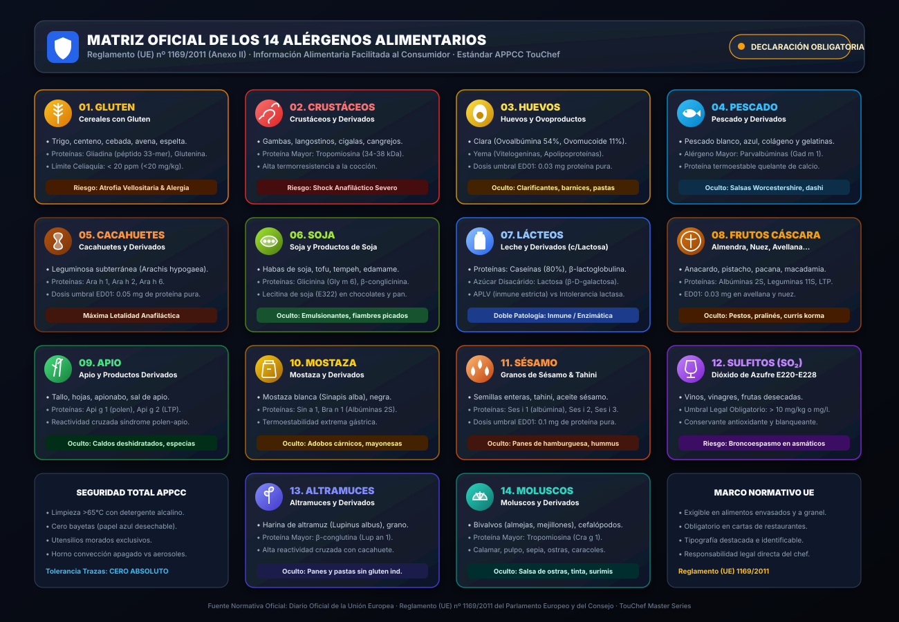


> [!NOTE]
> **Ficha Técnica & Trazabilidad Normativa:**
> - **Marco Jurídico:** Reglamento (UE) nº 1169/2011 del Parlamento Europeo y del Consejo (25 de octubre de 2011), Anexo II.
> - **Ámbito de Aplicación:** Hostelería, catering, obradores de Batch Cooking y servicios de chef privado.
> - **Exigencia Técnica:** Declaración obligatoria de presencia e ingredientes derivados con indicación del nombre normativo exacto del alérgeno. Prohibición de ambigüedades en menús para celíacos o personas polialérgicas (límite $<20\text{ ppm}$ para gluten según Reglamento de Ejecución UE nº 828/2014).

```
┌─────────────────────────────────────────────────────────────────────────────┐
│                 LOS 14 ALÉRGENOS DE DECLARACIÓN OBLIGATORIA                 │
├──────┬───────────────────────────────┬──────┬───────────────────────────────┤
│ 1    │ Cereales con Gluten           │ 8    │ Frutos de Cáscara             │
│ 2    │ Crustáceos y derivados        │ 9    │ Apio y derivados              │
│ 3    │ Huevos y ovoproductos         │ 10   │ Mostaza y derivados           │
│ 4    │ Pescado y derivados           │ 11   │ Granos de Sésamo              │
│ 5    │ Cacahuetes y derivados        │ 12   │ Dióxido de Azufre y Sulfitos  │
│ 6    │ Soja y derivados              │ 13   │ Altramuces y derivados        │
│ 7    │ Leche y derivados (c/lactosa) │ 14   │ Moluscos y derivados          │
└──────┴───────────────────────────────┴──────┴───────────────────────────────┘
```

---

### 1.1. Desglose Bioquímico, Proteínas Causantes y Formas Ocultas

```
┌────────────────────────────────────────────────────────────────────────────────────────────────────────────────┐
│ 1. CEREALES QUE CONTIENEN GLUTEN                                                                               │
├────────────────────────────────────────────────────────────────────────────────────────────────────────────────┤
│ • Especies Botánicas: Trigo (incluida espelta y trigo khorasan/kamut), centeno, cebada, avena y sus híbridos. │
│ • Proteínas Antigénicas: Prolaminas (Gliadina en trigo, Secalina en centeno, Hordeína en cebada, Avenina en    │
│   avena) y Glutelinas (Glutenina). Fracción tóxica péptido 33-mer ($\alpha$-gliadina).                         │
│ • Presencia Oculta en Industria: Espesantes en salsas comerciales, almidones modificados (E1404-E1451),        │
│   levadura de cerveza, embutidos económicos (ligantes), salsa de soja convencional (shoyu), caldos en cubos.  │
└────────────────────────────────────────────────────────────────────────────────────────────────────────────────┘

┌────────────────────────────────────────────────────────────────────────────────────────────────────────────────┐
│ 2. CRUSTÁCEOS Y PRODUCTOS A BASE DE CRUSTÁCEOS                                                                 │
├────────────────────────────────────────────────────────────────────────────────────────────────────────────────┤
│ • Especies: Gambas, langostinos, cigalas, bogavantes, langostas, cangrejos de río/mar, percebes, krill.        │
│ • Proteína Mayor: Tropomiosina muscular ($34\text{ - }38\text{ kDa}$), proteína termoestable y resistente a    │
│   la pepsina gástrica. Reactividad cruzada panalergénica con ácaros del polvo y cucarachas.                    │
│ • Presencia Oculta: Pastas de curry tailandesas (pasta de camarón kapi), surimi, polvos dashi de marisco,     │
│   aceites enriquecidos con glucosamina marina, enriquecedores de sabor en sopas asiáticas.                     │
└────────────────────────────────────────────────────────────────────────────────────────────────────────────────┘

┌────────────────────────────────────────────────────────────────────────────────────────────────────────────────┐
│ 3. HUEVOS Y PRODUCTOS A BASE DE HUEVO                                                                          │
├────────────────────────────────────────────────────────────────────────────────────────────────────────────────┤
│ • Fracción Proteica: Clara (Ovoalbúmina $54\%$, Ovomucoide $11\%$ —altamente termorresistente—, Ovotransferrina│
│   $12\%$, Lisozima $3.4\%$ [E1105]) y Yema (Vitelogeninas, Apolipoproteínas).                                 │
│ • Presencia Oculta: Agentes clarificantes en vinos y cervezas, pastas al huevo, mayonesas, rebozados,         │
│   emulsionantes lecitínicos no declarados como soja, barnices de bollería brillante, lisozima en quesos curados│
└────────────────────────────────────────────────────────────────────────────────────────────────────────────────┘

┌────────────────────────────────────────────────────────────────────────────────────────────────────────────────┐
│ 4. PESCADO Y PRODUCTOS A BASE DE PESCADO                                                                       │
├────────────────────────────────────────────────────────────────────────────────────────────────────────────────┤
│ • Proteína Mayor: Parvalbúminas ($\beta$-parvalbúmina Gad m 1 en bacalao, Cyp c 1 en carpa). Proteína quelante │
│   de calcio extremadamente termoestable. Colágeno de pescado y gelatinas marinas.                              │
│ • Presencia Oculta: Salsa Worcestershire (salsa Perrins contiene anchoas fermentadas), salsa César industrial, │
│   caldos dashi con bonito seco (*katsuobushi*), gelatinas clarificantes (*ictiocola*), suplementos Omega-3.    │
└────────────────────────────────────────────────────────────────────────────────────────────────────────────────┘

┌────────────────────────────────────────────────────────────────────────────────────────────────────────────────┐
│ 5. CACAHUETES Y PRODUCTOS A BASE DE CACAHUETE                                                                  │
├────────────────────────────────────────────────────────────────────────────────────────────────────────────────┤
│ • Botánica: *Arachis hypogaea* (leguminosa de fructificación subterránea, no es un fruto de cáscara).         │
│ • Proteínas: Vicilinas (Ara h 1), Conglutinas (Ara h 2 y Ara h 6 —los alérgenos más potentes y letales—) y     │
│   Glicininas (Ara h 3). El tueste térmico a $>160^\circ\text{C}$ multiplica su alergenicidad mediante AGEs.    │
│ • Presencia Oculta: Aceites de cacahuete no refinados, mantecas en confitería, mezclas de frutos secos a       │
│   granel (contaminación en silos), salsas satay, bases de repostería americana, cereales crujientes.           │
└────────────────────────────────────────────────────────────────────────────────────────────────────────────────┘

┌────────────────────────────────────────────────────────────────────────────────────────────────────────────────┐
│ 6. SOJA Y PRODUCTOS A BASE DE SOJA                                                                             │
├────────────────────────────────────────────────────────────────────────────────────────────────────────────────┤
│ • Proteínas: Globulinas de reserva (Glicinina Gly m 6 y $\beta$-conglicinina Gly m 5) y Profilina Gly m 3.    │
│ • Presencia Oculta: Lecitina de soja (E322) en chocolates y margarinas, aislado de proteína de soja en fiambres│
│   y carnes picadas para retención de agua, texturizados vegetales, salsas de soja, miso, tempeh, edamame.      │
└────────────────────────────────────────────────────────────────────────────────────────────────────────────────┘

┌────────────────────────────────────────────────────────────────────────────────────────────────────────────────┐
│ 7. LECHE Y SUS DERIVADOS (INCLUIDA LA LACTOSA)                                                                 │
├────────────────────────────────────────────────────────────────────────────────────────────────────────────────┤
│ • Fracción Proteica: Caseínas ($\alpha_{s1}, \alpha_{s2}, \beta, \kappa\text{-caseína}$, $80\%$) y Proteínas   │
│   del Suero ($\beta$-lactoglobulina $10\%$, $\alpha$-lactoalbúmina $4\%$, seroalbúmina bovina).               │
│ • Fracción Azúcar: Disacárido **Lactosa** ($\beta\text{-D-galactopiranosil-(1}\to\text{4)-D-glucosa}$).        │
│ • Presencia Oculta: Suero de leche en polvo en patatas fritas de bolsa (saborizantes), caseinato sódico en     │
│   embutidos y vinos, mantequilla anhidra en masas quebradas, lactosa como excipiente y texturizante.           │
└────────────────────────────────────────────────────────────────────────────────────────────────────────────────┘

┌────────────────────────────────────────────────────────────────────────────────────────────────────────────────┐
│ 8. FRUTOS DE CÁSCARA                                                                                           │
├────────────────────────────────────────────────────────────────────────────────────────────────────────────────┤
│ • Especies Incluidas en Reglamento: Almendras (*Prunus dulcis*), Avellanas (*Corylus avellana*), Nueces       │
│   (*Juglans regia*), Anacardos (*Anacardium occidentale*), Pacanas (*Carya illinoinensis*), Castañas de Pará  │
│   (*Bertholletia excelsa*), Pistachos (*Pistacia vera*), Nueces Macadamia (*Macadamia ternifolia*).            │
│ • Proteínas: Albúminas 2S, Leguminas 11S, Vicilinas 7S y Proteínas de transferencia lipídica (LTP Cor a 8).   │
│ • Presencia Oculta: Pestos tradicionales, pralinés, turrones, harinas de almendra en macarons y repostería,   │
│   bebidas vegetales ("leche de almendra/avellana"), aceites prensados en frío, curris korma.                   │
└────────────────────────────────────────────────────────────────────────────────────────────────────────────────┘

┌────────────────────────────────────────────────────────────────────────────────────────────────────────────────┐
│ 9. APIO Y PRODUCTOS DERIVADOS                                                                                  │
├────────────────────────────────────────────────────────────────────────────────────────────────────────────────┤
│ • Botánica: *Apium graveolens* (apio en rama, apionabo, semillas y extractos).                                 │
│ • Proteínas: Api g 1 (homólogo a Bet v 1 del polen de abedul), Api g 2 (LTP termorresistente).                │
│ • Presencia Oculta: Sal de apio en especias para barbacoas y mezclas de coctelería (Bloody Mary), caldos      │
│   deshidratados industriales, bases de sofrito (*mirepoix*), embutidos y preparados cárnicos.                 │
└────────────────────────────────────────────────────────────────────────────────────────────────────────────────┘

┌────────────────────────────────────────────────────────────────────────────────────────────────────────────────┐
│ 10. MOSTAZA Y PRODUCTOS DERIVADOS                                                                              │
├────────────────────────────────────────────────────────────────────────────────────────────────────────────────┤
│ • Especies: Mostaza blanca (*Sinapis alba* - alérgeno Sin a 1) y mostaza negra (*Brassica nigra* - Bra n 1).   │
│ • Compuestos: Glucosinolatos (sinigrina y sinalbina) y albúminas 2S termoestables y resistentes a la pepsina. │
│ • Presencia Oculta: Mayonesas y salsas emulsionadas comerciales, adobos de carne, marinados para barbacoa,    │
│   encurtidos en vinagre, mezclas de especias de curry, embutidos alemanes (frankfurts).                        │
└────────────────────────────────────────────────────────────────────────────────────────────────────────────────┘

┌────────────────────────────────────────────────────────────────────────────────────────────────────────────────┐
│ 11. GRANOS DE SÉSAMO Y PRODUCTOS A BASE DE SÉSAMO                                                              │
├────────────────────────────────────────────────────────────────────────────────────────────────────────────────┤
│ • Botánica: *Sesamum indicum*. Alérgenos mayores: Ses i 1 (albúmina 2S), Ses i 2 y Ses i 3 (vicilinas).       │
│ • Presencia Oculta: Tahini, hummus, panes de hamburguesa, gomasio, aceite de sésamo prensado en frío, barritas │
│   energéticas, crackers, rebozados crujientes en cocina oriental (tempuras).                                   │
└────────────────────────────────────────────────────────────────────────────────────────────────────────────────┘

┌────────────────────────────────────────────────────────────────────────────────────────────────────────────────┐
│ 12. DIÓXIDO DE AZUFRE Y SULFITOS (E220 - E228)                                                                 │
├────────────────────────────────────────────────────────────────────────────────────────────────────────────────┤
│ • Umbral Legal de Declaración: Concentraciones superiores a **$10\text{ mg/kg}$ o $10\text{ mg/l}$**          │
│   expresado como $SO_2$ total.                                                                                 │
│ • Acción Química: Agente antioxidante, antimicrobiano y blanqueante que libera gas sulfuroso irritante.       │
│ • Presencia Oculta: Vinos y sidras (sulfitos de fermentación y añadidos), vinagres de vino, frutas desecadas   │
│   (orejones, uvas pasas para mantener color vivo), crustáceos congelados (metabisulfito contra melanosis).     │
└────────────────────────────────────────────────────────────────────────────────────────────────────────────────┘

┌────────────────────────────────────────────────────────────────────────────────────────────────────────────────┐
│ 13. ALTRAMUCES Y PRODUCTOS A BASE DE ALTRAMUCES                                                                │
├────────────────────────────────────────────────────────────────────────────────────────────────────────────────┤
│ • Botánica: *Lupinus albus*. Proteína mayor: $\beta$-conglutina (Lup an 1). Alta reactividad cruzada con el    │
│   cacahuete y otras leguminosas.                                                                               │
│ • Presencia Oculta: Harina de altramuz utilizada como mejorante panario y colorante amarillo en bollería,      │
│   panes sin gluten industriales para aportar proteína, pastas italianas secas, sucedáneos de café.             │
└────────────────────────────────────────────────────────────────────────────────────────────────────────────────┘

┌────────────────────────────────────────────────────────────────────────────────────────────────────────────────┐
│ 14. MOLUSCOS Y PRODUCTOS A BASE DE MOLUSCOS                                                                    │
├────────────────────────────────────────────────────────────────────────────────────────────────────────────────┤
│ • Clases: Bivalvos (mejillones, almejas, ostras, berberechos), Cefalópodos (calamar, pulpo, sepia) y          │
│   Gasterópodos (caracoles de tierra y mar).                                                                    │
│ • Proteína Mayor: Tropomiosina de molusco Cra g 1.                                                             │
│ • Presencia Oculta: Salsa de ostras en salteados asiáticos, tinta de calamar en arroces/pastas, pizzas de fruto│
│   de mar, caldos concentrados de pescado con extractos de molusco, surimis complejos.                         │
└────────────────────────────────────────────────────────────────────────────────────────────────────────────────┘
```

---

### 1.2. Dosis Desencadenantes Mínimas (*Thresholds*) y Dosis de Referencia (ED01 / ED05)

El consorcio internacional VITAL (*Voluntary Incidental Trace Allergen Labelling*) ha definido las dosis de referencia de proteína alérgena pura capaces de desencadenar una reacción clínica objetiva en el $1\%$ ($\text{ED}_{01}$) o $5\%$ ($\text{ED}_{05}$) de la población alérgica sensibilizada:

| Alérgeno Alimentario | Dosis de Referencia $\text{ED}_{01}$ (Proteína pura) | Dosis de Referencia $\text{ED}_{05}$ (Proteína pura) | Equivalencia en Alimento Real |
| :--- | :---: | :---: | :---: |
| **Cacahuete (*Arachis hypogaea*)** | $0.05\text{ mg}$ | $0.2\text{ mg}$ | Menos de $1/1000$ de un grano de cacahuete |
| **Huevo de Gallina** | $0.03\text{ mg}$ | $0.2\text{ mg}$ | Una mota microscópica de clara desecada |
| **Leche de Vaca (Proteína Total)** | $0.05\text{ mg}$ | $0.1\text{ mg}$ | $0.003\text{ ml}$ de leche líquida entera |
| **Avellana / Frutos de Cáscara** | $0.03\text{ mg}$ | $0.1\text{ mg}$ | Fracción invisible de polvo de molienda |
| **Semillas de Sésamo** | $0.1\text{ mg}$ | $0.7\text{ mg}$ | $1/10$ de una semilla individual |
| **Gluten (Enfermedad Celíaca)** | — | — | **Límite Legal: $< 20\text{ ppm}$ ($20\text{ mg/kg}$)** |

> [!CAUTION]
> **El Fraude del Etiquetado Precautorio Laxo:**
> La leyenda *"Puede contener trazas de..."* solo es éticamente admisible cuando se han aplicado todas las medidas de Buenas Prácticas de Fabricación (BPF) y persiste un riesgo inevitable documentado mediante análisis de laboratorio. En un servicio de cocina a domicilio o catering TouChef, **las trazas no se suponen: se eliminan mediante protocolo higiénico absoluto**.

---

## 2. Diferencia Clínica: Alergia, Intolerancia y Celiaquía

```
                              DIAGNÓSTICO DIFERENCIAL CLÍNICO
                              
         ┌───────────────────────────────────┼───────────────────────────────────┐
         ▼                                   ▼                                   ▼
┌──────────────────┐               ┌──────────────────┐                ┌──────────────────┐
│ ALERGIA ALIMENT. │               │   INTOLERANCIA   │                │ ENFERMEDAD CEL.  │
├──────────────────┤               ├──────────────────┤                ├──────────────────┤
│ • Sistema Inmune │               │ • Sistema Metab. │                │ • Autoinmune     │
│   (IgE / No-IgE) │               │   / Enzimático   │                │   Sistémica HLA  │
│ • Riesgo Vital   │               │ • Sin Anafilaxia │                │ • Atrofia Vello. │
│   (Shock Anafil) │               │ • Dosis-depend.  │                │ • Límite <20 ppm │
│ • Dosis: Trazas  │               │ • Digestivo/DAO  │                │ • Daño Mucosa    │
└──────────────────┘               └──────────────────┘                └──────────────────┘
```

---

### 2.1. Tabla Comparativa Fisiopatológica y Clínica Exhaustiva

| Parámetro Clínico | Alergia Alimentaria Mediada por IgE | Intolerancia Alimentaria (Metabólica/Enzimática) | Enfermedad Celíaca (EC) | Sensibilidad al Gluten No Celíaca (SGNC) |
| :--- | :--- | :--- | :--- | :--- |
| **Mecanismo Fisiopatológico** | Hipersensibilidad Tipo I: Unión del antígeno a IgE fijada en mastocitos/basófilos $\to$ Desgranulación masiva de histamina. | Déficit enzimático primario/secundario (Lactasa, DAO) o transportador saturado (GLUT-5). | Respuesta autoinmune mediada por Linfocitos T activados por transglutaminasa tisular (tTG-2) y gliadina. | Activación de la inmunidad innata celular; respuesta a ATIs (*Inhibidores de Amilasa-Tripsina*) y FODMAPs. |
| **Base Genética** | Predisposición atópica poligénica (genes de citoquinas Th2, filagrina). | Polimorfismo del gen *LCT* (persistencia/no persistencia de lactasa); gen *AOC1* (DAO). | **HLA-DQ2.5** ($90\text{ - }95\%$) y/o **HLA-DQ8** ($5\text{ - }10\%$). | Sin marcador genético específico identificado. |
| **Dependencia de Dosis** | **Independiente de la dosis:** Trazas microscópicas ($\mu\text{g}$) pueden causar muerte súbita. | **Dependiente de la dosis:** Pequeñas cantidades pueden tolerarse según el umbral enzimático individual. | **Umbral acumulativo muy bajo:** Ingestas repetidas de $>10\text{ - }20\text{ mg/día}$ reactivan la atrofia vellositaria. | Moderadamente dependiente de la carga de trigo/FODMAPs ingerida. |
| **Tiempo de Aparición** | Inmediato (Minutos a 2 horas post-ingesta). | Tardío (30 minutos a varias horas/días post-ingesta). | Respuesta inmune retardada (Días, semanas o meses de inflamación crónica). | Horas a días tras la ingesta de alimentos con trigo. |
| **Sintomatología Clásica** | Cutánea (urticaria, angioedema), respiratoria (estridor, broncoespasmo), digestiva y **Shock Anafiláctico sistémico**. | Exclusivamente digestiva (meteorismo, flatulencia, diarrea osmótica, dolor cólico) o cefaleas/déficit DAO. | Atrofia de vellosidades (Marsh 1-3), malabsorción, anemia ferropénica refractaria, osteoporosis, dermatitis herpetiforme. | Hinchazón, dolor abdominal, niebla mental (*brain fog*), fatiga crónica, mialgias articulares. |
| **Marcadores Diagnósticos** | IgE específica sérica (*ImmunoCAP*), *Prick Test* cutáneo, prueba de provocación oral controlada. | Test de hidrógeno espirado (lactosa/fructosa), actividad DAO plasmática, prueba de exclusión. | Anticuerpos **Anti-tTG IgA**, Anti-Endomisio (**EMA**), Anti-DGP IgA/IgG, Biopsia Duodenal (Marsh). | Diagnóstico por exclusión (serología y biopsia celíaca negativas + descarte de alergia al trigo). |
| **Protocolo Dietético** | **Exclusión alérgeno $100\%$:** Cero contacto, cero trazas, adrenalina autoinyectable en bolsillo. | Ajuste por umbral de tolerancia individual o administración de enzima exógena (Lactasa, DAO). | **Dieta Sin Gluten Estricta de por vida ($<20\text{ ppm}$):** Cero contaminación cruzada. | Dieta baja en trigo/gluten y control de fructanos según tolerancia clínica. |

---

## 3. Protocolo de Prevención de Contaminación Cruzada (APPCC Culinario)

La contaminación cruzada es la transferencia involuntaria de un alérgeno o gluten desde un alimento, superficie, utensilio o atmósfera hacia un plato destinado a una persona sensible.

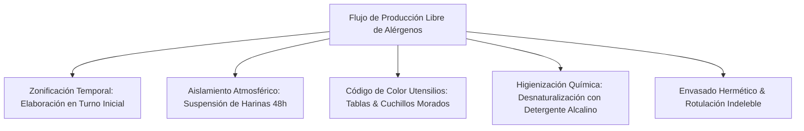

---

### 3.1. El Peligro de las Harinas Volátiles y Aerosoles Atmosféricos

```
┌─────────────────────────────────────────────────────────────────────────────┐
│               CINÉTICA DE SEDIMENTACIÓN DE LA HARINA DE TRIGO               │
├─────────────────────────────────────────────────────────────────────────────┤
│ • Diámetro de partícula de harina de trigo: $10\text{ - }100\text{ }\mu\text{m}$. │
│ • Tiempo de suspensión en aire quieto: Entre **12 y 48 horas** tras tamizar, │
│   batir o manipular sacos abiertos en cocina.                                │
│ • Deposición por gravedad: Partículas invisibles caen lentamente sobre      │
│   superficies limpias, ensaladeras abiertas y freidoras.                     │
│                                                                             │
│ 🔴 REGLA DE ORO TOUCHEF: Queda TERMINANTEMENTE PROHIBIDO manipular harinas   │
│ de trigo convencionales el mismo día en la cocina o área de Batch Cooking    │
│ donde se vayan a elaborar menús para celíacos o personas con alergia severa.│
└─────────────────────────────────────────────────────────────────────────────┘
```

---

### 3.2. Procedimientos Operativos Estandarizados de Limpieza (POES)

1. **Invalidez de los Geles Hidroalcohólicos:** El alcohol al $70\%$ es un excelente bactericida, pero **no degrada ni disuelve las proteínas del gluten ni los epítopos alérgenos**. Solo fija las proteínas a la superficie.
2. **Protocolo Químico Correcto:**
   - Lavado con agua caliente a **temperatura superior a $65^\circ\text{C}$** y detergente alcalino desengrasante formulado con tensioactivos aniónicos.
   - Fricción mecánica enérgica con estropajos específicos de un solo uso.
   - Aclarado exhaustivo con agua corriente caliente para arrastrar mecánicamente todo residuo proteico.
3. **Eliminación Absoluta de Bayetas Reutilizables:** Las bayetas y paños de cocina húmedos son el vector número uno de transferencia de trazas de gluten y alérgenos en hostelería. Se debe utilizar **exclusivamente papel de celulosa azul de un solo uso** para secar manos, tablas y mesados.

---

### 3.3. Equipamiento Exclusivo y Código de Colores

```
┌─────────────────────────────────────────────────────────────────────────────┐
│                    ZONIFICACIÓN DE UTENSILIOS TOUCHEF                       │
├───────────────────┬─────────────────────────────────────────────────────────┤
│ COLOR MORADO /    │ Exclusivo para preparaciones **SIN GLUTEN / ALÉRGENOS** │
│ IDENTIFICATIVO    │ Tablas de polietileno de alta densidad moradas,         │
│                   │ cuchillos con mango morado, espátulas de silicona morada│
├───────────────────┼─────────────────────────────────────────────────────────┤
│ ELECTRODOMÉSTICOS │ • Tostadoras: Prohibido compartir. Usar bolsas de teflón│
│ CRÍTICOS          │   tostadoras (*toastabags*) o tostadora exclusiva GF.   │
│                   │ • Freidoras / Aceites: Prohibición absoluta de reutilizar│
│                   │   aceite donde se hayan frito croquetas o rebozados.    │
│                   │ • Horno: Modo Convección/Ventilador apagado (el aire     │
│                   │   forzado dispersa motas de harina o migas de pan).     │
└───────────────────┴─────────────────────────────────────────────────────────┘
```

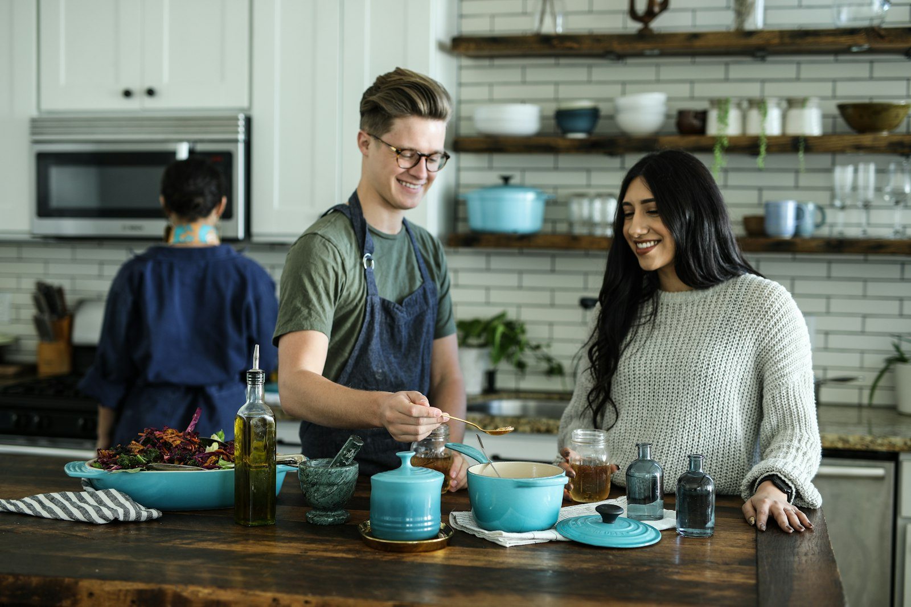

---

## 4. Masterclass Sin Gluten: Harinas Alternativas e Hidrocoloides Aglutinantes

La panificación tradicional se fundamenta en la red viscoelástica formada por la hidratación de dos proteínas del trigo: la **glutenina** (que aporta resistencia y elasticidad a la tracción) y la **gliadina** (que aporta viscosidad y extensibilidad), permitiendo retener las bolsas de gas $CO_2$ generadas por la levadura (*Saccharomyces cerevisiae*).

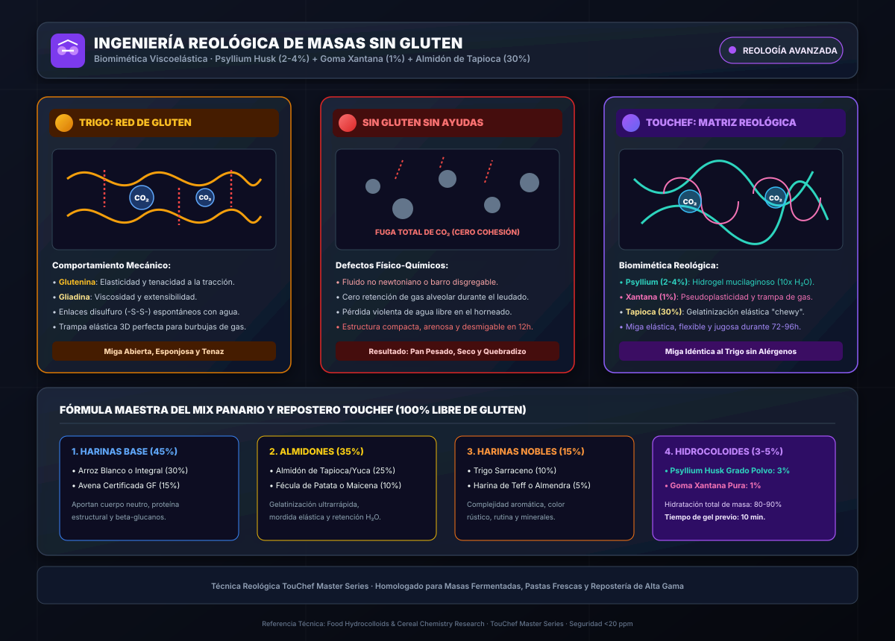

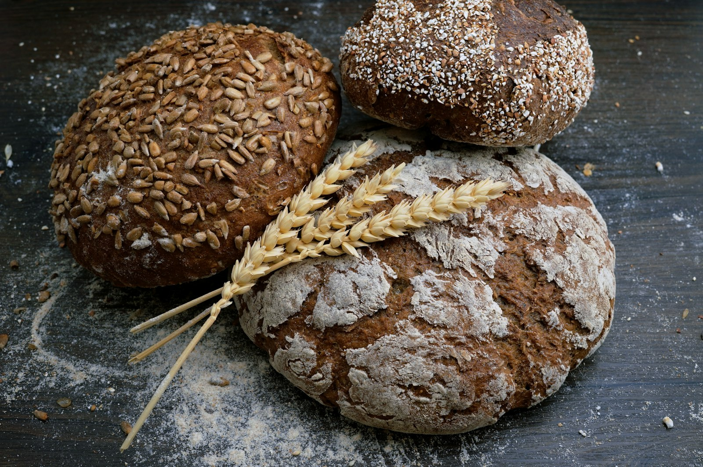

> [!NOTE]
> **Ficha Técnica & Trazabilidad Reológica:**
> - **Fundamento Científico:** Reología y Química de Cereales (*Cereal Chemistry & Hydrocolloids*). Replicación biomimética de la viscoelasticidad del gluten sin epítopos reactivos ($<20\text{ ppm}$).
> - **Sinergia Polimérica:** El **Psyllium Husk ($2\text{ - }4\%$)** forma un hidrogel de arabinoxilanos que retiene entre 10 y 15 veces su peso en agua, confiriendo extensibilidad y miga húmeda duradera. La **Goma Xantana ($0.5\text{ - }1\%$)** confiere un comportamiento pseudoplástico que captura y sella las celdas alveolares de gas $CO_2$. El **Almidón de Tapioca ($25\text{ - }30\%$)** provee una gelatinización termoelástica que imita la mordida tradicional (*chewy texture*).

```
          REOLOGÍA COMPARADA: MASA CON GLUTEN vs. MASA SIN GLUTEN
          
       MASA CON TRIGO CONVENCIONAL               MASA SIN GLUTEN TOUCHEF
       ┌────────────────────────┐              ┌────────────────────────┐
       │ Red Elástica 3D de     │              │ Matriz Hidrocoloide:   │
       │ Glutenina + Gliadina   │  ─────────>  │ Psyllium Husk (Red H2O)│
       │ Atrapa Gas de forma    │  REEMPLAZO   │ + Goma Xantana (Gas)   │
       │ espontánea             │  BIOMIMÉTICO │ + Almidón de Tapioca   │
       └────────────────────────┘              └────────────────────────┘
          Estructura Tenaz y Extensible           Estructura Homóloga Replicada
```

---

### 4.1. Taxonomía de Harinas y Almidones Sin Gluten

Para lograr panes, pastas y repostería sin gluten con una miga elástica, tierna y duradera, se debe formular una mezcla ternaria (*Mix*) que combine tres familias:

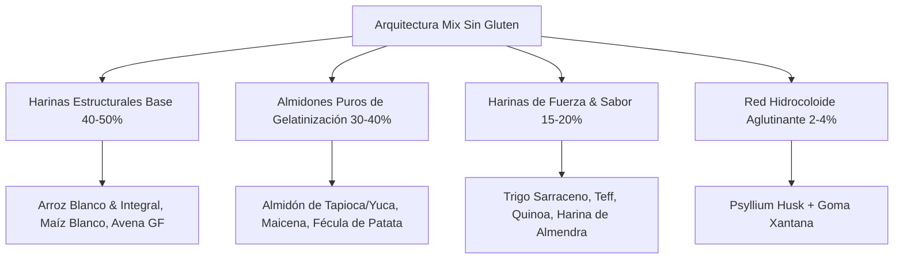

```
┌────────────────────────────────────────────────────────────────────────────────────────────────────────────────┐
│ 1. HARINAS ESTRUCTURALES BASE                                                                                  │
├────────────────────────────────────────────────────────────────────────────────────────────────────────────────┤
│ • Harina de Arroz (Blanca e Integral): Neutra, de grano fino, forma el cuerpo principal de la masa.            │
│ • Harina de Avena Certificada Sin Gluten: Rica en avenina pura, aporta suavidad, retención de humedad y        │
│   beta-glucanos prebióticos.                                                                                   │
│ • Harina de Maíz (No precocida): Aporta estructura y color dorado, sabor suave.                                │
└────────────────────────────────────────────────────────────────────────────────────────────────────────────────┘

┌────────────────────────────────────────────────────────────────────────────────────────────────────────────────┐
│ 2. HARINAS NOBLES DE SABOR, COLOR Y DENSIDAD NUTRICIONAL                                                       │
├────────────────────────────────────────────────────────────────────────────────────────────────────────────────┤
│ • Trigo Sarraceno (*Fagopyrum esculentum*): Pseudocereal libre de gluten. Miga rústica, oscura, sabor a       │
│   fruto seco tostado. Alto contenido en rutina (antioxidante vascular) y lisina.                              │
│ • Harina de Teff: Cereal milenario etíope sin gluten. Gran retención de agua, color oscuro, alto en hierro.   │
│ • Harina de Almendra Extrafina: Grasa monoinsaturada noble, confiere humedad extrema en masas reposteras.      │
└────────────────────────────────────────────────────────────────────────────────────────────────────────────────┘

┌────────────────────────────────────────────────────────────────────────────────────────────────────────────────┐
│ 3. ALMIDONES PUROS (GELATINIZADORES)                                                                           │
├────────────────────────────────────────────────────────────────────────────────────────────────────────────────┤
│ • Almidón de Tapioca (Yuca Dulce): El almidón más elástico del reino vegetal. Aporta "mordida chicle" (*chewy│
│   texture*) y elasticidad en caliente. Imprescindible para pan y gnocchis.                                     │
│ • Almidón de Maíz (Maicena): Aporta ligereza, suavidad y alvéolos finos a la miga.                           │
│ • Fécula de Patata: Almacena grandes cantidades de agua ligada, retardando el endurecimiento de la masa.       │
└────────────────────────────────────────────────────────────────────────────────────────────────────────────────┘
```

---

### 4.2. Hidrocoloides Aglutinantes: El "Falso Gluten" Biopolimérico

Sin gluten, una masa de harina de arroz y agua se comporta como un fluido no newtoniano o barro quebradizo. Los hidrocoloides actúan como **agentes estructurantes moleculares**:

```
┌─────────────────────────────────────────────────────────────────────────────┐
│                    BIOPOLÍMEROS AGLUTINANTES MAESTROS                       │
├───────────────────────┬──────────────────────┬──────────────────────────────┤
│ HIDROCOLOIDE          │ ORIGEN & COMPOSICIÓN │ DOSIFICACIÓN & MECANISMO     │
├───────────────────────┼──────────────────────┼──────────────────────────────┤
│ **Psyllium Husk**     │ Cutícula de semilla  │ • **$2\%\text{ - }4\%$**     │
│ (*Plantago ovata*)    │ de llantén de la     │   sobre peso total harinas   │
│                       │ India. Polisacáridos │ • Retiene $15\times$ su peso │
│                       │ de arabinoxilano.    │   en agua. Crea un gel       │
│                       │                      │   extensible para amasar.    │
├───────────────────────┼──────────────────────┼──────────────────────────────┤
│ **Goma Xantana**      │ Fermentación de maíz │ • **$0.5\%\text{ - }1.5\%$** │
│ (*Xanthomonas         │ por bacteria comensal│   sobre peso de harinas      │
│ campestris*)          │ Polisacárido de alto │ • Viscosidad pseudoplástica; │
│                       │ peso molecular.      │   atrapa gas $CO_2$; evita   │
│                       │                      │   que la miga se desmorone.  │
├───────────────────────┼──────────────────────┼──────────────────────────────┤
│ **Mucílago de Lino /  │ Semillas molidas     │ • **$1\text{ cda}$ lino +    │
│ Chía (*Flax-Egg*)**   │ hidratadas en agua   │   $3\text{ cdas}$ agua tibia │
│                       │ tibia ($1:3$).       │ • Emulsionante ligante para  │
│                       │                      │   repostería sin huevo.      │
└───────────────────────┴──────────────────────┴──────────────────────────────┘
```

#### Regla de Hidratación en Masas Sin Gluten:
Las harinas sin gluten y el psyllium husk demandan entre un **$80\%$ y un $105\%$ de hidratación líquida** respecto al peso de las harinas (frente al $60\text{ - }65\%$ de una masa de trigo estándar). La masa sin gluten debe ser blanda y pegajosa al tacto inicial, consolidándose durante el reposo hidrotérmico del psyllium ($15\text{ minutos}$).

---

## 5. Recetario Maestro Adaptado 100% Sin Gluten e Hipoalergénico (4 Fórmulas)

---

### RECETA 1: Pan Rústico Artesanal Sin Gluten de Fermentación Lenta en Horno Holandés (*Dutch Oven*)

> **Matriz de Seguridad:** 100% Libre de Gluten ($< 5\text{ ppm}$) | Sin Alérgenos Mayores (Sin Trigo, Sin Lácteos, Sin Huevo, Sin Soja, Sin Frutos Secos, Sin Sésamo, Sin Cacahuetes) | Máxima Miga Alveolada y Corteza Crujiente.

```
┌─────────────────────────────────────────────────────────────────────────────┐
│ METADATA DE PANIFICACIÓN & BATCH COOKING                                    │
│ • Tiempo de Amasado: 10 min | Fermentación: 2h 30 min | Horneado: 50 min    │
│ • Rendimiento: 1 Hogaza grande de 850g (Aprox. 14 rebanadas de 60g)         │
│ • Estación Térmica: Horno a 240°C con Olla de Hierro Fundido (*Cocotte*)    │
│ • Conservación: 5 días en paño de lino | Rebanar y congelar hasta 90 días   │
└─────────────────────────────────────────────────────────────────────────────┘
```

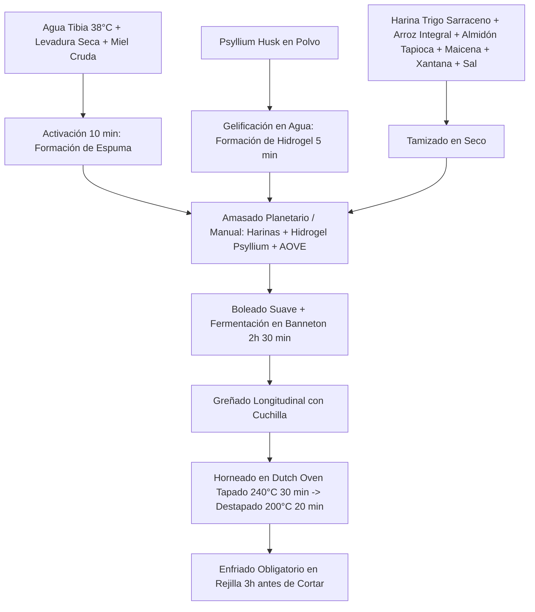

#### Ingredientes de Precisión Gramo a Gramo:
- **Matriz de Harinas y Almidones Sin Gluten ($500\text{ g}$ Totales):**
  - $175\text{ g}$ de Harina de Trigo Sarraceno integral certificada sin gluten ($35\%$).
  - $125\text{ g}$ de Harina de Arroz integral molida fina ($25\%$).
  - $125\text{ g}$ de Almidón de Tapioca / Yuca dulce ($25\%$).
  - $75\text{ g}$ de Almidón de Maíz / Maicena ($15\%$).
- **Complejo Hidrocoloide Aglutinante:**
  - $20\text{ g}$ de Psyllium Husk en polvo puro ($99\%$ pureza, $4\%$).
  - $5\text{ g}$ de Goma Xantana ($1\%$).
- **Líquidos y Activadores Biológicos:**
  - $450\text{ ml}$ de Agua mineral tibia a $38^\circ\text{C}$ ($90\%$ hidratación).
  - $7\text{ g}$ de Levadura seca de panadería sin gluten (*Saccharomyces cerevisiae*).
  - $10\text{ g}$ de Miel pura o sirope de arce (alimento iniciador para la levadura).
  - $10\text{ g}$ de Sal marina fina ($2\%$).
  - $25\text{ ml}$ de Aceite de Oliva Virgen Extra ($5\%$).
  - $10\text{ ml}$ de Vinagre de manzana sin filtrar (la acidez debilita la retrogradación temprana y mejora el alveolado).

#### Información Nutricional Detallada (Por Rebanada de 60g):
- **Energía:** $145\text{ kcal}$
- **Proteínas:** $3.2\text{ g}$ (Rica en lisina del sarraceno)
- **Carbohidratos Netos:** $27.4\text{ g}$ (Fibra dietética: $3.8\text{ g}$, Carga Glucémica: $11.2$ — Media-Baja)
- **Grasas Totales:** $2.1\text{ g}$ (Ácidos grasos monoinsaturados del AOVE)
- **Sodio:** $180\text{ mg}$.

#### Procedimiento de Panificación de Precisión:
1. **Activación de la Levadura:** Disolver en un cuenco $100\text{ ml}$ del agua tibia con la miel y la levadura seca. Dejar reposar 10 minutos hasta que forme una densa capa espumosa.
2. **Gel de Psyllium:** En otro recipiente, mezclar los $350\text{ ml}$ de agua tibia restantes con el vinagre de manzana y el psyllium husk en polvo. Batir con varilla durante 1 minuto hasta formar un gel elástico homogéneo.
3. **Mezcla Seca:** En el bol de la amasadora, tamizar la harina de trigo sarraceno, harina de arroz, almidón de tapioca, maicena, goma xantana y sal marina. Mezclar con pala durante 30 segundos.
4. **Amasado e Integración:** Añadir al bol la levadura espumosa activada, el gel de psyllium y el AOVE. Amasar con gancho o varillas espirales a velocidad media durante 8-10 minutos. La masa será suave, húmeda pero elástica y manejable.
5. **Formado y Fermentación:** Espolvorear harina de arroz sobre la mesa. Volcar la masa y bolear suavemente con las manos ligeramente aceitadas, creando tensión superficial. Colocar en un cesto de fermentación (*banneton*) enharinado con harina de arroz. Cubrir con gorro de ducha o paño húmedo y fermentar en ambiente templado ($26\text{ - }28^\circ\text{C}$) durante 2 horas a 2 horas y media hasta que doble su volumen inicial.
6. **Horneado en Horno Holandés (*Dutch Oven*):** Precalentar el horno a $240^\circ\text{C}$ con la olla de hierro fundido tapada dentro durante 45 minutos. Volcar con cuidado la masa sobre papel sulfurizado, realizar un corte longitudinal de $1\text{ cm}$ de profundidad con cuchilla a $45^\circ$ (*greñado*). Introducir el pan con el papel dentro de la olla caliente, tapar inmediatamente y hornear a **$240^\circ\text{C}$ durante 30 minutos** (el vapor encerrado expande la greña al máximo). Retirar la tapa, reducir la temperatura a **$200^\circ\text{C}$ y hornear 20 minutos adicionales** para crear una corteza dorada, crujiente y resonante.
7. **Curado de la Miga:** Apagar el horno, sacar el pan y colocarlo sobre una rejilla metálica. **Dejar enfriar un mínimo de 3 horas antes de cortar**. Cortar el pan caliente rompería la estructura de los almidones gelatinizados y dejaría la miga apelmazada y gomosa.

#### Puntos Críticos de Control (PCC - Alérgenos):
- **PCC 1 (Materia Prima):** Asegurar que las harinas y levaduras cuenten con la espiga barrada de FACE o certificado analítico de $<20\text{ ppm}$ de gluten.
- **PCC 2 (Horno):** Hornear exclusivamente con olla tapada para evitar cualquier depósito de polvo remanente en las resistencias del horno.

---

### RECETA 2: Gnocchis Caseros de Bonito/Patata y Almidón de Tapioca con Pesto Genovés Libre de Frutos Secos y Lácteos

> **Matriz de Seguridad:** 100% Libre de Gluten | Sin Frutos de Cáscara | Sin Lácteos | Sin Huevos | Sin Soja | Hipoalergénico Riguroso.

```
┌─────────────────────────────────────────────────────────────────────────────┐
│ METADATA DE COCINA & BATCH COOKING                                          │
│ • Tiempo de Preparación: 30 min | Tiempo de Cocción: 4 min (Hervido)        │
│ • Rendimiento: 4 Raciones de 380g c/u                                       │
│ • Estaciones Térmicas: Horno (Asado de Patatas) + Olla Amplia Hervido       │
│ • Conservación: 3 días en nevera | Excelente congelación cruda en bandeja    │
└─────────────────────────────────────────────────────────────────────────────┘
```

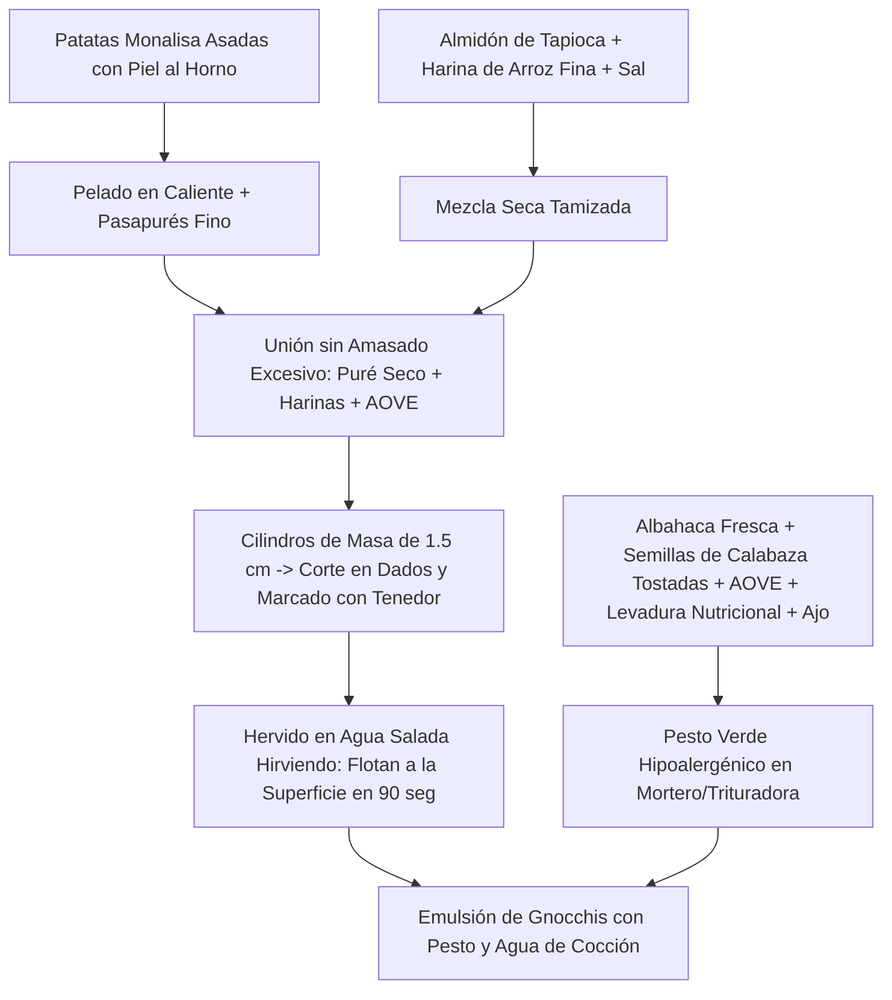

#### Ingredientes de Precisión (4 Raciones):
- **Masa de Gnocchis Sin Gluten:**
  - $600\text{ g}$ de Patatas harinosas variedad Monalisa o Agria (pesadas antes de asar).
  - $120\text{ g}$ de Almidón de Tapioca / Yuca dulce (aporta la viscoelasticidad imprescindible que sustituye al huevo y al gluten).
  - $60\text{ g}$ de Harina de Arroz blanca fina certificada sin gluten.
  - $15\text{ ml}$ de AOVE $+ 4\text{ g}$ de Sal marina fina $+ 1\text{ pizca}$ de Nuez moscada.
- **Pesto Genovés Verde Hipoalergénico (Sin Frutos Secos ni Lácteos):**
  - $60\text{ g}$ de Hojas de Albahaca fresca recién recolectada y seca.
  - $50\text{ g}$ de Semillas de Calabaza crudas peladas (tostadas ligeramente en sartén sin grasa).
  - $20\text{ g}$ de Levadura Nutricional desactivada (sustituye las notas saladas y umami del queso Parmigiano/Pecorino).
  - $1\text{ diente}$ de Ajo pequeño sin germen.
  - $90\text{ ml}$ de Aceite de Oliva Virgen Extra de sabor suave.
  - $15\text{ ml}$ de Zumo de limón fresco $+ 3\text{ g}$ de Sal marina en escamas.

#### Información Nutricional Detallada (Por Ración de 380g):
- **Energía:** $445\text{ kcal}$
- **Proteínas:** $9.8\text{ g}$ (Aportadas por las semillas de calabaza y la levadura nutricional)
- **Carbohidratos Netos:** $54.2\text{ g}$ (Fibra dietética: $6.1\text{ g}$)
- **Grasas Totales:** $21.5\text{ g}$ (Grasas monoinsaturadas y poliinsaturadas cardioprotectoras)
- **Micronutrientes Clave:**
  - Zinc: $4.1\text{ mg}$ ($41\%\text{ CDR}$, aportado por las semillas de calabaza).
  - Magnesio: $165\text{ mg}$ ($41\%\text{ CDR}$).
  - Vitamina K1: $280\text{ }\mu\text{g}$ ($233\%\text{ CDR}$).

#### Procedimiento Culinario:
1. **Tratamiento de la Patata (Cero Humedad Libre):** Asar las patatas enteras con piel en horno a $190^\circ\text{C}$ durante 45-50 minutos sobre una cama de sal gruesa (la sal absorbe el vapor exterior). **No hervir las patatas en agua**, ya que retendrían líquido y demandarían un exceso de harina, volviendo el gnocchi pesado y gomoso.
2. **Puré Seco:** Pelar las patatas aún calientes y pasar inmediatamente por un pasapurés de disco fino sobre una encimera limpia. Dejar evaporar el vapor durante 5 minutos.
3. **Formado de la Masa:** Espolvorear sobre el puré tibio el almidón de tapioca, la harina de arroz, la sal, la nuez moscada y el AOVE. Integrar con una rasqueta de panadería realizando cortes y pliegues suaves hasta unir la masa. **No amasar vigorosamente** para evitar desarrollar una textura elástica indeseada.
4. **Corte y Rayado:** Dividir la masa en 4 porciones. Rodar cada porción sobre harina de arroz formando cordones cilíndricos de $1.5\text{ cm}$ de diámetro. Cortar en dados de $2\text{ cm}$ con rasqueta. Pasar cada dado por las púas de un tenedor enharinado o una tabla de madera estriada (*rigagnocchi*) para marcar las hendiduras que retendrán la salsa.
5. **Elaboración del Pesto Hipoalergénico:** En vaso de batidora o mortero, triturar las hojas de albahaca, las semillas de calabaza tostadas, el ajo, la levadura nutricional, la sal y el zumo de limón con el AOVE hasta obtener una crema verde esmeralda brillante.
6. **Cocción Hidrotérmica:** Hervir abundante agua con sal en una olla ancha. Sumergir los gnocchis en tandas de 20 unidades. Cuando floten a la superficie (unos **$90\text{ segundos}$**), retirar inmediatamente con una espumadera y transferir a una sartén templada con el pesto y $3\text{ cucharadas}$ de agua de cocción para emulsionar. Servir de inmediato.

#### Instrucciones de Batch Cooking & Congelación:
- **Congelación Cruda:** Disponer los gnocchis crudos sobre una bandeja forrada con papel sulfurizado sin que se toquen y congelar a $-18^\circ\text{C}$ durante 2 horas. Una vez duros, envasar en bolsas de congelación herméticas. Cocinar directamente congelados en agua hirviendo (tardarán $2\text{ minutos}$ en flotar).

---

### RECETA 3: Quiche Rustique Sin Gluten de Salmón, Puerros y Crema Sedosa de Avena GF y AOVE (Libre de Lácteos)

> **Matriz de Seguridad:** 100% Libre de Gluten | Sin Lácteos ni Lactosa | Sin Soja | Sin Frutos Secos | Sin Sésamo | Base Quebrada Crujiente sin Mantequilla.

```
┌─────────────────────────────────────────────────────────────────────────────┐
│ METADATA DE COCINA & BATCH COOKING                                          │
│ • Tiempo de Preparación: 25 min | Tiempo de Cocción: 40 min                 │
│ • Rendimiento: 1 Quiche de 26 cm (6 Raciones de 260g c/u)                   │
│ • Estaciones Térmicas: Horno a 180°C + Sartén Salteado Relleno              │
│ • Conservación: 4 días en nevera a 3°C | Apto para porcionar y congelar     │
└─────────────────────────────────────────────────────────────────────────────┘
```

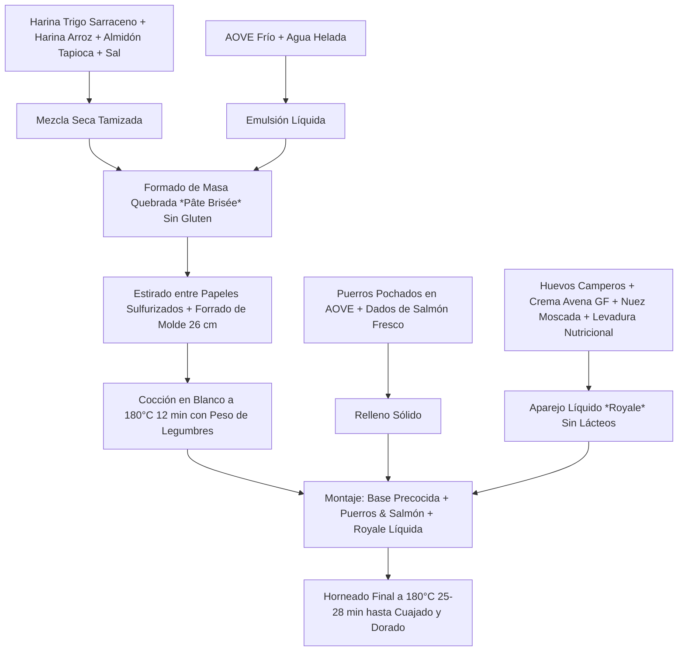

#### Ingredientes de Precisión (Molde de 26 cm - 6 Raciones):
- **Masa Quebrada Crujiente Sin Gluten ni Mantequilla:**
  - $120\text{ g}$ de Harina de Trigo Sarraceno integral sin gluten.
  - $80\text{ g}$ de Harina de Arroz integral.
  - $50\text{ g}$ de Almidón de Tapioca.
  - $1.5\text{ g}$ de Goma Xantana.
  - $60\text{ ml}$ de Aceite de Oliva Virgen Extra muy frío (refrigerado 2 horas).
  - $70\text{ ml}$ de Agua helada.
  - $3\text{ g}$ de Sal marina fina.
- **Relleno Noble:**
  - $300\text{ g}$ de Lomos de Salmón fresco limpio (cortado en dados de $1.5\text{ cm}$, sin espinas ni piel).
  - $300\text{ g}$ de Puerros (parte blanca y verde clara, lavados y cortados en rodajas finas).
  - $20\text{ ml}$ de AOVE para pochar.
- **Aparejo Líquido (*Royale*) Libre de Lácteos:**
  - $4\text{ Huevos}$ camperos ecológicos grandes (Clase 0 o 1).
  - $200\text{ ml}$ de Crema culinaria de Avena certificada sin gluten (o crema de coco suave desgrasada).
  - $15\text{ g}$ de Levadura nutricional desactivada.
  - $2\text{ g}$ de Sal marina $+ 1\text{ g}$ de Nuez moscada recién rallada $+ 1\text{ g}$ de Pimienta blanca.
  - $5\text{ g}$ de Eneldo fresco picado.

#### Información Nutricional Detallada (Por Ración de 260g):
- **Energía:** $385\text{ kcal}$
- **Proteínas:** $18.6\text{ g}$ (Alta biodisponibilidad: Salmón salvaje + Huevo campero)
- **Carbohidratos Netos:** $23.4\text{ g}$ (Fibra dietética: $3.9\text{ g}$)
- **Grasas Totales:** $23.8\text{ g}$ (Rico en ácido oleico y Omega-3 EPA/DHA: $1.200\text{ mg}$)
- **Micronutrientes Clave:**
  - Vitamina D3: $280\text{ UI}$ ($46\%\text{ CDR}$).
  - Colina: $145\text{ mg}$ ($36\%\text{ CDR}$).
  - Vitamina B12: $2.4\text{ }\mu\text{g}$ ($100\%\text{ CDR}$).

#### Procedimiento Culinario:
1. **Elaboración de la Masa:** En un bol, mezclar las harinas, el almidón de tapioca, la xantana y la sal. Añadir el AOVE frío y frotar con la yema de los dedos hasta obtener una textura arenosa. Verter el agua helada y unir rápidamente con las manos hasta formar una bola compacta. No sobreamasar.
2. **Estirado y Moldeado:** Colocar la masa entre dos hojas de papel sulfurizado y estirar con rodillo hasta lograr un grosor uniforme de $3\text{ mm}$. Forrar un molde de tarta de $26\text{ cm}$ de diámetro desmoldable. Pinchar la base con un tenedor en múltiples puntos.
3. **Cocción en Blanco (*Blind Baking*):** Cubrir la masa con papel de horno y rellenar con legumbres secas o bolas de cerámica para hornear. Hornear a $180^\circ\text{C}$ durante 12 minutos. Retirar el papel con el peso y hornear 4 minutos más para secar la base.
4. **Preparación del Relleno:** En una sartén con el AOVE, pochar los puerros a fuego suave durante 12 minutos hasta que estén dulces y transparentes. Sazonar con sal. Dejar templar.
5. **Elaboración de la Royale:** En un cuenco hondo, batir enérgicamente los huevos con la crema de avena sin gluten, la levadura nutricional, la sal, la nuez moscada, la pimienta blanca y el eneldo fresco picado.
6. **Ensamble y Horneado:** Distribuir los puerros pochados uniformemente sobre la base precocida de la tarta. Disponer los dados de salmón fresco crudo entre los puerros. Verter la royale líquida con cuidado.
7. **Cocción Final:** Hornear a $180^\circ\text{C}$ con calor arriba y abajo (sin ventilador agresivo) durante 25-28 minutos, hasta que el centro de la quiche esté cuajado al tacto y la superficie presente un dorado suave. Dejar templar 15 minutos antes de desmoldar.

#### Instrucciones de Batch Cooking & Regeneración:
- **Conservación:** Guardar en recipiente hermético en nevera a $3^\circ\text{C}$ durante 4 días.
- **Regeneración:** Calentar la porción en horno a $170^\circ\text{C}$ durante 8 minutos para restaurar el crujiente de la masa quebrada (evitar microondas para no reblandecer la corteza).

---

### RECETA 4: Tarta Húmeda de Cacao Puro y Harina de Almendra con Compota Natural de Manzana y Especias (Sin Gluten, Sin Huevo, Sin Lácteos)

> **Matriz de Seguridad:** 100% Libre de Gluten | Sin Huevos (Ligada con Pectina de Manzana y Lino) | Sin Lácteos | Sin Soja | Sin Cacahuetes | Repostería Hipoalergénica de Alta Densidad Nutricional.

```
┌─────────────────────────────────────────────────────────────────────────────┐
│ METADATA DE REPOSTERÍA & BATCH COOKING                                      │
│ • Tiempo de Preparación: 20 min | Tiempo de Cocción: 35 min                 │
│ • Rendimiento: 1 Tarta de 22 cm (8 Raciones de 180g c/u)                    │
│ • Estaciones Térmicas: Cazo (Compota Manzana) + Horno a 175°C               │
│ • Conservación: 5 días en nevera a 3°C | Mantiene humedad extrema           │
└─────────────────────────────────────────────────────────────────────────────┘
```

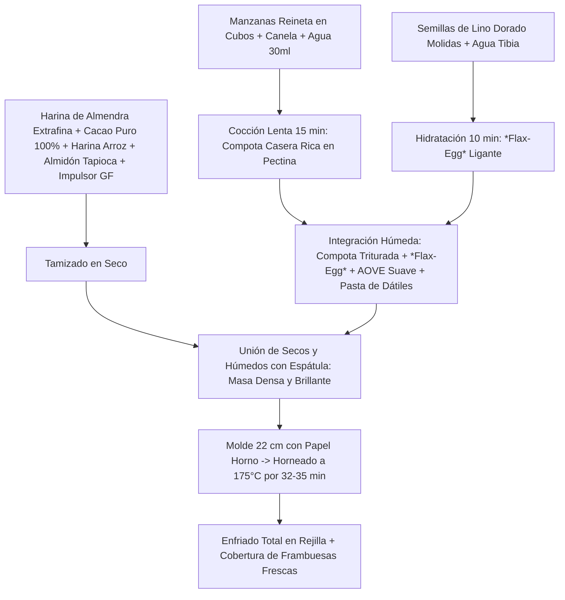

#### Ingredientes de Precisión (Molde de 22 cm - 8 Raciones):
- **Fracción Húmeda y Ligantes Naturales:**
  - $300\text{ g}$ de Compota natural de manzana reineta casera (cocida sin azúcar con $1\text{ rama}$ de canela y triturada fina; la **pectina** y fibra soluble aportan volumen y retienen la humedad).
  - $20\text{ g}$ de Semillas de Lino dorado molidas al instante $+ 60\text{ ml}$ de Agua tibia (*Flax-egg* para cohesión elástica).
  - $120\text{ g}$ de Pasta de Dátiles Medjool naturales (hidratados en agua caliente y triturados; endulzante de matriz completa no refinada).
  - $60\text{ ml}$ de Aceite de Oliva Virgen Extra de variedad arbequina suave (o aceite de coco virgen fundido).
  - $60\text{ ml}$ de Bebida de almendra o avena sin gluten no azucarada.
  - $5\text{ ml}$ de Extracto puro de vainilla de Madagascar.
- **Fracción Seca y Harinas Nobles:**
  - $150\text{ g}$ de Harina de Almendra extrafina desgrasada.
  - $80\text{ g}$ de Harina de Arroz integral molida fina.
  - $40\text{ g}$ de Almidón de Tapioca / Yuca dulce.
  - $50\text{ g}$ de Cacao puro desgrasado en polvo $100\%$ ecológico sin azúcares añadidos.
  - $8\text{ g}$ de Impulsor químico / Polvo de hornear certificado sin gluten (Bicarbonato sódico + Cremor tártaro).
  - $2\text{ g}$ de Sal marina fina (potencia la profundidad del cacao).
- **Decoración:**
  - $100\text{ g}$ de Frambuesas frescas ecológicas $+ 10\text{ g}$ de Cacao nibs puros.

#### Información Nutricional Detallada (Por Ración de 180g):
- **Energía:** $310\text{ kcal}$
- **Proteínas:** $7.8\text{ g}$ (Proteína vegetal rica en arginina y magnesio)
- **Carbohidratos Netos:** $26.2\text{ g}$ (Fibra dietética: **$6.8\text{ g}$**, Carga Glucémica: $8.5$ — Baja)
- **Grasas Totales:** $18.4\text{ g}$ (Lípidos monoinsaturados de almendra y AOVE)
- **Micronutrientes Clave:**
  - Magnesio: $135\text{ mg}$ ($34\%\text{ CDR}$, aportado por el cacao puro y la almendra).
  - Vitamina E ($\alpha$-tocoferol): $6.2\text{ mg}$ ($52\%\text{ CDR}$).
  - Polifenoles totales (Flavanoles del cacao): $>450\text{ mg}$.

#### Procedimiento Culinario:
1. **Compota de Pectina:** Pelar y trocear las manzanas. Cocer en un cazo con $30\text{ ml}$ de agua y la rama de canela durante 15 minutos a fuego lento hasta que se deshagan. Retirar la canela y triturar en procesador hasta obtener un puré suave y denso.
2. **Hidratación del Lino:** Mezclar el lino dorado molido con el agua tibia en un vaso pequeño. Dejar reposar 10 minutos hasta que forme un gel espeso que imita a la clara de huevo.
3. **Mezcla Húmeda:** En un bol grande, emulsionar con varilla la compota de manzana templada, el gel de lino hidratado, la pasta de dátiles, el AOVE suave, la bebida vegetal y el extracto de vainilla.
4. **Mezcla Seca:** En otro recipiente, tamizar la harina de almendra, la harina de arroz, el almidón de tapioca, el cacao puro en polvo, el polvo de hornear y la sal fina.
5. **Integración de la Masa:** Verter los ingredientes secos sobre la mezcla húmeda e integrar con movimientos envolventes utilizando una espátula de silicona hasta obtener una masa densa, homogénea y brillante.
6. **Horneado:** Verter la masa en un molde redondo de $22\text{ cm}$ previamente engrasado con AOVE y forrado en la base con papel sulfurizado. Alisar la superficie. Hornear en horno precalentado a **$175^\circ\text{C}$ con calor arriba y abajo durante 32-35 minutos**. Comprobar con un palillo en el centro (debe salir con migas húmedas adheridas, no masa líquida).
7. **Reposo y Presentación:** Dejar enfriar en el molde durante 20 minutos. Desmoldar sobre rejilla y dejar enfriar por completo. Decorar con frambuesas frescas y nibs de cacao crujientes antes de servir.

#### Instrucciones de Batch Cooking & Conservación:
- **Evolución:** Esta tarta mejora su textura y profundidad de sabor tras 24 horas de refrigeración, alcanzando una textura densa tipo *fudge/brownie* gracias a la estabilización de los lípidos de almendra y la pectina. Se conserva 5 días perfecta en nevera a $3^\circ\text{C}$.

---

## 6. Matriz de Seguridad y Alérgenos del Taller 02

```
LEYENDA DE MATRIZ:
❌ = Ausente por Diseño Clínico  |  ⚠️ = Trazas Potenciales / Verificar  |  ✅ = Presente Controlado
```

| Receta TouChef Sin Gluten | Gluten | Crustáceos | Huevos | Pescados | Cacahuetes | Soja | Lácteos / Lactosa | Frutos Cáscara | Apio | Mostaza | Sésamo | Sulfitos | Altramuz / Moluscos | Estado Clínico |
| :--- | :---: | :---: | :---: | :---: | :---: | :---: | :---: | :---: | :---: | :---: | :---: | :---: | :---: | :---: |
| **1. Pan Rústico Dutch Oven** | ❌ | ❌ | ❌ | ❌ | ❌ | ❌ | ❌ | ❌ | ❌ | ❌ | ❌ | ❌ | ❌ | 🟢 100% Celíaco / Hipoalergénico |
| **2. Gnocchis Tapioca & Pesto Verde**| ❌ | ❌ | ❌ | ❌ | ❌ | ❌ | ❌ | ❌ | ❌ | ❌ | ❌ | ❌ | ❌ | 🟢 100% Hipoalergénico Total |
| **3. Quiche Rustique Salmón & Puerros**| ❌ | ❌ | ✅ *(Huevo)*| ✅ *(Salmón)*| ❌ | ❌ | ❌ | ❌ | ❌ | ❌ | ❌ | ❌ | ❌ | 🟢 Sin Gluten / Sin Lácteos |
| **4. Tarta Húmeda Cacao & Manzana** | ❌ | ❌ | ❌ | ❌ | ❌ | ❌ | ❌ | ✅ *(Almendra)*| ❌ | ❌ | ❌ | ❌ | ❌ | 🟢 Sin Gluten / Vegano / Sin Soja |

---

## 7. Protocolo de Verificación Final y Auditoría de Cocina Segura

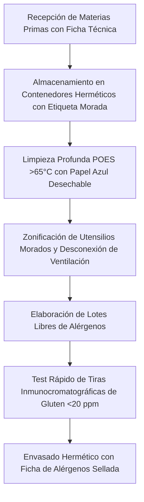

1. **Inspección de Fichas Técnicas:** Ninguna materia prima entra en el área de producción sin la confirmación documental del proveedor que acredite la ausencia de alérgenos no deseados y gluten ($<20\text{ ppm}$).
2. **Validación Analítica In Situ:** En servicios de catering o producción para clientes celíacos severos, realizar pruebas aleatorias con tiras reactivas inmunocromatográficas de flujo lateral basadas en el anticuerpo monoclonal **G12 o R5** para verificar que el producto final terminado se sitúa por debajo de los límites de detección analítica ($<5\text{ ppm}$).
3. **Entrega y Etiquetado:** Todo recipiente para servicio a domicilio debe sellarse con precinto de inviolabilidad y llevar adherida la ficha técnica con la matriz completa de los 14 alérgenos marcados según el Reglamento (UE) 1169/2011.

---
*Manual de formación técnica y clínica validado por el Comité de Seguridad Alimentaria y Alérgenos de TouChef 2026.*
