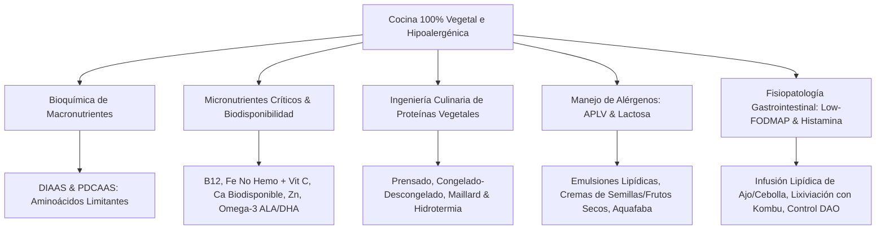
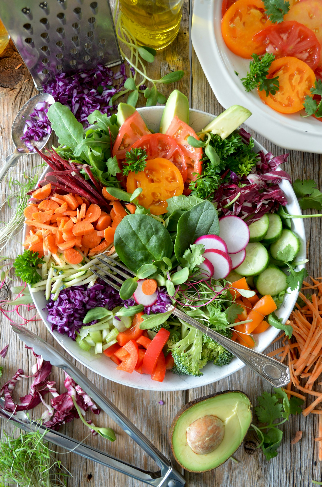
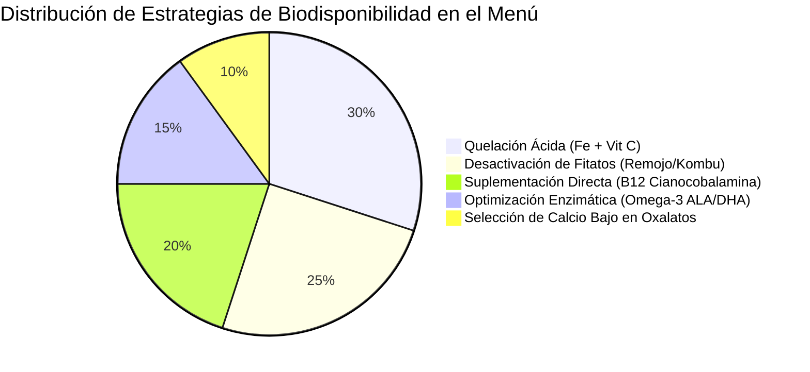
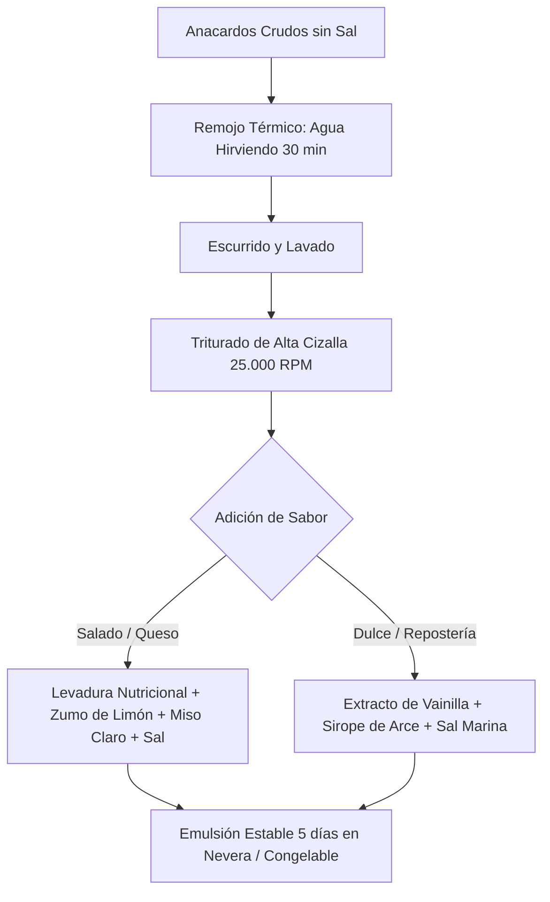
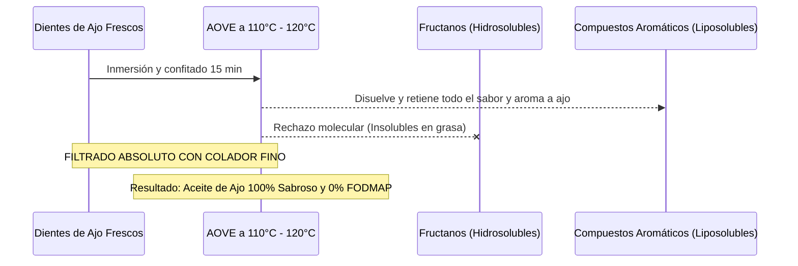
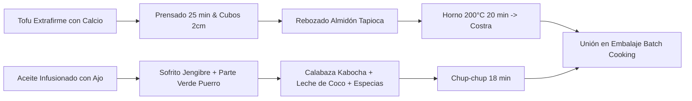
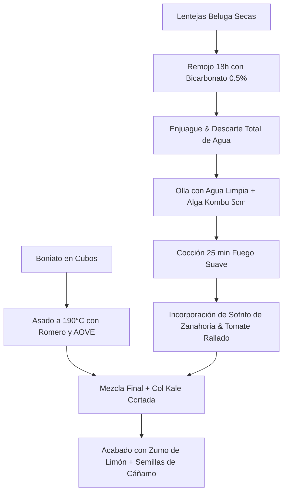
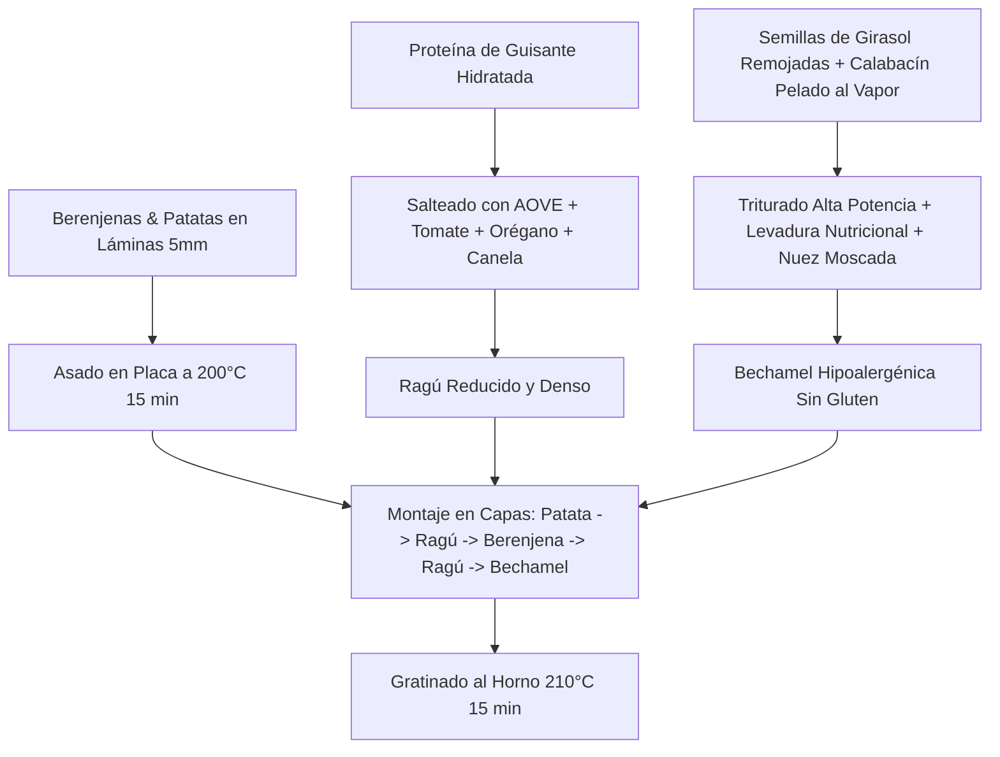
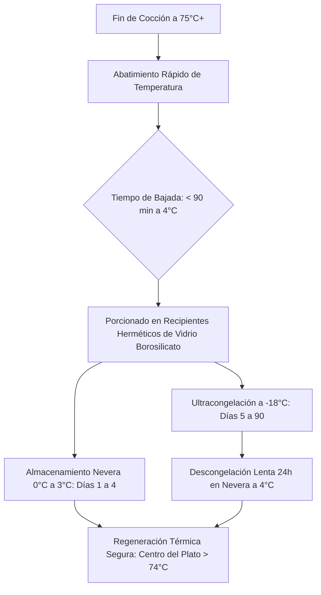

# 🥗 TALLER 03 — Nutrición Vegetariana, Vegana e Intolerancias Digestivas en Batch Cooking
> **TouChef Master Series — Manual Clínico-Culinario y Operativo**  
> *Especialidad: Dietética Avanzada, Fisiopatología Digestiva y Alérgenos en Cocina de Rendimiento*

---



---

## 1. Nutrición Vegetariana y Vegana Equilibrada: Bioquímica y Dietética Aplicada

El diseño de menús basados en plantas (*Plant-Based Nutrition*) en sistemas de producción por lotes (*Batch Cooking*) no consiste en suprimir ingredientes de origen animal, sino en **reconfigurar la densidad nutricional y la cinética de absorción de macro y micronutrientes**.



### 1.1. Estrategia de Aminoácidos Limitantes y Calidad Proteica

Históricamente se catalogaba a las proteínas vegetales como "incompletas". La evidencia contemporánea y las directrices de la OMS/FAO establecen que una dieta vegetal variada cubre la totalidad de aminoácidos esenciales siempre que se alcance el requerimiento energético y proteico diario ($1.2\text{ - }1.6\text{ g/kg/día}$ en población activa).

```
   ┌──────────────────────────────────────────────────────────┐
   │             POOL DE AMINOÁCIDOS PLASMÁTICOS              │
   │               (Ventana de Turn-Over: 24h)                │
   └─────────────────────────────┬────────────────────────────┘
                                 │
         ┌───────────────────────┴───────────────────────┐
         ▼                                               ▼
┌──────────────────┐                           ┌──────────────────┐
│    LEGUMBRES     │                           │     CEREALES     │
│ Lisina: ALTA     │                           │ Lisina: LIMITANTE│
│ Metionina: BAJA  │                           │ Metionina: ALTA  │
└────────┬─────────┘                           └────────┬─────────┘
         └───────────────────────┬───────────────────────┘
                                 ▼
                     ┌───────────────────────┐
                     │ SÍNTESIS PROTEICA 100% │
                     │   OPTIMIZADA (DIAAS)  │
                     └───────────────────────┘
```

#### Parámetros de Calidad: PDCAAS y DIAAS
- **PDCAAS (*Protein Digestibility-Corrected Amino Acid Score*):** Evalúa el aminoácido limitante frente a un patrón de referencia ajustado por digestibilidad fecal.
- **DIAAS (*Digestible Indispensable Amino Acid Score*):** Estándar de oro de la FAO; mide la digestibilidad ileal verdadera de cada aminoácido esencial individual.

| Matriz Proteica Vegetal | Aminoácido Limitante | Aminoácido Sobresaliente | Puntuación DIAAS / PDCAAS | Densidad Proteica ($g/100g$) |
| :--- | :--- | :--- | :--- | :--- |
| **Aislado de Soja / Tofu Firme** | Ninguno (Perfil Completo) | Lisina, Leucina, Arginina | $0.98\text{ - }1.00$ | $15\text{ - }18\text{ g}$ (Tofu) / $85\text{ g}$ (Aislado) |
| **Tempeh de Soja Fermentada** | Metionina (mínimo) | Lisina, Isoleucina | $0.94\text{ - }0.98$ | $19\text{ - }21\text{ g}$ |
| **Proteína de Guisante (Aislado)** | Metionina / Cisteína | Lisina, BCAA (Leucina/Valina) | $0.89\text{ - }0.93$ | $80\text{ - }85\text{ g}$ (Polvo seco) |
| **Quinoa Real (*Chenopodium quinoa*)** | Ninguno (Equilibrado) | Metionina, Lisina, Treonina | $0.85\text{ - }0.90$ | $14\text{ g}$ (Grano seco) |
| **Semillas de Cáñamo (*Hemp*)** | Lisina (Ligero) | Arginina, Metionina, BCAA | $0.86\text{ - }0.91$ | $31\text{ - }33\text{ g}$ (Peladas) |
| **Seitán (Gluten Vital de Trigo)** | **Lisina (Severo)** | Metionina, Ácido Glutámico | $0.25\text{ - }0.30$ | $24\text{ - }28\text{ g}$ (Cocido) |
| **Lentejas / Garbanzos** | Metionina y Triptófano | Lisina, Treonina | $0.65\text{ - }0.75$ | $22\text{ - }25\text{ g}$ (Seco) / $9\text{ g}$ (Cocido) |

> [!IMPORTANT]
> **El mito de la combinación estricta en el mismo plato:** No es obligatorio ingerir legumbres y cereales en la misma ingesta. El hígado mantiene un *pool* circulante libre de aminoácidos durante 18-24 horas. No obstante, en Batch Cooking, combinar matrices complementarias (ej. Lenteja Beluga + Quinoa o Tofu + Arroz Integral) eleva de forma inmediata el valor biológico por ración.

---

### 1.2. Micronutrientes Críticos: Fisiología, Biodisponibilidad y Protocolos



#### A. Vitamina B12 (Cobalamina)
- **Fisiopatología:** Síntesis bacteriana exclusiva; no existe en fuentes vegetales fiables no fortificadas. Los análogos presentes en espirulina, alga nori deshidratada o fermentados no son biodisponibles y bloquean competitivamente los receptores del factor intrínseco gástrico.
- **Protocolo de Suplementación en Adultos (Veganos y Ovolactovegetarianos):**
  1. **Opción Dosis Semanal (Recomendada por adherencia):** $2.000\text{ }\mu\text{g}$ de **Cianocobalamina** en una toma única semanal (masticable o sublingual con estómago vacío o comida ligera).
  2. **Opción Dosis Diaria:** $25\text{ - }50\text{ }\mu\text{g}$ diarios de Cianocobalamina.
  3. **Nota Farmacológica:** Se prefiere Cianocobalamina sobre Metilcobalamina para suplementación estándar preventiva por su alta estabilidad fotoquímica y cinética de absorción probada.

#### B. Hierro No Hemo ($Fe^{3+}$) vs. Vitamina C ($C_6H_8O_6$)
- **Química de Absorción:** El hierro vegetal se encuentra en estado férrico ($Fe^{3+}$), el cual precipita como hidróxido insoluble en el pH alcalino del duodeno.
- **Activador Sinérgico:** El ácido ascórbico (Vitamina C) reduce el $Fe^{3+}$ a ión ferroso ($Fe^{2+}$) y forma un quelato soluble a pH neutro, multiplicando la tasa de absorción duodenal entre un **$300\%$ y un $600\%$**.
- **Inhibidores Críticos:** Ácido fítico (legumbres crudas, salvado integral), polifenoles y taninos (café, té verde/negro, vino tinto, chocolate amargo) y suplementos de calcio administrados simultáneamente.
- **Regla Culinaria TouChef:** Añadir zumo de limón fresco, pimiento rojo crudo en tiras ($140\text{ mg}$ Vit C/$100\text{g}$) o perejil fresco al finalizar el recalentado del plato, manteniendo un intervalo de al menos 90 minutos con respecto a infusiones o café.

#### C. Calcio Biodisponible y Oxalatos
- **El Factor Oxalato:** Las espinacas y acelgas poseen alto contenido bruto de calcio, pero su fracción de absorción es inferior al $5\%$ debido a la formación de sales insolubles de oxalato cálcico.
- **Fuentes de Alta Biodisponibilidad ($>50\text{ - }60\%$ de absorción):**
  - Crucíferas de bajo oxalato: Brócoli, Col Kale (*Brassica oleracea acephala*), Coliflor, Pak Choi, Rúcula.
  - Tofu cuajado con sales de calcio (Sulfato Cálcico / *Nigari* cálcico): aporta entre $250\text{ y }350\text{ mg}$ de $Ca^{2+}$ por $100\text{g}$.
  - Bebidas vegetales enriquecidas con fosfato tricálcico o alga calcárea (*Lithothamnium calcareum*), agitando enérgicamente el envase antes de servir.
  - Semillas de sésamo molidas (Tahini crudo o ligeramente tostado).

#### D. Zinc y Desactivación de Fitatos
- El zinc es cofactor en más de 300 enzimas celulares. El ácido fítico forma complejos hexafosfato de inositol insolubles con el zinc.
- **Técnicas de Activación de Fitasa Vegetal:**
  - Remojo a $35\text{ - }40^\circ\text{C}$ durante 12-18 horas.
  - Germinación ligera (24-48 horas) de lentejas y garbanzos.
  - Fermentación con masa madre ácida en granos integrales (reduce fitatos en un $70\text{ - }90\%$).

#### E. Ácidos Grasos Omega-3 (ALA, EPA, DHA)
- **Cinética de Conversión:** El Ácido Alfa-Linolénico ($\text{ALA, } 18:3\text{ }n\text{-}3$) se convierte en Ácido Eicosapentaenoico ($\text{EPA, } 20:5\text{ }n\text{-}3$) y Ácido Docosahexaenoico ($\text{DHA, } 22:6\text{ }n\text{-}3$) mediante las enzimas $\Delta^6$-desaturasa y elongasas. La tasa de conversión endógena es reducida ($5\text{ - }10\%$ para EPA, $<2\text{ - }5\%$ para DHA).
- **Fuentes Primarias de ALA:**
  - Semillas de lino marrón o dorado: **Deben molerse inmediatamente antes de consumir** o guardarse molidas en frasco opaco hermético bajo congelación para evitar la rancidez oxidativa de sus dobles enlaces conjugados.
  - Semillas de chía (*Salvia hispanica*): Hidratadas en mucílago o molidas.
  - Nueces (*Juglans regia*): 4-5 unidades diarias cubren el requerimiento basal de ALA ($1.1\text{ - }1.6\text{ g/día}$).
- **Suplementación Estratégica:** En personas con alta demanda fisiológica (gestación, lactancia, inflamación crónica o bajo ratio de conversión), indicar suplemento de aceite de microalgas unicelulares (*Schizochytrium sp.*) aportando $250\text{ - }500\text{ mg}$ de DHA+EPA directo.

---

## 2. Taller de Proteínas Vegetales en la Cocina: Técnicas y Física Culinaria

Para lograr una aceptación sensorial superior y una vida útil óptima en Batch Cooking (3 a 5 días refrigerado a $3^\circ\text{C}$ o 90 días a $-18^\circ\text{C}$), se deben dominar cuatro procesos fundamentales.

```
       ┌────────────────────────────────────────────────────────────┐
       │                TÉCNICAS DE PROTEÍNAS VEGETALES             │
       └─────────────────────────────┬──────────────────────────────┘
                                     │
         ┌───────────────────────────┼───────────────────────────┐
         ▼                           ▼                           ▼
┌──────────────────┐       ┌──────────────────┐        ┌──────────────────┐
│   PRENSADO DE    │       │ FREEZE-THAW      │        │ ESCALDADO PREVIO │
│      TOFU        │       │ (Efecto Esponja) │        │   DEL TEMPEH     │
│ Extracción H2O   │       │ Formación de     │        │ Apertura capilar │
│ libre capilar    │       │ microcristales   │        │ y fin del amargo │
└────────┬─────────┘       └────────┬─────────┘        └────────┬─────────┘
         │                          │                           │
         └──────────────────────────┼───────────────────────────┘
                                    ▼
                      ┌────────────────────────────┐
                      │ REACCIÓN DE MAILLARD       │
                      │ Capa almidón + 190°C seca  │
                      └────────────────────────────┘
```

### 2.1. Tofu: Prensado, Criocavitación (Freeze-Thaw) y Reacción de Maillard

#### A. Prensado Mecánico
El bloque de tofu firme envasado en salmuera contiene entre un $75\%$ y un $82\%$ de agua libre intermicelar.
1. **Procedimiento:** Envolver el bloque en papel absorbente o paño de lino limpio; colocar en prensa mecánica o aplicar una carga uniforme de $2\text{ a }3\text{ kg}$ durante 25-30 minutos.
2. **Resultado Físico:** Expulsión de hasta $60\text{ ml}$ de agua por cada $250\text{ g}$ de tofu, dejando libres los microporos proteicos para absorber marinados aromáticos en profundidad.

#### B. Técnica de Congelado-Descongelado (Criocavitación Culinaria)
1. **Mecanismo:** Al congelar el bloque de tofu escurrido a $-18^\circ\text{C}$, el agua residual se expande al cristalizar en hielo, rasgando y ensanchando los alvéolos de la matriz proteica de soja.
2. **Descongelación:** Descongelar lentamente en nevera a $4^\circ\text{C}$ o al microondas, y prensar suavemente con las manos.
3. **Estructura Final:** Textura laminada y esponjosa (*honeycomb matrix*), capaz de absorber hasta el triple de caldo/marinado y con una mordida elástica similar al ave.

#### C. Sellado de Maillard y Costra Crujiente
- Para evitar que el tofu se pegue o quede gomoso en el Batch Cooking:
  1. Cortar en dados regulares de $2\text{ cm}$.
  2. Marinar con base no acuosa o emulsión (aceite infusionado, tamari, especias).
  3. Rebozar ligeramente con **almidón de tapioca o maicena** ($1\text{ cucharada}$ por cada $300\text{ g}$ de tofu).
  4. Hornear en bandeja precalentada a $200^\circ\text{C}$ durante 22 minutos con ventilador, o freír en sartén de hierro fundido con película fina de aceite a fuego alto.

---

### 2.2. Tempeh: Neutralización de Retrogustos y Marinado Reductivo
El tempeh es una masa compacta de habas de soja (o legumbres mixtas) fermentadas por el hongo miceliar *Rhizopus oligosporus*.


1. **Paso Clave — Escaldado Desamargante:** Antes de marinar, hervir o cocer al vapor las tiras de tempeh durante 8-10 minutos en agua o caldo vegetal con una hoja de laurel. Esto inactiva metabolitos amargos remanentes de la fermentación y abre la fibra para una penetración hidrofílica del aderezo.
2. **Marinado Óptimo:** Mezcla de Tamari sin trigo (o Coco Aminos), jengibre fresco rallado, jarabe de arce puro ($5\text{ ml}$) y vinagre de arroz. Reposar mínimo 20 minutos antes del sellado en plancha.

---

### 2.3. Texturizados de Soja y Guisante (PTS / PTV)
La proteína texturizada se produce mediante extrusión termoplástica de harina desgrasada, generando filamentos alineados.

- **Fórmula de Hidratación Hidrotérmica:**
  $$\text{Volumen de Caldo} = 2.5 \times \text{Peso en Seco de PTS}$$
- **Protocolo TouChef:**
  1. Hidratar siempre en **caldo hirviendo aromatizado** (no en agua sola): añadir levadura nutricional, pimentón de la Vera ahumado, salsa de soja y una pizca de pasta miso para impregnar sabor a base cárnica.
  2. Reposar 12 minutos.
  3. **Prensado/Escurrido Centrífugo:** Escurrir sobre colador de malla fina presionando con cazo para extraer el líquido turbio inicial.
  4. **Sellado Seco:** Saltear en sartén a fuego vivo con aceite aromatizado antes de incorporar a la salsa definitiva para sellar las fibras y evitar textura gelatinosa.

---

## 3. Intolerancia a la Lactosa y Alergia a la Proteína de Leche de Vaca (APLV)

Es mandatorio distinguir entre la alteración enzimática y la reacción inmune para garantizar la seguridad clínica en la cocina.


> [!NOTE]
> **Contexto de Seguridad en Cocina Vegetal:**
> La exclusión de lácteos (Alérgeno 07) no exime del control estricto de otros alérgenos de origen vegetal presentes en el Reglamento (UE) 1169/2011 (Soja 06, Frutos de cáscara 08, Sésamo 11, Apio 09, Mostaza 10 y Altramuces 13).

```
┌────────────────────────────────────────┐  ┌────────────────────────────────────────┐
│        INTOLERANCIA A LA LACTOSA       │  │             ALERGIA A PLV (APLV)       │
├────────────────────────────────────────┤  ├────────────────────────────────────────┤
│ • Mecanismo: Déficit de enzima lactasa │  │ • Mecanismo: Reacción inmune (IgE /    │
│   en el borde en cepillo intestinal.   │  │   no-IgE) a Caseínas y Suero.          │
│ • Clínica: Gases, diarrea osmótica,    │  │ • Clínica: Anafilaxia, urticaria,      │
│   dolor cólico dependiente de dosis.   │  │   asma, enteropatía alérgica.          │
│ • Regla: Permite trazas según umbral;  │  │ • Regla: TOLERANCIA CERO A TRAZAS.     │
│   admite lácteos deslactosados.        │  │   Prohibido lácteo animal / trazas.    │
└────────────────────────────────────────┘  └────────────────────────────────────────┘
```

### 3.1. Reemplazos Funcionales en Cocina Salada y Pastelería Técnica

| Aplicación Culinaria | Sustituto Convencional Lácteo | Matriz Vegetal Sustituta TouChef | Comportamiento Físico-Químico y Ratio |
| :--- | :--- | :--- | :--- |
| **Ligazón y Bechamel Salada** | Leche entera de vaca | **Bebida de Soja Natural sin azúcar** o **Caldo vegetal emulsionado con harina de arroz + AOVE** | La lecitina natural de la soja permite una emulsión estable idéntica a la caseína láctea. Ratio 1:1. |
| **Nata para Cocinar / Salsas Cremosas** | Nata $18\text{-}35\%$ M.G. | **Crema de Anacardos Fermentada** o **Nata de Coco culinaria ($18\%\text{ M.G.})$** | Emulsión rica en grasa mono y poliinsaturada con punto de fusión suave en boca. Ratio 1:1. |
| **Mantequilla en Horneado** | Mantequilla de vaca ($82\%\text{ M.G.})$ | **Bloque de Manteca de Cacao Desodorizada + Aceite de Coco Virgen + AOVE** ($70:30$) | Solidificación cristalina a temperatura ambiente; fusión a $34\text{-}36^\circ\text{C}$ sin dejar residuo graso. |
| **Emulsión Ligera / Espumas** | Clara de huevo / Nata montada | **Aquafaba Reducida ($60\%$ de volumen)** | Proteínas solubles y saponinas del garbanzo que capturan burbujas de aire estables en batido mecánico. |
| **Rallado y Fundido Gratinador** | Queso Mozzarella / Parmesano | **Levadura Nutricional en Copos + Harina de Almendra/Semillas de Calabaza + Sal Marina** | Proporciona notas de ácido glutámico libre (umami) y color dorado al gratinar a $210^\circ\text{C}$. |

---

### 3.2. Guía Maestra de la Crema de Anacardos (*Cashew Cream*) Multiuso



- **Fórmula Base:**
  - $150\text{ g}$ de anacardos crudos seleccionados (sin tostar ni salar).
  - $160\text{ ml}$ de agua desmineralizada tibia o caldo vegetal neutro.
  - $10\text{ ml}$ de zumo de limón colado (aporta acidez láctica simulada).
  - $1\text{ cucharada}$ de levadura nutricional no fortificada.
  - $1/2\text{ cucharadita}$ de sal marina fina.
- **Proceso:** Hidratar en agua a $90^\circ\text{C}$ durante 25 minutos. Escurrir y batir a máxima potencia durante 2 minutos hasta alcanzar cero granulosidad ($<20\text{ micras}$).

---

## 4. Dieta Baja en FODMAPs e Intolerancia a la Fructosa y a la Histamina

Las patologías funcionales digestivas (Síndrome de Intestino Irritable — SII/IBS, Sobrecrecimiento Bacteriano en Intestino Delgado — SIBO, y Déficit de DAO/Histaminosis) requieren técnicas culinarias especializadas para que una dieta vegetal sea terapéutica y tolerada.

```
       ┌────────────────────────────────────────────────────────────┐
       │             CLASIFICACIÓN FISIOPATOLÓGICA FODMAP           │
       └─────────────────────────────┬──────────────────────────────┘
                                     │
         ┌───────────────────────────┼───────────────────────────┐
         ▼                           ▼                           ▼
┌──────────────────┐       ┌──────────────────┐        ┌──────────────────┐
│    FRUCTANOS     │       │ GOS (Galactooligo│        │     POLIOLES     │
│   Y EXCESO FRUC  │       │     sacáridos)   │        │ Sorbitol/Manitol │
│ Ajo, Cebolla,    │       │ Legumbres secas, │        │ Setas, Aguacate, │
│ Trigo, Espárrago │       │ Habas, Soja seca │        │ Manzana, Ciruela │
└────────┬─────────┘       └────────┬─────────┘        └────────┬─────────┘
         │                          │                           │
         ▼                          ▼                           ▼
┌──────────────────┐       ┌──────────────────┐        ┌──────────────────┐
│ INFUSIÓN ACEITE  │       │ REMOJO + KOMBU + │        │ SUSTITUCIÓN POR  │
│ Liposoluble puro │       │ COCCIÓN / BOTE   │        │ VERDURAS SEGURAS │
│ Fructanos no van │       │ Lixiviación GOS  │        │ Calabacín, Zanaho│
└──────────────────┘       └──────────────────┘        └──────────────────┘
```

### 4.1. Clasificación Rápida de Alimentos: Semáforo Clínico

| Categoría | 🟢 Verde (Bajo en FODMAPs / Apto SIBO) | 🟡 Ámbar (Precaución: Ración Controlada) | 🔴 Rojo (Alto en FODMAPs / Evitar) |
| :--- | :--- | :--- | :--- |
| **Hortalizas & Aromáticos** | Calabacín, Zanahoria, Espinaca tierna, Pepino, Pimiento rojo, Parte verde de cebolleta y puerro, Jengibre fresco. | Brócoli (ramilletes: máx $75\text{g}$), Calabaza Butternut (máx $45\text{g}$), Col rizada (máx $75\text{g}$). | Ajo (dientes), Cebolla (toda), Chalota, Espárragos, Alcachofas, Puerro (bulbo blanco), Coliflor. |
| **Legumbres & Proteínas** | Tofu extrafirme prensado, Tempeh tradicional, Lentejas cocidas de conserva bien lavadas (máx $40\text{g}$), Garbanzos de bote lavados (máx $42\text{g}$). | Edamame pelado (máx $50\text{g}$), Semillas de cáñamo (máx $20\text{g}$). | Alubias secas, Garbanzo seco sin lixiviar, Soja en grano, Harina de guisante entera. |
| **Cereales & Granos** | Arroz (basmati, jazmín, integral), Quinoa real, Trigo sarraceno, Avena certificada sin gluten, Mijo. | Harina de maíz (máx $100\text{g}$). | Trigo común, Centeno, Cebada, Espelta no fermentada con masa madre lenta. |
| **Frutas & Semillas** | Plátano verde/firme, Arándanos ($<125\text{g}$), Fresas, Naranja, Semillas de chía, Semillas de calabaza ($<23\text{g}$). | Aguacate (máx $30\text{g}$), Nueces (máx $30\text{g}$). | Manzana, Pera, Mango, Sandía, Ciruelas, Melocotón, Dátiles, Frutas desecadas. |

---

### 4.2. Técnicas Culinarias de Desactivación de Oligosacáridos

#### A. Lixiviación Fraccionada de GOS y Remojo con Bicarbonato
Los galactooligosacáridos (rafinosa, estaquiosa, verbascosa) son carbohidratos solubles no digeribles por enzimas humanas que fermentan en el colon generando gas metano e hidrógeno.
1. **Remojo:** Mantener legumbres secas en agua desmineralizada ($4\times\text{ volumen}$) a temperatura ambiente durante **18 a 24 horas**, adicionando un $0.5\%$ de bicarbonato sódico (eleva el pH facilitando el reblandecimiento de la piel y la difusión osmótica de los GOS al agua).
2. **Descarte Riguroso:** Tirar la totalidad del agua de remojo y enjuagar dos veces con agua corriente.

#### B. Cocción Terapéutica con Alga Kombu (*Laminaria ochroleuca*)
- Incorporar una tira de $5\text{ cm}$ de alga kombu seca en el agua de cocción limpia.
- **Efecto Químico:** El ácido glutámico natural del alga kombu acelera la descomposición de las fibras hemicelulósicas y pectinas de la legumbre, incrementando la solubilización y desnaturalización de oligosacáridos complejos sin desintegrar el grano.

#### C. Uso Estratégico de Legumbres en Conserva (Canned Beans)
En el autoclave industrial, los GOS migran por gradiente osmótico al líquido acuoso de gobierno. Si se descarta ese líquido y se lavan las legumbres bajo chorro de agua fría hasta eliminar la espuma por completo, **el contenido de FODMAPs disminuye hasta un $70\%$**, permitiendo su inclusión en fases de reintroducción o consumo moderado.

---

### 4.3. Química del Aceite Infusionado con Ajo y Cebolla (Solución Low-FODMAP)

> [!CAUTION]
> **Fundamento Físico-Químico Fundamental:**
> - Los **Fructanos** (responsables de los síntomas en SII/SIBO) son **polímeros de fructosa altamente hidrosolubles y completamente INSOLUBLES en lípidos**.
> - Los compuestos de aroma y sabor (alicina, disulfuro de dialilo, trisulfuros) son **altamente LIPOSOLUBLES**.



#### Protocolo de Elaboración del Aceite Infusionado Seguro:
1. Aplastar ligeramente 6 dientes de ajo pelados o media cebolla troceada gruesa.
2. Sumergir en $250\text{ ml}$ de Aceite de Oliva Virgen Extra en cazo pequeño a fuego suave ($110\text{ - }120^\circ\text{C}$, sin sobrepasar el punto de humo ni permitir que se doren en exceso).
3. Confitar durante 15-20 minutos hasta que liberen todo su aroma.
4. **Filtrar inmediatamente a través de un colador de malla fina o gasa estéril**, retirando el $100\%$ de los sólidos vegetales.
5. Guardar en botella de cristal oscura refrigerada. Usar como grasa de cocción en sofritos y aliños sin riesgo gastrointestinal.

---

### 4.4. Manejo de Histaminosis y Déficit de DAO en Dieta Vegetal
La histamina se acumula por descarboxilación bacteriana de la L-histidina en alimentos madurados, fermentados o mal conservados.

```
                    ┌─────────────────────────────────────────┐
                    │     CONTROL DE HISTAMINA EN COCINA      │
                    └────────────────────┬────────────────────┘
                                         │
        ┌────────────────────────────────┴────────────────────────────────┐
        ▼                                                                 ▼
┌──────────────────────────────┐                         ┌──────────────────────────────┐
│  REGLA DE CONGELACIÓN FLASH  │                         │ EXCLUSIÓN TEMPORAL CRÍTICA   │
│ Cocinar -> Enfriar rápido a  │                         │ Tomate frito, Berenjena,     │
│ 4°C en baño de hielo ->      │                         │ Espinaca madura, Aguacate,   │
│ Congelar porciones a -18°C.  │                         │ Soja fermentada prolongada,  │
│ Evita proliferación bacter.  │                         │ Cítricos en exceso, Vinagres │
└──────────────────────────────┘                         └──────────────────────────────┘
```

---

## 5. 4 Recetas Maestras Completas (100% Vegetales, Equilibradas e Hipoalergénicas)

---

### RECETA 1: Bowl de Tempeh Caramelizado al Tamari-Jengibre con Quinoa Real, Pak Choi al Vapor y Salsa Cremosa de Sésamo y Cúrcuma

> **Matriz Dietética:** 100% Vegetal | Sin Gluten | Sin Lácteos | Sin Frutos de Cáscara | Alto Hierro & Calcio Biodisponible | Rico en Probióticos Fermentados.

```
┌─────────────────────────────────────────────────────────────────────────────┐
│ METADATA DE COCINA & BATCH COOKING                                          │
│ • Tiempo de Preparación: 15 min | Tiempo de Cocción: 25 min                 │
│ • Rendimiento: 4 Raciones completas de 420g c/u                             │
│ • Estaciones Térmicas: Horno / Sartén Wok + Olla de Grano                   │
│ • Conservación: 4 días en nevera a 3°C | No congelar el Pak Choi montado    │
└─────────────────────────────────────────────────────────────────────────────┘
```



```mermaid
gantt
    title Cronograma de Ejecución Simultánea (Receta 1)
    dateFormat  mm
    axisFormat %M min
    section Quinoa
    Lavado y Tostado Ligero      :00, 05m
    Cocción en Caldo 1:2         :05, 15m
    section Tempeh
    Escaldado Desamargante       :02, 10m
    Marinado Tamari-Jengibre     :12, 10m
    Salteado a Fuego Vivo        :22, 06m
    section Vegetales & Salsa
    Vapor de Pak Choi & Pimiento :18, 06m
    Emulsión de Tahini & Cúrcuma :10, 05m
    section Embalaje
    Montaje en Tuppers Batch     :28, 07m
```

#### Ingredientes Científicamente Seleccionados (4 Raciones):
- **Base Proteica:** $400\text{ g}$ de Tempeh de soja bio (o tempeh de garbanzo para dietas sin soja).
- **Marinado Reductivo:**
  - $45\text{ ml}$ de Salsa Tamari certificada sin gluten (o Coco Aminos).
  - $15\text{ g}$ de Jengibre fresco recién rallado.
  - $15\text{ ml}$ de Sirope de Arce grado A.
  - $15\text{ ml}$ de Aceite de Sésamo tostado virgen.
- **Base de Carbohidratos Complejos:** $240\text{ g}$ de Quinoa Real en grano (lavada con agua fría hasta eliminar saponinas).
- **Hortalizas Ricas en Micronutrientes:**
  - $400\text{ g}$ de Pak Choi fresco (limpio y cortado longitudinalmente en cuartos).
  - $200\text{ g}$ de Pimiento rojo en tiras finas (Vitamina C cruda / al dente).
  - $150\text{ g}$ de Zanahoria en juliana fina.
- **Salsa Emulsionada de Sésamo & Cúrcuma:**
  - $60\text{ g}$ de Tahini blanco tostado (alto calcio biodisponible).
  - $50\text{ ml}$ de Agua tibia.
  - $20\text{ ml}$ de Zumo de limón recién exprimido.
  - $4\text{ g}$ de Cúrcuma molida + $1\text{ pizca}$ de pimienta negra molida (piperina activadora).
  - $1\text{ g}$ de Sal marina fina.

#### Información Nutricional Detallada (Por Ración de 420g):
- **Energía:** $485\text{ kcal}$
- **Proteínas:** $26.8\text{ g}$ (Perfil completo; $1.9\text{ g}$ Leucina, $1.4\text{ g}$ Lisina)
- **Carbohidratos Netos:** $44.2\text{ g}$ (Fibra dietética: $9.4\text{ g}$)
- **Grasas Totales:** $19.6\text{ g}$ (Saturadas: $3.2\text{ g}$, Monoinsaturadas: $7.8\text{ g}$, Poliinsaturadas: $8.6\text{ g}$)
- **Micronutrientes Clave:**
  - Hierro ($Fe$ no hemo): $6.4\text{ mg}$ ($45\%\text{ CDR}$) + $72\text{ mg}$ Vitamina C (absorción optimizada).
  - Calcio ($Ca^{2+}$): $285\text{ mg}$ ($35\%\text{ CDR}$, fuente de bajo oxalato: Tahini + Pak Choi).
  - Zinc ($Zn$): $4.1\text{ mg}$ ($41\%\text{ CDR}$).
  - Omega-3 ($\text{ALA}$): $0.8\text{ g}$.

#### Protocolo de Ejecución Técnica Paso a Paso:
1. **Tratamiento del Grano:** Lavar la quinoa con colador fino bajo agua fría frotando los granos. Tostar 2 minutos en seco en cazo y agregar $480\text{ ml}$ de agua o caldo vegetal ligero hirviendo ($1:2$). Tapar, reducir al mínimo y cocer 14 minutos. Apagar y airear con tenedor.
2. **Desamargado y Marinado del Tempeh:** Cortar el tempeh en dados de $1.5\text{ cm}$. Escaldar en vaporera durante 8 minutos. Trasladar al marinado de tamari, jengibre, arce y aceite de sésamo; reposar 12 minutos.
3. **Salteado de Alta Temperatura:** Calentar wok o sartén antiadherente. Verter el tempeh con la mitad del líquido de marinado. Saltear a fuego vivo durante 5-6 minutos hasta que los azúcares caramelicen y formen una capa dorada brillante.
4. **Cocción Al Dente de Vegetales:** En la misma vaporera, colocar el Pak Choi durante solo 3 minutos (mantener verde clorofila intenso y textura crujiente). Mantener el pimiento y la zanahoria en crudo o salteado relámpago de 1 minuto.
5. **Emulsión de la Salsa:** Batir enérgicamente con varilla el tahini, zumo de limón, cúrcuma, sal y agua tibia hasta obtener una textura de crema sedosa fluida.

#### Instrucciones de Batch Cooking & Regeneración:
- **Envasado:** Distribuir la quinoa en la base del tupper hermético de cristal. Disponer el tempeh glaseado a un lado y los vegetales en el otro. **La salsa de tahini debe guardarse en un frasco dosificador independiente de cristal**.
- **Regeneración:** Calentar el tupper en microondas a $700\text{W}$ durante $2.5\text{ minutos}$ (o sartén tapada con $2\text{ cucharadas}$ de agua). Rociar la salsa de sésamo y cúrcuma fría o templada justo antes de comer.

---

### RECETA 2: Curry Low-FODMAP de Tofu Crujiente con Calabaza Kabocha, Leche de Coco y Aceite de Ajo Infusionado

> **Matriz Dietética:** 100% Vegetal | Libre de Fructanos (Sin Ajo/Cebolla entera) | Sin Gluten | Sin Lácteos | Apto SIBO / Intestino Irritable | Calcio Enriquecido.

```
┌─────────────────────────────────────────────────────────────────────────────┐
│ METADATA DE COCINA & BATCH COOKING                                          │
│ • Tiempo de Preparación: 20 min | Tiempo de Cocción: 25 min                 │
│ • Rendimiento: 4 Raciones completas de 450g c/u                             │
│ • Estaciones Térmicas: Horno / Airfryer (Tofu) + Olla Honda (Curry)         │
│ • Conservación: 5 días en nevera a 3°C | Apto congelador por 90 días        │
└─────────────────────────────────────────────────────────────────────────────┘
```



#### Ingredientes Cuantitativos (4 Raciones):
- **Proteína y Calcio Estructural:** $500\text{ g}$ de Tofu extrafirme coagulado con sales de calcio (Sulfato Cálcico).
- **Crujiente Funcional:** $20\text{ g}$ de Almidón de tapioca o maicena + $5\text{ g}$ de Cúrcuma + $1\text{ g}$ de Sal marina.
- **Base Aromática Low-FODMAP:**
  - $30\text{ ml}$ de **Aceite de Oliva Virgen Extra infusionado con Ajo** (Filtrado al $100\%$, sin restos sólidos).
  - $40\text{ g}$ de Parte verde tierna de cebolleta o puerro picada (libre de fructanos).
  - $20\text{ g}$ de Jengibre fresco finamente picado.
  - $1\text{ tallo}$ de Lemongrass (*Hierba limón*) machacado.
- **Cuerpo del Curry & Hortalizas Seguras:**
  - $350\text{ g}$ de Calabaza Kabocha japonesa o Delica (naturalmente baja en FODMAPs, con piel limpia, en dados de $2\text{ cm}$).
  - $150\text{ g}$ de Judías verdes redondas (troceadas, ración segura de $75\text{ g}$ por persona).
  - $400\text{ ml}$ de Leche de coco entera ($18\%\text{ M.G.}$, sin gomas espesantes añadidas).
  - $200\text{ ml}$ de Caldo vegetal casero seguro (elaborado con zanahoria, apio verde, calabacín y laurel; sin cebolla/ajo).
  - $15\text{ g}$ de Pasta de curry rojo tailandés artesanal (certificada sin ajo ni cebolla, o polvo de especias: comino, cilantro, cúrcuma, galanga, pimentón dulce).
  - $20\text{ ml}$ de Zumo de lima fresca.
- **Acompañamiento:** $240\text{ g}$ de Arroz Jazmín cocido al vapor.

#### Información Nutricional Detallada (Por Ración de 450g con 60g de Arroz):
- **Energía:** $520\text{ kcal}$
- **Proteínas:** $22.4\text{ g}$
- **Carbohidratos Netos:** $48.6\text{ g}$ (Fibra dietética: $6.8\text{ g}$)
- **Grasas Totales:** $26.2\text{ g}$ (Grasas de cadena media TCM del coco y monoinsaturadas del AOVE)
- **Micronutrientes Clave:**
  - Calcio ($Ca^{2+}$): $410\text{ mg}$ ($51\%\text{ CDR}$ derivado del coagulante de calcio del tofu).
  - Hierro ($Fe$ no hemo): $4.8\text{ mg}$ ($34\%\text{ CDR}$).
  - Betacarotenos (Pro-Vitamina A): $3.200\text{ }\mu\text{g}$.

#### Procedimiento de Cocina:
1. **Preparación del Tofu:** Prensar el tofu 25 minutos. Cortar en dados regulares. En un bol, mezclar el almidón de tapioca, cúrcuma y sal. Rebozar los dados sacudiendo el exceso. Disponer en bandeja de horno con papel vegetal y hornear a $200^\circ\text{C}$ durante 22 minutos hasta lograr una corteza firme y crujiente.
2. **Base Aromática y Fondo:** En una cazuela amplia de fondo grueso, calentar el aceite de ajo infusionado. Añadir la parte verde de la cebolleta, el jengibre y la pasta de curry/especias. Sofreír a fuego medio durante 3 minutos hasta que los aceites esenciales perfumen la estancia.
3. **Cocción del Curry:** Añadir los dados de calabaza Kabocha y el lemongrass machacado. Remover 2 minutos para impregnar. Verter la leche de coco y el caldo vegetal. Llevar a ebullición suave, tapar y cocer a fuego lento durante 15 minutos.
4. **Acabado:** Incorporar las judías verdes y cocer 4 minutos más hasta que la calabaza esté tierna pero mantenga su forma geométrica. Retirar el lemongrass, apagar el fuego y añadir el zumo de lima fresca.

#### Instrucciones de Batch Cooking & Regeneración:
- **Estrategia Anti-Humedad:** Envasar el caldo de curry con la calabaza en el tupper principal. **El tofu crujiente se coloca en la parte superior sobre una lámina de papel de horno para que no absorba el líquido durante el almacenaje**, o se añade al momento de recalentar.
- **Regeneración:** Calentar el curry en cazuela o microondas. Añadir los dados de tofu para que se calienten durante los últimos 60 segundos manteniendo su textura firme.

---

### RECETA 3: Estofado Mediterráneo de Lentejas Francesas Beluga con Boniato Asado, Alga Kombu, Kale y Semillas de Cáñamo

> **Matriz Dietética:** 100% Vegetal | Sin Gluten | Sin Soja | Sin Frutos Secos | Muy Alta Digestibilidad (Lixiviada con Kombu) | Máximo Aporte de Hierro y Zinc.

```
┌─────────────────────────────────────────────────────────────────────────────┐
│ METADATA DE COCINA & BATCH COOKING                                          │
│ • Tiempo de Preparación: 15 min | Tiempo de Cocción: 35 min                 │
│ • Rendimiento: 4 Raciones completas de 480g c/u                             │
│ • Estaciones Térmicas: Olla Rápida / Olla Convencional + Horno (Boniato)    │
│ • Conservación: 5 días en nevera a 3°C | Apto congelador por 120 días       │
└─────────────────────────────────────────────────────────────────────────────┘
```



#### Ingredientes de Precisión (4 Raciones):
- **Legumbre Noble y Digestible:** $280\text{ g}$ de Lentejas Negras Beluga (secas).
- **Activador Enzimático:** $1\text{ tira de }5\text{ cm}$ de Alga Kombu deshidratada.
- **Complejo de Carbohidratos y Dulzor Natural:** $300\text{ g}$ de Boniato (asado en dados de $2\text{ cm}$ con AOVE y romero).
- **Hortalizas y Aromas:**
  - $150\text{ g}$ de Zanahoria en rodajas finas.
  - $100\text{ g}$ de Puerro picado finamente (o tallos de cebolleta si se busca perfil Low-FODMAP).
  - $150\text{ g}$ de Tomate maduro triturado natural.
  - $2\text{ hojas}$ de Laurel seco + $1\text{ rama}$ de Tomillo fresco.
  - $5\text{ g}$ de Pimentón de la Vera dulce con D.O.P.
  - $30\text{ ml}$ de Aceite de Oliva Virgen Extra de extracción en frío.
- **Clorofila y Terminación Enzimática:**
  - $120\text{ g}$ de Hojas de Col Kale limpias (sin tallo fibroso, troceadas a mano).
  - $30\text{ g}$ de Semillas de Cáñamo peladas (*Hemp seeds* — ricas en BCAA y zinc).
  - $20\text{ ml}$ de Zumo de limón recién exprimido al servir.

#### Información Nutricional Detallada (Por Ración de 480g):
- **Energía:** $440\text{ kcal}$
- **Proteínas:** $21.8\text{ g}$ (Complementariedad perfecta: Lenteja Beluga + Cáñamo)
- **Carbohidratos Netos:** $54.2\text{ g}$ (Fibra soluble e insoluble: $14.6\text{ g}$)
- **Grasas Totales:** $12.4\text{ g}$ (Rico en ácido oleico y Omega-3/6 en ratio $1:3$)
- **Micronutrientes Clave:**
  - Hierro ($Fe$ no hemo): $7.9\text{ mg}$ ($56\%\text{ CDR}$).
  - Vitamina C: $65\text{ mg}$ (Añadida al final para activar la biodisponibilidad del hierro).
  - Zinc ($Zn$): $3.9\text{ mg}$ ($39\%\text{ CDR}$).
  - Magnesio: $145\text{ mg}$ ($36\%\text{ CDR}$).

#### Procedimiento de Cocina:
1. **Tratamiento Anti-Oligosacáridos:** Remojar las lentejas beluga durante 12 horas en agua con una punta de bicarbonato. Escurrir y lavar abundantemente.
2. **Asado de Boniato:** Colocar los dados de boniato en una placa de horno con una cucharada de AOVE, sal y romero. Hornear a $190^\circ\text{C}$ durante 22 minutos hasta que estén caramelizados en los bordes.
3. **Cocción del Estofado:** En una olla de acero inoxidable, calentar el AOVE y rehogar el puerro y la zanahoria durante 6 minutos. Añadir el pimentón dulce, remover 10 segundos fuera del fuego para evitar quemarlo y verter el tomate triturado. Reducir 4 minutos.
4. **Cocción Hidrotérmica:** Incorporar las lentejas escurridas, el alga kombu, laurel, tomillo y cubrir con $800\text{ ml}$ de agua limpia o caldo de verduras. Cocer a fuego lento durante 25-28 minutos hasta que la lenteja esté mantecosa pero entera (la lenteja beluga no pierde el hollejo).
5. **Ensamble Verde:** Apagar el fuego. Descartar el alga kombu (o picarla microscópica). Integrar los dados de boniato asado y la col kale. El calor residual cocinará el kale en 2 minutos manteniéndolo tierno. Incorporar el zumo de limón fresco.

#### Instrucciones de Batch Cooking & Regeneración:
- **Evolución Organoléptica:** Este plato mejora notablemente tras 24-48 horas de reposo en frío gracias a la estabilización de los almidones retrógrados y la infusión de los compuestos fenólicos del laurel y pimentón.
- **Regeneración:** Calentar a fuego lento en cazo añadiendo $3\text{ cucharadas}$ de agua para fluidificar el caldo. Servir y espolvorear las semillas de cáñamo crudas por encima en cada plato individual.

---

### RECETA 4: Moussaka Hipoalergénica con Ragú de Proteína de Guisante y Bechamel Sedosa de Semillas de Girasol y Calabacín

> **Matriz Dietética:** 100% Vegetal | Libre de los 14 Grandes Alérgenos (Sin Gluten, Sin Soja, Sin Lácteos, Sin Huevo, Sin Frutos de Cáscara, Sin Sésamo, Sin Cacahuete) | Hipoalergénica Estricta.

```
┌─────────────────────────────────────────────────────────────────────────────┐
│ METADATA DE COCINA & BATCH COOKING                                          │
│ • Tiempo de Preparación: 25 min | Tiempo de Cocción: 40 min                 │
│ • Rendimiento: 4 Raciones de 460g c/u (Bandeja 20x25 cm)                    │
│ • Estaciones Térmicas: Horno (Asado láminas y Gratinado) + Sartén Ragú      │
│ • Conservación: 4 días en nevera a 3°C | Excelente congelación en bloque   │
└─────────────────────────────────────────────────────────────────────────────┘
```



#### Ingredientes de Alta Tolerancia Clínica (4 Raciones):
- **Estructura de Capas Vegetales:**
  - $600\text{ g}$ de Berenjenas firmes (cortadas longitudinalmente en láminas de $5\text{ mm}$).
  - $300\text{ g}$ de Patatas Monalisa (peladas y cortadas en láminas finas de $3\text{ mm}$, escaldadas 3 min).
  - $25\text{ ml}$ de Aceite de Oliva Virgen Extra para pincelar.
- **Ragú Hipoalergénico de Guisante:**
  - $150\text{ g}$ de Proteína de Guisante Texturizada fina (libre de soja y gluten).
  - $350\text{ ml}$ de Caldo de verduras caliente + $10\text{ ml}$ de Vinagre balsámico.
  - $100\text{ g}$ de Zanahoria picada en *brunoise* microscópica.
  - $300\text{ g}$ de Passata de tomate natural o tomate triturado reducido.
  - $3\text{ g}$ de Orégano seco + $1\text{ rama}$ de Canela en rama (nota clásica de la moussaka griega) + $1\text{ pizca}$ de clavo molido.
  - $25\text{ ml}$ de AOVE + Sal marina y pimienta.
- **Bechamel Blanca Hipoalergénica:**
  - $100\text{ g}$ de Semillas de Girasol crudas peladas (remojadas en agua hirviendo 20 minutos).
  - $200\text{ g}$ de Calabacín pelado (cocido al vapor 6 minutos; aporta volumen y ligereza sin alterar el color blanco).
  - $120\text{ ml}$ de Bebida de avena certificada sin gluten o agua de cocción del calabacín.
  - $15\text{ g}$ de Levadura nutricional desactivada.
  - $1.5\text{ g}$ de Nuez moscada recién rallada + $2\text{ g}$ de Sal marina.

#### Información Nutricional Detallada (Por Ración de 460g):
- **Energía:** $465\text{ kcal}$
- **Proteínas:** $28.5\text{ g}$ (Aislado de guisante rico en arginina y BCAA + Semillas de girasol)
- **Carbohidratos Netos:** $38.2\text{ g}$ (Fibra dietética: $11.2\text{ g}$)
- **Grasas Totales:** $18.4\text{ g}$ (Ácidos grasos insaturados protectores)
- **Micronutrientes Clave:**
  - Vitamina E ($\alpha$-tocoferol): $8.6\text{ mg}$ ($72\%\text{ CDR}$, aportada por las semillas de girasol).
  - Hierro ($Fe$ no hemo): $5.8\text{ mg}$ ($41\%\text{ CDR}$).
  - Potasio ($K^+$): $1.150\text{ mg}$.

#### Procedimiento de Cocina:
1. **Cocción Previa de Vegetales:** Pincelar las láminas de berenjena y patata con AOVE y una pizca de sal. Disponer en bandejas de horno a $200^\circ\text{C}$ durante 15 minutos hasta que estén flexibles y ligeramente doradas.
2. **Elaboración del Ragú:** Hidratar la proteína de guisante con el caldo caliente y el vinagre balsámico durante 10 minutos. En una sartén, sofreír la zanahoria en AOVE durante 5 minutos. Añadir la proteína escurrida y dorar 4 minutos. Verter la passata de tomate, el orégano, la canela en rama y la sal. Cocer a fuego medio-bajo durante 15 minutos hasta obtener una boloñesa densa y aromática. Retirar la canela.
3. **Bechamel Funcional:** En vaso de batidora potente, triturar las semillas de girasol escurridas, el calabacín pelado al vapor caliente, la levadura nutricional, la nuez moscada, la sal y la bebida de avena/agua hasta obtener una crema blanca aterciopelada y espesa.
4. **Montaje Estructural:** En una fuente apta para horno/Batch Cooking de cristal refractario ($20\times 25\text{ cm}$):
   - Capa 1 (Base): Láminas de patata horneada.
   - Capa 2: La mitad del ragú de guisante.
   - Capa 3: Láminas de berenjena asada.
   - Capa 4: El resto del ragú.
   - Capa 5 (Cobertura): Cubrir uniformemente con la bechamel de girasol y calabacín. Espolvorear levadura nutricional en la superficie.
5. **Horneado y Gratinado:** Hornear a $195^\circ\text{C}$ durante 20 minutos y gratinar a $220^\circ\text{C}$ los últimos 5 minutos hasta que la superficie presente burbujas doradas.

#### Instrucciones de Batch Cooking & Regeneración:
- **Corte y Reposo:** Dejar enfriar la moussaka a temperatura ambiente durante 45 minutos antes de cortar en 4 porciones individuales (esto asienta los almidones y permite cortes perfectos en bloque sin desmoronarse).
- **Regeneración:** Calentar la porción en horno a $180^\circ\text{C}$ durante 10 minutos o microondas a $750\text{W}$ durante 3 minutos. Mantiene una textura cremosa y firme durante 4 días en nevera.

---

## 6. Matriz de Alérgenos y Protocolos de Seguridad Alimentaria

```
LEYENDA DE MATRIZ:
❌ = Ausente por Diseño Clínico  |  ⚠️ = Trazas Potenciales (Verificar Etiquetado)  |  ✅ = Presente Controlado
```

| Receta TouChef | Gluten | Crustáceos / Pescado | Huevo | Cacahuete / Frutos Cáscara | Soja | Lácteos / Lactosa | Apio | Mostaza | Sésamo | Sulfitos | Altramuz / Moluscos | Estado FODMAP |
| :--- | :---: | :---: | :---: | :---: | :---: | :---: | :---: | :---: | :---: | :---: | :---: | :---: |
| **1. Bowl de Tempeh & Quinoa** | ❌ *(Tamari GF)* | ❌ | ❌ | ❌ | ✅ *(Tempeh Soja)* | ❌ | ❌ | ❌ | ✅ *(Tahini)* | ❌ | ❌ | 🟢 Apto moderado |
| **2. Curry Low-FODMAP de Tofu** | ❌ | ❌ | ❌ | ❌ | ✅ *(Tofu Calcio)* | ❌ | ❌ | ❌ | ❌ | ❌ | ❌ | 🟢 Estricto Low-FODMAP |
| **3. Estofado Lenteja Beluga & Kale** | ❌ | ❌ | ❌ | ❌ | ❌ | ❌ | ❌ | ❌ | ❌ | ❌ | ❌ | 🟡 Lixiviado con Kombu |
| **4. Moussaka Guisante & Girasol** | ❌ | ❌ | ❌ | ❌ *(Solo Girasol)* | ❌ | ❌ | ❌ | ❌ | ❌ | ❌ | ❌ | 🟢 Hipoalergénico Total |

---

## 7. Protocolo de Conservación y Vida Útil en Batch Cooking



1. **Abatimiento Térmico Controlado:** Para prevenir la multiplicación de *Bacillus cereus* y *Clostridium perfringens*, no dejar los recipientes a temperatura ambiente más de 45 minutos. Enfriar los tuppers sumergiendo la base en baño maría inverso con agua y hielo antes de introducirlos en la nevera.
2. **Material de Almacenamiento:** Utilizar exclusivamente **vidrio de borosilicato** con tapas de cierre perimetral de silicona libres de BPA y ftalatos. El vidrio evita la adsorción de olores sulfurosos y no reacciona ante compuestos ácidos (tomate, cítricos).
3. **Regla de Oro de Regeneración:** Recalentar únicamente la ración individual que se va a consumir de inmediato, asegurando que el centro térmico del alimento supere los **$74^\circ\text{C}$** durante al menos 15 segundos. Queda estrictamente prohibido volver a refrigerar o congelar un plato ya regenerado.

---
*Manual redactado y validado según los estándares de nutrición traslacional y bio-gastronomía de TouChef 2026.*
