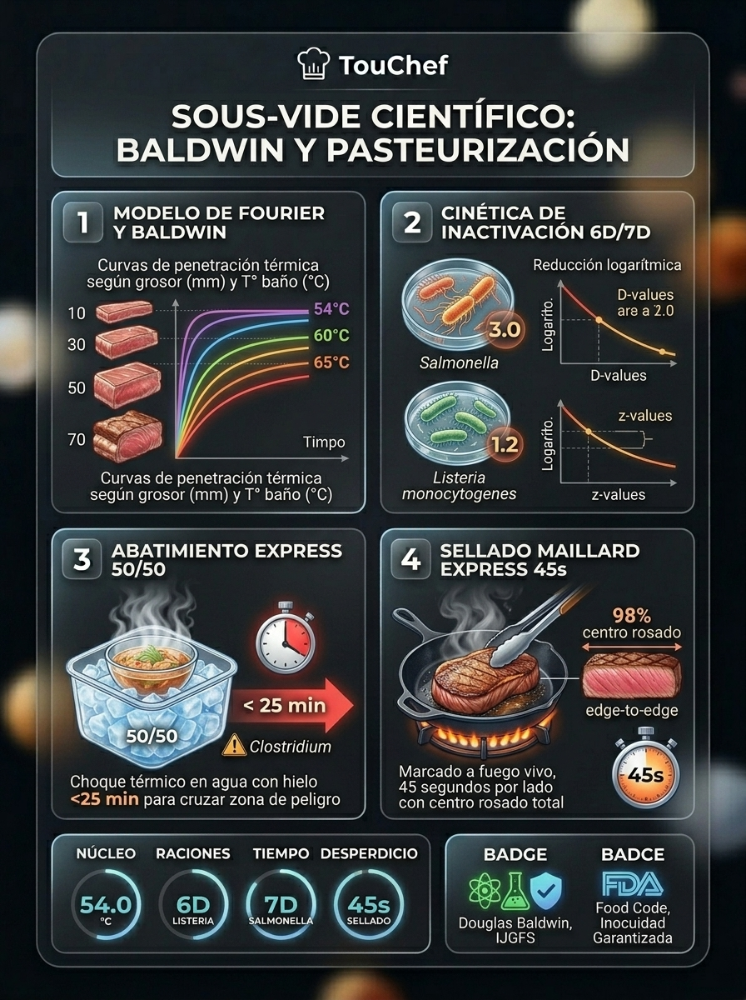
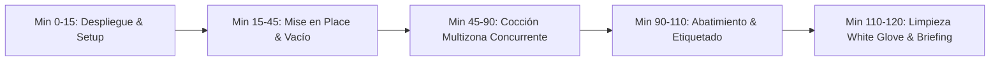
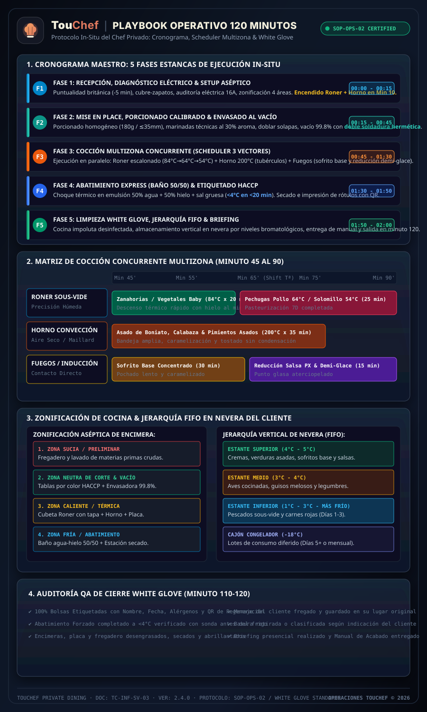
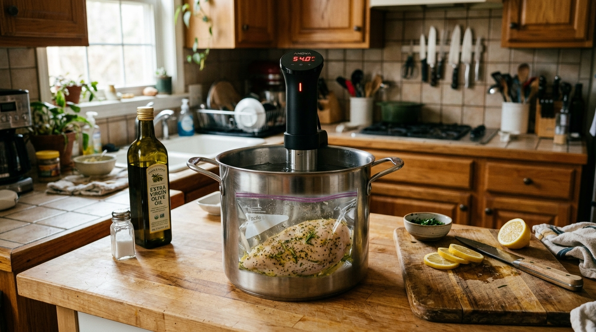
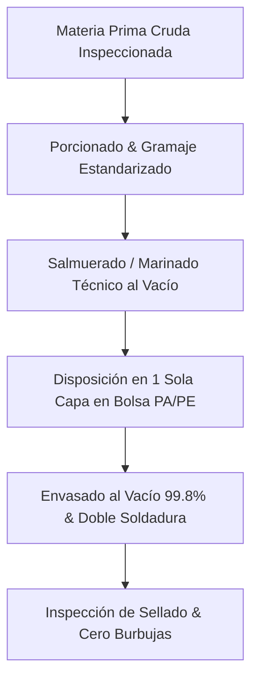
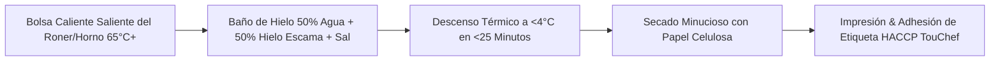
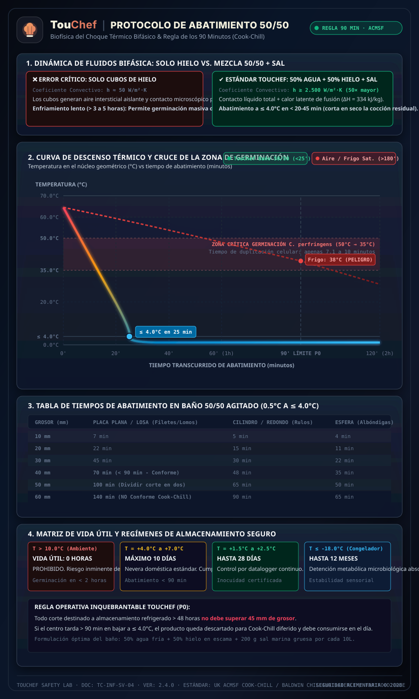
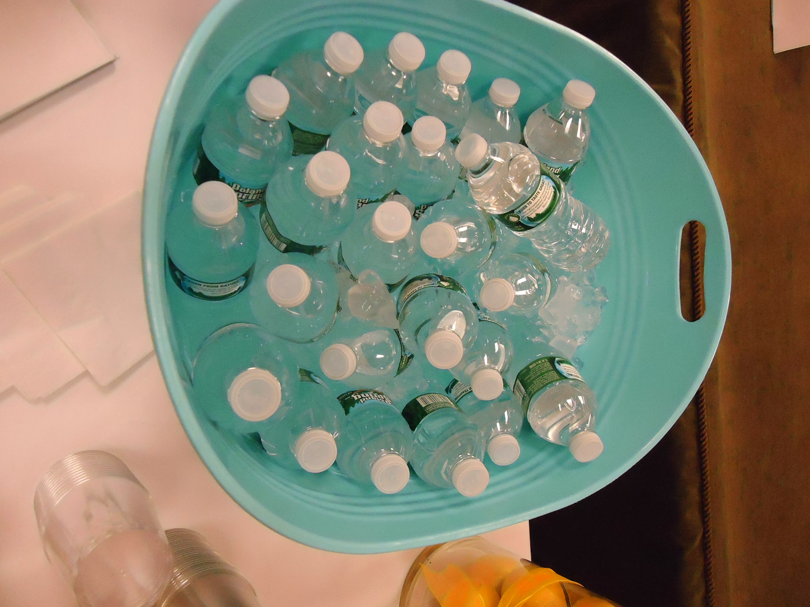

# 🍳 PROTOCOLO OPERATIVO ESTÁNDAR (SOP): SERVICIO DE CHEF PRIVADO A DOMICILIO (2 HORAS)

> 📊 **Infografía Educativa TouChef:** [Ver Infografía Técnica](assets/infografia_tecnica_sous_vide_baldwin.jpg)




**Plataforma:** TouChef 2.0 — Gastronomía de Precisión & Batch Cooking Sous-Vide  
**Documento:** `SOP-OPS-02` | **Versión:** 2.4.0  
**Área:** Operaciones Gastronómicas, Seguridad Alimentaria (HACCP) & Calidad de Servicio  
**Responsable:** Director de Operaciones Gastronómicas  
**Destinatarios:** Chefs Homologados TouChef, Coordinadores de Servicio, Auditores de Calidad  

---

## 1. RESUMEN EJECUTIVO Y FILOSOFÍA DEL SERVICIO

El servicio de **Chef Privado TouChef (Formato 120 Minutos)** está diseñado para transformar la cocina del cliente en un centro de producción culinaria de alta precisión, elaborando el menú semanal familiar completo (de 4 a 8 elaboraciones / 16 a 40 raciones individuales) bajo estándares de restaurante con estrella Michelin.

El pilar técnico del servicio es la **Cocción al Vacío a Baja Temperatura (Sous-Vide)** combinada con **Técnicas Multizona Simultáneas** (horno, inducción/gas y abatimiento térmico forzado). Esta metodología garantiza:
1. **Conservación Bromatológica Máxima:** Pasteurización en bolsa hermética que extiende la vida útil sin aditivos ni conservantes.
2. **Cero Mermas & Texturas Perfectas:** Retención del 100% de jugos, colágeno hidrolizado y vitaminas termosensibles.
3. **Eficiencia Temporal Milimétrica:** Cronograma in-situ estricto de 120 minutos con entrega de cocina impoluta (*White Glove Standard*).
4. **Experiencia de Regeneración Fricción Cero para el Cliente:** Acabado de platos en 5 minutos en el hogar sin manchar utensilios.



---

## 2. EQUIPAMIENTO TÉCNICO PORTÁTIL DEL CHEF (CHEF KIT OFICIAL)

El chef homologado debe portar obligatoriamente la dotación técnica profesional estandarizada en el maletín rígido oficial TouChef (*Flight Case Peli/Nanuk con foam termoformado*):

| Categoría | Elemento Técnico | Especificaciones Mínimas TouChef | Función Operativa |
| :--- | :--- | :--- | :--- |
| **Termorregulación** | **Roner de Inmersión Profesional** | 1200W–1800W, estabilidad térmica ±0.05°C, caudal de bomba 12 L/min (ej. *PolyScience HydroPro / Anova Pro / Sammic SmartVide*). | Mantenimiento de curvas de pasteurización homogéneas. |
| **Envasado al Vacío** | **Envasadora Profesional Portátil** | Bomba de vacío con sensor de presión real (99.8% de vacío) o doble barra de sellado ancho 5 mm de alta resistencia. | Sellado hermético sin micro-fugas ni bolsas flotantes. |
| **Contención Térmica** | **Cubeta Gastronorm GN 1/2 o GN 1/1** | Policarbonato transparente libre de BPA con camisa de neopreno aislante y tapa troquelada para Roner + bolas anti-evaporación. | Eficiencia energética, reducción de ruido y evaporación cero de agua. |
| **Metrología Térmica** | **Termómetro de Sonda Rápida & Aguja Hipodérmica** | Calibración EN 13485, precisión ±0.1°C, tiempo de respuesta <2s. Incluye rollo de cinta de silicona celular autoadhesiva (*foam tape*). | Medición de temperatura en corazón de producto sin perder el vacío. |
| **Consumibles HACCP** | **Bolsas de Vacío Certificadas Sous-Vide** | Coextrusión PA/PE de 90 a 120 micras, libres de BPA y ftalatos. Rango térmico: $-40^\circ\text{C}$ a $+115^\circ\text{C}$. | Resistencia a la punción por huesos y transferencia térmica óptima. |
| **Trazabilidad** | **Impresora Térmica Portátil / Etiquetas HACCP** | Etiquetas adhesivas impermeables resistentes a la condensación, grasa y congelador (adhesivo criogénico soluble o despegable). | Generación de rótulos estandarizados con QR de regeneración. |
| **Corte & Sanitización** | **Kit de Cuchillos Japoneses & Tablas HACCP** | Gyuto/Chef 21cm, Deshuesador flexible, Santoku, Puntilla; 3 tablas de polietileno HD codificadas por color (Roja: carnes, Azul: pescados, Verde: vegetales). | Prevención absoluta de contaminación cruzada. |
| **Higiene & EPP** | **Pack Desinfección Grado Alimentario** | Spray de alcohol isopropílico/etílico alimentario 70% sin residuo, guantes de nitrilo negro sin polvo, cofia, delantal negro bordado TouChef, 4 paños de microfibra desinfectados. | Mantenimiento del estándar aséptico en cocina ajena. |
| **Pesaje de Precisión** | **Báscula Digital de Doble Rango** | Capacidad 5 kg (resolución 1 g) y micro-báscula de precisión 500 g (resolución 0.01 g para sales de cura, especias y gomas). | Formulación exacta de salmueras, marinados y texturizantes. |


*Fotografía 2.1: Chef profesional homologado TouChef durante el servicio a domicilio, operando con el Chef Kit oficial, instrumental de precisión y recipientes herméticos bajo estándar White Glove.*

---

## 3. CRONOGRAMA OPERATIVO IN-SITU DE 120 MINUTOS (PASO A PASO)

```
[00:00] ─── FASE 1: Recepción, Diagnóstico & Setup (15 min) ───► [00:15]
[00:15] ─── FASE 2: Mise en Place, Porcionado & Envasado (30 min) ───► [00:45]
[00:45] ─── FASE 3: Cocción Multizona Concurrente (45 min) ──────► [01:30]
[01:30] ─── FASE 4: Abatimiento Express & Etiquetado (20 min) ───► [01:50]
[01:50] ─── FASE 5: Limpieza White Glove & Entrega (10 min) ─────► [02:00]
```


*Figura 3.1: Infografía vertical con el playbook operativo in-situ de 120 minutos para chefs privados TouChef: desglose de las 5 fases estancas, scheduler concurrente multizona (Roner + Horno + Inducción), zonificación aséptica de cocina, jerarquía FIFO de nevera y auditoría QA de cierre White Glove. Trazabilidad: Protocolo TouChef In-Situ Standard SOP-OPS-02.*

---

### FASE 1: RECEPCIÓN, DIAGNÓSTICO TÉCNICO Y SETUP ASÉPTICO
**Tiempo transcurrido:** Minuto 0 a 15 (15 minutos)  
**Objetivo:** Establecer el control del entorno, garantizar la seguridad eléctrica y arrancar los vectores térmicos de arranque lento.

#### 1. Protocolo de Llegada y Saludo
1. **Puntualidad Británica:** Llegada entre 5 y 10 minutos antes de la hora fijada. Tocar timbre con discreción.
2. **Saludo Institucional TouChef:** Uniforme impecable, identificación visible, cubre-zapatos desechables puestos antes de cruzar el umbral del hogar si el suelo es de parqué/moqueta delicada.
3. **Validación de Restricciones de Última Hora:** Confirmar con el cliente si hay cambios de comensales, intolerancias no declaradas o requerimientos especiales.

#### 2. Inspección Técnica Relámpago de la Cocina
- **Verificación Eléctrica:** Localizar enchufes independientes de al menos 16A para el Roner y la envasadora (evitar sobrecargar una misma regleta junto con el horno o vitrocerámica).
- **Zonificación de Encimeras:** Dividir visualmente la cocina en 4 áreas estancas:
  * **Zona Sucia / Preliminar:** Fregadero y zona de lavado de materias primas.
  * **Zona Neutra de Corte & Envasado:** Encimera principal despejada y desinfectada.
  * **Zona Caliente / Térmica:** Placa de cocción, horno y cubeta del Roner.
  * **Zona Fría / Abatimiento:** Fregadero secundario o encimera adyacente para el baño de hielo.
- **Auditoría de Frío del Cliente:** Comprobar espacio disponible en frigorífico ($<4^\circ\text{C}$) y congelador ($-18^\circ\text{C}$).

#### 3. Montaje y Puesta a Régimen Térmico Inmediata
1. **Llenado del Roner:** Llenar la cubeta GN con agua templada/caliente del grifo (ahorra hasta 10 min de calentamiento) hasta la marca *MAX*.
2. **Programación Inicial del Roner:**
   * Si el menú incluye vegetales de alta temperatura: Programar a $84.0^\circ\text{C}$.
   * Si el menú es prioritariamente carnes/pescados: Programar a la temperatura de la proteína principal (ej. $64.0^\circ\text{C}$ para aves o $54.0^\circ\text{C}$ para carnes rojas).
   * Colocar las bolas anti-evaporación y tapa aislante.
3. **Precalentamiento de Horno:** Si hay verduras asadas o asados en bloque, encender a $200^\circ\text{C}$ con convección/ventilador.
4. **Sanitización Inicial:** Rociar encimeras y tablas con alcohol alimentario al 70%, pasar bayeta estéril de microfibra y colocarse guantes de nitrilo.

> [!IMPORTANT]
> **Regla de Oro del Minuto 10:** El Roner y el horno DEBEN estar encendidos y calentando antes de que el reloj marque el minuto 10. Cada minuto de retraso en el encendido penaliza el tiempo de cocción efectiva.


*Fotografía 2.2: Puesta en marcha del Roner de inmersión en cubeta transparente de policarbonato para la cocción sous-vide del menú semanal con control de agitación continua.*

---

### FASE 2: MISE EN PLACE, PORCIONADO Y ENVASADO AL VACÍO
**Tiempo transcurrido:** Minuto 15 a 45 (30 minutos)  
**Objetivo:** Transformar la materia prima cruda en bolsas perfectamente calibradas, sazonadas y selladas herméticamente.



#### 1. Protocolo de Corte y Porcionado Homogéneo
- **Carnes Rojas (Solomillo, Lomo, Entrecot):** Porcionar en medallones de grosor idéntico ($\approx 3.5\text{ cm}$, $180\text{–}200\text{ g}$). El grosor uniforme es el parámetro crítico para tiempos de transferencia térmica sous-vide.
- **Aves (Pechugas de pollo campero, Pavo):** Limpiar ternillas, perfilar a $180\text{ g}$ por unidad. Opcional: Salmuera rápida al 6% (agua, sal marina, piel de limón, tomillo) durante el vacío.
- **Pescados (Salmón, Merluza, Bacalao):** Cortes limpios sin espinas de $160\text{–}180\text{ g}$. Curado previo express en sal y azúcar (90/10) durante 8 minutos para compactar albúmina y lavar bajo agua fría.
- **Vegetales de Raíz (Zanahorias, Boniato, Calabaza):** Corte en dados regulares *mirepoix* o bastones homogéneos de $2\text{ cm}$ para garantizar cocción uniforme.

#### 2. Adobos, Grasas Conductoras y Aromáticos
- En sous-vide, los aromas se multiplican por 3 debido a la ausencia de evaporación.
- **Regla de Aromáticos TouChef:** Usar solo el 30% del ajo o hierbas que se usarían en cocina tradicional. Añadir siempre una grasa conductora de calidad: AOVE virgen extra, mantequilla clarificada *ghee* o grasa de pato (10-15 ml por bolsa de 400 g).
- **Prohibición de Alcohol Crudo:** Nunca añadir vinos o licores sin reducir previamente en un cazo para evaporar el alcohol etílico; de lo contrario, el gas residual inflará la bolsa en la cocción.

#### 3. Técnica de Envasado al Vacío Profesional
1. Doblar el borde superior de la bolsa hacia afuera $3\text{ cm}$ antes de introducir el alimento para mantener la zona de sellado 100% limpia de grasas o humedad.
2. Disponer los alimentos en **una sola capa plana** (nunca superpuestos ni amontonados).
3. Desplegar el borde de la bolsa y colocar en la barra de sellado.
4. Aplicar vacío máximo (grado 99.8% para carnes duras y verduras; 95% con pulso para pescados delicados para no aplastar fibras).
5. **Doble Soldadura:** Inspeccionar visualmente la línea de sellado: debe ser completamente transparente, recta, sin arrugas ni burbujas atrapadas.


*Fotografía 2.3: Bolsas multicapa selladas al vacío con salmón fresco y hierbas aromáticas, acondicionadas en monocapa homogénea para asegurar una penetración térmica uniforme.*

---

### FASE 3: COCCIÓN SIMULTÁNEA MULTIZONA (SCHEDULER CONCURRENTE)
**Tiempo transcurrido:** Minuto 45 a 90 (45 minutos)  
**Objetivo:** Maximizar el rendimiento térmico ejecutando 3 matrices de calor en paralelo sin sobrepasar la carga cognitiva del chef.

```mermaid
gantt
    title Matriz de Cocción Concurrente Multizona (Minuto 45 al 90)
    dateFormat X
    axisFormat %s min
    section Roner Sous-Vide
    Vegetales Alta Tª (84°C / 20 min) :active, r1, 45, 65
    Pechugas & Aves (64°C / 25 min)   :r2, 65, 90
    Solomillo / Vacuno (54°C / 25 min) :r3, 65, 90
    section Horno Convección
    Asado de Boniato & Verduras Asadas :h1, 45, 80
    Puerros y Pimientos Asados        :h2, 50, 85
    section Fuegos / Inducción
    Sofrito Base Concentrado (45 min)  :f1, 45, 75
    Reducción Salsa PX / Demi-Glace    :f2, 60, 85
    Mantecado de Arroz / Legumbre      :f3, 75, 90
```



#### 1. Matriz de Asignación Térmica Multizona

| Zona Térmica | Equipamiento | Tipo de Elaboraciones | Control Crítico de Proceso (CCP) |
| :--- | :--- | :--- | :--- |
| **Zona 1: Precisión Húmeda** | Roner Sous-Vide | - Proteínas delicadas (Pescados 50°C, Solomillo 54°C, Aves 64°C)<br>- Verduras glaseadas (84°C) | Sumergir completamente. Usar pesas de acero inoxidable si la bolsa flota por gases vegetales. |
| **Zona 2: Aire Seco / Maillard** | Horno del Cliente ($190\text{–}210^\circ\text{C}$) | - Tubérculos caramelizados en bloque<br>- Verduras mediterráneas asadas<br>- Huesos y recortes para fondo | Distribución en bandejas amplias con papel sulfurizado. No saturar para evitar condensación. |
| **Zona 3: Contacto Directo** | Fuegos / Sartenes / Cazuelas | - Sofritos tradicionales de larga caramelización<br>- Reducción de caldos concentrados y fondos<br>- Guisos melosos en olla rápida | Control de potencia media-baja. Desglasado constante con vino reducido o caldo. |

#### 2. Escalonamiento Térmico en el Roner (Técnica de Descenso Térmico)
Si se cocinan productos de diferentes temperaturas en un solo Roner:
1. **Paso 1 (Min 45-65):** Iniciar con las elaboraciones de mayor temperatura (ej. Zanahorias baby a la mantequilla y tomillo a $84.0^\circ\text{C}$ durante 20 min).
2. **Paso 2 (Min 65):** Retirar los vegetales, añadir agua fría/hielo a la cubeta para descender la temperatura rápidamente a $64.0^\circ\text{C}$ en 60 segundos.
3. **Paso 3 (Min 66-90):** Introducir pechugas de pollo campero ($64.0^\circ\text{C}$) y cocer durante 24 minutos para alcanzar pasteurización completa de 7D para *Listeria/Salmonella*.
4. *Opcional:* Si hay lomos de ternera a $54.0^\circ\text{C}$, bajar la temperatura al minuto 70 para el bloque cárnico.

> [!CAUTION]
> **Alerta Bromatológica de Pasteurización:** Cualquier carne de ave cocinada sous-vide DEBE alcanzar un mínimo de $63.5^\circ\text{C}$ en corazón mantenida durante al menos 18 minutos o $65.0^\circ\text{C}$ durante 3 minutos para certificar la reducción logarítmica 7D requerida por sanidad.

---

### FASE 4: ABATIMIENTO TÉRMICO EXPRESS Y ETIQUETADO FORMAL
**Tiempo transcurrido:** Minuto 90 a 110 (20 minutos)  
**Objetivo:** Cortar en seco la cocción residual, atravesar la zona de peligro bacteriano ($60^\circ\text{C} \to 10^\circ\text{C}$) en tiempo récord y generar la trazabilidad legal y operativa.




*Figura 3.2: Infografía vertical técnica del protocolo de choque térmico en salmuera de agua y hielo al 50/50 ($h \ge 2.500\text{ W}/(\text{m}^2\cdot\text{K})$): curva de enfriamiento rápido, corte de la zona de germinación de C. perfringens ($50^\circ\text{C} \to 35^\circ\text{C}$), tabla de tiempos por grosor y matriz de conservación. Trazabilidad: [Douglas Baldwin Chilling Tables](https://douglasbaldwin.com/sous-vide.html#Chilling) / [UK ACMSF Guidelines](https://acmsf.food.gov.uk).*


*Fotografía 2.4: Abatimiento térmico forzado de las bolsas en baño de choque con agua y hielo, interrumpiendo la cocción residual y garantizando la inocuidad antes del almacenaje.*

#### 1. Protocolo de Abatimiento Forzado (Ice-Water Bath)
1. **Preparación del Baño:** En una cubeta o fregadero desinfectado, preparar una emulsión térmica compuesta por:
   * **50% Hielo en cubos/escama**
   * **50% Agua fría de red**
   * **200 g de sal gruesa** (para reducir el punto de fusión del agua a $-2^\circ\text{C}$).
2. **Inmersión Inmediata:** Extraer las bolsas del Roner y sumergirlas directamente en el baño de agua helada. Agitar suavemente para recircular el fluido.
3. **Tiempo de Abatimiento:**
   * Bolsas de pescado y vegetales finos ($<2\text{ cm}$): 10 minutos.
   * Bolsas de carne y aves ($3\text{–}4\text{ cm}$): 18-20 minutos.
4. **Verificación:** Medir la superficie exterior con termómetro infrarrojo o sonda de superficie: debe marcar $<4.0^\circ\text{C}$.

#### 2. Secado e Inspección de Bolsas
- Extraer cada bolsa del baño helado y secar minuciosamente con papel de celulosa desechable.
- Verificar integridad estructural: ausencia total de pinchazos, micro-fisuras o pérdida de vacío.

#### 3. Etiquetado Estandarizado TouChef (Reglamento UE 1169/2011)
Cada bolsa debe lucir una etiqueta técnica autoadhesiva generada en el acto:

```
┌────────────────────────────────────────────────────────┐
│  🍳 TOUCHEF — GASTRONOMÍA PRIVADA DE PRECISIÓN         │
├────────────────────────────────────────────────────────┤
│ PLATO: Solomillo de Ternera Madurado al Romero         │
│ RACIONES: 2 Raciones (380 g netos)                     │
│ FECHA COCINA: 19/08/2026 11:45h  | CHEF ID: #TC-084    │
├────────────────────────────────────────────────────────┤
│ ALÉRGENOS: [NINGUNO / Contiene Lácteos (Mantequilla)]  │
├────────────────────────────────────────────────────────┤
│ REGENERACIÓN SUGERIDA:                                 │
│ 1. Baño caliente: Sumergir bolsa 5 min a 55-60°C.      │
│ 2. Marcado sartén: 45 seg/lado con mantequilla y AOVE. │
├────────────────────────────────────────────────────────┤
│ CADUCIDAD:                                             │
│ 🟢 Nevera (2°C - 4°C): Consumir antes de 24/08/2026    │
│ 🔴 Congelador (-18°C): Consumir antes de 19/11/2026    │
└────────────────────────────────────────────────────────┘
```

---

### FASE 5: LIMPIEZA INTEGRAL "WHITE GLOVE", BRIEFING Y ALMACENAMIENTO
**Tiempo transcurrido:** Minuto 110 a 120 (10 minutos)  
**Objetivo:** Dejar la cocina más limpia y ordenada que al entrar, ordenar la nevera del cliente bajo criterio FIFO y realizar la entrega de valor.

#### 1. Protocolo de Limpieza "White Glove Standard"
1. **Fregado y Sanitización de Menaje:** Lavar a mano o cargar en lavavajillas todo el menaje utilizado del cliente. Ningún cubierto o sartén queda sucio en el fregadero.
2. **Encimeras y Placa de Cocción:** Desengrasar con producto ecológico neutro, retirar restos, secar y abrillantar con microfibra limpia.
3. **Suelos:** Barrido rápido y pasada de mopa húmeda si hubo alguna salpicadura accidental.
4. **Gestión de Residuos:** Clasificación estricta de basuras (orgánico, plástico, papel/vidrio) en las bolsas del cliente o retiradas por el chef según preferencia acordada.

#### 2. Zonificación y Almacenamiento en Frigorífico (Criterio FIFO / HACCP)
Organizar las bolsas en la nevera del cliente siguiendo la estricta jerarquía bromatológica:

```mermaid
graph TD
    subgraph Nevera del Cliente (Organización Vertical)
        top[ESTANTE SUPERIOR: Elaboraciones Listas, Cremas & Vegetales Asados]
        mid[ESTANTE MEDIO: Guisos Melosos, Legumbres & Aves Cocinadas]
        bot[ESTANTE INFERIOR: Pescados al Vacío & Carnes Rojas Pasteurizadas]
        freezer[CAJÓN CONGELADOR -18°C: Lotes de Consumo Día 5+]
    end
```

- **Estante Inferior (Zona más fría 1-3°C):** Pescados sous-vide y carnes de vacuno para consumo en días 1 a 3.
- **Estante Medio (3-4°C):** Aves, guisos concentrados y legumbres preparadas.
- **Estante Superior (4-5°C):** Verduras asadas, sofritos base, salsas y cremas.
- **Congelador ($-18^\circ\text{C}$):** Raciones destinadas a días 4 en adelante si el menú contratado supera los 4 días de cobertura.

#### 3. Briefing Presencial y Entrega del Manual
1. Invitar al cliente a la cocina (o reunirse en el salón).
2. Presentar verbalmente las elaboraciones realizadas, explicando el menú y los secretos de acabado.
3. Hacer entrega en mano del **`03_manual_cliente_acabado_y_regeneracion.md`** (versión física plastificada o enlace digital a la app TouChef).
4. Resolver cualquier duda sobre el marcado de la carne o la temperatura de regeneración.
5. Despedida cordial, agradecimiento y salida en el minuto 120 exacto.

---

## 4. CHECKLIST OPERATIVO DE CONTROL (QA AUDIT SHEET)

El chef debe marcar mentalmente o en la App de Chef este checklist antes de abandonar la vivienda:

```markdown
- [ ] ¿Roner y cubeta vaciados, secados y guardados en el maletín?
- [ ] ¿Encimeras, placas de inducción/gas y fregaderos secos y desinfectados?
- [ ] ¿100% de las bolsas etiquetadas con Nombre, Fecha, Alérgenos y Caducidad?
- [ ] ¿Se realizó el abatimiento a <4°C antes de guardar en la nevera?
- [ ] ¿Se colocó cada elaboración en el estante de nevera correspondiente?
- [ ] ¿Se entregó el Manual de Regeneración al cliente y se explicaron las dudas?
- [ ] ¿La basura ha sido recogida y clasificada?
```

---

## 5. GESTIÓN DE INCIDENCIAS IN-SITU Y PLANES DE CONTINGENCIA

| Incidencia In-Situ | Causa Raíz Posible | Acción Inmediata del Chef (Protocolo TouChef) |
| :--- | :--- | :--- |
| **Salto de Automático / Plomo Eléctrico** | Sobrecarga al encender Roner + Horno en la misma línea. | Desconectar Roner. Cambiarlo a un enchufe de circuito independiente (ej. enchufe de lavadora o salón con alargador profesional de 2.5mm²). Rearmar cuadro. |
| **Micro-Fuga en Bolsa durante Sous-Vide** | Hueso afilado o sellado defectuoso. | Retirar bolsa inmediatamente. Secar producto, transferir a bolsa nueva con funda protectora de hueso (*bone guard*) y volver a envasar con doble sellado. |
| **Falta de Hielo en Domicilio del Cliente** | El cliente no preparó cubiteras ni bolsas de hielo. | Usar agua fría corriente a flujo continuo en el fregadero con tapón puesto y recipientes acumuladores de frío del maletín del chef (*ice packs* de alta densidad). |
| **Espacio Insuficiente en Nevera** | Frigorífico del cliente saturado de productos previos. | Reordenar amablemente optimizando volumen en bandejas compactas y consultar al cliente para mover productos perecederos no prioritarios. |

---
**TouChef Operations Department** — *Excelencia Culinaria, Seguridad Absoluta e Innovación en Cada Hogar.*
