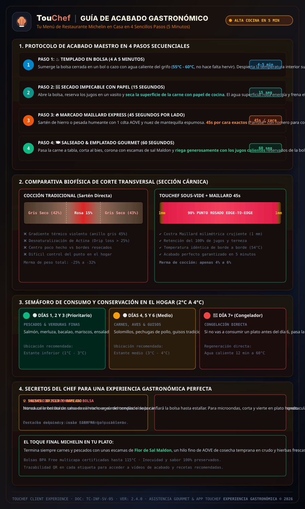
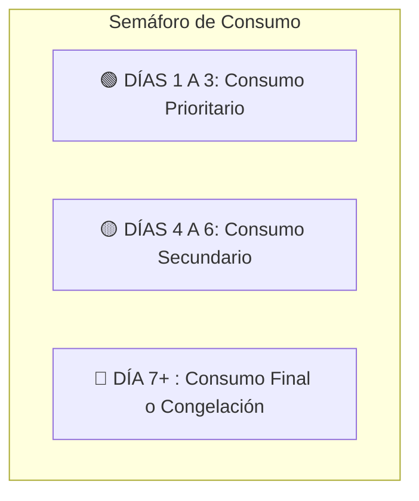
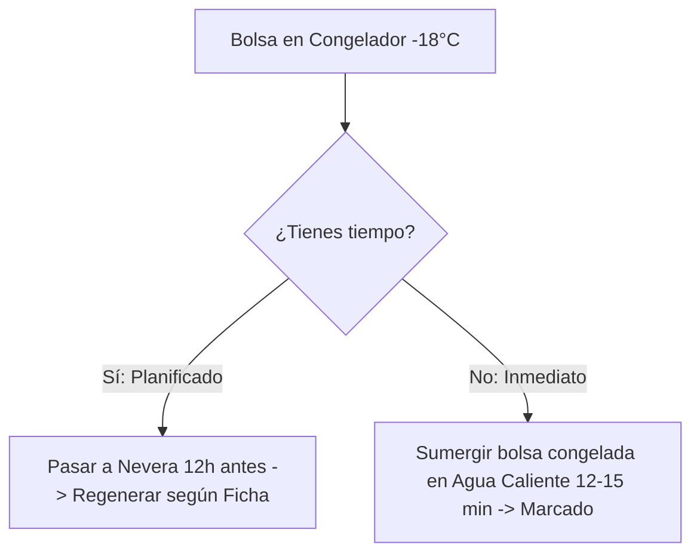

# 🍽️ GUÍA DE ALTA GASTRONOMÍA: MANUAL DE ACABADO, REGENERACIÓN Y EMPLATADO
**TouChef Experience** — *Tu Menú de Restaurante con Estrella Michelin en 5 Minutos, en Tu Propia Mesa.*  
**Documento:** `CLIENT-MANUAL-03` | **Edición Hogar:** 2.4.0  
**Área:** Experiencia de Cliente & Gastronomía de Precisión  

---

## 🌟 BIENVENIDO A LA GASTRONOMÍA SOUS-VIDE EN TU HOGAR

Tu Chef Privado ha elaborado y pasteurizado en tu cocina un conjunto de platos de alta precisión utilizando la técnica **Sous-Vide (Cocción al Vacío a Baja Temperatura)**.

Gracias a este sistema:
- ✅ **Cocción Perfecta de Borde a Borde:** La carne o el pescado nunca están pasados por fuera ni crudos por dentro.
- ✅ **100% Nutrientes & Jugos Retenidos:** Cero evaporación, sabores concentrados y máxima terneza.
- ✅ **Sin Ensuciar:** El 90% de los platos se regeneran directamente dentro de su bolsa hermética en agua caliente.
- ✅ **Velocidad:** En solo **5 a 10 minutos**, disfrutarás de un plato recién terminado con textura y temperatura óptimas.



*Figura 1.1: Infografía vertical educativa para el cliente con el protocolo de acabado gastronómico en 4 pasos (1. Templado en bolsa a $55\text{–}60^\circ\text{C}$ + 2. Secado con papel + 3. Sellado Maillard de 45s por lado + 4. Salseado & Emplatado), comparativa de corte transversal (Tradicional 45% gris vs. TouChef 98% rosado de borde a borde), semáforo de conservación (Verde D1-3, Amarillo D4-6, Rojo D7+ congelación) y secretos del chef. Trazabilidad: [Douglas Baldwin Sous-Vide Guide / Reacción de Maillard (140°C–165°C)](https://douglasbaldwin.com/sous-vide.html).*


*Fotografía 3.1: Resultado gourmet en casa: corte transversal con textura sedosa, jugosidad intacta y punto rosado homogéneo de borde a borde ($54.0^\circ\text{C}$) obtenido tras el templado y sellado de precisión.*

---

## 🎛️ LAS 4 TÉCNICAS UNIVERSALES DE REGENERACIÓN

| Método | Cómo Funciona | Ideal Para | Equipamiento Necesario |
| :--- | :--- | :--- | :--- |
| **1. Baño Caliente en Bolsa** *(El Método Maestro)* | Se sumerge la bolsa cerrada en agua caliente del grifo o cazo a $55\text{–}60^\circ\text{C}$ durante 5-8 min. No sobrecocina jamás. | Carnes rojas, pescados, cremas, purés, salsas. | Cazo o bol grande con agua caliente. |
| **2. Marcado Maillard Express** | Golpe ultra-rápido en sartén de hierro o antiadherente humeante (45 seg por lado) con una nuez de mantequilla o AOVE. | Cortes de carne, aves con piel, chuletas, salmón. | Sartén bien caliente + pinzas. |
| **3. Golpe de Horno / Airfryer** | Extracción de la bolsa y golpe de aire caliente a $200^\circ\text{C}$ durante 3 a 5 min. | Hortalizas asadas, boniato crujiente, aves gratinadas. | Horno precalentado o Airfryer. |
| **4. Ligado Directo en Cazo** | Verter el contenido de la bolsa en un cazo pequeño a fuego medio y remover suavemente con varilla o cuchara. | Guisos melosos, carrilleras, estofados, legumbres. | Cazo pequeño. |

---

## 📖 FICHAS DE ACABADO: 8 CATEGORÍAS DE PLATOS TOUCHEF

---

### FICHA 1: CARNES ROJAS NOBLES (Solomillo de Ternera, Entrecot Madurado, Lomo de Vaca)
*Punto de partida: Ya cocinado al punto perfecto ($54.0^\circ\text{C}$) en vacío.*

```
 ┌────────────────────────────────────────────────────────────────────────┐
 │ ⏱️ TIEMPO TOTAL: 6 MINUTOS | 🍳 DIFICULTAD: MUY FÁCIL                  │
 └────────────────────────────────────────────────────────────────────────┘
```

1. **Templado en Bolsa (4-5 min):** Llena un cazo grande con agua muy caliente del grifo (unos $55\text{–}60^\circ\text{C}$, no hace falta hervir). Sumerge la bolsa sin abrir durante 5 minutos para que la carne recupere temperatura hasta el corazón.
2. **Secado Impecable:** Abre la bolsa con tijeras y extrae el corte sobre un plato. **Seca la superficie con papel de cocina** (la humedad impide el dorado). Reserva los jugos de la bolsa.
3. **Marcado Maillard de Alta Temperatura (45 seg por lado):**
   * Calienta una sartén de hierro colado o sartén pesada a fuego vivo hasta que humee ligeramente.
   * Añade 1 cucharadita de aceite de oliva virgen extra y una nuez de mantequilla.
   * Coloca el medallón: **45 segundos exactos por cara** hasta crear una costra dorada y crujiente.
   * *Opcional Chef:* Añade una ramita de romero o tomillo a la mantequilla espumosa y baña la carne con una cuchara (*arrosé*).
4. **Acabado & Emplatado:** Pasa la carne a la tabla, corta en medallones gruesos, añade escamas de sal Maldon y vierte por encima los jugos calientes de la bolsa.


*Fotografía 3.2: Marcado Maillard express en sartén de hierro fundido a fuego vivo con mantequilla espumosa y hierbas aromáticas, logrando caramelización superficial sin alterar el punto térmico interior.*

> [!TIP]
> **El Secreto del Chef:** No dejes la carne más de 1 minuto por lado en la sartén; la carne ya está en su punto perfecto en el interior y solo buscamos caramelizar la corteza exterior.

---

### FICHA 2: AVES JUGOSAS & CONFITADOS (Pechuga de Pollo Campero, Magret de Pato, Pavo al Romero)
*Punto de partida: Textura ultrasuave y pasteurizada a $64.0^\circ\text{C}$.*

```
 ┌────────────────────────────────────────────────────────────────────────┐
 │ ⏱️ TIEMPO TOTAL: 5 MINUTOS | 🍳 DIFICULTAD: FÁCIL                     │
 └────────────────────────────────────────────────────────────────────────┘
```

1. **Opción A (Sartén Crujiente):**
   * Templar la bolsa en agua caliente 4 minutos.
   * Abrir y secar la piel o superficie.
   * Dorar en sartén a fuego medio-alto durante 90 segundos por el lado de la piel hasta que quede crujiente como un cristal, y 30 segundos por el reverso.
2. **Opción B (Airfryer Express):**
   * Extraer la pieza directamente de la nevera o de la bolsa templada.
   * Introducir en la Airfryer a $200^\circ\text{C}$ durante **3 a 4 minutos**.
3. **Emplatado:** Filetear al bies (en diagonal) para lucir la jugosidad interior y acompañar de su guarnición de verduras o puré.

---

### FICHA 3: GUISOS TRADICIONALES & MELOSOS (Carrilleras de Ibérico, Rabo de Toro, Ternera Mechada)
*Punto de partida: Colágeno totalmente fundido tras 16 horas sous-vide a $74^\circ\text{C}$.*

```
 ┌────────────────────────────────────────────────────────────────────────┐
 │ ⏱️ TIEMPO TOTAL: 4 MINUTOS | 🍳 DIFICULTAD: MUY FÁCIL                  │
 └────────────────────────────────────────────────────────────────────────┘
```

1. **Regeneración en Cazo (Recomendado para brillo de salsa):**
   * Corta la esquina superior de la bolsa y vierte la carne junto con toda su salsa en un cazo pequeño.
   * Calienta a fuego medio-suave durante 3 a 4 minutos.
   * Con una cuchara, baña la carne continuamente con la salsa. Verás cómo la salsa se reduce y adquiere una textura *nappe* brillante y aterciopelada.
2. **Regeneración Microondas Express:**
   * Verter en un plato hondo o bol apto, tapar con campana y calentar a 700W durante 2 minutos y medio.
3. **Emplatado:** Servir sobre una base de puré de patata trufado o arroz jazmín, coronando con cebollino fresco picado.

---

### FICHA 4: PESCADOS NOBLES (Lomo de Salmón, Merluza de Pincho, Bacalao Confitado)
*Punto de partida: Fibras intactas y sedosas cocinadas a $50.0\text{–}52.0^\circ\text{C}$.*

```
 ┌────────────────────────────────────────────────────────────────────────┐
 │ ⏱️ TIEMPO TOTAL: 6 MINUTOS | 🍳 DIFICULTAD: FÁCIL                     │
 └────────────────────────────────────────────────────────────────────────┘
```

1. **Baño de Agua Caliente (El único método que respeta el pescado):**
   * Llena un bol con agua caliente del grifo (a unos $50\text{–}52^\circ\text{C}$).
   * Introduce la bolsa cerrada durante **6 a 7 minutos**. El calor penetrará suavemente sin expulsar la albúmina ni resecar las lascas de pescado.
2. **Acabado de Piel Crujiente (Opcional):**
   * Abre la bolsa con cuidado (el pescado está extremadamente tierno).
   * Pasa la piel por una sartén antiadherente con unas gotas de aceite durante **45 segundos solo por el lado de la piel**.
3. **Emplatado:** Servir con espátula ancha. Añadir un hilo de aceite de oliva virgen extra en crudo y flor de sal.

> [!WARNING]
> **¡Cuidado con el Microondas!** Nunca calientes pescados delicados en el microondas: romperá la emulsión natural del pescado y sobrecocinará las proteínas en segundos. Usa siempre el baño caliente en bolsa.

---

### FICHA 5: TUBÉRCULOS Y HORTALIZAS CARAMELIZADAS (Boniato Asado, Calabaza al Romero, Zanahorias Baby)
*Punto de partida: Corazón tierno y azúcares caramelizados.*

```
 ┌────────────────────────────────────────────────────────────────────────┐
 │ ⏱️ TIEMPO TOTAL: 5 MINUTOS | 🍳 DIFICULTAD: MUY FÁCIL                  │
 └────────────────────────────────────────────────────────────────────────┘
```

1. **Acabado en Horno o Airfryer (Textura Rústica Crujiente):**
   * Precalienta la Airfryer a $200^\circ\text{C}$ (o el horno en función Grill/Convección a $210^\circ\text{C}$).
   * Abre la bolsa y vuelca las verduras en la cesta o bandeja sobre papel de horno.
   * Hornea durante **4 a 5 minutos** hasta que los bordes adquieran un tostado crujiente y aromático.
2. **Acabado en Sartén Salteada:**
   * Saltear a fuego vivo en sartén con una nuez de mantequilla durante 3 minutos.
3. **Emplatado:** Ideal como guarnición de carnes o como plato principal vegetariano con un toque de queso feta desmenuzado y pipas de calabaza tostadas.

---

### FICHA 6: VERDURAS VERDES AL DENTE (Brócoli al Vapor, Espárragos Verdes, Tirabeques)
*Punto de partida: Clorofila fijada, color verde esmeralda vibrante y textura crocante.*

```
 ┌────────────────────────────────────────────────────────────────────────┐
 │ ⏱️ TIEMPO TOTAL: 3 MINUTOS | 🍳 DIFICULTAD: MUY FÁCIL                  │
 └────────────────────────────────────────────────────────────────────────┘
```

1. **Salteado Wok / Sartén Express:**
   * Pon una sartén o wok a fuego máximo con una cucharada de aceite de oliva virgen extra.
   * Abre la bolsa y saltea las verduras a fuego vivo durante **90 a 120 segundos**.
   * Queremos que tomen temperatura rápidamente manteniendo el crujiente interior intacto.
2. **Sazonado Final:** Terminar con unas escamas de sal Maldon, ralladura fina de limón y pimienta negra recién molida.

---

### FICHA 7: LEGUMBRES TRADICIONALES & ARROCES/GRANOS (Lentejas Estofadas, Garbanzos Melosos, Risottos Base)
*Punto de partida: Grano entero sin hollejos sueltos y fondo hiperconcentrado.*

```
 ┌────────────────────────────────────────────────────────────────────────┐
 │ ⏱️ TIEMPO TOTAL: 4 MINUTOS | 🍳 DIFICULTAD: MUY FÁCIL                  │
 └────────────────────────────────────────────────────────────────────────┘
```

1. **Regeneración y Despertado de la Salsa:**
   * Vierte el contenido de la bolsa en un cazo.
   * Añade **2 cucharadas de agua o caldo caliente** (las legumbres y arroces absorben humedad en frío).
   * Calienta a fuego medio durante 3-4 minutos removiendo en vaivén.
2. **Mantecado Gourmet:**
   * Apaga el fuego, añade un hilo de aceite de oliva virgen extra en crudo o 10 g de mantequilla fría y mueve el cazo en círculos para emulsionar el caldo.
3. **Emplatado:** Servir en plato hondo bien caliente, coronando con unas gotas de vinagre de Jerez (para lentejas) o queso Parmigiano Reggiano rallado al momento (para risottos).

---

### FICHA 8: SALSAS EMULSIONADAS & FONDOS CONCENTRADOS (Demi-Glace de Ternera, Salsa Trufada, Reducción Pedro Ximénez)
*Punto de partida: Fondos oscuros reducidos al punto glasa.*

```
 ┌────────────────────────────────────────────────────────────────────────┐
 │ ⏱️ TIEMPO TOTAL: 2 MINUTOS | 🍳 DIFICULTAD: INMEDIATA                  │
 └────────────────────────────────────────────────────────────────────────┘
```

1. **Baño María en Bolsa:** Introduce la bolsita de salsa directamente en la misma agua caliente donde estás regenerando la carne o verdura durante **3 minutos**.
2. **Apertura y Napeado:** Corta una pequeña esquina de la bolsa para usarla como una manga pastelera de precisión y salsea directamente el plato justo antes de servir.

---

## 🚦 SEMÁFORO DE CONSERVACIÓN Y SEGURIDAD BROMATOLÓGICA

Tus platos han sido envasados al vacío y pasteurizados siguiendo el estándar sanitario de TouChef. Conserva las bolsas sin abrir en la nevera a una temperatura de entre **$2^\circ\text{C}$ y $4^\circ\text{C}$**.



| Nivel de Semáforo | Plazos en Nevera (2°C - 4°C) | Alimentos Incluidos | Instrucciones de Conservación |
| :---: | :--- | :--- | :--- |
| 🟢 **VERDE**<br>*Consumo Prioritario* | **Días 1, 2 y 3** tras el servicio del chef. | - Pescados frescos y mariscos.<br>- Ensaladas templadas y hojas verdes.<br>- Emulsiones finas y verduras al dente. | Mantener en el estante inferior (zona más fría del frigorífico). Consumir en primer lugar. |
| 🟡 **AMARILLO**<br>*Consumo Medio* | **Días 4, 5 y 6** tras el servicio del chef. | - Carnes rojas pasteurizadas.<br>- Pechugas y cortes de ave.<br>- Guisos tradicionales y legumbres.<br>- Cremas de verduras y tubérculos asados. | Perfectamente estables en vacío. No abrir la bolsa hasta el momento exacto de su regeneración. |
| 🔴 **ROJO**<br>*Fecha Límite* | **Día 7 en adelante** | - Cualquier elaboración restante. | Si no vas a consumir un plato antes del día 6, **introdúcelo directamente al congelador ($-18^\circ\text{C}$)** dentro de su bolsa original sin abrir. |


*Fotografía 3.3: Acondicionamiento profesional en bolsas termoselladas al vacío: raciones individuales etiquetadas listas para conservar en frío óptimo ($2^\circ\text{C}\text{--}4^\circ\text{C}$) o regenerar directamente en baño caliente.*

---

## ❄️ GUÍA DE CONGELACIÓN Y DESCONGELACIÓN SEGURA TOUCHEF

Las bolsas profesionales TouChef son 100% aptas para congelación criogénica y resisten temperaturas de hasta $-40^\circ\text{C}$ sin quemaduras por frío.



### 1. Descongelación Lenta en Nevera (Recomendada)
- Pasa la bolsa del congelador al frigorífico la noche anterior (aproximadamente 10-12 horas).
- Una vez descongelada en frío, sigue las instrucciones habituales de la Ficha del plato.

### 2. Regeneración Directa desde el Congelador (Express)
- ¿Se te olvidó descongelar? ¡No hay problema!
- Sumerge la bolsa directamente congelada en un cazo con agua caliente a $60^\circ\text{C}$ durante **12 a 15 minutos**.
- Abre la bolsa, seca la pieza y dale el marcado final en sartén caliente. El resultado es idéntico a recién cocinado.

---

## ❓ PREGUNTAS FRECUENTES DEL CLIENTE (FAQ)

**P: ¿Puedo calentar la comida dentro de la bolsa en el microondas?**  
*R:* No. Las bolsas de vacío no deben introducirse en el microondas porque el vapor interno hinchará la bolsa hasta hacerla estallar. Para microondas, corta la bolsa y vierte el contenido en un plato hondo.

**P: ¿El plástico de las bolsas es seguro para la salud?**  
*R:* Absolutamente. TouChef utiliza exclusivamente bolsas certificadas para uso alimentario y cocción a alta temperatura, compuestas de Poliamida/Polietileno (PA/PE) de 100 micras, libres de Bisfenol A (BPA Free), ftalatos y microplásticos.

**P: La salsa dentro de la bolsa se ve gelatinosa o solidificada en la nevera, ¿es normal?**  
*R:* ¡Es la mejor señal de calidad! Significa que el chef ha extraído el colágeno natural de los huesos y cortes nobles mediante cocción lenta. Al calentar la salsa durante 1 minuto, volverá a licuarse con un brillo y untuosidad inigualables.

---
**TouChef Client Experience** — *Disfruta de la mejor cocina en la comodidad de tu hogar.*  
📞 **Atención al Cliente & Asistencia Gourmet:** En tu app TouChef o a través de nuestro canal prioritario.
