# 🍲 Sopas, Cremas y Potajes Vascos
> **Colección Oficial TouChef: Maestría Tradicional de Karlos Arguiñano**  
> *Recetario Técnico Enciclopédico Profesional, Matrices Oficiales de 14 Alérgenos UE (Reglamento 1169/2011), Pesos Exactos en Gramos (g) y Mililitros (ml), Protocolos de Conservación Batch Cooking y Guías de Regeneración Multicanal.*

---

## 📖 Prólogo Técnico: La Sabiduría del Caldo y la Cuchara Vasca

La cocina de cuchara en el País Vasco y la cornisa cantábrica es el resultado de la unión entre la huerta atlántica de caserío (*baserri*), la riqueza inagotable del mar Cantábrico y la frugalidad inteligente de los pescadores (*arrantzales*) y pastores. En la filosofía culinaria de **Karlos Arguiñano**, una sopa o una crema no son meros entrantes ligeros, sino creaciones de fondo profundo donde la verdura fresca, el pescado del día y el aceite de oliva virgen extra crean emulsiones y caldos coloidales sin recurrir jamás a espesantes químicos o potenciadores artificiales.

Para ejecutar este recetario con rigor profesional TouChef, se deben respetar cuatro fundamentos termodinámicos y gastronómicos:

```
                            PILARES DE LA CUCHARA VASCA
                                           
  ┌───────────────────────┐   ┌───────────────────────┐   ┌───────────────────────┐
  │   1. CHASCADO PATATA  │   │  2. FUMET Y COLÁGENO  │   │  3. PUNTO DEL PESCADO │
  │ • Fractura de amilosa │──▶│ • Espinas y cabezas   │──▶│ • Calor residual      │
  │ • Ligazón coloidal    │   │ • Gelatina y emulsión │   │ • 0% sobrecocción     │
  │ • Caldo aterciopelado │   │ • Extracción a fuego  │   │ • Jugosidad extrema   │
  └───────────────────────┘   └───────────────────────┘   └───────────────────────┘
                                          │
                                          ▼
                      ┌───────────────────────────────────────┐
                      │      4. SOFRITOS Y CHORICERO          │
                      │ • Pulpa de pimiento choricero         │
                      │ • Pochado paciente de puerros y ajos  │
                      │ • Aceite de oliva virgen extra limpio │
                      └───────────────────────────────────────┘
```

1. **El Chascado de la Patata (*Kaskatzea*):** En platos emblemáticos como el Marmitako o la Porrusalda, la patata nunca se corta de forma limpia con el filo; se introduce la hoja del cuchillo hasta la mitad y se gira la muñeca para fracturarla con un chasquido seco. Esta rotura irregular desgarra las paredes celulares y libera amilopectina libre al caldo, ligándolo de forma natural sin necesidad de harinas.
2. **La Extracción del Fumet Marino y Gelatina:** Los caldos marineros vascos se basan en la extracción de colágeno a partir de cabezas y espinas de pescados de roca, rape y bonito. El rehogado previo de las cabezas de marisco con flambeado de brandy aporta notas tostadas y una profundidad inigualable.
3. **El Punto Térmico del Pescado Noble:** El mayor pecado en el Marmitako o en la Zurrukutuna es hervir el pescado a borbotones. El bonito del norte o el bacalao se incorporan con el fuego ya apagado, permitiendo que el calor residual de la cazuela (80-85°C) cocine las lascas en 3-4 minutos, manteniéndolas jugosas y sedosas.
4. **La Rehidratación de la Pulpa de Pimiento Choricero:** Elemento nuclear del recetario vasco, aporta acidez balsámica, taninos vegetales nobles y un color cobrizo inconfundible sin el picor invasivo de otras variedades.

---

## 📑 Índice General de Recetas

1. [🍲 Marmitako de Bonito del Norte Tradicional](#1--marmitako-de-bonito-del-norte-tradicional)
2. [🥣 Porrusalda Tradicional con Bacalao Desmigado](#2--porrusalda-tradicional-con-bacalao-desmigado)
3. [🍲 Sopa de Pescado y Marisco Donostiarra](#3--sopa-de-pescado-y-marisco-donostiarra)
4. [🥣 Crema de Calabaza y Naranja con Crujiente de Jamón](#4--crema-de-calabaza-y-naranja-con-crujiente-de-jamón)
5. [🍲 Sopa Castellana de Ajo y Huevo Escalfado](#5--sopa-castellana-de-ajo-y-huevo-escalfado)
6. [🥣 Crema de Calabacín Suave con Quesitos](#6--crema-de-calabacín-suave-con-quesitos)
7. [🍲 Sopa Zurrukutuna Tradicional de Bacalao y Pimiento Choricero](#7--sopa-zurrukutuna-tradicional-de-bacalao-y-pimiento-choricero)
8. [🥣 Crema de Espárragos Trigueros con Gambas y Virutas de Jamón](#8--crema-de-espárragos-trigueros-con-gambas-y-virutas-de-jamón)
9. [🍲 Sopa de Cebolla Gratinada con Queso Idiazábal](#9--sopa-de-cebolla-gratinada-con-queso-idiazábal)
10. [🥣 Vichyssoise Vasca Templada de Puerros y Manzana Reineta](#10--vichyssoise-vasca-templada-de-puerros-y-manzana-reineta)

---

## 1. 🍲 Marmitako de Bonito del Norte Tradicional


> 📺 **Vídeo y Receta Oficial:** [Ver en Hogarmania / Karlos Arguiñano: Marmitako de Bonito del Norte Tradicional](https://www.hogarmania.com/cocina/recetas/sopas-cremas/marmitako-bonito-karlos-arguinano.html)  
> 📊 **Infografía Educativa TouChef:** [Ver Infografía Técnica](assets/infografia_marmitako_de_bonito_del_norte_tradicional.jpg)

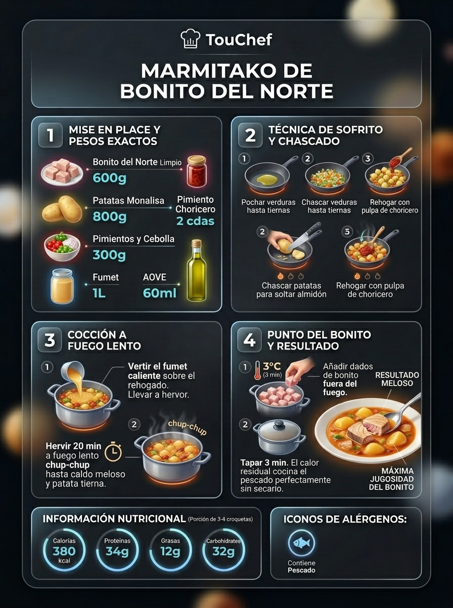

### 📋 Ficha Técnica y Resumen
| Parámetro | Valor |
|---|---|
| **Tiempo de Preparación** | 20 min |
| **Tiempo de Cocción** | 35 min |
| **Dificultad** | Fácil-Media |
| **Raciones** | 4 personas (aprox. 450 g por ración) |
| **Coste Estimado** | Medio (€€) - 7,50 € total / 1,87 € ración |

### ⚠️ Matriz Oficial de Alérgenos (Reglamento UE 1169/2011)
| Alérgeno | Presencia | Ingrediente / Detalle |
|---|:---:|---|
| **Gluten** | ⚪ NO | Ausente (plato naturalmente sin gluten) |
| **Crustáceos** | ⚪ NO | Ausente |
| **Huevos** | ⚪ NO | Ausente |
| **Pescado** | 🟢 SÍ | Bonito del Norte fresco y fumet de espinas |
| **Cacahuetes** | ⚪ NO | Ausente |
| **Soja** | ⚪ NO | Ausente |
| **Lácteos** | ⚪ NO | Ausente |
| **Frutos de cáscara** | ⚪ NO | Ausente |
| **Apio** | ⚪ NO | Ausente (opcional en fumet, no en receta base) |
| **Mostaza** | ⚪ NO | Ausente |
| **Sésamo** | ⚪ NO | Ausente |
| **Sulfitos** | ⚪ NO | Ausente |
| **Altramuces** | ⚪ NO | Ausente |
| **Moluscos** | ⚪ NO | Ausente |

### ⚖️ Ingredientes Exactos (Mise en Place)

- **Bonito del Norte fresco limpio (sin piel ni espinas)**: 600 g (cortado en dados de 3x3 cm)
- **Patatas de variedad Monalisa o Kennebec**: 800 g (peladas y chascadas)
- **Pimientos verdes italianos**: 2 unidades (150 g)
- **Pimiento rojo morrón**: 1 unidad (150 g)
- **Cebolla dulce de caserío**: 1 unidad grande (200 g)
- **Dientes de ajo morado**: 3 unidades (15 g)
- **Carne de pimiento choricero hidratada**: 2 cucharadas soperas (40 g)
- **Tomate maduro rallado sin piel**: 1 unidad (100 g)
- **Fumet casero de espinas de bonito y verduras**: 1.000 ml
- **Aceite de oliva virgen extra (AOVE)**: 60 ml
- **Guindilla de cayena seca**: 1 pequeña (opcional)
- **Sal marina y perejil fresco picado**: al gusto

### 🔪 Equipamiento y Utillaje Necesario
- Cazuela ancha y baja de barro cocido o hierro fundido esmaltado (Ø 28 cm).
- Cuchillo cebollero y puntilla afilada.
- Tabla de corte higiénica de polietileno (HDPE).
- Cuchara de madera o silicona térmica.
- Cazo para fumet y colador chino.

### 👨‍🍳 Paso a Paso Técnico y Minucioso
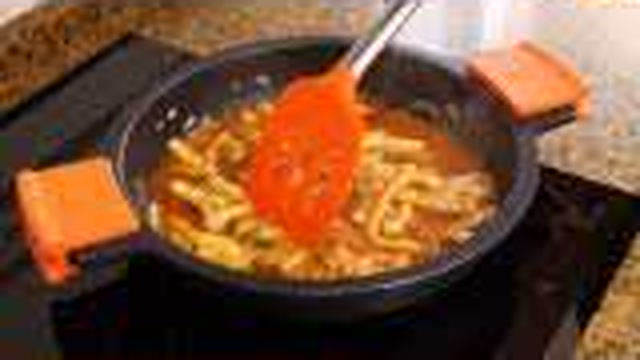
1. **Sofrito base caramelizado:** En la cazuela con los 60 ml de AOVE a fuego medio, añadir los ajos picados y la cayena. Cuando bailen, incorporar la cebolla dulce picada en brunoise fina y los dos tipos de pimiento en daditos uniformes de 1 cm. Sazonar con una pizca de sal y pochar a fuego medio-bajo durante 12-14 minutos hasta que la verdura esté tierna, translúcida y dulce.
2. **Adición de tomate y pulpa de choricero:** Incorporar el tomate maduro rallado y las 2 cucharadas de pulpa de pimiento choricero. Rehogar durante 4-5 minutos hasta que el agua del tomate se evapore y el sofrito adquiera un tono rojo oscuro brillante.
3. **Chascado de patatas y sellado:** Añadir los 800 g de patatas previamente chascadas (introduciendo el cuchillo y quebrando el trozo para liberar el almidón). Rehogar el conjunto durante 3 minutos continuos para que la patata absorba los aromas del fondo.
4. **Cocción y chup-chup coloidal:** Verter el fumet de pescado bien caliente hasta cubrir las patatas unos 2 dedos por encima (aprox. 1.000 ml). Llevar a ebullición viva, espumar si es necesario, bajar a fuego manso (*chup-chup* constante a 90°C) y cocer tapado durante 20-25 minutos hasta que la patata esté sumamente tierna y el caldo quede trabado y denso.
5. **Cocción perfecta del bonito en calor residual:** Cortar el bonito en dados regulares de 3 cm y sazonar ligeramente. **Apagar el fuego de la cazuela por completo**. Añadir los dados de bonito, sumergirlos con cuidado en el caldo hirviente, tapar la cazuela con su tapadera y dejar reposar durante **3 a 4 minutos exactos**. El calor residual cocerá el bonito dejándolo nacarado, tierno y con un centro jugoso.

### 🍽️ Emplatado y Textura Final

- Servir de inmediato en la propia cazuela de barro o en platos hondos atemperados. Espolvorear abundante perejil fresco recién picado. El caldo debe mostrar un color anaranjado-rojizo vivo, textura ligada que nape la cuchara y patatas enteras que se deshagan en boca con solo presionarlas con la lengua.

### ⏱️ Protocolo de Conservación y Batch Cooking
- **Refrigeración (0°C a 3°C):** 2-3 días en recipiente hermético de vidrio. El bonito seguirá ganando sabor con el caldo, aunque se aconseja consumir preferentemente en las primeras 48 horas.
- **Congelación (-18°C):** No recomendada para el guiso completo con patata (la patata cocida pierde el agua celular y queda arenosa). Si se desea congelar, congelar el fondo/caldo sin patata ni bonito.
- **Envasado al Vacío:** 4 días en frío controlado (0-2°C) en bolsa rígida o táper de vacío.

### 🔥 Guía de Regeneración Multicanal
- **Sartén / Cazuela (Método Preferente):** Verter el guiso y calentar a fuego mínimo durante 4-5 minutos tapado, agitando por las asas en vaivén suave. Añadir 2 cucharadas de agua tibia o fumet si ha espesado en exceso.
- **Horno Convectivo:** 8-10 minutos a 150°C en bandeja tapada con papel de aluminio.
- **Microondas:** 2-3 minutos a potencia media (600W), con campana protectora, removiendo a mitad del proceso con cuidado de no romper el bonito.

---

## 2. 🥣 Porrusalda Tradicional con Bacalao Desmigado


> 📺 **Vídeo y Receta Oficial:** [Ver en Hogarmania / Karlos Arguiñano: Porrusalda Tradicional con Bacalao Desmigado](https://www.hogarmania.com/cocina/recetas/sopas-cremas/porrusalda-bacalao-karlos-arguinano.html)  
> 📊 **Infografía Educativa TouChef:** [Ver Infografía Técnica](assets/infografia_porrusalda_tradicional_con_bacalao_desmigado.jpg)

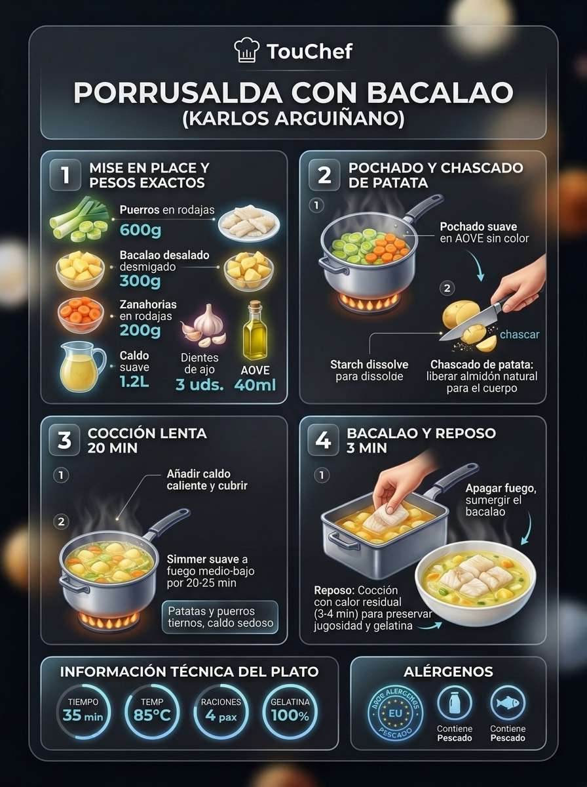

### 📋 Ficha Técnica y Resumen
| Parámetro | Valor |
|---|---|
| **Tiempo de Preparación** | 15 min |
| **Tiempo de Cocción** | 30 min |
| **Dificultad** | Muy Fácil |
| **Raciones** | 4 personas (aprox. 400 g por ración) |
| **Coste Estimado** | Económico (€) - 4,20 € total / 1,05 € ración |

### ⚠️ Matriz Oficial de Alérgenos (Reglamento UE 1169/2011)
| Alérgeno | Presencia | Ingrediente / Detalle |
|---|:---:|---|
| **Gluten** | ⚪ NO | Ausente de forma natural |
| **Crustáceos** | ⚪ NO | Ausente |
| **Huevos** | ⚪ NO | Ausente |
| **Pescado** | 🟢 SÍ | Bacalao desalado desmigado |
| **Cacahuetes** | ⚪ NO | Ausente |
| **Soja** | ⚪ NO | Ausente |
| **Lácteos** | ⚪ NO | Ausente |
| **Frutos de cáscara** | ⚪ NO | Ausente |
| **Apio** | ⚪ NO | Ausente (opcional en caldo de verduras) |
| **Mostaza** | ⚪ NO | Ausente |
| **Sésamo** | ⚪ NO | Ausente |
| **Sulfitos** | ⚪ NO | Ausente |
| **Altramuces** | ⚪ NO | Ausente |
| **Moluscos** | ⚪ NO | Ausente |

### ⚖️ Ingredientes Exactos (Mise en Place)
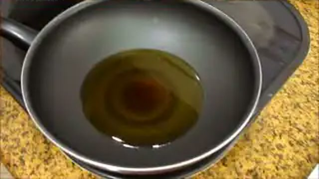
- **Puerros frescos de caserío (tallos gruesos y limpios)**: 4 unidades grandes (500 g limpios)
- **Patatas de calidad para guiso (Monalisa o Spunta)**: 600 g (peladas y chascadas)
- **Zanahorias medianas peladas**: 2 unidades (150 g, en rodajas oblicuas de 1 cm)
- **Bacalao desalado desmigado o en tiras**: 250 g
- **Dientes de ajo laminados**: 2 unidades (10 g)
- **Caldo suave de verduras, agua mineral o caldo corto de espinas**: 1.000 ml
- **Aceite de oliva virgen extra (AOVE)**: 45 ml
- **Sal marina y pimienta blanca molida**: al gusto

### 🔪 Equipamiento y Utillaje Necesario
- Olla o cazuela alta de fondo térmico difusor.
- Tabla de corte y cuchillo de chef.
- Pelador de verduras pivotante.
- Espumadera y cazo hondo.

### 👨‍🍳 Paso a Paso Técnico y Minucioso

1. **Limpieza técnica y corte del puerro:** Retirar las raíces y la parte verde oscura externa. Realizar una incisión longitudinal en cruz en la parte superior y lavar bajo chorro de agua fría abundante para eliminar cualquier resto de tierra o arenilla. Cortar en cilindros limpios de 2,5 a 3 cm de longitud.
2. **Rehogado dulce:** En la cazuela con el AOVE a fuego suave, dorar los 2 dientes de ajo laminados sin quemarlos. Añadir los cilindros de puerro y las rodajas de zanahoria. Rehogar tapado durante 6-8 minutos a fuego mínimo hasta que el puerro empiece a ablandarse y desprenda su aroma dulce característico sin tomar color tostado.
3. **Entrada de la patata chascada:** Chascar las patatas en trozos medianos similares al tamaño del puerro. Añadirlas a la cazuela, remover para impregnarlas del aceite y rehogar 2 minutos.
4. **Cocción a fuego manso:** Cubrir con los 1.000 ml de caldo o agua caliente. Llevar a hervor suave, tapar y cocer durante 20-22 minutos a fuego medio-bajo hasta que la patata esté completamente tierna y mantequillosa.
5. **Incorporación del bacalao y reposo:** Añadir el bacalao desalado desmigado distribuyéndolo por toda la superficie de la cazuela. Dejar cocer suavemente durante **3 minutos exactos**. Apagar el fuego, rectificar de sal si fuera necesario (teniendo en cuenta la salinidad natural del bacalao) y reposar 5 minutos tapado para que los jugos se equilibren.

### 🍽️ Emplatado y Textura Final

- Servir en plato hondo bien caliente, asegurando una proporción armónica de puerros, zanahorias, patatas y lascas de bacalao en cada ración. Terminar con un fino cordón de AOVE crudo virgen extra en la superficie. El caldo debe presentarse limpio, ligeramente velado por el almidón y el colágeno del bacalao.

### ⏱️ Protocolo de Conservación y Batch Cooking
- **Refrigeración (0°C a 3°C):** 3-4 días en recipiente hermético de borosilicato.
- **Congelación (-18°C):** No apto para congelar debido a la desestructuración de la patata cocida.
- **Envasado al Vacío:** 5-6 días a temperatura estable de 2°C.

### 🔥 Guía de Regeneración Multicanal
- **Cazuela / Cazo:** Calentar a fuego muy suave durante 4 minutos sin remover bruscamente con cuchara; mover en círculos con la cazuela.
- **Microondas:** 2 minutos a 750W con tapa antisalpicaduras.

---

## 3. 🍲 Sopa de Pescado y Marisco Donostiarra


> 📺 **Vídeo y Receta Oficial:** [Ver en Hogarmania / Karlos Arguiñano: Sopa de Pescado y Marisco Donostiarra](https://www.hogarmania.com/cocina/recetas/sopas-cremas/sopa-pescado-marisco-donostiarra.html)  
> 📊 **Infografía Educativa TouChef:** [Ver Infografía Técnica](assets/infografia_sopa_de_pescado_y_marisco_donostiarra.jpg)

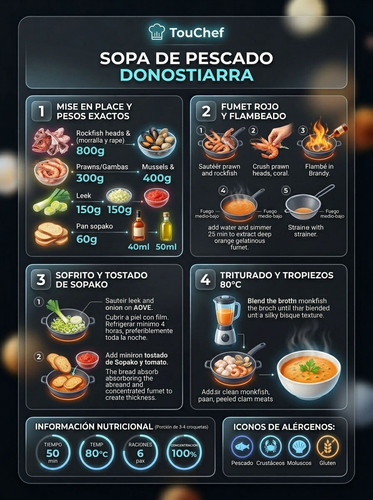

### 📋 Ficha Técnica y Resumen
| Parámetro | Valor |
|---|---|
| **Tiempo de Preparación** | 25 min |
| **Tiempo de Cocción** | 40 min |
| **Dificultad** | Media |
| **Raciones** | 6 personas (aprox. 350 ml por ración) |
| **Coste Estimado** | Medio-Alto (€€€) - 14,50 € total / 2,41 € ración |

### ⚠️ Matriz Oficial de Alérgenos (Reglamento UE 1169/2011)
| Alérgeno | Presencia | Ingrediente / Detalle |
|---|:---:|---|
| **Gluten** | 🟢 SÍ | Pan de sopa tostado tradicional (sustituible por pan sin gluten) |
| **Crustáceos** | 🟢 SÍ | Gambas / langostinos frescos y cabezas |
| **Huevos** | ⚪ NO | Ausente |
| **Pescado** | 🟢 SÍ | Rape / merluza fresca y fumet concentrado |
| **Cacahuetes** | ⚪ NO | Ausente |
| **Soja** | ⚪ NO | Ausente |
| **Lácteos** | ⚪ NO | Ausente |
| **Frutos de cáscara** | ⚪ NO | Ausente |
| **Apio** | ⚪ NO | Ausente |
| **Mostaza** | ⚪ NO | Ausente |
| **Sésamo** | ⚪ NO | Ausente |
| **Sulfitos** | 🟢 SÍ | Brandy / Coñac del flambeado |
| **Altramuces** | ⚪ NO | Ausente |
| **Moluscos** | 🟢 SÍ | Almejas finas de cultivo o marinera |

### ⚖️ Ingredientes Exactos (Mise en Place)
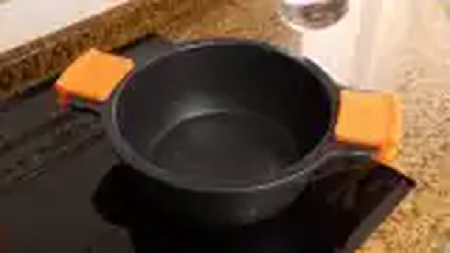
- **Lomos limpios de rape y merluza fresca en dados**: 400 g (200 g rape + 200 g merluza)
- **Gambas o langostinos frescos enteros con piel**: 250 g
- **Almejas finas limpias de arena**: 250 g
- **Cabeza y espinas de rape/merluza para fumet**: 500 g
- **Pan de hogaza candeal del día anterior (rebanadas finas)**: 100 g
- **Puerro limpio picado**: 1 unidad (120 g)
- **Cebolla morada o blanca**: 1 unidad (150 g)
- **Zanahoria pelada en brunoise**: 1 unidad (80 g)
- **Dientes de ajo**: 2 unidades (10 g)
- **Tomate maduro triturado natural**: 4 cucharadas soperas (100 g)
- **Brandy o coñac de calidad**: 40 ml
- **Fumet de pescado rojo concentrado**: 1.200 ml
- **Aceite de oliva virgen extra (AOVE)**: 50 ml
- **Perejil fresco picado y sal marina**: al gusto

### 🔪 Equipamiento y Utillaje Necesario
- Cazuela sopera de acero inoxidable de 5 litros.
- Sartén auxiliar para flambeado y sofrito.
- Pasapurés tradicional o batidora de inmersión potente.
- Colador chino de malla fina.
- Pinzas y tabla de corte.

### 👨‍🍳 Paso a Paso Técnico y Minucioso

1. **Extracción del fondo marino y flambeado:** Pelar las gambas reservando los cuerpos limpios. En una cazuela con 20 ml de AOVE caliente, dorar las cabezas y cáscaras a fuego vivo aplastándolas con la maza de un mortero para que suelten todos sus jugos corales. Verter los 40 ml de brandy y flambear con precaución. Añadir las espinas del pescado, cubrir con 1.400 ml de agua, hervir 20 minutos a fuego suave y colar por colador chino presionando enérgicamente (obteniendo 1.200 ml de fumet rojo intenso).
2. **Sofrito de verduras y pan de sopa:** En la cazuela principal con el resto del AOVE, pochar a fuego lento la cebolla, puerro, zanahoria y ajos durante 10 minutos. Añadir el tomate triturado y cocinar 5 minutos más hasta caramelizar. Incorporar las láminas finas de pan candeal duro y remover 2 minutos para que se impregnen de la grasa y el sofrito.
3. **Cocción y triturado aterciopelado:** Verter el fumet rojo caliente sobre el sofrito con pan. Dejar cocer a fuego lento durante 15 minutos para que el pan se deshaga por completo. Pasar el caldo por pasapurés (método clásico de Karlos Arguiñano para mantener una textura con cuerpo rústico) o triturar ligeramente con batidora.
4. **Apertura de almejas e incorporación de tropezones:** En una sartén con unas gotas de caldo y tapada, abrir las almejas al vapor (desechar las que permanezcan cerradas). Verter su jugo colado a la sopa.
5. **Cocción final de rape, merluza y gambas:** Reintegrar la sopa al fuego. Cuando empiece a hervir suavemente, añadir los dados de rape, merluza y los cuerpos de las gambas. Cocinar a fuego manso durante **3-4 minutos** solamente. Incorporar las almejas con su concha y apagar el fuego.

### 🍽️ Emplatado y Textura Final

- Servir en sopera clásica de porcelana o en cuencos hondos individuales. Decorar con hojas de perejil rizado y 3-4 almejas visibles en la superficie. La sopa debe tener una textura untuosa, densidad aterciopelada y un perfume yodado profundo.

### ⏱️ Protocolo de Conservación y Batch Cooking
- **Refrigeración (0°C a 3°C):** 2-3 días en refrigerador hermético.
- **Congelación (-18°C):** Congelable hasta por 3 meses (idealmente congelar la base de caldo triturada y añadir el pescado y marisco fresco tras descongelar y hervir).
- **Envasado al Vacío:** 5 días en refrigeración a 2°C.

### 🔥 Guía de Regeneración Multicanal
- **Cazuela / Cazo:** Calentar a fuego medio durante 4-5 minutos hasta que empiece a humear sin dejar que hierva a borbotones para no resecar el pescado.
- **Microondas:** 2-3 minutos a 700W tapado.

---

## 4. 🥣 Crema de Calabaza y Naranja con Crujiente de Jamón


> 📺 **Vídeo y Receta Oficial:** [Ver en Hogarmania / Karlos Arguiñano: Crema de Calabaza y Naranja con Crujiente de Jamón](https://www.hogarmania.com/cocina/recetas/sopas-cremas/crema-calabaza-naranja-arguinano.html)  
> 📊 **Infografía Educativa TouChef:** [Ver Infografía Técnica](assets/infografia_crema_de_calabaza_y_naranja_con_crujiente_de_jamon.jpg)


### 📋 Ficha Técnica y Resumen
| Parámetro | Valor |
|---|---|
| **Tiempo de Preparación** | 15 min |
| **Tiempo de Cocción** | 25 min |
| **Dificultad** | Muy Fácil |
| **Raciones** | 4 personas (aprox. 320 ml por ración) |
| **Coste Estimado** | Muy Económico (€) - 3,50 € total / 0,87 € ración |

### ⚠️ Matriz Oficial de Alérgenos (Reglamento UE 1169/2011)
| Alérgeno | Presencia | Ingrediente / Detalle |
|---|:---:|---|
| **Gluten** | ⚪ NO | Ausente de forma natural |
| **Crustáceos** | ⚪ NO | Ausente |
| **Huevos** | ⚪ NO | Ausente |
| **Pescado** | ⚪ NO | Ausente |
| **Cacahuetes** | ⚪ NO | Ausente |
| **Soja** | ⚪ NO | Ausente |
| **Lácteos** | 🟢 SÍ | Mantequilla y nata fresca (sustituible por AOVE y leche de coco para opción vegana) |
| **Frutos de cáscara** | ⚪ NO | Ausente (opcional pipas de calabaza tostadas) |
| **Apio** | ⚪ NO | Ausente |
| **Mostaza** | ⚪ NO | Ausente |
| **Sésamo** | ⚪ NO | Ausente |
| **Sulfitos** | ⚪ NO | Ausente |
| **Altramuces** | ⚪ NO | Ausente |
| **Moluscos** | ⚪ NO | Ausente |

### ⚖️ Ingredientes Exactos (Mise en Place)
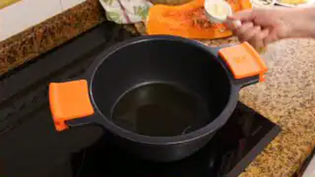
- **Calabaza tipo Butternut (cacahuete) pelada y sin semillas**: 700 g (en dados de 2 cm)
- **Puerro fresco limpio (parte blanca y verde clara)**: 1 unidad (150 g)
- **Zumo natural de naranja recién exprimido**: 100 ml (aprox. 1 naranja grande)
- **Ralladura fina de piel de naranja (sin albedo amargo)**: 1/2 cucharadita (2 g)
- **Mantequilla artesana de caserío**: 25 g (o 30 ml de AOVE virgen extra)
- **Aceite de oliva virgen extra (AOVE)**: 20 ml
- **Caldo suave de verduras**: 500 ml
- **Nata líquida culinaria (18% M.G.) o leche evaporada**: 50 ml
- **Jamón ibérico o serrano curado en lonchas muy finas**: 60 g (4 lonchas)
- **Pimienta blanca, nuez moscada recién rallada y sal**: al gusto

### 🔪 Equipamiento y Utillaje Necesario
- Cazuela de acero inoxidable o antiadherente.
- Batidora de vaso de alta potencia (tipo americana) o batidora de brazo.
- Bandeja de horno, papel vegetal sulfurizado y peso plano para hornear jamón.
- Exprimidor de cítricos y microplane.

### 👨‍🍳 Paso a Paso Técnico y Minucioso
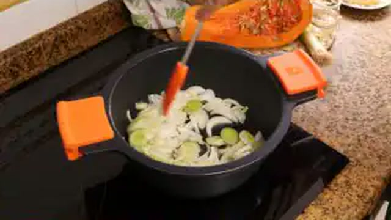
1. **Elaboración del crujiente de jamón en horno:** Precalentar el horno a 180°C con calor arriba y abajo. Colocar las lonchas de jamón estiradas sobre una bandeja con papel de hornear. Cubrir con otra hoja de papel y colocar encima otra bandeja para que el jamón no se curve al secarse. Hornear durante **10-12 minutos** hasta que esté deshidratado y firme. Retirar, dejar enfriar sobre rejilla (se volverá crujiente como cristal) y quebrar en tejas o lascas.
2. **Rehogado aromático:** En la cazuela, fundir los 25 g de mantequilla con los 20 ml de AOVE. Añadir el puerro cortado en rodajas finas y pochar a fuego suave durante 5 minutos sin que tome color dorado.
3. **Cocción de la calabaza:** Incorporar los dados de calabaza, la ralladura de naranja, sal, pimienta blanca y una pizca sutil de nuez moscada. Rehogar 4 minutos para impregnar. Verter el caldo de verduras caliente (500 ml) y cocer a fuego medio-bajo tapado durante **20 minutos** hasta que la calabaza se atraviese sin resistencia con un tenedor.
4. **Emulsión y acabado cítrico:** Retirar del fuego. Añadir los 100 ml de zumo natural de naranja colado y los 50 ml de nata líquida. Triturar en la batidora a máxima potencia durante 2-3 minutos continuos para emulsionar la grasa y obtener una crema extraordinariamente brillante, aérea y satinada. Rectificar de sal.

### 🍽️ Emplatado y Textura Final
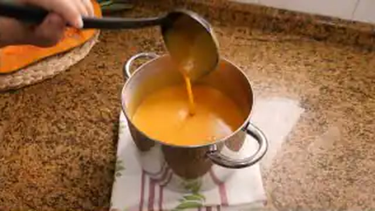
- Servir en cuencos templados. Disponer en el centro las tejas de crujiente de jamón ibérico, unas gotas decorativas de AOVE verde y pipas de calabaza tostadas. Textura de terciopelo espeso, con equilibrio magistral entre el dulzor de la calabaza caramelizada y la frescura ácida de la naranja.

### ⏱️ Protocolo de Conservación y Batch Cooking
- **Refrigeración (0°C a 3°C):** 4-5 días en frascos de cristal sellados herméticamente.
- **Congelación (-18°C):** Excelente congelación hasta por 3 meses. Al descongelar, pasar por batidora 30 segundos para homogeneizar la emulsión de la nata.
- **Envasado al Vacío:** 8 días en refrigeración controlada.

### 🔥 Guía de Regeneración Multicanal
- **Cazo a fuego suave:** Calentar 3-4 minutos removiendo con varilla.
- **Microondas:** 2 minutos a 750W con tapa.

---

## 5. 🍲 Sopa Castellana de Ajo y Huevo Escalfado


> 📺 **Vídeo y Receta Oficial:** [Ver en Hogarmania / Karlos Arguiñano: Sopa Castellana de Ajo y Huevo Escalfado](https://www.hogarmania.com/cocina/recetas/sopas-cremas/sopa-ajo-castellana-arguinano.html)  
> 📊 **Infografía Educativa TouChef:** [Ver Infografía Técnica](assets/infografia_sopa_castellana_de_ajo_y_huevo_escalfado.jpg)


### 📋 Ficha Técnica y Resumen
| Parámetro | Valor |
|---|---|
| **Tiempo de Preparación** | 10 min |
| **Tiempo de Cocción** | 25 min |
| **Dificultad** | Muy Fácil |
| **Raciones** | 4 personas (aprox. 350 ml por ración) |
| **Coste Estimado** | Muy Económico (€) - 2,80 € total / 0,70 € ración |

### ⚠️ Matriz Oficial de Alérgenos (Reglamento UE 1169/2011)
| Alérgeno | Presencia | Ingrediente / Detalle |
|---|:---:|---|
| **Gluten** | 🟢 SÍ | Pan de pueblo candeal asentado |
| **Crustáceos** | ⚪ NO | Ausente |
| **Huevos** | 🟢 SÍ | Huevos camperos escalfados |
| **Pescado** | ⚪ NO | Ausente |
| **Cacahuetes** | ⚪ NO | Ausente |
| **Soja** | ⚪ NO | Ausente |
| **Lácteos** | ⚪ NO | Ausente |
| **Frutos de cáscara** | ⚪ NO | Ausente |
| **Apio** | ⚪ NO | Ausente |
| **Mostaza** | ⚪ NO | Ausente |
| **Sésamo** | ⚪ NO | Ausente |
| **Sulfitos** | ⚪ NO | Ausente |
| **Altramuces** | ⚪ NO | Ausente |
| **Moluscos** | ⚪ NO | Ausente |

### ⚖️ Ingredientes Exactos (Mise en Place)
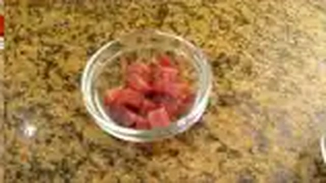
- **Pan de pueblo o de hogaza candeal (asentado de 2 días)**: 200 g (en rebanadas finas o pellizcos)
- **Dientes de ajo morado de Las Pedroñeras**: 6 unidades (30 g, en láminas de 2 mm)
- **Huevos frescos camperos (Categoría 0 o 1)**: 4 unidades
- **Taquitos de jamón curado o serrano entreverado**: 80 g
- **Pimentón dulce de la Vera con D.O.P.**: 1 cucharada sopera colmada (8 g)
- **Pimentón picante de la Vera**: 1/3 cucharadita (1 g, opcional para toque alegre)
- **Caldo de carne, ave o agua mineral**: 1.200 ml
- **Aceite de oliva virgen extra (AOVE)**: 50 ml
- **Sal marina**: al gusto (ajustar con moderación por el jamón)

### 🔪 Equipamiento y Utillaje Necesario
- Cazuela de barro refractaria tradicional o cazuela ancha de hierro esmaltado.
- Cuchara de madera de mango largo.
- Cazo para caldo.

### 👨‍🍳 Paso a Paso Técnico y Minucioso

1. **Dorado lento de los ajos y jamón:** En la cazuela de barro, calentar los 50 ml de AOVE a fuego medio-bajo. Añadir los ajos laminados y confitarlos lentamente hasta que adquieran un tono dorado pálido sin quemarse (el ajo quemado arruina la sopa volviéndola amarga). Añadir los taquitos de jamón curado y saltear 1 minuto.
2. **Tostado de pimentón y fritura de pan:** **Retirar la cazuela del fuego** durante 30 segundos. Añadir el pimentón dulce (y la pizca de picante) y remover rápidamente con la cuchara de madera en el aceite caliente para que se tueste sin quemarse. De inmediato, incorporar las rebanadas finas de pan duro y volver a poner a fuego suave, rehogando el pan durante 2-3 minutos para que absorba todo el aceite rojo y quede impregnado.
3. **Cocción y rotura del pan:** Verter los 1.200 ml de caldo caliente (o agua) sobre el pan. Subir el fuego hasta que hierva, sazonar ligeramente, bajar a fuego manso y cocinar durante **15 minutos** removiendo ocasionalmente para que el pan se ablande y se rompa en hebras y copos tiernos.
4. **Escalfado de huevos:** Cascar los 4 huevos camperos uno a uno con cuidado depositándolos sobre la superficie del caldo hirviente en 4 esquinas distintas. Tapar la cazuela, apagar el fuego o mantener al mínimo durante **3 minutos** hasta que la clara cuaje en un blanco opaco pero la yema permanezca totalmente líquida y cremosa.

### 🍽️ Emplatado y Textura Final

- Servir en cazuelitas individuales de barro muy calientes, manteniendo un huevo entero en cada ración. Al comer, romper la yema con la cuchara para que se mezcle con el caldo de pimentón y ajo, aportando una cremosidad untuosa y envolvente.

### ⏱️ Protocolo de Conservación y Batch Cooking
- **Refrigeración (0°C a 3°C):** 2 días en nevera sin los huevos (añadir y escalfar los huevos en el momento de la regeneración).
- **Congelación (-18°C):** No recomendada (el pan cocido se degrada).
- **Envasado al Vacío:** 3 días en refrigeración para la base de sopa.

### 🔥 Guía de Regeneración Multicanal
- **Cazuela de barro:** Calentar 4 minutos a fuego lento.
- **Microondas:** 2 minutos a 750W.

---

## 6. 🥣 Crema de Calabacín Suave con Quesitos

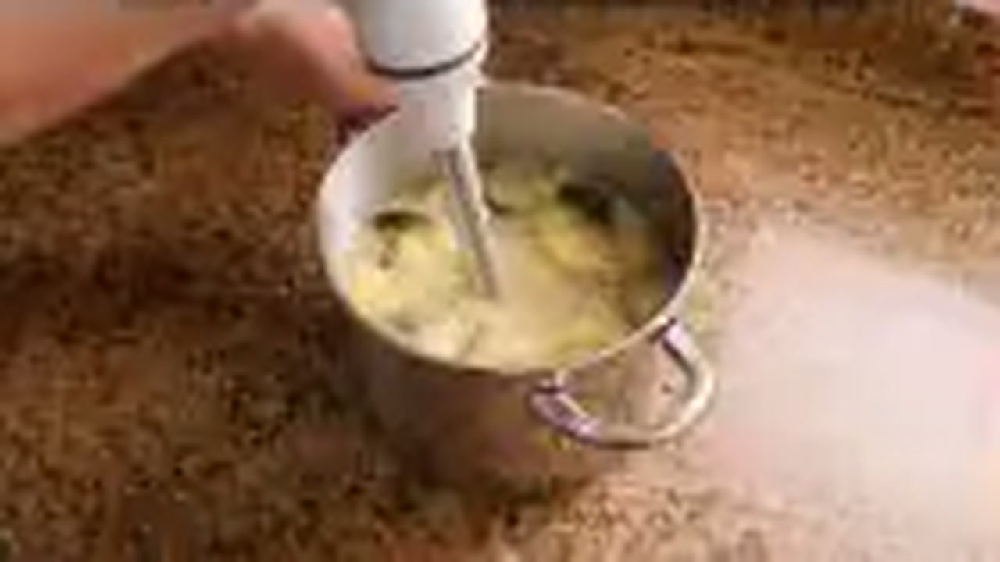

> 📺 **Vídeo y Receta Oficial:** [Ver en Hogarmania / Karlos Arguiñano: Crema de Calabacín Suave con Quesitos](https://www.hogarmania.com/cocina/recetas/sopas-cremas/crema-calabacin-quesitos-arguinano.html)  
> 📊 **Infografía Educativa TouChef:** [Ver Infografía Técnica](assets/infografia_crema_de_calabacin_suave_con_quesitos.jpg)


### 📋 Ficha Técnica y Resumen
| Parámetro | Valor |
|---|---|
| **Tiempo de Preparación** | 10 min |
| **Tiempo de Cocción** | 20 min |
| **Dificultad** | Muy Fácil |
| **Raciones** | 4 personas (aprox. 300 ml por ración) |
| **Coste Estimado** | Muy Económico (€) - 2,90 € total / 0,72 € ración |

### ⚠️ Matriz Oficial de Alérgenos (Reglamento UE 1169/2011)
| Alérgeno | Presencia | Ingrediente / Detalle |
|---|:---:|---|
| **Gluten** | ⚪ NO | Ausente (opcional en picatostes decorativos) |
| **Crustáceos** | ⚪ NO | Ausente |
| **Huevos** | ⚪ NO | Ausente |
| **Pescado** | ⚪ NO | Ausente |
| **Cacahuetes** | ⚪ NO | Ausente |
| **Soja** | ⚪ NO | Ausente |
| **Lácteos** | 🟢 SÍ | Quesitos en porciones fundentes |
| **Frutos de cáscara** | ⚪ NO | Ausente |
| **Apio** | ⚪ NO | Ausente |
| **Mostaza** | ⚪ NO | Ausente |
| **Sésamo** | ⚪ NO | Ausente |
| **Sulfitos** | ⚪ NO | Ausente |
| **Altramuces** | ⚪ NO | Ausente |
| **Moluscos** | ⚪ NO | Ausente |

### ⚖️ Ingredientes Exactos (Mise en Place)

- **Calabacines medianos frescos y tersos (con piel limpia)**: 3 unidades (800 g)
- **Patata mediana (Monalisa)**: 1 unidad (150 g, pelada y troceada)
- **Cebolla blanca o puerro**: 1 unidad (150 g)
- **Diente de ajo pelado**: 1 unidad (5 g)
- **Quesitos en porciones (o queso crema suave)**: 4 unidades (80 g)
- **Caldo de verduras ligero o agua**: 400 ml (lo justo sin cubrir en exceso)
- **Aceite de oliva virgen extra (AOVE)**: 35 ml
- **Sal marina y pimienta blanca molida**: al gusto
- **Picatostes de pan frito o semillas de sésamo para decorar**: 30 g

### 🔪 Equipamiento y Utillaje Necesario
- Cazuela mediana de acero inoxidable.
- Cuchillo de chef y tabla de corte.
- Batidora de vaso de alta velocidad o batidora de brazo.

### 👨‍🍳 Paso a Paso Técnico y Minucioso

1. **Preparación y corte de vegetales:** Lavar concienzudamente la piel de los calabacines (mantener la piel aporta clorofila, antioxidantes y un vivo color verde esmeralda). Cortar en dados medianos de 2 cm. Picar la cebolla y cortar la patata en cubitos pequeños para que se cocine rápido.
2. **Rehogado inicial:** En la cazuela con los 35 ml de AOVE, pochar la cebolla picada y el diente de ajo a fuego suave durante 4 minutos. Añadir los dados de calabacín y patata, sazonar y rehogar durante 4 minutos para activar los azúcares naturales de la hortaliza.
3. **Cocción corta controlada:** Verter los 400 ml de caldo o agua caliente (el líquido debe llegar a media altura de los vegetales; no cubrir del todo ya que el calabacín suelta abundante agua y una crema líquida pierde textura). Tapar y cocinar a fuego medio durante **15 minutos** hasta que la patata esté blanda.
4. **Triturado y emulsión láctea:** Añadir las 4 porciones de quesitos directamente a la cazuela caliente. Triturar en batidora de vaso durante 2 minutos enteros a máxima potencia hasta lograr una textura completamente sedosa, brillante y sin ningún grumo. Rectificar de sal y pimienta blanca.

### 🍽️ Emplatado y Textura Final

- Servir templada o caliente en cuencos hondos. Decorar con picatostes dorados en AOVE, un chorrito de aceite de oliva crudo y una pizca de pimienta recién molida. Textura ligera y untuosa.

### ⏱️ Protocolo de Conservación y Batch Cooking
- **Refrigeración (0°C a 3°C):** 4 días en tarro de vidrio.
- **Congelación (-18°C):** 2 meses en envase hermético.
- **Envasado al Vacío:** 7 días a 2°C.

### 🔥 Guía de Regeneración Multicanal
- **Cazo tradicional:** 3 minutos a fuego medio removiendo con espátula.
- **Microondas:** 2 minutos a 700W tapado.

---

## 7. 🍲 Sopa Zurrukutuna Tradicional de Bacalao y Pimiento Choricero


> 📺 **Vídeo y Receta Oficial:** [Ver en Hogarmania / Karlos Arguiñano: Sopa Zurrukutuna Tradicional](https://www.hogarmania.com/cocina/recetas/sopas-cremas/zurrukutuna-sopa-ajo-bacalao.html)  
> 📊 **Infografía Educativa TouChef:** [Ver Infografía Técnica](assets/infografia_zurrukutuna_sopa_vasca_de_ajo_y_bacalao.jpg)


### 📋 Ficha Técnica y Resumen
| Parámetro | Valor |
|---|---|
| **Tiempo de Preparación** | 15 min |
| **Tiempo de Cocción** | 30 min |
| **Dificultad** | Fácil |
| **Raciones** | 4 personas (aprox. 380 ml por ración) |
| **Coste Estimado** | Económico (€) - 4,80 € total / 1,20 € ración |

### ⚠️ Matriz Oficial de Alérgenos (Reglamento UE 1169/2011)
| Alérgeno | Presencia | Ingrediente / Detalle |
|---|:---:|---|
| **Gluten** | 🟢 SÍ | Pan de sopa duro de hogaza |
| **Crustáceos** | ⚪ NO | Ausente |
| **Huevos** | 🟢 SÍ | Huevos camperos cuajados en hilos |
| **Pescado** | 🟢 SÍ | Bacalao desalado desmigado |
| **Cacahuetes** | ⚪ NO | Ausente |
| **Soja** | ⚪ NO | Ausente |
| **Lácteos** | ⚪ NO | Ausente |
| **Frutos de cáscara** | ⚪ NO | Ausente |
| **Apio** | ⚪ NO | Ausente |
| **Mostaza** | ⚪ NO | Ausente |
| **Sésamo** | ⚪ NO | Ausente |
| **Sulfitos** | ⚪ NO | Ausente |
| **Altramuces** | ⚪ NO | Ausente |
| **Moluscos** | ⚪ NO | Ausente |

### ⚖️ Ingredientes Exactos (Mise en Place)

- **Bacalao desalado desmigado o en lascas limpias**: 300 g
- **Pan de hogaza o de sopa del día anterior**: 180 g (cortado en rebanadas muy finas)
- **Carne de pimiento choricero hidratada**: 2 cucharadas soperas colmadas (40 g)
- **Dientes de ajo morado**: 5 unidades (25 g, laminados)
- **Tomate maduro rallado**: 2 cucharadas (50 g)
- **Huevos camperos frescos**: 2 unidades (batidos ligeramente)
- **Fumet de espinas de pescado o agua**: 1.100 ml
- **Aceite de oliva virgen extra (AOVE)**: 50 ml
- **Pimentón dulce**: 1 cucharadita (4 g)
- **Guindilla de cayena**: 1 unidad (opcional)
- **Perejil fresco picado y sal**: al gusto

### 🔪 Equipamiento y Utillaje Necesario
- Cazuela de barro tradicional vasca o hierro colado.
- Varilla manual o cuchara de madera.
- Tabla de corte y colador.

### 👨‍🍳 Paso a Paso Técnico y Minucioso

1. **Confitado de ajos y base de choricero:** En la cazuela con el AOVE a fuego suave, dorar los ajos laminados y la cayena hasta que tomen color avellana claro. Añadir el tomate rallado y sofreír 3 minutos. Incorporar la carne de pimiento choricero y el pimentón dulce, removiendo fuera del fuego para evitar que amargue.
2. **Fritura e hidratación del pan de sopa:** Añadir las rebanadas finas de pan asentado a la cazuela. Rehogar durante 2 minutos para que el pan se empape de la grasa roja aromatizada.
3. **Cocción y deshebrado del pan:** Verter el fumet caliente (1.100 ml). Cocinar a fuego lento durante **15 minutos**, removiendo con varilla o cuchara de madera para que el pan se deshaga creando una sopa espesa y melosa.
4. **Incorporación de bacalao y huevo hilado:** Añadir los 300 g de bacalao desalado desmigado y cocinar durante **3 minutos**. Por último, verter los 2 huevos batidos en hilo fino mientras se remueve la sopa con la varilla para que se formen hilos dorados de huevo cuajado repartidos por todo el caldo. Apagar el fuego y reposar 5 minutos.

### 🍽️ Emplatado y Textura Final

- Servir bien caliente en cuencos de barro tradicionales con perejil picado por encima. Textura densa, con el pan deshecho en perfecta sintonía con las lascas saladas del bacalao y los hilos de huevo.

### ⏱️ Protocolo de Conservación y Batch Cooking
- **Refrigeración (0°C a 3°C):** 3 días en recipiente cerrado.
- **Congelación (-18°C):** No recomendada por el pan cocido y el huevo.
- **Envasado al Vacío:** 4 días en frío.

### 🔥 Guía de Regeneración Multicanal
- **Cazuela:** 4 minutos a fuego bajo con 2 cucharadas de agua para fluidificar.
- **Microondas:** 2 minutos a 750W con campana.

---

## 8. 🥣 Crema de Espárragos Trigueros con Gambas y Virutas de Jamón


> 📺 **Vídeo y Receta Oficial:** [Ver en Hogarmania / Karlos Arguiñano: Crema de Espárragos Trigueros con Gambas](https://www.hogarmania.com/cocina/recetas/sopas-cremas/crema-esparragos-trigueros-arguinano.html)  
> 📊 **Infografía Educativa TouChef:** [Ver Infografía Técnica](assets/infografia_crema_de_esparragos_trigueros_con_gambas_y_jamon.jpg)


### 📋 Ficha Técnica y Resumen
| Parámetro | Valor |
|---|---|
| **Tiempo de Preparación** | 15 min |
| **Tiempo de Cocción** | 20 min |
| **Dificultad** | Fácil |
| **Raciones** | 4 personas (aprox. 300 ml por ración) |
| **Coste Estimado** | Medio (€€) - 5,90 € total / 1,47 € ración |

### ⚠️ Matriz Oficial de Alérgenos (Reglamento UE 1169/2011)
| Alérgeno | Presencia | Ingrediente / Detalle |
|---|:---:|---|
| **Gluten** | ⚪ NO | Ausente de forma natural |
| **Crustáceos** | 🟢 SÍ | Gambas frescas salteadas |
| **Huevos** | ⚪ NO | Ausente |
| **Pescado** | ⚪ NO | Ausente |
| **Cacahuetes** | ⚪ NO | Ausente |
| **Soja** | ⚪ NO | Ausente |
| **Lácteos** | 🟢 SÍ | Nata culinaria o mantequilla (opcional) |
| **Frutos de cáscara** | ⚪ NO | Ausente |
| **Apio** | ⚪ NO | Ausente |
| **Mostaza** | ⚪ NO | Ausente |
| **Sésamo** | ⚪ NO | Ausente |
| **Sulfitos** | ⚪ NO | Ausente |
| **Altramuces** | ⚪ NO | Ausente |
| **Moluscos** | ⚪ NO | Ausente |

### ⚖️ Ingredientes Exactos (Mise en Place)

- **Espárragos trigueros verdes frescos**: 2 manojos (600 g)
- **Gambas o langostinos pelados**: 200 g
- **Puerro limpio (parte blanca)**: 1 unidad (120 g)
- **Patata mediana pelada**: 1 unidad (140 g)
- **Caldo de verduras o agua**: 600 ml
- **Nata ligera o leche evaporada**: 60 ml
- **Jamón serrano en taquitos finos o virutas**: 50 g
- **Aceite de oliva virgen extra (AOVE)**: 40 ml
- **Sal y pimienta blanca**: al gusto

### 🔪 Equipamiento y Utillaje Necesario
- Cazuela mediana y sartén antiadherente para guarnición.
- Batidora de vaso de alta potencia y colador fino.
- Tabla de corte y cuchillo puntilla.

### 👨‍🍳 Paso a Paso Técnico y Minucioso

1. **Preparación y reserva de yemas:** Doblar la base de los espárragos hasta que quiebren de forma natural desechando el tallo leñoso duro. Cortar las yemas superiores (5 cm) y reservarlas para saltear como guarnición crujiente. Trocear el resto de los tallos tiernos.
2. **Rehogado y cocción:** En la cazuela con 30 ml de AOVE, pochar el puerro picado y los tallos de espárragos durante 5 minutos. Añadir la patata chascada, sazonar con sal y pimienta blanca, verter el caldo caliente y cocer tapado durante **15 minutos** a fuego medio.
3. **Triturado y texturizado fino:** Añadir la nata y triturar en la batidora de vaso a máxima velocidad durante 2 minutos. Pasar por un colador chino para eliminar cualquier fibra residual de los espárragos obteniendo una textura de seda pura.
4. **Salteado de guarnición noble:** En una sartén con 10 ml de AOVE a fuego vivo, saltear las yemas de espárrago reservadas durante 2 minutos hasta que estén al dente y doradas. Añadir las gambas peladas y los taquitos de jamón, salteando 1 minuto más.

### 🍽️ Emplatado y Textura Final

- Servir la crema verde brillante en platos llanos hondos. Coronar en el centro con las yemas doradas, las gambas jugosas y las virutas de jamón crujiente.

### ⏱️ Protocolo de Conservación y Batch Cooking
- **Refrigeración (0°C a 3°C):** 4 días en frío.
- **Congelación (-18°C):** 2 meses (congelar solo la crema triturada).
- **Envasado al Vacío:** 7 días a 2°C.

### 🔥 Guía de Regeneración Multicanal
- **Cazo:** 3 minutos a fuego lento.
- **Microondas:** 2 minutos a 700W tapado.

---

## 9. 🍲 Sopa de Cebolla Gratinada con Queso Idiazábal

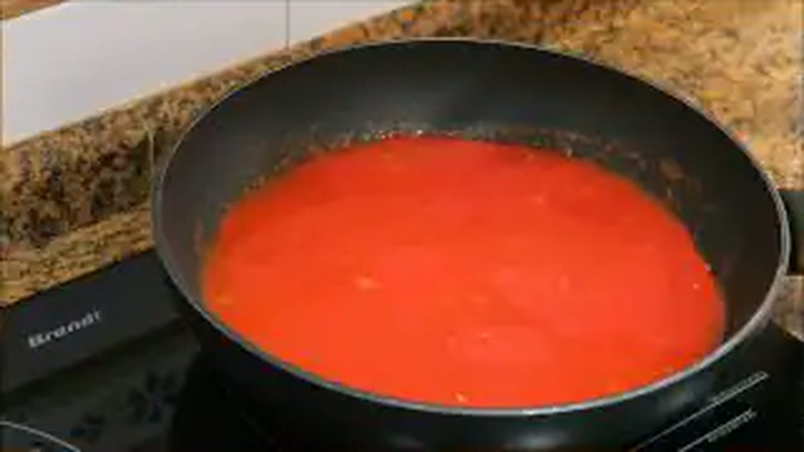

> 📺 **Vídeo y Receta Oficial:** [Ver en Hogarmania / Karlos Arguiñano: Sopa de Cebolla Gratinada](https://www.hogarmania.com/cocina/recetas/sopas-cremas/sopa-cebolla-gratinada-arguinano.html)  
> 📊 **Infografía Educativa TouChef:** [Ver Infografía Técnica](assets/infografia_sopa_de_cebolla_gratinada_con_queso_idiazabal.jpg)


### 📋 Ficha Técnica y Resumen
| Parámetro | Valor |
|---|---|
| **Tiempo de Preparación** | 15 min |
| **Tiempo de Cocción** | 45 min |
| **Dificultad** | Fácil |
| **Raciones** | 4 personas (aprox. 350 ml por ración) |
| **Coste Estimado** | Económico (€) - 4,50 € total / 1,12 € ración |

### ⚠️ Matriz Oficial de Alérgenos (Reglamento UE 1169/2011)
| Alérgeno | Presencia | Ingrediente / Detalle |
|---|:---:|---|
| **Gluten** | 🟢 SÍ | Rebanadas de pan tostado y harina de trigo del roux |
| **Crustáceos** | ⚪ NO | Ausente |
| **Huevos** | ⚪ NO | Ausente |
| **Pescado** | ⚪ NO | Ausente |
| **Cacahuetes** | ⚪ NO | Ausente |
| **Soja** | ⚪ NO | Ausente |
| **Lácteos** | 🟢 SÍ | Mantequilla y Queso Idiazábal D.O.P. (ahumado o natural) |
| **Frutos de cáscara** | ⚪ NO | Ausente |
| **Apio** | ⚪ NO | Ausente |
| **Mostaza** | ⚪ NO | Ausente |
| **Sésamo** | ⚪ NO | Ausente |
| **Sulfitos** | 🟢 SÍ | Txakoli o vino blanco seco |
| **Altramuces** | ⚪ NO | Ausente |
| **Moluscos** | ⚪ NO | Ausente |

### ⚖️ Ingredientes Exactos (Mise en Place)
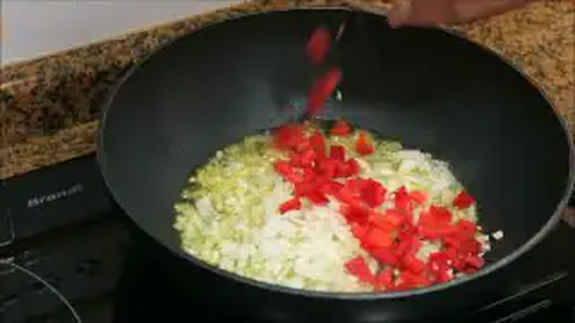
- **Cebollas dulces o tipo Figueres**: 4 unidades grandes (800 g, en juliana fina)
- **Mantequilla de caserío**: 30 g
- **Aceite de oliva virgen extra (AOVE)**: 25 ml
- **Harina de trigo de repostería**: 1 cucharada sopera rasa (15 g)
- **Vino blanco seco o Txakoli de Getaria**: 80 ml
- **Caldo de carne o de ave concentrado oscuro**: 1.200 ml
- **Rebanadas de pan de hogaza tostadas**: 8 unidades
- **Queso Idiazábal D.O.P. rallado**: 120 g
- **Diente de ajo pelado**: 1 unidad (para frotar el pan)
- **Pimienta negra recién molida y sal**: al gusto

### 🔪 Equipamiento y Utillaje Necesario
- Cazuela ancha de fondo difusor grueso.
- Cuencos de barro o porcelana aptos para horno/grill.
- Rallador de queso fino y tabla de corte.

### 👨‍🍳 Paso a Paso Técnico y Minucioso

1. **Caramelización lenta de la cebolla:** En la cazuela amplia a fuego bajo, derretir la mantequilla con el AOVE. Añadir las cebollas en juliana fina con una pizca de sal. Pochar pacientemente durante **30 minutos**, removiendo cada pocos minutos hasta que la cebolla adquiera un tono pardo dorado intenso y un sabor dulce caramelizado (reacción de Maillard natural).
2. **Roux y desglasado con Txakoli:** Espolvorear la cucharada de harina sobre la cebolla caramelizada y tostar durante 1 minuto para cocinar el almidón. Verter el Txakoli o vino blanco, rascando el fondo con la espátula para levantar los jugos tostados. Dejar reducir 2 minutos.
3. **Cocción con caldo:** Añadir el caldo de carne caliente (1.200 ml). Cocinar a fuego manso durante **15 minutos** para que los sabores se armonicen y el caldo adquiera cuerpo y color caoba.
4. **Gratinado con Idiazábal:** Tostar las rebanadas de pan y frotarlas ligeramente con el diente de ajo. Repartir la sopa hirviente en 4 cuencos de barro refractarios. Colocar 2 rebanadas de pan en la superficie de cada cuenco y cubrir generosamente con los 120 g de queso Idiazábal rallado.
5. **Gratinado al horno:** Introducir bajo el grill del horno a 220°C durante **4-5 minutos** hasta que el queso esté burbujeante, fundido y con una costra dorada y crujiente.

### 🍽️ Emplatado y Textura Final

- Servir los cuencos humeantes directamente sobre platos base con servilleta protectora. El queso Idiazábal aporta una nota láctica ahumada inigualable que contrasta con el dulzor meloso de la cebolla.

### ⏱️ Protocolo de Conservación y Batch Cooking
- **Refrigeración (0°C a 3°C):** 4 días la sopa de cebolla base. Gratinar con el pan y el queso en el momento de servir.
- **Congelación (-18°C):** 3 meses la sopa base.
- **Envasado al Vacío:** 8 días en refrigeración.

### 🔥 Guía de Regeneración Multicanal
- **Horno / Grill:** 8 minutos a 200°C con el queso encima.
- **Cazo:** Calentar la base 4 minutos y luego gratinar en horno.

---

## 10. 🥣 Vichyssoise Vasca Templada de Puerros y Manzana Reineta


> 📺 **Vídeo y Receta Oficial:** [Ver en Hogarmania / Karlos Arguiñano: Vichyssoise de Puerros y Manzana](https://www.hogarmania.com/cocina/recetas/sopas-cremas/vichyssoise-puerro-manzana-arguinano.html)  
> 📊 **Infografía Educativa TouChef:** [Ver Infografía Técnica](assets/infografia_vichyssoise_vasca_de_puerros_y_manzana_reineta.jpg)


### 📋 Ficha Técnica y Resumen
| Parámetro | Valor |
|---|---|
| **Tiempo de Preparación** | 15 min |
| **Tiempo de Cocción** | 20 min |
| **Dificultad** | Muy Fácil |
| **Raciones** | 4 personas (aprox. 300 ml por ración) |
| **Coste Estimado** | Muy Económico (€) - 3,20 € total / 0,80 € ración |

### ⚠️ Matriz Oficial de Alérgenos (Reglamento UE 1169/2011)
| Alérgeno | Presencia | Ingrediente / Detalle |
|---|:---:|---|
| **Gluten** | ⚪ NO | Ausente de forma natural |
| **Crustáceos** | ⚪ NO | Ausente |
| **Huevos** | ⚪ NO | Ausente |
| **Pescado** | ⚪ NO | Ausente |
| **Cacahuetes** | ⚪ NO | Ausente |
| **Soja** | ⚪ NO | Ausente |
| **Lácteos** | 🟢 SÍ | Mantequilla y nata fresca líquida |
| **Frutos de cáscara** | ⚪ NO | Ausente |
| **Apio** | ⚪ NO | Ausente |
| **Mostaza** | ⚪ NO | Ausente |
| **Sésamo** | ⚪ NO | Ausente |
| **Sulfitos** | ⚪ NO | Ausente |
| **Altramuces** | ⚪ NO | Ausente |
| **Moluscos** | ⚪ NO | Ausente |

### ⚖️ Ingredientes Exactos (Mise en Place)

- **Puerros frescos (solo la parte blanca pura)**: 4 unidades (400 g limpios)
- **Manzanas tipo Reineta o Granny Smith**: 2 unidades (300 g, peladas y descorazonadas)
- **Patata harinosa (Kennebec o Monalisa)**: 1 unidad mediana (150 g)
- **Cebolleta blanca fresca**: 1 unidad (100 g)
- **Mantequilla de caserío**: 30 g
- **Aceite de oliva virgen extra suave**: 15 ml
- **Caldo blanco de ave suave o agua**: 600 ml
- **Nata líquida culinaria fresca (35% M.G.)**: 80 ml
- **Cebollino fresco recién picado**: 1 manojito (10 g)
- **Pimienta blanca molida y sal marina**: al gusto

### 🔪 Equipamiento y Utillaje Necesario
- Cazuela de fondo difusor.
- Pelador de verduras y descorazonador de manzana.
- Batidora de vaso de alta velocidad.
- Colador chino fino.

### 👨‍🍳 Paso a Paso Técnico y Minucioso

1. **Rehogado en blanco (sin color):** En la cazuela, fundir la mantequilla con los 15 ml de AOVE a fuego muy bajo. Añadir la cebolleta y la parte blanca de los puerros cortados en rodajas finas. Pochar a fuego mínimo durante 8 minutos tapado, cuidando meticulosamente que no adquieran ningún tono dorado para mantener un color blanco marfil impoluto.
2. **Adición de manzana y patata:** Añadir las manzanas reineta en dados y la patata troceada fina. Rehogar 3 minutos para que la manzana empiece a liberar sus aromas frutales y su pectina.
3. **Cocción corta:** Verter los 600 ml de caldo blanco de ave caliente. Cocinar tapado a fuego medio durante **15 minutos** hasta que la patata y la manzana estén completamente deshechas.
4. **Triturado, emulsión y enfriado/atemperado:** Incorporar la nata líquida y triturar en la batidora de vaso a velocidad máxima durante 2 minutos hasta conseguir una emulsión blanca, untuosa y ligera. Pasar por el colador chino para asegurar una finura suprema. Servir templada o enfriar en abatidor/nevera para tomar fría en época estival.

### 🍽️ Emplatado y Textura Final
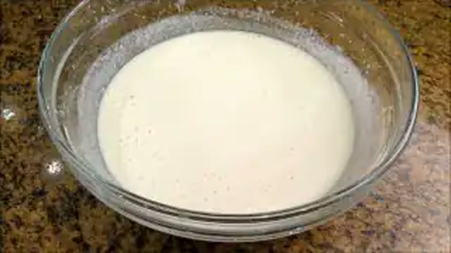
- Servir en cuencos de cristal o platos hondos decorando con abundante cebollino fresco picado, unos bastoncitos finos de manzana reineta cruda y un hilo sutil de aceite de oliva virgen extra verde.

### ⏱️ Protocolo de Conservación y Batch Cooking
- **Refrigeración (0°C a 3°C):** 4 días en frío.
- **Congelación (-18°C):** 2 meses (re-emulsionar con batidora tras descongelar).
- **Envasado al Vacío:** 7 días a 2°C.

### 🔥 Guía de Regeneración Multicanal
- **Servicio Templado:** Calentar en cazo a 50°C durante 3 minutos sin que hierva.
- **Servicio Frío:** Consumir directamente del refrigerador tras batir unos segundos.
- **Microondas:** 1 minuto a 500W para servicio templado.

---
