# 🐟 Pescados del Cantábrico y Mariscos

*Colección oficial de recetas tradicionales de Karlos Arguiñano estandarizadas para la marca TouChef. Incluye alérgenos UE 1169/2011, pesos exactos, paso a paso e infografías educativas Dark Glassmorphism.*

---

## 🐟 Bacalao al Pil-Pil Tradicional con Ajos y Guindilla

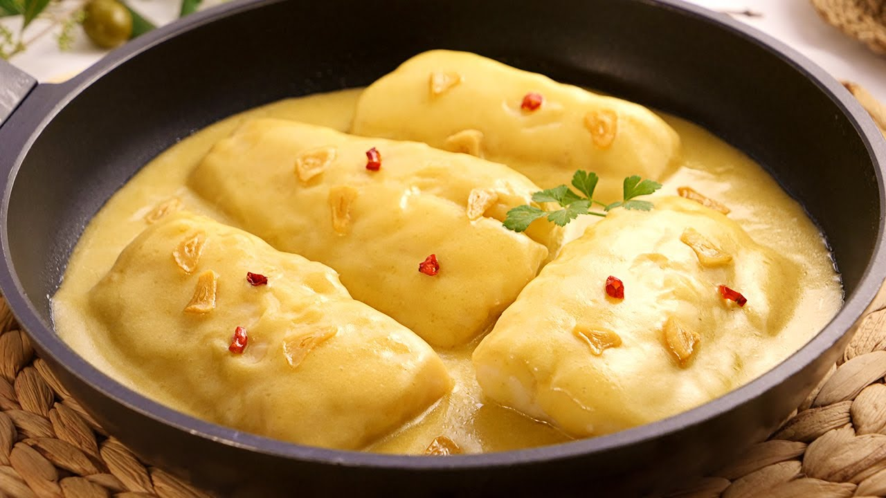

> 📺 **Vídeo y Receta Oficial:** [Ver en Hogarmania / Karlos Arguiñano: Bacalao al Pil-Pil Tradicional con Ajos y Guindilla](https://www.hogarmania.com/cocina/recetas/)
> 📊 **Infografía Educativa TouChef:** [Ver Infografía Técnica](assets/infografia_bacalao_al_pil_pil_tradicional_con_ajos_y_guindill.jpg)

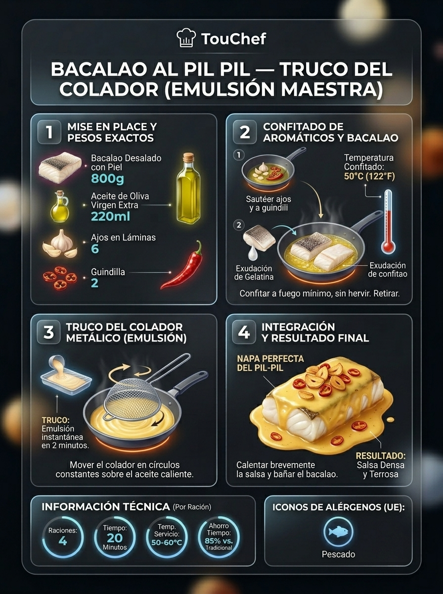

### 📋 Ficha Técnica y Resumen
| Parámetro | Valor |
|---|---|
| **Tiempo de Preparación** | 10 min |
| **Tiempo de Cocción** | 20 min |
| **Dificultad** | Media |
| **Raciones** | 4 raciones |
| **Coste Estimado** | Medio (€€) |

### ⚠️ Matriz Oficial de Alérgenos (Reglamento UE 1169/2011)
| Alérgeno | Presencia | Ingrediente / Detalle |
|---|:---:|---|
| **Gluten** | ⚪ NO | Ausente (posibles trazas en obrador) |
| **Crustáceos** | ⚪ NO | Ausente (posibles trazas en obrador) |
| **Huevos** | ⚪ NO | Ausente (posibles trazas en obrador) |
| **Pescado** | 🟢 SÍ | Presente en la receta (Bacalao) |
| **Cacahuetes** | ⚪ NO | Ausente (posibles trazas en obrador) |
| **Soja** | ⚪ NO | Ausente (posibles trazas en obrador) |
| **Lácteos** | ⚪ NO | Ausente (posibles trazas en obrador) |
| **Frutos de cáscara** | ⚪ NO | Ausente (posibles trazas en obrador) |
| **Apio** | ⚪ NO | Ausente (posibles trazas en obrador) |
| **Mostaza** | ⚪ NO | Ausente (posibles trazas en obrador) |
| **Sésamo** | ⚪ NO | Ausente (posibles trazas en obrador) |
| **Sulfitos** | ⚪ NO | Ausente (posibles trazas en obrador) |
| **Altramuces** | ⚪ NO | Ausente (posibles trazas en obrador) |
| **Moluscos** | ⚪ NO | Ausente (posibles trazas en obrador) |

### ⚖️ Ingredientes Exactos (Mise en Place)

- **Lomos gruesos de bacalao desalado (corte especial)**: 4 uds (800 g)
- **Dientes de ajo pelados y laminados finos**: 6 uds (30 g)
- **Guindilla cayena seca en aros sin semillas**: 1-2 uds (3 g)
- **Aceite de oliva virgen extra suave (acidez ≤ 0.4°)**: 250 ml
- **Perejil fresco picado fino para acabado**: 5 g

### 🔪 Equipamiento y Utillaje Necesario
- Cazuela de barro refractaria de 30 cm o cazuela ancha de acero inox con fondo difusor
- Tabla de corte HDPE y cuchillo cebollero
- Colador de malla fina para ligar o espumadera
- Papel absorbente de cocina

### 👨‍🍳 Paso a Paso Técnico y Minucioso

1. **Secado y atemperado:** Secar minuciosamente los lomos de bacalao con papel absorbente para retirar agua libre superficial y atemperar 15 min a temperatura ambiente.
2. **Dorado de ajos y guindilla:** En la cazuela con los 250 ml de AOVE a fuego suave (130°C), dorar las láminas de ajo y los aros de guindilla hasta que alcancen un tono pajizo tostado. Retirar y reservar crujientes sobre papel secante.
3. **Confitado y desprendimiento de gelatina:** Bajar la temperatura del aceite a 65-70°C. Colocar los lomos con la piel hacia arriba durante 4 minutos; dar la vuelta con cuidado dejando la piel hacia abajo otros 4 minutos. El bacalao expulsará perlas de suero gelatinoso blanco.
4. **Emulsión del Pil-Pil:** Retirar los lomos a una fuente templada y reservar el jugo que suelten. Dejar templar el aceite a 45-50°C. Con un colador de malla fina mediante movimientos circulares continuos (o con el balanceo rítmico manual de la cazuela), batir el fondo de aceite incorporando gota a gota el suero gelatinoso hasta lograr una crema espesa, densa y de color verde amarillento.
5. **Ensamblado y baño térmico:** Reincorporar los lomos a la cazuela con el pil-pil ligado, calentar 1 minuto a fuego mínimo sin sobrepasar los 55°C para evitar que se corte, y coronar con los ajos y aros de guindilla crujientes.

### 🍽️ Emplatado y Textura Final

- Servir en cazuela de barro templada con la piel hacia arriba, salseando con abundancia la superficie con el pil-pil untuoso y disponiendo los chips de ajo y guindilla alineados.

### ⏱️ Protocolo de Conservación y Batch Cooking
- **Refrigeración (0°C a 3°C):** 3 días en recipiente hermético de cristal.
- **Congelación (-18°C):** No recomendada (la emulsión se disocia al descongelar).
- **Envasado al Vacío:** 5 días en frío a 2°C.

### 🔥 Guía de Regeneración Multicanal
- **Sartén / Cazuela:** Calentar a fuego imperceptible durante 3-4 minutos con suave vaivén; si amaga con separarse, añadir 1 cucharadita de agua tibia y emulsionar de nuevo.
- **Horno Convectivo:** 6-8 min a 120°C tapado con papel vegetal.
- **Microondas:** No recomendado (rompe la emulsión).

---

## 🐟 Merluza en Salsa Verde con Almejas y Kokotxas

> 📺 **Vídeo y Receta Oficial:** [Ver en Hogarmania / Karlos Arguiñano: Merluza en Salsa Verde con Almejas y Kokotxas](https://www.hogarmania.com/cocina/recetas/)
> 📊 **Infografía Educativa TouChef:** [Ver Infografía Técnica](assets/infografia_merluza_en_salsa_verde_con_almejas_y_kokotxas.jpg)

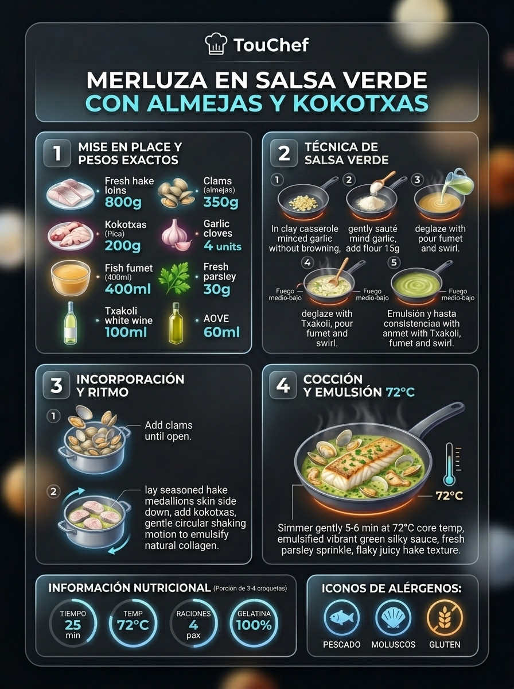

### 📋 Ficha Técnica y Resumen
| Parámetro | Valor |
|---|---|
| **Tiempo de Preparación** | 15 min |
| **Tiempo de Cocción** | 15 min |
| **Dificultad** | Fácil |
| **Raciones** | 4 raciones |
| **Coste Estimado** | Medio (€€) |

### ⚠️ Matriz Oficial de Alérgenos (Reglamento UE 1169/2011)
| Alérgeno | Presencia | Ingrediente / Detalle |
|---|:---:|---|
| **Gluten** | 🟢 SÍ | Presente en la receta (Harina de trigo) |
| **Crustáceos** | ⚪ NO | Ausente (posibles trazas en obrador) |
| **Huevos** | ⚪ NO | Ausente (posibles trazas en obrador) |
| **Pescado** | 🟢 SÍ | Presente en la receta (Merluza y Kokotxas) |
| **Cacahuetes** | ⚪ NO | Ausente (posibles trazas en obrador) |
| **Soja** | ⚪ NO | Ausente (posibles trazas en obrador) |
| **Lácteos** | ⚪ NO | Ausente (posibles trazas en obrador) |
| **Frutos de cáscara** | ⚪ NO | Ausente (posibles trazas en obrador) |
| **Apio** | ⚪ NO | Ausente (posibles trazas en obrador) |
| **Mostaza** | ⚪ NO | Ausente (posibles trazas en obrador) |
| **Sésamo** | ⚪ NO | Ausente (posibles trazas en obrador) |
| **Sulfitos** | 🟢 SÍ | Presente en la receta (Txakoli / Vino blanco) |
| **Altramuces** | ⚪ NO | Ausente (posibles trazas en obrador) |
| **Moluscos** | 🟢 SÍ | Presente en la receta (Almejas) |

### ⚖️ Ingredientes Exactos (Mise en Place)
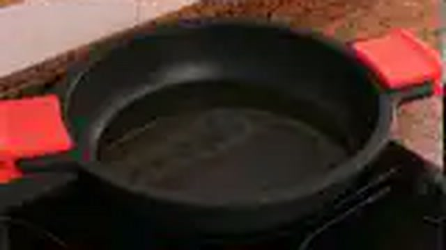
- **Rodajas o lomos de merluza de pincho**: 4 uds (800 g)
- **Almejas finas de carril o babosas**: 300 g (16-20 uds)
- **Kokotxas de merluza frescas**: 150 g (8-10 uds)
- **Dientes de ajo picados finamente en brunoise**: 3 uds (15 g)
- **Harina de trigo tamizada**: 1 cda rasa (15 g)
- **Txakoli de Getaria o vino blanco seco**: 80 ml
- **Fumet de pescado blanco de roca**: 250 ml
- **Perejil fresco picado muy fino**: 4 cdas (20 g)
- **Aceite de oliva virgen extra**: 50 ml
- **Sal marina fina**: al gusto

### 🔪 Equipamiento y Utillaje Necesario
- Cazuela baja de barro o sartén sauté con tapa
- Tabla de corte y puntilla
- Cuchara de madera o espátula de silicona

### 👨‍🍳 Paso a Paso Técnico y Minucioso
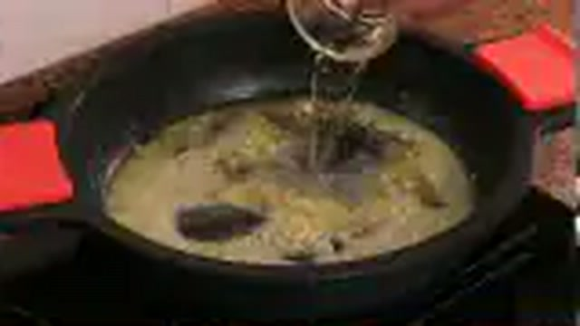
1. **Purga de almejas:** Sumergir las almejas 30 minutos en agua fría con sal gorda (35 g/L) para eliminar arenillas.
2. **Roux rubio base:** En cazuela baja con el AOVE a fuego medio, dorar el ajo picado sin que se queme. Añadir la harina y cocinar 60 segundos removiendo para perder el sabor a crudo.
3. **Desglasado y emulsión verde:** Incorporar el Txakoli o vino blanco, evaporar el alcohol a fuego vivo 1 min, agregar el fumet caliente y el perejil picado, agitando la cazuela hasta que la salsa ligue.
4. **Cocción en vaivén:** Sazonar los lomos de merluza y colocarlos en la salsa junto con las almejas y las kokotxas. Tapar y cocer a fuego medio-bajo durante 6-8 minutos con suaves movimientos de vaivén de la cazuela hasta que las almejas se abran por completo.

### 🍽️ Emplatado y Textura Final

- Servir en plato hondo bien caliente, lomo de merluza central rodeado de almejas abiertas y kokotxas lustrosas, napadas con la salsa verde esmeralda.

### ⏱️ Protocolo de Conservación y Batch Cooking
- **Refrigeración (0°C a 3°C):** 2 días en nevera hermético.
- **Congelación (-18°C):** No recomendada.
- **Envasado al Vacío:** 3 días a 2°C.

### 🔥 Guía de Regeneración Multicanal
- **Sartén / Cazuela:** Calentar a fuego suave durante 4 minutos añadiendo 2 cucharadas de fumet.
- **Horno Convectivo:** 8 min a 150°C tapado.
- **Microondas:** 2 min a 600W tapado con campana.

---

## 🦀 Txangurro a la Donostiarra al Horno

> 📺 **Vídeo y Receta Oficial:** [Ver en Hogarmania / Karlos Arguiñano: Txangurro a la Donostiarra al Horno](https://www.hogarmania.com/cocina/recetas/)
> 📊 **Infografía Educativa TouChef:** [Ver Infografía Técnica](assets/infografia_txangurro_a_la_donostiarra_al_horno.jpg)

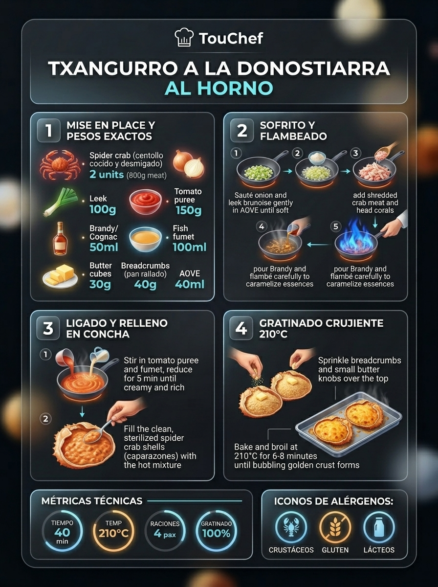

### 📋 Ficha Técnica y Resumen
| Parámetro | Valor |
|---|---|
| **Tiempo de Preparación** | 30 min |
| **Tiempo de Cocción** | 20 min |
| **Dificultad** | Media-Alta |
| **Raciones** | 4 raciones |
| **Coste Estimado** | Alto (€€€) |

### ⚠️ Matriz Oficial de Alérgenos (Reglamento UE 1169/2011)
| Alérgeno | Presencia | Ingrediente / Detalle |
|---|:---:|---|
| **Gluten** | 🟢 SÍ | Presente en la receta (Pan rallado) |
| **Crustáceos** | 🟢 SÍ | Presente en la receta (Centollo / Buey de mar) |
| **Huevos** | ⚪ NO | Ausente (posibles trazas en obrador) |
| **Pescado** | ⚪ NO | Ausente (posibles trazas en obrador) |
| **Cacahuetes** | ⚪ NO | Ausente (posibles trazas en obrador) |
| **Soja** | ⚪ NO | Ausente (posibles trazas en obrador) |
| **Lácteos** | 🟢 SÍ | Presente en la receta (Mantequilla) |
| **Frutos de cáscara** | ⚪ NO | Ausente (posibles trazas en obrador) |
| **Apio** | ⚪ NO | Ausente (posibles trazas en obrador) |
| **Mostaza** | ⚪ NO | Ausente (posibles trazas en obrador) |
| **Sésamo** | ⚪ NO | Ausente (posibles trazas en obrador) |
| **Sulfitos** | ⚪ NO | Ausente (posibles trazas en obrador) |
| **Altramuces** | ⚪ NO | Ausente (posibles trazas en obrador) |
| **Moluscos** | ⚪ NO | Ausente (posibles trazas en obrador) |

### ⚖️ Ingredientes Exactos (Mise en Place)
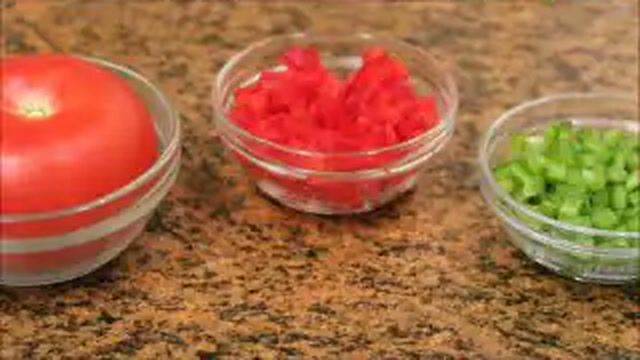
- **Centollos o bueyes de mar cocidos enteros (con caparazón íntegro)**: 2 uds (aprox. 1.6 kg enteros -> 600 g carne limpia y corales)
- **Cebolla dulce picada en brunoise fina**: 1 ud (150 g)
- **Puerro (parte blanca) picado finamente**: 1 ud (100 g)
- **Tomate maduro escalfado, pelado y rallado**: 2 uds (150 g)
- **Diente de ajo picado**: 1 ud (5 g)
- **Brandy / Coñac de calidad**: 50 ml
- **Mantequilla artesana sin sal**: 30 g
- **Pan rallado fino**: 40 g
- **Aceite de oliva virgen extra**: 40 ml
- **Sal marina, perejil y pimienta blanca**: al gusto

### 🔪 Equipamiento y Utillaje Necesario
- Pinzas para marisco y maza para cascar
- Sartén amplia o sauté
- Bandeja de horno refractaria
- Pincel de cocina y cuchara de servicio

### 👨‍🍳 Paso a Paso Técnico y Minucioso
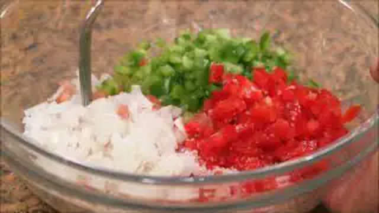
1. **Desmigado minucioso:** Separar el cuerpo y las patas del txangurro. Extraer toda la carne magra y los corales interiores evitando fragmentos de cáscara. Lavar y cepillar los caparazones vacíos para rellenar.
2. **Sofrito donostiarra:** En sartén con el AOVE y 10 g de mantequilla, pochar el ajo, la cebolla y el puerro a fuego lento durante 12-14 min. Añadir el tomate rallado y sofreír 6 min más.
3. **Flambeado y ensamblaje:** Agregar la carne y corales de txangurro al sofrito, verter el brandy y flambear con precaución. Reducir 2 min a fuego suave ajustando de sal y pimienta blanca.
4. **Relleno y gratinado crujiente:** Rellenar los 2 caparazones limpios con la farsa, espolvorear con el pan rallado y repartir dados finos del resto de mantequilla (20 g). Gratinar en horno a 210°C durante 8-10 minutos hasta formar una costra tostada y crujiente.

### 🍽️ Emplatado y Textura Final
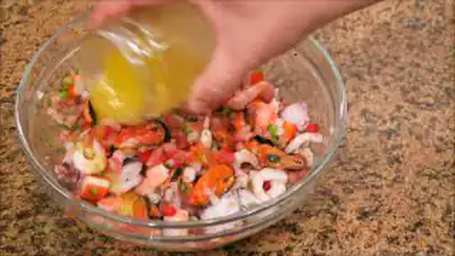
- Servir el caparazón gratinado apoyado sobre una base de sal gorda húmeda para fijarlo al plato, acompañado de gajos de limón y perejil fresco.

### ⏱️ Protocolo de Conservación y Batch Cooking
- **Refrigeración (0°C a 3°C):** 2 días el relleno en frío.
- **Congelación (-18°C):** 1 mes el relleno envasado al vacío.
- **Envasado al Vacío:** 4 días en frío.

### 🔥 Guía de Regeneración Multicanal
- **Sartén / Cazuela:** No recomendada una vez gratinado.
- **Horno Convectivo:** 8-10 min a 180°C para calentar y re-gratinar.
- **Microondas:** 2 min a 600W (pierde la costra crujiente).

---

## 🦑 Chipirones en su Tinta Tradicionales

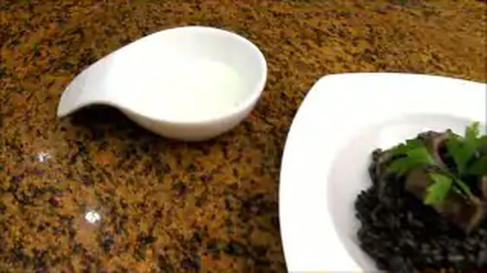

> 📺 **Vídeo y Receta Oficial:** [Ver en Hogarmania / Karlos Arguiñano: Chipirones en su Tinta Tradicionales](https://www.hogarmania.com/cocina/recetas/)
> 📊 **Infografía Educativa TouChef:** [Ver Infografía Técnica](assets/infografia_chipirones_en_su_tinta_tradicionales.jpg)

### 📋 Ficha Técnica y Resumen
| Parámetro | Valor |
|---|---|
| **Tiempo de Preparación** | 25 min |
| **Tiempo de Cocción** | 35 min |
| **Dificultad** | Media |
| **Raciones** | 4 raciones |
| **Coste Estimado** | Medio (€€) |

### ⚠️ Matriz Oficial de Alérgenos (Reglamento UE 1169/2011)
| Alérgeno | Presencia | Ingrediente / Detalle |
|---|:---:|---|
| **Gluten** | 🟢 SÍ | Presente en la receta (Pan frito para ligar la salsa) |
| **Crustáceos** | ⚪ NO | Ausente (posibles trazas en obrador) |
| **Huevos** | ⚪ NO | Ausente (posibles trazas en obrador) |
| **Pescado** | 🟢 SÍ | Presente en la receta (Fumet de pescado) |
| **Cacahuetes** | ⚪ NO | Ausente (posibles trazas en obrador) |
| **Soja** | ⚪ NO | Ausente (posibles trazas en obrador) |
| **Lácteos** | ⚪ NO | Ausente (posibles trazas en obrador) |
| **Frutos de cáscara** | ⚪ NO | Ausente (posibles trazas en obrador) |
| **Apio** | ⚪ NO | Ausente (posibles trazas en obrador) |
| **Mostaza** | ⚪ NO | Ausente (posibles trazas en obrador) |
| **Sésamo** | ⚪ NO | Ausente (posibles trazas en obrador) |
| **Sulfitos** | 🟢 SÍ | Presente en la receta (Vino blanco) |
| **Altramuces** | ⚪ NO | Ausente (posibles trazas en obrador) |
| **Moluscos** | 🟢 SÍ | Presente en la receta (Chipirones y Tinta) |

### ⚖️ Ingredientes Exactos (Mise en Place)

- **Chipirones medianos frescos limpios**: 1 kg (800 g limpios, 12-16 uds)
- **Bolsitas de tinta natural de calamar**: 4 uds (15 g)
- **Cebollas moradas de Zalla o rojas en juliana**: 3 uds (450 g)
- **Pimiento verde italiano picado**: 1 ud (100 g)
- **Dientes de ajo picados**: 2 uds (10 g)
- **Rebanada de pan de hogaza frito**: 1 ud (25 g)
- **Vino blanco seco / Txakoli**: 100 ml
- **Fumet de pescado blanco**: 250 ml
- **Aceite de oliva virgen extra**: 50 ml
- **Sal marina**: al gusto

### 🔪 Equipamiento y Utillaje Necesario
- Cazuela baja de hierro colado o barro
- Sartén antiadherente para marcar
- Batidora de vaso y colador chino
- Palillos de madera redondos

### 👨‍🍳 Paso a Paso Técnico y Minucioso

1. **Limpieza y rellenado:** Picar finamente las aletas y tentáculos limpios. Rellenar las vainas con su propio picadillo hasta 2/3 de capacidad y sellar el extremo con un palillo de madera.
2. **Caramelización de la cebolla roja:** En cazuela con el AOVE, pochar la cebolla roja y el pimiento verde a fuego muy suave durante 25-30 minutos hasta lograr un fondo caoba oscuro y dulce.
3. **Salsa negra aterciopelada:** Añadir el ajo, el pan frito, desglasar con vino blanco, evaporar alcohol e incorporar la tinta disuelta en el fumet caliente. Cocer 10 min, triturar a fondo y pasar por colador chino.
4. **Marcado y estofado:** Marcar los chipirones en sartén viva con unas gotas de aceite durante 1 min por cara. Introducir en la salsa de tinta y guisar a fuego suave tapado durante 18-20 minutos hasta que estén tiernos como mantequilla.

### 🍽️ Emplatado y Textura Final

- Servir 3-4 chipirones retirando el palillo, cubiertos por el espejo de salsa negra azabache brillante y acompañados de arroz blanco pilaf moldeado.

### ⏱️ Protocolo de Conservación y Batch Cooking
- **Refrigeración (0°C a 3°C):** 4 días (su textura y sabor mejoran notablemente tras 24 h de reposo).
- **Congelación (-18°C):** 3 meses perfectamente apto.
- **Envasado al Vacío:** 7 días a 2°C.

### 🔥 Guía de Regeneración Multicanal
- **Sartén / Cazuela:** Calentar a fuego suave durante 4 minutos añadiendo 2 cucharadas de caldo.
- **Horno Convectivo:** 10 min a 160°C tapado.
- **Microondas:** 2-3 min a 750W tapado con campana.

---

## 🐟 Merluza a la Koskera con Espárragos, Almejas y Huevo Duro

> 📺 **Vídeo y Receta Oficial:** [Ver en Hogarmania / Karlos Arguiñano: Merluza a la Koskera con Espárragos, Almejas y Huevo Duro](https://www.hogarmania.com/cocina/recetas/)
> 📊 **Infografía Educativa TouChef:** [Ver Infografía Técnica](assets/infografia_merluza_a_la_koskera_con_esparragos_y_huevo_duro.jpg)

### 📋 Ficha Técnica y Resumen
| Parámetro | Valor |
|---|---|
| **Tiempo de Preparación** | 20 min |
| **Tiempo de Cocción** | 20 min |
| **Dificultad** | Fácil-Media |
| **Raciones** | 4 raciones |
| **Coste Estimado** | Medio (€€) |

### ⚠️ Matriz Oficial de Alérgenos (Reglamento UE 1169/2011)
| Alérgeno | Presencia | Ingrediente / Detalle |
|---|:---:|---|
| **Gluten** | 🟢 SÍ | Presente en la receta (Harina de trigo para ligar) |
| **Crustáceos** | ⚪ NO | Ausente (posibles trazas en obrador) |
| **Huevos** | 🟢 SÍ | Presente en la receta (Huevos cocidos) |
| **Pescado** | 🟢 SÍ | Presente en la receta (Merluza de pincho y Fumet) |
| **Cacahuetes** | ⚪ NO | Ausente (posibles trazas en obrador) |
| **Soja** | ⚪ NO | Ausente (posibles trazas en obrador) |
| **Lácteos** | ⚪ NO | Ausente (posibles trazas en obrador) |
| **Frutos de cáscara** | ⚪ NO | Ausente (posibles trazas en obrador) |
| **Apio** | ⚪ NO | Ausente (posibles trazas en obrador) |
| **Mostaza** | ⚪ NO | Ausente (posibles trazas en obrador) |
| **Sésamo** | ⚪ NO | Ausente (posibles trazas en obrador) |
| **Sulfitos** | 🟢 SÍ | Presente en la receta (Txakoli / Vino blanco) |
| **Altramuces** | ⚪ NO | Ausente (posibles trazas en obrador) |
| **Moluscos** | 🟢 SÍ | Presente en la receta (Almejas) |

### ⚖️ Ingredientes Exactos (Mise en Place)
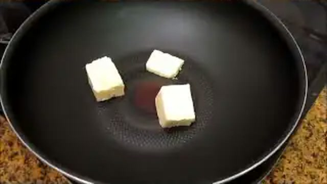
- **Lomos o rodajas gruesas de merluza de anzuelo**: 4 uds (800 g)
- **Almejas finas de carril**: 300 g (16-20 uds)
- **Yemas de espárragos blancos de Navarra gruesos**: 8 uds (200 g)
- **Huevos camperos cocidos (9 min)**: 2 uds cortados en cuartos
- **Guisantes tiernos frescos o congelados extrafinos**: 100 g
- **Dientes de ajo en brunoise**: 3 uds (15 g)
- **Harina de trigo común**: 1 cda colmada (15 g)
- **Txakoli o vino blanco seco**: 75 ml
- **Fumet de espinas de merluza**: 300 ml
- **Perejil fresco picado**: 3 cdas (15 g)
- **Aceite de oliva virgen extra**: 50 ml
- **Sal marina fina**: al gusto

### 🔪 Equipamiento y Utillaje Necesario
- Cazuela de barro ancha o cacerola baja de acero inoxidable
- Tabla de corte y cuchillo cocinero
- Cazo para hervir huevos y bol de agua con hielo

### 👨‍🍳 Paso a Paso Técnico y Minucioso

1. **Base y roux aromático:** En cazuela con el AOVE, dorar el ajo picado a fuego suave. Incorporar la harina y sofreír 1 min sin que se oscurezca.
2. **Salsa verde Koskera:** Verter el vino blanco, evaporar el alcohol 1 min, verter el fumet caliente y el perejil. Remover hasta que la salsa ligue uniformemente.
3. **Cocción de pescado, almejas y guisantes:** Salar los lomos de merluza y sumergirlos en la salsa junto a las almejas purgadas y los guisantes. Cocer 6-7 minutos tapado a fuego medio con vaivén continuo.
4. **Guarnición y asentado:** Incorporar las yemas de espárragos blancos y los cuartos de huevo duro durante los últimos 2 minutos de cocción para que tomen temperatura sin deshacerse.

### 🍽️ Emplatado y Textura Final

- Servir en plato hondo con el lomo bañado en salsa verde, 4 almejas abiertas alrededor, 2 yemas de espárrago, cuartos de huevo cocido y guisantes esmeralda.

### ⏱️ Protocolo de Conservación y Batch Cooking
- **Refrigeración (0°C a 3°C):** 2 días en nevera.
- **Congelación (-18°C):** No recomendada (el huevo cocido y espárrago pierden textura).
- **Envasado al Vacío:** 3 días en frío a 2°C.

### 🔥 Guía de Regeneración Multicanal
- **Sartén / Cazuela:** 4 min a fuego suave con 2 cdas de fumet.
- **Horno Convectivo:** 8 min a 150°C tapado.
- **Microondas:** 2 min a 600W tapado.

---

## 🐟 Bonito del Norte con Tomate y Pimientos del País

> 📺 **Vídeo y Receta Oficial:** [Ver en Hogarmania / Karlos Arguiñano: Bonito del Norte con Tomate y Pimientos del País](https://www.hogarmania.com/cocina/recetas/)
> 📊 **Infografía Educativa TouChef:** [Ver Infografía Técnica](assets/infografia_bonito_del_norte_con_tomate_y_pimientos.jpg)

### 📋 Ficha Técnica y Resumen
| Parámetro | Valor |
|---|---|
| **Tiempo de Preparación** | 15 min |
| **Tiempo de Cocción** | 30 min |
| **Dificultad** | Fácil |
| **Raciones** | 4 raciones |
| **Coste Estimado** | Medio (€€) |

### ⚠️ Matriz Oficial de Alérgenos (Reglamento UE 1169/2011)
| Alérgeno | Presencia | Ingrediente / Detalle |
|---|:---:|---|
| **Gluten** | ⚪ NO | Ausente (posibles trazas en obrador) |
| **Crustáceos** | ⚪ NO | Ausente (posibles trazas en obrador) |
| **Huevos** | ⚪ NO | Ausente (posibles trazas en obrador) |
| **Pescado** | 🟢 SÍ | Presente en la receta (Bonito del Norte) |
| **Cacahuetes** | ⚪ NO | Ausente (posibles trazas en obrador) |
| **Soja** | ⚪ NO | Ausente (posibles trazas en obrador) |
| **Lácteos** | ⚪ NO | Ausente (posibles trazas en obrador) |
| **Frutos de cáscara** | ⚪ NO | Ausente (posibles trazas en obrador) |
| **Apio** | ⚪ NO | Ausente (posibles trazas en obrador) |
| **Mostaza** | ⚪ NO | Ausente (posibles trazas en obrador) |
| **Sésamo** | ⚪ NO | Ausente (posibles trazas en obrador) |
| **Sulfitos** | ⚪ NO | Ausente (posibles trazas en obrador) |
| **Altramuces** | ⚪ NO | Ausente (posibles trazas en obrador) |
| **Moluscos** | ⚪ NO | Ausente (posibles trazas en obrador) |

### ⚖️ Ingredientes Exactos (Mise en Place)
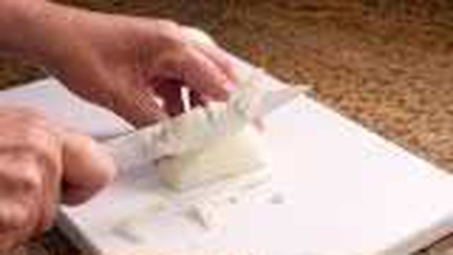
- **Tacos limpios de Bonito del Norte fresco (sin piel ni espina central)**: 800 g
- **Tomates maduros tipo pera escalfados y triturados**: 800 g
- **Cebollas dulces picadas en juliana fina**: 2 uds (300 g)
- **Pimientos verdes del país / italianos en tiras**: 3 uds (200 g)
- **Pimiento rojo morrón asado en tiras**: 1 ud (150 g)
- **Dientes de ajo laminados**: 3 uds (15 g)
- **Azúcar (corrector de acidez)**: 1/2 cdta (3 g)
- **Aceite de oliva virgen extra**: 60 ml
- **Sal marina y pimienta negra recién molida**: al gusto

### 🔪 Equipamiento y Utillaje Necesario
- Cazuela de barro o sartén honda de hierro
- Sartén antiadherente para sellado rápido
- Tabla de corte y cuchillo cebollero

### 👨‍🍳 Paso a Paso Técnico y Minucioso

1. **Fritada y confitado:** En cazuela con 40 ml de AOVE, pochar la cebolla, el ajo y los pimientos verdes y rojos con una pizca de sal a fuego medio-bajo durante 20 minutos hasta que estén tiernos y translúcidos.
2. **Salsa de tomate casera:** Incorporar el tomate triturado y el azúcar. Cocinar a fuego lento tapado durante 20 minutos hasta que la salsa espese y el aceite suba a la superficie.
3. **Sellado rápido del bonito:** Cortar el bonito en tacos de 4x4 cm. En sartén viva con 20 ml de AOVE muy caliente, sellar los tacos sazonados durante solo 30 segundos por cara (interior crudo).
4. **Cocción residual sin fuego:** Pasar los tacos sellados inmediatamente a la cazuela de tomate, apagar el fuego por completo, tapar y dejar reposar 3-4 minutos para que el calor residual cocine el centro dejándolo extraordinariamente jugoso.

### 🍽️ Emplatado y Textura Final

- Base abundante de sofrito de tomate y pimientos en plato hondo, coronada con los tacos jugosos de bonito y un chorrito de AOVE en crudo.

### ⏱️ Protocolo de Conservación y Batch Cooking
- **Refrigeración (0°C a 3°C):** 3 días en recipiente hermético.
- **Congelación (-18°C):** 2 meses (la salsa de tomate protege la humedad del bonito).
- **Envasado al Vacío:** 5 días en frío.

### 🔥 Guía de Regeneración Multicanal
- **Sartén / Cazuela:** 3-4 min a fuego muy suave tapado para no sobrecocinar el pescado.
- **Horno Convectivo:** 6-8 min a 140°C tapado.
- **Microondas:** 1.5 min a 500W tapado.

---

## 🐟 Besugo al Orio con Ajos, Guindilla y Vinagre de Sidra

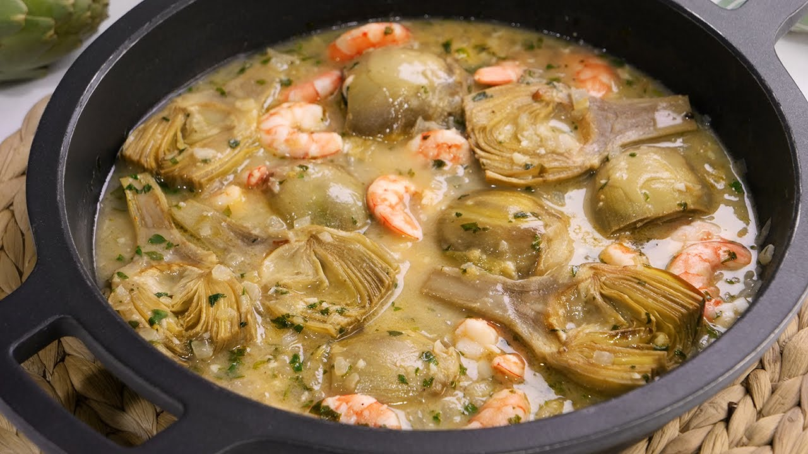

> 📺 **Vídeo y Receta Oficial:** [Ver en Hogarmania / Karlos Arguiñano: Besugo al Orio con Ajos, Guindilla y Vinagre de Sidra](https://www.hogarmania.com/cocina/recetas/)
> 📊 **Infografía Educativa TouChef:** [Ver Infografía Técnica](assets/infografia_besugo_al_orio_con_ajos_y_guindilla.jpg)

### 📋 Ficha Técnica y Resumen
| Parámetro | Valor |
|---|---|
| **Tiempo de Preparación** | 10 min |
| **Tiempo de Cocción** | 25 min |
| **Dificultad** | Media |
| **Raciones** | 4 raciones |
| **Coste Estimado** | Alto (€€€) |

### ⚠️ Matriz Oficial de Alérgenos (Reglamento UE 1169/2011)
| Alérgeno | Presencia | Ingrediente / Detalle |
|---|:---:|---|
| **Gluten** | ⚪ NO | Ausente (posibles trazas en obrador) |
| **Crustáceos** | ⚪ NO | Ausente (posibles trazas en obrador) |
| **Huevos** | ⚪ NO | Ausente (posibles trazas en obrador) |
| **Pescado** | 🟢 SÍ | Presente en la receta (Besugo del Cantábrico) |
| **Cacahuetes** | ⚪ NO | Ausente (posibles trazas en obrador) |
| **Soja** | ⚪ NO | Ausente (posibles trazas en obrador) |
| **Lácteos** | ⚪ NO | Ausente (posibles trazas en obrador) |
| **Frutos de cáscara** | ⚪ NO | Ausente (posibles trazas en obrador) |
| **Apio** | ⚪ NO | Ausente (posibles trazas en obrador) |
| **Mostaza** | ⚪ NO | Ausente (posibles trazas en obrador) |
| **Sésamo** | ⚪ NO | Ausente (posibles trazas en obrador) |
| **Sulfitos** | 🟢 SÍ | Presente en la receta (Vinagre de sidra natural) |
| **Altramuces** | ⚪ NO | Ausente (posibles trazas en obrador) |
| **Moluscos** | ⚪ NO | Ausente (posibles trazas en obrador) |

### ⚖️ Ingredientes Exactos (Mise en Place)

- **Besugo salvaje entero abierto en libro (o con 3 cortes en el lomo)**: 1 pieza (1.2 kg - 1.4 kg)
- **Dientes de ajo pelados y laminados**: 8 uds (40 g)
- **Guindillas de cayena secas en aros**: 2 uds (4 g)
- **Vinagre de sidra natural vasco**: 50 ml
- **Aceite de oliva virgen extra de calidad**: 120 ml
- **Sal gruesa marina o flor de sal**: 10 g
- **Perejil fresco picado**: 2 cdas (10 g)

### 🔪 Equipamiento y Utillaje Necesario
- Bandeja o fuente de horno refractaria esmaltada
- Sartén pequeña para el refrito Orio
- Cuchillo de pescado y tabla HDPE

### 👨‍🍳 Paso a Paso Técnico y Minucioso

1. **Asado al horno:** Precalentar el horno a 200°C. Colocar el besugo sazonado con sal gruesa en la bandeja con 20 ml de AOVE. Hornear a 190°C durante 18-20 minutos hasta que la carne junto a la espina se separe con facilidad sin secarse.
2. **Elaboración del refrito:** Mientras tanto, en sartén pequeña calentar los 100 ml de AOVE restantes con los ajos laminados y la guindilla a fuego suave hasta que los ajos tomen un dorado uniforme y crujiente.
3. **El triple vuelco (emulsión Orio):** Sacar el besugo del horno. Regar la piel caliente con el vinagre de sidra. Verter inmediatamente el refrito hirviendo de ajos y guindilla (chisporroteo). Escurrir todo el jugo de la bandeja a la sartén, agitar enérgicamente en círculos para emulsionar los jugos del besugo, el vinagre y el aceite, y volver a verter sobre el besugo. Repetir 2 o 3 veces hasta obtener una salsa ligada y translúcida.
4. **Remate:** Espolvorear perejil fresco picado y servir inmediatamente.

### 🍽️ Emplatado y Textura Final

- Servir en la propia fuente de horno o separar los lomos limpios en platos llanos precalentados, napando con la emulsión brillante y los chips de ajo dorados.

### ⏱️ Protocolo de Conservación y Batch Cooking
- **Refrigeración (0°C a 3°C):** 2 días en recipiente hermético.
- **Congelación (-18°C):** No recomendada.
- **Envasado al Vacío:** 3 días en frío.

### 🔥 Guía de Regeneración Multicanal
- **Sartén / Cazuela:** 3-4 min a fuego bajo tapado con el refrito.
- **Horno Convectivo:** 6-8 min a 150°C tapado con papel de horno.
- **Microondas:** 1.5 min a 600W.

---

## 🐟 Kokotxas de Bacalao al Pil-Pil Emulsionadas

> 📺 **Vídeo y Receta Oficial:** [Ver en Hogarmania / Karlos Arguiñano: Kokotxas de Bacalao al Pil-Pil Emulsionadas](https://www.hogarmania.com/cocina/recetas/)
> 📊 **Infografía Educativa TouChef:** [Ver Infografía Técnica](assets/infografia_kokotxas_de_bacalao_al_pil_pil.jpg)

### 📋 Ficha Técnica y Resumen
| Parámetro | Valor |
|---|---|
| **Tiempo de Preparación** | 15 min |
| **Tiempo de Cocción** | 15 min |
| **Dificultad** | Media-Alta |
| **Raciones** | 4 raciones |
| **Coste Estimado** | Alto (€€€) |

### ⚠️ Matriz Oficial de Alérgenos (Reglamento UE 1169/2011)
| Alérgeno | Presencia | Ingrediente / Detalle |
|---|:---:|---|
| **Gluten** | ⚪ NO | Ausente (posibles trazas en obrador) |
| **Crustáceos** | ⚪ NO | Ausente (posibles trazas en obrador) |
| **Huevos** | ⚪ NO | Ausente (posibles trazas en obrador) |
| **Pescado** | 🟢 SÍ | Presente en la receta (Kokotxas de bacalao) |
| **Cacahuetes** | ⚪ NO | Ausente (posibles trazas en obrador) |
| **Soja** | ⚪ NO | Ausente (posibles trazas en obrador) |
| **Lácteos** | ⚪ NO | Ausente (posibles trazas en obrador) |
| **Frutos de cáscara** | ⚪ NO | Ausente (posibles trazas en obrador) |
| **Apio** | ⚪ NO | Ausente (posibles trazas en obrador) |
| **Mostaza** | ⚪ NO | Ausente (posibles trazas en obrador) |
| **Sésamo** | ⚪ NO | Ausente (posibles trazas en obrador) |
| **Sulfitos** | ⚪ NO | Ausente (posibles trazas en obrador) |
| **Altramuces** | ⚪ NO | Ausente (posibles trazas en obrador) |
| **Moluscos** | ⚪ NO | Ausente (posibles trazas en obrador) |

### ⚖️ Ingredientes Exactos (Mise en Place)
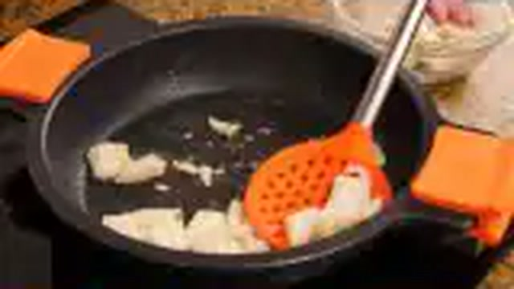
- **Kokotxas de bacalao frescas o desaladas limpias**: 600 g
- **Dientes de ajo laminados**: 5 uds (25 g)
- **Guindilla seca de cayena en aros**: 1 ud (2 g)
- **Aceite de oliva virgen extra suave**: 200 ml
- **Perejil picado fino**: 1 cda (5 g)

### 🔪 Equipamiento y Utillaje Necesario
- Cazuela de barro o sauté de fondo grueso
- Colador de malla fina
- Tabla de corte y tijeras de cocina

### 👨‍🍳 Paso a Paso Técnico y Minucioso
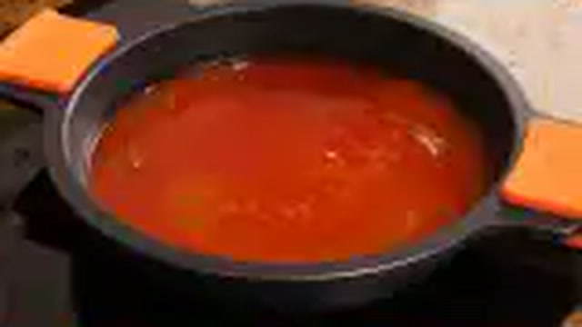
1. **Limpieza y secado:** Retirar telillas duras de las kokotxas con tijeras y secar perfectamente con papel absorbente.
2. **Aromatizado del aceite:** En cazuela con el AOVE, dorar los ajos laminados y la guindilla a fuego suave. Retirar y reservar crujientes.
3. **Confitado proteico:** Templar el aceite a 60°C. Colocar las kokotxas con la piel hacia abajo 3 min y dar la vuelta otros 2 min hasta que liberen abundantes perlas de gelatina.
4. **Emulsión del pil-pil:** Retirar las kokotxas a un plato. A 45°C, emulsionar el aceite y la gelatina con un colador en movimientos circulares continuos durante 3 minutos hasta que la salsa ligue en una crema sedosa. Reincorporar las kokotxas, atemperar 1 min y coronar con ajo y guindilla.

### 🍽️ Emplatado y Textura Final

- Servir en cazuelita de barro caliente, kokotxas con la parte carnosa hacia arriba y pil-pil nácar brillante cubriendo el fondo.

### ⏱️ Protocolo de Conservación y Batch Cooking
- **Refrigeración (0°C a 3°C):** 2 días en recipiente hermético.
- **Congelación (-18°C):** No recomendada.
- **Envasado al Vacío:** 4 días en frío a 2°C.

### 🔥 Guía de Regeneración Multicanal
- **Sartén / Cazuela:** 3 min a fuego mínimo con vaivén suave y 1 cdta de agua templada si la emulsión se disocia.
- **Horno Convectivo:** 6 min a 110°C tapado.
- **Microondas:** No recomendado.

---

## 🐟 Lubina Salvaje al Horno sobre Patatas Panadera

> 📺 **Vídeo y Receta Oficial:** [Ver en Hogarmania / Karlos Arguiñano: Lubina Salvaje al Horno sobre Patatas Panadera](https://www.hogarmania.com/cocina/recetas/)
> 📊 **Infografía Educativa TouChef:** [Ver Infografía Técnica](assets/infografia_lubina_al_horno_sobre_patatas_panadera.jpg)

### 📋 Ficha Técnica y Resumen
| Parámetro | Valor |
|---|---|
| **Tiempo de Preparación** | 20 min |
| **Tiempo de Cocción** | 40 min |
| **Dificultad** | Fácil-Media |
| **Raciones** | 4 raciones |
| **Coste Estimado** | Alto (€€€) |

### ⚠️ Matriz Oficial de Alérgenos (Reglamento UE 1169/2011)
| Alérgeno | Presencia | Ingrediente / Detalle |
|---|:---:|---|
| **Gluten** | ⚪ NO | Ausente (posibles trazas en obrador) |
| **Crustáceos** | ⚪ NO | Ausente (posibles trazas en obrador) |
| **Huevos** | ⚪ NO | Ausente (posibles trazas en obrador) |
| **Pescado** | 🟢 SÍ | Presente en la receta (Lubina salvaje) |
| **Cacahuetes** | ⚪ NO | Ausente (posibles trazas en obrador) |
| **Soja** | ⚪ NO | Ausente (posibles trazas en obrador) |
| **Lácteos** | ⚪ NO | Ausente (posibles trazas en obrador) |
| **Frutos de cáscara** | ⚪ NO | Ausente (posibles trazas en obrador) |
| **Apio** | ⚪ NO | Ausente (posibles trazas en obrador) |
| **Mostaza** | ⚪ NO | Ausente (posibles trazas en obrador) |
| **Sésamo** | ⚪ NO | Ausente (posibles trazas en obrador) |
| **Sulfitos** | 🟢 SÍ | Presente en la receta (Vino blanco y Vinagre) |
| **Altramuces** | ⚪ NO | Ausente (posibles trazas en obrador) |
| **Moluscos** | ⚪ NO | Ausente (posibles trazas en obrador) |

### ⚖️ Ingredientes Exactos (Mise en Place)

- **Lubina salvaje entera abierta en libro (o 4 lomos limpios)**: 1 pieza (1.4 kg)
- **Patatas tipo Monalisa en rodajas panadera de 4 mm**: 4 uds (800 g)
- **Cebollas dulces en juliana**: 2 uds (300 g)
- **Pimiento verde en tiras finas**: 1 ud (100 g)
- **Dientes de ajo laminados**: 4 uds (20 g)
- **Vino blanco seco / Txakoli**: 100 ml
- **Vinagre de sidra**: 30 ml
- **Aceite de oliva virgen extra**: 80 ml
- **Sal marina fina y perejil picado**: al gusto

### 🔪 Equipamiento y Utillaje Necesario
- Fuente refractaria grande de horno
- Sartén para refrito Donostiarra
- Mandolina o cuchillo cebollero

### 👨‍🍳 Paso a Paso Técnico y Minucioso

1. **Horneado de la cama panadera:** Precalentar el horno a 180°C. En la fuente de horno, disponer las patatas en rodajas, la cebolla y el pimiento verde con 50 ml de AOVE, sal y el vino blanco. Hornear a 180°C durante 25-30 minutos hasta que estén tiernas y jugosas.
2. **Asado de la lubina:** Sazonar la lubina. Colocarla abierta sobre las patatas horneadas. Hornear a 190°C durante 12-14 minutos exactos para conservar la textura jugosa y nacarada.
3. **Refrito Donostiarra final:** En sartén con 30 ml de AOVE, dorar los ajos laminados. Sacar la lubina del horno, regar con el vinagre de sidra y verter el refrito hirviendo de ajos encima. Espolvorear perejil picado.

### 🍽️ Emplatado y Textura Final

- Cama generosa de patatas panadera y cebolla confitada en cada plato, lomo de lubina encima y salseado con el jugo de asado emulsionado.

### ⏱️ Protocolo de Conservación y Batch Cooking
- **Refrigeración (0°C a 3°C):** 3 días en nevera.
- **Congelación (-18°C):** No recomendada para las patatas.
- **Envasado al Vacío:** 4 días en frío.

### 🔥 Guía de Regeneración Multicanal
- **Sartén / Cazuela:** 4-5 min a fuego suave tapado.
- **Horno Convectivo:** 8-10 min a 150°C tapado.
- **Microondas:** 2-3 min a 600W tapado.

---

## 🐟 Rodaballo a la Plancha / Horno con Refrito Tradicional Donostiarra

> 📺 **Vídeo y Receta Oficial:** [Ver en Hogarmania / Karlos Arguiñano: Rodaballo a la Plancha / Horno con Refrito Tradicional Donostiarra](https://www.hogarmania.com/cocina/recetas/)
> 📊 **Infografía Educativa TouChef:** [Ver Infografía Técnica](assets/infografia_rodaballo_a_la_plancha_con_refrito_de_ajos.jpg)

### 📋 Ficha Técnica y Resumen
| Parámetro | Valor |
|---|---|
| **Tiempo de Preparación** | 15 min |
| **Tiempo de Cocción** | 25 min |
| **Dificultad** | Media |
| **Raciones** | 4 raciones |
| **Coste Estimado** | Alto (€€€) |

### ⚠️ Matriz Oficial de Alérgenos (Reglamento UE 1169/2011)
| Alérgeno | Presencia | Ingrediente / Detalle |
|---|:---:|---|
| **Gluten** | ⚪ NO | Ausente (posibles trazas en obrador) |
| **Crustáceos** | ⚪ NO | Ausente (posibles trazas en obrador) |
| **Huevos** | ⚪ NO | Ausente (posibles trazas en obrador) |
| **Pescado** | 🟢 SÍ | Presente en la receta (Rodaballo salvaje) |
| **Cacahuetes** | ⚪ NO | Ausente (posibles trazas en obrador) |
| **Soja** | ⚪ NO | Ausente (posibles trazas en obrador) |
| **Lácteos** | ⚪ NO | Ausente (posibles trazas en obrador) |
| **Frutos de cáscara** | ⚪ NO | Ausente (posibles trazas en obrador) |
| **Apio** | ⚪ NO | Ausente (posibles trazas en obrador) |
| **Mostaza** | ⚪ NO | Ausente (posibles trazas en obrador) |
| **Sésamo** | ⚪ NO | Ausente (posibles trazas en obrador) |
| **Sulfitos** | 🟢 SÍ | Presente en la receta (Vinagre de sidra) |
| **Altramuces** | ⚪ NO | Ausente (posibles trazas en obrador) |
| **Moluscos** | ⚪ NO | Ausente (posibles trazas en obrador) |

### ⚖️ Ingredientes Exactos (Mise en Place)

- **Rodaballo salvaje entero limpio (o tronzado en 4 piezas)**: 1 pieza (1.5 kg)
- **Dientes de ajo laminados**: 6 uds (30 g)
- **Guindilla seca en aros**: 1 ud (2 g)
- **Vinagre de sidra de Guipúzcoa**: 40 ml
- **Aceite de oliva virgen extra**: 80 ml
- **Sal gorda marina**: 1 cda (15 g)
- **Perejil picado**: 1 cda (5 g)

### 🔪 Equipamiento y Utillaje Necesario
- Plancha o sartén amplia besuguera
- Bandeja de horno refractaria
- Sartén pequeña para refrito

### 👨‍🍳 Paso a Paso Técnico y Minucioso

1. **Marcado exterior:** Realizar incisiones superficiales en la piel oscura del rodaballo. Sazonar con sal gruesa y marcar en plancha viva con unas gotas de aceite durante 3 min por lado para activar la gelatina exterior.
2. **Terminado al horno:** Hornear en bandeja a 200°C durante 15-18 minutos hasta que la carne junto a la espina se separe en lascas firmes y gelatinosas.
3. **Refrito Donostiarra:** Dorar los ajos laminados y la guindilla en 80 ml de AOVE. Regar el rodaballo con el vinagre de sidra y luego con el refrito hirviendo. Escurrir los jugos de la bandeja a la sartén, ligar con vaivén y salsear nuevamente sobre el pescado.

### 🍽️ Emplatado y Textura Final

- Servir las lascas de rodaballo con su piel gelatinosa crujiente napadas con el refrito brillante y ajos tostados.

### ⏱️ Protocolo de Conservación y Batch Cooking
- **Refrigeración (0°C a 3°C):** 2 días en nevera.
- **Congelación (-18°C):** No recomendada.
- **Envasado al Vacío:** 3 días en frío.

### 🔥 Guía de Regeneración Multicanal
- **Sartén / Cazuela:** 4 min a fuego muy suave tapado.
- **Horno Convectivo:** 6-8 min a 150°C tapado.
- **Microondas:** 2 min a 600W.

---

## 🦑 Calamares Encebollados en su Propio Jugo

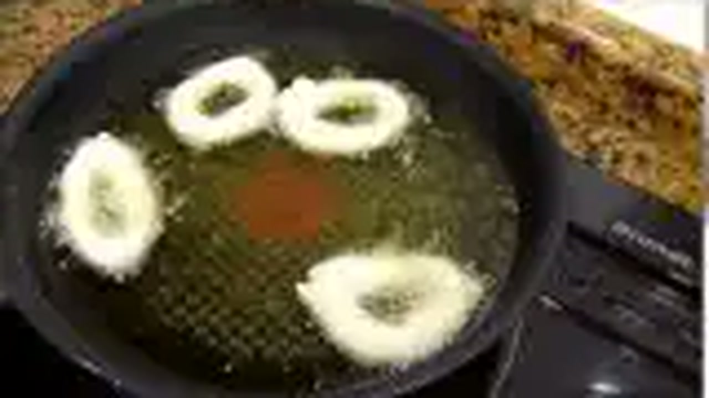

> 📺 **Vídeo y Receta Oficial:** [Ver en Hogarmania / Karlos Arguiñano: Calamares Encebollados en su Propio Jugo](https://www.hogarmania.com/cocina/recetas/)
> 📊 **Infografía Educativa TouChef:** [Ver Infografía Técnica](assets/infografia_calamares_encebollados_en_su_jugo.jpg)

### 📋 Ficha Técnica y Resumen
| Parámetro | Valor |
|---|---|
| **Tiempo de Preparación** | 20 min |
| **Tiempo de Cocción** | 45 min |
| **Dificultad** | Fácil |
| **Raciones** | 4 raciones |
| **Coste Estimado** | Medio (€€) |

### ⚠️ Matriz Oficial de Alérgenos (Reglamento UE 1169/2011)
| Alérgeno | Presencia | Ingrediente / Detalle |
|---|:---:|---|
| **Gluten** | ⚪ NO | Ausente (posibles trazas en obrador) |
| **Crustáceos** | ⚪ NO | Ausente (posibles trazas en obrador) |
| **Huevos** | ⚪ NO | Ausente (posibles trazas en obrador) |
| **Pescado** | ⚪ NO | Ausente (posibles trazas en obrador) |
| **Cacahuetes** | ⚪ NO | Ausente (posibles trazas en obrador) |
| **Soja** | ⚪ NO | Ausente (posibles trazas en obrador) |
| **Lácteos** | ⚪ NO | Ausente (posibles trazas en obrador) |
| **Frutos de cáscara** | ⚪ NO | Ausente (posibles trazas en obrador) |
| **Apio** | ⚪ NO | Ausente (posibles trazas en obrador) |
| **Mostaza** | ⚪ NO | Ausente (posibles trazas en obrador) |
| **Sésamo** | ⚪ NO | Ausente (posibles trazas en obrador) |
| **Sulfitos** | 🟢 SÍ | Presente en la receta (Txakoli / Vino blanco) |
| **Altramuces** | ⚪ NO | Ausente (posibles trazas en obrador) |
| **Moluscos** | 🟢 SÍ | Presente en la receta (Calamares) |

### ⚖️ Ingredientes Exactos (Mise en Place)
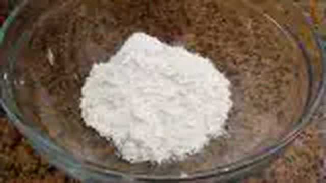
- **Calamares frescos limpios en anillas y tentáculos enteros**: 1 kg
- **Cebollas dulces picadas en juliana fina**: 4 uds (600 g)
- **Dientes de ajo picados**: 3 uds (15 g)
- **Vino blanco seco (Txakoli o Verdejo)**: 100 ml
- **Aceite de oliva virgen extra**: 50 ml
- **Sal marina, pimienta negra y perejil fresco**: al gusto

### 🔪 Equipamiento y Utillaje Necesario
- Cazuela de barro o hierro colado con tapa
- Tabla de corte y cuchillo cebollero
- Cuchara de madera

### 👨‍🍳 Paso a Paso Técnico y Minucioso

1. **Fondeado y caramelización:** En cazuela con el AOVE, añadir los ajos y toda la cebolla en juliana con una pizca de sal. Pochar a fuego mínimo tapado durante 30 minutos hasta que la cebolla reduzca a 1/3 y tome un color dorado tostado natural.
2. **Rehogado de calamares:** Subir el fuego, incorporar los calamares troceados y saltear 3-4 minutos para que liberen su agua de mar.
3. **Estofado en su jugo:** Verter el vino blanco, evaporar 2 min, tapar y cocer a fuego mínimo durante 25 minutos en su propio jugo hasta que los calamares estén tiernos y la salsa concentrada y melosa. Ajustar de sal, pimienta y perejil.

### 🍽️ Emplatado y Textura Final

- Servir en cazuela de barro o plato hondo con su compota de cebolla melosa y guarnición de patatas fritas en dados o arroz blanco.

### ⏱️ Protocolo de Conservación y Batch Cooking
- **Refrigeración (0°C a 3°C):** 4 días (mejora al día siguiente).
- **Congelación (-18°C):** 3 meses.
- **Envasado al Vacío:** 7 días en frío.

### 🔥 Guía de Regeneración Multicanal
- **Sartén / Cazuela:** 4 min a fuego suave con 1 cda de agua.
- **Horno Convectivo:** 8 min a 160°C tapado.
- **Microondas:** 2 min a 750W tapado.

---

## 🐟 Bacalao a la Vizcaína con Salsa de Pimientos Choriceros

> 📺 **Vídeo y Receta Oficial:** [Ver en Hogarmania / Karlos Arguiñano: Bacalao a la Vizcaína con Salsa de Pimientos Choriceros](https://www.hogarmania.com/cocina/recetas/)
> 📊 **Infografía Educativa TouChef:** [Ver Infografía Técnica](assets/infografia_bacalao_a_la_vizcaina_con_pimientos_choriceros.jpg)

### 📋 Ficha Técnica y Resumen
| Parámetro | Valor |
|---|---|
| **Tiempo de Preparación** | 25 min |
| **Tiempo de Cocción** | 45 min |
| **Dificultad** | Media |
| **Raciones** | 4 raciones |
| **Coste Estimado** | Medio (€€) |

### ⚠️ Matriz Oficial de Alérgenos (Reglamento UE 1169/2011)
| Alérgeno | Presencia | Ingrediente / Detalle |
|---|:---:|---|
| **Gluten** | 🟢 SÍ | Presente en la receta (Galleta María / Pan frito para ligar) |
| **Crustáceos** | ⚪ NO | Ausente (posibles trazas en obrador) |
| **Huevos** | ⚪ NO | Ausente (posibles trazas en obrador) |
| **Pescado** | 🟢 SÍ | Presente en la receta (Bacalao y Fumet) |
| **Cacahuetes** | ⚪ NO | Ausente (posibles trazas en obrador) |
| **Soja** | ⚪ NO | Ausente (posibles trazas en obrador) |
| **Lácteos** | ⚪ NO | Ausente (posibles trazas en obrador) |
| **Frutos de cáscara** | ⚪ NO | Ausente (posibles trazas en obrador) |
| **Apio** | ⚪ NO | Ausente (posibles trazas en obrador) |
| **Mostaza** | ⚪ NO | Ausente (posibles trazas en obrador) |
| **Sésamo** | ⚪ NO | Ausente (posibles trazas en obrador) |
| **Sulfitos** | ⚪ NO | Ausente (posibles trazas en obrador) |
| **Altramuces** | ⚪ NO | Ausente (posibles trazas en obrador) |
| **Moluscos** | ⚪ NO | Ausente (posibles trazas en obrador) |

### ⚖️ Ingredientes Exactos (Mise en Place)
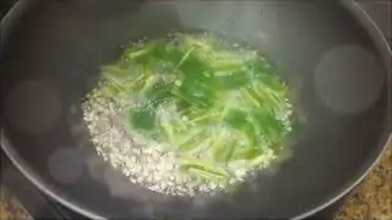
- **Lomos gruesos de bacalao desalado**: 4 uds (800 g)
- **Pimientos choriceros secos hidratados (o pulpa pura)**: 8 uds (100 g de pulpa)
- **Cebollas rojas de Zalla / moradas en juliana**: 4 uds (600 g)
- **Dientes de ajo picados**: 3 uds (15 g)
- **Galletas María o rebanada de pan frito para ligar**: 2 uds (20 g)
- **Fumet de espinas de bacalao**: 200 ml
- **Aceite de oliva virgen extra**: 80 ml
- **Sal marina fina**: al gusto

### 🔪 Equipamiento y Utillaje Necesario
- Cazuela de barro refractaria
- Sartén para confitar el bacalao
- Pasapurés o batidora y colador fino

### 👨‍🍳 Paso a Paso Técnico y Minucioso

1. **Extracción de pulpa choricera:** Escaldar los pimientos choriceros secos 10 min en agua hirviendo y raspar la pulpa interior con una puntilla.
2. **Salsa vizcaína artesanal:** En cazuela con 50 ml de AOVE, pochar la cebolla roja y los ajos a fuego lentísimo durante 35 minutos hasta caramelizar. Añadir la pulpa de choricero, el pan/galletas y el fumet. Cocinar 15 min, triturar finamente y colar.
3. **Confitado e integración:** En sartén con 30 ml de AOVE, confitar los lomos con la piel hacia arriba 4 min a 70°C. Pasarlos a la cazuela con la salsa vizcaína caliente y terminar de cocer 5 minutos a fuego muy suave tapado.

### 🍽️ Emplatado y Textura Final

- Lomo de bacalao en el centro napado con la salsa vizcaína rojo bermellón brillante y unas hojas de perejil.

### ⏱️ Protocolo de Conservación y Batch Cooking
- **Refrigeración (0°C a 3°C):** 4 días (la salsa gana intensidad tras 24 h).
- **Congelación (-18°C):** 2 meses.
- **Envasado al Vacío:** 6 días en frío.

### 🔥 Guía de Regeneración Multicanal
- **Sartén / Cazuela:** 4 min a fuego suave tapado.
- **Horno Convectivo:** 8 min a 150°C tapado.
- **Microondas:** 2 min a 600W.

---

## 🐟 Rape / Sapito a la Marinera con Almejas y Langostinos

> 📺 **Vídeo y Receta Oficial:** [Ver en Hogarmania / Karlos Arguiñano: Rape / Sapito a la Marinera con Almejas y Langostinos](https://www.hogarmania.com/cocina/recetas/)
> 📊 **Infografía Educativa TouChef:** [Ver Infografía Técnica](assets/infografia_rape_a_la_marinera_con_almejas_y_langostinos.jpg)

### 📋 Ficha Técnica y Resumen
| Parámetro | Valor |
|---|---|
| **Tiempo de Preparación** | 20 min |
| **Tiempo de Cocción** | 25 min |
| **Dificultad** | Fácil-Media |
| **Raciones** | 4 raciones |
| **Coste Estimado** | Alto (€€€) |

### ⚠️ Matriz Oficial de Alérgenos (Reglamento UE 1169/2011)
| Alérgeno | Presencia | Ingrediente / Detalle |
|---|:---:|---|
| **Gluten** | 🟢 SÍ | Presente en la receta (Harina de trigo para enharinar) |
| **Crustáceos** | 🟢 SÍ | Presente en la receta (Langostinos) |
| **Huevos** | ⚪ NO | Ausente (posibles trazas en obrador) |
| **Pescado** | 🟢 SÍ | Presente en la receta (Rape / Sapito) |
| **Cacahuetes** | ⚪ NO | Ausente (posibles trazas en obrador) |
| **Soja** | ⚪ NO | Ausente (posibles trazas en obrador) |
| **Lácteos** | ⚪ NO | Ausente (posibles trazas en obrador) |
| **Frutos de cáscara** | ⚪ NO | Ausente (posibles trazas en obrador) |
| **Apio** | ⚪ NO | Ausente (posibles trazas en obrador) |
| **Mostaza** | ⚪ NO | Ausente (posibles trazas en obrador) |
| **Sésamo** | ⚪ NO | Ausente (posibles trazas en obrador) |
| **Sulfitos** | 🟢 SÍ | Presente en la receta (Brandy / Coñac) |
| **Altramuces** | ⚪ NO | Ausente (posibles trazas en obrador) |
| **Moluscos** | 🟢 SÍ | Presente en la receta (Almejas) |

### ⚖️ Ingredientes Exactos (Mise en Place)

- **Medallones limpios de rape (sapito) fresco**: 800 g
- **Almejas finas purgadas**: 250 g (14-16 uds)
- **Langostinos o gambones frescos**: 8-12 uds (300 g)
- **Cebolla dulce picada en brunoise fina**: 1 ud (150 g)
- **Dientes de ajo picados**: 3 uds (15 g)
- **Tomate maduro triturado casero**: 2 cdas (50 g)
- **Pimentón dulce de La Vera con DOP**: 1 cdta (5 g)
- **Harina de trigo para enharinar**: 20 g
- **Brandy / Coñac**: 40 ml
- **Fumet concentrado de pescado y cabezas de marisco**: 300 ml
- **Aceite de oliva virgen extra**: 50 ml
- **Sal marina y perejil picado**: al gusto

### 🔪 Equipamiento y Utillaje Necesario
- Cazuela baja de barro o acero
- Tabla de corte y cuchillo cebollero
- Cazo para fumet de marisco

### 👨‍🍳 Paso a Paso Técnico y Minucioso

1. **Fumet marinero:** Pelar los langostinos reservando colas; dorar cabezas y cáscaras en 15 ml de AOVE aplastando para extraer jugos, cubrir con agua, cocer 15 min y colar.
2. **Sellado del rape:** Sazonar y enharinar ligeramente los medallones de rape. Marcar en cazuela con 25 ml de AOVE a fuego vivo 1 min por lado y retirar.
3. **Sofrito y flambeado:** En la misma cazuela, pochar la cebolla y el ajo. Añadir el tomate triturado y el pimentón dulce. Verter el brandy y flambear con cuidado.
4. **Guisado marinero conjunto:** Verter el fumet colado caliente. Reincorporar los medallones de rape, las almejas y los langostinos pelados. Cocer tapado a fuego medio durante 5-6 minutos hasta abrir las almejas y dejar el rape jugoso. Espolvorear perejil.

### 🍽️ Emplatado y Textura Final

- Servir en plato hondo con 2 medallones de rape por comensal, langostinos y almejas abiertos bañados en la salsa marinera rojiza.

### ⏱️ Protocolo de Conservación y Batch Cooking
- **Refrigeración (0°C a 3°C):** 2 días en frío hermético.
- **Congelación (-18°C):** 1 mes.
- **Envasado al Vacío:** 3 días en frío.

### 🔥 Guía de Regeneración Multicanal
- **Sartén / Cazuela:** 3-4 min a fuego suave con 2 cdas de caldo.
- **Horno Convectivo:** 6-8 min a 150°C tapado.
- **Microondas:** 2 min a 600W tapado.

---

## 🐟 Kokotxas de Merluza Rebozadas con Pimientos de Gernika / Padrón

> 📺 **Vídeo y Receta Oficial:** [Ver en Hogarmania / Karlos Arguiñano: Kokotxas de Merluza Rebozadas con Pimientos de Gernika / Padrón](https://www.hogarmania.com/cocina/recetas/)
> 📊 **Infografía Educativa TouChef:** [Ver Infografía Técnica](assets/infografia_kokotxas_de_merluza_rebozadas_con_pimientos.jpg)

### 📋 Ficha Técnica y Resumen
| Parámetro | Valor |
|---|---|
| **Tiempo de Preparación** | 15 min |
| **Tiempo de Cocción** | 10 min |
| **Dificultad** | Fácil |
| **Raciones** | 4 raciones |
| **Coste Estimado** | Alto (€€€) |

### ⚠️ Matriz Oficial de Alérgenos (Reglamento UE 1169/2011)
| Alérgeno | Presencia | Ingrediente / Detalle |
|---|:---:|---|
| **Gluten** | 🟢 SÍ | Presente en la receta (Harina de trigo) |
| **Crustáceos** | ⚪ NO | Ausente (posibles trazas en obrador) |
| **Huevos** | 🟢 SÍ | Presente en la receta (Huevos batidos) |
| **Pescado** | 🟢 SÍ | Presente en la receta (Kokotxas de merluza) |
| **Cacahuetes** | ⚪ NO | Ausente (posibles trazas en obrador) |
| **Soja** | ⚪ NO | Ausente (posibles trazas en obrador) |
| **Lácteos** | ⚪ NO | Ausente (posibles trazas en obrador) |
| **Frutos de cáscara** | ⚪ NO | Ausente (posibles trazas en obrador) |
| **Apio** | ⚪ NO | Ausente (posibles trazas en obrador) |
| **Mostaza** | ⚪ NO | Ausente (posibles trazas en obrador) |
| **Sésamo** | ⚪ NO | Ausente (posibles trazas en obrador) |
| **Sulfitos** | ⚪ NO | Ausente (posibles trazas en obrador) |
| **Altramuces** | ⚪ NO | Ausente (posibles trazas en obrador) |
| **Moluscos** | ⚪ NO | Ausente (posibles trazas en obrador) |

### ⚖️ Ingredientes Exactos (Mise en Place)

- **Kokotxas de merluza frescas limpias**: 500 g (25-30 uds)
- **Huevos camperos batidos**: 2 uds
- **Harina de trigo tamizada**: 60 g
- **Pimientos de Gernika o Padrón**: 200 g
- **Aceite de oliva virgen extra suave para freír**: 200 ml
- **Sal marina fina y escamas de sal**: al gusto
- **Diente de ajo machacado (para aromatizar)**: 1 ud

### 🔪 Equipamiento y Utillaje Necesario
- Sartén honda antiadherente para fritura
- Platos hondos para harina y huevo batido
- Espumadera y papel secante

### 👨‍🍳 Paso a Paso Técnico y Minucioso

1. **Fritura de pimientos:** En sartén con el AOVE y el ajo machacado, freír los pimientos a fuego vivo 3-4 minutos hasta que la piel se ampolle. Escurrir sobre papel y sazonar con escamas de sal.
2. **Acondicionado de kokotxas:** Secar las kokotxas y sazonar con sal fina.
3. **Rebozado esponjoso:** Pasar las kokotxas por harina sacudiendo el exceso y luego por el huevo batido envolviéndolas bien.
4. **Fritura exprés:** En el AOVE bien caliente (175-180°C), freír en tandas pequeñas durante 45-60 segundos por cara hasta lograr un rebozado dorado y esponjoso con el corazón tierno y gelatinoso. Escurrir sobre papel secante.

### 🍽️ Emplatado y Textura Final

- Servir recién fritas en plato llano o fuente caliente, acompañadas de los pimientos de Gernika y una rodaja de limón.

### ⏱️ Protocolo de Conservación y Batch Cooking
- **Refrigeración (0°C a 3°C):** 1 día en nevera (el rebozado pierde crujiente).
- **Congelación (-18°C):** No recomendada tras freír.
- **Envasado al Vacío:** No recomendado.

### 🔥 Guía de Regeneración Multicanal
- **Sartén / Cazuela:** Saltear 1 min a fuego vivo en sartén seca.
- **Horno Convectivo / Airfryer:** 3-4 min a 180°C para devolver el crujiente exterior.
- **Microondas:** No recomendado (humedece y reblandece el rebozado).
