# 🥣 Legumbres y Platos de Cuchara Tradicionales
> **Colección Oficial TouChef: Maestría Tradicional de Karlos Arguiñano**  
> *Recetario Técnico Enciclopédico Profesional, Matrices Oficiales de 14 Alérgenos UE (Reglamento 1169/2011), Pesos Exactos en Gramos (g) y Mililitros (ml), Protocolos de Conservación Batch Cooking y Guías de Regeneración Multicanal.*

---

## 📖 Prólogo Técnico: Los Secretos de la Legumbre y el Guiso de Cuchara

Las legumbres y los platos de cuchara constituyen la médula espinal de la cocina tradicional vasca, navarra y española. En las manos y el magisterio de **Karlos Arguiñano**, una cazuela de alubias de Tolosa, unas pochas frescas de Sangüesa o un estofado de lentejas con codillo se elevan a la categoría de alta gastronomía popular. Lograr una legumbre mantequillosa, con la piel intacta (*sin pellejo desprendido*) y un caldo denso, trabado y brillante que acaricie el paladar es fruto del dominio estricto de la física del agua y la termodinámica culinaria.

Para alcanzar la excelencia canónica TouChef en platos de legumbres, deben respetarse cinco mandamientos técnicos:

```
                          LEYES MAESTRAS DE LA LEGUMBRE
                                           
  ┌───────────────────────┐   ┌───────────────────────┐   ┌───────────────────────┐
  │   1. AGUA Y TERMO-    │   │   2. ESPUMADO Y       │   │  3. LIGAZÓN POR       │
  │      DINÁMICA         │──▶│      "ASUSTADO"       │──▶│      VAIVÉN           │
  │ • Garbanzo: caliente  │   │ • Retirada de saponina│   │ • 0% cuchara metálica │
  │ • Alubia: fría (0 re- │   │ • Corte térmico con   │   │ • Emulsión coloidal   │
  │   mojo en Tolosa)     │   │   agua helada         │   │   de amilosa natural  │
  └───────────────────────┘   └───────────────────────┘   └───────────────────────┘
                                          │
                                          ▼
                      ┌───────────────────────────────────────┐
                      │    4. COMPANGO Y DESGRASE NOBLE       │
                      │ • Cocción por separado de embutidos   │
                      │ • Extracción de colágeno sin exceso   │
                      │   lipídico en el caldo principal      │
                      └───────────────────┬───────────────────┘
                                          │
                                          ▼
                      ┌───────────────────────────────────────┐
                      │    5. MADURACIÓN Y ASENTADO (24H)     │
                      │ • Retrogradación del almidón          │
                      │ • Redistribución osmótica de aromas   │
                      └───────────────────────────────────────┘
```

1. **La Termodinámica del Agua según la Variedad:**
   * **El Garbanzo:** Es la única legumbre que **exige entrar siempre en agua caliente**. Si entra en agua fría, las proteínas de su cutícula se calcifican y se endurece irreversiblemente (*garbanzo encallado*).
   * **La Alubia Negra de Tolosa e IGP Gernika:** Al ser granos de piel extremadamente fina y tierna de cosecha del año, **no precisan remojo previo**; se inician en agua mineral fría con un chorro generoso de AOVE en crudo.
   * **Las Pochas Frescas (Navarra / Rioja):** Al ser alubias frescas desgranadas antes de secarse, no requieren remojo y su tiempo de cocción es muy breve (30-40 minutos).
2. **El "Asustado" de las Alubias (*Beldurtzea*):** Cortar la ebullición viva 2 o 3 veces con chorritos de agua mineral muy fría frena la expansión violenta de vapor en el interior del grano, evitando que la piel se rompa y garantizando que el grano se mantenga entero pero suave como mantequilla.
3. **El Movimiento de Vaivén (Prohibición de Cucharas Metálicas):** Las alubias cocinadas jamás se remueven con cucharas duras o metálicas, las cuales trituran el hollejo. La cazuela se sostiene firmemente por las asas y se imprime un suave balanceo circular; el frote natural entre las alubias desprende una emulsión microscópica de almidón que transforma el caldo en un terciopelo espeso.
4. **La Cocción Separada de los Sacramentos:** El compango tradicional (morcilla de Beasain, chorizo curado, tocino y costilla) y la berza se cuecen en una olla independiente. De este modo se desengrasa la carne, preservando la pureza cristalina y el sabor a tierra de la alubia, sirviéndose los sacramentos como acompañamiento noble en fuente aparte.
5. **La Maduración y Reposo:** Un plato de legumbre alcanza su clímax gustativo tras varias horas de reposo o al día siguiente, cuando el almidón se estabiliza y los aromas se funden homogéneamente.

---

## 📑 Índice General de Recetas

1. [🥣 Alubias de Tolosa con Sacramentos (Chorizo, Morcilla de Beasain, Tocino, Costilla y Berza)](#1--alubias-de-tolosa-con-sacramentos-chorizo-morcilla-de-beasain-tocino-costilla-y-berza)
2. [🍲 Garbanzos de Vigilia con Espinacas Frescas y Bacalao Desalado](#2--garbanzos-de-vigilia-con-espinacas-frescas-y-bacalao-desalado)
3. [🥘 Lentejas Pardinas con Codillo de Cerdo y Verduras de la Huerta](#3--lentejas-pardinas-con-codillo-de-cerdo-y-verduras-de-la-huerta)
4. [🦪 Pochas Frescas de Navarra con Almejas en Salsa Verde](#4--pochas-frescas-de-navarra-con-almejas-en-salsa-verde)
5. [🦆 Fabes Asturianas Estofadas con Codornices Salteadas](#5--fabes-asturianas-estofadas-con-codornices-salteadas)
6. [🫘 Alubias Rojas de Guernica con Costilla Adobada y Chorizo](#6--alubias-rojas-de-guernica-con-costilla-adobada-y-chorizo)
7. [🦐 Garbanzos con Langostinos y Almejas al Estilo Marinero](#7--garbanzos-con-langostinos-y-almejas-al-estilo-marinero)
8. [🍲 Pochas de Sangüesa con Chistorra y Panceta Ibérica](#8--pochas-de-sangüesa-con-chistorra-y-panceta-ibérica)
9. [🥘 Lentejas Castellanas con Boletus y Verduras de Temporada (Veganas)](#9--lentejas-castellanas-con-boletus-y-verduras-de-temporada-veganas)
10. [🫘 Judías Pintas Estofadas con Rabo de Toro y Pimientos del Piquillo](#10--judías-pintas-estofadas-con-rabo-de-toro-y-pimientos-del-piquillo)

---

## 1. 🥣 Alubias de Tolosa con Sacramentos (Chorizo, Morcilla de Beasain, Tocino, Costilla y Berza)


> 📺 **Vídeo y Receta Oficial:** [Ver en Hogarmania / Karlos Arguiñano: Alubias de Tolosa con Sacramentos](https://www.hogarmania.com/cocina/recetas/legumbres/alubias-tolosa-sacramentos-arguinano.html)  
> 📊 **Infografía Educativa TouChef:** [Ver Infografía Técnica](assets/infografia_alubias_de_tolosa_con_sacramentos_chorizo_morcilla.jpg)

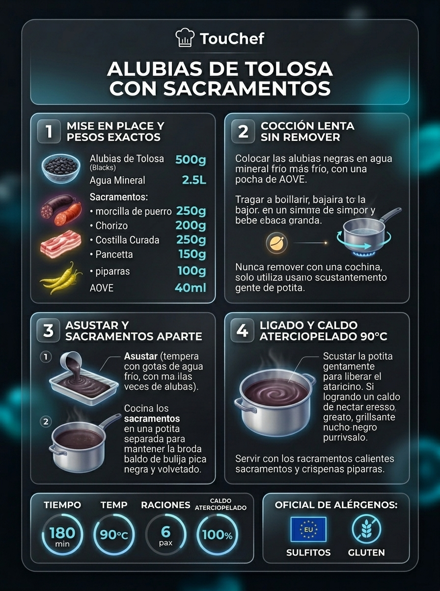

### 📋 Ficha Técnica y Resumen
| Parámetro | Valor |
|---|---|
| **Tiempo de Preparación** | 15 min |
| **Tiempo de Cocción** | 2 h 30 min |
| **Dificultad** | Fácil-Media |
| **Raciones** | 6 personas (aprox. 450 g por ración completa) |
| **Coste Estimado** | Medio (€€) - 9,50 € total / 1,58 € ración |

### ⚠️ Matriz Oficial de Alérgenos (Reglamento UE 1169/2011)
| Alérgeno | Presencia | Ingrediente / Detalle |
|---|:---:|---|
| **Gluten** | ⚪ NO | Ausente de forma natural |
| **Crustáceos** | ⚪ NO | Ausente |
| **Huevos** | ⚪ NO | Ausente |
| **Pescado** | ⚪ NO | Ausente |
| **Cacahuetes** | ⚪ NO | Ausente |
| **Soja** | ⚪ NO | Ausente |
| **Lácteos** | ⚪ NO | Ausente |
| **Frutos de cáscara** | ⚪ NO | Ausente |
| **Apio** | ⚪ NO | Ausente |
| **Mostaza** | ⚪ NO | Ausente |
| **Sésamo** | ⚪ NO | Ausente |
| **Sulfitos** | 🟢 SÍ | Presente en los embutidos curados (chorizo/morcilla) y piparras |
| **Altramuces** | ⚪ NO | Ausente |
| **Moluscos** | ⚪ NO | Ausente |

### ⚖️ Ingredientes Exactos (Mise en Place)

- **Alubia negra de Tolosa con IGP (Tolosa Babarruna)**: 500 g
- **Chorizo artesano curado de caserío**: 2 unidades (200 g)
- **Morcilla de cebolla y puerro de Beasain**: 1 unidad (220 g)
- **Costilla de cerdo fresca o adobada**: 300 g
- **Panceta curada o tocino ibérico entreverado**: 200 g
- **Berza / Col rizada fresca de caserío**: 1/2 unidad (400 g)
- **Guindillas de Ibarra (Ibartarrak) en vinagre**: 1 tarro (150 g)
- **Aceite de oliva virgen extra (AOVE)**: 60 ml
- **Agua mineral blanda fría**: 2.500 ml
- **Dientes de ajo pelados**: 2 unidades (10 g, para la berza)
- **Sal marina fina**: 8 g (incorporar solo al final)

### 🔪 Equipamiento y Utillaje Necesario
- Cazuela ancha y honda de barro refractario o hierro fundido esmaltado (Ø 28-30 cm).
- Olla auxiliar de 4 litros para cocer los sacramentos.
- Escurridor, tabla de corte y cuchillo de chef.

### 👨‍🍳 Paso a Paso Técnico y Minucioso

1. **Inicio en frío sin remojo:** Colocar las alubias de Tolosa directamente en la cazuela principal con 2.000 ml de agua mineral fría y 40 ml de AOVE en crudo. Poner a fuego vivo hasta que alcance la primera ebullición.
2. **Asustado y cocción a fuego mínimo:** En cuanto rompa el hervor, verter un chorrito de 50 ml de agua fría para frenar el hervor. Repetir esta operación de "asustado" 3 veces durante la primera hora. Bajar el fuego al mínimo absoluto (*chup-chup* apenas imperceptible a 85-90°C) y cocer tapado durante **2 horas a 2 horas y 15 minutos**.
3. **Cocción de los sacramentos por separado:** En la olla auxiliar con agua hirviendo, introducir la costilla de cerdo, el tocino entreverado y los chorizos. Cocer a fuego medio durante 45 minutos. Pinchar la morcilla de Beasain con un palillo para que no reviente y añadirla a la olla durante los últimos 15 minutos de cocción. Retirar y reservar calientes.
4. **Cocción y refrito de la berza:** En otra cazuela con agua hirviendo y sal, cocer la berza cortada en juliana durante 15 minutos. Escurrir muy bien. En una sartén, dorar los 2 ajos laminados en 20 ml de AOVE y rehogar la berza escurrida durante 3 minutos.
5. **Ligazón del caldo por vaivén:** Cuando la alubia esté tierna como terciopelo, añadir los 8 g de sal marina. Con la cazuela sujeta por las dos asas, realizar movimientos circulares suaves y continuos durante 3 minutos. El almidón natural de la alubia espesará el caldo hasta convertirlo en un manto color chocolate espeso, denso y brillante. Dejar reposar 15 minutos fuera del fuego.

### 🍽️ Emplatado y Textura Final
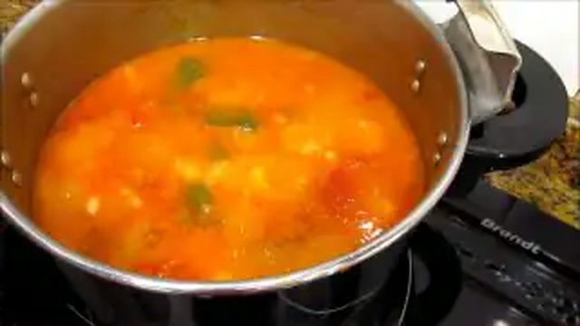
- Servir en plato hondo bien caliente las alubias con su caldo ligado. En una fuente central de porcelana o madera, disponer los sacramentos troceados en porciones individuales (chorizo, morcilla, costilla, tocino), el montículo de berza rehogada con ajos y las piparras de Ibarra con sal gorda y unas gotas de AOVE.

### ⏱️ Protocolo de Conservación y Batch Cooking
- **Refrigeración (0°C a 3°C):** 4-5 días en recipiente hermético de cristal. Las alubias y los sacramentos se conservan en tápers separados para evitar engrasar el caldo.
- **Congelación (-18°C):** Las alubias con su caldo se congelan perfectamente hasta por 3 meses.
- **Envasado al Vacío:** 7-8 días en refrigeración controlada a 2°C.

### 🔥 Guía de Regeneración Multicanal
- **Cazuela Tradicional:** Calentar a fuego muy suave durante 5 minutos con vaivén continuo; si el caldo está muy espeso, añadir 30 ml de agua caliente.
- **Microondas:** 3 minutos a 700W tapado con campana.

---

## 2. 🍲 Garbanzos de Vigilia con Espinacas Frescas y Bacalao Desalado


> 📺 **Vídeo y Receta Oficial:** [Ver en Hogarmania / Karlos Arguiñano: Garbanzos de Vigilia con Bacalao y Espinacas](https://www.hogarmania.com/cocina/recetas/legumbres/garbanzos-bacalao-espinacas-arguinano.html)  
> 📊 **Infografía Educativa TouChef:** [Ver Infografía Técnica](assets/infografia_garbanzos_con_bacalao_y_espinacas_de_cuaresma.jpg)


### 📋 Ficha Técnica y Resumen
| Parámetro | Valor |
|---|---|
| **Tiempo de Preparación** | 20 min (+ 12 h remojo) |
| **Tiempo de Cocción** | 1 h 15 min (tradicional) / 25 min (olla rápida) |
| **Dificultad** | Fácil-Media |
| **Raciones** | 4-5 personas (aprox. 420 g por ración) |
| **Coste Estimado** | Económico (€) - 6,20 € total / 1,24 € ración |

### ⚠️ Matriz Oficial de Alérgenos (Reglamento UE 1169/2011)
| Alérgeno | Presencia | Ingrediente / Detalle |
|---|:---:|---|
| **Gluten** | 🟢 SÍ | Pan candeal frito del majado (sustituible por pan sin gluten) |
| **Crustáceos** | ⚪ NO | Ausente |
| **Huevos** | 🟢 SÍ | Huevos camperos duros (yemas en majado, claras picadas) |
| **Pescado** | 🟢 SÍ | Bacalao desalado de primera calidad |
| **Cacahuetes** | ⚪ NO | Ausente |
| **Soja** | ⚪ NO | Ausente |
| **Lácteos** | ⚪ NO | Ausente |
| **Frutos de cáscara** | 🟢 SÍ | Almendras tostadas del majado tradicional |
| **Apio** | ⚪ NO | Ausente |
| **Mostaza** | ⚪ NO | Ausente |
| **Sésamo** | ⚪ NO | Ausente |
| **Sulfitos** | ⚪ NO | Ausente |
| **Altramuces** | ⚪ NO | Ausente |
| **Moluscos** | ⚪ NO | Ausente |

### ⚖️ Ingredientes Exactos (Mise en Place)
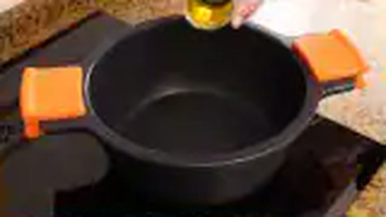
- **Garbanzos secos (Pedrosillano o Castellano)**: 400 g (puestos a remojo 12h en agua templada con sal)
- **Lomos o tiras gruesas de bacalao desalado con piel**: 350 g (cortado en bocados limpios)
- **Espinacas frescas de hoja entera limpias**: 300 g
- **Huevos camperos cocidos durante 9 min**: 2 unidades
- **Cebolla dulce**: 1 unidad (150 g)
- **Zanahoria pelada**: 1 unidad (80 g)
- **Puerro limpio**: 1 unidad (80 g)
- **Dientes de ajo morado**: 4 unidades (20 g)
- **Tomate maduro rallado**: 2 cucharadas (60 g)
- **Almendras crudas peladas**: 12 unidades (20 g)
- **Rebanada de pan candeal frito**: 1 unidad (20 g)
- **Pimentón dulce de la Vera**: 1 cucharada sopera (6 g)
- **Aceite de oliva virgen extra (AOVE)**: 50 ml
- **Agua mineral caliente o caldo suave de pescado**: 1.300 ml
- **Laurel y sal marina**: al gusto

### 🔪 Equipamiento y Utillaje Necesario
- Olla exprés rápida o cazuela de fondo grueso.
- Mortero de mármol tradicional con maza.
- Sartén auxiliar pequeña para el majado.

### 👨‍🍳 Paso a Paso Técnico y Minucioso

1. **Cocción en caliente de garbanzos:** Escurrir los garbanzos remojados. En la olla con los 1.300 ml de agua o caldo ya hirviendo a borbotones con laurel, media cebolla, puerro y zanahoria, verter los garbanzos templados. Cocer durante 25 minutos en olla rápida o 60 minutos en cazuela tradicional hasta que estén tiernos.
2. **Sofrito de verduras y espinacas:** En una cazuela ancha con 35 ml de AOVE, pochar la otra media cebolla picada y 2 ajos picados durante 8 minutos. Añadir el tomate rallado y sofreír 3 minutos. Añadir el pimentón fuera del fuego, remover e incorporar las espinacas frescas. Rehogar 2 minutos hasta que encojan.
3. **Majado emulsionante de almendra y yema:** En la sartén con 15 ml de AOVE, dorar los otros 2 ajos enteros, las almendras crudas y la rebanada de pan. En el mortero, majar las almendras, los ajos fritos, el pan frito, unas ramas de perejil y las 2 yemas de los huevos cocidos. Desleír con un cazo de caldo caliente de los garbanzos hasta formar una pasta cremosa y fina.
4. **Integración, bacalao y ligazón:** Volcar los garbanzos cocidos con su caldo sobre la cazuela del sofrito con espinacas. Añadir el majado del mortero y remover en vaivén. Colocar los trozos de bacalao desalado con la piel hacia arriba. Cocinar a fuego lento durante **5 minutos** para que el bacalao se cocine jugoso y libere su gelatina en el caldo.
5. **Acabado y reposo:** Picar las claras de huevo duro e integrarlas en el potaje. Apagar el fuego y dejar reposar 10 minutos tapado.

### 🍽️ Emplatado y Textura Final

- Servir en plato hondo de loza o barro. El caldo debe mostrar una emulsión trabada de color ocre dorado gracias al pimentón, a la gelatina del bacalao y al majado de almendras y yemas.

### ⏱️ Protocolo de Conservación y Batch Cooking
- **Refrigeración (0°C a 3°C):** 3-4 días en nevera hermético.
- **Congelación (-18°C):** 3 meses (congelar sin la clara de huevo).
- **Envasado al Vacío:** 6 días a 2°C.

### 🔥 Guía de Regeneración Multicanal
- **Cazuela:** Calentar 4 minutos a fuego lento agitando suavemente.
- **Microondas:** 2 minutos a 750W tapado.

---

## 3. 🥘 Lentejas Pardinas con Codillo de Cerdo y Verduras de la Huerta


> 📺 **Vídeo y Receta Oficial:** [Ver en Hogarmania / Karlos Arguiñano: Lentejas con Codillo y Verduras](https://www.hogarmania.com/cocina/recetas/legumbres/lentejas-codillo-verduras-arguinano.html)  
> 📊 **Infografía Educativa TouChef:** [Ver Infografía Técnica](assets/infografia_lentejas_pardinas_con_codillo_y_verduras.jpg)


### 📋 Ficha Técnica y Resumen
| Parámetro | Valor |
|---|---|
| **Tiempo de Preparación** | 15 min |
| **Tiempo de Cocción** | 50 min (tradicional) / 20 min (olla rápida) |
| **Dificultad** | Fácil |
| **Raciones** | 5 personas (aprox. 400 g por ración) |
| **Coste Estimado** | Económico (€) - 5,40 € total / 1,08 € ración |

### ⚠️ Matriz Oficial de Alérgenos (Reglamento UE 1169/2011)
| Alérgeno | Presencia | Ingrediente / Detalle |
|---|:---:|---|
| **Gluten** | ⚪ NO | Ausente de forma natural |
| **Crustáceos** | ⚪ NO | Ausente |
| **Huevos** | ⚪ NO | Ausente |
| **Pescado** | ⚪ NO | Ausente |
| **Cacahuetes** | ⚪ NO | Ausente |
| **Soja** | ⚪ NO | Ausente |
| **Lácteos** | ⚪ NO | Ausente |
| **Frutos de cáscara** | ⚪ NO | Ausente |
| **Apio** | ⚪ NO | Ausente |
| **Mostaza** | ⚪ NO | Ausente |
| **Sésamo** | ⚪ NO | Ausente |
| **Sulfitos** | ⚪ NO | Ausente (revisar embutidos si se añaden) |
| **Altramuces** | ⚪ NO | Ausente |
| **Moluscos** | ⚪ NO | Ausente |

### ⚖️ Ingredientes Exactos (Mise en Place)
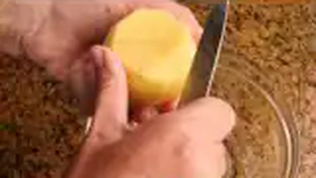
- **Lentejas pardinas secas de Tierra de Campos**: 350 g (lavadas bajo el grifo)
- **Codillo de cerdo curado o salmuerizado semi-cocido**: 1 unidad (600 g, deshuesado y troceado en dados de 3 cm)
- **Patatas medianas (Monalisa)**: 2 unidades (300 g, peladas y chascadas)
- **Zanahorias medianas**: 2 unidades (160 g, en rodajas)
- **Puerro fresco (solo parte blanca)**: 1 unidad (100 g, picado fino)
- **Cebolla dulce picada**: 1 unidad (140 g)
- **Pimiento verde italiano**: 1 unidad (80 g)
- **Dientes de ajo morado**: 3 unidades (15 g, picados)
- **Pimentón dulce de la Vera**: 1 cucharadita colmada (5 g)
- **Comino molido**: 1/2 cucharadita (2 g, para digestibilidad)
- **Hojas de laurel**: 2 unidades
- **Aceite de oliva virgen extra (AOVE)**: 40 ml
- **Agua mineral fría**: 1.300 ml
- **Sal marina**: al gusto

### 🔪 Equipamiento y Utillaje Necesario
- Cazuela ancha de fondo grueso (Ø 26 cm) o cazuela de barro.
- Cuchillo cebollero y tabla de corte.
- Espumadera.

### 👨‍🍳 Paso a Paso Técnico y Minucioso
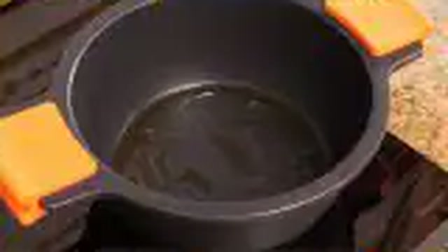
1. **Sellado de codillo y sofrito vegetal:** En la cazuela con los 40 ml de AOVE, saltear los dados de codillo a fuego vivo durante 4 minutos para dorar la superficie y extraer colágeno. Retirar el codillo. En el mismo aceite, pochar la cebolla, el puerro, el pimiento verde y los ajos durante 8 minutos a fuego suave.
2. **Pimentón y chascado de patata:** Retirar brevemente del fuego, incorporar el pimentón dulce y el comino molido, remover 10 segundos y agregar de inmediato las rodajas de zanahoria y las patatas chascadas. Rehogar 2 minutos.
3. **Cocción de lentejas en frío:** Añadir las lentejas pardinas lavadas, los dados de codillo y las 2 hojas de laurel. Cubrir con 1.300 ml de agua mineral fría (las lentejas pardinas se inician siempre en frío para que la cocción sea progresiva).
4. **Hervor manso y espumado:** Llevar a ebullición, espumar pacientemente las impurezas iniciales durante 5 minutos, tapar y cocer a fuego lento (*chup-chup* suave) durante **35-40 minutos** hasta que las lentejas y las patatas estén mantecosas.
5. **Truco de ligazón de Arguiñano:** Saca un cazo con media patata cocida, una rodaja de zanahoria y 2 cucharadas de lentejas con un poco de caldo; tritúralo con el pasapurés o tenedor y reintegra la papilla a la cazuela, removiendo en vaivén para espesar el caldo sin harinas. Reposar 10 minutos.

### 🍽️ Emplatado y Textura Final

- Servir en platos hondos humeantes, con generosos trozos de codillo gelatinoso y verduras repartidas. Terminar con una pizca de perejil picado y acompañar con piparras en vinagre.

### ⏱️ Protocolo de Conservación y Batch Cooking
- **Refrigeración (0°C a 3°C):** 4-5 días en fiambrera de vidrio. Al reposar, el sabor mejora exponencialmente.
- **Congelación (-18°C):** 3 meses (congelar preferentemente retirando los trozos grandes de patata).
- **Envasado al Vacío:** 7 días a 2°C.

### 🔥 Guía de Regeneración Multicanal
- **Cazo / Cazuela:** 4 minutos a fuego lento añadiendo un chorrito de agua caliente para fluidificar.
- **Microondas:** 2 minutos a 750W tapado.

---

## 4. 🦪 Pochas Frescas de Navarra con Almejas en Salsa Verde


> 📺 **Vídeo y Receta Oficial:** [Ver en Hogarmania / Karlos Arguiñano: Pochas con Almejas](https://www.hogarmania.com/cocina/recetas/legumbres/pochas-almejas-arguinano.html)  
> 📊 **Infografía Educativa TouChef:** [Ver Infografía Técnica](assets/infografia_pochas_frescas_de_navarra_con_almejas.jpg)


### 📋 Ficha Técnica y Resumen
| Parámetro | Valor |
|---|---|
| **Tiempo de Preparación** | 15 min |
| **Tiempo de Cocción** | 35 min |
| **Dificultad** | Fácil-Media |
| **Raciones** | 4 personas (aprox. 380 g por ración) |
| **Coste Estimado** | Medio (€€) - 8,90 € total / 2,22 € ración |

### ⚠️ Matriz Oficial de Alérgenos (Reglamento UE 1169/2011)
| Alérgeno | Presencia | Ingrediente / Detalle |
|---|:---:|---|
| **Gluten** | 🟢 SÍ | Harina de trigo del roux suave de la salsa verde (o maicena) |
| **Crustáceos** | ⚪ NO | Ausente |
| **Huevos** | ⚪ NO | Ausente |
| **Pescado** | 🟢 SÍ | Fumet de pescado para la cocción |
| **Cacahuetes** | ⚪ NO | Ausente |
| **Soja** | ⚪ NO | Ausente |
| **Lácteos** | ⚪ NO | Ausente |
| **Frutos de cáscara** | ⚪ NO | Ausente |
| **Apio** | ⚪ NO | Ausente |
| **Mostaza** | ⚪ NO | Ausente |
| **Sésamo** | ⚪ NO | Ausente |
| **Sulfitos** | 🟢 SÍ | Txakoli o vino blanco seco |
| **Altramuces** | ⚪ NO | Ausente |
| **Moluscos** | 🟢 SÍ | Almejas finas frescas |

### ⚖️ Ingredientes Exactos (Mise en Place)

- **Pochas frescas de Navarra desgranadas (o congeladas ultracongeladas)**: 500 g
- **Almejas finas frescas limpias de arena**: 350 g
- **Cebolletas frescas con su tallo tierno**: 2 unidades (160 g, picadas muy finas)
- **Dientes de ajo morado**: 3 unidades (15 g, picados finos)
- **Vino blanco seco o Txakoli de Getaria**: 60 ml
- **Fumet de pescado blanco o caldo de verduras suave**: 700 ml
- **Harina de trigo o maicena**: 1 cucharadita rasa (5 g)
- **Aceite de oliva virgen extra (AOVE)**: 50 ml
- **Perejil fresco de hoja lisa**: 1 manojo abundante (20 g, recién picado)
- **Sal marina fina**: al gusto

### 🔪 Equipamiento y Utillaje Necesario
- Cazuela ancha y baja de barro o acero inoxidable (Ø 28 cm).
- Cuchillo de chef afilado y tabla de corte.
- Sartén con tapadera para abrir almejas.

### 👨‍🍳 Paso a Paso Técnico y Minucioso

1. **Cocción suave de las pochas:** En la cazuela con 500 ml de fumet o agua y 15 ml de AOVE, poner las pochas frescas limpias a fuego suave. Como son frescas, no necesitan remojo previo. Cocinar tapadas durante **25 minutos** a fuego lento hasta que estén tiernas y mantecosas sin romperse.
2. **Elaboración de la salsa verde:** En una sartén con los 35 ml de AOVE restantes a fuego medio, pochar los ajos picados y las cebolletas durante 6 minutos hasta que queden transparentes sin dorarse. Espolvorear la cucharadita de harina y rehogar 1 minuto para tostar el almidón. Verter el Txakoli y dejar reducir 1 minuto.
3. **Adición de caldo y perejil:** Añadir 200 ml de fumet caliente a la sartén y abundante perejil fresco recién picado. Remover con varilla para que emulsione formando una salsa verde aterciopelada y fragante.
4. **Apertura de almejas e integración:** Añadir las almejas finas a la salsa verde, tapar la sartén y mantener a fuego vivo durante **2 minutos** hasta que todas las conchas se abran por completo.
5. **Fusión coloidal final:** Volcar las almejas con toda su salsa verde sobre la cazuela de las pochas cocidas. Mover la cazuela en círculos suaves con vaivén continuo durante **3 minutos** a fuego mínimo para que el jugo de las almejas, la salsa verde y el almidón de las pochas liguen en una crema verde sublime. Rectificar de sal y servir.

### 🍽️ Emplatado y Textura Final

- Servir en cazuela de barro o plato hondo amplio. Espolvorear con perejil fresco picado adicional. Las pochas deben fundirse como crema en la boca y las almejas presentarse hinchadas y jugosas en su concha nacarada.

### ⏱️ Protocolo de Conservación y Batch Cooking
- **Refrigeración (0°C a 3°C):** 2 días en frío.
- **Congelación (-18°C):** No recomendada para las almejas en concha.
- **Envasado al Vacío:** 3 días a 2°C.

### 🔥 Guía de Regeneración Multicanal
- **Cazuela a fuego lento:** 3-4 minutos con suave vaivén para no descolgar la salsa verde.
- **Microondas:** 1,5 minutos a 600W tapado.

---

## 5. 🦆 Fabes Asturianas Estofadas con Codornices Salteadas

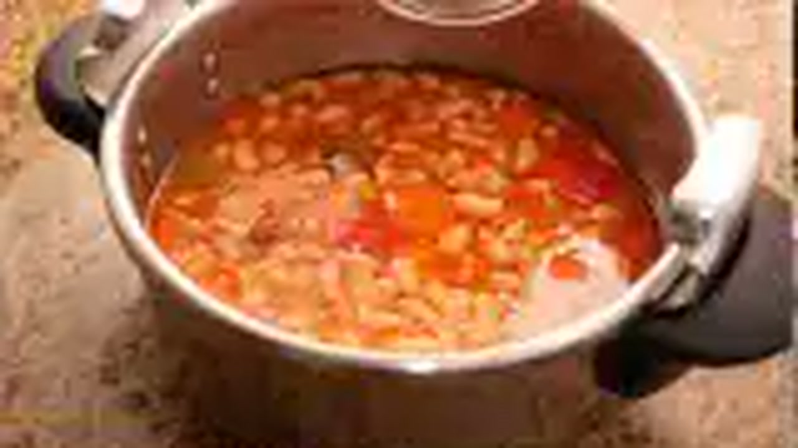

> 📺 **Vídeo y Receta Oficial:** [Ver en Hogarmania / Karlos Arguiñano: Fabes con Codornices](https://www.hogarmania.com/cocina/recetas/legumbres/fabes-codornices-arguinano.html)  
> 📊 **Infografía Educativa TouChef:** [Ver Infografía Técnica](assets/infografia_fabes_asturianas_con_codornices_estofadas.jpg)


### 📋 Ficha Técnica y Resumen
| Parámetro | Valor |
|---|---|
| **Tiempo de Preparación** | 20 min (+ 12 h remojo) |
| **Tiempo de Cocción** | 2 h (tradicional) / 30 min (olla rápida) |
| **Dificultad** | Media |
| **Raciones** | 4 personas (1 codorniz + 350 g fabes por ración) |
| **Coste Estimado** | Medio (€€) - 8,50 € total / 2,12 € ración |

### ⚠️ Matriz Oficial de Alérgenos (Reglamento UE 1169/2011)
| Alérgeno | Presencia | Ingrediente / Detalle |
|---|:---:|---|
| **Gluten** | ⚪ NO | Ausente de forma natural |
| **Crustáceos** | ⚪ NO | Ausente |
| **Huevos** | ⚪ NO | Ausente |
| **Pescado** | ⚪ NO | Ausente |
| **Cacahuetes** | ⚪ NO | Ausente |
| **Soja** | ⚪ NO | Ausente |
| **Lácteos** | ⚪ NO | Ausente |
| **Frutos de cáscara** | ⚪ NO | Ausente |
| **Apio** | ⚪ NO | Ausente |
| **Mostaza** | ⚪ NO | Ausente |
| **Sésamo** | ⚪ NO | Ausente |
| **Sulfitos** | 🟢 SÍ | Vino blanco o brandy del sellado de codornices |
| **Altramuces** | ⚪ NO | Ausente |
| **Moluscos** | ⚪ NO | Ausente |

### ⚖️ Ingredientes Exactos (Mise en Place)

- **Fabes asturianas con IGP Faba Asturiana**: 400 g (remojadas 12h en agua mineral fría)
- **Codornices camperas limpias y enteras**: 4 unidades (aprox. 600 g)
- **Cebolla blanca dulce**: 1 unidad grande (180 g)
- **Puerro limpio (parte blanca)**: 1 unidad (100 g)
- **Zanahorias medianas**: 2 unidades (150 g)
- **Dientes de ajo morado**: 4 unidades (20 g)
- **Brandy o vino blanco**: 50 ml
- **Azafrán en hebra tostado**: 12-15 hebras (0,1 g)
- **Pimentón dulce ahumado**: 1 cucharadita (4 g)
- **Aceite de oliva virgen extra (AOVE)**: 50 ml
- **Caldo de ave o agua mineral fría**: 1.500 ml
- **Pimienta negra, tomillo fresco, laurel y sal marina**: al gusto

### 🔪 Equipamiento y Utillaje Necesario
- Cazuela ancha de hierro colado o barro.
- Sartén para dorar y flambear las aves.
- Hilo de bramante de cocina para bridar codornices.

### 👨‍🍳 Paso a Paso Técnico y Minucioso

1. **Bridado y sellado de codornices:** Limpiar y bridar las 4 codornices con hilo de cocina para que mantengan su forma. Salpimentar por dentro y por fuera. En una sartén con 30 ml de AOVE a fuego vivo, dorar las codornices por todas sus caras durante 6 minutos hasta obtener una piel dorada y crujiente. Flambear con los 50 ml de brandy y reservar.
2. **Sofrito aromático:** En la cazuela principal con el aceite residual, pochar a fuego lento la cebolla, puerro, zanahorias y ajos durante 10 minutos. Añadir el pimentón dulce fuera del fuego y remover rápidamente.
3. **Montaje y cocción de las fabes:** Escurrir las fabes remojadas y añadirlas a la cazuela. Acomodar las 4 codornices doradas entre las fabes. Añadir el laurel, la ramita de tomillo y las hebras de azafrán previamente tostadas y disueltas en un poco de caldo.
4. **Espumado y asustado continuo:** Cubrir con 1.500 ml de agua o caldo frío. Llevar a ebullición viva, espumar cuidadosamente durante 5 minutos y "asustar" con 50 ml de agua helada en dos ocasiones. Bajar a fuego manso y cocinar tapado durante **1 hora y 45 minutos** (o 25 min en olla a presión) con vaivén suave hasta que las fabes estén mantecosas y las codornices tiernísimas.
5. **Reposo y desgrasado:** Retirar las cuerdas de bridar de las codornices. Rectificar de sal y dejar reposar 15 minutos antes de servir.

### 🍽️ Emplatado y Textura Final

- Servir en plato hondo disponiendo una codorniz entera o partida por la mitad longitudinalmente en cada plato, rodeada por las fabes y su caldo dorado al azafrán.

### ⏱️ Protocolo de Conservación y Batch Cooking
- **Refrigeración (0°C a 3°C):** 4 días en frío hermético.
- **Congelación (-18°C):** 2 meses.
- **Envasado al Vacío:** 7 días a 2°C.

### 🔥 Guía de Regeneración Multicanal
- **Cazuela:** 5 minutos a fuego manso con vaivén.
- **Microondas:** 2,5 minutos a 750W tapado.

---

## 6. 🫘 Alubias Rojas de Guernica con Costilla Adobada y Chorizo


> 📺 **Vídeo y Receta Oficial:** [Ver en Hogarmania / Karlos Arguiñano: Alubias Rojas de Gernika con Costilla](https://www.hogarmania.com/cocina/recetas/legumbres/alubias-gernika-costilla-arguinano.html)  
> 📊 **Infografía Educativa TouChef:** [Ver Infografía Técnica](assets/infografia_alubias_rojas_de_guernica_con_costilla_adobada.jpg)


### 📋 Ficha Técnica y Resumen
| Parámetro | Valor |
|---|---|
| **Tiempo de Preparación** | 15 min |
| **Tiempo de Cocción** | 2 h 15 min |
| **Dificultad** | Fácil |
| **Raciones** | 4 personas (aprox. 420 g por ración) |
| **Coste Estimado** | Económico (€) - 5,80 € total / 1,45 € ración |

### ⚠️ Matriz Oficial de Alérgenos (Reglamento UE 1169/2011)
| Alérgeno | Presencia | Ingrediente / Detalle |
|---|:---:|---|
| **Gluten** | ⚪ NO | Ausente de forma natural |
| **Crustáceos** | ⚪ NO | Ausente |
| **Huevos** | ⚪ NO | Ausente |
| **Pescado** | ⚪ NO | Ausente |
| **Cacahuetes** | ⚪ NO | Ausente |
| **Soja** | ⚪ NO | Ausente |
| **Lácteos** | ⚪ NO | Ausente |
| **Frutos de cáscara** | ⚪ NO | Ausente |
| **Apio** | ⚪ NO | Ausente |
| **Mostaza** | ⚪ NO | Ausente |
| **Sésamo** | ⚪ NO | Ausente |
| **Sulfitos** | 🟢 SÍ | Presente en chorizo y costilla adobada |
| **Altramuces** | ⚪ NO | Ausente |
| **Moluscos** | ⚪ NO | Ausente |

### ⚖️ Ingredientes Exactos (Mise en Place)
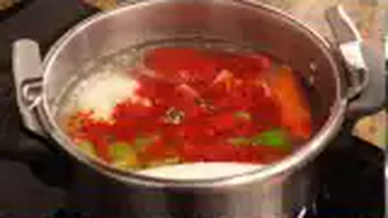
- **Alubia roja de Guernica con Eusko Label (Gernikako Babarruna)**: 450 g
- **Costilla de cerdo adobada tradicional**: 350 g (troceada en bocados)
- **Chorizo fresco de caserío**: 2 unidades (200 g)
- **Cebolla morada de Zalla o dulce**: 1 unidad grande (180 g, picada fina)
- **Pimiento verde de caserío**: 1 unidad (100 g)
- **Carne de pimiento choricero hidratada**: 2 cucharadas soperas (40 g)
- **Dientes de ajo morado**: 3 unidades (15 g)
- **Aceite de oliva virgen extra (AOVE)**: 50 ml
- **Agua mineral fría**: 2.000 ml
- **Sal marina**: al gusto

### 🔪 Equipamiento y Utillaje Necesario
- Cazuela de barro refractaria o hierro esmaltado.
- Tabla de corte y cuchillo de chef.

### 👨‍🍳 Paso a Paso Técnico y Minucioso

1. **Montaje en frío de alubia de Gernika:** Disponer las alubias rojas en la cazuela con los 2.000 ml de agua fría, un chorro de 30 ml de AOVE, la cebolla morada picada, el pimiento verde y los ajos enteros. Poner a fuego medio hasta ebullición.
2. **Sellado y desgrasado de costilla:** En una sartén con unas gotas de aceite, dorar la costilla adobada y los chorizos pinchados para sellar los jugos y soltar exceso de grasa externa. Escurrir e incorporar a la cazuela de las alubias.
3. **Asustado y cocción a fuego lento:** En cuanto rompa el hervor, romper la ebullición con 50 ml de agua helada. Repetir 2 veces. Añadir las 2 cucharadas de carne de pimiento choricero. Cocer tapado a fuego suave durante **2 horas** con balanceo circular de la cazuela.
4. **Ligazón y punto de sal:** Probar las alubias; cuando estén suaves como manteca, añadir la sal marina y agitar la cazuela por las asas durante 3 minutos hasta que el caldo tome consistencia aterciopelada y color caoba profundo. Reposar 15 minutos.

### 🍽️ Emplatado y Textura Final

- Servir en plato hondo con raciones generosas de costilla adobada tiernísima, rodajas de chorizo y piparras de Ibarra al lado.

### ⏱️ Protocolo de Conservación y Batch Cooking
- **Refrigeración (0°C a 3°C):** 4 días en frío.
- **Congelación (-18°C):** 3 meses.
- **Envasado al Vacío:** 7 días a 2°C.

### 🔥 Guía de Regeneración Multicanal
- **Cazuela:** 4 minutos a fuego suave con vaivén.
- **Microondas:** 2,5 minutos a 750W tapado.

---

## 7. 🦐 Garbanzos con Langostinos y Almejas al Estilo Marinero


> 📺 **Vídeo y Receta Oficial:** [Ver en Hogarmania / Karlos Arguiñano: Garbanzos con Langostinos y Almejas](https://www.hogarmania.com/cocina/recetas/legumbres/garbanzos-langostinos-almejas-arguinano.html)  
> 📊 **Infografía Educativa TouChef:** [Ver Infografía Técnica](assets/infografia_garbanzos_con_langostinos_al_estilo_marinero.jpg)


### 📋 Ficha Técnica y Resumen
| Parámetro | Valor |
|---|---|
| **Tiempo de Preparación** | 15 min |
| **Tiempo de Cocción** | 35 min (con garbanzo cocido) / 1h 15 min (garbanzo seco) |
| **Dificultad** | Fácil-Media |
| **Raciones** | 4 personas (aprox. 380 g por ración) |
| **Coste Estimado** | Medio (€€) - 7,80 € total / 1,95 € ración |

### ⚠️ Matriz Oficial de Alérgenos (Reglamento UE 1169/2011)
| Alérgeno | Presencia | Ingrediente / Detalle |
|---|:---:|---|
| **Gluten** | ⚪ NO | Ausente de forma natural |
| **Crustáceos** | 🟢 SÍ | Langostinos frescos y coral de cabezas |
| **Huevos** | ⚪ NO | Ausente |
| **Pescado** | 🟢 SÍ | Fumet de pescado marino |
| **Cacahuetes** | ⚪ NO | Ausente |
| **Soja** | ⚪ NO | Ausente |
| **Lácteos** | ⚪ NO | Ausente |
| **Frutos de cáscara** | ⚪ NO | Ausente |
| **Apio** | ⚪ NO | Ausente |
| **Mostaza** | ⚪ NO | Ausente |
| **Sésamo** | ⚪ NO | Ausente |
| **Sulfitos** | 🟢 SÍ | Brandy del flambeado de langostinos |
| **Altramuces** | ⚪ NO | Ausente |
| **Moluscos** | 🟢 SÍ | Almejas finas |

### ⚖️ Ingredientes Exactos (Mise en Place)
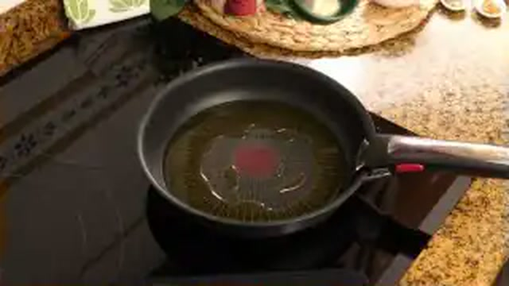
- **Garbanzos pedrosillanos cocidos artesanos**: 500 g
- **Langostinos o gambones frescos enteros**: 16 unidades (350 g)
- **Almejas finas limpias**: 250 g
- **Cebolleta fresca picada**: 1 unidad (120 g)
- **Pimiento verde italiano**: 1 unidad (80 g)
- **Tomate maduro rallado**: 2 cucharadas (60 g)
- **Dientes de ajo laminados**: 3 unidades (15 g)
- **Brandy o coñac**: 30 ml
- **Fumet rojo de pescado y cabezas de langostino**: 600 ml
- **Pimentón dulce de la Vera**: 1 cucharadita (4 g)
- **Aceite de oliva virgen extra (AOVE)**: 45 ml
- **Perejil fresco picado y sal**: al gusto

### 🔪 Equipamiento y Utillaje Necesario
- Cazuela ancha de barro o acero.
- Sartén para flambeado y extracción de coral.
- Colador fino y maza de mortero.

### 👨‍🍳 Paso a Paso Técnico y Minucioso

1. **Extracción coral y fumet:** Pelar los langostinos reservando los cuerpos limpios. En la sartén con 20 ml de AOVE a fuego vivo, saltear las cabezas y cáscaras aplastando con la maza para extraer todo el jugo anaranjado. Flambear con los 30 ml de brandy, añadir 400 ml de fumet, cocer 10 minutos y colar presionando fuerte por el colador.
2. **Sofrito marinero:** En la cazuela principal con el resto del AOVE, pochar la cebolleta, el pimiento verde y los ajos durante 8 minutos. Añadir el tomate rallado y sofreír 3 minutos. Añadir el pimentón dulce y remover.
3. **Cocción de garbanzos en salsa marina:** Añadir los garbanzos cocidos escurridos a la cazuela del sofrito. Verter el fumet rojo de coral colado. Cocinar tapado a fuego suave durante **15 minutos** para que los garbanzos absorban los jugos marinos.
4. **Incorporación de marisco final:** Añadir las almejas limpias y los cuerpos de los langostinos a la superficie. Tapar la cazuela durante **3-4 minutos** hasta que las almejas se abran y los langostinos cambien a un tono rosado nacarado. Apagar y reposar 5 minutos.

### 🍽️ Emplatado y Textura Final
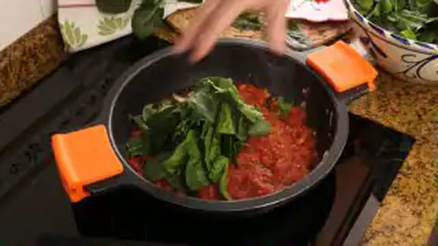
- Servir en plato hondo de cerámica con abundante perejil fresco picado. Caldo meloso, garbanzos tiernos y marisco jugoso en su punto exacto.

### ⏱️ Protocolo de Conservación y Batch Cooking
- **Refrigeración (0°C a 3°C):** 2-3 días en frío.
- **Congelación (-18°C):** No congelar con el marisco en concha.
- **Envasado al Vacío:** 4 días a 2°C.

### 🔥 Guía de Regeneración Multicanal
- **Cazuela:** Calentar a fuego suave durante 4 minutos.
- **Microondas:** 2 minutos a 700W tapado.

---

## 8. 🍲 Pochas de Sangüesa con Chistorra y Panceta Ibérica


> 📺 **Vídeo y Receta Oficial:** [Ver en Hogarmania / Karlos Arguiñano: Pochas de Sangüesa con Chistorra](https://www.hogarmania.com/cocina/recetas/legumbres/pochas-chistorra-panceta-arguinano.html)  
> 📊 **Infografía Educativa TouChef:** [Ver Infografía Técnica](assets/infografia_pochas_de_sanguesa_con_chistorra_y_panceta.jpg)


### 📋 Ficha Técnica y Resumen
| Parámetro | Valor |
|---|---|
| **Tiempo de Preparación** | 10 min |
| **Tiempo de Cocción** | 35 min |
| **Dificultad** | Muy Fácil |
| **Raciones** | 4 personas (aprox. 380 g por ración) |
| **Coste Estimado** | Económico (€) - 5,20 € total / 1,30 € ración |

### ⚠️ Matriz Oficial de Alérgenos (Reglamento UE 1169/2011)
| Alérgeno | Presencia | Ingrediente / Detalle |
|---|:---:|---|
| **Gluten** | ⚪ NO | Ausente de forma natural |
| **Crustáceos** | ⚪ NO | Ausente |
| **Huevos** | ⚪ NO | Ausente |
| **Pescado** | ⚪ NO | Ausente |
| **Cacahuetes** | ⚪ NO | Ausente |
| **Soja** | ⚪ NO | Ausente |
| **Lácteos** | ⚪ NO | Ausente |
| **Frutos de cáscara** | ⚪ NO | Ausente |
| **Apio** | ⚪ NO | Ausente |
| **Mostaza** | ⚪ NO | Ausente |
| **Sésamo** | ⚪ NO | Ausente |
| **Sulfitos** | 🟢 SÍ | Presente en la chistorra artesana de Navarra |
| **Altramuces** | ⚪ NO | Ausente |
| **Moluscos** | ⚪ NO | Ausente |

### ⚖️ Ingredientes Exactos (Mise en Place)

- **Pochas frescas de Sangüesa / Navarra**: 500 g
- **Chistorra artesana de Navarra**: 150 g (cortada en trozos de 4 cm)
- **Panceta fresca o curada ibérica**: 120 g (en dados de 1,5 cm)
- **Pimiento verde de huerta**: 1 unidad (100 g)
- **Pimiento rojo morrón**: 1/2 unidad (70 g)
- **Cebolleta tierna**: 1 unidad (100 g)
- **Dientes de ajo**: 2 unidades (10 g)
- **Aceite de oliva virgen extra (AOVE)**: 30 ml
- **Agua mineral o caldo de verduras**: 800 ml
- **Sal marina**: al gusto

### 🔪 Equipamiento y Utillaje Necesario
- Cazuela ancha de barro o acero.
- Sartén antiadherente para desengrasar embutidos.

### 👨‍🍳 Paso a Paso Técnico y Minucioso
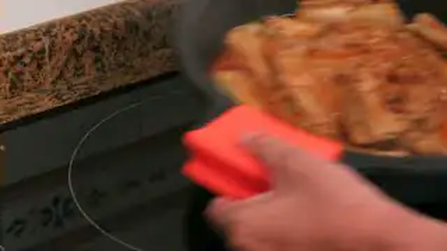
1. **Dorado y desgrasado de la chistorra y panceta:** En la sartén sin aceite añadido, saltear la panceta y los trozos de chistorra a fuego medio durante 4 minutos hasta que doren y liberen su grasa superficial. Escurrir sobre papel absorbente.
2. **Sofrito base:** En la cazuela con 30 ml de AOVE, pochar la cebolleta, los pimientos picados en brunoise y los ajos durante 8 minutos a fuego medio-bajo.
3. **Cocción de pochas:** Incorporar las pochas frescas a la cazuela, añadir los trozos de chistorra y panceta desgrasados y cubrir con los 800 ml de agua mineral o caldo.
4. **Chup-chup suave:** Llevar a ebullición, bajar a fuego mínimo y cocinar tapado durante **25-30 minutos** hasta que la pocha esté tierna como mantequilla. Agitar la cazuela por las asas para emulsionar el caldo. Rectificar de sal y reposar 10 minutos.

### 🍽️ Emplatado y Textura Final

- Servir bien caliente con piparras al vinagre al lado para refrescar el paladar entre cucharadas.

### ⏱️ Protocolo de Conservación y Batch Cooking
- **Refrigeración (0°C a 3°C):** 4 días en frío.
- **Congelación (-18°C):** 2 meses.
- **Envasado al Vacío:** 7 días a 2°C.

### 🔥 Guía de Regeneración Multicanal
- **Cazuela:** 4 minutos a fuego manso.
- **Microondas:** 2 minutos a 750W tapado.

---

## 9. 🥘 Lentejas Castellanas con Boletus y Verduras de Temporada (Veganas)

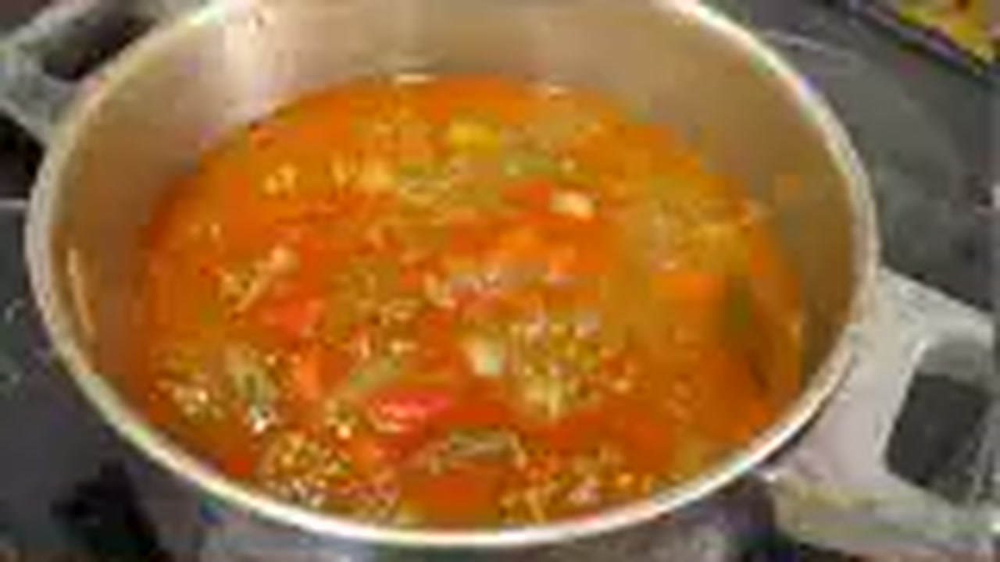

> 📺 **Vídeo y Receta Oficial:** [Ver en Hogarmania / Karlos Arguiñano: Lentejas con Setas y Verduras](https://www.hogarmania.com/cocina/recetas/legumbres/lentejas-boletus-verduras-arguinano.html)  
> 📊 **Infografía Educativa TouChef:** [Ver Infografía Técnica](assets/infografia_lentejas_castellanas_con_boletus_y_verduras.jpg)


### 📋 Ficha Técnica y Resumen
| Parámetro | Valor |
|---|---|
| **Tiempo de Preparación** | 15 min |
| **Tiempo de Cocción** | 45 min |
| **Dificultad** | Fácil |
| **Raciones** | 4 personas (aprox. 400 g por ración) |
| **Coste Estimado** | Muy Económico (€) - 4,60 € total / 1,15 € ración |

### ⚠️ Matriz Oficial de Alérgenos (Reglamento UE 1169/2011)
| Alérgeno | Presencia | Ingrediente / Detalle |
|---|:---:|---|
| **Gluten** | ⚪ NO | Ausente de forma natural |
| **Crustáceos** | ⚪ NO | Ausente |
| **Huevos** | ⚪ NO | Ausente |
| **Pescado** | ⚪ NO | Ausente |
| **Cacahuetes** | ⚪ NO | Ausente |
| **Soja** | ⚪ NO | Ausente |
| **Lácteos** | ⚪ NO | Ausente |
| **Frutos de cáscara** | ⚪ NO | Ausente |
| **Apio** | ⚪ NO | Ausente |
| **Mostaza** | ⚪ NO | Ausente |
| **Sésamo** | ⚪ NO | Ausente |
| **Sulfitos** | ⚪ NO | Ausente |
| **Altramuces** | ⚪ NO | Ausente |
| **Moluscos** | ⚪ NO | Ausente |

### ⚖️ Ingredientes Exactos (Mise en Place)

- **Lentejas castellanas secas**: 350 g (lavadas)
- **Boletus edulis o setas silvestres variadas (frescas o congeladas)**: 250 g (en trozos medianos)
- **Boniato o calabaza dulce**: 150 g (en dados de 2 cm)
- **Zanahorias peladas**: 2 unidades (150 g, en rodajas)
- **Puerro limpio (parte blanca)**: 1 unidad (100 g)
- **Cebolla dulce picada**: 1 unidad (140 g)
- **Dientes de ajo**: 3 unidades (15 g)
- **Tomillo fresco y laurel**: 1 ramita y 2 hojas
- **Pimentón dulce de la Vera**: 1 cucharadita (5 g)
- **Comino en polvo**: 1/2 cucharadita (2 g)
- **Aceite de oliva virgen extra (AOVE)**: 45 ml
- **Caldo de verduras casero o agua mineral**: 1.200 ml
- **Sal marina**: al gusto

### 🔪 Equipamiento y Utillaje Necesario
- Cazuela ancha de fondo difusor.
- Sartén para saltear las setas a fuego vivo.
- Tabla de corte y cuchillo cebollero.

### 👨‍🍳 Paso a Paso Técnico y Minucioso

1. **Salteado aromático de boletus:** En una sartén con 20 ml de AOVE a fuego vivo, saltear los boletus troceados con 1 ajo picado y una pizca de sal durante 4 minutos hasta que doren y caramelicen sus jugos. Reservar.
2. **Sofrito de huerta:** En la cazuela con el resto del AOVE, pochar la cebolla picada, el puerro y los otros 2 ajos durante 8 minutos. Añadir el pimentón dulce y el comino fuera del fuego.
3. **Cocción de lentejas y boniato:** Añadir las lentejas castellanas, los dados de boniato, las rodajas de zanahoria, el laurel y el tomillo. Cubrir con los 1.200 ml de caldo de verduras frío.
4. **Chup-chup y unión con boletus:** Cocinar a fuego lento durante **35 minutos**. A continuación, añadir los boletus salteados con todos sus jugos a la cazuela y cocinar 10 minutos más hasta que la lenteja y el boniato estén fundentes. Mover en vaivén para espesar el caldo naturalmente.

### 🍽️ Emplatado y Textura Final

- Servir en plato hondo bien caliente con unos boletus visibles en la superficie y perejil fresco picado.

### ⏱️ Protocolo de Conservación y Batch Cooking
- **Refrigeración (0°C a 3°C):** 5 días en refrigeración.
- **Congelación (-18°C):** 3 meses (excelente congelación sin proteína animal).
- **Envasado al Vacío:** 8 días a 2°C.

### 🔥 Guía de Regeneración Multicanal
- **Cazo:** 4 minutos a fuego lento.
- **Microondas:** 2 minutos a 750W tapado.

---

## 10. 🫘 Judías Pintas Estofadas con Rabo de Toro y Pimientos del Piquillo


> 📺 **Vídeo y Receta Oficial:** [Ver en Hogarmania / Karlos Arguiñano: Judías Pintas con Rabo de Toro](https://www.hogarmania.com/cocina/recetas/legumbres/judias-pintas-rabo-toro-arguinano.html)  
> 📊 **Infografía Educativa TouChef:** [Ver Infografía Técnica](assets/infografia_judias_pintas_estofadas_con_rabo_de_toro.jpg)


### 📋 Ficha Técnica y Resumen
| Parámetro | Valor |
|---|---|
| **Tiempo de Preparación** | 20 min (+ 12 h remojo) |
| **Tiempo de Cocción** | 2 h 30 min (tradicional) / 50 min (olla rápida) |
| **Dificultad** | Media |
| **Raciones** | 4 personas (aprox. 450 g por ración con carne) |
| **Coste Estimado** | Medio (€€) - 9,80 € total / 2,45 € ración |

### ⚠️ Matriz Oficial de Alérgenos (Reglamento UE 1169/2011)
| Alérgeno | Presencia | Ingrediente / Detalle |
|---|:---:|---|
| **Gluten** | 🟢 SÍ | Harina para enharinar el rabo (sustituible por harina de arroz) |
| **Crustáceos** | ⚪ NO | Ausente |
| **Huevos** | ⚪ NO | Ausente |
| **Pescado** | ⚪ NO | Ausente |
| **Cacahuetes** | ⚪ NO | Ausente |
| **Soja** | ⚪ NO | Ausente |
| **Lácteos** | ⚪ NO | Ausente |
| **Frutos de cáscara** | ⚪ NO | Ausente |
| **Apio** | ⚪ NO | Ausente |
| **Mostaza** | ⚪ NO | Ausente |
| **Sésamo** | ⚪ NO | Ausente |
| **Sulfitos** | 🟢 SÍ | Vino tinto de la D.O. Rioja / Navarra del estofado |
| **Altramuces** | ⚪ NO | Ausente |
| **Moluscos** | ⚪ NO | Ausente |

### ⚖️ Ingredientes Exactos (Mise en Place)

- **Judías pintas secas**: 400 g (remojadas 12h en agua mineral fría)
- **Rabo de toro o ternera cortado por las articulaciones**: 700 g
- **Pimientos del piquillo de Lodosa en tiras**: 1 lata (150 g)
- **Cebolla morada o dulce**: 2 unidades (250 g, picadas finas)
- **Zanahorias peladas**: 2 unidades (150 g)
- **Dientes de ajo morado**: 4 unidades (20 g)
- **Vino tinto crianza D.O. Rioja**: 150 ml
- **Harina de trigo (para enharinar el rabo)**: 2 cucharadas (30 g)
- **Aceite de oliva virgen extra (AOVE)**: 60 ml
- **Agua mineral o caldo de carne oscuro**: 1.500 ml
- **Pimienta negra recién molida, clavo de olor, laurel y sal**: al gusto

### 🔪 Equipamiento y Utillaje Necesario
- Olla exprés rápida de 6 litros o cazuela de fondo muy grueso.
- Pinzas de cocina y tabla de corte.

### 👨‍🍳 Paso a Paso Técnico y Minucioso
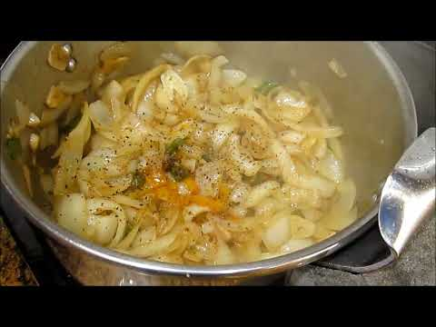
1. **Sellado profundo del rabo de toro:** Salpimentar los trozos de rabo y pasarlos ligeramente por harina sacudiendo el exceso. En la cazuela u olla con los 60 ml de AOVE a fuego vivo, dorar el rabo por todas sus caras durante 8 minutos hasta formar una costra dorada oscura. Retirar.
2. **Sofrito y reducción de vino tinto:** En la misma cazuela, pochar la cebolla, zanahorias y ajos durante 10 minutos. Verter los 150 ml de vino tinto rascando el fondo con la espátula y dejar reducir a fuego vivo 3 minutos para evaporar el alcohol.
3. **Cocción previa del rabo y colágeno:** Reincorporar el rabo sellado, añadir el laurel y 1.000 ml de caldo/agua. Cocinar en olla rápida durante **35 minutos** (o 1h 45 min en cazuela tradicional) hasta que la carne esté tiernísima y se desprenda del hueso.
4. **Incorporación de judías pintas y piquillos:** Abrir la olla. Desmigar la carne del rabo desechando los huesos o dejar los trozos enteros según preferencia. Añadir las judías pintas escurridas y el resto del caldo caliente. Cocinar tapado a fuego suave durante **30-35 minutos** (o 12 min en olla rápida).
5. **Confitado de piquillos y ligazón:** Incorporar las tiras de pimiento del piquillo confitado y mover la cazuela en círculos durante 3 minutos para que el colágeno del rabo y el almidón de la judía pintada liguen en una salsa caoba densa y aterciopelada. Rectificar de sal y reposar 15 minutos.

### 🍽️ Emplatado y Textura Final

- Servir en plato hondo de barro bien caliente. La carne de rabo debe deshacerse al contacto con la cuchara y las judías pintas mostrar una textura mantecosa envuelta en un caldo de brillo caoba oscuro.

### ⏱️ Protocolo de Conservación y Batch Cooking
- **Refrigeración (0°C a 3°C):** 4-5 días en frío (mejora extraordinariamente a las 24-48h).
- **Congelación (-18°C):** 3 meses.
- **Envasado al Vacío:** 8 días a 2°C.

### 🔥 Guía de Regeneración Multicanal
- **Cazuela Tradicional:** Calentar 5 minutos a fuego manso agitando suavemente.
- **Microondas:** 2,5 minutos a 750W tapado.

---
