# 🥩 Carnes, Guisos y Aves de Corral

*Colección oficial de recetas tradicionales de Karlos Arguiñano estandarizadas para la marca TouChef. Incluye alérgenos UE 1169/2011, pesos exactos, paso a paso e infografías educativas Dark Glassmorphism.*

---

## 🥩 Carrilleras de Ternera al Vino Tinto Rioja

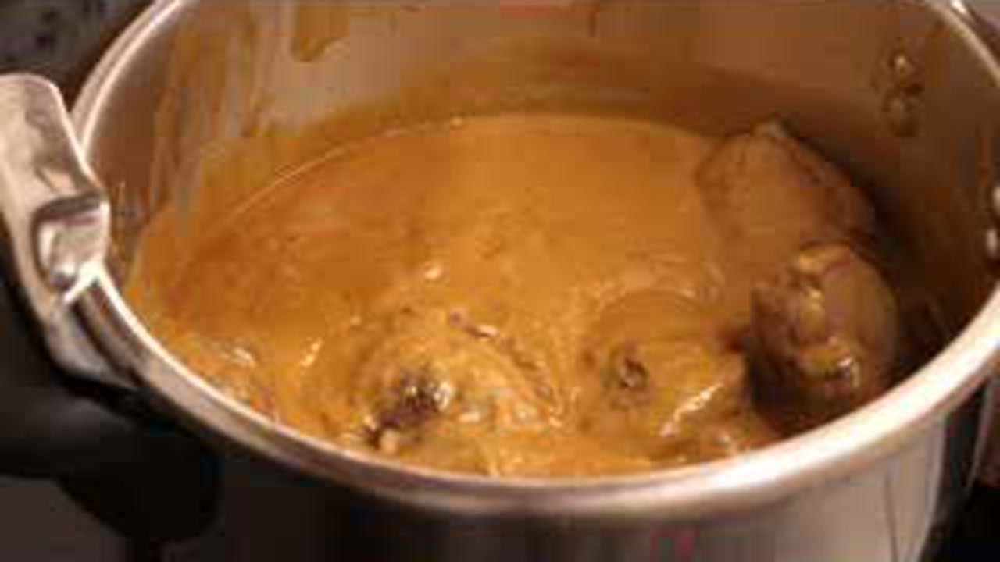

> 📺 **Vídeo y Receta Oficial:** [Ver en Hogarmania / Karlos Arguiñano: Carrilleras de Ternera al Vino Tinto Rioja](https://www.hogarmania.com/cocina/recetas/)
> 📊 **Infografía Educativa TouChef:** [Ver Infografía Técnica](assets/infografia_carrilleras_de_ternera_al_vino_tinto_rioja.jpg)

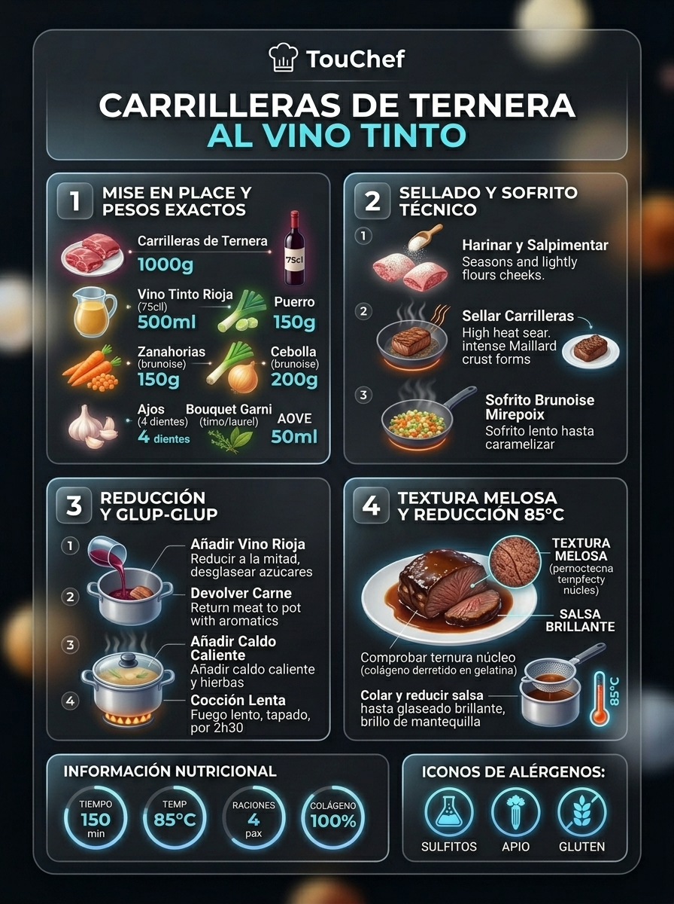

### 📋 Ficha Técnica y Resumen
| Parámetro | Valor |
|---|---|
| **Tiempo de Preparación** | 20 min |
| **Tiempo de Cocción** | 1 h 45 min (45 min en olla rápida) |
| **Dificultad** | Fácil-Media |
| **Raciones** | 4 raciones |
| **Coste Estimado** | Medio (€€) |

### ⚠️ Matriz Oficial de Alérgenos (Reglamento UE 1169/2011)
| Alérgeno | Presencia | Ingrediente / Detalle |
|---|:---:|---|
| **Gluten** | 🟢 SÍ | Harina de trigo para enharinar las piezas |
| **Crustáceos** | ⚪ NO | Ausente (posibles trazas en obrador) |
| **Huevos** | ⚪ NO | Ausente (posibles trazas en obrador) |
| **Pescado** | ⚪ NO | Ausente (posibles trazas en obrador) |
| **Cacahuetes** | ⚪ NO | Ausente (posibles trazas en obrador) |
| **Soja** | ⚪ NO | Ausente (posibles trazas en obrador) |
| **Lácteos** | ⚪ NO | Ausente (sustituible por AOVE en puré) |
| **Frutos de cáscara** | ⚪ NO | Ausente (posibles trazas en obrador) |
| **Apio** | ⚪ NO | Ausente (posibles trazas en obrador) |
| **Mostaza** | ⚪ NO | Ausente (posibles trazas en obrador) |
| **Sésamo** | ⚪ NO | Ausente (posibles trazas en obrador) |
| **Sulfitos** | 🟢 SÍ | Vino tinto D.O. Ca. Rioja |
| **Altramuces** | ⚪ NO | Ausente (posibles trazas en obrador) |
| **Moluscos** | ⚪ NO | Ausente (posibles trazas en obrador) |

### ⚖️ Ingredientes Exactos (Mise en Place)
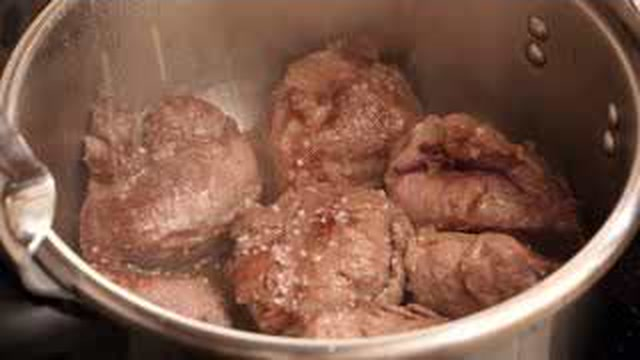
- **Carrilleras de ternera limpias de telillas**: 4 uds (1.000 g)
- **Vino tinto crianza D.O. Ca. Rioja**: 750 ml
- **Cebollas moradas picadas en brunoise**: 2 uds (300 g)
- **Zanahorias peladas en rodajas de 1 cm**: 2 uds (160 g)
- **Puerro limpio (solo la parte blanca) picado**: 1 ud (120 g)
- **Dientes de ajo enteros chafados con piel**: 4 uds (20 g)
- **Caldo oscuro de carne / fondo de buey tostado**: 500 ml
- **Bouquet garni (rama de tomillo, romero y 2 hojas de laurel)**: 1 atadillo (15 g)
- **Harina de trigo de fuerza**: 30 g
- **Aceite de oliva virgen extra (AOVE)**: 60 ml
- **Sal marina fina y pimienta negra recién molida**: 8 g / 3 g

### 🔪 Equipamiento y Utillaje Necesario
- Cazuela de fondo difusor pesado o cocotte de hierro colado (28 cm)
- Tabla de corte HDPE y cuchillo cebollero
- Colador chino de malla fina y batidora de inmersión
- Pinzas gastronómicas de acero inoxidable

### 👨‍🍳 Paso a Paso Técnico y Minucioso

1. **Sellado proteico de carrilleras:** Limpiar el exceso de grasa superficial. Salpimentar generosamente y enharinar sacudiendo el exceso. En cazuela caliente con 60 ml de AOVE a fuego vivo (180°C), sellar las carrilleras durante 3-4 min por lado hasta formar una costra dorada uniforme de reacción de Maillard. Retirar y reservar en fuente.
2. **Sofrito y reducción vínica:** En el mismo aceite residual, añadir los ajos chafados, la cebolla morada, el puerro y la zanahoria con una pizca de sal. Pochar a fuego medio-bajo (110°C) durante 15 minutos rascando los jugos caramelizados del fondo. Verter la botella entera de vino tinto Rioja y subir el fuego para reducir a hervor vivo durante 12-14 minutos, hasta evaporar completamente el etanol y reducir el volumen en un 60%.
3. **Estofado lento y colagénico:** Reincorporar las carrilleras junto con sus jugos acumulados. Verter el fondo de buey caliente y el bouquet garni. Tapar herméticamente y cocer a fuego muy suave en chup-chup mínimo (90-95°C) durante 1 h 45 min (o 45 min en olla a presión rápida a posición 2), hasta que la temperatura interna supere los 92°C y el tejido conjuntivo se transforme en gelatina untuosa.
4. **Filtrado, brillo y glaseado:** Extraer las carrilleras con cuidado para no romperlas. Retirar el bouquet de hierbas. Pasar las verduras y el caldo por el pasapurés o triturar con batidora y colar por chino fino. Volver a poner la salsa en cazuela a fuego medio-alto durante 6-8 minutos para desespumar y reducir hasta obtener una textura de jarabe de brillo espejo. Introducir las carrilleras 3 minutos para glasear su superficie exterior.

### 🍽️ Emplatado y Textura Final

- Servir una carrillera entera por comensal sobre una cama de puré de patata rústico a la mantequilla o patatas panadera confitadas.
- Napar generosamente con la salsa reducida de Rioja caliente y coronar con una brizna de tomillo fresco y escamas de sal marina.

### ⏱️ Protocolo de Conservación y Batch Cooking
- **Refrigeración (0°C a 3°C):** 4 días en recipiente hermético de borosilicato. La salsa gelifica sólidamente en frío; su sabor madura y mejora exponencialmente tras 24 horas.
- **Congelación (-18°C):** Hasta 3 meses en bolsa hermética con la salsa cubriendo la carne para evitar quemaduras por frío.
- **Envasado al Vacío:** 10 días a 2°C en bolsa de vacío termosellada con salsa fría antes del vacío.

### 🔥 Guía de Regeneración Multicanal
- **Sartén / Cazuela:** Calentar a fuego lento (fuego suave 3/10) durante 6-8 minutos con 20 ml de agua o caldo, bañando la carne continuamente con la cuchara.
- **Horno Convectivo:** 12-14 min a 150°C tapado con papel sulfurizado o tapa de cocotte.
- **Microondas:** 3 min a 650W en plato hondo cubierto con campana hermética.

---

## 🍗 Pollo de Caserío al Chilindrón Tradicional

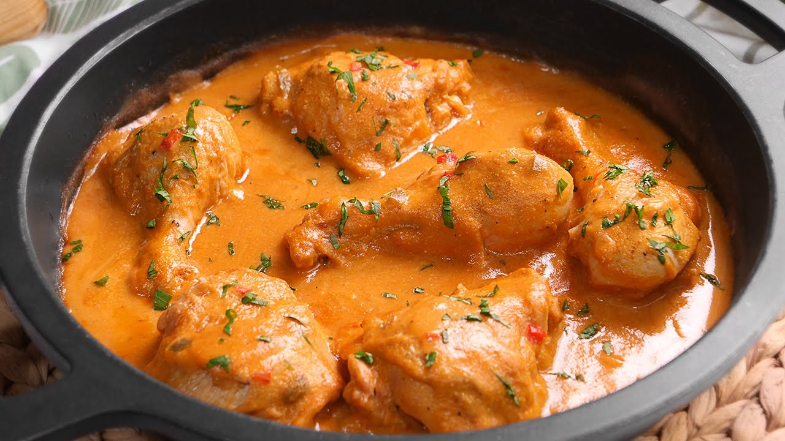

> 📺 **Vídeo y Receta Oficial:** [Ver en Hogarmania / Karlos Arguiñano: Pollo de Caserío al Chilindrón Tradicional](https://www.hogarmania.com/cocina/recetas/)
> 📊 **Infografía Educativa TouChef:** [Ver Infografía Técnica](assets/infografia_pollo_de_caserio_al_chilindron_tradicional.jpg)

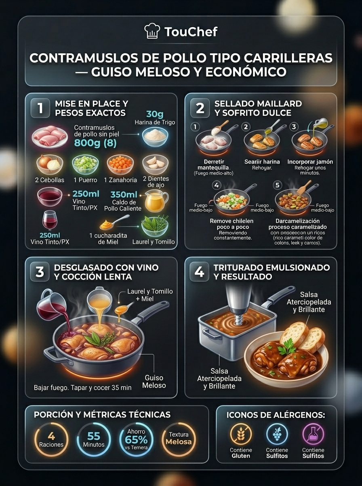

### 📋 Ficha Técnica y Resumen
| Parámetro | Valor |
|---|---|
| **Tiempo de Preparación** | 15 min |
| **Tiempo de Cocción** | 40 min |
| **Dificultad** | Fácil |
| **Raciones** | 4 raciones |
| **Coste Estimado** | Económico (€) |

### ⚠️ Matriz Oficial de Alérgenos (Reglamento UE 1169/2011)
| Alérgeno | Presencia | Ingrediente / Detalle |
|---|:---:|---|
| **Gluten** | ⚪ NO | Ausente (posibles trazas en obrador) |
| **Crustáceos** | ⚪ NO | Ausente (posibles trazas en obrador) |
| **Huevos** | ⚪ NO | Ausente (posibles trazas en obrador) |
| **Pescado** | ⚪ NO | Ausente (posibles trazas en obrador) |
| **Cacahuetes** | ⚪ NO | Ausente (posibles trazas en obrador) |
| **Soja** | ⚪ NO | Ausente (posibles trazas en obrador) |
| **Lácteos** | ⚪ NO | Ausente (posibles trazas en obrador) |
| **Frutos de cáscara** | ⚪ NO | Ausente (posibles trazas en obrador) |
| **Apio** | ⚪ NO | Ausente (posibles trazas en obrador) |
| **Mostaza** | ⚪ NO | Ausente (posibles trazas en obrador) |
| **Sésamo** | ⚪ NO | Ausente (posibles trazas en obrador) |
| **Sulfitos** | 🟢 SÍ | Vino blanco seco |
| **Altramuces** | ⚪ NO | Ausente (posibles trazas en obrador) |
| **Moluscos** | ⚪ NO | Ausente (posibles trazas en obrador) |

### ⚖️ Ingredientes Exactos (Mise en Place)
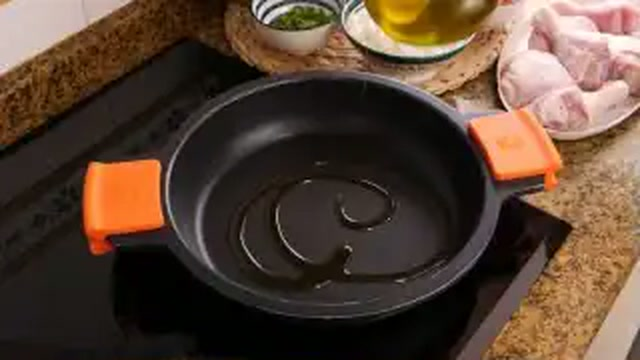
- **Pollo campero de caserío troceado para guiso**: 1 ud (1.300 g)
- **Pimientos rojos carnosos en tiras juliana**: 2 uds (320 g)
- **Pimientos verdes tipo cristal o italianos en tiras**: 2 uds (180 g)
- **Cebolla blanca dulce cortada en pluma fina**: 1 ud grande (220 g)
- **Dientes de ajo laminados**: 4 uds (18 g)
- **Tomate maduro triturado natural**: 400 g
- **Jamón serrano o ibérico en dados de 5 mm**: 90 g
- **Vino blanco seco (Txakoli o Rueda)**: 120 ml
- **Carne de pimiento choricero hidratada**: 1 cda (25 g)
- **Aceite de oliva virgen extra (AOVE)**: 50 ml
- **Sal marina fina, pimienta negra y perejil fresco**: 6 g / 2 g / 5 g

### 🔪 Equipamiento y Utillaje Necesario
- Cazuela baja de hierro esmaltado o barro vidriado (30 cm)
- Tabla de corte y puntilla
- Espátula de madera de haya o silicona resistente al calor

### 👨‍🍳 Paso a Paso Técnico y Minucioso
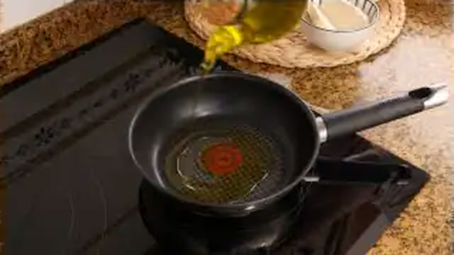
1. **Dorado del pollo campero:** Secar con papel de cocina las presas de pollo. Salpimentar al gusto. En cazuela amplia con el AOVE a fuego vivo, dorar el pollo por tandas durante 8-10 minutos hasta que la piel adquiera un tono avellanado crujiente. Retirar a una fuente dejando el aceite aromatizado.
2. **Pochado lento de la huerta y jamón:** Bajar a fuego medio. Agregar los ajos laminados, la cebolla y las tiras de pimiento rojo y verde con una pizca de sal. Rehogar con tapa durante 14 minutos removiendo periódicamente hasta que los pimientos estén tiernos y ligeramente caramelizados. Incorporar los dados de jamón y sofreír 1 minuto para fundir sus grasas aromáticas.
3. **Integración de salsa y reducción:** Añadir la pulpa de pimiento choricero y el tomate triturado. Dejar freír el tomate a fuego medio durante 8 minutos hasta que pierda el agua y cambie a un rojo oscuro brillante. Verter el vino blanco y dejar hervir 3 minutos a borbotones para volatilizar el alcohol.
4. **Estofado final y ensamblaje:** Introducir las piezas de pollo y sus jugos en la cazuela. Mezclar bien con el sofrito chilindrón, tapar y guisar a fuego suave durante 25 minutos (dando la vuelta a las presas a mitad de cocción) hasta que la carne esté tierna hasta el hueso y la salsa emulsionada con la gelatina natural del ave.

### 🍽️ Emplatado y Textura Final

- Servir en cazuelita individual o plato hondo con 2 piezas de pollo por ración generosamente cubiertas por la juliana de pimientos y salsa.
- Acompañar tradicionalmente con patatas fritas en cubos o arroz blanco aromatizado con ajo.

### ⏱️ Protocolo de Conservación y Batch Cooking
- **Refrigeración (0°C a 3°C):** 4 días en envase hermético de vidrio. La salsa de pimientos y tomate gana en melosidad al reposar.
- **Congelación (-18°C):** Hasta 3 meses perfectamente sellado.
- **Envasado al Vacío:** 8 días en refrigeración a 3°C.

### 🔥 Guía de Regeneración Multicanal
- **Sartén / Cazuela:** 5 minutos a fuego medio tapado, añadiendo una cucharada de agua si la salsa estuviera muy espesa.
- **Horno Convectivo:** 10 min a 160°C tapado con papel de aluminio.
- **Microondas:** 3 min a 700W tapado.

---

## 🐂 Rabo de Toro Estofado al Vino Tinto Rioja

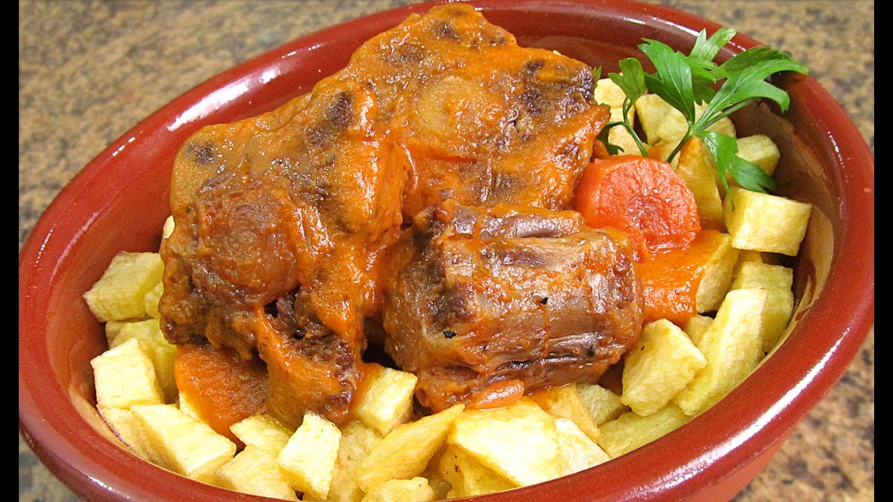

> 📺 **Vídeo y Receta Oficial:** [Ver en Hogarmania / Karlos Arguiñano: Rabo de Toro Estofado al Vino Tinto Rioja](https://www.hogarmania.com/cocina/recetas/)
> 📊 **Infografía Educativa TouChef:** [Ver Infografía Técnica](assets/infografia_rabo_de_toro_estofado_al_vino_tinto_rioja.jpg)

### 📋 Ficha Técnica y Resumen
| Parámetro | Valor |
|---|---|
| **Tiempo de Preparación** | 25 min |
| **Tiempo de Cocción** | 3 h (1 h en olla exprés) |
| **Dificultad** | Media |
| **Raciones** | 4-6 raciones |
| **Coste Estimado** | Medio-Alto (€€€) |

### ⚠️ Matriz Oficial de Alérgenos (Reglamento UE 1169/2011)
| Alérgeno | Presencia | Ingrediente / Detalle |
|---|:---:|---|
| **Gluten** | 🟢 SÍ | Harina de trigo para sellado |
| **Crustáceos** | ⚪ NO | Ausente |
| **Huevos** | ⚪ NO | Ausente |
| **Pescado** | ⚪ NO | Ausente |
| **Cacahuetes** | ⚪ NO | Ausente |
| **Soja** | ⚪ NO | Ausente |
| **Lácteos** | ⚪ NO | Ausente |
| **Frutos de cáscara** | ⚪ NO | Ausente |
| **Apio** | 🟢 SÍ | Tallo de apio verde en mirepoix |
| **Mostaza** | ⚪ NO | Ausente |
| **Sésamo** | ⚪ NO | Ausente |
| **Sulfitos** | 🟢 SÍ | Vino tinto crianza y brandy |
| **Altramuces** | ⚪ NO | Ausente |
| **Moluscos** | ⚪ NO | Ausente |

### ⚖️ Ingredientes Exactos (Mise en Place)

- **Rabo de toro o buey cortado por las articulaciones**: 1.500 g
- **Vino tinto con cuerpo D.O. Ca. Rioja**: 1 botella (750 ml)
- **Brandy o Coñac**: 50 ml
- **Cebollas grandes picadas**: 2 uds (350 g)
- **Zanahorias dulces en rodajas gruesas**: 3 uds (250 g)
- **Puerro limpio en rodajas**: 1 ud (120 g)
- **Ramas de apio limpias picadas**: 2 ramas (80 g)
- **Dientes de ajo enteros aplastados**: 6 uds (30 g)
- **Fondo oscuro de carne concentrado**: 600 ml
- **Clavos de olor, pimienta negra en grano y laurel**: 3 clavos / 10 granos / 2 hojas
- **Harina de trigo de repostería / común**: 40 g
- **Aceite de oliva virgen extra (AOVE)**: 70 ml
- **Sal marina gruesa y pimienta negra molida**: 10 g / 4 g

### 🔪 Equipamiento y Utillaje Necesario
- Cocotte de hierro fundido de 30 cm o cazuela alta de fondo térmico
- Colador chino y prensa verduras
- Pinza de chef para guisos pesados

### 👨‍🍳 Paso a Paso Técnico y Minucioso

1. **Sellado y caramelización del rabo:** Retirar el exceso de grasa exterior de las rodajas. Salpimentar y pasar por un velo fino de harina. Calentar el AOVE en la cocotte a fuego alto y sellar las piezas de rabo por todas sus caras durante 10-12 min hasta que queden profundamente tostadas. Flambear con el brandy con precaución y retirar las piezas a una bandeja.
2. **Mirepoix sofrito y especiado:** En el mismo fondo con los jugos concentrados, agregar los ajos, cebollas, zanahorias, puerro y apio. Añadir los clavos de olor pinchados, los granos de pimienta y el laurel. Rehogar a fuego medio-bajo durante 20 minutos hasta que las hortalizas estén confitadas y muy oscuras.
3. **Desglasado y estofado prolongado:** Verter el vino tinto y raspar con cuchara de madera el fondo para integrar los sueros caramelizados. Dejar reducir a fuego vivo 15 minutos hasta que pierda el olor a alcohol. Devolver las rodajas de rabo a la cazuela, verter el fondo oscuro caliente y tapar. Estofar a fuego muy lento (90°C) durante 3 horas enteras (o 60 minutos en olla a presión) hasta que la carne prácticamente se desprenda del hueso central.
4. **Texturizado de la salsa:** Sacar los trozos de rabo con sumo cuidado para que no se desprendan. Colar la salsa por el chino presionando las verduras para extraer todo el extracto, desechar los posos duros y desgrasar la capa de aceite superficial con un cazo. Reducir la salsa al fuego durante 8 minutos hasta que quede densa, untuosa y brillante. Napar las piezas de carne.

### 🍽️ Emplatado y Textura Final

- Colocar dos rodajas gruesas de rabo en plato hondo, salsear profusamente con el jugo glaseado y acompañar con zanahorias del guiso y dados de patata frita o chalotas glaseadas al tomillo.

### ⏱️ Protocolo de Conservación y Batch Cooking
- **Refrigeración (0°C a 3°C):** 5 días en frío. El rabo de toro es el guiso rey del reposo: al enfriar, el colágeno forma un bloque compacto y al regenerarse al día siguiente resulta inigualable.
- **Congelación (-18°C):** 4 meses en táper sellado con su salsa.
- **Envasado al Vacío:** 12 días en frío a 2°C.

### 🔥 Guía de Regeneración Multicanal
- **Sartén / Cazuela:** Calentar a fuego lento tapado durante 8-10 min con unas gotas de agua o caldo.
- **Horno Convectivo:** 15 min a 150°C tapado.
- **Microondas:** 3-4 min a 600W tapado con campana.

---

## 🐑 Cordero Lechal Asado con Patatas Panadera

> 📺 **Vídeo y Receta Oficial:** [Ver en Hogarmania / Karlos Arguiñano: Cordero Lechal Asado con Patatas Panadera](https://www.hogarmania.com/cocina/recetas/)
> 📊 **Infografía Educativa TouChef:** [Ver Infografía Técnica](assets/infografia_cordero_lechal_asado_con_patatas_panadera.jpg)

### 📋 Ficha Técnica y Resumen
| Parámetro | Valor |
|---|---|
| **Tiempo de Preparación** | 15 min |
| **Tiempo de Cocción** | 1 h 30 min |
| **Dificultad** | Fácil |
| **Raciones** | 4 raciones |
| **Coste Estimado** | Alto (€€€) |

### ⚠️ Matriz Oficial de Alérgenos (Reglamento UE 1169/2011)
| Alérgeno | Presencia | Ingrediente / Detalle |
|---|:---:|---|
| **Gluten** | ⚪ NO | Ausente |
| **Crustáceos** | ⚪ NO | Ausente |
| **Huevos** | ⚪ NO | Ausente |
| **Pescado** | ⚪ NO | Ausente |
| **Cacahuetes** | ⚪ NO | Ausente |
| **Soja** | ⚪ NO | Ausente |
| **Lácteos** | ⚪ NO | Ausente (manteca tradicional sustituible por AOVE) |
| **Frutos de cáscara** | ⚪ NO | Ausente |
| **Apio** | ⚪ NO | Ausente |
| **Mostaza** | ⚪ NO | Ausente |
| **Sésamo** | ⚪ NO | Ausente |
| **Sulfitos** | 🟢 SÍ | Vinagre de manzana / vino blanco en majado |
| **Altramuces** | ⚪ NO | Ausente |
| **Moluscos** | ⚪ NO | Ausente |

### ⚖️ Ingredientes Exactos (Mise en Place)
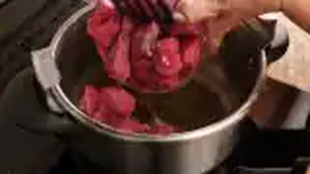
- **Paletillas o cuartos traseros de cordero lechal**: 2 uds (1.800 g en total)
- **Patatas especiales para asar (Monalisa / Kennebec)**: 4 uds (800 g)
- **Cebollas grandes cortadas en aros finos**: 2 uds (300 g)
- **Pimiento verde en juliana gruesa**: 1 ud (100 g)
- **Dientes de ajo pelados para el majado**: 6 uds (30 g)
- **Agua mineral**: 250 ml
- **Vinagre de sidra o vino blanco**: 40 ml
- **Manteca de cerdo ibérico o AOVE virgen extra**: 40 g
- **Ramas de tomillo y romero frescos**: 4 ramas (10 g)
- **Sal gorda marina y pimienta negra en grano**: 12 g / 3 g

### 🔪 Equipamiento y Utillaje Necesario
- Fuente amplia de barro refractario o bandeja de horno esmaltada
- Mortero de piedra o granito
- Pincel de silicona de cocina

### 👨‍🍳 Paso a Paso Técnico y Minucioso

1. **Majado y adobo del lechal:** En mortero, machacar los dientes de ajo con la sal gorda, granos de pimienta, hojas de romero y tomillo hasta obtener una pasta homogénea. Añadir el vinagre de sidra y 20 ml de AOVE o manteca fundida. Untar minuciosamente las piezas de cordero por todos sus recovecos con la mezcla.
2. **Cama panadera:** Pelar y cortar las patatas en rodajas de 5-6 mm de grosor (tipo panadera). En la base de la fuente de barro, distribuir las patatas, la cebolla en aros y el pimiento verde. Salpimentar ligeramente y rociar con 30 ml de AOVE y 100 ml de agua mineral en el fondo.
3. **Primer horneado (piel hacia abajo):** Precalentar el horno a 170°C calor arriba y abajo (sin ventilador forzado). Colocar el cordero sobre la cama de patatas con la parte interior hacia arriba (la piel abajo). Hornear durante 50 minutos. Rociar de vez en cuando la carne con el jugo de la bandeja para mantener la hidratación interior.
4. **Segundo horneado y crujiente de piel:** Dar la vuelta a las piezas colocando la piel hacia arriba. Subir el horno a 190°C-200°C y hornear durante 35-40 minutos adicionales. La piel debe inflarse y adquirir un color dorado caoba con textura sumamente crujiente, mientras el interior se mantiene tierno y jugoso.

### 🍽️ Emplatado y Textura Final
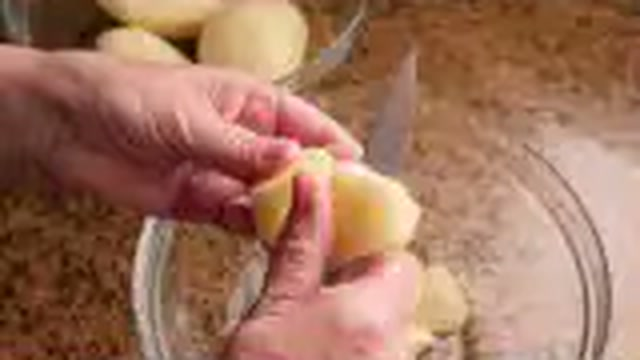
- Servir la paletilla crujiente sobre una generosa porción de patatas panaderas caramelizadas con la cebolla y perfumadas con el jugo natural del cordero.
- No tapar la carne para preservar el crujiente de la piel.

### ⏱️ Protocolo de Conservación y Batch Cooking
- **Refrigeración (0°C a 3°C):** 3 días en nevera.
- **Congelación (-18°C):** 2 meses (la patata cocida pierde textura en congelación; se recomienda congelar solo la carne desmigada en sus jugos).
- **Envasado al Vacío:** 6 días a 2°C.

### 🔥 Guía de Regeneración Multicanal
- **Horno Convectivo (Método Óptimo):** 10-12 min a 180°C con función grill los últimos 2 minutos para recuperar el crujiente de la piel.
- **Sartén / Cazuela:** Desmigar la carne y dorar a la plancha con sus patatas 4 minutos.
- **Microondas:** No recomendado para piezas con piel crujiente (reblandece la costra).

---

## 🧆 Albóndigas Caseras en Salsa Española Tradicional

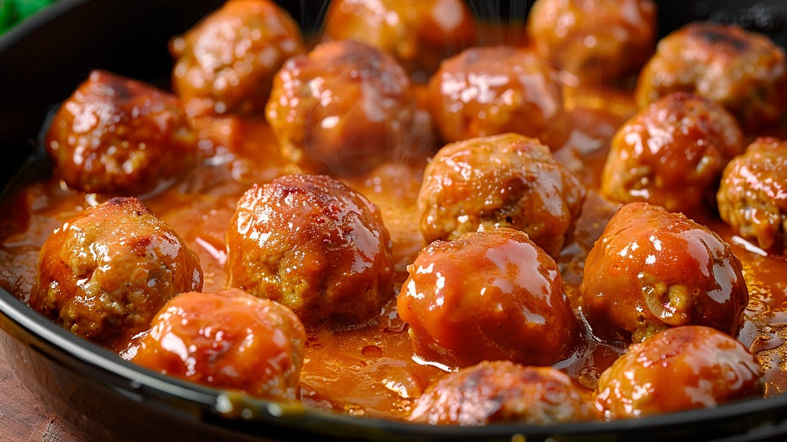

> 📺 **Vídeo y Receta Oficial:** [Ver en Hogarmania / Karlos Arguiñano: Albóndigas Caseras en Salsa Española Tradicional](https://www.hogarmania.com/cocina/recetas/)
> 📊 **Infografía Educativa TouChef:** [Ver Infografía Técnica](assets/infografia_albondigas_caseras_en_salsa_espanola_tradicional.jpg)

### 📋 Ficha Técnica y Resumen
| Parámetro | Valor |
|---|---|
| **Tiempo de Preparación** | 30 min |
| **Tiempo de Cocción** | 30 min |
| **Dificultad** | Fácil-Media |
| **Raciones** | 4 raciones (aprox. 16-20 albóndigas) |
| **Coste Estimado** | Económico (€) |

### ⚠️ Matriz Oficial de Alérgenos (Reglamento UE 1169/2011)
| Alérgeno | Presencia | Ingrediente / Detalle |
|---|:---:|---|
| **Gluten** | 🟢 SÍ | Miga de pan blanco y harina para rebozar |
| **Crustáceos** | ⚪ NO | Ausente |
| **Huevos** | 🟢 SÍ | Huevo campero en la masa cárnica |
| **Pescado** | ⚪ NO | Ausente |
| **Cacahuetes** | ⚪ NO | Ausente |
| **Soja** | ⚪ NO | Ausente |
| **Lácteos** | 🟢 SÍ | Leche entera para remojar la miga de pan |
| **Frutos de cáscara** | ⚪ NO | Ausente |
| **Apio** | ⚪ NO | Ausente |
| **Mostaza** | ⚪ NO | Ausente |
| **Sésamo** | ⚪ NO | Ausente |
| **Sulfitos** | 🟢 SÍ | Vino blanco o tinto en la salsa española |
| **Altramuces** | ⚪ NO | Ausente |
| **Moluscos** | ⚪ NO | Ausente |

### ⚖️ Ingredientes Exactos (Mise en Place)
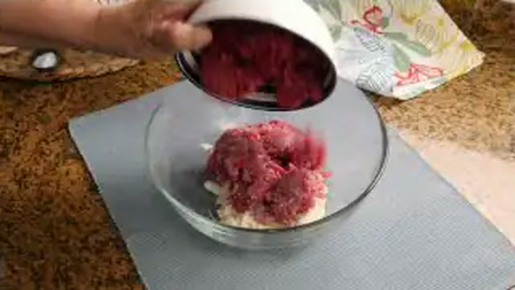
- **Carne picada mixta (50% aguja de ternera, 50% magro de cerdo)**: 600 g
- **Huevos camperos tamaño L**: 2 uds (120 g)
- **Miga de pan del día anterior**: 70 g
- **Leche entera**: 100 ml
- **Dientes de ajo picados muy finos**: 2 uds (10 g)
- **Perejil fresco picado**: 10 g
- **Cebollas picadas en brunoise para la salsa**: 2 uds (280 g)
- **Zanahoria picada fina**: 1 ud (90 g)
- **Harina de trigo (para albóndigas y salsa)**: 50 g
- **Vino blanco seco o tinto suave**: 120 ml
- **Caldo de carne o de ave casero**: 500 ml
- **Aceite de oliva virgen extra para freír**: 150 ml
- **Sal fina y pimienta blanca molida**: 8 g / 2 g

### 🔪 Equipamiento y Utillaje Necesario
- Bol hondo de acero o cristal para la masa
- Sartén antiadherente honda para fritura
- Cazuela baja de 28 cm para el guisado
- Pasapurés o batidora de mano

### 👨‍🍳 Paso a Paso Técnico y Minucioso
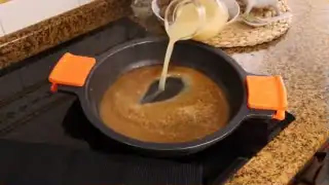
1. **Amasado y boleado:** Remojar la miga de pan en la leche durante 5 min y escurrir ligeramente. En un bol amplio, mezclar la carne picada con los huevos batidos, la miga remojada, el ajo picado fino, el perejil, sal y pimienta. Trabajar con las manos durante 3-4 minutos hasta que la masa quede amalgamada y pegajosa. Bolear porciones de 35-40 g y pasarlas por un velo fino de harina.
2. **Fritura superficial rápida:** Calentar el AOVE en sartén a 170°C. Freír las albóndigas durante 2 minutos girándolas para sellar la corteza exterior sin cocinarlas por dentro (para evitar que se sequen). Sacar sobre papel absorbente.
3. **Elaboración de la salsa española:** En la cazuela con 3 cucharadas del aceite de fritura colado, pochar la cebolla picada y la zanahoria a fuego medio durante 15 minutos hasta que tomen un color pardo dorado. Añadir 1 cucharada rasa de harina (15 g) y tostar 1 minuto (roux rubio). Verter el vino blanco y reducir 3 minutos. Añadir el caldo de carne caliente y cocer a fuego lento 10 minutos. Triturar la salsa con batidora para lograr una textura sedosa.
4. **Cocción en conjunto:** Introducir las albóndigas fritas en la salsa española hirviendo suavemente. Guisar a fuego muy bajo durante 12-15 minutos con tapa entreabierta, agitando la cazuela con vaivén para que los almidones traben una salsa aterciopelada y las albóndigas absorban el guiso.

### 🍽️ Emplatado y Textura Final

- Servir 4 albóndigas por persona en plato hondo napadas con abundante salsa española y acompañadas de patatas fritas cortadas en dados o guisantes salteados.
- Espolvorear perejil fresco picado.

### ⏱️ Protocolo de Conservación y Batch Cooking
- **Refrigeración (0°C a 3°C):** 4 días en táper de vidrio. Las albóndigas ganan en jugosidad al impregnarse de la salsa durante la noche.
- **Congelación (-18°C):** Hasta 3 meses perfectamente cubiertas de salsa.
- **Envasado al Vacío:** 7 días a 2°C.

### 🔥 Guía de Regeneración Multicanal
- **Sartén / Cazuela:** 5 min a fuego suave tapado, removiendo con cuidado.
- **Horno Convectivo:** 10 min a 150°C tapado.
- **Microondas:** 2 min y medio a 700W cubierto.

---

## 🥩 Chuletón de Vaca Vieja a la Plancha con Pimientos de Gernika

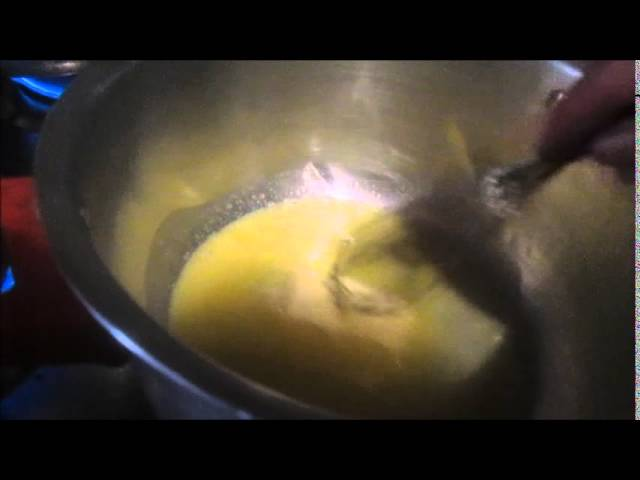

> 📺 **Vídeo y Receta Oficial:** [Ver en Hogarmania / Karlos Arguiñano: Chuletón de Vaca Vieja a la Plancha con Pimientos de Gernika](https://www.hogarmania.com/cocina/recetas/)
> 📊 **Infografía Educativa TouChef:** [Ver Infografía Técnica](assets/infografia_chuleton_de_vaca_vieja_a_la_plancha_con_pimientos_de_gernika.jpg)

### 📋 Ficha Técnica y Resumen
| Parámetro | Valor |
|---|---|
| **Tiempo de Preparación** | 10 min (más 2 h de atemperado obligatorio) |
| **Tiempo de Cocción** | 12 min |
| **Dificultad** | Fácil-Media |
| **Raciones** | 2-3 raciones |
| **Coste Estimado** | Alto (€€€) |

### ⚠️ Matriz Oficial de Alérgenos (Reglamento UE 1169/2011)
| Alérgeno | Presencia | Ingrediente / Detalle |
|---|:---:|---|
| **Gluten** | ⚪ NO | Ausente |
| **Crustáceos** | ⚪ NO | Ausente |
| **Huevos** | ⚪ NO | Ausente |
| **Pescado** | ⚪ NO | Ausente |
| **Cacahuetes** | ⚪ NO | Ausente |
| **Soja** | ⚪ NO | Ausente |
| **Lácteos** | ⚪ NO | Ausente |
| **Frutos de cáscara** | ⚪ NO | Ausente |
| **Apio** | ⚪ NO | Ausente |
| **Mostaza** | ⚪ NO | Ausente |
| **Sésamo** | ⚪ NO | Ausente |
| **Sulfitos** | ⚪ NO | Ausente |
| **Altramuces** | ⚪ NO | Ausente |
| **Moluscos** | ⚪ NO | Ausente |

### ⚖️ Ingredientes Exactos (Mise en Place)
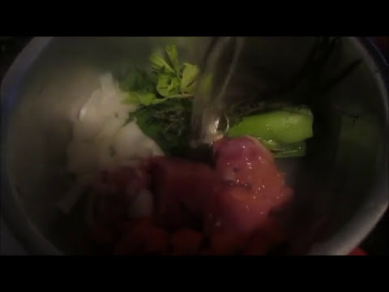
- **Chuletón de vaca vieja / rubia gallega madurado (lomo alto/bajo con hueso)**: 1 ud (1.200 g, grosor 4-5 cm)
- **Pimientos de Gernika frescos o del Padrón**: 200 g (aprox. 16-20 uds)
- **Grasa propia del chuletón recortada o AOVE**: 20 g / 40 ml
- **Sal marina gruesa o escamas de sal Maldon**: 30 g
- **Aceite de oliva virgen extra para freír los pimientos**: 100 ml

### 🔪 Equipamiento y Utillaje Necesario
- Plancha o sartén estriada de hierro colado grueso (Lodge o De Buyer)
- Pinzas gastronómicas largas (sin pinchar la carne)
- Sartén pequeña para la fritura de pimientos
- Tabla de trinchado de madera noble y cuchillo de trinchar bien afilado

### 👨‍🍳 Paso a Paso Técnico y Minucioso
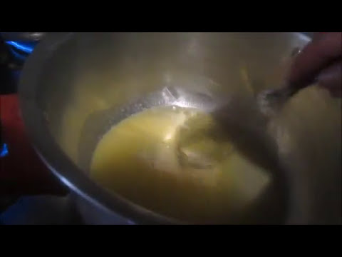
1. **Atemperado térmico indispensable:** Sacar el chuletón de la nevera al menos 2 horas antes de cocinar para que el núcleo alcance los 18-20°C. Secar perfectamente ambas caras con papel secante de cocina. Cortar una tira de la grasa perimetral para engrasar la plancha.
2. **Marcado a fuego vivo (Maillard):** Calentar la plancha de hierro a máxima potencia hasta que empiece a humear (aprox. 230°C-250°C). Frotar la base con la grasa del chuletón. Colocar la pieza y marcar sin mover durante 4-5 minutos.
3. **Volteado y salado en caliente:** Dar la vuelta con pinzas. Cubrir inmediatamente la cara tostada ya sellada con una capa abundante de sal gorda (la carne solo absorberá la sal necesaria gracias a la costra caramelizada). Cocinar la segunda cara durante 4-5 minutos para lograr un punto sangrante/al punto (núcleo a 48-52°C). Sellar los laterales y el hueso apoyando la pieza en vertical 1 minuto.
4. **Fritura de pimientos de Gernika y reposo:** Retirar el chuletón a una tabla caliente y dejar reposar 3-4 minutos para que los jugos se redistribuyan. Mientras tanto, calentar el AOVE en sartén a 180°C y freír los pimientos de Gernika enteros durante 1-2 minutos hasta que se inflen y la piel se arrugue. Escurrir y sazonar con sal gorda.

### 🍽️ Emplatado y Textura Final
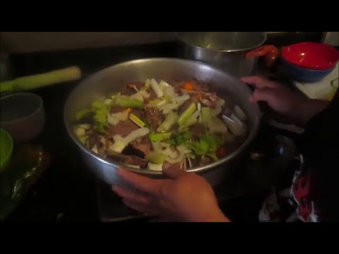
- Sacudir el exceso de sal gorda del chuletón. Separar la carne del hueso con cuchillo afilado y cortar la pieza en filetes transversales de 1 cm de grosor.
- Recomponer la forma junto al hueso en plato de barro previamente calentado y acompañar al lado con la ración de pimientos de Gernika fritos humeantes.

### ⏱️ Protocolo de Conservación y Batch Cooking
- **Consumo Preferente:** Inmediato (la carne a la brasa/plancha pierde sus propiedades organolépticas al enfriar).
- **Refrigeración de sobras (0°C a 3°C):** 2 días (aprovechable para carpaccios templados, tacos, ensaladas o ropa vieja).
- **Congelación (-18°C):** No recomendada tras el cocinado.

### 🔥 Guía de Regeneración Multicanal
- **Sartén / Plancha:** Solo sellado rápido de 30 segundos por cara a fuego vivo con unas gotas de AOVE para evitar sobrecocer el centro.

---

## 🐇 Conejo al Ajillo Tradicional con Tomillo y Patatas

> 📺 **Vídeo y Receta Oficial:** [Ver en Hogarmania / Karlos Arguiñano: Conejo al Ajillo Tradicional con Tomillo y Patatas](https://www.hogarmania.com/cocina/recetas/)
> 📊 **Infografía Educativa TouChef:** [Ver Infografía Técnica](assets/infografia_conejo_al_ajillo_tradicional_con_tomillo_y_patatas.jpg)

### 📋 Ficha Técnica y Resumen
| Parámetro | Valor |
|---|---|
| **Tiempo de Preparación** | 15 min |
| **Tiempo de Cocción** | 35 min |
| **Dificultad** | Fácil |
| **Raciones** | 4 raciones |
| **Coste Estimado** | Económico (€) |

### ⚠️ Matriz Oficial de Alérgenos (Reglamento UE 1169/2011)
| Alérgeno | Presencia | Ingrediente / Detalle |
|---|:---:|---|
| **Gluten** | ⚪ NO | Ausente |
| **Crustáceos** | ⚪ NO | Ausente |
| **Huevos** | ⚪ NO | Ausente |
| **Pescado** | ⚪ NO | Ausente |
| **Cacahuetes** | ⚪ NO | Ausente |
| **Soja** | ⚪ NO | Ausente |
| **Lácteos** | ⚪ NO | Ausente |
| **Frutos de cáscara** | ⚪ NO | Ausente |
| **Apio** | ⚪ NO | Ausente |
| **Mostaza** | ⚪ NO | Ausente |
| **Sésamo** | ⚪ NO | Ausente |
| **Sulfitos** | 🟢 SÍ | Vino blanco seco |
| **Altramuces** | ⚪ NO | Ausente |
| **Moluscos** | ⚪ NO | Ausente |

### ⚖️ Ingredientes Exactos (Mise en Place)

- **Conejo limpio troceado menudo para ajillo**: 1 ud (1.200 g)
- **Cabezas de ajo morado (dientes enteros con un corte en piel)**: 12 dientes (60 g)
- **Vino blanco seco (Txakoli, Rueda o Montilla)**: 150 ml
- **Vinagre de manzana**: 15 ml
- **Ramas de tomillo silvestre fresco**: 4 ramas (10 g)
- **Ramas de romero fresco**: 2 ramas (5 g)
- **Guindilla seca / cayena en aros**: 1 ud
- **Patatas cortadas en dados o dados panadera**: 3 uds (600 g)
- **Aceite de oliva virgen extra (AOVE)**: 100 ml
- **Sal marina gruesa y pimienta negra**: 8 g / 3 g

### 🔪 Equipamiento y Utillaje Necesario
- Cazuela ancha de barro o sartén honda de acero inoxidable (32 cm)
- Espumadera y pinzas de cocina

### 👨‍🍳 Paso a Paso Técnico y Minucioso
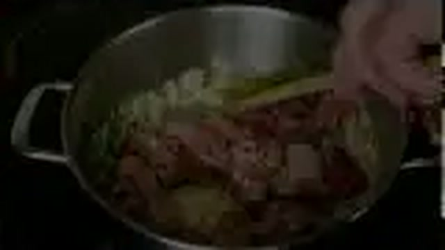
1. **Confitado inicial de los ajos:** En la cazuela con los 100 ml de AOVE a fuego muy suave (120°C), poner los dientes de ajo con piel ligeramente chafados y la guindilla. Confitar durante 8 minutos hasta que adquieran un tono dorado y estén tiernos sin quemarse. Retirar y reservar.
2. **Dorado crujiente del conejo:** Subir el fuego a medio-alto. Salpimentar las piezas de conejo troceadas menudas y agregarlas a la cazuela con el aceite aromatizado. Dorar intensamente durante 12-14 minutos dándoles la vuelta periódicamente para que queden muy tostadas y crujientes por fuera.
3. **Desglasado con vino, vinagre y hierbas:** Reincorporar los ajos confitados, las ramas de tomillo y romero. Verter el vinagre de manzana y el vino blanco. Dejar cocer a fuego vivo durante 4 minutos para evaporar el alcohol y, a continuación, bajar a fuego suave 10 minutos tapado para que la carne se cocine con sus vapores aromáticos y quede tierna y jugosa.
4. **Guarnición de patatas al ajillo:** Paralelamente, freír los dados de patata en sartén aparte hasta que queden doradas y tiernas. Incorporarlas a la cazuela del conejo en los últimos 2 minutos de cocción para que se impregnen de la salsa de ajos y vino blanco.

### 🍽️ Emplatado y Textura Final

- Servir en cazuela de barro caliente repartiendo el conejo dorado, los dados de patatas y los ajos confitados regados con el jugo reducido de tomillo.

### ⏱️ Protocolo de Conservación y Batch Cooking
- **Refrigeración (0°C a 3°C):** 3 días en recipiente hermético de borosilicato.
- **Congelación (-18°C):** Hasta 2 meses (congelar solo el conejo con su jugo, sin las patatas fritas).
- **Envasado al Vacío:** 6 días a 2°C.

### 🔥 Guía de Regeneración Multicanal
- **Sartén / Cazuela:** 4-5 minutos a fuego medio salteando con su propio jugo.
- **Horno Convectivo:** 8 min a 170°C.
- **Microondas:** 2 min y medio a 700W.

---

## 🥩 Ternera Guisada a la Jardinera con Guisantes y Zanahorias

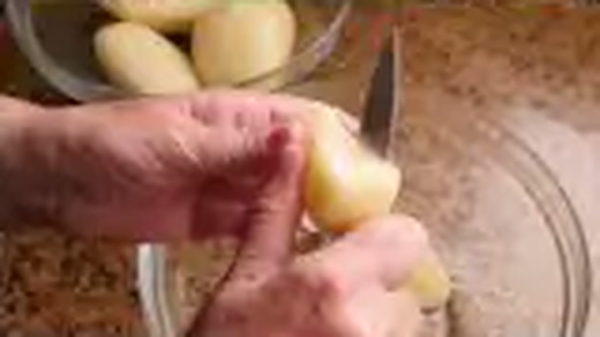

> 📺 **Vídeo y Receta Oficial:** [Ver en Hogarmania / Karlos Arguiñano: Ternera Guisada a la Jardinera con Guisantes y Zanahorias](https://www.hogarmania.com/cocina/recetas/)
> 📊 **Infografía Educativa TouChef:** [Ver Infografía Técnica](assets/infografia_ternera_guisada_a_la_jardinera_con_guisantes_y_zanahorias.jpg)

### 📋 Ficha Técnica y Resumen
| Parámetro | Valor |
|---|---|
| **Tiempo de Preparación** | 20 min |
| **Tiempo de Cocción** | 1 h 20 min (35 min en olla rápida) |
| **Dificultad** | Fácil-Media |
| **Raciones** | 4 raciones |
| **Coste Estimado** | Medio (€€) |

### ⚠️ Matriz Oficial de Alérgenos (Reglamento UE 1169/2011)
| Alérgeno | Presencia | Ingrediente / Detalle |
|---|:---:|---|
| **Gluten** | 🟢 SÍ | Harina de trigo para enharinar la ternera |
| **Crustáceos** | ⚪ NO | Ausente |
| **Huevos** | ⚪ NO | Ausente |
| **Pescado** | ⚪ NO | Ausente |
| **Cacahuetes** | ⚪ NO | Ausente |
| **Soja** | ⚪ NO | Ausente |
| **Lácteos** | ⚪ NO | Ausente |
| **Frutos de cáscara** | ⚪ NO | Ausente |
| **Apio** | ⚪ NO | Ausente |
| **Mostaza** | ⚪ NO | Ausente |
| **Sésamo** | ⚪ NO | Ausente |
| **Sulfitos** | 🟢 SÍ | Vino blanco o tinto en el estofado |
| **Altramuces** | ⚪ NO | Ausente |
| **Moluscos** | ⚪ NO | Ausente |

### ⚖️ Ingredientes Exactos (Mise en Place)

- **Aguja, morcillo o aleta de ternera cortada en dados de 3 cm**: 1.000 g
- **Guisantes frescos o congelados extrafinos**: 200 g
- **Zanahorias cortadas en rodajas de 1 cm**: 3 uds (250 g)
- **Patatas medianas chascadas**: 2 uds (350 g)
- **Cebolla dulce picada en brunoise**: 1 ud grande (200 g)
- **Pimiento verde italiano picado**: 1 ud (100 g)
- **Dientes de ajo picados**: 3 uds (15 g)
- **Tomate maduro rallado**: 2 uds (180 g)
- **Vino blanco seco**: 150 ml
- **Fondo de carne o caldo de verduras casero**: 700 ml
- **Harina de trigo**: 25 g
- **Aceite de oliva virgen extra (AOVE)**: 50 ml
- **Sal marina, pimienta negra molida y 1 hoja de laurel**: 8 g / 2 g / 1 ud

### 🔪 Equipamiento y Utillaje Necesario
- Cazuela de acero inoxidable o cocotte (28 cm)
- Tabla de corte y cuchillo cebollero
- Cucharón de guiso

### 👨‍🍳 Paso a Paso Técnico y Minucioso

1. **Sellado de los tacos de ternera:** Salpimentar y enharinar ligeramente los dados de carne. Calentar el AOVE en la cazuela a fuego vivo y sellar la ternera en dos tandas durante 5-6 minutos hasta formar una costra tostada. Retirar y reservar.
2. **Sofrito jardinera base:** En el mismo aceite, pochar los ajos, la cebolla picada y el pimiento verde durante 10 minutos a fuego medio. Agregar el tomate rallado y sofreír 5 minutos más hasta concentrar los azúcares. Verter el vino blanco y reducir a la mitad.
3. **Estofado lento de la carne:** Reincorporar la ternera con sus jugos, añadir las zanahorias en rodajas, la hoja de laurel y cubrir con el caldo de carne caliente. Tapar y cocinar a fuego lento durante 1 hora (o 25 min en olla exprés) hasta que la ternera comience a ablandarse.
4. **Incorporación de patatas y guisantes:** Añadir las patatas chascadas y los guisantes. Rectificar de sal y cocinar destapado a fuego suave durante 18-20 minutos más hasta que la patata esté tierna y el almidón libere una salsa ligada y untuosa.

### 🍽️ Emplatado y Textura Final

- Servir en plato hondo bien caliente combinando los tiernos dados de ternera con las verduras coloridas de la jardinera y la patata melosa.
- Decorar con una pizca de perejil picado.

### ⏱️ Protocolo de Conservación y Batch Cooking
- **Refrigeración (0°C a 3°C):** 4 días en táper cerrado.
- **Congelación (-18°C):** 3 meses (se recomienda no congelar con la patata, o retirarla antes de congelar).
- **Envasado al Vacío:** 7 días a 2°C.

### 🔥 Guía de Regeneración Multicanal
- **Sartén / Cazuela:** 5 min a fuego lento con 2 cucharadas de caldo.
- **Horno Convectivo:** 10 min a 150°C tapado.
- **Microondas:** 2-3 min a 700W tapado.

---

## 🥩 Solomillo de Cerdo con Salsa de Queso Idiazábal

> 📺 **Vídeo y Receta Oficial:** [Ver en Hogarmania / Karlos Arguiñano: Solomillo de Cerdo con Salsa de Queso Idiazábal](https://www.hogarmania.com/cocina/recetas/)
> 📊 **Infografía Educativa TouChef:** [Ver Infografía Técnica](assets/infografia_solomillo_de_cerdo_con_salsa_de_queso_idiazabal.jpg)

### 📋 Ficha Técnica y Resumen
| Parámetro | Valor |
|---|---|
| **Tiempo de Preparación** | 10 min |
| **Tiempo de Cocción** | 15 min |
| **Dificultad** | Fácil |
| **Raciones** | 4 raciones |
| **Coste Estimado** | Medio (€€) |

### ⚠️ Matriz Oficial de Alérgenos (Reglamento UE 1169/2011)
| Alérgeno | Presencia | Ingrediente / Detalle |
|---|:---:|---|
| **Gluten** | ⚪ NO | Ausente |
| **Crustáceos** | ⚪ NO | Ausente |
| **Huevos** | ⚪ NO | Ausente |
| **Pescado** | ⚪ NO | Ausente |
| **Cacahuetes** | ⚪ NO | Ausente |
| **Soja** | ⚪ NO | Ausente |
| **Lácteos** | 🟢 SÍ | Nata líquida culinaria y queso Idiazábal |
| **Frutos de cáscara** | ⚪ NO | Ausente |
| **Apio** | ⚪ NO | Ausente |
| **Mostaza** | ⚪ NO | Ausente |
| **Sésamo** | ⚪ NO | Ausente |
| **Sulfitos** | 🟢 SÍ | Vino blanco o brandy en desglasado |
| **Altramuces** | ⚪ NO | Ausente |
| **Moluscos** | ⚪ NO | Ausente |

### ⚖️ Ingredientes Exactos (Mise en Place)
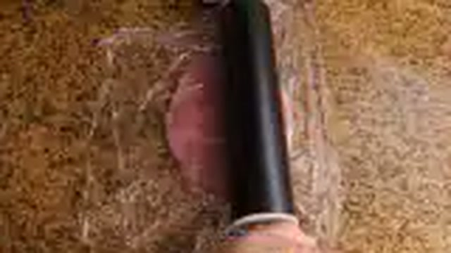
- **Solomillos de cerdo frescos y limpios de grasa**: 2 uds (800-900 g)
- **Queso Idiazábal ahumado D.O. rallado fino**: 150 g
- **Nata líquida culinaria (35% M.G.)**: 250 ml
- **Chalotas picadas finas en brunoise**: 2 uds (60 g)
- **Brandy o Txakoli para desglasar**: 40 ml
- **Mantequilla**: 15 g
- **Aceite de oliva virgen extra (AOVE)**: 30 ml
- **Manzanas tipo Reineta o Golden**: 2 uds (300 g)
- **Sal marina fina, pimienta negra y nuez moscada**: 6 g / 2 g / 1 pizca

### 🔪 Equipamiento y Utillaje Necesario
- Sartén antiadherente de acero o hierro (28 cm)
- Cazo para la salsa de queso
- Rallador Microplane para el Idiazábal
- Varilla de batir pequeña

### 👨‍🍳 Paso a Paso Técnico y Minucioso
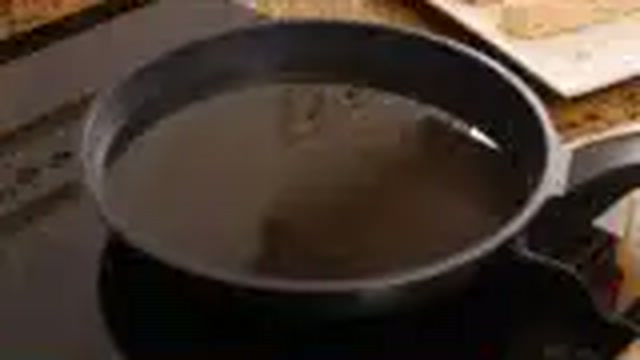
1. **Elaboración de la crema de Idiazábal:** En un cazo a fuego bajo, derretir la mantequilla con las chalotas picadas y rehogar 4 min sin que cojan color. Verter el brandy y evaporar 1 minuto. Añadir la nata líquida, una pizca de pimienta y nuez moscada. Al romper a hervir suavemente, retirar del fuego, incorporar el queso Idiazábal rallado y batir con varillas hasta lograr una crema homogénea, untuosa y fundida. Mantener al baño maría templada.
2. **Guarnición de manzana salteada:** Pelar y cortar las manzanas en gajos de 1 cm. Dorar en sartén con 10 g de mantequilla a fuego medio durante 6 minutos hasta que queden caramelizadas por fuera y tiernas por dentro.
3. **Marcado de medallones de solomillo:** Cortar los solomillos en medallones gruesos de 3-4 cm. Salpimentar al momento. En sartén bien caliente con el AOVE a fuego vivo, sellar los medallones durante 2-3 minutos por cara, buscando un exterior dorado y un núcleo jugoso y rosado (56-58°C).

### 🍽️ Emplatado y Textura Final

- Disponer en la base del plato una generosa lágrima de salsa caliente de queso Idiazábal.
- Colocar encima 3 medallones de solomillo recién salteados y acompañar lateralmente con los gajos de manzana caramelizada.

### ⏱️ Protocolo de Conservación y Batch Cooking
- **Refrigeración (0°C a 3°C):** Conservar la carne y la salsa por separado en botes herméticos hasta 3 días.
- **Congelación (-18°C):** No congelar la salsa de nata y queso (pierde la emulsión).
- **Envasado al Vacío:** 4 días a 2°C.

### 🔥 Guía de Regeneración Multicanal
- **Sartén / Cazuela:** Calentar los medallones 1 min por lado y calentar la salsa a fuego suave batiendo con varilla.
- **Microondas:** 1 min a 600W de potencia media.

---

## 🍗 Codornices Estofadas con Uvas y Chalotas

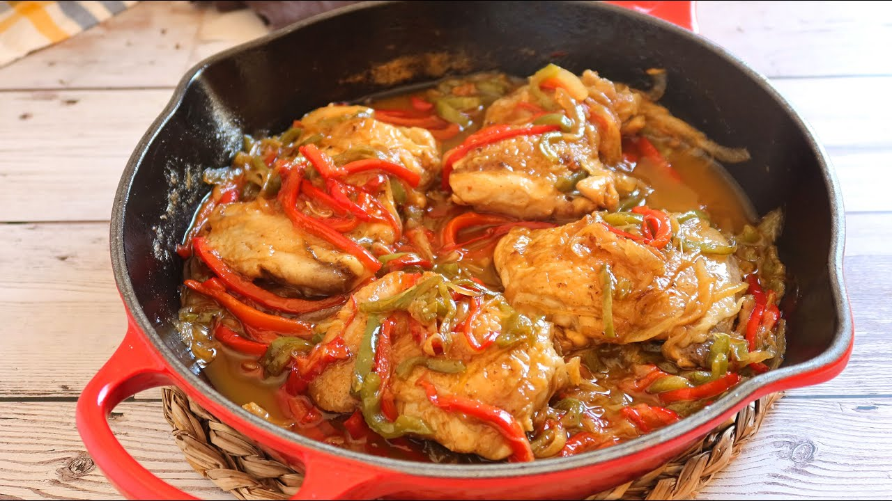

> 📺 **Vídeo y Receta Oficial:** [Ver en Hogarmania / Karlos Arguiñano: Codornices Estofadas con Uvas y Chalotas](https://www.hogarmania.com/cocina/recetas/)
> 📊 **Infografía Educativa TouChef:** [Ver Infografía Técnica](assets/infografia_codornices_estofadas_con_uvas_y_chalotas.jpg)

### 📋 Ficha Técnica y Resumen
| Parámetro | Valor |
|---|---|
| **Tiempo de Preparación** | 15 min |
| **Tiempo de Cocción** | 35 min |
| **Dificultad** | Fácil-Media |
| **Raciones** | 4 raciones (2 codornices por comensal) |
| **Coste Estimado** | Medio (€€) |

### ⚠️ Matriz Oficial de Alérgenos (Reglamento UE 1169/2011)
| Alérgeno | Presencia | Ingrediente / Detalle |
|---|:---:|---|
| **Gluten** | 🟢 SÍ | Harina de trigo para sellado |
| **Crustáceos** | ⚪ NO | Ausente |
| **Huevos** | ⚪ NO | Ausente |
| **Pescado** | ⚪ NO | Ausente |
| **Cacahuetes** | ⚪ NO | Ausente |
| **Soja** | ⚪ NO | Ausente |
| **Lácteos** | ⚪ NO | Ausente |
| **Frutos de cáscara** | ⚪ NO | Ausente |
| **Apio** | ⚪ NO | Ausente |
| **Mostaza** | ⚪ NO | Ausente |
| **Sésamo** | ⚪ NO | Ausente |
| **Sulfitos** | 🟢 SÍ | Vino blanco seco o Pedro Ximénez |
| **Altramuces** | ⚪ NO | Ausente |
| **Moluscos** | ⚪ NO | Ausente |

### ⚖️ Ingredientes Exactos (Mise en Place)
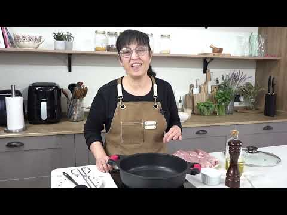
- **Codornices limpias enteras evisceradas**: 8 uds (1.200 g)
- **Uvas blancas moscatel sin pepitas**: 200 g
- **Chalotas francesas enteras peladas**: 12 uds (200 g)
- **Zanahorias en rodajitas**: 2 uds (140 g)
- **Dientes de ajo machacados con piel**: 3 uds (15 g)
- **Vino blanco seco o vino dulce Pedro Ximénez**: 150 ml
- **Caldo de ave o caldo de verduras**: 350 ml
- **Aceite de oliva virgen extra (AOVE)**: 50 ml
- **Harina de trigo**: 20 g
- **Hierbas (tomillo fresco y laurel)**: 2 ramas / 1 hoja
- **Sal fina y pimienta negra en grano**: 8 g / 3 g

### 🔪 Equipamiento y Utillaje Necesario
- Cazuela de barro o cocotte baja (30 cm)
- Hilo de bramante de cocina para bridar las aves
- Pinzas y colador chino

### 👨‍🍳 Paso a Paso Técnico y Minucioso
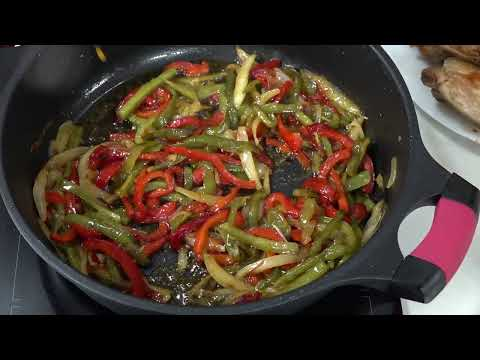
1. **Bridado y sellado de las aves:** Bridar las codornices con hilo de cocina para que mantengan la forma compacta durante la cocción. Salpimentar y enharinar muy sutilmente. En cazuela con el AOVE caliente a fuego vivo, dorar las codornices enteras por todos sus lados durante 6 minutos hasta que la piel quede tostada y sellada. Retirar a un plato.
2. **Confitado de chalotas y zanahoria:** En el mismo aceite a fuego medio, añadir las chalotas enteras peladas, los ajos y las zanahorias. Rehogar durante 10 minutos hasta que las chalotas adquieran un tono dorado translúcido.
3. **Estofado aromático:** Reincorporar las codornices, el tomillo y el laurel. Verter el vino y dejar hervir 3 minutos para evaporar alcoholes. Agregar el caldo de ave caliente. Tapar y guisar a fuego suave (chup-chup) durante 20 minutos hasta que la carne esté blanda y jugosa.
4. **Glaseado final con uvas:** Incorporar las uvas moscatel peladas y sin pepitas a la cazuela en los últimos 4 minutos de cocción, permitiendo que se calienten y suelten su néctar dulce sin deshacerse. Retirar el hilo de bramante antes de servir.

### 🍽️ Emplatado y Textura Final

- Emplatar 2 codornices por comensal acompañadas de 3 chalotas glaseadas y un ramillete de uvas jugosas.
- Napar por encima con la salsa brillante reducida del guiso.

### ⏱️ Protocolo de Conservación y Batch Cooking
- **Refrigeración (0°C a 3°C):** 3 días en recipiente hermético.
- **Congelación (-18°C):** 2 meses en envase estanco.
- **Envasado al Vacío:** 6 días a 2°C.

### 🔥 Guía de Regeneración Multicanal
- **Sartén / Cazuela:** 5 min a fuego lento tapado con 2 cucharadas de agua o caldo.
- **Horno Convectivo:** 8 min a 160°C tapado.
- **Microondas:** 2 min a 650W.
