# 🥘 Arroces, Paellas y Fideuás de la Costa

*Colección oficial de recetas tradicionales de Karlos Arguiñano estandarizadas para la marca TouChef. Incluye alérgenos UE 1169/2011, pesos exactos, paso a paso e infografías educativas Dark Glassmorphism.*

---

## 🥘 Arroz Caldoso con Bogavante del Cantábrico

> 📺 **Vídeo y Receta Oficial:** [Ver en Hogarmania / Karlos Arguiñano: Arroz Caldoso con Bogavante del Cantábrico](https://www.hogarmania.com/cocina/recetas/)
> 📊 **Infografía Educativa TouChef:** [Ver Infografía Técnica](assets/infografia_arroz_caldoso_con_bogavante_del_cantabrico.jpg)

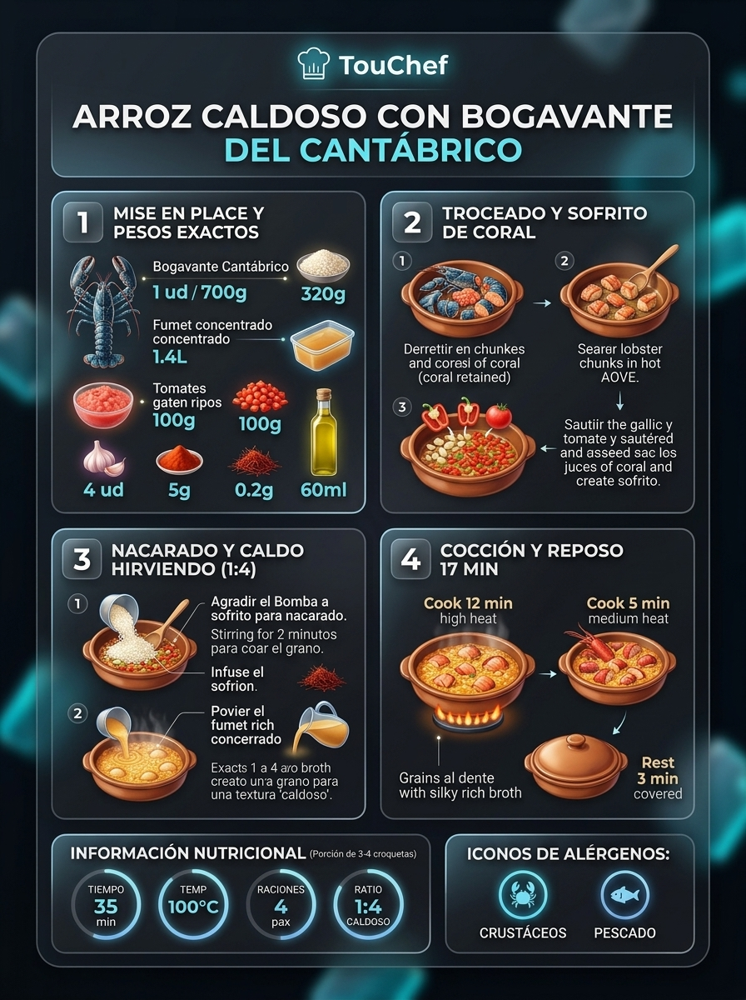

### 📋 Ficha Técnica y Resumen
| Parámetro | Valor |
|---|---|
| **Tiempo de Preparación** | 20 min |
| **Tiempo de Cocción** | 25 min |
| **Dificultad** | Media |
| **Raciones** | 4 raciones |
| **Coste Estimado** | Alto (€€€) |

### ⚠️ Matriz Oficial de Alérgenos (Reglamento UE 1169/2011)
| Alérgeno | Presencia | Ingrediente / Detalle |
|---|:---:|---|
| **Gluten** | ⚪ NO | Ausente |
| **Crustáceos** | 🟢 SÍ | Bogavante fresco del Cantábrico |
| **Huevos** | ⚪ NO | Ausente |
| **Pescado** | 🟢 SÍ | Fumet de pescado de roca |
| **Cacahuetes** | ⚪ NO | Ausente |
| **Soja** | ⚪ NO | Ausente |
| **Lácteos** | ⚪ NO | Ausente |
| **Frutos de cáscara** | ⚪ NO | Ausente |
| **Apio** | ⚪ NO | Ausente |
| **Mostaza** | ⚪ NO | Ausente |
| **Sésamo** | ⚪ NO | Ausente |
| **Sulfitos** | 🟢 SÍ | Brandy / Coñac para flambear |
| **Altramuces** | ⚪ NO | Ausente |
| **Moluscos** | 🟢 SÍ | Calamar o sepia fresca limpia |

### ⚖️ Ingredientes Exactos (Mise en Place)

- **Bogavante vivo o fresco troceado (con jugos de la cabeza)**: 1 ud (750-800 g)
- **Arroz tipo Bomba o Calasparra D.O.**: 320 g
- **Calamar o sepia limpia cortada en dados de 1 cm**: 180 g
- **Fumet rojo concentrado de pescado de roca y marisco**: 1.300 ml (proporción 1:4)
- **Tomate maduro rallado sin piel**: 2 uds (180 g)
- **Pimiento verde italiano picado en brunoise**: 1 ud (100 g)
- **Pimiento rojo morrón picado**: 1/2 ud (80 g)
- **Dientes de ajo laminados**: 3 uds (15 g)
- **Hebras de azafrán tostado**: 12-15 hebras (0,2 g)
- **Brandy o coñac para flambear**: 40 ml
- **Pimentón dulce de la Vera**: 1 cdta (5 g)
- **Aceite de oliva virgen extra (AOVE)**: 60 ml
- **Sal marina fina y perejil fresco picado**: 8 g / 5 g

### 🔪 Equipamiento y Utillaje Necesario
- Cazuela de barro refractario o cocotte de hierro colado (30-32 cm)
- Cuchillo de chef pesado o tijeras de marisco para cortar el bogavante
- Cucharón de servir y tabla de corte

### 👨‍🍳 Paso a Paso Técnico y Minucioso

1. **Troceado y sellado del bogavante:** Cortar la cola del bogavante en medallones siguiendo los anillos y la cabeza por la mitad longitudinalmente sobre una tabla, recogiendo todos sus jugos corales en un bol. En la cazuela con el AOVE caliente a fuego vivo, marcar los trozos de bogavante durante 3 minutos hasta que el caparazón tome un color rojo vivo. Verter el brandy, flambear con precaución y retirar el marisco a un plato.
2. **Sofrito marinero y calamar:** En el mismo aceite aromatizado, dorar los dados de calamar durante 3 minutos. Añadir los ajos laminados, el pimiento verde y el pimiento rojo. Sofreír a fuego medio 10 minutos. Incorporar el pimentón dulce, remover 15 segundos fuera del fuego para evitar que amargue y añadir el tomate rallado. Freír 6 minutos hasta evaporar los líquidos del tomate.
3. **Nacarado y cocción caldosa:** Incorporar las hebras de azafrán previamente machacadas y el arroz. Nacarar a fuego medio durante 2 minutos mezclando con el sofrito. Verter el fumet hirviendo (1.300 ml) y los jugos del bogavante reservados. Cocinar a fuego vivo durante 8 minutos y luego bajar a fuego medio 6 minutos más.
4. **Incorporación del bogavante y reposo:** Introducir los medallones y la cabeza del bogavante en la cazuela. Cocinar a fuego suave durante 4 minutos finales para que el marisco alcance su punto perfecto sin sobrecocerse. Apagar el fuego y dejar reposar 3 minutos destapado antes de servir.

### 🍽️ Emplatado y Textura Final

- Servir inmediatamente en cazuelitas de barro individuales o platos hondos humeantes, asegurando que cada ración reciba un medallón de cola, pinza y abundante caldo trabado y meloso teñido de azafrán.

### ⏱️ Protocolo de Conservación y Batch Cooking
- **Consumo Obligatorio:** Inmediato. Los arroces caldosos absorben el caldo residual rápidamente si no se consumen al instante.
- **Técnica Batch Cooking / Pre-service:** Cocinar el sofrito, dorar el bogavante y elaborar el fumet con hasta 48 horas de antelación. En el momento del servicio, calentar el fumet, nacarar el arroz y cocer en directo 16 minutos.
- **Refrigeración de sobras (0°C a 3°C):** 24 horas (el grano quedará inflado, apto para triturar como crema marinera).

### 🔥 Guía de Regeneración Multicanal
- **Sartén / Cazuela:** Si se recalienta arroz caldoso, añadir 100 ml de fumet o agua hirviendo y calentar 2 minutos sin remover en exceso.

---

## 🥘 Paella Marinera Tradicional de la Ría con Marisco

> 📺 **Vídeo y Receta Oficial:** [Ver en Hogarmania / Karlos Arguiñano: Paella Marinera Tradicional de la Ría con Marisco](https://www.hogarmania.com/cocina/recetas/)
> 📊 **Infografía Educativa TouChef:** [Ver Infografía Técnica](assets/infografia_paella_marinera_tradicional_de_la_ria_con_marisco.jpg)

### 📋 Ficha Técnica y Resumen
| Parámetro | Valor |
|---|---|
| **Tiempo de Preparación** | 20 min |
| **Tiempo de Cocción** | 25 min |
| **Dificultad** | Media |
| **Raciones** | 4 raciones |
| **Coste Estimado** | Medio-Alto (€€€) |

### ⚠️ Matriz Oficial de Alérgenos (Reglamento UE 1169/2011)
| Alérgeno | Presencia | Ingrediente / Detalle |
|---|:---:|---|
| **Gluten** | ⚪ NO | Ausente |
| **Crustáceos** | 🟢 SÍ | Gambas rojas o langostinos y cigalas |
| **Huevos** | ⚪ NO | Ausente |
| **Pescado** | 🟢 SÍ | Fumet de morralla y dados de rape |
| **Cacahuetes** | ⚪ NO | Ausente |
| **Soja** | ⚪ NO | Ausente |
| **Lácteos** | ⚪ NO | Ausente |
| **Frutos de cáscara** | ⚪ NO | Ausente |
| **Apio** | ⚪ NO | Ausente |
| **Mostaza** | ⚪ NO | Ausente |
| **Sésamo** | ⚪ NO | Ausente |
| **Sulfitos** | 🟢 SÍ | Vino blanco seco en sofrito |
| **Altramuces** | ⚪ NO | Ausente |
| **Moluscos** | 🟢 SÍ | Mejillones de roca, almejas y sepia |

### ⚖️ Ingredientes Exactos (Mise en Place)

- **Arroz Bomba D.O.**: 360 g
- **Gambas rojas o langostinos frescos**: 8 uds (250 g)
- **Cigalas medianas**: 4 uds (200 g)
- **Sepia limpia troceada en dados pequeños**: 200 g
- **Lomos de rape limpio en dados de 2 cm**: 200 g
- **Mejillones de roca limpios de barbas**: 300 g
- **Almejas finas o chirlas purgadas**: 200 g
- **Fumet de marisco y pescado de roca caliente**: 900 ml (proporción 1:2.5)
- **Tomate maduro rallado**: 2 uds (160 g)
- **Pimiento rojo morrón en tiras**: 1 ud (120 g)
- **Dientes de ajo finamente picados**: 3 uds (15 g)
- **Hebras de azafrán tostado y pimentón dulce**: 15 hebras / 4 g
- **Aceite de oliva virgen extra (AOVE)**: 70 ml
- **Sal marina fina y ramita de romero fresco**: 8 g / 1 ramita

### 🔪 Equipamiento y Utillaje Necesario
- Paella valenciana tradicional de acero pulido de 40-42 cm
- Quemador de gas paellero concéntrico o fuego uniforme
- Espumadera paellera plana de acero inoxidable

### 👨‍🍳 Paso a Paso Técnico y Minucioso

1. **Marcado de crustáceos y moluscos:** En la paella nivelada con el AOVE a fuego medio-alto, dorar las tiras de pimiento rojo, las cigalas y las gambas 1-2 minutos por lado para aromatizar el aceite con sus corales. Retirar y reservar. En una cazuela aparte con 20 ml de agua, abrir los mejillones y las almejas al vapor 2 min; colar y reservar su caldo limpio.
2. **Sofrito de sepia y rape:** En la paella, saltear los dados de sepia hasta que comiencen a chisporrotear (3 min) y luego los dados de rape 1 min. Añadir el ajo picado y, de inmediato, el tomate rallado y el pimentón dulce. Sofreír 8 minutos a fuego medio raspando el fondo hasta que la salmorreta adquiera consistencia confitada.
3. **Nacarado y distribución del caldo:** Añadir las hebras de azafrán infusionadas y el arroz Bomba. Nacarar el grano durante 2 minutos revolviendo para que absorba los jugos. Verter el fumet hirviendo mezclado con el jugo de los mejillones (900 ml en total). Distribuir el arroz uniformemente por toda la paella con la espumadera y NO volver a remover a partir de este instante.
4. **Cocción técnica y socarrat:** Cocer a fuego vivo durante 8-9 minutos. Bajar a fuego medio-suave otros 8 minutos. En los últimos 4 minutos, colocar armoniosamente por encima las gambas, cigalas, mejillones (en media concha) y almejas. Si se desea socarrat crujiente, subir el fuego los últimos 60-90 segundos hasta escuchar el crepitar seco del grano caramelizado. Reposar 5 minutos tapado con un paño limpio.

### 🍽️ Emplatado y Textura Final

- Servir la paella al centro de la mesa decorada con gajos de limón fresco y ramitas de romero. El grano debe quedar suelto, entero, al dente en su núcleo y con una fina capa inferior de socarrat crujiente y dorado.

### ⏱️ Protocolo de Conservación y Batch Cooking
- **Consumo Ideal:** Recién reposada (10-15 min tras apagado).
- **Refrigeración (0°C a 3°C):** 2 días en envase hermético de vidrio.
- **Congelación (-18°C):** No recomendada para arroces secos.

### 🔥 Guía de Regeneración Multicanal
- **Sartén Plana antiadherente:** 3-4 minutos a fuego medio sin tapa para devolver el crujiente al grano.
- **Horno Convectivo:** 6 min a 180°C extendido en bandeja.

---

## 🥘 Arroz Meloso de Verduras de la Huerta y Costilla de Cerdo

> 📺 **Vídeo y Receta Oficial:** [Ver en Hogarmania / Karlos Arguiñano: Arroz Meloso de Verduras de la Huerta y Costilla de Cerdo](https://www.hogarmania.com/cocina/recetas/)
> 📊 **Infografía Educativa TouChef:** [Ver Infografía Técnica](assets/infografia_arroz_meloso_de_verduras_de_la_huerta_y_costilla_de_cerdo.jpg)

### 📋 Ficha Técnica y Resumen
| Parámetro | Valor |
|---|---|
| **Tiempo de Preparación** | 15 min |
| **Tiempo de Cocción** | 35 min |
| **Dificultad** | Fácil |
| **Raciones** | 4 raciones |
| **Coste Estimado** | Económico (€) |

### ⚠️ Matriz Oficial de Alérgenos (Reglamento UE 1169/2011)
| Alérgeno | Presencia | Ingrediente / Detalle |
|---|:---:|---|
| **Gluten** | ⚪ NO | Ausente |
| **Crustáceos** | ⚪ NO | Ausente |
| **Huevos** | ⚪ NO | Ausente |
| **Pescado** | ⚪ NO | Ausente |
| **Cacahuetes** | ⚪ NO | Ausente |
| **Soja** | ⚪ NO | Ausente |
| **Lácteos** | ⚪ NO | Ausente |
| **Frutos de cáscara** | ⚪ NO | Ausente |
| **Apio** | ⚪ NO | Ausente |
| **Mostaza** | ⚪ NO | Ausente |
| **Sésamo** | ⚪ NO | Ausente |
| **Sulfitos** | 🟢 SÍ | Vino blanco seco |
| **Altramuces** | ⚪ NO | Ausente |
| **Moluscos** | ⚪ NO | Ausente |

### ⚖️ Ingredientes Exactos (Mise en Place)

- **Costilla de cerdo troceada menuda (carnosa)**: 500 g
- **Arroz tipo Senia, Bahía o Bomba**: 320 g
- **Caldo de carne o de verduras casero caliente**: 1.000 ml (proporción 1:3)
- **Alcachofas frescas limpias cortadas en cuartos**: 3 uds (200 g)
- **Judías verdes planas troceadas**: 120 g
- **Pimiento rojo morrón picado**: 1/2 ud (80 g)
- **Pimiento verde picado**: 1 ud (90 g)
- **Champiñones o setas de cultivo laminadas**: 150 g
- **Dientes de ajo picados**: 3 uds (15 g)
- **Tomate maduro triturado**: 150 g
- **Vino blanco seco**: 80 ml
- **Aceite de oliva virgen extra (AOVE)**: 50 ml
- **Pimentón dulce, hebras de azafrán, sal y pimienta**: 5 g / 10 hebras / 8 g / 2 g

### 🔪 Equipamiento y Utillaje Necesario
- Cazuela de barro o sartén honda de acero inoxidable (30 cm)
- Cuchillo cocinero y tabla
- Cuchara de madera o silicona

### 👨‍🍳 Paso a Paso Técnico y Minucioso
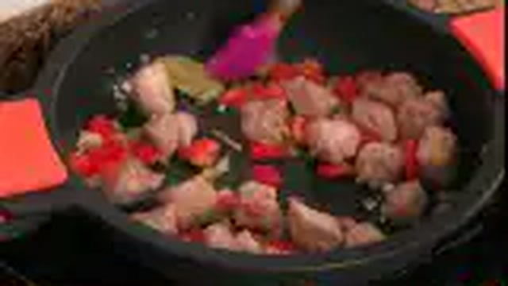
1. **Dorado y caramelizado de la costilla:** Salpimentar los trozos menudos de costilla de cerdo. En la cazuela con el AOVE caliente a fuego vivo, dorar intensamente las costillas durante 8-10 minutos hasta que queden bien tostadas por fuera.
2. **Pochado de la huerta:** Bajar a fuego medio. Agregar los ajos, los pimientos, las judías verdes y las alcachofas. Rehogar 8 minutos. Incorporar los champiñones y el tomate triturado con el pimentón y azafrán. Sofreír 6 minutos. Verter el vino blanco y evaporar 2 minutos.
3. **Nacarado y cocción melosa:** Añadir el arroz y nacarar durante 2 minutos mezclando suavemente. Verter el caldo hirviendo (1.000 ml). Cocinar a fuego vivo durante 8 minutos y luego a fuego suave durante 8-9 minutos, removiendo ocasionalmente con suavidad para favorecer la liberación controlada de almidón y lograr una textura melosa y untuosa.
4. **Punto y reposo:** Apagar el fuego cuando el grano esté tierno pero entero y el caldo tenga textura de salsa ligera ligada. Dejar reposar 3 minutos antes de emplatar.

### 🍽️ Emplatado y Textura Final

- Servir en plato hondo de inmediato. La textura debe ser cremosa y fluida sin llegar a ser sopa, con las costillas tiernas y las verduras al punto.

### ⏱️ Protocolo de Conservación y Batch Cooking
- **Refrigeración (0°C a 3°C):** 3 días en frío en recipiente hermético.
- **Congelación (-18°C):** No recomendada para arroces.
- **Envasado al Vacío:** 4 días a 2°C.

### 🔥 Guía de Regeneración Multicanal
- **Sartén / Cazuela:** 3-4 minutos a fuego lento añadiendo 50 ml de caldo caliente.
- **Microondas:** 2 min a 700W con tapa.

---

## 🍳 Fideuá Negra con Chipirones de Potera y Alioli Casero

> 📺 **Vídeo y Receta Oficial:** [Ver en Hogarmania / Karlos Arguiñano: Fideuá Negra con Chipirones de Potera y Alioli Casero](https://www.hogarmania.com/cocina/recetas/)
> 📊 **Infografía Educativa TouChef:** [Ver Infografía Técnica](assets/infografia_fideua_negra_con_chipirones_de_potera_y_alioli_casero.jpg)

### 📋 Ficha Técnica y Resumen
| Parámetro | Valor |
|---|---|
| **Tiempo de Preparación** | 20 min |
| **Tiempo de Cocción** | 20 min |
| **Dificultad** | Fácil-Media |
| **Raciones** | 4 raciones |
| **Coste Estimado** | Medio (€€) |

### ⚠️ Matriz Oficial de Alérgenos (Reglamento UE 1169/2011)
| Alérgeno | Presencia | Ingrediente / Detalle |
|---|:---:|---|
| **Gluten** | 🟢 SÍ | Fideos de trigo nº 2 o curvados |
| **Crustáceos** | ⚪ NO | Ausente (opcional si el fumet lleva galera) |
| **Huevos** | 🟢 SÍ | Huevo campero en el alioli emulsionado |
| **Pescado** | 🟢 SÍ | Fumet de pescado de roca |
| **Cacahuetes** | ⚪ NO | Ausente |
| **Soja** | ⚪ NO | Ausente |
| **Lácteos** | ⚪ NO | Ausente |
| **Frutos de cáscara** | ⚪ NO | Ausente |
| **Apio** | ⚪ NO | Ausente |
| **Mostaza** | ⚪ NO | Ausente |
| **Sésamo** | ⚪ NO | Ausente |
| **Sulfitos** | 🟢 SÍ | Vino blanco seco |
| **Altramuces** | ⚪ NO | Ausente |
| **Moluscos** | 🟢 SÍ | Chipirones de potera frescos y tinta natural |

### ⚖️ Ingredientes Exactos (Mise en Place)

- **Fideos especiales para fideuá (nº 2 o cabello de ángel tostado)**: 350 g
- **Chipirones o calamares limpios cortados en anillas y tentáculos**: 500 g
- **Bolsitas de tinta de sepia/calamar natural**: 3 uds (15 g)
- **Fumet de pescado de roca casero bien sabroso**: 800 ml (proporción 1:2.2)
- **Cebolla blanca picada en brunoise fina**: 1 ud (160 g)
- **Pimiento verde italiano picado fino**: 1 ud (90 g)
- **Dientes de ajo finamente picados**: 3 uds (15 g)
- **Tomate maduro rallado**: 2 uds (150 g)
- **Vino blanco seco**: 60 ml
- **Aceite de oliva virgen extra (AOVE)**: 60 ml
- **Para el Alioli casero:** 1 huevo campero (60 g), 1 diente de ajo (5 g), 150 ml de aceite de oliva suave, 5 ml de zumo de limón y sal marina (2 g)

### 🔪 Equipamiento y Utillaje Necesario
- Paella de acero de 38-40 cm
- Batidora de inmersión para el alioli
- Espumadera paellera

### 👨‍🍳 Paso a Paso Técnico y Minucioso
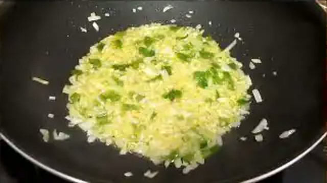
1. **Tostado previo de los fideos (opcional y tradicional):** En la paella con 2 cucharadas de AOVE a fuego medio-bajo, dorar los fideos crudos durante 4-5 minutos removiendo constantemente hasta que adquieran un tono dorado avellana homogéneo. Retirar y reservar en un bol.
2. **Salteado de chipirones y sofrito negro:** En la misma paella con el resto del AOVE a fuego vivo, dorar los chipirones y sus tentáculos durante 3 minutos. Retirar la mitad de los tentáculos para decorar. Añadir los ajos, cebolla y pimiento verde. Pochar 10 minutos. Añadir el tomate rallado y freír 5 minutos. Disolver las bolsitas de tinta en el vino blanco y verter sobre el sofrito, cocinando 2 minutos a fuego vivo.
3. **Cocción de la fideuá:** Incorporar los fideos tostados a la paella y mezclar con el sofrito negro durante 1 minuto. Verter el fumet caliente hirviendo (800 ml). Cocer a fuego vivo durante 6 minutos y a fuego medio durante 4-5 minutos hasta que los fideos hayan absorbido el caldo y comiencen a levantarse y ponerse de punta hacia arriba.
4. **Horneado crujiente (opcional) y alioli:** Para un acabado superior de restaurante, meter la paella en horno precalentado a 200°C con grill durante 3 minutos para que los fideos de la superficie se doren y se pongan crujientes de punta. Mientras tanto, emulsionar con la batidora de inmersión el huevo, el ajo, el zumo de limón, sal y el aceite suave hasta montar un alioli firme y cremoso.

### 🍽️ Emplatado y Textura Final

- Decorar la fideuá con los tentáculos crujientes reservados y 4 quenelles o puntos generosos de alioli casero alrededor de la paella. Servir en el centro de la mesa con fideos de punta crujientes.

### ⏱️ Protocolo de Conservación y Batch Cooking
- **Consumo Preferente:** Inmediato.
- **Refrigeración (0°C a 3°C):** 2 días en táper hermético (guardar el alioli siempre aparte).
- **Congelación (-18°C):** No recomendada.

### 🔥 Guía de Regeneración Multicanal
- **Horno Convectivo (Óptimo):** 5-6 min a 190°C extendida en bandeja para recuperar el crujiente de los fideos.
- **Sartén:** 3 min a fuego medio sin tapa.

---

## 🥘 Arroz Negro Tradicional con Calamares en su Tinta

> 📺 **Vídeo y Receta Oficial:** [Ver en Hogarmania / Karlos Arguiñano: Arroz Negro Tradicional con Calamares en su Tinta](https://www.hogarmania.com/cocina/recetas/)
> 📊 **Infografía Educativa TouChef:** [Ver Infografía Técnica](assets/infografia_arroz_negro_tradicional_con_calamares_en_su_tinta.jpg)

### 📋 Ficha Técnica y Resumen
| Parámetro | Valor |
|---|---|
| **Tiempo de Preparación** | 20 min |
| **Tiempo de Cocción** | 22 min |
| **Dificultad** | Media |
| **Raciones** | 4 raciones |
| **Coste Estimado** | Medio (€€) |

### ⚠️ Matriz Oficial de Alérgenos (Reglamento UE 1169/2011)
| Alérgeno | Presencia | Ingrediente / Detalle |
|---|:---:|---|
| **Gluten** | ⚪ NO | Ausente |
| **Crustáceos** | ⚪ NO | Ausente |
| **Huevos** | 🟢 SÍ | Huevo campero en el alioli de acompañamiento |
| **Pescado** | 🟢 SÍ | Fumet de pescado de roca |
| **Cacahuetes** | ⚪ NO | Ausente |
| **Soja** | ⚪ NO | Ausente |
| **Lácteos** | ⚪ NO | Ausente |
| **Frutos de cáscara** | ⚪ NO | Ausente |
| **Apio** | ⚪ NO | Ausente |
| **Mostaza** | ⚪ NO | Ausente |
| **Sésamo** | ⚪ NO | Ausente |
| **Sulfitos** | 🟢 SÍ | Vino blanco seco |
| **Altramuces** | ⚪ NO | Ausente |
| **Moluscos** | 🟢 SÍ | Calamares o sepias frescas y tinta natural |

### ⚖️ Ingredientes Exactos (Mise en Place)

- **Arroz Bomba D.O.**: 360 g
- **Calamares limpios cortados en anillas o dados de 1,5 cm**: 500 g
- **Bolsitas de tinta natural de calamar o sepia**: 4 uds (20 g)
- **Fumet de pescado de roca caliente**: 900 ml (proporción 1:2.5)
- **Cebolla morada finamente picada**: 1 ud (180 g)
- **Pimiento verde italiano picado**: 1 ud (100 g)
- **Dientes de ajo laminados**: 4 uds (20 g)
- **Tomate maduro rallado**: 2 uds (160 g)
- **Vino blanco seco (Txakoli o Rueda)**: 70 ml
- **Aceite de oliva virgen extra (AOVE)**: 60 ml
- **Sal marina fina y alioli casero**: 8 g / al gusto

### 🔪 Equipamiento y Utillaje Necesario
- Paella de acero pulido de 40 cm
- Espumadera paellera
- Batidora de vaso o brazo para alioli

### 👨‍🍳 Paso a Paso Técnico y Minucioso

1. **Dorado del calamar:** En la paella con el AOVE a fuego vivo, dorar las anillas y tentáculos de calamar durante 4 minutos hasta que comiencen a chisporrotear y tomen color. Retirar y reservar la mitad para decorar.
2. **Sofrito confitado y tinta:** En el mismo aceite, pochar los ajos, la cebolla morada y el pimiento verde a fuego medio durante 12 minutos. Incorporar el tomate rallado y sofreír 6 minutos. Disolver las 4 bolsas de tinta en el vino blanco con un chorrito de caldo caliente y agregar al sofrito. Cocinar a fuego medio 3 minutos hasta que la salsa sea negra azabache brillante.
3. **Nacarado y cocción en paella:** Incorporar el arroz Bomba y nacarar durante 2 minutos impregnando cada grano con la tinta negra. Verter el fumet caliente (900 ml). Distribuir el arroz por toda la superficie y cocinar a fuego vivo durante 8 minutos. Bajar a fuego medio-suave 8 minutos más.
4. **Socarrat negro y reposo:** Subir el fuego los últimos 60 segundos para crear un socarrat crujiente y caramelizado. Apagar el fuego, colocar los tentáculos reservados por encima y dejar reposar 5 minutos tapado con un paño limpio.

### 🍽️ Emplatado y Textura Final
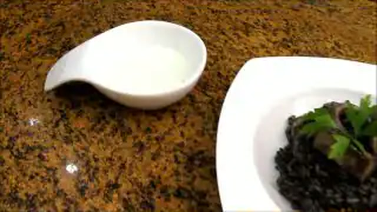
- Servir la paella con un contraste visual impactante de alioli blanco casero en quenelles sobre el arroz negro intenso.

### ⏱️ Protocolo de Conservación y Batch Cooking
- **Refrigeración (0°C a 3°C):** 2 días en recipiente de cristal hermético.
- **Congelación (-18°C):** No recomendada.

### 🔥 Guía de Regeneración Multicanal
- **Sartén Plana:** 3-4 minutos a fuego medio con unas gotas de aceite.
- **Horno Convectivo:** 6 min a 180°C.

---

## 🥘 Arroz al Horno Tradicional con Garbanzos y Costilla

> 📺 **Vídeo y Receta Oficial:** [Ver en Hogarmania / Karlos Arguiñano: Arroz al Horno Tradicional con Garbanzos y Costilla](https://www.hogarmania.com/cocina/recetas/)
> 📊 **Infografía Educativa TouChef:** [Ver Infografía Técnica](assets/infografia_arroz_al_horno_tradicional_con_garbanzos_y_costilla.jpg)

### 📋 Ficha Técnica y Resumen
| Parámetro | Valor |
|---|---|
| **Tiempo de Preparación** | 15 min |
| **Tiempo de Cocción** | 35 min (20 min de horno) |
| **Dificultad** | Fácil |
| **Raciones** | 4 raciones |
| **Coste Estimado** | Económico (€) |

### ⚠️ Matriz Oficial de Alérgenos (Reglamento UE 1169/2011)
| Alérgeno | Presencia | Ingrediente / Detalle |
|---|:---:|---|
| **Gluten** | ⚪ NO | Ausente (verificar morcilla si lleva harina) |
| **Crustáceos** | ⚪ NO | Ausente |
| **Huevos** | ⚪ NO | Ausente |
| **Pescado** | ⚪ NO | Ausente |
| **Cacahuetes** | ⚪ NO | Ausente |
| **Soja** | ⚪ NO | Ausente |
| **Lácteos** | ⚪ NO | Ausente |
| **Frutos de cáscara** | ⚪ NO | Ausente |
| **Apio** | ⚪ NO | Ausente |
| **Mostaza** | ⚪ NO | Ausente |
| **Sésamo** | ⚪ NO | Ausente |
| **Sulfitos** | ⚪ NO | Ausente |
| **Altramuces** | ⚪ NO | Ausente |
| **Moluscos** | ⚪ NO | Ausente |

### ⚖️ Ingredientes Exactos (Mise en Place)
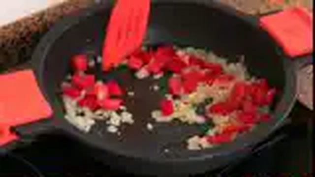
- **Arroz Bomba D.O.**: 360 g
- **Costilla de cerdo troceada**: 350 g
- **Panceta fresca o panceta curada en tiras**: 150 g
- **Morcillas de cebolla oreadas**: 2 uds (160 g)
- **Garbanzos cocidos (de cocido o bote aclarados)**: 200 g
- **Patatas peladas cortadas en rodajas de 1 cm**: 2 uds (250 g)
- **Tomates maduros en rodajas de 1 cm**: 2 uds (200 g)
- **Cabeza de ajos entera lavada**: 1 ud
- **Caldo de cocido o caldo de carne hirviendo**: 720 ml (proporción 1:2)
- **Tomate maduro rallado para el sofrito**: 1 ud (100 g)
- **Hebras de azafrán o colorante natural y pimentón**: 10 hebras / 4 g
- **Aceite de oliva virgen extra (AOVE)**: 50 ml
- **Sal marina fina**: 8 g

### 🔪 Equipamiento y Utillaje Necesario
- Cazuela de barro refractario redonda y plana (32-34 cm)
- Sartén amplia para sellado
- Horno con calor arriba y abajo precalentado a 220°C

### 👨‍🍳 Paso a Paso Técnico y Minucioso

1. **Dorado de carnes y patatas:** En sartén con el AOVE a fuego vivo, dorar la cabeza de ajos entera y las rodajas de patata durante 3 minutos por lado. Retirar a la cazuela de barro. En el mismo aceite, dorar intensamente la panceta y la costilla durante 6-8 minutos; añadir las morcillas enteras 1 minuto con cuidado de que no revienten y retirar todo a la cazuela de barro.
2. **Sofrito y nacarado:** En la sartén con el aceite residual, sofreír el tomate rallado con el pimentón y el azafrán durante 3 minutos. Añadir los garbanzos cocidos y el arroz Bomba, rehogando todo junto durante 2 minutos para impregnar el grano.
3. **Montaje en cazuela de barro:** Pasar el arroz con garbanzos y sofrito a la cazuela de barro. Distribuir uniformemente. Colocar la cabeza de ajos en el centro exacto. Alrededor, intercalar armónicamente las rodajas de patata doradas, las rodajas de tomate crudo, la costilla, panceta y las morcillas.
4. **Horneado a alta temperatura:** Verter el caldo de cocido hirviendo con cuidado sobre la cazuela de barro. Introducir en el horno precalentado a 220°C en la posición media-baja. Hornear durante 20 minutos exactos hasta que el caldo se haya absorbido por completo, el arroz esté en su punto y la superficie presente un dorado crujiente irresistible. Dejar reposar 5 minutos fuera del horno.

### 🍽️ Emplatado y Textura Final
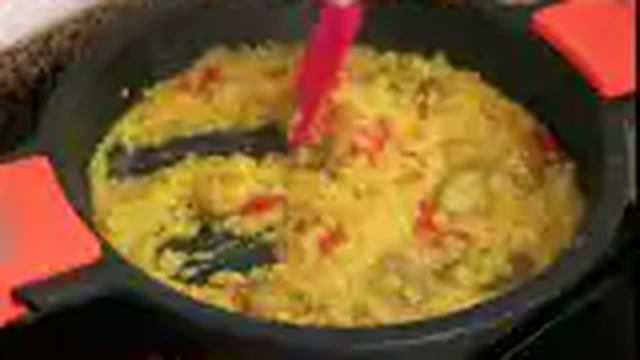
- Servir directamente en la cazuela de barro al centro de la mesa. El grano queda suelto, seco y extraordinariamente sabroso, coronado por las morcillas y tomates asados.

### ⏱️ Protocolo de Conservación y Batch Cooking
- **Refrigeración (0°C a 3°C):** 3 días en nevera.
- **Congelación (-18°C):** No recomendada.

### 🔥 Guía de Regeneración Multicanal
- **Horno Convectivo (Óptimo):** 8 min a 180°C.
- **Microondas:** 2-3 min a 700W tapado.

---

## 🍳 Fideuá Marinera Tradicional con Gambas, Mejillones y Rape

> 📺 **Vídeo y Receta Oficial:** [Ver en Hogarmania / Karlos Arguiñano: Fideuá Marinera Tradicional con Gambas, Mejillones y Rape](https://www.hogarmania.com/cocina/recetas/)
> 📊 **Infografía Educativa TouChef:** [Ver Infografía Técnica](assets/infografia_fideua_marinera_tradicional_con_gambas_mejillones_y_rape.jpg)

### 📋 Ficha Técnica y Resumen
| Parámetro | Valor |
|---|---|
| **Tiempo de Preparación** | 15 min |
| **Tiempo de Cocción** | 20 min |
| **Dificultad** | Fácil-Media |
| **Raciones** | 4 raciones |
| **Coste Estimado** | Medio (€€) |

### ⚠️ Matriz Oficial de Alérgenos (Reglamento UE 1169/2011)
| Alérgeno | Presencia | Ingrediente / Detalle |
|---|:---:|---|
| **Gluten** | 🟢 SÍ | Fideos de trigo nº 2 o curvados |
| **Crustáceos** | 🟢 SÍ | Gambas rojas o langostinos |
| **Huevos** | ⚪ NO | Ausente (presente en alioli si se añade) |
| **Pescado** | 🟢 SÍ | Lomos de rape y fumet de pescado de roca |
| **Cacahuetes** | ⚪ NO | Ausente |
| **Soja** | ⚪ NO | Ausente |
| **Lácteos** | ⚪ NO | Ausente |
| **Frutos de cáscara** | ⚪ NO | Ausente |
| **Apio** | ⚪ NO | Ausente |
| **Mostaza** | ⚪ NO | Ausente |
| **Sésamo** | ⚪ NO | Ausente |
| **Sulfitos** | 🟢 SÍ | Vino blanco seco |
| **Altramuces** | ⚪ NO | Ausente |
| **Moluscos** | 🟢 SÍ | Mejillones de roca y sepia limpia |

### ⚖️ Ingredientes Exactos (Mise en Place)
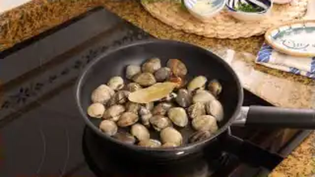
- **Fideos de fideuá (nº 2 o fideo fino tostado)**: 350 g
- **Gambas rojas o langostinos enteros**: 8 uds (250 g)
- **Lomos de rape limpio cortados en dados de 2 cm**: 250 g
- **Sepia limpia en daditos**: 200 g
- **Mejillones frescos abiertos al vapor**: 300 g (reservar el caldo colado)
- **Fumet de pescado de roca y marisco hirviendo**: 800 ml
- **Tomate maduro rallado**: 2 uds (160 g)
- **Pimiento rojo en tiras finas**: 1 ud (100 g)
- **Dientes de ajo laminados**: 3 uds (15 g)
- **Hebras de azafrán tostado y pimentón dulce**: 10 hebras / 4 g
- **Aceite de oliva virgen extra (AOVE)**: 60 ml
- **Sal marina y alioli al gusto**: 8 g / opcional

### 🔪 Equipamiento y Utillaje Necesario
- Paella de acero pulido de 38-40 cm
- Horno con grill (para el acabado crujiente de fideos)
- Espumadera paellera

### 👨‍🍳 Paso a Paso Técnico y Minucioso
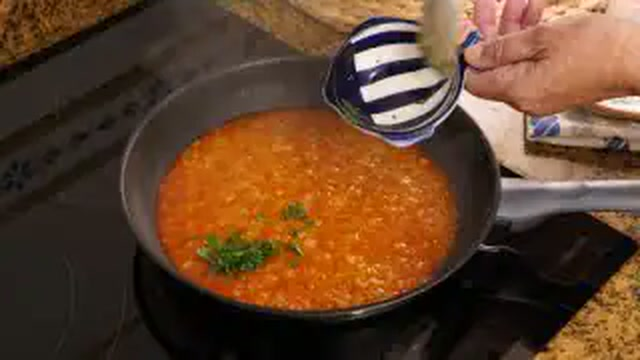
1. **Marcado del marisco y tostado de fideos:** En la paella con el AOVE a fuego vivo, dorar las gambas y las tiras de pimiento durante 2 minutos. Retirar a un plato. Añadir los fideos y tostarlos a fuego medio durante 3-4 minutos removiendo constantemente hasta dorarlos uniformemente. Retirar a un bol.
2. **Sofrito de rape y sepia:** En la paella, dorar la sepia 3 min y los dados de rape 1 min. Agregar los ajos laminados, el tomate rallado, el pimentón y el azafrán. Sofreír 6 minutos a fuego medio hasta concentrar los sabores.
3. **Cocción de la fideuá:** Devolver los fideos tostados a la paella, mezclar bien con el sofrito e incorporar el fumet hirviendo con el agua de los mejillones (800 ml en total). Cocinar a fuego vivo 6 minutos y luego a fuego medio 4 minutos.
4. **Gratinado de fideos de punta:** Colocar por encima las gambas y los mejillones en media concha. Meter la paella al horno precalentado a 210°C con grill durante 3 minutos hasta que los fideos se levanten y queden dorados y crujientes.

### 🍽️ Emplatado y Textura Final

- Servir la paella al centro de la mesa con los fideos de punta crujientes, rape tierno, gambas jugosas y un cuenco de alioli casero al lado.

### ⏱️ Protocolo de Conservación y Batch Cooking
- **Consumo:** Inmediato tras reposar 3 min.
- **Refrigeración (0°C a 3°C):** 2 días.
- **Congelación (-18°C):** No recomendada.

### 🔥 Guía de Regeneración Multicanal
- **Horno Convectivo:** 5-6 min a 190°C con grill.
- **Sartén:** 3 min a fuego medio sin mover.

---

## 🥘 Arroz Caldoso de Conejo y Caracoles al Romero

> 📺 **Vídeo y Receta Oficial:** [Ver en Hogarmania / Karlos Arguiñano: Arroz Caldoso de Conejo y Caracoles al Romero](https://www.hogarmania.com/cocina/recetas/)
> 📊 **Infografía Educativa TouChef:** [Ver Infografía Técnica](assets/infografia_arroz_caldoso_de_conejo_y_caracoles_al_romero.jpg)

### 📋 Ficha Técnica y Resumen
| Parámetro | Valor |
|---|---|
| **Tiempo de Preparación** | 20 min |
| **Tiempo de Cocción** | 35 min |
| **Dificultad** | Fácil-Media |
| **Raciones** | 4 raciones |
| **Coste Estimado** | Económico (€) |

### ⚠️ Matriz Oficial de Alérgenos (Reglamento UE 1169/2011)
| Alérgeno | Presencia | Ingrediente / Detalle |
|---|:---:|---|
| **Gluten** | ⚪ NO | Ausente |
| **Crustáceos** | ⚪ NO | Ausente |
| **Huevos** | ⚪ NO | Ausente |
| **Pescado** | ⚪ NO | Ausente |
| **Cacahuetes** | ⚪ NO | Ausente |
| **Soja** | ⚪ NO | Ausente |
| **Lácteos** | ⚪ NO | Ausente |
| **Frutos de cáscara** | ⚪ NO | Ausente |
| **Apio** | ⚪ NO | Ausente |
| **Mostaza** | ⚪ NO | Ausente |
| **Sésamo** | ⚪ NO | Ausente |
| **Sulfitos** | 🟢 SÍ | Vino blanco seco |
| **Altramuces** | ⚪ NO | Ausente |
| **Moluscos** | 🟢 SÍ | Caracoles de tierra (purgados y engañados) |

### ⚖️ Ingredientes Exactos (Mise en Place)

- **Conejo limpio troceado menudo**: 600 g
- **Caracoles de tierra cocidos y limpios (tipo serranos o vaquetes)**: 300 g (aprox. 24 uds)
- **Arroz Bomba o redondo tradicional**: 320 g
- **Caldo de carne o de ave con hierbas aromáticas**: 1.200 ml (proporción 1:3.8)
- **Tomate maduro rallado**: 2 uds (180 g)
- **Pimiento verde italiano picado**: 1 ud (100 g)
- **Dientes de ajo picados**: 4 uds (20 g)
- **Vino blanco seco**: 80 ml
- **Ramas de romero silvestre fresco**: 2 ramas (10 g)
- **Pimentón dulce de la Vera y hebras de azafrán**: 4 g / 12 hebras
- **Aceite de oliva virgen extra (AOVE)**: 60 ml
- **Sal marina fina y pimienta negra recién molida**: 8 g / 2 g

### 🔪 Equipamiento y Utillaje Necesario
- Cazuela de barro honda o cocotte de hierro fundido (30 cm)
- Tabla de corte y cuchillo
- Cucharón de madera

### 👨‍🍳 Paso a Paso Técnico y Minucioso
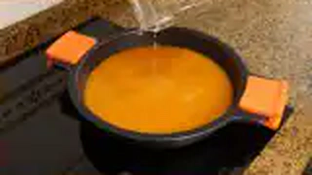
1. **Dorado del conejo de monte:** Salpimentar los trozos de conejo. En la cazuela con el AOVE a fuego vivo, dorar el conejo durante 10 minutos hasta que quede bien tostado por fuera. Retirar y reservar.
2. **Sofrito y caracoles:** En el mismo aceite a fuego medio, pochar los ajos picados y el pimiento verde durante 8 minutos. Añadir el tomate rallado, el pimentón y el azafrán. Sofreír 6 minutos. Incorporar los caracoles cocidos y el vino blanco, evaporando 2 minutos.
3. **Cocción caldosa:** Devolver el conejo a la cazuela, añadir el arroz y nacarar 1 minuto. Verter el caldo caliente hirviendo (1.200 ml) y colocar las ramas de romero fresco en la superficie. Cocer a fuego vivo durante 8 minutos y luego a fuego suave durante 7 minutos.
4. **Punto final:** Retirar las ramas de romero, apagar el fuego con el arroz al dente y dejar reposar 3 minutos para que los jugos de campo asienten su textura caldosa.

### 🍽️ Emplatado y Textura Final

- Servir en plato hondo de barro humeante con trozos jugosos de conejo, caracoles y un caldo perfumado a romero de monte.

### ⏱️ Protocolo de Conservación y Batch Cooking
- **Consumo:** Inmediato tras la cocción.
- **Refrigeración (0°C a 3°C):** 2 días.
- **Congelación (-18°C):** No recomendada.

### 🔥 Guía de Regeneración Multicanal
- **Sartén / Cazuela:** 3 minutos a fuego lento con 100 ml de caldo adicional.

---

## 🍚 Risotto Cremoso de Hongos Boletus y Queso Idiazábal

> 📺 **Vídeo y Receta Oficial:** [Ver en Hogarmania / Karlos Arguiñano: Risotto Cremoso de Hongos Boletus y Queso Idiazábal](https://www.hogarmania.com/cocina/recetas/)
> 📊 **Infografía Educativa TouChef:** [Ver Infografía Técnica](assets/infografia_risotto_cremoso_de_hongos_boletus_y_queso_idiazabal.jpg)

### 📋 Ficha Técnica y Resumen
| Parámetro | Valor |
|---|---|
| **Tiempo de Preparación** | 15 min |
| **Tiempo de Cocción** | 20 min |
| **Dificultad** | Fácil-Media |
| **Raciones** | 4 raciones |
| **Coste Estimado** | Medio (€€) |

### ⚠️ Matriz Oficial de Alérgenos (Reglamento UE 1169/2011)
| Alérgeno | Presencia | Ingrediente / Detalle |
|---|:---:|---|
| **Gluten** | ⚪ NO | Ausente |
| **Crustáceos** | ⚪ NO | Ausente |
| **Huevos** | ⚪ NO | Ausente |
| **Pescado** | ⚪ NO | Ausente |
| **Cacahuetes** | ⚪ NO | Ausente |
| **Soja** | ⚪ NO | Ausente |
| **Lácteos** | 🟢 SÍ | Mantequilla y queso Idiazábal ahumado D.O. |
| **Frutos de cáscara** | ⚪ NO | Ausente |
| **Apio** | ⚪ NO | Ausente |
| **Mostaza** | ⚪ NO | Ausente |
| **Sésamo** | ⚪ NO | Ausente |
| **Sulfitos** | 🟢 SÍ | Vino blanco seco (Txakoli) |
| **Altramuces** | ⚪ NO | Ausente |
| **Moluscos** | ⚪ NO | Ausente |

### ⚖️ Ingredientes Exactos (Mise en Place)

- **Arroz Carnaroli o Arborio especial risotto**: 320 g
- **Boletus edulis frescos (o congelados/deshidratados)**: 350 g
- **Queso Idiazábal ahumado D.O. rallado fino**: 120 g
- **Mantequilla de calidad fría en dados**: 50 g
- **Chalotas picadas en brunoise finísima**: 3 uds (80 g)
- **Diente de ajo picado**: 1 ud (5 g)
- **Vino blanco seco (Txakoli de Getaria)**: 100 ml
- **Caldo de ave o caldo de verduras muy caliente**: 1.100 ml
- **Aceite de oliva virgen extra (AOVE)**: 30 ml
- **Sal marina fina y pimienta negra recién molida**: 6 g / 2 g

### 🔪 Equipamiento y Utillaje Necesario
- Cazuela ancha y baja de fondo difusor pesado (28 cm)
- Cucharón para caldo
- Cuchara de madera para mantecar (*mantecatura*)
- Rallador Microplane fino

### 👨‍🍳 Paso a Paso Técnico y Minucioso

1. **Salteado de boletus:** Limpiar los boletus con un paño húmedo y cortar en láminas gruesas. En la cazuela con 15 ml de AOVE a fuego vivo, saltear los hongos durante 3 minutos con una pizca de sal. Retirar la mitad de las láminas más bonitas para decorar al final.
2. **Sofrito y tostado (*tostatura*):** Añadir el resto de AOVE y 10 g de mantequilla a la cazuela. Rehogar las chalotas picadas y el ajo durante 4 minutos a fuego suave sin que tomen color. Añadir el arroz Carnaroli y tostar en seco a fuego medio durante 2-3 minutos hasta que los granos se vuelvan translúcidos y calientes al tacto.
3. **Desglasado e hidratación gradual:** Verter el vino blanco y dejar evaporar por completo el alcohol durante 2 minutos. Comenzar a verter el caldo hirviendo cazo a cazo (unos 200 ml cada vez), removiendo suave y constantemente con la cuchara de madera en círculos para favorecer la liberación del almidón. Añadir el siguiente cazo solo cuando el anterior haya sido absorbido. Repetir durante 15-16 minutos.
4. **Mantecatura fuera del fuego:** Apagar el fuego cuando el grano esté al dente (ligeramente firme en el centro). Añadir la mantequilla fría en dados y el queso Idiazábal rallado fino. Batir enérgicamente con la cuchara en movimientos envolventes durante 2 minutos para crear la emulsión cremosa (*all'onda*).

### 🍽️ Emplatado y Textura Final

- Servir en plato llano caliente dando ligeros golpes en la base para que el risotto se expanda en forma de ola fluida y cremosa.
- Coronar con las láminas de boletus doradas reservadas y unas virutas extra de Idiazábal.

### ⏱️ Protocolo de Conservación y Batch Cooking
- **Consumo Obligatorio:** Inmediato (el risotto no espera al comensal).
- **Aprovechamiento de Sobras:** Enfriar y formar *arancini* o croquetas de arroz empanadas y fritas al día siguiente.

### 🔥 Guía de Regeneración Multicanal
- **Sartén:** 2 min a fuego medio con 50 ml de caldo caliente y una nuez de mantequilla batiendo enérgicamente.

---

## 🥘 Arroz a Banda Tradicional con Salmorreta y Alioli

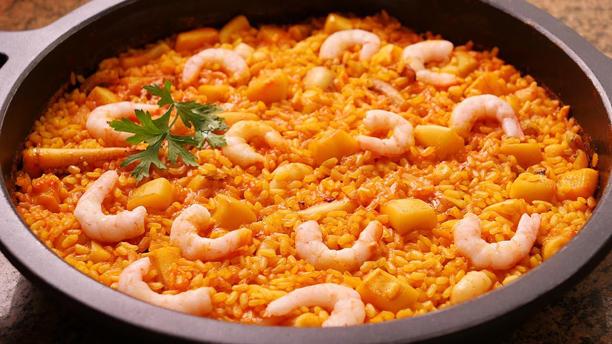

> 📺 **Vídeo y Receta Oficial:** [Ver en Hogarmania / Karlos Arguiñano: Arroz a Banda Tradicional con Salmorreta y Alioli](https://www.hogarmania.com/cocina/recetas/)
> 📊 **Infografía Educativa TouChef:** [Ver Infografía Técnica](assets/infografia_arroz_a_banda_tradicional_con_salmorreta_y_al.jpg)

### 📋 Ficha Técnica y Resumen
| Parámetro | Valor |
|---|---|
| **Tiempo de Preparación** | 15 min |
| **Tiempo de Cocción** | 20 min |
| **Dificultad** | Fácil-Media |
| **Raciones** | 4 raciones |
| **Coste Estimado** | Medio (€€) |

### ⚠️ Matriz Oficial de Alérgenos (Reglamento UE 1169/2011)
| Alérgeno | Presencia | Ingrediente / Detalle |
|---|:---:|---|
| **Gluten** | ⚪ NO | Ausente |
| **Crustáceos** | 🟢 SÍ | Galeras y cangrejos presentes en el fondo |
| **Huevos** | 🟢 SÍ | Huevo en alioli artesanal |
| **Pescado** | 🟢 SÍ | Pescado de roca y morralla en el fumet |
| **Cacahuetes** | ⚪ NO | Ausente |
| **Soja** | ⚪ NO | Ausente |
| **Lácteos** | ⚪ NO | Ausente |
| **Frutos de cáscara** | ⚪ NO | Ausente |
| **Apio** | ⚪ NO | Ausente |
| **Mostaza** | ⚪ NO | Ausente |
| **Sésamo** | ⚪ NO | Ausente |
| **Sulfitos** | ⚪ NO | Ausente |
| **Altramuces** | ⚪ NO | Ausente |
| **Moluscos** | 🟢 SÍ | Sepia troceada menuda |

### ⚖️ Ingredientes Exactos (Mise en Place)
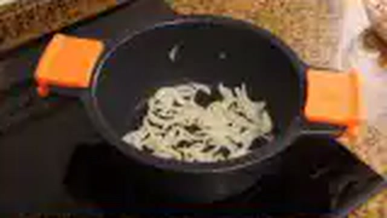
- **Arroz tipo Senia o Bomba D.O.**: 360 g
- **Sepia limpia troceada muy menuda**: 250 g
- **Fumet rojo concentrado de morralla, galeras y cangrejos**: 900 ml (proporción 1:2.5)
- **Salmorreta alicantina tradicional**: 2 cdas (50 g) *(elaborada con ñora sofrita, ajo y tomate frito triturado)*
- **Hebras de azafrán tostado**: 12 hebras (0,2 g)
- **Aceite de oliva virgen extra (AOVE)**: 60 ml
- **Sal marina fina**: 8 g
- **Alioli casero suave para acompañar**: 100 g

### 🔪 Equipamiento y Utillaje Necesario
- Paella valenciana tradicional de 40 cm
- Espumadera paellera
- Batidora para el alioli

### 👨‍🍳 Paso a Paso Técnico y Minucioso

1. **Dorado de sepia y salmorreta:** En la paella con el AOVE a fuego medio-alto, dorar los dados diminutos de sepia durante 3 minutos. Añadir las 2 cucharadas de salmorreta alicantina y rehogar 1 minuto para fusionar con el aceite.
2. **Nacarado del grano:** Añadir el arroz y las hebras de azafrán tostadas. Nacarar a fuego medio durante 2 minutos hasta que todo el grano absorba el color rojizo de la salmorreta.
3. **Cocción precisa en paella:** Verter el fumet rojo concentrado hirviendo (900 ml). Distribuir el arroz en capa fina de un solo grano y cocinar a fuego vivo durante 8 minutos. Bajar a fuego medio-bajo otros 8 minutos.
4. **Socarrat y reposo:** En los últimos 90 segundos, subir el fuego al máximo hasta percibir el sonido seco del tostado del fondo. Apagar y dejar reposar 5 minutos tapado con paño de algodón.

### 🍽️ Emplatado y Textura Final
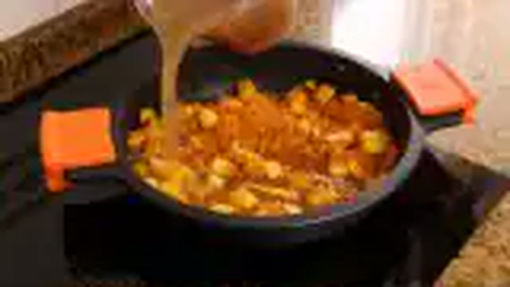
- Servir la paella con una capa milimétrica de arroz suelto, brillante, con socarrat crujiente y una salsera con alioli al lado.

### ⏱️ Protocolo de Conservación y Batch Cooking
- **Refrigeración (0°C a 3°C):** 2 días.
- **Congelación (-18°C):** No recomendada.

### 🔥 Guía de Regeneración Multicanal
- **Sartén Plana:** 3 minutos a fuego medio para devolver el crujiente al grano.
