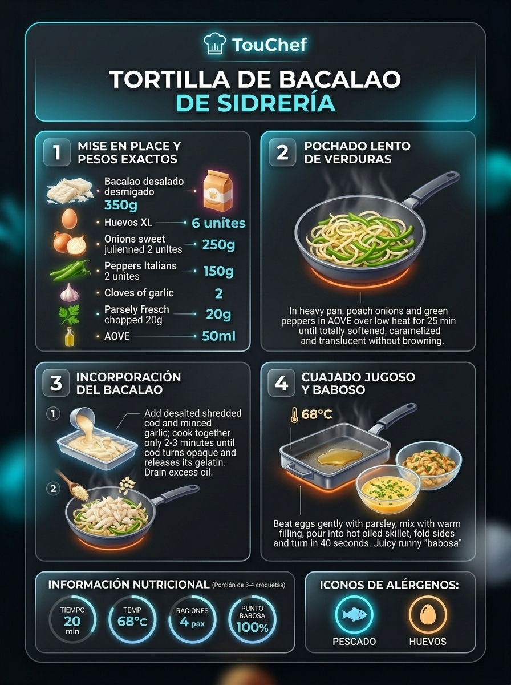
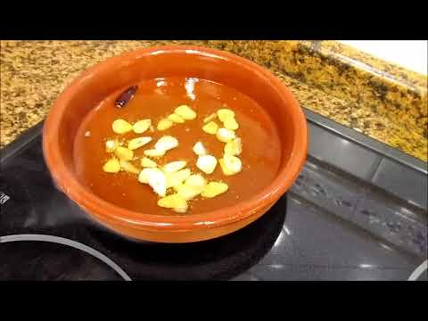
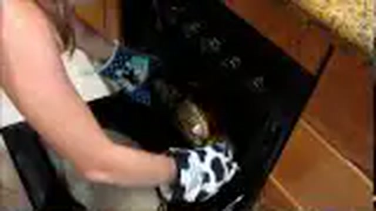
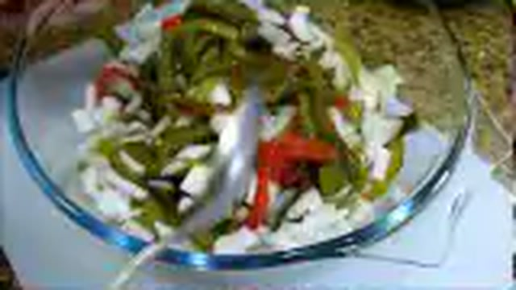
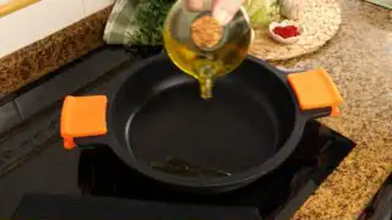
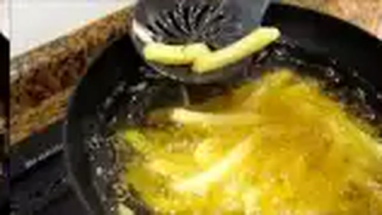
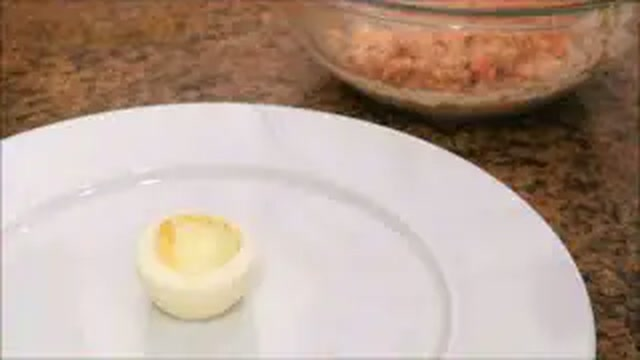

# 🍳 Huevos, Revueltos y Pintxos de Taberna

*Colección oficial de recetas tradicionales de Karlos Arguiñano estandarizadas para la marca TouChef. Incluye alérgenos UE 1169/2011, pesos exactos, paso a paso e infografías educativas Dark Glassmorphism.*

---

## 🍳 Tortilla de Bacalao Tradicional de Sidrería Vasca

> 📺 **Vídeo y Receta Oficial:** [Ver en Hogarmania / Karlos Arguiñano: Tortilla de Bacalao Tradicional de Sidrería Vasca](https://www.hogarmania.com/cocina/recetas/)
> 📊 **Infografía Educativa TouChef:** [Ver Infografía Técnica](assets/infografia_tortilla_de_bacalao_tradicional_de_sidreria_vasca.jpg)

### 📋 Ficha Técnica y Resumen
| Parámetro | Valor |
|---|---|
| **Tiempo de Preparación** | 10 min |
| **Tiempo de Cocción** | 10 min |
| **Dificultad** | Fácil |
| **Raciones** | 4 raciones |
| **Coste Estimado** | Medio (€€) |

### ⚠️ Matriz Oficial de Alérgenos (Reglamento UE 1169/2011)
| Alérgeno | Presencia | Ingrediente / Detalle |
|---|:---:|---|
| **Gluten** | ⚪ NO | Ausente (posibles trazas en obrador) |
| **Crustáceos** | ⚪ NO | Ausente (posibles trazas en obrador) |
| **Huevos** | 🟢 SÍ | Presente en la receta (huevos camperos) |
| **Pescado** | 🟢 SÍ | Presente en la receta (bacalao desalado) |
| **Cacahuetes** | ⚪ NO | Ausente (posibles trazas en obrador) |
| **Soja** | ⚪ NO | Ausente (posibles trazas en obrador) |
| **Lácteos** | ⚪ NO | Ausente (posibles trazas en obrador) |
| **Frutos de cáscara** | ⚪ NO | Ausente (posibles trazas en obrador) |
| **Apio** | ⚪ NO | Ausente (posibles trazas en obrador) |
| **Mostaza** | ⚪ NO | Ausente (posibles trazas en obrador) |
| **Sésamo** | ⚪ NO | Ausente (posibles trazas en obrador) |
| **Sulfitos** | ⚪ NO | Ausente (posibles trazas en obrador) |
| **Altramuces** | ⚪ NO | Ausente (posibles trazas en obrador) |
| **Moluscos** | ⚪ NO | Ausente (posibles trazas en obrador) |

### ⚖️ Ingredientes Exactos (Mise en Place)

- **Huevos camperos de caserío (calibre L/XL)**: 6 uds (360 g)
- **Bacalao desalado desmigado fino**: 250 g
- **Cebolla dulce picada en juliana fina**: 1 ud (150 g)
- **Pimiento verde italiano en juliana fina**: 1 ud (100 g)
- **Dientes de ajo picados en brunoise fina**: 2 uds (10 g)
- **Perejil fresco recién picado finamente**: 2 cdas (10 g)
- **Aceite de oliva virgen extra (AOVE)**: 40 ml
- **Sal marina fina**: pizca testimonial (ajustar según el punto del bacalao)

### 🔪 Equipamiento y Utillaje Necesario
- Sartén antiadherente de 24 cm de base gruesa
- Cuchillo cebollero y tabla de corte HDPE
- Bol amplio de acero inoxidable / cristal
- Varillas manuales o tenedor
- Plato llano o vuelvetortillas de 26 cm

### 👨‍🍳 Paso a Paso Técnico y Minucioso

1. **Pochado suave de verduras:** En una sartén antiadherente con 30 ml de AOVE, pochar la cebolla, el pimiento verde y el ajo a fuego medio-bajo durante 10-12 minutos hasta que la verdura quede translúcida, tierna y sin dorarse en exceso.
2. **Salteado rápido del bacalao:** Añadir el bacalao desalado bien escurrido y desmigado. Saltear a fuego vivo durante 90 a 120 segundos para que se cocine con su propia gelatina y pierda el exceso de agua. Escurrir ligeramente sobre un colador si desprende demasiado líquido.
3. **Batido e integración:** En un bol amplio, cascar los 6 huevos camperos y batirlos ligeramente con las varillas (sin sobrebatir para no incorporar aire en exceso). Añadir el perejil fresco y el sofrito templado de bacalao y verduras. Mezclar bien.
4. **Cuajado baboso de sidrería:** Calentar la sartén a fuego medio-alto con los 10 ml de AOVE restantes. Verter toda la mezcla de golpe. Remover enérgicamente en círculos con espátula durante 30 segundos mientras cuaja el fondo. Dar la vuelta con un plato y cuajar el reverso durante otros 30-40 segundos a fuego medio. El interior debe quedar completamente cremoso y meloso (*babosa*).

### 🍽️ Emplatado y Textura Final

- Servir de inmediato en plato caliente o tabla de madera. Al cortar un triángulo, el centro debe fluir suavemente liberando los aromas del pimiento, el ajo y el bacalao confitado.
- Maridaje clásico: Sidra natural vasca (Sagardoa) servida al txotx.

### ⏱️ Protocolo de Conservación y Batch Cooking
- **Refrigeración (0°C a 3°C):** Consumo inmediato recomendado. Si sobra, guardar en tupper hermético un máximo de 24 horas a 2-4°C.
- **Congelación (-18°C):** No apto para congelación (el huevo cuajado pierde su emulsión y textura).
- **Envasado al Vacío:** No recomendado.

### 🔥 Guía de Regeneración Multicanal
- **Sartén:** 1-2 minutos a fuego muy suave tapada con unas gotas de AOVE para templar el corazón sin sobrecuajar.
- **Horno Convectivo:** 3 minutos a 140°C en bandeja precalentada.
- **Microondas:** Golpes de 20 segundos a 400W (evitar potencia alta para no gomificar el huevo).

---

## 🍄 Revuelto de Hongos Boletus y Perrechicos con Ajo Tierno

> 📺 **Vídeo y Receta Oficial:** [Ver en Hogarmania / Karlos Arguiñano: Revuelto de Hongos Boletus y Perrechicos con Ajo Tierno](https://www.hogarmania.com/cocina/recetas/)
> 📊 **Infografía Educativa TouChef:** [Ver Infografía Técnica](assets/infografia_revuelto_de_hongos_boletus_y_perrechicos_con.jpg)

### 📋 Ficha Técnica y Resumen
| Parámetro | Valor |
|---|---|
| **Tiempo de Preparación** | 15 min |
| **Tiempo de Cocción** | 10 min |
| **Dificultad** | Fácil |
| **Raciones** | 4 raciones |
| **Coste Estimado** | Medio-Alto (€€€) |

### ⚠️ Matriz Oficial de Alérgenos (Reglamento UE 1169/2011)
| Alérgeno | Presencia | Ingrediente / Detalle |
|---|:---:|---|
| **Gluten** | ⚪ NO | Ausente (posibles trazas en obrador) |
| **Crustáceos** | ⚪ NO | Ausente (posibles trazas en obrador) |
| **Huevos** | 🟢 SÍ | Presente en la receta (huevos camperos) |
| **Pescado** | ⚪ NO | Ausente (posibles trazas en obrador) |
| **Cacahuetes** | ⚪ NO | Ausente (posibles trazas en obrador) |
| **Soja** | ⚪ NO | Ausente (posibles trazas en obrador) |
| **Lácteos** | ⚪ NO | Ausente (posibles trazas en obrador) |
| **Frutos de cáscara** | ⚪ NO | Ausente (posibles trazas en obrador) |
| **Apio** | ⚪ NO | Ausente (posibles trazas en obrador) |
| **Mostaza** | ⚪ NO | Ausente (posibles trazas en obrador) |
| **Sésamo** | ⚪ NO | Ausente (posibles trazas en obrador) |
| **Sulfitos** | ⚪ NO | Ausente (posibles trazas en obrador) |
| **Altramuces** | ⚪ NO | Ausente (posibles trazas en obrador) |
| **Moluscos** | ⚪ NO | Ausente (posibles trazas en obrador) |

### ⚖️ Ingredientes Exactos (Mise en Place)

- **Hongos frescos de temporada (Boletus edulis o Perrechicos / Calocybe gambosa)**: 400 g
- **Huevos camperos de caserío**: 6 uds (360 g)
- **Ajetes tiernos frescos limpios**: 4 uds (80 g)
- **Dientes de ajo morado en láminas finas**: 2 uds (10 g)
- **Aceite de oliva virgen extra (AOVE)**: 45 ml
- **Flor de sal marina**: 4 g
- **Pimienta negra recién molida**: 1 g
- **Perejil fresco picado**: 1 cda (5 g)

### 🔪 Equipamiento y Utillaje Necesario
- Sartén antiadherente honda o sartén de fondo grueso
- Cuchillo puntilla y cuchillo cebollero
- Espátula de silicona resistente al calor
- Bol de vidrio para batido templado

### 👨‍🍳 Paso a Paso Técnico y Minucioso

1. **Limpieza y corte de setas:** Limpiar los hongos con paño húmedo o pincel suave evitando sumergirlos en agua. Cortar los boletus en láminas de 4 mm y desgajar los perrechicos a mano para respetar su fibra. Cortar los ajetes tiernos en rodajitas de 1 cm.
2. **Salteado aromático:** En una sartén con el AOVE a fuego medio, rehogar los ajos laminados y los ajetes tiernos durante 2 minutos hasta que desprendan su aroma sin quemarse.
3. **Cocción de los hongos:** Subir el fuego y agregar los hongos troceados. Saltear a fuego vivo durante 4-5 minutos hasta que evaporen el agua de vegetación y comiencen a dorarse ligeramente. Salpimentar al gusto.
4. **Técnica de cuajado cremoso:** Bajar el fuego al mínimo (o retirar la sartén del fuego). Cascar los huevos directamente sobre los hongos (o batirlos 5 segundos en bol sin espumar). Remover continuamente con la espátula de silicona con movimientos envolventes lentos durante 90 segundos. El calor residual creará una crema sedosa aterciopelada sin grumos secos ni aspecto de tortilla rota. Retirar inmediatamente cuando alcance 68-70°C.

### 🍽️ Emplatado y Textura Final

- Servir de inmediato sobre tostas finas de pan de masa madre tostado, coronando con flor de sal y perejil fresco.
- La textura debe ser untuosa, brillante y jugosa, envolviendo cada trozo de hongo en una emulsión sedosa.

### ⏱️ Protocolo de Conservación y Batch Cooking
- **Refrigeración (0°C a 3°C):** Consumo inmediato obligatorio para mantener la textura cremosa del huevo.
- **Congelación (-18°C):** No congelar.
- **Envasado al Vacío:** No apto.
- **Preparación anticipada (Mise en Place):** Los hongos y ajetes pueden dejarse salteados y refrigerados hasta 48h; el cuajado con huevo se realiza en el último minuto en vivo.

### 🔥 Guía de Regeneración Multicanal
- **Baño María:** 2 minutos a fuego suave removiendo constantemente con espátula.
- **Sartén:** No recomendada a fuego directo; usar fuego muy bajo añadiendo una cucharadita de nata o mantequilla fría.

---

## 🌶️ Pimientos del Piquillo Rellenos de Bacalao con Salsa de Piquillos

> 📺 **Vídeo y Receta Oficial:** [Ver en Hogarmania / Karlos Arguiñano: Pimientos del Piquillo Rellenos de Bacalao con Salsa de Piquillos](https://www.hogarmania.com/cocina/recetas/)
> 📊 **Infografía Educativa TouChef:** [Ver Infografía Técnica](assets/infografia_pimientos_del_piquillo_rellenos_de_bacalao_con.jpg)

### 📋 Ficha Técnica y Resumen
| Parámetro | Valor |
|---|---|
| **Tiempo de Preparación** | 30 min |
| **Tiempo de Cocción** | 35 min |
| **Dificultad** | Media |
| **Raciones** | 4 raciones (12 pimientos) |
| **Coste Estimado** | Medio (€€) |

### ⚠️ Matriz Oficial de Alérgenos (Reglamento UE 1169/2011)
| Alérgeno | Presencia | Ingrediente / Detalle |
|---|:---:|---|
| **Gluten** | 🟢 SÍ | Presente en la receta (harina de trigo para bechamel y rebozado) |
| **Crustáceos** | ⚪ NO | Ausente (posibles trazas en obrador) |
| **Huevos** | 🟢 SÍ | Presente en la receta (huevo batido para rebozar) |
| **Pescado** | 🟢 SÍ | Presente en la receta (bacalao desalado) |
| **Cacahuetes** | ⚪ NO | Ausente (posibles trazas en obrador) |
| **Soja** | ⚪ NO | Ausente (posibles trazas en obrador) |
| **Lácteos** | 🟢 SÍ | Presente en la receta (leche entera y mantequilla) |
| **Frutos de cáscara** | ⚪ NO | Ausente (posibles trazas en obrador) |
| **Apio** | ⚪ NO | Ausente (posibles trazas en obrador) |
| **Mostaza** | ⚪ NO | Ausente (posibles trazas en obrador) |
| **Sésamo** | ⚪ NO | Ausente (posibles trazas en obrador) |
| **Sulfitos** | ⚪ NO | Ausente (posibles trazas en obrador) |
| **Altramuces** | ⚪ NO | Ausente (posibles trazas en obrador) |
| **Moluscos** | ⚪ NO | Ausente (posibles trazas en obrador) |

### ⚖️ Ingredientes Exactos (Mise en Place)

- **Pimientos del piquillo de Lodosa en conserva**: 16 uds (12 para rellenar + 4 para la salsa)
- **Bacalao desalado desmigado y limpio**: 300 g
- **Cebolla blanca picada en brunoise**: 1 ud (150 g)
- **Dientes de ajo picados**: 2 uds (10 g)
- **Harina de trigo de todo uso**: 45 g (relleno) + 30 g (para rebozar)
- **Leche entera tibia**: 350 ml
- **Mantequilla o AOVE**: 30 g
- **Huevo batido para rebozar**: 1 ud
- **Nata líquida para cocinar (18% M.G.) o fumet de pescado**: 150 ml
- **Nuez moscada, sal marina y pimienta blanca**: al gusto
- **Aceite de oliva virgen extra para freír**: 150 ml

### 🔪 Equipamiento y Utillaje Necesario
- Cazuela baja y ancha de barro o acero inoxidable
- Manga pastelera con boquilla ancha lisa
- Sartén antiadherente para rebozado
- Batidora de brazo / procesador de alimentos
- Colador chino fino

### 👨‍🍳 Paso a Paso Técnico y Minucioso

1. **Farsa cremosa de bacalao:** En una sartén con 30 g de mantequilla/AOVE, pochar la cebolla y el ajo muy finos durante 8 min. Añadir el bacalao desmigado y rehogar 2 min. Añadir 45 g de harina y cocinar (roux) durante 2 min. Verter la leche tibia poco a poco sin dejar de remover con varillas hasta obtener una bechamel densa y sin grumos. Añadir nuez moscada y rectificar de sal. Dejar enfriar en manga pastelera en nevera (1 hora).
2. **Relleno y rebozado:** Escurrir los 12 pimientos del piquillo sobre papel absorbente. Rellenarlos con la farsa cremosa con ayuda de la manga sin romper la piel. Pasarlos ligeramente por harina y huevo batido, y freírlos en AOVE caliente a 170°C durante 1 minuto por cada lado. Escurrir en papel.
3. **Elaboración de la salsa fina:** En un cazo, pochar media cebolla con los 4 pimientos del piquillo restantes y su jugo. Añadir la nata líquida (o fumet), cocer 8 minutos a fuego suave, triturar con la batidora hasta textura terciopelo y pasar por colador chino.
4. **Guisado conjunto:** Disponer los pimientos rellenados en la cazuela baja, cubrirlos con la salsa caliente y dar un suave hervor conjunto a fuego muy lento durante 4-5 minutos agitando la cazuela en vaivén.

### 🍽️ Emplatado y Textura Final

- Servir 3 pimientos por comensal bañados en la salsa roja brillante, espolvoreados con perejil fresco picado y acompañados de rebanadas de pan tostado.

### ⏱️ Protocolo de Conservación y Batch Cooking
- **Refrigeración (0°C a 3°C):** 4 días en recipiente de cristal hermético sumergidos en su salsa.
- **Congelación (-18°C):** 2 meses (congelar los pimientos rellenos antes del rebozado o ya cocinados en salsa).
- **Envasado al Vacío:** 7 días en frío en bolsa para cocción sous-vide.

### 🔥 Guía de Regeneración Multicanal
- **Cazuela / Sartén:** 5 minutos a fuego muy suave tapados con su propia salsa.
- **Horno Convectivo:** 8 minutos a 160°C en fuente refractaria tapada con papel de aluminio.
- **Microondas:** 2 minutos a 600W tapado con campana.

---

## 🍢 Gilda Donostiarra Clásica (Piparra, Anchoa del Cantábrico y Aceituna)

> 📺 **Vídeo y Receta Oficial:** [Ver en Hogarmania / Karlos Arguiñano: Gilda Donostiarra Clásica (Piparra, Anchoa del Cantábrico y Aceituna)](https://www.hogarmania.com/cocina/recetas/)
> 📊 **Infografía Educativa TouChef:** [Ver Infografía Técnica](assets/infografia_gilda_donostiarra_clasica_piparra_anchoa_ace.jpg)

### 📋 Ficha Técnica y Resumen
| Parámetro | Valor |
|---|---|
| **Tiempo de Preparación** | 10 min |
| **Tiempo de Cocción** | 0 min (sin cocción) |
| **Dificultad** | Muy Fácil |
| **Raciones** | 8 unidades |
| **Coste Estimado** | Medio (€€) |

### ⚠️ Matriz Oficial de Alérgenos (Reglamento UE 1169/2011)
| Alérgeno | Presencia | Ingrediente / Detalle |
|---|:---:|---|
| **Gluten** | ⚪ NO | Ausente (posibles trazas en obrador) |
| **Crustáceos** | ⚪ NO | Ausente (posibles trazas en obrador) |
| **Huevos** | ⚪ NO | Ausente (posibles trazas en obrador) |
| **Pescado** | 🟢 SÍ | Presente en la receta (anchoas del Cantábrico en salazón) |
| **Cacahuetes** | ⚪ NO | Ausente (posibles trazas en obrador) |
| **Soja** | ⚪ NO | Ausente (posibles trazas en obrador) |
| **Lácteos** | ⚪ NO | Ausente (posibles trazas en obrador) |
| **Frutos de cáscara** | ⚪ NO | Ausente (posibles trazas en obrador) |
| **Apio** | ⚪ NO | Ausente (posibles trazas en obrador) |
| **Mostaza** | ⚪ NO | Ausente (posibles trazas en obrador) |
| **Sésamo** | ⚪ NO | Ausente (posibles trazas en obrador) |
| **Sulfitos** | 🟢 SÍ | Presente en la receta (vinagre de las piparras encurtidas) |
| **Altramuces** | ⚪ NO | Ausente (posibles trazas en obrador) |
| **Moluscos** | ⚪ NO | Ausente (posibles trazas en obrador) |

### ⚖️ Ingredientes Exactos (Mise en Place)

- **Piparras / Guindillas de Ibarra en vinagre (Ibartarrak)**: 16 uds (dos por brocheta)
- **Filetes de anchoa del Cantábrico en aceite de oliva (calibre 00)**: 8 uds (80 g)
- **Aceitunas manzanilla verdes deshuesadas**: 16 uds (80 g)
- **Aceite de oliva virgen extra arbequina / hojiblanca**: 50 ml
- **Palillos de brocheta de madera de 10 cm**: 8 uds

### 🔪 Equipamiento y Utillaje Necesario
- Tabla de corte y puntilla
- Pinzas culinarias de emplatar
- Bandeja o fuente de servicio plana
- Papel absorbente de cocina

### 👨‍🍳 Paso a Paso Técnico y Minucioso

1. **Preparación de ingredientes:** Escurrir las piparras de Ibarra sobre papel absorbente y cortarles el rabillo superior con una puntilla. Escurrir las aceitunas manzanilla.
2. **Ensartado tradicional Donostiarra:**
   - Ensartar en la base del palillo una aceituna manzanilla.
   - Ensartar una piparra doblada en forma de ese (S).
   - Ensartar el filete de anchoa del Cantábrico enrollado o doblado en zig-zag sobre sí mismo.
   - Ensartar la segunda piparra de Ibarra.
   - Coronar y rematar la brocheta con la segunda aceituna verde.
3. **Aliño y maceración:** Disponer las 8 gildas alineadas en una fuente de cristal o cerámica. Rociar generosamente con un hilo fino de AOVE virgen extra para amalgamar la acidez del vinagre con la salinidad de la anchoa.

### 🍽️ Emplatado y Textura Final

- Servir a temperatura ambiente (18-20°C). Se consume de un solo bocado para provocar una explosión de sabores contrastados: crujiente, ácido, salino y graso.
- Maridaje estrella: Txakoli de Getaria bien frío o Vermut rojo artesanal.

### ⏱️ Protocolo de Conservación y Batch Cooking
- **Refrigeración (0°C a 3°C):** 3 días en recipiente hermético cubiertas con AOVE.
- **Congelación (-18°C):** No congelar (el vinagre y la piparra pierden firmeza y textura crujiente).
- **Envasado al Vacío:** 5 días en atmósfera protectora en frío.

### 🔥 Guía de Regeneración Multicanal
- Consumo en frío o a temperatura ambiente. Sacar de la nevera 15 minutos antes de consumir para que el aceite recupere fluidez.

---

## 🍳 Huevos Rotos con Txistorra de Navarra y Patatas Panadera

> 📺 **Vídeo y Receta Oficial:** [Ver en Hogarmania / Karlos Arguiñano: Huevos Rotos con Txistorra de Navarra y Patatas Panadera](https://www.hogarmania.com/cocina/recetas/)
> 📊 **Infografía Educativa TouChef:** [Ver Infografía Técnica](assets/infografia_huevos_rotos_con_txistorra_de_navarra_y_patatas.jpg)

### 📋 Ficha Técnica y Resumen
| Parámetro | Valor |
|---|---|
| **Tiempo de Preparación** | 15 min |
| **Tiempo de Cocción** | 20 min |
| **Dificultad** | Fácil |
| **Raciones** | 4 raciones |
| **Coste Estimado** | Económico (€) |

### ⚠️ Matriz Oficial de Alérgenos (Reglamento UE 1169/2011)
| Alérgeno | Presencia | Ingrediente / Detalle |
|---|:---:|---|
| **Gluten** | ⚪ NO | Ausente (verificar embutido sin gluten) |
| **Crustáceos** | ⚪ NO | Ausente (posibles trazas en obrador) |
| **Huevos** | 🟢 SÍ | Presente en la receta (huevos de caserío) |
| **Pescado** | ⚪ NO | Ausente (posibles trazas en obrador) |
| **Cacahuetes** | ⚪ NO | Ausente (posibles trazas en obrador) |
| **Soja** | ⚪ NO | Ausente (posibles trazas en obrador) |
| **Lácteos** | ⚪ NO | Ausente (posibles trazas en obrador) |
| **Frutos de cáscara** | ⚪ NO | Ausente (posibles trazas en obrador) |
| **Apio** | ⚪ NO | Ausente (posibles trazas en obrador) |
| **Mostaza** | ⚪ NO | Ausente (posibles trazas en obrador) |
| **Sésamo** | ⚪ NO | Ausente (posibles trazas en obrador) |
| **Sulfitos** | ⚪ NO | Ausente (posibles trazas en obrador) |
| **Altramuces** | ⚪ NO | Ausente (posibles trazas en obrador) |
| **Moluscos** | ⚪ NO | Ausente (posibles trazas en obrador) |

### ⚖️ Ingredientes Exactos (Mise en Place)

- **Huevos camperos de caserío**: 8 uds
- **Patatas variedad Monalisa o Kennebec**: 800 g
- **Txistorra fresca de Navarra tradicional**: 300 g
- **Pimiento verde italiano cortado en tiras**: 1 ud (100 g)
- **Aceite de oliva virgen extra**: 250 ml (para pochar y freír)
- **Dientes de ajo chafados con piel**: 2 uds
- **Sal marina gruesa y pimienta recién molida**: al gusto

### 🔪 Equipamiento y Utillaje Necesario
- Sartén amplia antiadherente para patatas
- Sartén pequeña o cazo para freír huevos con puntilla
- Espumadera de alambre
- Tabla y cuchillo cocinero

### 👨‍🍳 Paso a Paso Técnico y Minucioso

1. **Confitado de patatas panadera:** Pelar las patatas y cortarlas en rodajas de 4 mm (corte panadera). En una sartén amplia con abundante AOVE y los ajos chafados, pochar las patatas y el pimiento verde a fuego medio-bajo (140°C) durante 14 minutos hasta que estén tiernas y ligeramente doradas. Escurrir y sazonar con sal marina.
2. **Salteado crujiente de txistorra:** Cortar la txistorra en trozos de 4-5 cm. En una sartén sin aceite a fuego medio-vivo, dorar la txistorra durante 4 minutos hasta que quede crujiente por fuera y jugosa por dentro, soltando su pimentón y grasa aromática. Escurrir el exceso de grasa.
3. **Fritura de huevos con puntilla:** En una sartén pequeña con 1 cm de AOVE muy caliente (180°C), cascar los huevos de dos en dos. Freír durante 45 segundos regando la yema con la espumadera para formar una puntilla crujiente y dorada manteniendo la yema líquida y brillante.
4. **Montaje y rotura:** En una fuente caliente, colocar una cama abundante de patatas panadera con pimiento. Repartir los trozos de txistorra crujiente y coronar con los huevos fritos. Romper las yemas en la mesa con dos cortes limpios de cuchillo para que bañen las patatas.

### 🍽️ Emplatado y Textura Final

- Servir humeante al centro de la mesa en sartén de hierro fundido o cazuela de barro. La combinación de patata tierna, yema melosa y txistorra crujiente ofrece un equilibrio inigualable.

### ⏱️ Protocolo de Conservación y Batch Cooking
- **Refrigeración (0°C a 3°C):** Consumo inmediato preferente. Las patatas y la txistorra se pueden mantener precocinadas hasta 48h; el huevo debe freírse en el momento.
- **Congelación (-18°C):** No congelar.
- **Envasado al Vacío:** No recomendado para huevo frito.

### 🔥 Guía de Regeneración Multicanal
- **Horno Convectivo (para patatas y txistorra):** 5 minutos a 180°C antes de añadir el huevo frito recién hecho.

---

## 🦀 Pintxo Donostiarra de Txaka con Huevo Cocido y Mahonesa Suave

> 📺 **Vídeo y Receta Oficial:** [Ver en Hogarmania / Karlos Arguiñano: Pintxo Donostiarra de Txaka con Huevo Cocido y Mahonesa Suave](https://www.hogarmania.com/cocina/recetas/)
> 📊 **Infografía Educativa TouChef:** [Ver Infografía Técnica](assets/infografia_pintxo_donostiarra_de_txaka_con_huevo_y_mahonesa.jpg)

### 📋 Ficha Técnica y Resumen
| Parámetro | Valor |
|---|---|
| **Tiempo de Preparación** | 15 min |
| **Tiempo de Cocción** | 10 min (cocción huevos) |
| **Dificultad** | Muy Fácil |
| **Raciones** | 8 unidades |
| **Coste Estimado** | Económico (€) |

### ⚠️ Matriz Oficial de Alérgenos (Reglamento UE 1169/2011)
| Alérgeno | Presencia | Ingrediente / Detalle |
|---|:---:|---|
| **Gluten** | 🟢 SÍ | Presente en la tosta de pan de barra y en el surimi/txaka |
| **Crustáceos** | 🟢 SÍ | Presente en el surimi/extracto de buey de mar y gambas de adorno |
| **Huevos** | 🟢 SÍ | Presente en el huevo cocido y la mahonesa |
| **Pescado** | 🟢 SÍ | Presente en la base de surimi de pescado blanco |
| **Cacahuetes** | ⚪ NO | Ausente (posibles trazas en obrador) |
| **Soja** | ⚪ NO | Ausente (posibles trazas en obrador) |
| **Lácteos** | ⚪ NO | Ausente (posibles trazas en obrador) |
| **Frutos de cáscara** | ⚪ NO | Ausente (posibles trazas en obrador) |
| **Apio** | ⚪ NO | Ausente (posibles trazas en obrador) |
| **Mostaza** | ⚪ NO | Ausente (posibles trazas en obrador) |
| **Sésamo** | ⚪ NO | Ausente (posibles trazas en obrador) |
| **Sulfitos** | ⚪ NO | Ausente (posibles trazas en obrador) |
| **Altramuces** | ⚪ NO | Ausente (posibles trazas en obrador) |
| **Moluscos** | ⚪ NO | Ausente (posibles trazas en obrador) |

### ⚖️ Ingredientes Exactos (Mise en Place)

- **Carne de txaka / palitos de cangrejo y surimi de calidad picados muy fino**: 250 g
- **Huevos cocidos duros (10 min de cocción)**: 3 uds (180 g)
- **Mahonesa suave casera o de calidad**: 100 g
- **Cebolleta fresca picada en brunoise microscópica**: 40 g
- **Langostinos cocidos pelados para coronar**: 8 uds (80 g)
- **Barra de pan vasco artesanal o baguette crujiente**: 8 rebanadas al bies (160 g)
- **Cebollino fresco picado**: 1 cda (5 g)
- **Pizca de sal y gotas de zumo de limón**: al gusto

### 🔪 Equipamiento y Utillaje Necesario
- Tabla de corte y cuchillo cocinero bien afilado
- Rallador microplane o tenedor para el huevo
- Bol de mezcla de acero inoxidable
- Espátula pastelera o cuchara para montar

### 👨‍🍳 Paso a Paso Técnico y Minucioso

1. **Picado fino de la base:** Picar la txaka / surimi en trocitos minúsculos de 2 mm. Picar la cebolleta fresca muy fina para aportar un punto crujiente refrescante.
2. **Cocción y rallado del huevo:** Cocer los huevos durante 10 minutos exactos en agua con sal y vinagre. Enfriar en agua con hielo, pelar y rallar 2 huevos finos con el rallador (reservar 1 yema para decorar al final).
3. **Emulsión de la ensaladilla de txaka:** En el bol, mezclar la txaka, los huevos rallados, la cebolleta, la mahonesa suave, unas gotas de zumo de limón y una pizca de sal. Integrar hasta conseguir una farsa untuosa y homogénea pero con textura.
4. **Montaje del pintxo de barra:** Tostar ligeramente las rebanadas de pan. Colocar una generosa quenelle o montículo de farsa de txaka sobre cada tosta. Coronar con un langostino cocido pelado, espolvorear la yema de huevo reservada rallada por encima y terminar con cebollino fresco picado.

### 🍽️ Emplatado y Textura Final

- Disponer en la clásica bandeja de barra donostiarra. Presenta una textura sedosa, fresca y esponjosa sobre el crujiente del pan recién tostado.

### ⏱️ Protocolo de Conservación y Batch Cooking
- **Refrigeración (0°C a 3°C):** 48 horas en recipiente hermético en nevera (montar sobre el pan justo antes de servir para evitar que la tosta se humedezca).
- **Congelación (-18°C):** No apto (la mahonesa se corta al descongelar).
- **Envasado al Vacío:** No recomendado.

### 🔥 Guía de Regeneración Multicanal
- Plato frío. Servir directamente de la cámara frigorífica a 4-6°C montado al instante sobre rebanadas de pan tibio.
