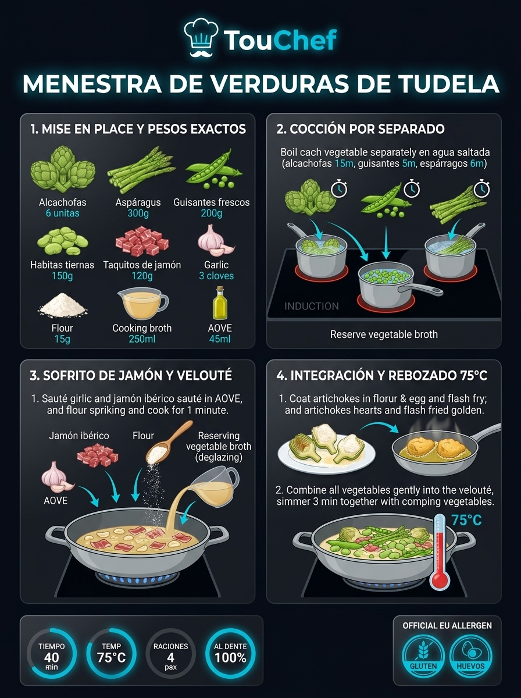
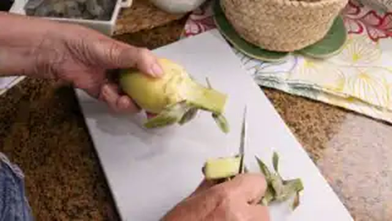
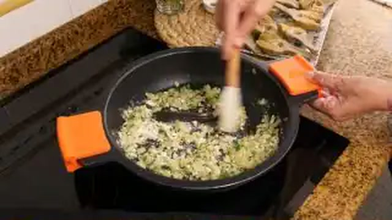
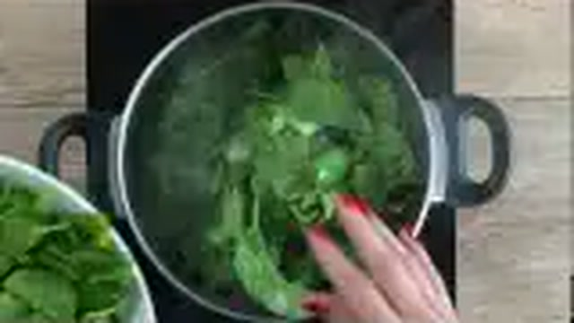
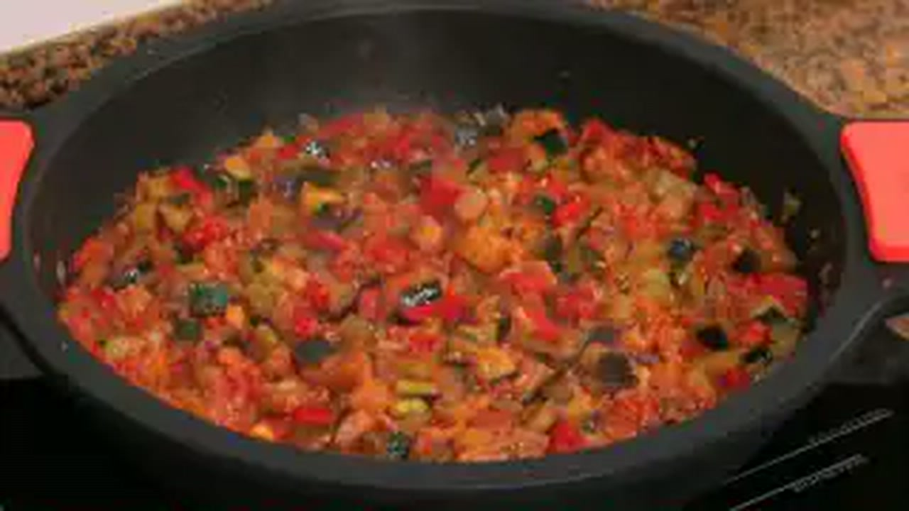
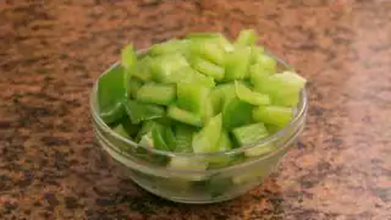
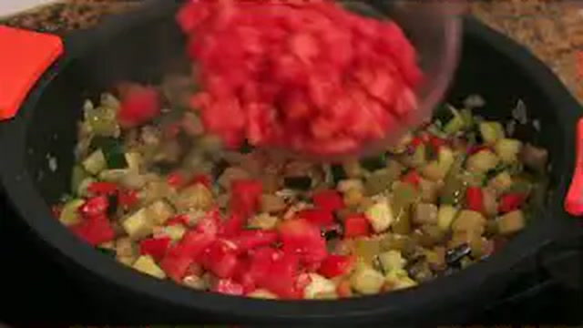
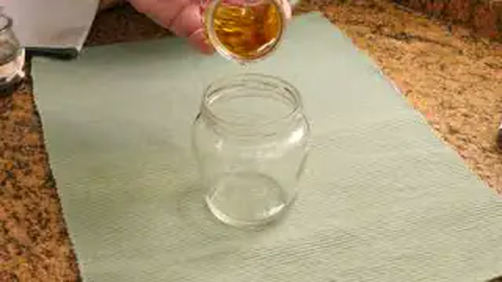
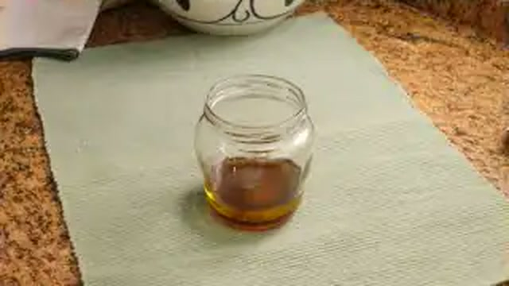

# 🥦 Verduras, Menestras y Platos de la Huerta

*Colección oficial de recetas tradicionales de Karlos Arguiñano estandarizadas para la marca TouChef. Incluye alérgenos UE 1169/2011, pesos exactos, paso a paso e infografías educativas Dark Glassmorphism.*

---

## 🥦 Menestra de Verduras Tradicional de Tudela con Jamón

> 📺 **Vídeo y Receta Oficial:** [Ver en Hogarmania / Karlos Arguiñano: Menestra de Verduras Tradicional de Tudela con Jamón](https://www.hogarmania.com/cocina/recetas/)
> 📊 **Infografía Educativa TouChef:** [Ver Infografía Técnica](assets/infografia_menestra_de_verduras_tradicional_de_tudela_con_jam.jpg)

### 📋 Ficha Técnica y Resumen
| Parámetro | Valor |
|---|---|
| **Tiempo de Preparación** | 25 min |
| **Tiempo de Cocción** | 30 min |
| **Dificultad** | Media |
| **Raciones** | 4 raciones |
| **Coste Estimado** | Medio (€€) |

### ⚠️ Matriz Oficial de Alérgenos (Reglamento UE 1169/2011)
| Alérgeno | Presencia | Ingrediente / Detalle |
|---|:---:|---|
| **Gluten** | 🟢 SÍ | Presente en la harina de trigo (rebozado y ligazón de salsa) |
| **Crustáceos** | ⚪ NO | Ausente (posibles trazas en obrador) |
| **Huevos** | 🟢 SÍ | Presente en el huevo batido para rebozar alcachofas |
| **Pescado** | ⚪ NO | Ausente (posibles trazas en obrador) |
| **Cacahuetes** | ⚪ NO | Ausente (posibles trazas en obrador) |
| **Soja** | ⚪ NO | Ausente (posibles trazas en obrador) |
| **Lácteos** | ⚪ NO | Ausente (posibles trazas en obrador) |
| **Frutos de cáscara** | ⚪ NO | Ausente (posibles trazas en obrador) |
| **Apio** | ⚪ NO | Ausente (posibles trazas en obrador) |
| **Mostaza** | ⚪ NO | Ausente (posibles trazas en obrador) |
| **Sésamo** | ⚪ NO | Ausente (posibles trazas en obrador) |
| **Sulfitos** | ⚪ NO | Ausente (posibles trazas en obrador) |
| **Altramuces** | ⚪ NO | Ausente (posibles trazas en obrador) |
| **Moluscos** | ⚪ NO | Ausente (posibles trazas en obrador) |

### ⚖️ Ingredientes Exactos (Mise en Place)

- **Alcachofas frescas de Tudela (corazones limpios)**: 8 uds (400 g)
- **Espárragos blancos frescos de Navarra**: 8 uds (350 g)
- **Guisantes frescos lágrima o desgranados**: 200 g
- **Habitas tiernas baby frescas**: 150 g
- **Zanahorias medianas en rodajas torneadas**: 2 uds (150 g)
- **Patatas medianas en dados de 2 cm**: 2 uds (200 g)
- **Taquitos de jamón ibérico curado**: 120 g
- **Dientes de ajo laminados finos**: 3 uds (15 g)
- **Harina de trigo de todo uso**: 30 g (para rebozar y ligar)
- **Huevo campero batido**: 1 ud
- **Caldo de cocción de las verduras colado**: 350 ml
- **Aceite de oliva virgen extra (AOVE)**: 60 ml
- **Sal marina fina**: al gusto

### 🔪 Equipamiento y Utillaje Necesario
- Cazuela ancha y baja de barro o acero inoxidable
- Cazos para cocción escalonada de verduras
- Espumadera y colador de malla fina
- Sartén pequeña para rebozar

### 👨‍🍳 Paso a Paso Técnico y Minucioso

1. **Cocción técnica por separado (respeto de texturas):**
   - Pelar y cortar los espárragos: cocer en agua con sal y pizca de azúcar durante 12-14 min.
   - Tornear las alcachofas frotadas con limón: cocer durante 15 min.
   - Cocer zanahorias y patatas durante 12 min.
   - Escaldar guisantes y habitas baby durante 4-5 min para mantener su color verde esmeralda y textura crujiente.
   - *Reservar y colar 350 ml del agua conjunta de cocción de las verduras*.
2. **Rebozado crujiente de alcachofas:** Cortar 4 corazones de alcachofa en cuartos, pasarlos por harina y huevo batido, y freírlos en sartén con AOVE bien caliente (175°C) hasta conseguir un rebozado dorado y crujiente. Escurrir sobre papel.
3. **Sofrito y ligazón de salsa de huerta:** En la cazuela baja, calentar el AOVE y dorar los ajos laminados con los taquitos de jamón ibérico durante 2 minutos. Añadir 1 cucharada rasa de harina (15 g), tostar 1 minuto y verter los 350 ml de caldo de verduras caliente removiendo con varillas para formar una salsa velouté ligera y brillante.
4. **Ensamblado y glaseado conjunto:** Incorporar a la cazuela todas las verduras cocidas (espárragos, habitas, guisantes, patatas, zanahorias y alcachofas cocidas). Cocinar a fuego lento durante 3 minutos realizando vaivén con la cazuela para integrar jugos. Coronar con las alcachofas rebozadas crujientes sin sumergirlas del todo para mantener su textura crocante.

### 🍽️ Emplatado y Textura Final

- Servir en plato hondo amplio o cazuela de barro. Cada verdura debe ofrecer su textura propia, unidas por una salsa verde-dorada sedosa con el contraste umami del jamón ibérico.

### ⏱️ Protocolo de Conservación y Batch Cooking
- **Refrigeración (0°C a 3°C):** 3 días en recipiente hermético de borosilicato.
- **Congelación (-18°C):** 2 meses (congelar las verduras cocidas en salsa sin el rebozado).
- **Envasado al Vacío:** 5 días a 2°C.

### 🔥 Guía de Regeneración Multicanal
- **Cazuela:** 4 minutos a fuego lento añadiendo 2 cucharadas de agua o caldo.
- **Horno Convectivo:** 8 minutos a 160°C tapada con papel de aluminio.
- **Microondas:** 2-3 minutos a 750W con tapa protectora.

---

## 🦪 Alcachofas Salteadas con Jamón Ibérico y Almejas en Salsa Verde

> 📺 **Vídeo y Receta Oficial:** [Ver en Hogarmania / Karlos Arguiñano: Alcachofas Salteadas con Jamón Ibérico y Almejas en Salsa Verde](https://www.hogarmania.com/cocina/recetas/)
> 📊 **Infografía Educativa TouChef:** [Ver Infografía Técnica](assets/infografia_alcachofas_salteadas_con_jamon_iberico_y_alme.jpg)

### 📋 Ficha Técnica y Resumen
| Parámetro | Valor |
|---|---|
| **Tiempo de Preparación** | 20 min |
| **Tiempo de Cocción** | 25 min |
| **Dificultad** | Fácil-Media |
| **Raciones** | 4 raciones |
| **Coste Estimado** | Medio-Alto (€€€) |

### ⚠️ Matriz Oficial de Alérgenos (Reglamento UE 1169/2011)
| Alérgeno | Presencia | Ingrediente / Detalle |
|---|:---:|---|
| **Gluten** | 🟢 SÍ | Presente en la harina de trigo para ligar la salsa verde |
| **Crustáceos** | ⚪ NO | Ausente (posibles trazas en obrador) |
| **Huevos** | ⚪ NO | Ausente (posibles trazas en obrador) |
| **Pescado** | ⚪ NO | Ausente (posibles trazas en obrador) |
| **Cacahuetes** | ⚪ NO | Ausente (posibles trazas en obrador) |
| **Soja** | ⚪ NO | Ausente (posibles trazas en obrador) |
| **Lácteos** | ⚪ NO | Ausente (posibles trazas en obrador) |
| **Frutos de cáscara** | ⚪ NO | Ausente (posibles trazas en obrador) |
| **Apio** | ⚪ NO | Ausente (posibles trazas en obrador) |
| **Mostaza** | ⚪ NO | Ausente (posibles trazas en obrador) |
| **Sésamo** | ⚪ NO | Ausente (posibles trazas en obrador) |
| **Sulfitos** | 🟢 SÍ | Presente en el vino blanco / txakoli |
| **Altramuces** | ⚪ NO | Ausente (posibles trazas en obrador) |
| **Moluscos** | 🟢 SÍ | Presente en la receta (almejas finas o chirirlas) |

### ⚖️ Ingredientes Exactos (Mise en Place)

- **Alcachofas frescas tiernas**: 12 uds (600 g de corazones limpios)
- **Almejas finas o babosas depuradas en agua con sal**: 400 g
- **Taquitos de jamón ibérico de bellota**: 100 g
- **Dientes de ajo finamente picados**: 3 uds (15 g)
- **Txakoli de Getaria o vino blanco seco**: 100 ml
- **Fumet de pescado blanco o caldo de alcachofas**: 200 ml
- **Harina de trigo**: 1 cda rasa (15 g)
- **Perejil fresco picado muy fino**: 3 cdas (15 g)
- **Aceite de oliva virgen extra (AOVE)**: 50 ml
- **Sal marina**: al gusto

### 🔪 Equipamiento y Utillaje Necesario
- Cazuela de barro o sartén honda de 28 cm con tapa
- Cuchillo puntilla para tornear alcachofas
- Bol de agua fría con perejil para evitar oxidación

### 👨‍🍳 Paso a Paso Técnico y Minucioso

1. **Limpieza y cocción base de alcachofas:** Retirar las hojas duras exteriores de las alcachofas, cortar las puntas y pelar los tallos. Cocerlas en agua hirviendo con ramas de perejil y sal durante 14 minutos. Escurrir, cortar por la mitad y secar con papel.
2. **Sofrito de ajo y jamón:** En la cazuela con el AOVE a fuego medio, dorar los ajos picados durante 1 minuto. Añadir el jamón ibérico y saltear 30 segundos sin que la grasa se queme.
3. **Salsa verde y apertura de moluscos:** Añadir la cucharada de harina, cocinar 1 minuto y verter el Txakoli blanco. Dejar evaporar el alcohol 90 segundos. Añadir el caldo caliente y el perejil picado.
4. **Cocción conjunta al vapor:** Incorporar las mitades de alcachofa y las almejas escurridas. Tapar la cazuela a fuego medio-alto durante 3-4 minutos hasta que todas las almejas se abran y suelten su agua marina gelatinosa, emulsionando la salsa en un vaivén circular constante.

### 🍽️ Emplatado y Textura Final

- Servir directamente en la cazuela con las almejas abiertas sobre los corazones tiernos de alcachofa, napados con la salsa verde emulsionada y brillante.

### ⏱️ Protocolo de Conservación y Batch Cooking
- **Refrigeración (0°C a 3°C):** 48 horas en recipiente hermético (consumir preferentemente en 24h por las almejas).
- **Congelación (-18°C):** No recomendada para preparaciones con moluscos y alcachofas en salsa verde.
- **Envasado al Vacío:** No apto con concha.

### 🔥 Guía de Regeneración Multicanal
- **Sartén / Cazuela:** 3 minutos a fuego muy suave tapado con 1 cucharada de caldo.

---

## 🥬 Pencas de Acelga Rellenas de Jamón y Queso Idiazábal en Salsa Española

> 📺 **Vídeo y Receta Oficial:** [Ver en Hogarmania / Karlos Arguiñano: Pencas de Acelga Rellenas de Jamón y Queso Idiazábal en Salsa Española](https://www.hogarmania.com/cocina/recetas/)
> 📊 **Infografía Educativa TouChef:** [Ver Infografía Técnica](assets/infografia_pencas_de_acelga_rellenas_de_jamon_y_queso_id.jpg)

### 📋 Ficha Técnica y Resumen
| Parámetro | Valor |
|---|---|
| **Tiempo de Preparación** | 30 min |
| **Tiempo de Cocción** | 35 min |
| **Dificultad** | Media |
| **Raciones** | 4 raciones (8 piezas) |
| **Coste Estimado** | Económico (€) |

### ⚠️ Matriz Oficial de Alérgenos (Reglamento UE 1169/2011)
| Alérgeno | Presencia | Ingrediente / Detalle |
|---|:---:|---|
| **Gluten** | 🟢 SÍ | Presente en la harina de trigo (rebozado y salsa) |
| **Crustáceos** | ⚪ NO | Ausente (posibles trazas en obrador) |
| **Huevos** | 🟢 SÍ | Presente en el huevo batido para rebozar |
| **Pescado** | ⚪ NO | Ausente (posibles trazas en obrador) |
| **Cacahuetes** | ⚪ NO | Ausente (posibles trazas en obrador) |
| **Soja** | ⚪ NO | Ausente (posibles trazas en obrador) |
| **Lácteos** | 🟢 SÍ | Presente en el queso Idiazábal |
| **Frutos de cáscara** | ⚪ NO | Ausente (posibles trazas en obrador) |
| **Apio** | ⚪ NO | Ausente (posibles trazas en obrador) |
| **Mostaza** | ⚪ NO | Ausente (posibles trazas en obrador) |
| **Sésamo** | ⚪ NO | Ausente (posibles trazas en obrador) |
| **Sulfitos** | 🟢 SÍ | Presente en el vino tinto/blanco de la salsa española |
| **Altramuces** | ⚪ NO | Ausente (posibles trazas en obrador) |
| **Moluscos** | ⚪ NO | Ausente (posibles trazas en obrador) |

### ⚖️ Ingredientes Exactos (Mise en Place)

- **Pencas de acelga anchas y carnosas**: 16 trozos limpios de 8x4 cm (600 g)
- **Lonchas de jamón serrano o ibérico fino**: 8 lonchas (100 g)
- **Queso Idiazábal D.O. semicurado en lonchas**: 8 lonchas (120 g)
- **Harina de trigo y huevos batidos para rebozar**: 60 g harina, 2 huevos
- **Cebolla morada para la salsa española**: 1 ud (150 g)
- **Zanahoria picada**: 1 ud (80 g)
- **Puerro picado**: 1 ud (80 g)
- **Fondo oscuro de carne o caldo concentrado**: 350 ml
- **Vino tinto crianza**: 60 ml
- **AOVE para freír y pochar**: 150 ml
- **Sal marina**: al gusto

### 🔪 Equipamiento y Utillaje Necesario
- Cazuela para hervir y cazuela baja para el guiso
- Pelador o puntilla para deshebrar pencas
- Sartén antiadherente para freír rebozados
- Batidora de vaso / pasapurés

### 👨‍🍳 Paso a Paso Técnico y Minucioso

1. **Limpieza y cocción de las pencas:** Retirar los hilos y hebras de las pencas con una puntilla. Cortarlas en rectángulos homogéneos de 8 cm. Cocer en abundante agua hirviendo con sal durante 18 minutos hasta que estén muy tiernas. Escurrir bien sobre paño limpio.
2. **Emparedado y rebozado:** Emparejar las pencas de dos en dos colocando en medio una loncha de jamón y una de queso Idiazábal. Pasarlas cuidadosamente por harina y huevo batido. Freír en AOVE caliente a 170°C hasta obtener una costra dorada y crujiente por ambos lados. Reservar sobre papel absorbente.
3. **Salsa española tradicional:** En una cazuela, pochar la cebolla, zanahoria y puerro con 30 ml de AOVE durante 15 min. Añadir 1 cucharada de harina, tostar, regar con el vino tinto y reducir. Verter el fondo oscuro de carne y cocer 15 min. Triturar y colar la salsa hasta que quede aterciopelada y brillante.
4. **Guiso conjunto:** Introducir las pencas rebozadas en la cazuela con la salsa española caliente. Dar un hervor suave de 4 minutos para que las pencas absorban la salsa y el queso Idiazábal se funda en el corazón.

### 🍽️ Emplatado y Textura Final

- Servir dos paquetes de penca por comensal sobre una base de salsa española brillante, dejando a la vista el corte fundente de queso Idiazábal y jamón.

### ⏱️ Protocolo de Conservación y Batch Cooking
- **Refrigeración (0°C a 3°C):** 3 días en recipiente hermético.
- **Congelación (-18°C):** 2 meses (congelar antes de rebozar o cocinadas en salsa).
- **Envasado al Vacío:** 6 días en frío.

### 🔥 Guía de Regeneración Multicanal
- **Cazuela:** 5 minutos a fuego suave tapada.
- **Horno Convectivo:** 8-10 minutos a 160°C.
- **Microondas:** 2 minutos a 700W tapado.

---

## 🥘 Pisto Tradicional Donostiarra con Huevo Escalfado

> 📺 **Vídeo y Receta Oficial:** [Ver en Hogarmania / Karlos Arguiñano: Pisto Tradicional Donostiarra con Huevo Escalfado](https://www.hogarmania.com/cocina/recetas/)
> 📊 **Infografía Educativa TouChef:** [Ver Infografía Técnica](assets/infografia_pisto_tradicional_donostiarra_con_huevo_escalf.jpg)

### 📋 Ficha Técnica y Resumen
| Parámetro | Valor |
|---|---|
| **Tiempo de Preparación** | 20 min |
| **Tiempo de Cocción** | 35 min |
| **Dificultad** | Fácil |
| **Raciones** | 4 raciones |
| **Coste Estimado** | Económico (€) |

### ⚠️ Matriz Oficial de Alérgenos (Reglamento UE 1169/2011)
| Alérgeno | Presencia | Ingrediente / Detalle |
|---|:---:|---|
| **Gluten** | ⚪ NO | Ausente (posibles trazas en obrador) |
| **Crustáceos** | ⚪ NO | Ausente (posibles trazas en obrador) |
| **Huevos** | 🟢 SÍ | Presente en la receta (huevos camperos escalfados) |
| **Pescado** | ⚪ NO | Ausente (posibles trazas en obrador) |
| **Cacahuetes** | ⚪ NO | Ausente (posibles trazas en obrador) |
| **Soja** | ⚪ NO | Ausente (posibles trazas en obrador) |
| **Lácteos** | ⚪ NO | Ausente (posibles trazas en obrador) |
| **Frutos de cáscara** | ⚪ NO | Ausente (posibles trazas en obrador) |
| **Apio** | ⚪ NO | Ausente (posibles trazas en obrador) |
| **Mostaza** | ⚪ NO | Ausente (posibles trazas en obrador) |
| **Sésamo** | ⚪ NO | Ausente (posibles trazas en obrador) |
| **Sulfitos** | ⚪ NO | Ausente (posibles trazas en obrador) |
| **Altramuces** | ⚪ NO | Ausente (posibles trazas en obrador) |
| **Moluscos** | ⚪ NO | Ausente (posibles trazas en obrador) |

### ⚖️ Ingredientes Exactos (Mise en Place)

- **Calabacines verdes tiernos con piel en dados de 1 cm**: 2 uds (400 g)
- **Pimientos verdes italianos picados**: 2 uds (150 g)
- **Pimiento rojo carnoso en dados**: 1 ud (150 g)
- **Cebollas dulces picadas en juliana / brunoise gruesa**: 2 uds (300 g)
- **Tomates maduros pera pelados y picados en concassé**: 4 uds (400 g)
- **Dientes de ajo laminados**: 3 uds (15 g)
- **Huevos camperos de caserío**: 4 uds
- **Aceite de oliva virgen extra (AOVE)**: 70 ml
- **Sal marina y pizca de azúcar**: al gusto

### 🔪 Equipamiento y Utillaje Necesario
- Cazuela de barro ancha o sartén grande de hierro
- Cuchillo cebollero y tabla de madera
- Cazo hondo con agua y vinagre para escalfar huevos
- Espumadera

### 👨‍🍳 Paso a Paso Técnico y Minucioso

1. **Pochado escalonado de hortalizas:** En la cazuela con el AOVE a fuego medio, añadir primero los ajos y la cebolla con un toque de sal. Cocinar 10 min hasta que empiece a transparentar.
2. **Incorporación de pimientos y calabacín:** Añadir los pimientos verde y rojo. Rehogar 8 minutos. Incorporar el calabacín en dados y cocinar otros 8 minutos a fuego suave para que mantenga forma sin deshacerse.
3. **Confitado con tomate fresco:** Agregar el tomate concassé y una pizca de azúcar para equilibrar la acidez. Guisar a fuego muy lento durante 15 minutos removiendo con cuchara de madera hasta que todo el jugo reduzca y las verduras queden melosas y brillantes.
4. **Escalfado de huevos camperos:** En un cazo con agua hirviendo suave a 85°C y 20 ml de vinagre, crear un remolino con una cuchara y deslizar el huevo en el centro. Cocinar durante 3 minutos exactos para conseguir clara cuajada y yema completamente líquida.

### 🍽️ Emplatado y Textura Final

- Emplatar el pisto bien caliente en cazuelitas individuales y colocar en el centro el huevo escalfado recién escurrido, espolvoreando sal en escamas y perejil fresco.

### ⏱️ Protocolo de Conservación y Batch Cooking
- **Refrigeración (0°C a 3°C):** El pisto aguanta 5 días en nevera ganando sabor con el reposo. Los huevos se escalfan en el momento.
- **Congelación (-18°C):** 3 meses para el pisto en tupper hermético.
- **Envasado al Vacío:** 10 días en frío.

### 🔥 Guía de Regeneración Multicanal
- **Sartén:** 3 minutos a fuego medio.
- **Microondas:** 2 minutos a 800W.

---

## 🥣 Cardo Tradicional con Salsa de Almendras y Ajo Dorado

> 📺 **Vídeo y Receta Oficial:** [Ver en Hogarmania / Karlos Arguiñano: Cardo Tradicional con Salsa de Almendras y Ajo Dorado](https://www.hogarmania.com/cocina/recetas/)
> 📊 **Infografía Educativa TouChef:** [Ver Infografía Técnica](assets/infografia_cardo_tradicional_con_salsa_de_almendras_y_ajo.jpg)

### 📋 Ficha Técnica y Resumen
| Parámetro | Valor |
|---|---|
| **Tiempo de Preparación** | 25 min |
| **Tiempo de Cocción** | 45 min |
| **Dificultad** | Fácil-Media |
| **Raciones** | 4 raciones |
| **Coste Estimado** | Económico (€) |

### ⚠️ Matriz Oficial de Alérgenos (Reglamento UE 1169/2011)
| Alérgeno | Presencia | Ingrediente / Detalle |
|---|:---:|---|
| **Gluten** | 🟢 SÍ | Presente en la harina de trigo (velouté de almendras) |
| **Crustáceos** | ⚪ NO | Ausente (posibles trazas en obrador) |
| **Huevos** | ⚪ NO | Ausente (posibles trazas en obrador) |
| **Pescado** | ⚪ NO | Ausente (posibles trazas en obrador) |
| **Cacahuetes** | ⚪ NO | Ausente (posibles trazas en obrador) |
| **Soja** | ⚪ NO | Ausente (posibles trazas en obrador) |
| **Lácteos** | ⚪ NO | Ausente (posibles trazas en obrador) |
| **Frutos de cáscara** | 🟢 SÍ | Presente en la receta (almendras crudas y tostadas) |
| **Apio** | ⚪ NO | Ausente (posibles trazas en obrador) |
| **Mostaza** | ⚪ NO | Ausente (posibles trazas en obrador) |
| **Sésamo** | ⚪ NO | Ausente (posibles trazas en obrador) |
| **Sulfitos** | ⚪ NO | Ausente (posibles trazas en obrador) |
| **Altramuces** | ⚪ NO | Ausente (posibles trazas en obrador) |
| **Moluscos** | ⚪ NO | Ausente (posibles trazas en obrador) |

### ⚖️ Ingredientes Exactos (Mise en Place)

- **Cardo fresco limpio de pencas carnosas (o en conserva de calidad)**: 800 g
- **Almendras crudas molidas en polvo fino**: 80 g
- **Almendras laminadas tostadas para terminar**: 30 g
- **Dientes de ajo morado laminados**: 4 uds (20 g)
- **Harina de trigo**: 20 g (1 cda colmada)
- **Caldo de cocción del cardo filtrado**: 400 ml
- **Aceite de oliva virgen extra (AOVE)**: 50 ml
- **Zumo de 1/2 limón y sal marina**: al gusto

### 🔪 Equipamiento y Utillaje Necesario
- Olla exprés o cazuela honda para cocer cardo
- Cazuela ancha de barro o acero
- Varillas manuales de cocina
- Mortero de piedra o trituradora

### 👨‍🍳 Paso a Paso Técnico y Minucioso

1. **Limpieza y cocción del cardo:** Retirar las fibras y filamentos de los tallos con puntilla. Cortar en trozos de 5 cm e introducir de inmediato en agua con limón para evitar oxidación. Cocer en olla rápida 20 min (o 45 min en cazuela) con agua y sal. Escurrir reservando el caldo.
2. **Dorado aromático de ajos:** En una cazuela baja con el AOVE a fuego suave, dorar los ajos laminados hasta que tomen color avellana sin quemar. Retirar unos pocos para decorar.
3. **Elaboración de la salsa velouté de almendras:** En el mismo aceite con los ajos restantes, añadir la harina y la almendra molida. Tostar 1-2 minutos removiendo constantemente. Verter el caldo caliente del cardo poco a poco con las varillas hasta crear una salsa aterciopelada de frutos secos.
4. **Guisado conjunto y glaseado:** Añadir el cardo cocido escurrido a la salsa. Cocinar a fuego lento durante 6-8 minutos con suaves movimientos circulares de cazuela para que el cardo absorba todo el sabor y la salsa ligue sedosa.

### 🍽️ Emplatado y Textura Final

- Servir en plato hondo bien caliente, coronando con los ajos dorados crujientes, almendras laminadas tostadas y perejil picado.

### ⏱️ Protocolo de Conservación y Batch Cooking
- **Refrigeración (0°C a 3°C):** 4 días en nevera en tupper de cristal.
- **Congelación (-18°C):** 2 meses (el cardo tolera muy bien la congelación en su salsa).
- **Envasado al Vacío:** 7 días en frío.

### 🔥 Guía de Regeneración Multicanal
- **Cazuela:** 4 minutos a fuego lento añadiendo un chorrito de agua o leche.
- **Microondas:** 2-3 minutos a 750W tapado.

---

## 🌱 Espárragos Frescos de Navarra en Dos Texturas con Vinagreta de Huevo

> 📺 **Vídeo y Receta Oficial:** [Ver en Hogarmania / Karlos Arguiñano: Espárragos Frescos de Navarra en Dos Texturas con Vinagreta de Huevo](https://www.hogarmania.com/cocina/recetas/)
> 📊 **Infografía Educativa TouChef:** [Ver Infografía Técnica](assets/infografia_esparragos_frescos_de_navarra_en_dos_texturas_.jpg)

### 📋 Ficha Técnica y Resumen
| Parámetro | Valor |
|---|---|
| **Tiempo de Preparación** | 15 min |
| **Tiempo de Cocción** | 15 min |
| **Dificultad** | Fácil |
| **Raciones** | 4 raciones |
| **Coste Estimado** | Medio (€€) |

### ⚠️ Matriz Oficial de Alérgenos (Reglamento UE 1169/2011)
| Alérgeno | Presencia | Ingrediente / Detalle |
|---|:---:|---|
| **Gluten** | ⚪ NO | Ausente (posibles trazas en obrador) |
| **Crustáceos** | ⚪ NO | Ausente (posibles trazas en obrador) |
| **Huevos** | 🟢 SÍ | Presente en la vinagreta (huevo cocido campero) |
| **Pescado** | ⚪ NO | Ausente (posibles trazas en obrador) |
| **Cacahuetes** | ⚪ NO | Ausente (posibles trazas en obrador) |
| **Soja** | ⚪ NO | Ausente (posibles trazas en obrador) |
| **Lácteos** | ⚪ NO | Ausente (posibles trazas en obrador) |
| **Frutos de cáscara** | ⚪ NO | Ausente (posibles trazas en obrador) |
| **Apio** | ⚪ NO | Ausente (posibles trazas en obrador) |
| **Mostaza** | ⚪ NO | Ausente (posibles trazas en obrador) |
| **Sésamo** | ⚪ NO | Ausente (posibles trazas en obrador) |
| **Sulfitos** | 🟢 SÍ | Presente en el vinagre de sidra / Jerez |
| **Altramuces** | ⚪ NO | Ausente (posibles trazas en obrador) |
| **Moluscos** | ⚪ NO | Ausente (posibles trazas en obrador) |

### ⚖️ Ingredientes Exactos (Mise en Place)

- **Espárragos blancos frescos de Navarra con I.G.P. (calibre grueso)**: 12 uds (750 g)
- **Huevos camperos de caserío cocidos duros**: 2 uds (120 g)
- **Pimiento rojo morrón picado en brunoise**: 40 g
- **Pimiento verde italiano en brunoise**: 40 g
- **Cebolleta fresca picada muy fina**: 40 g
- **Aceite de oliva virgen extra (AOVE)**: 80 ml
- **Vinagre de sidra o Jerez**: 25 ml
- **Azúcar blanquilla (para el agua de cocción)**: 5 g
- **Sal marina fina y escamas de sal**: al gusto

### 🔪 Equipamiento y Utillaje Necesario
- Pelador de verduras pivotante
- Olla alta para cocción vertical o cazuela ancha
- Plancha o sartén grill acanalada
- Bol para emulsionar la vinagreta

### 👨‍🍳 Paso a Paso Técnico y Minucioso

1. **Pelado y corte maestro:** Pelar los espárragos desde justo debajo de la yema hacia la base con el pelador, girando la pieza. Cortar la parte leñosa inferior del tallo (2-3 cm).
2. **Cocción tradicional al dente:** Cocer 6 espárragos en agua hirviendo con una cucharadita de sal y 5 g de azúcar durante 12-14 minutos (comprobar el punto pinchando la base con un palillo; debe entrar suave). Escurrir sobre paño.
3. **Plancha caramelizada (segunda textura):** Con los 6 espárragos restantes (previamente escaldados 5 minutos), pincelarlos con AOVE y marcarlos en la plancha o grill bien caliente durante 2 minutos por lado hasta que muestren marcas tostadas caramelizadas.
4. **Vinagreta Donostiarra de huevo:** En un bol, picar muy finos los huevos cocidos, la cebolleta, el pimiento rojo y el pimiento verde. Añadir el vinagre de sidra, la sal marina y batir con el AOVE para emulsionar ligeramente.

### 🍽️ Emplatado y Textura Final

- Disponer en la fuente alternando un espárrago cocido tibio (sedoso y tierno) con uno a la plancha (crujiente y ahumado). Salsear el centro con la vinagreta multicolor y terminar con escamas de sal.

### ⏱️ Protocolo de Conservación y Batch Cooking
- **Refrigeración (0°C a 3°C):** 3 días en nevera sumergidos en su propio caldo de cocción (los cocidos). La vinagreta se conserva 4 días por separado.
- **Congelación (-18°C):** No congelar (el espárrago fresco se vuelve fibroso y acuoso).
- **Envasado al Vacío:** 5 días en frío.

### 🔥 Guía de Regeneración Multicanal
- **Plancha:** 1 minuto para dar golpe de calor.
- Consumo templado o frío natural a 18°C.
