# 🍰 Postres Vascos y Repostería Tradicional

*Colección oficial de recetas tradicionales de Karlos Arguiñano estandarizadas para la marca TouChef. Incluye alérgenos UE 1169/2011, pesos exactos, paso a paso e infografías educativas Dark Glassmorphism.*

---

## 🍰 Pantxineta Donostiarra Tradicional de Hojaldre y Crema

> 📺 **Vídeo y Receta Oficial:** [Ver en Hogarmania / Karlos Arguiñano: Pantxineta Donostiarra Tradicional de Hojaldre y Crema](https://www.hogarmania.com/cocina/recetas/)
> 📊 **Infografía Educativa TouChef:** [Ver Infografía Técnica](assets/infografia_pantxineta_donostiarra_tradicional_de_hojaldre_y_c.jpg)

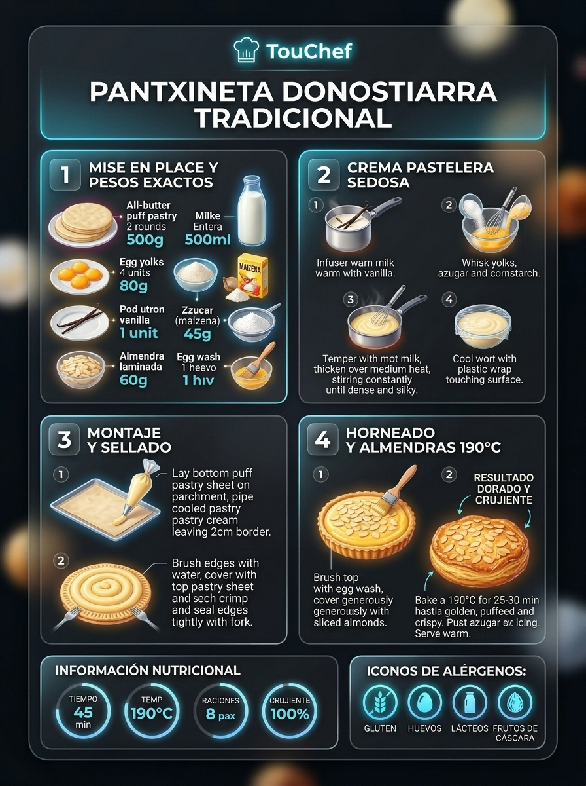

### 📋 Ficha Técnica y Resumen
| Parámetro | Valor |
|---|---|
| **Tiempo de Preparación** | 25 min |
| **Tiempo de Cocción** | 30 min |
| **Dificultad** | Fácil-Media |
| **Raciones** | 6 raciones |
| **Coste Estimado** | Económico (€) |

### ⚠️ Matriz Oficial de Alérgenos (Reglamento UE 1169/2011)
| Alérgeno | Presencia | Ingrediente / Detalle |
|---|:---:|---|
| **Gluten** | 🟢 SÍ | Presente en la masa de hojaldre (harina de trigo) |
| **Crustáceos** | ⚪ NO | Ausente (posibles trazas en obrador) |
| **Huevos** | 🟢 SÍ | Presente en la crema pastelera (yemas) y pintado superficial |
| **Pescado** | ⚪ NO | Ausente (posibles trazas en obrador) |
| **Cacahuetes** | ⚪ NO | Ausente (posibles trazas en obrador) |
| **Soja** | ⚪ NO | Ausente (posibles trazas en obrador) |
| **Lácteos** | 🟢 SÍ | Presente en la leche entera de la crema y mantequilla del hojaldre |
| **Frutos de cáscara** | 🟢 SÍ | Presente en la cubierta de almendra laminada cruda |
| **Apio** | ⚪ NO | Ausente (posibles trazas en obrador) |
| **Mostaza** | ⚪ NO | Ausente (posibles trazas en obrador) |
| **Sésamo** | ⚪ NO | Ausente (posibles trazas en obrador) |
| **Sulfitos** | ⚪ NO | Ausente (posibles trazas en obrador) |
| **Altramuces** | ⚪ NO | Ausente (posibles trazas en obrador) |
| **Moluscos** | ⚪ NO | Ausente (posibles trazas en obrador) |

### ⚖️ Ingredientes Exactos (Mise en Place)

- **Láminas de masa de hojaldre con mantequilla (redondas o cuadradas)**: 2 uds (500 g)
- **Leche entera de caserío**: 500 ml
- **Yemas de huevo campero**: 4 uds (80 g)
- **Azúcar blanquilla**: 100 g
- **Almidón de maíz (Maicena)**: 45 g
- **Rama de canela en rama**: 1 ud (5 g)
- **Piel de limón ecológico (sin parte blanca)**: corteza de 1/2 limón
- **Almendra laminada cruda para la cubierta**: 80 g
- **Huevo batido para sellar y dorar**: 1 ud
- **Azúcar glas para espolvorear**: 30 g

### 🔪 Equipamiento y Utillaje Necesario
- Bandeja de horno y papel sulfurizado
- Cazo para infusionar leche
- Bol amplio y varillas metálicas
- Pincel de repostería de silicona
- Tamizador fino para azúcar glas

### 👨‍🍳 Paso a Paso Técnico y Minucioso

1. **Infusión láctea y crema pastelera:** En un cazo, infusionar la leche con la canela y la piel de limón a 80°C hasta que rompa a hervir. En un bol, batir las 4 yemas con el azúcar y la Maicena hasta blanquear. Colar la leche caliente sobre la mezcla removiendo con varillas. Devolver al fuego y cocinar a fuego medio removiendo enérgicamente hasta que espese y hierva 1 minuto (84°C). Tapar con film a piel y dejar templar.
2. **Montaje y sellado del hojaldre:** Extender una lámina de hojaldre sobre papel de horno en la bandeja. Repartir la crema pastelera templada en el centro dejando 2.5 cm limpios en el perímetro. Pincelar los bordes con huevo batido. Cubrir con la segunda lámina de hojaldre y presionar y sellar los bordes con las puntas de un tenedor.
3. **Pintado, almendras y horneado:** Pincelar generosamente toda la superficie superior con huevo batido. Cubrir con la almendra laminada cruda de forma uniforme. Hornear en horno precalentado a 190°C (calor arriba y abajo con ventilador) durante 25-30 minutos, hasta que el hojaldre suba alto y las almendras estén tostadas y crujientes.

### 🍽️ Emplatado y Textura Final
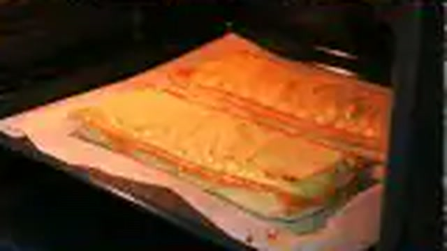
- Dejar templar 15 minutos en rejilla. Espolvorear abundante azúcar glas tamizado antes de cortar. La experiencia combina el hojaldre etéreo crujiente, el tostado de la almendra y un núcleo de crema pastelera templada y sedosa.

### ⏱️ Protocolo de Conservación y Batch Cooking
- **Refrigeración (0°C a 3°C):** 3 días en nevera bien tapada.
- **Congelación (-18°C):** No congelar una vez horneada.
- **Envasado al Vacío:** No recomendado.

### 🔥 Guía de Regeneración Multicanal
- **Horno Convectivo:** 4 minutos a 160°C para devolver el crujiente al hojaldre antes de consumir templada.
- **Microondas:** No recomendado (ablanda el hojaldre).

---

## 🥧 Pastel Vasco Tradicional (Gâteau Basque) con Crema y Vainilla

> 📺 **Vídeo y Receta Oficial:** [Ver en Hogarmania / Karlos Arguiñano: Pastel Vasco Tradicional (Gâteau Basque) con Crema y Vainilla](https://www.hogarmania.com/cocina/recetas/)
> 📊 **Infografía Educativa TouChef:** [Ver Infografía Técnica](assets/infografia_pastel_vasco_tradicional_gateau_basque_con_crema_y.jpg)

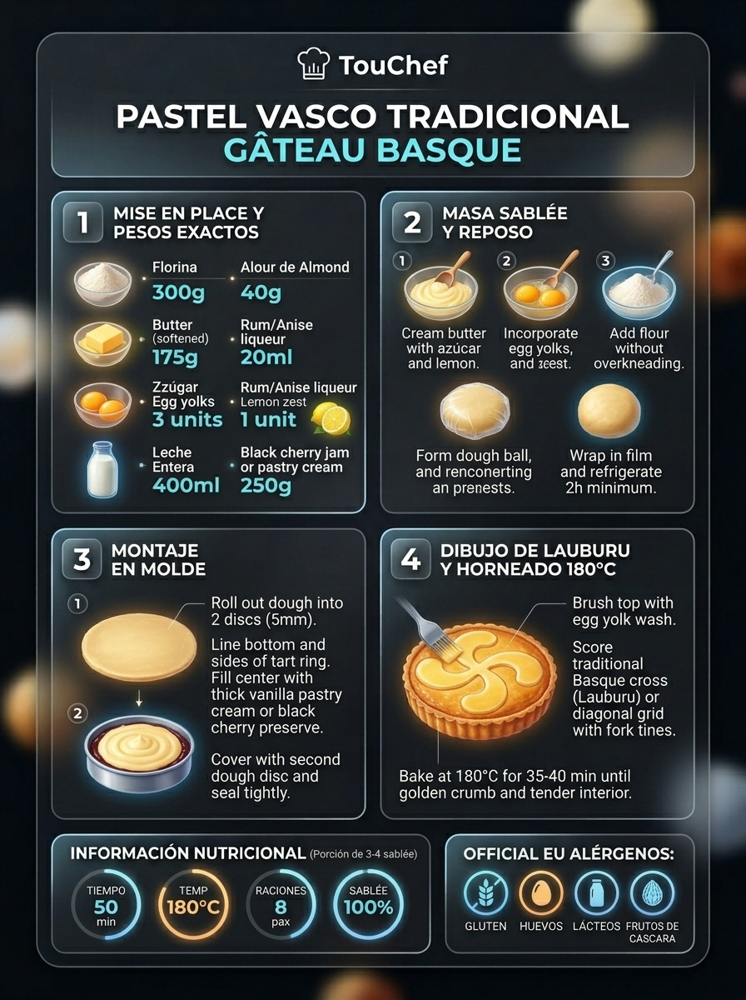

### 📋 Ficha Técnica y Resumen
| Parámetro | Valor |
|---|---|
| **Tiempo de Preparación** | 30 min (+ 1h reposo) |
| **Tiempo de Cocción** | 40 min |
| **Dificultad** | Media |
| **Raciones** | 8 raciones |
| **Coste Estimado** | Económico (€) |

### ⚠️ Matriz Oficial de Alérgenos (Reglamento UE 1169/2011)
| Alérgeno | Presencia | Ingrediente / Detalle |
|---|:---:|---|
| **Gluten** | 🟢 SÍ | Presente en la masa sablé (harina de trigo) |
| **Crustáceos** | ⚪ NO | Ausente (posibles trazas en obrador) |
| **Huevos** | 🟢 SÍ | Presente en la masa y en la crema pastelera |
| **Pescado** | ⚪ NO | Ausente (posibles trazas en obrador) |
| **Cacahuetes** | ⚪ NO | Ausente (posibles trazas en obrador) |
| **Soja** | ⚪ NO | Ausente (posibles trazas en obrador) |
| **Lácteos** | 🟢 SÍ | Presente en la mantequilla de la masa y leche de la crema |
| **Frutos de cáscara** | ⚪ NO | Ausente (posibles trazas en obrador) |
| **Apio** | ⚪ NO | Ausente (posibles trazas en obrador) |
| **Mostaza** | ⚪ NO | Ausente (posibles trazas en obrador) |
| **Sésamo** | ⚪ NO | Ausente (posibles trazas en obrador) |
| **Sulfitos** | 🟢 SÍ | Presente en el toque de ron oscuro tradicional |
| **Altramuces** | ⚪ NO | Ausente (posibles trazas en obrador) |
| **Moluscos** | ⚪ NO | Ausente (posibles trazas en obrador) |

### ⚖️ Ingredientes Exactos (Mise en Place)

- **Harina de trigo de repostería (floja)**: 300 g
- **Mantequilla de caserío en punto pomada**: 160 g
- **Azúcar blanquilla o glas**: 150 g
- **Huevos camperos enteros**: 2 uds (120 g) + 1 yema para la masa
- **Levadura química (impulsor)**: 6 g
- **Ralladura de limón y pizca de sal marina**: 1 ud
- **Crema pastelera espesa aromatizada con vaina de vainilla y 20 ml de ron añejo**: 450 g
- **Yema de huevo batida con 1 cda de leche para pintar**: 1 ud

### 🔪 Equipamiento y Utillaje Necesario
- Molde desmontable redondo de 22-24 cm de diámetro
- Rodillo de repostería
- Papel film transparente y papel vegetal
- Tenedor para grabado del dibujo tradicional

### 👨‍🍳 Paso a Paso Técnico y Minucioso
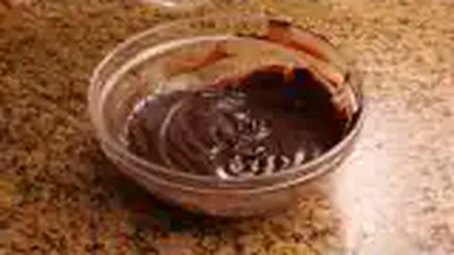
1. **Elaboración de la masa sablé vasca:** En un bol, batir la mantequilla en pomada con el azúcar y la ralladura de limón hasta textura cremosa. Incorporar los huevos y la yema uno a uno. Añadir la harina tamizada con el impulsor y la sal. Integrar con espátula sin amasar en exceso para no desarrollar gluten. Dividir en dos partes (2/3 y 1/3), envolver en film y refrigerar 1 hora en frío.
2. **Forrado y relleno del molde:** Engrasar el molde. Estirar la porción mayor de masa entre dos papeles de horno hasta 4 mm de grosor y forrar el fondo y las paredes del molde. Rellenar con la crema pastelera fría al ron y vainilla alisando la superficie.
3. **Tapa y diseño tradicional del lauburu:** Estirar el tercio restante de masa y cubrir el pastel sellando los bordes con los dedos húmedos. Pintar la superficie con la yema batida. Con las púas de un tenedor, marcar el clásico entramado en rombos o el lauburu vasco tradicional.
4. **Horneado y maduración:** Hornear a 180°C durante 35-40 minutos hasta que adquiera un color dorado caoba intenso y la masa esté cocida y crujiente. Dejar enfriar por completo antes de desmoldar (el pastel vasco gana estructura y sabor reposado de un día para otro).

### 🍽️ Emplatado y Textura Final

- Servir en porciones triangulares a temperatura ambiente. La masa sablé quebradiza y mantecosa contrasta con el relleno denso y aromático de crema y ron.

### ⏱️ Protocolo de Conservación y Batch Cooking
- **Refrigeración (0°C a 3°C):** 5 días en campana o nevera.
- **Congelación (-18°C):** 2 meses (congelar entero o en porciones envuelto en film).
- **Envasado al Vacío:** 8 días en frío.

### 🔥 Guía de Regeneración Multicanal
- Consumo óptimo a temperatura ambiente (20°C). Sacar de nevera 30 min antes.

---

## 🍮 Goxua Tradicional de Vitoria con Nata, Bizcocho y Caramelo Tostado

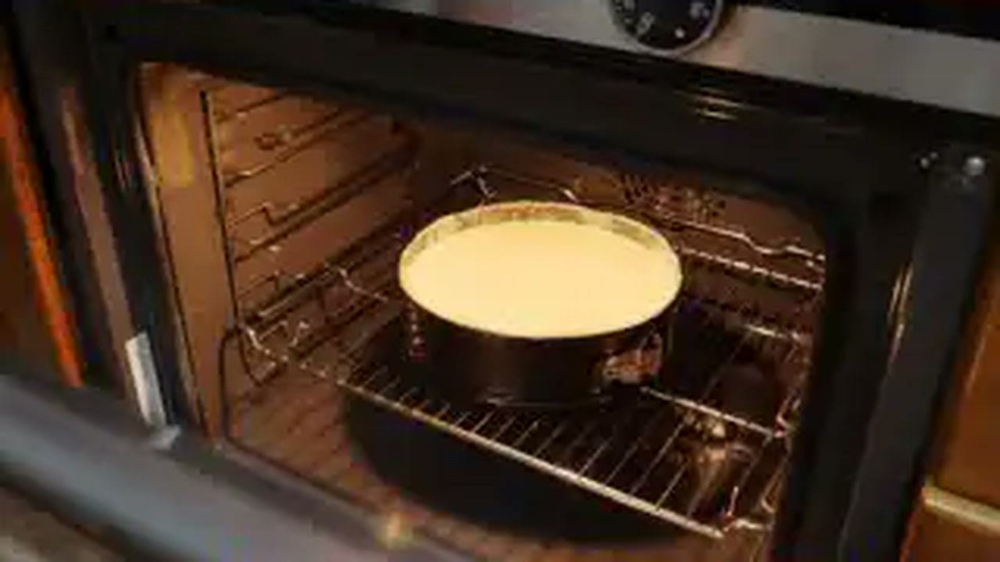

> 📺 **Vídeo y Receta Oficial:** [Ver en Hogarmania / Karlos Arguiñano: Goxua Tradicional de Vitoria con Nata, Bizcocho y Caramelo Tostado](https://www.hogarmania.com/cocina/recetas/)
> 📊 **Infografía Educativa TouChef:** [Ver Infografía Técnica](assets/infografia_goxua_tradicional_de_vitoria_con_nata_bizcocho.jpg)

### 📋 Ficha Técnica y Resumen
| Parámetro | Valor |
|---|---|
| **Tiempo de Preparación** | 30 min |
| **Tiempo de Cocción** | 10 min |
| **Dificultad** | Fácil-Media |
| **Raciones** | 6 raciones (copas individuales o cazuela) |
| **Coste Estimado** | Económico (€) |

### ⚠️ Matriz Oficial de Alérgenos (Reglamento UE 1169/2011)
| Alérgeno | Presencia | Ingrediente / Detalle |
|---|:---:|---|
| **Gluten** | 🟢 SÍ | Presente en los bizcochos de soletilla / genovés |
| **Crustáceos** | ⚪ NO | Ausente (posibles trazas en obrador) |
| **Huevos** | 🟢 SÍ | Presente en la crema pastelera y bizcocho |
| **Pescado** | ⚪ NO | Ausente (posibles trazas en obrador) |
| **Cacahuetes** | ⚪ NO | Ausente (posibles trazas en obrador) |
| **Soja** | ⚪ NO | Ausente (posibles trazas en obrador) |
| **Lácteos** | 🟢 SÍ | Presente en la nata montada (35% M.G.) y leche entera |
| **Frutos de cáscara** | ⚪ NO | Ausente (posibles trazas en obrador) |
| **Apio** | ⚪ NO | Ausente (posibles trazas en obrador) |
| **Mostaza** | ⚪ NO | Ausente (posibles trazas en obrador) |
| **Sésamo** | ⚪ NO | Ausente (posibles trazas en obrador) |
| **Sulfitos** | 🟢 SÍ | Presente en el almíbar con licor / ron |
| **Altramuces** | ⚪ NO | Ausente (posibles trazas en obrador) |
| **Moluscos** | ⚪ NO | Ausente (posibles trazas en obrador) |

### ⚖️ Ingredientes Exactos (Mise en Place)
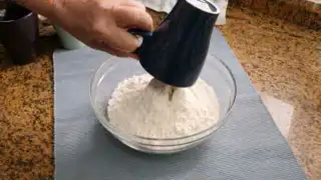
- **Nata líquida para montar muy fría (mínimo 35% M.G.)**: 400 ml
- **Azúcar para montar la nata**: 60 g
- **Bizcochos de soletilla tiernos o plancha de bizcocho genovés**: 150 g
- **Crema pastelera tradicional densa**: 400 g
- **Almíbar de calado (100 ml agua + 100 g azúcar + 30 ml ron añejo / pacharán)**: 230 ml
- **Azúcar blanquilla para caramelizar la superficie con soplete**: 60 g
- **Grosellas o menta fresca para decorar**: al gusto

### 🔪 Equipamiento y Utillaje Necesario
- Copas de cristal anchas o cazuela de barro tradicional
- Batidora de varillas eléctrica para montar nata
- Manga pastelera con boquilla rizada y lisa
- Soplete de cocina a gas o pala de quemar tradicional

### 👨‍🍳 Paso a Paso Técnico y Minucioso

1. **Montado firme de la nata:** En un bol helado, batir los 400 ml de nata líquida fría con los 60 g de azúcar hasta obtener una nata montada firme y consistente (chantilly). Colocar en manga pastelera.
2. **Almíbar de calado:** Hervir el agua con el azúcar durante 3 minutos hasta disolver. Fuera del fuego, añadir el ron añejo o pacharán. Dejar enfriar.
3. **Estratificación en 3 capas maestras:**
   - **Capa 1 (Base):** En el fondo de las copas o cazuela de barro, escudillar una generosa capa de nata montada (2 cm).
   - **Capa 2 (Corazón):** Colocar una capa de bizcochos de soletilla bien empapados en el almíbar aromático.
   - **Capa 3 (Corona):** Cubrir con una capa uniforme de crema pastelera espesa templada o fría.
4. **Caramelizado crujiente:** Espolvorear una capa uniforme de azúcar sobre la crema pastelera y quemar con el soplete de repostería al momento hasta formar una costra de caramelo dorado brillante y crujiente.

### 🍽️ Emplatado y Textura Final

- Servir en las copas de cristal transparente donde se aprecian los tres niveles cromáticos y sensoriales: la costra crujiente de caramelo caliente, la crema sedosa, el bizcocho borracho jugoso y la frescura airosa de la nata.

### ⏱️ Protocolo de Conservación y Batch Cooking
- **Refrigeración (0°C a 3°C):** 3 días en nevera (el quemado de azúcar debe realizarse justo antes del servicio para mantener el crujiente).
- **Congelación (-18°C):** No congelar.
- **Envasado al Vacío:** No apto.

### 🔥 Guía de Regeneración Multicanal
- Postre frío de cuchara. Mantener en frío a 4°C y caramelizar 1 minuto antes de llevar a la mesa.

---

## 🍚 Arroz con Leche Cremoso de Caserío con Canela y Limón

> 📺 **Vídeo y Receta Oficial:** [Ver en Hogarmania / Karlos Arguiñano: Arroz con Leche Cremoso de Caserío con Canela y Limón](https://www.hogarmania.com/cocina/recetas/)
> 📊 **Infografía Educativa TouChef:** [Ver Infografía Técnica](assets/infografia_arroz_con_leche_cremoso_de_caserio_con_canela.jpg)

### 📋 Ficha Técnica y Resumen
| Parámetro | Valor |
|---|---|
| **Tiempo de Preparación** | 10 min |
| **Tiempo de Cocción** | 45 min |
| **Dificultad** | Fácil |
| **Raciones** | 6 raciones |
| **Coste Estimado** | Económico (€) |

### ⚠️ Matriz Oficial de Alérgenos (Reglamento UE 1169/2011)
| Alérgeno | Presencia | Ingrediente / Detalle |
|---|:---:|---|
| **Gluten** | ⚪ NO | Ausente (arroz naturalmente sin gluten) |
| **Crustáceos** | ⚪ NO | Ausente (posibles trazas en obrador) |
| **Huevos** | ⚪ NO | Ausente (posibles trazas en obrador) |
| **Pescado** | ⚪ NO | Ausente (posibles trazas en obrador) |
| **Cacahuetes** | ⚪ NO | Ausente (posibles trazas en obrador) |
| **Soja** | ⚪ NO | Ausente (posibles trazas en obrador) |
| **Lácteos** | 🟢 SÍ | Presente en la leche entera fresca y mantequilla |
| **Frutos de cáscara** | ⚪ NO | Ausente (posibles trazas en obrador) |
| **Apio** | ⚪ NO | Ausente (posibles trazas en obrador) |
| **Mostaza** | ⚪ NO | Ausente (posibles trazas en obrador) |
| **Sésamo** | ⚪ NO | Ausente (posibles trazas en obrador) |
| **Sulfitos** | ⚪ NO | Ausente (posibles trazas en obrador) |
| **Altramuces** | ⚪ NO | Ausente (posibles trazas en obrador) |
| **Moluscos** | ⚪ NO | Ausente (posibles trazas en obrador) |

### ⚖️ Ingredientes Exactos (Mise en Place)

- **Arroz de grano redondo (variedad Bomba o Senia)**: 200 g
- **Leche entera fresca de caserío**: 1.5 L
- **Azúcar blanquilla**: 180 g
- **Mantequilla de caserío sin sal**: 30 g
- **Rama de canela de Ceylán**: 2 uds (10 g)
- **Corteza de limón ecológico (sin albedo blanco)**: 1 tira ancha
- **Corteza de naranja dulce**: 1 tira ancha
- **Canela molida o azúcar para tostar**: al gusto

### 🔪 Equipamiento y Utillaje Necesario
- Cazuela ancha y honda de fondo grueso difusor
- Cuchara de madera o espátula de silicona
- Cuencos individuales de barro o cristal

### 👨‍🍳 Paso a Paso Técnico y Minucioso

1. **Infusión y apertura del grano:** En una cazuela, poner la leche entera fresca con las ramas de canela, la piel de limón y la piel de naranja. Llevar a fuego medio hasta que comience a hervir suavemente. Añadir el arroz en lluvia y bajar el fuego al mínimo.
2. **Cocción lenta y extracción de almidón:** Cocinar durante 35-40 minutos a fuego muy suave (chup-chup mínimo), removiendo cada 2-3 minutos con cuchara de madera en círculos para que el arroz libere su almidón de forma continua y la leche espese sin pegarse al fondo.
3. **Mantecado final y azúcar:** Cuando el arroz esté tierno y el conjunto meloso, añadir los 180 g de azúcar y los 30 g de mantequilla fría (el azúcar se añade al final para que el grano no se endurezca). Remover continuamente durante 5 minutos más hasta integrar una textura densa, brillante y cremosa.
4. **Enfriado y reposo:** Retirar las ramas de canela y las pieles de cítricos. Repartir el arroz con leche aún caliente en cuencos individuales.

### 🍽️ Emplatado y Textura Final
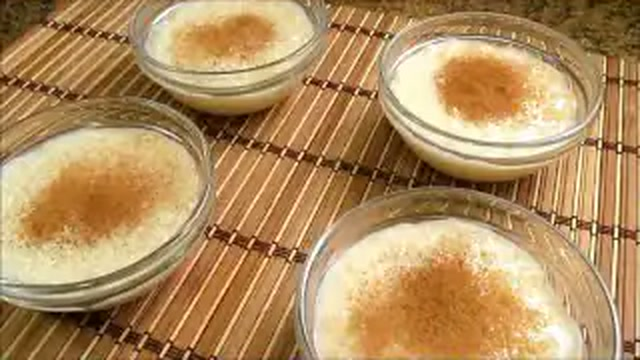
- Servir templado o frío. Opciones de acabado tradicional: espolvorear con canela de Ceylán molida o cubrir con azúcar y quemar con soplete para crear una costra crujiente estilo crema tostada.

### ⏱️ Protocolo de Conservación y Batch Cooking
- **Refrigeración (0°C a 3°C):** 4-5 días en nevera cubierto con film transparente a piel.
- **Congelación (-18°C):** No apto (el grano de arroz cocido se desmorona y pierde cremosidad).
- **Envasado al Vacío:** 7 días en frío.

### 🔥 Guía de Regeneración Multicanal
- Consumir frío de nevera o atemperado 15 minutos a temperatura ambiente.

---

## 🥮 Leche Frita Tradicional con Costra Crujiente de Azúcar y Canela

> 📺 **Vídeo y Receta Oficial:** [Ver en Hogarmania / Karlos Arguiñano: Leche Frita Tradicional con Costra Crujiente de Azúcar y Canela](https://www.hogarmania.com/cocina/recetas/)
> 📊 **Infografía Educativa TouChef:** [Ver Infografía Técnica](assets/infografia_leche_frita_tradicional_con_costra_crujiente_de.jpg)

### 📋 Ficha Técnica y Resumen
| Parámetro | Valor |
|---|---|
| **Tiempo de Preparación** | 20 min (+ 3h enfriado) |
| **Tiempo de Cocción** | 20 min |
| **Dificultad** | Fácil-Media |
| **Raciones** | 6 raciones (12-16 porciones) |
| **Coste Estimado** | Económico (€) |

### ⚠️ Matriz Oficial de Alérgenos (Reglamento UE 1169/2011)
| Alérgeno | Presencia | Ingrediente / Detalle |
|---|:---:|---|
| **Gluten** | 🟢 SÍ | Presente en la harina de trigo (masa y rebozado) |
| **Crustáceos** | ⚪ NO | Ausente (posibles trazas en obrador) |
| **Huevos** | 🟢 SÍ | Presente en la masa (yemas) y rebozado de fritura |
| **Pescado** | ⚪ NO | Ausente (posibles trazas en obrador) |
| **Cacahuetes** | ⚪ NO | Ausente (posibles trazas en obrador) |
| **Soja** | ⚪ NO | Ausente (posibles trazas en obrador) |
| **Lácteos** | 🟢 SÍ | Presente en la leche entera y mantequilla |
| **Frutos de cáscara** | ⚪ NO | Ausente (posibles trazas en obrador) |
| **Apio** | ⚪ NO | Ausente (posibles trazas en obrador) |
| **Mostaza** | ⚪ NO | Ausente (posibles trazas en obrador) |
| **Sésamo** | ⚪ NO | Ausente (posibles trazas en obrador) |
| **Sulfitos** | ⚪ NO | Ausente (posibles trazas en obrador) |
| **Altramuces** | ⚪ NO | Ausente (posibles trazas en obrador) |
| **Moluscos** | ⚪ NO | Ausente (posibles trazas en obrador) |

### ⚖️ Ingredientes Exactos (Mise en Place)

- **Leche entera de caserío**: 750 ml
- **Almidón de maíz (Maicena)**: 60 g
- **Harina de trigo común**: 30 g (para la masa) + 50 g (para rebozar)
- **Azúcar blanquilla**: 120 g (para la masa) + 80 g (para rebozado final)
- **Yemas de huevo campero**: 3 uds
- **Rama de canela**: 1 ud (5 g)
- **Piel de limón**: 1 tira
- **Huevos batidos para rebozar**: 2 uds
- **Canela en polvo para rebozado**: 1 cda colmada (10 g)
- **Aceite de oliva virgen extra o de girasol alto oleico para freír**: 300 ml

### 🔪 Equipamiento y Utillaje Necesario
- Fuente rectangular plana (tipo pírex de 20x30 cm)
- Cazo para infusionar y varillas manuales
- Cuchillo cocinero para corte en dados
- Sartén honda para fritura y espumadera

### 👨‍🍳 Paso a Paso Técnico y Minucioso

1. **Infusión y masa de leche espesa:** Infusionar 550 ml de leche con la canela y la piel de limón a fuego lento. En un bol, disolver la Maicena y la harina en los 200 ml de leche fría restante, batiendo con las yemas y los 120 g de azúcar. Colar la leche hirviendo sobre la mezcla, devolver a la cazuela y cocer a fuego medio-bajo sin parar de batir con varillas durante 5 minutos hasta que espese y se despegue de las paredes.
2. **Moldeado y enfriado:** Verter la crema caliente en la fuente engrasada formando una plancha de 2 cm de grosor. Cubrir con film a piel y dejar enfriar en nevera mínimo 3 horas (idealmente toda la noche).
3. **Corte y rebozado:** Cortar la masa fría y firme en rectángulos o cuadrados de 4x4 cm. Pasarlos con delicadeza primero por harina tamizada y luego por huevo batido.
4. **Fritura y costra crujiente:** Freír en abundante aceite caliente a 180°C durante 45-60 segundos por cara hasta que adquieran un dorado crujiente y uniforme. Sacar a papel absorbente y, de inmediato en caliente, rebozar por la mezcla de azúcar y canela molida.

### 🍽️ Emplatado y Textura Final

- Servir templada. El exterior ofrece un bocado crocante aromático a canela y azúcar, mientras que el interior explota en una bechamel dulce líquida y fundente.

### ⏱️ Protocolo de Conservación y Batch Cooking
- **Refrigeración (0°C a 3°C):** La masa cuajada aguanta 3 días en nevera antes de freír. Frita, consumir en 24h.
- **Congelación (-18°C):** Se pueden congelar los bloques cortados y enharinados antes de freír (2 meses). Freír directamente congelados en aceite a 170°C.
- **Envasado al Vacío:** No recomendado.

### 🔥 Guía de Regeneración Multicanal
- **Horno Convectivo:** 3 minutos a 180°C para devolver el crujiente exterior sin resecar el corazón.

---

## 🍞 Torrijas Caramelizadas de Pan Brioche Empapadas en Leche Aromatizada

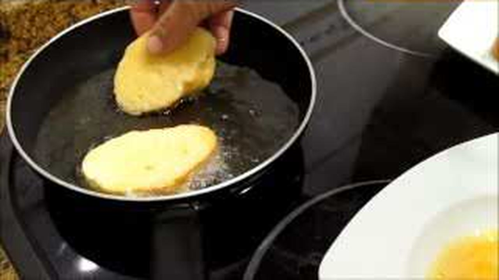

> 📺 **Vídeo y Receta Oficial:** [Ver en Hogarmania / Karlos Arguiñano: Torrijas Caramelizadas de Pan Brioche Empapadas en Leche Aromatizada](https://www.hogarmania.com/cocina/recetas/)
> 📊 **Infografía Educativa TouChef:** [Ver Infografía Técnica](assets/infografia_torrijas_caramelizadas_de_pan_brioche_empapad.jpg)

### 📋 Ficha Técnica y Resumen
| Parámetro | Valor |
|---|---|
| **Tiempo de Preparación** | 15 min (+ 1h remojo) |
| **Tiempo de Cocción** | 15 min |
| **Dificultad** | Fácil |
| **Raciones** | 6 raciones (6 torrijas gruesas) |
| **Coste Estimado** | Económico (€) |

### ⚠️ Matriz Oficial de Alérgenos (Reglamento UE 1169/2011)
| Alérgeno | Presencia | Ingrediente / Detalle |
|---|:---:|---|
| **Gluten** | 🟢 SÍ | Presente en el pan brioche artesanal (harina de trigo) |
| **Crustáceos** | ⚪ NO | Ausente (posibles trazas en obrador) |
| **Huevos** | 🟢 SÍ | Presente en la masa del brioche y en el rebozado |
| **Pescado** | ⚪ NO | Ausente (posibles trazas en obrador) |
| **Cacahuetes** | ⚪ NO | Ausente (posibles trazas en obrador) |
| **Soja** | ⚪ NO | Ausente (posibles trazas en obrador) |
| **Lácteos** | 🟢 SÍ | Presente en la leche entera, nata y mantequilla |
| **Frutos de cáscara** | ⚪ NO | Ausente (posibles trazas en obrador) |
| **Apio** | ⚪ NO | Ausente (posibles trazas en obrador) |
| **Mostaza** | ⚪ NO | Ausente (posibles trazas en obrador) |
| **Sésamo** | ⚪ NO | Ausente (posibles trazas en obrador) |
| **Sulfitos** | 🟢 SÍ | Presente en el toque de licor / anís tradicional |
| **Altramuces** | ⚪ NO | Ausente (posibles trazas en obrador) |
| **Moluscos** | ⚪ NO | Ausente (posibles trazas en obrador) |

### ⚖️ Ingredientes Exactos (Mise en Place)
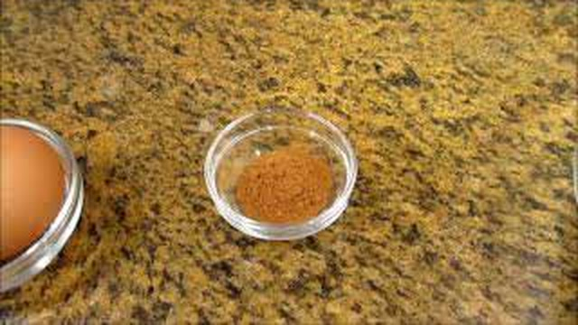
- **Pan brioche artesanal o pan de torrija de miga densa**: 1 barra (6 rebanadas de 3.5 cm de grosor)
- **Leche entera fresca de caserío**: 600 ml
- **Nata líquida (35% M.G.)**: 200 ml
- **Yemas de huevo campero**: 3 uds
- **Azúcar blanquilla**: 100 g (infusión) + 60 g (caramelizado)
- **Rama de canela y vaina de vainilla abierta**: 1 ud de cada
- **Corteza de limón y naranja**: 2 tiras
- **Mantequilla de caserío**: 40 g (para dorar en sartén)
- **Chorro de licor de anís dulce o ron**: 20 ml

### 🔪 Equipamiento y Utillaje Necesario
- Fuente amplia y honda para el baño de remojo
- Sartén antiadherente amplia
- Espátula ancha de silicona
- Soplete de repostería o pala de quemar

### 👨‍🍳 Paso a Paso Técnico y Minucioso
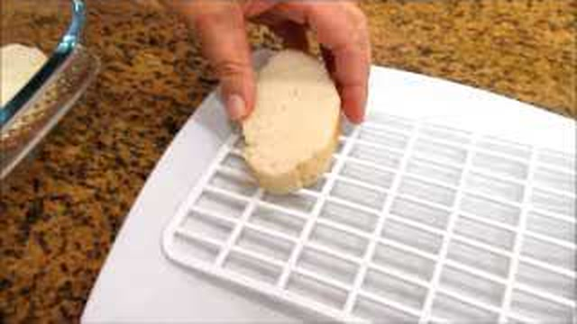
1. **Infusión láctea enriquecida:** Hervir la leche y la nata con la canela, la vainilla, las cortezas de cítricos, el licor y los 100 g de azúcar. Dejar templar 15 min y colar. Batir las yemas de huevo e incorporarlas al líquido tibio.
2. **Embebido profundo del brioche:** Colocar las rebanadas gruesas de pan brioche en la fuente honda. Verter la mezcla láctea por encima y dejar que el pan absorba el 100% del líquido durante 45-60 minutos, volteando con sumo cuidado a mitad de tiempo. Las rebanadas deben quedar convertidas en flanes tiernos pero sin romperse.
3. **Marcado en mantequilla:** En una sartén antiadherente a fuego medio, fundir 20 g de mantequilla. Dorar las torrijas con cuidado durante 2 minutos por cara hasta que adquieran un color dorado mantecoso.
4. **Caramelizado crujiente:** Disponer las torrijas en plato, espolvorear una capa generosa de azúcar sobre la cara superior y quemar con el soplete hasta lograr una capa de caramelo cristalizado y crujiente como la crema catalana.

### 🍽️ Emplatado y Textura Final

- Servir templadas acompañadas de una bola de helado de queso Idiazábal, leche merengada o vainilla. Al romper la costra de caramelo con la cuchara, el interior fluye cremoso y aromático.

### ⏱️ Protocolo de Conservación y Batch Cooking
- **Refrigeración (0°C a 3°C):** 48 horas en nevera en recipiente cerrado.
- **Congelación (-18°C):** No congelar una vez empapadas o cocinadas.
- **Envasado al Vacío:** No apto.

### 🔥 Guía de Regeneración Multicanal
- **Sartén:** 1 minuto a fuego mínimo con nuez de mantequilla y caramelizar de nuevo con soplete.
- **Microondas:** 20 segundos a 600W (pierde el crujiente del caramelo).

---

## 🥜 Intxaursalsa Tradicional Vasca de Nueces de Caserío y Leche Infusionada

> 📺 **Vídeo y Receta Oficial:** [Ver en Hogarmania / Karlos Arguiñano: Intxaursalsa Tradicional Vasca de Nueces de Caserío y Leche Infusionada](https://www.hogarmania.com/cocina/recetas/)
> 📊 **Infografía Educativa TouChef:** [Ver Infografía Técnica](assets/infografia_intxaursalsa_tradicional_vasca_de_nueces_y_le.jpg)

### 📋 Ficha Técnica y Resumen
| Parámetro | Valor |
|---|---|
| **Tiempo de Preparación** | 15 min |
| **Tiempo de Cocción** | 45 min |
| **Dificultad** | Fácil |
| **Raciones** | 6 raciones |
| **Coste Estimado** | Medio (€€) |

### ⚠️ Matriz Oficial de Alérgenos (Reglamento UE 1169/2011)
| Alérgeno | Presencia | Ingrediente / Detalle |
|---|:---:|---|
| **Gluten** | ⚪ NO | Ausente (versión tradicional de crema sin harina) |
| **Crustáceos** | ⚪ NO | Ausente (posibles trazas en obrador) |
| **Huevos** | ⚪ NO | Ausente (posibles trazas en obrador) |
| **Pescado** | ⚪ NO | Ausente (posibles trazas en obrador) |
| **Cacahuetes** | ⚪ NO | Ausente (posibles trazas en obrador) |
| **Soja** | ⚪ NO | Ausente (posibles trazas en obrador) |
| **Lácteos** | 🟢 SÍ | Presente en la leche entera de caserío |
| **Frutos de cáscara** | 🟢 SÍ | Presente en las nueces del país peladas y molidas |
| **Apio** | ⚪ NO | Ausente (posibles trazas en obrador) |
| **Mostaza** | ⚪ NO | Ausente (posibles trazas en obrador) |
| **Sésamo** | ⚪ NO | Ausente (posibles trazas en obrador) |
| **Sulfitos** | ⚪ NO | Ausente (posibles trazas en obrador) |
| **Altramuces** | ⚪ NO | Ausente (posibles trazas en obrador) |
| **Moluscos** | ⚪ NO | Ausente (posibles trazas en obrador) |

### ⚖️ Ingredientes Exactos (Mise en Place)
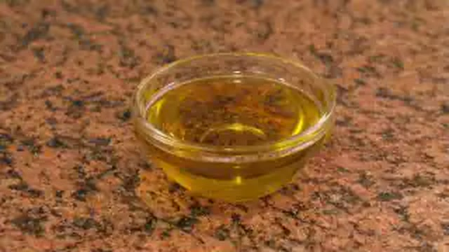
- **Nueces del país (Euskal Ezkurra / Caserío) peladas**: 300 g
- **Leche entera fresca de caserío**: 1 L
- **Azúcar blanquilla**: 180 g
- **Rama de canela**: 1 ud (5 g)
- **Piel de limón ecológico**: 1 tira
- **Nueces enteras caramelizadas para decorar**: 6 uds (30 g)
- **Hojas de menta fresca**: 6 brotes

### 🔪 Equipamiento y Utillaje Necesario
- Procesador de alimentos / picadora para nueces
- Cazuela ancha de fondo grueso
- Cuchara de madera tradicional
- Copas o cuencos de barro de presentación

### 👨‍🍳 Paso a Paso Técnico y Minucioso

1. **Molienda de las nueces:** Picar y moler los 300 g de nueces peladas en procesador hasta obtener un polvo muy fino con textura de harina gruesa, sin llegar a extraer todo el aceite en pasta.
2. **Infusión inicial:** En una cazuela amplia de fondo difusor, verter el litro de leche entera con la rama de canela, la piel de limón y los 180 g de azúcar. Llevar a ebullición suave hasta disolver el azúcar.
3. **Cocción lenta y reducción (intxaursalsa):** Retirar la canela y la piel de limón. Incorporar la nuez molida a la leche. Bajar el fuego al mínimo y cocer a fuego lento durante 40-45 minutos, removiendo de forma continua con la cuchara de madera para evitar que la nuez se pegue al fondo. A medida que evapora la leche y la nuez libera sus aceites y almidones naturales, la crema adquiere una textura espesa aterciopelada similar a una natilla densa de color pardo.
4. **Enfriado y densificación:** Retirar del fuego y verter en cuencos de barro o copas individuales. Al enfriar tomará aún mayor cuerpo y untuosidad.

### 🍽️ Emplatado y Textura Final

- Servir tibia o fría de la nevera decorada con media nuez caramelizada y una hojita de menta fresca. El sabor es intensamente navideño, dulce, lácteo y con el profundo matiz rústico de la nuez tostada.

### ⏱️ Protocolo de Conservación y Batch Cooking
- **Refrigeración (0°C a 3°C):** 5 días en recipiente hermético en nevera.
- **Congelación (-18°C):** 2 meses (descongelar 24h en refrigeración y batir con varillas para regenerar la emulsión).
- **Envasado al Vacío:** 10 días en frío.

### 🔥 Guía de Regeneración Multicanal
- **Cazo:** 3 minutos a fuego muy suave removiendo con espátula si se desea consumir caliente.
- Servir fría directamente de la nevera.
